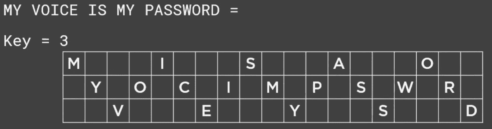

# 第十六章：使用密码学

如果你是**密码学**的新手，我们来谈谈它的目的。我会尽量让它简单易懂，因为对于一些人来说，密码学可能让人感到难以应对。

密码学的核心就是保护数据，通常是以消息或文件的形式。这可以通过将数据转换成不可读的格式来实现，这种格式通常被称为**密文**。将密文转换回可读数据的唯一方法是使用**特殊密钥**，只有发送者和接收者才能访问该密钥。这个过程叫做**加密**，它是密码学工作原理的基础。

当你读完本章后，我希望你能带着更广泛的视角和对密码学在保护信息和数字通信方面的核心作用有更深入的理解。

本章我们将讨论以下内容：

+   理解密码学

+   标准与协议

+   密码学的对策

让我们首先讨论密码学为何对我们的安全工作至关重要。

# 理解密码学

在本节中，我们将讨论为什么密码学如此重要，以及一些可供我们使用的最佳密码学工具和资源。掌握适当的工具和资源对你作为一名安全专家来说将是非常宝贵的。所以，让我们开始讨论这究竟是什么。

## 为什么要使用密码学？

那么，密码学为我们带来了什么呢？它带来了**不可否认性**。这意味着发送消息的人不能后悔或否认自己修改了文档。例如，*“不是我，Dale，我发誓，”* 我会回答，*“不，是你，因为它是用你的密钥加密的。”*

密码学还带来了**认证**功能。有时我们访问网站时，验证我们身份的真实性至关重要，显然，我们也想验证我们的信用卡信息，对吧？所以，这对我们来说非常重要，尤其是对我们行业中的人们而言。

当然，**保密性**是密码学能为我们做的另一大重要因素。就保密性而言，我们只能将某些资源提供给授权用户。至于这个过程是如何运作的，或者说密码学如何运作，这些内容都是非常基础或初步的。过程如下。

我们有**明文**；这是可以格式化并且我们可以读取的文本。它可能是一个 Word 文档，可能是一个电子邮件，但它会通过某种算法进行加密，例如**数据加密标准**（**DES**）或**高级加密标准**（**AES**），甚至是**里维斯—沙米尔—阿德尔曼**（**RSA**）。加密应用后，我们称整个文档为密文。它完全无法读取。这个文件随后会被传输，在另一端，它会经历相反的过程，对吗？密文会使用已知的密钥进行解密，然后给我们展示原始发送者或资源希望我们看到的明文。

加密学是确保我们信息安全的重要组成部分，并且在各种不同的应用中都得到了广泛使用。从我们的电子邮件到金融信息，都受到加密技术的保护，因此理解其工作原理非常重要。

看吧？我告诉过你这很简单。

接下来，让我们谈谈加密技术的类型。

## 加密技术的类型

这个话题没有太多要讲的，因为你猜怎么着？它只有两种类型：对称加密和非对称加密：

+   **对称加密**完全是使用相同的密钥进行加密和解密。因此，我们有一个发送方和一个接收方，他们将使用相同的密钥加密他们想要往返发送的消息。它非常快速，也非常高效，但也有几个主要的缺点：

    +   第一个问题是，如果你丢失了那个密钥，那么你就失去了对加密信息的所有访问权限。

    +   其次，管理大规模的对称加密部署非常困难。

+   **非对称加密**几乎可以说是与对称加密的完全对立。与使用一个密钥进行加密和解密不同，非对称加密使用两个密钥，一个公钥和一个私钥：

    1.  第一个密钥是**公钥**，它是任何人都可以访问的密钥。

    1.  第二个密钥是**私钥**，它应该仅为所有者所知。绝不应将其交给其他任何人。而且，关于这一点的好消息是，如果你使用公钥加密信息，那么解密它的唯一方式就是使用相应的私钥。因此，即使有人拦截了消息，他们也无法做任何事情，因为他们没有私钥的访问权限。

非对称加密的另一个优点是，它不需要像对称加密那样进行安全的初始密钥交换。因此，在这方面它稍微更安全。它不是完美的，但肯定更安全。

非对称加密也使用**数字签名**。数字签名只是确保消息在传输过程中没有被篡改的一种方式。其工作原理是，消息的发送者使用他们的私钥对消息进行加密，并将消息和他们的公钥一起发送给接收者。接收者可以使用发送者的公钥解密消息，然后将其与原始消息进行对比，确保消息未被篡改。

当然，它也有一些缺点。它比对称加密略慢一点（我们说的是半个眼皮眨眼的时间和完全眨眼的时间），而且也需要更多的带宽。但总体来说，这是一种更安全的信息传输方式。现在，没有什么是万无一失的，对吧？如果通过这一系列的内容我教会了你什么，那就是总有破解的办法。对于非对称加密，它容易受到**中间人攻击**（**MITM**）和**暴力破解**攻击的威胁。而且，不幸的是，如果私钥丢失了，那么就没有办法解密用它加密的信息。

接下来我们讨论一些其他的密钥。

### GAK

**政府访问密钥**（**GAK**）是美国**国家安全局**（**NSA**）提出的一个系统，旨在允许政府访问加密通信。该密钥将是一个数学值，用于解密消息。这样的密钥的存在将使 NSA 能够读取加密通信，包括公民和企业之间的通信，以及不同国家之间的通信。

这个系统的问题在于，它需要一个极其复杂且难以生成的密钥。当然，NSA 需要完全保密这个密钥。如果这个密钥泄露出去，那么任何人都可以用它来读取加密通信。有没有人看过 1991 年上映的电影*《偷天换日》*，主演是罗伯特·雷德福？这部电影可谓预测了加密技术的未来！(*Dale 的家庭作业：观看这部电影！*)

GAK 的另一个问题是，它将非常难以实现。任何对企业和政府所使用的加密算法的更改都需要经过 NSA 的批准。这将赋予 NSA 巨大的权力，而且目前还不清楚是否可以信任他们拥有如此大的权力。

同样值得注意的是，NSA 并不是唯一一个对读取加密通信感兴趣的政府机构。英国的**政府通信总部**（**GCHQ**）也表达了对一种可以让他们读取加密通信的系统的兴趣。

接下来我们继续讨论另一个加密工具，叫做**密码**。

## 了解密码

我们在谈论密码时，其实是在讨论一个算法。你可以把它看作是一个定义好的步骤序列，必须按照这个序列来执行加密和解密过程。一旦消息或数据通过某种密码加密，它就会被认为是不可读的，除非接收消息或数据的人知道解密所需的秘密密钥。

现在，信不信由你，密码实际上无处不在，不仅仅是在我们的电子邮件和数据中，我们还在其他通讯技术中使用它们，比如手机。这使得我们的手机通话更加安全。

### 密码类型

现在，我知道你在想什么：*“Dale，只有一种密码吗？”* 不，实际上有几种不同类型的密码。我们可以将它们分为两种类型，要么是经典的，要么是现代的。我知道，这听起来像是我们要讨论艺术，但我们并不会讨论这个。

让我们来看一下经典密码和现代密码。

#### 经典密码

**经典密码**是指在计算机发明之前开发的密码。它们包括经典密码，例如**凯撒密码**，这是一种简单的**替换密码**，其中每个字母都根据定义的模式替换为另一个字母。*图 16.1*是凯撒密码的示例：

图 16.1 – 凯撒密码示例（简单的字母替换）

所以，在这个例子中，**MY VOICE IS MY PASSWORD**，如你所见，会被转换为 **DB XGOET OL DB HALLCGKR**。我们所做的就是基本上将**M**替换为另一个字母，在这个例子中是**D**。注意到**DB**在两个实例中都代表**MY**。这将帮助我在有足够时间的情况下，弄清楚如何解密这条消息。

另一种经典密码被称为**换位密码**。在换位密码中，你使用一种被称为**密钥**的东西。现在，根据你使用的换位密码，这里我展示的是（在*图 16.2*中）一种被称为**铁路线密码**：

图 16.2 – 铁路线密码示例

在这种情况下，密钥是**3**，意味着字符之间有三个空格。你可以看到，**MY VOICE IS MY PASSWORD**被以这种上下排列的方法拼写出来，中间的空格几乎完全被忽略。所以，第一行最终变成了**MISAO**，而下一行的代码则变成了**YOCIMPSWR**，第三行则变成了**VEYSD**。显然，接收方需要知道密钥是**3**才能解密此消息。

另一种换位密码是**路线密码**。使用路线密码时，我们会对要加密的相同数据或信息进行处理。在*图 16.3*中，我将使用文本**MY VOICE IS MY PASSWORD**，并像这样排列它：

图 16.3 – 路由密码示例

你能看到所有内容吗？它将明文按照网格模式展示，就像这样，当然，最后两个字符只是随机字符。这种类型的密码是根据路由决定的。

这些只是经典密码的一些快速示例。

接下来让我们来看一下现代密码。

#### 现代密码

你可以看到经典密码类型是多么容易被破解。现代密码相对来说更难手动破解。通常，现代密码的目的是为发送者提供真实性、安全性和完整性。

你将看到的现代密码类型包括对称密码和非对称密码。在我谈到这些时，其实有一种方法可以同时使用非对称和对称密码，但这可能有些深入，因此我就不在这里展开讲解了，如果你想深入研究，可以进一步查阅相关资料。

还有一些密码是基于数据输入的。我们有一种叫做**分组密码**的密码，所谓的*分组*就是算法以比特组或固定大小的块为单位进行运算。我们今天看到的大多数密码学算法，如 DES、AES，甚至**国际数据加密算法**（**IDEA**），都是使用基于分组的密码。现在，如果传输的数据块大小小于密码本身使用的块大小，就会有一些填充，以确保它达到所需的块大小。

还有**流密码**。说到流密码，实际上就是一种对称密钥密码，其中明文数字与伪随机密码数字流相结合，我们有时称之为**密钥流**。在流密码中，每个字符一次加密一个，并且与之对应的密钥流数字也一同加密；这样我们就得到了加密文本数字流。

让我们来看一下其他类型的算法。

## 使用其他算法

在不同的算法中，我们最常见的包括**DES**、**三重 DES**（**3DES**）、**AES**和**RC4**。

让我们接下来讨论这些。

### DES

这个算法是在 1970 年代由**IBM**创建的。它使用 64 位的块大小。除此之外，它仅使用 56 位的密钥进行加密和解密，这并不是很安全。事实上，在 1999 年，这个算法就被攻破了，尤其考虑到当时的计算能力并不强大。但 DES 本身提供了多达 72 万亿种可能的加密密钥，而我们在 1999 年就攻破了它。现在，既然这个算法被攻破了，美国政府介入并提供了帮助。显然，为了弥补这一漏洞，防止其被暴力破解，我们提出了三重 DES，或者有人称之为 3DES。之所以叫 3DES，是因为它通过三次不同的密钥，重复执行 DES 算法三次。

现在，关于这些密钥的使用方法，你有几种不同的选择：

+   第一种选择是三个密钥完全不同或独立。

+   第二种选择是使用**K1**和**K3**密钥，但由于它们都用于加密，因此它们是相同的。

+   另外，还有第三种选择，那就是三个密钥相同，但这并不十分安全。

最安全的选择是第一种方式，即所有三个密钥都是独立的。

### AES

与 DES 和 3DES 相比，AES 可以算是一个完全成熟的成人。它采用 128 位的块大小，密钥长度为 128、192 或 256 位。我敢打赌，你一定猜不到它们各自的名字，对吧？它们分别被称为**AES128**、**AES192**和**AES256**。这有点难猜，是吧？AES 是一种对称密钥算法，创建时得到了**国家标准与技术研究院**（**NIST**）的帮助。政府机构用它来加密被认为是非机密的数据。

### RC4

有些人称之为**Ron Rivest**。Ron 是帮助创建这个密码的先生的名字，但这个密码叫做 Ron Rivest，它是**Rivest Cipher 4**。这个密码被认为是一个可变密钥长度的对称密钥流密码。老实说，它并不好，因为你知道吗？我们在**有线等效隐私**（**WEP**）中使用这个加密算法，而 WEP 是一个被非常容易攻破的无线安全协议。

RC4 之所以容易受到多种攻击，是因为它存在所谓的**偏置输出**。有一个规则，如果其原始状态下第三个字节为*0*，而第二个字节不等于*2*，则意味着第二个输出字节总是*0*。现在，这可能看起来有些复杂，但相信我，一旦我们看到像这样的模式，我们就能通过逆向工程破译这个密码。这就是 WEP 被攻破的原因。

另外两个我们应该熟悉的算法是**Blowfish**和**Twofish**。

### Blowfish 和 Twofish

Blowfish 算法是在 1993 年开发的，我知道你会想，*“Dale，那是很久以前的事了。”* 但它仍然是一个非常强大的对称块加密算法，我们今天仍在使用。它使用相同的密钥来加密和解密。它采用 64 位块，密钥的长度从 32 位到 448 位不等。这个协议设计的目的是替代 DES 和三重 DES。

现在，可能会让你感到惊讶的是，很多人仍然喜欢使用 AES，我想这没什么错，但你需要知道 Blowfish 的一个优势就是它的速度。它将数据拆分为 64 位块，而 AES 使用的是 128 位块，从而实现更快的加密和解密。

我们还有一个叫做 Twofish 的加密算法。这种加密算法是在 Blowfish 后几年创建的。它是在 1998 年推出的，与 Blowfish 算法非常相似。这就是我们这里有相似名字的原因，但它像 AES 一样使用 128 位块进行数据加密。实际上，Twofish 与 AES 非常相似，因为它支持 256 位块，以及 192 或 128 位的密钥大小。而且，和 Blowfish 一样，它使用单一的密钥。

接下来是 **Threefish**，它是在 2008 年开发的，是 Skein 算法的一部分。它是一种 12 轮 Feistel 网络加密算法，块大小为 128 位，密钥长度为 256 位。Threefish 非常快速且安全，具有很高的抗攻击能力。

现在，这两个加密算法之所以非常受欢迎的另一个原因是，它们没有被专利保护。它们是开源的。事实上，Twofish 曾是美国政府用来替代 DES 的五个最终候选算法之一，但不幸的是，它没有获胜。*不过我想它赢得了“最具亲和力奖”。现在我只是开玩笑。*

所以，现在我们已经讨论了最流行的算法，在接下来的部分中，我们将讨论标准和协议。

# 标准和协议

让我们来谈谈一些我们在外面看到的最常见的标准。在这一部分，我们将讨论更多的算法、哈希、加密算法以及其他加密机制，帮助你保护数据和通信的安全。

## DSA

这是一个联邦信息处理标准，用于创建数字签名。这个签名标准的工作原理是，它创建一个 320 位的数字签名，但签名还伴随着 512 位到 1024 位的安全性。它还利用我们的私钥和公钥技术或过程。

## RSA

嘿，你知道吗？RSA 是创始人的首字母缩写。*R* 代表与 RC4 中的 *Ron Rivest* 相同的那位，还有另外两位先生。*S* 代表 *Shamir*，而 *A* 代表 *Alderman*。这三位先生都在**麻省理工学院**（**MIT**）工作过。Rivest 和 Shamir 是计算机科学家，Alderman 是一位数学家。

现在，RSA 还使用公钥加密系统，并且以两个大质数为基础。今天我们看到 RSA 是很多操作系统中的标准：微软、苹果、Sun Microsystems，并且广泛应用于网络卡、智能卡，甚至我们所说的硬件加密手机。现在，这可能会让你有点脑袋疼，但让我简要介绍一下它是如何工作的：

1.  首先，选择两个大的质数，我们称它们为 *A* 和 *B*。这两个质数及其乘积通过设置 *C* 等于 *A* 和 *B* 的乘积来确定，*C*（数学上我们可以表示为 *C=AB*），因此 *C* 被称为 **模数**。

1.  RSA 然后选择另一个称为 *E* 的数字，它小于 *C* 并且与 *(A-1)(B-1)* 互质。这样做的目的是确保 *E* 和 *A-1 x B-1* 之间除了数字 *1* 外没有其他共同因子。

1.  我知道，这越来越好，因为接下来 RSA 选择了另一个数字 *F*，并且这样做是为了让 *EF-1* 能被 *A-1 x B-1* 整除。

1.  现在，一些 *代数爱好者* 跟得上了。但等一下，还有更多内容。*E* 和 *F* 的值分别被称为公钥和私钥的指数。使用这些指数时，公钥通过将 *C* 和 *E* 配对来生成，而私钥则是通过将 *C* 和 *F* 配对来生成。

现在，这种加密方法之所以非常安全，是因为从公钥获取私钥被认为是极其困难的。显然，如果有人能够将 *C* 因式分解为 *A* 和 *B*，那么那个人就可以解密私钥，但几乎不可能有人能够获取这两个随机选择的质数。所以，这对于我们来说再次提高了安全性。

## 哈希

我开始饿了。感觉土豆饼或者一些美味的卷心菜和炖肉非常好吃。我得把食物从脑袋里赶出去！

关于 **哈希**，我们试图做的是找出一种方式来验证特定文档是否未被更改。我们想知道它是否合法，是否已经签名，并且没有人修改或篡改它。我们通过将文档与一个 **数字签名** 相关联来做到这一点。这个签名用十六进制代码表示。这个代码告诉我们文档的默认值，如果它等于十六进制代码数字，我们就知道它是合法的，已经签名，并且没有被更改。这同样适用于可执行文件或电子邮件。但是，如果文档或可执行文件被修改了，那么哈希值就无法正常工作，或者计算结果不正确。

## 消息摘要

当我们谈论加密时，有一件事情我们需要记住，那就是**消息摘要**。消息摘要也被称为**哈希值**。它的作用是取一块数据并生成该数据的唯一指纹或哈希值。这很重要，因为当我们谈论认证时，我们是在确保数据没有被以任何方式更改。因此，这使我们能够查看消息并能够说：“好的，这正是发送的内容。它没有被以任何方式更改。”

另一种哈希方法被称为**安全哈希算法 1**（**SHA-1**），于 1993 年由 NSA 引入。现在，它的功能是接受输入并生成一个 160 位的哈希值，然后将其转换为十六进制，一旦转换完成，大约有 40 个字符长。它通常与其他协议或安全协议一起使用，例如**Pretty Good Privacy**（**PGP**）、**传输层安全**（**TLS**）、**安全外壳**（**SSH**）和**安全套接字层**（**SSL**）。

现在，我知道你可能在想什么：“*戴尔，为什么我们从 1 开始？SHA-0 在哪里？”* 嗯，**SHA-0**是 160 位的，但是它太糟糕了，因为存在一个重大缺陷而被淘汰。然后，他们显然推出了**SHA-2**。现在，SHA-2 与 SHA-1 非常相似，但它使用 256 位，比 SHA-1 更强大和更大。而且，我所说的是它可以使用两种不同的块大小，要么是**SHA256**，给你一个**32 位字**，要么是**SHA256**，双倍，**64 位**，对吧？猜猜看？

然后他们推出了**SHA-3**。它不像 SHA-2，后者类似于 SHA-1（而 SHA-1 类似于 SHA-0）；SHA-3 唯一相似之处在于其名称。它被称为完全不同的东西的原因是它使用了所谓的**海绵构造**。数据被吸收，或者输入被吸收，输出或结果被挤出来。在吸收过程中，消息块本身被异或到状态的初始位或子集中。然后，使用排列函数转换该子集。所以，是的，这有点困难。

所以，现在我们已经掌握了这些不同类型的密码，有一些密码是为消息设计的。

## 为消息设计的密码

我们首先从**基于哈希的消息认证码**（**HMAC**）开始。该算法包括嵌入哈希函数，例如 SHA-1 或**消息摘要算法**（**MD5**）。它的强度取决于嵌入的哈希函数、密钥大小和哈希输出的大小。

HMAC 的操作方式是有两个不同的阶段。在这些阶段中，创建了一个秘密密钥。有一个用于*innie*，一个用于*outie*。我知道，我刚刚开了一个*肚脐*笑话。它是**内部**和**外部**，但概念是相同的。

算法的第一次运算产生了一个内部哈希值，该值由消息和内部密钥衍生出来。第二次运算包括最终的 HMAC 代码，该代码由内部哈希结果和外部密钥衍生出来。现在，HMAC 本身并不加密消息，而是将消息（无论它是否加密）与 HMAC 哈希一起发送。这样，双方都可以使用秘密密钥验证消息是否来自声称的发送方，或者它的真实性是否正确。

接下来我们讨论另一种认证机制。

### CHAP

**变更握手认证协议**（**CHAP**）是我们通过**点对点协议**（**PPP**）和三次握手使用的一种认证机制。CHAP 提供了一种防范我们所称的**重放攻击**的方法。现在，CHAP 的缺点是它使用共享密钥的方式，客户端和服务器必须知道密钥的明文。搞笑的是，微软推出了他们自己的 CHAP 版本（叫做**MS-CHAP**），它不需要发送方或接收方知道明文，也不传输明文，但它也曾被黑客攻破。

### EAP

**可扩展认证协议**（**EAP**）最初是为点对点通信设计的。它作为 CHAP 的替代方案，也用于替代**密码认证协议**（**PAP**）。我没有讲 PAP，因为它已经过时。EAP 本身更安全，并且支持不同的认证机制，比如使用一次性密码、标准密码或智能令牌。

接下来我们来讨论一下**公钥基础设施**（**PKI**）。

## 简单的 PKI

PKI 是非对称的，这意味着我们有两把密钥来确保信息被加密，并且只有适当的各方才能解密。记住，在对称加密中，我们只使用一把共享密钥，而在 PKI 中，我们有两把密钥，你听我提到过公钥和私钥。接下来，让我们看看 PKI 包括哪些内容。

### 你的证书

*“嘿，Dale，你一直在说这个证书，什么是所谓的证书？”* 证书是一种用来识别组织甚至用户的方式。通常，证书是基于**X.509 标准**，并且通常包含一些字段，例如证书的有效期、到期时间、用于加密公钥的算法以及证书的颁发者。

实际上，让我快速给你展示一些东西。这里是**Packt**网站，由于我们使用的是**HTTPS**连接，这意味着它是一个安全的连接。

图 16.4 – HTTPS 站点会显示一个锁图标，表示连接是安全的。

我将在这里悬停在锁定图标上，它告诉我可以查看站点信息或证书。所以，我可以向下选择查看证书。它告诉我当前证书是有效的，无需深入查看，但让我们还是深入查看一下。你可以在这里看到，它是为了以下目的创建的：验证远程计算机的身份，并将你的身份提供给远程计算机。

图 16.5 – 证书显示了目的和有效日期

通过这种方式，Packt 可以确保他们知道自己在与谁交谈。它显示了证书的颁发对象。告诉我们这是由**Cloudflare**在其**ECC CA-3**服务器上颁发的。当然，这里的有效期是从**2021 年 6 月 6 日**到**2022 年 6 月 6 日**。我可以进入证书的**详细信息**标签，查看这里的各种信息。

图 16.6 – 详细信息标签显示更多信息

同样，我可以看到颁发者是**sha256**。我还可以再次看到有效日期和主题，基本上就是证书适用于谁。你可以看到，当他们颁发证书时，你必须填写申请，以便他们能为你颁发证书，接着他们会进行验证；在这里，Cloudflare 确认了这确实是 Packt Publishing。这样，我就无法为 Packt 创建自己的证书并将其放到网上，骗别人认为我就是 Packt Publishing。

公钥再次是**ECC（256 位）**，这就是密钥。我还可以继续向下滚动，查看有关主题备用名称的信息，他们在这里使用了通配符。

图 16.7 – 证书的更多细节，包括公钥

所以，我们在任何地方都会与证书进行交互。有时，你甚至没有意识到这一点。现在，关于证书，有两种不同的类型：

+   有一个**签名证书**，由一个公共的证书颁发机构（CA）签名并颁发证书。同样，这些证书通常包含公钥和密钥所有者的身份信息。私钥由证书颁发机构（CA）保密。

+   还有**自签名证书**。这是指证书的身份由同一组织或实体签署，证明它是经过认证的。例如，如果我想在自己的组织内创建一个证书，我将拥有自己的 CA 服务器，并从该服务器生成一个自签名证书。我们通常不使用自签名证书。事实上，你永远不应该在公开环境中使用自签名证书，只能在你自己的基础设施内使用。

看吧？我告诉你我会让 PKI 变得容易理解。

现在我们来谈谈数字签名。

### 数字签名

它的设计目的是验证特定的电子邮件或文档是否来自特定的来源。例如，如果*布鲁斯·韦恩*向*塞琳娜·凯尔*发送电子邮件，他们俩都会有与之相关联的公钥和私钥。

塞琳娜会使用她的私钥签署她的电子邮件，这样布鲁斯·韦恩就可以确认邮件确实来自她。她用私钥签署文档，这并不是物理签名，而是附加在邮件上的一段代码，表示这是塞琳娜发来的。再次强调，任何人如果愿意，也可以伪造这一签名。但这里有一个关键点。当邮件发送给布鲁斯时，他获取了塞琳娜的公钥副本。记得那个公钥吗？它是公开的，可以提供给任何人，他用公钥来验证签名，确保邮件确实来自塞琳娜。再强调一次，数字签名并不加密内容，它只是用来验证文档、邮件，甚至文件的来源。

接下来，我们将讨论通过网络加固通信的其他方式。

## SSL 和 TLS

SSL 和 TLS 都是可以用于通过不安全网络（如互联网）加密通信的加密协议。SSL 是 TLS 的前身，如今更常用的是 TLS。

SSL 和 TLS 使用对称密钥加密和非对称密钥加密的结合来加密通信。对称密钥加密用于加密数据，而非对称密钥加密用于交换密钥。SSL 和 TLS 还使用数字证书来验证实体身份并防止中间人攻击（MITM）。

当我们看 TLS 时，它会经历一个握手过程：

1.  我们将拥有一个加密的服务器，或者是包含加密信息的服务器，然后是我们的客户端系统。我们知道与该服务器或数据源相关联的有公钥和私钥。

1.  客户端向另一个客户端发送一个*Hello*消息，带有一个随机值，并告诉服务器它支持的加密算法。

1.  服务器回应发送*“嘿，你好吗？我是一个服务器。”*这叫做服务器*Hello*消息，附带服务器的随机值。服务器还会发送*“嘿，我已经跟你打完招呼了。”*如果服务器要求客户端提供证书，客户端则会将证书发送回去。

1.  然后，客户端创建一个随机的预主密钥，并用服务器证书中的公钥对其加密，然后将预主密钥发送给服务器。接下来有个有趣的地方；一旦接收到预主密钥，服务器和客户端将各自生成一个全新的主密钥和会话密钥，这些密钥都是基于预主密钥生成的。

1.  一旦它们都完成了这些步骤，客户端接着发送一条消息，表示，*“嘿，我要改变加密算法规格。”* 这个加密算法规格将基于我们刚刚生成的新会话密钥，我们将用它们来进行哈希和加密。客户端还会发送一条*“哟，我完成了”*的消息，或者**客户端完成消息**。服务器接收到更新后的加密算法规格，并切换到使用会话密钥进行对称加密的安全状态。服务器还会发送一条*“哟，我完成了”*，或**服务器完成消息**。

1.  现在，客户端和服务器都有了新的主密钥和会话密钥；它们都将开始使用这些会话密钥通过安全通道来交换数据。

从客户端到服务器、以及从服务器到客户端发送的所有消息都会被加密。这可不轻松吧？

在使用 SSL 和 TLS 时，有几个不同的工具包可供选择。我想提醒你注意的是，它可能是最流行的工具之一，但这只是一些历史信息，它被称为**OpenSSL**。现在，OpenSSL 就像是加密学的瑞士军刀，因为它是一个开源资源，这使得它非常具有吸引力，对吧？

现在，有一件事我需要警告你，那就是 OpenSSL 曾经出现了一个非常严重的问题，叫做**Heartbleed**，这是一个极其严重的漏洞。Heartbleed 漏洞允许互联网上的任何人读取受易受攻击版本的 OpenSSL 保护的系统内存。现在，别担心，它已经被修复了。提示……你会希望在准备考试时了解这个问题。

### PGP

PGP 是今年的低调之作。PGP 的起源可以追溯到 1991 年。PGP 之所以非常好，是因为我们可以用它来加密消息和文件，以及数字签名或签署文档，当然，还包括删除文档甚至压缩。事实上，PGP 加密使用的是哈希、数据压缩、对称密钥加密，最后是公钥加密的串联组合。每个步骤都使用了几种支持的算法，每个公钥都与一个用户名或电子邮件地址绑定。

让我们来看一下 PGP 是如何发生和操作的。

图 16.8 – PGP 流程

1.  当用户使用 PGP 加密数据时，PGP 会先对数据进行压缩。这种压缩有助于避免一些可以用来破解加密的攻击，因为明文中的模式已经被压缩。

1.  PGP 接着会创建一个只使用一次的随机密钥，并用这个密钥来加密明文，从而生成我们的密文。

1.  一旦加密完成，随机密钥会使用接收方的公钥进行加密。然后，这个加密数据会发送给接收方。显然，加密过程是反向进行的。

你可能在想，*“但戴尔，PGP 到今天还是很好用的，不是吗？”* 是的，它确实还是很好用。事实上，我所知道的破解或攻击 PGP 的唯一方法，就是通过安装一款恶意软件来捕获按键记录，这样他们就可以捕获输入密码时的按键。现在，在写这本书的时候，**赛门铁克**拥有 PGP，并且他们重新命名了它。现在它叫做**赛门铁克加密桌面**，而服务器组件则被称为**赛门铁克加密管理服务器**。但基本上，它仍然是 PGP。

所以，现在我们已经弄清楚这些了，来继续讨论对策吧。

# 加密学的对策

你了解我，我可不想让你们都陷入恐慌，觉得一切都完了！我们可以采取一些对策来减轻可能袭来的攻击。让我们来谈谈其中的一些对策。

EC-Council 列出了 12 个应对措施：

1.  第一个要点是，当涉及到访问加密密钥时，只有用户和应用程序才能获得访问权限。

1.  你还应该确保部署了**入侵检测系统**（**IDS**），并且你正在监控这些密钥的交换和访问，确保你有日志记录发生了什么以及何时发生的。这是以防万一你必须回过头去查看这些日志，因为某些东西被泄露了。

1.  另外，你还需要做的是，如果你计划将加密密钥存储在系统或驱动器上，你必须使用密码短语和密码。

1.  接下来这一条是为你们这些高级开发者准备的：在任何情况下，密钥都不应该放在源代码中或任何二进制文件里。

1.  现在，关于用于签署私钥转移的证书，这是一个大忌。我们绝不、绝不转移私钥。我们只需要说“不”，明白了吗？看到你同意我说的话，我心里稍微高兴一点。

1.  当涉及到对称算法时，你应该确保使用可能的最大位数。你至少应该使用 168 位或 256 位。

1.  如果你打算实现对称密钥协议的加密，你必须确保执行消息认证。

1.  至于非对称算法，你需要使用最大的可用密钥大小，至少是 1536 位或 2048 位。请说 2048 位。

1.  说到哈希算法时，请使用尽可能高位数的位数，168 位或 256 位，请！

1.  在创建或实现加密环境时，请不要做任何自制的东西。我知道你们一些开发者可能会想，*“哦，我可以做得更好一点。”* 相信我，别做！使用那些被认为是行业标准的东西。有些人会尝试创建自制的加密算法以及函数，结果不可避免地会给你们留下漏洞。

1.  我还会对每个密钥每秒的操作次数设置限制。这样，你就不会让某个人试图通过暴力破解快速找到密钥。

1.  最后，一个哈希或任何哈希函数的输出应该具有最大的位数，以便使其难以解密。

好的，看到没？这就是这 12 个内容是多么简单。这也带我们来到了结尾。所以，正如你所看到的，标准和协议对于我们处理和保护数据与通信至关重要。理解工具和流程是你成为一名有效 IT 安全专业人员所必需的。

# 摘要

保护你的资源免受攻击者侵害的主要方式之一是使用加密保护流动数据或待处理数据。作为安全专业人员，你的工作不是阻止攻击者，这几乎是不可能的。任何东西都可以被黑客攻破。你的工作是减慢他们的速度或使他们气馁，而加密技术确实能够做到这一点。

本书到此结束，但这也是你进入网络安全旅程的开始。当你为 **CEH** 考试做准备时，请记住，这并不是一项容易完成的任务。这个测试是为了确保你真正掌握了你的专业技能。

请记住，如果你还没有完全掌握我们在本书中讨论的所有概念，请再次复习。进行你自己的研究。通过我的社交媒体渠道联系我。我的热情和使命是帮助每个人和每个公司在使用技术时保持更安全。通过推特或 LinkedIn 告诉我你通过了考试或从我这里学到了一些东西。来自学生、观众和读者的评论真的让我笑容满面。而且，帮个忙……保持安全！

# 问题

在结束之前，这里有一些问题，供你测试自己对本章内容的掌握。你会在 *附录* 的 *评估* 部分找到答案：

1.  以下哪个术语也是非对称加密的别名？

    1.  一个共享密钥

    1.  哈希

    1.  一个公钥

    1.  块

1.  以下哪项是 SSL 的机制？

    1.  数据认证

    1.  存储数据的安全

    1.  验证数据

    1.  传输数据的安全

1.  以下哪种是常见的哈希协议？

    1.  RSA

    1.  MD5

    1.  DES

    1.  AES

1.  _________ 是对称加密的另一个名称。

    1.  对称密钥加密

    1.  隐写术

    1.  公钥加密

    1.  哈希
