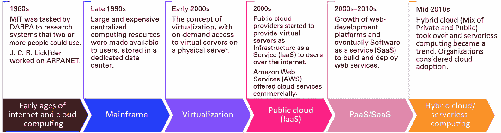
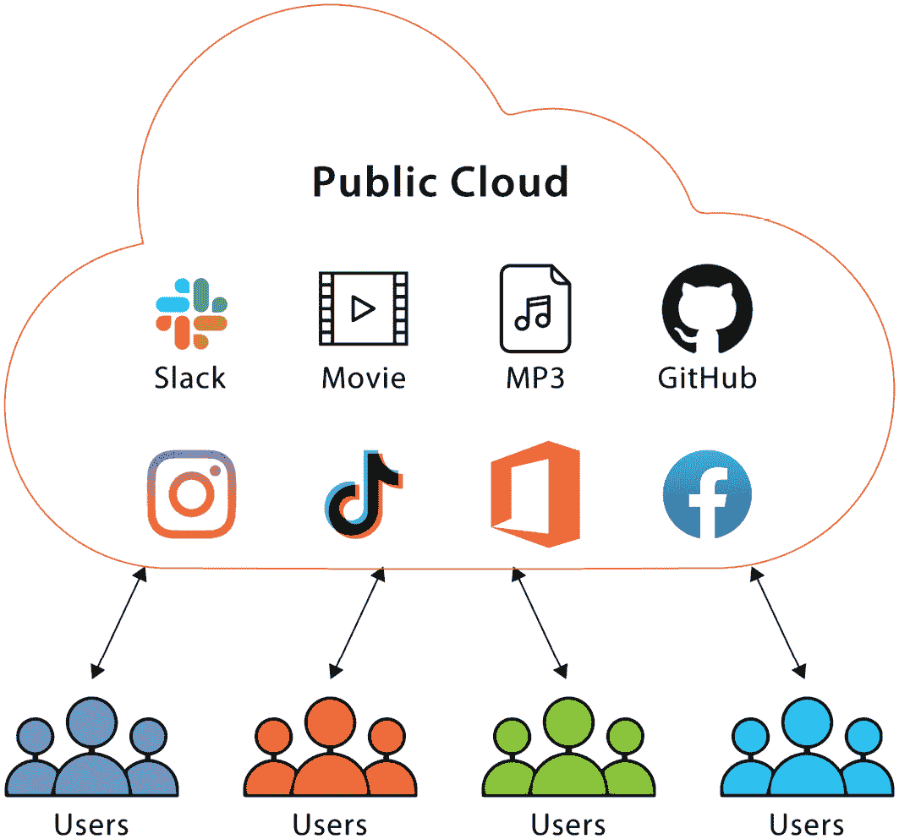
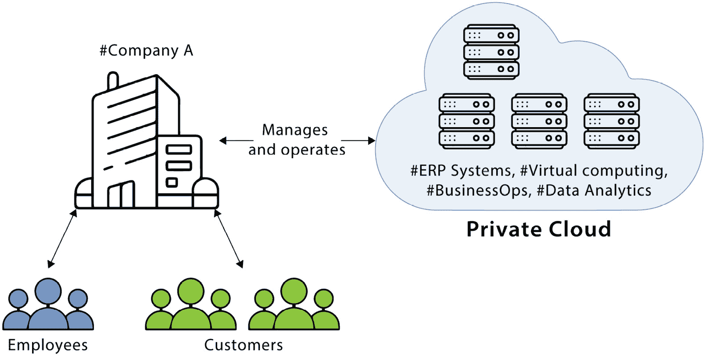
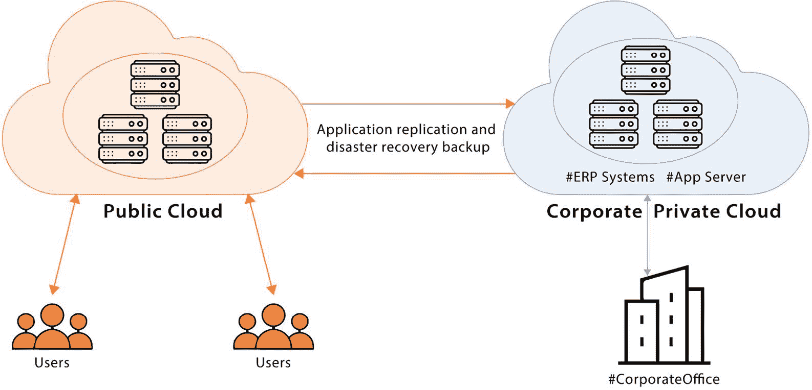
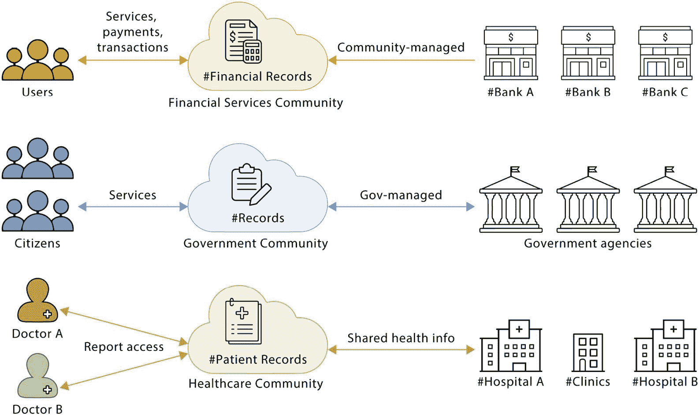

### 第一章：云计算简介

云计算已经存在多年——这个概念指的是通过互联网向用户或客户提供计算资源。尽管这个概念并不新颖，但它已以各种形式提供，并且可以以多种方式进行部署。云计算的好处在于它天生具备可扩展性、资源灵活性（意味着您可以根据计算需求选择所需的计算资源的强度）和成本效益，这使得组织更容易规划云计算的采纳。因此，组织现在正将其关键数据和业务应用程序迁移到云端，这为事件响应者在调查安全事件和数据泄露时带来了新的挑战。根据 Gartner 的报告，到 2025 年，80%的企业将转向云计算-only 策略，并逐步淘汰传统的数据中心。同时，IDG 2020 年云计算调查表明，至少 92%的公司在其业务运营中使用至少一种或多种云服务（例如，Microsoft 365 用于电子邮件等）。

事件响应者需要了解云计算的工作原理，以有效调查安全事件。事件响应者是主要负责处理与**信息技术**（**IT**）系统相关的安全事件的个人或团队。事件响应者通常会分析、调查、控制并解决安全事件。事件响应者对 IT 计算概念有深入的理解，并且掌握调查程序的深厚知识，包括数字取证。

本章将为您提供有关云计算的简要复习，涵盖诸如云计算的历史；云计算的优缺点；云服务和部署模型；以及云计算采纳对几个关键行业的影响等重要话题。

云计算的演变可以追溯到 1960 年代，当时**国防高级研究计划局**（**DARPA**）委托麻省理工学院（MIT）开发一个可以供两人或更多人使用的计算环境。1969 年，美国心理学家和计算机科学家 J.C.R. Licklider 在其**高级研究计划局网络**（**ARPANET**）的研究过程中，致力于开发允许用户从全球任何地方连接并共享信息的系统。

快进到 1990 年代，在大型主机时代，计算资源是集中提供的。互联网泡沫为网络服务通过互联网提供给消费者铺平了道路（**软件即服务**（**SaaS**））。随着云计算变得更加复杂和分布式，管理安全事件和进行取证调查的挑战也随之增加。跨不同云环境和部署模型收集和分析数据的能力对于组织快速有效地应对安全事件至关重要。下图展示了云计算从集中式主机模型到无服务器计算的演变，并突出了在应对基于云的安全事件时，持续发展取证方法的重要性。

图 1.1 – 云演化时间线

# 云计算的优势与劣势

每项技术都有其独特的复杂性和挑战，每次技术演变背后总有好的一面和坏的一面。以下是云计算的一些优势和劣势。

优势：

+   **现代化与创新**：云计算促进了新的创新。云服务提供商投资于先进的基础设施功能，使研究人员和爱好者能够研究和创新新解决方案，如**人工智能**（**AI**）、**机器学习**（**ML**）、机器人技术等。

+   **可扩展性**：显然，采用云计算的一个巨大优势是资源的易于扩展性。存储和计算能力可以根据组织、应用程序或用户需求的变化进行上下扩展，而且这一切无需进行重大硬件或软件投资。云可扩展性对于部署**端点检测与响应**（**EDR**）工具特别有用，这些工具可以帮助调查人员识别并遏制威胁，同时对受损系统进行取证。EDR 工具可能非常消耗资源，运行时需要大量的计算能力和存储容量。通过云的可扩展性，调查人员可以迅速为正在调查的系统分配额外的资源，以便运行 EDR（和其他取证）工具，使他们能够更快速、更高效地检测并应对威胁，最大程度地减少业务中断。

+   **灵活性和可达性**：您可以随时开启或关闭您的云计算资源；云计算提供了根据用户需求启用或禁用任何服务的灵活性。此外，您可以通过任何具有互联网连接的设备访问您的云服务，从而扩大应用的覆盖范围，接触到更多的远程用户。灵活性使得云服务可以在全球偏远地区提供，而无需在硬件或软件上进行额外投资来托管应用程序。具体而言，这使得法医调查人员能够快速、高效地访问来自整个 IT 环境的数据（通常通过集中式云控制台）。这一点对于在多个地理位置有 IT 基础设施的组织而言，至关重要，有助于识别和响应安全事件。

+   **成本节省**：使用云服务的最大优势之一就是显著提高投资回报率和降低成本。无需提前投入资金购买和搭建硬件/软件。无需在数据中心租用空间或建立自己的数据中心，也无需进行资本性投资。运营成本也非常低——仅需支付云服务的运营费用。这意味着组织可以将更多预算用于部署额外的资源，以减轻安全事件带来的影响，比如雇佣安全专家、购买专用的安全工具和提升 IT 基础设施的容量。

+   **灾难恢复**：订阅云服务的另一个优势是灾难恢复和确保为用户提供服务的连续性。云服务通常会进行复制、负载均衡，并进行备份，以确保服务的连续性。健全的灾难恢复政策使组织能够快速从安全事件中恢复，减少停机时间和业务中断，并确保在需要时提供可供法医分析的备份。

+   **数据安全**：鉴于云服务提供商在设置和提供云服务方面进行了基础设施投资，云服务提供商通常采用严格的安全控制措施，包括加密和高级访问控制。由于云采用共享安全模型，值得注意的是，订阅云服务的客户或企业仍然负责启用加密、配置访问控制以及启用云服务提供商提供的其他安全功能。

缺点：

+   **安全性和隐私风险**：虽然云服务提供商在保护云基础设施方面进行大量投资，但将组织或客户信息存储在云端也存在风险，尤其是在云系统配置错误时，可能导致数据泄露。市面上有很多此类例子，反映了这一担忧。

+   **需要互联网连接**：由于云资源可以从世界任何地方访问，因此对互联网的依赖非常大。没有互联网连接，您将无法在云上进行任何操作。

+   **潜在的供应商锁定**：一旦组织与云服务提供商签约，通过云基础设施向用户提供服务，组织通常会被绑定到同一供应商，使得更换其他供应商变得更加困难。

+   **潜在的服务中断**：服务提供商通常会尝试向终端用户提供新特性/产品，在此过程中，他们可能会无意中影响服务，从而导致停机和服务中断。

# 云服务概述

在今天的世界中，许多服务已经虚拟化，并且可以通过云提供。云提供了资源的可扩展性和成本效益，这些都是其成功的关键因素。

通常，云计算以以下服务模型提供：

+   **基础设施即服务（IaaS）**：IaaS 为用户提供对虚拟化资源的访问，例如服务器、操作系统、存储和网络。使用 IaaS，用户还可以自定义其基础设施。例如，他们可以启用存储加密或配置服务器以访问云网络的特定部分。通常，组织会应用这种设置，将其公司数据存储在云中，并希望保护这些数据不被互联网上的人随意访问。此外，安全最佳实践是仅允许云资源访问特定的网络连接，包括公司网络。在 IaaS 中，用户可以在云服务提供商的平台上创建、配置和管理他们的虚拟基础设施，仅为所使用的资源付费。IaaS 提供了最高的控制权限，因为云消费者负责保护其操作系统、应用程序和数据—因此，事件响应者在响应安全事件时将具有更广泛和更细致的访问权限。然而，由于云提供商负责保护物理云基础设施，事件响应者可能需要与云提供商合作，如果根本原因被确定与物理主机、物理网络或物理数据中心有关。

+   **平台即服务（PaaS）**：PaaS 为应用程序开发人员提供一个现成的环境，以便他们在无需配置底层基础设施的情况下构建、部署和管理应用程序。在 PaaS 中，云提供商通常根据应用程序的需求和要求打包基础设施。一些平台配置还允许开发人员使用各种流行的编程语言，如 Python、Perl、Go、Ruby、Java、Node.js 和 .NET。PaaS 设置通常允许自动扩展，这意味着根据平台操作所需的性能需求，它可以扩展并分担处理负载，并允许用户透明访问该平台。一些 PaaS 提供商还会提供应用程序监控和遥测，帮助开发人员排除故障并优化他们的应用程序，以服务于客户。PaaS 提供混合级别的控制，因为云提供商管理操作系统，而云消费者只需负责保护应用程序和数据。因此，事件响应者在请求操作系统层的任何证据时，需要与云服务提供商协作。

+   **SaaS**：SaaS 通过互联网以网络服务的形式向用户提供云托管的软件应用程序。例子包括薪资处理、会计软件、**客户关系管理**（**CRM**）和项目管理。云提供商管理基础设施和软件，用户可以通过网页浏览器或专用应用程序从任何具有互联网连接的设备访问软件——例如，访问托管在云上的后端服务的航空公司票务应用程序。SaaS 为云用户提供最低级别的控制，因此，事件响应者需要在应用程序级别处理任何证据/遗留物/日志，并与云提供商协作处理其他问题（如基础设施、操作系统等）。SaaS 的特点包括：

    +   **多租户**：软件服务可供多个用户使用，位于多个独立的云租户（共享基础设施）上。租户是指专门为用户提供的隔离服务。通过多租户，云服务相互隔离，一个用户的数据对其他用户不可见，从而确保服务中存储数据的安全性和隐私。

    +   **自动更新**：SaaS 提供商在无需用户干预的情况下管理其软件应用程序的更新或升级。

    +   **可扩展性**：SaaS 提供商能够扩展并支持大量用户和数据集。

    +   **按需付费**：SaaS 提供商通常以订阅模式提供服务，因此客户只需为他们所需的资源或软件服务付费。

    +   **随时随地可访问**：SaaS 服务通常可以从世界任何地方访问。有些 SaaS 提供商还会提供跨设备访问其服务。SaaS 提供商可能会根据访问或订阅服务的用户位置定制其服务。

+   **数据库即服务（DBaaS）**：DBaaS 为用户提供受管数据库服务，允许他们在云中存储、管理和分析数据。云提供商管理基础设施、软件和数据备份，为用户提供可扩展且安全的数据库解决方案。对于 DBaaS，事件响应者的重点通常是数据库层面的数字取证（例如数据库配置、数据库日志等），如果客户启用了包括事务日志在内的数据库日志。

+   **函数即服务（FaaS）**：FaaS 为用户提供特定的功能，也称为无服务器计算，允许开发人员执行代码而无需管理服务器或基础设施。它是 PaaS 的一个子集；用户可以在云提供商的平台上编写和部署代码，仅为所使用的计算资源付费。例子包括聊天机器人和物联网应用程序。一些无服务器功能包括：

    +   **事件驱动**：由特定事件触发，并由开发人员指定。它也可以被配置为在满足特定条件时触发。这种设置通常用于警报和通知，当发生事件时，用户会收到通知。

    +   **可扩展性**：自动扩展以管理功能负载和计算需求，无需手动干预。

    +   **按需付费**：你只为所使用的部分付费，例如，你将根据所使用的计算资源计费，或使用基于流量的定价，而不是为计算资源支付固定费用。

    +   **无状态**：FaaS 服务是无状态的，不会保留同一用户的多个请求之间的任何上下文或状态。它们仅按用户请求响应（执行函数）。

    +   **短生命周期**：函数是短暂的，意味着它们在几秒钟内执行函数并退出。只有在函数执行时才会计费，因为此时计算资源被使用。

我们将在*第三章*中进一步讨论一些流行云服务提供商所提供的服务和相关产品。

# 云部署模型

了解云服务可以通过多种方式部署，并且对调查人员具有法医学意义非常重要。这些模型是这些服务如何托管和交付给用户的框架。我们通常可以将云部署分类为四种不同的模型：公有云、私有云、混合云和社区云模型：

+   **公有云**：对于所有用户和服务提供商而言，最受欢迎的选择是公有云模式。在这种模式下，服务提供商可以通过常用的基础设施交付他们的应用程序。通常，公有云用于非关键任务，或者由开发人员在公有云租户上开发和测试他们的应用程序。一些公有云服务可能还包括文件托管服务、文件共享服务和电子邮件服务等。在某些情况下，公有云服务是通过多个云服务提供商提供的，例如，通过**Amazon Web Services**（**AWS**）和**Google Cloud Platform**（**GCP**）提供的公有云应用程序，具体取决于访问网络服务的地区。公有云通常对用户更便宜，并且是按需付费的，可以根据需要进行弹性扩展或缩减。从数字取证的角度来看，在公有云域上进行调查可能会面临挑战，因为云资源通常是共享的，且保存取证数据可能很困难。有时，您也可能找不到正在寻找的相关证据，因为一些资源已终止并不再使用，而云服务提供商将开始重新分配这些资源，这使得从数字取证的角度获得洞察变得更加困难。下图展示了公有云的一些常见使用案例。具体来说，下面的图展示了可以通过公有云交付的各种应用程序，实质上允许用户免费或通过订阅费用访问这些应用程序。

图 1.2 – 公有云的示例

+   **私有云**：私有云是由单一组织拥有并运营的专用云基础设施，用于独占托管其应用程序，且仅对单一客户提供服务。举例来说，可能是托管一个机器学习应用程序，或者为某个组织提供虚拟桌面基础设施等。私有云的设置可以是在本地部署，或由第三方托管并具备特定控制。私有云通常构建和维护成本较高，并且允许组织根据其应用需求定义更精细的安全控制。由于私有云要求云基础设施被适当配置和保护，从数字取证的角度来看，通常可以获得取证资料供调查人员审查。由于它是私有云，云资源不会被重新分配给其他租户，因此，在私有云设置中，获得调查所需的日志/取证资料的机会更大。以下图示展示了私有云模型的一些常见使用案例。例如，商业购物应用程序、内部系统（如**企业资源规划**（**ERP**）软件）以及其他系统被托管在专用的云基础设施上，并仅提供给有限的用户群体。

图 1.3 – 私有云设置

+   **混合云**：混合云是公共云和私有云基础设施的结合，用户将混合云视为一个透明的单一云服务。混合云基础设施通常被那些希望在高峰时段卸载处理功能或需要额外存储的组织使用。混合云还可以由一些客户通过利用本地系统并与云基础设施连接来提供额外的服务（例如，额外的存储、云备份等）。然而，从数字取证的角度来看，跨公共云和私有云的混合基础设施可能会给调查人员带来挑战，因为数据和取证资料在公共云和私有云之间分布。因此，根据所选择的部署模型，调查过程中可能会出现盲点，因为某些取证资料可能会丢失，尤其是那些托管在公共云租户中的资料。以下图示展示了一个私有云基础设施，托管内部应用程序（如 ERP 软件及其他内部应用），同时为一般用户提供像 Dropbox 或 Netflix 等服务。这些应用程序的数据备份托管在私有云基础设施中。

图 1.4 – 混合云部署模型

+   **社区云**：具有共同使命的组织可以联合创建一个云基础设施，供特定用户社区使用。通常，参与该社区的组织共同分担云中托管基础设施的费用。这种设置通常由大学或非营利组织运营，这些组织为了共同的目标而联合起来。此类部署的优势是共享托管和为用户提供数据的成本和责任。社区云可以托管在本地、私有云或公共云租户中。由于共享基础设施和资源，调查人员在调查社区云中的违规行为时面临更大的挑战。对于**数字取证与事件响应**（**DFIR**）团队而言，在开始对社区云基础设施进行调查之前，确保获得合法授权是非常重要的，因为涉及多个方和多个层次的数据集。DFIR 团队应考虑审查存储在不同位置和服务器上的取证文档时所面临的挑战。*图 1.5* 展示了社区云，以及具有相同使命的各个组织如何共享一个共同的云基础设施。例如，银行联合建立一个云基础设施，联合向最终用户提供服务，这些可以被归类为为公众提供服务的银行社区。同样，政府机构也可以建立一个社区云基础设施，以便在一个地方为最终用户和公民提供联合服务。

图 1.5 – 社区云模型

总结来说，取证数据的可用性取决于云部署模型的选择以及相关数据/日志的记录和保存。

# 云采用成功案例

许多组织已经将云作为提供服务给客户的主要中心。了解云基础设施和应用与传统的本地 IT 环境之间的区别，以及如何有效应对云中的事件至关重要。通过研究云采用的成功案例，安全专业人员可以了解新兴的云实施趋势、相关的威胁，以及如何积极应对这些威胁。

以下案例研究展示了一些利用云技术来满足业务需求的组织实例：

+   **大型全球娱乐流媒体平台**：这家大型流媒体企业采用了云计算，特别是**AWS**，为最终用户提供流媒体服务。作为全球领先的流媒体提供商之一，拥有来自 190 个国家的超过 2 亿会员，并且每周超过 1.25 亿小时的观看时长，它使用 AWS 进行存储、计算资源和基础设施，以实现快速扩展并满足高峰期的流媒体需求。它还在云中建立了一个虚拟工作室，让艺术人才能够无缝合作，不受任何限制。

+   **体育娱乐**：另一家娱乐公司利用 AWS 提供其实时收集的赛车圈速分析数据。它使用云计算扩展接收的数据源数量，进行处理，应用预测**机器学习（ML）**模块，并利用**高性能计算**（**HPC**）为最终用户提供见解。这当然推动了该项运动的更高观众收视率。

+   **加拿大银行（BoC）**：BoC 负责监管加拿大的银行系统；它负责制定货币政策并维持金融稳定。BoC 利用 Microsoft Azure 推出了加拿大技能计划，旨在为加拿大人提供在数字经济中蓬勃发展的所需技能。该计划通过微软的 LinkedIn Learning 平台提供免费在线课程和学习路径，涵盖云计算、数据分析和网络安全等主题。该计划在第一年内吸引了超过 7,500 名加拿大人参与，并计划在未来扩展并提供更多学习机会。

# 云计算和其他技术的影响

云计算对各个行业、经济乃至最重要的最终用户产生了深远影响。类似的技术创新，如机器学习（ML）、区块链和加密学、**物联网**（**IoT**）等，改变了我们使用云计算的方式。以下是相关技术创新和云计算的影响：

+   **容器**：容器是将应用程序及其相关依赖项打包成一个便于部署和扩展的轻量化单元，能够快速高效地进行部署和扩展。在云计算中，容器可用于支持基于微服务的架构，提高应用程序的性能和可靠性，并增强 DevOps 流程。容器的使用还使得容器编排工具，如 Kubernetes 得以应用，它能够自动化容器化应用程序的部署、扩展和管理。这些工具提供了一种管理大规模容器部署的方法，并确保高可用性和容错能力。

+   **DevSecOps**：DevSecOps 是一种将安全性融入软件开发生命周期的做法，从构思阶段到执行和部署阶段都包含其中。它提倡“左移”安全、持续安全测试、自动化、协作以及使用云原生安全工具和实践。DevSecOps 通过及早识别和解决安全问题、促进一致性和减少错误，改善基于云的应用程序和基础设施的安全性和可靠性，并确保在开发过程的所有阶段一致地应用安全措施。总的来说，DevSecOps 确保在云应用的整个生命周期内，安全性始终是优先考虑的事项，从而创造一个更加安全和可靠的云计算环境。

+   **机器学习（ML）**：部署在云端的机器学习模型可以利用云计算的可扩展性、自动化和可访问性，促进智能应用程序的开发，这些应用能够从数据中学习并随着时间的推移不断改进。机器学习需要大量数据来训练模型并做出准确预测，而云计算提供了处理海量数据所需的计算能力和存储空间。基于云的机器学习平台可以自动化开发机器学习模型中的许多任务，使开发人员能够更轻松地构建和部署机器学习模型，而无需在数据科学或机器学习方面具备深入的专业知识。

+   **量子计算**：量子计算需要大量的硬件，将其构建在物理裸金属系统上成本高昂。它被认为是目前最具革命性的计算产品之一，通过处理目前在经典计算中无法解决的复杂问题来实现。进行量子计算有助于增强机器学习、密码学和仿真应用。

+   **区块链**：另一个技术创新是区块链技术的应用，它可以实现安全透明的数据共享与交换，并且在行业领域，尤其是金融、医疗和供应链管理中具有重要的应用价值。在云计算中，区块链可以用来在分布式环境中建立信任，支持去中心化应用程序，并增强数据隐私和安全性。

+   **物联网（IoT）**：物联网设备生成大量的遥测数据，这些数据可以在云端进行处理和分析。云计算提供了存储、管理和分析这些数据的基础设施和工具，使得智能家居、工业自动化和预测性维护等领域的应用场景得以实现。云计算还使得相关技术可以相互补充，例如，利用物联网的遥测数据训练机器学习模型，并通过人工智能（AI）使智能家居变得更加智能，利用这些预测技术提升其功能。

+   **身份与访问管理（IAM）**：云计算推动了 IAM 技术的广泛应用，这使得组织能够管理用户身份并控制对云资源的访问。IAM 技术（如无密码认证）有助于确保只有授权用户才能访问敏感数据，并且使得实施多因素认证和基于角色的访问控制等额外安全功能变得更容易。无密码认证是一种验证和认证用户的方式，无需用户输入密码。一些无密码认证的应用包括以下内容：

    +   **生物识别认证**：例如，视网膜扫描、指纹识别和面部识别。

    +   **公钥加密**：用户需要使用公钥-私钥组合进行身份验证。私钥由用户安全保管，而关联的公钥则用于验证身份。

    +   **一次性密码**：这涉及一个系统生成一次性令牌，用于验证用户的身份。

    +   **物理令牌**：一种硬件设备，包含验证用户身份所需的信息。物理令牌也可以用来存储用户的私钥进行验证。

# 摘要

这是一段关于云计算的快速回顾，包括其基本概念、云计算多年来的发展，以及云计算的好处。此外，本章还讨论了各种部署模型，包括公有云、私有云和混合云，以及不同的服务模型，如 IaaS、PaaS 和 SaaS。

理解云计算对于事件响应专业人员至关重要，因为它已成为现代技术的一个重要组成部分，许多组织已经采用基于云的解决方案来存储和处理数据。因此，它是一个复杂的基础设施，深入了解如何以不同形式设置云租户及其复杂性，有助于事件响应人员有效应对安全事件并以法医学上严谨的方式进行调查。

在下一章中，我们将学习法律复杂性和数字取证与事件响应（DFIR）的影响，了解如何处理管辖权和隐私法规。

# 进一步阅读

+   *云计算介绍*：[`www.coursera.org/learn/introduction-to-cloud`](https://www.coursera.org/learn/introduction-to-cloud)

+   加拿大银行政府技能项目：[`customers.microsoft.com/en-ca/story/1560503487084546279-bankofcanada-government-canada-skills-program`](https://customers.microsoft.com/en-ca/story/1560503487084546279-bankofcanada-government-canada-skills-program)

+   *什么是云* *计算？* [`azure.microsoft.com/en-ca/resources/cloud-computing-dictionary/what-is-cloud-computing#:~:text=Simply%20put%2C%20cloud%20computing%20is,resources%2C%20and%20economies%20of%20scale`](https://azure.microsoft.com/en-ca/resources/cloud-computing-dictionary/what-is-cloud-computing#:~:text=Simply%20put%2C%20cloud%20computing%20is,resources%2C%20and%20economies%20of%20scale).

+   *什么是云* *计算？* [`aws.amazon.com/what-is-cloud-computing/`](https://aws.amazon.com/what-is-cloud-computing/)

+   什么是云计算？[`www.ibm.com/topics/cloud-computing`](https://www.ibm.com/topics/cloud-computing)

+   什么是平台即服务（PaaS）？PaaS 示例 + SaaS 与 PaaS 与 IaaS [`www.zendesk.com/blog/what-is-paas/`](https://www.zendesk.com/blog/what-is-paas/)
