### 第三章：探索主要的云提供商

如在*第一章*中讨论的那样，云计算已成为许多希望现代化其 IT 基础设施并利用云采用好处的组织的首选。作为事件响应者，重点关注流行云服务提供商的数字取证非常重要，因为它们已被组织广泛采用。在市场上排名靠前的云服务提供商中，您很可能会在下一个云取证项目中遇到三个主要的云提供商：**亚马逊网络服务**（**AWS**）、**微软 Azure**和**谷歌云平台**（**GCP**）。

了解这些提供商的工作方式、他们的安全措施以及取证数据存储的位置，对于那些希望确保数据和应用程序安全的组织至关重要，同时也对于事件响应者在应对安全事件时至关重要。每个云服务提供商都有其独特的架构和安全控制，必须理解这些内容，以确保取证调查能够有效进行。例如，AWS、Azure 和 GCP 在数据存储、访问控制和日志记录方面的处理方式各不相同，这可能会影响取证调查。

在本章中，我们将探讨了解这三大常见云服务提供商及其常用服务的重要性。通过了解云服务提供商，组织可以更好地准备应对安全事件，并进行云中的取证调查。

注意

本章的目的是让读者对业内领先的云服务提供商及其产品有一个大致的了解——我们将在本书的*第二部分*和*第三部分*中深入探讨每个云提供商的日志资源和事件响应。

# 亚马逊网络服务（AWS）

2006 年推出的 AWS 是一个云计算平台，提供广泛的服务，帮助组织构建和部署其应用程序和基础设施。AWS 提供大规模的基础设施和计算资源，允许组织将其整个 IT 基础设施虚拟化到云端，这使得 AWS 成为许多组织的关键工具。特别是事件响应者，必须深入了解 AWS，因为它已成为托管关键系统和服务的最流行平台之一。

AWS 提供了丰富的服务，每项服务都旨在满足组织和开发人员的特定需求。AWS 提供的服务超过 200 项，对于新用户来说，可能会觉得平台有些让人迷惑。在本节中，我们将重点介绍组织各个规模常用的核心服务。这些服务包括计算服务，如亚马逊 **弹性计算云**（**EC2**）；存储服务，如亚马逊 **简单存储服务**（**S3**）；数据库服务，如亚马逊 **关系数据库服务**（**RDS**）；网络服务，如亚马逊 **虚拟私有云**（**VPC**）；以及安全服务，如 AWS **身份与访问管理**（**IAM**）。

我们将探讨事件响应人员应该熟悉的关键 AWS 服务，并解释为什么了解 AWS 对于现代 IT 环境中的有效事件响应至关重要。

## 亚马逊弹性计算云（EC2）

亚马逊 EC2 是 AWS 提供的一个网络服务，允许组织创建虚拟化基础设施或服务器（也称为虚拟机）并将其运行在云端。EC2 使组织能够完全控制其计算资源，并为构建应用程序提供可扩展和灵活的基础设施。使用 EC2，组织可以启动和管理被称为实例的虚拟服务器，这些实例可以配置不同的计算能力、存储容量和网络功能。值得注意的是，对于数字取证和事件响应（DFIR）团队来说，AWS 将这些虚拟机称为*实例*，每个虚拟机都有一个实例标识符。

EC2 提供了多个优势，使其成为各类组织的重要工具。首先，它提供按需扩展功能，这意味着组织可以根据需求变化轻松调整计算资源。EC2 还提供了高可用性，具有多个可用区和自动故障切换功能。此外，EC2 高度可定制，允许组织从各种实例类型、操作系统和软件配置中进行选择。

以下截图展示了通过网页图形用户界面（GUI）创建亚马逊 EC2 实例的过程，包括自定义虚拟机操作系统、硬件、网络和存储能力的选项。

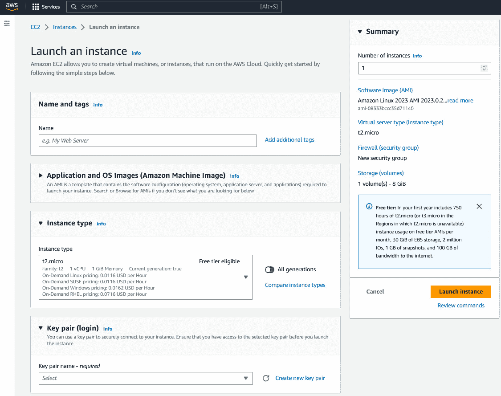

图 3.1 – 在亚马逊 EC2 中启动实例

组织还可以利用 AWS 的命令行界面（CLI）来创建实例和其他 AWS 资源。AWS CLI 是 AWS 提供的一个强大工具，允许组织通过命令行界面管理其 AWS 资源和服务。举个例子，组织可以通过运行特定命令，如 `aws ec2 run-instances`，后接你通常通过 GUI 定义的必要参数，如实例类型、安全组和密钥对，来创建实例。这使得组织能够自动化 AWS 中实例创建和配置的过程，提高效率和可扩展性。

对于事件响应人员来说，EC2 特别重要，因为它为响应安全事件提供了灵活且可扩展的基础设施。在事件发生期间，EC2 实例可以快速启动（即通过创建新的虚拟机）来应对增加的工作负载。EC2 实例可以轻松地被隔离和隔离处理，允许事件响应人员遏制事件并防止其蔓延到组织的其他部分。

## 亚马逊虚拟私有云（VPC）

Amazon VPC 是一项基于云的网络服务，使组织能够在 AWS 云中创建和管理自己的私有虚拟网络。通过 VPC，组织可以创建 AWS 云的隔离部分，称为子网，并通过自定义网络**访问控制列表**（**ACLs**）和安全组控制对这些子网的访问。请注意，默认情况下，当你在 AWS 中创建新实例时，AWS 会自动创建一个 VPC 实例。VPC 提供默认配置，但允许你根据需要自定义配置。与 AWS EC2 实例类似，每个 VPC 都通过 VPC ID 由 AWS 进行标识。可以根据需要创建 VPC，或者可以在 AWS VPC 仪表板中访问任何现有的 VPC。以下图示展示了一个 VPC 示例：

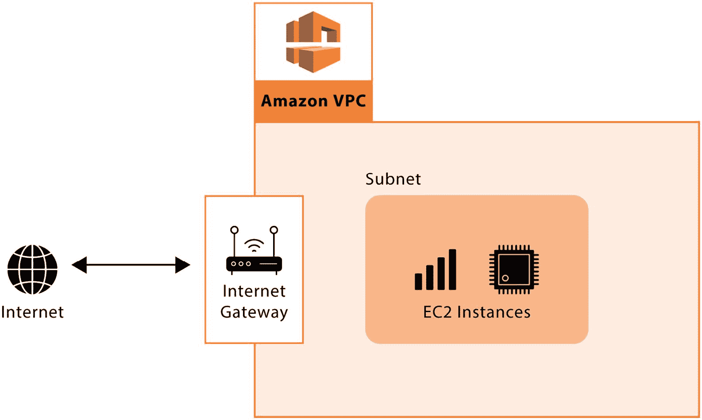

图 3.2 – 亚马逊 VPC 示例

从数字取证和事件响应的角度来看，VPC 提供了几个关键的优势。首先，它使组织能够为其计算资源创建一个隔离且安全的环境，从而降低未经授权访问或数据泄露的风险。其次，它提供了对网络流量的精细控制，使组织能够监控和限制对特定资源和子网的访问。最后，它使组织能够创建一个集中的日志记录和监控解决方案，从而更容易检测和响应安全事件。

在 VPC 中响应事件时，响应人员必须首先识别受影响的资源并将其隔离在 VPC 内。然后，他们可以使用 AWS 工具，如 AWS CloudTrail 和 AWS CloudWatch，来监控网络流量并识别任何可疑活动。事件响应人员还可以利用 VPC 的自定义网络 ACL 和安全组来限制对受影响资源的访问，限制事件的蔓延。在 AWS 中响应事件将在本书的 *第二部分* 讨论。

## 亚马逊简单存储服务（S3）

亚马逊 S3 是 AWS 提供的一项基于云的对象存储服务。S3 使组织能够以高度可扩展、安全且具成本效益的方式存储、检索和管理大量数据。S3 是许多组织数据存储和备份策略的重要组成部分，广泛应用于数据湖、网页和移动应用程序、备份以及灾难恢复等多种场景。AWS 将每个 S3 实例称为 **桶**，并且默认情况下，当一个组织创建一个 S3 桶时，它在互联网上是不可公开访问的。你需要进行必要的更改，以允许在互联网上公开访问。然而，请注意，S3 桶的错误配置将导致 S3 上的数据可以在互联网上公开访问（即使本意并非如此）。因此，确保 S3 桶的配置得当非常重要。

从数字取证和事件响应的角度来看，S3 提供了几个关键的好处。首先，它使组织能够以安全且可扩展的方式存储大量数据，从而使调查员和响应人员更容易访问和分析数据。其次，S3 提供了一系列的安全和合规功能，包括加密、访问控制和审计日志，有助于组织保护其数据并遵守相关法规。最后，S3 使组织能够迅速轻松地从数据丢失或损坏中恢复，减少事件对其运营的影响。

数字取证调查员可以利用 S3 在一个安全且可扩展的环境中分析数据。通过访问组织的 S3 桶，调查员可以检查存储在其中的数据，识别模式和异常，并提取相关证据。他们还可以利用 S3 的审计日志功能来跟踪桶的更改，并识别任何可疑活动。

以下截图展示了创建 AWS S3 桶的过程。桶需要一个名称以及 AWS 区域作为一般配置，所有权/访问配置以及服务器端加密。

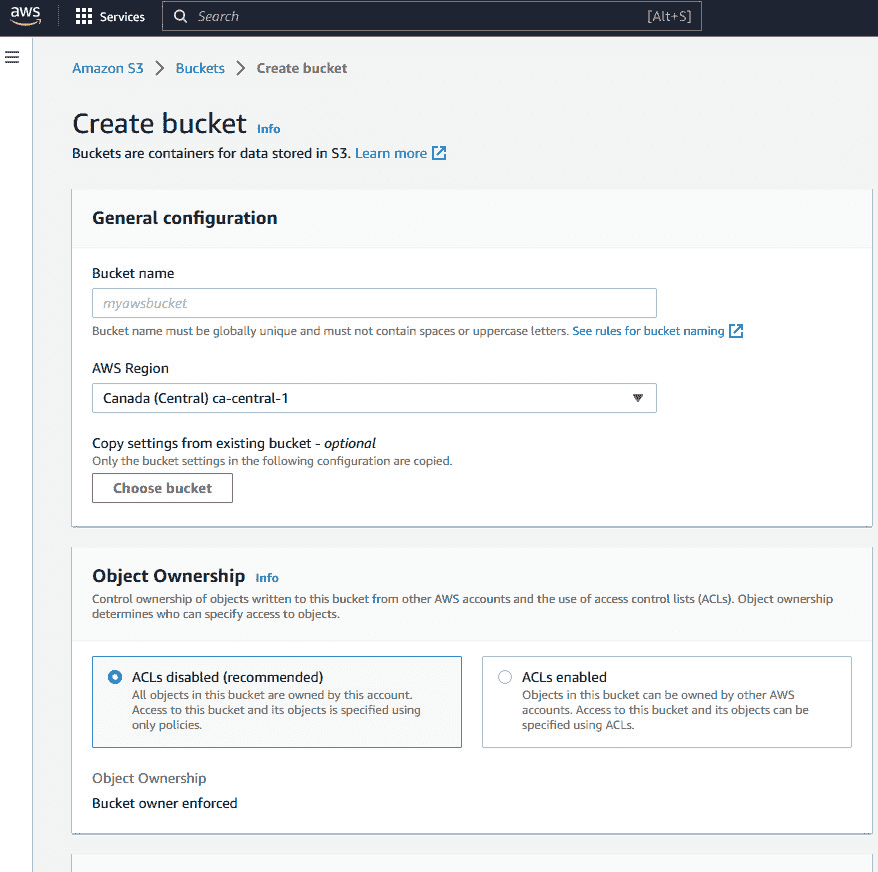

图 3.3 – 创建 S3 桶

## AWS 身份与访问管理（IAM）

AWS IAM 是 AWS 提供的一项 Web 服务，提供了一种安全且集中的方式来管理用户身份和对 AWS 资源的访问权限。IAM 允许组织控制谁可以访问 AWS 资源，以及他们可以对这些资源执行哪些操作。这使组织能够执行安全策略，保持合规性，并减少未经授权访问或数据泄露的风险。

IAM（身份和访问管理）非常重要，因为它使组织能够以细粒度和可扩展的方式管理用户对 AWS 资源的访问权限。通过 IAM，组织可以创建和管理组织、组和角色，并为每个对象分配特定权限。这有助于确保只有授权的组织才能访问 AWS 资源，并且它们只能执行与其工作职责相关的操作。IAM 模块允许组织为相关的 AWS 资源设置细粒度的访问控制。

从数字取证和事件响应的角度来看，IAM 提供了几个关键的好处。首先，它使调查员和响应人员能够识别和跟踪 AWS 资源中的用户活动。通过分析 IAM 日志，调查员可以识别哪些用户被授予访问特定资源的权限，以及他们何时访问了这些资源。这些信息可以帮助调查人员识别潜在的安全漏洞、数据外泄尝试或其他可疑活动。

其次，IAM 使组织能够通过撤销特定组织或组对 AWS 资源的访问权限，快速响应安全事件。这有助于控制事件的影响并防止进一步的未经授权访问或数据泄露。IAM 还提供了为特定用例创建临时访问密钥的能力，这有助于在密钥泄露的情况下限制潜在损害的范围。

要将组织的 IAM 用于数字取证和事件响应目的，调查员和响应人员必须具有适当的权限来访问和分析 IAM 日志。IAM 日志提供了 AWS 资源中用户活动的详细记录，包括谁访问了它们、何时访问以及执行了哪些操作。通过分析这些日志，调查员可以识别可疑活动的模式，追踪用户行为，并关联不同 AWS 服务中的事件。以下截图显示了 IAM 仪表盘，其中包含所有用户、角色、策略和访问报告（访问分析器报告、凭证报告以及与 IAM 相关的组织活动）：

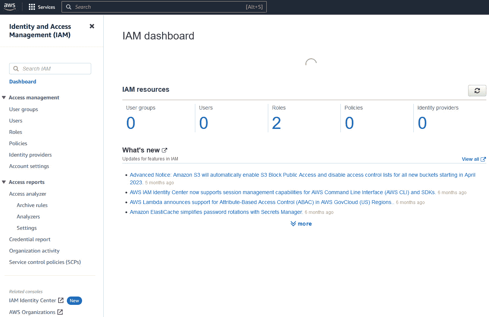

图 3.4 – AWS IAM 仪表盘

## 亚马逊关系型数据库服务（RDS）

Amazon RDS 是 AWS 提供的一项托管服务，使组织能够在云中创建、操作和扩展关系型数据库。借助 RDS，组织可以从 MySQL、PostgreSQL、Oracle 和 Microsoft SQL Server 等流行的数据库引擎中进行选择，并轻松管理其数据库，而无需担心基础设施管理。RDS 自动化了繁琐的数据库管理任务，如补丁、备份和软件升级，使组织能够专注于其核心业务。

RDS 是一个对于需要可扩展、可靠且具有成本效益的方式来管理其云中关系型数据库的组织至关重要的服务。借助 RDS，组织可以轻松创建和管理多个数据库实例，每个实例都有自己的数据库引擎、存储容量和性能指标。RDS 还支持高可用性和灾难恢复选项，如多可用区部署、自动故障转移和备份，确保组织的数据始终可访问且得到保护。可以通过任何特定数据库引擎的数据库客户端（例如 MariaDB、Microsoft SQL Server、MySQL、Oracle、PostgreSQL 等）访问 Amazon RDS 数据库实例。要查找已创建的数据库实例的连接信息（即主机、端口和用户），组织可以使用 AWS RDS 控制台，该控制台位于 AWS 管理控制台中，导航至其数据库实例的 **连接性** 和 **安全性** 标签。查找连接信息的其他方法包括 AWS CLI 或 RDS API。

数字取证和事件响应人员可以使用组织的 RDS 来调查和响应安全事件和数据泄露。RDS 提供审计日志，使组织能够监控数据库活动，如用户登录、SQL 语句和对数据库对象的修改。审计日志可以导出到 Amazon S3 进行长期保存和分析。

在发生安全事件或数据泄露时，事件响应人员可以使用 RDS 执行取证分析，例如识别攻击源、确定危害的程度，并评估对组织数据的影响。事件响应人员可以使用 RDS 快照创建事件发生前的数据库实例时间点副本，允许他们分析数据库内容和事件发生前的活动。事件响应人员还可以将快照恢复到新的 RDS 实例中，进行进一步分析。

# Microsoft Azure

Microsoft Azure 是微软提供的云计算平台和服务，提供一系列云服务，包括计算、存储、网络和分析。它允许组织通过全球数据中心网络构建、部署和管理应用程序和服务，提供按需扩展或缩减的能力，无需本地基础设施。Azure 提供多种服务，包括虚拟机、数据库、应用服务、物联网和机器学习，并且可以与其他微软生产力套件（例如 Microsoft 365）集成（我们将在本书的*第七章*讨论生产力套件）。Azure 还提供一系列安全功能，包括 IAM、网络安全和威胁防护，帮助确保数据和应用程序的安全。

我们将探索事故响应者应熟悉的关键 Azure 服务，并解释了解 Azure 对于现代 IT 环境中有效的事故响应为何如此重要。

## Microsoft Azure 虚拟机

Microsoft Azure 相当于 Amazon EC2 的服务是 Azure 虚拟机，组织可以在微软的云基础设施上部署和运行它们。Azure 虚拟机支持广泛的操作系统，并提供较高的控制水平。通过 Azure 虚拟机，组织可以从多种预配置的虚拟机镜像中进行选择，或创建自定义虚拟机镜像，然后在云中运行它们。

Azure 虚拟机对于需要可扩展和灵活的方式在云中运行应用程序的组织来说非常重要。组织可以轻松地配置和部署 Azure 虚拟机，按需扩展或缩减计算资源，并且只需为使用的资源付费。Azure 虚拟机支持广泛的操作系统，包括 Windows、Linux 和 FreeBSD，并提供从小型到大型的多种虚拟机规格。下图显示了 Microsoft Azure 的虚拟机创建页面，包括自定义虚拟机操作系统、硬件和存储能力的选项。Azure 虚拟机与 AWS EC2 和其他云服务提供商的虚拟化有相似之处——即可以自定义虚拟机的硬件、操作系统、存储和网络配置。

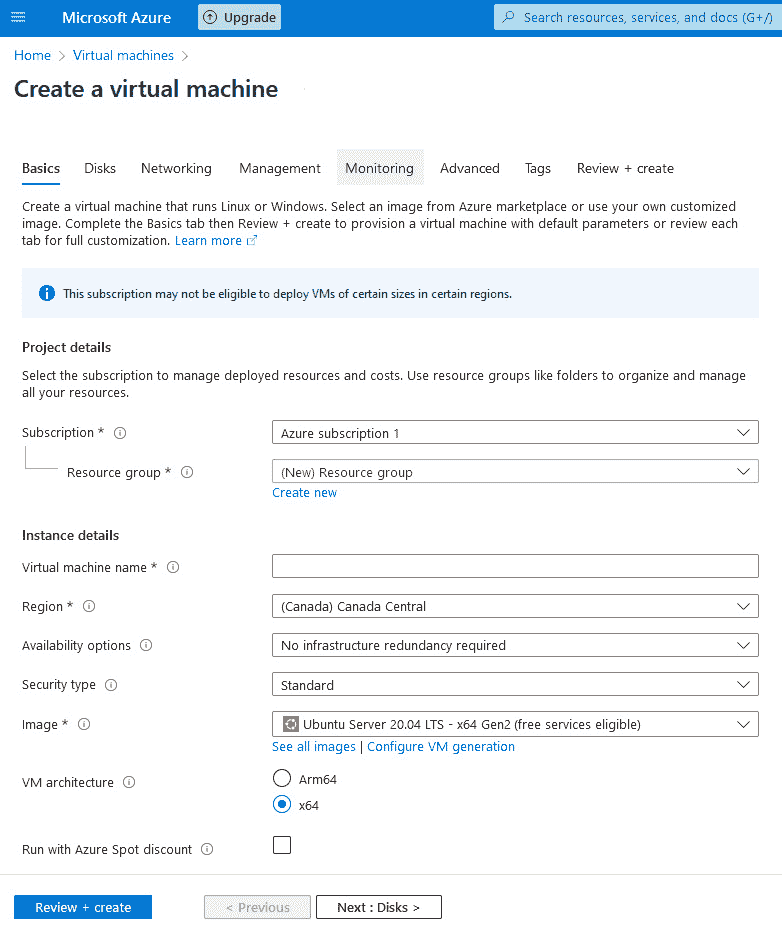

图 3.5 – 在 Azure 中启动虚拟机实例

数字取证和事件响应人员可以利用组织的 Azure 虚拟机来调查和响应安全事件和数据泄露。Azure 虚拟机提供日志记录和监控功能，使组织能够追踪和分析其虚拟机的执行情况。Azure 虚拟机日志可以导出到 Microsoft Azure 的本地安全工具 Azure Monitor，以进行长期保存和分析，或转发到 Microsoft 的**安全信息和事件管理**（**SIEM**）工具 Microsoft Sentinel。

Azure Monitor

Azure Monitor 是一款全面的监控解决方案，用于收集、分析和响应来自 Microsoft Azure 云的遥测数据。

## Microsoft Azure 虚拟网络

Microsoft Azure 虚拟网络是一项基于云的服务，允许组织在 Microsoft Azure 云平台上创建、配置和管理**虚拟专用网络**（**VPNs**）。Azure 虚拟网络提供云端资源与本地资源之间的安全私密连接，使组织能够将其网络基础设施扩展到云中。通过 Azure 虚拟网络，组织可以创建虚拟网络、子网和网络安全组，以控制对资源的访问并保护它们免受未授权访问。

Azure 虚拟网络对需要在云中建立安全私密网络基础设施的组织至关重要。通过 Azure 虚拟网络，组织可以创建与公共互联网隔离的虚拟网络，从而保障其在云中的应用和数据安全。Azure 虚拟网络支持多种连接选项，包括站点到站点 VPN、点对站点 VPN 和 ExpressRoute，使组织能够选择最符合需求的连接方式。下图展示了一个 Azure 虚拟网络设置示例。请注意，Azure 虚拟网络在功能上类似于 AWS VPC，即用于管理虚拟网络中的虚拟化资源，如虚拟机。

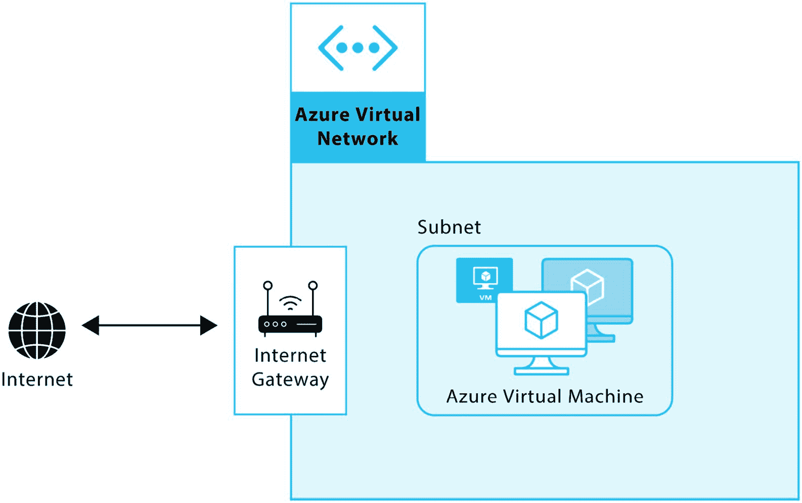

图 3.6 – Azure 虚拟网络示例

数字取证和事件响应人员可以利用组织的 Azure 虚拟网络来调查和响应安全事件和数据泄露。Azure 虚拟网络提供日志记录和监控功能，使组织能够追踪和分析云端资源与本地资源之间的网络流量。Azure 虚拟网络日志可以导出到 Azure Monitor 进行长期保存和分析。

在发生安全事件或数据泄露时，事件响应人员还可以使用 Azure 虚拟网络来识别潜在的攻击向量，并调查入侵的范围。事件响应人员可以分析 Azure 虚拟网络日志，以识别异常的网络流量，如未经授权的访问尝试或数据外泄尝试。事件响应人员还可以使用 Azure 虚拟网络的安全功能，如网络安全组，来控制资源的访问并防止未经授权的访问。

## Microsoft Azure Blob Storage

Microsoft Azure Blob Storage 是一种基于云的对象存储解决方案，使组织能够以具有成本效益且高度可扩展的方式存储大量非结构化数据，如文本、图像、视频和音频文件。Azure Blob Storage 是 Azure 平台的关键组成部分，提供了许多功能和优势，使其成为各类组织的重要工具。

Azure Blob Storage 的一个关键优势是其可扩展性。组织可以将几乎无限量的数据存储在 Blob Storage 中，并且存储容量可以根据需要轻松地扩展或缩减。这使其成为需要存储大量数据但又不想投资昂贵硬件或基础设施的组织的理想解决方案。

Azure Blob Storage 的另一个优点是其耐用性。Azure Blob Storage 使用冗余存储来确保数据始终可用，即使在硬件故障或其他类型的中断事件中。这意味着组织可以依赖 Azure Blob Storage 存储其关键数据，而无需担心数据丢失或停机。

Azure Blob Storage 还提供了一些功能，使管理存储在云中的数据变得更加容易。组织可以通过基于 Web 的界面轻松访问和管理数据，并且 Blob Storage 提供了一系列安全功能，如加密、访问控制和审计日志，以帮助保护数据免受未经授权的访问，并确保符合行业法规。

数字取证和事件响应人员可以使用组织的 Azure Blob Storage 来存储和分析与网络事件相关的数据，如恶意软件感染、数据泄露或勒索病毒攻击。通过将数据存储在 Azure Blob Storage 中，响应人员可以轻松访问和分析大量数据，无需专门的硬件或基础设施。他们还可以使用 Blob Storage 内置的安全功能，确保数据受到保护并保持安全。

如果 Azure Blob 存储发生事故，响应人员应遵循已建立的事故响应程序，迅速识别并控制事故。这可能涉及隔离受影响的 Blob 存储容器或账户，保存数据以便进行法证分析，并找出事故的根本原因。一旦事故得到控制，响应人员可以使用 Azure Blob 存储的审计日志和其他数据分析工具来调查事故，并识别可能需要解决的其他威胁或漏洞。

创建一个 Blob 存储实例需要三个 Azure 资源：

+   存储账户

+   容器

+   存储 Blob

存储账户在 Azure 中充当数据的唯一区域。在存储账户内创建一个容器，并将一组 Blob 组织在其中。Blob 存储您的文件。*图 3.7* 显示了一个微软 Azure 存储账户的示例。

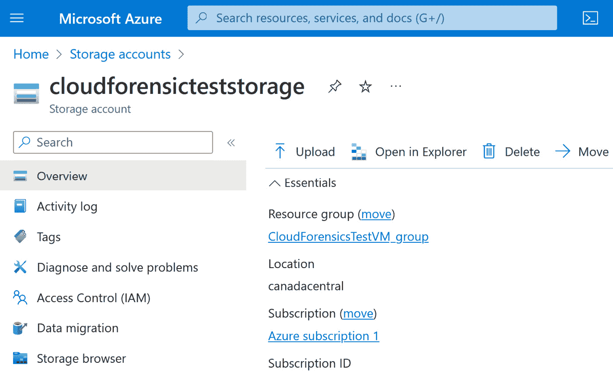

图 3.7 – 存储账户示例

## 微软 Azure Active Directory（Azure AD）

微软**Azure Active Directory**（**Azure AD**）是一种基于云的身份和访问管理（IAM）解决方案，允许组织管理跨 Microsoft Azure 平台的资源访问。Azure AD 相当于 AWS IAM。Azure AD 是微软云产品的核心组件，为一系列微软云服务（如 Microsoft 365、Azure 和 Dynamics 365）提供身份验证和授权服务。Azure AD 是希望管理其云资源访问的组织必不可少的工具，使他们能够执行安全策略、简化用户管理并提高整体安全性。

Azure AD 还提供一系列身份管理功能，包括**多重身份验证**（**MFA**）、条件访问策略和**基于角色的访问控制**（**RBAC**）。这些功能使组织能够基于用户角色、设备健康状况和其他上下文因素来控制对其资源的访问。

数字取证和事故响应人员可以使用组织的 Azure AD 来调查与 IAM 相关的安全事件。通过分析 Azure AD 日志和审计轨迹，响应人员可以识别异常行为，如未经授权的访问尝试、账户被盗或凭证被窃取。

## 微软 Azure SQL 数据库

微软 Azure 的 Amazon RDS 等效产品是 Azure SQL 数据库，它提供了一个完全托管的 RDS 服务。它作为一个灵活的平台，用于在云环境中存储和组织 SQL 数据，允许访问您的数据，而无需担心与托管数据库的机器相关的系统和数据库管理任务。Azure SQL 数据库基于 Microsoft SQL Server 数据库引擎，为组织提供了广泛的功能和能力，用于管理其数据，包括自动调优、高可用性和内置的安全功能。

Azure SQL 数据库对于需要可扩展和安全平台来管理其云中数据的组织非常重要。使用 Azure SQL 数据库，组织可以轻松地在云中提供和管理其数据库，而无需进行昂贵的硬件和基础设施投资。Azure SQL 数据库为组织提供了高度的灵活性和可扩展性，使其能够根据需要扩展或缩减数据库资源。

数字取证和事件响应人员可以使用组织的 Azure SQL 数据库来调查和应对安全事件和数据泄露。Azure SQL 数据库提供了一系列日志记录和审计功能，允许组织跟踪和分析数据库活动，包括用户活动、架构更改和数据修改。Azure SQL 数据库还提供内置的安全功能，如透明数据加密和行级安全，有助于保护数据免受未经授权的访问。

在发生安全事件或数据泄露时，事件响应人员可以使用 Azure SQL 数据库识别潜在的攻击途径，并调查安全漏洞的程度。事件响应人员可以分析 Azure SQL 数据库日志，识别异常的数据库活动，如未经授权的访问尝试或数据修改。事件响应人员还可以利用 Azure SQL 数据库的安全功能，如审计和行级安全，来调查和减轻安全事件的影响。

# Google Cloud Platform（GCP）

GCP 是 Google 提供的一套云计算服务。与 AWS 和 Azure 类似，GCP 提供了一系列云服务，供组织用于构建、部署和管理应用程序和服务。

## Google Compute Engine（GCE）

**Google Compute Engine**（**GCE**）是 GCP 提供的一项云计算服务，向组织提供按需的虚拟机实例。通过 GCE，组织可以快速轻松地启动虚拟机实例，按需配置并根据需要进行扩展。以下截图展示了 GCE 的控制台，在这里您可以创建虚拟机实例。所有创建的虚拟机实例将出现在此页面上。

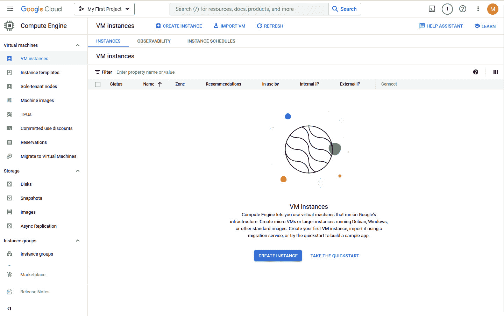

图 3.8 – GCE 控制台

GCE 支持多种操作系统，包括 Linux 和 Windows，并为组织提供一系列针对不同工作负载优化的机器类型。与 AWS 和 Azure 类似，您可以根据需要配置 Google 虚拟机的不同计算能力、存储容量和网络功能。*图 3.9* 展示了 GCE 虚拟机实例创建页面。

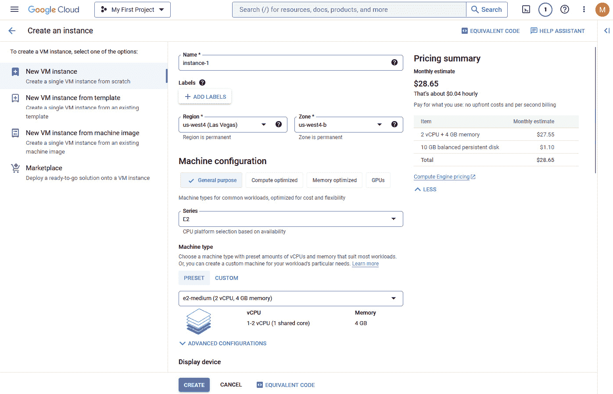

图 3.9 – 在 GCE 中启动虚拟机实例

GCE 与 AWS EC2 和 Microsoft Azure 虚拟机在多个方面有所不同。首先，GCE 提供了一系列针对不同工作负载优化的自定义机器类型，使组织能够选择最适合其应用程序和服务的配置。其次，GCE 为组织提供访问 Google 全球网络基础设施和数据中心的权限，这能够提供比其他云服务商更快的网络性能和更低的延迟。最后，GCE 提供了集成的监控和日志工具，例如 Google 的操作套件（以前称为 Stackdriver），能够简化虚拟机实例管理和监控的过程。事故响应人员可以使用像 Google 的操作套件这样的监控和日志工具，查看在安全事件中是否有任何妥协的迹象。

Google 的操作套件

Google 的操作套件是 GCP 提供的监控、日志记录和诊断平台，用于收集和分析来自 Google 云资源和应用程序的指标、日志和追踪信息。

## Google 虚拟私有云（VPC）

Google VPC 是一种网络服务，使组织能够在 GCP 上创建和管理其私有的软件定义网络。Google VPC 提供了一种安全且可扩展的方式来托管云资源，允许组织在其网络内隔离资源，控制访问权限，并根据业务需求配置网络设置。

Google VPC 允许组织在 GCP 环境内创建其虚拟网络。这个虚拟网络与其他网络逻辑隔离，为云资源提供一个安全和私密的环境。组织可以根据业务需求自定义网络设置，如 IP 地址、子网、防火墙规则和路由。通过这种方式，组织可以控制资源之间的流量，并确保只有授权用户才能访问这些资源。以下图示展示了 Google VPC 网络的示例。请注意，Google VPC 在作用上类似于 AWS VPC 和 Azure 虚拟网络，即管理虚拟网络中的虚拟化资源，如虚拟机。

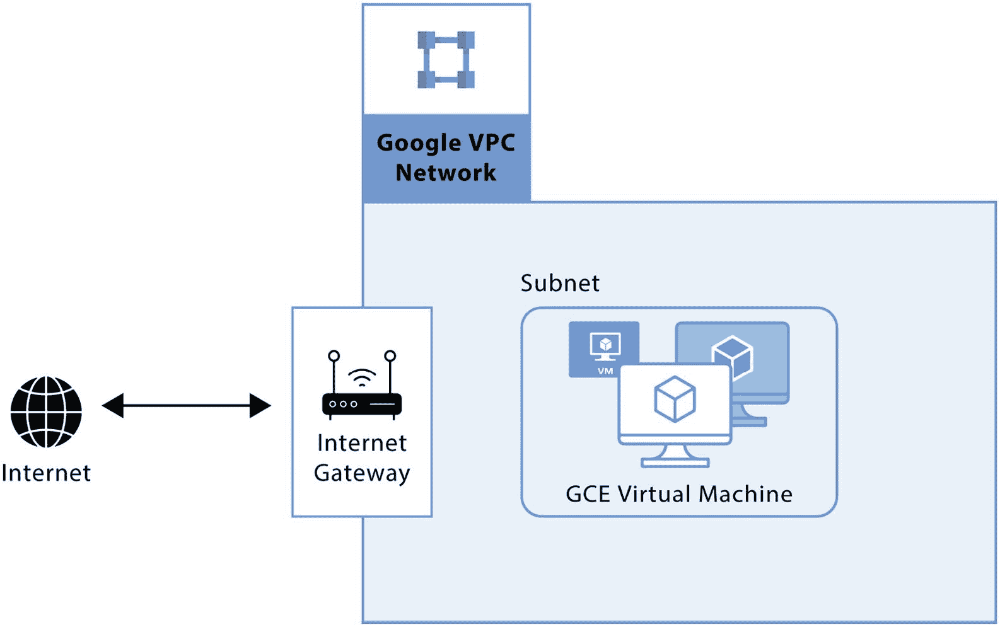

图 3.10 – Google VPC 网络示例

## Google 云存储（GCS）

**Google 云存储** (**GCS**) 是 Google 相当于 Amazon S3 和 Azure Blob Storage 的服务，为用户提供可扩展且高可用的对象存储服务。GCS 使用户能够从世界任何地方存储和检索任意数量的数据，并提供多种存储类以适应不同的数据类型和访问模式。以下截图演示了 GCS 对象的创建过程。GCS 还将存储对象组织到存储桶中，如图所示。

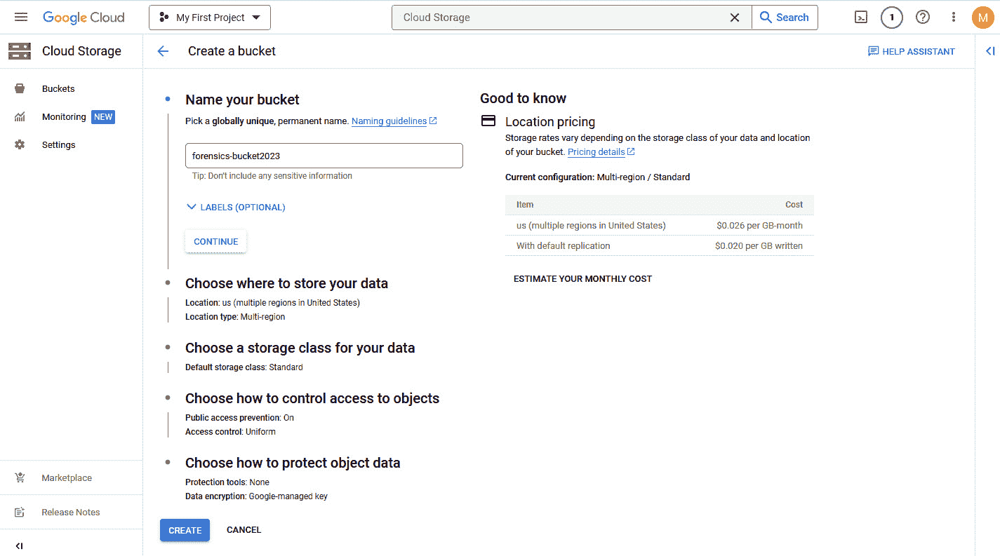

图 3.11 – 使用 GCS 创建存储桶

Google 存储桶需要以下要求：

+   独特的命名规范

+   存储数据的位置（Google 数据中心区域）

+   访问控制配置（通过 ACL）

+   服务器端加密/保护

## Google Cloud SQL

Google Cloud SQL 是 Google Cloud 相当于 AWS RDS 和 Azure SQL 数据库的服务，提供由 Google 云托管的完全托管 RDS。Cloud SQL 支持 MySQL、PostgreSQL 和 SQL Server 数据库，并提供自动备份、复制和故障切换功能。Google Cloud SQL 是一个完全托管的 RDS，提供组织一个解决方案，用于在 GCP 上存储和管理他们的数据库。此服务允许用户轻松部署、管理和扩展他们的数据库，免去管理基础设施、备份和软件更新的负担。通过 Google Cloud SQL，用户可以选择 MySQL、PostgreSQL 和 SQL Server 来支持他们的应用程序和服务。

# 其他云服务提供商

虽然 AWS、Microsoft Azure 和 GCP 主导了云服务提供商市场，但组织也可以选择其他选项。Oracle Cloud、IBM Cloud、Alibaba Cloud、Rackspace 和 DigitalOcean 是一些不太常见的云服务提供商。每个提供商都提供基本的云服务，如创建虚拟映像和虚拟网络、云存储和数据库服务——这些服务与我们之前讨论的 AWS、Azure 和 GCP 的服务相同。例如，Oracle Cloud 提供全面的云计算解决方案，包括 IaaS、PaaS 和 SaaS，而 IBM Cloud 提供一个混合云平台，能够与私有云和公有云集成。Alibaba Cloud 是中国最大的云提供商，而 Rackspace 提供托管云服务，DigitalOcean 则专注于为开发者提供简单的云基础设施。

# 总结

本章关于云服务提供商的内容概述了该行业的三大主要玩家：AWS、Microsoft Azure 和 GCP。它强调了对这些提供商的产品和服务有一个大致了解的重要性。这些平台各有一系列产品，但大多数组织通常使用与虚拟机创建、虚拟网络服务、存储和数据库服务相关的云服务解决方案。对这些基本方面有一个大致了解，对于有效响应云端事件并进行取证至关重要。

在云端发生事故或安全漏洞时，了解这些服务提供商如何处理虚拟机创建、网络和存储，可以帮助快速且有依据地响应事故。了解它们各自的能力和配置，有助于更高效的事件管理和取证分析。在下一章中，我们将深入探讨如何响应 AWS 事故——具体来说，是 AWS 产品的各种日志存储位置以及如何利用这些日志进行安全事件的取证分析。

# 进一步阅读

+   Oracle Cloud: [`www.oracle.com/ca-en/cloud/`](https://www.oracle.com/ca-en/cloud/)

+   IBM Cloud: [`www.ibm.com/cloud`](https://www.ibm.com/cloud)

+   阿里云: [`in.alibabacloud.com/en`](https://in.alibabacloud.com/en)

+   Rackspace: [`www.rackspace.com/cloud`](https://www.rackspace.com/cloud)

+   DigitalOcean: [`www.digitalocean.com/`](https://www.digitalocean.com/)

+   亚马逊 AWS 安全最佳实践: [`docs.aws.amazon.com/AmazonS3/latest/userguide/security-best-practices.xhtml`](https://docs.aws.amazon.com/AmazonS3/latest/userguide/security-best-practices.xhtml)

+   连接到 AWS RDS 数据库实例: [`docs.aws.amazon.com/AmazonRDS/latest/UserGuide/CHAP_CommonTasks.Connect.xhtml#CHAP_CommonTasks.Connect.EndpointAndPort`](https://docs.aws.amazon.com/AmazonRDS/latest/UserGuide/CHAP_CommonTasks.Connect.xhtml#CHAP_CommonTasks.Connect.EndpointAndPort)

+   Azure Monitor 概述: [`learn.microsoft.com/en-us/azure/azure-monitor/overview`](https://learn.microsoft.com/en-us/azure/azure-monitor/overview)

+   Azure Sentinel SIEM 概述: [`learn.microsoft.com/en-us/azure/sentinel/overview`](https://learn.microsoft.com/en-us/azure/sentinel/overview)

+   Google Cloud 操作套件概述: [`cloud.google.com/products/operations`](https://cloud.google.com/products/operations)
