### 第四章：DFIR 调查 – AWS 中的日志

通过 *第一章* 到 *第三章*，你可能已经认识到云在当今技术格局中的重要性，而任何技术创新的背后都会带来威胁。随着组织使用更多的云产品并托管和存储个人或敏感信息，这些信息很容易遭遇未经授权的披露，无论是意外的还是通过威胁行为者利用系统配置中的漏洞所致。本章将重点讨论如何处理 **亚马逊 Web 服务** (**AWS**) 中发生的事件。我们将讨论可供调查人员使用的各种日志源，以及调查人员如何利用这些日志源。

在我们开始调查之前，我们需要了解哪些日志是默认可用的，哪些日志源必须显式开启；这是组织在确保能够彻底调查安全漏洞时应考虑的事项。我们将专注于配置这些日志，并探讨如何利用 AWS 的一些原生功能进行调查。具体来说，我们将讨论以下 AWS 数据源：

+   **虚拟私有云** (**VPC**) 流量日志

+   **简单存储服务** (**S3**) 访问日志

+   AWS CloudTrail

+   AWS CloudWatch

+   Amazon GuardDuty

+   Amazon Detective

# VPC 流量日志

我们在 *第三章* 中简要介绍了 VPC。VPC 是 AWS 中每个实例的网络配置核心。每个 AWS 实例 (**弹性计算云** (**EC2**)) 都会被分配一个 VPC，并通过 VPC ID 唯一标识。VPC 使用户可以完全控制网络环境，包括定义特定的 IP 地址（非公共可路由 IP）、子网和安全组。用户还可以通过其 VPC 连接配置 **虚拟私人网络** (**VPN**)。在默认配置下，AWS 会为每个新的 EC2 实例自动创建一个 VPC。用户也可以将他们的 EC2 实例连接到一个已存在的预配置 VPC。

所有 VPC 都有一个 **VPC 标识符** (**VPC ID**)。VPC ID 是所有与网络相关的配置项的唯一参考点。对于每个实例，如果你想在 AWS 中配置任何网络属性，必须专门查看每个 VPC。在下一个示例中，对于一个特定的 EC2 实例，VPC 捕获了一些特定的细节。

注意

在深入细节之前，值得注意的是，VPC 流量日志与网络流量日志类似。这些日志只捕获网络流量的头信息；例如，源 IP、目标 IP、协议、端口以及连接是否被接受或拒绝（取决于入站和出站连接规则）。

## VPC 基础

在下面的截图中，你会注意到 **网络** 标签下的一些配置信息，这些信息对于 **数字取证与事件响应** (**DFIR**) 团队特别有用：

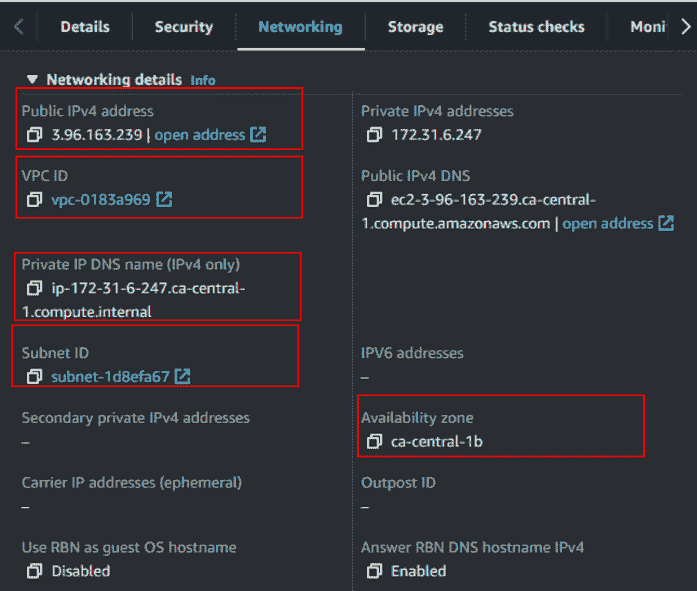

图 4.1 – 默认 VPC 设置

包括以下内容：

+   **公共 IPv4 地址**：此 EC2 实例的可公开路由的 IP 地址方案。

+   **VPC ID**：将所有网络配置项与此 VPC 设置连接的唯一标识符。

+   **私有 IP DNS 名称（仅限 IPv4）**：分配给 EC2 实例的不可公开路由的 IP 地址，通常用于 AWS 提供的后端通信或 EC2 实例间的通信。

+   **子网 ID**：VPC 所拥有的 IP 子网。

+   **可用区**：VPC 最初配置所在的 AWS 区域。

DFIR 团队可以使用此核心信息集来过滤事件并进行分析。在本章的 *AWS CloudWatch* 部分，我们将探讨如何将这些信息整合到调查中。

如前述屏幕截图所示，每个 VPC 配备一个或多个子网，负责分配 IP 并管理网络段。你可以在同一个 VPC 下为多个 EC2 实例分配多个子网：

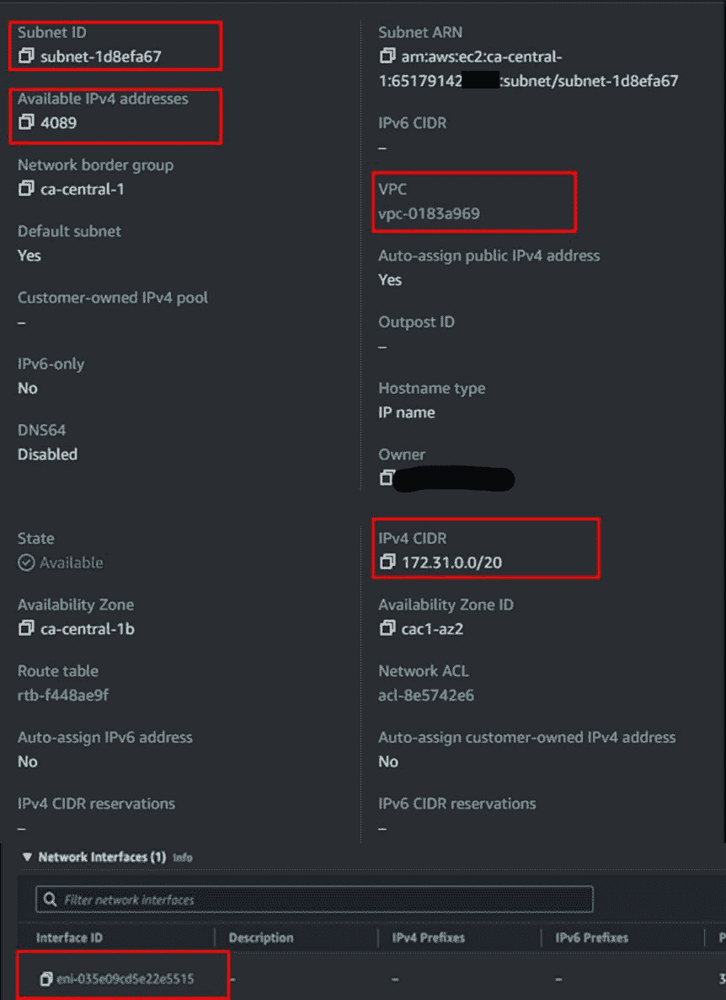

图 4.2 – 默认子网配置和网络接口

类似于 VPC 配置，前面的屏幕截图展示了分配给 VPC 的子网的一些默认属性。包括以下内容：

+   **子网 ID**：用于标识分配给 VPC 的子网的唯一标识符。

+   `4089`。

+   **网络边界组**：分配的互联网边缘位置。网络边界组是 AWS 边缘位置和 **服务接入点** (**PoPs**) 的集合，这些位置地理分布并旨在提供 VPC 与公共互联网之间的安全可靠连接。

+   **路由表**：指向分配给该子网的特定路由信息架构的唯一标识符。

+   **子网 ARN**：子网 **Amazon 资源名称** (**ARN**) 是一个唯一标识符，可以在各种 AWS 服务和 API 中引用该子网，如 AWS CloudFormation 模板、AWS **身份与访问管理** (**IAM**) 策略和 AWS Lambda 函数。

+   **VPC**：此子网所分配的 VPC。请注意，此子网被分配到*图 4.1*所引用的 VPC。

+   **所有者**：实例、VPC 和子网所属账户的唯一标识符。出于隐私原因，这个标识符被屏蔽。

+   `/20` 表示 IP 地址的前 20 位用于网络地址，剩余的 12 位用于主机地址。

+   `ca-central`）；然而，如果需要，你可以将子网放置在另一个可用区，以提供 **容错** (**FT**) 和弹性。

+   **网络 ACL**：另一个唯一标识符，用于精确识别为此子网配置的 **访问控制列表** (**ACLs**) 。ACL 将执行对网络资源的允许与限制。这还可以包括入站和出站网络过滤器。

+   `eni-035e09cd5e22e5515`：网络接口 ID。

虽然前面的截图指定了必要的配置元素，但每个属性可以根据组织的需求进行调整。然而，DFIR 团队需要注意，前述方面将对调查过程中的威胁性质以及你正在观察的威胁起到作用。

对于 DFIR 团队，以下标签提供了关于网络配置的更多详细信息：

+   **流量日志** 表示网络如何被记录。这个 VPC/子网的日志记录在 CloudWatch 中，这使得 DFIR 团队可以查询网络日志。我们将在本章后续部分调查并查询这些日志：

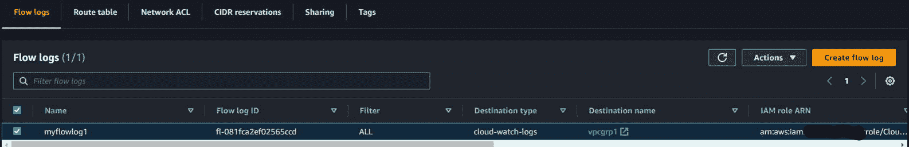

图 4.3 – VPC 流量日志

注意

请注意，VPC 流量日志默认未启用，需要显式设置。

+   下一张截图深入展示了配置用于连接到互联网的 **路由表**。请注意该子网连接的 **目标** 网络网关标识符（唯一标识符）。路由表定义了与该子网相关的所有实例的路由执行方式。在设置了自定义 VPC 的组织中，路由表可能看起来不同，或者指向 AWS 内的其他网络资源。它可能不会将实例直接暴露到互联网。DFIR 团队需要注意网关和资源分配的路由表，以便进行调查：

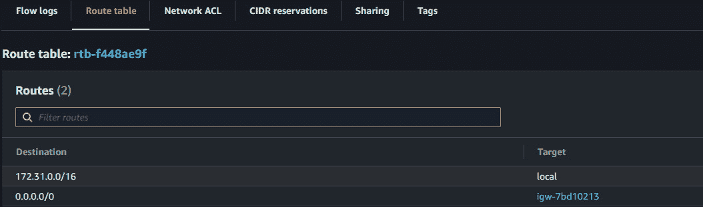

图 4.4 – 路由表

+   以下截图显示了 **规则编号** 列中进出 `*` 的详细信息，这意味着一旦任何规则编号被评估完，该规则将最后进行评估。基于进出 ACL，这个资源可以在线访问。它可以访问互联网的任何部分，目前这是最不安全的设置，也是 AWS 提供的默认设置：

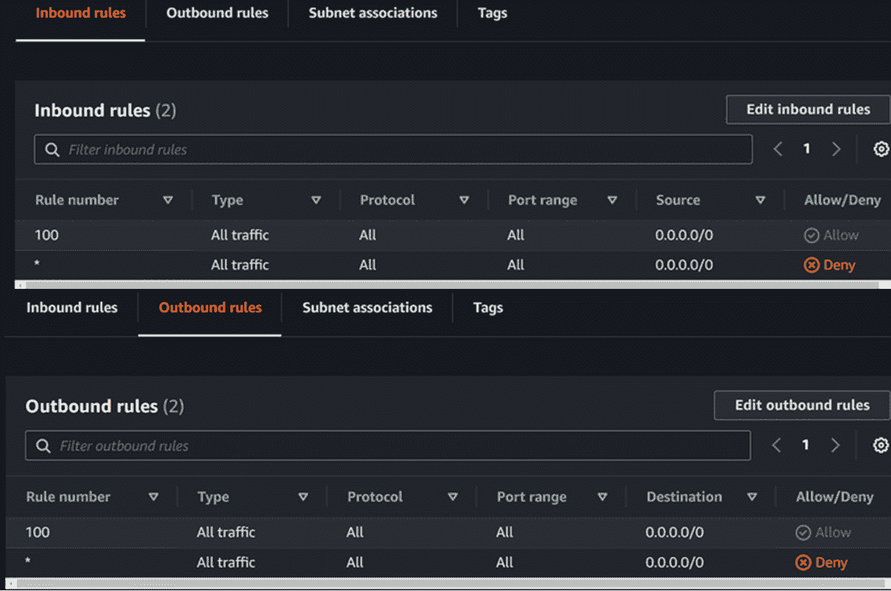

图 4.5 – 配置的子网 NACL

现在我们已经回顾了 VPC 下的各种配置项，以下是 AWS 为每个 VPC 提供的概要仪表板，概述了 VPC 配置属性和分配，以及其他信息：

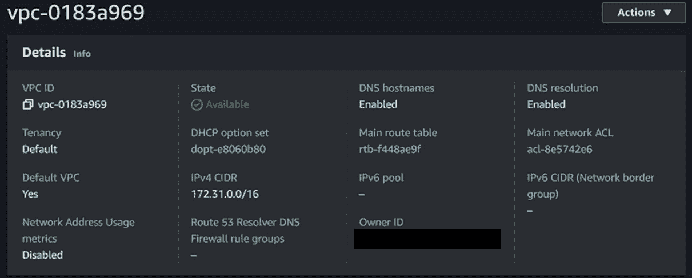

图 4.6 – VPC 概要仪表板

VPC 概要仪表板页面还将提供有关与此 VPC 关联的子网和已配置的流量日志的额外信息。VPC 流量日志默认未启用，需要在 AWS 的 IAM 模块中配置特定的 AWS 资源访问权限。我们将研究如何设置流量日志，以便 DFIR 团队能够调查 AWS 上的网络活动并查询这些日志。

以下截图展示了 AWS 从内部 AWS 视角连接到互联网的网络配置图或资源图。资源图显示了 VPC 中资源之间的连接，概述了从子网到**网络地址转换**（**NAT**）网关、互联网网关和网关端点的流量路径。通过资源图，DFIR 团队可以理解 VPC 的设计，确定子网数量，识别哪些子网与路由表相对应，并识别哪些路由表包含到 NAT 网关、互联网网关和网关端点的路由：

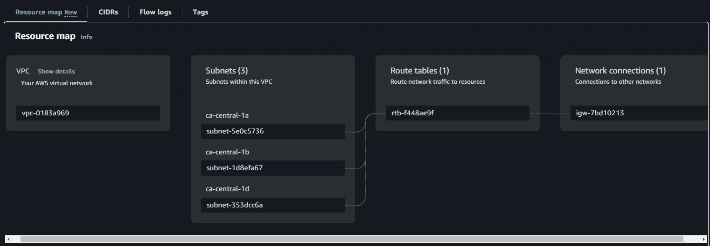

图 4.7 – vpc-0183a969 VPC 的资源图

此外，资源图可以帮助你识别不合适或不准确的配置，例如与 NAT 网关分离的私有子网，或具有直接路由到互联网网关的私有子网。你可以从**资源图**界面选择特定的资源，如路由表，并修改其设置。该功能目前正在开发中。

## 示例 VPC 流日志

这是一个示例 VPC 流日志及流日志中捕获的属性。理解每个流日志中捕获的元素是至关重要的。

流日志是在时间间隔之间记录的，期间网络流量被聚合成一个日志：

```
2 65179142xxxx eni-035e09cd5e22e5515 45.79.132.41 172.31.5.217 41340 636 6 1 44 1682678411 1682678469 REJECT OK
```

让我们深入了解流日志中每个元素的详细信息：

+   `2`：该字段表示 VPC 流日志格式的版本。

+   `65179142xxxx`：这是拥有网络接口的 AWS 账户的 ID。目前由于隐私原因，此 ID 被隐藏。

+   `eni-035e09cd5e22e5515`：这是网络接口的 ID（**弹性网络接口**（**ENI**））。请注意，该日志与*图 4.2*配置匹配，反映了 EC2 资源的网络连接。

+   `45.79.132.41`：这是流量的源 IP 地址。

+   `172.31.5.217`：这是流量的目标 IP 地址。

+   `41340`：这是源端口号。

+   `636`：这是目标端口号。

+   `6`：这是协议号。在这种情况下，它是 TCP（`6`）。端口 `6` 目前未分配。

+   `1`：这是在流期间传输的包的数量。

+   `44`：这是在流期间传输的字节数。请注意，在此流会话期间传输的字节数。

+   `1682678411`：这是流的开始时间，采用纪元时间（自 1970 年 1 月 1 日起的秒数）。

+   `1682678469`：这是流的结束时间，采用纪元时间。

+   `REJECT`：由安全组或 NACL 对流量采取的行动。行动包括 `ACCEPT`/`REJECT`/`NO DATA`/`SKIPDATA`。`NO DATA` 和 `SKIPDATA` 是极端情况，`NO DATA` 表示记录为空，流日志事件没有数据。而 `SKIPDATA` 表示由于容量限制，网络聚合间隔期间无法捕获日志，导致无法捕获流日志条目。`SKIPDATA` 记录条目意味着由于内部配置错误，无法捕获多个网络日志。

+   `OK`：这是操作的状态。

## DFIR 在 VPC 流日志中的应用场景

DFIR 团队在调查 AWS 资源时，应该利用 VPC 流日志的原因有很多。以下是 VPC 流日志对 DFIR 团队至关重要的一些应用场景：

+   **威胁检测与监控**：VPC 流日志可以用来检测可疑或恶意的网络流量。DFIR 团队通过分析流日志，可以识别出表示已知威胁或潜在入侵的流量模式。例如，他们可以利用流日志来检测端口扫描、暴力破解攻击、命令和控制流量，以及通过查看流日志中的活动峰值来识别数据外泄。

+   **IR**：DFIR 团队可以利用 VPC 流日志重建事件的时间线，并在安全事件中确定攻击源。通过分析流日志，他们可以确定受影响的系统和应用、攻击的持续时间，以及攻击者使用的 IP 地址和端口。

+   **取证分析**：VPC 流日志还可以用于数字取证调查，以识别攻击源并追踪数据通过网络的访问路径。DFIR 团队可以使用流日志来确定源 IP 地址、目标 IP 地址以及网络连接期间使用的协议。这些信息可以帮助他们确定数据泄露或其他安全事件的源头。

+   **合规性监控**：VPC 流日志可用于监控是否符合安全政策和法规要求。DFIR 团队或**安全运营中心** (**SOC**) 可以使用流日志来检测未授权访问敏感数据和安全违规行为。这些信息可以用来生成合规审计报告或支持法律调查。

+   **异常检测**：最后，VPC 流日志可以用来检测异常的网络流量。DFIR 团队可以使用**机器学习** (**ML**) 技术来识别与网络预期行为不符的流量模式。这可以帮助他们在安全事件或系统故障变得更严重之前发现潜在问题。

# S3 访问日志

Amazon S3 是一种非常流行的云存储服务，具有高度可扩展性和可靠性，适用于数据存储和检索。S3 提供了**高可用性** (**HA**)、存储性能和全球任何位置数据的可访问性。

在 AWS 中，S3 是基于 *存储桶* 操作的，存储桶中包含 *对象*。对象是任何文件、文档、图片和视频。每个对象都使用唯一的标识符，即键，来标识并服务于存储桶中的对象。存储桶可以视为包含所有对象的文件夹。

## 日志选项

访问日志记录关于对 Amazon S3 存储桶的请求信息，包括请求详情、具体的资源请求以及请求的时间和日期。Amazon S3 使用特定的内部账户来写入服务器访问日志，这要求 AWS 账户所有者在其 IAM 模块中配置显式权限，以允许 S3 记录服务器访问请求。

注意

请注意，S3 访问日志默认未启用，需显式设置。

## DFIR 用例：S3 监控

由于 S3 存储用于数据的传输和托管，大多数 DFIR 用例都围绕数据分析和移动展开。一些特定的 DFIR 用例包括：

+   **数据泄露**：由于 S3 存储桶的配置错误，可能会发生数据泄露或数据暴露。通过访问日志，可以帮助识别未经授权访问 S3 存储桶中的数据。通过监控存储桶访问日志并执行异常检测，可以识别出大规模数据传输、意外访问模式或未经授权尝试访问特定对象等可疑活动。

+   **恶意软件和勒索软件检测**：S3 存储桶可能成为攻击者用来存储和分发恶意软件或勒索软件的目标。DFIR 团队可以通过监控 S3 文件完整性变化、意外文件类型或可疑行为，帮助识别此类恶意文件。与 **威胁情报**（**TI**）的集成可以增强检测能力。

+   **IR 和取证调查**：S3 监控可以为 IR 和取证调查提供洞察。通过访问日志，DFIR 团队可以帮助重建事件、识别事件源并理解泄露的范围。监控访问日志、对象元数据和版本控制有助于分析导致安全事件的活动。

+   **数据外泄检测**：攻击者可能试图通过从 S3 存储桶复制或下载敏感数据来进行数据外泄。监控 S3 访问日志并进行内容分析，有助于识别可能表明数据外泄尝试的大规模或意外数据传输。这也可以通过与 CloudTrail 和 CloudWatch 的集成以及开发日志模式洞察来实现，从而使 DFIR 团队能够确定文件访问的偏差并识别外泄活动。

# AWS CloudTrail

AWS CloudTrail 记录在 AWS 管理控制台上执行的活动，访问任何 AWS 资源—例如，创建或终止 EC2 实例、修改 VPC 设置等。AWS 管理控制台上的任何活动都会作为事件记录在 CloudTrail 中。

CloudTrail 将详细的操作日志事件汇总在一个集中位置，并提供关于账户活动的全面统一视图，使得在整个 AWS 基础设施中更容易搜索、分析、下载并响应账户活动。它还可以识别哪些用户执行了哪些操作，以及任何有助于 DFIR 团队分析和响应 AWS 事件的其他细节。

CloudTrail 日志可以与 CloudWatch 集成，以便查询活动并进行进一步分析。我们将在下一节讨论 CloudWatch。

以下截图展示了一个 CloudWatch 仪表盘的示例：

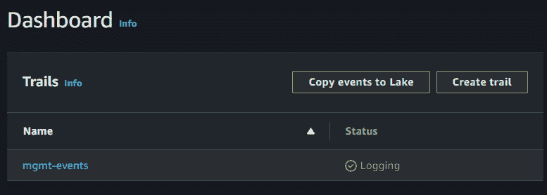

图 4.8 – CloudWatch 仪表盘

在撰写本文时，我们看到事件记录在`mgmt-event`跟踪中。它汇总了在每个 AWS 账户下执行的所有管理活动。事件以 CloudTrail **JavaScript 对象表示法**（**JSON**）日志格式记录。

CloudTrail 可以记录三种类型的事件：管理事件、数据事件和 CloudTrail 数据洞察事件。让我们详细了解一下这些事件：

+   **管理事件**：顾名思义，这些事件记录了 AWS 账户管理级别的活动，包括对 AWS 账户所执行的操作。AWS 称这些为**控制平面操作**。示例包括**应用程序编程接口**（**API**）操作、**AWS IAM**、创建新的 EC2 实例、编辑 VPC 配置、配置路由操作、创建子网以及在 CloudTrail 下创建新的跟踪。

+   **数据事件**：记录有关对资源执行的操作的信息。AWS 称这些为**数据平面操作**。通常，数据事件数据量庞大，您需要配置它们以确保 AWS 资源能够提供这些数据。

注意

数据事件日志默认未启用，管理员需要显式允许它。

以下是提供这些数据事件的 AWS 资源列表：

| **数据事件** | **资源** | **具体事件** |
| --- | --- | --- |
| DynamoDB | `AWS::DynamoDB::Table` | API 级别活动，包括`PutItem`、`DeleteItem`和`UpdateItem` |
| DynamoDB Streams | `AWS::DynamoDB::Stream` | 在流上的 Dynamo API 调用 |
| Lambda | `AWS::Lambda::Function` | Lambda 函数执行活动，包括`Invoke` API 调用 |
| S3 | `AWS::S3:Object` | S3 对象级别活动，包括对 S3 存储桶的`GetObject`、`DeleteObject`和`PutObject` API 调用 |
| S3 访问点 | `AWS::S3::AccessPoint` | Amazon S3 API 活动，涉及**访问** **点**（**APs**） |
| S3 Object Lambda | `AWS::S3ObjectLambda::AccessPoint` | S3 Object Lambda 访问点的 API 活动，例如调用`CompleteMultipartUpload`和`GetObject` |
| CloudTrail | `AWS::CloudTrail::Channel` | 在 CloudTrail 湖中`PutAuditEvents`用于记录 AWS 外部的事件 |
| Cognito | `AWS::Cognito::IdentityPool` | 在身份池上的 Cognito API 活动 |
| 亚马逊 **弹性块存储** (**EBS**) 直接 API | `AWS::EC2::Snapshot` | 在 Amazon EBS 快照上使用的直接 API，如 `PutSnapshotBlock`、`GetSnapshotBlock` 和 `ListChangedBlocks` |
| GuardDuty | `AWS::GuardDuty::Detector` | `GuardDuty` 检测器的 API 活动 |

表 4.1 – AWS 数据事件收集器

+   **CloudTrail 数据洞察事件**：CloudTrail Insights 提供对异常活动的洞察，例如大量或突发的 API 调用或 AWS 账户内的高错误率。当 CloudTrail 发现 API 使用和错误率在 AWS 账户内出现偏差时，会记录洞察事件。

## 创建追踪

在 AWS 中创建账户时，CloudTrail 并不会自动启用。安全团队必须定义一个追踪，以便收集 AWS 账户中所有必要的信息/活动，用于审计、合规性和调查目的。

您首先需要定义一个追踪并为其提供唯一标识，以便将其与其他 AWS 资源集成，例如 `mgmt-events`，以表示该追踪中收集的事件类型。然后，您需要选择该追踪存储的位置。您可以创建一个新的 S3 存储桶；但是，如果您的安全运营团队拥有一个 S3 存储桶，也可以将追踪放在该存储桶中。出于安全原因，我们已隐藏了与此追踪关联的账户号码：

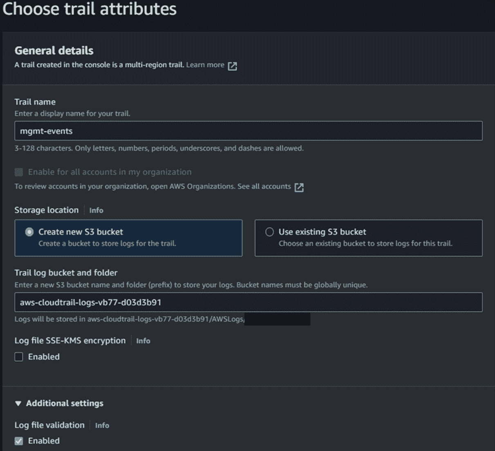

图 4.9 – 设置 CloudTrail 日志记录

在配置 CloudTrail 日志时，您可以启用将其自动馈送到 CloudWatch。我们将在本章的后续部分讨论 CloudWatch。实际上，将 CloudTrail 日志提供给 CloudWatch 允许 DFIR 团队将他们的调查和日志审查集中在一个控制台中，提供 **单一视窗** (**SPOG**) 查看日志：

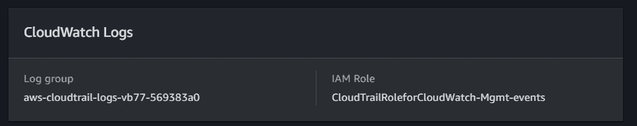

图 4.10 – AWS CloudWatch 与 AWS CloudTrail

在定义 CloudTrail 日志时，您还应该配置在 CloudTrail 中收集哪些类型的数据事件。在本节前面，我们提到了三种类型的数据事件：管理事件、数据事件和数据洞察事件。

以下屏幕截图定义了启用的配置，以便追踪收集记录。正如截图中所示，CloudTrail 将收集与 AWS 资源管理相关的事件，例如访问/查询、创建、修改或删除资源。例如，AWS IAM 管理员创建具有特权的另一个账户时，会触发一个管理事件，并记录在此追踪下：

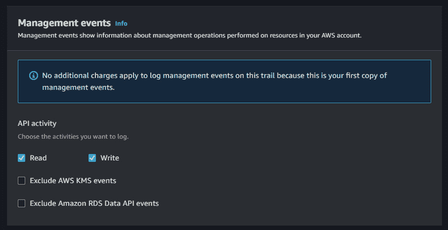

图 4.11 – CloudTrail 管理事件的配置

另一方面，数据事件专门收集与 AWS 资源内数据级活动相关的事件，例如跟踪存储在 S3 存储桶中的文件更改。监控数据事件使 DFIR 团队能够确认数据是否在这些 AWS 服务中被访问、修改或删除。下一个截图显示了启用数据事件所需的配置。它反映了 DFIR 团队配置并允许适当 CloudTrail 日志记录的选项：

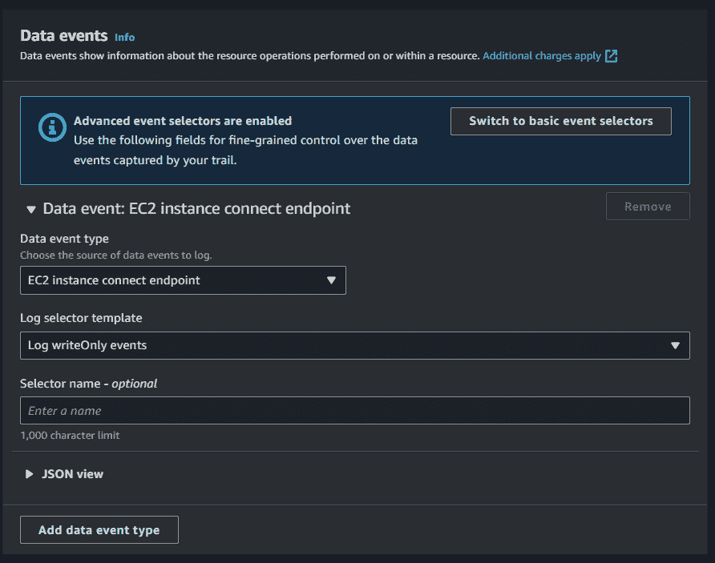

图 4.12 – CloudTrail 数据事件配置

### 日志文件验证

当您创建追踪时，还需要保护其完整性，以确保没有未经授权的更改。因此，我们还启用了日志文件验证复选框，以在生成追踪时强制执行完整性检查，确保其过程没有被篡改，并且在调查时准确。完整性检查结果将传送到与摘要相同的 S3 存储桶中。DFIR 团队可以利用日志文件摘要来验证日志文件的完整性。每个日志文件都会进行哈希处理并进行数字签名。CloudTrail 日志数据摘要文件使用 RSA 进行签名，每个区域生成一个私钥，使用私钥对 SHA-256 数据进行签名，产生数字签名。SHA-256 数据是从日志文件的**协调世界时**（**UTC**）时间戳、S3 路径、当前摘要文件的 SHA-256 哈希值（以十六进制格式表示）以及前一个摘要文件的签名（以十六进制格式表示）中生成的。这些元素共同构成了哈希字符串，用于生成数据的 SHA-256 哈希值，然后进行签名。

一旦签名生成，它会进一步以十六进制格式进行编码。十六进制签名随后会记录在存储在 S3 上的摘要文件的`x-amz-met-signature`标签中。

DFIR 团队可以选择稍后通过 AWS 管理控制台、API 或 AWS 命令行启用日志文件验证：

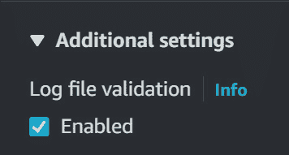

图 4.13 – 启用日志文件验证

## 事件数据存储

由于 CloudTrail 是一个审计工具，用于记录 AWS 账户内的事件/更改，安全团队必须指定数据湖，供过滤和存储这些事件用。一旦创建了追踪，AWS 将这些事件的数据湖称为**事件存储**。您可以根据跨 AWS 账户的不同区域过滤器创建一个或多个事件存储，用于存储管理或数据事件。事件存储提供最长 7 年的长期保留。组织可以将这些日志发送到集中管理的**安全信息和事件管理**（**SIEM**）解决方案。

一旦创建了事件存储，它实际上使 DFIR 团队能够立即使用它，并查询特定 AWS 资源（模块/服务）上的相关活动及事件详情。

以下截图展示了配置事件存储并应用过滤器所需的步骤。在本例中，我们选择了同一事件存储中的所有管理和数据事件：

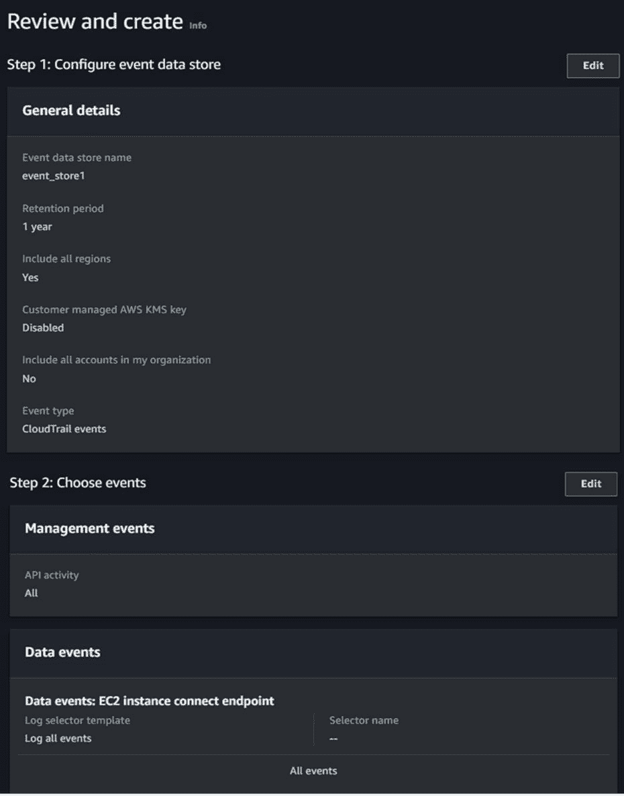

图 4.14 – 在 AWS CloudTrail 中配置事件存储

### 查询 CloudTrail 事件存储

CloudTrail 允许 DFIR 团队查询事件存储，所有管理和数据事件都存储在其中，类似于任何日志工具。简而言之，CloudTrail 事件可以使用 **SQL** 进行查询。

请注意，在 CloudTrail 中，由于事件是不可变的，只有 SQL `SELECT` 语句被允许。您可以使用 `WHERE` 子句应用过滤器。然而，CloudTrail 不允许用户在事件存储中操作数据。

虽然事件存储可以命名，DFIR 团队必须注意 AWS 生成的唯一事件数据存储 ID，以便执行 SQL 查询。以下截图展示了一个 SQL 查询及其相关查询结果。在本例中，我们查询以返回存储在事件存储中的全部值。然而，一旦熟练，DFIR 专家可以直接查询事件存储，以从存储中获取必要的信息：

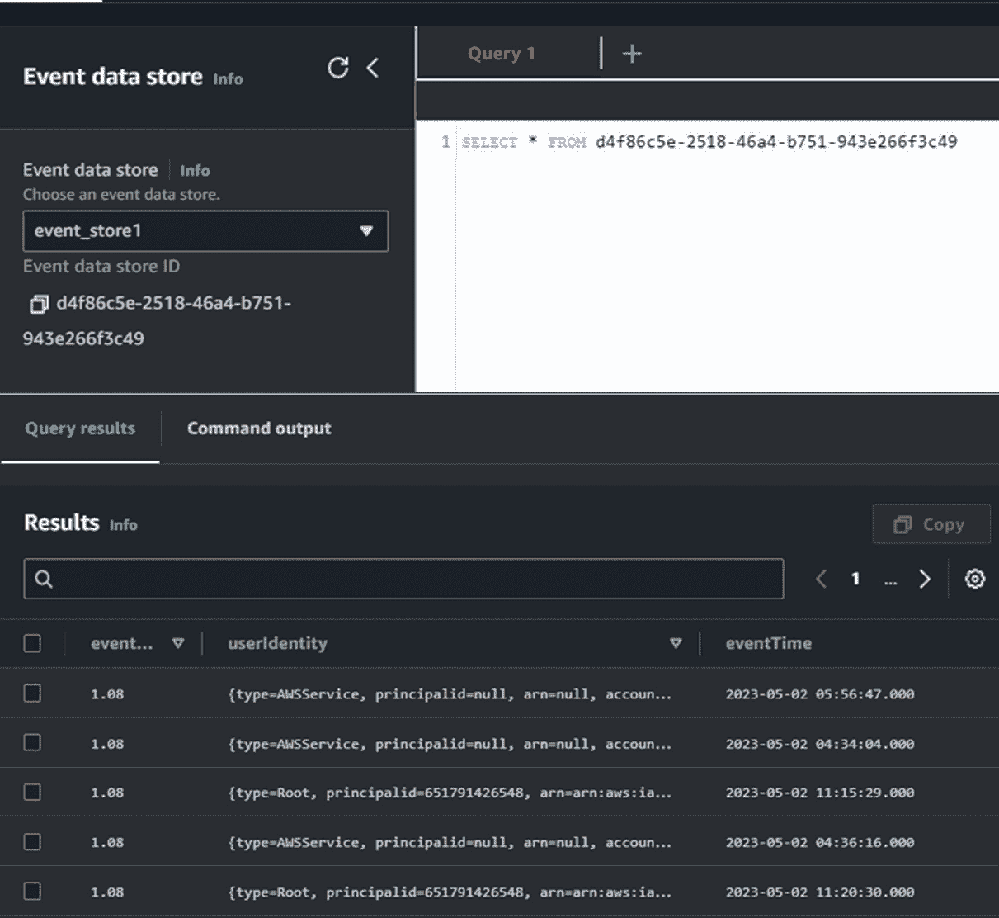

图 4.15 – 在 AWS CloudTrail 上进行简单 SQL 查询及结果

另一个例子是查询事件存储以识别最活跃的用户。在 DFIR 案例中，这可能像大海捞针一样，涉及多个用户和交互点。然而，您要寻找的是一个特定的异常值，从这个点开始进行调查。

## 调查 CloudTrail 事件

任何 DFIR 专家都希望能访问充满日志的事件存储，这些日志为调查提供了宝贵的信息。本节将探讨 DFIR 专家可以采取的一些调查策略，来调查 CloudTrail 事件。请注意，在 CloudTrail 事件存储上执行的任何查询也会记录在相同的事件存储中。

### 在事件存储中直接调查

DFIR 团队可以直接选择调查事件存储中的日志。例如，我们将调查事件存储，以识别哪些用户最频繁地从控制台访问 AWS 资源。

默认情况下，当您登录 CloudTrail 时，CloudTrail 会在其仪表盘中自动提供事件摘要，其中包括一些近期的用户活动。它还会记录其他 AWS 资源执行的任何 API 调用。它包含任何 AWS 内部资源间的 API 调用，以及通过 AWS 网络浏览器的用户交互。

例如，以下截图展示了该演示实验室中的一些近期事件。该仪表盘还允许 DFIR 团队点击并获取关于特定事件条目的更详细信息。仪表盘中的每个条目反映了每个事件：

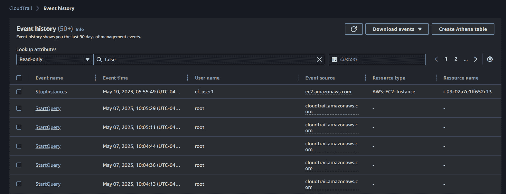

图 4.16 – 按时间降序排列的事件仪表板视图

例如，在第一个事件中，`cf_user1` 用户与 AWS EC2 资源进行了交互。我们从本书的 *第三章* 中了解到，每个 EC2 实例在 AWS 中都有一个唯一的实例 ID。因此，DFIR 团队更容易追溯并记住用户与哪个实例进行过交互，并收集特定的配置信息。通过总结视图，我们可以了解到，`cf_user1` 用户在 2023 年 5 月 10 日 05:55:49（UTC-04:00）停止了一个名为 `i-09c02a7e1ff652c13` 的 EC2 实例。如果 DFIR 团队需要更多信息，可以通过点击**事件名称**字段下的链接来获取。以下截图展示了捕获事件的详细信息：

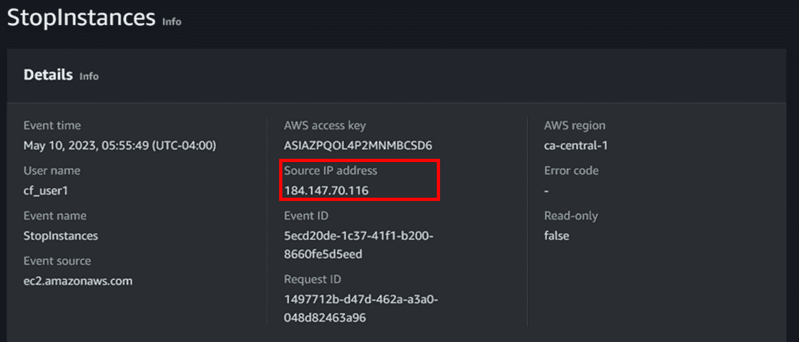

图 4.17 – 记录在 CloudTrail 中的事件的附加信息

需要注意的是，附加信息捕获了源 IP 地址，它记录了可能已入侵并访问此 AWS 账户的威胁行为者的 IP 地址。DFIR 团队可以进一步调查该 IP 地址，识别该用户或此源 IP 地址执行的其他活动，从而提供事件的时间线。在附加信息部分，DFIR 团队还可以捕获以 JSON 格式记录的原始事件数据。AWS 称之为**事件负载**。通常，事件负载可以通过**事件历史**下拉菜单访问。事件负载使 DFIR 团队能够查看原始日志，并确定用户或攻击者可能在受影响资源上执行的更具体操作。具体来说，它还识别了其他可能对进一步调查有用的元数据。以下是停止实例的原始事件日志或事件负载，如前述截图所示：

```
{
    "eventVersion": "1.08",
    "userIdentity": {
        "type": "IAMUser",
        "principalId": "AIDAZPQOL4P2OUQxxxxx",
        "arn": "arn:aws:iam::xxxxxxxx6548:user/cf_user1",
        "accountId": "xxxxxxxx6548",
        "accessKeyId": "xxxxxxxxxxxxMBCSD6",
        "userName": "cf_user1",
        "sessionContext": {
            "sessionIssuer": {},
            "webIdFederationData": {},
            "attributes": {
                "creationDate": "2023-05-10T09:55:05Z",
                "mfaAuthenticated": "true"
            }
        }
    },
    "eventTime": "2023-05-10T09:55:49Z",
    "eventSource": "ec2.amazonaws.com",
    "eventName": "StopInstances",
    "awsRegion": "ca-central-1",
    "sourceIPAddress": "184.147.70.116",
    "userAgent": "AWS Internal",
    "requestParameters": {
        "instancesSet": {
            "items": [
                {
                    "instanceId": "i-09c02a7e1ff652c13"
                }
            ]
        },
        "force": false
    },
    "responseElements": {
        "requestId": "1497712b-d47d-462a-a3a0-048d82463a96",
        "instancesSet": {
            "items": [
                {
                    "instanceId": "i-09c02a7e1ff652c13",
                    "currentState": {
                        "code": 64,
                        "name": "stopping"
                    },
                    "previousState": {
                        "code": 16,
                        "name": "running"
                    }
                }
            ]
        }
    },
    "requestID": "1497712b-d47d-462a-a3a0-048d82463a96",
    "eventID": "5ecd20de-1c37-41f1-b200-8660fe5d5eed",
    "readOnly": false,
    "eventType": "AwsApiCall",
    "managementEvent": true,
    "recipientAccountId": "xxxxxxxx6548",
    "eventCategory": "Management",
    "sessionCredentialFromConsole": "true"
}
```

在前述的原始事件负载中，我们已突出显示了日志中的一些关键元素或属性，DFIR 团队通常应注意这些内容：

+   `{"arn": "arn:aws:iam::xxxxxxxx6548:user/cf_user1"}`：在此实例中，我们有一个 IAM 普通用户使用唯一标识符（`xxxxxxxx6548`）登录到 AWS 账户。出于安全考虑，我们已对账户编号进行了标记。

+   `{userName": "cf_user1"}`：用于验证此会话的实际用户名。

+   `"attributes": {"creationDate": "2023-05-10T09:55:05Z"`, `"mfaAuthenticated": "true"}`：在用户通过多因素身份验证成功登录到 AWS 会话后创建的会话时间。这条记录表明用户已成功登录 AWS 控制台，并验证了其双因素令牌以完成身份验证过程。

+   `{"eventTime": "2023-05-10T09:55:49Z"}`：记录事件的实际日期和时间，使用 UTC 时间。

+   `{"sourceIPAddress": "184[.]147[.]70[.]116"}`：执行此事件的用户或威胁行为者的源 IP 地址。出于安全考虑，IP 地址已被隐藏。

+   `"instanceId": "i-09c02a7e1ff652c13"`, `"currentState": {"code": 64, "name": "stopping"}`, `"previousState": {"code": 16, "name": "running"}`：特定的事件条目反映了实例的当前和先前状态，确认执行了哪些具体操作。在此示例中，我们有一个正在运行的实例，用户登录后停止了该实例。

从 DFIR 调查的角度来看，可以推断和总结在此案例中执行的活动，并确定与调查相关的下一步行动。

### 下载并离线调查事件存储结果

由于 CloudTrail 事件日志采用 JSON 格式，您可以根据需要查询、过滤和提取结果进行调查，我们始终可以查询事件存储并下载日志以便离线查看。这在 DFIR 团队无法访问 AWS 的情况下特别有用。然而，从调查的角度来看，调查 CloudTrail 事件是至关重要的。

使用前面示例中捕获的源 IP 地址，我们将查询事件数据存储以识别来自该 IP 地址的活动。为此，我们将执行以下查询：

```
SELECT * FROM d4f86c5e-2518-46a4-b751-943e266f3c49 WHERE eventTime > '2023-04-30 00:00:00' AND sourceIPAddress='184.147.70.116'
```

请记住，事件数据存储是通过事件数据存储 ID 唯一标识的；我们根据我们的事件调查筛选日期，并进一步筛选 `sourceIPAddress` 属性。

虽然查询结果以表格形式显示，但您可以使用**复制**选项复制整个原始记录。您确实需要选择要复制的事件记录或所有内容：

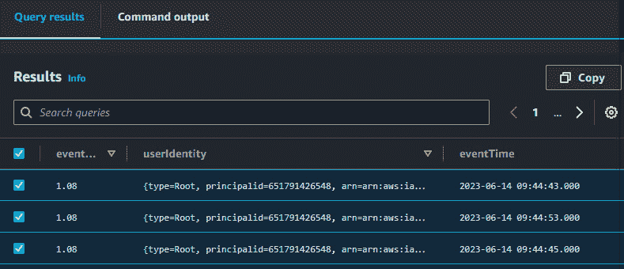

图 4.18 – 搜索查询结果

使用任何第三方工具（例如 CyberChef），您可以解析此 JSON 日志以进行进一步调查。或者，您可以使用任何日志解析工具来解析并进一步调查日志。

或者，您可以直接从关联的 Amazon S3 存储桶下载整个日志集。您可以通过导航到 CloudTrail 仪表盘并选择相关的轨迹名称来找到该 S3 存储桶的位置。请参见下一个截图以查看示例：

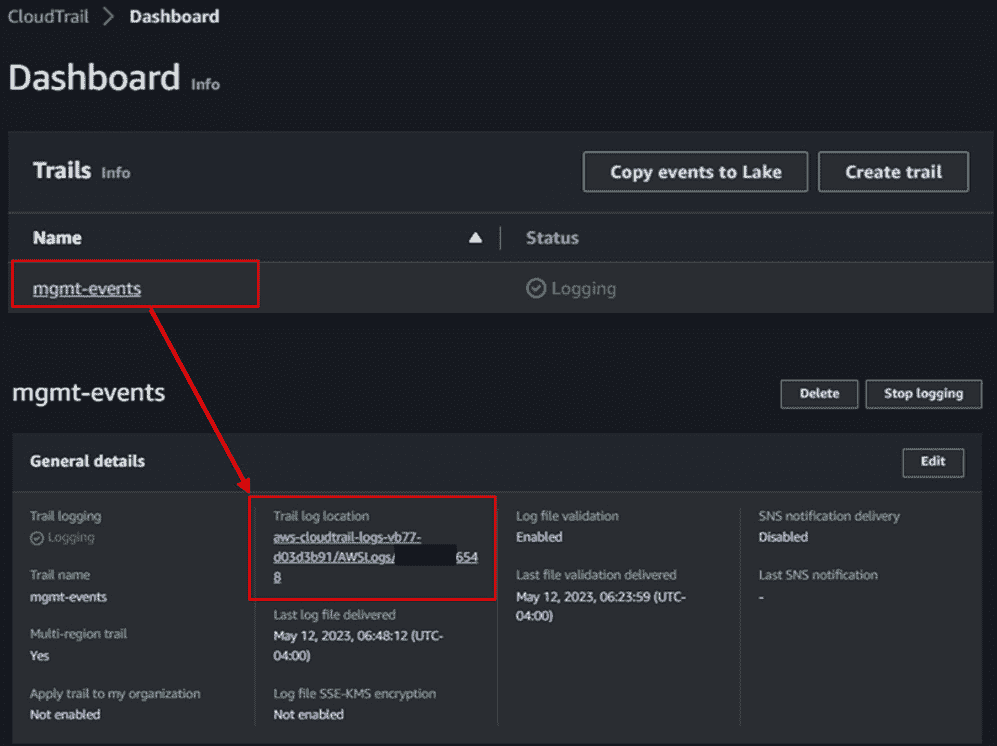

图 4.19 – 导航到 CloudTrail S3 存储桶

当您导航到 S3 存储桶时，您会注意到 CloudTrail 详情存储在两个不同的对象存储库中；一个包含摘要（我们在本章前面部分已经讨论过），其中包括用于验证日志完整性的信息，而另一个对象存储库是实际日志存储的位置。

日志进一步按区域存储，基于每个 AWS 区域中资源的操作位置，并将日志发送到 CloudTrail。DFIR 团队需要理解，AWS 按照日历天分解日志存储。在下载 S3 日志时，您需要在收集 S3 日志之前了解这些信息。下载 S3 上托管的所有数据可能非常庞大，并且从调查的角度来看可能没有什么帮助。然而，这取决于调查的具体情况。下一张截图提供了位于 `ca-central-1` 区域的 2023 年 5 月 1 日的日志样本集概览，以及 AWS 如何存储 CloudTrail 日志：

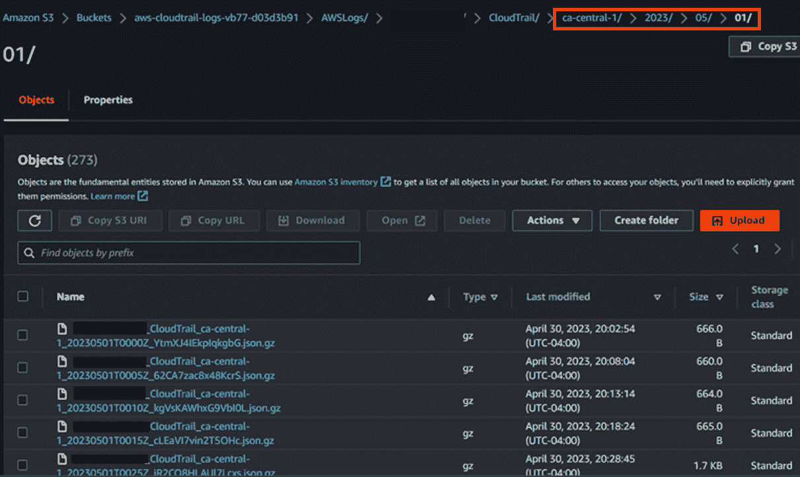

图 4.20 – 从 CA-Canada 中央区域获取 CloudTrail 日志

如果您拥有 AWS 的 API 访问权限，您可以同时下载多个文件。然而，AWS 限制了从 Web 控制台一次只能下载一个文件，这可能会使下载变得非常耗时。

虽然 CloudTrail 将其日志存储为 gzip 格式以节省存储空间，但 AWS 在下载时会以未压缩格式提供日志。

## CloudTrail 日志的 DFIR 使用案例

以下是启用 CloudTrail 的一些使用案例及其如何支持 DFIR 团队：

+   **事件调查**：CloudTrail 可以支持您的事件调查。可以调查一些常见的主题，如 AWS 账户被接管，其中攻击者创建了一个未经授权的账户，以在 AWS 内创建/修改资源。您可以使用 CloudTrail 日志来确定用户名、源 IP 地址以及他们是如何在 AWS 中进行身份验证的。CloudTrail 日志还提供了有关攻击者是否进行了特定修改以及以前设置的配置的关键信息。其他调查领域包括：

    +   **查找恶意或非法的 EC2 实例**：通过 CloudTrail 日志，您可以判断攻击者是否创建了 EC2 **虚拟机** (**VM**)，以访问特定的生产环境。CloudTrail 可以提供实例类型、实例 ID 等信息——这些信息可以用于进一步的调查追踪——以及这些非法 EC2 实例创建的日期和时间。由于 CloudTrail 记录跨多个区域的活动，DFIR 团队还可以利用 CloudTrail 日志来判断攻击者在多个 AWS 资源和不同区域间的横向移动。

    +   **未经授权的 API 调用**：由于 CloudTrail 跟踪 AWS 内部从一个资源到另一个资源的所有 API 调用，以及用户发起的 API 调用，CloudTrail 日志可以用来确定是否存在未经授权的 API 资源使用。例如，使用特定访问令牌的 API 调用突然激增，可以帮助 DFIR 团队快速判断相关账户是否被攻击者入侵，导致未经授权的访问。

+   **安全性和合规性审计**：由于 CloudTrail 的主要功能之一是创建所有活动的审计跟踪，CloudTrail 可用于监控与安全政策和法规的合规性。例如，在医疗保健行业，用户访问必须得到严格监控并基于最小权限原则提供，CloudTrail 日志可以帮助根据记录的活动微调这些权限，从而确保合规性。

+   **基础设施监控与故障排除**：除了 DFIR，CloudTrail 还可以为开发人员和应用程序测试人员提供帮助，确保他们的应用程序有效运行。CloudTrail 允许开发人员查看 API 调用并确定任何意外后果的原因。

# AWS CloudWatch

AWS **CloudWatch** 实时监控您的 AWS 资源。您可以在 SPOG 视图中收集和监控资源使用情况和关键指标。CloudWatch 会在其仪表板上显示每个资源的指标，方便快速查看。然而，对于 DFIR 团队，CloudWatch 可以查询特定日志以支持调查。

从安全角度看，CloudWatch 是一款日志管理解决方案，可以集中收集和监控来自系统、应用程序和资源的日志。它提供基于日志分析的交互式搜索和分析功能。与 CloudTrail 类似，CloudWatch 提供通过 S3 存储桶导出日志的功能。请注意，CloudWatch 中的日志永不过期，并且会无限期保留。管理员可以更改保留策略，并选择日志保留一天或最多 10 年。或者，组织可以通过 API 将 CloudWatch 日志发送到 SIEM 解决方案，以实现日志的集中监控和管理。

CloudWatch 是一项允许您交互式搜索和分析日志数据的服务。您可以监控来自 Amazon EC2 实例和 CloudTrail 记录事件的日志，创建警报，并接收特定 API 活动的通知以进行故障排除。此外，您还可以审计和屏蔽敏感数据，调整日志保留策略并归档日志数据。CloudWatch Logs 还可以记录 Route 53 接收到的 DNS 查询信息。它使用专门的查询语言，配有示例查询、命令描述、查询自动补全和日志字段发现功能，帮助您快速入门。

您可以通过以下任何方法访问 CloudWatch：

+   **AWS CloudWatch 控制台**：直接访问 CloudWatch 仪表板和日志

+   **AWS 命令行界面 (CLI)**：使用 Amazon 提供的模块通过常用终端或流行操作系统中的命令行控制台连接到 AWS

+   **CloudWatch API**：通过 API 使用您的技术发布或监控 AWS CloudWatch 日志

+   **AWS SDK**：构建应用程序，将日志发布到 CloudWatch

注意

从 DFIR 的角度来看，重要的是要注意，启用 CloudWatch 日志时，只会记录在 AWS 账户中执行的活动，而不会捕捉每个资源内具体执行的操作。（例如，CloudWatch 不会捕捉到用户/威胁行为者在 EC2 实例内执行的事件/记录。但它会记录威胁行为者是否登录到 AWS 控制台并进行更改、删除 EC2 实例等操作。）

下图展示了一个典型的日志配置，这些日志被记录到 CloudWatch 中：

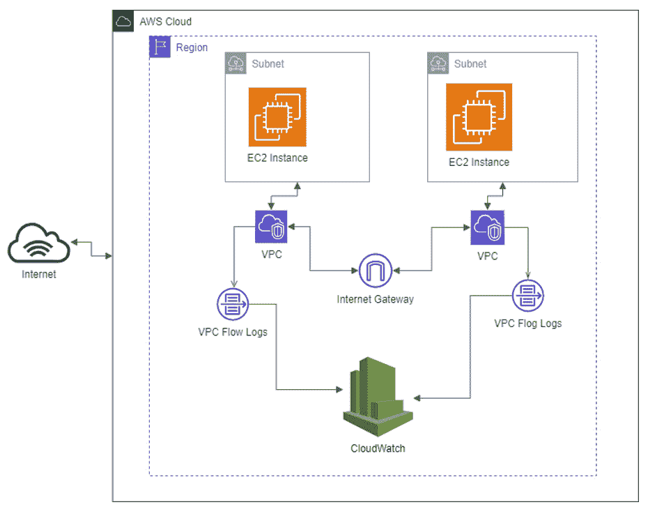

图 4.21 – 带有 VPC 的 EC2 实例的 CloudWatch 日志架构示例

接下来的章节将回顾 CloudWatch 和 CloudTrail 之间的区别，以及 DFIR 团队如何为事件调查配置它们。

## CloudWatch 与 CloudTrail 比较

接下来，让我们看看 CloudWatch 和 CloudTrail 之间的一些关键区别。DFIR 团队需要认识到它们功能上的差异，以及它们如何互补事件调查：

+   **CloudWatch 是一个日志管理工具**：CloudWatch 提供监控和可观察性功能，专门收集和展示来自各种 AWS 产品的资源使用情况和指标。它提供了一个 *实时* 的日志视图。

+   **CloudTrail 记录 API 交互**：CloudTrail 记录用户与内部 AWS 资源之间的 API 交互，创建 AWS 账户内所有活动的记录。与 CloudWatch 不同，CloudTrail 仅记录与 API 相关的活动，并允许针对应用程序故障排除或安全调查进行特定查询。

由于 CloudWatch 本质上是一个日志管理工具，它能够接收 CloudTrail 事件，因此可以通过一个单一控制台查看不同的日志来源。DFIR 团队可以使用 CloudWatch API 将日志拉入本地 SIEM 解决方案，以进行进一步的监控和调查。

## 设置 CloudWatch 日志记录

一旦组织建立了 AWS 账户，就可以启用 CloudWatch 日志记录。然而，启用该功能需要经过一些步骤，包括配置其他 AWS 资源的权限，以允许它们将日志发送到 CloudWatch。CloudWatch 是区域性的，因此最佳做法是在大多数 AWS 资源所在的区域创建 CloudWatch 配置。对于 DFIR 团队来说，启用 CloudWatch 可以加速事件调查过程。因此，如果组织没有 CloudWatch，设置适当的策略可以使流日志立即可用，这对调查至关重要。

### 配置 VPC 流日志

每个类别的日志都作为日志组记录在 CloudWatch 中。日志组是相似类型日志的集合。例如，所有 VPC 流日志将位于一个 CloudWatch 的日志组下；类似地，所有 CloudTrail 事件将位于一个单独的日志组中。在下一个示例中，创建了两个日志组，并为每个日志组启用了特定的日志记录。每个 AWS 资源将在每个日志组内以日志流的形式发布其流日志。例如，假设您有五个运行中的 EC2 实例，随后您再创建另外五个 EC2 实例。最终，当您登录到 CloudWatch 控制台时，您将看到一个日志组，其中包含多个日志流，通过网络接口 ID 唯一标识每个 EC2 资源。

请注意，日志流是一个网络流日志流，只捕获流中的特定元素。我们在本章的*VPC 流日志*部分中讨论了流日志包含的内容。每个日志流包含与网络接口相关的多个流日志条目，随后可以对其进行查询或分析以获取进一步的洞察。以下截图描述了 CloudWatch 如何按类别对所有流日志进行分组。在截图中，您会看到 VPC 流日志被分组在 `vpcgrp1` 下，而 CloudTrail 日志则被分组在 `aws-cloudtrail-logs-vb77-569383a0` 下：

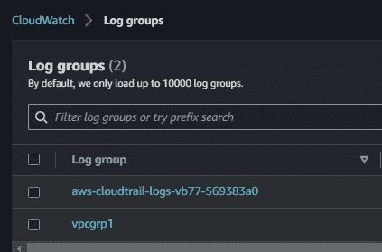

图 4.22 – CloudWatch 日志组

### VPC 流日志访问要求

由于 AWS 正在发布每个 EC2 实例的流日志，发布或发送到其他 AWS 资源，因此 AWS 要求帐户具有适当的 IAM 配置，以允许服务之间进行交互。默认情况下，AWS 不会自动启用日志发布到 CloudWatch（因为它是一个单独的订阅）。与流日志相关的权限必须具有适当的权限，以允许 VPC 将其发布到 CloudWatch。

从高层次来看，通常需要以下权限：

+   `CreateLogGroup`：请记住，如*图 4.22*所示，日志按类别进行分组。这允许写入权限创建具有特定名称的新日志组。

+   `CreateLogStream`：每个 EC2 资源将在日志组中以日志流的形式发布其 VPC 日志。这允许写入权限来为每个资源创建一个新的日志流。

+   `PutLogEvents`：允许在每个日志流内批量写入日志事件的权限。

+   `DescribeLogGroups`：描述或列出与 AWS 帐户关联的日志组。

+   `DescribeLogStream`：类似于日志组，它允许列出与帐户关联的特定日志组中的所有日志流。

+   `GetLogRecord`：允许读取单个日志事件中的所有字段。

+   `GetQueryResults`：允许读取/返回特定查询的查询结果。

CloudWatch 角色被分配了额外的权限：

+   `DescribeQueries`：允许列出最近执行的 CloudWatch Logs Insights 查询。

+   `StopQuery`: 允许停止 CloudWatch Logs Insights 查询执行的权限

+   `DeleteQueryDefinition`: 删除已保存的 CloudWatch 查询的权限

+   `PutQueryDefinition`: 创建和更新查询的权限

+   `GetLogDelivery`: 允许读取特定日志的日志交付信息

+   `ListLogDeliveries`: 类似于 `GetLogDelivery`，它允许列出与 AWS 账户相关的所有日志交付信息

+   `CreateLogDelivery`: 允许创建新的日志交付权限

+   `UpdateLogDelivery`: 允许编辑日志交付配置

除了 IAM 权限外，你还必须配置策略，允许流日志在你的 AWS 账户中承担特定角色。在此情况下，我们明确设置一个策略，允许 VPC 流日志在 AWS 账户内承担角色。策略将角色和资源分配与特定的资源访问条件组合在一起。策略是 IAM 通过将其附加到特定 IAM 用户或身份配置文件来管理权限的方式。策略在与身份、用户或资源关联时定义其权限。

接下来是一个 IAM 策略示例，使用 AWS 提供的可视化工具专门创建，以允许发布 VPC 流日志，并允许用户访问和查询日志：

```
{
    "Version": "2022-10-17",
    "Statement": [
        {
            "Sid": "VisualEditor0",
            "Effect": "Allow",
            «Action»: [
                "logs:DescribeQueries",
                "logs:GetLogRecord",
                "logs:StopQuery",
                "logs:TestMetricFilter",
                "logs:DeleteQueryDefinition",
                "logs:PutQueryDefinition",
                "logs:GetLogDelivery",
                "logs:ListLogDeliveries",
                "logs:Link",
                "logs:CreateLogDelivery",
                "logs:DeleteResourcePolicy",
                "logs:PutResourcePolicy",
                "logs:DescribeExportTasks",
                "logs:GetQueryResults",
                "logs:UpdateLogDelivery",
                "logs:CancelExportTask",
                "logs:DeleteLogDelivery",
                "logs:DescribeQueryDefinitions",
                "logs:DescribeResourcePolicies",
                "logs:DescribeDestinations"
            ],
            "Resource": "*"
        },
        {
            "Sid": "VisualEditor1",
            "Effect": "Allow",
            "Action": "logs:*",
            "Resource": "arn:aws:logs:*:xxxxxxxx6548:log-group:*"
        },
        {
            "Sid": "VisualEditor2",
            "Effect": "Allow",
            "Action": "logs:*",
            "Resource": [
                "arn:aws:logs:*:xxxxxxxx6548:destination:*",
                "arn:aws:logs:*:xxxxxxxx6548:log-group:*:log-stream:*"
            ]
        }
    ]
}
```

从高层次来看，下面是该策略的分解。该策略包含三个条目，形式为数组项：

+   **声明 1**: 允许的 CloudWatch Logs 操作列表。这些操作包括各种 CloudWatch Logs 的管理和数据检索操作。

+   `logs:*` 实例（CloudWatch Logs 操作）在特定的 AWS 账户内。这将包括与 AWS 账户相关联的所有日志组。

+   `logs:*` 与特定 AWS 账户相关联的实例，以及 AWS 账户内指定的所有日志流。

记住——策略允许用户访问、编辑或查询 CloudWatch 日志。然而，你需要在 AWS 资源之间设置信任关系，以便其能够首先共享/发布日志。通常，在你首次设置并启用 CloudWatch 时，这个过程会自动完成。但你也可以为特定的资源之间的信任关系制定详细的信任策略。以下是一个在 IAM 模块中配置的信任关系示例：

```
{
    "Version": "2012-10-17",
    "Statement": [
        {
            "Effect": "Allow",
            "Principal": {
                "Service": "vpc-flow-logs.amazonaws.com"
            },
            "Action": "sts:AssumeRole"
        }
    ]
}
```

上面的 JSON 代表了一个 IAM 角色信任策略，允许 Amazon VPC 流日志服务（`vpc-flow-logs.amazonaws.com`）承担该角色。此信任策略用于在 IAM 角色与信任实体之间建立信任关系（在此情况下是 VPC 流日志服务）。`AssumeRole` 安全令牌允许相关 AWS 资源获得一组临时安全凭证，在此情况下，VPC 服务可以使用这些凭证与其他 AWS 服务（如 CloudWatch）进行通信，传递流日志。`AssumeRole` 允许跨账户访问，并可用于向任何 AWS 服务发出 API 调用。

## 在 AWS 控制台上查询 CloudWatch 日志

对于在 AWS 内手动查询 CloudWatch，DFIR 团队可以利用 Logs Insights 构建特定的调查查询。Logs Insights 提供交互式查询功能，用于搜索和分析日志数据。CloudWatch 自动从各种日志源（包括以 JSON 格式发送到 CloudWatch 的任何自定义日志）中识别相关字段。您还可以创建包括图形在内的视觉输出作为 Logs Insights 查询的一部分。

在下一个示例中，我们正在查看 VPC 流日志。然而，在查询时，您可以选择所有日志组。以下屏幕截图展示了在 CloudWatch Logs Insights 中查询的示例。该查询针对`vpcgrp1`日志组，以识别生成流日志的`LogStream`（源网络标识符），以及**日志**（在查询多个日志组时，识别日志所在的账户和日志组非常有用）。选择适当的时间范围，以便 CloudWatch 查找日志：

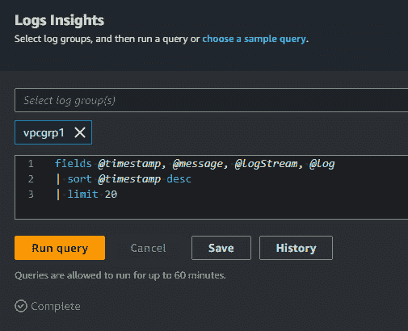

图 4.23 – CloudWatch 的样本查询

当您在 Logs Insights 中查询时，CloudWatch 将生成结果和直方图，允许调查人员根据直方图中确定的异常拖动和选择时间线。下一个屏幕截图是这样一个查询结果的示例，其中直方图概述了基于时间戳的事件及每个日期和时间条目的记录数量：

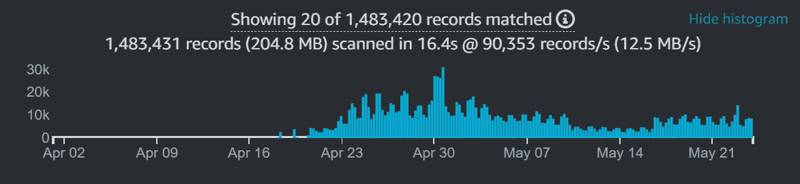

图 4.24 – CloudWatch 生成的 VPC 流量样本可视化

通过仅使用样本查询来确定所有 VPC 日志观察到的流量模式，您可以进一步开始筛选进行调查。如果调查对象被钉定为与特定日志流连接的 EC2 实例，则可以按日期（通过选择选项）和特定的 VPC 日志流进行筛选。每个查询还将为您提供日志的摘要详情（作为简单字符串），以及如*图 4.24*所示的可视化。

CloudTrail 还提供预定义的查询，以帮助 DFIR 团队开始；他们可以使用这些基本查询来修改并应用必要的过滤器，以获取他们调查所需的结果。

我们使用了样本查询来确定所有被标记为`ACCEPT`的网络流量，这意味着被 VPC 和 EC2（通过安全组配置）允许，并检查了每个会话的流量量：

```
filter action="ACCEPT" | filter bytesTransferred > 100 | stats sum(bytes) as bytesTransferred by srcAddr, srcPort, dstAddr, dstPort, action
```

前述查询针对所有 VPC 日志流运行；然而，如果我们不指定*limit*结果选项，AWS 将限制结果为 1,000 条记录，以避免拉取结果时的资源限制。

下一个屏幕截图概述了我们运行前述查询后获得的结果：

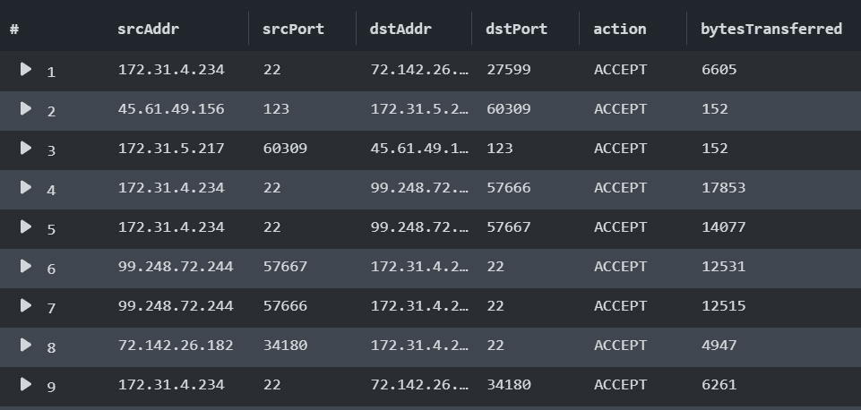

图 4.25 – CloudWatch 查询结果

让我们来看一个通过 SSH 进行的数据外泄示例。我们想要确定 AWS EC2 实例与远程威胁行为者控制的服务器之间的出站网络流量。你可以使用 CloudWatch 查询来过滤特定 IP 地址或仅使用源端口（`srcPort`）来识别哪个其他 EC2 实例被这个 IP 地址访问。在下一个示例中，我们特别关注所有的出站网络连接。如果你对某个特定端口的入站网络活动感兴趣，可以在过滤器中设置目标端口（`dstPort`）：

```
filter action="ACCEPT" | filter bytesTransferred > 100 | filter srcPort=22 |stats sum(bytes) as bytesTransferred by srcAddr, srcPort, dstAddr, dstPort, action
```

我们可以通过 CloudWatch 提供的结果和相关可视化查看网络峰值。如前所述，由于 CloudWatch 提供交互式查询功能，你可以点击并选择特定的流量峰值，从而过滤出与这些网络出站峰值相关的时间范围。在下一个截图中，我们深入分析了 CloudWatch 识别出的网络峰值：

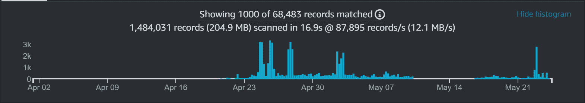

图 4.26 – 初始查询结果

为了继续常规调查，我们通过交互式选择峰值来选择日期/时间，这样可以提供更细致的可视化。请注意，过滤器中的日期/时间现在已转换为小时：

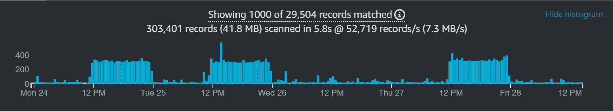

图 4.27 – 出站网络流量的细粒度视图

通过这次深度分析，我们可以将网络流量浓缩为三个大的峰值，这些峰值归因于出站网络活动。请注意，流量模式仍然表明多个 IP 地址，其中一些可能仍然是合法的。为了确定潜在的威胁行为者 IP 地址，同时，在同一屏幕上应用时间过滤器，我们将编辑查询，以识别数据传输量从最多到最少的 IP 地址。在数据外泄场景中，威胁行为者通常会从服务器中外泄大量信息。在这个示例中，我们将出站网络流量过滤为超过 1,000,000 字节（大约 1MB）传输的数据，并按降序排列：

```
filter action="ACCEPT" | filter bytesTransferred > 1000000 | filter srcPort=22 |stats sum(bytes) as bytesTransferred by srcAddr, srcPort, dstAddr, dstPort, action | sort bytesTransferred desc
```

结果，我们在 3 个网络峰值事件中大约获得了 19 个数据传输事件，这些事件可能与数据外泄活动有关。由于我们已经过滤了结果，DFIR 团队现在可以使用目标 IP 地址字段执行某种形式的**开源情报**（**OSINT**），以确定 IP 地址的合法性，从而进一步锁定或应用必要的过滤器：

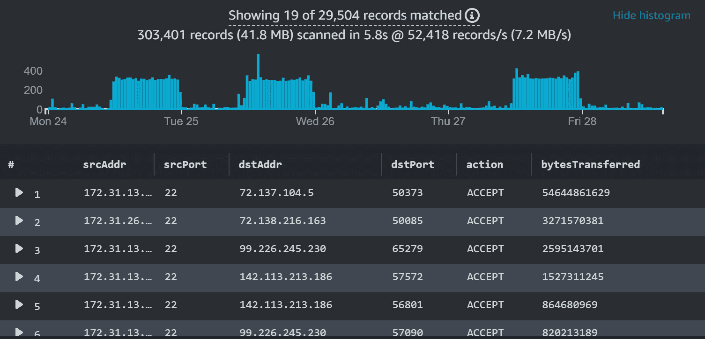

图 4.28 – 超过 1MB 的数据外泄查询结果

正如我们在按字节传输量排序的结果中看到的那样，我们可以立即开始查看这些峰值，并将其与其余的调查进行对比关联。这只是一个 IP 地址过滤器的示例，用于识别与特定 IP 地址相关的网络活动：

```
filter action="ACCEPT" | filter bytesTransferred > 1000000 | filter srcPort=22  | filter dstAddr="72.137.104.5" |stats sum(bytes) as bytesTransferred by srcAddr, srcPort, dstAddr, dstPort, action | sort bytesTransferred desc
```

我们在下一个截图中看到查询的结果：

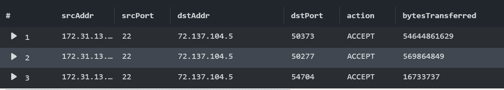

图 4.29 – 基于 IP 地址的网络活动

如我们所知，VPC 流日志类似于 NetFlow 日志；我们可以利用提取的结果进一步查询以确定网络流量的来源——即，流量来自哪一个 EC2 实例。你可以通过关联源 IP 地址字段（`srcAddr`）并将其映射回在事件期间分配给该 IP 的 EC2 实例来实现这一点。我们修改此查询以获取以下字段：

+   `timestamp`：事件的日期和时间

+   `message`：以消息格式呈现的 NetFlow 摘要

+   `logStream`：负责该消息的 VPC 日志流

下一个查询旨在获取整个数据外泄活动的消息和日志流信息：

```
filter action="ACCEPT" | filter srcPort=22 | filter dstAddr="72.137.104.5" | fields @timestamp, @message, @logStream
```

基于先前所示的查询，我们可以在截图中看到每个事件的详细信息。这使得 DFIR 团队能够获得网络流日志的具体信息及其他元数据：

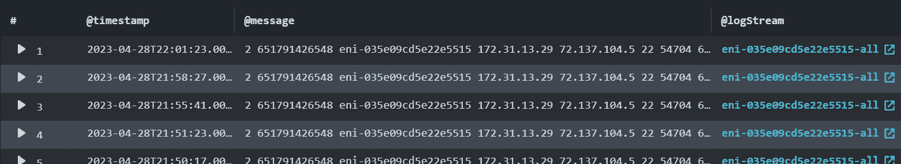

图 4.30 – 前述查询结果的截图

前述结果为每一行的日志信息提供了超链接，并展示了其他关键数据。通过每一行的下拉选项，提供了进一步调查所需的附加信息。在下一个截图中，我们展开了一个示例日志事件，突出了 VPC 流日志捕获的字段：

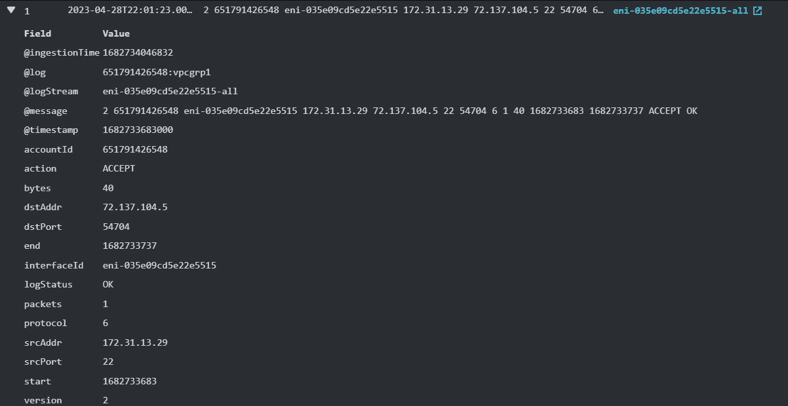

图 4.31 – 额外的 VPC 流日志信息

你可以使用预设的 CloudWatch 查询添加额外的过滤器，以进一步推进你的调查。通过前面截图中反映的附加信息，我们可以将出站网络流量的源头锁定到特定的 EC2 实例，通过关联 ENI ID 与 EC2 实例来实现。总的来说，我们从 89,827 条记录开始，经过适用的时间过滤器后，筛选出了数据外泄最多的 3 条记录。作为 DFIR 团队，你们必须进一步对其他 IP 地址进行切片和分析；这演示了 CloudWatch 如何为调查提供支持。

## CloudWatch 的 DFIR 使用案例

通过本章的各个部分，我们现在知道了 CloudWatch 在 DFIR 角度中的重要性。接下来是一些使用案例，展示 CloudWatch 如何用于取证调查和异常检测：

+   **日志审查**：正如我们所知，CloudWatch 提供了一个集中式的日志仓库，包括 CloudTrail 日志。因此，它提供了一个 SPOG，DFIR 团队可以快速查询所有日志并得出调查结果。你可以利用 CloudWatch 来检测异常活动和未经授权的访问，并关联来自各个日志源的事件，这些日志源已被引入 CloudWatch。

+   **异常检测**：DFIR 团队可以根据特定的指标（例如 CPU 利用率、网络流量或存储）定义阈值和警报，以识别异常模式或与正常行为的偏离。异常指标可以作为安全漏洞或实例被入侵的早期指示。

+   **IR 自动化**：CloudWatch 原生集成其他基于工作流的服务，包括 AWS Lambda 和 AWS Systems Manager Automation，用于在特定事件警报发生时自动化执行隔离、快照创建和用户账户变更。工作流基于触发器，可以实现自动修复和隔离操作。

+   **合规性和审计**：由于 CloudWatch 提供集中化的日志记录和监控功能，这也支持合规性监控和审计支持。DFIR 团队可以利用 CloudWatch 日志和指标来证明遵循安全政策、跟踪用户活动，并生成合规性审计报告。

# 亚马逊 GuardDuty

**GuardDuty** 是一项威胁检测服务，旨在通过持续监控恶意活动和未经授权的行为，帮助保护 AWS 资源和工作负载。请注意，这是一项检测服务，而不是响应服务。它检测并通知用户 AWS 资源中的潜在威胁。然而，与自动化服务（如 Lambda）的集成将增强 GuardDuty 基于已建立的响应计划，针对每个检测到的威胁进行响应。GuardDuty 使用机器学习（ML）、异常检测和集成的 TI 来识别 AWS 环境中的潜在安全威胁。

一些 DFIR 使用案例如下：

+   **威胁检测**：GuardDuty 分析 CloudTrail 日志、VPC 流日志和 DNS 日志，以检测 **入侵指标**（**IOCs**）和潜在威胁。它应用机器学习算法来识别可能表示恶意活动的模式和异常，例如未经授权的访问尝试、侦察行为或表现出与恶意软件或僵尸网络相关的行为的实例。这些 IOCs 通过 AWS 的 TI 合作伙伴和第三方供应商工具收集，并提供给其客户。DFIR 团队无法控制或管理这些 IOCs。

+   **TI**：GuardDuty 利用来自 AWS、合作伙伴组织和开放源情报（OSINT）的 TI 数据流来增强其威胁检测能力。它将 AWS 环境中的网络活动与已知的恶意 IP、域名和其他指示符进行比较，以识别潜在的安全风险。

+   **集中式安全监控**：GuardDuty 提供一个集中视图，显示跨 AWS 账户和区域的安全发现。它汇总并优先排序安全警报，使安全团队能够专注于最关键的威胁。合并的仪表板和事件流可以快速检测和响应潜在的安全事件。

+   **自动化修复**：GuardDuty 与其他 AWS 服务（如 AWS Lambda 和 AWS Systems Manager）集成，便于自动响应安全事件。您可以编排自定义动作，或使用预构建的响应手册来自动化修复操作，例如隔离被攻陷的实例、阻止恶意 IP，或更新安全组。

+   **安全操作和 IR**：GuardDuty 在安全操作和 IR 工作流中至关重要。它提供实时警报和发现，帮助安全团队快速调查并响应潜在的安全事件。与 AWS 服务如 Amazon CloudWatch 和 AWS Lambda 的集成，使得自动化 IR 和安全团队能够立即采取行动。

### 权限和信任

要利用 GuardDuty 的功能，DFIR 团队必须确保至少允许以下权限：

+   `ec2:DescribeInstances`：描述 EC2 实例

+   `ec2:DescribeImages`：描述 EC2 实例的镜像

+   `ec2:DescribeVpcEndpoints`：识别 VPC 端点名称

+   `ec2:DescribeSubnets`：识别 VPC 子网信息

+   `ec2:DescribeVpcPeeringConnections`：识别并列举 VPC 对等连接信息

+   `ec2:DescribeTransitGatewayAttachments`：识别 VPC 中继网关（如果有）

+   `organizations:ListAccounts`：列出 AWS 账户（组织）下配置的用户账户

+   `organizations:DescribeAccount`：描述 AWS 账户类型（用户/根账户）

+   `s3:GetBucketPublicAccessBlock`：检查桶是否有 S3 公共访问阻止

+   `s3:GetEncryptionConfiguration`：获取 S3 数据加密配置信息

+   `s3:GetBucketTagging`：获取 S3 桶标签

+   `s3:GetAccountPublicAccessBlock`：检查 AWS 账户是否有 S3 公共访问阻止

+   `s3:ListAllMyBuckets`：列举 AWS 账户拥有的所有 S3 桶

+   `s3:GetBucketAcl`：列举 S3 桶的访问控制列表（ACL）

+   `s3:GetBucketPolicy`：列举 S3 桶策略

+   `s3:GetBucketPolicyStatus`：获取当前桶策略状态

此外，Amazon GuardDuty 服务要求其假设特定的 IAM 角色。这些角色可以配置附加的策略，并可能附加到角色上。Amazon GuardDuty 通常需要`sts:AssumeRole`角色来委派访问权限。允许 GuardDuty 假设此角色，使其能够代表角色执行基于分配权限的授权操作。

### 亚马逊 GuardDuty 恶意软件扫描

在 EC2 实例和其他资源上启用恶意软件扫描是开始寻找恶意软件的一个好方法。GuardDuty 提供了一个内置服务，可以修改现有的 EC2 实例，使其原生地扫描 EC2 端点以寻找妥协或恶意软件的证据。它会检查数据存储，如 Amazon EBS 卷以及附加到特定 EC2 实例的其他存储形式。如果发现恶意软件的证据，还可以获取相关存储卷的快照。

根据 AWS 账户及其运营区域，Amazon GuardDuty 通过以下供应商提供恶意软件扫描功能：Bitdefender、CloudHesive、CrowdStrike、Fortinet、Palo Alto Networks、Rapid7、Sophos、Sysdig、Trellix。对于 DFIR 团队来说，这意味着他们无需在受影响的 AWS 资源（如 EC2）上集成或部署软件；相反，他们只需在特定的 AWS 账户上启用 GuardDuty 并启动恶意软件扫描，这些解决方案会自动提供，并允许扫描 EBS 中是否存在恶意软件。

注意

Amazon GuardDuty 在以下情况下特别有益：当安装在 EC2 实例内的防病毒软件可能已被威胁者禁用或篡改时。GuardDuty 对 EC2 实例的恶意软件扫描可以提供有关恶意活动或威胁者下载恶意软件的深入信息，从而执行任何恶意行为，而无需额外的安全工具部署。这一点特别有用，因为威胁者通常不会去禁用 GuardDuty。

GuardDuty 还与 CloudWatch 集成，无需特别配置，DFIR 团队可以根据恶意软件扫描查询其他遥测数据。以下截图展示了 GuardDuty 与 CloudWatch 集成的示例，特别是恶意软件扫描事件：

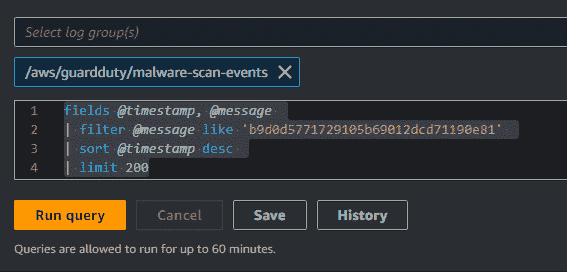

图 4.32 – Amazon GuardDuty 恶意软件扫描的 CloudWatch 查询示例

除了恶意软件扫描外，GuardDuty 还根据 TI（威胁情报）提供有关威胁的见解，并检测 AWS 账户内各种资源执行的活动。以下是 GuardDuty 生成的示例集，展示了不同的检测结果。请注意，每个检测结果都由 GuardDuty 评估，并标记为高风险、中风险或低风险：

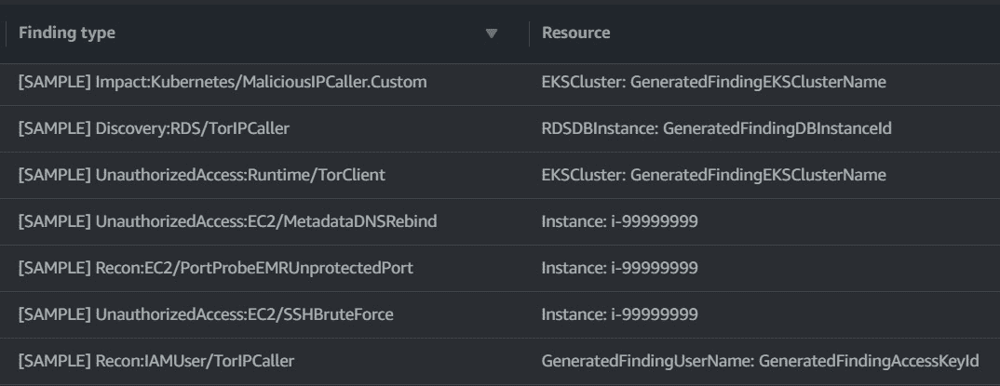

图 4.33 – Amazon GuardDuty 内的样本威胁检测

一旦启动恶意软件扫描，GuardDuty 会生成一个独特的检测器 ID 来唯一标识每次扫描。我们在其中一台 EC2 实例上启动了扫描，以确定是否存在恶意软件的迹象。接下来是该 EC2 实例上恶意软件扫描的 JSON 输出，展示了一个正在进行的扫描示例：

```
{
  "DetectorId": "26c440764b66ddeb7ff50f0881fc5e52",
  "AdminDetectorId": "26c440764b66ddeb7ff50f0881fc5e52",
  "ScanId": "b9d0d5771729105b69012dcd71190e81",
  "ScanStatus": "RUNNING",
  "ScanStartTime": "2023-06-03T11:53:24.000Z",
  "TriggerDetails": {},
  "ResourceDetails": {
    "InstanceArn": "arn:aws:ec2:ca-central-1:xxxxxxx6548:instance/i-00229ce2dd123a2e6"
  },
  "ScanResultDetails": {},
  "AccountId": "xxxxxxxx6548",
  "AttachedVolumes": [
    {
      "VolumeArn": "arn:aws:ec2:ca-central-1:xxxxxxxx6548:volume/vol-061392d9abebf9433",
      "VolumeType": "gp2",
      "DeviceName": "/dev/sda1",
      "VolumeSizeInGB": 30,
      "EncryptionType": "UNENCRYPTED"
    },
    {
      "VolumeArn": "arn:aws:ec2:ca-central-1:xxxxxxxx6548:volume/vol-06c47b3cf15b2d6ae",
      "VolumeType": "gp3",
      "DeviceName": "xvdb",
      "VolumeSizeInGB": 30,
      "EncryptionType": "UNENCRYPTED"
    }
  ],
  "ScanType": "ON_DEMAND"
}
```

扫描完成后，GuardDuty 会生成一份扫描报告，可以通过 **恶意软件扫描** 页面访问，并获取唯一的 GuardDuty 恶意软件扫描检测 ID。下一张截图展示了 Amazon GuardDuty 在磁盘（Amazon EBS 存储）上识别到潜在的恶意软件：

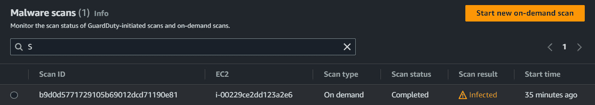

图 4.34 – Amazon GuardDuty 恶意软件扫描检测

这使得 DFIR 团队可以确认恶意软件的存在并进一步追踪威胁。接下来是检测结果的示例。我们看到扫描已在磁盘上发现了八个威胁，以下是其中一个威胁的样本检测摘要：

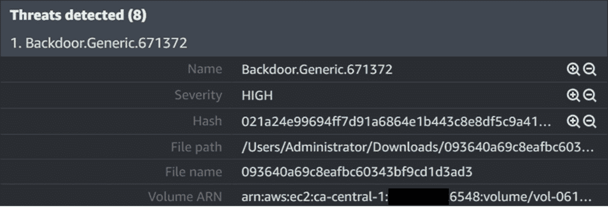

图 4.35 – Amazon GuardDuty 恶意软件扫描检测

如你所见，恶意软件扫描识别了检测到的样本名称，通常由扫描此二进制文件的供应商分配。磁盘上文件的 SHA-256 哈希值对于 DFIR 团队在进一步的威胁狩猎和检测中非常有用。文件路径和名称标识文件的位置，并允许 DFIR 团队手动收集该文件所在的 AWS 卷信息。在 AWS 方面，这是 AWS 资源命名约定的一部分，用于确定账户所有者和此检测发生在哪个卷上的信息（`arn:aws:ec2:ca-central-1:xxxxxxxx6548:volume/vol-061392d9abebf9433`）。

DFIR 团队还可以通过摘要页面识别扫描此实例的合作伙伴。在我们的例子中，Bitdefender 扫描了这个检测：

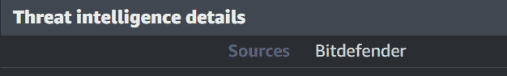

图 4.36 – Amazon GuardDuty 扫描器

一旦 Amazon GuardDuty 完成扫描，它允许 DFIR 团队也可以进入 Amazon Detective 服务：

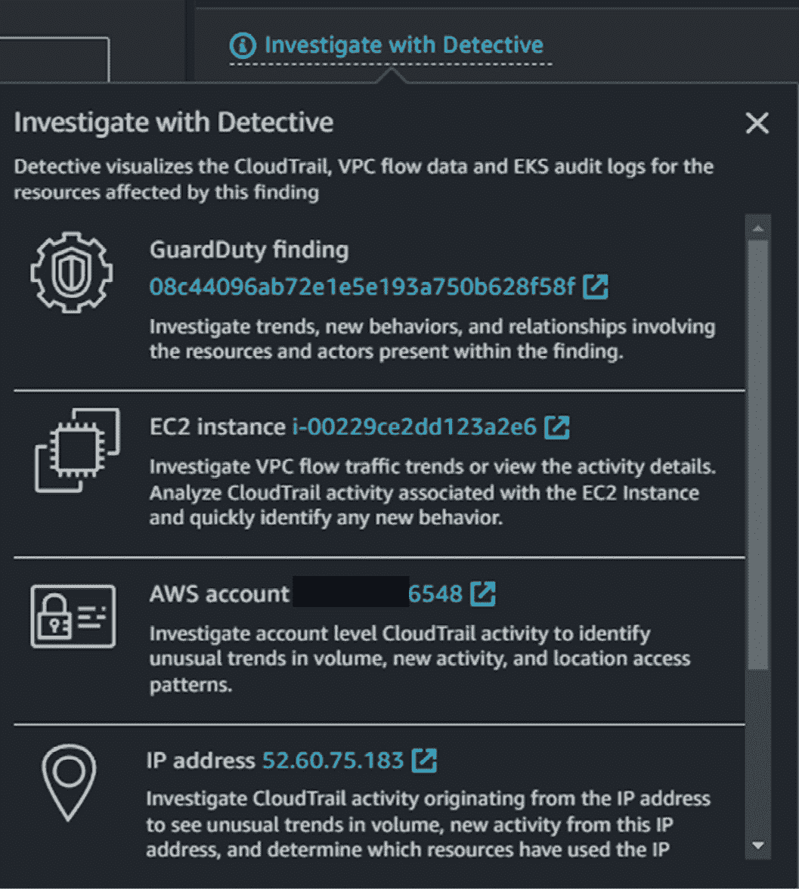

图 4.37 – Amazon Detective 在 Amazon GuardDuty 检测中的操作手册

# Amazon Detective

Amazon Detective 帮助 DFIR 团队分析、调查和可视化来自各种 AWS 服务的安全数据。它自动收集并分析来自 AWS CloudTrail、Amazon VPC 流日志和 Amazon GuardDuty 的日志数据，提供有关 AWS 环境中潜在安全漏洞和可疑活动的见解。Amazon Detective 的一些功能如下：

+   **安全图谱**：Amazon Detective 采用基于图形的方法，通过创建 AWS 资源、账户及其关系的图形表示，来可视化和分析与安全相关的数据，使得 DFIR 团队能够快速识别模式、异常和潜在的安全威胁。

+   **自动数据摄取**：Amazon Detective 自动收集并摄取来自 AWS CloudTrail、Amazon VPC 流日志和 Amazon GuardDuty 的数据，以便聚合和处理，提供洞察和建议。

+   **威胁狩猎**：Amazon Detective 为 DFIR 团队提供预构建的查询和分析工具，帮助他们主动寻找安全威胁和异常。这些查询利用机器学习算法和统计模型来识别可疑活动和潜在的安全问题。

+   **安全发现**：Amazon Detective 根据其对收集数据的分析结果呈现安全发现。这些发现被优先排序，并包括关于账户、资源、活动和潜在威胁的详细信息。它还包括支持证据和物证，以便进行进一步调查。

注意

请注意，要启用 Amazon Detective，必须先拥有 Amazon GuardDuty。

# 总结

总结一下，AWS 提供了 API 日志和通用事件日志的集成，并提供了一个 SPOG（单一管理界面）来确定 AWS 账户中的威胁行为者活动或内部威胁。通过 CloudWatch 和 CloudTrail，DFIR 团队可以使用 AWS 的工具本地调查 AWS，并以细粒度识别未经授权的用户执行的活动。此外，诸如 EC2 和 S3 之类的资源提供了有关配置的更多信息，这些信息使 DFIR 团队能够推断并获取进一步的调查数据。请记住，一些安全解决方案，例如 VPC 流日志，默认情况下未启用，需要账户所有者或管理员显式地允许它们。将 CloudTrail 日志与 CloudWatch 集成，并启用 Amazon GuardDuty，为 DFIR 团队提供了对 AWS 账户和资源内威胁的深入洞察，而无需显式部署安全工具。启用 GuardDuty，随后启用 Amazon Detective，可以提供遥测信息，使 DFIR 团队能够定位威胁并执行额外的威胁狩猎。组织和 DFIR 团队必须意识到，启用任何安全功能会单独收费，并会反映在下一个账单中。

在接下来的几章中，我们将类似地探索 Microsoft Azure 和 Google Cloud 的原生调查能力，并最终将它们与其他开源和商业工具结合，以从这些云实例中提取取证文物，供离线调查使用。总体目标是确保 DFIR 团队拥有足够的信息和来自多个日志源的数据，这些数据能够验证威胁行为者的活动，并使团队能够通过这些工具确认未经授权的活动，达到毫无疑问的程度。

# 进一步阅读

+   *CIDR/VLSM* *计算器*：[`www.subnet-calculator.com/cidr.php`](https://www.subnet-calculator.com/cidr.php)

+   端口号分配：[`www.iana.org/assignments/service-names-port-numbers/service-names-port-numbers.txt`](https://www.iana.org/assignments/service-names-port-numbers/service-names-port-numbers.txt)

+   *CloudTrail* *概念*：[`docs.aws.amazon.com/awscloudtrail/latest/userguide/cloudtrail-concepts.xhtml#cloudtrail-concepts-data-events`](https://docs.aws.amazon.com/awscloudtrail/latest/userguide/cloudtrail-concepts.xhtml#cloudtrail-concepts-data-events)

+   网络版瑞士军刀——一个用于加密、编码、压缩和数据分析的网页应用：[`gchq.github.io/CyberChef/`](https://gchq.github.io/CyberChef/)

+   Amazon GuardDuty——针对 Amazon EBS 卷的恶意软件保护：[`aws.amazon.com/blogs/aws/new-for-amazon-guardduty-malware-detection-for-amazon-ebs-volumes/`](https://aws.amazon.com/blogs/aws/new-for-amazon-guardduty-malware-detection-for-amazon-ebs-volumes/)

+   *Bitdefender 和 Amazon Web Services 加强云* *安全性*：[`businessinsights.bitdefender.com/bitdefender-and-amazon-web-services-strengthen-cloud-security`](https://businessinsights.bitdefender.com/bitdefender-and-amazon-web-services-strengthen-cloud-security)

+   GuardDuty 恶意软件防护简介：[`www.cloudhesive.com/blog-posts/new-guardduty-malware-protection/`](https://www.cloudhesive.com/blog-posts/new-guardduty-malware-protection/)

+   *Prisma Cloud 支持 Amazon GuardDuty 恶意软件* *防护*：[`www.paloaltonetworks.com/blog/prisma-cloud/amazon-guardduty-malware-protection/`](https://www.paloaltonetworks.com/blog/prisma-cloud/amazon-guardduty-malware-protection/)

+   *使用 Amazon GuardDuty 和* *Sysdig 进行恶意软件狩猎*：[`sysdig.com/blog/hunting-malware-with-amazon-guardduty-and-sysdig/`](https://sysdig.com/blog/hunting-malware-with-amazon-guardduty-and-sysdig/)

+   *Trellix 利用 Amazon GuardDuty 恶意软件防护进行扩展检测与响应（**XDR）*：[`www.trellix.com/en-us/about/newsroom/stories/xdr/trellix-leverages-amazon-guardduty-malware-protection.xhtml`](https://www.trellix.com/en-us/about/newsroom/stories/xdr/trellix-leverages-amazon-guardduty-malware-protection.xhtml)

+   *未经授权的 IAM 凭证使用模拟与* *检测*：[`catalog.workshops.aws/aws-cirt-unauthorized-iam-credential-use/en-US`](https://catalog.workshops.aws/aws-cirt-unauthorized-iam-credential-use/en-US)

+   *S3 上的勒索软件 - 模拟与* *检测*：[`catalog.workshops.aws/aws-cirt-ransomware-simulation-and-detection/en-US`](https://catalog.workshops.aws/aws-cirt-ransomware-simulation-and-detection/en-US)

+   *基于加密矿工的安全事件 - 模拟与* *检测*：[`catalog.workshops.aws/aws-cirt-cryptominer-simulation-and-detection/en-US`](https://catalog.workshops.aws/aws-cirt-cryptominer-simulation-and-detection/en-US)

+   *IMDSv1 上的 SSRF - 模拟与* *检测*：[`catalog.workshops.aws/aws-cirt-ssrf-imdsv1-simulation-and-detection/en-US`](https://catalog.workshops.aws/aws-cirt-ssrf-imdsv1-simulation-and-detection/en-US)

+   *AWS CIRT 工具包用于事件响应* *准备*：[`catalog.workshops.aws/aws-cirt-toolkit-for-incident-response-preparedness/en-US`](https://catalog.workshops.aws/aws-cirt-toolkit-for-incident-response-preparedness/en-US)

+   *使用 VPC 流日志记录 IP 流量*：[`docs.aws.amazon.com/vpc/latest/userguide/flow-logs.xhtml`](https://docs.aws.amazon.com/vpc/latest/userguide/flow-logs.xhtml)

+   *什么是 VPC 流日志，如何将流日志发布到 CloudWatch 和* *S3？*：[`www.manageengine.com/log-management/amazon-vpc-publishing-flow-logs-to-cloudwatch-and-s3.xhtml`](https://www.manageengine.com/log-management/amazon-vpc-publishing-flow-logs-to-cloudwatch-and-s3.xhtml)

+   *将流日志发布到 CloudWatch* *日志*： [`docs.aws.amazon.com/vpc/latest/userguide/flow-logs-cwl.xhtml`](https://docs.aws.amazon.com/vpc/latest/userguide/flow-logs-cwl.xhtml)

+   *API* *网关的最小权限 Cloudwatch 日志策略*： [`repost.aws/questions/QUUWdk2GyPRKeTadZ9EpO3aQ/least-privilege-cloudwatch-logs-policy-for-api-gateway`](https://repost.aws/questions/QUUWdk2GyPRKeTadZ9EpO3aQ/least-privilege-cloudwatch-logs-policy-for-api-gateway)

+   *AWS 安全事件响应* *指南*： [`docs.aws.amazon.com/whitepapers/latest/aws-security-incident-response-guide/aws-security-incident-response-guide.xhtml`](https://docs.aws.amazon.com/whitepapers/latest/aws-security-incident-response-guide/aws-security-incident-response-guide.xhtml)

+   *使用 Sentinel 进行威胁狩猎 AWS CloudTrail：第一部分*： [`www.binarydefense.com/resources/blog/threat-hunting-aws-cloudtrail-with-sentinel-part-1/`](https://www.binarydefense.com/resources/blog/threat-hunting-aws-cloudtrail-with-sentinel-part-1/)

+   *使用 Sentinel 进行威胁狩猎 AWS CloudTrail：第二部分*： [`www.binarydefense.com/resources/blog/threat-hunting-aws-cloudtrail-with-sentinel-part-2/`](https://www.binarydefense.com/resources/blog/threat-hunting-aws-cloudtrail-with-sentinel-part-2/)

+   AWS 安全产品： [`aws.amazon.com/products/security/`](https://aws.amazon.com/products/security/)
