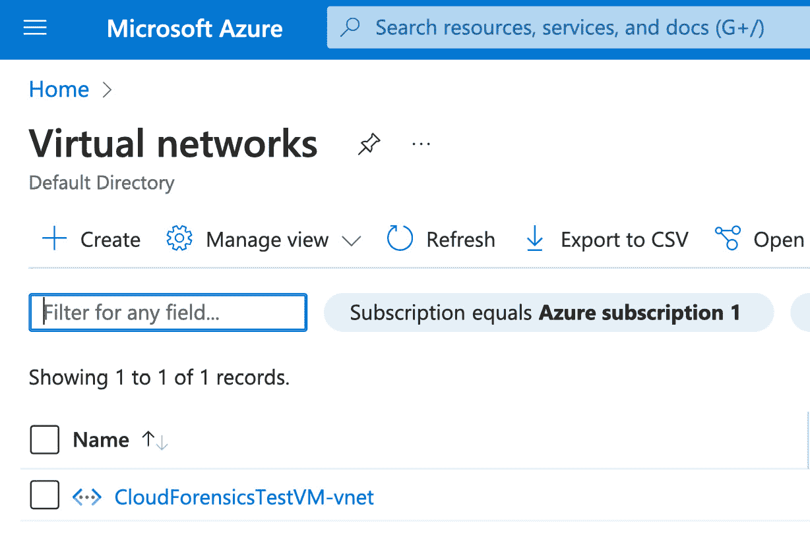

### 第五章：DFIR 调查 – Azure 中的日志

在上一章中，我们讨论了如何响应 **Amazon Web Services**（**AWS**）中的事件。本章将重点介绍如何在微软 Azure 中响应事件，Azure 是全球第二大流行的云计算产品。在 Azure 中响应事件的一个关键方面是分析来自不同 Azure 服务的日志数据。在本章中，我们将探索 Azure 中可用的各种日志来源，如何获取这些日志，以及分析这些数据的最佳实践，以检测、控制和解决 Azure 中的安全事件。通过了解 Azure 中可用的工具和技术，事件响应专家可以更好地保护并响应组织的云基础设施，以应对安全事件。

类似于 AWS，了解 Azure 中哪些日志是默认可用的，哪些需要防御者和调查员启用，对于云取证至关重要。本章概述了**第三章**中讨论的一些重要 Azure 服务和产品可用的各种日志，并探讨了如何在调查过程中利用这些日志来源。具体而言，我们将讨论以下 Azure 数据来源：

+   Azure Log Analytics

+   Azure 虚拟网络

+   Azure 存储

+   Azure 虚拟机

+   Microsoft Sentinel

# Azure Log Analytics

Azure Log Analytics 是 Azure 提供的一项基于云的服务，允许组织收集、分析并从日志和操作数据中获取洞察。它提供了一个集中式平台，用于监控、故障排除和检测跨各种云和本地环境中的异常。通过 Azure Log Analytics，组织能够深入了解其系统和应用，帮助他们做出明智的决策，并采取主动措施以维持最佳的性能和安全性。

Azure Log Analytics 可以视为 AWS CloudTrail（在**第四章**中讨论）的等效物，专门用于收集和分析来自各种 Azure 服务的日志。通过收集这些服务的日志，组织可以深入了解其性能、可用性和安全性。它为监控和故障排除 Azure 资源提供了一个统一的平台。

Azure Log Analytics 至关重要，因为它作为 Azure 生态系统中的日志记录支柱，提供了关于虚拟网络环境、存储服务和 EC2 实例的全面洞察。因此，我们将在此简要介绍 Azure Log Analytics 在主要 Azure 产品和服务中的作用，并在本章的 Azure 产品部分演示如何集成 Log Analytics。

为了有效地管理和优化云操作，组织依赖 Azure Log Analytics 提供关于各种 Azure 服务的全面洞察：

+   **Azure 虚拟网络**：Azure 日志分析与 Azure 网络观察器集成，后者提供虚拟网络流量、网络安全组和流量日志的深入洞察。通过分析这些日志，组织可以监控网络活动，检测可疑行为，并确保遵守安全政策。

+   **Azure 存储**：Azure 日志分析可以收集来自 Azure 存储服务的日志，例如 Blob 存储和表存储。这使组织能够监控和分析与存储相关的活动，例如读写操作、访问模式和存储容量利用率。

+   **Azure 实例**：Azure 日志分析代理可以安装在 Azure 虚拟机上，以收集这些实例的日志数据。这包括与操作系统事件、应用程序日志以及自定义日志文件相关的日志。

日志分析的理念是让你能够查询和/或可视化来自所有 Azure 资源的遥测数据。事故响应人员可以查询这些日志，寻找任何潜在的安全威胁。下图展示了 Azure Monitor 中日志查询的示例，我们将在本章稍后讨论 Azure Monitor：


图 4.1 – 日志查询示例

Azure 中的查询语言基于 **Kusto 查询语言**（**KQL**）。KQL 提供了一套语法和操作符，使事故响应人员能够检索、分析和可视化存储在 Azure 中的大量数据。理解 KQL 对事故响应人员至关重要。

尽管 Azure 日志分析通过其 KQL 提供了强大的功能，可以解析大量数据集并提取关键信息，但当考虑它所监控的网络基础设施时，它的作用变得更加重要。作为微软云环境的基石，Azure 虚拟网络具有自己的一套复杂性。理解这些网络及其相互作用至关重要，而日志分析提供了监控这些网络的工具。

# Azure 虚拟网络

虚拟网络与你在自己组织数据中心中操作并搭建的传统网络非常相似。就像网络允许你组织的资产和资源相互通信一样，Azure 的虚拟网络服务允许你为 Azure 资源和服务建立一个网络，使它们能够相互通信，或者与公共互联网、组织的本地网络和资源进行通信。

与 AWS 的 VPC 类似，当你在 Azure 中创建虚拟机资源时，你可以创建一个 Azure 虚拟网络或使用已有的虚拟网络（如果已经创建）。你的虚拟网络就像 Azure 管理的任何其他实体（被称为 Azure 资源），例如虚拟机、数据存储、数据库或我们之前在*第三章*中讨论过的其他服务。

为了演示目的以及本节内容的需要，我们在 Azure 中创建了一个名为 `CloudForensicsTestVM-vnet` 的虚拟网络。所有虚拟网络都可以通过 Azure **主页**页面上的 **虚拟网络** 服务直接访问：



图 4.2 – 虚拟网络示例

根据组织的规模，可能会存在为测试和开发创建的未使用虚拟网络——事件响应人员应考虑从调查包含生产服务器/服务或关键资源的虚拟网络开始，或者根据虚拟机是否被报告为已受损来调查虚拟网络。

调查人员可以扩展到虚拟网络并确定其网络属性和配置，如下所示：


图 4.3 – 虚拟网络属性示例

所有 Azure 中的虚拟网络包含五个关键标签：

+   **拓扑**：这是您的虚拟网络拓扑。可以将其视为 Azure 自动生成的网络图。对于调查人员来说，这一点特别有用，因为它使调查人员能够了解组织的云基础设施，而无需依赖 IT 团队是否维护了网络图和文档。以下截图显示了包含网络接口和单个虚拟机实例的网络拓扑示例——接口和虚拟机周围的轮廓代表虚拟网络和默认子网：


图 4.4 – 虚拟网络拓扑示例

+   **属性**：此标签将包含您虚拟网络的所有网络配置属性。这包括您的 IP 地址空间、子网和虚拟网络 ID。调查人员应注意地址空间和子网 IP，因为了解网络的 IP 地址范围和子网可以帮助响应人员识别和追踪可疑活动或恶意流量的来源。此外，了解您的地址空间可以让您与可能捕获资源 IP 的其他日志源（例如，EDR 日志）进行关联：


图 4.5 – 网络属性示例

+   **功能**：此选项卡包含可用于进一步增强虚拟网络的 Azure 产品和服务。例如，组织可以启用 Azure 的 DDoS 保护或 Azure 防火墙，而不是配置自己的负载均衡器或防火墙。这些功能不仅为 Azure 资源和资产提供额外的安全保护，还在事件中充当额外的日志来源。例如，启用 Microsoft Defender for Cloud 将为您的虚拟机、容器、数据库、存储应用服务等提供威胁保护。Cloud Defender 将生成额外的安全警报/日志，以便检测到您 Azure 资源中的任何恶意活动。我们将在本章后续内容中更深入地探讨 Microsoft Defender for Cloud：


图 4.6 – 虚拟网络功能示例

+   **推荐**：**推荐**选项卡提供基于成本、安全性、可靠性、性能和运营卓越性的 Azure 推荐列表。威胁管理团队可以利用**推荐**选项卡，根据微软自动化顾问引擎定义的个性化最佳实践，启用任何安全态势和可靠性方面的快速改进。此外，事件响应者可以利用此选项卡获取任何推荐，以确定在事件发生时可能存在的任何漏洞，并将其纳入他们的推荐报告中，以便威胁管理团队采取行动：


图 4.7 – 微软虚拟网络推荐示例

+   **教程**：此选项卡提供微软的免费培训列表。微软、亚马逊和谷歌都持续更新其云服务中的功能和产品。因此，事件响应者可以利用此选项卡快速了解任何新添加的功能。

一个与这些属性互补且确保网络安全态势稳健的关键工具是 Azure 的**网络安全组**（**NSG**）流日志。这些日志提供了对网络流量的细粒度可见性，弥补了网络配置与实际网络活动之间的差距。

## NSG 流日志

在 Azure 中，NSG 和虚拟网络是两个不同的概念，分别在网络安全和网络基础设施管理中发挥着不同的作用。NSG 是 Azure 网络安全架构的基本组件。它充当虚拟防火墙，用于控制进入和离开虚拟机、子网或网络接口的流量。NSG 允许您定义入站和出站安全规则，基于协议、端口、源 IP 地址和目标 IP 地址过滤网络流量。它们通过允许或拒绝基于规则配置的流量，提供细粒度的网络安全控制。

Azure 虚拟网络是 Azure 网络中一个基础性的构造，它代表了 Azure 云中的一个独立网络环境。正如我们在本章前面所看到的，Azure 虚拟网络允许组织定义 IP 地址范围、子网和网络拓扑，以构建他们的网络基础设施。

在 Azure 中为 NSG 定义**访问控制列表**（**ACLs**）涉及配置规则，这些规则控制与虚拟网络中相关资源的进出网络流量。ACLs 作为虚拟防火墙提供对网络通信的精细控制。通过 NSG 规则，您可以根据源/目标 IP 地址、端口和协议指定允许或拒绝的流量。这些规则有助于执行安全策略并限制对虚拟机或子网的未经授权访问，从而使管理员能够有效地定义和管理网络流量。以下截图展示了一个 NSG 的示例：


图 4.8 – NSG 示例

在 Azure 和 AWS 中定义 ACLs 在其目的和功能上有相似之处。两个平台都允许用户创建规则，通过源/目标 IP 地址、端口和协议来控制进出网络流量。下面的截图展示了 Azure NSG 的 ACL 规则示例。在此示例中，网络仅允许来自一个公共源 IP 地址的传入（入站）连接到端口 `22`（SSH），该源 IP 地址已出于安全原因被隐去：


图 4.9 – 访问控制列表（ACLs）

事件响应者可以分析 ACLs 以识别任何未经授权的入站连接规则（例如，RDP 端口开放，允许来自任何 IP 地址的入站连接），或创建新的 ACL 规则以阻止任何网络攻击迹象（例如，命令与控制 IP）。

如在 *第四章* 中讨论的，(网络) 流量日志是网络流量流动信息的记录，捕捉诸如源和目标 IP 地址、端口、协议以及其他与网络流量相关的元数据。在 Azure 的背景下，NSG 流量日志特指由 Azure 中的 NSG 生成的流量日志。NSG 流量日志提供了对虚拟网络中流经 NSG 的网络流量的可视性。

通过启用 NSG 流量日志，组织能够深入了解网络通信模式，帮助他们监控和分析流量行为，检测异常，排除连接问题，并增强网络安全分析。这些日志可以用于法医分析，提供有关安全漏洞的全面信息，有助于保护 Azure 网络环境。

与 AWS 的 VPC 流日志类似，Azure 默认没有启用 NSG 流日志。因此，需要进行显式的设置。要启用 NSG 流日志记录，必须在 Azure 中创建一个 NSG 流日志资源。接下来，Azure 提供了将 NSG 日志下载到本地、将其转发到其他工具（例如，**安全信息和事件管理**（**SIEM**）系统）或使用 Microsoft 的 Azure Network Watcher 流量分析解决方案的选项。流量分析在 Azure 内部分析您的 Azure NSG 流日志，允许组织可视化和查询网络活动，并识别威胁和关注领域（开放端口、不寻常的网络流量等）。启用和查看 NSG 流日志需要以下三个连续步骤：

1.  **创建 Azure 存储帐户**：要启用并创建 NSG 流日志记录，必须创建并分配存储空间以保存这些日志。这可以在创建 Azure 中的流日志时完成。请参见以下截图，以更直观地了解如何在 Azure 中设置示例存储帐户，特别是在创建 NSG 流日志过程中：


图 4.10 – 创建存储帐户

以下截图展示了如何在 Azure 中创建流日志：


图 4.11 – 创建流日志

1.  **创建 NSG 流日志**：这包括填充资源以及与流日志记录相关的其他属性。您可以使用 Microsoft 的流量分析、Splunk、Grafana 或任何其他 SIEM 工具导出、处理、分析和可视化 NSG 流日志。在本示例中，我们将启用 Microsoft 的流量分析，因为它已与 Microsoft 集成，且可以快速轻松地处理日志。以下截图展示了如何启用流量分析并将您的网络流量发送到 Azure 日志分析工作区：


图 4.12 – 创建流日志并启用流量分析

1.  转到在*步骤 2*中创建的流量分析工作区，以查看并查询在*步骤 1*和*步骤 2*中创建的 NSG 流日志。

    Microsoft 提供了以下预构建查询，用于查询 NSG 流日志：

    ```
    AzureNetworkAnalytics_CL
    | where SubType_s == "FlowLog"
    | extend FlowDirection = iff(FlowDirection_s == 'O', 'Outbound', 'Inbound')
    | extend AllowedOrDenied = iff(FlowStatus_s == 'A', 'Allowed', 'Denied')
    | extend SourceIP = iff(isempty(SrcIP_s), extract_all(@"(\d{1,3}\.\d{1,3}\.\d{1,3}\.\d{1,3})", SrcPublicIPs_s), SrcIP_s)
    | extend DestinationIP = iff(isempty(DestIP_s), extract_all(@"(\d{1,3}\.\d{1,3}\.\d{1,3}\.\d{1,3})", DestPublicIPs_s), DestIP_s)
    | extend Protocol = case(L4Protocol_s == 'T', "TCP", L4Protocol_s == 'U', "UDP", L4Protocol_s)
    | project-rename NSGFL_Version = FASchemaVersion_s
    | project TimeGenerated, FlowDirection, AllowedOrDenied, SourceIP, DestinationIP, DestPort_d, Protocol, L7Protocol_s, NSGList_s, NSGRule_s, NSGFL_Version
    | limit 100
    ```

以下是 KQL 查询的详细说明：

+   表格选择：`AzureNetworkAnalytics_CL`指定查询从中获取数据的数据表—在本例中是 Azure 网络分析日志。

+   过滤：`| where SubType_s == "FlowLog"`用于过滤数据，使其仅包括`SubType`列值为`FlowLog`的记录。

+   使用`extend`进行数据转换：`extend`命令多次使用，用于向数据中添加新列：

    +   `FlowDirection = iff(FlowDirection_s == 'O', 'Outbound', 'Inbound')`：这行代码添加了一个新的列`FlowDirection`，它根据`FlowDirection_s`中的值将流向分类为`'Outbound'`或`'Inbound'`。

    +   `AllowedOrDenied = iff(FlowStatus_s == 'A', 'Allowed', 'Denied')`：用于确定流量是允许还是拒绝

    +   `SourceIP` 和 `DestinationIP`：这些行处理 IP 地址提取和格式化

    +   `Protocol = case(...)`：根据条件将协议设置为 TCP 或 UDP，或者保留原始值

+   重命名列：`| project-rename NSGFL_Version = FASchemaVersion_s` 将 `FASchemaVersion_s` 列重命名为 `NSGFL_Version`

+   选择特定列：`project` 命令用于选择要包含在最终输出中的特定列

+   限制结果：`| limit 100` 将输出限制为前 100 条记录

一般来说，KQL 查询将具有以下通用结构：

+   **表格选择**：查询开始时通过指定数据表（例如，网络事件）来进行

+   `|`）：用于将不同命令串联，其中一个命令的输出作为下一个命令的输入

+   **过滤（where）**：用于仅包括符合特定条件的记录

+   **数据转换（extend）**：添加新列或修改现有列

+   `sum`、`count`、`avg` 和 `group by` 用于数据聚合

+   **投影（project）**：指定最终输出中应包含哪些列

+   `sort by` 和 `limit` 控制输出中记录的顺序和数量

查询结果如下截图所示。如你所见，所有允许和拒绝的入站/出站流量都被捕获并以表格格式展示。在这种情况下，包含允许的入站连接的条目是我们通过 SSH 连接到虚拟机资源的条目（**SourceIP** 已因隐私原因被屏蔽），它标志着可能的入口点和未经授权访问虚拟机的风险：


图 4.13 – 流日志查询结果

数字取证和事件响应用例在从 AWS 流日志过渡到 Azure 流日志时不会发生显著变化，因为它们的基础目的是捕获网络流量数据。尽管日志格式、用户界面和命名约定可能有所不同，但这两种解决方案都能为网络活动提供有价值的洞察，便于调查、威胁检测和事件响应，无论云服务提供商是谁。

在 Azure 虚拟网络领域，我们已经深入探讨了如何创建流日志及其后续查询，揭示了网络数据的动态交互。接下来的重点将是 Azure 存储——Azure 生态系统中一个至关重要的部分，它不仅存储这些日志，还提供了丰富的功能来无缝管理和访问海量数据。

## Azure 存储

Azure 存储是由 Azure 提供的云存储服务。Azure 存储提供了不同的存储选项，其中之一是 Azure Blob 存储。

Azure Blob，即 Azure 二进制大对象，是 Azure 存储中的特定存储类型，专为存储非结构化数据如文档、图像、视频和其他文件类型而设计。它提供了一种简单且具有成本效益的方式来存储大量数据，并提供高可用性、耐久性和可扩展性等功能。Azure Blob 常用于备份与恢复、内容分发、媒体流以及作为云中应用程序的数据源。

在 Azure 存储帐户内，事件响应者可能首先希望查看给定存储帐户的访问权限级别（并由此查看其所包含的数据）。这可以通过导航到存储帐户的 **访问控制（IAM）** 页面并检查所有有权访问数据的用户来完成：


图 4.14 – 访问控制（IAM）面板

接下来，调查人员可以利用存储帐户中的 **活动日志** 页面——此页面可以在左侧面板中找到。**活动日志** 将显示 Azure 租户范围内在订阅/Azure 租户级别的活动（例如，我们可以确定某个存储帐户在 Azure 中的创建时间以及创建者）。通过以下截图，我们展示了活动日志的示例：


图 4.15 – 活动日志

虽然前面的截图提供了存储活动日志的初步概览，捕捉了其固有的结构和关键数据点，但以下截图深入探讨了特定查询的结果，展示了可以从这些日志中提取和分析的信息类型：


图 4.16 – 活动日志（续...）

调查人员可以将日志导出为他们选择的日志格式（例如 JSON、CSV 等），并分析任何异常活动——例如，哪些帐户修改了您的 Azure 资源（包括存储资源），以及发生了哪些操作。活动日志包含所有活动，因此可以捕捉到所有已启用和/或更新的新功能或能力。

## Azure 监控

Azure 监控是 Azure 提供的全面监控解决方案，允许组织收集、分析并根据来自各种 Azure 资源（包括 Azure 存储和 Azure Blob）的遥测数据采取行动。它提供了有关这些资源的性能、可用性和健康状况的洞察，帮助组织获得可见性并做出明智的决策。

事件响应者可以利用 Azure 监视器产生的数据进行法医调查。例如，在 Azure 存储的背景下，事件响应者可以使用 Azure 监视器绘制 Azure 存储帐户或 Blob 的出口（外发）数据。事件响应者可以利用出口数据可视化来缩小外发数据的异常峰值——也就是在某个时间点，组织的云存储中有异常量的数据流出。这对于涉及数据外泄的安全事件尤为有用，因为它不仅能帮助事件响应者缩小感兴趣的日期/时间范围，还能了解可能被恶意行为者窃取的数据量。以下屏幕截图展示了 Azure 监视器如何用于可视化和绘制 30 天内的出口数据：


图 4.17 – Azure 监视器的出口数据可视化

与我们之前讨论的虚拟网络日志类似，组织的资源日志（包括存储帐户和存储 Blob）也必须连接到 Azure 日志分析工作区，以启用 Azure 监视器日志的功能，并对这些数据执行查询。我们之前已将 VPC 日志连接到流量分析工作区，这意味着将 VPC 网络数据发送到后端的日志分析工作区，以便读取和写入流量日志。以下是来自微软 Azure 门户的屏幕截图，展示如何启用所有与存储相关的资源的日志分析：


图 4.18 – 开始使用日志分析

以下屏幕截图展示了如何将 Azure 存储帐户（及其资源）连接到日志分析工作区。在左侧窗格中，导航到 **诊断设置**，以启用将日志发送到日志分析：


图 4.19 – 将日志分析连接到存储资源

接下来，你应该能看到所有与你的存储帐户相关的资源。要启用日志分析，点击存储帐户或任何其他资源：


图 4.20 – 将日志分析连接到存储资源（续…）

过渡到下一个屏幕截图，我们将聚焦于连接日志分析的具体过程，这次特别关注某个存储帐户的诊断设置：


图 4.21 – 将日志分析连接到存储资源（续…）

最后，以下屏幕截图详细展示了这些诊断设置，突出显示了用户可以利用和配置的细节和参数：


图 4.22 – 将 Log Analytics 连接到存储资源（续…）

类似的过程可以应用于 Azure Blob 级别，将所有读/写/删除和事务日志发送到 Log Analytics 工作区：


图 4.23 – 将 Log Analytics 连接到存储资源（续…）

最终的**诊断设置**面板应如下所示，**诊断状态**设置为**启用**：


图 4.24 – 将 Log Analytics 连接到存储资源（续…）

事件响应者现在可以使用**监视**下的**日志**功能查询 Azure 存储日志，这将打开 Azure 中的查询面板。请参见以下示例查询，以获取 Azure 存储帐户中所有 Blob 的操作：

```
StorageBlobLogs
| where TimeGenerated > ago(7d)
| project TimeGenerated, OperationName, AuthenticationType, Uri, _ResourceId, CallerIpAddress
```

上述查询可以用来显示存储帐户表（即`AzureMetrics`和`StorageBlobLogs`）中的其他列/字段，并缩小到感兴趣的事件（即匿名登录、感兴趣的操作等）。以下屏幕截图展示了所有存储帐户 Blob 活动的查询结果：


图 4.25 – Blob 存储活动的查询结果

现在我们已经理解了 Azure 存储的细微差别以及查询 Blob 存储活动的复杂性，可以清楚地看到，Azure 在数据管理和分析方面的能力是巨大的。接下来，我们将深入探讨 Azure 基础架构的另一个重要组成部分：Azure 虚拟机。这不仅与存储解决方案相辅相成，还通过为各种工作负载提供动态计算资源来增强它们。

# Azure 虚拟机日志分析

我们在*第三章*中讨论了 Azure 虚拟机。在 Azure 中，虚拟机广泛用于部署和运行各种应用程序和服务。为了确保这些虚拟机的安全性和稳定性，事件响应者和管理员必须分析虚拟机生成的日志。这些日志提供了关于系统活动、性能、安全事件和潜在漏洞的宝贵见解。在本节中，我们将探讨 Azure 中不同的日志源，事件响应者可以分析这些日志以进行有效的虚拟机日志分析。

+   **Azure Log Analytics**：Azure Log Analytics 是一个强大的工具，用于集中来自不同来源的日志数据，包括 Azure 虚拟机。它提供了一个全面的日志管理解决方案，并提供先进的查询和可视化功能。通过将 Azure 虚拟机与 Log Analytics 集成，事件响应人员可以以统一的方式收集和分析来自多个虚拟机的日志。收集的日志可以包括性能数据、系统事件、安全事件和自定义应用程序日志。事件响应人员可以通过利用其强大的查询功能（使用 KQL）来使用 Log Analytics。通过构建针对虚拟机的 KQL 查询，事件响应人员可以搜索通过 Azure Monitor 收集的日志和遥测数据，识别潜在的**妥协指标**（**IoC**），例如可疑的 IP 地址、不寻常的网络流量模式或与已知威胁相关的特定事件日志。这些查询可以定制以筛选和关联相关的数据源，从而实现主动的威胁狩猎和快速识别 Azure 环境中的被攻破系统或恶意活动。

+   **Windows 事件日志**：在 Windows 操作系统上运行的 Azure 虚拟机会生成 Windows 事件日志，这些日志捕捉到重要的系统事件和错误。事件响应人员可以分析这些日志，识别系统崩溃、应用程序故障、登录尝试以及其他关键事件。Windows 事件日志被分为不同的事件日志通道，如系统、安全、应用程序等，这使得过滤和分析特定类型的事件变得更加容易。

+   **Azure 活动日志**：Azure 活动日志提供了对 Azure 资源（包括虚拟机）上执行的操作的审计跟踪。这些日志捕捉有关资源创建、更新和删除的信息，以及用户和 Azure 服务执行的管理操作。事件响应人员可以利用 Azure 活动日志跟踪虚拟机配置的变更，识别潜在的配置错误，并调查可疑活动。

+   **Azure Monitor**：Azure Monitor 也可以用来捕捉虚拟机的性能指标、诊断日志甚至自定义应用程序日志。事件响应人员可以利用 Azure Monitor 可视化虚拟机中的异常情况，如异常的 CPU 使用率或磁盘带宽，这可能表明有未经授权的访问。Azure Monitor 还与**Azure Kubernetes 服务**（**AKS**）集成，提供对任何 AKS 容器的监控和日志记录功能。在创建 AKS 集群时，或者将其添加到现有集群时，你可以启用监控。此外，Azure Monitor 还将其功能扩展到 Azure 中的无服务器计算资源，如 Azure Functions 和 Azure Logic Apps。通过利用 Azure Monitor 的一个功能——应用程序洞察，事件响应人员可以深入了解无服务器组件。

+   **Windows Defender 日志**：对于运行 Windows Defender 的虚拟机，事件响应人员可以分析由该防病毒软件生成的日志。这些日志包含有关已检测威胁、被拦截的恶意软件以及其他安全相关事件的信息。通过分析 Windows Defender 日志，响应人员可以识别潜在的安全漏洞，调查恶意软件感染，并采取适当的措施来降低风险。Windows Defender 是端点级别的安全防病毒工具（即安装在虚拟机上的）。

+   **Azure Linux 虚拟机与 Linux 日志**：对于 Microsoft Azure 上的 Linux 基础虚拟机，事件响应人员可以分析由系统的 syslog 服务和 Microsoft 安全工具生成的日志。事件响应人员可以利用 Azure 与 Linux 虚拟机的集成，获取通过 syslog 提供的系统事件，如系统警报、错误、用户登录活动以及其他系统级消息。这些日志对于追踪系统异常、安全事件和潜在的未授权访问至关重要。除了基本的 syslog 功能外，Azure 还提供与其安全工具套件的集成，如 Microsoft Defender，这可以用来增强 Linux 虚拟机的安全监控。Microsoft Defender 提供了先进的威胁防护功能，能够检测并分析 Linux 资源的潜在威胁和漏洞。

探索了 Azure 虚拟机上可用的各种日志来源，从 Azure 日志分析到 Windows Defender 日志，可以明显看出，Azure 提供了全面的工具，帮助事件响应人员跟踪和分析虚拟机活动。在这个基础上，我们可以将重点转向 Azure 生态系统中的一个更加集成的安全解决方案：Microsoft Defender for Cloud。这个解决方案协同利用这些日志，提供全面的安全洞察和主动的威胁防护。

## Microsoft Defender for Cloud

Microsoft Defender for Cloud（前身为 Azure 安全中心）为 Azure 资源提供先进的威胁检测和安全监控，包括虚拟机。它分析与安全相关的事件，进行行为分析，并提供安全建议。事件响应人员可以利用 Microsoft Defender for Cloud 来识别潜在的安全漏洞、调查安全事件，并有效应对威胁。以下截图展示了 Microsoft Defender for Cloud 报告的安全警报示例。在这个示例中，我们可以看到 Mimikatz 的凭证窃取工具在虚拟机资源中被检测到。事件响应人员可以在更大范围的调查中利用这些警报，确定恶意行为者使用的攻击战术：


图 4.26 – Microsoft Defender for Cloud 警报

Microsoft Defender for Cloud 还提供基于持续监控的配置建议，这可以帮助事件响应人员识别任何未解决的安全漏洞。以下截图展示了 Microsoft Defender for Cloud 中 **建议** 面板的示例：


图 4.27 – Microsoft Defender for Cloud – 建议

虽然 Microsoft Defender for Cloud 提供了全面的监控和安全建议，但 Azure 也提供了用于深入分析虚拟机网络流量的工具。最有价值的工具之一就是 NSG 流日志。这个功能为管理员提供了对网络活动的详细洞察，补充了 Microsoft Defender for Cloud 提供的保护。

## NSG 流日志

NSG 流日志捕获了通过与 Azure 虚拟机关联的 NSG 的网络流量信息。这些日志提供了有关允许和拒绝的网络连接的洞察，包括源和目标 IP 地址、端口和协议。事件响应人员可以分析 NSG 流日志，检测可疑的网络活动，识别潜在的攻击，并有效地执行网络安全策略。我们在本章前面已经讨论过 NSG 流日志。

重要提示

Azure 中的虚拟网络、存储和虚拟机等产品和服务通过 Azure Log Analytics、Azure Monitor 和 Azure 活动等服务共享共同的监控和日志记录功能。这些服务为在 Azure 中部署的资源提供了有关健康状况、性能和活动的全面洞察。

无论您是在监控虚拟网络、存储还是虚拟机，基本的方法都是类似的。Azure Log Analytics 允许您收集、集中和分析来自不同来源的日志和度量数据。Azure Monitor 提供了统一的监控体验，提供警报、仪表板和可视化功能，以便实时洞察资源的性能和可用性。Azure 活动日志捕获订阅级别的事件和操作，用于审计和追踪。

经过对 Azure 虚拟机日志信息的深入分析，特别是对 Microsoft Defender for Cloud 和 NSG 流日志功能的探讨，显然 Azure 提供了强大的安全性和流量分析工具。然而，Azure 的工具包并不止于此。在接下来的部分中，我们将探讨 Microsoft Sentinel 的全面威胁情报功能。

# Microsoft Sentinel

Microsoft Sentinel 是 Azure 提供的强大云原生 SIEM 解决方案。它通过实时收集、分析和可视化来自不同来源的大量安全数据，帮助组织检测、调查和应对安全威胁。

SIEM 是一个全面的软件解决方案，结合了 **安全信息管理** (**SIM**) 和 **安全事件管理** (**SEM**) 功能。它作为一个中央集成平台，用于获取和关联来自不同来源的日志和事件，提供组织安全状况的统一视图。

在安全事件发生期间，事件响应人员可以利用 Microsoft Sentinel 的高级功能有效响应并减轻威胁。以下是事件响应人员可以利用 Microsoft Sentinel 的具体方式：

+   **日志收集与集成**：Microsoft Sentinel 支持从多种来源获取数据，包括 Azure 服务、本地基础设施、安全解决方案和第三方工具。事件响应人员可以配置数据连接器来收集日志和事件，确保整个环境的全面可视化。

+   **威胁检测和分析**：Microsoft Sentinel 运用机器学习算法和先进的分析技术来检测和优先处理潜在的安全威胁。其内置的分析模板和检测规则有助于识别可疑活动、异常行为或已知的攻击模式。事件响应人员可以利用这些功能识别**IoC**（入侵指示器）并检测新兴威胁。

+   **实时监控和警报**：Microsoft Sentinel 提供安全事件的实时监控，并根据预定义的规则和分析生成警报。事件响应人员可以配置警报规则，当发生表明安全事件的特定条件或行为时触发通知。这些警报可以自定义，以优先处理关键事件，并与其他事件响应系统集成。

+   **调查与猎杀**：Microsoft Sentinel 提供强大的搜索和查询功能，以便彻底调查安全事件。事件响应人员可以查询和探索大量数据，基于不同的属性过滤结果，并在不同数据维度之间切换。Sentinel 的交互式工作空间允许响应人员可视化和关联数据，从而实现深入调查和主动的威胁猎杀。

+   **自动响应与编排**：Microsoft Sentinel 提供预定义的自动化工作流程——**剧本**，以便于事件响应操作。事件响应人员可以创建剧本来自动化重复的手动任务，例如通过附加上下文信息丰富警报、屏蔽可疑的 IP 地址或隔离受损资产。此功能有助于简化事件响应流程并缩短响应时间。

+   **与安全解决方案的集成**：Microsoft Sentinel 无缝集成了各种 Microsoft 安全解决方案和第三方工具。事件响应人员可以利用这些集成来丰富调查、收集额外的上下文信息，并在安全生态系统中协调响应行动，提供统一且协调的事件响应方法。

以下截图显示了启用警报并连接数据的 Microsoft Sentinel：


图 4.28 – Microsoft Sentinel – 事件

Microsoft Sentinel 并不会自动为客户启用；它需要手动设置和配置。组织必须主动选择在其 Azure 环境中实施和配置 Microsoft Sentinel，才能利用其安全分析和威胁情报功能。随着我们对 Microsoft Sentinel 探索的结束，可以明显看出，其先进的威胁情报和安全分析能力在强化 Azure 云生态系统中发挥着至关重要的作用。通过将 Microsoft Sentinel 用作 SIEM，安全分析师和事件响应人员可以充分利用 Sentinel 的潜力，在不断变化的威胁环境中保护其数字环境。

# 概述

本章深入探讨了日志分析在 Azure 环境中事件响应中的关键作用。强调了理解 Azure 中可用日志来源、如何获取这些日志以及分析数据的最佳实践，以便有效地检测、遏制和解决安全事件的重要性。通过让事件响应专业人员熟悉特定于 Azure 的工具和技术，他们可以增强在云基础设施环境中保护和响应安全事件的能力。

本章强调了区分默认日志可用性与需要启用某些日志之间的重要性，并与 AWS 进行了类比。然后，概述了 Azure 重要服务和产品提供的各种日志，如在**第三章**中讨论过的，并检查了它们在调查过程中的使用。特别是，本章探讨了 Azure 日志分析、Azure 虚拟网络流日志、Azure 存储、Azure 虚拟机以及其他 Azure 工具，如 Microsoft Sentinel，作为事件响应的重要数据来源。

在下一章中，我们将把注意力转向**谷歌云平台**（**GCP**），并探索在事件期间可以启用和使用的各种日志来源。

# 进一步阅读

若想了解更多本章所涉及的主题，请查看以下资源：

+   *Azure* *Monitor*：[`learn.microsoft.com/en-us/azure/virtual-machines/monitor-vm`](https://learn.microsoft.com/en-us/azure/virtual-machines/monitor-vm)

+   *Microsoft Defender for* *Cloud*：[`learn.microsoft.com/en-us/azure/defender-for-cloud/defender-for-cloud-introduction`](https://learn.microsoft.com/en-us/azure/defender-for-cloud/defender-for-cloud-introduction)

+   *日志* *分析*：[`learn.microsoft.com/en-us/azure/azure-monitor/logs/log-analytics-tutorial`](https://learn.microsoft.com/en-us/azure/azure-monitor/logs/log-analytics-tutorial)

+   *NSG 流量* *日志*：[`learn.microsoft.com/en-us/azure/network-watcher/network-watcher-nsg-flow-logging-overview`](https://learn.microsoft.com/en-us/azure/network-watcher/network-watcher-nsg-flow-logging-overview)

+   *Azure 虚拟* *网络*：[`learn.microsoft.com/en-us/azure/virtual-network/virtual-networks-overview`](https://learn.microsoft.com/en-us/azure/virtual-network/virtual-networks-overview)

+   *流量* *分析*：[`learn.microsoft.com/en-us/azure/network-watcher/traffic-analytics`](https://learn.microsoft.com/en-us/azure/network-watcher/traffic-analytics)

+   *Microsoft Defender for* *Endpoint*：[`learn.microsoft.com/en-us/microsoft-365/security/defender-endpoint/microsoft-defender-endpoint?view=o365-worldwide`](https://learn.microsoft.com/en-us/microsoft-365/security/defender-endpoint/microsoft-defender-endpoint?view=o365-worldwide)

+   *Microsoft* *Sentinel*：[`learn.microsoft.com/en-us/azure/sentinel/overview`](https://learn.microsoft.com/en-us/azure/sentinel/overview)
