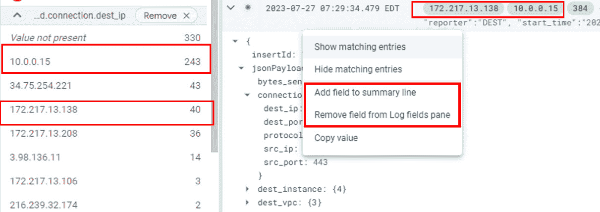

### 第六章：DFIR 调查 – GCP 中的日志

你一定已经注意到每个云服务提供商的常见资源和元素了。在本章中，我们将深入探讨**Google Cloud Platform**（**GCP**）的安全功能、可用的日志来源以及如何进行调查。请注意，云服务提供商可能使用相似的术语，但日志的应用和可用性在每个云服务提供商之间可能有所不同。因此，了解在事件调查过程中哪些日志是可用的是至关重要的。

在*第三章*中，我们简要介绍了 GCP 中的一些特定云服务；在本章中，我们将深入探讨其一些核心组件和数字取证。本章概述了*第三章*中讨论的部分关键 GCP 服务和产品的日志，并探讨在调查过程中如何利用这些日志来源。

本章我们将讨论以下主题：

+   GCP 核心服务

+   GCP 身份与访问管理

+   策略分析器

+   GCP 日志资源浏览器

+   VPC 流日志

+   数据包镜像

+   计算引擎日志

+   日志数据流管道

+   GCP 存储日志

+   云安全指挥中心

+   GCP Cloud Shell

我们将在*第七章*中讨论 Google Workspace，以及 Microsoft 365（M365），因为它们与电子邮件和云托管的协作服务相关。

# GCP 核心服务

GCP 是 Google 提供的一套云计算服务，提供一系列工具和服务，用于在云端构建、部署和管理应用程序和基础设施。它提供类似于其他云服务提供商（如 AWS 和 Microsoft Azure）的服务。

这里是 GCP 的一些关键服务：

+   **计算服务**：GCP 提供几种计算选项，包括**Google Compute Engine**（**GCE**）（**虚拟机**[**VM**]）、**Google Kubernetes Engine**（**GKE**）（托管 Kubernetes）和**App Engine**（应用程序的托管平台）

+   **存储服务**：GCP 提供多种存储选项，如**Google Cloud Storage**（**GCS**）（对象存储）、**Cloud SQL**（关系型数据库服务）、**Cloud Bigtable**（NoSQL 数据库）和**Cloud Firestore**（文档数据库）

+   **网络**：GCP 提供网络服务，如用于创建私有网络的**虚拟私有云**（**VPC**）、用于分配流量的**Cloud Load Balancing**和用于内容传输的**Cloud CDN**

+   **大数据和机器学习**：GCP 包括诸如**BigQuery**（无服务器数据仓库）、**Cloud Dataflow**（数据处理）、**Cloud Pub/Sub**（消息传递与事件流）和**Cloud Machine Learning Engine**（托管机器学习）等服务

+   **身份与访问管理**（**IAM**）：IAM 允许你管理对 GCP 资源和服务的访问，定义用户和组的角色与权限

+   **管理和监控**：GCP 提供管理和监控资源的工具，如 **Cloud Console**（基于 web 的管理界面）、**Cloud Logging**（集中式日志管理）、**Cloud Monitoring**（性能和健康监控）和 **Cloud Trace**（请求延迟分析）。

+   **安全与合规性**：GCP 融入了各种安全特性，包括静态和传输加密、IAM 角色和政策、VPC 服务控制以及合规认证，以满足行业标准。

+   **开发者工具**：GCP 提供如 **Cloud SDK**（命令行工具）、**Cloud Build**（持续集成和交付）和 **Cloud Source Repositories**（版本控制系统）等开发者工具。

+   **AI 和 ML 服务**：GCP 提供通过如 **Cloud Vision API**、**Cloud Natural Language API** 和 **Cloud Translation API** 等服务预训练的 AI 模型和 API，使开发者能够将 AI 功能集成到他们的应用程序中。

+   **无服务器计算**：GCP 提供无服务器服务，如 **Cloud Functions**（事件驱动函数）、**Cloud Run**（无服务器容器）和 **Cloud Scheduler**（定时任务调度器）。

现在我们已经了解了 GCP 提供的核心服务，可以深入探讨一些调查人员可能感兴趣的特定服务。重点将放在 GCP 的特定服务上，这些服务构成了任何调查的基础，包括身份、来自计算引擎的日志等。我们将从 GCP 的 IAM 控制台开始，它是让用户访问 GCP 资源的核心。

# GCP IAM

IAM 提供了一个框架，通过定义身份、角色和相应资源之间的关系来控制 GCP 范围内的资源访问。在这个系统中，资源的概念扩展到包括广泛的实体，如 GCE 虚拟机实例、GKE 集群、**Cloud Storage 存储桶**，以及由组织、文件夹和项目组成的组织结构。

IAM 基于一个原则：不直接授予最终用户访问权限；相反，权限被组织成角色，并将这些角色分配给经过身份验证的主体或成员（如 Google 帐号、服务帐号、Google 群组、经过身份验证的用户、云身份域等）。

IAM 功能的核心是**允许策略**，或称**IAM 策略**，它作为指定和强制分配角色给主体的机制。每个允许策略都与特定资源关联。当经过身份验证的主体尝试访问某个资源时，IAM 会检查关联的允许策略，从而根据其规定确定预定操作的可行性。虽然允许策略让你设置准则以允许访问特定资源，GCP 还允许你设置**拒绝策略**，指定哪些用户或角色无法访问。拒绝策略让你根据特定条件设置拒绝规则，来决定资源的可行性。拒绝策略的示例包括限制定义新 API 密钥或删除或编辑 GCE 资源或配置的权限。

通过在 GCP 生态系统中采用 IAM，组织可以对访问权限进行精细控制，确保身份只被分配与指定资源交互所需的角色。这种访问管理方法可以增强安全性，并有效地管理 GCP 环境的治理。

## GCP 的 IAM 角色和身份

从事件响应和取证的角度来看，了解云服务提供商如何组织和分配身份及其权限是至关重要的。需要注意的是，每个云服务提供商处理身份的方式通常不同。

对于 GCP，最终用户不会直接获得权限。相反，权限会被分配给**角色**。你可以把角色想象成一组权限，授予对 GCP 环境中各种服务的访问权限。需要访问这些资源的用户或 API 服务被 GCP 称为**主体**。因此，权限被分配给角色，角色附加到主体。策略是角色的集合，可以附加到一个或多个主体。

以下图示总结了如何通过 GCP 的 IAM 模块定义、分配、强制执行并最终管理 IAM 策略：


图 6.1 – GCP 的 IAM 强制执行架构

前面的图示仅展示了如何将权限分配给每个 GCP 资源的通用版本，GCP 还提供了与活动目录的联合集成功能来管理对 GCP 资源的访问。然而，这使用了类似的概念来强制执行 IAM 策略。你可以创建精细的允许和拒绝策略来强制执行特定的资源元素。例如，你可以允许访问 GCE 中的某个实例，同时限制对其他实例的访问。

# 策略分析器

考虑到 IAM 分配是通过角色实现的，其中主体通过角色将访问权限分配给资源，GCP 提供了额外的工具来排查和调查 IAM 策略配置。策略分析器允许 DFIR 团队分析分配给用户或角色的过度权限，这些权限可能导致滥用。策略分析器还可以确定用户是否具有执行特定操作所需的权限，例如删除表、GCE 资源等。

以下是策略分析器输出的示例。我们可以在查询结果中看到为某个用户配置的 GCP 资源的角色和权限。请注意，资源分配给项目，且 GCP 将其标记为资源：


图 6.2 – 策略分析器查询结果及每个角色的权限列表

## DFIR 使用案例：策略分析器

在 GCP 的 DFIR 环境中使用策略分析器可以帮助组织评估各种 GCP 资源的合规性和安全性。以下是 GCP 策略分析器的一些使用案例：

+   **IAM 策略**：分析 IAM 策略包括评估分配给用户、服务账户和组的角色，识别潜在的配置错误或权限过度的访问。

+   **网络安全策略**：审查防火墙、网络配置和路由策略，以确保适当的网络分段、可靠的连接性，并保护防止未经授权的访问。

+   **数据加密和密钥管理策略**：验证是否对静态和传输中的敏感信息实施数据加密策略。这包括评估加密密钥的使用、密钥轮换实践及加密标准的合规性。

+   **日志记录和监控策略**：评估日志配置和监控实践，确保生成并保留适当的日志，并确保日志分析工具正确配置，以检测安全事件和异常活动。

+   **服务账户和 API 访问策略**：验证服务账户和 API 访问配置的安全性。这包括评估授予服务账户的权限，审计服务账户的使用，并确保适当管理和撤销 API 访问凭证。

如您所见，GCP 策略分析器有助于识别策略违规和不合规资源。然而，它并不提供因策略偏差而执行的活动信息；我们需要日志浏览器来识别具体的执行动作。我们将查看 GCP 日志浏览器，它采集并托管详细日志，具有高级过滤选项和实时日志流功能，使其成为任何调查人员必备的工具。

# GCP 日志浏览器

GCP 设计了**日志浏览器**，通过查看日志来排查应用程序和系统的性能问题。日志浏览器的用户界面包含一个直方图，显示日志速率及相关的峰值。然而，只要有日志，你总是可以利用它们来调查事件。Google 还提供了日志浏览器 API，允许通过 Python 程序或其他方式通过 API 密钥进行自动化或查询日志。以下截图展示了 GCP 日志浏览器中的直方图，突出显示了按时间划分的活动：


图 6.3 – GCP 日志浏览器直方图

然而，日志浏览器仅按时间段显示日志；它不会量化或将日志与系统内的其他活动相关联。你可以设置你希望查看日志的时间范围，默认的日志保留期限为 30 天。为此，GCP 提供了**日志分析**，这是一项独立的服务，允许对日志进行实时分析，以便进行日志聚合和日志量化。这是一项独立的服务，需要显式地升级你的日志存储桶，以便 GCP 执行日志分析。GCP 日志分析使用户能够在日志上使用**BigQuery**。BigQuery 是一个数据仓库，用户可以在其上对大规模数据集进行查询并执行分析。GCP 将 BigQuery 作为一项独立的服务提供，默认情况下不可用。例如，你可以运行 BigQuery 来查询你的日志，查找已知的恶意域名，来源于威胁情报源。

为了让 DFIR 团队访问日志浏览器，团队必须被分配以下角色：

+   `roles/logging.viewer`：用于查看`_Required` 和 `_Default` 存储桶下的所有日志。

+   `roles/logging.privateLogViewer`：用于查看所有日志，包括数据访问日志。

+   `roles/logging.viewAccessor`：基于条件的日志查看权限，允许访问用户定义的日志。如果没有指定条件，则此角色允许访问用户定义的存储桶中的日志。

+   `Roles/logging.fieldAccessor`：用于查看日志条目存储桶中的受限字段。你需要配置字段级访问。

## 日志存储桶概览

每当资源生成日志时，它都会被云日志基础设施所接收，该基础设施确定日志存储的条件和准则，称为日志**接收器**。日志接收器是 GCP 日志基础设施的一部分，负责确定如何将日志路由到相关的日志存储桶。GCP 还允许你通过 Pub/Sub 主题将这些日志导出到第三方日志聚合工具，帮助第三方日志聚合工具订阅 Pub/Sub 来授权和导入日志。

GCP 提供了两个预定义的日志存储桶，分别是`_Required`和`_Default`。这些存储桶相互独立，并作为每个 GCP 账户的默认日志存储目标。用户/管理员还可以创建自己的日志存储桶，这些存储桶被归类为用户定义的存储桶。当日志条目被传送到日志基础设施时，日志路由开始执行。在此过程中，根据配置的包含和排除过滤器，日志会被路由到相应的存储桶，或者被重定向到 Pub/Sub 主题供外部使用，或者完全丢弃。日志还可以被重定向到 BigQuery 数据集，以便用户执行日志分析，进行相关性分析和进一步的分析。

如前所述，云日志条目默认会被路由到以下其中一个日志存储桶：

+   `_Required`：`_Required` 日志存储桶会收集以下类型的日志：

    +   **管理员活动日志**：这些日志包含用于读取资源元数据或配置的 API 调用日志条目。例如，读取 GCE 配置的 API 调用会记录在这个子类别下。

    +   **系统事件日志**：任何对云资源的更改，例如 GCE，都会记录在此子类别下。用户/管理员不能通过创建排除过滤器关闭此类型日志的记录；它始终会被记录。

    +   **访问透明度日志**：任何 Google Cloud 成员在 GCP 账户内执行的操作都会记录在此日志中。这使得可以透明地查看云服务提供商执行的任何操作——在本案例中是 Google。

+   `_Default`：任何不符合 `_Required` 存储桶条件的日志会被路由到 `_Default` 存储桶。以下类型的日志会自动被重定向：

    +   **数据访问日志**：这些日志条目包括对 GCP 资源的元数据或配置信息的 API 调用。数据访问日志通常数量庞大，默认情况下是禁用的。如果您运行 BigQuery，则会启用数据访问日志。因此，理解操作资源和是否启用日志至关重要。

    +   **策略拒绝日志**：顾名思义，当 GCP 根据定义的条件或策略拒绝访问某个资源时，日志条目会被归类为策略拒绝日志。策略拒绝日志默认启用，且无法禁用。不过，您可以配置排除过滤器来避免记录这些日志。

+   **用户定义的存储桶**：这些是用户创建的日志存储桶，用于收集 GCP 资源生成的日志子集。您可以在任何云项目中创建用户定义的存储桶。当您创建日志存储桶时，必须指定日志存储桶将存储的区域。

## DFIR 使用案例，使用日志资源管理器

以下是一些 DFIR 使用案例，利用 GCP 的本地日志资源管理器：

+   **事件调查**：在事件发生期间，日志探索器使您能够在多个 GCP 服务中搜索和分析日志。您可以关联来自不同日志的事件，重建事件时间线，识别根本原因，并确定事件的影响范围。

+   **威胁狩猎**：日志探索器允许您根据已知威胁或**妥协指标**（**IOCs**）的特定标准或模式查询和过滤日志。通过分析来自 GCP 服务（如 Cloud Storage、Cloud Functions 或 Cloud Pub/Sub）的日志，您可以主动搜索可疑活动或异常行为。

+   **用户活动监控**：日志探索器提供了 GCP 服务中用户活动的可见性。您可以追踪用户登录、管理操作、API 调用和资源访问，以识别未经授权或可疑的行为。这些信息有助于检测内部威胁或被妥协的用户账户。

+   **数据泄漏和暴露检测**：日志探索器可以用于识别潜在的数据泄漏或外泄尝试。通过分析来自相关服务（如 Cloud Storage 或 BigQuery）的日志，您可以搜索到表明未经授权的数据访问、大规模数据传输或异常数据外泄的模式。

+   **取证分析**：日志探索器可以在取证调查中作为宝贵的证据来源。通过查询和分析日志，您可以重建事件，识别攻击者的行为，或追踪对手在 GCP 环境中的活动。

## 熟悉日志探索器

我们来看一个查询日志探索器的示例。日志探索器拥有方便的功能，允许调查人员点击并过滤相关的证据。让我们熟悉一下日志探索器的多个区域：


图 6.4 – 日志探索器概览

如我们在日志探索器仪表板中看到的，几个关键元素对于安全团队来说非常有帮助。我们已经为您标注了数字，方便参考：

1.  **日期/时间过滤器**：这使得团队能够锁定特定时间范围内可能发生的事件和活动。

1.  **查询面板**：这个文本栏允许团队手动搜索查询。请注意，当您点击并更新过滤器时，搜索查询词会自动更新。

1.  **查询过滤字段**：这使得团队可以过滤特定的 GCP 资源、对象或日志及日志类型。请注意，在此示例中，我们过滤了与 VM 实例相关的记录，且严重性标为错误。

1.  **日志字段面板**：此视图为用户提供了更细致的视角，展示每种日志过滤器类型或严重性评级下的事件数量。如前所述，每条记录在被路由到相关的日志存储目的地之前都会进行分类。

1.  **查询结果窗格**：此视图允许用户更深入地查看日志。每个条目都允许用户展开并查看日志条目中的所有字段，并根据调查线索进行额外的过滤。

我们接下来的部分将通过 Logs Explorer 进行一个示例调查，但首先，让我们先看一下 VPC 流量日志。

# VPC 流量日志

与 AWS 类似，GCE 默认没有启用 VPC 流量日志。启用 VPC 流量日志相对简单，所需的工作量也很小。需要注意的是，VPC 流量日志按分钟汇总，并在一个包含相关信息的仪表盘中显示。VPC 流量日志在子网级别启用，这意味着每个流量日志都与 GCE 所在的子网相关联。这通常指的是 GCP 的内部子网架构。为一个繁忙的服务器启用 VPC 流量日志可能会生成大量日志，从而影响成本。

## 启用 VPC 流量日志

要分析流量，首先必须在 GCE 中启用 VPC 流量日志。由于 GCE 默认创建时，区域 VPC 作为虚拟服务器访问互联网或其他 GCP 资源的网络网关。如果创建了自定义 VPC 节点，必须确保启用 VPC 流量日志选项，才能将日志发送到 Logs Explorer。我们将查看其中一个 GCE 的网络详情示例。

与 AWS 类似，VPC 流量日志并不会自动启用，需要手动激活。GCP 提供了一系列可定制的网络设置，包括创建子网、设定防火墙规则和设置 VPC 连接的功能。下图显示了为某个区域配置的 VPC 网络，其中包含名为 `test-lab1` 的自定义 VPC 网络：


图 6.5 – GCE 的网络子网详情

VPC 流量日志是子网特定的；因此，启用 VPC 流量日志时，必须对 VPC 子网进行更改，并允许收集流量日志。如果 GCE 实例连接了多个 VPC，你必须逐一验证并启用每个 VPC 子网，以便收集流量日志。在下图中，我们查看了名为 `test-lab1` 的自定义 VPC 和名为 `subnet-lab1` 的 VPC 子网：


图 6.6 – VPC 子网信息

点击并编辑子网名称，选择开启或关闭 **FLOW LOGS** 的选项。启用后，指定网络数据包的聚合频率。请记住，VPC 流量日志只收集头信息，而不包括完整的数据包详情。因此，必须权衡聚合频率，并确定最合适的聚合时间间隔。数据包聚合可以在 5 秒、30 秒、1 分钟、5 分钟、10 分钟和 15 分钟的间隔内进行。

假设 GCP 资源在一天之内产生大量网络流量；在这种情况下，可以设置更高频率的流日志聚合，以便获得更细粒度的网络流量可见性。低频率流日志聚合适用于那些没有大量网络流量活动的情况。下图展示了设置流日志的选项：


图 6.7 – 在 VPC 子网下启用 VPC 流日志

在设置流日志时，选择将被聚合到流日志并报告到 Logs Explorer 的数据包采样率，理想情况下设置为 100%。这意味着 100% 的观察到的流量将发送到 Logs Explorer，而不是缩小为特定比例的流量活动。下图展示了子网配置，采样率为 100% 的观察到的网络流量，聚合间隔为 5 秒：


图 6.8 – 流日志网络聚合配置

一旦 VPC 配置完成，流日志会自动发送到 Logs Explorer，调查员可以开始进行威胁狩猎。接下来的部分将展示一个使用 Logs Explorer 和狩猎 VPC 流日志以发现恶意活动的示例用例。

## 狩猎 VPC 流日志中的恶意活动

在这个场景中，我们有一个名为 `app-data1` 的 GCP Cloud Storage 存储桶，其中包含一些对组织至关重要的备份。基础设施设置使得任何内部 GCP 资源或应用程序都可以访问 GCP Cloud Storage，但不会对用户或互联网上的其他人公开。下图显示了存储在 `app-data1` 存储桶中的 Cloud Storage 对象列表：


图 6.9 – Cloud Storage 视图

我们有一个威胁行为者，他正在使用 GCE 虚拟机 `cf1-ta-vm`（内部 IP 地址为 `10.0.0.15`，外部 IP 为 `34.152.3.1`）从 Cloud Storage 中抓取这些文件，并最终将数据外泄到一个由威胁行为者控制的远程服务器，IP 地址为 `3.98.136.11`。

现在我们将使用 Logs Explorer 来追踪与此 GCE 资源相关的威胁行为者活动：

1.  作为第一步，我们首先选择 Logs Explorer 仪表板中的合适事件时间，以捕捉最相关的事件。

1.  然后，我们查看与该文件上传到 GCS 存储桶时关联的日志条目。调查员必须注意 `methodName` 属性中的 `storage.objects.create` 值，表示该对象是在特定存储桶中创建的。下图展示了上传到存储桶时创建的日志记录，以及在 `resourceName` 属性中识别的完整文件路径：


图 6.10 – 上传到 GCS 存储桶的对象日志条目

1.  下一步是查找任何访问该资源的 GCE 虚拟机。使用日志字段面板（如 *图 6.4* 所示），我们将过滤与调查目的相关的日志。当日志被过滤时，`src_ip`（源 IP）、`dest_ip`（目标 IP）和 `bytes_sent`（发送字节）将在日志条目摘要中进行可视化。右键点击并访问这些选项进行字段标记。请注意，以下图示演示了如何为更方便的可视化和调查标记关键字段：



图 6.11 – 日志浏览器字段过滤器

1.  一旦应用了相关的过滤器以支持调查，我们可以在日志浏览器中查看日志条目，并识别威胁行为者的活动。从日志浏览器视图中，我们可以看到威胁行为者首先将文件从 GCS 复制到带有 `cf1-ta-vm` 主机名和关联 IP 地址（`10.0.0.15`）的 GCE 虚拟机。由于该传输发生在 GCP 的基础设施内，传输是通过 GCP 的后端网络基础设施进行的。请注意以下片段中的发送字节大小，标签顺序为 `src_ip`、`dest_ip` 和 `bytes_sent`：


图 6.12 – GCS 数据传输到 GCE 的查询结果

1.  综合分析后，我们确定 GCS 存储对象被复制到本地 GCE 主机。现在，我们将目标 IP 地址进行反转，检查该 GCE 主机是否负责出站连接。我们以 `10.0.0.15` 作为源 IP 地址应用过滤器，并立即看到与远程服务器的出站连接，以及 `bytes_sent` 值，我们将其归因于威胁行为者控制的服务器。


图 6.13 – 日志浏览器寻找出站连接

正如我们通过一系列步骤所展示的，调查人员可以通过交互式过滤功能和点击过滤器，提取归因于威胁行为者活动的相关事件日志。始终可以选择提取所有日志，进行离线分析，并进一步切分以确定威胁行为者执行的特定操作。然而，命令行条目的提取有多种方式。调查团队可以使用这些信息获取 GCE 的完整快照。我们将在 *第十章* 中探讨这一机制。

注

日志浏览器在记录 GCE 中输入的命令方面有一定限制；用户或威胁行为者输入的任何命令都不会被记录在日志浏览器中。

扩展网络监控功能，我们来深入探讨 GCP 的数据包镜像（Packet Mirroring）功能，它补充了 VPC 流日志提供的见解。

# 数据包镜像

GCP 的数据包镜像功能允许安全团队收集虚拟机（VM）上的网络数据包，并识别与这些虚拟机关联的安全威胁或活动。GCP 的包镜像仅镜像虚拟机与外部接口之间的流量，不会镜像集群节点之间的流量，如 GKE。在**第十一章**中，我们将深入了解容器，包括**Docker**和**Kubernetes**。

要进行数据包镜像，请确保主体附加了`compute.packetMirrorUser`和`compute.packetMirroringAdmin`角色。

内部负载均衡器必须部署具有**网络通透**功能的能力，将流量传递到**收集器**实例以启用数据包镜像。负载均衡器必须指向后端的**托管实例组**，该组具有预先配置的实例模板，允许 GCP 自动创建收集器实例。收集器实例可以是通过内部负载均衡器捕获和接收网络数据包的虚拟机。

设置内部负载均衡器时，请确保其创建在与被镜像实例相同的区域内，`，`并且**后端子集**未启用。同时，在配置负载均衡器时，请确保在负载均衡器上创建数据包转发规则，以便转发所有被镜像的数据包。此设置一旦配置完成无法更改。

创建内部负载均衡器时，必须创建一个托管实例组，并为该组分配虚拟机。GCP 将把该虚拟机确定为包镜像和捕获的收集器实例的一部分。

下图演示了一个内部网络负载均衡器的简单配置。我们创建了一个示例负载均衡器`lb2`，并将其配置在`test-lab1` VPC 下的`subnet-lab1`子网中。我们还创建了一个托管实例组`instance-group1`，该组会自动创建收集网络数据包的收集器虚拟机：


图 6.14 – 内部负载均衡器配置

创建负载均衡器后，配置**数据包镜像策略**并指定数据包捕获源的目标 VPC 和子网。或者，选择一个可疑的 GCE 作为网络数据包的收集源。请注意，目标 VPC 和收集器实例必须创建在同一网络区域内，才能成功镜像数据包。

在下图中，我们配置了数据包镜像策略（`pkt-mirror1`），该策略定义了收集器虚拟机或 VPC 网络（此处为`test-lab1`）以及将附加到策略上的负载均衡器（通过转发规则`lb2-forwarding-rule`指定）。**策略执行**必须开启才能启用数据包镜像。


图 6.15 – 数据包镜像策略

也配置了数据包镜像策略，以转发和镜像与 `test-lab1` VPC 关联的数据包，嫌疑虚拟机附加到 `subnet-lab1`。

现在，在收集器虚拟机中，我们通过运行 `tcpdump` 开始收集网络数据包。在启动网络数据包捕获之前，请注意嫌疑虚拟机的 IP 地址：

```
$ sudo tcpdump -i INTERFACE_NAME -f "host IP_ADDRESS" -w dump.pcap
```

运行 `tcpdump` 时提供以下参数：

+   `-i INTERFACE_NAME`：收集器实例的网络接口名称，用于监听网络数据包（`ens33`、`enp03` 等）

+   `-f "IP_ADDRESS"`：根据嫌疑虚拟机特定 IP 地址应用数据包捕获的过滤标志

`tcpdump` 的输出也可以写入文件。在示例中，我们使用 `-w` 标志转储数据包，并提供文件位置。

调查人员更喜欢通过 VPC 网络捕获记录所有威胁行为的完整数据包，然后再专注于特定的 GCP 服务进行调查。

将数据包写入磁盘后，可以使用以下 GCP 命令行选项访问 GCP 存储并上传工件：

```
$ gcloud auth login
```

假设调查团队将拥有自己的身份和附加到这些身份（主体）的角色。首先，必须输入前述命令并按屏幕上的说明操作以登录。

完成后，您可以使用以下命令访问 Google Cloud Storage 并复制工件：

```
$ gsutil cp [SOURCE_FILE] gs://[BUCKET_NAME]/[DESTINATION_PATH]
```

以下是成功上传工件所需的关键参数：

+   `SOURCE_FILE`：团队希望调查的源工件

+   `BUCKET_NAME`：Google Cloud Storage 存储桶名称

+   `DESTINATION_PATH`：存储桶内目标文件夹路径

正如我们所见，由 GCP 提供的 VPC 流日志提供了与网络流量模式相关的大量数据，这可以显著增强安全性和故障排除工作。数据包镜像不仅增加了监视和分析网络流量的潜力，还能实时识别潜在的安全威胁。

以下部分将更详细地检查 GCE 日志，提供有关活动的深入洞察，并通过日志资源管理器实现相关性功能。

# 计算引擎日志

GCE 是 GCP 提供的一项服务，允许用户在 GCP 基础设施内创建虚拟机。这些虚拟机可以在 GCP 运营的任何地方托管。它提供了灵活性和可扩展性选项，提供多种预配置的虚拟机实例。它可以根据需求按需创建或调整虚拟机大小。用户可以通过 **GCE 实例组管理器** 创建 VM 实例或一组 VM，该管理器管理 VM 的部署和配置。

## GCP 的日志平台

GCP 的 Cloud Logging 平台通过 Logs Explorer 自动收集和汇总来自各种 GCP 资源的日志。它提供一个单一视图的所有日志和过滤器，允许调查人员追踪特定的警报或威胁，并用于监控。它收集的日志类型如下：

+   **平台日志**：通过 GCP 的服务生成，这些日志用于调试和故障排除。平台日志的示例包括 VPC 流量日志。

+   **组件日志**：与平台日志类似，这些日志由 GCP 的基于软件的组件生成，例如 Kubernetes 集群。GKE 日志被归类为组件日志。

+   **安全日志**：GCP 内收集两种类型的安全日志；第一种是**Cloud Audit 日志**，它提供管理员执行的管理信息和活动，支持云审计和合规性要求。第二种是**Access Transparency 日志**，它记录 Google 员工在 Google Cloud 租户上直接执行的任何操作，以确保透明度和合规性。

+   **用户自定义日志**：顾名思义，这些日志记录任何自定义应用程序日志，可以通过 OpsAgent、Logging Agent、Cloud Logging API 和其他库发送到 Cloud Logging。我们将在本章的后面部分学习 OpsAgent。

+   **多云和混合云日志**：这些日志包括来自其他云提供商（如 Microsoft Azure）和本地基础设施的日志。它们可以与 GCP 日志一起收集；然而，基于日志数量可能会有成本影响。

## GCP 的默认日志

GCP 中的每个虚拟机都预先配置为将默认日志发送到**Cloud Logging 平台**。这些日志包括 CPU 使用率、内存使用率、网络带宽消耗等。尽管收集的遥测数据是基础性的，但它在确定是否在监控控制台中检测到任何异常活动以进行深入调查时至关重要。

特别说到日志代理，Google 主要依赖于**OpsAgent**、遗留代理和自定义日志包。

### OpsAgent

GCP 使用 OpsAgent 作为 Windows 和 Linux 系统上监控和收集遥测数据的主要来源。OpsAgent 基于 FluentBit，这是一个第三方但轻量级的日志和遥测数据提供者，允许以**Prometheus**格式收集指标。FluentBit（**fluentd**）在将数据发送到日志平台之前，负责自动标记和指标解析。

Google 还依赖于**OpenTelemetry Collector**，这是另一个开源服务，用于特定的指标收集。

GCP 用户还可以配置他们的 fluentd 配置，用于特定的应用程序级日志记录，这些日志将自动发送到 Google 的 Cloud Logging 平台。

通过使用 OpsAgent 并部署自定义配置文件（fluentd 配置），调查人员可以从各种第三方应用程序收集指标和日志，例如 Microsoft Active Directory、Apache Tomcat、**Internet Information Services**（**IIS**）、MySQL、MariaDB 等。OpsAgent 还允许从 GKE 收集日志。

以下是 OpsAgent 默认收集的一些日志源：

+   Linux 中的 `/var/log/syslog` 和 `/var/log/messages`

+   **Journald** 守护进程和 **Systemd** 日志

+   **TCP 端口**：监听 TCP 端口并收集日志

+   **Windows 事件日志**：来自 Windows 操作系统的日志

+   **Fluentd Forward**：通过 Fluentd Forward 通过 TCP 收集的日志

以下是 OpsAgent 默认报告的指标，无需对主机虚拟机进行额外配置。这些指标有助于识别基准偏差，并且如果发生违规事件，安全团队可以立即响应：

+   **CPU 指标**：CPU 状态（空闲、处理中断、系统和用户）、CPU 负载、CPU 使用时间和 CPU 利用率

+   **磁盘指标**：磁盘使用量（字节）、磁盘 I/O 时间、磁盘操作数、磁盘待处理操作数、磁盘利用率（百分比）、磁盘读取字节数和磁盘写入字节数

+   **IIS 指标（Windows）**：IIS 打开的连接数、IIS 传输字节数、IIS 连接数和 IIS 请求数

+   **网络接口指标**：网络错误、数据包和流量（字节）

+   **内存指标**：内存使用量、内存状态（缓冲、缓存、空闲、内核缓存和已用）、内存利用率（百分比）

+   **MSSQL 指标**：SQL 服务器打开连接数、SQL 服务器事务速率以及 SQL 服务器写事务速率

+   **交换分区指标（仅限 Linux）**：交换分区使用量、交换分区 I/O 操作数和交换分区利用率（百分比）

+   **网络指标**：TCP 连接数

+   **进程指标**：按状态分类的进程数（运行、休眠和僵尸进程）、进程 CPU 时间、进程磁盘读取 I/O、进程磁盘写入 I/O、fork 数量、进程驻留内存（分配量）和进程虚拟内存（使用量）

+   **代理自我指标**：代理 API 请求数、代理日志条目数、代理内存使用量、代理指标点数、代理启用的接收器数和代理正常运行时间

### 传统日志代理

Google 当前已弃用传统日志代理。然而，仍然有需要传统代理的虚拟机，因此 Google 仍然会提供支持。尽管 fluentd 仍在使用，但该应用程序采用了较旧的方法收集指标并将其路由到日志资源管理器。

# 日志记录 Dataflow 管道

Dataflow 管道提供大规模的数据流或批处理能力。GCP 的 Dataflow 管道基于 **Apache Beam**。日志可以通过 Dataflow 应用程序以可变的流量在接近实时的情况下进行流式传输。

在 GCP Dataflow 上执行的任何操作默认都会记录在日志资源管理器（Logs Explorer）中。通过日志资源管理器，调查人员可以检测 Dataflow 参数的任何变化，或者是否有未经授权的用户更改了管道。

请注意，Docker 实例是任何 Dataflow 管道操作的基础。因此，调查人员还需要调查 GKE 集群和 GCE 实例组管理器发出的日志。GCP 依赖实例组管理器创建多个受管虚拟机来运行容器（GKE），以处理实例资源并自动部署虚拟机。

以下图表概述了成功执行 Dataflow 管道所需的一些示例资源。像**Syslog**一样，Dataflow 事件会被标记为严重性评级；它还会生成发出日志条目的作业的确切名称。使用 Logs Explorer 中的过滤器，可以针对 Dataflow 作业或管道中的相关日志进行具体的定位和调查：


图 6.16 – Dataflow 管道执行的资源类型

```
of a log stream that outlines the sequence and flow of the logs emitted by the Dataflow service that triggers other resources such as Kubernetes, GCE Instance Group Manager, and so on:
```


图 6.17 – GCP Dataflow 发出的日志流

总结来说，监控和调查 Dataflow 日志与分析任何其他由相关 GCP 资源发出的活动日志没有区别。需要理解的是，当资源被访问时，GCP 后台可能会访问其他相关资源或依赖项以提供服务，从而影响相关依赖服务发出的日志数量或日志内容。

# GCP 存储日志

与 AWS 的 S3 存储桶类似，GCP 存储也将存储容器称为存储桶。每个存储桶可以包含任何文件格式，称为**对象**。可以为主体分配细粒度的权限并访问每个存储桶或对象。根据使用场景，存储桶也可以设置为公开可访问。存储元数据以键/值对的格式记录在存储桶级别，以管理对象生命周期。分配给键的值可以是存储桶名称字符串或对象生命周期管理配置的数组。

一旦创建了存储桶，就无法更改桶的名称、位置（存储桶所在的位置）、与存储桶关联的项目或元数据生成编号，这些唯一标识了存储桶的状态。

## 存储权限

类似于 IAM 权限，访问对象所需的特定权限由资源或主体所需。在 GCP 的 IAM 范围内，权限被分配给角色，角色则附加到主体。

以下表格概述了访问存储对象所需的权限列表：

| **权限名称** | **描述** |
| --- | --- |
| `storage.buckets.create` | 在项目中创建存储桶 |
| `storage.buckets.delete` | 从项目中删除存储桶 |
| `storage.buckets.get` | 读取与存储桶相关的元数据，包括存储桶配置 |
| `storage.buckets.list` | 列出项目中的存储桶 |
| `storage.buckets.update` | 更新与存储桶相关的元数据和存储桶配置 |
| `storage.buckets.getObjectInsights` | 读取与存储桶中对象关联的元数据 |

表 6.1 – 创建和管理存储桶所需的最小 IAM 权限

## 存储对象日志记录

与 GCP 中的所有资源一样，存储桶上的活动会生成日志，并记录在日志浏览器中；与对象相关的存储日志或访问日志也会记录在日志浏览器中。因此，调查人员应该考虑审查与存储相关的日志，以确定数据外泄的证据和任何针对 GCP 存储桶的威胁。

## 调查 GCP 云存储日志

在设置 GCP 云存储时，确保已设置适当的权限。这也包括必须根据使用场景开启或关闭的公共访问防止策略。

以下示例将检查日志以确定是否有特权提升尝试访问 GCP 的云存储。为此，我们创建了一个临时存储文件夹`test_cf1_test1`，并设置该文件夹为非公共访问；我们没有为此目的启用任何细粒度访问控制：


图 6.18 – GCP 云存储配置摘要示例

我们将检查日志浏览器中的存储日志。我们评估使用 GCP 的`gsutil iam get gs://test_cf1_test1`命令配置的 IAM 策略，并请求此存储桶配置的 IAM 策略。这相当于向`https://storage.googleapis.com/storage/v1/b/<bucket>/iam`发送`GET`请求，但作为已认证用户：


图 6.19 – 云存储文件夹的 IAM 策略示例

请注意，以下是为存储文件夹配置的主要角色。当所有者创建**统一桶级访问**（即桶内所有对象具有相似的访问权限）时，GCP 会自动将遗留角色应用于存储桶：

+   `roles/storage.legacyBucketOwner`：具有`roles/editor`或`roles/owner`角色的主体被授予此访问权限

+   `roles/storage.legacyBucketReader`：具有`roles/viewer`角色的主体被授予此访问权限

+   `roles/storage.legacyObjectOwner`：具有`roles/editor`或`roles/owner`角色的主体被授予此访问权限

+   `roles/storage.legacyObjectReader`：具有`roles/viewer`角色的主体被授予此访问权限

现在我们知道，访问此文件夹仅限于具有`roles/editor`或`roles/owner`权限的用户或主体。总之，任何其他主体或普通公众都无法访问此文件夹。

我们将审查日志浏览器，以确定当已认证用户或主体尝试使用非标准方法访问存储桶时所做的访问请求，例如通过 Python 程序访问云存储桶。

我们将查看一个已认证用户尝试访问存储桶的日志条目。在`authorizationInfo`部分，我们特别关注突出显示的区域：`CallerIP`，它指的是试图访问存储桶的用户的 IP 地址，以及`callerSuppliedUserAgent`（**用户代理**字符串），它反映了用户尝试访问存储的浏览器和操作系统版本。最后，我们还会查看请求的是哪个资源，以及该存储桶和对象所分配的权限，并检查 IAM 是否授予了此访问权限：

```
{
  [...]
    "requestMetadata": {
 "callerIp": "184.147.94.133",
 "callerSuppliedUserAgent": "Mozilla/5.0 (Windows NT 10.0; Win64; x64) AppleWebKit/537.36 (KHTML, like Gecko) Chrome/114.0.0.0 Safari/537.36,gzip(gfe),gzip(gfe)",
     [...]
     [...]
      {
 "resource": "projects/_/buckets/test_cf1_test1",
 "permission": "storage.buckets.getIamPolicy",
 "granted": true, }
```

让我们来看一个未认证的用户尝试在 GCP 的 Cloud Storage 存储桶和对象外部访问的情况。与之前的示例类似，我们将查看类似形式的日志条目，并寻找`authorizationInfo`部分。请求是访问`test_cf1_test1`存储桶。在这种情况下，请注意用户代理字符串和 IP 地址。鉴于用户尝试以所有者/主体身份进行认证，并且由于访问尝试是通过 Python 命令行应用程序而不是浏览器访问存储桶，因此由于存储桶外没有公共访问权限，GCP 控制台、GCP CLI 或 GCP API 都不允许此权限。

```
{
  [...]
    "status": {
 "code": 7,
 "message": "PERMISSION_DENIED"
    },
   [...]
    "requestMetadata": {
      "callerIp": "12.47.194.133",
 "callerSuppliedUserAgent": "python-requests/2.25.1,gzip(gfe)"}
      [...]
    "authorizationInfo": [
      {
 "resource": "projects/_/buckets/test_cf1_test1",
 "permission": "storage.buckets.get",
        [...]
 "severity": "ERROR",
  [...]
    }
```

下图概述了在允许访问 GCP API 工具时的尝试系列：


图 6.20 – 多次尝试访问非 GCP 应用时拒绝访问，仅允许 API 访问

如我们所见，日志浏览器是用户或外部资源执行的活动调查洞察的基础。

接下来，我们将查看一些 GCP 的仪表盘，这些仪表盘提供了对在 GCP 中配置的资源的安全状态的洞察。

# Cloud Security Command Center（Cloud SCC）

Cloud SCC 就像一个仪表盘，用于通知组织和安全团队关于可能的威胁或漏洞。只有在 GCP 账户设置为组织时，Cloud SCC 才可用。个人 GCP 用户无法访问 Cloud SCC。当发现异常时，它会生成一份特定威胁或错误配置的报告，称为**发现**。Cloud SCC 提供了一个集中视图，展示了在云服务中检测到的所有发现和异常，比如 GCE。

请注意，有两个激活级别；默认情况下，组织在注册时会被分配到**标准服务层级**，该层级功能有限，包括查看 GCE 的整体安全健康状态及其配置。它还包括诸如错误报告、持续导出到 Pub/Sub 以及访问其他集成点（如 Cloud Data Loss Prevention、Cloud Armor 等）等功能。

Google 还提供了**高级服务层级**，该服务层级有一定费用，包含额外的功能，如以下截图所示，功能包括**事件威胁检测**、**网页安全扫描器**、**容器威胁检测**、**虚拟机威胁检测**、**安全健康分析**和**快速** **漏洞检测**：


图 6.21 – Cloud SCC Premium 订阅

接下来的部分将更深入地探讨 Cloud SCC 的一些功能。

## IAM 角色

现在我们知道 GCP 使用 IAM 角色来为主体分配访问权限，因此了解团队访问 Cloud SCC 仪表盘及其他详细信息所需的各种访问权限至关重要。

从 DFIR（数字取证与事件响应）角度来看，访问 Cloud SCC 控制台需要以下角色：

+   `roles/resourcemanager.organizationAdmin`：提供组织级别的管理员访问权限。一个组织可以拥有多个项目。

+   `roles/securitycenter.admin`：对 Cloud SCC 和 Cloud SCC 内其他资源的管理或超级用户访问权限。提供对项目级检测的访问权限。

+   `roles/securitycenter.adminViewer`：对安全中心的管理员只读访问权限。用户可以查看扫描结果并查看威胁检测，但不允许进行更改。提供对项目级检测的访问权限。

+   `roles/securitycenter.findingsViewer`：提供对特定项目在 Cloud SCC 中生成的发现内容的限制性查看权限。

+   `roles/cloudsecurityscanner.editor`：提供项目级别的访问权限，具有管理控制（读写控制），用于运行云端网页扫描。提供对网页扫描模块内所有资源的访问。

## 威胁与发现仪表盘

GCP 的**威胁**和**发现**仪表盘提供了潜在威胁和安全事件的可见性，允许组织在其 GCP 环境中管理安全威胁和发现。这些仪表盘是监控和分析安全事件的核心中心，通过聚合来自 GCP 内各种服务和工具的数据，主动检测和响应威胁。

**威胁**仪表盘显示每个虚拟机实例的威胁以及在整体 GCP 环境中识别的威胁。这包括任何潜在的配置错误以及由此引发的 GCP 环境中的漏洞。以下图示为识别威胁的示例仪表盘：


图 6.22 – 威胁仪表盘

发现页面详细记录了已识别威胁的细节。发现提供了关于威胁、严重性、事件检测时间（事件时间）、事件报告时间（创建时间）、GCP 资源、GCP 项目和资源类型的详细信息。发现还允许调查员使用筛选器进一步调查已识别的发现并了解威胁的情况。以下是在 **发现** 部分识别威胁的详细截图：


图 6.23 – 发现仪表板

请注意，发现被分类为 **威胁**、**配置错误** 或 **漏洞**。默认情况下，如果调查员导航到 **发现** 页面，它将显示所有未静音且在前七天内处于活动状态的发现。

在 **发现** 页面上，在 **快速筛选器** 面板内，调查员可以快速筛选出他们感兴趣且与调查相关的发现类型：


图 6.24 – 快速筛选器的发现

一旦应用了筛选器，发现结果将可供审查，调查员可以获取更多信息。在以下截图中，我们已经筛选出 **Open RDP port** 并确定了两个涉及暴露的 RDP 端口的发现。GCP 将此检测分类为高严重性发现：


图 6.25 – 基于快速筛选器的发现

每个发现都提供了一个链接，可获取有关检测结果的更多详细信息，包括 **人工智能生成摘要**、**描述**、**受影响资源**、**安全标记**、建议的下一步操作以及与各种标准和检测服务相关的链接。它还允许调查员静音此检测，以确保发现不会报告类似的暴露。

当我们深入探讨 Cloud SCC 资产的复杂性时，我们将探讨此功能如何赋予调查员和安全团队详细的 GCP 资源清单，识别漏洞、配置错误和潜在威胁。这种可见性为实际风险评估和积极的安全措施奠定基础，最终促进更具弹性和安全的云基础设施。现在让我们浏览 Cloud SCC 资产为云安全之旅带来的关键功能。

### Cloud SCC 资产

调查人员总是希望看到所有资产，并了解环境中配置的内容。同样，GCP 的 Cloud SCC 提供了一种名为 Cloud SCC 资产的功能，提供所有资产类别的高级视图，包含它们的详细信息和为这些资产设置的配置信息。了解环境布局在调查复杂案件时至关重要。调查人员可以使用此资产管理页面获取相关信息，并可能确定调查的下一步。

以下图表概述了我们样本 GCP 实例中配置的资产摘要及相关资源类型：


图 6.26 – Cloud SCC 资产视图

资产视图中仅显示与当前项目或资源相关的资产。每个资产的更多信息会在`resourceProperties.name`字段下显示。例如，我们可以在过滤器中选择`compute`。`Instance`资源类型，然后点击第一个项目。下图总结了配置了什么类型的资源及其各种配置元素（或属性）。它还以 JSON 格式展示资源属性，并包括该资产的任何附加元数据。最后，本页面还提供了关于该特定资产的任何发现：


图 6.27 – 资产详细视图

### 配置漏洞

**平台配置漏洞**是 GCP 的一项功能，原生扫描各种 GCP 服务和 GCP 虚拟机的配置，并识别基础设施中的漏洞。虽然非常简化，但此仪表板为每个配置漏洞提供了详细的发现。如果 GCP 发现与可接受标准的偏差，它会将某些事项视为漏洞或威胁。由于每个组织不同，某些变化对业务而言是可以接受的。

从调查角度来看，漏洞发现功能提供了有关 GCP 何时观察到漏洞或偏差的历史见解、相关发现的严重性、受影响的服务或端点数量，并提供与各种常见安全标准的映射。

注意

GCP 的漏洞发现可用于确定潜在的根本原因，并通过数字取证确认威胁行为者是否利用了这些漏洞。

以下图表展示了漏洞列表，包括第三方应用程序漏洞。每个发现还将提供详细描述，说明偏差是在哪里被识别的：


图 6.28 – 漏洞列表

从数字取证的角度来看，配置漏洞可以为调查人员提供有关基础设施潜在漏洞的线索，并指示是否有任何漏洞可能是事件的根本原因。

在接下来的部分，我们将进入命令行环境，该环境允许访问各种 GCP 资源。对于熟悉命令行工具的事件响应者来说，GCP Cloud Shell 非常有用。它可以用于快速访问和调查 GCP 资源。

# GCP Cloud Shell

**Cloud Shell** 是 GCP 的原生命令行工具，允许通过命令行界面访问各种 GCP 服务。GCP Cloud Shell 是一个基于浏览器的 Shell 环境，可用于调查和识别潜在的安全事件，适用于威胁狩猎活动。调查人员还可以使用 Cloud Shell 开启或关闭像数据包镜像这样的服务。它还拥有一个交互式代码编辑器，供用户或调查人员导入自定义代码，使 Cloud Shell 执行某些操作。GCP 的 Cloud Shell 还可以通过 Google Cloud SDK 或浏览器会话本地访问。

GCP 提供了基本的命令行工具，特别是 `gcloud` 和 `gsutil`。`gcloud` 提供对 GCP 一般服务的访问，而 `gsutil` 是一个专门的工具，用于访问存储桶。

通过 `gcloud`，调查人员可以访问日志资源管理器（Logs Explorer），并收集所有相关日志以供离线分析。调查人员还可以列出用户订阅的服务或所有 VPC 策略：


图 6.29 – GCP Cloud Shell

GCP Cloud Shell 为调查人员提供了一个基于浏览器的命令行界面，用于调查事件。它允许访问 GCP 资源，执行日志分析、内存检查和恶意软件评估等任务。Cloud Shell 帮助保存证据、协作和自动化，使数字取证和事件响应操作更加高效、可扩展且安全。

# 总结

深入了解 GCP 后，我们知道 GCP 的基础设施与其他流行的云服务提供商非常相似。我们强调了理解 GCP 服务所生成的日志详细程度的重要性，强调调查人员需要寻找佐证证据来确认事件的发生。GCP 的集中式日志系统，流入日志资源管理器（Logs Explorer），是管理员排查常见问题的有力工具，也是调查人员深入了解 GCP 生态系统中事件关联的有力工具。

我们了解了 GCP 如何组织其存储桶和对象，这与 AWS 在概念上非常相似。Cloud SCC 提供了一个仪表盘或基础设施的安全评分卡，供管理员使用。与此同时，对于调查人员来说，它是一个宝贵的发现金矿，提供了关于调查启动时应该查找哪些信息的详细内容。Cloud SCC 提供了对漏洞的独特洞察，无需在主机内部署特定的代理。最后，我们了解了 Cloud Shell，它为调查人员提供了更多自由，使其能够从命令行执行调查活动。

在下一章中，我们将深入探讨电子邮件工作区，特别是 Microsoft 365 和 Google Workspaces，并识别调查云电子邮件工作区的方法论。

# 进一步阅读

+   Google 访问透明性政策：[`cloud.google.com/privacy`](https://cloud.google.com/privacy)

+   云审计日志概述：[`cloud.google.com/logging/docs/audit#system-event`](https://cloud.google.com/logging/docs/audit#system-event)

+   启用日志记录：[`cloud.google.com/logging/docs/audit/configure-data-access`](https://cloud.google.com/logging/docs/audit/configure-data-access)

+   云 SCC IAM，使用 IAM 进行访问控制：[`cloud.google.com/security-command-center/docs/access-control`](https://cloud.google.com/security-command-center/docs/access-control)

+   用于组织级激活的 IAM：[`cloud.google.com/security-command-center/docs/access-control-org`](https://cloud.google.com/security-command-center/docs/access-control-org)

+   导出安全指挥中心数据：[`cloud.google.com/security-command-center/docs/how-to-export-data?authuser=2`](https://cloud.google.com/security-command-center/docs/how-to-export-data?authuser=2)

+   调查和响应威胁：[`cloud.google.com/security-command-center/docs/how-to-investigate-threats#defense_evasion_breakglass_workload_deployment`](https://cloud.google.com/security-command-center/docs/how-to-investigate-threats#defense_evasion_breakglass_workload_deployment)

+   使用事件威胁检测：[`cloud.google.com/security-command-center/docs/how-to-use-event-threat-detection`](https://cloud.google.com/security-command-center/docs/how-to-use-event-threat-detection)

+   安全指挥中心如何帮助您检测并阻止网络攻击：[`cloud.google.com/security-command-center/docs/concepts-how-scc-determines-env-under-attack`](https://cloud.google.com/security-command-center/docs/concepts-how-scc-determines-env-under-attack)

+   计算引擎 IAM 角色和权限：[`cloud.google.com/compute/docs/access/iam`](https://cloud.google.com/compute/docs/access/iam)

+   FluentBit：[`github.com/fluent/fluent-bit`](https://github.com/fluent/fluent-bit)

+   安装 Google CLI：[`cloud.google.com/sdk/docs/install#linux`](https://cloud.google.com/sdk/docs/install#linux)

+   实时取证分析网络攻击：[`cloud.google.com/blog/products/identity-security/how-to-use-live-forensics-to-analyze-a-cyberattack`](https://cloud.google.com/blog/products/identity-security/how-to-use-live-forensics-to-analyze-a-cyberattack)
