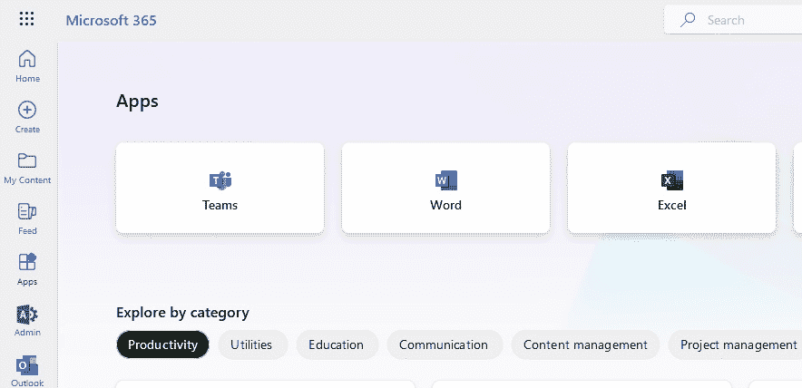
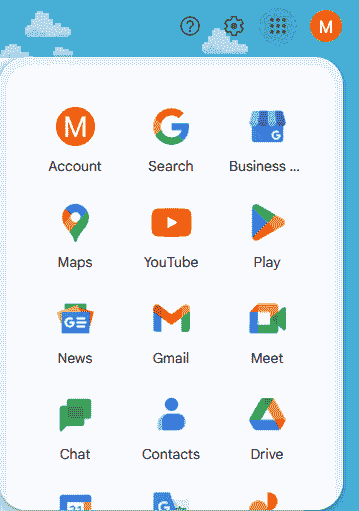
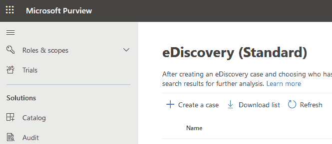
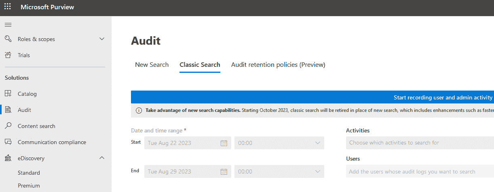
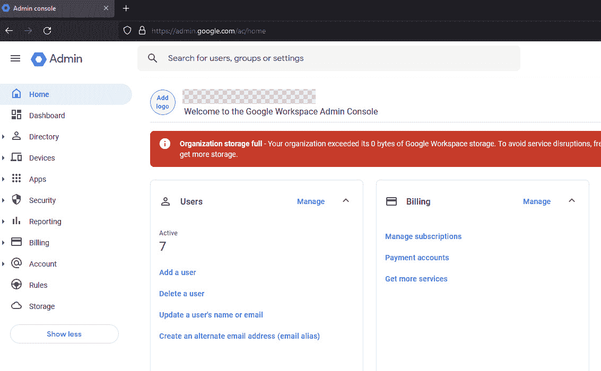

### 第七章：云生产力套件

到目前为止，您已经熟悉了作为 **云服务提供商**（**CSPs**）的 **亚马逊 Web 服务**（**AWS**）、Azure 和 **谷歌云平台**（**GCP**）的核心组件和日志来源。当我们转向办公套件时，必须认识到这些平台——特别是 Microsoft 365 和 Google Workspace——通常是组织数据和活动的中心。这些环境中的事件调查具有独特的挑战和可能性，因为这些服务不仅提供计算和存储，还提供广泛的协作工具，所有这些都通过 **软件即服务**（**SaaS**）模型提供。尽管 SaaS 模型对组织来说非常方便，但这也意味着分析将依赖于产品为调查人员提供的日志来源。

需要注意的是，AWS 并没有类似于 Microsoft 365 或 Google Workspace 的云端办公套件。尽管 AWS 提供了大量的云基础设施和平台服务，但它并未深入进入基于云的办公生产力市场。另一方面，微软和谷歌在生产力软件方面有着长期的市场存在，并自然将其产品扩展到了云端。而 AWS 则更专注于后端基础设施（**基础设施即服务**，或 **IaaS**），并未优先考虑在这一领域推出竞争性的套件。在本章中，我们将深入探讨 Microsoft 365 和 Google Workspace 的功能，研究它们的核心组成部分，以及在法证调查中相关的日志和数据类型。

本章将讨论以下主题：

+   Microsoft 365 和 Google Workspace 核心服务概述

+   **身份与访问管理**（**IAM**）在 Microsoft 365 和 Google Workspace 中的应用

+   Microsoft 365 和 Google Workspace 中的审计和合规功能

+   Google Workspace 管理控制台和安全功能

理解这些办公套件对于全面和有效的调查至关重要。尽管它们与传统的云服务有一些相似之处，但用户活动的深度和广度要求采取专门的法证调查方法。本章结束时，您将了解 Microsoft 365 和 Google Workspace 的法证能力与局限性，帮助您在这些环境中进行更有效的调查。

重要说明

本章将重点关注 Microsoft 365 和 Google Workspace 的核心服务、审计和合规功能。*第十二章* 将重点讨论如何应对被破坏的云办公套件，包括本章讨论的各种服务和日志的收集与分析。

在*第十二章*中，我们将讨论如何在 Microsoft 365 调查中收集和分析统一审计日志。

# Microsoft 365 和 Google Workspace 核心服务概览

Microsoft 365 和 Google Workspace 是强大的云生产力套件，提供一系列旨在促进企业协作、沟通和无缝数据管理的服务。这些生产力套件与其母云平台——微软的 Azure 和 Google 的 GCP——直接相关，这使它们在云取证的背景下尤为重要。了解它们的核心服务以及如何与各自的云平台相关联，将为你提供进行取证调查所需的全面视角。

## Microsoft 365

Microsoft 365 是一个集成的基于云的生产力工具套件，包括 Word、Excel 等 Office 应用程序，以及 SharePoint、Teams 和 OneDrive 等用于协作和安全数据管理的高级服务。对于**数字取证与事件响应**（**DFIR**）专业人员来说，了解 Microsoft 365 至关重要。它在现代企业中的普遍使用意味着关键证据和数据轨迹通常存在于其生态系统中，掌握其架构和安全特性是进行有效调查和确保网络弹性的关键。让我们深入了解该平台及其功能：

+   **许可证**：在组织安全性方面，Microsoft 365 的许可证至关重要，因为不同的许可证级别提供不同的安全功能。例如，E5 许可证提供高级威胁防护功能，如**威胁情报**（**TI**）和**高级威胁分析**（**ATA**），这些功能在 E3 或 E1 等低级别许可证中不可用。许可证是按用户级别分配的，这意味着每个员工可以根据他们在组织中的角色获得不同的工具和安全功能。这种细分方法使公司能够优化成本，同时确保员工具备适当的安全措施。例如，IT 管理员可能需要 E5 许可证，以获得其强大的安全功能，而销售代表可能只需要 E3 许可证。因此，选择正确的 Microsoft 365 许可证不仅仅是功能问题，也是实施分层安全策略的重要考虑。

    安全专业人员应考虑分配更高级别的许可证，如 E5，以利用微软的所有先进安全和电子发现工具。

+   **Office 应用程序**：Microsoft 365 包括行业标准的 Office 应用程序，如 Word、Excel 和 PowerPoint，这些应用程序已经从独立的软件转变为深度集成到云生态系统中。这些应用程序现在提供实时协作和云存储功能。

+   **Microsoft Teams**：Teams 是一个协作中心，支持聊天、视频会议和文件存储。它与其他 Microsoft 服务集成，并提供强大的审计和日志记录功能，对于取证非常有价值。

+   **SharePoint 和 OneDrive**：SharePoint 用于创建网站和门户，且与 OneDrive 深度集成，OneDrive 是 Microsoft 的云存储解决方案。这些服务提供详细的访问和修改日志。

+   **Exchange Online**：这是 Microsoft 的基于云的电子邮件解决方案，与 Outlook 集成，提供广泛的日志记录和审计功能，这对于取证调查至关重要。

+   **高级安全性与合规性**：Microsoft 365 提供一系列高级安全措施，包括威胁防护、**数据丢失防护**（**DLP**）等。安全与合规中心是一个统一的界面，用于管理和审计这些功能。

重要提示

Microsoft 合规中心现已更名为 Microsoft Purview。可以通过 [`compliance.microsoft.com/homepage`](https://compliance.microsoft.com/homepage) 访问。

以下截图展示了 Microsoft 365 门户以及 365 中提供的一些核心服务。登录后可以通过 [`www.microsoft365.com/`](https://www.microsoft365.com/) 访问：

图 7.1 – Microsoft 365 应用程序和核心服务

## Google Workspace

Google Workspace 是 Google 开发的一系列云计算、生产力和协作工具、软件及产品。与 Microsoft 365 类似，它已经成为各种规模的企业和组织首选的解决方案，因为它易于使用、可扩展，并且具有协作性质。对于从事 IT 管理、网络安全或 DFIR 的人员来说，深入了解 Google Workspace 至关重要，因为它的广泛应用和独特架构，尤其在中小型企业中更为突出。以下是该平台及其功能的概述：

+   **许可**：Google Workspace 基于订阅模式运营，类似于 Microsoft 365，但两者的许可方式存在一些关键差异。Google Workspace 的许可通常更简单、更直观。Google 提供不同的许可层级，如 Business Starter、Business Standard、Business Plus 和 Enterprise，每种层级的功能和存储容量不同。

    另一方面，微软提供不同的企业许可证，分别标记为 E1、E3 和 E5，每个类别内都有一系列选项，包括各种微软产品和服务。而 Google Workspace 的许可主要专注于扩展核心的 Google 服务，微软的 E# 许可证则可能包括更广泛的产品，如高级安全与合规包、电话功能等。因此，在选择 Google Workspace 和 Microsoft 365 之间时，组织需要仔细评估它们在功能、安全性和合规性要求方面的具体需求。

+   **Google Drive**：类似于微软的 OneDrive，Google Drive 是一项云存储服务，用户可以将文件存储在线并从任何设备访问它们。Google Drive 与其他 Google 服务无缝集成，并且允许轻松的共享与协作。

+   **Google Docs、Sheets 和 Slides**：这些是 Google 相当于微软 Word、Excel 和 PowerPoint 的工具。它们提供了生产力软件所需的基本功能，并强调团队成员之间的实时协作。

+   **Google Meet**：作为微软 Teams 的对等平台，Google Meet 提供了视频会议服务，并与其他 Google Workspace 应用程序紧密集成。它允许轻松安排会议、共享屏幕，并提供强大的安全功能。

+   **Gmail**：微软有 Exchange Online，而 Gmail 是 Google 的电子邮件平台。通过 Google Workspace 的企业订阅，组织可以获得企业电子邮件地址和额外的管理员控制功能。

+   **Google Calendar**：这是 Google 的时间管理和日程安排工具，可以与微软的 Outlook Calendar 相比较。它与 Gmail 和 Meet 紧密集成，简化了日程安排和事件规划。

+   **Google Chat**：这是 Google 的即时消息平台，相当于微软 Teams 的聊天功能。它提供了直接消息和团队聊天室，以及文件共享和任务管理功能。

+   **Google Forms 和 Google Sites**：虽然这两者并不是微软某个单一应用程序的直接对等物，但 Google Forms 和 Google Sites 提供了易于创建表单和构建网站的功能，分别在 Google 生态系统内集成。这些可以成为内部或外部互动的有价值工具。

+   **高级安全性与合规性**：Google Workspace 提供了一系列旨在保护数据安全的安全功能，如 **两步验证**（**2FA**）、**单点登录**（**SSO**）以及用户访问的管理员控制。它还拥有 Vault 服务用于电子发现（eDiscovery），这一功能对法律和合规性至关重要。

    DLP（数据丢失防护）和端点管理是 Google Workspace 中的其他高级安全功能，允许对数据共享进行规则执行，并管理在移动设备上的数据访问方式。

以下截图展示了 Google Workspace 提供的一些应用程序和核心服务：

图 7.2 – Google 应用及核心服务

在深入了解 Microsoft 365 和 Google Workspace 提供的功能和服务概述后，理解这些平台如何确保用户数据的安全性和完整性至关重要。接下来的部分将重点探讨 Microsoft 365 和 Google Workspace 中的 IAM，了解这些平台如何通过身份验证、授权和管理用户身份的机制，确保只有正确的人才能访问特定资源。

# Microsoft 365 和 Google Workspace 中的 IAM

身份和访问管理（IAM）是任何组织网络安全战略的基石。它控制谁可以访问哪些资源，以及如何安全地授予和跟踪这些访问权限。在 Microsoft 365 和 Google Workspace 这两个平台中，IAM 扮演着至关重要的角色，因为这些平台是基于云的，且管理着大量的数据。

## Microsoft 365

理解 **Azure Active Directory** (**Azure AD**) 的 IAM 功能对于云安全至关重要，尤其是在 Microsoft 365 套件中。Azure AD 提供详细的 **基于角色的访问控制** (**RBAC**) 和 **多因素身份验证** (**MFA**) 功能。它还支持 **条件访问** (**CA**) 策略，根据用户的位置、设备状态和风险评估来调整安全性，有效阻止潜在的不安全访问尝试。此外，Azure AD 的审计功能通过对各种活动（如登录和密码更改）生成日志记录，并与 Azure Sentinel 等工具集成以进行日志聚合，为事件响应人员提供关键数据。这种全面的访问和审计管理方法是保持安全性和进行云环境取证调查的基础。以下是 Microsoft 365 的 IAM 功能概述：

+   **Azure AD**：Microsoft 365 IAM 的核心是 Azure AD，这是一个企业级的 **身份服务提供商** (**IDSP**)。Azure AD 支持复杂的 RBAC，允许对 Microsoft 套件服务以及任何集成的第三方或内部应用进行访问控制。安全专业人员可以创建自定义角色、定义细粒度的访问权限，并强制执行 MFA。

+   **CA 策略**：Azure AD 还支持 CA 策略，根据用户的位置、设备状态和风险评估来执行安全协议。例如，可以设置一个策略，阻止组织外部网络的登录访问。

+   **审计日志和警报**：事件响应人员可以利用 Azure AD 强大的审计能力。对于多种事件，如用户登录、密码重置和权限提升，都会生成日志记录。Azure Sentinel 可以用于聚合来自 Azure AD 和其他来源的日志，从而实现更全面的 **威胁检测与响应** (**TDR**)。登录活动也会被记录在 Microsoft 统一审计日志中，稍后在本章中会进行详细讨论。

## Google Workspace

更深入地探讨 Google Workspace 的身份验证功能，让我们了解其在身份和访问管理（IAM）方面的做法，确保数据访问对用户无缝且对未经授权的访问具备安全防护：

+   **Google 身份平台**：Google Workspace 的 IAM 聚焦于 Google 的身份平台，其中包括基本身份服务，如单点登录（SSO）和多因素认证（MFA）。虽然不像 Azure AD 那样广泛，Google 身份平台仍提供了确保访问安全的基本功能。

+   **上下文感知访问**：与微软的 CA 类似，Google Workspace 提供了上下文感知访问功能。它们可以根据用户的设备和位置等因素强制执行访问策略，允许安全专家制定基于情境的细粒度规则。

+   **工作洞察与警报中心**：Google Workspace 提供了工作洞察工具和警报中心 API，这些工具提供监控和警报服务。工作洞察可以配置以跟踪有助于发现异常模式的各种指标，异常模式可能表明发生了安全事件。警报中心 API 提供可疑活动的实时警报，并可以与**安全信息与事件管理**（**SIEM**）解决方案集成，以便进行集中监控。

+   **OAuth 应用程序白名单**：Google Workspace 允许管理员将 OAuth 2.0 应用程序列入白名单或阻止，防止未经授权的数据访问。这对于减轻与请求广泛权限但未经审核的第三方应用程序相关的风险尤其有用。

对于安全专家和事件响应人员来说，了解这些平台的 IAM 功能对于保护组织数据并迅速响应安全事件至关重要。

# 微软 365 和 Google Workspace 的审计和合规功能

确保组织数据的安全性和合规性是安全专家和事件响应人员的首要任务。微软 365 和 Google Workspace 都提供了一套强大的功能，旨在监控、审计和保护数据，同时帮助组织满足合规要求。接下来，我们将讨论它们各自的能力。

## 微软 365 的安全与合规中心（微软 Purview）

接下来，我们将讨论微软 365 安全机制的核心，重点介绍安全与合规中心（现称为微软 Purview）。Purview 功能丰富，包括电子发现（eDiscovery）、数据丢失防护（DLP）和审计日志等，这些都是在数字取证调查中可以利用的重要功能。让我们更详细地了解这些功能：

+   **电子发现（eDiscovery）**：微软 365 配备了电子发现管理器，这一功能使组织能够搜索、保存、分析和导出其生态系统中的内容，如电子邮件、文档和聊天记录。在调查和诉讼过程中，特别需要对特定数据集进行隔离和审查时，这一功能特别有用。接下来是微软**电子发现（标准版）**的截图：

图 7.3 – Microsoft eDiscovery

+   **DLP**：Microsoft 365 的 DLP 功能允许管理员识别敏感信息，如信用卡号码或**社会保险号码**（**SINs**）/**社会安全号码**（**SSNs**），并设置策略以检测、控制和阻止数据共享。

+   **审计日志**：Microsoft 365 中的详细审计日志可以配置为跟踪各种活动，包括文件和文件夹访问、修改以及用户行为。这些日志被称为 Microsoft 统一审计日志。Microsoft 统一审计日志是 Microsoft Purview 中的一个关键功能，旨在提供跨多个 Microsoft 365 服务（如 SharePoint Online、Exchange Online、OneDrive、Azure AD、Microsoft Teams 等）的活动的综合记录。这些日志作为宝贵的数据存储库，对安全专业人员和事件响应人员来说至关重要。

    统一审计日志记录了各种活动。这些活动可能包括 SharePoint 和 OneDrive 中的文件访问和修改，Azure AD 中的用户登录活动，以及添加或删除用户等管理操作，甚至是 Teams 和 Outlook 中的特定数据共享事件。这些日志的统一性意味着组织不必访问每个单独的服务来查看日志。在*第十二章*中，我们将讨论如何在 Microsoft 365 调查中收集和分析统一审计日志。

重要提示

统一审计日志可以在 Microsoft Purview 中的**审计**选项卡下找到。审计日志必须由组织启用，才能开始记录用户和管理员的活动。默认情况下，这些日志是未启用的。

以下截图显示了默认的审计搜索面板：

图 7.4 – Microsoft 365 合规中心（Microsoft Purview）中的审计搜索面板

+   **威胁保护功能**：微软的威胁保护套件与微软 Purview 集成，提供先进的威胁分析和**人工智能**（**AI**）驱动的洞察力。对于事件响应人员，这些工具可以自动化检测和修复各种威胁。微软已将此产品重新命名为 Microsoft 365 Defender。未来，微软可能会通过集成 Microsoft Security Copilot 等技术来增强此套件。Microsoft Security Copilot 被设想为一款先进的 AI 工具，作为微软更广泛 AI（Microsoft Copilot）计划的一部分，旨在增强组织的安全专业知识和对安全事件的响应能力。

重要提示

Microsoft 365 Defender 可以通过[security.microsoft.com](http://security.microsoft.com)访问。

+   **合规性管理器**：该工具帮助组织评估和管理其合规性状况，通过提供合规性评分、评估和建议，帮助安全专业人员将组织流程与行业标准和法规对齐。

# Google Workspace 管理控制台及安全功能

转到 Google Workspace 的管理中心，接下来的部分将介绍管理控制台。这个中央仪表板不仅仅是管理员的控制面板，还包含了如警报中心 API、Google Vault、DLP 和审计日志等关键功能，这些功能共同在监控、保存、取证和确保环境安全方面发挥着至关重要的作用，作为事件响应者。让我们仔细看看：

+   **警报中心**：Google Workspace 的警报中心 API 提供实时的安全警报，使管理员能够迅速对潜在问题（如钓鱼攻击或可疑登录尝试）做出反应。警报中心可以与第三方 SIEM 解决方案集成，以便更好地进行**事件响应（IR）**。

+   **Vault**：Google Vault 允许保留、归档和进行电子发现（eDiscovery）操作，类似于 Microsoft 的电子发现功能。这个工具对于合规性、诉讼或内部调查至关重要。

+   **数据丢失防护（DLP）**：类似于 Microsoft 365，Google Workspace 也具有 DLP 功能，可以配置为检测敏感数据，并对用户发出警告或完全阻止交易。

+   **审计日志**：Google Workspace 提供了各种服务（如 Gmail、Drive 和移动设备）的详细日志。这些日志可以导出到 BigQuery 或第三方 SIEM 系统进行高级分析和报告，从而更快响应事件。这些日志可以通过 Google 管理控制台中的**报告**部分访问。

重要提示

通过 Google 管理控制台菜单中的**报告** | **报告** | **用户报告**访问报告。

+   **安全健康**：Google Workspace 中的安全健康功能概述了安全设置及其与推荐最佳实践的匹配情况。它提供了潜在漏洞的仪表板视图，使管理员能够根据需要加强安全措施。

以下截图展示了 Google Workspace 管理控制台的中央界面，Workspace 管理员可以访问前面讨论的各种功能：

图 7.5 – Google Workspace 管理控制台

Microsoft 365 和 Google Workspace 都提供了一系列旨在审计、合规和安全的功能。Microsoft 365 通过其 Microsoft Purview 提供了更为先进和精细的控制，尤其对具有复杂需求的大型企业特别有用。而 Google Workspace 则通过其管理员控制台提供了更简洁但同样强大的功能集。对于安全专业人员和事件响应人员来说，了解这些平台的能力对于有效的**事件管理**（**IM**）、审计和确保合规性至关重要。

# 总结

你已经掌握了核心服务和 IAM（身份和访问管理）功能，以及 Microsoft 365 和 Google Workspace 中的审计和合规性能力。这些不仅仅是普通的云服务；它们是组织数据和活动的支柱，提供在 SaaS 模型下的广泛协作工具。由于依赖这些平台提供的日志源，SaaS 架构使得调查变得更为复杂。

你已经了解了像 Microsoft 的统一审计日志和 Google Workspace 的警报中心 API 这样的功能，它们是事件响应人员不可或缺的工具。我们深入探讨了 IAM，讨论了如何利用 Azure AD 和 Google 身份平台来构建更安全、更可监控的环境。最后，我们还简要讨论了这两套套件中的安全和合规功能，赋予你确保组织遵守各种法律框架的知识。

在下一章中，我们将把焦点转向云环境中的 DFIR（数字取证与事件响应）流程。虽然本章为你提供了对两大主流生产力套件的理解，但下一章将加深你对 DFIR 流程关键方面的洞察。我们将深入探讨 DFIR 流程如何在云基础设施中应用，提供你有效管理、分析和响应组织中具有较大云存在的安全事件的知识。

# 进一步阅读

+   Microsoft 365 许可：[`learn.microsoft.com/en-us/microsoft-365/commerce/licenses/subscriptions-and-licenses?view=o365-worldwide`](https://learn.microsoft.com/en-us/microsoft-365/commerce/licenses/subscriptions-and-licenses?view=o365-worldwide)

+   Microsoft 企业许可指南：[`download.microsoft.com/download/3/D/4/3D42BDC2-6725-4B29-B75A-A5B04179958B/Licensing_guide_Microsoft_365_Enterprise.pdf`](https://download.microsoft.com/download/3/D/4/3D42BDC2-6725-4B29-B75A-A5B04179958B/Licensing_guide_Microsoft_365_Enterprise.pdf)

+   Microsoft Purview 电子发现解决方案：[`learn.microsoft.com/en-us/purview/ediscovery`](https://learn.microsoft.com/en-us/purview/ediscovery)

+   Microsoft 安全助手: [`www.microsoft.com/en-ca/security/business/ai-machine-learning/microsoft-security-copilot#overview`](https://www.microsoft.com/en-ca/security/business/ai-machine-learning/microsoft-security-copilot#overview)
