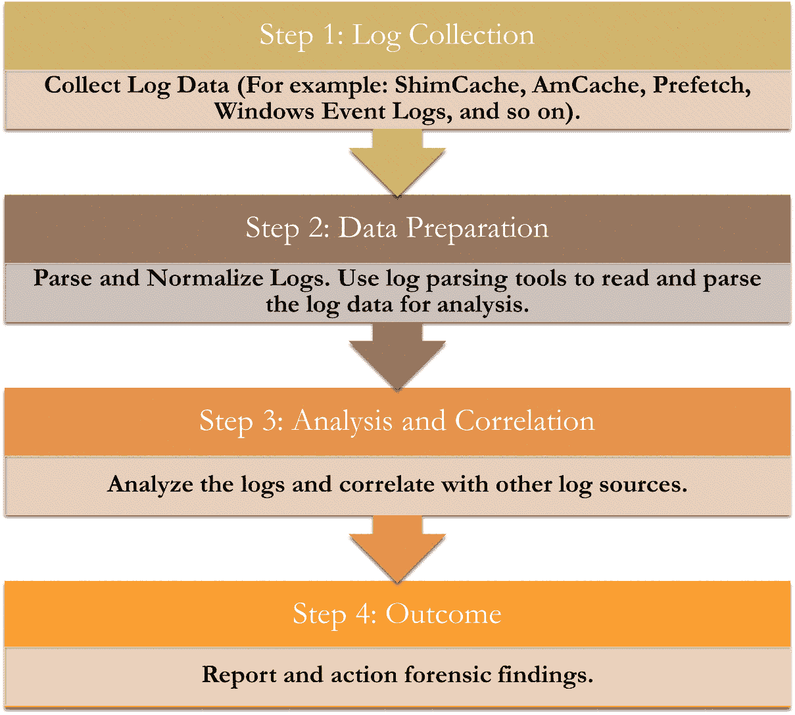
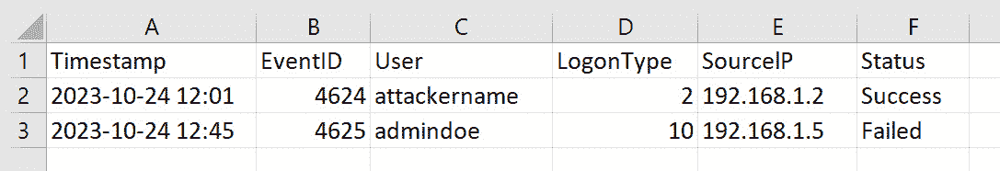

### 第九章：常见攻击向量和 TTP

随着组织日益依赖云基础设施，安全团队和事件响应人员发现自己面临云中一些独特的漏洞和攻击模式。攻击者利用这些漏洞，并使用有时特别针对云环境定制的 **战术、技术和程序** (**TTPs**)。

本章深入探讨云中的这些常见攻击向量，提供了有助于提升和完善我们应对日益演变的威胁的响应策略的见解。配置错误的虚拟机实例和存储桶、未保护的 API 端点以及不充分的身份验证协议仅仅是威胁行为者所针对的一些漏洞。为了利用这些弱点，攻击者使用从权限提升和服务器端请求伪造到针对云基础设施量身定制的零日漏洞等多种 TTP。理解这些特定的威胁对于云安全和有效的事件响应至关重要。

具体而言，本章将讨论以下主题：

+   MITRE ATT&CK 框架

+   取证初步收集

+   主机基础的取证

+   配置错误的虚拟机实例

+   配置错误的存储桶

+   云管理员门户漏洞

云中的攻击向量和 TTP 在大多数情况下与本地环境中的攻击向量和 TTP 相似。然而，云的去中心化特性引入了独特的漏洞。配置错误的虚拟机实例可能暴露整个虚拟环境，而未妥善保护的存储桶可能成为数据泄露的入口。云的可访问性带来了诸如身份验证机制薄弱等问题，这可能导致未经授权的访问。虽然网络安全的核心原则保持一致，但这些以云为中心的问题需要特别的关注和理解。

重要提示

我们将在*第十二章*中更详细地讨论云生产力套件的常见攻击向量和 TTP（战术、技术和程序）。

# MITRE ATT&CK 框架

MITRE ATT&CK 框架是一个基于安全研究人员的实际观察构建的攻击者战术和技术的知识库。它是安全团队用来更好地理解攻击行为，并改进防御和响应策略的工具。在云环境的背景下，MITRE ATT&CK 框架列出了对 **云服务提供商** (**CSPs**) 如 AWS、Azure 和 GCP 等进行攻击时对手使用的特定技术。

MITRE ATT&CK 框架对于云取证特别有用，因为它使响应人员能够预见攻击者的行为，并据此规划他们的取证调查。通过与此框架对齐，组织可以识别其防御态势中的空白，更好地了解如何检测、响应和缓解特定于云的威胁。

在云基础设施范围内，MITRE ATT&CK 框架提供了一张已知攻击者 TTP（战术、技术和程序）矩阵，其中包括但不限于以下内容：

+   **初始访问**：通过各种入口向量进入云环境的技术。例如，利用公共应用程序漏洞（T1190）可能与云中托管的 Web 应用程序的漏洞相关。

+   **执行**：执行阶段包括导致对手控制的代码在本地或远程系统上运行的技术。这可能涉及服务器软件组件（T1505），其中攻击者可能通过 Web 服务器插件执行代码。

+   **持久性**：在云中，攻击者通常利用某些功能保持在环境中的登录状态，例如在创建云实例（T1578）中，攻击者会在现有帐户中创建一个新实例以维持其操作。

+   **特权升级**：允许对手在系统或网络中获得更高权限的技术。例如，滥用提升控制机制（T1548）可能涉及攻击者利用过度宽松的**身份和访问管理**（**IAM**）角色。

+   **防御规避**：这涉及对手使用的技术，以避免在整个入侵过程中被检测到。诸如禁用安全工具（T1562）之类的技术，可能用于关闭云中的监控和日志记录功能。

为了进一步说明 MITRE ATT&CK 框架如何适用于云攻击场景，考虑以下示例：

+   **配置错误和未授权访问（T1580）**：正如本章后面讨论的那样，攻击者通常会利用云存储服务中的配置错误，例如 AWS S3 桶或 Azure Blob 存储。通过枚举这些服务并利用开放权限，攻击者可以读取、修改或删除存储在这些资源中的敏感数据。

通过将 MITRE ATT&CK 框架融入云安全实践中，组织可以更有效地构建应对事件的策略，并使其取证工作与行业标准的命名法和战术保持一致。这样做不仅增强了事件响应计划，还与全球最佳实践接轨，帮助确保对云攻击的防御更加坚韧。

事件响应人员可能需要将所有取证结果映射到 MITRE 编号，并以易于理解的表格形式呈现，帮助防御团队更好地了解攻击是如何在其环境中发生的。例如，以下表格展示了一个假设云被攻破的 MITRE ATT&CK 表格示例：

| **MITRE ATT&CK** **技术编号** | **技术名称** | **描述** |
| --- | --- | --- |
| **T1190** | 利用面向公众的应用程序 | 攻击可以从互联网访问的服务器或服务，以获得访问权限。例如，攻击者可能会针对暴露在互联网上的特定 Web 应用程序或服务，如托管在云中的 Web 门户或 API 网关。重点通常是利用 Web 模块或应用程序代码中的漏洞，获得对底层云资源或敏感数据的未授权访问。 |
| **T1136.003** | 使用服务主体 | 创建或破坏云身份以维持对云资源的访问。可能涉及创建或劫持云身份服务，例如 Azure AD 服务主体或 AWS IAM 角色。攻击者可能创建虚假身份或破坏现有身份，以获得持久的云资源访问权限，从而能够访问或操控工作负载和服务。 |
| **T1580** | 云基础设施发现 | 扫描云服务和资产的信息，以规划进一步的攻击。攻击者通常会对云环境进行侦察，针对特定的云服务，如 AWS EC2 或 Azure 虚拟机。他们会扫描暴露的 API、不安全的存储桶或配置错误的云资源，以识别潜在的入口点或有价值的数据。 |
| **T1078** | 有效账户 | 使用被盗账户凭证访问云系统，获取未授权访问权限。 |
| **T1090** | 代理 | 利用中介系统掩盖恶意流量的来源。攻击者使用基于云的中介服务或虚拟机作为代理，隐藏其来源。这种技术可能涉及启动云实例来转发恶意流量，使其更难追溯到源头。 |
| **T1526** | 云服务仪表板 | 访问云服务管理界面进行控制或侦察。通过访问云管理界面，例如 AWS 管理控制台或 Azure 门户，攻击者可以监控和控制云资源。这可能涉及跟踪工作负载、修改配置或获得有关安全控制的见解。 |
| **T1548.004** | 云服务滥用 | 利用云服务或资源来支持恶意操作。 |
| **T1562.007** | 禁用或修改云防火墙 | 修改或禁用基于云的防火墙，以允许恶意流量或阻止安全响应。攻击者修改或禁用基于云的防火墙，如 AWS WAF 或 Azure 防火墙，以允许恶意流量或阻碍安全响应。这可能涉及更改规则以允许访问特定端口或服务，或禁用关键云资产的保护措施。 |
| **T1578** | 修改云计算基础设施 | 对云计算服务（如实例和虚拟机）进行更改，以建立持久性或提升特权，并对云计算服务进行未经授权的修改，如修改虚拟机配置或向容器化应用程序注入恶意代码。此技术旨在建立持久性、提升特权或在云环境中创建后门。 |
| **T1583** | 获取基础设施：云账户 | 购买或以其他方式获取云账户以用于恶意目的。 |
| **T1608.001** | 数据外泄阶段：云存储 | 将被盗数据放入云存储服务以准备外泄，以及将被盗或非法获取的数据放入云存储服务，如 Amazon S3 存储桶或 Azure Blob 存储，以准备外泄。这个步骤通常在大规模数据泄露或数据盗窃操作之前进行，利用云服务进行妥协数据的暂存和传播。 |

表 9.1 – 事件 MITRE ATT&CK 表示例

重要说明

所有攻击者的 TTP（战术、技术和程序）都可以在 ATT&CK 框架中映射到相应的编号。可以在 MITRE 组织网站找到：[`attack.mitre.org/`](https://attack.mitre.org/)。

# 法医筛查数据收集

事件响应者面临的最大痛点之一是个体主机级别的数据获取，尤其是当涉及到操作系统的相关痕迹时。像 Azure、AWS 和 GCP 这样的云服务平台（CSPs）提供了各种日志机制，帮助监控和审计其资源上的操作。然而，这些日志通常只捕获与基础设施或服务相关的活动。默认情况下，它们不会捕获与用户活动或操作系统级别的系统操作相关的细节（除非使用连接到云生态系统的 EDR 代理，如 Microsoft Defender for Endpoint）。即使是在涉及云资源的网络事件中，实际情况是，大多数事件的**妥协指示符**（**IoCs**）将来自主机级别的痕迹。

正如我们在本书中所看到的，云日志源主要关注云资源的交互。这意味着像特定的 Windows 事件日志、文件修改、内存操作和用户命令执行等详细的主机级活动，默认情况下并不会被捕获（即无法从云中访问）。唯一的例外是，如果主机文物和日志已被设置为转发到如 AWS CloudWatch 或 Azure Log Analytics 工作区等云服务中。很可能，事件响应者会遇到一个需要捕获所有主机级取证文物的事件（即托管在云环境中的虚拟机实例）。操作系统文物提供了虚拟机实例上发生的事件的更详细画面，通过分析多个虚拟机实例，可以帮助事件响应者理解其云基础设施在事件中受影响的程度。

这些文物可能包括以下内容：

+   **文件系统元数据**：有关文件创建、修改或删除的详细信息

+   **内存文物**：有关正在运行的进程、网络连接和加载模块的信息

+   **注册表文物（适用于 Windows）**：关于已安装应用程序、用户活动和系统配置的详细信息

+   **Shell 历史记录（适用于 Linux）**：命令执行历史记录，可以提供用户活动的线索

+   **应用程序日志**：特定的应用程序可能会生成日志，但这些日志未被 CSP 捕获或汇总

由于这些文物在 CSP 中缺失，因此必须使用像**Kroll Artifact Parser and Extractor**（**KAPE**，[`www.kroll.com/en/services/cyber-risk/incident-response-litigation-support/kroll-artifact-parser-extractor-kape`](https://www.kroll.com/en/services/cyber-risk/incident-response-litigation-support/kroll-artifact-parser-extractor-kape))或**Collect Your Logs Remotely**（**CyLR**）这样的工具进行分类和取证分析。

KAPE 和 CyLR 都是免费的分类工具，能够快速收集和处理取证相关文物。它们具有高度可定制性，使事件响应者能够根据网络事件的性质有针对性地捕获特定文物。它们轻量级，不需要太多计算能力即可在系统上运行。

重要提示

KAPE 在用于第三方网络和/或作为付费合作的一部分时需要企业许可证。对于任何地方、州、联邦或国际政府机构，以及教育和研究用途，KAPE 是免费的。

您可以在[`www.kroll.com/en/services/cyber-risk/incident-response-litigation-support/kroll-artifact-parser-extractor-kape/`](https://www.kroll.com/en/services/cyber-risk/incident-response-litigation-support/kroll-artifact-parser-extractor-kape/)下载 KAPE 并查找其使用说明。

你可以下载 CyLR 并在 GitHub 上找到其使用说明，地址为[`github.com/orlikoski/CyLR/`](https://github.com/orlikoski/CyLR/)。

# 基于主机的法医

在云环境中，主机指的是运行用户应用程序并作为用户和应用程序活动终端的虚拟或物理机器。它可以是单个服务器、虚拟机或容器，具体取决于所使用的云模型。在传统的本地环境中，主机通常指的是有形的物理服务器或机器，但在云中，主机可能是临时的，并会根据需求和要求快速创建或销毁。

重要提示

本章我们将集中讨论基于 Windows 的系统。Linux 系统将具有不同的主机相关文物，可以进行收集和分析。

基于主机的云法医聚焦于从这些单独的主机或终端获取并分析数据，旨在识别入侵迹象、横向移动、恶意代码执行和其他 TTP（战术、技术和程序）。由于主机是应用程序执行的主要点，并且通常是攻击者的入口或枢纽点，因此它是一个丰富的法医数据来源。

Windows 操作系统中的几个文物可以提供关于主机上活动的大量信息：

+   **预取**：这用于加速 Windows 启动过程和应用程序启动时间。通过检查预取文件，事件响应者可以确定主机上执行了哪些程序以及何时执行。

+   **AmCache**：AmCache 包含有关已执行应用程序的信息，可以提供有关程序执行和用户活动的见解。

+   **ShimCache**：也称为应用程序兼容性缓存，ShimCache 包含最近执行的应用程序列表。它对于了解系统上运行了什么，特别是在系统重启后，因为一些其他文物可能已经被清除，非常有价值。

+   **Windows 事件日志**：这些日志，尤其是安全、系统和应用程序日志，可以提供关于安全相关事件、系统启动、关机、应用程序崩溃等的大量信息。它们对识别与潜在安全事件相关的模式至关重要。

还有许多其他文物可以进行分析，但从事件响应者的角度来看，这些是最有用的。我们将利用这些文物分析本章中讨论的云资源上的常见入侵。

重要提示

预取、AmCache、ShimCache 和 Windows 事件日志是 KAPE 和 CyLR 收集的众多文物之一。

分析基于主机的日志过程可以分解为以下几个步骤：

1.  **日志收集**：收集目标主机的数据。这是提取所有必要条目以供分析的初步步骤。这些日志在生成法医筛查包时也会被捕获。

1.  **数据准备**：使用解析工具将原始数据转换为可读和可分析的格式。

1.  **分析与关联**：这包括考虑用户活动、文件路径、执行标志、文件修改时间以及文件大小/属性等关键方面，以识别任何异常或警示信号。将日志数据与其他取证物证交叉引用，以便在更广泛的调查范围内将发现进行背景化。

1.  **结果**：记录分析结果，识别任何潜在的入侵指示。根据发现，确定适当的响应措施，这可能包括进一步的详细调查、系统修复或启动安全协议以防止未来的安全漏洞。

这些步骤可以通过以下流程图来可视化：



图 9.1 – 基于主机的取证分析过程

## 入侵证据

确定执行证据通常是确定主机系统入侵证据的关键初步步骤。在寻求系统妥协和随后的利用过程中，威胁行为者经常试图执行未经授权的应用程序，特别是恶意软件，以建立立足点或获取提升的权限。这些应用程序的未经授权执行可以作为泄露或入侵的明确指示。

为了确定这种未经授权的执行，事件响应者依赖于某些内在的物证，如 Prefetch、AmCache 和 ShimCache。这些物证存储有关已执行程序的数据，为应用程序执行历史提供了宝贵的见解。通过细致分析这些物证，专业人员可以发现任何指向未经授权执行的差异或异常，从而揭示潜在的恶意行为者入侵系统的证据。关注点不仅仅在于识别恶意软件，还在于理解入侵的广度和深度，从而能够采取更全面的安全响应。

2013 年，一家大型美国零售商遭遇了重大数据泄露事件，攻击者窃取了数百万客户的信用卡和个人信息。在这一事件中，取证数据如预取文件、AmCache、ShimCache 和 Windows 事件日志在调查中起到了至关重要的作用。预取文件可能提供了有关恶意软件和攻击者使用的黑客工具执行情况的洞察，揭示了恶意活动的模式。AmCache 条目记录了已执行的程序，可能有助于识别与泄露事件相关的未经授权的二进制文件。ShimCache 可能提供了恶意可执行文件运行的额外证据，这对于理解恶意软件在零售商系统中的兼容性策略非常有帮助。Windows 事件日志记录了广泛的系统活动，对于重建泄露事件的时间线至关重要，包括登录尝试、系统更改和网络活动。这些数据结合起来，帮助调查人员拼凑出攻击者的行动轨迹，确认泄露事件中使用的方法，并全面理解入侵的范围，从而在揭示零售业最重大网络攻击之一中发挥了关键作用。

## 预取分析

预取是一个优化技术，由 Windows 操作系统用于加速应用程序的启动。它通过预测应用程序将需要哪些文件，并提前将其加载到内存中来实现这一点。在应用程序的首次执行后，系统会将相应的 `.pf` 文件填充到 `Prefetch` 目录中。这些文件可以在标准 Windows 安装的 `C:\Windows\Prefetch` 目录中找到。该目录将包含以 `.pf` 扩展名结尾的文件，每个文件的名称与其对应的可执行文件相同。例如，如果你运行了 `notepad.exe`，你可能会在 `Prefetch` 目录中找到一个名为 `NOTEPAD.EXE.pf` 的文件。

分析这些预取文件能够提供有关系统上运行过的应用程序的信息，这使得它们在性能诊断和取证调查中都具有重要价值。这些文件是由缓存管理器生成的，缓存管理器跟踪应用程序在运行过程中引用的所有文件和目录。因此，这些 `.pf` 文件成为了关于应用程序执行的历史数据的重要容器。

预取文件的取证重要性：

+   `.pf` 文件记录了相应应用程序的初次执行日期和最后执行日期。这些时间戳在取证调查中至关重要，因为它们有助于追溯潜在恶意应用程序首次引入并在系统上执行的时间。

+   `.pf` 文件本身也可以提供取证线索。虽然创建日期通常与应用程序首次执行的时间相符，但修改日期通常与最后一次执行日期相对应。通过比较这些日期，调查人员可以确定应用程序使用的连贯性和频率。

最受欢迎的开源 Prefetch 分析工具之一是 **PECmd**，它由 Eric Zimmerman 编写和维护。该工具解析 Prefetch 文件，并提供详细的输出，包括文件路径、时间戳、运行次数等。另一个常用的（但有许可要求的）Prefetch 文件解析工具是 Magnet AXIOM。

重要提示

你可以下载 PECmd，并在[`github.com/EricZimmerman/PECmd`](https://github.com/EricZimmerman/PECmd)找到其使用详情。

假设有一个名为 `malicious.exe` 的可疑文件在组织的云租户上托管的 Windows 虚拟机实例中被执行。获取相应的 Prefetch 文件（可能来自我们之前讨论的某个初步检查工具），`MALICIOUS.EXE.pf`，并用 PECmd 分析后，输出可能如下所示：

```
> PECmd.exe -f C:\Users\Mansoor\Downloads\MALICIOUS.EXE.pf
Processing C:\Users\Mansoor\Downloads\MALICIOUS.EXE.pf
---------------------------------
Source File: C:\Users\Mansoor\Downloads\MALICIOUS.EXE.pf
---------------------------------
Executable: C:\Users\Mansoor\Downloads\MALICIOUS.EXE
Run Count: 3
Volume Info:
    Volume Path: \\?\Volume{abcd1234-efgh-5678-ijkl-1234567890ab}\
    Creation Date: 2023-09-15 15:34:21 UTC
    Serial Number: 3A2B1C4D
Directories accessed:
    C:\Users\Mansoor\Downloads\
    C:\Windows\System32\
    C:\Temp\
Files accessed:
    C:\Users\Mansoor\Downloads\MALICIOUS.EXE
    C:\Windows\System32\somefile.dll
    C:\Temp\tempfile.tmp
Last Run Time: 2023-10-24 12:23:45 UTC
Trace Chains (Last 8 executions):
    1\. 2023-10-24 12:23:45 UTC
    2\. 2023-10-23 10:20:30 UTC
    3\. 2023-10-22 14:15:15 UTC
```

在分析 Prefetch 文件（例如 `MALICIOUS.EXE.pf`）后，PECmd 提供的输出是一个丰富的取证数据源。PECmd 解码存储在 Prefetch 文件中的信息，并以易于阅读的格式呈现，包括应用程序首次和最后一次运行的时间戳、执行的总次数以及执行过程中访问的文件。

在分析 Prefetch 输出时，以下是一些攻击者的 TTPs（战术、技术和程序）需要注意：

+   **时间戳**：Prefetch 文件包含时间戳，表示特定应用程序上次运行的时间。这有助于调查人员将应用程序执行时间与系统上的其他事件进行关联。

+   **应用程序频率**：通过检查 Prefetch 文件中的运行计数，分析人员可以确定应用程序的执行频率。不寻常的频率可能表明存在异常或恶意活动。

+   **卷信息**：Prefetch 文件还会存储关于应用程序执行来源卷的详细信息。这对于追溯潜在的恶意外部设备或卷非常有用。

+   **应用程序源路径**：识别应用程序执行的位置（例如，来自 USB 设备或特定目录）可以帮助拼凑出攻击者在主机上的行动或移动路径。

+   **文件和目录引用**：Prefetch 文件列出了在应用程序启动过程中访问的其他文件和目录。这可以突出任何依赖或关联的文件，这些文件可能也是恶意或已被攻破的。

Prefetch 文件，尽管设计上是为了性能优化，但它们已经成为事故响应人员不可或缺的取证工具。

## AmCache 分析

AmCache 类似于 Prefetch，是 Windows 系统（特别是 Windows 8 及以上版本）特有的取证遗留物。`AmCache.hve`文件是一个 Windows 注册表 hive，主要服务于 Windows 应用程序体验程序，这是一个旨在确保软件兼容性的功能。通常位于`C:\Windows\AppCompat\Programs\Amcache.hve`，该 hive 记录了执行过的应用程序的详细元数据，以及关于连接硬件的信息，例如 USB 设备。虽然它的主要功能是软件兼容性，但它所包含的丰富数据使其成为取证调查中不可或缺的工具。

它的取证重要性如下：

+   **二进制元数据**：AmCache 包含了关于执行二进制文件的详细元数据，如文件路径、最后修改时间、创建时间、SHA-1 哈希等。这帮助取证分析师追溯系统中可执行文件的来源和历史。

+   **硬件痕迹**：该 hive 还记录了插入的硬件设备，可能帮助调查人员追踪恶意 USB 设备或外部存储设备的插入时间。

+   **与执行的关联**：通过分析 AmCache，取证专家可以将二进制元数据与其他证据中的执行痕迹进行关联，从而提供系统活动的完整时间线。

解析 AmCache 的常用工具之一是 AmcacheParser，它也是 Eric Zimmerman 的取证工具套件的一部分。像 PECmd 一样，它是开源的，并提供了对`AmCache.hve`文件的详细解析。另一个提供强大 AmCache 解析功能的授权工具是 Magnet AXIOM。

重要提示

你可以在[`github.com/EricZimmerman/AmcacheParser`](https://github.com/EricZimmerman/AmcacheParser)下载 AmcacheParser 并查看其使用说明。

假设在云端托管的 Windows 虚拟机上执行了一个名为`malicious_mansoor.exe`的恶意文件。当获取`AmCache.hve`文件并用 AmcacheParser 解析时，输出可能会类似于以下内容：

```
> > AmcacheParser.exe -f C:\Users\Mansoor\Downloads\Amcache.hve
Processing C:\Users\Mansoor\Downloads\Amcache.hve
---------------------------------
Source File: C:\Users\Mansoor\Downloads\malicious_mansoor.exe
SHA-1: a1b2c3d4e5f67890a1b2c3d4e5f67890a1b2c3d4
File Created: 2023-09-14 12:01:12 UTC
File Last Modified: 2023-09-15 13:05:10 UTC
Run Count: 2
Associated Files:
    C:\Windows\System32\somefile.dll
    C:\Temp\tempfile.tmp
---------------------------------
```

以下是分析 AmCache 时需要注意的一些关键 TTP：

+   **二进制哈希**：AmCache 中的 SHA-1 哈希提供了一个机会，用于与威胁情报源中的已知恶意哈希进行匹配。

+   **文件路径**：不寻常或可疑的文件路径，尤其是位于临时文件夹或不常见目录中的路径，可能暗示着恶意活动。

+   **文件创建与修改**：时间戳可以与其他系统事件相关联，从而描绘出攻击者的行为。

+   **关联文件**：像 Prefetch 一样，AmCache 也提供了与可执行文件相关联的文件引用，有助于绘制出潜在的恶意依赖关系。

AmCache hives 虽然是为了兼容性而创建的，但却具有重要的取证潜力。与 Prefetch 一起，AmCache 已经证明了它在事件响应和数字取证中的重要价值。

## ShimCache 分析

ShimCache，正式名称为应用兼容性缓存，是 Windows 操作系统的一部分，旨在允许为旧版本 Windows 设计的应用程序提供向后兼容性。当 Windows 执行一个程序时，它会检查 ShimCache 以确定该应用程序是否需要任何“修补程序”或兼容性修复才能正确运行。ShimCache 在此过程中会保持一个已在系统上运行的可执行文件列表，这使其成为数字取证分析师的重要资源。ShimCache 信息存储在 Windows 注册表中，路径为 `HKEY_LOCAL_MACHINE\SYSTEM\CurrentControlSet\Control\Session Manager\AppCompatibility\AppCompatCache`。

这是它的取证重要性：

+   **执行历史**：ShimCache 维护着最近执行的应用程序列表，帮助取证分析师追踪哪些可执行文件曾在系统上运行。此列表包括文件路径、最后修改时间和文件大小。

+   **持久性机制检测**：恶意软件通常会利用各种持久性机制。观察 ShimCache 中不常见或可疑路径的重复条目，可以提示存在此类持久性机制。

+   **与其他证据的关联**：类似于 AmCache，ShimCache 中的数据可以与其他取证证据交叉参考，从而提供系统执行历史和潜在事件的全面视图。

提取和解析 ShimCache 条目的流行工具是 ShimCacheParser，它也是 Eric Zimmerman 的取证工具套件的一部分。它提供了 ShimCache 条目的结构化输出，方便快速的取证分析。

重要提示

你可以下载 ShimCacheParser，并在 [`github.com/mandiant/ShimCacheParser`](https://github.com/mandiant/ShimCacheParser) 查找其使用详情。

假设在 Windows 系统中发现了一个名为 `malicious_mansoor.exe` 的恶意文件。通过提取 ShimCache 数据并使用 ShimCacheParser 进行分析，输出结果可能如下所示：

```
> ShimCacheParser.exe -f SYSTEM
Processing SYSTEM hive...
---------------------------------
Source File: C:\Users\Mansoor\Downloads\malicious_mansoor.exe
File Last Modified: 2023-09-15 13:05:10 UTC
File Size: 24576 bytes
Execution Flag: Executed
---------------------------------
```

根据此输出，事件响应者和取证专家可以高度确认恶意文件已经被执行，并能够推断恶意二进制文件 `malicious_mansoor.exe` 可能是在文件系统中何时创建或最后一次更改的。

以下是分析 ShimCache 时需要注意的一些关键 TTPs：

+   **文件路径**：ShimCache 中出现来自不常见或可疑目录的可执行文件通常是一个警示信号。

+   **执行标记**：虽然 ShimCache 记录了可执行文件，但并非所有文件都必然被执行。执行标记区分了仅存在与实际执行之间的差异。

+   **文件修改时间**：文件修改时间的异常，特别是如果它们与已知的入侵事件相关联，可能具有重要意义。

+   **文件大小和属性**：文件大小或属性偏离已知的正常基线可能暗示潜在的篡改或恶意替换。

ShimCache 是为应用程序兼容性而设计的，已经发展成为一个重要的取证工件。与 Prefetch 和 AmCache 等其他工件配对使用，ShimCache 提供了对系统活动的宝贵见解，有助于彻底的事件响应和调查。

## Windows 事件日志

Windows 事件日志是微软 Windows 系统固有的集中式系统日志记录设施。它提供了系统、安全、应用程序和其他事件的详细记录。无论是跟踪用户活动、诊断系统问题、监视安全事件还是确保合规性，事件日志都发挥着至关重要的作用。

这里是位置：

+   `C:\Windows\System32\winevt\Logs`

+   `C:\Windows\System32\winevt\Logs`

这里有一些重要的 Windows 事件日志：

+   **安全日志**：捕获与安全相关的事件，如登录、注销、对象访问、账户管理等

+   **系统日志**：反映系统组件的活动，包括驱动程序和服务，捕获系统故障、资源耗尽或其他系统范围事件的警报

+   **应用程序日志**：记录安装的应用程序和服务的应用程序事件、错误、警告和信息消息

+   **PowerShell 日志**：专门记录与 PowerShell 命令、脚本和模块相关的活动

+   **终端服务（RDP）**：涉及**远程桌面协议**（**RDP**）会话，捕获登录成功和失败、断开连接以及其他 RDP 特定事件

这里是取证的重要性：

+   **安全日志**：

    +   **账户登录**：显示账户何时被验证

        +   **事件 ID 4624**：成功登录

        +   **事件 ID 4625**：账户登录失败

    +   **账户管理**：显示用户账户或组何时被创建、更改或删除：

        +   **事件 ID 4720**：用户账户已创建

    +   **权限使用**：指示特权的使用

        +   **事件 ID 4672**：为新登录分配特权

    +   **对象访问**：详细说明何时访问特定对象（文件、目录）

        +   **事件 ID 4663**：尝试访问对象

+   **终端** **服务（RDP）**：

    +   **事件 ID 4778**：会话重新连接到窗口站

    +   **事件 ID 4779**：会话从窗口站断开连接

+   **PowerShell 日志**：

    +   **事件 ID 4103**：指示已执行 PowerShell 命令或脚本块

+   **横向移动**：

    +   **事件 ID 5140**：已访问网络共享

    +   **事件 ID 5145**：检查网络共享对象以查看是否可以授予所需访问权限

+   **通过计划任务实现持久性**：

    +   **事件 ID 4698**：已创建计划任务

+   **进程/代码执行**：

    +   **事件 ID 4688**：已创建新进程

要分析事件日志，您可以使用 Eric Zimmerman 开发的开源工具 evtxECmd，该工具提供了广泛的解析功能。

重要提示

您可以在[`github.com/EricZimmerman/evtx`](https://github.com/EricZimmerman/evtx)下载 evtxECmd 并找到其使用详细信息。

这里有一个快速示例，说明如何确定哪些账户已登录到主机：

```
> evtxECmd.exe -f Security.evtx --csv out.csv
---------------------------------
```

输出将是一个包含解析的安全事件日志和对应字段的列的 CSV 文件：



图 9.2 – 解析的安全事件日志示例（out.csv）

在分析 Windows 事件日志时，以下是一些关键的 TTPs 要注意：

+   **账户枚举**：大量的登录失败尝试，特别是使用各种用户名，可能表明账户枚举尝试。查找具有事件 ID 4625 的多个事件。

+   **可疑的 RDP 活动**：频繁的远程登录，特别是在奇怪的时间，可能表明恶意活动。事件 ID 4778 和事件 ID 4779 可以提供帮助。

+   **横向移动**：从陌生系统访问网络共享日志的激增可能表明横向移动。关注事件 ID 5140 和事件 ID 5145。

+   **异常的 PowerShell 执行**：执行意外或很少使用的 PowerShell 命令，通过事件 ID 4103 跟踪，可能暗示潜在的恶意活动。

+   **任务调度以实现持久性**：事件 ID 4698 指示任务调度。如果任务反复调度，特别是来自陌生来源或频率很高，可能表明存在持久性机制。

+   **代码执行异常**：进程创建事件中的异常，特别是来自不常见目录或未知二进制文件的，可能是一个警示信号。使用事件 ID 4688 进行检查。

Windows 事件日志是非常丰富的数据源，可以提供系统上几乎所有活动的详细视图。结合合适的工具和对关键事件和指标的理解，它们在任何严肃的取证调查或事件响应中都是不可或缺的。

## 分析内存转储

内存转储取证涉及分析系统易失性内存的快照。它可以揭示关于系统在快照时刻的状态的大量证据，从运行中的进程到打开的网络连接，内存中的工件，甚至未写入磁盘的加密密钥或恶意软件载荷。

有三种类型的内存转储：

+   **完整内存转储**：捕获物理内存（RAM）的全部内容

+   **内核内存转储**：仅包含内核模式的读/写页面

+   **小内存转储**：记录最小一组有用数据，使其更快保存和更容易管理

通常，内存转储首先保存在主机的本地磁盘上，这是出于本地存储的速度和可靠性考虑，尤其是考虑到转储文件可能很大的情况。这对于完整内存转储尤为重要，因为完整内存转储捕获了物理内存（RAM）的全部内容，因此与系统中的 RAM 量成正比。例如，一个拥有 16 GB RAM 的系统将导致大致相同大小的完整内存转储，需要大量的存储空间。

内核内存转储仅包含内核模式的读/写页面，因此它们较小，因为它们排除了用户模式的应用程序和进程。其大小取决于内核占用的内存，通常远小于总内存，但仍然相当可观。另一方面，小型内存转储显著更小，通常只有几 MB，只记录最关键的数据。它们更快保存和管理，尽管提供的信息较为有限。

这是法医重要性：

+   **活动进程**：列出系统上运行的所有进程，提供转储时的实时视图。

+   **网络连接**：确定该机器与哪些远程系统通信。

+   **加载的模块**：识别加载到内存中的所有驱动程序和动态链接库（DLL）。这可以揭示被注入的 DLL 或根套件（rootkits）。

+   **解密数据**：可能在磁盘上加密的敏感数据（如密码、加密密钥）可以在内存中以未加密形式出现。

+   **恶意软件痕迹**：发现可能仅存在于内存中的恶意软件残留物，这些恶意软件不会被写入文件系统。

威胁行为者越来越多地利用如无文件恶意软件等技术，这些恶意软件完全在内存中运行，从而避开传统的基于文件的检测方法。这使得内存取证成为事件响应的关键组成部分，尤其是在不是所有的妥协证据都写入文件系统或捕获到如 Prefetch、AmCache、ShimCache 和事件日志等痕迹的情况下。内存转储分析的重要性取决于妥协的性质：对于复杂的攻击，尤其是使用**高级持续性威胁**（**APT**）的攻击，内存分析通常是揭示妥协程度及攻击者使用技术的关键。内存取证的一个警告是，由于它们运行在由 RAM 分配的内存中，而不是文件系统（因此也不是硬盘上），如果设备断电，这些数据将被清除。

开源工具**Volatility**是内存转储取证中的热门选择。它提供广泛的插件支持，使其适应各种事件响应任务。

重要提示

你可以下载 Volatility 并在[`www.volatilityfoundation.org/releases`](https://www.volatilityfoundation.org/releases)查看其使用详情。

让我们来看一个使用 Volatility 的示例分析：

1.  识别映像配置文件：

    ```
    > volatility -f memdump.raw imageinfo
    ```

    这将为进一步分析建议合适的配置文件——例如，如果有 Windows 10 架构的配置文件。

1.  列出进程：

    ```
    > volatility -f memdump.raw --profile=Win10x86 pslist
    ```

    这将显示活动进程。请查找不寻常或意外的进程。

1.  查看网络连接：

    ```
    > volatility -f memdump.raw --profile=Win10x86 netscan
    ```

    审查已建立的连接是否有任何可疑活动。

以下是分析内存转储时需要注意的关键 TTP（战术、技术和程序）：

+   **进程注入**：不寻常的子进程或意外的父子进程关系可能表示进程注入。

+   **隐藏的进程**：恶意软件通常会尝试隐藏其进程。检测这些进程可以指示 rootkit 活动或规避技术。

+   **意外的网络连接**：留意这些连接，特别是那些指向已知恶意 IP 或不熟悉的外国地址的连接。

+   **钩子**：某些类型的恶意软件使用钩子来拦截系统调用。检测这些钩子可能表明存在 rootkit 或某些类型的间谍软件。

+   **字符串分析**：从内存转储中提取并分析字符串可以揭示路径、命令、URL 和其他恶意软件指示符。

+   **内存中的文件提取**：提取仅存在于内存中的文件可以揭示恶意负载，这些负载避免了文件系统或任何已从磁盘删除但仍在内存中存在的工件。

内存转储取证提供了从基于磁盘的取证中无法获得的独特见解。这种分析形式对于处理使用内存规避或仅存在于易失性内存中的高级威胁尤其重要。正确的工具和对异常的敏锐观察使得内存取证成为每个事件响应者手中的强大武器。

# 配置错误的虚拟机实例

云环境中攻击者常见的入侵点之一是通过配置错误的虚拟机实例。云的优点在于虚拟机部署的快速性。然而，这也带来了缺点，即配置可能被忽视或设置不当。此类疏忽会无意间为威胁行为者提供访问权限，或提供进一步入侵的信息。我们来看看一些常见的配置错误。

## 不必要的端口保持打开状态

打开的端口作为虚拟机的通信端点。每个端口允许特定类型的通信，例如端口 `80` 上的 HTTP 流量。然而，保持不必要或未使用的端口开放会扩大潜在的攻击面。攻击者可以通过识别与这些端口上服务相关的漏洞来利用开放端口。确保只有必需的端口开放和可访问是至关重要的。

以下是一些需要留意的指标：

+   **主机** **级别（Windows）**：

    +   Windows 事件 ID 5156（Windows 过滤平台已允许连接）可以被监控，用于检测已允许的网络连接

    +   Windows 事件 ID 5157（Windows 过滤平台已阻止连接）可以提醒用户连接尝试已被阻止

+   **CSP**：

    +   **AWS**：如前所述，VPC 流日志可用于观察到达虚拟机的流量

    +   **Azure**：如前所述，NSG 流日志可以提供有关针对虚拟机的网络流量的洞察

## 默认凭证未更改

虚拟机通常在初始设置和访问时带有默认管理员凭据。虽然这在部署时很方便，但如果不更改这些默认凭据，会带来巨大的安全风险。攻击者很清楚许多系统的默认凭据，如果不进行更新，他们可以轻松获得未经授权的访问权限。

这是一个需要关注的指示器：

+   **主机级别（Windows）：** Windows 事件 ID 4625（账户登录失败）可以用于监控并响应失败的登录尝试。

## 过时或未打补丁的软件

定期更新和打补丁软件及操作系统是基本的安全实践。随着时间的推移，软件中的漏洞会被发现，并发布补丁来修复它们。运行过时或未打补丁的软件会暴露虚拟机于已知漏洞之下，为攻击者利用这些漏洞创造了机会。

以下是一些需要关注的指示器：

+   **主机级别（Windows）：**

    +   Windows 事件 ID 4375（Windows 安装程序更新已安装的产品）可以提供补丁安装和软件更新的洞察

    +   使用 Nessus 等工具进行软件清单和/或漏洞扫描

+   **CSP：**

    +   **AWS：** AWS Systems Manager Patch Manager 可以根据设定的策略进行自动化补丁管理。

    +   **Azure：** Azure 安全中心突出显示未打补丁的虚拟机，并建议相关的安全补丁。

    +   **GCP：** GCP 的操作系统补丁管理服务 Patch 允许在 Google Cloud 中的虚拟机实例之间调度和自动化补丁部署。它提供了补丁合规性报告和补丁发布计划的配置功能，确保虚拟机更新到最新的安全补丁。

## 公开暴露的敏感数据（或元数据）

数据暴露是一个关键问题，尤其是在涉及敏感或个人数据时。无论是由于访问控制不当、疏忽还是配置错误，敏感数据的公开暴露都可能导致数据泄露、声誉损害以及潜在的监管后果。确保严格的访问控制和定期审核对于防止无意的数据暴露至关重要。让我们仔细看看：

+   **主机级别（Windows）：**

    +   Windows 事件 ID 4663（尝试访问对象）可以用于监控异常或意外的敏感文件访问尝试

    +   在软件应用程序级别的应用程序日志

+   **CSP：**

    +   **AWS：** 亚马逊提供了额外的服务，旨在发现、分类和保护 AWS S3 中的敏感数据——例如，Amazon Macie。

    +   **Azure：** 通过 Azure Monitor 的 Azure 存储日志可以帮助监控和分析对存储资源的请求，确保只有授权访问。

    +   **GCP**：GCP 的敏感数据保护服务套件有助于发现并分类 GCP 服务中的敏感数据。Google Cloud Storage 还通过 Cloud Audit Logs 提供详细的日志记录和监控功能，允许跟踪和分析对存储资源的请求。

通过了解这些配置错误领域并积极监控相关指示，组织可以大大增强其云中虚拟机的安全态势。

# 配置错误的存储桶

配置错误的存储桶已成为云环境中的一个重大漏洞。像 Amazon 的 S3 存储桶或 Azure Blob 存储这样的云存储解决方案通常以简便和快速为设计目标。然而，如果没有严格的安全配置，它们可能会无意中变得公开可访问或容易被攻破。此类配置错误会暴露敏感数据，导致潜在的数据泄漏，并危害组织的完整性。让我们来看一些可能允许未经授权访问的常见配置错误。

## 公共权限

存储资源通常以默认的私有设置创建，确保只有经过适当认证和授权的实体可以访问存储的数据。然而，有时为了方便或因误操作，这些权限可能会被更改，导致无意中的公开曝光。

以下是需要注意的一些指示：

+   **AWS**：

    +   进入 Amazon S3 控制台，检查每个存储桶的**访问**列。如果有任何存储桶标记为**公开**，则可能存在曝光风险。

    +   可以按如下方式使用 AWS CLI：

        ```
         aws s3api get-bucket-acl --bucket YOUR_BUCKET_NAME
        ```

    如果`Grantee: Group`的 URI 为`http://acs.amazonaws.com/groups/global/AllUsers`，则该存储桶具有公共权限。

+   **Azure**：

    +   在 Azure 门户中，导航至**Blob 服务** | **容器**，检查每个容器的**公共访问级别**属性。

    +   我们可以按如下方式使用 Azure CLI：

        ```
         az storage container show --name YOUR_CONTAINER_NAME --account-name YOUR_STORAGE_ACCOUNT --query 'properties.publicAccess'
        ```

    如果输出为`Blob`或`Container`，则表示具有公共访问权限。

## 曝露的 API 密钥或凭据

存储桶有时错误地包含敏感文件，这些文件可能包含 API 密钥、凭据或其他机密。如果攻击者获取这些文件，他们可能会危及与这些密钥相关的系统或数据。

以下是需要注意的一些指示：

+   在你的 S3 存储桶中，查找`*.pem`、`*.json`、`credentials`、`keys`等文件。

+   你可以使用以下 AWS CLI 示例列出存储桶中的所有文件：

    ```
    *.pfx, *.json, credentials, keys, and so on
    ```

+   你可以使用以下 Azure CLI 示例列出容器中的 Blob：

    ```
     az storage blob list --container-name YOUR_CONTAINER_NAME --account-name YOUR_STORAGE_ACCOUNT --output table
    ```

## IAM 策略的错误使用

IAM 控制谁或什么可以在特定资源上执行操作。不当的 IAM 配置可能会给予用户或角色超过其所需的权限，从而违反最小权限原则。

以下是需要注意的一些指示：

+   `s3:*`操作针对`s3:::YOUR_BUCKET_NAME/*`。

+   你可以使用以下 AWS CLI 示例列出用户的策略：

    ```
     aws iam list-attached-user-policies --user-name YOUR_USERNAME
    ```

+   **Azure**：

    +   审查存储帐户的**基于角色的访问控制**（**RBAC**）分配。确保没有将如“所有者”或“贡献者”等权限过高的角色分配给不需要这些角色的身份。

    +   您可以使用以下 Azure CLI 示例列出存储帐户的角色分配：

        ```
         az role assignment list --assignee YOUR_OBJECT_ID --scope /subscriptions/YOUR_SUBSCRIPTION_ID/resourceGroups/YOUR_RESOURCE_GROUP/providers/Microsoft.Storage/storageAccounts/YOUR_STORAGE_ACCOUNT
        ```

通过定期检查并确保存储桶和相关权限的正确配置，组织可以降低数据暴露和潜在泄露的风险。

# 云管理员门户被攻破

获取对云管理员门户的访问权限就像是把整个云王国的钥匙交给了攻击者。拥有此类访问权限的攻击者不仅可以查看敏感数据，还可以修改配置、删除关键资源，并通过启动大量资源来可能引发巨额费用。让我们来仔细看看可能执行的攻击：

+   **暴力破解攻击**：攻击者使用软件尝试尽可能多的组合以获取访问权限

    **指示器**：来自同一 IP 地址的多个失败登录尝试，且时间间隔很短

+   **凭证填充攻击**：攻击者使用以前泄露的用户名和密码

    **指示器**：来自同一 IP 地址的多个用户名的登录尝试

+   **钓鱼攻击**：攻击者欺骗用户提供其登录凭证

    **指示器**：用户通过不熟悉的引荐 URL 访问云门户或从不熟悉的地点登录

+   **令牌窃取**：攻击者窃取身份验证令牌或会话 cookies。

    **指示器**：异常的用户代理字符串或与熟悉的用户帐户配对的意外位置

AWS 检测：

+   `eventName` 如 `ConsoleLogin` 与 `errorMessage` 如 `Failed authentication` 结合显示失败的登录尝试

+   同一 `userIdentity` 在短时间内有多个 `sourceIPAddresses` 可能表示可疑活动

+   AWS 管理控制台登录 URL 重定向，这可能是钓鱼攻击的指示器

+   `UnauthorizedAccess:IAMUser`/`ConsoleLogin`，这表明可疑的控制台登录。

Azure 检测：

+   **Azure 活动日志**：为事件响应者提供对在资源上执行的操作的洞察。请查找以下内容：

    +   与**登录**操作关联的状态为**失败**的活动

    +   与成功登录关联的异常 IP 地址或地区

+   **Azure AD 登录**：这为事件响应者提供了租户内登录活动的访问权限。请查找以下内容：

    +   多次失败的登录尝试

    +   来自不熟悉的地点或异常设备的登录尝试

通过了解 TTPs（战术、技术和程序）并定期监控相关日志，事件响应者和防御者可以检测并可能防止由于云环境中的弱身份验证引发的安全漏洞。即使安全的多因素身份验证已变得更加普及，网络安全领域也在快速发展，新的威胁可能会出现，可能需要事件响应者应对完整的管理员门户接管。

# 总结

在这一章中，你了解了云安全所面临的挑战和风险。我们讨论了尽管云环境有其优势，但也存在独特的安全问题。从配置错误的虚拟机实例到未保护的存储桶，我们强调了可能发生错误的领域，以及这些错误如何被攻击者利用。

你还了解了基于主机的取证，深入探讨了关键指标，如预取（prefetch）、AmCache、ShimCache、Windows 事件日志和内存转储。我们提到了确保虚拟机安全的重要性，涵盖了开放端口、默认凭证和过时的软件。还讨论了存储桶配置及其潜在的风险。最后，我们深入探讨了身份验证这一关键话题，强调了云管理员门户被突破所可能带来的严重后果。

在我们过渡到下一章关于云证据采集的内容时，我们将重点关注在云环境中收集证据。

# 进一步阅读

MITRE ATT&CK 矩阵：面向云的技术：[`attack.mitre.org/matrices/enterprise/cloud/`](https://attack.mitre.org/matrices/enterprise/cloud/).
