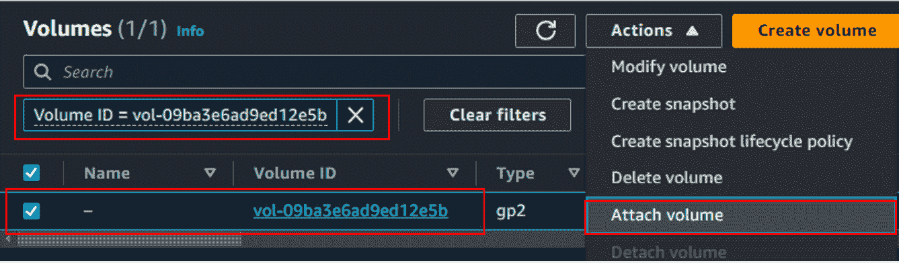

### 第十章：云证据获取

到目前为止，我们已经在云内使用 **云服务提供商**（**CSP**）提供的工具来调查取证。我们看了 AWS GuardDuty CloudTrail 从日志和调查的角度来看。我们还研究了 GCP 的云日志功能，以调查各种服务发出的云日志，Azure Monitor 为托管在 Microsoft Azure 内的服务提供了类似的功能。

本章将在我们的云调查旅程中进一步探讨，并探讨安全地收集核心服务的取证或离线分析取证图像的方法和技术。调查人员将认识到，并非所有调查都可以使用本地云工具完成。调查人员可能需要使用他们在取证环境中可以访问的专业工具，挑战将是以取证合规和法律可接受的方式从云中收集图像。我们将在本章后面的部分探索这些工具。我们将研究三大 CSP 提供的取证收集：

+   AWS 实例的取证获取

+   Azure 实例的取证获取

+   GCP 实例的取证获取

请注意，在本章中，我们将依赖一些标准步骤来收集取证图像，当调查人员可以访问 Windows 或 Linux 操作系统时，这些步骤是标准的，无论底层的云平台是什么。

# AWS 实例的取证获取

让我们直接深入安全和取证上的细节。我们假设一个组织收到了有关在 **弹性计算云**（**EC2**）实例上部署勒索软件的警报。因此，这个实例已被停止。取证人员需要安全地从 EC2 实例中提取取证图像。

任何与 EC2 实例相关联的磁盘在 AWS 中称为 **卷**。为了收集证据，调查人员必须按照特定的步骤顺序操作。首先，调查人员必须记录受感染实例的 **实例 ID**（唯一标识符）。

在本案例中，受感染的实例名称为 `CF2`，其实例 ID 为 `i-00229ce2dd123a2e6`。

## 第一步 – 创建 EC2 卷快照

我们将按照实例 ID 引用这些 EC2 实例进行以下步骤：

1.  调查人员必须注意与 `i-00229ce2dd123a2e6 (CF2)` 关联的存储卷及其卷 ID（每个卷的唯一标识符）：


图 10.1 – 与 00229ce2dd123a2e (CF2) 关联的卷（磁盘）

1.  我们看到有两个卷附加到 `i-00229ce2dd123a2e (CF2)`。AWS 总是将根驱动器 (`C:\`) 分配给 `/dev/sda1`。这是调查人员的参考点，如果他们只想收集根驱动器的取证图像。

1.  我们选择附加到实例`i-00229ce2dd123a2e (CF2)`的根驱动器 `vol-061392d9abebf9433`，这将带我们到**卷**页面，页面截图如下：


图 10.2 – 选择需要取证成像的卷

1.  在**操作**标签下，选择**创建快照**选项。快照会创建原始卷的副本，但不会修改该卷。我们在*图 10.3*中演示了这一过程。调查人员必须注意，附加到 EC2 实例的卷不能直接下载或导出。建议始终在原始卷的副本或快照上进行取证，以保护证据。


图 10.3 – 选择用于快照的 AWS 卷

1.  根据卷的大小，创建快照可能需要几秒钟到几分钟的时间。调查人员必须等待，直到确保快照成功创建后才能继续。在*图 10.4*中，我们看到快照成功创建。所有快照将在`snap-0857fc1efa85ae0ff`下可用。


图 10.4 – 创建的 AWS 卷快照 (vol-061392d9abebf9433)

## 第 2 步 – 获取操作系统内存映像

现在，让我们来看一下如何通过取证方法获取 EC2 实例的内存映像。如果需要在调查中获取内存映像，DFIR 团队可以考虑一些常见步骤，只要受感染的实例仍在运行。调查人员可以通过命令行与受感染的实例进行某种形式的交互访问（AWS `AmazonSSMFullAccess` 策略允许通过 Amazon SSM 完全访问 EC2 实例）。

获取内存映像比获取磁盘映像更复杂。最简单的方法之一是将 EC2 实例切换到休眠模式，这会强制将所有内存内容写入磁盘，形成 `hyberfil.sys` 文件，然后才能进行完整的磁盘证据采集，从而允许调查人员利用内存的快照。

### 第 2a 步 – 通过休眠获取内存映像

AWS 在其 EC2 控制台中允许的一项选项是休眠。选择实例，点击**实例状态**，然后选择**休眠**。但是，为了让 AWS 休眠 EC2 实例（无论是 Windows 还是 Linux），它必须满足以下条件：

+   AWS 仅在部分实例家族中支持云原生休眠功能。

+   在启动 EC2 实例时，管理员应在**高级设置**下启用**休眠**功能以启用此行为。EC2 实例创建/启动后无法更改此设置。

+   EC2 实例必须拥有足够的根存储空间以容纳内存内容。

+   仅支持特定的 `gp2` 和 `gp3` 类型或预配置 IOPS SSD (`io1` 和 `io2`)

如果未配置前述条件，AWS 不支持云原生的休眠功能。

一旦启用休眠，调查员可以通过云控制台将系统休眠并收集磁盘映像进行法医分析，从而捕获内存内容。

### 步骤 2b – 从操作系统直接获取内存映像的常见步骤

内存采集的过程相当简单，但安全地获取法医图像是一个手动过程。你会注意到有多种方法可以实现自动化；然而，这取决于调查员的访问权限和角色（外部（一次性）调查员或内部公司调查员）。如果是内部调查，且组织在云中的规模较大，他们可以考虑以各种方式自动化法医数据采集并上传到云存储。在*进一步阅读*部分，我们已经包含了一些利用其他云服务的想法。然而，这些步骤为你提供了一个指南，使法医数据采集变得更加简便。

以下步骤将提供一个从相关操作系统收集内存映像的概述。调查员必须确保他们能够连接到实例，无论是通过交互式 RDP 会话，还是通过使用云原生命令行功能的命令行：

#### 从 Windows 操作系统实例收集内存映像

一旦调查员登录到感染的 Windows 实例，他们可以开始进行数据采集：

1.  特别是在 AWS 中，这可以通过直接登录到受影响的虚拟机或通过 Amazon SSM 实现。

1.  使用具有 Windows 管理员权限的 `powershell.exe`，创建一个文件夹，将所有的内存转储和工件存放在其中。

1.  然后，我们使用以下命令下载最新版本的 `winpmem.exe`（我们在*第八章*中提到过这个工具）：

    ```
    > Invoke-WebRequest -Uri https://github.com/Velocidex/WinPmem/releases/download/v4.0.rc1/winpmem_mini_x64_rc2.exe -OutFile "winpmem.exe"
    ```

1.  一旦下载完成，我们在同一个 PowerShell 窗口中运行它。我们运行工具并提供一个文件名作为参数，将内存保存到一个文件中。请注意，我们正在以 RAW 格式捕获内存：

    ```
    > winpmem.exe memory.raw
    ```

1.  以下截图展示了正在进行的内存采集过程。根据内存的大小，这可能需要几秒钟到几分钟不等：


图 10.5 – 使用 winpmem.exe 进行内存转储

一旦内存采集完成，调查员必须将内存转储导出到远程服务器或云原生存储区域，以便离线访问和处理。或者，根据调查员的偏好，你也可以关闭操作系统并拍摄完整的磁盘快照，通过法医磁盘成像，内存映像可以在离线处理磁盘映像时作为工件导出。

#### 从 Linux 操作系统获取内存映像

调查人员必须了解的关键区别是，Linux 和 Windows 操作系统在内存获取方面的不同工具。在某些情况下，调查人员必须先从源代码编译专门的工具来收集内存的取证图像。这是因为这些工具使用特定于 Linux 内核版本的低级库。为此，我们使用 **LiME**，它允许在 Linux 中进行完整的易失性内存获取。

以下是收集内存映像的步骤：

1.  一旦获得相关访问权限，调查人员必须确保可以从源代码下载并编译工具。他们还需要访问 `sudo` 命令。在本例中，我们将使用 LiME 工具进行内存捕获。我们将通过 GitHub 下载它们并使用命令进行编译。最好所有以下命令都以 `sudo` 权限（即以 `root` 身份）运行：

    ```
    # git clone https://github.com/504ensicsLabs/LiME.git
    # cd LiME/src
    /home/ubuntu/ir_forensics/ as memory.dump

    ```

    src 文件夹，因为编译后的版本保存在此文件夹中：*`insmod`：此命令将内核模块插入正在运行的 Linux 内核中。*`lime-$(uname -r).ko`：此命令部分指定要加载的内核模块。它使用命令替换（`$(uname -r)`）动态地将当前内核版本插入文件名中，从而加载适用于当前运行内核版本的 LiME 模块。*`path=/home/ubuntu/ir_foreniscs/memory.dump`：此参数指定保存内存转储的路径。*`format=lime`：此参数指定内存转储的保存格式，此处为 `lime`。

    ```

    ```

1.  一旦命令完全执行并生成内存转储，调查人员可以导出数据并使用他们选择的工具（包括 volatility）离线分析它们。

## 第三步 – 创建取证收集器实例

成功创建快照后，调查人员必须准备一个取证收集器实例。一些 DFIR 团队可能已经预先创建了实例，或者使用了为此目的创建的模板虚拟机。上述任何方法都适合进行取证数据的收集。然而，调查人员必须注意，在创建取证收集器实例时，收集器实例的存储大小必须适当配置。通常，建议为取证数据配置至少原始磁盘空间的 120% 或更多的存储空间。

我们正在创建一个 `dd` 工具和 Windows 及 Linux 文件系统。此演示中，Ubuntu 上没有安装其他实时取证工具，仅用于取证收集。然而，调查人员必须考虑为实例分配更高的 CPU 和内存，因为它将进行大规模的逐位复制，这需要更多的 CPU 周期。

一些调查员可能会创建大量存储空间，并将所有取证镜像保存在同一存储空间中，将其当作 USB 驱动器使用，或者为特定的卷创建独立存储。无论哪种方式，只要有足够的空间来保存取证镜像，那就是最重要的。我们创建了一个 100 GB 的存储卷，用于在目标取证收集器实例中捕获取证镜像，尽管我们知道原始受感染系统只有 30 GB 的磁盘空间。这个存储空间足以进行所有的逐位复制到目标存储中。


图 10.6 – 为取证收集创建新存储

一旦实例创建完成（`i-00747860d682ac481 (EC2_FORENSIC_CAPTURE)`）并且额外的存储已设置好，我们按照以下截图的指示挂载磁盘。请查看`/dev/nvme1n1p1`，它被挂载为`/forensic`：


图 10.7 – 为取证收集创建额外存储（已初始化并挂载）

请参考*进一步阅读*部分，了解如何在 Ubuntu Linux 中初始化和挂载磁盘的相关信息。

注意

一旦目标 EC2 实例（取证收集器）创建完成，调查员必须记录该实例的**可用区**。我们将在*第 4 步*中解释这一点的重要性。

在我们的案例中，取证收集器实例托管在`ca-central-1d`。该信息只有在创建 EC2 实例后才能获取。

## 第 4 步 – 从快照创建并附加受感染的卷

专门用于取证目的，我们将从*第 1 步*中创建的快照创建一个卷，并将其附加到我们在*第 2 步*中创建的目标卷：

1.  第一步是从快照启动卷创建过程。如以下截图所示，我们选择在*第 1 步*中创建的快照，然后使用**操作**选项来**从快照创建卷**：


图 10.8 – 从快照创建卷（在第 1 步中创建）

1.  如*第 2 步*所示，取证收集器实例是在`ca-central-1d`可用区创建的。调查员需要这一信息，因为卷是分配给特定的可用区的。如果没有选择适当的可用区，创建的卷将无法附加到目标 EC2 实例。我们按照屏幕上的指示创建卷；但是，确保将卷映射到我们在*第 2 步*中记录的可用区（`ca-central-1d`）。一旦卷创建完成，不能更改其可用区，因此选择正确的可用区至关重要。

1.  在从快照创建卷时，请记录卷 ID。在我们的案例中，卷 ID（如以下截图所示）为`vol-09ba3e6ad9ed12e5b`：


图 10.9 – 从快照成功创建卷

1.  一旦卷成功创建，我们将新卷附加到取证收集器 EC2 实例（`i-00747860d682ac481 (EC2_FORENSIC_CAPTURE)`）。我们根据其唯一标识符过滤新卷，选择该卷，并在**操作**下选择**附加卷**。对于 EC2 实例，可以附加的卷数量没有限制：



图 10.10 – 将卷附加到 EC2 实例

1.  如下截图所示，我们按照屏幕上的指示进行操作。然而，有一个特别需要调查人员注意的地方是将卷映射到正确的实例；因此，调查人员必须记录唯一的实例 ID，以确保卷正确附加。在我们的案例中，我们将卷（`vol-09ba3e6ad9ed12e5b`）附加到 EC2 实例（`i-00747860d682ac481 (EC2_FORENSIC_CAPTURE)`）。如你所见，关键元素在下图中已被高亮显示。这就是一切汇聚的地方：我们从快照（`snap-0957fc1efa85ae0ff`）中创建的 `vol-09ba3e6ad9ed12e5b`，在*步骤 1* 中记录的 `ca-central-1d`，以及在*步骤 2* 中创建 EC2 实例时记录的，卷创建时记录的，还有 `i-00747860d682ac481 (EC2_FORENSIC_CAPTURE)`：


图 10.11 – 为取证将卷附加到 EC2 实例

1.  请注意，AWS 将附加的卷引用为挂载点；在这种情况下，对于 AWS，设备名称挂载点是 `/dev/sdf`，在 Ubuntu Linux 操作系统中访问卷时，可能会有所不同。

1.  现在我们切换到 Ubuntu Linux，作为我们的取证收集器系统（`i-00747860d682ac481 (EC2_FORENSIC_CAPTURE)`）。

### 步骤 4a – 获取实例磁盘映像的常见步骤

无论云服务提供商是谁，以下步骤是收集操作系统取证数据的常见步骤。在开始取证收集之前，请确保已完成先决条件，包括拍摄快照、创建取证收集器实例等：

1.  一旦在云控制台中创建了感染的卷快照，调查人员可以执行完整的磁盘取证数据收集。我们将利用 Linux Ubuntu 上本地可用的 `dd` 命令来执行此操作。

1.  我们将在同一个云平台上创建一个取证收集器实例，将快照附加为磁盘卷到取证收集器实例中。

1.  我们验证新卷是否已正确附加；请参阅以下截图。我们通过运行 `lsblk` 命令并通过运行 `sudo file -s /dev/nvme2n1p1` 来验证已识别磁盘的文件系统信息：


图 10.12 – 验证附加到 EC2 实例的卷

1.  对于整个磁盘的取证映像，无需将磁盘挂载到实例（操作系统内）；`dd` 会直接映像整个卷。但是，如果调查人员希望提取特定的证据（如*第八章*所述），他们可以手动将磁盘挂载到挂载点并提取相关证据。

1.  在启动 `dd` 命令之前，调查人员还必须确保目标存储已经创建，并且该存储具备读写权限。我们运行以下命令启动取证数据收集。确保你有 `sudo` 命令的权限，因为这将是低级别的取证收集：

    ```
    $ sudo dd if=/dev/nvme2n1p1 of=/forensic/cf2.raw bs=4M status=progress
    ```

    下面是为 `dd` 命令提供的参数详细信息：

    +   `if=/dev/nvme2n1p1`：这是你需要复制的源磁盘。

    +   `of=/forensic/cf2.raw`：我们将取证映像以原始格式转储到 `/forensic` 挂载点。你可以根据工具的支持将取证映像以任何格式转储。取证映像保存为 `cf2.raw`（类似于受感染 EC2 实例的主机名），并存储在 `/forensic/` 文件夹下。

    +   `bs=4M`：此设置将块大小设置为 4MB；你可以根据需求调整该值。

    以下截图显示了通过 `dd` 命令完成的取证获取：


图 10.13 – dd 命令输出

1.  可选地，取证成像完成后，调查人员可以通过对源和目标点进行哈希验证，来确认准确性。例如，在下面的片段中，我们通过运行 `md5sum` 命令验证哈希，并确认获取的准确性：

    ```
    ubuntu@ip-172-31-45-98:~$ sudo md5sum /forensic/cf2_image.raw
    e24806611c969189ec53a013e143f883  /forensic/cf2_image.raw
    ubuntu@ip-172-31-45-98:~$ sudo md5sum /dev/nvme2n1p1
    e24806611c969189ec53a013e143f883  /dev/nvme2n1p1
    ```

完成这些步骤后，调查人员必须确定他们的导出选项。简而言之，调查人员可以将这些证据上传到云托管存储（如 AWS S3、Azure Blob Storage、GCP Cloud Storage），或上传到由调查人员控制的远程服务器进行离线分析。

## 第 5 步 – 将收集到的映像导出到 AWS S3 进行离线处理

现在我们已经完成了*步骤 1–4*，我们的取证映像可以进行离线或异地处理。但是，在离线处理之前，你必须先导出它。调查人员最常用的导出方法之一是通过 S3 存储桶进行导出：

1.  调查人员必须确保创建了 S3 存储桶，并且他们的帐户已配置 AWS 访问密钥和秘密密钥，以便通过 EC2 内的命令行访问 S3 存储桶。默认配置将不允许访问 S3 存储桶。

1.  一旦创建了桶并配置了 AWS S3 访问权限，你就可以开始导出了。你可以通过运行以下命令进行导出：

    ```
    aws s3 cp /forensic/ s3://forensicbucket1/ --recursive
    ```

    以下是通常与 `aws` `s3` 命令一起提供的参数：

    +   `cp`：启动复制功能，类似于大多数 Linux 变种中的命令。

    +   `/forensic/`：你想要导出的源文件夹名称。

    +   `S3://foreniscbucket1/`：需要上传文件的目标 S3 存储桶；命令行参数需要使用 `s3://` 的命名法

    +   `--recursive`：将源文件夹中的所有内容（包括子文件夹）复制到目标存储桶

    下图反映了复制过程：


图 10.14 – 从命令行界面（CLI）导出文件到 AWS S3

1.  如果 `aws s3` 命令不可用，请运行 `sudo apt install aws-cli`，然后运行 `aws configure` 命令，并按照屏幕上的指示配置 AWS 访问密钥和秘密密钥。

1.  一旦上传完成，你可以通过在线的 S3 控制台验证上传情况。调查人员可以直接在取证工作站上下载文件以进行进一步分析。下图确认了从 EC2 实例成功上传到 S3 存储桶：


图 10.15 – 将取证映像上传到 AWS S3

1.  大多数取证工具可以访问 RAW 文件；调查人员可以将此取证映像添加到他们的取证案例库中，并开始离线处理。

如我们所见，在 AWS 控制台中有一些步骤需要执行，以确保能够访问操作系统和内存来捕获映像。然而，当你导出这些 AWS 实例的证据或完整磁盘映像时，会遇到一些复杂情况，这需要遵循特定的步骤。

# Microsoft Azure 实例的取证获取

与 AWS 类似，Microsoft Azure 在收集 Azure 虚拟机 (**VM**) 实例的完整磁盘映像时提供了类似的方法。你需要专门创建一个快照，然后导出该快照。让我们详细查看这些特定的步骤。

## 步骤 1 – 创建 Azure 虚拟机快照

如前所述，每个云平台在执行整个磁盘和内存映像的步骤上会有所不同；熟悉这些差异将极大地帮助调查人员，以至于如果取证获取的虚拟机数量较多，他们可以自动化基本任务：

1.  第一步是确保调查人员获取有关感染的 Azure 虚拟机的信息，包括虚拟机名称和操作系统。

1.  调查人员可以创建该感染 Azure 虚拟机的完整磁盘快照。调查人员可能更倾向于在拍摄快照前完全关闭虚拟机。快照可以通过虚拟机的导航页面访问。一旦进入快照页面，我们将选择 **创建快照** 选项，如下图所示：


图 10.16 – 创建 Azure 虚拟机快照

1.  按照屏幕上的指示，创建受感染的 Azure 虚拟机快照。如下一个截图所示，请确保选择正确的资源组，其中包含受感染的虚拟机，以及特定的**实例详细信息**（我们之前收集的）：


图 10.17 – 创建 Azure 虚拟机快照（详细信息）

1.  在同一屏幕上，选择**完整**（*图 10.18*）。微软 Azure 还提供增量快照，它只会捕捉文件系统内所做的更改。由于我们打算完整捕获磁盘镜像，因此我们将选择**完整**快照以获取完整副本：


图 10.18 – Azure 虚拟机快照选项

1.  随后，系统会要求你选择将为其创建快照的**源磁盘**。如以下截图所示，请确保选择正确的磁盘。通常，调查员会对操作系统的根驱动器进行快照；但在某些情况下，调查员可能希望对所有附加到虚拟机的磁盘进行快照。在这些情况下，每个附加到受感染虚拟机的磁盘都需要单独进行快照操作。


图 10.19 – Azure 虚拟机快照磁盘

1.  一旦填写完所有必需的详细信息，你可以让 Azure 创建磁盘快照。完成后，快照将在托管受感染虚拟机的 Azure 订阅内可用。你将在快照仪表板中看到快照的详细信息，如下一个截图所示：


图 10.20 – Azure 虚拟机快照成功完成

接下来，我们来看一下如何导出新创建的快照。

## 步骤 2 – 直接导出 Azure 虚拟机快照

一旦我们完成了*步骤 1*，调查员可以通过创建新磁盘，连接虚拟机并运行 `dd` 命令，或者使用*第八章*中讨论的任何常用工具来附加该快照。然而，微软 Azure 提供了一个选项，在快照创建后可以直接下载：

1.  在导航菜单中，点击**设置**选项卡，选择**导出快照**；此部分提供通过浏览器直接导出任何快照的功能：


图 10.21 – 直接导出 Azure 快照

1.  根据感染卷的大小，调查人员可能需要选择导出快照所需的时间，导出后安全 URL 将过期，无法继续恢复或下载任何内容。微软 Azure 允许的最大时间为 10 小时（36,000 秒）。在我们的示例中，我们正在下载一个 30 GB 的文件，下载时间少于一个小时；因此，我们将其保持在默认值 3,600 秒。Azure 管理员也可以配置特定的身份验证要求，而不是允许安全的唯一 URL 在网上公开可用。调查人员必须记录下 URL，这些 URL 仅显示一次，且离开页面后无法再次访问。尽管这些 URL 在公开的情况下可用，但它们不会通过搜索引擎广泛传播，需要调查人员知道完整的 URL 才能访问这些文件。

1.  微软 Azure 通常生成两个 URL，一个用于 **虚拟硬盘**（**VHD**）文件导出，另一个用于 **VM 客户状态 VHD** 导出。这两个链接提供不同的文件；然而，调查人员应当下载 VHD 文件用于调查目的。

## 第 3 步 – 连接到 Azure 虚拟机进行内存映像获取

微软 Azure 提供几种访问虚拟机的选项，其中最常见的是通过 RDP 或 SSH 访问 Azure 虚拟机。或者，Azure 提供一个名为 **Bastion** 的服务，提供浏览器内访问虚拟机的能力。请参见下方截图，显示了通常可用的选项。左侧选项提供 Bastion，通过浏览器会话代理 RDP 连接到 Azure 虚拟机。右侧选项则是传统的连接方式。为了收集内存映像，我们将通过 Bastion 访问 Azure 虚拟机：


图 10.22 – 连接选项到 Azure 虚拟机

选择 **Go To Bastion** 后，Azure 会自动创建一个代理隧道服务，允许连接到 Azure 虚拟机。调查人员必须提供用户名和密码才能连接到 Bastion 服务以访问 Azure 虚拟机，如下图所示。此服务类似于 Amazon 的 SSM 服务，后者提供对虚拟机的命令行访问：


图 10.23 – 通过 Bastion 服务连接到 Azure 虚拟机

一旦连接到 Azure 虚拟机，调查人员可以按照 *第 2b 步* 和 *第 4a 步* 中为 AWS 提供的步骤进行操作。

一旦收集完所有相关文件，调查人员可以选择导出机制，通过第三方文件共享服务或通过 Azure Blob 存储导出内存映像或操作系统文件。

在接下来的章节中，我们将回顾 GCP 的方法，允许调查人员获取并收集快照和内存映像以进行离线取证分析。

# GCP 实例的取证获取

就像我们在 AWS 和 Microsoft Azure 中看到的步骤一样，对 GCP 计算实例的取证获取遵循相同的步骤。我们将首先对 **计算引擎** 实例进行快照，然后将快照作为独立的磁盘附加到另一个取证收集计算实例上，这样我们就可以在通过云存储或其他数据传输方式导出磁盘映像之前进行逐位复制。

## 步骤 1 – 创建计算引擎实例的快照

那么，让我们来看一下获取计算实例取证映像的前提步骤：

1.  第一步是创建计算引擎实例的磁盘快照；这可以通过访问 **存储** 下的导航菜单并选择 **快照** 来完成。GCP 提供两种类型的快照。第一种是常规快照，包括计算引擎实例的完整磁盘快照；第二种是即时快照，更像是用于快速创建新磁盘卷的磁盘就地备份。即时快照是增量的，这意味着在第一次完整快照之后，只有磁盘的变化会被记录在即时快照中。这通常用于更简便的文件恢复。我们需要一个完整的快照，以便从操作系统层面复制所有内容进行取证。

1.  在创建快照时，我们必须选择与原始感染实例关联的正确磁盘，如下图所示。与 AWS 和 Microsoft Azure 类似，每个快照都会与一个磁盘关联，因此，当对附加了多个磁盘的计算引擎进行快照时，调查人员必须注意实例附加的磁盘数量，并考虑是否需要对所有其他磁盘进行快照。如果没有其他要求，至少必须选择实例的根驱动器（`C:\`）进行快照：


图 10.24 – 选择用于快照的磁盘

## 步骤 2 – 附加快照磁盘以进行取证获取

一旦快照完成，调查人员可以在同一 GCP 租户内创建一个新的取证实例，并将该快照作为磁盘源附加。以下是调查人员需要注意的关键步骤：

1.  创建新实例时，调查人员必须选择附加磁盘并选择最近保存的快照。如以下截图所示，调查人员必须确保在拍摄了多个磁盘快照的情况下，附加正确的快照：


图 10.25 – 在 GCP 中附加磁盘并从快照恢复

1.  一旦磁盘附加，类似于之前列出的 AWS 步骤，调查人员可以通过运行 `lsblk -a` 命令来验证磁盘是否正确附加，以下截图展示了这一过程：


图 10.26 – 快照作为磁盘附加到 GCP 计算实例

1.  一旦磁盘成功附加，我们将按照 AWS 的*步骤 4a*通过 `dd` 命令进行操作。

## 步骤 3 – 连接到 GCP 计算引擎实例进行内存采集

由于所有云服务提供商的操作方式相同，每个云服务提供商都提供类似 Cloud Shell 或通过 IP 直接连接等远程连接工具。本节将使用 GCP Cloud Shell 连接到感染主机进行内存采集：

1.  连接到 GCP 的 Cloud Shell 后，它将请求交互式登录以将身份验证令牌传递给 Cloud Shell 会话。或者，管理员可以为调查人员创建适当的服务账户，以便在命令行级别处理身份验证过程，而无需交互式传递凭据。

1.  在创建服务账户时，调查人员必须确保为服务账户配置了适当的权限，特别是**计算管理员**和**存储对象管理员**权限。**计算管理员**权限将允许调查人员根据需要访问和修改实例，以进行取证采集。相反，**存储对象管理员**权限将允许具有该权限的服务账户将工件上传到 GCP 的云存储桶。要创建服务账户，必须采取以下步骤：

    1.  在 GCP 控制台内，导航到**IAM &** **管理员**部分。

    1.  点击**服务账户**，然后点击**创建服务账户**按钮。

    1.  给服务账户命名并选择授予其必要权限的角色。

    1.  点击**创建**以创建服务账户。

    对于取证采集，我们创建了一个服务账户，如下截图所示，将用于与计算引擎实例交互：


图 10.27 – 为取证采集创建服务账户

1.  接下来，我们生成密钥以使用服务账户访问计算引擎实例：

    1.  在 GCP 控制台内，导航到**IAM &** **管理员**部分。

    1.  点击**服务账户**，然后点击需要生成密钥的服务账户名称。

    1.  在**密钥**标签下，选择**添加密钥**，然后点击**创建新密钥**。

    1.  选择**JSON**作为要创建的密钥文件选项。您将看到一次性显示的详细信息，并可以选择将其下载并保存在计算机上。

1.  调查人员可以在通过 Cloud Shell 连接到计算引擎实例时，使用此服务账户或其交互账户。本质上，服务账户提供了一组容器化的角色，调查人员可以用它来安全地访问计算实例。

1.  一旦我们通过 Cloud Shell 或直接通过 RDP 获得计算实例的访问权限，我们将按照 AWS 的*步骤 2b*进行操作，以进行内存采集。

1.  要导出内存镜像，调查人员可以将文件上传到由 DFIR 团队托管的远程服务器或 GCP 的云存储桶。为此，可以使用已创建的服务帐户。我们将以在 Windows 设备上使用 PowerShell 导出内存镜像为例。我们将首先下载 JSON 文件或将内容复制到我们在*步骤 3*中生成的 JSON 文件中。

1.  使用 PowerShell，我们将运行以下命令；您必须确保`gcloud`：

    ```
    gcloud auth activate-service-account forensic-collector@vaulted-timing-390314.iam.gserviceaccount.com --key-file=./KEY.json --project=vaulted-timing-390314
    ```

    `gcloud`是我们用于连接 GCP 控制台的命令。以下参数用于成功建立与 GCP 的连接：

    +   `gcloud auth activate-service-account`：此命令用于激活服务帐户进行身份验证。

    +   `forensic-collector@vaulted-timing-390314.iam.gserviceaccount.com`：这是需要激活的服务帐户的完整电子邮件地址（在 Google IAM 下创建）。

    +   `key-file=./KEY.json`：此参数指定与服务帐户相关联的 JSON 密钥文件的路径。确保 JSON 文件路径存在。

    +   `--project=vaulted-timing-390314`：表示 GCP 分配的项目名称，服务帐户与该项目关联。

    一旦服务帐户通过身份验证，调查人员可以使用以下命令将内存镜像和其他工件上传到**GCP 云存储**（**GCS**）桶中：

    ```
    gsutil cp <memory.img> gs://<bucket_name>
    ```

    以下是用于将内存镜像导出到存储区域的参数：

    +   `cp`：`gsutil`的子命令，用于将文件和对象复制到 GCS 桶以及从 GCS 桶复制

    +   `<memory.img>`：存储在主机实例上的内存镜像的文件名和完整路径

    +   `gs://<bucket_name>`：文件将被导出的目标 GCS 桶

一旦内存镜像或任何其他工件通过`gsutil`导出，调查人员就可以继续从存储中获取这些工件进行离线分析。他们可以继续将这些镜像保留在存储区域，只要它不公开访问，并且访问控制被严格定义。

# 总结

总结一下，当调查人员可以访问操作系统时，收集法医工件、磁盘镜像和内存转储的基本原则是相似的。如果他们在调查过程中可以访问计算机或设备，过程也非常相似。更重要的是要学习在事件响应情况下如何安全地访问操作系统的步骤。

破解云端法医数据采集的难题；然而，调查人员必须熟悉如何在不对实例进行重大修改的情况下获取完整磁盘访问权限，例如添加新的空磁盘或仅安装工具来创建完整磁盘镜像，并克服导出过程中的各种挑战。大多数云服务都提供快照整个磁盘的选项，这使得数据收集更加便捷。至于内存转储，遗憾的是，目前没有比直接进入感染机器并使用工具转储内存更好的选择。调查人员需要尽量减少在易变内存中的法医痕迹。

下一章将讲解容器化实例，如 Docker 和 Kubernetes。在法医领域，容器化实例带来了不同的挑战，尤其在云端托管时，挑战更为复杂，调查人员需要进行分析。下一章将深入探讨云端容器法医分析。

# 进一步阅读

+   在 Linux 上使 Amazon EBS 卷可用：[`docs.aws.amazon.com/AWSEC2/latest/UserGuide/ebs-using-volumes.xhtml`](https://docs.aws.amazon.com/AWSEC2/latest/UserGuide/ebs-using-volumes.xhtml)

+   如何在 Ubuntu 18.04 上使用 LVM 管理存储设备：[`www.digitalocean.com/community/tutorials/how-to-use-lvm-to-manage-storage-devices-on-ubuntu-18-04`](https://www.digitalocean.com/community/tutorials/how-to-use-lvm-to-manage-storage-devices-on-ubuntu-18-04)

+   为会话管理器、Amazon S3 和 CloudWatch 日志创建具有权限的 IAM 角色（控制台）：[`docs.aws.amazon.com/systems-manager/latest/userguide/getting-started-create-iam-instance-profile.xhtml#create-iam-instance-profile-ssn-logging`](https://docs.aws.amazon.com/systems-manager/latest/userguide/getting-started-create-iam-instance-profile.xhtml#create-iam-instance-profile-ssn-logging)

+   在 Linux 中创建分区——逐步指南：[`www.digitalocean.com/community/tutorials/create-a-partition-in-linux`](https://www.digitalocean.com/community/tutorials/create-a-partition-in-linux)

+   从 Azure 下载 Windows VHD：[`learn.microsoft.com/en-us/azure/virtual-machines/windows/download-vhd?tabs=azure-portal`](https://learn.microsoft.com/en-us/azure/virtual-machines/windows/download-vhd?tabs=azure-portal)

+   Google Cloud (GCP) 法医最佳实践与工具：`medium.com/@cloud_tips/google-cloud-gcp-forensics-best-practices-and-tools-a99ed21e5ae5`

+   如何在 AWS 中自动化法医磁盘收集：[`aws.amazon.com/blogs/security/how-to-automate-forensic-disk-collection-in-aws/`](https://aws.amazon.com/blogs/security/how-to-automate-forensic-disk-collection-in-aws/)

+   Azure 中的计算机取证链条：[`learn.microsoft.com/en-us/azure/architecture/example-scenario/forensics/`](https://learn.microsoft.com/en-us/azure/architecture/example-scenario/forensics/)
