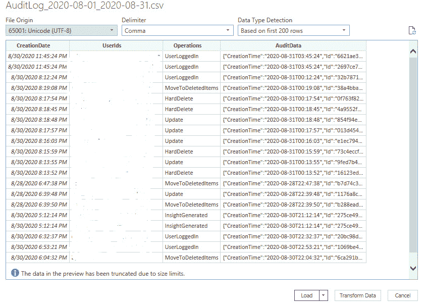

### 第十二章：分析被妥协的云生产力套件

现实情况是，组织内部的大多数基于云的安全事件都发生在生产力套件层面。正如我们在 *第七章*中讨论的那样，Microsoft 365 和 Google Workspace 是行业中最受欢迎的基于 SaaS 的平台。组织依赖 Microsoft 365 和 Google Workspace 来处理业务应用程序和服务，如电子邮件、存储、办公应用程序等。随着越来越多的公司采用基于 SaaS 的电子邮件解决方案，Microsoft 365 和 Google Workspace 已成为企业邮箱诈骗攻击的主要目标。由于这些电子邮件账户与 365 和 Workspace 内的其他服务密切相关，因此这些妥协行为也会对与用户账户连接的任何其他服务构成风险，放大了更广泛的安全漏洞和更大影响的可能性。

本章将深入探讨被妥协的生产力套件，特别是 Microsoft 365 和 Google Workspace，从头到尾。我们将在本章中讨论以下主题：

+   企业邮箱诈骗解析

+   初步范围界定与修复步骤

+   Microsoft 365 事件响应

+   Google Workspace 事件响应

# 企业邮箱诈骗解析

**企业邮箱诈骗**（**BEC**）是一种复杂的网络欺诈类型，通过涉及电子邮件通讯的欺骗行为，针对组织实施攻击。此类威胁利用企业依赖电子邮件进行公司通讯的特性，操纵信任和权威执行某些未经授权的资金转移、获取敏感信息或在 IT 网络中进行横向移动。

## BEC 攻击阶段

攻击者利用的 BEC 攻击阶段在*图 12.1* 中展示：


图 12.1 – BEC 攻击阶段

在观察了图中列出的阶段后，我们将深入分析每个阶段，并进行详细分解：

+   **侦察**：在此阶段，攻击者仔细研究受害组织的层级结构、沟通模式以及使用的特定行话。如果攻击者已经访问了某个账户，他们只需在电子邮件系统内进行搜索，以了解该组织的沟通模式和行话。否则，攻击者会利用来自 LinkedIn 或受害组织网站等各种来源的公开信息。攻击者可能会使用公开可得的信息、社会工程学策略，甚至以前的数据泄露来收集数据。这个侦察阶段使他们能够制作出模拟组织内部用户的可信邮件，并伪装或锁定特定的目标账户。

    BEC 攻击通常不是随机的大规模邮件发送，而是针对组织中的特定个人，如具有财务权限或可以访问机密数据的人。例如，组织的首席财务官（CFO）通常是攻击者的目标，因为他们不仅能访问机密的财务信息，还拥有批准交易的权限。

+   **电子邮件伪造或账户接管**：攻击者通过伪造合法的电子邮件地址或非法访问合法账户来发起攻击，通常是通过网络钓鱼攻击或利用薄弱的安全措施。

    攻击者常常创建“假”网站，这些网站看起来与流行生产力套件（如 Microsoft 365 或 Google Workspace）的登录页面相同。他们通过修改 HTML 和 CSS，复制这些合法站点的样式来实现这一点。这些假网站的域名通常是对真实域名的轻微修改，旨在让它们看起来像是属于组织的生产力套件租户。例如，微软 365 的假域名可能是`microsoft365-login.com`，而不是合法的`microsoft.com`；Google Workspace 的假域名可能是`googledocs-signin.com`，而不是`google.com`。这些欺诈页面通常包含设计用来收集并将用户凭证传送给攻击者的表单。未察觉的用户如果在这些假页面上输入登录信息，就无意中将他们的个人或企业账户的访问权限交给攻击者，从而导致账户被盗。

    如果攻击者无法访问组织中的账户，他们通常会购买看起来与组织名称非常相似的域名。例如，攻击者可以从域名注册商处购买`AMCE.com`，而不是`ACME.com`，从而创建共享这些域名的电子邮件账户，这些账户与受害组织中合法用户的电子邮件地址非常相似。举个例子，攻击者可能会设置并使用`Alice@AMCE.com`，以模拟来自 ACME 的合法用户和账户。大多数用户在电子邮件往来中不会注意到`ACME`和`AMCE`之间的微小差别。

+   **准备阶段**：在这个阶段，攻击者准备他们将用于执行攻击的工具和方法。这可能包括制作具有说服力的网络钓鱼邮件、创建假发票或设置银行账户以接收欺诈性付款。这一过程取决于他们的目标和攻击的 BEC 类型，我们将在下一部分讨论这一点。

+   **利用阶段**：在这个阶段，受害者与电子邮件进行互动，导致攻击者实现他们期望的结果。对于 BEC 攻击，这通常意味着按照邮件中的指示操作，比如转账或提供机密信息。

+   **恶意软件安装（如果适用）**：虽然不一定是 BEC 的一部分，但在某些情况下，攻击者可能会利用这一机会在受害者系统上安装恶意软件。这可能是为了长期访问、数据外泄，或为了促进进一步的攻击。这就是攻击者如何从云端托管和保护的生产力套件账户转向实际设备并侵入组织 IT 网络。

+   **目标行动**：攻击者的最终目标在这一阶段得以实现。对于 BEC 而言，通常涉及将资金未经授权地转移到攻击者的账户，或获取敏感信息。一旦攻击者获得了他们寻求的资金或信息，他们的目标就达成了。

+   **持久性和反取证（如果适用）**：在复杂的 BEC（商业电子邮件攻击）方案中，攻击者可能会尝试保持对受害者系统的访问，以便进行未来的攻击或隐藏其活动的证据。这可能包括在网络外设置自动转发规则、删除电子邮件证据、通过应用程序许可创建后门，或使用其他技术来掩盖他们的存在。

## 常见的 BEC 类型

现在我们已经探讨了 BEC 攻击的各个阶段，接下来让我们讨论组织常遇到的 BEC 类型：

+   **发票欺诈**：骗子冒充目标公司的供应商或卖家，要求为服务或商品向一个虚假账户支付款项。

+   **高层管理人员欺诈**：攻击者冒充公司首席执行官或其他高层管理人员，向员工发送电子邮件，通常是财务部门的员工，指示他们将资金转账到攻击者控制的账户。

+   **律师冒充**：攻击者冒充公司相关律师或法律代表，通常以紧急和机密事务为幌子，误导资金或获取敏感信息。

+   **数据盗窃**：这里的目标不一定是立即获得财务收益，而是盗取敏感数据，这些数据可能是员工的税务信息、知识产权或客户数据。

+   **账户妥协**：员工的电子邮件账户被黑客入侵，之后被用来向其电子邮件联系人列表中的供应商请求付款。

+   **凭证收集**：员工的电子邮件账户被黑客入侵，之后被用来从公司外部进一步收集更多的凭证，如信任的合同和供应商。

+   **攻击者的动机**：BEC 攻击的主要动机是财务获利。攻击者利用商业通信渠道中的信任关系，转移资金或获取可变现的敏感信息。此外，从这些攻击中收集到的数据，如凭证、员工个人信息或知识产权，可以在暗网出售，或用于进一步的攻击，包括重复的 BEC 攻击和勒索病毒。由于这些攻击的复杂性和针对性，它们往往具有更高的成功率，并可能为攻击者带来更大的财务回报，使 BEC 成为一种有利可图的网络犯罪形式。

深入了解各种 BEC 攻击类型，从发票欺诈到数据盗窃，对于有效防御这些复杂且具有财务动机的网络威胁至关重要。识别 BEC 攻击的类型可以让技术和业务控制措施共同防止这些事件的发生。例如，组织可以实施控制措施，通过口头验证超过特定金额的交易批准，以防止发票欺诈和高层管理人员欺诈。

# 初步范围界定和响应

在作为事件响应者应对 BEC 攻击时，**初步范围界定阶段**对于了解事件的广度和深度至关重要。这个阶段涉及尽可能多地收集信息，以便准确评估情况。初步范围界定包括与云生产力套件（Microsoft 365 或 Google Workspace）的 IT 管理员、公司总法律顾问、高层管理人员和会计人员进行沟通，以便在进行任何技术取证分析之前，更好地了解以下内容：

+   **攻击时间线**：了解攻击开始的时间至关重要。询问何时首次发现安全漏洞的迹象，以及用户在何时注意到可疑活动。这可能包括异常的电子邮件活动、来自组织内外的可疑电子邮件报告，或被标记为异常的财务交易。如果攻击者成功转移了任何未经授权的资金，请在时间线上注明这些日期。

+   **妥协的范围**：确定哪些账户已被妥协。这涉及检查是否存在未经授权访问的迹象，例如来自不熟悉位置或设备的登录尝试，以及账户设置或权限的变更，这些变更并非由账户所有者发起。如果攻击者成功入侵，生产力套件的 IT 管理员应已经缩小了受影响的账户范围。我们将在*Microsoft 365 事件响应*和*Google Workspace 事件响应*部分讨论如何确定妥协的证据。

+   **攻击向量**：调查攻击者是如何获得访问权限的。是通过钓鱼邮件、凭证填充，还是利用安全漏洞？了解攻击向量对于防止未来的安全漏洞至关重要。在某些情况下，用户可能记得他们在什么时刻将凭证输入到钓鱼网站。此外，组织和/或个人用户过去是否遭受过数据泄露？如果是，用户名和凭证可能已经在暗网中流通。员工使用公司电子邮件地址进行个人服务并不罕见。如果这些个人服务遭遇数据泄露，员工的公司信息可能会暴露。

+   **数据外泄**：评估已被访问或外泄的信息。这包括敏感的电子邮件、附件以及任何存储在受损账户中的数据。了解暴露的数据类型有助于理解泄露的潜在影响。

+   **与受影响方的沟通**：确定哪些人受到了泄露事件的影响，包括内部和外部人员。这可能包括员工、客户或与受损账户有过通信的业务合作伙伴。

+   **现有安全措施**：回顾现有的安全措施。是否有任何安全协议被绕过或无效？这可能包括多因素身份验证、定期更换密码和员工培训以识别钓鱼攻击。

+   **之前的事件**：询问是否有类似的历史事件。了解过去的事件可以为发现潜在的弱点或重复的攻击模式提供线索。重复攻击变得越来越常见，尤其是在攻击者曾经成功转移资金的情况下，他们可能会把一个组织视为容易重复攻击的目标。

+   **当前响应措施**：检查在发现攻击后已采取的措施。这可能包括更改密码、将可能受损的系统从网络中断开连接或通知受影响的个人。

+   **Microsoft 365 访问权限**：这是作为事件响应者实际启动响应和调查的最重要步骤。您将需要组织的 Microsoft 365 管理员在他们的 365 租户中创建一个具有以下角色的账户。大多数情况下，响应 Microsoft 365 入侵所需的访问权限如下：

    +   Azure AD：

        +   全局读取者

        +   安全读取者

    +   Exchange 在线管理员，一个自定义角色，具有以下权限：

        +   邮件收件人

        +   安全组创建和成员资格

        +   仅查看审计日志

        +   仅查看配置

        +   仅查看收件人

    +   Microsoft Purview（合规性）：

        +   合规性管理员

        +   eDiscovery 管理员

这些角色名称可能会在 Microsoft 生态系统中发生变化；然而，关键在于，您将需要某种全局读取者或安全读取者角色，以便在审计日志中进行搜索。

初步范围界定阶段通过提供攻击的清晰概览，为有效的事件响应奠定了基础。接下来，我们将深入探讨微软 365 和 Google Workspace 的分流和取证工作。

## 修复步骤

在事件的初步范围界定阶段，无论是微软 365 还是 Google Workspace，组织可以遵循一些步骤，确保攻击者在事件响应人员开始取证前已经被清除出环境。用户界面和生产力套件可能会发生变化；然而，以下步骤始终适用：

1.  重置所有受到影响或疑似被泄露的账户密码。

1.  启用**多因素身份验证**（**MFA**）在整个组织中，或至少对于特权账户启用。

1.  移除任何可疑的自动化设置（例如，域外的电子邮件转发规则）以及邮箱中设置的可疑收件箱规则。我们将在接下来的章节中进一步讨论这一点。

1.  从任何特权或提升角色中移除被泄露的账户。例如，属于 IT 管理员的被泄露账户应暂时限制其访问权限，以防止进一步的未经授权活动。

尽管生产力套件如微软 365 或 Google Workspace 发生了变化，这些高层次的步骤，包括密码重置和访问限制，在保护生产力套件环境免受网络威胁方面具有普遍适用性且至关重要。产品的用户界面和细节可能会变化；然而，步骤始终不变。

# 微软 365 事件响应

在初步范围界定以了解事件后，下一步是确定泄露的指标并开始威胁狩猎。本节深入探讨了事件响应人员可以使用的工具和技术，来自动化日志采集和分析过程，特别是对于使用微软 365 作为其云生产力套件的组织。一个关键的重点是利用微软 365 内建的安全和合规工具，如微软 Purview，快速收集日志并跟踪可疑活动。

## 工具

在*第七章*中，我们讨论了微软 365 中的各种审计和合规功能，其中之一是微软统一审计日志。这些日志提供了微软 365 活动的汇总视图，对于调查和理解泄露的程度至关重要。以下是事件响应人员如何利用微软 365 中的审计日志搜索界面来实现这一目的：

1.  **访问审计日志搜索**：审计日志搜索可以通过微软 Purview 访问。事件响应人员需要导航到**审计**部分以开始。

1.  **定义事件范围**：在运行搜索之前，必须完成事件的初步定义，如前一节所讨论的。这是因为初步定义涉及理解事件的时间线、怀疑被泄露的账户，以及感兴趣活动的性质。这一初步定义有助于应用正确的筛选器。否则，事件响应者将不得不运行一般搜索，这可能需要一段时间才能执行，并且在之后分析和分类时可能会很困难。

1.  **应用筛选器**：审计日志搜索提供多种筛选器，用于缩小搜索结果范围：

    +   **日期和时间**：指定事件的时间范围

    +   **活动**：按特定活动筛选，如文件访问、用户登录和管理操作

    +   **用户**：将搜索集中在怀疑被泄露的特定用户账户上

    +   **文件、文件夹和站点**：如果相关，可以缩小范围到特定的文件、文件夹或 SharePoint 站点

1.  **运行搜索**：应用必要的筛选器后，运行搜索。图形用户界面将显示与条件匹配的事件列表。可以使用经典搜索或新搜索；然而，需要注意的是，经典搜索不会保存你进行的搜索历史。此外，经典搜索仅限于运行并行搜索任务。

1.  **导出日志进行详细分析**：对于更深入的分析，用户可以将搜索结果导出为 CSV 文件。这可以通过外部工具进行额外的分析并用于归档。导出的数据包括有关每个事件的详细信息，如源 IP 地址、用户代理和执行的具体操作。

重要说明

通过审计搜索用户界面导出的结果限制为仅 10,000 条。因此，确保搜索结果精炼至 10,000 条以内，或将搜索任务拆分成多个批次，以确保导出所有条目是很重要的。

1.  **利用外部工具**：日志导出后，事件响应者可以利用各种数据分析工具筛选数据。可以使用 Excel、Power BI 或专门的取证工具分析模式、创建时间线并关联不同日志中的事件。

1.  **分析结果**：检查结果，识别任何异常或未授权的活动。寻找可能表明恶意行为的模式或异常。我们将在下一节进一步讨论分析。

### 搜索并导出 365 审计日志

以下图示展示了如何运行搜索并导出 CSV 格式的审计日志：

+   以下截图展示了审计日志搜索标签页，并列出了可用的筛选器以进一步精炼查询：


图 12.2 – Microsoft 365 审计搜索日志标签

+   搜索任务在执行时创建，并列在审计日志筛选器下方，如下所示：


图 12.3 – 审计日志搜索作业

+   一旦搜索作业完成，结果将按表格形式组织，如下所示：


图 12.4 – 审计日志搜索结果（UI）

+   下一图展示了成功登录和失败登录事件的示例：


图 12.5 – 审计日志搜索结果 – 登录事件

+   下图展示了一个事件的**详细信息**窗格示例：


图 12.6 – 审计日志事件详情

+   所有搜索结果可以导出为 CSV 文件，如下所示：


图 12.7 – 审计日志导出过程

生成的文件是一个 CSV 文件；然而，大多数字段将以 JSON 格式存储在 `AuditData` 列中。导出的 CSV 如下所示：


图 12.8 – 审计日志导出（CSV）

### 使用 PowerShell 提取审计日志

统一审计日志也可以通过 PowerShell 程序化提取：

1.  以管理员身份打开 PowerShell，并导航到您选择的文件夹；例如，`C:\Incident Response\`。

1.  使用以下命令连接到 Microsoft 365 租户：

    ```
    Install-Module ExchangePowerShell
    Install-Module AzureAD
    Import-Module AzureAD
    Import-Module ExchangePowerShell
    Connect AzureAD
    ```

1.  定义日志时间范围（根据需要修改；在此，我们将从 30 天开始）：

    ```
    $StartDate = (Get-Date).AddDays(-30)
    Search-UnifiedAuditLog cmdlet:

    ```

    $AuditLogs = Search-UnifiedAuditLog -StartDate $StartDate -EndDate $EndDate

    ```

    ```

1.  将日志导出为 CSV：

    ```
    $AuditLogs | Export-Csv -Path "AuditLogs-last30.csv" -NoTypeInformation
    ```

1.  释放 365 会话（即断开连接）：

    ```
    Disconnect-MsolService
    ```

生成的 CSV 将与通过用户界面导出的数据非常相似，如*图 12.8*所示。

### 使用 Microsoft Power Query

无论是通过 Purview 用户界面导出，还是通过编程方式导出，大部分数据和有用字段将以 JSON 格式存储。因此，事件响应人员必须完成额外的步骤，以解析这些数据使其可用（或易于搜索）。事件响应人员可以使用他们选择的 JSON 解析工具，但在此示例中，我们将使用 Microsoft Power Query。Power Query 可用于深入分析大量的 JSON 数据。该过程涉及将 CSV 文件导入 Excel，然后使用 Power Query 的高级数据转换功能解析 JSON 字段。此解析将 JSON 数据转换为与 Excel 的传统列和行对齐的结构化格式。用户可以将 JSON 字段展开为单独的列，使数据更易于访问和分析。此转换对于需要深入剖析并理解审计数据列中记录的用户活动、安全事件和系统更改细节的事件响应人员至关重要。通过利用 Microsoft 的 Power Query，组织可以有效地将复杂的 JSON 数据转换为更易管理和分析的格式。

使用 Microsoft Power Query 的步骤如下：

1.  从统一审计日志 CSV 开始，我们的下一步是在 Microsoft Excel 中创建一个新工作簿：


图 12.9 – 审计日志结果待转换

1.  创建一个新工作簿：


图 12.10 – 新 Excel 工作簿

1.  接下来，您需要进入**数据**标签页，点击**获取数据** | **来自文件** | **来自文本/CSV**。


图 12.11 – 导入审计数据导出

1.  接下来，您将导入统一审计日志 CSV 并点击包含 JSON 的 `AuditData` 列。请注意，Power Query 有每个工作表最大行数限制（即 1,048,576 行）。



图 12.12 – Power Query 加载数据选项

1.  接下来，使用**转换数据**选项转换审计数据。结果显示在下图中：


图 12.13 – Power Query 结果

1.  接下来，右键点击 `AuditData` 列并点击**转换** | **JSON**。


图 12.14 – 转换 JSON 数据列

如下所示，您的 JSON 数据已成功转换为 CSV 列（例如，`AuditData.ClientIP`）：


图 12.15 – 结果 CSV 列

下图展示了在 Power Query 中列转换后的数据结果：


图 12.16 – 展开转换后的列

结果是一个 CSV 文件，其中包含您所有的审计数据，格式友好且易于阅读，您可以使用 Excel（或您选择的其他工具）进行进一步分析。

### 使用 HAWK 进行云取证

事件响应人员还可以利用一些基于 Microsoft 365 API 的开源工具，如 HAWK（Github.com/T0pCyber/hawk）。

**HAWK** 是一个基于 PowerShell 的工具，用于收集与 Microsoft 365 安全事件相关的信息。它从 365 配置和审计日志中搜索并解析出许多与 365 安全事件相关的有用信息，如新收件箱规则的创建、授权批准、所有具有管理员访问权限的用户列表等。通过这种方式，事件响应人员可以在各自的 CSV 文件中找到所有信息，而无需进入 365 配置或通过审计日志手动提取信息，这大大简化了事件响应过程。

重要提示

HAWK 工具可以在 GitHub 上找到：

[`github.com/T0pCyber/hawk`](https://github.com/T0pCyber/hawk)

这里是 HAWK 模块 PowerShell Gallery 下载链接：

[`www.powershellgallery.com/packages/HAWK/3.1.0`](https://www.powershellgallery.com/packages/HAWK/3.1.0)

这里是 HAWK 文档：

[`cloudforensicator.com/`](https://cloudforensicator.com/)

要运行 HAWK，您的系统需要具备管理员权限的 PowerShell 和互联网连接：

1.  以管理员身份打开 PowerShell，并使用 `cd` 命令导航到 `C:\Incident Response\` 文件夹。

1.  安装 HAWK 模块：

    ```
     (Install-Module -Name Hawk)
    ```

1.  安装并导入 Microsoft 365 Exchange Online 管理模块和 Microsoft 365 模块：

    ```
    Install-Module -Name ExchangeOnlineManagement
    Install-Module MSOnline
    Install-Module AzureAD
    Install-Module ExchangePowerShell
    Import-Module AzureAD
    Import-Module ExchangeOnlineManagement
    Import-Module ExchangePowerShell
    ```

1.  使用以下命令登录受影响的 365 租户，并使用你的 Microsoft 365 用户名和密码进行身份验证：

    ```
    Connect-AzureAD
    C:\Incident Response\.
    ```

1.  运行 HAWK 工具：

    ```
     Start-HawkTenantInvestigation
    ```

生成文件的示例如下所示：


图 12.17 – HAWK 结果

如 HAWK 的 GitHub 所述，HAWK 旨在快速为事件响应人员提供所需的数据。它并不意味着为您完成分析。所有生成的日志文件的完整分析可以在 HAWK 文档页面找到。

## 分析

我们分析的目标是识别任何妥协的证据。进行的第一个分析步骤是确定未授权访问的证据。这最好通过使用 Microsoft 365 中统一审计日志的 `Activity` 或 `Operation` 列来识别登录事件来确定。此列记录了在环境中执行的具体操作。本质上，它充当活动的详细账本，涵盖从文件访问和共享到管理更改和登录事件等各种操作。`Operation` 列中的每个条目都附有描述性标签，用于标识操作的性质，因此它是事件响应人员的重要资源。

重要说明

所有审核活动（即操作）可以在 Microsoft 的文档中找到，网址为 [`learn.microsoft.com/en-us/purview/audit-log-activities`](https://learn.microsoft.com/en-us/purview/audit-log-activities)。

确定是否发生妥协的第一步是筛选 `UserLoggedIn` 事件，这是监控和调查未授权访问的关键。通过分析这些事件，事件响应人员可以跟踪用户何时以及如何登录系统，从而提供关于威胁行为者行为的重要洞察。

例如，异常的登录活动模式，如在不寻常的时间或从意外位置登录，可能是未授权访问的早期迹象。这将使事件响应人员能够确定与妥协相关的任何指示，例如登录用户代理字符串和 IP 地址。

登录活动中的最强指示因素不是分析异常的登录时间，而是分析与登录事件相关的 IP 地址的位置。这可以通过筛选 Microsoft 365 中统一审计日志中的 `UserLoggedIn` 事件，并使用任何批量 IP 地址查询软件（如 `ipinfo.io`）查找相关的 IP 地址（在 `AuditData` 中的 `ClientIP` 字段）来完成。有关示例，请参见 *图 12.18* 和 *图 12.19*：


图 12.18 – 客户端 IP 审计数据

这些 IP 可以复制到一个 IP 查询服务中，该服务会提供与每个 IP 相关的具体城市、地区和国家。例如，在 IPinfo 上查找以 `69` 开头的某个 IP，会显示用户是从美国明尼苏达州的一个 IP 地址登录的。


Figure 12.19 – IPInfo.io 查询结果

地理信息可以从您选择的地理 IP 查询服务中导出，并与审计日志中的所有用户进行比较。作为事件响应者，您的下一步是确定地理位置是否与组织的业务运营相符，或者用户是否在该日期确实位于该 IP 的位置。如果用户没有前往该位置，则可以认为该用户账户已被泄露。事件响应者还可以分析其他 IP 信息，如 VPN/代理使用情况，或者查看托管提供商是否与用户的正常（基线）IP 地址不符。

延续分析异常登录位置的思路，事件响应者的另一个关键威胁猎杀任务是检查邮箱规则的变化。**邮箱规则**是由收到的邮件触发的自动操作。如果攻击者进入用户账户，他们可以悄悄创建或修改规则。这些未经授权的规则可能会将邮件转发到其他账户、删除特定邮件，或者管理钓鱼邮件以避免被捕获。需要关注的关键操作如下：

+   **New-InboxRule**：当创建新的邮箱规则时，该操作会被记录。事件响应者应仔细审查任何此类操作实例，特别是关注那些将邮件转发到外部域、自动删除邮件或以可疑方式分类邮件的规则。新规则创建的突然增加，特别是那些具有不寻常条件的规则，应引起警惕。

+   **Set-InboxRule**：表示对现有邮箱规则的修改。特别是那些更改规则动作或条件的修改，可能是攻击者试图巧妙操控邮件流的迹象。

+   **Remove-InboxRule**：删除邮箱规则的操作会被记录在此操作中。虽然这看起来无害，但删除某些规则，特别是与安全相关的规则，可能是攻击者用来减少其活动被检测到的一种策略。

+   **New-TransportRule 和 Set-TransportRule**：这些操作与传输规则的创建和修改相关，传输规则更加复杂，可以在组织级别控制邮件流。这里的未经授权的更改可能会产生广泛的影响。

例如，下一个截图来自一起 Microsoft 365 被攻破的事件，其中威胁行为者创建了一个名为`zz`的新收件箱规则。这个收件箱规则会自动删除任何在主题行或正文中包含以下词汇的电子邮件：“骗局”、“欺诈”、“网络钓鱼”，以及一个为了隐私原因已被清理的电子邮件地址。这是因为攻击者试图掩盖其行踪，使得任何与其目标相关的电子邮件或警告——也就是“骗局”或“欺诈”组织的钱财——都会被自动删除，从而威胁攻击者可以在不被察觉的情况下完成攻击。


图 12.20 – 恶意收件箱规则示例

除了监控这些特定操作外，将这些信息与其他登录数据（例如登录地点和时间）进行关联，可以更全面地了解攻击者的活动。例如，从一个不寻常的地理位置登录后立即创建新的收件箱规则，可能是账户被攻破的有力迹象。

在处理 Microsoft 365 泄露数据问题时，事件响应者需要关注审核日志中的特定操作，这些操作可能表明未经授权的数据移动或访问。数据外泄可以通过多种方式发生，比如通过 Outlook 同步、通过 Web 浏览器访问数据或其他活动。理解这些细节对于识别潜在的安全漏洞至关重要：

+   **Outlook 客户端同步（通过 SyncFolderItems 操作）**：当用户的 Outlook 客户端与邮箱同步时，会记录此操作。过度或异常的同步活动，尤其是来自不熟悉的设备或位置，可能表明有人试图下载大量数据。将这些同步操作的数量和频率与典型用户行为进行比较，可以揭示异常。

+   `MailItemsAccessed`事件，尤其是来自攻击者 IP 地址的事件，不仅表明未经授权的访问，还表明威胁行为者查看了这些邮件项目的内容。

+   `FileDownloaded`、`FileCopied`、`FileMoved`和`FileDeleted`在 SharePoint 或 OneDrive for Business 中的操作是关键指标。这些行为，尤其是在高频次或来自不寻常位置的情况下，可能表明有人正在进行数据外泄。

+   **电子邮件转发规则（New-InboxRule, Set-InboxRule）**：与邮箱被攻破类似，创建或修改自动将电子邮件转发到外部地址的收件箱规则可能是一种数据外泄的手段。

+   **eDiscovery 搜索与导出操作（SearchQueryInitiated, SearchQueryPerformed, ExportStarted）**：这些操作表明有人正在进行搜索，可能还在导出 eDiscovery 中的数据，这可能是恶意提取大规模数据集的一种复杂方式。

+   **异常发送模式（发送和 SendAs 操作）**：电子邮件发送活动的激增，尤其是带有大附件或发送给外部收件人的邮件，可能表明试图通过电子邮件窃取数据。

重要提示

所有邮箱审计活动（即操作）可以在微软的文档中找到，[`learn.microsoft.com/en-us/purview/audit-mailboxes`](https://learn.microsoft.com/en-us/purview/audit-mailboxes)。

在生产力套件发生泄露时，组织必须回答的一个关键问题是数据是否被攻击者窃取。通过分析列出的操作，事件响应人员可以更好地理解从数据泄露角度来看事件的范围。

事件响应人员还应考虑在 365 环境遭到攻击时，审查以下有价值的信息来源：

+   **冒充权限**：这些权限允许用户代表其他用户执行操作。事件响应人员应检查是否有任何意外或未经授权的冒充权限分配。这可以通过审查每个用户的角色分配来完成。

+   **Azure Active Directory 管理员列表**：审查当前的 Azure **Active Directory**（**AD**）管理员非常重要。你可以在 Azure AD 管理中心查看此列表。查找任何不熟悉的帐户或管理员角色的变化，因为攻击者可能通过提升权限来获得更广泛的访问权限，在 365 环境中进行攻击。

+   **Azure AD 用户列表**：事件响应人员应审计 Azure AD 中的所有用户列表。特别关注新创建的用户，尤其是拥有高权限的用户。通过 Azure AD 管理中心检查此列表。意外的用户帐户可能是攻击者创建后门的迹象。

+   **同意授权**：这些是授予应用程序访问用户数据的权限。请在 Azure AD 管理中心查看同意授权，检查是否有授予未知或可疑应用程序的异常或广泛权限。过多的权限可能会被滥用，用于数据访问和窃取。

+   **eDiscovery 角色**：拥有 eDiscovery 角色的用户可以从邮箱和网站中搜索并导出内容。检查谁被分配了这些角色。虽然不太可能，未经授权的 eDiscovery 角色分配可能表明试图非法访问并导出敏感数据。

+   **Exchange 在线管理员**：定期审查谁拥有 Exchange Online 的管理员权限非常重要，因为这些帐户对电子邮件操作具有重要控制权。检查 Exchange 管理中心中的任何意外更改或添加。

+   **传输规则（邮件流）**：这是在 Exchange Online 中设置的控制邮件流的规则。审查传输规则，查看是否有任何将电子邮件重定向或复制到外部域的规则，这可能是数据窃取的方法。

所有这些分析来源可以通过 HAWK 工具生成的 CSV 文件进行查看，如*图 12.17*所示。

# Google Workspace 事件响应

在我们已经讨论的*初步范围确定和响应*部分中，理解事件的基本情况之后，使用 Google Workspace 的事件响应人员面临着识别安全事件和启动威胁狩猎的挑战。与 Microsoft 365 不同，**Google Workspace** 提供的工具较少，主要集中在审计和报告功能上。尽管这些工具没有那么全面，但对于收集日志和发现异常活动至关重要。这意味着响应人员通常需要结合外部资源和更深入的分析，才能有效追踪和调查 Google Workspace 环境中的潜在安全漏洞。

## 工具

与我们在 Microsoft 365 上的讨论类似，让我们探讨事件响应人员如何利用 Google Workspace 中的审计日志来调查和了解安全事件的范围：

1.  **访问审计日志**：在 Google Workspace 中，可以通过管理员控制台访问审计日志。事件响应人员可以通过导航到**报告**部分，然后进入**审计**子部分来查找这些日志。

    与 Microsoft 365 一样，第一步是了解事件的时间线，识别可能被攻击的账户，并确定可疑活动的性质。这种理解有助于在审计日志中应用正确的过滤器，使搜索更加高效和专注。

1.  **在审计日志搜索中应用过滤器**：Google Workspace 的审计日志搜索提供了各种过滤器来细化搜索：

    +   **日期和时间**：设置特定的时间范围

    +   **事件**：从一系列活动中选择，如发送电子邮件、共享文件、管理员活动等

    +   **用户**：关注可疑的特定用户账户

    +   **应用程序**：如果相关，可按特定的 Google Workspace 应用程序进行过滤，例如 Gmail、Drive 和 Calendar

1.  **运行搜索**：设置过滤器后，运行搜索。结果将显示符合条件的事件列表，然后可以审查其中的可疑活动。

1.  **导出日志以进行分析**：Google Workspace 允许导出搜索结果以便进行更详细的分析。这些导出内容可以包括全面的事件信息，如 IP 地址、采取的行动和受影响的资源。

1.  **利用外部工具进行分析**：一旦导出，日志可以使用 Excel 或其他数据分析软件进一步分析。此步骤对于发现模式、创建时间线并关联不同日志中的事件至关重要。

1.  **分析结果**：仔细检查审计日志条目中是否有异常或未经授权的活动。寻找可能表明恶意行为的异常或模式，例如大规模下载文件、异常的登录时间或意外的外部文件共享。更多内容将在接下来的*分析*部分中讨论。

重要提示

类似于 Microsoft 365，从 Google Workspace 审计日志导出结果可能在可导出的条目数量上有限制。重要的是确保你的搜索足够精确，以便捕捉到所有相关数据而不超过这些限制（通常为 100,000 条记录）。

#### 搜索并提取 Google Workspace 日志

正如在 *第七章* 中讨论的那样，Google Workspace 提供了一系列审计日志，每种日志针对不同的应用和活动。主要日志包括以下内容：

+   **管理员活动日志**：跟踪管理员操作，如设置更改或用户管理

+   **登录日志**：监控用户登录尝试，无论成功与否，这对于识别未经授权的访问尝试至关重要

+   **Drive 审计日志**：对于跟踪 Google Drive 中的文件共享和访问至关重要

+   **Gmail 日志**：监控异常的电子邮件活动，例如大规模删除或转发规则

要导出 Google Workspace 的审计日志，事件响应者可以按照以下步骤操作：

1.  在 Google Workspace 管理控制台（`admin.google.com`）中，进入 **报告**，然后选择 **审计** 和 **调查**。

1.  选择特定的审计日志（例如，管理员日志事件、用户日志事件和组日志事件）。

1.  应用必要的过滤器并执行搜索。

一旦结果显示出来，使用 **下载** 或 **导出** 选项保存数据以便进一步分析。

导出的日志可以是 CSV 格式，便于导入数据分析工具。使用如 Excel 等工具时，响应者可以排序、筛选，并使用函数更有效地分析数据。

以下图示展示了导出审计事件的步骤。首先导航至 **报告**，然后进入 **审计与调查** 标签，如下所示：


图 12.21 – 报告标签页

下图展示了在 Google Workspace 管理控制台中，**审计与调查**标签下所有可用的日志：


图 12.22 – 审计与调查

与 Microsoft 365 审计日志搜索类似，可以设置过滤器，如图所示：


图 12.23 – 用户事件

这里展示了导出数据的示例：


图 12.24 – 导出的用户事件

接下来，我们将深入分析 Google Workspace 被攻击的部分。与 Microsoft 365 分析相似的过程也适用于 Google Workspace，但审计日志及其语法有所不同。验证异常登录的原则是相同的。

## 分析

对被入侵的 Google Workspace 环境的分析需要主要关注用户和管理员事件。事件响应人员需要彻底调查这些日志，以识别未授权访问的证据和其他入侵指标，类似于 Microsoft 365，但这次是在 Google 生态系统中。

+   **登录审计日志分析（用户** **日志事件）**：

    +   **关键事件**：关注**成功登录**和**登录失败**事件。这些事件表明登录尝试的成功与失败。

    +   **需要注意的模式**：重复的登录失败后接成功，特别是来自不同 IP 地址或地理位置的登录，可能表示暴力破解攻击。

    +   **IP 和地理位置分析**：将日志中的 IP 地址与用户的典型登录位置进行比较。地理位置数据的差异可能是未授权访问的强烈指示。

+   **Gmail（邮件）** **日志调查**：

    +   **关键事件**：查看**邮件发送**、**邮件阅读**和**邮件删除**活动。

    +   **需要检测的异常**：大量发送邮件到未知地址、大量删除邮件或在短时间内打开大量邮件，可能表示账户被接管。此外，还需查看任何收件箱规则的创建和修改，类似于我们在*Microsoft 365 事件* *响应*部分中讨论的内容。

+   **管理员活动** **日志审查**：

    +   **重要事件**：监控**用户创建**、**用户角色更改**和**服务** **设置更改**。

    +   **警示信号**：未授权创建新用户、权限提升或安全设置更改是需要重点关注的关键问题。

+   **OAuth 令牌** **活动监控**：

    +   **关键事件**：跟踪**令牌授予**和**令牌撤销**操作。

    +   **关注观察**：向不熟悉的第三方应用授予令牌或令牌撤销的异常模式可能表明攻击者正在试图访问数据或服务。

+   **组审计** **日志检查**：

    +   **关键事件**：监控**组成员添加**和**组设置更改**。

    +   **入侵指标**：一个指标是将未知成员添加到关键组中，或对组设置进行未经授权的更改，特别是在访问敏感信息的组中。

对于这些领域，事件响应人员应采用基于上下文的方法。这意味着不仅要关注事件的发生，还要理解它们在用户行为和组织规范的更广泛背景下的相关性。分析事件的频率、时间和模式偏差至关重要。我们在*Microsoft 365 事件响应*部分中看到，如何通过 IP 查询服务查看登录 IP 以更好地理解未授权访问——同样的过程也可以应用于 Google Workspace。

重要提示

Google Workspace 的用户界面和语法未来可能会发生变化，因为这些是由其团队开发的活跃产品。因此，一些事件名称可能会发生变化，但其原理保持不变（例如，**成功登录**可能会改为**登录成功**，反之亦然）。

# 摘要

在本章关于分析被妥协的云生产力套件中，我们探讨了如何应对在两个最流行的基于云的生产力套件——Microsoft 365 和 Google Workspace 中的安全事件。这些平台在电子邮件、存储和办公应用程序中至关重要，经常成为 BEC 攻击的目标。BEC 是一种复杂的网络欺诈形式，通常涉及攻击者通过电子邮件欺骗或账户接管获得未授权访问，从而导致更广泛的安全漏洞。

本章节提供了关于了解 BEC、其各阶段和攻击者方法的指南。接着，概述了初步评估和修复的关键步骤，这是有效应对事件的关键。针对 Microsoft 365，重点介绍了使用统一审计日志和 Microsoft Purview 进行日志分析的工具。还讨论了一个基于 PowerShell 的开源工具 HAWK，用于简化数据收集。

相比之下，讨论了 Google Workspace 的事件响应，其审计和报告工具虽然功能有限，但仍至关重要。该过程涉及使用 Google Workspace 的审计日志来识别可疑活动。本章为您提供了在 Microsoft 365 和 Google Workspace 中有效应对事件的知识。

# 进一步阅读

+   *Microsoft* *Purview*: [`learn.microsoft.com/en-us/purview/`](https://learn.microsoft.com/en-us/purview/)

+   *什么是商务电子邮件欺诈（**BEC**）—微软*: [`www.microsoft.com/en-ca/security/business/security-101/what-is-business-email-compromise-bec`](https://www.microsoft.com/en-ca/security/business/security-101/what-is-business-email-compromise-bec)

+   *识别并保护被妥协的账户*—Google Workspace: [`support.google.com/a/topic/1355151?hl=en&ref_topic=1258984&sjid=10797876945924014941-NC`](https://support.google.com/a/topic/1355151?hl=en&ref_topic=1258984&sjid=10797876945924014941-NC)
