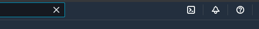
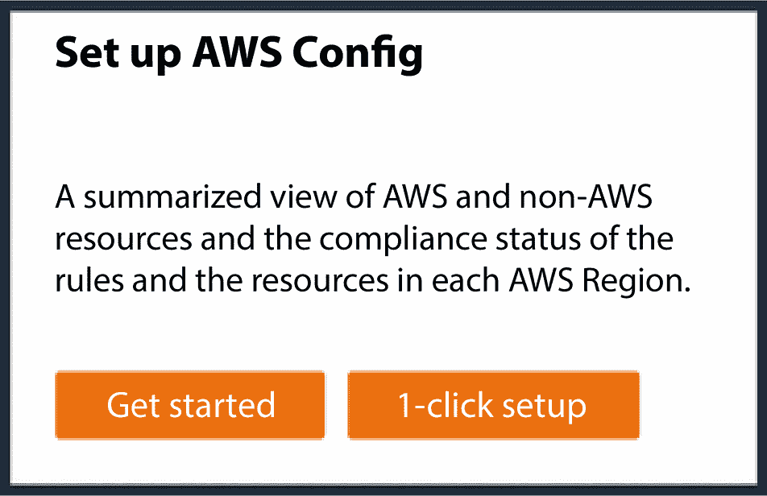
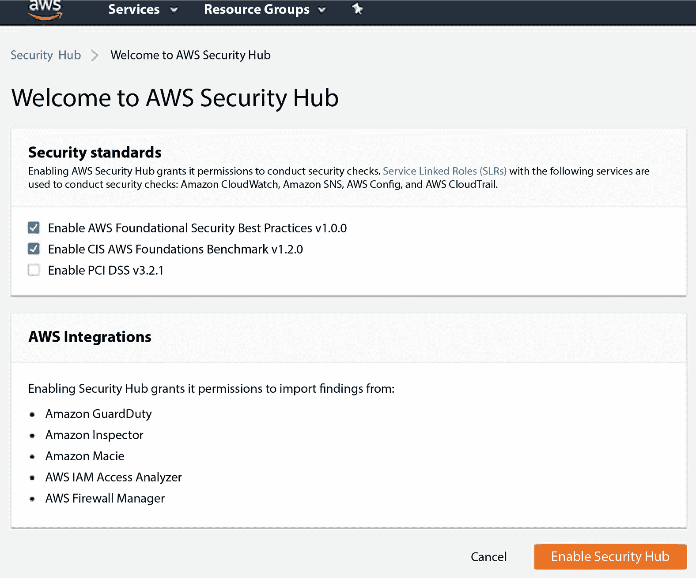
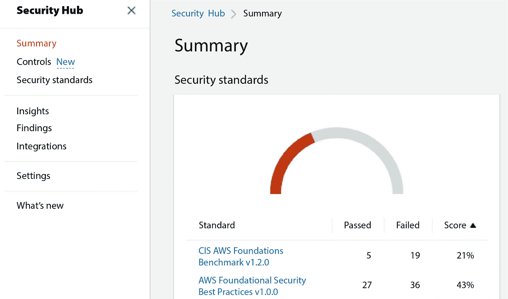
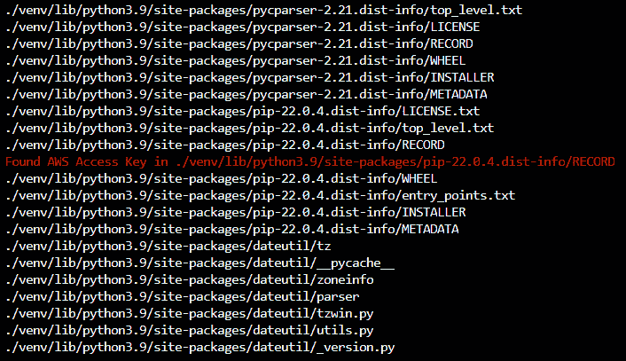
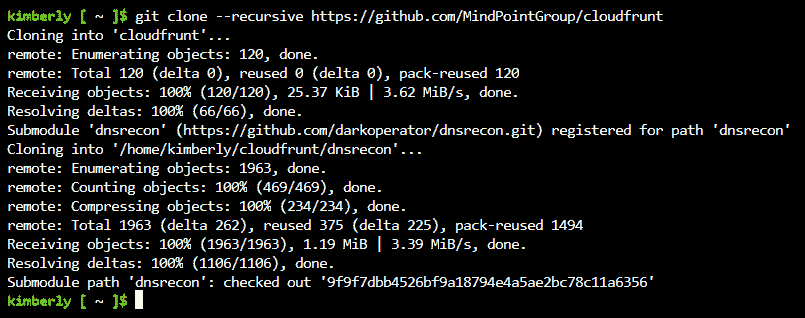
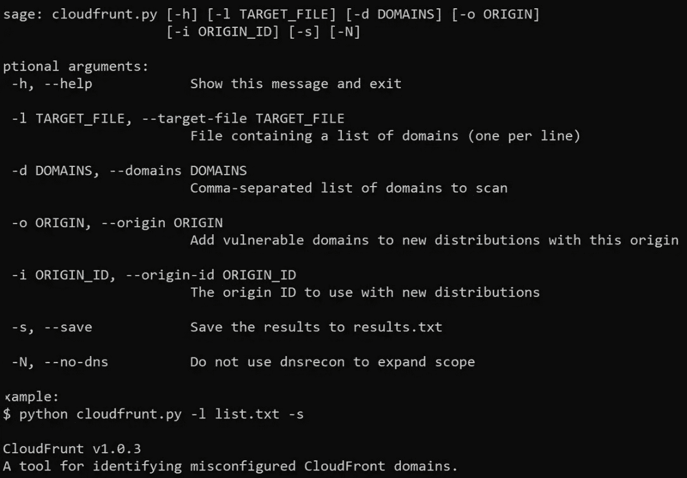
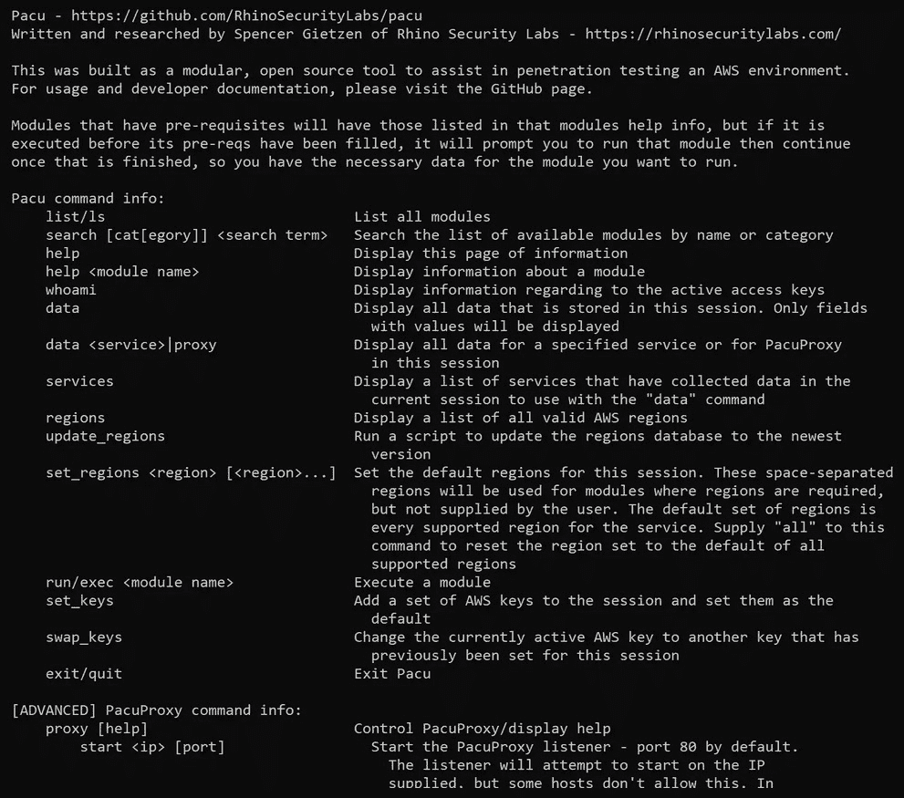

# 第五章：通过无服务器应用程序和工具进行 AWS 渗透测试。

到目前为止，你是一个非常耐心的读者。理解概念和理论非常重要，尤其是在你开始学习如何进行渗透测试的实际操作之前。你现在已经到达了本书的第一章，在这里我们不仅仅是理论探讨，还将把我们的知识付诸实践。

本章介绍了如何使用 `Amazon Web Services** (`AWS**) 官方安全工具，逐步检查安全配置并进行漏洞评估，配置最流行的第三方 AWS 渗透测试工具。我们还将讨论渗透测试的步骤，包括查找凭证、列举 AWS 服务、进行漏洞扫描，并使用 Prowler 和 Pacu 发现暴露的服务。

本章包括以下主要内容：

+   如何获取 AWS 网络。

+   使用 AWS PowerShell 和 AWS CLI。

+   探索 AWS 原生安全工具。

+   安装和准备 AWS 渗透测试工具。

+   利用 AWS 应用程序

让我们开始吧！

# 技术要求。

我们将与微软的基础设施一起工作。大规模的 Azure 数据中心将承担本章练习的大部分计算处理工作，因此，幸运的是，你不需要拥有顶级工作站。你将需要以下设备：

+   一款网页浏览器。

+   一台台式电脑或笔记本电脑。

+   一部安卓或 iPhone 智能手机。

+   一条可靠的互联网连接。

查看以下视频以查看实际操作中的代码：[`bit.ly/3Qo5Ewg`](https://bit.ly/3Qo5Ewg)

# 如何获取 AWS 网络。

在我们准备渗透测试 AWS 服务之前，我们需要有 AWS 服务来进行渗透测试！你可以做两件事：

+   你可以从你工作的组织获得 AWS 凭证。

+   或者，如果你只是刚开始学习，还没有为某个组织工作，你可以免费设置自己的 AWS 实例。

亚马逊通过免费服务和试用让人们在其基础设施上做很多事情。

请记住，无论是使用组织的付费 AWS 实例，还是自己设置的免费 AWS 实例，相同的 AWS 渗透测试政策都适用。详情请参考 *第二章* 和 *第三章*。你还可以在这里查看 AWS 的渗透测试政策：[`github.com/prowler-cloud/prowler`](https://github.com/prowler-cloud/prowler)。

如果你需要设置免费的 AWS 实例，我会带你一步步完成设置过程。按照以下步骤操作：

1.  在浏览器中访问 [`aws.amazon.com/`](https://aws.amazon.com/)。

1.  点击网页右上角的橙色按钮，上面写着 **创建 AWS 账户**。

1.  在 **Root 用户电子邮件地址** 一栏中，输入你能可靠访问的电子邮件地址。我建议你使用你的主个人电子邮件账户，这样即使换工作，你仍能保留 AWS 账户。

1.  在**AWS 账户名称**下，输入一个对你来说容易记住的唯一名称。确保它不是你在工作公司面前会感到尴尬的名称。同时，确保你的账户名称不会泄露你的密码或其他敏感数据。不要在其中放入你的社会安全号码！

1.  一封验证码将发送到你使用的电子邮件地址。检查你的电子邮件以获取验证码，输入到表单字段中，然后点击**验证**。快点操作——验证码将在 10 分钟内过期！

1.  创建一个新密码，并在两个表单字段中输入该密码以进行验证。你的密码应该既长又复杂。我建议使用密码管理器生成一个安全的密码并由其帮你记住。

1.  在**如何计划使用 AWS？**下，选择**个人**。在表单的其余部分输入你的全名、电话号码和邮寄地址。确保电话号码与你的智能手机关联，以防你需要使用它进行**多因素认证**（**MFA**）。勾选**我已阅读并同意 AWS 客户协议的条款**框，并点击**继续**。

1.  你将被要求输入你的信用卡号码。如果你尝试做一些会导致信用卡收费的操作，AWS 会提醒你，而且你可以随时在你的账户的账单部分查看是否已经被收费。

注意

本章中的所有教程都不会产生信用卡费用，但我将在本章演示的一些服务（如 Amazon Inspector）有有限的免费试用期。如果你不想被收费，记得在免费试用期结束之前取消 AWS 账户。详情请参见*AWS 免费套餐*指南（[`aws.amazon.com/free/`](https://aws.amazon.com/free/)）。

一旦你设置了 AWS 账户或获得了对你组织 AWS 账户的访问权限，你就可以继续进行本章的其他内容。

# 使用 AWS PowerShell 和 AWS CLI

本章中的许多练习可以直接通过 AWS CloudShell 执行。只要你拥有一台带有互联网连接和网页浏览器的 Windows、Linux 或 Mac 电脑，就可以轻松访问 AWS CloudShell。你的电脑无需具备工作站或游戏 PC 的硬件规格，因为所有虚拟化和计算都由亚马逊的基础设施进行。但是我强烈建议你使用某种台式机或笔记本电脑，而不是手机或平板电脑。AWS CloudShell 的用户界面在配备物理键盘的设备上运行最好。

当你在网页浏览器中登录到你的 AWS 账户时，可以随时通过点击屏幕顶部的图标来访问 AWS CloudShell。AWS CloudShell 图标看起来像一个带有命令提示符的小方块：



图 5.1 – AWS CloudShell 图标

如果你希望在没有 AWS CloudShell 的情况下访问 AWS CLI，你可以从 GitHub 安装 `aws-shell` 应用程序 ([`github.com/awslabs/aws-shell`](https://github.com/awslabs/aws-shell))。它需要 `Bourne Again Shell** (`Bash**) 命令行，因此 Linux 操作系统或 macOS 是最适合的选择。

注意

本书中的所有演示都使用 CloudShell。但是，如果你更倾向于安装 AWS CLI 桌面应用程序，可以在这里找到：[`aws.amazon.com/cli/`](https://aws.amazon.com/cli/)。

这里有一份可以在 AWS CloudShell 命令提示符下使用的命令指南。这些命令也可以直接在 AWS CLI 应用程序中使用。

无论你是在 AWS CloudShell 还是 AWS CLI 应用程序中，你应该始终使用以下命令检查你安装的是哪个命令行：

```
aws –-version
```

命令行将显示你的操作系统信息（是在 AWS 上，而不是你自己的电脑上）、已安装的 Python 版本等等。输出可能像这样，但根据你安装的内容可能会有所不同：

```
aws-cli/2.10.0 Python/3.11.2 Linux/4.14.133-113.105.amzn2.x86_64 botocore/1.13
```

如果你安装了 Linux 或 Mac 系统，可以使用 Bash 命令。我提到的这些 Bash 命令也适用于 `Z Shell** (`Zsh**)，这是 Mac 的默认 shell。如果你在 AWS 中安装了 Windows，你可以使用 Windows PowerShell 命令提示符命令。Bash、Zsh 和 Windows PowerShell 都内置于 AWS CloudShell 和独立的 AWS CLI 应用程序中，你不需要安装额外的东西来使用这些命令。

## Bash 命令

这里有一些方便的 Bash（和 Zsh）命令：

+   这个命令会列出当前目录中的所有文件和文件夹：

    +   `ls`

+   这个命令会改变你当前打开的目录。不要使用括号！在该位置输入目录的路径：

    +   **cd <插入目录名称>**

+   这个命令会显示你当前所在的目录，以防你迷失方向：

    +   `pwd`

+   如果你不确定某个命令的作用，可以使用这个命令查看。不要使用括号！

    +   `man <**`命令名称>**

+   这个方便的命令会让你退出已执行的 shell 脚本、SSH 会话，或者让你退出 AWS PowerShell 或 AWS CLI：

    +   `exit`

+   获取关于正在运行的进程的信息，包括它们的 **进程ID**（**PID**）：

    +   `ps`

+   如果你想停止某个进程，并且知道它的 PID，可以使用此命令：

    +   `kill <**`进程 ID>**

+   如果你忘记了在会话中使用过哪些命令，这个命令会显示给你：

    +   `history`

+   移动或重命名一个目录：

    +   **mv <当前目录名称> <新目录名称>**

+   创建一个新目录：

    +   **mkdir <新目录名称>**

+   创建一个新文件，并指定文件名：

    +   `touch <**`新文件名>**

+   阅读文件内容。这个命令仅适用于文本文件和脚本，不能用于媒体文件等非文本内容：

    +   **less <文件名>**

+   如果你需要执行需要 root 权限的操作，请在命令前加上 `sudo`。之后你可能需要输入密码：

    +   **sudo <命令>**

+   使用这些命令来安装你仓库中的程序，或者通过 `pip` 包管理器安装 Python 程序：

    +   `sudo install <program name> <in repository>`

    +   `sudo pip3 install <program name>`

    +   `sudo <name of package manager here, such as apt or yum> install <program name>`

接下来让我们看一些 PowerShell 命令。

## PowerShell 命令

如果你的 AWS 服务器运行的是 Windows，下面是一些你可以使用的 Windows PowerShell 命令。只要你的 AWS 实例运行 Windows，这些命令在 AWS PowerShell 和 AWS CLI 应用程序中都可以使用：

+   这可能是最重要的 Windows 命令，它会显示其他可用命令及其功能：

    +   `help`

+   就像在 Bash（和 Zsh）中一样，这个命令会更改你当前打开的目录：

    +   `cd <directory name>`

+   在 PowerShell 中创建新目录的命令与 Bash 和 Zsh 中相同：

    +   `mkdir <new directory name>`

+   该命令将文件移动到新位置：

    +   `move <file or directory> <destination directory>`

+   该命令更改当前打开的目录：

    +   `chdir <directory>`

+   查看正在运行的进程及其 PID：

    +   `ps`

+   获取关于当前打开目录的信息：

    +   `pwd`

+   删除文件或目录：

    +   `rm <filename>`

    +   `rmdir <directory name>`

+   显示文件的一部分内容。这个命令最适合用在文本文件或脚本文件上：

    +   `cat <filename>`

+   创建新文件或目录：

    +   `ni <new filename or new directory name>`

    如果你创建了一个新文件，文件可能没有内容。然而，你可以在文本编辑器或 **集成开发环境**（**IDE**）中打开文件，并在其中创建内容。

现在我们已经了解了 AWS 和 AWS CLI，接下来是时候学习 AWS 提供的工具，以帮助我们进行网络安全工作了。

# 探索 AWS 原生安全工具

AWS 为你提供了两个本地工具，这些工具对于渗透测试人员特别有用：AWS Security Hub 和 Amazon Inspector。

首先，让我们看看 AWS Security Hub。

## AWS Security Hub

AWS Security Hub 是一种简便的方式，可以查看所有 AWS 安全配置、AWS 原生安全扫描报告以及安全警报。它能够结合来自 Amazon GuardDuty、Amazon Inspector、Amazon Macie 和 AWS Network Firewall 的数据。

如果你的 AWS 实例出现任何重大安全问题，AWS Security Hub 会通知你！你可以在渗透测试报告中提到在 AWS Security Hub 中发现的数据。但是，通过使用第三方应用程序进行漏洞扫描和渗透测试，你可能会发现更多的漏洞。我建议同时使用 AWS 提供的工具和第三方工具，以便获得关于 AWS 实例安全状态的最全面数据。

让我们第一次来看一下 AWS Security Hub。按照以下步骤操作：

1.  登录到您的 AWS 账户后，您可以在顶部搜索栏中搜索**AWS 安全中心**来找到它。它位于您启动 AWS CloudShell 的图标左侧。如果您有免费套餐 AWS 账户，可以注册 30 天的免费试用。或者，您也可以在**服务**标签下找到 AWS 安全中心。

警告！

如果这是您自己的免费 AWS 教育账户，请务必在免费试用期结束之前进入账单界面取消 AWS 安全中心。

1.  在右侧，点击**前往安全中心**。如果这是首次设置，您需要选择**启用 AWS Config**。接下来，在显示为**您可以通过 AWS Config 控制台手动启用资源记录**的地方，点击**AWS Config控制台**链接。

1.  接下来，您将进入 AWS Config 页面。在右侧，点击**一键设置**：



图 5.2 – 一键设置选项

审核默认设置后，点击右下角的橙色**确认**按钮。将为您创建一个**Amazon 简单存储服务**（**S3**）存储桶。此过程可能需要一些时间。

1.  当存储桶创建完成后，您将被带到主**AWS 安全中心**仪表板。现在，我们可以保持所有默认设置不变。请打开您的网页浏览器标签，点击**启用 AWS安全中心**。

1.  在**安全标准**部分，保持默认选项：

    +   **启用 AWS 基础安全最佳实践 v1.0.0**

    +   **启用 CIS AWS 基础基准 v1.2.0**



图 5.3 – AWS 安全中心设置页面

1.  如果这是您所在公司使用的 AWS 网络，他们可能有自己的安全基准需要遵守。但是，如果您只是使用免费 AWS 账户进行个人学习，可以保持默认基准设置不变。因此，也请保持**AWS 集成**和**委托管理员**（默认设置是没有集成和没有额外的委托管理员）不变。点击橙色按钮，选择**启用安全中心**。

1.  现在，您应该可以看到**AWS 安全中心**仪表板。



图 5.4 – AWS 安全中心仪表板

现在您应该在**概览**页面。到目前为止尚未运行任何扫描，因此所有可能的信息源，如**发现**和**见解**，都没有数据可显示。

1.  但我发现了一些有趣的内容。请前往左侧菜单，点击**发现**。

    看起来当我启用了 AWS Config 后，系统已经执行了一些安全检查！大约有十几个检查未通过，严重性评级为**低**、**中**和**严重**。以下是一个失败的安全检查示例。您的结果可能会有所不同：

    ```
    MEDIUM    NEW    ACTIVE    us-east-2    489`****`(my account ID)    AWS Security Hub    Network ACLs should not allow ingress from 0.0.0.0/0 to port 22 or port 3389
    ```

1.  现在，点击左侧菜单中的**安全标准**。

1.  我找到一个**AWS 基础安全最佳实践 v1.0.0**的框。点击了**查看结果**，结果显示有很多检查未通过。这里有一个例子：

    ```
    CRITICAL    CodeBuild.1    CodeBuild GitHub or Bitbucket source repository URLs should use OAuth
    ```

所以，AWS 安全中心一开始就会为你提供很多非常有用的漏洞信息。你完全可以在渗透测试报告中提到这些细节，但我建议你还可以运行一些第三方工具，正如我将在本章后面描述的那样。多个工具可以发现更多漏洞，如果多个工具发现了相同的漏洞，那也是有用的信息。记住，你的渗透测试报告不应该只是日志的输出。你需要用自己的话描述这些漏洞如何影响你的组织，以及你对如何修复它们的建议。

现在，让我们继续了解 Amazon Inspector。

## Amazon Inspector

Amazon Inspector 是 AWS 内置的漏洞扫描工具。它能够非常好地扫描你的 AWS 应用程序，找出已知的漏洞。它还可以发现 AWS 网络中暴露给公共互联网的那些不安全的部分。我建议在使用第三方应用程序进行扫描之前，先用 Amazon Inspector 进行扫描。

我将一步步展示如何使用 Amazon Inspector：

1.  我通过在顶部搜索栏中搜索`Inspector`找到了 Amazon Inspector。如果你还没有设置 Amazon Inspector，右上角会有一个白色框显示**开始使用 Inspector**并提供 15 天的试用期。点击橙色的**开始使用**按钮。如果你只是想在免费的 AWS 账户中玩玩，记得在 15 天试用期结束前取消 Amazon Inspector。

1.  如果你只是尝试在免费账户中进行测试，那么可以保持**委派管理员**和**服务权限**的默认设置。点击右下角的**激活 Inspector**按钮。激活过程可能需要几分钟。

1.  激活后，你会看到顶部显示**概览**的页面。如果点击右上角的**管理所有账户**按钮，你可以在你的**Amazon 弹性计算云**（**Amazon EC2**）、**Amazon 弹性容器注册表**（**Amazon ECR**）和 AWS Lambda 实例中也启用 Amazon Inspector。

1.  顶部有一个绿色的通知，写着**欢迎使用 Inspector，您的第一次扫描正在进行中。**所以我们将等待自动扫描完成，然后查看结果。我的第一次扫描大约花了半个小时。

    如果你在等待时感到不耐烦，实际上可以做一些有趣的事情。看看左侧的菜单，点击**视频教程**。那里有一个页面，包含了许多嵌入的 YouTube 视频，如**新亚马逊 Inspector 简介**和**Amazon Inspector 用于 AWS Lambda 工作负载**。我建议你观看所有这些视频！你学到的信息将帮助你作为渗透测试员更有效地使用 Amazon Inspector。

1.  扫描完成后，点击左侧菜单中的`Findings`。你可以通过点击顶部的标签按漏洞、账户、实例等分类排序你的发现。每个发现都会显示其**常见漏洞评分系统**（**CVSS**）严重性评级，例如`CRITICAL`、`HIGH`或`MEDIUM`。每个发现的**常见漏洞与暴露**（**CVE**）编号也会显示，你可以点击每个 CVE 数据库链接查看更多信息。

如你所见，Amazon Inspector 是一个非常有用的渗透测试 AWS 的工具。我非常欣赏 Inspector 展示的 CVE 数据。这些是非常有用的细节，可以放入渗透测试报告中。

现在，我们来看看一些第三方工具。我建议在进行渗透测试和红队任务时，使用多种工具以确保全面性。在这些情况下，使用更多工具通常更好，因为你可以获得更多的信息。

# 安装和准备 AWS 渗透测试工具

让我们安装并准备好在下一节中使用的第三方软件。

重要说明

如果在安装这些工具时遇到磁盘空间问题，你可能需要删除旧文件以腾出空间。文件可以通过本章前面提到的 Bash 命令删除。你可能还需要部署一个新的 AWS EC2 实例。有关更多信息，请参见官方 AWS 文档：[`docs.aws.amazon.com/AWSEC2/latest/UserGuide/EC2_GetStarted.html`](https://docs.aws.amazon.com/AWSEC2/latest/UserGuide/EC2_GetStarted.html)。

尽可能地，我将使用 AWS CloudShell 来安装应用程序。

首先，让我们从 Prowler 开始。

## Prowler

Prowler 是一个云平台漏洞扫描器。Prowler 可以根据**互联网安全中心**（**CIS**）、**国家标准与技术研究院**（**NIST**）800、NIST**网络安全框架**（**CSF**）、**网络安全与基础设施安全局**（**CISA**）、**联邦风险与授权管理**（**FedRAMP**）、**支付卡行业数据安全标准**（**PCI-DSS**）、**通用数据保护条例**（**GDPR**）、**健康保险可携性与责任法案**（**HIPAA**）以及其他安全标准扫描 AWS 的漏洞和安全配置错误。

通过在浏览器中登录 AWS 账户，打开 AWS CloudShell（一个带有命令提示符的小方框图标）。

在我们安装 Prowler 之前，你可能需要将 AWS CloudShell 中的 Python 版本更新为 Python 3.9。你可以使用接下来的命令更新 Python。

首先，检查你已经安装的 Python 版本：

```
python --version
```

如果显示 Python 3.9，那么你就可以继续了。否则，执行以下操作：

```
sudo apt update
sudo apt-get install python3.9
```

安装过程完成后，你可以通过以下命令验证它是否正常工作：

```
python --version
```

以下是需要输入的命令：

+   这使用`yum`安装程序安装一些 Prowler 依赖项。你可能需要输入你的 AWS 账户密码：

    ```
    sudo yum -y install gcc openssl-devel bzip2-devel libffi-devel
    ```

+   这将为 Python 3.9 下载包，这是通过`pip`安装 Prowler 的一个依赖项：

    ```
    wget https://www.python.org/ftp/python/3.9.16/Python-3.9.16.tgz
    ```

+   这将安装 Python 包，配置它，并设置“启用优化”。有时候，命令执行可能需要几分钟：

注意

小心确保`--`是输入为两个连字符，中间没有空格。有些浏览器可能会将`--`转换为一个长破折号**–**，这会导致错误。

```
tar zxf Python-3.9.16.tgz
cd Python-3.9.16/
./configure --enable-optimizations
sudo make altinstall
python3.9 –-version
cd
```

现在，你已经回到了主目录。

+   这将从`pip`安装 Prowler：

    ```
    pip3.9 install prowler
    prowler -v
    ```

恭喜！稍后，当我们实际使用 Prowler 时，你可以通过点击 AWS PowerShell 屏幕右上角的**操作**，找到你的渗透测试和漏洞评估的输出。然后，去**下载文件**并打开 CSV 文件。它将有一个类似下面的路径和文件名：

```
/home/cloudshell-user/output/prowler-output-<a bunch of numbers>.csv
```

如果**操作** | **下载文件**不起作用，你可能需要在 Google Chrome 中打开 AWS CloudShell。如果你没有 Chrome，可以访问 [`www.google.com/chrome/`](https://www.google.com/chrome/) 安装它。希望你已经将 AWS 根账户的电子邮件地址和密码安全记录，以便在需要时切换浏览器！

现在，让我们安装 Pacu。

## Pacu

Pacu 是一个 AWS 渗透测试应用。如果你已经按照我的指示安装了 Prowler，那么你已经安装了 Python。这太好了，因为我们可以使用`pip`来安装 Pacu，方法如下：

```
pip3 install  pip
```

这将准备`pip`安装程序：

```
pip3 install  pacu
```

这将安装 Pacu。现在，让我们执行它！

```
Pacu
```

## Cred Scanner

现在，让我们安装 Cred Scanner。它是一个非常简单的脚本，用于扫描 AWS 实例中的敏感凭证文件。你绝对不希望密码等信息暴露给网络攻击者！请按照以下步骤操作：

1.  首先，打开 GitHub 上的 Python 脚本，网址是：[`github.com/disruptops/cred_scanner/blob/master/cred_scanner.py`](https://github.com/disruptops/cred_scanner/blob/master/cred_scanner.py)。

1.  复制整个 Python 脚本。将其粘贴到文本编辑器中，并确保文件保存为`cred_scanner.py`。

1.  接下来，我们需要将脚本从本地计算机上传到 AWS 服务器。点击 AWS CloudShell 屏幕右上角的**操作**，然后转到**上传文件**，点击**选择文件**，找到你保存在本地计算机上的 `cred_scanner.py` 文件，打开它。

1.  访问 [`github.com/disruptops/cred_scanner/blob/master/requirements.txt`](https://github.com/disruptops/cred_scanner/blob/master/requirements.txt)，并做类似的操作。只需要一行代码，上面写着**点击**。但你仍然需要将其保存为名为`requirements.txt`的文件。然后，像上传`cred_scanner.py`一样，将该文件上传到 AWS CloudShell。

1.  现在，回到命令行！确保 Cred Scanner 已具备其要求，输入以下内容：

    ```
    pip install -r ./requirements.txt
    ```

1.  然后，我们可以执行 Python 脚本：

    ```
    python cred_scanner.py
    ```

    继续进行 Cred Scanner 操作。下面是扫描的一个示例：



图 5.5 – Cred Scanner 扫描输出

或者，您可以通过克隆其 GitHub 仓库来安装 Cred Scanner。要克隆仓库，请按照 GitHub 文档中的说明操作：[`docs.github.com/en/repositories/creating-and-managing-repositories/cloning-a-repository`](https://docs.github.com/en/repositories/creating-and-managing-repositories/cloning-a-repository)。

您需要克隆的代码可以在此找到：

[`github.com/disruptops/cred_scanner`](https://github.com/disruptops/cred_scanner)

然后，运行以下命令：

```
pip install -r ./requirements.txt
```

使用 Cred Scanner 非常简单，我将直接展示如何进行扫描，而不是在下节中解释：

+   这将显示 Cred Scanner 的选项：

    ```
    python cred_scanner.py –-help
    ```

+   这将显示您在命令行中打开的目录中的密钥：

    ```
    python cred_scanner.py –-secret
    ```

+   这将在另一个目录中运行 Cred Scanner：

    ```
    python cred_scanner.py –-path <directory path>
    ```

或者，您可以使用`cd`命令切换到您希望在其中运行 Cred Scanner 的目录。

## CloudFrunt

CloudFrunt 是 MindPoint Group 开发的一个脚本，用于识别 AWS CloudFront 中的配置错误。

由于 CloudFrunt 的简单性，我将在这里同时展示安装和执行方法。记住——您必须在 AWS 服务器上配置 AWS CloudFront，才能使 CloudFrunt 正常工作。

在 AWS CloudShell 命令行中，下载 CloudFrunt 脚本：

```
git clone --recursive https://github.com/MindPointGroup/cloudfrunt
```

以下是结果：



图 5.6 – CloudFrunt 安装

然后，安装它及其依赖项：

```
pip install -r requirements.txt
```

假设我们已经安装了 CloudFrunt，现在开始使用它吧！

以下是使用`cloudfrunt.py`的命令结构：

```
python cloudfrunt.py -o cloudfrunt.com.s3-website-us-east-1.amazonaws.com -i S3-cloudfrunt -l list.txt
```

请勿输入该命令。您需要根据自己的情况修改它。`-<letter>` 中的内容被称为参数。

将`cloudfrunt.com.s3-website-us-east-1.amazonaws.com`替换为您正在扫描的域名。将`S3-cloudfrunt`替换为您要添加的漏洞域名的源。将`list.txt`替换为一个包含要扫描的域名的文本文件。

这是如何显示使用 CloudFrunt 的指南：

```
python cloudfrunt.py –-help
```

这将显示如下内容：



图 5.7 – CloudFrunt 帮助屏幕

使用此指南来执行 CloudFrunt。如果在执行 CloudFrunt 时使用`-s`或`--save`，您可以通过单击 AWS PowerShell 屏幕右上角的**操作**来找到您的 CloudFrunt 扫描结果。然后，转到**下载文件**并打开文本文件。文件将包含如下位置和文件名：

```
/home/cloudshell-user/output/results.txt
```

接下来是 Redboto！

## Redboto

我将带您安装的最后一个第三方工具是 Redboto Python 脚本集合。这些脚本执行对 AWS API 的红队操作。首先，让我们安装其前置条件：

```
pip install cryptography boto3 texttable
```

接下来，在另一个浏览器标签页中打开其 GitHub 集合：

[`github.com/ihamburglar/Redboto`](https://github.com/ihamburglar/Redboto)

Redboto 是一组脚本。打开您想尝试的每个脚本的每个网页。记住我如何指导您从 GitHub 复制脚本，将脚本粘贴到文本编辑器中，使用其特定的文件名保存它，然后在 AWS CloudShell Web UI 中使用 `Actions** | **Upload file** | **Select file` 上传文件？对于您想使用的每个 Redboto 脚本，都要这样做。Redboto GitHub 存储库提供了每个脚本的说明。然后，在您上传文件的目录中，您可以像这样执行每个脚本：

```
python checkAWSKey.py
python describeUserData.py
python runSSMShellScript.py
python <insert a different Reboto Python script name here>
```

之后，您应该能够在 AWS CloudShell UI 的 `Actions** | **Download File` 中找到此目录中的输出文件：

```
/home/cloudshell-user/output/
```

请牢记该目录，因为如果本章中我提供给您的教程是您的劳动成果，那么该目录中的内容就是您的劳动成果。但您不仅仅会将该目录中的输出提供给您的渗透测试客户。您将使用输出文件作为您为客户编写渗透测试报告时部署的信息。成为一名优秀的渗透测试人员不仅仅是执行脚本和共享输出和其他日志。您的工作是解释这些日志，并帮助客户和防御安全团队理解它们，并利用漏洞信息来加固客户的 AWS 网络和应用程序安全。

好了！现在是时候在 Prowler 和 Pacu 中进行一些通用的渗透测试和漏洞扫描活动了。

# 利用 AWS 应用程序

现在我们已经安装了一些渗透测试应用程序并运行了一些简单的脚本，让我们深入了解如何利用 Prowler 和 Pacu 进行 AWS 渗透测试。

## Prowler

首先，让我们在 Prowler 中进行一些渗透测试和漏洞扫描活动。

准备好您的 AWS 凭据。您可以通过从 Web 浏览器登录到您的 AWS 帐户来验证它们。在顶部菜单栏中，查看最右边的下拉菜单与您的用户名。单击 `Security credentials` 导航到正确的 AWS `Identity and Access Management** (`IAM**) 页面。顶部应显示 `My security credentials (root user)`。记下您的 AWS 帐户 ID、访问密钥 ID 和秘密访问密钥。然后，按照以下步骤操作：

1.  现在，让我们再次打开 AWS CloudShell。输入此命令以配置您的密钥：

    ```
    aws configure
    ```

1.  在 `AWS_ACCESS_KEY_ID=` 字段中，粘贴您生成的密钥 ID 并按 *Enter*。其它字段也按 *Enter*，我们将留空它们。

注意

如果您希望每次 AWS 配置发生时为您的帐户节省 0.0003 美元的费用，您可以使用以下方式配置 AWS：

`export AWS_ACCESS_KEY_ID=your_access_key_id`

`export AWS_SECRET_ACCESS_KEY=your_secret_access_key)`（译者注：需要将 your_secret_access_key 替换成你的秘密访问密钥）

1.  执行 Prowler：

    ```
    prowler
    ```

    如果这不起作用，请按照本章前面的说明再次安装 Prowler。

    默认情况下，您的 Prowler 扫描输出应该在这附近，文件名类似于：

    ```
    /home/cloudshell-user/output/prowler-output-<a bunch of 
    numbers>.csv
    ```

Prowler 命令本身将执行一个默认扫描，显示你所拥有的 AWS 服务（如 EC2、IAM 等），扫描是否通过，及每个服务根据 CVSS 评分的严重、高、中、低漏洞数量。它将执行几十项检查，如`check121`、`check122`、`check23`和`check24`。它可能会将各种信息打印到屏幕上（并写入 CSV 日志），这些信息对你的渗透测试报告非常有用，例如以下内容：

```
[check25] Ensure AWS Config is enabled in all regions – configservice [Medium]
FAIL! au-north-1: AWS Config recorder disabled
```

在此示例中，`check25`扫描了你的所有 AWS 服务，以查看它们是否启用了 AWS Config。单独启用 AWS Config 并不能保证安全性，但必须启用它才能安全地配置，就像你的车必须安装安全带一样。安全带的存在并不能保证司机和乘客会系上安全带，但如果它们根本没有安装，司机和乘客就无法使用安全带。

注意

你可能会遇到 AWS 密钥访问问题。如果是这样，请访问[`console.aws.amazon.com/kms`](https://console.aws.amazon.com/kms)查看**AWS 密钥管理服务**（**AWS KMS**），并在创建新密钥时记录下你的密钥访问密码。你也可以在 AWS 文档中获取故障排除帮助，链接如下：[`docs.aws.amazon.com/kms/latest/developerguide/find-cmk-id-arn.html`](https://docs.aws.amazon.com/kms/latest/developerguide/find-cmk-id-arn.html) 和 [`docs.aws.amazon.com/kms/latest/developerguide/programming-keys.html`](https://docs.aws.amazon.com/kms/latest/developerguide/programming-keys.html)。

如果你想更精确地执行操作，可以先查看你可以从 Prowler 执行哪些特定检查项或服务，使用以下命令之一：

```
prowler --list-checks
prowler –-list-services
```

当你找到想要执行的检查项时，可以使用以下语法：

```
prowler -c check11,check12
```

当然，替换`check11`和`check12`为你想要执行的检查项。

你也可以运行所有的检查项，*除了*其中的一些，方法如下：

```
./prowler -E check32,check33
```

这将运行所有的检查项，*除了* `check32` 和 `check33`。

默认情况下，Prowler 将扫描你所有已经选择的区域中的 AWS 服务。但你可以像这样限制扫描仅限于某些区域：

```
./prowler -f 'eu-west-1 us-east-s'
```

因此，在这种情况下，只有`eu-west-1`和`us-east-s`中的服务器将被扫描。

这就是在 AWS 中使用 Prowler 执行漏洞扫描和渗透测试的基本步骤。欲了解更多信息，请参阅 Prowler 的 README 文件（[`github.com/prowler-cloud/prowler#readme`](https://github.com/prowler-cloud/prowler#readme)）和文档。

## Pacu

现在，是时候使用 Pacu 了。我将带你执行漏洞扫描模块。还会向你展示如何查找 Pacu 扫描的输出报告。请按照以下步骤操作：

1.  你可以使用两种方法之一。你可以输入以下命令序列，准备你的访问密钥以免费使用 Pacu：

    ```
    export AWS_ACCESS_KEY_ID=your_access_key_id
    export AWS_SECRET_ACCESS_KEY=your_secret_access_key
    ```

1.  作为*步骤 1*的替代方案，你可以输入此命令来配置你的密钥：

警告

这个命令可能会向您的 AWS 账户收取 0.0003 美元的费用。

```
aws configure
```

1.  然后，输入我们为 Prowler 使用的密钥 ID。导航到我们安装 Pacu 的目录：

    ```
    cd /Pacu
    ```

1.  在 AWS CloudShell 命令行中，我们首先查看帮助选项：

    ```
    pacu –-help
    ```

1.  如果那不起作用，您可以尝试此处的替代安装说明：[`rhinosecuritylabs.com/aws/pacu-open-source-aws-exploitation-framework/`](https://rhinosecuritylabs.com/aws/pacu-open-source-aws-exploitation-framework/)。如果您是通过这种方式安装的 Pacu，您可以使用此命令执行 Pacu。只要确保您在正确的目录中：

    ```
    python3 pacu.py
    ```

1.  当 Pacu 要求您命名一个新会话时，您可以随意为该会话命名，然后按 *Enter*。例如，您可以尝试 `TestPacuSession`。

1.  查看您可以尝试的模块列表：

    ```
    ls
    ```

    这是您应预期的结果：



图 5.8 – Pacu 帮助屏幕

尝试任何您想要的模块。例如，有一个名为 `backdoor_users_password` 的模块。是否存在能够揭示用户密码的 AWS 服务后门？您还可以查看此处的完整模块列表：[`github.com/RhinoSecurityLabs/pacu/wiki/Module-Details`](https://github.com/RhinoSecurityLabs/pacu/wiki/Module-Details)。

尝试这个命令：

```
run <module name>
```

例如，您可以尝试以下内容：

```
run backdoor_users_password
```

然后，您应该能够从 AWS CloudShell 用户界面中选择 `Actions** | **Download file`，并在此目录中找到输出文件：

```
/home/cloudshell-user/output/
```

我建议查看 Pacu 的 Wiki 以获得更多有关如何最大化使用 Pacu 进行 AWS 渗透测试的信息：

[`github.com/RhinoSecurityLabs/pacu/wiki`](https://github.com/RhinoSecurityLabs/pacu/wiki)

# 总结

任何人都可以在他们的免费套餐下设置 AWS 账户，尝试一些通用的 AWS 渗透测试工具。

AWS 有自己的应用程序，对于渗透测试员来说非常有用。它们包括 AWS CloudShell、AWS Security Hub 和 Amazon Inspector。

AWS CloudShell 提供了一个命令行界面（CLI），您可以在登录到 AWS 账户后从网页浏览器中使用它。或者，您也可以使用 AWS CLI 应用程序，将其直接安装在您的 Windows、Mac 或 Linux 电脑上。

AWS Security Hub 是一个方便的统一应用程序，用于检查您所有 AWS 安全设置、配置和报告。

Amazon Inspector 是 AWS 原生的漏洞扫描应用程序。我建议在使用本书中演示的其他漏洞扫描器和渗透测试应用程序时，额外使用它。

使用 Prowler、Cred Scanner、CloudFrunt 和 Pacu，可以执行广泛的漏洞扫描和渗透测试。这些工具帮助您发现安全问题，例如暴露的服务和不良的安全配置。记住——您需要自己解读这些工具的输出并在渗透测试报告中解释它们。如果您只是分享扫描的 CSV 输出文件，那就没有履行渗透测试员的职责！

在*第六章*，我们将返回 AWS 账户，尝试使用 Docker 和 Kubernetes 进行容器化。然后，我们将测试我们将创建的 Docker 和 Kubernetes 实例。

# 进一步阅读

要了解本章涵盖的主题更多信息，请访问以下链接：

+   AWS CloudShell 文档：[`docs.aws.amazon.com/cloudshell/`](https://docs.aws.amazon.com/cloudshell/)

+   安装 Prowler：[`github.com/prowler-cloud/prowler`](https://github.com/prowler-cloud/prowler)

+   Prowler 文档：[`docs.prowler.cloud/en/latest/`](https://docs.prowler.cloud/en/latest/)

+   Pacu：[`github.com/RhinoSecurityLabs/pacu`](https://github.com/RhinoSecurityLabs/pacu)
