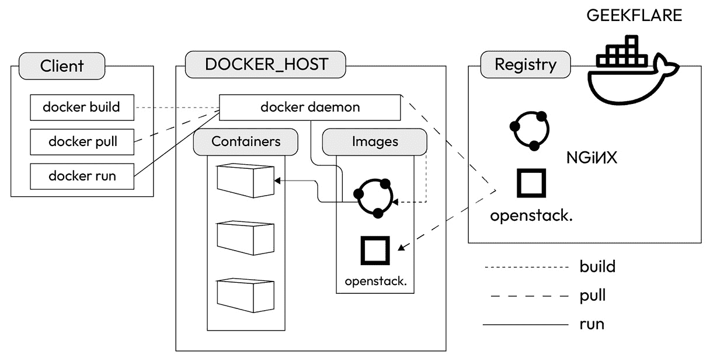

# 第六章：在 AWS 中渗透测试容器化应用

云网络的最常见应用之一是容器化应用的部署。在你的云渗透测试职业生涯中，你需要在容器化环境中进行测试的可能性非常高。

流行的容器化平台 Docker 和 Kubernetes，在它们的容器化系统内的操作方式是相同的，无论它们是在 AWS、GCP、Azure 还是任何其他云平台上部署。然而，AWS、GCP 和 Azure 与 Docker 和 Kubernetes 的接口方式在每个实例中都有些不同。

可以这样理解。无论是放在陶瓷盘、铝盘还是纸盘里，一片涂了黄油的烤面包都是同一片涂了黄油的烤面包。无论它放在哪种盘子里，味道都一样，你吃的方式也一样。但在你吃完面包后，清理或处置盘子的方式将会有所不同。

希望这能让你明白！嗯，等你读完这一章后，你会更能理解它。

在这一章中，我将解释以下内容：

+   容器化如何工作

+   Docker 在 AWS 中的工作原理

+   Kubernetes 在 AWS 中的工作原理

+   在 AWS 中的 Docker 和 Kubernetes 渗透测试技术

开始吧！

# 技术要求

使用 AWS 的一个好处，无论是用于容器化还是其他任何事情，就是我们能够使用亚马逊基础设施的计算能力。这意味着你不需要一台非常高端的工作站就可以进行本章中的任何练习。你只需要以下这些：

+   一台运行 Windows、macOS 或常见 Linux 发行版（如 Ubuntu 或 Debian）的现代桌面或笔记本电脑。一台至少配备 4 GB RAM 的 MacBook 或 Windows 11 OEM PC 就非常适合。

+   一个良好支持的网页浏览器，如 Safari 15 或更高版本、Microsoft Edge 83 或更高版本、Mozilla Firefox 105 或更高版本，或 Google Chrome 115 或更高版本。

+   稳定的互联网连接。

查看以下视频以观看代码演示：[`bit.ly/46VJSp3`](https://bit.ly/46VJSp3)

# 容器化如何工作

首先，有了**虚拟机**（**VMs**）。虚拟机运行在宿主操作系统内，而宿主操作系统直接在计算机硬件上运行。就宿主操作系统而言，虚拟机只是一个它正在运行的应用程序，该应用程序分配了一定数量的内存（RAM）和磁盘空间（以虚拟磁盘的形式）。VMware 和 Oracle VirtualBox 都提供虚拟化客户端，你可以轻松地在 Windows、Mac 或 Linux PC 上运行和安装这些客户端。使用这些虚拟化客户端，你可以创建一个虚拟机来运行大多数版本的 Windows、macOS、Linux 或 Unix。

虚拟机有着大量的应用场景。我的背景是网络安全，所以我最熟悉的应用场景是恶意软件测试。我可以在虚拟机中安全地执行恶意软件，而不会对主机操作系统或其硬件造成损害。这是因为虚拟机确保虚拟操作系统与主机操作系统“沙盒化”隔离。在最坏的情况下，如果我的虚拟操作系统中的恶意软件导致虚拟操作系统无法正常启动，我可以进入主机操作系统，卸载虚拟机并删除其虚拟磁盘。然后，我可以创建一个新的虚拟机，重新开始。

我经常听到的关于主机计算机和虚拟机的类比是“计算机和它的宠物计算机”。但基本上，主机操作系统只是将虚拟机当作任何其他类型的应用程序来对待。

计算机虚拟化的实现比人们通常认为的要早得多。最早的计算机虚拟化案例出现在 1960 年代末和 1970 年代初的 IBM 大型机上。时代共享系统在当时的主机和小型计算机上很常见，因为直到个人计算机发明之前，人们并没有自己的计算机。

直到个人计算机的出现之前，所有计算机都是多人共享的。IBM 发明了虚拟化技术，使得在时代共享系统中的多个用户能够从 CPU、内存和磁盘存储中获得一层抽象。每个用户都可以拥有自己虚拟化的计算机，可以分配主机计算机的真实硬件资源，而不会影响其他用户在同一主机计算机上进行的操作。

正如计算机技术中的其他一切一样，在过去的几十年中，虚拟化技术变得越来越成熟。*容器化是与虚拟机类似的概念，但并不完全相同*。然而，虚拟化技术的发展进步使得容器化的发明成为可能。

简而言之，容器化类似于虚拟机，*但更为轻量级*。如果虚拟机是一座由砖块、木材、石头或混凝土建成的房子，那么容器就是一个可以根据需要迅速搭建和拆卸的帐篷。

虚拟机可以根据需要创建和删除。但安装和删除虚拟机并非即时的过程。要在我的 Windows 电脑上使用 Oracle VirtualBox 安装 macOS 虚拟机，我仍然需要为每一个新的 macOS 虚拟机经历 macOS 的安装过程。每次至少需要几分钟。

Docker 和 Kubernetes 都是容器化编排平台。Docker 和 Kubernetes 各自拥有分配硬件资源、负载均衡和进程隔离的系统。第一次设置 Docker 或 Kubernetes 容器化编排系统时，确实需要几分钟的安装和配置时间。然而，一旦 Docker 或 Kubernetes 容器化编排系统准备就绪，容器就可以非常快速地部署和移除。如果你的 AWS 服务提供足够的磁盘空间和网络带宽，你甚至可以在同一个编排平台下同时运行数百个容器。

你的云应用将立即受益于容器化所带来的可扩展性和效率。在典型的云容器化部署中，容器会根据应用程序在任意时刻的需求不断地被部署和移除。有时，某个容器可能只会存在几天或更短时间。

Docker 是第一个广泛流行的容器化平台。Docker 于 2013 年首次亮相，它使得容器化对开发者、企业和爱好者来说比以往任何时候都更容易。Kubernetes 团队受到 Docker 的启发，Kubernetes 的第一个版本于 2014 年发布。

虚拟机（VM）可以在个人电脑、服务器和云环境中运行。然而，尽管像 Docker Desktop 这样的应用程序使得可以在本地测试多容器应用，容器化技术实际上是为云环境而设计的。

AWS、Azure 和 GCP 等云平台为组织提供了硬件和网络的可扩展性，因为亚马逊、微软和谷歌在全球各地（除了南极洲）运营着大量的庞大数据中心，这些数据中心包含数百万台服务器和极高容量的网络基础设施。如果一个组织一天需要十几台服务器，第二天需要几百台服务器，亚马逊、微软和谷歌几乎可以立即以合适的费用提供这些资源。没有硬件资源被浪费，硬件资源的分配可以灵活且动态地进行。

因此，容器化技术是为云环境中的应用场景而设计的。云平台在宏观层面分配硬件资源，而容器化平台则在微观层面分配硬件资源。

开发者非常喜欢容器化技术，因为他们可以设计自己的软件运行在特定的容器配置中，而不必担心硬件兼容性问题。

容器将应用程序代码与它运行所需的依赖项、库和配置文件捆绑在一起，而如果他们为虚拟机或主机计算机开发代码，则必须关注操作系统。如果他们的代码是为了直接在主机计算机上运行而设计的，他们还需要了解其 CPU 和硬件规格。当容器化正确执行时，它能大大减少开发者的挫败感。因此，他们的时间和精力可以集中在改进应用程序上，而不必浪费时间解决硬件和操作系统的问题。

使用 AWS 而不进行容器化是可能的。在上一章中，我直接在 AWS 中安装了 Linux 操作系统，以制作那一章的 *Code In Action* 视频。当我使用 Prowler 时，它是在扫描一个非常简单的 Linux-in-AWS 设置的漏洞。如果一个 AWS 客户只需要一个或几个他们会持续维护的服务器，直接在 AWS 中使用操作系统就能满足他们的需求。

然而，许多 AWS 客户需要部署可能在任何时间都有成千上万，甚至数十万用户的应用程序。在这种情况下，容器化无疑是最实际的选择。云平台帮助实现容器化。因此，作为渗透测试人员，了解如何有效地对 Docker 和 Kubernetes 部署进行渗透测试是很重要的。

# Docker 在 AWS 中的工作原理

Docker 容器化系统中的层次结构如下，从底部到顶部：

+   AWS、Azure 或 GCP 是云平台。

+   云平台运行一个支持 Docker 主机的服务，比如 `Amazon Elastic Container Service** (`Amazon ECS**)。Docker 主机是一个服务器，管理员通过他们本地计算机上的 Docker 客户端进行管理。

+   Docker 主机运行 Docker 守护进程，管理 Docker 镜像。守护进程还可以从 Docker 注册中心下载镜像。注册中心可以是远程的公共 Docker Hub，也可以是组织自己的私有注册中心。守护进程还处理 API 请求。

+   Docker 镜像是创建 Docker 容器的指令。容器是从镜像生成的。

下面是 Docker 架构的示例：



图 6.1 – Docker 架构

AWS 中的 Docker 部署使用 `Amazon Elastic Compute Cloud** (`Amazon EC2**)，因为那是主要的计算平台。

Amazon ECS 是在 AWS 中运行 Docker 的主要服务，无论 Docker 部署的大小和规模如何。Amazon ECS 是你直接使用的服务，它为你处理 Amazon EC2 的工作。

在 AWS 中安装 Docker 有两种常见方法：

+   如果你更喜欢通过 **图形用户界面**(**GUI**) 安装 Docker，你可以通过 AWS 的 Web 应用程序实现。

+   或者，如果你更喜欢尽可能使用**命令行界面**（**CLI**），或者如果你希望在 AWS 上部署 Docker 之外，还可以使用 Docker Desktop 在本地测试你的容器化系统，你可以使用 Docker Compose CLI 在 AWS 上安装 Docker。如果你的 Docker Desktop 版本中没有包含 Docker Compose 插件，可能需要安装它。请参阅 *Docker 文档*，链接：[`docs.docker.com/compose/install/`](https://docs.docker.com/compose/install/)。

无论你选择哪种方式安装 Docker，你仍然可以使用你选择的兼容 GUI 和 CLI 应用程序来使用、管理和配置 Docker 部署。

## 在 AWS 上使用 Amazon ECS 安装 Docker 集群

首先，我将带你通过 AWS 的网页应用程序 GUI 安装 Docker 集群：

1.  第一步是启动 Amazon ECS 首次运行向导。通过网页浏览器登录到你的 AWS 账户，向导会让你轻松启动 Amazon ECS 并部署 Docker。

1.  在 AWS 的网页界面中，我喜欢通过在顶部的 AWS 应用程序菜单的搜索栏中搜索服务和应用程序的名称来进行导航。搜索`Amazon ECS`，点击**弹性容器服务**，你就能快速到达正确的页面。

1.  在右侧，有一个白色的框框，上面写着**部署你的容器化应用程序**。点击橙色的**开始**按钮。

1.  页面上会显示**集群**，点击右上角的橙色按钮，按钮上写着**创建集群**。

1.  在**集群配置**下，给你的集群命名。我选择了`AWS-Docker-Test`，但你可以选择任何有效的名称。

1.  在**网络**下，保持默认的**虚拟私有云**（**VPC**）、子网和命名空间设置。

1.  在**基础设施**下，保持默认的**AWS Fargate（无服务器）**设置。这是让 Amazon ECS 为你的 Docker 部署分配硬件资源的最简单方式。

1.  同样，保持**监控**和**标签**部分的默认设置。在右下角，点击橙色的**创建**按钮。

    顶部会出现一条蓝色进度条，显示集群创建正在进行中。可能需要几分钟。如果一切顺利，进度条会变成绿色，并显示集群创建成功。如果没有，请重复我带你走过的步骤再试一次。当我自己测试集群创建过程时，第一次尝试返回了一个红色进度条，显示创建过程失败。但第二次尝试成功了。

1.  现在你的集群已成功创建，你可以在列表中看到新集群的名称。点击集群的名称。

1.  您将被带到一个新页面，页面顶部会显示您的集群名称（在我的例子中是**AWS-Docker-Test**）。页面下方的第一部分显示**集群概览**，接下来的部分有六个选项卡：**服务**、**任务**、**基础设施**、**指标**、**定时任务**和**标签**。在**服务**选项卡下，点击右上角的橙色**创建**按钮。

1.  在下一页面中，保持**环境**部分的所有默认设置。在**部署配置**部分，将**应用类型**保留为**服务**。在下方，您将看到一个**任务定义**区域，其中写着**选择现有任务定义**。要创建新的任务定义，请转到**任务定义**，然后点击**转到**任务定义**。

1.  一个新页面将会在您的网页浏览器的新标签页中加载。在**任务定义**页面中，点击右上角的橙色**创建新任务定义**按钮。在**配置任务定义和容器**部分，给您的任务定义家族命名。我选择了`Docker-Test-Task-Definition`，因为我真是太有创意了。但您可以创建任何您喜欢的名称。

1.  在**容器 - 1**下，给您的容器命名（我选择了**Docker-Container-Test**）。您还需要输入一个镜像 URI（如果需要帮助，可以访问 [`docs.aws.amazon.com/emr/latest/EMR-on-EKS-DevelopmentGuide/docker-custom-images-tag.html`](https://docs.aws.amazon.com/emr/latest/EMR-on-EKS-DevelopmentGuide/docker-custom-images-tag.html) 了解如何选择基础镜像 URI）。在我的情况下，我使用的是亚马逊的`us-east-1`数据中心。所以，我的镜像 URI 是 `711395599931.dkr.ecr.us-east-1.amazonaws.com/spark/emr-6.10.0:latest`。将所有其他默认设置保持不变。点击右下角的橙色**创建**按钮。

1.  在**家族**下，输入您的新任务定义名称（我的名称是**Docker-Test-Task-Definition**）。将**修订版**保持不变。在**服务名称**下创建一个新名称。我选择了`Docker-Test-Service`。将其他所有默认设置保留不变。点击右下角的橙色**创建**按钮。

您的新服务的部署可能需要几分钟时间，正如屏幕顶部的蓝色通知所示。我向您展示的所有使用 Amazon ECS 部署的服务默认都会使用 Docker。所以，您正在创建一个新的 Docker 实例。

## 使用 Docker Desktop 部署 Docker

在亚马逊 ECS 中部署 Docker 的另一种主要方式是使用 Docker Desktop。如果您更喜欢这种方式，首先需要在本地计算机上安装 Docker Desktop。Docker Desktop 是用于运行 Docker CLI 命令的应用程序。要安装它，请按照以下步骤操作：

1.  访问 [`docs.docker.com/desktop/install/mac-install/`](https://docs.docker.com/desktop/install/mac-install/) 以在 Mac 上安装，或者访问 [`docs.docker.com/desktop/install/windows-install/`](https://docs.docker.com/desktop/install/windows-install/) 以在 Windows 上安装。如果 Docker Desktop 中没有包含 Docker Compose 插件，你可能还需要安装它。相关安装说明可以参考 *Docker 文档* ([`docs.docker.com/compose/install/`](https://docs.docker.com/compose/install/))。如果你的本地计算机使用的是 Linux 操作系统，你需要在这里安装 Docker Compose CLI： [`docs.docker.com/cloud/ecs-integration/#install-the-docker-compose-cli-on-linux`](https://docs.docker.com/cloud/ecs-integration/#install-the-docker-compose-cli-on-linux)。

1.  通过你的网页浏览器登录到 AWS 账户。你需要确保你的 AWS 凭证拥有访问某些 AWS **身份与访问管理**(**IAM**) 权限。如果你需要更多帮助，可以查看 AWS 的权限管理文档 ([`aws.amazon.com/iam/features/manage-permissions/`](https://aws.amazon.com/iam/features/manage-permissions/))。如果你只有根账户，你将需要创建一个新的 IAM 账户，并赋予下面列出的权限。这些是你的凭证所需的权限：

    +   `application-autoscaling:*`

    +   `cloudformation:*`

    +   `ec2:AuthorizeSecurityGroupIngress`

    +   `ec2:CreateSecurityGroup`

    +   `ec2:CreateTags`

    +   `ec2:DeleteSecurityGroup`

    +   `ec2:DescribeRouteTables`

    +   `ec2:DescribeSecurityGroups`

    +   `ec2:DescribeSubnets`

    +   `ec2:DescribeVpcs`

    +   `ec2:RevokeSecurityGroupIngress`

    +   `ecs:CreateCluster`

    +   `ecs:CreateService`

    +   `ecs:DeleteCluster`

    +   `ecs:DeleteService`

    +   `ecs:DeregisterTaskDefinition`

    +   `ecs:DescribeClusters`

    +   `ecs:DescribeServices`

    +   `ecs:DescribeTasks`

    +   `ecs:ListAccountSettings`

    +   `ecs:ListTasks`

    +   `ecs:RegisterTaskDefinition`

    +   `ecs:UpdateService`

    +   `elasticloadbalancing:*`

    +   `iam:AttachRolePolicy`

    +   `iam:CreateRole`

    +   `iam:DeleteRole`

    +   `iam:DetachRolePolicy`

    +   `iam:PassRole`

    +   `logs:CreateLogGroup`

    +   `logs:DeleteLogGroup`

    +   `logs:DescribeLogGroups`

    +   `logs:FilterLogEvents`

    +   `route53:CreateHostedZone`

    +   `route53:DeleteHostedZone`

    +   `route53:GetHealthCheck`

    +   `route53:GetHostedZone`

    +   `route53:ListHostedZonesByName`

    +   `servicediscovery:*`

1.  现在，你需要在 Docker Compose CLI 中运行一些命令。首先运行以下命令：

    ```
    docker context create ecs <name of your ECS context>
    ```

    以下内容将会显示在你的屏幕上：

    ```
    ? Create a Docker context using:  [Use arrows to move, type to filter]
      An existing AWS profile
      AWS secret and token credentials
    > AWS environment variables
    ```

1.  选择 **AWS 环境变量**。按照屏幕上的指示，配置你的 ECS 上下文以获取 AWS 凭证。配置完成后，你可以使用以下命令查看你的 Docker 上下文：

    ```
    docker context ls
    ```

1.  现在，你可以使用 `dockercompose` 命令在 Amazon ECS 中部署和管理你的 Docker 容器化应用。

关于 Docker Compose CLI 命令和配置的帮助指南可以在 *Docker 文档* 网站上找到 ([`docs.docker.com/cloud/ecs-integration/`](https://docs.docker.com/cloud/ecs-integration/))。我强烈建议同时参考 Docker 命令行指南 ([`docs.docker.com/engine/reference/commandline/cli/`](https://docs.docker.com/engine/reference/commandline/cli/))。不过，我个人更喜欢完全使用 AWS 的 Web 应用 GUI 来部署 Docker 的另一种方式。

如果你需要删除 Docker 集群，请参考 AWS 文档：

[`docs.aws.amazon.com/AmazonECS/latest/userguide/delete_cluster-new-console.html`](https://docs.aws.amazon.com/AmazonECS/latest/userguide/delete_cluster-new-console.html)

当你不再使用 Docker 容器时，也可以将其移除。以下命令（在 Docker CLI 中）将删除 Docker 容器及其卷（**数据存储单元**，或 **DSUs**）：

```
docker rm --volumes <name of docker container>
```

因此，Docker 是在 AWS 中部署容器化应用程序的一种方式。Kubernetes 是另一种方式，它建立在 Docker 系统的基础上。但它的设置方式有所不同，正如你将看到的那样。

# Kubernetes 在 AWS 中的工作方式

Kubernetes 容器化系统的层次结构如下，从底部到顶部：

+   AWS、Azure 或 GCP 是云平台。

+   云平台运行一个服务，如 `Amazon Elastic Kubernetes Service** (`Amazon EKS**)，它支持控制平面。

+   下一层是控制平面，由 Kubernetes 管理。它是集群的根节点。

+   控制平面根据云管理员定义的不断变化的网络应用指标部署 Pods。Pods 被部署以随时管理 Kubernetes 应用程序的需求。例如，更多的用户和更高的带宽消耗通常会导致更多的 Pods。

+   Pods 部署容器。

下面是 Kubernetes 架构的示意图：


图 6.2 – Kubernetes 架构

Kubernetes 在 AWS 中的部署使用 Amazon EC2，因为它是主要的计算平台。也可以直接在 Amazon EC2 中管理 Kubernetes。但更常见的做法是组织选择使用 Amazon EKS 作为与 Amazon EC2 的接口，这样可以省去管理员需要管理 `etcd` 和实例的麻烦。

本书中我使用的所有 AWS Kubernetes 示例都假设正在使用 Amazon EKS。

使用 AWS 的 Web 应用程序创建 Kubernetes 容器化系统的最简单方式是使用 Amazon EKS 集群。虽然也可以通过 AWS CLI 启动集群，但我发现设置 IAM 和 JSON 配置文件需要花费额外的时间。如果你更倾向于使用命令行，可以参考 AWS 文档中的指南：[`docs.aws.amazon.com/eks/latest/userguide/getting-started.html`](https://docs.aws.amazon.com/eks/latest/userguide/getting-started.html)。不过，我猜你只是为了练习渗透测试环境的搭建。所以，通过 AWS Web 界面以默认设置启动 EKS 集群应该足够满足你的需求。接下来，按照以下步骤操作：

1.  通过浏览器登录到你的 AWS 账户，访问 [aws.amazon.com](http://aws.amazon.com)。在顶部菜单的搜索框中，输入`EKS`或`Elastic Kubernetes Service`。会有一个链接，点击打开 Amazon EKS 界面。或者，你也可能会在屏幕右侧看到一个白色框，框中写着**添加集群**，你可以点击它。

1.  系统会立即带你进入**集群**页面。点击右上角的橙色**创建集群**按钮，从下拉菜单中选择**创建**。或者，你可能需要点击标有**创建**的下拉菜单，然后点击**创建集群**。

1.  现在，你进入了**配置集群**页面。为你的集群输入一个原始名称，选择你喜欢的名称。我选择了`EKS-Pentest`。保持默认的 Kubernetes 版本。选择下拉菜单中的集群服务角色。如果没有可选的集群服务角色，请按照 Amazon EKS 用户指南中的说明（[`docs.aws.amazon.com/eks/latest/userguide/service_IAM_role.html#create-service-role`](https://docs.aws.amazon.com/eks/latest/userguide/service_IAM_role.html#create-service-role)）创建一个具有 EKS 集群权限的 AWS IAM 角色。

1.  保持其他默认设置不变，然后点击右下角的橙色**下一步**按钮。

1.  在下一页面，你需要配置**网络**设置。将`VPC`、**子网**、**安全组**和**IP 地址**保留为默认设置。将**集群端点访问**设置为公共，然后点击右下角的橙色**下一步**按钮。

1.  在**配置日志记录**页面，将控制平面设置为记录**API 服务器**、**审计**、**身份验证器**、**控制器管理器**和**调度器**。对于渗透测试和红队用途，更多的日志记录永远是最好的！点击右下角的橙色**下一步**按钮。

1.  保持 Amazon EKS 插件为默认设置。它们包括 CoreDNS、Amazon VPC CNI 和`kube-proxy`。点击右下角的橙色**下一步**按钮。

1.  保持插件的默认版本。点击右下角的橙色**下一步**按钮。

1.  审核你所有的配置，然后点击右下角的橙色**创建**按钮。

    你将在屏幕顶部看到一个蓝色通知条，显示你的集群正在创建。可能需要几分钟时间。当你看到绿色的通知条时，说明你的 Kubernetes 集群已经创建成功，恭喜！

如果你需要删除 Kubernetes 集群，请参考 AWS 文档：

[`docs.aws.amazon.com/eks/latest/userguide/delete-cluster.html`](https://docs.aws.amazon.com/eks/latest/userguide/delete-cluster.html)

所以，我们现在已经在 AWS 上设置了 Docker 和 Kubernetes 容器化系统。接下来，是时候进行渗透测试了。

# 在 AWS 中进行 Docker 和 Kubernetes 渗透测试技术

在上一章中，我带你使用 Prowler 来进行 AWS 部署的渗透测试。我将向你展示一些脚本和漏洞检查，你可以执行这些操作来查找 Docker 和 Kubernetes 漏洞，使用不同的工具。但首先，值得在这里提到的是，Prowler 可以从 Docker 实例中执行！你可以使用 Docker 容器中的 Prowler 来帮助渗透测试你组织的整个 AWS 网络。*从 Docker 运行 Prowler 不仅仅是为了评估 Docker 的漏洞。*

从上一章中得到的相同 Prowler CLI 命令，可以在你从 Docker 运行 Prowler 时使用。

## 在 Docker 中的安装

这是从 Docker 安装 Prowler 的方法：

1.  确保你的本地计算机上安装了 Docker Desktop。你可以在这里找到 Docker Desktop 的 Windows、Mac 和 Linux 客户端：[`docs.docker.com/get-docker/`](https://docs.docker.com/get-docker/)。

1.  准备好你的 AWS 凭证。你可以通过在浏览器中登录 AWS 账户来验证它们。在顶部菜单栏，查看最右侧的下拉菜单，点击你的用户名。然后点击 `Security credentials` 以导航到正确的 AWS IAM 页面。页面顶部应该显示 `My security credentials (root user)`。记下你的 AWS 账户 ID、访问密钥 ID 和秘密访问密钥。

1.  通过查看顶部菜单栏，导航到 AWS CloudShell。点击位于铃铛图标左侧的命令提示符图标来启动它。

1.  在 AWS CloudShell CLI 中，输入 `pwd` 来验证你的主目录路径。你可能需要使用 `ls`（列出文件和文件夹）命令和 `cd`（更改目录）命令来找到你的主目录。

1.  输入以下命令，在 Docker 容器内安装并配置 Prowler。确保在脚本中输入你的 AWS 访问密钥：

    ```
    docker run -ti --rm -v /your/local/dir/prowler-output:/home/prowler/output \
    export AWS_ACCESS_KEY_ID="ASXXXXXXX"
    export AWS_SECRET_ACCESS_KEY="XXXXXXXXX"
    export AWS_SESSION_TOKEN="XXXXXXXXX"
    --name prowler \
    --env AWS_ACCESS_KEY_ID \
    --env AWS_SECRET_ACCESS_KEY \
    ```

    将 `/your/local/dir` 替换为你的主目录路径。在每个 `\` 实例后输入你的访问密钥 ID 和秘密访问密钥。

如果你需要帮助生成 `AWS_SESSION_TOKEN` 实例，考虑使用此指南：

[`www.websitebuilderinsider.com/how-do-i-get-my-aws-session-token/#:~:text=To%20get%20your%20session%20token,best%20to%20contact%20AWS%20support`](https://www.websitebuilderinsider.com/how-do-i-get-my-aws-session-token/#:~:text=To%20get%20your%20session%20token,best%20to%20contact%20AWS%20support)

Prowler 将在您的 Docker 实例中安装，现在您应该能够从 Docker Desktop 的 Docker Compose CLI 执行 Prowler。上一章中的所有 Prowler 命令在这里都能正常工作。此外，请通过以下 *Docker* *Docs* 指南熟悉 Docker 命令：[`docs.docker.com/engine/reference/commandline/cli/`](https://docs.docker.com/engine/reference/commandline/cli/)。

Vishnu Nair 提供了一个简单的自动化渗透测试脚本，您可以用来进行真实的渗透测试，也可以用于教育用途。我推荐您试试看！它可以在 Docker Hub 找到 ([`hub.docker.com/r/vishnunair/pentest`](https://hub.docker.com/r/vishnunair/pentest))。

因为我只是试用一下，所以决定在`Play With Docker** (`PWD**) ([`labs.play-with-docker.com/`](https://labs.play-with-docker.com/)) 模拟环境中运行 Vishnu Nair 的脚本。PWD 提供了一个“*简单、互动且有趣的游乐场*”，您可以在其中的虚拟机上进行 Docker 实验，并且可以直接从浏览器执行。当然，Vishnu Nair 的脚本也可以在真实的 Docker 实例中运行。

Vishnu Nair 的自动化渗透测试会自动执行包括（但不限于）Nmap、Uniscan、TheHarvester、XSSStrike、Dirb、SSLScan 和 DNSmap 等多个模块。然后，它会将结果打印到屏幕上，并保存到容器内的 `/src` 文件夹中。

这是一个非常简单的脚本——我使用过的最用户友好的容器自动化漏洞扫描工具之一。

这里是要使用的命令：

1.  首先，创建一个 Docker 卷：

    ```
    docker volume create pentest-reports
    ```

1.  然后，下载脚本：

    ```
    docker run -d --name pentest -d -v pentest-reports:/src vishnunair/pentest:latest
    ```

1.  按照以下方式执行它：

    ```
    docker exec -it pentest bash
    ./pentest.sh -d <domain name of your container here>
    ```

    扫描结果将显示在您的屏幕上。

1.  在 `/var/lib/docker/volumes` 路径中查找您的 Docker 卷。您可能需要使用 `cd` 命令导航到该路径。

1.  然后，使用以下命令查找您的扫描报告：

    ```
    docker volume inspect pentest-reports
    ```

继续进行 Kubernetes！

## 在 Kubernetes 中安装

Aqua Security 的 `kube-bench` 是一个自动化脚本，根据 **互联网安全中心**(**CIS**) Kubernetes 基准标准进行漏洞扫描 ([`www.cisecurity.org/benchmark/kubernetes`](https://www.cisecurity.org/benchmark/kubernetes))。该基准标准包括以下类别的检查：

+   控制平面组件

+   `etcd`

+   控制平面配置

+   工作节点

+   策略

有多种方式可以运行 `kube-bench` ([`github.com/aquasecurity/kube-bench/blob/main/docs/running.md`](https://github.com/aquasecurity/kube-bench/blob/main/docs/running.md))，其中包括作为 Kubernetes 作业使用 YAML 文件。在本章中，我为 Kubernetes 创建了一个 `Azure Kubernetes Service** (`AKS**) 集群。所以，让我们在那里尝试运行 `kube-bench`：

1.  首先，确保按照 GitHub 上的说明，`kubectl-node-shell` 已经安装在您的 EKS 集群中：[`github.com/kvaps/kubectl-node-shell`](https://github.com/kvaps/kubectl-node-shell)。

1.  在安装了 Docker 的 AWS CLI 中，运行 `kube-bench` 脚本：

    ```
    docker run --rm -v `pwd`:/host docker.io/aquasec/kube-bench:latest install
    ./kube-bench
    ```

1.  你的基准检查结果将在屏幕上打印出来，你还应该能在容器的`/src`文件夹中找到报告。

    如果你需要故障排除帮助，请参考`kube-bench`文档：[`github.com/aquasecurity/kube-bench/tree/main/docs`](https://github.com/aquasecurity/kube-bench/tree/main/docs)。

提示

这里有一个关于尝试本书中提到的所有 Docker 和 Kubernetes 渗透测试工具和脚本的小贴士。你还记得我在本章开头用一个比喻来说明云平台（AWS、Azure、GCP）就像一道菜，而容器化编排平台（Docker、Kubernetes）就像一片抹了黄油的吐司吗？

AWS（*第五章*）、Azure（*第八章*）、和 GCP（*第十一章*）的渗透测试是针对这些云平台的特定内容。但本章中提到的 Docker 和 Kubernetes 渗透测试工具和脚本，以及*第九章*和*第十二章*中的内容，可以在任何 Docker 或 Kubernetes 实例中运行，而不管使用的云平台是什么。

所以，本书后续内容中还有更多有用的 Docker 和 Kubernetes 渗透测试工具和脚本！

# 总结

AWS、Azure 和 GCP 等云平台之所以流行，是因为它们为组织提供了大量的可扩展性，尤其是在它们的庞大数据中心中。

由 Docker 或 Kubernetes 编排的容器化充分利用了云基础设施，通过帮助组织更好地管理硬件和软件资源，优化了其网络应用。容器使用虚拟化，但比虚拟机更轻量、更便于移植。作为一名云端渗透测试员，你几乎肯定会与容器化打交道。

在 AWS 中，Docker 通常通过 Amazon ECS 运行，Kubernetes 通过 Amazon EKS 运行。它们都是 Amazon EC2 的接口。

Docker 和 Kubernetes 的渗透测试脚本和基准测试在不同云平台之间是可以互换的。

现在我们已经在 AWS 中部署了虚拟机和容器化应用并进行了渗透测试，接下来我们将在下一章转向微软 Azure。

# 进一步阅读

要了解更多关于本章涉及的主题，你可以访问以下链接：

+   AWS 上的 Docker：[`aws.amazon.com/docker/`](https://aws.amazon.com/docker/)

+   AWS 上的 Kubernetes：[`aws.amazon.com/kubernetes/`](https://aws.amazon.com/kubernetes/)

+   Docker CLI 指南：[`docs.docker.com/engine/reference/commandline/cli/`](https://docs.docker.com/engine/reference/commandline/cli/)

+   PWD 测试实验室：[`www.docker.com/play-with-docker/`](https://www.docker.com/play-with-docker/)

# 第三部分：渗透测试微软 Azure

Azure 是微软自家的云平台，已经被各种企业广泛使用超过 15 年。在这一部分，我们将学习 Azure 的各种软件即服务（SaaS）、平台即服务（PaaS）和基础设施即服务（IaaS）应用程序。我们将部署自己的 Azure 实例来测试渗透测试技能。我们将使用 Microsoft Defender for Cloud 来检查我们 Azure 部署的安全状况。我们还将一步一步尝试 Azure 中的一些渗透测试工具。然后，我们将部署 Docker 和 Kubernetes 容器并进行测试。

本节包含以下章节：

+   *第七章*，*Azure 中的安全功能*

+   *第八章*，*通过无服务器应用程序和工具对 Azure 功能进行渗透测试*

+   *第九章*，*在 Azure 中对容器化应用程序进行渗透测试*
