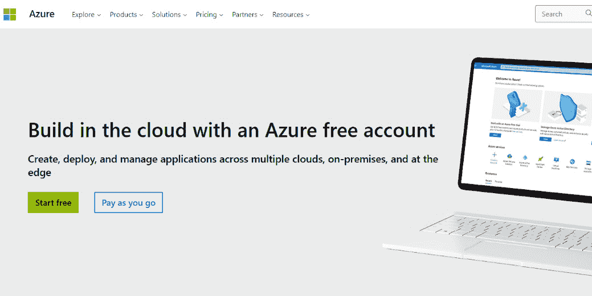

# 第八章：通过无服务器应用程序和工具进行 Azure 渗透测试

在上一章中，我们查看了 Azure 提供的各种 SaaS、PaaS 和 IaaS 服务。

现在，是时候在你自己的 Azure 部署中实际进行一些漏洞扫描和渗透测试了！这将会既有趣又富有教育意义。如果你已经阅读过 *第五章*，*通过无服务器应用程序和工具进行 AWS 渗透测试*，我们将在本章进行类似的工作，但是在 Azure 上。

本章将提供一个逐步指南，教你如何使用 Azure 自有的第一方安全工具检查安全配置并进行漏洞评估。重点介绍的工具是 Microsoft Defender for Cloud 和 Azure Firewall Manager。之后，我们将学习如何配置最流行的第三方 Azure 渗透测试工具。重点介绍的工具有 Prowler、MFASweep 和 ScoutSuite。最后，我们将通过 Prowler、MFASweep 和 ScoutSuite，查看渗透测试教程，找出凭证、列举 Azure 服务、进行漏洞扫描，并发现暴露的服务。

本章将涉及以下主题：

+   设置 Azure 实例

+   设置 Azure 账户

+   使用 Azure Cloud Shell 和 PowerShell

+   Azure 原生安全工具

+   Azure 渗透测试工具

+   利用 Azure 应用程序

那么，让我们开始一些实际的练习吧！

# 技术要求

我们将与 Microsoft 的基础设施合作。本章练习中的大部分计算处理将由庞大的 Azure 数据中心完成。所以，幸运的是，你不需要拥有顶级工作站。你需要以下设备：

+   一个网页浏览器

+   一台桌面或笔记本电脑

+   一部 Android 或 iPhone 智能手机

+   一个良好的、可靠的互联网连接

请查看以下视频，查看代码实战：[`bit.ly/3rUulqT`](https://bit.ly/3rUulqT)

# 设置 Azure 实例

任何人都可以设置自己的 Microsoft Azure 账户。许多 Azure 服务是免费的。我强烈建议你在为客户做付费工作之前，先部署自己的 Azure 实例来练习漏洞扫描和渗透测试，这样你可以练习你的技能。而且你在 Azure 上进行的测试部署可能比你所在组织的 Azure 网络还要简单！

多亏了云计算的魔力，以及计算处理、数据存储和带宽都托管在 Microsoft 的基础设施上，你不需要拥有一台强大的工作站电脑就能尝试本章中我所演示的练习。一台典型的桌面或笔记本电脑，配备 Windows、macOS 或 Linux，良好的网络功能和现代浏览器就足够了。

首先，打开你的网页浏览器，访问 Microsoft 免费 Azure 服务的指南（[`azure.microsoft.com/en-ca/free`](https://azure.microsoft.com/en-ca/free)）。以下是截至 2023 年本书撰写时大部分免费的 Azure 服务：

+   `Azure Active Directory` 始终免费，但你被限制为 50,000 个存储对象，并提供**单点登录**（**SSO**）身份验证接口。同样，对于你的测试部署，这应该不是问题。

+   `Azure Advisor` 服务始终免费且不限量。Advisor 提供个性化建议，并识别使用 Azure 的最佳实践。

+   你可以免费使用 12 个月的`Anomaly Detector`服务。Anomaly Detector 利用**人工智能**（**AI**）和**机器学习**（**ML**）帮助你在 Azure 中排除技术问题。

+   `Azure App Configuration` 始终免费，但每日请求数限制为 1,000 次，存储空间为 10 MB。你的 Azure 测试部署不太可能超过每日 1,000 次请求。App Configuration 用于管理和存储你的 Azure 应用配置。

+   `Azure App Service` 始终免费。App Service 使你能够使用 PHP 和 Node.js 等工具为任何平台或设备创建应用。你被限制为 10 个应用，存储为 1 GB，每天使用 1 小时。对于你的测试部署来说，这不太可能成为问题。

+   `Azure DevOps` 始终免费，但限制为五个用户。Azure DevOps 帮助通过 CI/CD 方法构建应用，使用 Git 存储库。基本上，如果你的应用需要每天进行多次更新，Azure DevOps 将帮助你实现这一目标。

+   `Azure Files` 在前 12 个月是免费的。它使你能够跨平台迁移文件，而无需更改任何代码。但你被限制为 100 GB 的**本地冗余存储**（**LRS**）事务和 200 万次文件操作。这对于一些企业客户可能会有些限制，但对于你的测试部署来说不太可能是个问题。（LRS 是指将数据同步复制到三个磁盘上。）

+   `Azure Kubernetes Service`（**AKS**）始终免费。这非常重要，因为 Kubernetes 容器化是云网络中最常见的用例之一！你将在*第九章*中了解在 Azure 中渗透测试 Kubernetes 容器化。

+   `Azure Lighthouse` 始终免费。它允许你在“零信任”网络安全模型下，管理与你的 Azure 网络接口的不同服务提供商。零信任是比旧的周界安全模型更安全的一种替代方案。与其有一个周界，信任内部的计算机，外部是互联网和其他不受信任的计算机，并在周界进行身份验证，零信任在所有可能的点创建身份验证矢量，并默认不信任所有未经身份验证的数据传输，即使它们来自你自己的网络内部。

+   `Azure Maps` 是 Azure 生态系统中类似于 Google Maps 的服务。它拥有许多 API 和功能，并且与所有 Azure 应用程序本地集成。您可以在移动设备、桌面和 Web 应用程序中使用自定义嵌入地图。在您开发的应用程序中使用 Azure Maps 是免费的，但特定的地图和位置洞察功能限制为 1,000 到 5,000 个事务。

+   `Azure Migrate` 总是免费的。它帮助您将虚拟机（**VMs**）从您的本地环境或其他云平台迁移到 Azure。

+   `Azure Policy` 帮助您遵守数据隐私和网络安全法规。这对您的雇主可能比您的 Azure 测试部署更为重要。但您可以免费访问配置和更改跟踪功能。

    首次 12 个月内，您将免费获得 15 GB 的出站数据传输带宽，并且始终免费获得 100 GB 的入站数据传输。

+   `Blob` 是一种非结构化数据对象。在 Blob Storage 中，首次 12 个月内免费获得 5 GB 的 LRS 存储空间，包括 20,000 次读取和 10,000 次写入操作。但我不预期您会在测试部署中使用 Blob Storage。

+   就 `Cloud Shell` 而言，在 Azure 文件中免费获得 5 GB 存储空间，首次 12 个月免费。这是 AWS CloudShell 的 Azure 等效，我在 *第 5* 和 *第 6* 章中演示了它。在 Web 浏览器中访问 CLI 非常重要，您几乎肯定也会在 Azure 测试部署中使用 Azure Cloud Shell！

+   `Container Apps` 总是免费的，但有一些限制。Container Apps 可以在无服务器容器中部署应用程序和微服务，但您的使用受到 180,000 vCPU 秒、360,000 GiB 秒和 2 百万请求的限制，除非您愿意额外付费。

+   **容器注册表** 在 Azure 生态系统中存储和管理容器映像。首次 12 个月免费，但您的限制为一个标准层注册表，包括 100 GB 存储和 10 个 Webhook。

+   **成本管理** 总是免费的。因此，您不需要额外付费来节省和优化 Azure 云服务的费用，可以全面了解您的支出情况。当然，如果始终保持在免费服务及其限制内，那么就根本不会有支出！但无论如何，您都可以通过成本管理进行检查。

+   **数据库迁移服务** 使数据库从本地服务器迁移到云更加轻松。但是在测试部署中，免费标准计算级别总是免费的。

+   `DevTest Labs` 让开发人员能够在开发/测试环境中测试其工作。它总是免费的。

+   `Event Grid` 保证在大规模下可靠地传递事件，以促进服务集成。它总是免费的，但您每月的操作限制为 100,000 次。这应该足够了！

+   **函数**使得可以使用无服务器代码架构处理事件。万一你需要使用它，1,000,000 次请求始终免费。

+   **密钥保管库**安全地存储你在 Azure 服务中使用的加密密钥。它的服务在前 12 个月免费，但你限于 10,000 次事务、RSA 2048 位密钥或标准级别的机密操作。

+   在前 12 个月内，你可以免费获得一定数量的 **Linux 虚拟机**。限制是 750 小时的 B1s 弹性虚拟机。

+   **负载均衡器**确保你的 Azure 部署根据任何给定时刻的需求，在服务器间平衡使用。在前 12 个月内，你可以免费获得 750 小时、15 GB 数据处理和最多五个规则的标准负载均衡器。

+   **托管磁盘**是用于 Azure 虚拟机块存储的服务。在前 12 个月内，你可以免费获得 2 个 64 GB SSD 存储驱动器、1 GB 快照和 200 万次 I/O 操作。超出部分将产生费用！

+   **媒体服务**让你能够将流媒体部署到任何设备上，如流视频或音频。你可能在测试部署中不需要这样做，但万一需要，你可以在前 12 个月内免费获得每项 5 小时的标准通道、实时转录和标准流媒体端点服务。

+   **监控**让你可以全面了解和观察你的应用程序、基础设施和网络。每个功能有不同的限制，但除此之外，它始终免费。

+   **网络观察器**帮助你监控、诊断并理解你的 Azure 网络性能。它始终免费，但你限于 5 GB 存储，1,000 次检查，10 次测试和 10 个连接度量。

+   **通知中心**允许你向任何移动设备（iOS 和 Android）发送推送通知。你限于 100 万次推送通知，但这些是免费的。不过，如果你用 Azure 部署移动应用，才需要关注这个限制。

+   **私有链接**让你可以从任何自己的端点私密地访问你的 Azure 服务。它始终免费。

+   **资源管理器**让你查看应用资源的使用情况，并使你能够管理它们。它始终免费。

+   **安全中心**使你能够在所有 Azure 部署中防止、检测和响应威胁。策略评估和建议始终免费！

+   很可能你的 web 应用和其他基于数据库的应用需要 **SQL 数据库**。在前 12 个月内，你可以免费获得一个 250 GB S0 实例，并附带 10 个数据库事务单元。

+   **SQL Server 2019 开发版**让你可以在生产环境之外构建、测试和展示应用程序。它始终免费。

+   在前 12 个月内，你也可以免费获得一定数量的 **Windows 虚拟机**。同样，限制是 750 小时的 B1s 弹性虚拟机。

+   你将免费获得 50 个 **虚拟网络** 实例，永久有效。但这是用于配置私有网络并将其连接到你本地的数据中心。对于你的测试部署来说，这不太可能是必需的。

+   **VPN 网关** 使得在数据中心和云服务之间部署 VPN 成为可能。这能非常有效地加密你的传输数据。前 12 个月内，你可以免费使用 750 小时。但这可能是对于你所在的组织来说，比对于你的 Azure 测试部署更有用的服务。

让我们部署一个 Azure 实例，供你用于测试目的。

# 设置 Azure 账户

启动你的第一个 Azure 实例并练习渗透测试技能所需的所有操作都可以通过网页浏览器完成。以下是操作步骤：

1.  当你进入 Azure 免费服务网页时（[`azure.microsoft.com/en-ca/free`](https://azure.microsoft.com/en-ca/free)），点击绿色的 **开始免费** 按钮：



图 8.1 – Azure 免费账户创建页面

你将被引导到一个登录微软账户的页面。如果你在家使用 Windows 10 或 Windows 11，可能已经拥有微软账户。你可以选择使用现有的微软账户，创建一个新的微软账户（即使你已经有另一个微软账户，也可以创建新的账户），或者如果有 GitHub 账户，可以用 GitHub 凭证登录。

我决定使用我已经拥有的微软账户。我对网络安全很谨慎，所以我已经在我的 Android 手机上通过微软身份验证器设置了 **多因素身份验证**（**MFA**）。我使用密码和通过微软身份验证器发送到我手机的验证码成功登录。微软身份验证器适用于 Android 和 iOS，且免费使用，我强烈建议你在使用 Azure 服务时使用它。你可以在这里了解更多关于微软身份验证器的信息：[`www.microsoft.com/en-ca/security/mobile-authenticator-app`](https://www.microsoft.com/en-ca/security/mobile-authenticator-app)。

为确保没有任何混淆，我使用手机进行微软身份验证器（Microsoft Authenticator），但我使用 Windows 11 笔记本电脑通过其网页界面与 Azure 进行工作。从手机管理云服务不太实际。幸运的是，MacBook 或 Linux 电脑与 Windows 电脑一样适合这项工作。

1.  登录后，我被引导到一个表单，填写了我的姓名、所在地区（在我的情况中是加拿大）和电话号码。我还获得了 200 美元的信用额度，可以在前 30 天内使用！谢谢，微软。我的电话号码通过短信进行了验证。然后，我填写了我的家庭邮寄地址并同意了客户协议。在表单底部，点击 **下一步**。

1.  然后，你将看到一个需要输入信用卡信息的屏幕。即使你正在使用免费服务，这一步也是必须的。如果你使用了任何收费服务或超出了免费服务限制，信用卡将会被扣费。我建议使用 Azure 的成本管理应用来密切关注这一点！

    在底部，点击那个蓝色的**注册**按钮。

1.  等待片刻，账户将会被设置好。然后，你将看到一个显示**你已准备好开始使用 Azure**的屏幕。点击那个蓝色按钮，按钮上写着**前往 Azure 门户**。听起来非常激动人心！我们将一起踏上云服务之旅。

    快速入门中心将为你展示多种不同的选项，帮助你开始使用。你可以参加在线课程、跟随设置指南或开始一个项目。在**项目和指南**标签下的项目选项有：

    +   **创建一个Web 应用**

    +   **部署虚拟机**

    +   **部署并运行一个基于容器的应用**

    +   **设置数据库**

    +   **开始数据分析、机器学习和智能化工作**

    +   **存储、备份或归档数据**

    +   **构建、部署并运营一个无服务器应用**

    你可以在这里看到概述：


图 8.2 – Microsoft Azure 快速入门中心

现在，让我们来部署一个虚拟机。（我们将在*第九章*中部署并运行一个基于容器的应用。）

1.  接下来，你将有机会创建一个 Windows 虚拟机或 Linux 虚拟机：


图 8.3 – 从快速入门中心部署虚拟机的屏幕

因为在 AWS 章节中我使用了 Linux 虚拟机，所以我们来点不同的，选择一个 Windows 虚拟机。但是如果你创建一个 Linux 虚拟机，你可以在 CLI 中使用我在*第五章*中为 AWS 使用的 Linux Bash 命令。

1.  下一屏幕顶部显示**创建虚拟机**。你将需要填写一个表单：

    +   在**项目详情**下，保持订阅为默认值或**Azure 订阅 1**。在资源组下，保持为**（新建）资源组**。

    +   在**实例详情**下，为虚拟机取一个你容易记住的名字。我输入了`PentestingWindowsVM`。不允许使用空格和特殊字符！

    +   我选择了**（美国）东部美国**作为我的区域。但你可以选择任何你喜欢的区域。它甚至不需要靠近你的实际位置。你可以在印度并选择**（欧洲）挪威东部**，如果你愿意的话！

    +   在**可用性选项**下，我选择了**不需要基础设施冗余**。如果你希望避免服务费用，这是最安全的选择。不过，你所在的组织需求远大于你的测试部署，可能会选择不同的选项。

    +   在 **安全类型** 下，我选择了 **标准**。这是针对你自己的测试部署来说最安全的选择，可以避免产生服务费用，但对于企业、机构或大公司来说，可能需要选择更高的安全级别。

    +   我保留了默认的 Windows Server 2016 数据中心作为我的镜像。x64 是该镜像的唯一虚拟机架构选项。另外，ARM64 不是免费的服务选项。

    +   我选择了最小的配置（1 vCPU，3.5 GiB 内存，月费用 $91.98）。我只打算使用我的实例一个月，而这正好可以在我的 $200 USD 免费额度内。希望一切顺利！对于你自己的测试部署来说，不需要选择较大的配置。

1.  在下一屏上，为你的管理员账户创建一个用户名和密码。确保你的密码足够强！我使用了密码管理器来生成一个包含大量字符的复杂密码。我也建议你使用密码管理器，或许是一个内置于你浏览器中的密码管理器。这样，你就不必记住那些复杂的密码了。

1.  在下一屏上，我禁用了公共入站端口。然后，在左下角，我点击了蓝色的 **审核 + 创建** 按钮，因为我决定保留 **磁盘**、**网络**、**管理** 和 **监控** 的默认设置。你的界面可能看起来差不多，或者略有不同。仔细查看屏幕上的文字。我计划在大约一个月后取消我的 Azure 账户。如果你需要长时间保留你的 Azure 测试部署，我建议你点击 **下一步** 而不是 **审核 + 创建**，然后仔细考虑你的选项。

1.  如果屏幕上的选项看起来不错，点击左下角的蓝色 **创建** 按钮。否则，点击 **上一步** 按钮来更改你的配置。

    部署准备好需要一些时间，请耐心等待！

你的体验可能有所不同。但对我来说，部署大约花了一分钟时间才生效。然后，屏幕上显示 **您的部署已完成**。于是，我点击了蓝色的 **转到资源** 按钮。

在 *第九章*中，我们将对刚才部署的虚拟机进行渗透测试。

如果你真的很懂技术，你一定会喜欢点击 **转到资源** 后出现的界面。你可以浏览你虚拟机和其他 Azure 服务的所有技术细节。但现在，我们先进入 Azure Cloud Shell。

# 使用 Azure Cloud Shell 和 PowerShell

无论你在管理 Azure 服务的网页界面上在哪一位置（你地址栏中的 URL 应该显示为 **portal.azure.com**），只要你已登录，在页面顶部会有一条蓝色菜单栏。在搜索栏的右侧，会有一个类似命令提示符的图标（大概是这样：**>_**）：


图 8.4 – Azure 菜单栏和 Cloud Shell

点击它来启动 Azure Cloud Shell。在 Azure Cloud Shell 中，你可以通过左上角的下拉菜单在 PowerShell 和 Bash 之间切换。首次启动 Cloud Shell 时，你可能需要选择 **创建存储**：


图 8.5 – Azure Cloud Shell 屏幕

你将在 *第五章* 中找到一些 Bash 命令，*通过无服务器应用和工具渗透测试 AWS 功能*。我们将在本章中使用 Bash 来安装和执行工具。但让我们先回顾一些你可以在 Azure Cloud Shell CLI 中使用的有用的 PowerShell 命令。它们非常实用，你可能在执行 Azure Cloud Shell 中的其他活动时需要使用 PowerShell 命令：

+   类似于 Bash，你可以使用以下命令来更改当前打开的目录：

    +   `cd`

    +   `chdir`

+   在你复制项目之前，使用以下命令之一，并在命令中输入你想要复制的文件名：

    +   `copy`

    +   `cp`

+   你可以使用以下任何命令来移动项目。你还需要在命令中输入要移动的文件路径和文件名，以及目标文件路径：

    +   `mi`

    +   `move`

    +   `mv`

+   使用以下命令和你想要删除的文件名来移除一个项目。记住，这将删除你的文件：

    +   `del`

    +   `erase`

    +   `rd`

    +   `ri`

    +   `rm`

+   这个命令将删除整个目录。使用时请小心：

    +   `rmdir`

+   如果你想创建一个新项目，请使用以下命令。通常，我只会用它来创建可以在记事本中修改的文本文件。使用这个命令会创建一个空文件，并使用你在命令中选择的文件名：

    +   `ni`

+   使用这个命令设置项目的新值：

    +   `si`

    例如，你可以输入 `si path <string>` 来设置一个字符串，或者 `si value <object>` 来设置一个对象，例如 [`ss64.com/ps/set-item.html`](https://ss64.com/ps/set-item.html)。

+   使用这个命令启动一个后台任务（可执行任务）：

    +   `sajb`

+   使用这个命令挂起任务：

    +   `sujb`

+   使用这个命令恢复任务：

    +   `rujb`

+   启动一个已停止的服务：

    +   `sasv`

在 Azure Cloud Shell 中，无论你运行的是 PowerShell 还是 Bash，启动 Cloud Shell 后，以下指南将会显示出来。我在这里展示的命令适用于 Azure CLI，查看内置帮助指南总是一个很好的时间利用方式：

```
Type "az" to use Azure CLI
Type "help"" to learn about Cloud Shell
```

接下来，让我们看看一些原生的 Azure 安全工具。

# Azure 原生安全工具

这是 Azure 中内置的可以帮助你提高安全性的一些工具。

## Microsoft Defender

Microsoft Defender for Cloud 是一个重要的应用程序，用于检查你在 Azure 中的安全状况。它会根据你当前的配置提供安全建议，并告知你存在的一些安全漏洞。这些信息可以用于你的渗透测试报告。

让我们打开 Microsoft Defender，看看我们能了解到有关 Azure 部署的安全性：

1.  要执行该应用，首先确保你已在浏览器中登录 Azure 帐户。访问 [portal.azure.com](http://portal.azure.com)。你应该会看到这个屏幕。

1.  接下来，在顶部的蓝色菜单栏中，在搜索框中输入`Defender`。应该会显示出指向 Microsoft Defender for Cloud 的链接。点击它。

    你可能需要将 Microsoft Defender for Cloud 添加为付费服务。如果你尚未注册，可以在应用的主页面看到一个方便的**升级**按钮。提交前务必检查订阅费用！

1.  一旦进入 Microsoft Defender for Cloud，你将在左侧菜单中看到多个不同的部分（*图 8.6*）。它们代表了用于了解你在 Azure 中安全态势的不同工具：

    +   **推荐**将向你显示一些安全改进建议，按严重程度分类为**高**、**中**和**低**。

    +   **附加路径分析**将显示 Defender 是否已识别出攻击者可能利用的攻击路径，指向你的 Azure 实例。希望该页面显示**未找到攻击路径**。无论是否找到攻击路径，你都可以将此信息纳入你的渗透测试报告。

    +   **安全警报**类似于**推荐**。警报按严重程度分类为**高**、**中**和**低**。

    +   **云安全探索器**将展示一系列你可以执行的查询模板：

        +   互联网暴露的虚拟机

        +   存在高危漏洞的互联网暴露虚拟机

        +   存在特定漏洞的虚拟机

        +   公开访问的带有托管身份的互联网暴露 SQL 服务器

        +   没有 MFA 且具有存储账户权限的用户账户

        +   运行具有高危漏洞的 Azure Kubernetes Pods

        +   没有任何过期期限的 Key Vault 密钥和机密

        +   拥有脆弱虚拟机权限的用户账户

        +   标记为生产环境的互联网暴露 SQL 服务器

        +   拥有 SQL 虚拟机权限并允许在主机上执行代码的外部用户

        +   存在 Log4Shell 漏洞并具有存储账户权限的虚拟机

        +   含有漏洞 Pods 的 Kubernetes 命名空间

        +   公开访问的互联网暴露的**简单存储服务**（**S3**）存储桶，包含敏感数据

        +   公开访问的存储账户容器，包含敏感数据并允许公开访问

    +   **诊断和解决问题**提供了多个自动化故障排除工具，帮助解决以下领域的问题：

        +   Defender **云安全态势管理**（**CSPM**）计划

        +   服务器防护

        +   入驻和设置

        +   定价、计费和使用情况

        +   安全评分和推荐

        +   安全警报

        +   **漏洞评估**（**VA**）

    后两个故障排除工具对你确保安全警报和漏洞评估正常工作特别有用！

    +   在**云安全**下，**安全态势**会展示一个概览，包含安全评分和环境指标（管理组、订阅、不健康资源和建议）。你还可以从屏幕顶部生成治理报告。这些数据可能在你的渗透测试报告中有所帮助。

    +   在 Microsoft Defender for Cloud 的左侧菜单中，你还可以查看**Azure 防火墙管理器**，它会显示监控报告和概览。

    +   你还可以管理**Azure 防火墙策略**、**分布式拒绝服务**（**DDoS**）**保护计划**和**Web 应用防火墙策略**。

在下一节，我将带你了解我们在利用自己 Azure 测试部署时使用的安装过程。

# Azure 渗透测试工具

在上一章，我列出了几种你在进行 Azure 渗透测试时可以使用的第三方应用程序。

我在这里演示的所有操作都符合 Microsoft 的政策，只要你是在自己的 Azure 实例中进行这些活动，或者你已获得你正在使用的 Azure 实例所有者的许可，允许你在其上进行漏洞扫描和渗透测试。

但我认为没有过于谨慎的说法。因此，我再次提供微软的政策链接（[`www.microsoft.com/en-us/msrc/pentest-rules-of-engagement`](https://www.microsoft.com/en-us/msrc/pentest-rules-of-engagement)）。请阅读并理解这些政策，以便你能够遵守它们，无论你在的 Azure 实例是否属于你，因为归根结底，无论如何你还是在微软的基础设施中工作！

## Prowler

在 AWS 部分（*第五章*），我们发现 Prowler 是一个非常有用的漏洞扫描工具。Prowler 在 Azure 中也同样适用，所以我将带你了解如何在 Azure 中安装 Prowler：

1.  通过查看顶部搜索栏右侧，点击一个类似命令提示符的图标（像这样：**>_**）来启动 Azure Cloud Shell。

    点击它！

1.  我们不打算在 Azure Cloud Shell 中启动 PowerShell CLI，而是需要运行 Bash。在 Azure Cloud Shell 显示的左上方，有一个下拉菜单，可以在 PowerShell 和 Bash 之间切换。确保选择了 Bash。

1.  我们将使用`pip`来安装 Prowler，因此确保你在 Azure 中安装的`pip`版本是最新的可能会很有帮助。首先尝试这个命令：

    ```
    pip install --upgrade pip
    ```

1.  现在，我们将通过一个简单的命令来安装 Prowler。首先，确保你位于主目录或者你希望在其中运行并安装 Prowler 的目录。如果需要，可以使用`cd`命令来进行切换。然后，使用`pip`来安装 Prowler，像这样：

    ```
    pip install prowler
    ```

你会看到命令行中下载了各种 Prowler 组件，然后所有必要的包应该都会被安装。希望一切顺利！如果你需要更多帮助，可以查看官方的 Prowler 文档 ([`docs.prowler.cloud/en/latest/`](https://docs.prowler.cloud/en/latest/)) 和官方的 pip 文档 ([`pip.pypa.io/en/stable/`](https://pip.pypa.io/en/stable/))。

接下来，让我们安装 MFASweep ([`github.com/dafthack/MFASweep`](https://github.com/dafthack/MFASweep))。

## MFASweep

`MFASweep` 是一个 PowerShell 脚本，尝试使用提供的凭据登录到各种 Microsoft 服务，并检查是否启用了多因素认证（MFA）。对于 Azure 中的所有用户账户，启用 MFA 非常重要，以保护这些账户免受网络攻击者的侵害。

让我们开始安装吧！

1.  在另一个浏览器标签页中，确保你已登录到你的 GitHub 账户，网址是 [github.com](http://github.com)。如果需要，可以创建一个新的 GitHub 账户。

1.  接下来，运行此命令将你的 GitHub 账户与 Azure 账户关联。你可能需要输入 **一次性密码**（**OTP**）来完成此操作。如果是这样，你将会生成一个 OTP，输入到 GitHub（在另一个浏览器标签页中）：

    ```
    gh auth login
    ```

1.  现在，输入这个命令来使用 Git 安装 MFASweep：

    ```
    gh repo clone dafthack/MFASweep
    ```


图 8.6 – MFASweep 在 Azure 中的安装过程

在前面的截图中，你可以看到 GitHub 仓库克隆过程以及 MFASweep 在命令行中的安装过程。

## ScoutSuite

现在，让我们安装 ScoutSuite。ScoutSuite 对审计我们的 Azure 实例的安全状态非常有用。在 Bash 中输入以下命令：

```
pip install scoutsuite
```

各种 ScoutSuite 组件将会被下载并安装。如果这一步没有正常进行，建议访问 GitHub 上的 ScoutSuite 页面 ([`github.com/nccgroup/ScoutSuite`](https://github.com/nccgroup/ScoutSuite)) 获取更多帮助：


图 8.7 – ScoutSuite 安装过程

现在，让我们使用我们安装的工具！

# 利用 Azure 应用程序

现在，让我们使用我们安装的工具进行一些安全测试。

## Prowler

首先，让我们在 Azure 中运行一个默认的 Prowler 扫描。默认扫描是一个有效的通用漏洞评估。请按照以下步骤进行：

1.  启动 Azure Cloud Shell，确保使用的是 Bash。在 Azure Cloud Shell 界面左上方，有一个下拉菜单可以在 PowerShell 和 Bash 之间切换。搞定了！

1.  我喜欢在开始扫描之前先确认 Prowler 是否正确安装。使用以下命令检查你安装的 Prowler 版本：

    ```
    prowler -v
    ```

1.  接下来，让我们使用这个命令查看你可以在 Azure 中运行的 Prowler 安全检查：

    ```
    prowler azure --list-checks
    ```

1.  现在，让我们运行一些先前命令响应中列出的检查。确保`--az-cli-auth`位于你的`prowler azure`命令的末尾，以便你可以用必要的权限执行它。

    如果在命令行中遇到 IAM 的技术问题，你可以通过在另一个浏览器标签页中访问这个页面来检查你的 IAM 设置（确保你已正确登录到你的 Azure 管理帐户！）：

    [`portal.azure.com/#view/Microsoft_AAD_IAM/RolesManagementMenuBlade/~/AllRoles/adminUnitObjectId//resourceScope/%2F`](https://portal.azure.com/#view/Microsoft_AAD_IAM/RolesManagementMenuBlade/~/AllRoles/adminUnitObjectId//resourceScope/%2F)

1.  运行几个来自`--list-checks`输出的检查，像这样：

    ```
    prowler azure --checks defender_ensure_defender_for_app_services_is_on defender_ensure_defender_for_storage_is_on storage_infrastructure_encryption_is_enabled --az-cli-auth
    ```

    在`--checks`和`--az-cli-auth`之间，你可以输入任何显示为`prowler azure --list-checks`命令结果的检查名称。试试看！尽可能多地尝试各种检查。

    检查扫描的结果将根据其通过或失败情况显示在屏幕上。你还可以通过访问`/home/<your_name_here>/output/`目录，以 HTML、CSV 和 JSON 格式获取扫描日志。

1.  接下来，你可以通过这个命令查看你可以在 Azure 中使用 Prowler 扫描哪些服务：

    ```
    prowler azure --list-services
    ```

    你可以扫描的 Azure 服务将在命令行中输出一个列表。

1.  接下来，让我们扫描这些服务！使用类似这样的命令：

    ```
    prowler azure --services defender iam storage --az-cli-auth
    ```

    在`--services`和`--az-cli-auth`之间，你可以输入任何你希望从`prowler azure --list-services`命令中显示在屏幕上的服务名称：

与检查扫描一样，你也可以通过访问`/home/<your_name_here>/output/`目录，以 HTML、CSV 和 JSON 格式获取扫描日志。

让我们使用 MFASweep 进行 MFA 检查。

## MFASweep

确保在与你（或你的客户）Azure 实例关联的所有帐户上启用 MFA 非常重要！密码是一种相对较弱的身份验证方法，密码经常被破解或泄露。实施 MFA 对确保你的帐户仍然安全至关重要，即使在网络威胁者威胁到你的密码时。我在手机上使用 Microsoft Authenticator 作为我的第二身份验证因素。在网络安全术语中，我的密码是“我知道的东西”，而 Microsoft Authenticator（通过我的手机）是“我拥有的东西”。如果我实施某种生物识别技术，例如指纹扫描仪，那将是“我是谁”。

让我们执行 MFASweep 检查 Azure 中的用户帐户是否启用了 MFA。这个命令将让 MFASweep 检查我的主 Azure 帐户和`Active Directory FederationServices`（**ADFS**）：

```
Invoke-MFASweep -Username <insert_username_of_account_email_address_here>@<insert_domain_name_here> -Password <insert_password_here> -Recon -IncludeADFS
```

注意我在那个例子中是多么小心地不分享我的 Azure 凭证！这就是你在网络安全中需要采用的思维方式。我们称之为`OPSEC`，即**操作安全**。

一个新的命令行将以 `>>` 开头。我发现查看扫描结果需要几分钟，因此你可能需要耐心等待：


图 8.8 – MFASweep 扫描结果

## ScoutSuite

现在，是时候在 Azure 中进行基本的 ScoutSuite 扫描了。您的身份验证凭据应该已经通过使用之前的工具设置好了。

使用以下命令运行扫描：

```
scout azure --cli
```

一些操作将在命令行输出结果，如下所示：


图 8.9 – 在命令行上使用 ScoutSuite 扫描

完成后，JS、JSON 和 HTML 格式的日志将写入此处：

`scoutsuite-report/scoutsuite-results/scoutsuite_results_azure-tenant-<unique_identifier_here>.<file_extension_here>`

Prowler、MFASweep 和 ScoutSuite 应该会产生命令行输出和日志，这些内容在渗透测试 Azure 时非常有用。确保将这些结果包含在渗透测试报告中，并用你自己的话解释它们。

# 总结

您可以使用多种便捷工具来检查您在 Azure 中的安全态势，运行漏洞扫描并进行简单的渗透测试。您从这些工具中获得的所有信息都可以作为渗透测试报告的一部分。

Microsoft Defender for Cloud 是您的主要安全态势中心。它提供安全建议、安全警报、攻击路径分析、故障排除工具和安全配置相关信息。Azure 防火墙管理器也内置其中。Azure 防火墙有助于在您的 Azure 实例中允许或拒绝活动。您绝对需要拒绝可能帮助网络威胁行为者的活动！

Azure Cloud Shell CLI 可以在您登录 Azure Web 应用程序时在浏览器中执行。我们可以从 Azure Cloud Shell 安装并运行第三方渗透测试工具。

Prowler 在渗透测试 Azure 时与渗透测试 AWS 一样有用。

MFASweep 专为 Azure 设计。它是确保 MFA 设置保护所有访问您 Azure 实例的帐户的最有效方法。

ScoutSuite 是另一个工具，内置了许多非常有用的 Azure 扫描和检查功能。

在下一章中，我们将部署容器化应用程序到 Azure，并进行渗透测试。

# 进一步阅读

要了解本章涵盖的主题，您可以访问以下链接：

+   *Azure 中的免费服务列表*：[`azure.microsoft.com/en-ca/free`](https://azure.microsoft.com/en-ca/free)

+   *带有 PowerShell* *命令的备忘单*：[`www.comparitech.com/net-admin/powershell-cheat-sheet/`](https://www.comparitech.com/net-admin/powershell-cheat-sheet/)

+   *Prowler* *文档*：[`docs.prowler.cloud`](https://docs.prowler.cloud)

+   *MFASweep*：[`github.com/dafthack/MFASweep`](https://github.com/dafthack/MFASweep)

+   *ScoutSuite*：[`github.com/nccgroup/ScoutSuite`](https://github.com/nccgroup/ScoutSuite)
