# 第十二章：在 GCP 中进行容器化应用的渗透测试

如果你所在的组织从事 DevOps 或 CI/CD 应用程序开发，极有可能他们在 GCP 中有 Docker 或 Kubernetes 集群。让我们学习如何对它们进行渗透测试。

本章中，我将解释什么是容器化，为什么要使用容器化，以及容器化通常是如何工作的。我们将学习 Docker 和 Kubernetes 在 GCP 中的工作原理，以及如何在 GCP 中使用 Trivy 与基于 Docker 和 Kubernetes 的应用程序进行配合。

本章中，我们将涵盖以下主题：

+   容器化是如何工作的

+   Docker 在 GCP 中是如何工作的

+   Kubernetes 在 GCP 中是如何工作的

+   在 GCP 中进行 Docker 和 Kubernetes 的渗透测试技术

那么，让我们在 GCP 中探索容器化吧！

# 技术要求

我们将使用微软的基础设施。庞大的 Azure 数据中心将为本章中的练习提供大量计算处理工作。因此，幸运的是，你不需要一台顶级的工作站。你需要以下设备：

+   一个网页浏览器

+   一台桌面或笔记本电脑

+   一台安卓手机或 iPhone 手机

+   一个良好的、可靠的互联网连接

查看以下视频以查看代码演示：[`bit.ly/404CEg8`](https://bit.ly/404CEg8)

# 容器化是如何工作的

计算机虚拟化是关于软件模拟硬件功能的。例如，我的笔记本电脑是一台计算机。但在我的电脑上，我可以运行一些软件，假装同时运行几台不同的计算机。（幸好我将笔记本电脑的内存扩展到了 64GB，因为每台模拟计算机可能需要 4GB 的内存！）每台计算机的 CPU、RAM、硬盘和 I/O 设备接口都在软件中被模拟。软件使用我笔记本电脑的实际 CPU、RAM、硬盘和 I/O 接口，并分配它们的容量，以创建几台虚拟计算机。当操作系统和应用程序安装在这些虚拟计算机上时，就操作系统和应用程序本身而言，它们认为每台虚拟计算机都是在自己的物理计算机上运行。

在云网络中部署虚拟化有两种常见方式——虚拟机和容器。

## 虚拟机

VMs 是模拟计算机，正如我在示例中所描述的那样。它们并不是直接在 PC 或服务器硬件上运行，而是模拟运行操作系统所需的所有硬件组件。在这个模型中，我的笔记本电脑运行一个虚拟机监控器，它充当虚拟机与我的物理计算机之间的层。

你可以在自己的 PC 上使用像 Oracle VirtualBox 或 VMware Workstation Player 这样的应用程序，作为虚拟机的虚拟机监控器。你所需要的只是一个操作系统的磁盘镜像文件，想要在虚拟机中运行该操作系统，然后在虚拟机监控器中进行配置。操作系统不需要与主机操作系统匹配，实际上它们通常并不匹配。我可以在我的 Windows 11 PC 上运行一个 Kali Linux 虚拟机。你可以在你的 MacBook 上运行一个 Windows 11 虚拟机。我也可以在我的 Kubuntu Linux 桌面上运行一个 macOS 虚拟机。

虚拟机也可以在 GCP 等云平台上运行。这样，虚拟化计算机就运行在 Google 的计算机上，而不是你可以物理接触的自己设备上。虚拟机是 GCP 的一个常见使用案例，当公司希望长时间在 GCP 上运行单一计算机时，虚拟机是一个不错的解决方案，例如作为 Web 服务器或邮件服务器。你每天访问的许多网站都托管在运行在云平台（如 GCP）上的虚拟机上！

但是，当公司部署大规模的动态应用时，虚拟机并不是最佳选择，例如使用 DevOps 或 CI/CD 方法论，这些方法要求应用具有高度可扩展性和响应能力。DevOps 或 CI/CD 应用所需的计算处理能力、内存和网络带宽可能一天减少一半，第二天又增加一倍，而虚拟机的硬件容量无法像容器一样迅速变化。分配给虚拟机的硬件资源相对固定。

容器化应运而生。

## 容器

Docker 和 Kubernetes 是当今公司常用的两种容器化编排平台。容器化编排平台可以自动启动和终止容器，无需直接的人为操作。这些平台管理容器的部署，并处理虚拟化硬件内的负载均衡，只分配所需的硬件资源，如 CPU 和内存。

云平台使得公司和其他类型的企业能够实现容器化应用。Google 在全球各地的多个数据中心拥有庞大的计算机网络和硬件资源，其中很多资源专门用于向全球的商业客户提供 GCP 服务。

# Docker 在 GCP 中的工作原理

Docker 不是第一个存在的容器化技术，但它可能是第一个被全球公司和组织广泛使用的容器化技术。它也是 Kubernetes 的基础，Kubernetes 是另一种流行的容器部署方式。Docker 和 Kubernetes 不是像可口可乐与百事可乐那样的竞争对手，而是 Kubernetes 是 Docker 的一个分支，就像将 Debian Linux 和基于 Debian 的 Ubuntu Linux 进行对比一样。

这是一个 Docker 容器化编排系统的基本架构（你可以参考*第六章*查看架构图）。

Docker 主机直接运行在你的电脑上，或在你管理的云服务上的计算机（例如 `Google Compute Engine`，或 **GCE**）。在 Docker 主机中，Docker 守护进程存储 Docker 镜像，并根据这些镜像创建和管理容器。Docker 镜像非常像操作系统的磁盘镜像 ISO 文件，你可以使用这些镜像来创建虚拟机。事实上，许多 Docker 镜像是使用普通操作系统（如 Ubuntu Linux）制作的。然而，这些镜像及其容器可能没有操作系统的所有组件，而仅包含运行容器化应用所需的部分。

Docker 主机连接到注册表，通常（但不总是）该注册表托管在外部网络上，通常是互联网。注册表使 Docker 镜像可以供 Docker 主机下载。注册表还会维护这些镜像并像其他互联网托管的软件一样进行更新，类似于 Git 仓库。

最后，运行在 GCP 控制台或 Docker Desktop 终端上的 Docker 客户端是你可以执行命令的地方，命令将传递给 Docker 守护进程（在你的 Docker 主机下）。这就是你如何向 Docker 容器化编排系统发送指令。在本章中，我们将通过这种方式向 Docker 系统执行命令。

在 GCP 中部署 Docker 容器化系统的默认方式是使用 Cloud Build 来简化 Docker 构建步骤，并利用 Cloud Run 来运行容器化的应用程序，同时 Docker 主机在 GCE 中运行。

这是 Google 对 Cloud Build 的描述（[`cloud.google.com/build`](https://cloud.google.com/build)）：

“*Cloud Build 根据需要进行扩展和缩小，无需设置、升级或扩展基础设施。在 Google Cloud 中的完全托管环境中运行构建，并与您自己的私有网络连接*。”

Cloud Build 是一个在后台运行的系统，当你以常规方式在 GCP 中部署 Docker 容器化时，它会执行相关操作。它使开发人员免去管理运行 Docker 容器的服务器的繁琐工作。

这是 Google 对 Cloud Run 的描述（[`cloud.google.com/run/docs/overview/what-is-cloud-run`](https://cloud.google.com/run/docs/overview/what-is-cloud-run)）：

“*Cloud Run 使开发人员能够将更多时间花在编写代码上，而很少需要操作、配置和扩展 Cloud Run 服务。你不需要创建集群或管理基础设施就可以高效使用 Cloud Run*。”

Cloud Run 是另一个在后台运行的系统，当你以常规方式在 GCP 中部署 Docker 容器化时，它将为开发人员省去调整计算处理配置的麻烦，这些配置用于执行 Docker 容器。

现在我们已经了解了在 GCP 中使用 Docker，接下来是时候学习 Kubernetes 在 GCP 中的工作原理。

# Kubernetes 在 GCP 中的工作原理

Kubernetes 可以用于在 AWS 和 Azure 上部署容器化应用程序。在*第六章*和*第九章*中，我带领你们了解了如何在这些平台上部署 Kubernetes，并对其进行了渗透测试。但是，GCP 可以说是 Kubernetes 的发源地。原因如下。

Kubernetes 最初是由 Google 的一个团队开发的。Kubernetes 项目在 2014 年由 Google 云计算专家 Eric Brewer 宣布（[`web.archive.org/web/20150910171929/http:/www.wired.com/2014/06/google-kubernetes`](https://web.archive.org/web/20150910171929/http:/www.wired.com/2014/06/google-kubernetes)）。Kubernetes 的灵感来自于 Docker 所推动的一些容器化创新。但 Kubernetes 主要受到 Borg 的影响（[`web.archive.org/web/20160701040235/http:/www.wired.com/2015/06/google-kubernetes-says-future-cloud-computing/`](https://web.archive.org/web/20160701040235/http:/www.wired.com/2015/06/google-kubernetes-says-future-cloud-computing/)），Borg 是 Google 用于内部目的的专有云计算中间件。Borg 帮助支撑 Gmail、Google 搜索、Google 地图和其他许多流行的 Google 服务的后台运行。

Google 的 Joe Beda、Brendan Burns、Brian Grant、Tim Hockin 和 Craig McLuckie 将 Kubernetes 构思为一个开源平台，可以用于许多 Google 在内部为 Borg 部署的相同用例。到 2015 年 7 月，Kubernetes 的第一个版本公开发布。到 2017 年，Red Hat（IBM）、VMware、Docker, Inc.、Microsoft Azure 和 AWS 等大型科技公司和软件开发商都宣布支持它。这就是 **开源软件**（**OSS**）和开放标准的魅力！正如一些组织拥有集成 AWS、Azure 和 GCP 服务的多云网络一样，一些组织同时也拥有 Docker 和 Kubernetes 容器化应用。

这是一个 Kubernetes 容器化编排系统的基本架构（你可以参考 *第六章* 查看架构图）。

控制平面支持整个容器化系统，并作为 Kubernetes 基于的网络和云平台之间的载体，例如 GCP 中的 `Google Kubernetes Engine`（**GKE**）。控制平面包含几个组件，其中包括以下列出的组件：

+   `etcd` 是一个键值存储。它维护着你所有集群的数据。

+   Pods 在节点的支持下运行，`kube-scheduler` 会为新创建的 Pods 分配节点。

+   `kube-apiserver` 管理 Kubernetes API。因此，它帮助你的 Kubernetes 基于的应用程序与外部应用程序集成。这也是 `kubectl`（`ctl` 代表 **命令行工具**）连接的地方，以便向你的 Kubernetes 系统发送命令。

+   `kube-controller-manager` 运行控制器过程。这里有用于维护节点的控制器、用于执行计划任务的控制器（例如，“每天晚上 6 点备份这些文件”）、用于在服务和 Pods 之间生成链接的控制器，以及用于创建服务账户的控制器。Pods 和节点将在本节后面讲解。

+   `cloud-controller-manager`将你的 Kubernetes 网络连接到云提供商的 API。在 GCP 中，`cloud-controller-manager`通常与 GKE 接口对接。

+   *节点*是控制平面的子资源。根据应用程序的需求，节点的数量可能是 2 个、20 个，或者更多。每个节点都包含一个 kubelet。kubelet 是一个节点代理，使用主机名或其他特定于云提供商的标识符将节点注册到 API 服务器。

+   *Pod*是节点的子资源，也因此是控制平面的孙子资源。每个节点中的 kubelet 根据 PodSpec 来定义节点，PodSpec 是以 YAML 或 JSON 文件形式编写的。需要知道的是，YAML 在某些方面类似于 HTML，而 JSON 是为 JavaScript 使用而创建的——这两种技术都是为 Web 开发而产生的。YAML 和 JSON 文件可以在文本编辑器中查看，有时它们仅包含几行代码。你在作为渗透测试员或红队成员进行漏洞扫描时，可能会扫描 YAML 和 JSON 文件，具体情况视情况而定。但本书的目的并不要求你学会编写自己的 YAML 或 JSON 文件。

每个 Pod 都有一个容器运行时环境，容器在其中运行。容器是由容器镜像构成的，这些镜像类似于操作系统的 ISO 磁盘镜像，通常用于虚拟机中。但是，Kubernetes 的容器镜像只包含执行代码所需的操作系统组件。可以使用许多默认的容器镜像，有时，容器镜像也会根据特定公司及其应用程序进行定制。

最后，节点（包含 Pods）通过负载均衡器与外部交互，负载均衡器帮助管理任何给定时间所需的硬件和网络资源。负载均衡器还为基于 Kubernetes 的应用程序和终端用户之间提供了一个接口。

作为一名云渗透测试员，了解负载均衡器和 API 服务器都可能成为针对 Kubernetes 应用的网络攻击的攻击面是很有帮助的！负载均衡器最常受到来自 Ingress 的网络攻击，Ingress 的流量是从你的云与外部网络之间的南北方向流动的，而 API 服务器则更容易遭受来自云网络内部组件之间东西向的攻击。有时，网络攻击会通过入口路由从公共互联网进入，然后利用横向移动在云网络的不同部分之间传播，这可能涉及权限提升。这有点像小偷闯入百货商店的珠宝部，接着又转到香水和化妆品部。

整个 Kubernetes 容器化系统被称为集群。某些组织可能会部署多个集群。但是，无论组织使用多少个集群，每个集群都由控制平面、节点和 Pods 组成，顺序从底至顶。

GKE（[`cloud.google.com/kubernetes-engine`](https://cloud.google.com/kubernetes-engine)）是一个专为运行基于 Kubernetes 的应用程序而设计的 GCP 服务。它自动化了集群和节点管理，以及通过负载均衡器提供硬件资源的方式。在绝大多数情况下，大大小小的组织都会选择通过 GKE 在 GCP 上运行 Kubernetes 应用程序。

云计算和容器化的优势在于，应用程序可以变得非常可扩展、动态且高效地使用硬件资源。很多应用程序部署和网络管理的繁琐工作可以通过自动化来完成。因此，组织自然会倾向于使用 GKE，以免陷入服务器管理任务的困扰。在云中的容器化应用程序甚至可以在几天内实现翻倍或减半。无论何时，都应该根据需求提供足够的计算能力和带宽，而容器有时甚至只有几个小时的生命周期。

难怪云计算彻底改变了各类组织在各行各业中通过互联网部署应用程序的方式。然而，组织通过云部署的容器化应用程序与通过云部署的虚拟机一样，可能成为网络攻击者的有吸引力的目标。它们与互联网连接，这为攻击者提供了访问的途径。而且，它们可能包含敏感信息，这些信息能为网络犯罪分子带来丰厚的回报，比如敏感的财务数据。

作为云渗透测试员，你的任务是确保在攻击者尝试进行攻击之前，发现攻击者如何危害你客户的云网络。这样，你所在的公司就能相应地改进其安全措施。

因此，在本书的最后一组实际渗透测试练习中，让我们开始在 GCP 中进行 Docker 和 Kubernetes 的渗透测试吧！

# GCP 中的 Docker 和 Kubernetes 渗透测试技术

既然我们了解了 Docker 和 Kubernetes，让我们在 GCP 中部署它们。然后，我们将进行渗透测试。首先，让我们部署我们将练习渗透测试的 Docker 和 Kubernetes 集群。

## 部署 Docker

我们将在 Docker 部署中使用基本的默认 Docker 容器镜像，因为我们并没有做什么复杂的操作；我们只是试用我们的渗透测试工具！请按照以下步骤进行：

1.  我们在 GCP 中部署 Docker 集群的最简单方式是从 Cloud Run 开始。使用你的网络浏览器登录到我们在*第十一章*中设置的 Google Cloud 帐号。进入 GCP 网页控制台后，访问 [`console.cloud.google.com/run`](https://console.cloud.google.com/run) 使用 Cloud Run。

    Cloud Run 界面应该像这样：

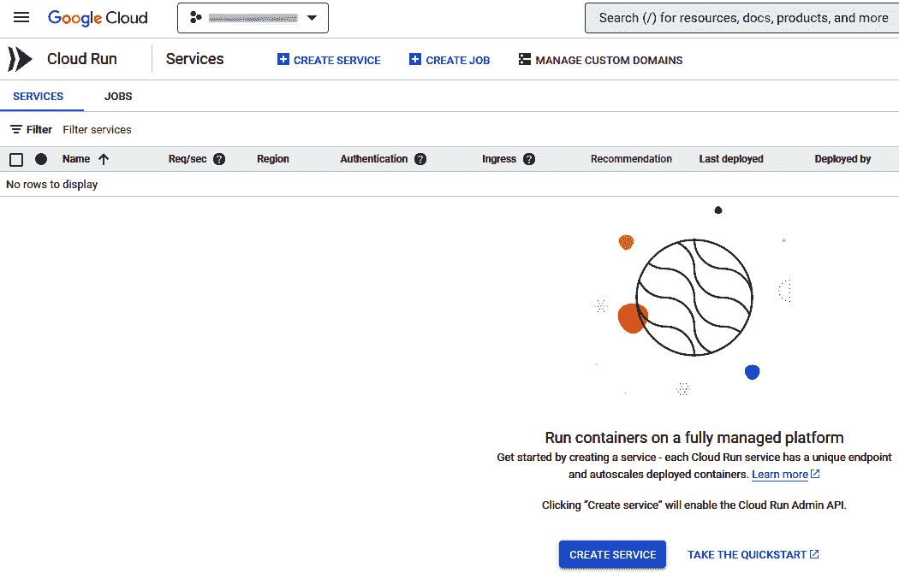

图 12.1 – GCP 控制台中的 Cloud Run 面板

1.  点击顶部菜单栏下方的 `+CREATE SERVICE`。你将看到一个像这样的界面：

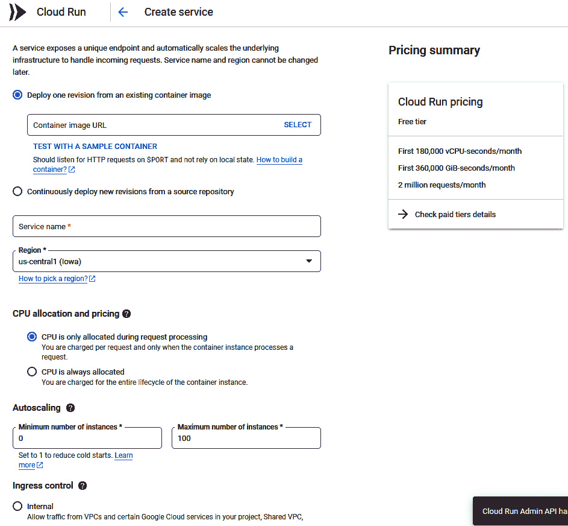

图 12.2 – 在 GCP 中创建 Cloud Run 服务以运行 Docker

我们将尽可能使用默认设置，以便创建一个基础的 Docker 环境来尝试我们的渗透测试工具。如果你打算使用 Docker 容器部署某种特定类型的应用，可能需要在 Cloud Run 中使用不同的设置。

为了简单起见，以下是我为我的 Docker 部署在 Cloud Run 中选择的选项：

+   在顶部提供的**从现有容器镜像部署一个版本**和**从源代码仓库持续部署新版本**选项中，我选择了第一个选项。

+   接下来，我没有输入容器镜像 URL，而是点击了**使用示例容器进行测试**。

在此页面，我点击了**容器注册表**选项卡，并选择了`hello`演示容器。然后，我点击了容器镜像 URL 旁的**选择**：

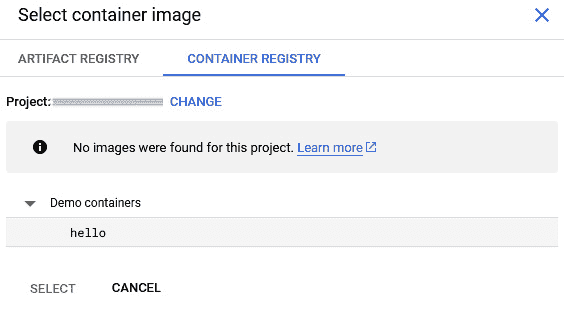

图 12.3 – 为我们的 Docker 实例选择 Docker 镜像

+   在**服务名称**字段中，我输入了`crawleydockertest`。我保留了我的默认区域，对于我来说是`us-central1 (lowa)`。你的默认区域可能不同。每个区域代表一个特定的 Google 数据中心，而且可能不在你的国家。

+   为了节省费用，在**CPU 分配和定价**下，我选择了**仅在请求处理期间分配 CPU**。

+   我没有更改**自动扩展**选项。默认情况下，`0` 是最小实例数，`100` 是最大实例数。这种设置反映了云应用的可扩展性。新实例可以根据应用的需求自动生成。

+   在**入口控制**下，我选择了**全部**，这将允许从互联网直接访问你的服务。

+   在**身份验证**下，我选择了**允许未经身份验证的调用**。这些选项可能不是最佳的网络安全实践，但它们使得在我们的 Docker 应用中尝试渗透测试工具变得更加简单。

1.  最后，我点击了底部的蓝色**创建**按钮。

    当服务创建完成时，你的网页控制台界面应该会像这样。对于我来说，创建过程大约花了 30 秒；我并没有等待很长时间：

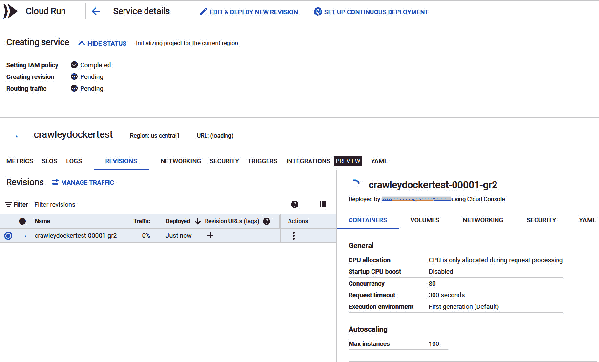

图 12.4 – 为我们的 Docker 实例创建服务

现在，我们的 Docker 环境已经在 GCP 中创建好了，接下来是创建 Kubernetes 环境！

## 部署 Kubernetes

在 Cloud Shell 或其他某些 CLI 中也可以部署 Kubernetes，但我更喜欢使用网页控制台来部署服务，使用 CLI 来进行渗透测试工具的操作。按照以下步骤部署 Kubernetes：

1.  在 GCP 的网页端登录并进入网页控制台后，访问[`console.cloud.google.com/projectselector2/home/dashboard`](https://console.cloud.google.com/projectselector2/home/dashboard)。

1.  目前，保持你刚刚打开的项目选择器网页标签不动。在另一个标签页中打开**启用 API 访问**，并使用此链接：[`console.cloud.google.com/flows/enableapi?apiid=artifactregistry.googleapis.com`](https://console.cloud.google.com/flows/enableapi?apiid=artifactregistry.googleapis.com,container.googleapis.com)。

    你会看到如下界面：

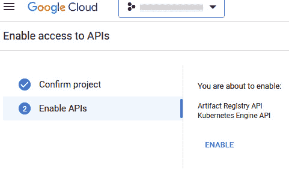

图 12.5 – 为 Kubernetes 启用所需的 API 访问

1.  点击**确认项目**。**启用 API**会过渡并显示你即将启用`Artifact Registry API`和`Kubernetes Engine API`。这正是我们要做的。点击**启用**。

1.  你可能需要等待几分钟才能完成 API 启用的处理。我很惊讶这比创建我的 Docker 测试容器还花了更多时间。但完成后，返回到带有项目选择器仪表板的网页标签。那应该看起来像这样：

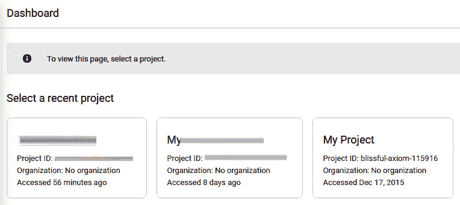

图 12.6 – 在 GCP 中为我们的 Kubernetes 实例选择一个项目

1.  点击一个项目。记下你的项目 ID；它应该类似于`blissful-axiom-115916`，如前面的截图所示。

1.  现在，我们将在 Cloud Shell 的 CLI 中完成剩下的工作。点击右上角菜单栏中看起来像这样图标：`>_`。

1.  首先，我们将确保我们选择的项目是默认项目，方法是在命令行中输入以下命令：

    ```
    gcloud config set project <your project ID goes here>
    ```

1.  接下来，我们将使用此命令创建一个默认的自动驾驶 Kubernetes 集群。如果你之前设置的区域不是`us-central1`，则将其更改为你的区域名称：

    ```
    gcloud container clusters create-auto hello-cluster \
        --location=us-central1
    ```

    如你在本练习的*Code in Action*视频中所见，创建集群可能需要几分钟时间。耐心等待！幸运的是，Cloud Shell 中的命令行会显示等待时的进展。

1.  在创建 Kubernetes 集群的几分钟过程完成后，你接下来需要为集群创建身份验证凭证。这将使`kubectl`（你在命令行中用来管理 Kubernetes 集群的程序）准备好使用你的新集群。只要确保如果你的区域名称与`us-central1`不同，请更改为你所在的区域名称：

    ```
    gcloud container clusters get-credentials hello-cluster \
       --location us-central1
    ```

1.  接下来，我们将使用以下命令在新的 Kubernetes 集群中创建应用程序部署。`image=`后面的目录路径是我们默认的`hello` Kubernetes 容器镜像，用于测试目的。如果你在读完本书后，想在 GCP 中使用 Kubernetes 做一些特定的操作，可以修改命令以使用不同的容器镜像：

    ```
    kubectl create deployment hello-server \
        --image=us-docker.pkg.dev/google-samples/containers/gke/hello-app:1.0
    ```

1.  现在，我们需要设置负载均衡器，以便将我们的部署暴露到互联网上。我们将通过互联网访问我们的 Kubernetes 部署以进行渗透测试，所以这一步是绝对必要的：

    ```
    kubectl expose deployment hello-server \
        --type LoadBalancer \
        --port 80 \
        --target-port 8080
    ```

1.  最后，我们需要运行一些检查，以确保我们的 Kubernetes 部署已经准备好使用。首先，让我们检查一下 Pods：

    ```
    kubectl get pods
    ```

    命令行应该显示一个`hello-server` Pod。

1.  现在，我们将检查`hello-server`：

    ```
    kubectl get service hello-server
    ```

1.  复制命令行上打印出的外部 IP。

1.  在新的 Web 浏览器标签页中，在地址栏输入`http://<your external IP here>`并按*Enter*。

1.  我访问 Kubernetes 部署的外部连接较慢，但最终还是成功了。在 Firefox 中，我收到了一个错误提示，警告我目标是 HTTP 而非 HTTPS。我点击了按钮，访问 HTTP 网站，屏幕上显示了这个内容。成功了！

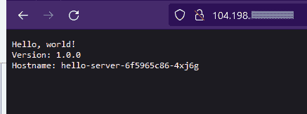

图 12.7 – 在 Web 浏览器中查看我们的 Kubernetes 部署的 IP 地址

现在我们在 GCP 中已经有了一个正常工作的 Docker 环境和 Kubernetes 环境，是时候利用这些环境来尝试一些渗透测试工具了。

## Trivy

Trivy ([`github.com/aquasecurity/trivy`](https://github.com/aquasecurity/trivy)) 是由 Aqua Security 开发的渗透测试工具，且可在 GitHub 上获取。它是一个安全扫描工具，可以在文件系统、虚拟机镜像和 AWS 中发现漏洞。同时，它也可以用来扫描 Docker 和 Kubernetes 镜像。

Trivy 可以在 Red Hat、CentOS、Arch Linux 和 macOS 上运行。所有支持平台的安装说明可以在此处找到：[`aquasecurity.github.io/trivy/v0.44/getting-started/installation/`](https://aquasecurity.github.io/trivy/v0.44/getting-started/installation/)。我在 GCP 部署的 Linux 虚拟机基于 Debian，因此我将使用 Debian 的安装说明：

```
wget https://github.com/aquasecurity/trivy/releases/download/v0.44.1/
trivy_0.44.1_Linux-64bit.deb
sudo dpkg -i trivy_0.44.1_Linux-64bit.deb
```

现在我们已经在 GCP 的 Linux 虚拟机上安装了 Trivy，让我们尝试几个基本的容器扫描练习。如果你想尝试其他的，Trivy 用户和开发者在他们的网站上提供了广泛的容器渗透测试教程 ([`aquasecurity.github.io/trivy/v0.45/tutorials/overview/`](https://aquasecurity.github.io/trivy/v0.45/tutorials/overview/))。

让我们尝试寻找我配置 Docker 镜像时的错误配置。记住——错误配置是可以被网络攻击者利用的安全漏洞！按照以下步骤操作：

1.  我使用了 GCP 的默认`hello`测试 Docker 镜像来构建我的 Docker 容器。这是它的名称和地址：

    ```
    us-docker.pkg.dev/cloudrun/container/hello
    ```

1.  你需要验证你使用的镜像的名称和地址。在你的 GCP 控制台中，搜索`Cloud Run`。然后你将看到如下画面：

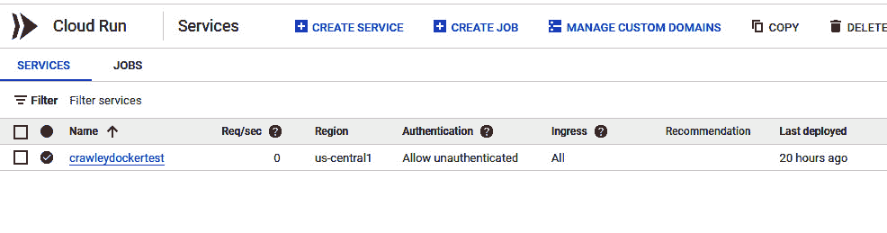

图 12.8 – 在 Cloud Run 界面查看我们的 Docker 实例

1.  我点击了我的 Docker 集群的名称，在我的案例中是`crawleydockertest`。

    然后，我点击了`YAML`选项卡，查看了用于构建我的 Docker 集群的 YAML 文件。在`image:`所在的位置，我找到了我使用的 Docker 镜像的名称和地址。你可以通过相同的方法找到你的镜像：

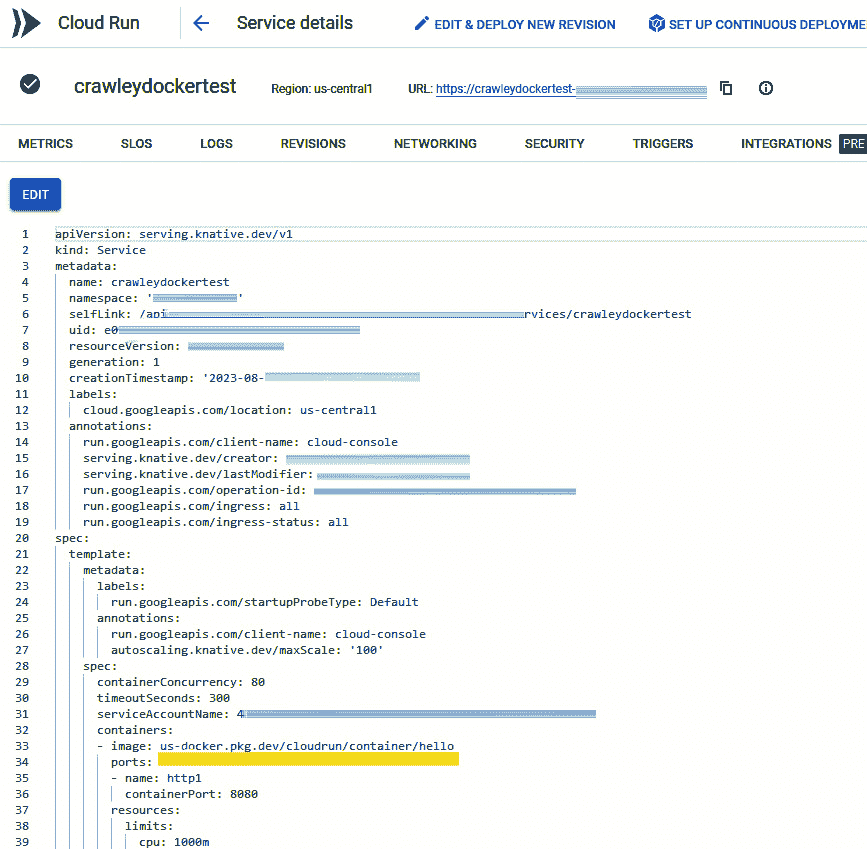

图 12.9 – 查看用于创建我的 Docker 集群的 YAML 文件

1.  现在，让我们运行扫描：

    ```
    trivy image --image-config-scanners config <insert image location and name here>
    ```

    我的 Docker 镜像找到了，而且配置非常错误！以下是我得到的结果：

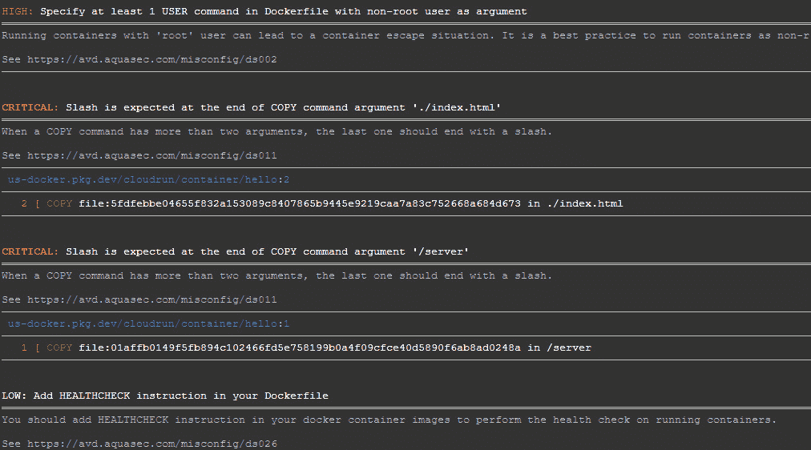

图 12.10 – Trivy 扫描输出

如果你正在进行实际的渗透测试，你可以在报告中使用这种类型的数据。

现在，让我们尝试使用 Trivy 对我在 GCP 中的 Kubernetes 集群进行渗透测试：

1.  首先，我发现我需要再次暴露我的 Kubernetes 集群，以便 Trivy 能够扫描它：

    ```
    kubectl expose deployment hello-server \
        --type LoadBalancer \
        --port 80 \
        --target-port 8080
    ```

1.  然后，我检查了 Pods：

    ```
    kubectl get pods
    ```

1.  现在，这里有一个 Trivy 命令，对我的 Kubernetes 集群进行了非常彻底的扫描：

    ```
    trivy k8s -n kube-system --report summary all –timeout 1500s
    ```

    在 Cloud Shell CLI 中等待了几分钟后，我得到了一个非常详细的总结，可以用于渗透测试报告中：

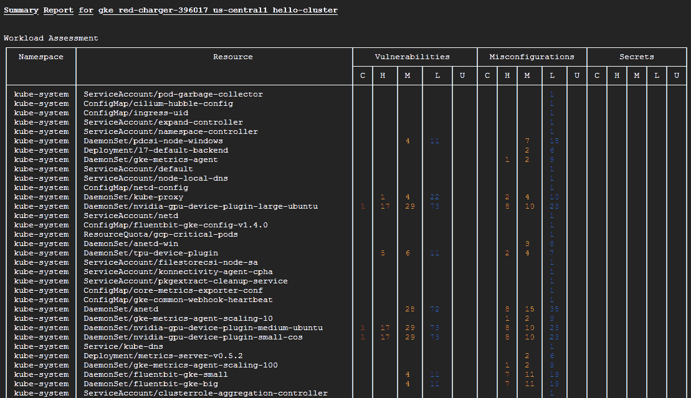

图 12.11 – Trivy 扫描漏洞报告

Trivy 非常有趣，值得探索！

# 总结

在本章中，我们了解了 GCP 中哪些服务负责容器化管理。我们部署了自己的 Docker 和 Kubernetes 集群。然后，我们使用 Trivy 进行了安全评估。

在 GCP 中部署 Docker 容器化系统的默认方式是使用 Cloud Build 简化 Docker 构建步骤，使用 Cloud Run 帮助运行容器化应用，同时 Docker 主机运行在 GCE 中。

在 GCP 中部署 Kubernetes 的最简单方式是使用 GKE。

Trivy 是一个第三方渗透测试应用，具有许多出色的功能，用于扫描 Docker 和 Kubernetes 部署的漏洞。

在接下来的最后一章，我将测试你对前 12 章所学内容的掌握情况。此外，我还会给你一些编写和签署渗透测试合同的技巧，更多的渗透测试报告写作建议，并向你介绍一些云计算和渗透测试相关的认证，这些认证可能会使你作为云渗透测试员更具竞争力。

# 深入阅读

要了解更多关于本章所涵盖的主题，你可以访问以下链接：

+   *Google Cloud* *Run*: [`cloud.google.com/run`](https://cloud.google.com/run)

)

+   *Google Cloud* *Build*： [`cloud.google.com/build`](https://cloud.google.com/build)

)

+   *GKE*: [`cloud.google.com/kubernetes-engine`](https://cloud.google.com/kubernetes-engine)

)

+   *Google Cloud 文档关于将容器部署到 Cloud* *Run*： [`cloud.google.com/run/docs/deploying`](https://cloud.google.com/run/docs/deploying)

)

+   *Google Cloud 文档：在* *GKE*中部署 Kubernetes 应用： [`cloud.google.com/kubernetes-engine/docs/deploy-app-cluster`](https://cloud.google.com/kubernetes-engine/docs/deploy-app-cluster)

)

+   *Trivy*：[`github.com/aquasecurity/trivy`](https://github.com/aquasecurity/trivy)
