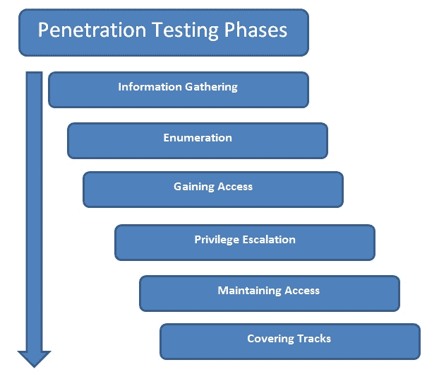

# 第一章：Metasploit 和支持工具的介绍

在我们深入了解 Metasploit 框架的各个方面之前，让我们首先打下一些绝对基础的基础。在本章中，我们将从概念上了解渗透测试的全部内容，以及 Metasploit 框架的确切位置。我们还将浏览一些增强 Metasploit 框架功能的附加工具。在本章中，我们将涵盖以下主题：

+   渗透测试的重要性

+   漏洞评估和渗透测试的区别

+   渗透测试框架的需求

+   Metasploit 的简要介绍

+   了解 Metasploit 在渗透测试的所有阶段中的适用性

+   介绍帮助扩展 Metasploit 功能的支持工具

# 渗透测试的重要性

十多年来，技术的使用呈指数级增长。几乎所有的企业部分或完全依赖于技术的使用。从比特币到云到物联网，每天都会出现新的技术。虽然这些技术完全改变了我们的做事方式，但它们也带来了威胁。攻击者发现了新的创新方式来操纵这些技术以获取乐趣和利润！这是全球数千家组织和企业关注的问题。全球组织深切关注保护其数据的安全。保护数据当然很重要，然而，测试是否已经采取了足够的保护机制同样重要。保护机制可能会失败，因此在有人真正利用它们之前对它们进行测试是一项具有挑战性的任务。话虽如此，漏洞评估和渗透测试已经变得非常重要，并且现在已经在所有合规程序中被包括进去。通过正确进行漏洞评估和渗透测试，组织可以确保已经建立了正确的安全控制，并且它们正在按预期运行！

# 漏洞评估与渗透测试

漏洞评估和渗透测试是两个经常可以互换使用的常见词汇。然而，了解两者之间的区别是很重要的。为了了解确切的区别，让我们考虑一个现实世界的场景：

一个小偷打算抢劫一所房子。为了执行他的抢劫计划，他决定侦察他的目标。他随意访问了他打算抢劫的房子，并试图评估那里有哪些安全措施。他注意到房子的后面有一个经常开着的窗户，很容易破门而入。在我们的术语中，小偷刚刚执行了漏洞评估。现在，几天后，小偷实际上再次去了那所房子，并通过他之前在侦察阶段发现的后面的窗户进入了房子。在这种情况下，小偷对他的目标房子进行了实际的渗透，目的是抢劫。

这正是我们在计算系统和网络的情况下可以相关的。人们可以首先对目标进行漏洞评估，以评估系统的整体弱点，然后再进行计划的渗透测试，以实际检查目标是否容易受攻击。如果不进行漏洞评估，就不可能计划和执行实际的渗透测试。

尽管大多数漏洞评估在性质上是非侵入性的，但如果渗透测试没有受到控制地进行，就可能对目标造成损害。根据特定的合规需求，一些组织选择仅进行漏洞评估，而其他组织则继续进行渗透测试。

# 渗透测试框架的需求

渗透测试不仅仅是针对目标运行一组自动化工具。这是一个涉及多个阶段的完整过程，每个阶段对项目的成功同样重要。现在，为了执行渗透测试的所有阶段中的所有任务，我们需要使用各种不同的工具，可能需要手动执行一些任务。然后，在最后，我们需要将来自许多不同工具的结果结合在一起，以生成一个有意义的报告。这肯定是一项艰巨的任务。如果一个单一的工具可以帮助我们执行渗透测试所需的所有任务，那将会非常简单和节省时间。Metasploit 这样的框架满足了这个需求。

# 介绍 Metasploit

Metasploit 的诞生可以追溯到 14 年前，2003 年，H.D Moore 用 Perl 编写了一个便携式网络工具。到 2007 年，它被重写为 Ruby。当 Rapid7 在 2009 年收购该项目时，Metasploit 项目获得了重大商业推动。Metasploit 本质上是一个强大而多功能的渗透测试框架。它可以在整个渗透测试生命周期中执行所有任务。使用 Metasploit，你真的不需要重新发明轮子！你只需要专注于核心目标；支持性的行动将通过框架的各个组件和模块执行。此外，由于它是一个完整的框架，而不仅仅是一个应用程序，它可以根据我们的需求进行定制和扩展。

毫无疑问，Metasploit 是一个非常强大的渗透测试工具。然而，它绝对不是一个可以帮助你入侵任何给定目标系统的魔术棒。了解 Metasploit 的能力是很重要的，这样在渗透测试期间可以最大限度地利用它。

虽然最初的 Metasploit 项目是开源的，但在被 Rapid7 收购后，商业级别的 Metasploit 版本也出现了。在本书的范围内，我们将使用*Metasploit 框架*版本。

你知道吗？Metasploit 框架有 3000 多个不同的模块可用于利用各种应用程序、产品和平台，这个数字还在不断增长。

# 何时使用 Metasploit？

有成吨的工具可用于执行与渗透测试相关的各种任务。然而，大多数工具只能执行一个独特的目的。与这些工具不同，Metasploit 是一个可以在整个渗透测试生命周期中执行多个任务的工具。在我们检查 Metasploit 在渗透测试中的确切用途之前，让我们简要概述一下渗透测试的各个阶段。以下图表显示了渗透测试生命周期的典型阶段：

渗透测试生命周期的阶段

1.  **信息收集**：尽管信息收集阶段可能看起来非常琐碎，但它是渗透测试项目成功的最重要阶段之一。你对目标了解得越多，你找到合适的漏洞和利用的机会就越大。因此，值得投入大量时间和精力收集有关范围内目标的尽可能多的信息。信息收集可以分为两种类型，如下所示：

+   **被动信息收集**：被动信息收集涉及通过公开可用的来源（如社交媒体和搜索引擎）收集有关目标的信息。不与目标直接接触。

+   **主动信息收集**：主动信息收集涉及使用专门的工具，如端口扫描器，以获取有关目标系统的信息。它涉及直接与目标系统进行联系，因此可能会被目标网络中的防火墙、IDS 或 IPS 注意到。

1.  **枚举**：使用主动和/或被动信息收集技术，可以初步了解目标系统/网络。进一步进行枚举，可以了解目标系统上运行的确切服务（包括类型和版本）以及其他信息，如用户、共享和 DNS 条目。枚举为我们试图渗透的目标准备了更清晰的蓝图。

1.  **获取访问**：基于我们从信息收集和枚举阶段获得的目标蓝图，现在是时候利用目标系统中的漏洞并获取访问权限了。获取对该目标系统的访问权限涉及利用早期阶段发现的一个或多个漏洞，并可能绕过目标系统中部署的安全控制（如防病毒软件、防火墙、IDS 和 IPS）。

1.  **权限提升**：经常情况下，在目标上利用漏洞只能获得对系统的有限访问。然而，我们希望完全获得对目标的根/管理员级别访问，以便充分利用我们的练习。可以使用各种技术来提升现有用户的权限。一旦成功，我们就可以完全控制具有最高权限的系统，并可能深入渗透到目标中。

1.  **保持访问**：到目前为止，我们已经付出了很多努力，以获得对目标系统的根/管理员级别访问。现在，如果目标系统的管理员重新启动系统会怎样？我们所有的努力将会白费。为了避免这种情况，我们需要为持久访问目标系统做好准备，以便目标系统的任何重新启动都不会影响我们的访问。

1.  **清除痕迹**：虽然我们已经努力利用漏洞、提升权限，并使我们的访问持久化，但我们的活动很可能已经触发了目标系统的安全系统的警报。事件响应团队可能已经在行动，追踪可能导致我们的所有证据。根据约定的渗透测试合同条款，我们需要清除在妥协期间上传到目标上的所有工具、漏洞和后门。

有趣的是，Metasploit 实际上在所有先前列出的渗透测试阶段中帮助我们。

以下表格列出了各种 Metasploit 组件和模块，可在渗透测试的所有阶段使用：

| **序号** | **渗透测试阶段** | **Metasploit 的使用** |
| --- | --- | --- |
| 1 | 信息收集 | `辅助模块：portscan/syn`, `portscan/tcp, smb_version`, `db_nmap`, `scanner/ftp/ftp_version`, 和 `gather/shodan_search` |
| 2 | 枚举 | `smb/smb_enumshares`, `smb/smb_enumusers`, 和 `smb/smb_login` |
| 3 | 获取访问 | 所有 Metasploit 漏洞利用和有效载荷 |
| 4 | 权限提升 | `meterpreter-use priv` 和 `meterpreter-getsystem` |
| 5 | 保持访问 | `meterpreter - run persistence` |
| 6 | 清除痕迹 | Metasploit 反取证项目 |

我们将在书中逐步涵盖所有先前的组件和模块。

# 使用补充工具使 Metasploit 更加有效和强大

到目前为止，我们已经看到 Metasploit 确实是一个强大的渗透测试框架。然而，如果与其他一些工具集成，它可以变得更加有用。本节介绍了一些补充 Metasploit 功能的工具。

# Nessus

Nessus 是 Tenable Network Security 的产品，是最受欢迎的漏洞评估工具之一。它属于漏洞扫描仪类别。它非常容易使用，并且可以快速发现目标系统中的基础架构级漏洞。一旦 Nessus 告诉我们目标系统上存在哪些漏洞，我们就可以将这些漏洞提供给 Metasploit，以查看它们是否可以被真正利用。

它的官方网站是[`www.tenable.com/`](https://www.tenable.com/)。以下图片显示了 Nessus 首页：

Nessus 用于启动漏洞评估的 Web 界面

以下是 Nessus 的不同基于操作系统的安装步骤：

+   **在 Windows 上安装**：

1.  转到 URL[`www.tenable.com/products/nessus/select-your-operating-system.`](https://www.tenable.com/products/nessus/select-your-operating-system)

1.  在 Microsoft Windows 类别下，选择适当的版本（32 位/64 位）。

1.  下载并安装`msi`文件。

1.  打开浏览器，转到 URL[`localhost:8834/.`](https://localhost:8834/)

1.  设置新的用户名和密码以访问 Nessus 控制台。

1.  要注册，请单击注册此扫描仪选项。

1.  访问[`www.tenable.com/products/nessus/nessus-plugins/obtain-an-activation-code`](http://www.tenable.com/products/nessus/nessus-plugins/obtain-an-activation-code)，选择 Nessus Home 并输入您的注册详细信息。

1.  输入您在电子邮件中收到的注册码。

+   **在 Linux 上安装（基于 Debian）：**

1.  转到 URL[`www.tenable.com/products/nessus/select-your-operating-system.`](https://www.tenable.com/products/nessus/select-your-operating-system)

1.  在 Linux 类别下，选择适当的版本（32 位/AMD64）。

1.  下载文件。

1.  打开终端并浏览到您下载安装程序（`.deb`）文件的文件夹。

1.  键入命令`dpkg -i <name_of_installer>.deb`。

1.  打开浏览器，转到 URL[`localhost:8834/.`](https://localhost:8834/)

1.  设置新的用户名和密码以访问 Nessus 控制台。

1.  要注册，请单击注册此扫描仪选项。

1.  访问[`www.tenable.com/products/nessus/nessus-plugins/obtain-an-activation-code`](http://www.tenable.com/products/nessus/nessus-plugins/obtain-an-activation-code)，选择 Nessus Home 并输入您的注册详细信息。

1.  输入您在电子邮件中收到的注册码。

# NMAP

NMAP（Network Mapper 的缩写）是用于网络信息收集的事实标准工具。它属于信息收集和枚举类别。乍一看，它可能看起来很小，很简单。但是，它是如此全面，以至于可以专门撰写一本完整的书来介绍如何根据我们的要求调整和配置 NMAP。NMAP 可以快速概述目标网络中所有开放的端口和正在运行的服务。这些信息可以提供给 Metasploit 进行进一步操作。虽然本书不涵盖 NMAP 的详细讨论，但我们将在后面的章节中涵盖 NMAP 的所有重要方面。

它的官方网站是[`nmap.org/.`](https://nmap.org/)以下屏幕截图显示了 NMAP 扫描的示例：

使用命令行界面进行 NMAP 扫描的示例

尽管访问 NMAP 的最常见方式是通过命令行，但 NMAP 也有一个名为 Zenmap 的图形界面，它是 NMAP 引擎上的简化界面，如下所示：

NMAP 的 Zenmap 图形用户界面（GUI）

以下是 NMAP 的不同基于操作系统的安装步骤：

+   **在 Windows 上安装：**

1.  转到网站[`nmap.org/download.html.`](https://nmap.org/download.html)

1.  在 Microsoft Windows Binaries 部分，选择最新版本（.exe）文件。

1.  安装下载的文件以及 WinPCAP（如果尚未安装）。

WinPCAP 是一个程序，运行诸如 NMAP、Nessus 和 Wireshark 之类的工具时需要它。它包含一组库，允许其他应用程序捕获和传输网络数据包。

+   **在 Linux 上（基于 Debian）的安装：** NMAP 默认安装在 Kali Linux 上；但是，如果没有安装，可以使用以下命令进行安装：

`root@kali:~#apt-get install nmap`

# w3af

w3af 是一个开源的 Web 应用程序安全扫描工具。它属于 Web 应用程序安全扫描器类别。它可以快速扫描目标 Web 应用程序，查找常见的 Web 应用程序漏洞，包括 OWASP 前 10 名。w3af 还可以有效地与 Metasploit 集成，使其更加强大。

它的官方网站是[`w3af.org/.`](http://w3af.org/) 我们可以在以下图片中看到 w3af 控制台用于扫描 Web 应用程序漏洞：

w3af 控制台用于扫描 Web 应用程序漏洞

以下是 w3af 的基于各种操作系统的安装步骤：

+   **在 Windows 上安装：** w3af 不适用于 Windows 平台

+   **在 Linux 上（基于 Debian）的安装：** w3af 默认安装在 Kali Linux 上；但是，如果没有安装，可以使用以下命令进行安装：

`root@kali:~# apt-get install w3af`

# Armitage

Armitage 是一个利用自动化框架，它在后台使用 Metasploit。它属于利用自动化类别。它提供了一个易于使用的用户界面，用于在网络中查找主机、扫描、枚举、查找漏洞，并利用 Metasploit 的漏洞和有效载荷对它们进行利用。我们将在本书的后面详细介绍 Armitage。

它的官方网站是[`www.fastandeasyhacking.com/index.html.`](http://www.fastandeasyhacking.com/index.html) [我们可以在以下截图中看到 Armitage 控制台用于利用自动化：](http://w3af.org/)

Armitage 控制台用于利用自动化。

以下是 Armitage 的基于各种操作系统的安装步骤：

+   **在 Windows 上安装：** Armitage 不支持 Windows

+   **在 Linux 上（基于 Debian）的安装：** Armitage 默认安装在 Kali Linux 上；但是，如果没有安装，可以使用以下命令进行安装：

`root@kali:~# apt-get install armitage`

要设置和运行 Armitage，需要 PostgreSQL、Metasploit 和 Java。但是，这些已经安装在 Kali Linux 系统上。

# 总结

现在我们已经对 Metasploit 的概述有了一个高层次的了解，它在渗透测试中的适用性以及支持工具，我们将在下一章中浏览 Metasploit 的安装和环境设置。

# 练习

您可以尝试以下练习：

+   访问 Metasploit 的官方网站，尝试了解各个版本的 Metasploit 之间的区别

+   尝试探索更多关于 Nessus 和 NMAP 如何在渗透测试中帮助我们的信息。
