# 第四章：使用 Metasploit 进行信息收集

信息收集和枚举是渗透测试生命周期的初始阶段。这些阶段经常被忽视，人们直接使用自动化工具试图快速妥协目标。然而，这样的尝试成功的可能性较小。

“给我六个小时砍倒一棵树，我将花前四个小时磨削斧头。”

- 亚伯拉罕·林肯

这是亚伯拉罕·林肯的一句非常著名的名言，它也适用于渗透测试！您对目标进行信息收集和枚举的努力越多，成功妥协的可能性就越大。通过进行全面的信息收集和枚举，您将获得关于目标的大量信息，然后您可以精确地决定攻击向量，以便妥协目标。

Metasploit 框架提供了各种辅助模块，用于进行被动和主动信息收集以及详细的枚举。本章介绍了 Metasploit 框架中提供的一些重要信息收集和枚举模块：

要涵盖的主题如下：

+   各种协议的信息收集和枚举

+   使用 Metasploit 进行密码嗅探

+   使用 Shodan 进行高级搜索

# 信息收集和枚举

在本节中，我们将探讨 Metasploit 框架中各种辅助模块，这些模块可以有效地用于信息收集和枚举各种协议，如 TCP、UDP、FTP、SMB、SMTP、HTTP、SSH、DNS 和 RDP。对于这些协议，您将学习多个辅助模块以及必要的变量配置。

# 传输控制协议

**传输控制协议**（**TCP**）是一种面向连接的协议，可以确保可靠的数据包传输。许多服务，如 Telnet、SSH、FTP 和 SMTP，都使用 TCP 协议。该模块对目标系统执行简单的端口扫描，并告诉我们哪些 TCP 端口是打开的。

它的辅助模块名称是`auxiliary/scanner/portscan/tcp`，您将需要配置以下参数：

+   **RHOSTS**：要扫描的目标的 IP 地址或 IP 范围

+   **PORTS**：要扫描的端口范围

我们可以在以下截图中看到这个辅助模块：

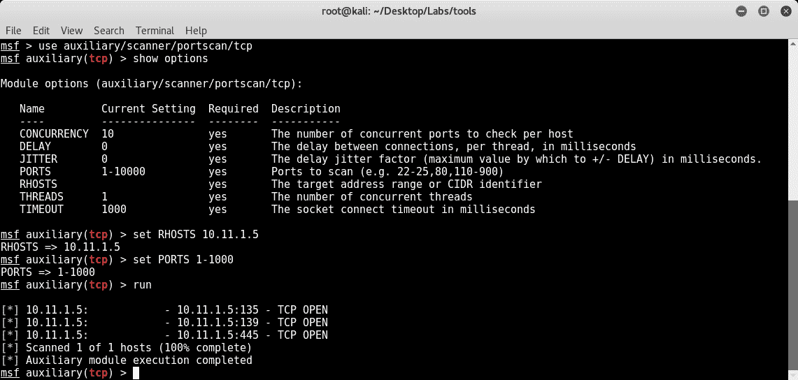

# 用户数据报协议

**用户数据报协议**（**UDP**）与 TCP 相比更轻量，但不像 TCP 那样可靠。UDP 被 SNMP 和 DNS 等服务使用。该模块对目标系统执行简单的端口扫描，并告诉我们哪些 UDP 端口是打开的。

它的辅助模块名称是`auxiliary/scanner/discovery/udp_sweep`，您将需要配置以下参数：

+   **RHOSTS**：要扫描的目标的 IP 地址或 IP 范围

我们可以在以下截图中看到这个辅助模块：

# 文件传输协议

**文件传输协议**（**FTP**）最常用于客户端和服务器之间的文件共享。FTP 使用 TCP 端口 21 进行通信。

让我们来看看以下 FTP 辅助模块：

+   `ftp_login`：该模块帮助我们对目标 FTP 服务器执行暴力攻击。

它的辅助模块名称是`auxiliary/scanner/ftp/ftp_login`，您将需要配置以下参数：

+   +   **RHOSTS**：要扫描的目标的 IP 地址或 IP 范围

+   **USERPASS_FILE**：包含用户名/密码列表的文件路径

您可以创建自己的自定义列表，用于暴力攻击，或者在 Kali Linux 中有许多立即可用的单词列表，位于`|usr|share|wordlists`。

我们可以在以下截图中看到这个辅助模块：

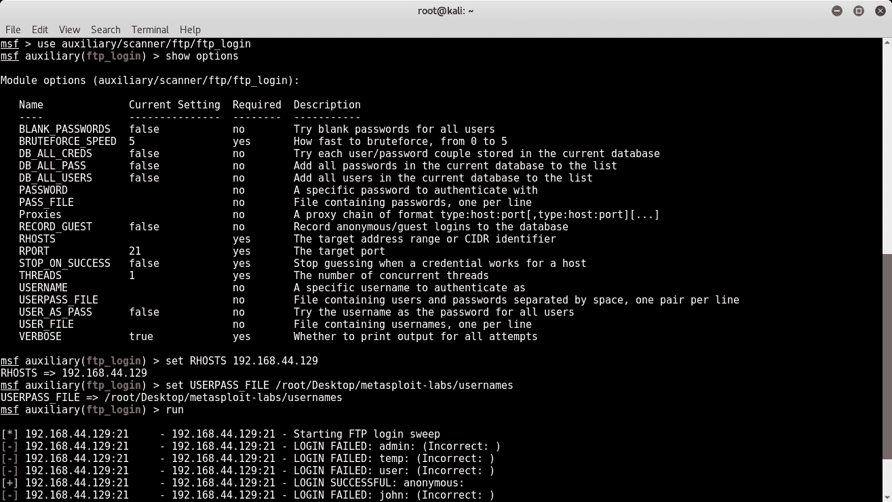

+   `ftp_version`：该模块使用横幅抓取技术来检测目标 FTP 服务器的版本。

它的辅助模块名称是`auxiliary/scanner/ftp/ftp_version`，您将需要配置以下参数：

+   **RHOSTS**：目标要扫描的 IP 地址或 IP 范围

一旦您知道目标服务的版本，您可以开始搜索特定版本的漏洞和相应的利用。

我们可以在以下截图中看到这个辅助模块：

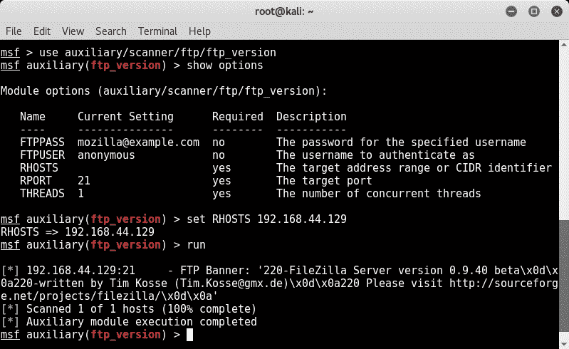

+   **anonymous**：一些 FTP 服务器配置错误，允许匿名用户访问。这个辅助模块探测目标 FTP 服务器，以检查它是否允许匿名访问。

它的辅助模块名称是`auxiliary/scanner/ftp/anonymous`，您将需要配置以下参数：

+   +   **RHOSTS**：目标要扫描的 IP 地址或 IP 范围

我们可以在以下截图中看到这个辅助模块：

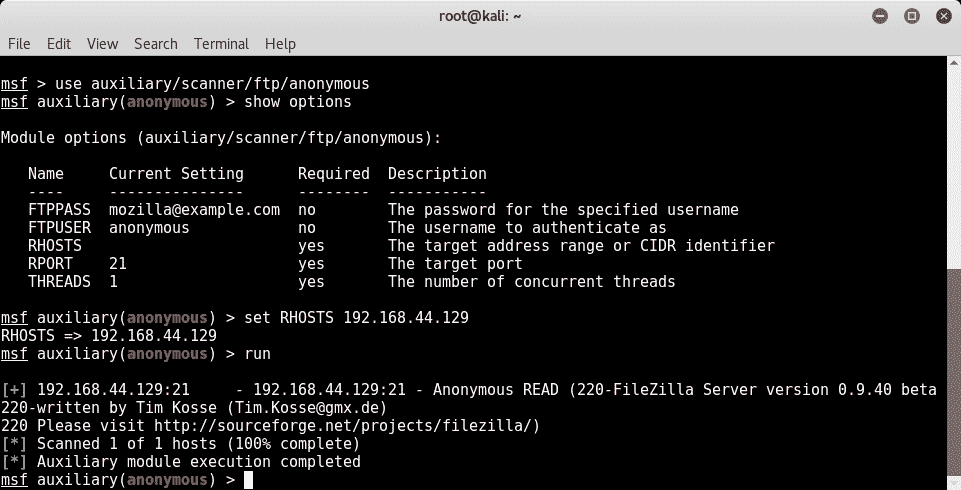

# 服务器消息块

**服务器消息块**（**SMB**）是一个主要用于共享文件、打印机等的应用层协议。SMB 使用 TCP 端口 445 进行通信。

让我们来看一些以下 SMB 辅助功能：

+   ：这个辅助模块探测目标以检查它运行的 SMB 版本。

它的辅助模块名称是`auxiliary/scanner/smb/smb_version`，您将需要配置以下参数：

+   +   **RHOSTS**：目标要扫描的 IP 地址或 IP 范围

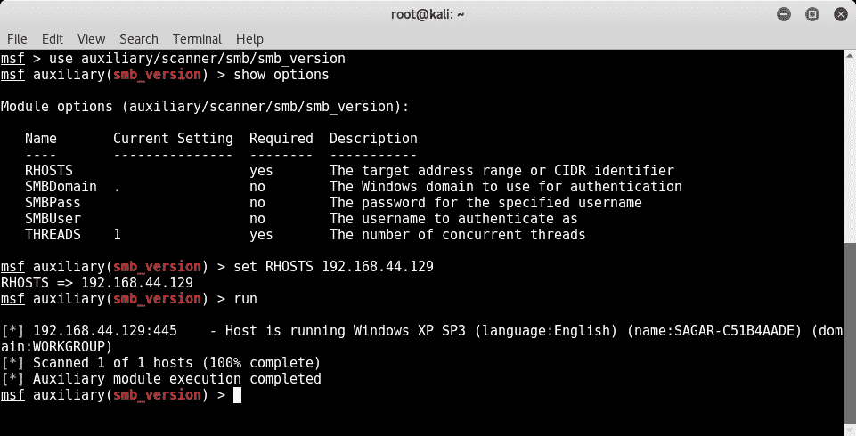

+   `smb_enumusers`：这个辅助模块通过 SMB RPC 服务连接到目标系统，并枚举系统上的用户。

它的辅助模块名称是`auxiliary/scanner/smb/smb_enumusers`，您将需要配置以下参数：

+   +   **RHOSTS**：目标要扫描的 IP 地址或 IP 范围

一旦您获得了目标系统上的用户列表，您可以开始准备对这些用户进行密码破解攻击。

我们可以在以下截图中看到这个辅助模块：

+   `smb_enumshares`：这个辅助模块枚举了目标系统上可用的 SMB 共享。

它的辅助模块名称是`auxiliary/scanner/smb/smb_enumshares`，您将需要配置以下参数：

+   +   **RHOSTS**：目标要扫描的 IP 地址或 IP 范围

我们可以在以下截图中看到这个辅助模块：

# 超文本传输协议

HTTP 是一个用于在万维网上交换信息的无状态应用层协议。HTTP 使用 TCP 端口`80`进行通信。

让我们来看一些以下 HTTP 辅助功能：

+   `http_version`：这个辅助模块探测并检索目标系统上运行的 Web 服务器版本。它还可能提供有关目标正在运行的操作系统和 Web 框架的信息。

它的辅助模块名称是`auxiliary/scanner/http/http_version`，您将需要配置以下参数：

+   +   **RHOSTS**：目标要扫描的 IP 地址或 IP 范围

我们可以在以下截图中看到这个辅助模块：

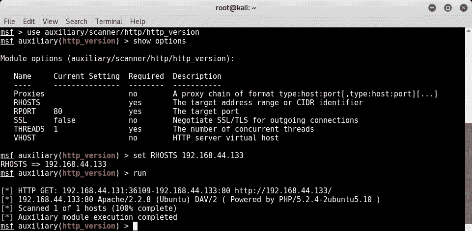

+   `backup_file`：有时，开发人员和应用程序管理员会忘记从 Web 服务器中删除备份文件。这个辅助模块探测目标 Web 服务器是否存在这样的文件，因为管理员可能会忘记删除它们。这些文件可能会提供有关目标系统的额外详细信息，并有助于进一步的妥协。

它的辅助模块名称是`auxiliary/scanner/http/backup_file`，您将需要配置以下参数：

+   +   **RHOSTS**：目标要扫描的 IP 地址或 IP 范围

我们可以在以下截图中看到这个辅助模块：

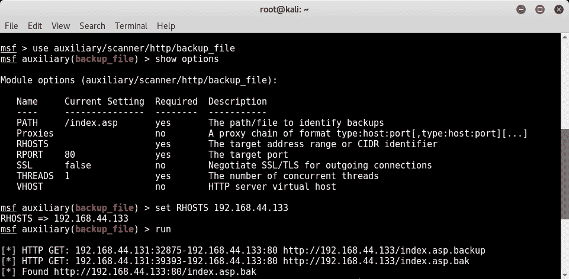

+   `dir_listing`：经常出现的情况是 Web 服务器被错误配置为显示根目录中包含的文件列表。该目录可能包含通常不通过网站链接公开的文件，并泄露敏感信息。此辅助模块检查目标 Web 服务器是否容易受到目录列表的影响。

其辅助模块名称为`auxiliary/scanner/http/dir_listing`，您将需要配置以下参数：

+   +   目标的 IP 地址或 IP 范围

+   **PATH**：检查目录列表的可能路径

我们可以在以下截图中看到这个辅助模块：

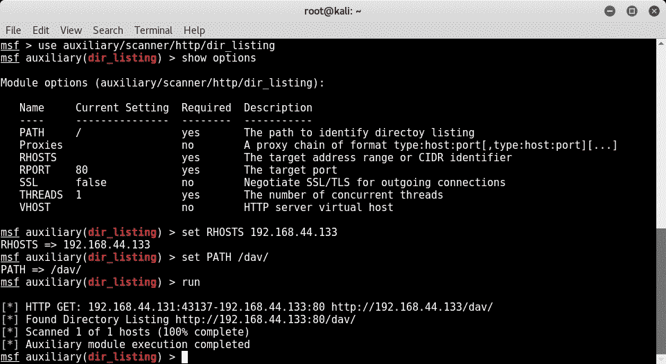

+   `ssl`：虽然 SSL 证书通常用于加密传输中的数据，但经常发现它们要么配置错误，要么使用弱加密算法。此辅助模块检查目标系统上安装的 SSL 证书可能存在的弱点。

其辅助模块名称为`auxiliary/scanner/http/ssl`，您将需要配置以下参数：

+   +   目标的 IP 地址或 IP 范围

我们可以在以下截图中看到这个辅助模块：

+   `http_header`：大多数 Web 服务器没有经过安全加固。这导致 HTTP 头泄露服务器和操作系统版本的详细信息。此辅助模块检查目标 Web 服务器是否通过 HTTP 头提供任何版本信息。

其辅助模块名称为`auxiliary/scanner/http/http_header`，您将需要配置以下参数：

+   +   目标的 IP 地址或 IP 范围

我们可以在以下截图中看到这个辅助模块：

+   `robots_txt`：大多数搜索引擎通过蜘蛛和爬行网站并索引页面的机器人工作。然而，特定网站的管理员可能不希望他的网站的某个部分被任何搜索机器人爬行。在这种情况下，他使用`robots.txt`文件告诉搜索机器人在爬行时排除站点的某些部分。此辅助模块探测目标以检查`robots.txt`文件的存在。该文件通常会显示目标系统上存在的敏感文件和文件夹列表。

其辅助模块名称为`auxiliary/scanner/http/robots_txt`，您将需要配置以下参数：

+   +   目标的 IP 地址或 IP 范围

我们可以在以下截图中看到这个辅助模块：

# 简单邮件传输协议

SMTP 用于发送和接收电子邮件。SMTP 使用 TCP 端口 25 进行通信。此辅助模块探测目标系统上的 SMTP 服务器版本，并列出配置为使用 SMTP 服务的用户。

其辅助模块名称为`auxiliary/scanner/smtp/smtp_enum`，您将需要配置以下参数：

+   目标的 IP 地址或 IP 范围

+   **USER_FILE**：包含用户名列表的文件路径

我们可以在以下截图中看到这个辅助模块：

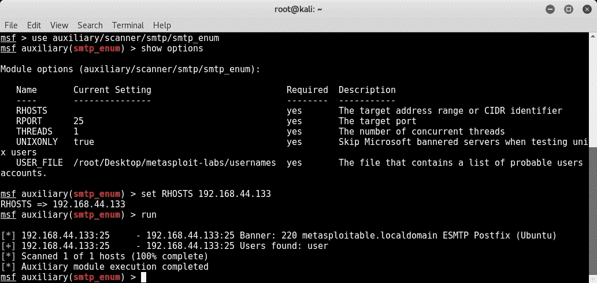

# 安全外壳

SSH 通常用于加密通道上的远程管理。SSH 使用 TCP 端口 22 进行通信。

让我们看一些 SSH 辅助模块：

+   `ssh_enumusers`：此辅助模块探测目标系统上的 SSH 服务器，以获取远程系统上配置为使用 SSH 服务的用户列表。

其辅助模块名称为`auxiliary/scanner/ssh/ssh_enumusers`，您将需要配置以下参数：

+   +   目标的 IP 地址或 IP 范围

+   **USER_FILE**：包含用户名列表的文件路径

我们可以在以下截图中看到这个辅助模块：

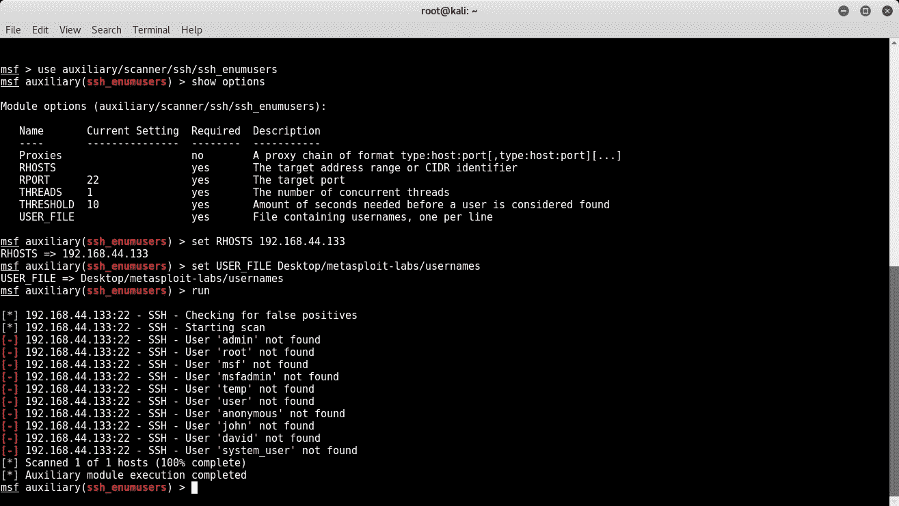

+   `ssh_login`：这个辅助模块对目标 SSH 服务器执行暴力破解攻击。

它的辅助模块名称是`auxiliary/scanner/ssh/ssh_login`，您将需要配置以下参数：

+   +   **RHOSTS**：目标的 IP 地址或 IP 范围

+   **USERPASS_FILE**：包含用户名和密码列表的文件路径

我们可以在以下截图中看到这个辅助模块：

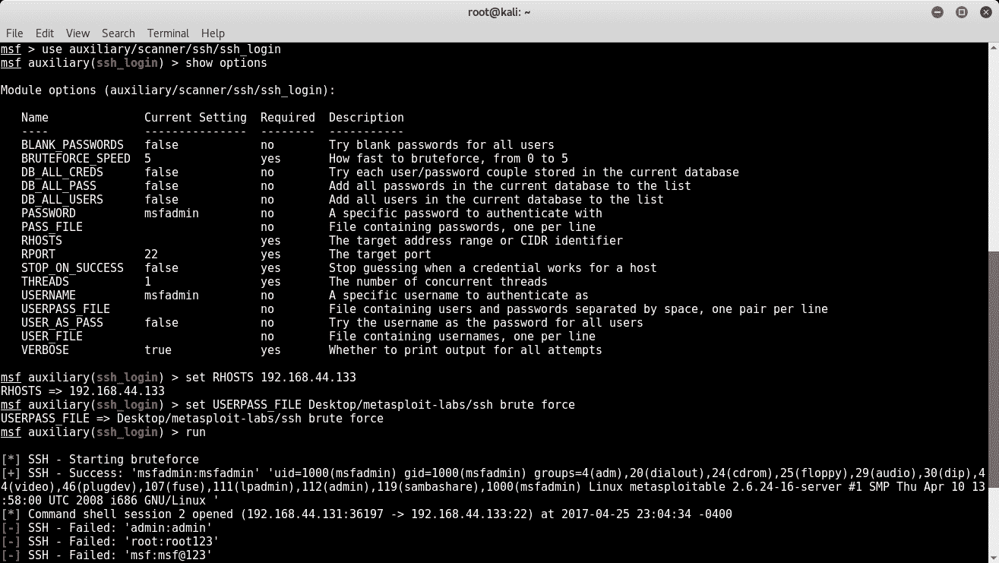

+   `ssh_version`：这个辅助模块探测目标 SSH 服务器，以便检测其版本以及底层操作系统的版本。

它的辅助模块名称是`auxiliary/scanner/ssh/ssh_version`，您将需要配置以下参数：

+   +   **RHOSTS**：目标的 IP 地址或 IP 范围

我们可以在以下截图中看到这个辅助模块：

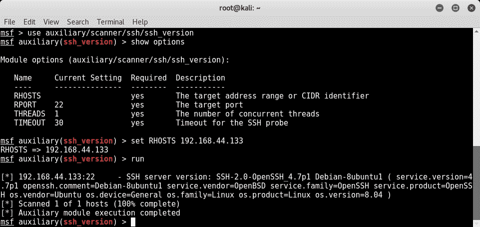

+   `detect_kippo`：Kippo 是一个基于 SSH 的蜜罐，专门设计用来诱捕潜在的攻击者。这个辅助模块探测目标 SSH 服务器，以便检测它是一个真正的 SSH 服务器还是一个 Kippo 蜜罐。如果目标被检测到在运行 Kippo 蜜罐，那么进一步妥协它就没有意义了。

它的辅助模块名称是`auxiliary/scanner/ssh/detect_kippo`，您将需要配置以下参数：

+   +   **RHOSTS**：目标的 IP 地址或 IP 范围

我们可以在以下截图中看到这个辅助模块：

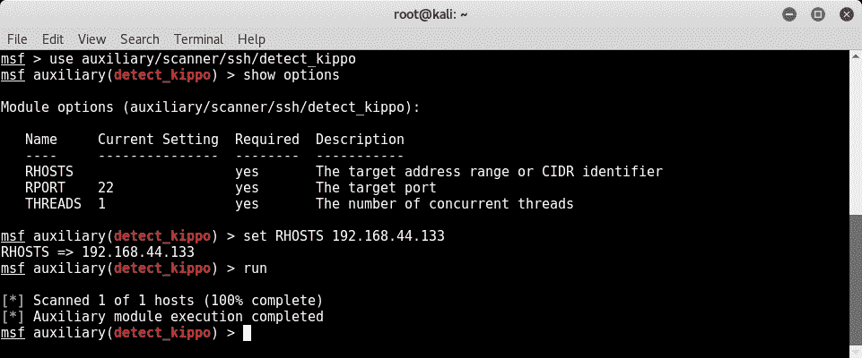

# 域名系统

**域名系统**（**DNS**）负责将主机名转换为相应的 IP 地址。DNS 通常在 UDP 端口 53 上工作，但也可以在 TCP 上运行。这个辅助模块可以用来从目标 DNS 服务器提取名称服务器和邮件记录信息。

它的辅助模块名称是`auxiliary/gather/dns_info`，您将需要配置以下参数：

+   **DOMAIN**：要扫描的目标域名

我们可以在以下截图中看到这个辅助模块：

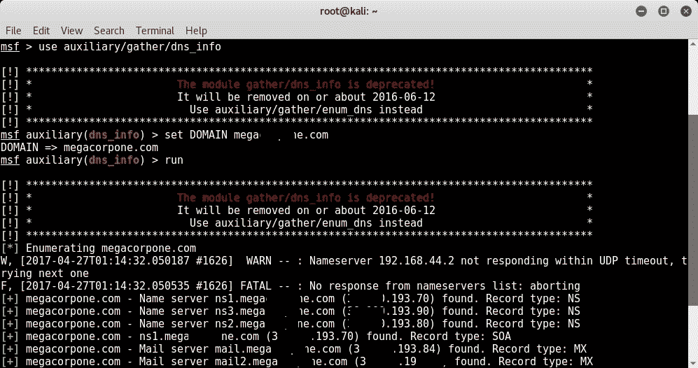

# 远程桌面协议

**远程桌面协议**（**RDP**）用于远程连接到 Windows 系统。RDP 使用 TCP 端口 3389 进行通信。这个辅助模块检查目标系统是否对 MS12-020 漏洞存在漏洞。MS12-020 是 Windows 远程桌面的一个漏洞，允许攻击者远程执行任意代码。有关 MS12-020 漏洞的更多信息可以在[`technet.microsoft.com/en-us/library/security/ms12-020.aspx`](https://technet.microsoft.com/en-us/library/security/ms12-020.aspx)找到。

它的辅助模块名称是`auxiliary/scanner/rdp/ms12_020`，您将需要配置以下参数：

+   **RHOSTS**：目标的 IP 地址或 IP 范围

我们可以在以下截图中看到这个辅助模块：

# 密码嗅探

密码嗅探是一种特殊类型的辅助模块，它监听网络接口，查找通过各种协议发送的密码，如 FTP、IMAP、POP3 和 SMB。它还提供了一个选项，可以导入以前转储的以`.pcap`格式的网络流量，并在其中查找凭据。

它的辅助模块名称是`auxiliary/sniffer/psnuffle`，可以在以下截图中看到：

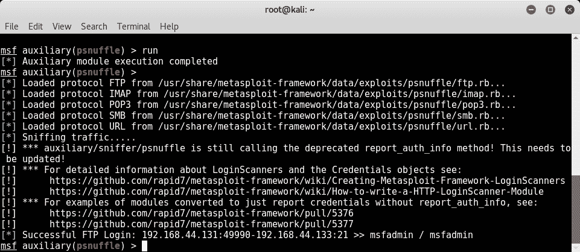

# 使用 Shodan 进行高级搜索

Shodan 是一个高级搜索引擎，用于搜索互联网连接的设备，如网络摄像头和 SCADA 系统。它还可以有效地用于搜索易受攻击的系统。有趣的是，Metasploit 框架可以与 Shodan 集成，直接从 msfconsole 发出搜索查询。

为了将 Shodan 与 Metasploit Framework 集成，您首先需要在[`www.shodan.io`](https://www.shodan.io)上注册。注册后，您可以从以下显示的“账户概述”部分获取 API 密钥：

其辅助模块名称是`auxiliary/gather/shodan_search`，该辅助模块连接到 Shodan 搜索引擎，从`msfconsole`发出搜索查询并获取搜索结果。

您将需要配置以下参数：

+   **SHODAN_APIKEY**：注册 Shodan 用户可用的 Shodan API 密钥

+   **QUERY**：要搜索的关键词

您可以运行`shodan_search`命令来获得以下结果：

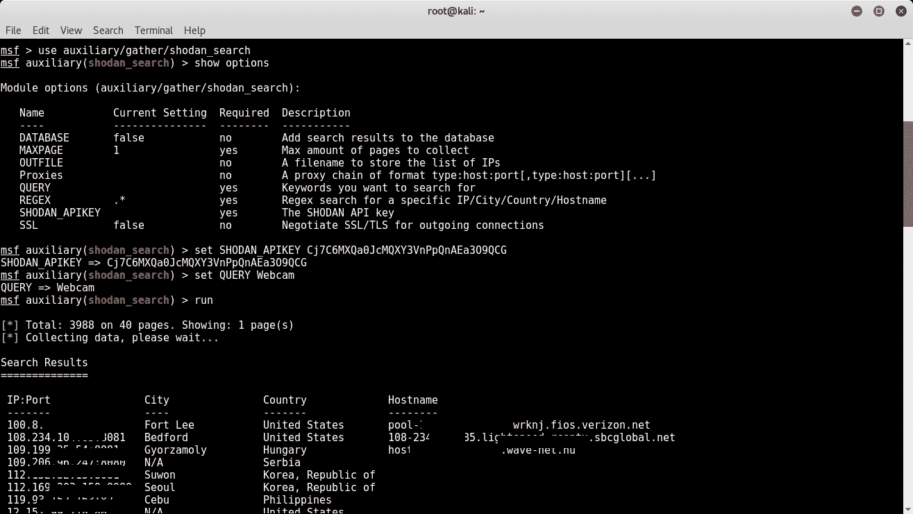

# 总结

在本章中，我们已经看到了如何使用 Metasploit Framework 中的各种辅助模块进行信息收集和枚举。在下一章中，我们将学习如何对目标系统进行详细的漏洞评估。

# 练习

您可以尝试以下练习：

+   除了本章讨论的辅助模块外，尝试探索和执行以下辅助模块：

+   `auxiliary/scanner/http/ssl_version`

+   `auxiliary/scanner/ssl/openssl_heartbleed`

+   `auxiliary/scanner/snmp/snmp_enum`

+   `auxiliary/scanner/snmp/snmp_enumshares`

+   `auxiliary/scanner/snmp/snmp_enumusers`

+   使用 Shodan 辅助模块查找各种互联网连接设备
