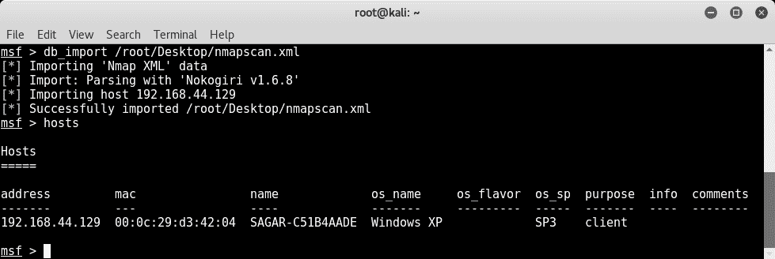
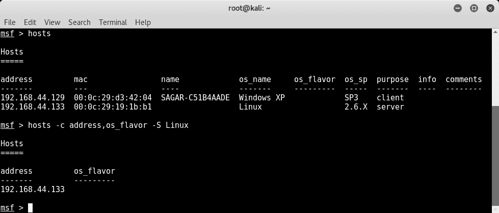
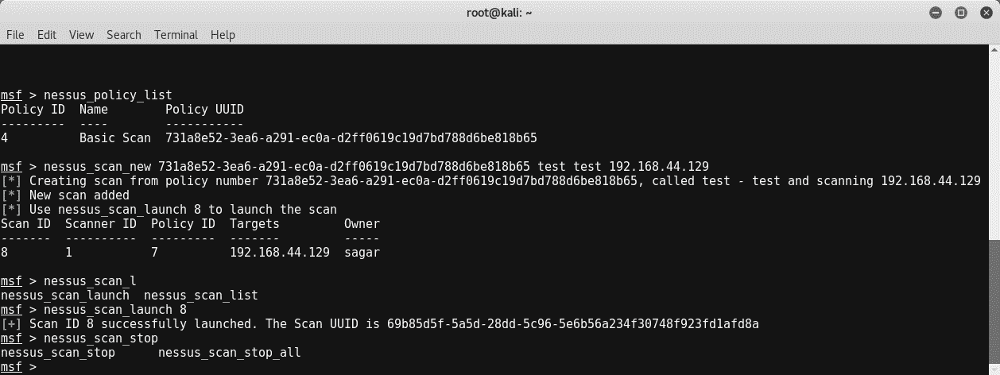
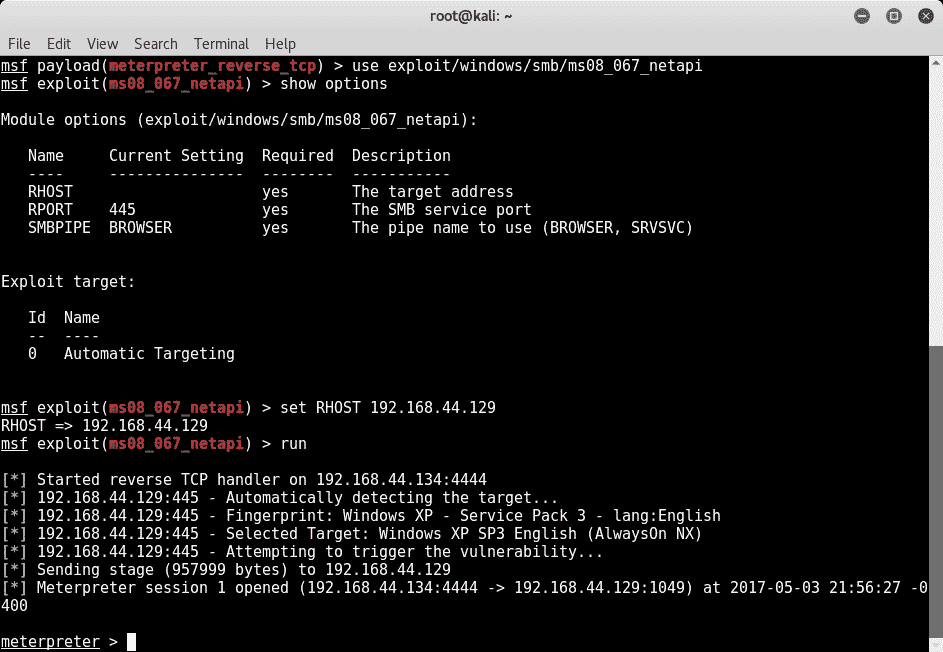
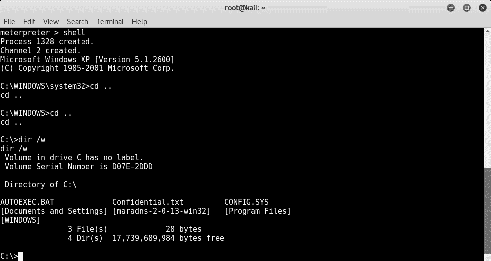

# 第五章：使用 Metasploit 进行漏洞搜索

在上一章中，您学习了各种信息收集和枚举技术。现在我们已经收集了有关目标系统的信息，是时候检查目标系统是否存在漏洞，以及我们是否可以在现实中利用它了。在本章中，我们将涵盖以下主题：

+   设置 Metasploit 数据库

+   漏洞扫描和利用

+   在 Metasploit 内执行 NMAP 和 Nessus 扫描

+   使用 Metasploit 辅助工具进行漏洞检测

+   使用`db_autopwn`进行自动利用

+   探索 Metasploit 的后渗透能力

# 管理数据库

到目前为止，我们已经看到，Metasploit Framework 是各种工具、实用程序和脚本的紧密集合，可用于执行复杂的渗透测试任务。在执行此类任务时，以某种形式生成了大量数据。从框架的角度来看，安全地存储所有数据以便在需要时有效地重用是至关重要的。默认情况下，Metasploit Framework 使用后端的 PostgreSQL 数据库来存储和检索所有所需的信息。

现在我们将看到如何与数据库交互执行一些琐碎的任务，并确保数据库在开始渗透测试活动之前已正确设置。

对于初始设置，我们将使用以下命令设置数据库：

```
root@kali :~# service postgresql start
```

这个命令将在 Kali Linux 上启动 PostgreSQL 数据库服务。在使用`msfconsole`命令之前，这是必要的：

```
root@kali :~# msfdb init 
```

这个命令将启动 Metasploit Framework 数据库实例，这是一次性的活动：


`db_status`：一旦我们启动了 PostgreSQL 服务并初始化了`msfdb`，我们就可以开始使用`msfconsole`：

```
msf> db_status
```

`db_status`命令将告诉我们后端数据库是否已成功初始化并与`msfconsole`连接：


# 工作空间

假设您同时为不同客户的多个渗透测试任务工作。您肯定不希望来自不同客户的数据混在一起。理想的方式是为每个任务创建逻辑隔间来存储数据。Metasploit Framework 中的工作空间帮助我们实现这一目标。

以下表格显示了与管理工作空间相关的一些常用命令：

| **Sr. no.** | **Command** | **Purpose** |
| --- | --- | --- |
| 1. | `workspace` | 这将列出在 Metasploit Framework 中先前创建的所有工作空间 |
| 2. | `workspace -h` | 这将列出与`workspace`命令相关的所有开关的帮助信息 |
| 3. | `workspace -a <name>` | 这将创建一个具有指定`name`的新工作空间 |
| 4. | `workspace -d <name>` | 这将删除指定的工作空间 |
| 5. | `workspace <name>` | 这将切换工作空间的上下文到指定的名称 |

以下截图显示了`workspace`命令与各种开关的用法：


# 导入扫描

我们已经知道 Metasploit Framework 有多么多才多艺，以及它与其他工具的良好集成。Metasploit Framework 提供了一个非常有用的功能，可以从其他工具（如 NMAP 和 Nessus）导入扫描结果。如下截图所示，`db_import`命令可用于将扫描导入 Metasploit Framework：



+   `hosts`命令：我们很可能已经对整个子网进行了 NMAP 扫描，并将扫描结果导入了 Metasploit Framework 数据库。现在，我们需要检查在扫描期间发现了哪些主机是活动的。如下截图所示，`hosts`命令列出了在扫描和导入期间发现的所有主机：



+   `services`命令：一旦 NMAP 扫描结果被导入数据库，我们可以查询数据库，过滤出我们可能感兴趣的服务。`services`命令带有适当的参数，如下截图所示，查询数据库并过滤服务：


# 备份数据库

想象一下，您在使用 Metasploit 框架进行复杂的渗透测试任务上工作了很长时间。现在，由于某种不幸的原因，您的 Metasploit 实例崩溃了，无法启动。如果需要从头开始在新的 Metasploit 实例上重新工作，那将是非常痛苦的！这就是 Metasploit 框架中备份选项发挥作用的地方。`db_export`命令，如下截图所示，将数据库中的所有数据导出到外部 XML 文件中。

然后，您可以将导出的 XML 文件安全地保存起来，以防以后需要恢复数据：


# NMAP

NMAP，即网络映射器的缩写，是一个非常先进的工具，可用于以下目的：

+   主机发现

+   服务检测

+   版本枚举

+   漏洞扫描

+   防火墙测试和规避

NMAP 是一个有数百个参数可配置的工具，完全覆盖它超出了本书的范围。然而，以下表格将帮助您了解一些最常用的 NMAP 开关：

| **序号** | **NMAP 开关** | **目的** |
| --- | --- | --- |
| 1. | `-sT` | 执行连接（TCP）扫描 |
| 2. | `-sU` | 执行扫描以检测开放的 UDP 端口 |
| 3. | `-sP` | 执行简单的 ping 扫描 |
| 4. | `-A` | 执行侵略性扫描（包括隐秘 syn 扫描和 OS 和版本检测加上路由跟踪和脚本） |
| 5. | `-sV` | 执行服务版本检测 |
| 6. | `-v` | 打印详细输出 |
| 7. | `-p 1-1000` | 仅扫描 1 到 1000 范围内的端口 |
| 8. | `-O` | 执行操作系统检测 |
| 9. | `-iL <filename>` | 从指定的`<filename>`文件中扫描所有主机 |
| 10. | `-oX` | 以 XML 格式输出扫描结果 |
| 11. | `-oG` | 以可 grep 格式输出扫描结果 |
| 12. | `--script <script_name>` | 对目标执行指定的脚本 `<script_name>` |

例如：`nmap -sT -sV -O 192.168.44.129 -oX /root/Desktop/scan.xml`。

上述命令将在 IP 地址`192.168.44.129`上执行连接扫描，检测所有服务的版本，识别目标正在运行的操作系统，并将结果保存到路径`/root/Desktop/scan.xml`的 XML 文件中。

# NMAP 扫描方法

我们已经在前一节中看到，Metasploit 框架提供了从 NMAP 和 Nessus 等工具导入扫描的功能。然而，还有一个选项可以从 Metasploit 框架内启动 NMAP 扫描。这将立即将扫描结果存储在后端数据库中。

然而，这两种方法之间并没有太大的区别，只是个人选择的问题。

+   从`msfconsole`扫描：`db_nmap`命令，如下截图所示，从 Metasploit 框架内启动 NMAP 扫描。扫描完成后，您可以简单地使用`hosts`命令列出扫描的目标。


# Nessus

Nessus 是一个流行的漏洞评估工具，我们在第一章中已经见过了，*Metasploit 和支持工具简介*。现在，有两种使用 Nessus 与 Metasploit 的替代方法，如下所示：

+   对目标系统执行 Nessus 扫描，保存报告，然后使用`db_import`命令将其导入 Metasploit 框架，如本章前面讨论的那样

+   加载、启动并触发目标系统上的 Nessus 扫描，直接通过`msfconsole`描述在下一节中

# 使用 msfconsole 从 Nessus 进行扫描

在使用 Nessus 开始新的扫描之前，重要的是在`msfconsole`中加载 Nessus 插件。加载插件后，可以使用一对凭据连接到您的 Nessus 实例，如下一张截图所示。

在`msfconsole`中加载`nessus`之前，请确保使用`/etc/init.d/nessusd start`命令启动 Nessus 守护程序。


一旦加载了`nessus`插件，并且我们连接到了`nessus`服务，我们需要选择要使用哪个策略来扫描我们的目标系统。可以使用以下命令执行此操作：

```
msf> nessus_policy_list -
msf> nessus_scan_new <Policy_UUID>
msf> nessus_scan_launch <Scan ID>
```

您也可以在以下截图中看到这一点：



一段时间后，扫描完成，可以使用以下命令查看扫描结果：

```
msf> nessus_report_vulns <Scan ID>
```

您也可以在以下截图中看到这一点：


# 使用 Metasploit 辅助模块进行漏洞检测

在上一章中，我们已经看到了各种辅助模块。Metasploit 框架中的一些辅助模块也可以用于检测特定的漏洞。例如，以下截图显示了用于检查目标系统是否容易受到 MS12-020 RDP 漏洞影响的辅助模块：


# 使用 db_autopwn 进行自动利用

在上一节中，我们已经看到了 Metasploit 框架如何帮助我们从其他各种工具（如 NMAP 和 Nessus）导入扫描结果。现在，一旦我们将扫描结果导入数据库，下一个逻辑步骤将是查找与导入扫描的漏洞/端口匹配的利用。我们当然可以手动执行此操作；例如，如果我们的目标是 Windows XP，并且它打开了 TCP 端口 445，那么我们可以尝试针对其执行`MS08_67 netapi`漏洞。

Metasploit 框架提供了一个名为`db_autopwn`的脚本，它自动化了利用匹配过程，如果找到匹配项，则执行适当的利用，并给我们远程 shell。但是，在尝试此脚本之前，需要考虑以下几点：

+   `db_autopwn`脚本已经正式从 Metasploit 框架中弃用。您需要明确下载并将其添加到您的 Metasploit 实例中。

+   这是一个非常资源密集的脚本，因为它尝试针对目标的所有漏洞的排列和组合，因此会产生很多噪音。

+   这个脚本不再建议用于针对任何生产系统的专业使用；但是，从学习的角度来看，您可以在实验室中针对任何测试机器运行它。

以下是开始使用`db_autopwn`脚本的步骤：

1.  打开一个终端窗口，并运行以下命令：

```
wget https://raw.githubusercontent.com
/jeffbryner/kinectasploit/master/db_autopwn.rb
```

1.  将下载的文件复制到`/usr/share/metasploit-framework/plugins`目录中。

1.  重新启动`msfconsole`。

1.  在`msfconsole`中，输入以下代码：

```
msf> use db_autopwn
```

1.  使用以下命令列出匹配的利用：

```
msf> db_autopwn -p -t
```

1.  使用以下命令利用匹配的利用：

```
 msf> db_autopwn -p -t -e
```

# 后渗透

后渗透是渗透测试中的一个阶段，在这个阶段我们已经对目标系统有了有限（或完全）的访问权限，现在，我们想要搜索特定的文件、文件夹，转储用户凭据，远程捕获屏幕截图，从远程系统中转储按键，提升权限（如果需要），并尝试使我们的访问持久化。在本节中，我们将学习 meterpreter，它是一个以其功能丰富的后渗透能力而闻名的高级有效载荷。

# 什么是 meterpreter？

Meterpreter 是一个高级的可扩展有效载荷，它使用*内存* DLL 注入。它显著增加了 Metasploit 框架的后渗透能力。通过在分段套接字上通信，它提供了一个广泛的客户端端 Ruby API。Meterpreter 的一些显着特点如下：

+   **隐秘**：Meterpreter 完全驻留在受损系统的内存中，并且不会向磁盘写入任何内容。它不会产生任何新进程；它会将自身注入到受损进程中。它有能力轻松迁移到其他运行的进程。默认情况下，Meterpreter 通过加密通道进行通信。这在法医角度上对受损系统留下了有限的痕迹。

+   **可扩展**：功能可以在运行时添加，并直接通过网络加载。新功能可以添加到 Meterpreter 而无需重新构建它。`meterpreter`有效载荷运行无缝且非常快速。

下面的截图显示了我们通过利用我们的 Windows XP 目标系统上的`ms08_067_netapi`漏洞获得的`meterpreter`会话。

在使用漏洞之前，我们需要通过发出`use payload/windows/meterpreter/reverse_tcp`命令来配置 meterpreter 有效载荷，然后设置 LHOST 变量的值。



# 搜索内容

一旦我们攻破了目标系统，我们可能想要寻找特定的文件和文件夹。这完全取决于渗透测试的上下文和意图。meterpreter 提供了一个搜索选项，可以在受损的系统上查找文件和文件夹。下面的截图显示了一个搜索查询，寻找位于 C 驱动器上的机密文本文件：


# 屏幕截图

成功攻破后，我们可能想知道在受损系统上运行的活动和任务。拍摄屏幕截图可能会给我们一些有趣的信息，了解我们的受害者在那个特定时刻在做什么。为了远程捕获受损系统的屏幕截图，我们执行以下步骤：

1.  使用`ps`命令列出目标系统上运行的所有进程以及它们的 PID。

1.  定位`explorer.exe`进程，并记下其 PID。

1.  将 meterpreter 迁移到`explorer.exe`进程，如下截图所示：


一旦我们将 meterpreter 迁移到`explorer.exe`，我们加载`espia`插件，然后执行`screengrab`命令，如下截图所示：


我们的受损系统的屏幕截图已保存（如下所示），我们可以注意到受害者正在与 FileZilla Server 进行交互：


# 按键记录

除了屏幕截图，另一个非常有用的 meterpreter 功能是键盘记录。meterpreter 按键记录器将捕获在受损系统上按下的所有按键，并将结果转储到我们的控制台上。使用`keyscan_start`命令在受损系统上启动远程键盘记录，而使用`keyscan_dump`命令将所有捕获的按键转储到 Metasploit 控制台上：


# 转储哈希并使用 JTR 破解

Windows 将用户凭据以加密格式存储在其 SAM 数据库中。一旦我们已经攻破了目标系统，我们就想获取该系统上的所有凭据。如下截图所示，我们可以使用`post/windows/gather/hashdump`辅助模块从远程受损系统中转储密码哈希：


一旦我们有了凭据的转储，下一步就是破解它们并检索明文密码。Metasploit Framework 有一个辅助模块`auxiliary/analyze/jtr_crack_fast`，可以触发对转储哈希的密码破解。

完成后，模块会显示明文密码，如下截图所示：

**jtr**是**John the Ripper**的缩写，是最常用的密码破解工具。

# Shell 命令

一旦我们成功利用了漏洞并获得了 meterpreter 访问，我们可以使用`shell`命令来获得对受损系统的命令提示符访问（如下截图所示）。命令提示符访问会让您感觉自己就像在物理上操作目标系统一样：



# 特权提升

我们可以利用漏洞并获得远程 meterpreter 访问，但很可能我们在受损系统上的权限受到限制。为了确保我们对受损系统拥有完全访问和控制权，我们需要将特权提升到管理员级别。meterpreter 提供了提升特权的功能，如下截图所示。首先，我们加载一个名为`priv`的扩展，然后使用`getsystem`命令来提升特权。

然后，我们可以使用`getuid`命令验证我们的特权级别：


# 摘要

在本章中，您学习了如何设置 Metasploit 数据库，然后探索了使用 NMAP 和 Nessus 进行漏洞扫描的各种技术。我们最后了解了 Metasploit Framework 的高级后渗透功能。在下一章中，我们将学习 Metasploit Framework 的有趣的客户端利用功能。

# 练习

您可以尝试以下练习：

+   找出并尝试使用任何可用于漏洞检测的辅助模块

+   尝试探索 meterpreter 的各种功能，而不是本章讨论的那些功能

+   尝试找出是否有替代`db_autopwn`
