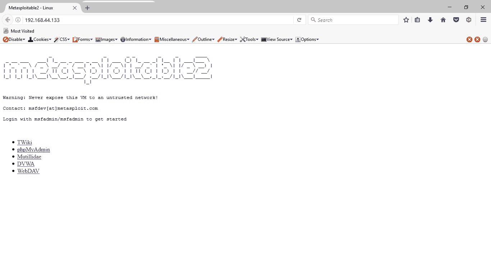
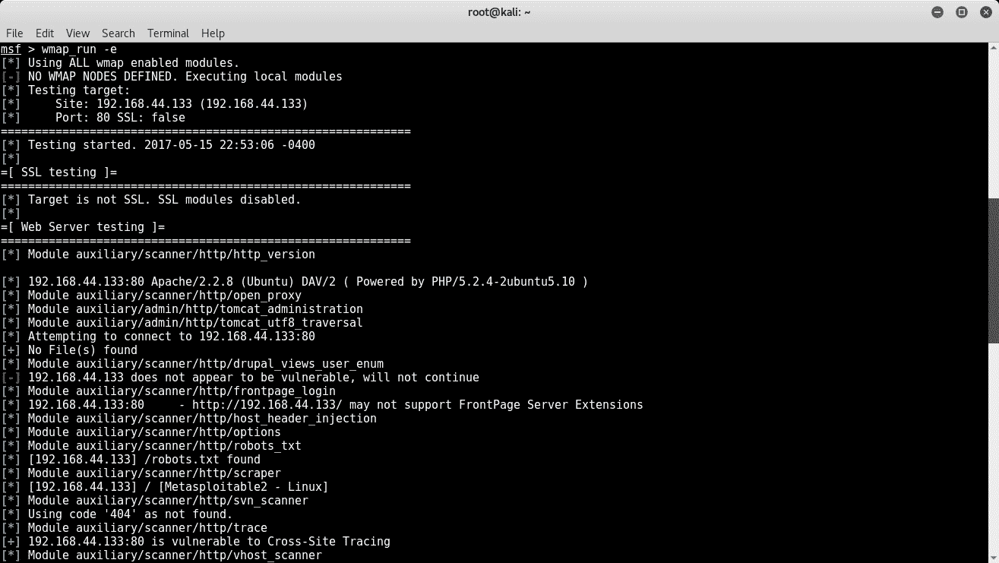
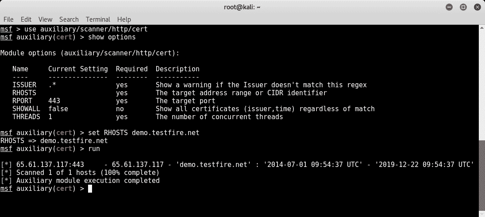
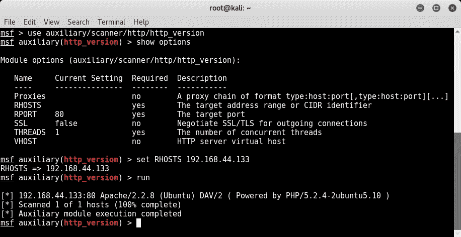

# 第七章：使用 Metasploit 进行 Web 应用程序扫描

在上一章中，我们概述了如何使用 Metasploit 来发动欺骗性的客户端攻击。在本章中，您将学习 Metasploit Framework 的各种功能，用于发现 Web 应用程序中的漏洞。在本章中，我们将涵盖以下主题：

+   设置易受攻击的 Web 应用程序

+   使用 WMAP 进行 Web 应用程序漏洞扫描

+   用于 Web 应用程序枚举和扫描的 Metasploit 辅助模块

# 设置易受攻击的应用程序

在我们开始探索 Metasploit Framework 提供的各种 Web 应用程序扫描功能之前，我们需要建立一个测试应用程序环境，以便进行测试。正如在前几章中讨论的那样，*Metasploitable 2*是一个故意制造漏洞的 Linux 发行版。它还包含了故意制造漏洞的 Web 应用程序，我们可以利用这一点来练习使用 Metasploit 的 Web 扫描模块。

为了使易受攻击的测试应用程序运行起来，只需启动`metasploitable 2`；Linux，并从任何 Web 浏览器远程访问它，如下面的截图所示：

在 metasploitable 2 分发版上默认运行两个不同的易受攻击的应用程序，Mutillidae 和**Damn Vulnerable Web Application**（**DVWA**）。易受攻击的应用程序可以进一步进行测试，如下面的截图所示：

# 使用 WMAP 进行 Web 应用程序扫描

WMAP 是 Kali Linux 中可用的强大的 Web 应用程序漏洞扫描器。它以插件的形式集成到 Metasploit Framework 中。为了使用 WMAP，我们首先需要在 Metasploit 框架中加载和初始化插件，如下面的截图所示：

一旦`wmap`插件加载到 Metasploit Framework 中，下一步是为我们的扫描创建一个新站点或工作空间。站点创建后，我们需要添加要扫描的目标 URL，如下面的截图所示：

现在我们已经创建了一个新站点并定义了我们的目标，我们需要检查哪些 WMAP 模块适用于我们的目标。例如，如果我们的目标没有启用 SSL，则对此运行 SSL 相关测试就没有意义。这可以使用`wmap_run -t`命令来完成，如下面的截图所示：

现在我们已经枚举了适用于对我们易受攻击的应用程序进行测试的模块，我们可以继续进行实际的测试执行。这可以通过使用`wmap_run -e`命令来完成，如下面的截图所示：

在我们的目标应用程序上成功执行测试后，发现的漏洞（如果有）将存储在 Metasploit 的内部数据库中。然后可以使用`wmap_vulns -l`命令列出漏洞，如下面的截图所示：

# 使用 Metasploit 的 Web 应用程序枚举和扫描辅助模块

在第四章*使用 Metasploit 进行信息收集*中，我们已经看到了 Metasploit Framework 中用于枚举 HTTP 服务的一些辅助模块。接下来，我们将探索一些其他可以有效用于枚举和扫描 Web 应用程序的辅助模块：

+   **cert**：此模块可用于枚举目标 Web 应用程序上的证书是否有效或已过期。其辅助模块名称为`auxiliary/scanner/http/cert`，其使用方法如下截图所示：

需要配置的参数如下：

+   **RHOSTS:** 要扫描的目标的 IP 地址或 IP 范围

还可以通过指定包含目标 IP 地址列表的文件，同时在多个目标上运行模块，例如，设置 RHOSTS `/root/targets.lst`。

+   `dir_scanner`：该模块检查目标 Web 服务器上各种目录的存在。这些目录可能会透露一些有趣的信息，如配置文件和数据库备份。其辅助模块名称为`auxiliary/scanner/http/dir_scanner`，如下截图所示：

要配置的参数如下：

+   **RHOSTS**：要扫描的目标的 IP 地址或 IP 范围

+   `enum_wayback`：[`www.archive.org`](http://www.archive.org) 存储了任何给定网站的所有历史版本和数据。它就像一个时光机，可以展示多年前特定网站的样子。这对于目标枚举可能很有用。`enum_wayback`模块查询[`www.archive.org`](http://www.archive.org)，以获取目标网站的历史版本。

其辅助模块名称为`auxiliary/scanner/http/enum_wayback`，如下截图所示：

要配置的参数如下：

+   **RHOSTS**：要查询其存档的目标域名

+   `files_dir`：该模块搜索目标，查找可能无意中留在 Web 服务器上的任何文件。这些文件包括源代码、备份文件、配置文件、存档和密码文件。其辅助模块名称为`auxiliary/scanner/http/files_dir`，以下截图显示了如何使用它：

要配置的参数如下：

+   **RHOSTS**：要扫描的目标的 IP 地址或 IP 范围

+   `http_login`：如果目标系统启用了基于 HTTP 的身份验证，该模块尝试暴力破解。它使用 Metasploit Framework 中提供的默认用户名和密码字典。其辅助模块名称为`auxiliary/scanner/http/http_login`，以下截图显示了如何使用它：

要配置的参数如下：

+   **RHOSTS**：要扫描的目标的 IP 地址或 IP 范围

+   `options`**:** 该模块检查目标 Web 服务器上是否启用了各种`HTTP`方法，如`TRACE`和`HEAD`。这些方法通常是不必要的，攻击者可以利用它们来策划攻击向量。其辅助模块名称为`auxiliary/scanner/http/options`，以下截图显示了如何使用它：

要配置的参数如下：

+   **RHOSTS**：要扫描的目标的 IP 地址或 IP 范围

+   `http_version`**:** 该模块枚举目标并返回 Web 服务器和底层操作系统的确切版本。然后可以使用版本信息启动特定攻击。其辅助模块名称为`auxiliary/scanner/http/http_version`，以下截图显示了如何使用它：

要配置的参数如下：

+   **RHOSTS**：要扫描的目标的 IP 地址或 IP 范围

# 总结

在本章中，我们探讨了 Metasploit Framework 的各种功能，可用于 Web 应用程序安全扫描。在前往下一章之前，您将学习各种技术，可用于将我们的有效负载隐藏在防病毒程序中，并在入侵系统后清除我们的痕迹。

# 练习

查找并利用以下易受攻击的应用程序中的漏洞：

+   DVWA

+   Mutillidae

+   OWASP Webgoat
