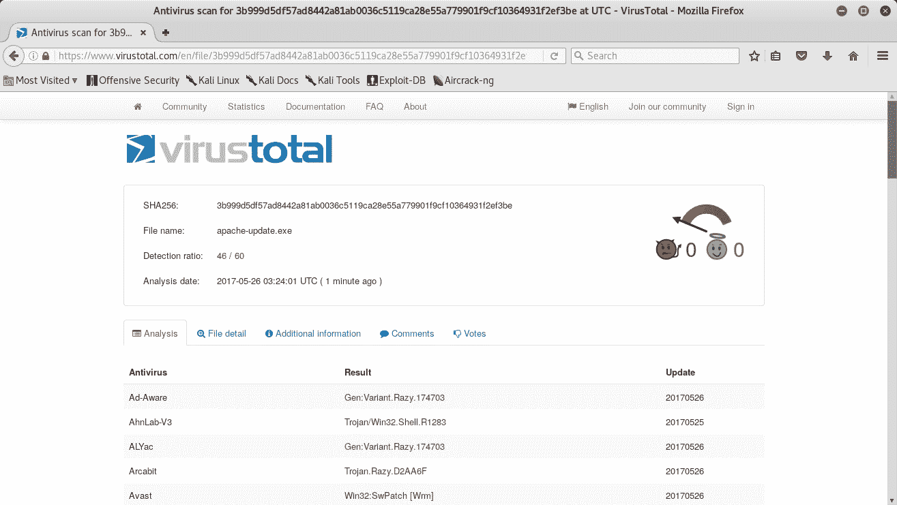
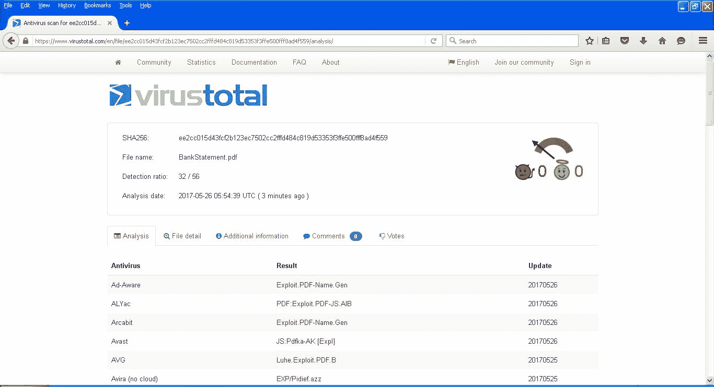
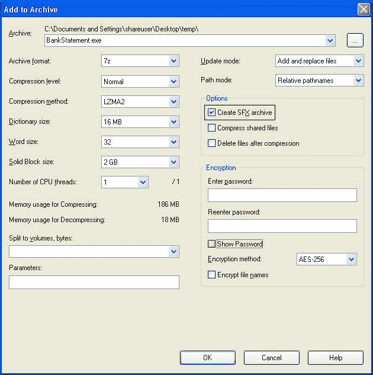
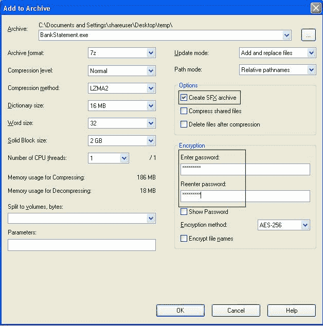
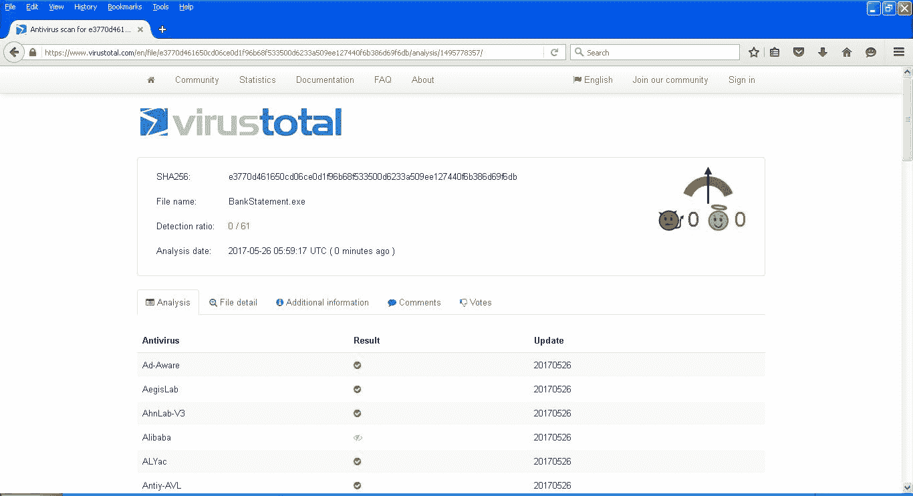
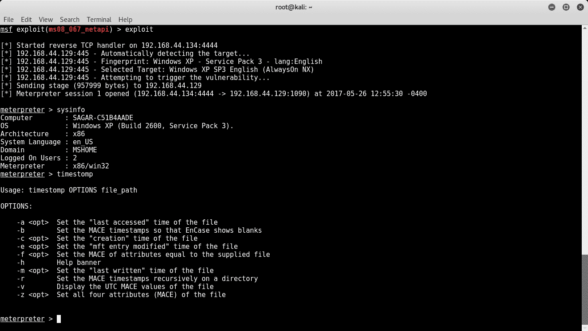
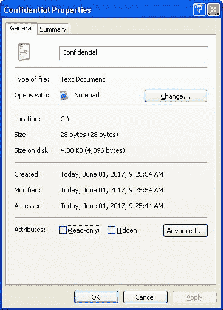
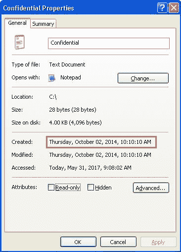
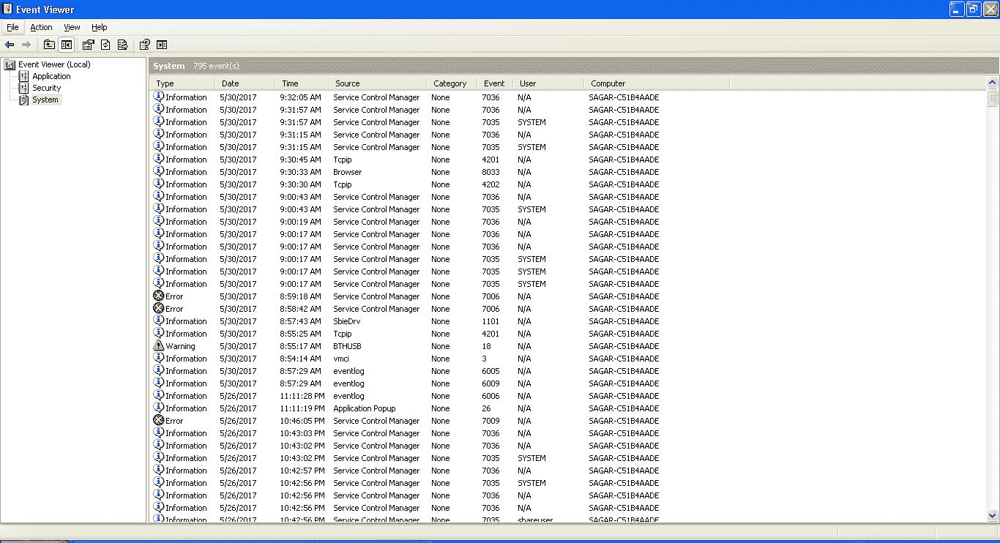
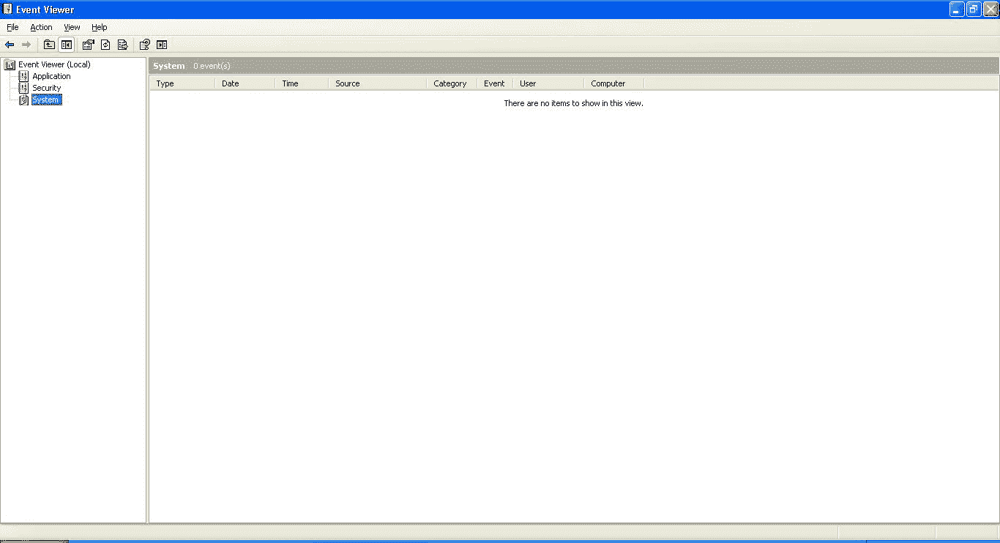

# 第八章：防病毒逃避和反取证

在前两章中，您学习了如何利用 Metasploit 框架生成自定义有效负载并发动高级客户端攻击。然而，如果我们生成的有效负载被防病毒程序检测并阻止，那么它们将毫无用处。在本章中，我们将探讨各种技术，以使我们的有效负载尽可能不被检测。您还将熟悉在成功妥协后覆盖我们的踪迹的各种技术。

在本章中，我们将涵盖以下主题：

+   使用编码器避免 AV 检测

+   使用二进制加密和打包技术

+   测试有效负载以检测和沙盒概念

+   使用 Metasploit 反取证技术，如 TimeStomp 和 clearev

# 使用编码器避免 AV 检测

在第六章《使用 Metasploit 进行客户端攻击》中，我们已经看到如何使用`msfvenom`实用程序生成各种有效负载。然而，如果原样使用这些有效负载，它们很可能会被防病毒程序检测到。为了避免我们的有效负载被防病毒程序检测到，我们需要使用`msfvenom`实用程序提供的编码器。

要开始，我们将使用`shikata_ga_nai`编码器生成`.exe`格式的简单有效负载，如下面的屏幕截图所示：

一旦有效负载生成，我们将其上传到网站[`www.virustotal.com`](http://www.virustotal.com)进行分析。分析完成后，我们可以看到我们的文件`apache-update.exe`（包含有效负载）被使用的 60 个防病毒程序中的 46 个检测到。这对于我们的有效负载来说是相当高的检测率。将此有效负载原样发送给受害者的成功可能性较小，因为它的检测率。现在，我们必须努力使它不被尽可能多的防病毒程序检测到。

该网站[`www.virustotal.com`](http://www.virustotal.com)运行来自各种供应商的多个防病毒程序，并使用所有可用的防病毒程序扫描上传的文件。

仅仅一次使用`shikata_ga_nai`编码器对我们的有效负载进行编码并没有很好地工作。`msfvenom`实用程序还有一个选项，可以多次迭代编码过程。通过多次迭代编码器对我们的有效负载进行处理可能会使其更隐蔽。现在，我们将尝试生成相同的有效负载；但是，这次我们将尝试运行编码器 10 次，以使其隐蔽，如下面的屏幕截图所示：

现在有效负载已生成，我们再次将其提交到[`www.virustotal.com`](http://www.virustotal.com)进行分析。如下面的屏幕截图所示，分析结果显示，这次我们的有效负载被 60 个防病毒程序中的 45 个检测到。因此，它比我们之前的尝试稍好，但仍然不够好：

为了进一步尝试使我们的有效负载不被检测到，这次我们将尝试将编码器从`shikata_ga_nai`（之前使用的）更改为一个名为`opt_sub`的新编码器，如下面的屏幕截图所示。我们将在我们的有效负载上运行编码器五次：

一旦有效负载生成，我们将提交它进行分析到[`www.virustotal.com`](http://www.virustotal.com)。这次，结果看起来好多了！只有 25 个防病毒程序中的 25 个能够检测到我们的有效负载，而之前有 45 个能够检测到，如下面的屏幕截图所示。这确实是一个显著的改进：

您可能已经了解到，没有单一的秘密配方可以使我们的有效负载完全不被检测到。

使载荷不可检测的过程涉及使用各种排列组合和不同编码器的各种试验和错误方法。您必须不断尝试，直到载荷的检测率降到可接受的水平。

然而，非常重要的一点是，有时在载荷上运行多次编码器的迭代甚至可能损坏原始载荷代码。因此，最好在将其发送到目标系统之前，确实通过在测试实例上执行来验证载荷。

# 使用打包程序和加密程序

在前面的部分中，我们已经看到如何利用各种编码器来使我们的载荷免受杀毒程序的检测。然而，即使使用不同的编码器和迭代，我们的载荷仍然被一些杀毒程序检测到。为了使我们的载荷完全隐蔽，我们可以利用一个叫做`加密自解压缩存档`的功能，这是由一个叫做`7-Zip`的压缩实用程序提供的。

首先，我们将把一个恶意的 PDF 文件（包含一个载荷）上传到网站[`www.virustotal.com`](http://www.virustotal.com)，如下面的截图所示。分析显示，我们的 PDF 文件被 56 个可用的杀毒程序中的 32 个检测到，如下面的截图所示：

现在，使用 7-Zip 实用程序，如下面的截图所示，我们将我们的恶意 PDF 文件转换成一个自解压缩存档：

分析结果，如下面的截图所示，显示了被转换成自解压缩存档的 PDF 文件被 59 个可用的杀毒程序中的 21 个检测到。这比我们之前的尝试（32/56）要好得多：

现在，为了使载荷更加隐蔽，我们将把我们的载荷转换成一个受密码保护的自解压缩存档。这可以通过 7-Zip 实用程序来完成，如下面的截图所示：

现在，我们将把密码加密的载荷上传到网站[`www.virustotal.com`](http://www.virustotal.com)并检查结果，如下面的截图所示。有趣的是，这一次没有一个杀毒程序能够检测到我们的载荷。现在，我们的载荷将在整个传输过程中不被检测到，直到它到达目标。然而，密码保护为最终用户（受害者）执行载荷增加了另一个障碍：

# 什么是沙箱？

无论我们执行一个应用程序，无论是合法的还是恶意的，都会发生以下事件：

+   应用程序直接与主机操作系统交互

+   系统调用被执行

+   建立网络连接

+   注册表条目被修改

+   事件日志被写出

+   临时文件被创建或删除

+   新的进程被生成

+   配置文件被更新

所有上述事件都是持久性的，并改变了目标系统的状态。现在，可能会有一种情况，我们必须以受控的方式测试一个恶意程序，以便测试系统的状态保持不变。这正是沙箱可以发挥重要作用的地方。

想象一下，沙箱是一个隔离的容器或隔间。在沙箱内执行的任何东西都会留在沙箱内，不会影响外部世界。在沙箱内运行一个载荷样本将帮助您分析其行为，而不会影响主机操作系统。

有几个开源和免费的沙箱框架可用，如下所示：

+   Sandboxie：[`www.sandboxie.com`](https://www.sandboxie.com)

+   Cuckoo 沙箱：[`cuckoosandbox.org/`](https://cuckoosandbox.org/)

探索这些沙箱的功能超出了本书的范围；然而，尝试这些沙箱进行恶意载荷分析是值得的。

# 反取证

在过去的十年左右，数字取证技术有了实质性的改进和进步。取证工具和技术已经得到了很好的发展和成熟，可以在发生违规/欺诈或事件时搜索、分析和保留任何数字证据。 

在整本书中，我们已经看到了 Metasploit 如何用于妥协远程系统。Meterpreter 使用内存中的`dll`注入，并确保除非明确需要，否则不会写入磁盘。然而，在妥协过程中，我们经常需要执行某些修改、添加或删除远程文件系统上的文件的操作。这意味着如果对被妥协的系统进行取证调查，我们的行为将被追溯。

成功地妥协我们的目标系统是一部分，而确保我们的妥协即使从法医角度来看也不被察觉和发现是另一个重要部分。幸运的是，Metasploit 框架提供了工具和实用程序，帮助我们清除我们的足迹，并确保在系统上留下最少或没有我们的妥协证据。

# Timestomp

文件系统中的每个文件和文件夹，无论操作系统的类型如何，都有与之关联的元数据。元数据只是特定文件或文件夹的属性，包含诸如创建、访问和修改时间和日期、磁盘上的大小、所有权信息以及一些其他属性，比如是否标记为只读或隐藏。在任何欺诈或事件发生时，这些元数据可以揭示大量有用的信息，可以追溯攻击。

除了元数据的关注，还有一些安全程序被称为`文件完整性监视器`，它们不断监视文件是否发生变化。现在，当我们妥协一个系统并在其上获得 meterpreter shell 时，我们可能需要访问该系统上的现有文件，创建新文件或修改现有文件。当我们进行这些更改时，它显然会以更改的时间戳的形式反映在元数据中。这可能会引起警报或在事件调查中泄露线索。为了避免通过元数据留下我们的痕迹，我们希望覆盖我们在妥协过程中访问或创建的每个文件和文件夹的元数据信息（特别是时间戳）。

Meterpreter 提供了一个非常有用的实用程序，称为`timestomp`，您可以使用它覆盖任何文件或文件夹的时间戳值。

一旦我们在被妥协的系统上获得了 meterpreter shell，下面的屏幕截图显示了`timestomp`实用程序的帮助菜单：

下面的屏幕截图显示了在使用`timestomp`之前文件`Confidential.txt`的时间戳：

现在，我们将利用 SMB `MS08_67_netapi`漏洞妥协我们的目标系统，然后使用`timestomp`实用程序修改文件`Confidential.txt`的时间戳，如下面的屏幕截图所示：

使用`timestomp`实用程序修改文件时间戳后，我们可以看到文件`Confidential.txt`的更改时间戳值，如下面的屏幕截图所示：

# clearev

每当我们与 Windows 系统交互时，所有操作都以事件日志的形式记录下来。事件日志分为三类，即应用程序日志、安全日志和系统日志。在系统故障或安全妥协的情况下，调查员/管理员最有可能首先看到事件日志。

假设我们通过某些漏洞入侵了 Windows 主机。然后，我们使用 meterpreter 上传新文件到被入侵的系统。我们还提升了权限并尝试添加新用户。现在，这些操作将被记录在事件日志中。在我们付出所有努力进行入侵之后，我们肯定不希望我们的行动被发现。这时，我们可以使用一个名为`clearev`的 meterpreter 脚本来清除所有日志并清除我们的活动痕迹。

以下截图显示了存储和显示所有事件日志的“Windows 事件查看器”应用程序：

现在，我们使用 SMB`MS08_67_netapi`漏洞来入侵目标 Windows 系统，并获得了 meterpreter 访问。我们在 meterpreter shell 中输入`clearev`命令（如下截图所示），它简单地清除了被入侵系统上的所有日志：

回到我们被入侵的 Windows 系统，我们检查了“事件查看器”，发现所有日志都已清除，如下截图所示：

# 总结

在本章中，您探索了使有效载荷不可检测的各种技术，并了解了与反取证相关的 Metasploit Framework 的各种能力。在前往下一章之前，我们将深入研究一种名为 Armitage 的网络攻击管理工具，该工具在后台使用 Metasploit，并简化了更复杂的渗透测试任务。

# 练习

您可以尝试以下练习：

+   使用`msfvenom`实用程序生成有效载荷，然后尝试使用各种编码器使其在[`www.virustotal.com`](https://www.virustotal.com)上最不可检测

+   探索一个名为`Hyperion`的工具，使有效载荷不可检测

+   尝试使用任何沙箱应用程序来分析使用`msfvenom`实用程序生成的有效载荷的行为
