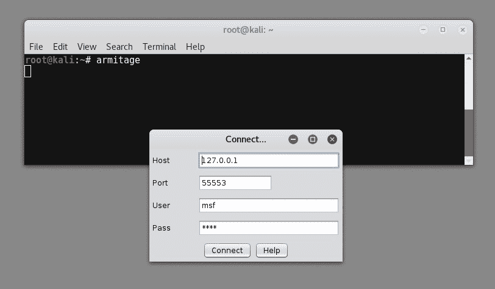
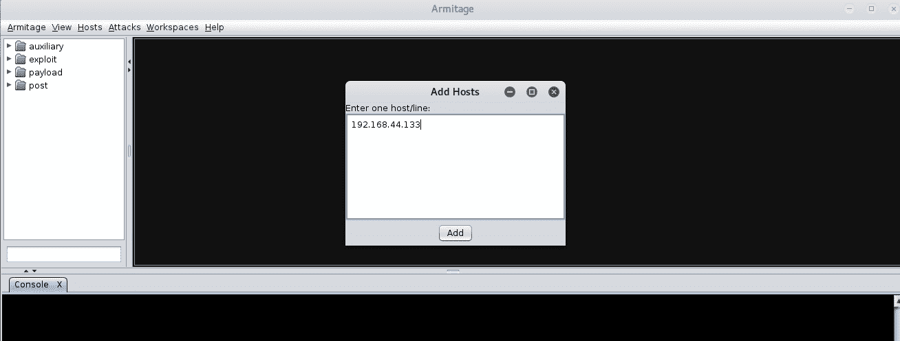
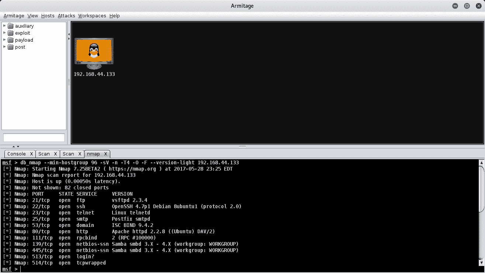
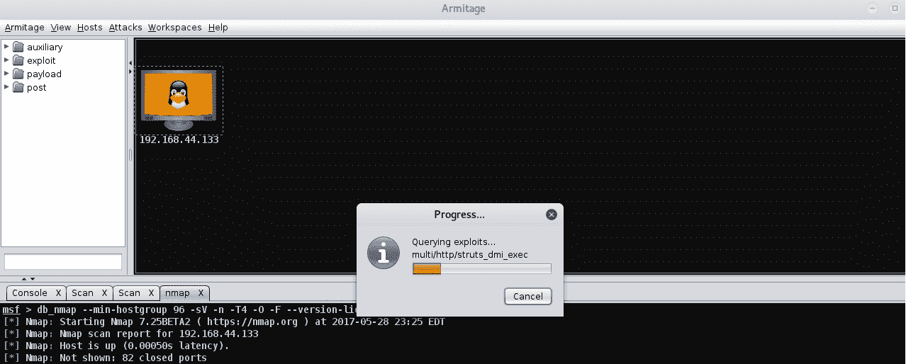
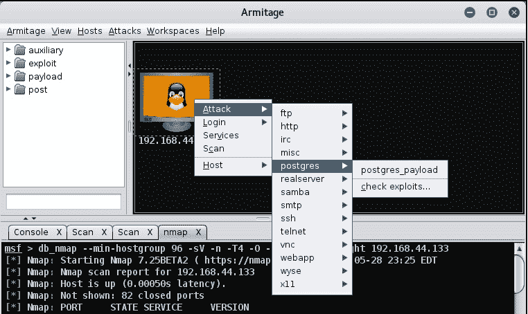
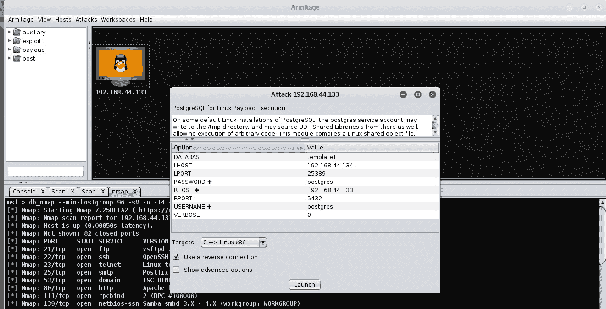
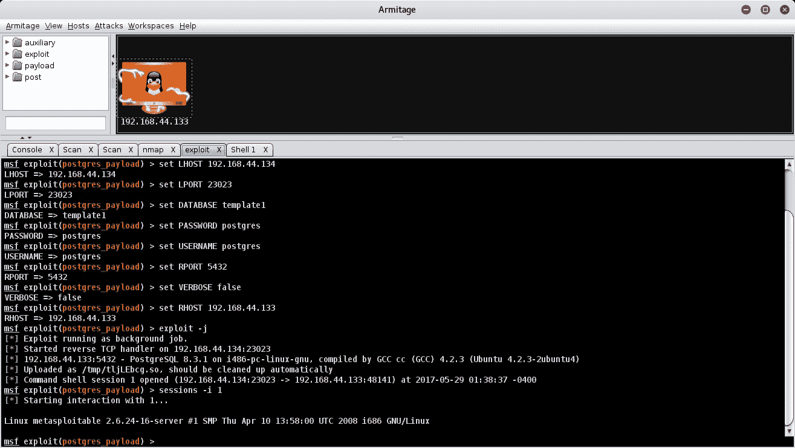
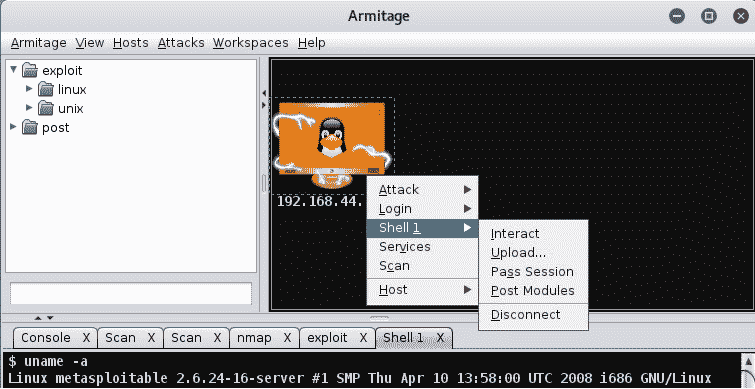
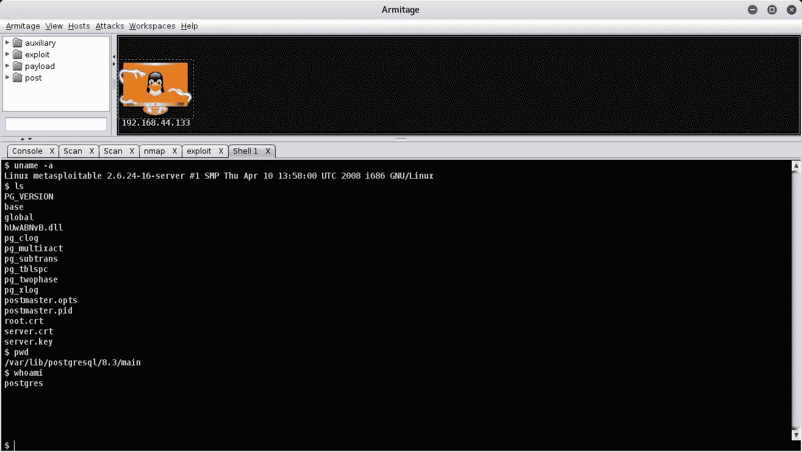

# 第九章：使用 Armitage 进行网络攻击管理

到目前为止，在本书中，您已经学会了在渗透测试生命周期的所有阶段使用 Metasploit 的各种基本和高级技术。我们已经使用 Metasploit 命令行界面`msfconsole`执行了所有这些操作。现在我们已经熟悉了如何使用`msfconsole`，让我们继续使用图形界面，这将使我们的渗透测试任务更加容易。在本章中，我们将涵盖以下主题：

+   Armitage 简介

+   启动 Armitage 控制台

+   扫描和枚举

+   查找合适的攻击

+   利用目标

# 什么是 Armitage？

简而言之，Armitage 只是一个用于执行和管理所有任务的 GUI 工具，否则这些任务可以通过`msfconsole`执行。

Armitage 帮助可视化目标，自动推荐合适的攻击，并在框架中公开高级的攻击后操作功能。

请记住，Armitage 在后台使用 Metasploit；因此，为了使用 Armitage，您需要在系统上运行一个正在运行的 Metasploit 实例。Armitage 不仅与 Metasploit 集成，还与其他工具（如 NMAP）集成，用于高级端口扫描和枚举。

Armitage 已经预装在默认的 Kali Linux 安装中。

# 启动 Armitage 控制台

在实际启动 Armitage 控制台之前，首先我们需要启动`postgresql`服务和 Metasploit 服务，如下面的屏幕截图所示：

一旦 postgresql 和 Metasploit 服务正常运行，我们可以在命令行中输入`armitage`来启动 Armitage 控制台，如下面的屏幕截图所示：

在初始启动时，`armitage`控制台显示如下屏幕截图所示：

现在 Armitage 控制台已经启动，让我们添加我们希望攻击的主机。要添加新主机，请单击“主机”菜单，然后选择“添加主机”选项。您可以一次添加单个主机或多个主机，如下面的屏幕截图所示：

# 扫描和枚举

现在我们已经将目标主机添加到 Armitage 控制台，我们将执行一个快速端口扫描，以查看这里打开了哪些端口。要执行端口扫描，请右键单击主机，然后选择扫描选项，如下面的屏幕截图所示。这将在 Armitage 控制台的底部窗格中列出目标系统上的所有打开端口：

正如我们之前所见，Armitage 也与 NMAP 很好地集成。现在，我们将对目标进行 NMAP 扫描，以枚举服务并检测远程操作系统的版本，如下面的屏幕截图所示。要启动 NMAP 扫描，请单击“主机”选项，选择 NMAP 扫描，然后选择“快速扫描（OS 检测）”选项：

NMAP 扫描完成后，您会注意到我们目标主机上的 Linux 图标。

# 查找并发动攻击

在前面的部分中，我们将主机添加到 Armitage 控制台，并使用 NMAP 对其进行了端口扫描和枚举。现在，我们知道它正在运行基于 Debian 的 Linux 系统。下一步是找到与我们目标主机匹配的所有可能的攻击。为了获取所有适用的攻击，选择“攻击”菜单，然后单击“查找攻击”。现在，Armitage 控制台将查询后端数据库，以查找早期枚举中发现的所有可能匹配的漏洞利用，如下面的屏幕截图所示：

一旦 Armitage 控制台完成查询可能的利用，您可以通过右键单击主机并选择“攻击”菜单来查看适用的利用列表。在这种情况下，我们将尝试利用`postgresql`漏洞，如下面的屏幕截图所示：

在选择攻击类型为 Linux 负载执行的 PostgreSQL 时，我们会看到以下屏幕截图中显示的几种利用选项。我们可以将其保留为“默认”，然后点击“启动”按钮：

一旦我们发动了攻击，利用就会被执行。请注意主机图标的变化，如下面的屏幕截图所示。主机已成功被攻陷：

现在我们的主机已被攻陷，我们在系统上获得了一个反向连接。我们可以进一步与其交互，上传任何文件和负载，或使用任何后渗透模块。要做到这一点，只需右键单击被攻陷的主机，选择“Shell 1”选项，然后选择“交互”选项，如下面的屏幕截图所示：

与被攻陷的主机进行交互时，在 Armitage 控制台的底部窗格中打开了一个名为“Shell 1”的新选项卡，如下面的屏幕截图所示。从这里，我们可以远程执行所有 Linux 命令：

# 摘要

在本章中，您已经熟悉了使用 Armitage 工具在后台使用 Metasploit 进行网络攻击管理。Armitage 工具在同时对多个目标进行渗透测试时肯定会很方便，并节省大量时间。在下一章中，我们将学习如何通过添加自定义利用来进一步扩展 Metasploit 框架。

# 练习

尝试详细探索 Armitage 的各种功能，并使用它来攻陷任何目标 Windows 主机。
