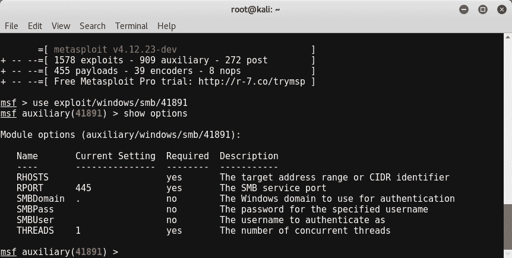

# 第十章：扩展 Metasploit 和利用开发

在上一章中，您学习了如何有效地使用 Armitage 轻松执行一些复杂的渗透测试任务。在本章中，我们将对利用开发进行高层次的概述。利用开发可能非常复杂和繁琐，是一个如此广泛的主题，以至于可以写一整本书。然而，在本章中，我们将试图了解利用开发是什么，为什么需要它，以及 Metasploit 框架如何帮助我们开发利用。本章将涵盖以下主题：

+   利用开发概念

+   将外部利用添加到 Metasploit

+   Metasploit 利用模板和混合技术介绍

# 利用开发概念

利用可以有许多不同的类型。它们可以根据平台、架构和服务目的等各种参数进行分类。每当发现任何给定的漏洞时，通常存在以下三种可能性之一：

+   已经存在利用代码

+   部分利用代码已经存在，需要一些修改才能执行恶意载荷

+   没有利用代码存在，需要从头开始开发新的利用代码

前两种情况看起来很容易，因为利用代码已经存在，可能只需要一些小的调整就可以执行。然而，第三种情况，即刚刚发现漏洞且没有利用代码存在的情况，才是真正的挑战。在这种情况下，您可能需要执行以下一些任务：

+   收集基本信息，例如漏洞支持的平台和架构

+   收集有关漏洞如何被利用以及可能的攻击向量的所有可能细节

+   使用模糊测试等技术来具体确定脆弱的代码和参数

+   编写伪代码或原型来测试利用是否真正有效

+   编写带有所有必需参数和值的完整代码

+   发布代码供社区使用，并将其转换为 Metasploit 模块

所有这些活动都非常紧张，需要大量的研究和耐心。利用代码对参数非常敏感；例如，在缓冲区溢出利用的情况下，返回地址是成功运行利用的关键。即使返回地址中的一个位被错误地提及，整个利用都会失败。

# 什么是缓冲区溢出？

缓冲区溢出是各种应用程序和系统组件中最常见的漏洞之一。成功的缓冲区溢出利用可能允许远程任意代码执行，从而提升权限。

当程序尝试在缓冲区中插入的数据超过其容量时，或者当程序尝试将数据插入到缓冲区之后的内存区域时，就会发生缓冲区溢出条件。在这种情况下，缓冲区只是分配的内存的连续部分，用于保存从字符串到整数数组的任何内容。尝试在分配的内存块的边界之外写入数据可能会导致数据损坏，使程序崩溃，甚至导致恶意代码的执行。让我们考虑以下代码：

```
#include <stdio.h>

void AdminFunction()
{
    printf("Congratulations!\n");
    printf("You have entered in the Admin function!\n");
}

void echo()
{
    char buffer[25];

    printf("Enter any text:\n");
    scanf("%s", buffer);
    printf("You entered: %s\n", buffer);    
}

int main()
{
    echo();

    return 0;
}
```

上述代码存在缓冲区溢出漏洞。如果仔细注意，缓冲区大小已设置为 25 个字符。但是，如果用户输入的数据超过 25 个字符会怎么样？缓冲区将简单地溢出，程序执行将突然结束。

# 模糊测试是什么？

在前面的示例中，我们可以访问源代码，并且我们知道变量缓冲区最多可以容纳 25 个字符。因此，为了引起缓冲区溢出，我们可以发送 30、40 或 50 个字符作为输入。然而，并非总是可能访问任何给定应用程序的源代码。因此，对于源代码不可用的应用程序，您如何确定应该发送多长的输入到特定参数，以便缓冲区溢出？这就是模糊器发挥作用的地方。模糊器是发送随机输入到目标应用程序中指定参数的小程序，并告知我们导致溢出和应用程序崩溃的输入的确切长度。

你知道吗？Metasploit 有用于模糊化各种协议的模糊器。这些模糊器是 Metasploit 框架中的辅助模块的一部分，可以在`auxiliary/fuzzers/`中找到。

# 漏洞利用模板和混合

假设您已经为一个新的零日漏洞编写了漏洞利用代码。现在，要将漏洞利用代码正式包含到 Metasploit 框架中，它必须以特定格式呈现。幸运的是，您只需要专注于实际的漏洞利用代码，然后简单地使用模板（由 Metasploit 框架提供）将其插入所需的格式中。Metasploit 框架提供了一个漏洞利用模块骨架，如下所示：

```
##
# This module requires Metasploit: http://metasploit.com/download
# Current source: https://github.com/rapid7/metasploit-framework
##

require 'msf/core'

class MetasploitModule < Msf::Exploit::Remote
  Rank = NormalRanking

  def initialize(info={})
    super(update_info(info,
      'Name'           => "[Vendor] [Software] [Root Cause] [Vulnerability type]",
      'Description'    => %q{
        Say something that the user might need to know
      },
      'License'        => MSF_LICENSE,
      'Author'         => [ 'Name' ],
      'References'     =>
        [
          [ 'URL', '' ]
        ],
      'Platform'       => 'win',
      'Targets'        =>
        [
          [ 'System or software version',
            {
              'Ret' => 0x42424242 # This will be available in `target.ret`
            }
          ]
        ],
      'Payload'        =>
        {
          'BadChars' => "\x00\x00"
        },
      'Privileged'     => true,
      'DisclosureDate' => "",
      'DefaultTarget'  => 1))
  end

  def check
    # For the check command
  end

  def exploit
    # Main function
  end

end

```

现在，让我们试着理解前面的漏洞利用骨架中的各个字段：

+   **名称**字段：以供应商名称开头，然后是软件。**根本原因**字段指向发现错误的组件或功能，最后是模块正在利用的漏洞类型。

+   **描述**字段：此字段详细说明模块的功能、需要注意的事项和任何特定要求。目的是让用户清楚地了解他正在使用的内容，而无需实际查看模块的源代码。

+   **作者**字段：这是您插入姓名的地方。格式应为姓名。如果您想插入您的 Twitter 账号，只需将其作为注释留下，例如`姓名 #Twitterhandle`。

+   **参考**字段：这是与漏洞或漏洞利用相关的参考数组，例如公告、博客文章等。有关参考标识符的更多详细信息，请访问[`github.com/rapid7/metasploit-framework/wiki/Metasploit-module-reference-identifiers`](https://github.com/rapid7/metasploit-framework/wiki/Metasploit-module-reference-identifiers)

+   **平台**字段：此字段指示漏洞利用代码将支持的所有平台，例如 Windows、Linux、BSD 和 Unix。

+   **目标**字段：这是一个系统、应用程序、设置或特定版本的数组，您的漏洞利用的目标。每个目标数组的第二个元素是您存储目标特定元数据的位置，例如特定偏移量、小工具、`ret`地址等。当用户选择一个目标时，元数据将被加载并由`目标索引`跟踪，并可以使用目标方法检索。

+   **有效载荷**字段：此字段指定有效载荷应如何编码和生成。您可以指定 Space、SaveRegisters、Prepend、PrependEncoder、BadChars、Append、AppendEncoder、MaxNops、MinNops、Encoder、Nop、EncoderType、EncoderOptions、ExtendedOptions 和 EncoderDontFallThrough。

+   **披露日期**字段：此字段指定漏洞是在公开披露的日期，格式为 M D Y，例如，“2017 年 6 月 29 日”。

您的漏洞利用代码还应包括一个`check`方法，以支持`check`命令，但如果不可能的话，这是可选的。`check`命令将探测目标是否可利用漏洞。

最后，漏洞利用方法就像您的主要方法。从那里开始编写您的代码。

# Metasploit 混合是什么？

如果你熟悉 C 和 Java 等编程语言，你一定听说过函数和类等术语。C 中的函数和 Java 中的类基本上都允许代码重用。这使得程序更加高效。Metasploit 框架是用 Ruby 语言编写的。因此，从 Ruby 语言的角度来看，mixin 只是一个简单的包含在类中的模块。这将使类能够访问此模块的所有方法。

因此，不需要深入了解编程细节，你只需记住 mixin 有助于模块化编程；例如，你可能想执行一些 TCP 操作，比如连接到远程端口并获取一些数据。现在，要执行这个任务，你可能需要编写相当多的代码。但是，如果你使用已有的 TCP mixin，你将节省写整个代码的工作！你只需包含 TCP mixin 并根据需要调用相应的函数。因此，你无需重新发明轮子，可以节省大量时间和精力。

你可以通过浏览`/lib/msf/core/exploit`目录来查看 Metasploit 框架中提供的各种 mixin，如下截图所示：


Metasploit 框架中最常用的一些 mixin 如下：

+   `Exploit::Remote::Tcp`：此 mixin 的代码位于`lib/msf/core/exploit/tcp.rb`，并提供以下方法和选项：

+   TCP 选项和方法

+   定义 RHOST、RPORT 和 ConnectTimeout

+   `connect()`和`disconnect()`

+   创建 self.sock 作为全局套接字

+   提供 SSL、代理、CPORT 和 CHOST

+   通过小段发送进行规避

+   将用户选项公开为`rhost()`、`rport()`、`ssl()`等方法

+   `Exploit::Remote::SMB`：此 mixin 的代码是从 TCP mixin 继承而来，位于`lib/msf/core/exploit/smb.rb`，并提供以下方法和选项：

+   `smb_login()`

+   `smb_create()`

+   `smb_peer_os()`

+   提供了 SMBUser、SMBPass 和 SMBDomain 的选项

+   公开 IPS 规避方法，如`SMB::pipe_evasion`、`SMB::pad_data_level`和`SMB::file_data_level`

# 向 Metasploit 添加外部利用

每天都会发现各种应用程序和产品中的新漏洞。对于大多数新发现的漏洞，也会公开相应的利用代码。现在，利用代码通常是原始格式的（就像 shellcode 一样），不能直接使用。此外，在利用正式作为 Metasploit 框架中的模块之前可能需要一些时间。但是，我们可以手动将外部利用模块添加到 Metasploit 框架中，并像任何其他现有的利用模块一样使用它。让我们以最近被 Wannacry 勒索软件使用的 MS17-010 漏洞为例。默认情况下，MS17-010 的利用代码在 Metasploit 框架中是不可用的。

让我们从利用数据库中下载 MS17-010 模块开始。

你知道吗？[`www.exploit-db.com`](https://www.exploit-db.com)上的 Exploit-DB 是获取各种平台、产品和应用程序的新利用的最值得信赖和最新的来源之一。

只需在任何浏览器中打开[`www.exploit-db.com/exploits/41891/`](https://www.exploit-db.com/exploits/41891/)，并下载利用代码，它是以`ruby (.rb)`格式显示的，如下截图所示：


一旦下载了利用的 Ruby 文件，我们需要将其复制到 Metasploit 框架目录中，路径如下截图所示：


截图中显示的路径是预装在 Kali Linux 上的 Metasploit 框架的默认路径。如果你有自定义安装的 Metasploit 框架，你需要更改路径。

将新下载的漏洞利用代码复制到 Metasploit 目录后，我们将启动`msfconsole`并发出`reload_all`命令，如下面的屏幕截图所示：


`reload_all`命令将刷新 Metasploit 的内部数据库，以包括新复制的外部漏洞利用代码。现在，我们可以像往常一样使用`use exploit`命令来设置和启动新的漏洞利用，如下面的屏幕截图所示。我们只需设置变量`RHOSTS`的值并启动利用：



# 摘要

在本章的总结中，您学习了各种漏洞利用开发概念，通过添加外部漏洞利用的各种方式扩展 Metasploit Framework，并介绍了 Metasploit 漏洞利用模板和混合功能。

# 练习

您可以尝试以下练习：

+   尝试探索以下内容的混合代码和相应功能：

+   捕获

+   Lorcon

+   MSSQL

+   KernelMode

+   FTP

+   FTP 服务器

+   EggHunter

+   在[`www.exploit-db.com`](https://www.exploit-db.com)上找到目前不包含在 Metasploit Framework 中的任何漏洞利用。尝试下载并导入到 Metasploit Framework 中。
