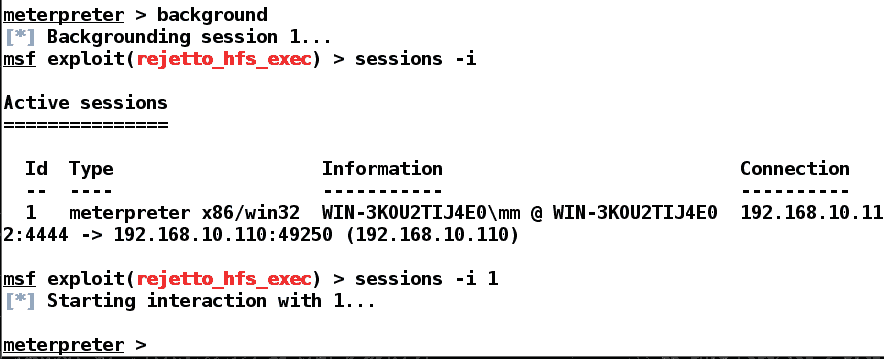
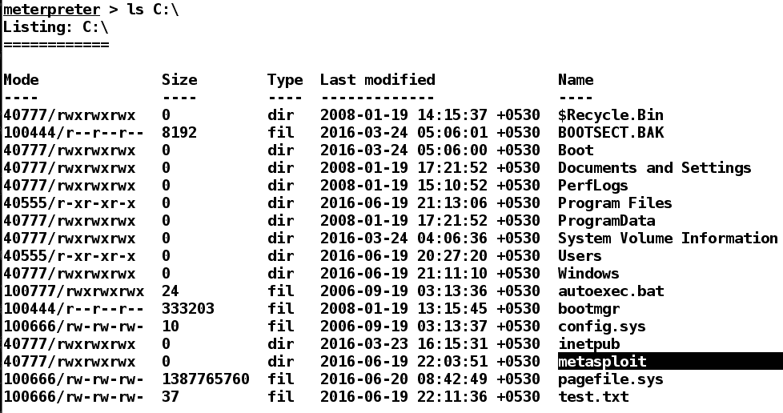
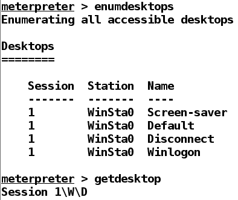
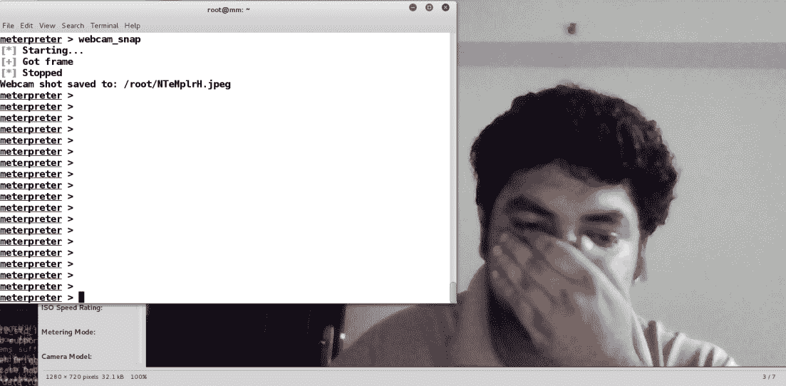
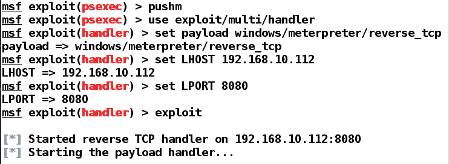
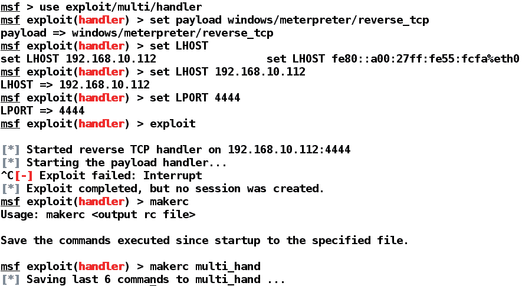
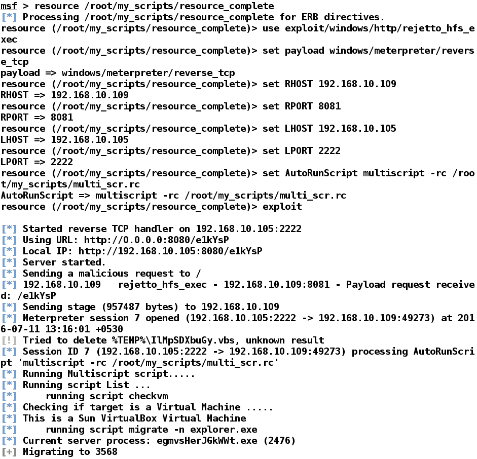
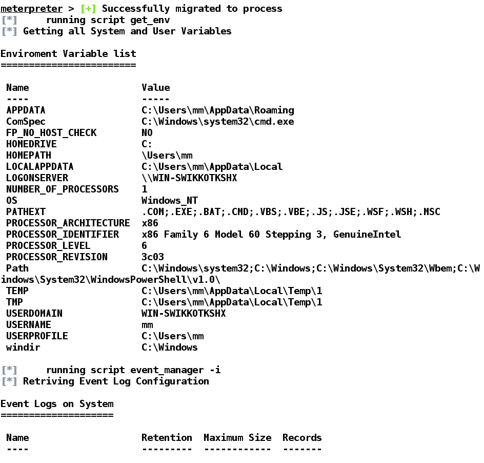
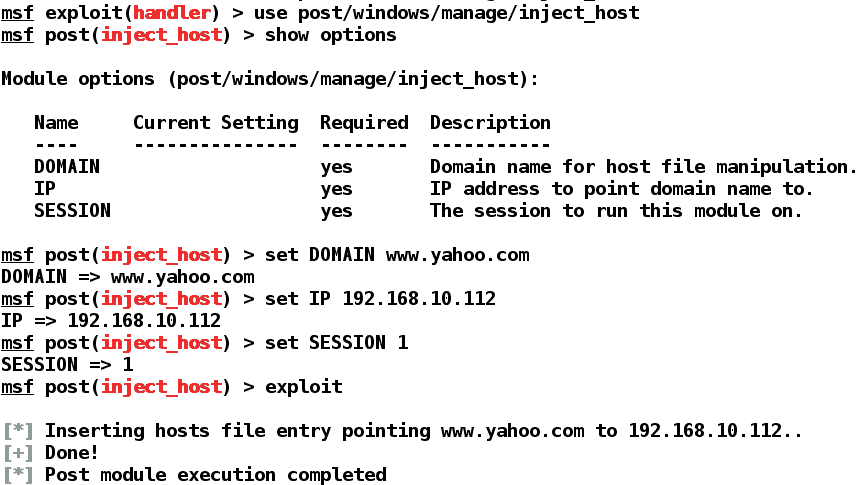
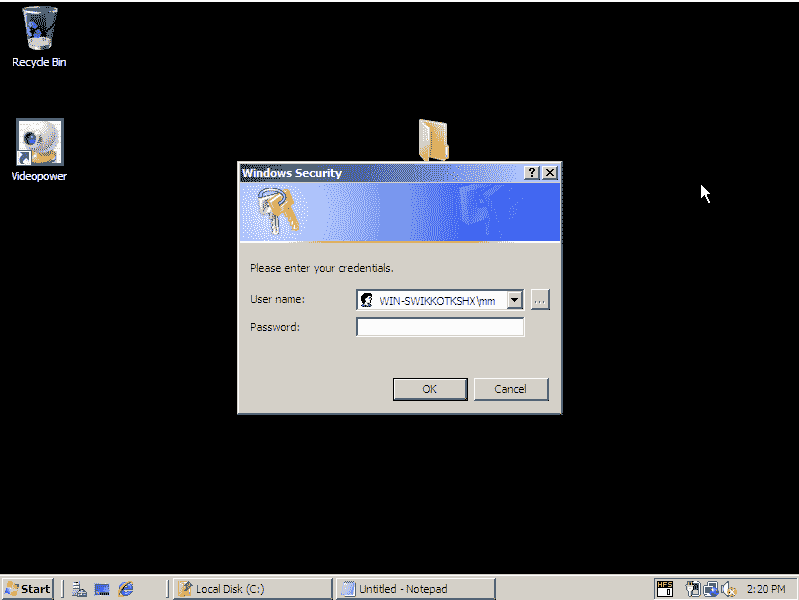

# 第十八章：Metasploit 扩展

本章将涵盖 Metasploit 的扩展用法和核心后渗透功能。在本章中，我们将专注于后渗透的开箱即用方法，并将涵盖繁琐的任务，如提权、获取明文密码、查找有价值的信息等。

在本章中，我们将涵盖和理解以下关键方面：

+   使用高级后渗透模块

+   使用自动化脚本加速渗透测试

+   提权

+   从内存中找到密码

现在让我们进入 Metasploit 的后渗透功能，并从下一节开始学习基础知识。

# Metasploit 的后渗透基础

在之前的章节中，我们已经涵盖了许多后渗透模块和脚本。在本章中，我们将专注于之前未包括的功能。所以，让我们从下一节中开始使用后渗透中最基本的命令。

# 基本后渗透命令

核心 Meterpreter 命令提供了大多数被利用系统上可用的基本后渗透功能。让我们从一些最基本的命令开始，这些命令有助于后渗透。

# 帮助菜单

我们可以随时参考帮助菜单，通过发出`help`或`?`命令来列出在目标上可用的各种命令，如下面的截图所示：

# 后台命令

在进行后渗透时，我们可能会遇到需要执行其他任务的情况，比如测试不同的漏洞利用，或者运行提权漏洞利用。在这种情况下，我们需要将当前的 Meterpreter 会话放到后台。我们可以通过发出`background`命令来做到这一点，如下面的截图所示：

我们可以看到在前面的截图中，我们成功地将会话放到后台，并使用`sessions -i`命令重新与会话交互，后面跟着会话标识符，即前面截图中的`1`。

# 从通道中读取

Meterpreter 通过多个通道与目标进行交互。在进行后渗透时，我们可能需要列出并从特定通道读取。我们可以通过发出`channel`命令来做到这一点，如下所示：

在前面的截图中，我们通过发出`channel -l`命令列出了所有可用的通道。我们可以通过发出`channel -r [channel-id]`来读取一个通道。通道子系统允许通过 Meterpreter shell 作为通信子通道存在的所有逻辑通道进行读取、列出和写入。

# 文件操作命令

我们在之前的章节中涵盖了一些文件操作。让我们复习一下一些文件操作命令，比如`pwd`。使用`pwd`命令，我们可以查看当前目录，如下面的截图所示：

此外，我们可以使用`cd`命令浏览目标文件系统，并使用`mkdir`命令创建目录，如下面的截图所示：

Meterpreter shell 允许我们使用`upload`命令将文件上传到目标系统。让我们看看它是如何工作的：

我们可以通过发出`edit`命令后跟文件名来编辑目标上的任何文件，如下所示：

现在让我们通过发出`cat`命令来查看文件的内容：

我们可以使用`ls`命令列出目录中的所有文件，如下所示：

我们可以使用`rmdir`命令从目标中删除特定目录，使用`rm`命令删除文件，如下所示：

此外，我们可以使用`download`命令从目标下载文件，如下所示：

# 桌面命令

Metasploit 具有枚举桌面、使用网络摄像头拍照、录制麦克风声音、流式传输摄像头等桌面命令。让我们看看这些功能：

使用`enumdesktops`和`getdesktop`可以获取与目标桌面相关的信息。`enumdesktop`命令列出所有可用的桌面，而`getdesktop`列出与当前桌面相关的信息。

# 屏幕截图和摄像头枚举

在进行屏幕截图、摄像头拍摄、运行实时流或记录按键之前，测试人员必须事先获得许可。然而，我们可以使用`snapshot`命令拍摄目标的桌面快照，如下所示：

查看保存的 JPEG 文件，我们有：

让我们看看是否可以枚举摄像头并查看谁正在系统上工作：

使用`webcam_list`命令，我们可以找出与目标关联的摄像头数量。让我们使用以下`webcam_stream`命令来流式传输摄像头：

发出上述命令会在浏览器中打开一个网络摄像头流，如下截图所示：

我们还可以选择快照而不是流式传输，通过发出以下`webcam_snap`命令：

有时，我们需要监听环境进行监视。为了实现这一点，我们可以使用`record_mic`命令，如下所示：

我们可以使用`record_mic`命令设置捕获持续时间，通过使用`-d`开关传递秒数。

另一个很棒的功能是查找空闲时间以了解使用时间线，并在目标机器上的用户较不活跃时攻击系统。我们可以使用`idletime`命令来实现这一点，如下截图所示：

从目标获取的其他有趣信息是**按键记录**。我们可以通过发出`keyscan_start`命令启动键盘嗅探模块来转储按键记录，如下所示：

几秒钟后，我们可以使用`keyscan_dump`命令转储按键记录，如下所示：

在本节中，我们已经看到了许多命令。现在让我们继续进行后期利用的高级部分。

# 使用 Metasploit 进行高级后期利用

在本节中，我们将利用从主要命令中收集的信息来取得进一步的成功并访问目标的级别。

# 获取系统权限

如果我们侵入的应用程序以管理员权限运行，通过发出`getsystem`命令轻松获得系统级权限，如下截图所示：

系统级权限提供了最高级别的权限，能够在目标系统上执行几乎任何操作。

在较新版本的 Windows 上，`getsystem`模块并不是很可靠。建议尝试本地权限提升方法和模块来提升权限。

# 使用 timestomp 更改访问、修改和创建时间

Metasploit 被广泛应用，从私人组织到执法部门。因此，在进行隐秘行动时，强烈建议更改文件的访问、修改或创建时间。我们可以使用`timestomp`命令来更改文件的时间和日期。在前面的部分中，我们创建了一个名为`creditcard.txt`的文件。让我们使用`timestomp`命令更改其时间属性，如下所示：

！

我们可以看到访问时间是`2016-06-19 23:23:15`。我们可以使用`-z`开关将其修改为`1999-11-26 15:15:25`，如前面的截图所示。让我们看看文件是否被正确修改了：

！

我们成功地改变了`creditcard.txt`文件的时间戳。我们还可以使用`-b`开关来清除文件的所有时间细节，如下所示：

！

通过使用`timestomp`，我们可以单独更改修改、访问和创建时间。

# 其他后渗透模块

Metasploit 提供了 250 多个后渗透模块；但是，我们只会介绍一些有趣的模块，其余的留给你作为练习。

# 使用 Metasploit 收集无线 SSID

可以使用`wlan_bss_list`模块有效地发现目标系统周围的无线网络。该模块允许我们对目标周围的 Wi-Fi 网络的位置和其他必要信息进行指纹识别，如下图所示：

！

# 使用 Metasploit 收集 Wi-Fi 密码

与前面的模块类似，我们还有`wlan_profile`模块，它可以收集目标系统中保存的所有 Wi-Fi 凭据。我们可以使用该模块如下：

！

我们可以在前面的截图中看到网络的名称在`<name>`标签中，密码在`<keyMaterial>`标签中。

# 获取应用程序列表

Metasploit 提供了各种类型应用程序的凭证收集器；但是，要找出目标上安装了哪些应用程序，我们需要使用`get_application_list`模块获取应用程序列表，如下所示：

！

找出应用程序后，我们可以在目标上运行各种信息收集模块。

# 收集 Skype 密码

假设我们发现目标系统正在运行 Skype。Metasploit 提供了一个很好的模块，可以使用`skype`模块获取 Skype 密码：

！

# 收集 USB 历史

Metasploit 具有 USB 历史恢复模块，可以找出目标系统上使用过哪些 USB 设备。该模块在 USB 保护设置的情况下非常方便，只允许连接特定设备。使用该模块可以更轻松地欺骗 USB 描述符和硬件 ID。

有关欺骗 USB 描述符和绕过端点保护的更多信息，请参阅[`www.slideshare.net/the_netlocksmith/defcon-2012-hacking-using-usb-devices`](https://www.slideshare.net/the_netlocksmith/defcon-2012-hacking-using-usb-devices)。

让我们看看如何使用该模块：

！

# 使用 Metasploit 搜索文件

Metasploit 提供了一个很酷的命令来搜索有趣的文件，可以进一步下载。我们可以使用`search`命令列出所有具有特定文件扩展名的文件，例如`*.doc`、`*.xls`等，如下所示：

！

# 使用`clearev`命令从目标中清除日志

可以使用`clearev`命令清除目标系统的所有日志：

！

然而，如果你不是执法人员，你不应该清除目标的日志，因为日志为蓝队提供了重要信息，以加强他们的防御。另一个用于处理日志的优秀模块，称为`event_manager`，存在于 Metasploit 中，并且可以如下截图所示使用：

让我们在下一节中深入了解 Metasploit 的高级扩展功能。

# Metasploit 的高级扩展功能

在本章中，我们已经涵盖了许多后渗透技术。现在让我们在本节中介绍一些 Metasploit 的高级功能。

# 使用 pushm 和 popm 命令

Metasploit 提供了两个很棒的命令，`pushm`和`popm`。`pushm`命令将当前模块推送到模块堆栈上，而`popm`则从模块堆栈顶部弹出推送的模块；然而，这不是进程可用的标准堆栈。相反，这是 Metasploit 利用相同概念，但与之无关。使用这些命令的优势是快速操作，节省了大量时间和精力。

考虑这样一个场景，我们正在测试一个具有多个漏洞的内部服务器。在内部网络的每台计算机上都运行着两个可利用的服务。为了利用每台机器上的两个服务，我们需要在两个漏洞之间快速切换模块的机制，而不离开选项。在这种情况下，我们可以使用`pushm`和`popm`命令。我们可以使用一个模块测试服务器的单个漏洞，然后可以将模块推送到堆栈上并加载另一个模块。完成第二个模块的任务后，我们可以使用`popm`命令从堆栈中弹出第一个模块，所有选项都保持不变。

让我们通过下面的截图了解更多关于这个概念：

在上面的截图中，我们可以看到我们使用`pushm`命令将`psexec`模块推送到堆栈上，并加载了`exploit/multi/handler`模块。一旦我们完成了`multi/handler`模块的操作，我们可以使用`popm`命令从堆栈中重新加载`psexec`模块，如下图所示：

我们可以看到`psexec`模块的所有选项都被保存了，堆栈上的模块也是如此。因此，我们不需要再次设置选项。

# 利用重新加载、编辑和重新加载所有命令加快开发速度

在模块的开发阶段，我们可能需要多次测试一个模块。每次对新模块进行更改时都关闭 Metasploit 是一项繁琐、令人厌倦和耗时的任务。必须有一种机制使模块开发变得简单、快捷和有趣。幸运的是，Metasploit 提供了`reload`、`edit`和`reload_all`命令，使模块开发者的生活相对容易。我们可以使用`edit`命令即时编辑任何 Metasploit 模块，并使用`reload`命令重新加载编辑后的模块，而无需关闭 Metasploit。如果对多个模块进行了更改，我们可以使用`reload_all`命令一次重新加载所有 Metasploit 模块。

让我们看一个例子：

在上面的截图中，我们正在编辑`exploit/windows/ftp`目录中的`freefloatftp_user.rb`漏洞，因为我们发出了`edit`命令。我们将有效载荷大小从`444`更改为`448`，并保存了文件。接下来，我们需要发出`reload`命令来更新 Metasploit 中模块的源代码，如下图所示：

使用`reload`命令，我们消除了在开发新模块时重新启动 Metasploit 的需要。

`edit`命令在 vi 编辑器中启动 Metasploit 模块进行编辑。在[`www.tutorialspoint.com/unix/unix-vi-editor.htm`](http://www.tutorialspoint.com/unix/unix-vi-editor.htm)了解更多关于 vi 编辑器命令的信息。

# 利用资源脚本

Metasploit 通过资源脚本提供自动化。资源脚本通过自动设置一切来消除手动设置选项的任务，从而节省了设置模块和有效载荷选项所需的时间。

创建资源脚本有两种方法：一种是手动创建脚本，另一种是使用`makerc`命令。我建议使用`makerc`命令而不是手动编写脚本，因为它可以消除打字错误。`makerc`命令会将之前输入的所有命令保存在一个文件中，该文件可以与`resource`命令一起使用。让我们看一个例子：

我们可以看到，在前面的截图中，我们通过设置相关有效载荷和选项（如`LHOST`和`LPORT`）来启动了一个利用处理程序模块。发出`makerc`命令将系统地将所有这些命令保存到我们选择的文件中，本例中为`multi_hand`。我们可以看到，`makerc`成功地将最后六个命令保存到`multi_hand`资源文件中。让我们按以下方式使用资源脚本：

我们可以看到，只需发出`resource`命令，然后跟上我们的脚本，它就会自动复制我们保存的所有命令，从而消除了重复设置选项的任务。

# 在 Metasploit 中使用 AutoRunScript

Metasploit 还提供了使用`AutoRunScript`的另一个很棒的功能。`AutoRunScript`选项可以通过发出`show advanced`命令来填充。`AutoRunScript`可以自动执行后渗透，并在获得对目标的访问后执行。我们可以通过发出`set AutoRunScript [script-name]`命令手动设置`AutoRunScript`选项，或者在资源脚本本身中设置，从而自动化利用和后渗透。

`AutoRunScript`也可以通过使用`multi_script`和`multi_console_command`模块运行多个后渗透脚本。让我们以一个例子来说明，其中有两个脚本，一个用于自动化利用，另一个用于自动化后渗透，如下面的截图所示：

这是一个小的后渗透脚本，自动化了`checkvm`（用于检查目标是否在虚拟环境中运行的模块）和`migrate`（帮助从被利用的进程迁移到更安全的进程的模块）。让我们来看一下利用脚本：

前面的资源脚本通过设置所有必需的参数来自动化 HFS 文件服务器的利用。我们还使用`multi_console_command`选项设置了`AutoRunScript`选项，该选项允许执行多个后渗透脚本。我们使用`-rc`开关将后渗透脚本定义为`multi_console_command`，如前面的截图所示。

让我们运行利用脚本，并在下面的截图中分析其结果：

我们可以看到，在利用完成后不久，执行了`checkvm`和`migrate`模块，这表明目标是`Sun VirtualBox Virtual Machine`，并且进程已迁移到`notepad.exe`。我们可以在输出的剩余部分中看到脚本的成功执行：

我们成功迁移到了`notepad.exe`进程；但是，如果有多个`notepad.exe`实例，进程迁移也可能跳过其他进程。

# 在 AutoRunScript 选项中使用 multiscript 模块

我们还可以使用`multiscript`模块代替`multi_console_command`模块。让我们创建一个新的后渗透脚本，如下所示：

正如我们在前面的屏幕截图中所看到的，我们创建了一个名为`multi_scr.rc`的新后渗透脚本。我们需要对我们的利用脚本进行更改以适应这些更改，如下所示：

我们仅仅用`multiscript`替换了`multi_console_command`，并更新了我们的后渗透脚本的路径，如前面的屏幕截图所示。让我们看看当我们运行`exploit`脚本时会发生什么：

我们可以看到，在获得对目标的访问权限之后，`checkvm`模块被执行，然后是`migrate`、`get_env`和`event_manager`命令，如下面的屏幕截图所示：

`event_manager`模块显示了来自目标系统的所有日志，因为我们在我们的资源脚本中使用了`-i`开关。`event_manager`命令的结果如下：

# 使用 Metasploit 进行权限提升

在渗透测试中，我们经常遇到有限的访问权限的情况，如果我们运行诸如`hashdump`之类的命令，可能会出现以下错误：

在这种情况下，如果我们尝试使用`getsystem`命令获取系统权限，我们会得到以下错误：

那么，在这种情况下我们该怎么办呢？答案是使用后渗透来提升权限，以实现最高级别的访问。以下演示是在 Windows Server 2008 SP1 操作系统上进行的，我们使用本地漏洞来绕过限制并完全访问目标：

在前面的屏幕截图中，我们使用了`exploit/windows/local/ms10_015_kitrap0d`漏洞来提升权限，并获得了最高级别的访问权限。让我们使用`getuid`命令来检查访问级别：

现在，我们可以看到我们已经具有系统级别的访问权限，并且现在可以在目标上执行任何操作。

有关 KiTrap0D 漏洞的更多信息，请参阅[`docs.microsoft.com/en-us/security-updates/SecurityBulletins/2010/ms10-015`](https://docs.microsoft.com/en-us/security-updates/SecurityBulletins/2010/ms10-015)。

现在让我们运行`hashdump`命令，并检查它是否有效：

太棒了！我们轻松地得到了哈希值。

# 使用 mimikatz 在明文中查找密码

**mimikatz**是 Metasploit 的一个很好的补充，可以从 lsass 服务中以明文形式恢复密码。我们已经使用了通过传递哈希攻击来使用哈希值；然而，有时也可能需要密码来节省时间，以及用于 HTTP 基本身份验证的使用，后者需要对方知道密码而不是哈希值。

可以使用 Metasploit 中的`load mimikatz`命令加载 mimikatz。可以使用 mimikatz 模块提供的`kerberos`命令来查找密码：

# 使用 Metasploit 嗅探流量

是的，Metasploit 确实提供了从目标主机嗅探流量的功能。我们不仅可以嗅探特定接口，还可以嗅探目标上的任何指定接口。要运行此模块，我们首先需要列出所有接口，并在其中选择任何一个：

我们可以看到我们有多个接口。让我们开始在无线接口上进行嗅探，该接口被分配为 ID`2`，如下面的屏幕截图所示：

我们通过在无线接口上使用 ID 为`2`的`sniffer_start`命令和`1000`数据包作为缓冲区大小来启动嗅探器。通过发出`sniffer_dump`命令，我们成功下载了 PCAP。让我们看看通过在 Wireshark 中启动捕获的 PCAP 文件来收集了什么数据。我们可以通过发出以下命令来做到这一点：

我们可以在 PCAP 文件中看到各种数据，包括 DNS 查询、HTTP 请求和明文密码：

# 使用 Metasploit 进行 host 文件注入

我们可以通过注入 host 文件对目标进行各种钓鱼攻击。我们可以为特定域添加 host 文件条目，从而轻松利用我们的钓鱼攻击。

让我们看看如何使用 Metasploit 进行 host 文件注入：

我们可以看到我们在`SESSION 1`上使用了`post/windows/manage/inject_host`模块，并将条目插入了目标的 host 文件。让我们看看当目标打开[`www.yahoo.com/`](https://www.yahoo.com/)时会发生什么：

我们可以看到目标被重定向到我们的恶意服务器，这可以轻松地托管钓鱼页面。

# 钓取 Windows 登录密码

Metasploit 包括一个可以钓取登录密码的模块。它生成一个类似于真实 Windows 弹出窗口的登录弹出窗口，可以收集凭据，由于它伪装成合法的登录，用户被迫填写凭据，然后继续进行此操作。我们可以通过运行`post/windows/gather/phish_login_pass`来钓取用户的登录。一旦我们运行这个模块，假的登录框就会在目标处弹出，如下面的屏幕截图所示：

一旦目标填写凭据，我们将以纯文本形式提供凭据，如下面的屏幕截图所示：

哇！我们轻松地获得了凭据。正如我们在本章中所看到的，Metasploit 通过与独立工具（如 mimikatz 和本地脚本）合作，为后渗透提供了大量出色的功能。

# 总结和练习

在本章中，我们详细介绍了后渗透。我们从基本到高级的后渗透场景进行了讨论。我们还研究了在 Windows 环境中的特权升级以及其他一些高级技术。

以下是你应该自己尝试的练习：

+   为那些 Metasploit 中尚不存在的功能开发自己的后渗透模块

+   开发自动化脚本以获取访问权限、保持访问权限和清除痕迹。

+   尝试为基于 Linux 的操作系统贡献至少一个 Metasploit 的后渗透模块

在下一章中，我们将利用本章中涵盖的大部分后渗透技巧来规避和逃避目标系统的保护。我们将执行一些最尖端的 Metasploit Kung Fu，并尝试击败杀毒软件和防火墙。
