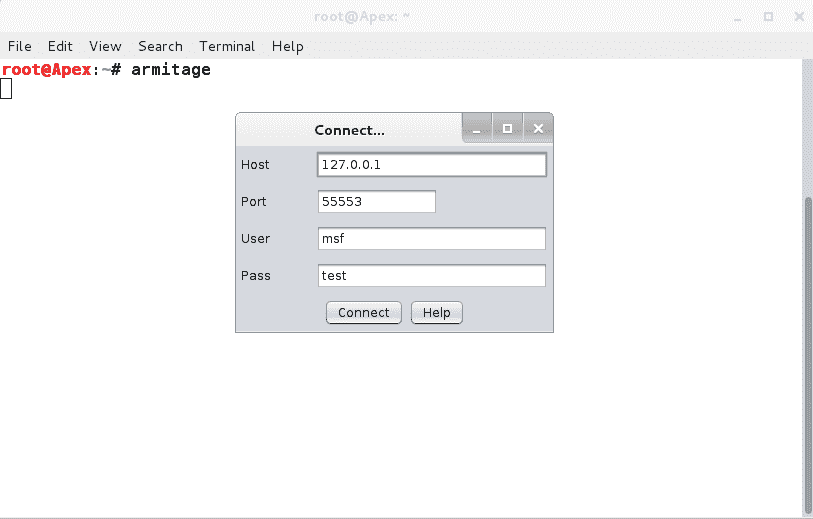
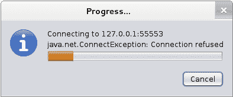
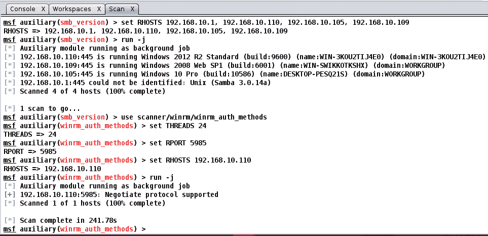
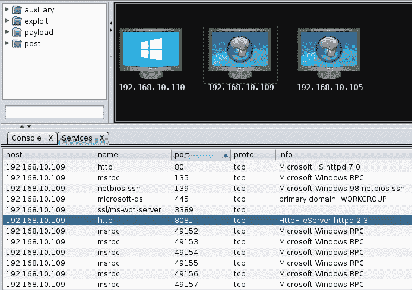
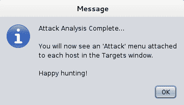
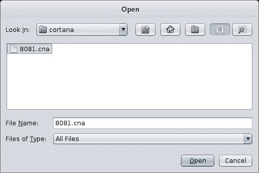
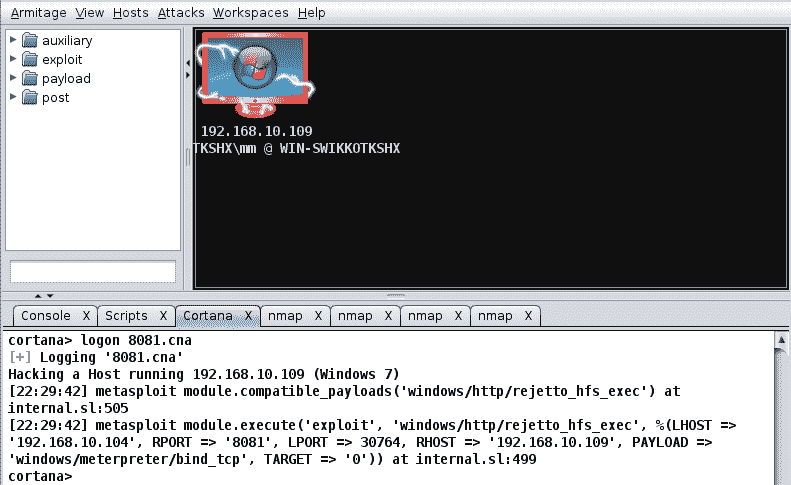
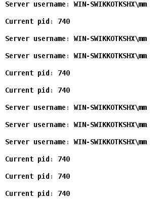
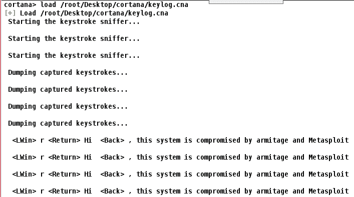

# 第二十一章：使用 Armitage 进行可视化

在上一章中，我们介绍了 Metasploit 如何帮助执法机构。让我们继续介绍一个不仅可以加快渗透速度，还可以为测试团队提供广泛的红队环境的强大工具。

**Armitage**是一个 GUI 工具，作为 Metasploit 的攻击管理器。Armitage 可视化 Metasploit 操作并推荐利用。Armitage 能够为 Metasploit 提供共享访问和团队管理。

在本章中，我们将介绍 Armitage 及其功能。我们还将看看如何使用这个支持 GUI 的工具进行 Metasploit 的渗透测试。在本章的后半部分，我们将介绍 Armitage 的 Cortana 脚本。

在本章中，我们将涵盖以下关键点：

+   使用 Armitage 进行渗透测试

+   扫描网络和主机管理

+   使用 Armitage 进行后渗透

+   使用团队服务器进行红队行动

+   Cortana 脚本的基础知识

+   使用 Armitage 中的 Cortana 脚本进行攻击

因此，让我们开始使用这个出色的可视化界面进行渗透测试之旅。

# Armitage 的基础知识

Armitage 是一个图形化自动化 Metasploit 的攻击管理工具。Armitage 是用 Java 构建的，由 Raphael Mudge 创建。它是一个跨平台工具，可以在 Linux 和 Windows 操作系统上运行。

# 开始

在本章中，我们将在 Kali Linux 中使用 Armitage。要启动 Armitage，请执行以下步骤：

1.  打开终端，输入`armitage`命令，如下截图所示：



1.  点击弹出框中的连接按钮以建立连接。

1.  要运行`armitage`命令，Metasploit 的**远程过程调用**（**RPC**）服务器应该在运行中。当我们点击上一个弹出框中的连接按钮时，会出现一个新的弹出框询问我们是否要启动 Metasploit 的 RPC 服务器。如下截图所示，点击 Yes：


1.  启动 Metasploit RPC 服务器需要一点时间。在此过程中，我们会看到诸如 Connection refused 等消息。这些错误是由于 Armitage 对连接进行检查并测试是否已建立。我们可以看到这样的错误，如下截图所示：



在开始使用 Armitage 时需要牢记的一些关键点如下：

+   确保你是 root 用户

+   对于 Kali Linux 用户，如果未安装 Armitage，请使用`apt-get install armitage`命令进行安装

如果 Armitage 无法找到数据库文件，请确保 Metasploit 数据库已初始化并正在运行。可以使用`msfdb init`命令初始化数据库，并使用`msfdb start`命令启动数据库。

# 浏览用户界面

如果连接正确建立，我们将看到 Armitage 界面面板。它将类似于以下截图：


Armitage 的界面很简单，主要包含三个不同的窗格，如前面的截图所示。让我们看看这三个窗格应该做什么：

+   左上角的第一个窗格包含了 Metasploit 提供的各种模块的引用：辅助、利用、有效载荷和后期。我们可以浏览并双击一个模块以立即启动它。此外，在第一个窗格之后，有一个小的输入框，我们可以使用它立即搜索模块，而不必探索层次结构。

+   第二个窗格显示了网络中存在的所有主机。例如，它将以图形格式显示运行 Windows 的系统为监视器，并显示 Windows 标志。同样，Linux 系统显示 Linux 标志，其他系统显示其他标志。它还会显示打印机的打印机符号，这是 Armitage 的一个很好的功能，因为它帮助我们识别网络上的设备。

+   第三个窗格显示了所有操作、后渗透过程、扫描过程、Metasploit 的控制台以及后渗透模块的结果。

# 管理工作区

正如我们在之前的章节中已经看到的，工作区用于维护各种攻击配置文件，而不会合并结果。假设我们正在处理一个范围，由于某种原因，我们需要停止测试并测试另一个范围。在这种情况下，我们将创建一个新的工作区，并使用该工作区来测试新的范围，以保持结果清晰和有组织。然而，在我们完成这个工作区的工作后，我们可以切换到另一个工作区。切换工作区将自动加载工作区的所有相关数据。这个功能将帮助保持所有扫描的数据分开，防止来自各种扫描的数据合并。

要创建一个新的工作区，导航到工作区选项卡并点击管理。这将呈现给我们工作区选项卡，如下面的截图所示：


在 Armitage 的第三个窗格中将打开一个新选项卡，用于显示有关工作区的所有信息。我们在这里看不到任何列出的东西，因为我们还没有创建任何工作区。

因此，让我们通过点击添加来创建一个工作区，如下面的截图所示：


我们可以用任何想要的名称添加工作区。假设我们添加了一个内部范围`192.168.10.0/24`。让我们看看在添加范围后工作区选项卡是什么样子的：


我们可以随时在所需的工作区之间切换，并点击激活按钮。

# 扫描网络和主机管理

Armitage 有一个名为 Hosts 的单独选项卡，用于管理和扫描主机。我们可以通过在 Hosts 选项卡上点击从文件导入主机来将主机导入到 Armitage 中，或者我们可以通过在 Hosts 选项卡上点击添加主机选项来手动添加主机。

Armitage 还提供了扫描主机的选项。有两种类型的扫描：Nmap 扫描和 MSF 扫描。MSF 扫描利用 Metasploit 中的各种端口和服务扫描模块，而 Nmap 扫描利用流行的端口扫描工具**Network Mapper**（Nmap）。

通过从 Hosts 选项卡中选择 MSF 扫描选项来扫描网络。但是，在点击 MSF 扫描后，Armitage 将显示一个弹出窗口，询问目标范围，如下面的截图所示：


一旦我们输入目标范围，Metasploit 将开始扫描网络以识别端口、服务和操作系统。我们可以在界面的第三个窗格中查看扫描详情，如下所示：



扫描完成后，目标网络上的每个主机都将以图标的形式出现在界面的第二个窗格中，代表主机的操作系统，如下面的截图所示：


在上面的截图中，我们有一个 Windows Server 2008，一个 Windows Server 2012 和一个 Windows 10 系统。让我们看看目标上运行着什么服务。

# 建模漏洞

通过右键单击所需主机并点击服务，让我们看看目标范围内主机上运行着什么服务。结果应该类似于下面的截图：



我们可以看到`192.168.10.109`主机上运行着许多服务，比如 Microsoft IIS httpd 7.0、Microsoft Windows RPC、HttpFileServer httpd 2.3 等等。让我们指示 Armitage 为这些服务找到匹配的漏洞。

# 寻找匹配

我们可以通过选择一个主机，然后浏览 Attacks 选项卡并点击 Find Attack 来找到目标的匹配攻击。Find Attack 选项将根据目标主机上运行的服务与攻击数据库进行匹配。Armitage 在将所有服务与攻击数据库进行匹配后生成一个弹窗，如下截图所示：



点击 OK 后，我们会注意到每当右键单击主机时，菜单上会出现一个名为 Attack 的新选项。Attack 子菜单将显示我们可以对目标主机发动的所有匹配的攻击模块。

# 使用 Armitage 进行攻击

当攻击菜单对主机可用时，我们就可以开始利用目标了。让我们从攻击菜单中选择使用 Rejetto HTTPFileServer 远程命令执行漏洞来攻击 HttpFileServer httpd 2.3。点击 Exploit 选项将弹出一个新的弹窗显示所有设置。让我们按照以下设置所有必需的选项：


设置好所有选项后，点击 Launch 来运行漏洞模块对目标进行攻击。在我们启动`exploit`模块后，我们将能够在界面的第三个窗格中看到对目标的利用正在进行，如下截图所示：


我们可以看到 Meterpreter 正在启动，这表示成功利用了目标。此外，目标主机的图标也会变成带有红色闪电的被控制系统图标。

# 使用 Armitage 进行后渗透

Armitage 使得后渗透变得如同点击按钮一样简单。要执行后渗透模块，右键单击被利用的主机，然后选择 Meterpreter 4，如下所示：


选择 Meterpreter 将在各个部分中显示所有后渗透模块。如果我们想提升权限或获得系统级访问权限，我们将导航到 Access 子菜单，并根据我们的需求点击适当的按钮。

与 Interact 子菜单提供获取命令提示符、另一个 Meterpreter 等选项。Explore 子菜单提供浏览文件、显示进程、记录按键、截图、摄像头拍摄和后模块等选项，用于启动不在此子菜单中的其他后渗透模块。

如下截图所示：


点击 Browse Files 来运行一个简单的后渗透模块，如下截图所示：


通过点击适当的按钮，我们可以轻松地在目标系统上上传、下载和查看任何文件。这就是 Armitage 的美妙之处；它将命令远离我们，并以图形格式呈现一切。

这就结束了我们使用 Armitage 进行远程渗透攻击。

# 使用 Armitage 团队服务器进行红队行动

对于大型渗透测试环境，通常需要进行红队行动，即一组渗透测试人员可以共同开展项目，以获得更好的结果。Armitage 提供了一个团队服务器，可以用于与渗透测试团队的成员高效共享操作。我们可以使用`teamserver`命令快速启动一个团队服务器，后面跟上可访问的 IP 地址和我们选择的密码，如下截图所示：


我们可以看到我们已经在 IP 地址`192.168.10.107`上启动了一个团队服务器的实例，并使用密码 hackers 进行身份验证。我们可以看到在成功初始化后，我们有了需要在团队成员之间传播的凭据详细信息。现在，让我们通过使用`armitage`命令从命令行初始化 Armitage 并输入连接详细信息来连接到这个团队服务器，如下面的屏幕截图所示：


一旦成功建立连接，我们将看到一个类似于以下的屏幕：


我们可以看到指纹与我们的团队服务器呈现的指纹相同。让我们选择是以继续：


我们可以选择一个昵称加入团队服务器。让我们按下 OK 进行连接：


我们可以看到我们已经成功从我们的本地 Armitage 实例连接到团队服务器。此外，所有连接的用户都可以通过事件日志窗口互相聊天。假设我们有另一个用户加入了团队服务器：


我们可以看到两个不同的用户互相交谈，并且从各自的实例连接。让我们初始化一个端口扫描，看看会发生什么：


我们可以看到用户`Nipun`开始了一个端口扫描，并且立即为另一个用户填充了，他可以查看目标。考虑到`Nipun`添加了一个主机进行测试并利用它：


我们可以看到用户`Kislay`也能够查看扫描的所有活动。但是，要让用户`Kislay`访问 Meterpreter，他需要切换到控制台空间，并输入`sessions`命令，然后是标识符，如下面的屏幕截图所示：


我们可以看到，Armitage 使我们能够以比使用单个 Metasploit 实例更高效地在团队环境中工作。让我们在下一节中看看如何编写 Armitage 脚本。

# 编写 Armitage 脚本

Cortana 是一种用于在 Armitage 中创建攻击向量的脚本语言。渗透测试人员使用 Cortana 进行红队行动，并虚拟克隆攻击向量，使其像机器人一样行动。然而，红队是一个独立的团队，挑战组织以提高其效率和安全性。

Cortana 使用 Metasploit 的远程过程客户端，利用一种脚本语言。它提供了在控制 Metasploit 的操作和自动管理数据库方面的灵活性。

此外，Cortana 脚本可以在特定事件发生时自动化渗透测试人员的响应。假设我们正在对一个包含 100 个系统的网络进行渗透测试，其中 29 个系统运行 Windows Server 2012，另一个系统运行 Linux 操作系统，我们需要一个机制，将自动利用每个运行 HttpFileServer httpd 2.3 的 Windows Server 2012 系统上的端口`8081`的 Rejetto HTTPFileServer 远程命令执行漏洞。

我们可以快速开发一个简单的脚本，将自动化整个任务并节省大量时间。一个用于自动化此任务的脚本将利用`rejetto_hfs_exec`漏洞在每个系统上执行预定的后渗透功能。

# Cortana 的基本原理

使用 Cortana 编写基本攻击将帮助我们更广泛地了解 Cortana。因此，让我们看一个自动化在端口`8081`上对 Windows 操作系统进行利用的示例脚本：

```
on service_add_8081 { 
      println("Hacking a Host running $1 (" . host_os($1) . ")"); 
      if (host_os($1) eq "Windows 7") { 
              exploit("windows/http/rejetto_hfs_exec", $1, %(RPORT => "8081")); 
      } 
} 
```

当 Nmap 或 MSF 扫描发现端口`8081`开放时，前面的脚本将执行。脚本将检查目标是否在运行 Windows 7 系统，Cortana 将自动攻击端口`8081`上的主机，使用`rejetto_hfs_exec`漏洞利用。

在前面的脚本中，`$1`指定了主机的 IP 地址。`print_ln`打印字符串和变量。`host_os`是 Cortana 中返回主机操作系统的函数。`exploit`函数在由`$1`参数指定的地址上启动一个利用模块，`%`表示可以为利用设置的选项，以防服务在不同端口运行或需要额外的详细信息。`service_add_8081`指定了在特定客户端上发现端口`8081`开放时要触发的事件。

让我们保存前面提到的脚本，并通过导航到 Armitage 选项卡并点击脚本来加载这个脚本到 Armitage 中：


要针对目标运行脚本，请执行以下步骤：

1.  点击加载按钮将 Cortana 脚本加载到 Armitage 中：



1.  选择脚本，然后点击打开。该操作将永久加载脚本到 Armitage 中：


1.  转到 Cortana 控制台，输入`help`命令以列出 Cortana 在处理脚本时可以使用的各种选项。

1.  接下来，为了查看 Cortana 脚本运行时执行的各种操作，我们将使用`logon`命令，后跟脚本的名称。`logon`命令将为脚本提供日志记录功能，并记录脚本执行的每个操作，如下图所示：


1.  现在，让我们通过浏览主机选项卡并从 Nmap 子菜单中选择强烈扫描来对目标进行强烈扫描。

1.  正如我们所看到的，我们发现一个开放端口为`8081`的主机。让我们回到我们的`Cortana`控制台，看看是否发生了一些活动：



1.  砰！Cortana 已经通过在目标主机上自动启动漏洞利用程序来接管了主机。

正如我们所看到的，Cortana 通过自动执行操作为我们简化了渗透测试。在接下来的几节中，我们将看看如何使用 Cortana 自动化后期利用并处理 Metasploit 的进一步操作。

# 控制 Metasploit

Cortana 非常好地控制了 Metasploit 的功能。我们可以使用 Cortana 向 Metasploit 发送任何命令。让我们看一个示例脚本，以帮助我们更多地了解如何从 Cortana 控制 Metasploit 的功能：

```
cmd_async("hosts"); 
cmd_async("services"); 
on console_hosts { 
println("Hosts in the Database"); 
println(" $3 "); 
} 
on console_services { 
println("Services in the Database"); 
println(" $3 "); 
} 
```

在前面的脚本中，`cmd_async`命令将`hosts`和`services`命令发送到 Metasploit，并确保它们被执行。此外，`console_*`函数用于打印由`cmd_async`发送的命令的输出。Metasploit 将执行这些命令；但是，为了打印输出，我们需要定义`console_*`函数。此外，`$3`是保存由 Metasploit 执行的命令的输出的参数。加载`ready.cna`脚本后，让我们打开 Cortana 控制台查看输出：


显然，命令的输出显示在前面的截图中，这结束了我们目前的讨论。但是，有关 Cortana 脚本和通过 Armitage 控制 Metasploit 的更多信息可以在以下网址获得：[`www.fastandeasyhacking.com/download/cortana/cortana_tutorial.pdf`](http://www.fastandeasyhacking.com/download/cortana/cortana_tutorial.pdf)。

# 使用 Cortana 进行后期利用

Cortana 的后期利用也很简单。Cortana 的内置功能可以使后期利用变得容易。让我们通过以下示例脚本来理解这一点：

```
on heartbeat_15s { 
local('$sid'); 
foreach $sid (session_ids()) { 
if (-iswinmeterpreter $sid && -isready $sid) {   
m_cmd($sid, "getuid"); 
m_cmd($sid, "getpid"); 
on meterpreter_getuid { 
println(" $3 "); 
} 
on meterpreter_getpid { 
println(" $3 "); 
} 
} 
} 
} 
```

在上面的脚本中，我们使用了一个名为`heartbeat_15s`的函数。这个函数每`15`秒重复执行一次。因此，它被称为**心跳**函数。

`local`函数将表示`$sid`是当前函数的本地变量。下一个`foreach`语句是一个循环，遍历每个打开的会话。`if`语句将检查会话类型是否为 Windows Meterpreter，并且它已准备好进行交互和接受命令。

`m_cmd`函数将使用参数`$sid`发送命令到 Meterpreter 会话，其中`$sid`是会话 ID，以及要执行的命令。接下来，我们定义一个以`meterpreter_*`开头的函数，其中`*`表示发送到 Meterpreter 会话的命令。此函数将打印`sent`命令的输出，就像我们在上一个练习中为`console_hosts`和`console_services`所做的那样。

让我们运行这个脚本并分析结果，如下面的屏幕截图所示：



一旦我们加载脚本，它将在每`15`秒后显示目标的用户 ID 和当前进程 ID。

有关 Cortana 中的后期利用、脚本和函数的更多信息，请参阅[`www.fastandeasyhacking.com/download/cortana/cortana_tutorial.pdf`](http://www.fastandeasyhacking.com/download/cortana/cortana_tutorial.pdf)。

# 在 Cortana 中构建自定义菜单

Cortana 在构建自定义弹出菜单方面也提供了出色的输出，这些菜单在获取 Meterpreter 会话和其他类型的会话后附加到主机上。让我们使用 Cortana 构建一个自定义键盘记录器菜单，并通过分析以下脚本来了解其工作原理：

```
popup meterpreter_bottom { 
menu "&My Key Logger" { 
item "&Start Key Logger" { 
m_cmd($1, "keyscan_start"); 
} 
item "&Stop Key Logger" { 
m_cmd($1, "keyscan_stop"); 
} 
item "&Show Keylogs" { 
m_cmd($1, "keyscan_dump"); 
} 
on meterpreter_keyscan_start { 
println(" $3 "); 
} 
on meterpreter_keyscan_stop { 
println(" $3 "); 
} 
on meterpreter_keyscan_dump { 
println(" $3 "); 
} 
} 
}
```

上面的示例显示了在 Meterpreter 子菜单中创建弹出窗口。但是，只有在我们能够利用目标主机并成功获取 Meterpreter shell 时，此弹出窗口才可用。

`popup`关键字将表示弹出窗口的创建。`meterpreter_bottom`函数将表示 Armitage 将在用户右键单击受损的主机并选择`Meterpreter`选项时在底部显示此菜单。`item`关键字指定菜单中的各个项目。`m_cmd`命令是将 Meterpreter 命令与其相应的会话 ID 发送到 Metasploit 的命令。

因此，在上面的脚本中，我们有三个项目：启动键盘记录器，停止键盘记录器和显示键盘记录。它们分别用于启动键盘记录，停止键盘记录和显示日志中存在的数据。我们还声明了三个函数，用于处理发送到 Meterpreter 的命令的输出。让我们将这个脚本加载到 Cortana 中，利用主机，并在受损的主机上右键单击，这将呈现给我们以下菜单：


我们可以看到，每当我们右键单击受损的主机并浏览 Meterpreter 3 菜单时，我们将看到一个名为 My Key Logger 的新菜单列在所有菜单的底部。此菜单将包含我们在脚本中声明的所有项目。每当我们从此菜单中选择一个选项时，相应的命令将运行并在 Cortana 控制台上显示其输出。让我们选择第一个选项“启动键盘记录器”。等待一段时间，让目标输入一些内容，然后从菜单中选择第三个选项“显示键盘记录”，如下面的屏幕截图所示：


当我们点击“显示键盘记录”选项时，我们将在 Cortana 控制台中看到在受损主机上工作的人键入的字符，如下面的屏幕截图所示：



# 使用接口进行工作

Cortana 在处理界面时也提供了灵活的方法。Cortana 提供了创建快捷方式、表格、切换选项卡和各种其他操作的选项和功能。假设我们想要添加自定义功能，比如当我们从键盘按下*F1*键时，Cortana 会显示目标主机的`UID`。让我们看一个能实现这一功能的脚本的例子：

```
bind F1 { 
$sid ="3"; 
spawn(&gu, \$sid);   
}  
sub gu{   
m_cmd($sid,"getuid"); 
on meterpreter_getuid { 
show_message( " $3 "); 
} 
} 
```

上面的脚本将添加一个快捷键`F1`，按下时将显示目标系统的`UID`。脚本中的`bind`关键字表示将功能与*F1*键绑定。接下来，我们将`$sid`变量的值定义为`3`（这是我们将要交互的会话 ID 的值）。

`spawn`函数将创建一个新的 Cortana 实例，执行`gu`函数，并将值`$sid`安装到新实例的全局范围内。`gu`函数将向 Meterpreter 发送`getuid`命令。`meterpreter_getuid`命令将处理`getuid`命令的输出。

`show_message`命令将显示一个消息，显示`getuid`命令的输出。让我们将脚本加载到 Armitage 中，按下*F1*键来检查并查看我们当前的脚本是否正确执行：


砰！我们很容易得到了目标系统的`UID`，它是 WIN-SWIKKOTKSHXmm。这结束了我们关于使用 Armitage 的 Cortana 脚本的讨论。

有关 Cortana 脚本及其各种功能的更多信息，请参阅：[`www.fastandeasyhacking.com/download/cortana/cortana_tutorial.pdf`](http://www.fastandeasyhacking.com/download/cortana/cortana_tutorial.pdf)。

# 总结

在本章中，我们仔细研究了 Armitage 及其多种功能。我们首先看了界面和工作区的建立。我们还看到了如何利用 Armitage 对主机进行利用。我们研究了远程利用和客户端利用以及后期利用。此外，我们还深入研究了 Cortana，并讨论了它的基本原理，使用它来控制 Metasploit，编写后期利用脚本，自定义菜单和界面等。
