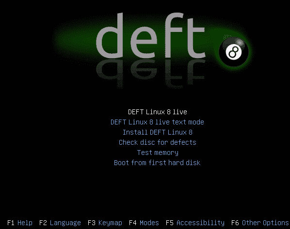
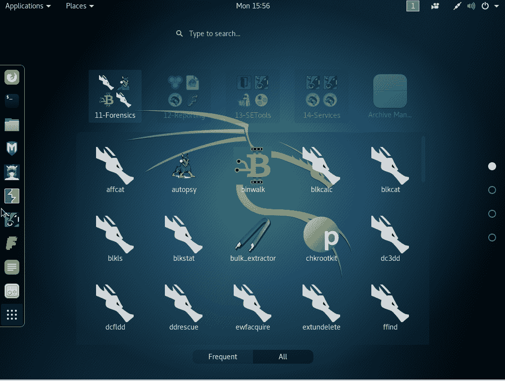

# 第一章：数字取证简介

数字取证已经吸引了我超过 13 年的注意。自从我得到了我的第一台个人电脑（谢谢，爸妈）以来，我一直想知道当我从我的巨大的 2GB 硬盘驱动器中删除文件或将文件移动（大多数时候是隐藏）到一个不那么显眼的 3.5 英寸软盘中，会发生什么，这个软盘的容量最多只有 1.44MB。

正如我很快了解到的那样，硬盘驱动器和软盘驱动器并没有我如此自信地相信的数字不朽。可悲的是，许多文件、文档和由我亲自在 Microsoft Paint 中创作的无价艺术品都消失在了数字世界中，再也无法找回了。叹息。世界将永远不会知道。

直到多年后，我在浏览互联网时偶然发现了一篇关于文件恢复和相关工具的文章，这是在我拥有闪电般快速的 42Kbps 拨号互联网连接时（这得益于我非常昂贵的 USRobotics 拨号调制解调器），每次我尝试连接到互联网的时候，都会唱出科技之神的赞歌。这个过程需要一种像忍者一样的隐秘技能，即使是黑色行动小组也会羡慕，因为这样做是不让父母注意到的，这样他们就无法使用电话线打电话或接电话了。（对不起，亲爱的母亲、父亲和年长的姐姐）。

之前关于数据恢复的文章并不像今天广泛可得的许多优秀的同行评议论文、期刊和书籍那样详细和充满事实。作为一个完全的新手（也被称为 noob），我确实学到了很多关于文件系统、数据和元数据、存储测量以及各种存储介质的基础知识。

就在这个时候，尽管我已经阅读过关于 Linux 操作系统及其各种发行版（或 distros）的文章，我开始了解为什么 Linux distros 在数据恢复和取证中如此受欢迎。

在那个时候，我勇敢地在拨号连接上下载了 Auditor 和 Slax Linux 发行版。仅仅下载这些操作系统就是一项了不起的成就，这让我感到非常自豪，因为我根本不知道如何安装它们，更不用说真正使用它们了。在那些日子里，易安装和图形用户界面仍在积极开发中，正如它们当时一样用户友好，或者在我这种情况下，用户不友好（主要是因为我的经验不足，缺乏推荐的硬件，以及缺乏在线论坛、博客和 YouTube 等资源……这些我当时还不知道）。我将在第二章中更多地解释 Auditor 和 Slax 操作系统，*安装 Kali Linux*，包括它们在臭名昭著的 BackTrack 和现在的 Kali Linux 操作系统中的作用。

随着时间的推移，我研究了在 Windows、Macintosh 和许多 Linux 发行版上找到的许多工具。我发现许多数字取证中使用的工具可以安装在各种 Linux 发行版或版本中，这些工具都得到了良好的维护，不断地在发展，并且被同行广泛接受。Kali Linux 是一种 Linux 发行版或版本，但在我们继续之前，让我解释一下 Linux 发行版或版本的概念。想象一下你最喜欢的饮料：这种饮料可以有很多口味，有些没有甜味剂或糖，有不同的颜色，甚至有不同的大小。无论有什么变化，它仍然是组成饮料的基本成分。同样，我们也有 Linux，以及不同类型和品种的 Linux。一些更受欢迎的 Linux 发行版和版本包括 RedHat、CentOS、Ubuntu、Mint、Knoppix，当然还有 Kali Linux。关于 Kali Linux 的更多内容将在第二章中讨论，*安装 Kali Linux*。

对于本书，我们采取了非常结构化的数字取证方法，就像我们在法庭科学中一样。我们首先进入数字取证的世界，了解其历史，一些用于取证的工具和操作系统，并立即向您介绍涉及证据保全的概念。

我们开始吧。让我们开始吧！

本章介绍了数字取证科学的各个方面。

本章我们将涵盖的主题有：

+   什么是数字取证？

+   数字取证方法。

+   数字取证的简史。

+   随着技术的进步，数字取证的需求也在增加。

+   反取证：对数字取证的威胁

+   数字取证领域可用的商业工具。

+   开源工具。

+   内置数字取证工具的操作系统。

+   在调查中需要使用多种取证工具，以提供强有力的完整性证据。

# 什么是数字取证？

我想在本章中首先介绍的是对数字取证及其正确实践和程序的理解。在某个时候，你可能已经接触过几本书、博客，甚至演示了数字取证的各个方面和不同的工具。重要的是要理解，取证本身是一门科学，涉及非常详细的最佳实践和方法，以揭示某事是否存在。

数字取证涉及对各种存储介质中的证据进行保全、获取、文档化、分析和解释。它不仅限于笔记本电脑、台式机、平板电脑和移动设备，还包括在公共或私人网络上传输的数据。

在大多数情况下，数字取证涉及使用各种方法和工具来发现和/或恢复数据。数字取证调查包括但不限于：

+   **数据恢复**：调查和恢复可能已被删除、更改为不同文件扩展名甚至隐藏的数据。

+   **身份盗窃**：许多欺诈活动，从盗用信用卡到虚假社交媒体资料，通常涉及某种形式的身份盗窃。

+   **恶意软件和勒索软件调查**：迄今为止，通过特洛伊木马和蠕虫传播的勒索软件是公司、军事组织和个人面临的最大威胁之一。恶意软件也可能传播到移动设备和智能设备上。

+   **网络和互联网调查**：调查**DoS**（称为**拒绝服务**）和**DDoS**（称为**分布式拒绝服务**）攻击，并追踪访问的设备，包括打印机和文件。

+   **电子邮件调查**：调查源和 IP 来源、附件内容和地理位置信息都可以进行调查。

+   **企业间谍活动**：许多公司正在摆脱纸质副本，转向云和传统磁盘媒体。因此，总是会留下数字足迹；如果敏感信息被访问或传输，会留下数字足迹吗？

+   **儿童色情调查**：可悲的是，儿童在互联网和深网中被广泛剥削。借助技术和高技能的取证分析师，可以通过分析互联网流量、浏览器历史、支付交易、电子邮件记录和图像来进行调查，以打击剥削团伙。

# 数字取证方法

请记住，取证是一门科学，数字取证要求人们遵循适当的最佳实践和程序，以便一次又一次地产生相同的结果，提供证据、保全和完整性的证明，这些可以被复制；如果需要的话。

尽管许多人可能不会进行数字取证以作为法庭证据，最好还是以一种可以在法庭上被接受和呈现的方式进行实践。遵循专门从事数字取证和事件响应的组织制定的最佳实践的主要目的是在调查期间保持证据的完整性。如果调查人员的工作必须由另一方或对立方进行审查和批评，调查人员发现的结果必须能够被重现，从而证明调查的完整性。这样做的目的是确保您的方法可以重复，并且如果被剖析或审查，每次都能产生相同的结果。所使用的方法，包括调查的程序和结果，应始终允许数据的完整性得到维护，无论使用何种工具。

本书中展示的最佳实践确保原始证据未被篡改，或者在调查设备和数据的实时或生产环境中，展示了在调查过程中采取了必要步骤以避免对证据进行不必要的篡改，从而保持了证据的完整性。对于完全不熟悉调查的人，我建议熟悉一些专业社区提供的各种实践和方法。

因此，存在一些指南和方法论，人们应该采用，或者至少遵循，以确保检查和调查在法医上是可靠的。

本章提到的两个最佳实践文件是：

+   ACPO 的数字证据良好实践指南

+   SWGDE 的计算机取证最佳实践。

尽管这篇文章是在 2012 年写的，但英国首席警官协会（ACPO），现在作为国家警察局长委员会（NPCO）运作，提出了一份名为《ACPO 数字证据良好实践指南》的 PDF 文件，其中介绍了进行数字取证调查时的最佳实践，特别关注证据获取。《ACPO 数字证据良好实践指南》随后被英格兰、威尔士和北爱尔兰的执法机构采纳和遵守，并可在[`www.7safe.com/docs/default-source/default-document-library/acpo_guidelines_computer_evidence_v4_web.pdf`](https://www.7safe.com/docs/default-source/default-document-library/acpo_guidelines_computer_evidence_v4_web.pdf)上完整下载。

另一份有用且更为最新的文件是在 2014 年 9 月发布的，关于数字取证最佳实践的文件，由科学数字证据工作组（SWGDE）发布。SWGDE 成立于 1998 年，由联邦犯罪实验室主任组成，主要成员和贡献者包括联邦调查局、缉毒局、美国国家航空航天局和国防部计算机取证实验室。尽管该文件详细介绍了正式计算机取证实验室环境中的程序和实践，但这些实践仍然可以应用于目前不在或无法接触到这种环境的非实验室调查人员。

《SWGDE 计算机取证最佳实践》阐明了以下章节涵盖的许多主题：

+   证据收集和获取

+   调查通电和断电的设备

+   证据处理

+   分析和报告

完整文件可在[`www.swgde.org/documents/Current%20Documents/SWGDE%20Best%20Practices%20for%20Computer%20Forensics`](https://www.swgde.org/documents/Current%20Documents/SWGDE%20Best%20Practices%20for%20Computer%20Forensics)上公开获取。

# 数字取证的简要历史

尽管法庭科学本身（包括第一次记录的指纹）已经存在了 100 多年，但与数字世界相关的数字取证是一个更年轻的领域，主要是在 20 世纪 80 年代个人计算机问世后才开始流行。

为了比较，试图理解数字取证作为相对较新的概念，考虑到第一个实际的法庭科学实验室是由 FBI 于 1932 年开发的。

数字取证调查中最早使用的一些工具是在 1984 年左右由 FBI 实验室开发的，数字取证调查由 FBI 的专门的 CART（计算机分析和响应团队）领导，该团队负责协助数字调查。

数字取证作为自己的领域在 20 世纪 90 年代大幅增长，几个执法机构和部门负责人合作，甚至定期会面，将他们的专业知识带到桌面。

最早的正式会议之一是由 FBI 于 1993 年举办的。这次名为“国际执法部门计算机证据会议”的活动的主要焦点是解决数字取证和证据获取的正式标准和程序的需求。

许多这些会议导致了处理数字取证标准和最佳实践的机构的形成。例如，SWGDE 是由联邦犯罪实验室主任于 1998 年成立的。SWGDE 负责制定被广泛采用的计算机证据最佳实践（本章后面讨论）。SWGDE 还与其他组织合作，例如成立于 1973 年的非常受欢迎的美国犯罪实验室主任协会（ASCLDs），自那时以来一直在最佳实践、程序和培训的持续发展方面发挥着重要作用，与法庭科学相关。

然而，直到 21 世纪初，FBI 才建立了一个正式的区域计算机取证实验室（RCFL）。2002 年，成立了国家计划办公室（NPO），作为一个中央机构，基本上协调和支持 RCFL 执法部门之间的努力。

自那时以来，我们已经看到几个机构，如 FBI、CIA、NSA 和 GCHQ，每个机构都有自己的完整网络犯罪部门、完整的数字取证实验室、专门的现场和外勤特工，努力合作，以应对可能是不折不扣的 Sisyphean 任务，考虑到技术的快速增长和对互联网甚至暗网的更容易访问。

随着技术的进步，数字取证工具必须定期更新，不仅是为了打击网络犯罪，还为了提供问责制和检索丢失的数据。自从软盘、磁盘驱动器和拨号上网访问的日子以来，我们已经走了很长一段路，现在面临着 SD 卡、固态驱动器和以千兆速度的光纤互联网连接。

# 随着技术的进步，数字取证的需求

你们中的一些人可能年轻到足以记得 Windows 95、3.x 甚至 DOS（磁盘操作系统）的日子。今天的智能手表、计算器和许多物联网设备比第一代个人计算机和服务器快得多。1995 年，常见的硬盘驱动器容量在 4GB 到 10GB 之间，而今天你可以轻松购买容量为 2TB 及以上的驱动器。

还要考虑今天的各种存储介质，包括闪存驱动器、SD 卡、CD、DVD、蓝光光盘、混合和固态驱动器，与旧的软盘相比，后者在其最紧凑和高效的状态下只能在 3 ¼英寸的磁盘上存储 1.44 MB 的数据。尽管在后面的章节中有详细讨论，但我们现在不仅有许多存储数据的选项，还有丢失和隐藏数据的选项。

随着技术的进步，人们对编程语言、普通和高级操作系统的理解更加深入，对数字设备的知识和利用也更加深入。这也转化为更加用户友好的界面，可以完成许多与 CLI 相同的任务，主要由高级用户使用。基本上，今天的简单 GUI，再加上搜索引擎上随处可见的大量资源，可以使某些任务（如隐藏数据）比以前更容易。

隐藏大量数据如今也更加简单，考虑到处理器的速度，加上大量的内存，包括可以充当内存的设备，远远超过了仅仅五年前的情况。还必须提到和考虑到显卡，因为越来越多的移动设备配备了非常强大的高端 NVIDIA 和 ATI 显卡，它们也有自己独立的内存，有助于处理过程。考虑到所有这些因素确实支持了戈登·E·摩尔在 20 世纪 70 年代提出的一个观点，即计算能力每两年翻一番，通常被称为摩尔定律。

然而，英伟达首席执行官黄仁勋最近表示，由于 GPU（图形处理单元）的性能、技术进步和处理人工智能的能力，摩尔定律正在消失，GPU 最终将取代 CPU。黄仁勋的声明也得到了英特尔首席执行官布莱恩·克兰齐奇的支持。

总的来说，现在有几种进行网络犯罪的途径，包括恶意软件和勒索软件分发，DoS 和 DDoS 攻击，间谍活动，勒索，身份盗窃，数据盗窃，非法在线活动和交易以及大量其他恶意活动。其中许多活动是匿名的，因为它们发生在互联网上，通常使用掩盖的 IP 地址和公共网络进行，因此使得相关机构在确定位置和逮捕嫌疑人方面更加困难。

由于网络犯罪是一门大生意，执法官员和机构的反应在研究、开发、情报和培训部门必须同样令人印象深刻，如果他们要在数字世界中进行看似永无止境的战斗中进行抵抗。

数字取证不仅适用于存储介质，还适用于网络和互联网连接、移动设备、物联网设备，实际上，任何可以存储、访问或传输数据的设备。因此，根据手头的任务，我们有各种商业和开源工具可供选择。

# 数字取证领域提供的商业工具

尽管本书关注 Kali Linux 操作系统中的工具，但重要的是要认识到我们可以使用的商业工具，其中许多工具在确定偏好之前可以作为试用版或演示版下载。

由于本书主要关注开源工具，我只会提及一些更受欢迎的商业工具以及它们的主页。这些工具仅按字母顺序列出，不反映任何评级、评论或作者的个人偏好：

+   EnCase® Forensic：[`www.guidancesoftware.com/encase-forensic`](https://www.guidancesoftware.com/encase-forensic)

+   F-Response：[`www.f-response.com/`](https://www.f-response.com/)

+   Forensic Toolkit：[`accessdata.com/products-services/forensic-toolkit-ftk`](http://accessdata.com/products-services/forensic-toolkit-ftk)

+   Helix Enterprise：[`www.e-fense.com/h3-enterprise.php`](http://www.e-fense.com/h3-enterprise.php)

+   磁铁公理：[`www.magnetforensics.com/computer-forensics/`](https://www.magnetforensics.com/computer-forensics/)

+   X-Ways Forensics：[`www.x-ways.net/forensics/index-m.html`](http://www.x-ways.net/forensics/index-m.html)

许多商业工具都允许以下功能，并且还提供几个专有功能，包括：

+   写入阻塞

+   逐位或比特流复制和磁盘克隆/证据克隆

+   取证合规的证据获取

+   使用哈希保留证据

+   文件恢复（隐藏和删除）

+   现场和远程取证

+   RAM 和交换/分页文件分析

+   镜像挂载（支持各种格式）

+   高级数据和元数据（关于数据的数据）搜索和过滤

+   文件和扇区的书签

+   哈希和密码破解

+   自动生成报告

商业工具的主要优势通常是自动化，并且实际上是一套几乎总是可以完成整个调查的工具，只需点击几下。我必须提到的另一个优势是购买许可证时提供的工具支持。这些工具的开发人员还雇用研究和开发团队，以确保对其当前和新产品进行持续测试和审查。

# 数字取证的操作系统和开源工具

就像有几种商业工具可用一样，调查人员和业余和专业人员也有许多开源工具可用。其中许多工具是基于 Linux 的，并且可以在几个免费的取证发行版中找到。

在选择工具时通常出现的主要问题通常基于商业与开源。无论使用商业工具还是开源工具，最终结果应该是相同的，即保留和保持原始证据的完整性应该是首要任务。

预算始终是一个问题，一些商业工具（尽管它们可能非常强大、准确和用户友好）可能会花费数千美元。

开源工具可以免费使用，根据不同的开源许可证，不应该被排除在外，只因为它们没有企业开发人员和研究人员的支持。许多开源工具受到取证社区的广泛审查，可能会更受到审查，因为它们更广泛地向公众开放，并且是以非专有代码构建的。

尽管本书的重点是 Kali Linux 中的取证工具，我们将在本节末尾和之后开始查看，但以下是一些更受欢迎的开源取证发行版或发行版。

以下各节提到的发行版都可以在许多地方免费获得，但出于安全原因，我们将提供它们主页的直接链接。本节中展示的操作系统仅按字母顺序列出，并不反映任何评级、评论，甚至不反映作者的个人偏好。

# 数字取证和取证工具 Linux

**数字取证和取证工具**（**DEFT**）Linux 有完整版本和称为**DEFT Zero**的轻量级版本。出于取证目的，您可能希望下载完整版本，因为 Zero 版本不支持移动取证和密码破解功能。

+   **主页**：[`www.deftlinux.net/about/`](http://www.deftlinux.net/about/)

+   **基于**：Ubuntu 桌面

+   **发行类型**：取证和事件响应

就像本列表中提到的其他发行版一样，DEFT 也是一个完全功能的**现场响应**取证工具，可以在无法关闭计算机的情况下使用，并且还允许对 RAM 和交换文件进行即时分析：

从 DEFT Linux DVD、可启动的闪存或其他媒体启动时，用户会看到各种选项，包括将 DEFT Linux 安装到硬盘，或者选择 DEFT Linux 8 live 选项，作为现场响应工具或操作系统使用。

在上一张截图中，可以看到 DEFT Linux 8 中有几个取证类别，如反恶意软件、数据恢复、哈希、成像、移动取证和网络取证、密码恢复和报告工具。在每个类别中都有几个由各种开发人员创建的工具，给调查人员提供了多种选择。

有关**Digital Evidence Forensic Toolkit**（**DEFT**）Linux 操作系统在本出版时包含的功能和软件包的完整列表，请访问以下链接：

[`www.deftlinux.net/package-list/`](http://www.deftlinux.net/package-list/)

# 计算机辅助调查环境

**计算机辅助调查环境**（**CAINE**）是一个可启动的现场响应 CD/DVD，具有安全模式、文本模式、作为现场系统或在 RAM 中启动的选项，如下所示：

+   **主页**：[`www.caine-live.net/`](http://www.caine-live.net/)

+   **基于**：GNU Linux。

+   **发行类型**：取证和事件响应

在选择启动选项后，CAINE 最引人注目的特点之一是轻松找到写入阻断器功能，如下图所示的 BlockON/OFF 图标。激活此功能可以防止 CAINE OS 向证据机器或驱动器写入数据：

在 CAINE 中，**取证工具**是列出的第一个菜单。与 DEFT Linux 一样，在菜单中有几个类别，如下图所示，其中包含一些在开源取证中使用的更受欢迎的工具。除了类别外，还有一些直接链接到一些更知名的工具，如**Guymager**和**Autopsy**，这两者都将在后面的章节中详细介绍：

有关 CAINE 在本出版时包含的功能和软件包的完整列表，请访问以下链接：

[`www.caine-live.net/page11/page11.html`](http://www.caine-live.net/page11/page11.html)

# Kali Linux

最后，我们来到这个可爱的宝石，Kali Linux，在下一章和本书的整个过程中将详细讨论其从安装到高级取证使用的细节。

+   **主页**：[`www.kali.org/`](https://www.kali.org/)

+   **基于**：Debian

+   **发行类型**：渗透测试、取证和反取证

Kali Linux 是作为渗透测试或渗透测试发行版而创建的，最初名为 BackTrack，后来在 2015 年演变为 Kali Linux。这个强大的工具是全球渗透测试人员和安全爱好者的首选工具。作为**Certified EC-Council Instructor**（**CEI**）的**Certified Ethical Hacker**（**CEH**）课程，这个操作系统通常是课堂上的明星，因为它包含了许多令人印象深刻的捆绑安全程序，从扫描和侦察工具到高级利用工具和报告工具。

与上述工具一样，Kali Linux 可以用作现场响应取证工具，因为它包含了进行全面调查所需的许多工具。但是，Kali 也可以用作完整的操作系统，因为它可以完全安装到硬盘或闪存驱动器上，并且还包含了一些用于生产力和娱乐的工具。它配备了许多成功使用硬件、图形和网络所需的驱动程序，并且在 32 位和 64 位系统上以最少的资源平稳运行；它还可以安装在某些移动设备上，如**Nexus**和**OnePlus**手机和平板电脑上。

除了其多功能性之外，从光盘/闪存驱动器启动时，调查人员还有几个选择，包括现场（取证模式），这样可以保持证据驱动器的完整性，并且不会干扰它，同时还禁用了任何闪存驱动器和其他存储介质的自动挂载，确保在整个调查过程中原始证据的完整性。

当从 DVD 或闪存驱动器启动到 Kali Linux 时，用户首先会看到现场环境和安装的选项。从列表中选择第三个选项将进入现场（取证模式），如下面的屏幕截图所示：

一旦 Kali Live（取证模式）启动，调查人员将看到与在 Kali 中使用任何 GUI 时看到的完全相同的主屏幕，如下面的屏幕截图所示：

单击“应用程序”可以在左上角找到 Kali 菜单。这将带用户进入菜单列表，显示较低的取证类别，如 11-取证。以下屏幕截图展示了 Kali 中一些取证工具的情况，我们将在本书中稍后使用：

应该注意的是，列出的工具并不是 Kali 中唯一可用的工具。正如我们将在后面的章节中看到的，还有其他几个工具可以通过终端调用。

值得注意的是，当它处于取证模式时，Kali 不仅不会篡改原始证据驱动器，而且也不会向交换文件中写入数据，其中可能存储了最近访问和存储在内存中的重要数据。

下面的屏幕截图显示了使用侧边栏菜单中最后一个图标（类似于方形中的九个点）访问取证工具菜单的另一个视图：

有关 Kali Linux 操作系统在发布时包含的功能和软件包的完整列表，请访问以下链接：

[`tools.kali.org/tools-listing`](https://tools.kali.org/tools-listing)

在提到的三个取证发行版中，Kali 可以作为现场响应取证工具运行，但也可以像 Windows、Mac 和 Android 一样作为完整的操作系统使用，因为它包含了几个内置的生产力和日常使用工具。Kali 可以安装到硬盘上，这意味着可以定期下载和更新其他工具，持续访问所有 IT 安全和取证工具，允许用户在使用工具时保存进度，而不必过多担心重新启动他们的机器，如果他们决定将其用作完整的操作系统。

使用这些开源取证操作系统，如 Kali，为我们提供了一系列可供选择和使用的工具。在每个发行版的每个类别中都有许多执行相同任务的工具。这是好事，因为我们的发现应该能够使用不同的工具来复制。这在调查人员的工作可能受到批评，案件和证据的完整性受到质疑和审查的情况下尤为重要；正确使用多个工具将产生一致的结果。

# 数字调查中需要多个取证工具

证据保全至关重要。正确使用商业和开源工具将产生结果；然而，为了获得法医学上可靠的结果，有时最好使用多个工具并产生相同的结果。

使用多个工具的另一个原因可能仅仅是成本。我们中的一些人可能有很大的预算可以使用，而其他人可能根本没有或预算有限。商业工具可能成本高昂，特别是由于研发、测试、广告和其他因素。开源工具虽然经过社区测试，但可能没有商业工具那样的资源和资金。

*那么，我们如何知道选择哪些工具呢？*

数字取证通常非常耗时，这也是您可能希望使用多个证据的数字取证副本的原因之一。这样，您可以同时使用不同的工具来加快调查的进展。虽然快速工具可能是一件好事，但我们也应该质疑工具的可靠性和准确性。

**国家标准与技术研究所**（**NIST**）制定了一个**计算机取证工具测试**（**CFTT**）计划，测试数字取证工具并将所有发现结果提供给公众。根据其特定能力选择了几种工具，并将其放入磁盘成像、刻录和文件恢复等测试类别。每个类别都有一个正式的测试计划和测试策略，以及一个可供公众查阅的验证报告。

有关 CFTT 计划的更多信息可以在[`www.cftt.nist.gov/disk_imaging.htm`](https://www.cftt.nist.gov/disk_imaging.htm)找到。有关本书涵盖的许多工具的测试和验证报告可以在[`www.dhs.gov/science-and-technology/nist-cftt-reports`](https://www.dhs.gov/science-and-technology/nist-cftt-reports)找到。

为了强调使用多个工具来维护调查和发现的完整性的重要性，本书的第三和第四部分将演示多个工具。

# 反取证：对数字取证的威胁

尽管我们希望数字取证中涉及的任务尽可能简单，但我们确实会遇到使调查和数字取证人员的生活变得不那么简单甚至有时会感到有压力的情况。希望隐藏信息、掩盖行踪甚至那些恶意意图或实际参与网络犯罪的人经常采用各种方法来试图挫败数字取证人员的尝试，希望阻碍或停止调查。

在最近的一段时间内，我们看到了在线数字入侵事件，特别是从 2011 年开始。其中许多攻击据称来自或声称是臭名昭著的黑客组织，如 LulzSec、Anonymous、Lizard Squad 等，还有许多其他人，包括个人和网络活动人士（为特定原因或目的而进行黑客攻击并且不太关心在监狱中度过的时间）。其中一些黑客攻击不仅使几家主要网络和机构瘫痪，还直接和间接造成了数百万美元的损失；结果，公众对这些公司的信心丧失，进一步增加了损失。

这些大胆、有创意和公开的攻击导致了许多其他新团体的出现，他们从 Anonymous 和其他人过去的失误中吸取了教训。社交媒体和地下通信渠道很快成为志同道合的黑客和网络活动人士之间最简单的沟通形式。随着互联网和万维网变得更容易访问，这也导致了不仅是 IP 之间的竞争，还有私营公司和企业之间的竞争，这导致了几乎每条街上都有免费无线热点的出现，无论是小型还是大型企业。

在几乎每家咖啡店都有互联网接入的情况下，任何人都可以使用智能手机、平板电脑、笔记本电脑或其他设备几乎无需认证地访问互联网。这使他们可以访问黑客网站和门户，以及下载工具、上传恶意软件、发送感染的电子邮件，甚至进行攻击。

# 加密

在这种情况下，还有更多用户友好的工具可用于帮助掩盖**公开可识别信息**（**PII**），或者任何可能在取证调查中揭示涉及网络犯罪嫌疑人的信息。用于数据加密和匿名性的工具，例如 IP 地址的掩盖，对任何人都是随时可用的，其中大部分是越来越用户友好的。

还应该注意，许多 Wi-Fi 热点本身可能非常危险，因为这些可以很容易地设置为拦截个人数据，例如登录和密码信息以及 PII（例如社会安全号码、出生日期信息和电话号码）从任何连接到 Wi-Fi 并输入此类信息的用户那里。

加密的过程提供了通信各方之间的保密性，并且在很大程度上使用技术的方式与我们使用锁和钥匙来保护我们的个人和私人物品的方式非常相似。要打开一个锁，必须有一个特定的匹配钥匙。同样，在数字世界中，数据被加密或锁定使用加密算法，并且必须使用相同的密钥来解密或解锁数据。还存在另一种情况，一个密钥可以用来加密或锁定数据，另一个密钥用来解密数据。两个非常流行的加密工具是 TrueCrypt 和 VeraCrypt。

这两个加密工具使用非常高的加密方法来保持数据的保密性。取证的主要障碍可能是获取解密密钥以解密或解锁对数据的访问。

TrueCrypt 和 VeraCrypt 不仅加密文件，还加密文件夹、分区和整个驱动器！

# 在线和离线匿名性

特别是加密可能使调查变得非常困难，但还有匿名性的概念，这增加了在调查中保持真实来源准确性的复杂性。与加密一样，存在着几个免费和开源的工具，适用于所有操作系统平台，如 Windows、Mac、Linux 和 Android，试图并且通常成功地掩盖某人的数字足迹。这个数字足迹通常通过 IP 地址和**MAC**（**媒体访问控制**）地址来识别设备。不涉及网络方面的事情，这两个数字地址可以与一个人的全名和家庭地址相比较。

尽管一个人的 IP 地址可以根据他们的私人网络（家庭和工作）和公共网络（互联网）访问而改变，但 MAC 地址保持不变。然而，也有各种工具可以自由地伪造或伪造一个人的 IP 和 MAC 地址，以实现隐私和匿名的目的。除此之外，用户可以使用在线服务器和设备的数据路由系统，使得追踪发送数据的源变得非常困难。这个系统被称为代理链，确实隐藏了一些用户的身份。

一个很好的例子是 Tor 浏览器；它使用洋葱路由和全球几个代理来将数据从一个代理传递到另一个代理，使得追踪源变得非常困难，但并非不可能。您可以将代理链想象成接力赛，但是不是有四个人，一个人将接力棒传递给下一个，而是数据在全球数百个代理设备之间传递。

# 总结

恭喜！你已经到达第一章的结尾。在我们进入第二章之前，让我们回顾一下刚才讨论的内容。

我们看到数字取证仍然是一个相对较新的领域，尽管法庭科学已经存在了很长时间，早在 20 世纪初就有了。虽然数字取证可能只是在 21 世纪初才出现在舞台上，作为一门科学，我们有一些最佳实践、程序和标准，比如由 ACPO 和 SWGDE 制定的标准。这些标准在进行调查时保持了准确性和证据的完整性，无论是作为业余还是专业的数字取证调查员。

提到的一些商业工具包括 EnCase、FTK 和 Magnet Forensics。许多开源工具适用于基于 Linux 的发行版，可以单独下载，但许多工具也可以在特定的取证和安全操作系统或发行版中轻松获得。其中一些发行版包括 DEFT Linux、CAINE，当然还有 Kali Linux；所有这些都可以在提供的链接中免费下载。

希望这个数字取证的介绍对你有启发和乐趣。现在我们已经建立了取证的基础，让我们深入了解 Kali Linux，学习如何在第二章中下载、安装和更新 Kali。我们下一页见。
