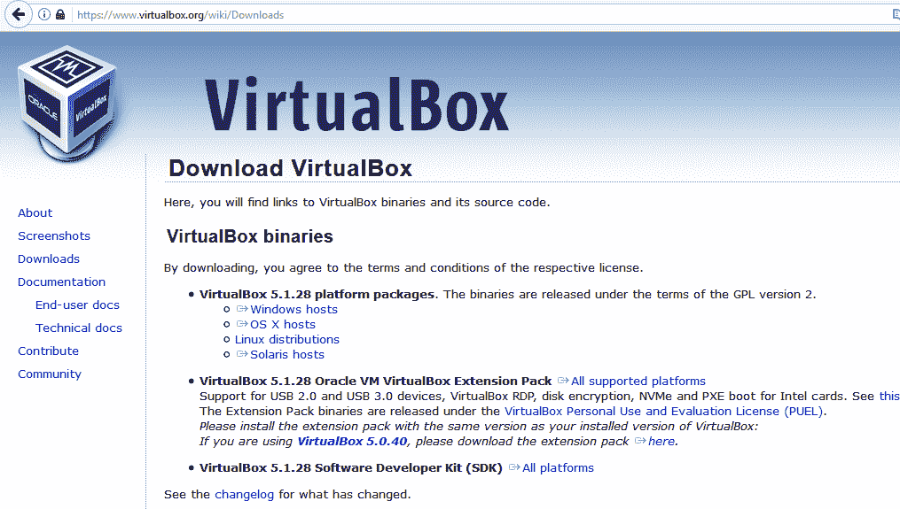
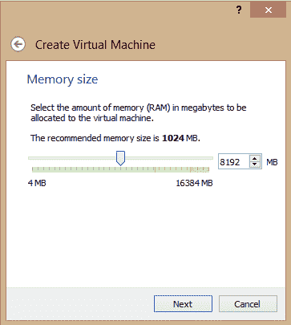
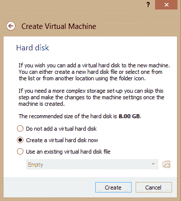
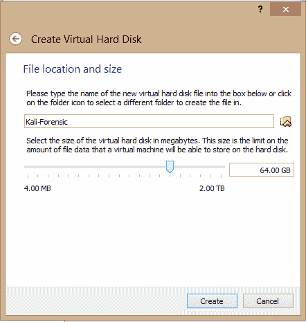
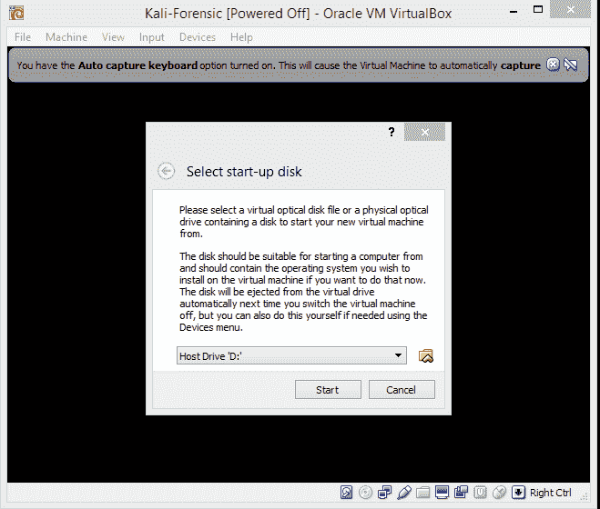
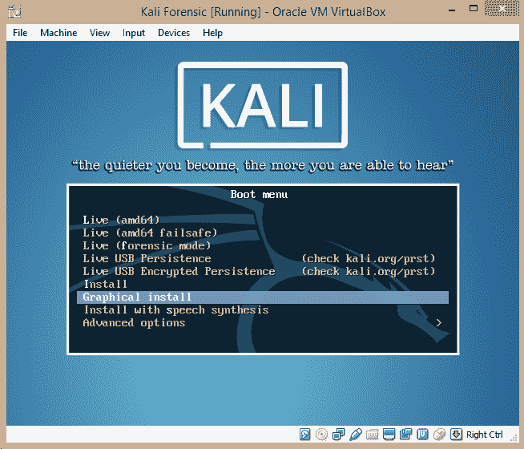
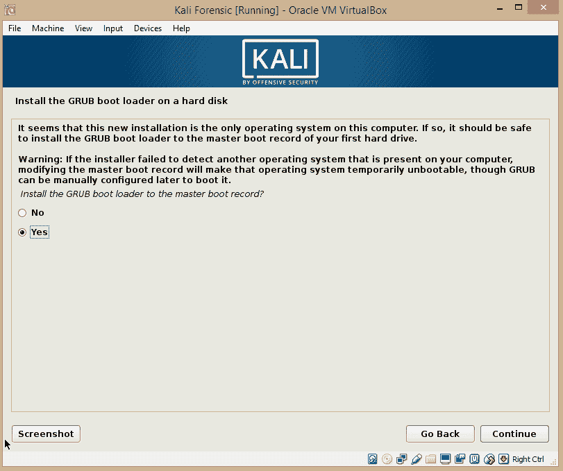
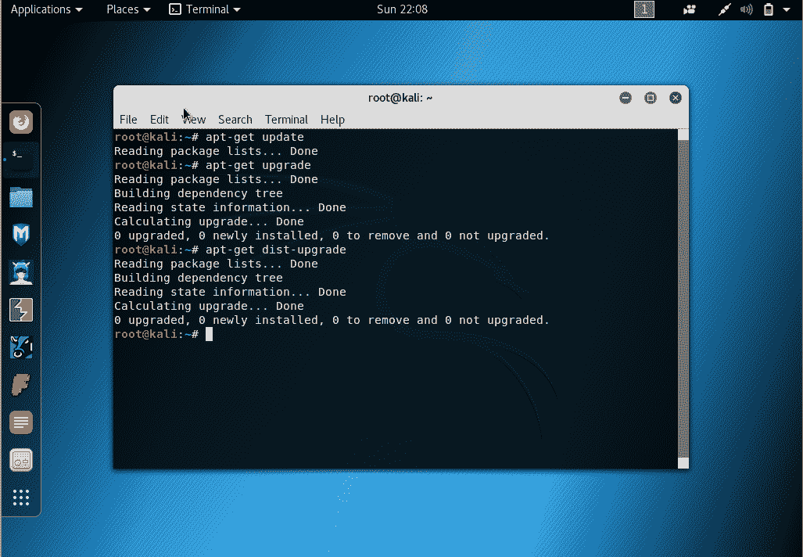

# 第二章：安装 Kali Linux

我们到这里了。让我们开始安装 Kali Linux。我们的一些读者可能已经熟悉安装过程，甚至可能熟悉一些高级功能，如分区和网络设置。对于初学者和新手，我们鼓励您特别关注本章，因为我们将从下载 Kali Linux 的绝对基础开始，逐步进行成功安装。

本章我们将要涵盖的主题是：

+   软件版本

+   下载 Kali Linux

+   安装 Kali Linux

+   在 VirtualBox 中安装 Kali Linux

# 软件版本

Kali 已经存在了相当长的时间。之前被称为 BackTrack，从版本一到五，Kali Linux 首次出现在 2015 年，并作为 Kali 1.0 发布。从 2016 年起，Kali 的命名则根据年份。例如，在撰写本书时，使用的版本是 2017 年 9 月发布的 Kali 2017.2。

对于那些运行较旧版本的 Kali，或者在以后购买本书时可能会有新版本的 Kali Linux 可用的读者，您可以通过使用`sudo apt-get update distro`命令轻松更新 Kali Linux 的实例，本章末尾有演示。

# 下载 Kali Linux

出于安全和安全原因，最好总是直接从其创建者**Offensive Security**的网站上下载 Kali Linux。这样做的主要原因是其他页面上的 Kali 下载可能是假的，或者更糟糕的是，可能被感染了木马、rootkit 甚至勒索软件等恶意软件。Offensive Security 还在其网站上包含了所有 Kali 下载版本的哈希值，允许用户将其下载的 Kali 版本的哈希值与 Offensive Security 在其网站上生成和发布的哈希值进行比较（[`www.kali.org`](https://www.kali.org)）。一旦进入网站，您可以单击下载链接，或者直接访问 Kali Linux 下载页面，网址为[`www.kali.org/downloads/`](https://www.kali.org/downloads/)。

在下载页面上，我们可以看到有六个 Kali 可用的下载版本，每个版本都有特定的类别信息：

+   *镜像名称*：指定下载的名称以及操作系统是 32 位还是 64 位。

32 位操作系统仅限于使用 4GB RAM。如果您的系统 RAM 超过 4GB，您可能希望下载 Kali Linux 的 64 位版本。

+   *下载*：**ISO**（国际标准组织的缩写）通过用户的浏览器直接下载。Torrent 需要安装特殊软件才能下载。

ISO 文件（或常称为 ISO 镜像）是在复制数据时使用的精确副本。

+   *大小*：以 GB 为单位的文件大小。

+   *版本*：Kali Linux 的版本。

+   `*sha256sum*`：Linux 中用于生成现有数据的校验和或数字输出的命令，然后可以用来与下载副本的校验和进行比较，以确保没有数据或位被更改或篡改：

对于本书，我们将使用 Kali 64 位版本，以 ISO 镜像的形式下载，如下所示：

# 安装 Kali Linux

如 第一章 中所述，*数字取证简介*，Kali Linux 可以用作现场响应操作系统，也可以作为完整操作系统安装和运行。下载 Kali Linux 后，ISO 镜像可以使用任何 ISO 文件刻录工具（如 ImgBurn）刻录到 DVD 上。然后可以将 DVD 用作现场操作系统，也可以用于将 Kali 安装到硬盘上。用户还可以使用 UNetbootin 等工具将 Kali Linux 安装到可移动存储介质上，包括闪存驱动器、SD 卡或外部硬盘驱动器，具体取决于用户的偏好。

为了配合本书的使用，我建议您首先将 Kali Linux 刻录到 DVD，然后安装 Kali 到新的硬盘上，从而满足取证准备的概念。在这种情况下，取证准备是指硬盘是全新的和未触及的，因此在任何方面都没有受损，以维护调查人员和调查的完整性。

对于那些没有可用资源在全新硬盘上安装 Kali Linux 的人来说，还有在虚拟环境中安装 Kali Linux 的选项。用户可以使用虚拟化技术，如 VMware 和 VirtualBox，在宿主机中运行 Kali Linux 操作系统作为客户机。

# 在 VirtualBox 中安装 Kali Linux

VirtualBox 可以在许多平台上运行，包括 Windows、macOS、Linux 和 Solaris。在本节中，我们将**VirtualBox 5.1.28**安装到我们的宿主机，并从那里开始。

VirtualBox 可以在[`www.virtualbox.org/wiki/Downloads`](https://www.virtualbox.org/wiki/Downloads)找到：

# 准备 Kali Linux 虚拟机

一旦 VirtualBox 被下载，它可以被安装，然后配置以运行 Kali Linux 和许多其他操作系统，取决于可用的 RAM 数量。

在设置新的客户操作系统或客户虚拟机时，我们首先点击新建，然后填写以下细节：

+   **名称**：`Kali-Forensic`（或您选择的名称）

+   **类型**：Linux

+   **版本**：Debian（64 位）

然后点击下一步，继续在内存大小提示中分配 RAM：

在上述内存大小截图中，我们可以看到屏幕右侧的最大 RAM 容量。我使用的机器有 16,384 MB（四舍五入为 16 GB）的 RAM。虽然 Kali 的推荐内存大小只有 1024 MB（1 GB），但我建议至少为使用取证工具时的平稳功能分配 4 GB 的 RAM。我已经为我的虚拟机分配了 8,192 MB 的 RAM。

接下来，通过添加虚拟硬盘来创建虚拟机。我建议从新的虚拟硬盘开始，这是选择中的第二个选项。点击创建以继续，然后选择 VDI（VirtualBox 磁盘映像）作为硬盘文件类型：

选择 VDI，然后点击下一步：

一旦选择了 VDI，选择动态分配选项以允许虚拟硬盘在需要时扩展：

接下来，我们选择文件位置和所选虚拟硬盘的大小。Kali Linux VDI 的推荐大小为 8 GB，但我分配了 64 GB，以备不时之需存储文件和镜像驱动器的副本。

完成后，点击创建以完成虚拟硬盘的创建：

# 在虚拟机上安装 Kali Linux

一旦虚拟硬盘已经准备好并且按照上一节的步骤完成，我们就可以开始实际的 Kali Linux 安装过程。在 Oracle VM VirtualBox Manager 中，这是 VirtualBox 的主操作系统管理窗口，我们可以看到为我们的 Kali Linux 安装准备的虚拟机现在可用。

在屏幕中间，我们还可以看到分配的资源，如通用部分中的名称和操作系统类型，以及系统部分中分配的 RAM 数量。其他设置，如**VRAM**（**Video RAM**的缩写）、网络和显示设置也可以在此部分中访问。

要开始安装 Kali Linux，点击左侧的 Kali-Forensic 条目，然后点击绿色的启动箭头：

在下一步中，我们必须找到我们从 Offensive Security 网站下载的 Kali Linux ISO 映像。单击“主机驱动器'D:'”旁边的文件夹图标，并搜索下载的 Kali Linux ISO 映像：

选择 ISO 映像后，您会注意到所选条目更改为 kali-linux-2017.2-amd64.iso（2.81 GB）。单击“开始”开始启动过程：

单击“开始”后，启动菜单显示了各种可用选项，包括 Kali 的实时版本。在这个演示中，我们将选择“图形安装”选项将 Kali 安装到虚拟硬盘：

值得一提的是，我还应该提醒您关注“实时（取证模式）”选项，当从 DVD、闪存驱动器或其他可移动存储介质引导时，这个选项将对我们可用。在可能需要实时响应的情况下，始终保留 Kali Linux 的副本是个好主意。

好的，回到我们的安装。在启动菜单中点击“图形安装”选项后，我们将被提示选择语言、位置和键盘布局。

在下一步中，我们为 Kali Linux 客户端指定主机名，这与 Windows 环境中的用户名相同：

对于域名区域，我将其留空，因为我不会将此主机加入域。

设置密码时，请确保使用您能记住的密码。如果您在启动时记不住密码，使用一个由大写字母、小写字母和数字字符组成的复杂密码，长度为 16 个字符，是没有意义的：

# 分区磁盘

硬盘（无论是虚拟还是物理）的分区涉及将驱动器分割成逻辑驱动器。可以将其视为一个由一个大房间组成的大公寓。现在想象一下，您设置了一堵墙，将公寓分成两半。它仍然是一个物理上的公寓，但现在分成了两个房间。一个可以用作主公寓，另一个可以用作存储，或者您甚至可以有两个较小的公寓与自己和朋友共享。同样，分区可以允许在硬盘上安装多个操作系统，甚至创建额外的卷用作存储空间。

继续我们的 Kali Linux 安装，下一步提供了有关虚拟磁盘分区使用的选项。由于这是一个虚拟磁盘，我建议使用引导-使用整个磁盘分区方法。这种方法非常简单，使用在前面步骤中分配给虚拟磁盘的所有可用空间。首先，让我们选择推荐的分区方法：

上面的截图中的其他选项为用户提供了设置 LVM（逻辑卷管理器）和加密 LVM 的选项。LVM 管理逻辑分区，可以创建、调整大小和删除 Linux 分区。

提示警告说，如果选择此选项，磁盘上的所有数据（如果有的话）将被删除；但是，这是一个没有现有数据的新虚拟磁盘，所以我们可以继续安装。

在选择 VirtualBox 磁盘后，确保选择一个分区中的所有文件：

随着我们继续分区过程，我推荐“引导分区”选项的主要原因之一是因为它几乎为我们做了所有事情。从这里开始，我们只需选择最后一个可用选项，即“完成分区并将更改写入磁盘”，然后单击“继续”：

分区过程的最后一步要求确认将指定的配置和更改写入磁盘。在单击“继续”之前，请务必选择“是”：

我们现在离安装和运行 Kali Linux 虚拟机只有几步之遥。

安装完成后，软件包管理器提示选择网络镜像，这允许我们访问软件的更新版本。我建议通过单击“否”跳过此步骤，因为一旦我们运行起来，我们很快就会手动安装 Kali 的更新。

安装过程中的最后一步是在硬盘上安装 GRUB 引导加载程序。不详细介绍，**GRUB**（GRand Unified Bootloader）允许在启动屏幕上安全地拥有和选择操作系统，从而实现多重引导环境，保留每个已安装操作系统的引导条目。

尽管我们可以选择不安装 GRUB（因为我们的虚拟硬盘上只安装了一个操作系统），但是如果要与其他操作系统进行双重或多重引导，则应选择“是”选项：

如果选择是安装 GRUB，请确保选择可引导设备：

单击“继续”后，安装完成并启动 Kali Linux。

# 探索 Kali Linux

安装完成后，我们可以启动 Kali Linux。要登录，请输入`root`作为用户名和之前配置的密码：

登录后，我们应该在终端中输入三个命令来更新 Kali。

要进入终端（相当于 Windows 中的命令提示符），请单击应用程序|终端。

打开终端后，输入以下命令，以便 Kali 可以检查软件包更新、软件升级和发行版更新：

+   `apt-get update`

+   `apt-get upgrade`

+   `apt-get dist-update`

此时，我们已经成功更新了 Kali Linux 的安装。由于本书涉及 Kali Linux 中的数字取证，我们可以通过查看菜单上可用的取证工具来立即开始。

在 Kali Linux 中有两种方法可以进入取证菜单：

+   第一种方法是单击“应用程序”，然后移动到菜单项 11 - 取证，如下面的屏幕截图所示：

+   对于第二种方法，只需单击“显示应用程序”项目（浮动侧边菜单中的最后一个图标），然后选择取证：

您会注意到在第二个选项中有更多的工具可用。这并不是说这些是 Kali Linux 中所有可用的取证工具。许多工具可以通过终端访问，其中一些将在后面的章节中以这种方式访问。

我还鼓励您探索 Kali Linux 及其许多出色的功能，这也使其成为一个完全功能的操作系统，不仅用于取证和渗透测试。

如果您对 Kali 作为渗透测试（pen-testing）发行版感兴趣，*Packt*有许多关于 Kali Linux 的详细书籍，我全力推荐。我拥有其中许多平装书，并且在工作中经常使用它们，也用于准备我的讲座。

# 总结

在本章中，我们深入探讨了 Kali Linux 的技术方面，并发现了通过 Kali Linux ISO 映像可用的各种模式，无论是从光盘实时运行还是在虚拟环境中安装。除了作为从 DVD 的实时响应取证工具外，Kali 还可以安装到可移动存储介质，如闪存驱动器或 SD 卡上。作为一种多功能操作系统，我们还可以将 Kali 安装为一个完整的操作系统。

我们还深入研究了在虚拟环境中使用 VirtualBox 安装 Kali Linux。对于初学者，我绝对推荐这种安装方法，因为它允许在隔离的环境中进行试错。请确保分配足够的 RAM，并且记住，Kali 的 32 位版本只允许识别和利用高达 4GB 的 RAM。作为提醒，我再次建议您同时拥有 Kali Linux 的 Live DVD 和 OS 的安装版本，无论是物理还是虚拟的，以确保所有情况都覆盖到。

在 Kali 中使用的取证工具是进行调查的绝佳方式，但我们还需要了解存储介质、文件系统、数据类型和位置的工作原理。在下一章中，加入我，我们将首先了解这些基本概念，继续我们的数字取证之旅。在第三章中见。
