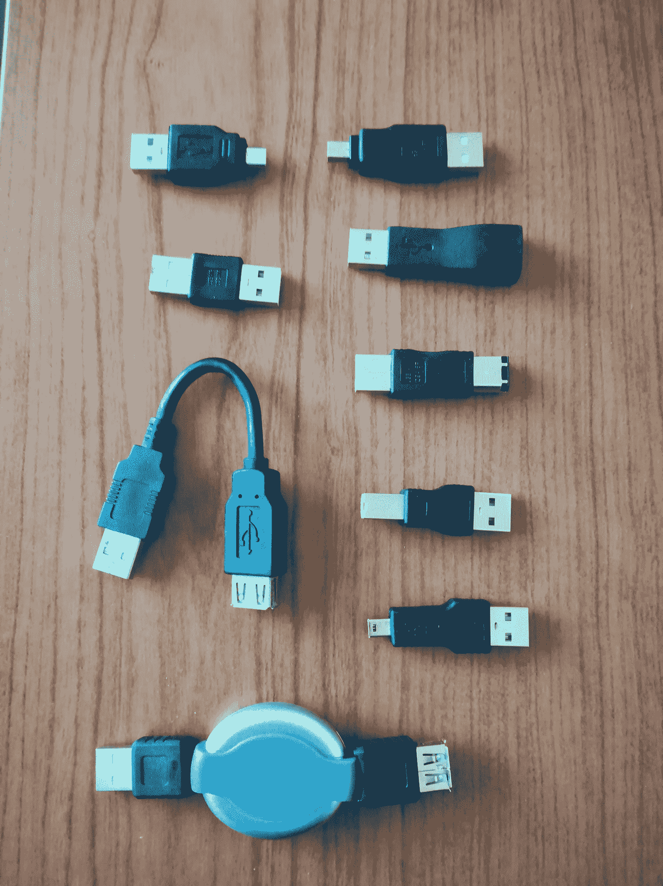
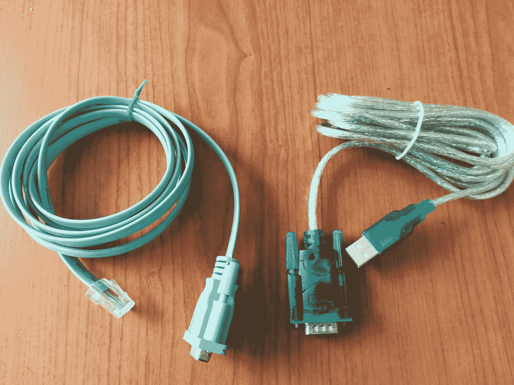
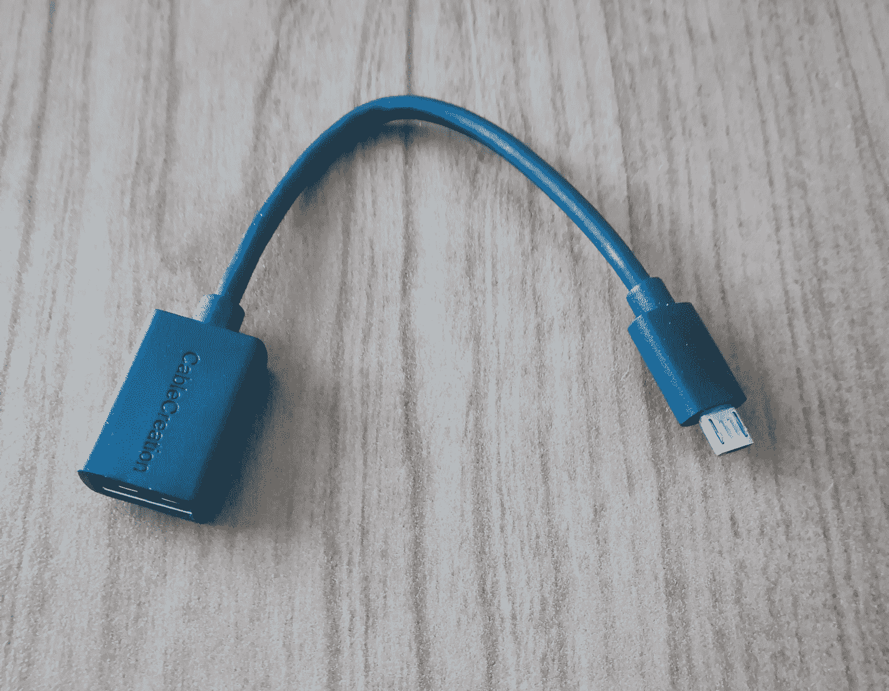
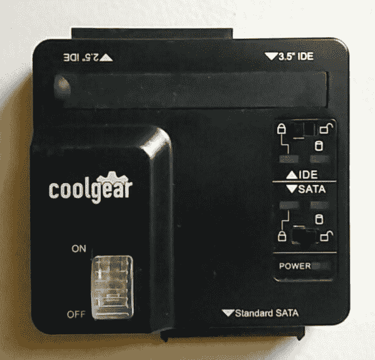
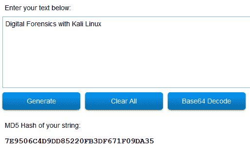

# 第四章：事件响应和数据获取

有时很难确定什么样的东西算是证据，特别是在调查刚开始时，可能还没有收集或陈述所有发生的事实。就像任何调查一样，我们应该意识到并遵循获取证据的指南、实践和程序，以确保它不被篡改，或者在最坏的情况下丢失。

在犯罪现场，比如说枪击案，有一些特定的物品可能立即被视为证据。物证很容易被收集，放入证据袋中，标记，然后运送到实验室和安全存储区域进行保管。这些证据可能包括已使用的子弹壳、也许是一把枪、指纹和血样。别忘了还有目击证人的陈述和**CCTV**（闭路电视的缩写）录像。还有值得关注的是，要考虑到执法机构的人员可能会出现在现场，以及他们可能到达的顺序。看起来很简单。

然而，当报告涉及计算机或智能设备的违规行为或犯罪时，收集证据有时并不像想象的那么简单，因为在将任何物品标记为证据之前，必须考虑许多因素。

例如，如果桌面参与了行为，我们是只带走主机还是也带走显示器、键盘、鼠标和扬声器？打印机和扫描仪等其他外围设备呢？现场是否有任何额外的固定或可移动存储介质，我们也要带走吗？

本章回答了所有这些问题，并提供了事件响应、证据获取和其他主题的指南和最佳实践，包括：

+   数字证据获取程序

+   保存证据的完整性

+   写阻塞和哈希

+   开机与关机设备的获取

+   现场获取的最佳实践

+   数据成像和哈希

+   责任链

# 数字证据获取和程序

正如我们在上一章中所讨论的，数据可以存储在固定和可移动的存储介质上。然而，数据可以很容易地被删除或完全丢失，这取决于许多必须考虑的因素，如果我们要确保数据的保存。甚至可以说，数字存储面临的威胁比纸质存储更多。以下是对两者威胁的一些比较：

+   纸质存储的威胁包括：

+   水

+   火灾和湿度

+   虫害

+   年龄

+   自然灾害——洪水、地震、龙卷风、飓风等等

+   存储介质上的数据威胁包括：

+   人为错误和疏忽

+   磁性和电磁场

+   水和凝结

+   热

+   灰尘

+   影响

+   电压

+   静电

+   自然灾害——洪水、地震、龙卷风、飓风等等

数据何时成为证据？在考虑发生的事件时，特定数据可能对调查具有相对价值。

# 事件响应和第一响应者

保存证据并不仅仅是在获取数据时开始，而是在早期对嫌疑设备进行物理检查时就开始了。对于疑似犯罪或违规行为，应该有一种结构化的反应，就像报警给警察一样。同样，一个人打电话给紧急服务，然后派遣警察、消防队和救护人员以及其他第一响应者，他们可能会将问题升级到联邦调查局或其他机构。处理需要数字调查的报告时，也应该有类似的指挥链。

当发现或怀疑有违规行为或犯罪时，应该有专门的第一响应者被警报并被召唤到现场。这个人通常对设备、网络甚至组织中的 IT 基础设施（如果适用）有一定的了解。

第一响应者人员可能包括：

+   系统管理员

+   网络管理员

+   安全管理员

+   IT 管理员

虽然前述角色中的人员可能不擅长数字取证或数字调查，但他们将负责保护现场，并确保数据、外围设备、设备和存储介质不被未经授权的个人使用、篡改、移除或损害。

急救人员的职责包括：

+   作为第一批应对现场的人员（正如名字所示），并进行初步评估

+   以房间中心为焦点，以圆形方式完全记录现场和房间

+   通过不允许未经授权的用户或嫌疑人访问设备或区域，特别是易挥发的数据和存储介质，来保护现场

+   保存和包装证据以便运输，确保使用**责任链**（**CoC**）表格

# 文档记录和证据收集

应该由急救人员进行现场文档记录，以帮助调查。现场文档记录应包括照片、视频、语音记录和以下内容的手动文档记录：

+   设备所在的房间（桌子、天花板、入口/出口、窗户、照明、电源插座和数据插座）

+   设备的状态（开启、关闭、电源指示灯闪烁）

+   屏幕内容（如果设备正在运行），操作系统，运行程序，日期和时间，有线和/或无线网络连接

+   书籍、笔记、纸张

+   连接和断开的电缆

一旦现场由急救人员保护和记录，如果尚未被警告，还应该召集法庭调查员。

如果急救人员接受了证据收集和保存的培训，他们也可以开始获取可以视为物理证据的东西。

物理证据的例子包括：

+   **计算机主机**。

+   **笔记本电脑**。

+   **平板电脑**。

+   **固定和可移动存储介质**：硬盘驱动器、光盘、磁带存储、存储卡、读卡器、适配器、对接站、打印机、扫描仪、手机和 iPod。可能已用于进行侵入的媒体和 MP3 播放器以及其他设备。路由器和交换机也可能包含证据，例如连接日志、源和目的地地址，甚至访问的网站。

+   **电缆和充电器**。

# 物理证据收集和保存

在考虑证据收集阶段的物理方面时，应该考虑。与任何其他调查一样，应该在遵循适当的指南和最佳实践的同时进行文档记录、收集和保存，以确保调查的完整性。例如，在犯罪现场，证据必须被正确识别，标记为由授权人员处理，并接受调查程序的培训，这些程序可以在法庭上受到审查。

急救工具包应包含以下物品，以准备在现场进行文档记录、证据收集和保存：

+   防护服，包括眼镜和手套

+   防静电垫或腕带

+   标识标签、贴纸和便携式标签设备（如果有）

+   各种笔和标记工具，便于识别

+   电缆束带

+   各种尺寸的十字螺丝刀、平头螺丝刀、扭矩螺丝刀和专用螺丝刀或螺丝刀头的工具包

+   手电筒和放大镜

+   扣押和保管责任表格

+   容器、盒子和包装材料，包括防静电和牢固的袋子

这是一个预算有限但便携且非常有组织的螺丝刀套装，我将其放在我的急救工具包中。它具有打开台式机、笔记本电脑、平板电脑的所有附件，甚至用于移动和打开可移动存储介质，如硬盘驱动器、光驱，甚至软盘驱动器的螺丝刀：

# 物理获取工具

我们已经看过了收集和获取物理证据所需的工具，但是我们获取和提取数字证据需要什么工具呢？还记得我们在第三章中讨论的不同类型的存储介质和文件系统吗？我们看到许多存储介质都有自己的连接器，因为它们的尺寸各不相同。

以下是从证据获取时所需的一些设备清单：

+   写保护器（也可以基于软件）

+   读卡器

+   各种适配器（USB 至 SATA 和 EIDE，USB 至各种类型的 USB）

+   设备电缆，如电源、SATA、EIDE、HDMI、VGA

+   网络电缆，如直通、交叉、控制台

以下图片显示了各种 USB 适配器的集合，所有价格都在 10 美元以下，并且都可以在亚马逊上购买：

对于笔记本硬盘，我还使用了一个 SATA 至 USB 3.0 适配器，就像这里看到的一样：

用于连接路由器和交换机的控制台电缆和串行至 USB 电缆也可以包含在您的工具包中，就像这里看到的一样：

所有移动设备，包括手机和平板电脑，也可以通过 USB 端口连接到笔记本电脑和台式电脑。以下图片显示了一个 OTG 电缆，它可以将 USB 设备连接到具有 OTG 功能的手机或平板电脑：

物理收集和保存指南：

+   标记所有电缆和连接器

+   根据需要使用标记的证据收集袋

+   在存储具有无线和无线电功能的设备时，可能需要使用特殊的强固袋，以防止与其他设备通信

+   将硬盘驱动器和闪存驱动器等敏感设备存放在防静电袋和保护外壳中

+   标记用于运输途中存储的容器

+   在将证据从一个人/处理者传递给另一个人/处理者时保持保管链表格（本章后面讨论）

# 挥发性顺序

在收集证据时，我们应该牢记数据的挥发性。正如本章前面提到的，数据很容易丢失或被销毁。因此，在收集数据时，一个良好记录和常见的最佳做法是尽可能按照最易挥发至最不易挥发的顺序收集证据。

**数字证据科学工作组**（**SWGDE**）的现场系统获取文件列出了从最易挥发至最不易挥发和关键的挥发顺序如下：

+   RAM

+   运行进程

+   活动网络连接

+   系统设置

+   存储介质

# 保管链表格

保管链表格是一种法律上确保证据完整性的表格，因为它在个人之间交换证据时提供了一定程度的责任追究，因此在填写表格时需要个人身份证明。该表格提供了从现场收集到在法庭上呈现的交通和交换的确切记录和账目。

保管链表格上的一些典型字段包括：

+   案件编号

+   罪行

+   受害者和嫌疑人姓名

+   扣押日期和时间：

+   扣押时的位置

+   物品编号

+   物品描述

+   释放和接收物品的个人签名和身份证明

+   处置授权

+   证据销毁见证

+   交还给合法所有者

可以直接从**国家标准与技术研究所**（**NIST**）下载样本保管链表格：

[`www.nist.gov/document/sample-chain-custody-formdocx`](https://www.nist.gov/document/sample-chain-custody-formdocx)

# 开机与关机设备获取

在调查已开机和已关机的设备时，必须特别考虑数据的挥发性。启动、重新启动或关闭设备可能会导致数据被写入硬盘甚至在 RAM 和分页文件中丢失。

# 已开机设备

在调查通电设备时，应采取以下预防措施：

+   如果怀疑设备可能处于*休眠*状态，请移动鼠标或在触摸板上滑动手指。不要点击按钮，因为这可能会打开或关闭程序和进程。

+   拍摄和记录屏幕和所有可见的程序、数据、时间和桌面项目。

+   拔掉台式机的电源线，拆下便携设备的电池（如果可能）。

非常重要的是，尽可能少地修改 RAM 和分页文件中存储的数据。后续章节将使用像 Guymager 和 Kali Linux 中的 DC3DD 这样的镜像工具进行更多介绍。其他实时获取工具，如 C.A.I.N.E 和 Helix，也可以用于获取 RAM 和分页文件。

有很多原因需要镜像和获取 RAM。如前一章所述，用户可能已加密的数据可能存储在未加密状态的 RAM 中。如果分析 RAM 和分页文件，可以提取和分析已登录用户、已打开的程序、已访问的文件和正在运行的进程。但是，如果设备关闭或重新启动，这些数据和证据很容易丢失。

对于通电的便携式设备和通电设备，应尽可能拆下电池。然而，有些设备可能没有可拆卸的电池。在这种情况下，应按下电源按钮 30 到 40 秒，强制设备关机。

# 关机设备

关机设备不应该被打开，除非由法证调查员进行。必须采取特殊措施确保现有数据不被擦除，也不会写入新数据。

设备通常看起来像是关机的，但它们可能处于休眠或休眠状态。作为一个简单的测试，可以移动鼠标并打开显示器（如果有的话）以确定它们实际上处于这两种状态之一。即使它们处于关闭状态，也应该拍摄屏幕和端口。

在已关闭状态下调查便携式和移动设备时，建议拆下电池（如果可能），并将其放入证据袋中，以确保一旦拔掉插头就没有意外打开设备的方法。根据*NIST.SP.800-101r1*—*移动取证指南*，应注意，即使处于关闭状态，拆下电池也可能改变易失性内存中的内容。

# 写入阻塞

一旦我们的证据被正确记录和收集，我们就可以开始着手获取实际的数字证据。我会在几次提到这一点，但原始证据应该只用于创建法证副本或镜像，这将在本章和其他章节中进一步讨论。

处理原始证据可能会修改介质的内容。例如，将扣押的笔记本电脑引导到其原生操作系统将允许数据被写入硬盘，也可能会擦除和修改 RAM 和分页文件中包含的内容。

为防止发生这种情况，必须使用写入阻塞器。正如其名称所示，写入阻塞器可以防止数据被写入证据介质。写入阻塞器既有硬件类型，也有软件类型。如果没有硬件写入阻塞器，软件版本也可以在法证操作系统中找到，包括在第一章中提到的数字取证导论中，也作为一些商业和开源工具的独立功能，如 EnCase 和 Autopsy。

再次强调，在调查中使用写入阻塞器保护和保留原始证据不被修改非常重要。以下图片显示了一个便宜而高效的便携式 SATA 和 IDE 适配器，带有写入阻塞开关，用于驱动获取和恢复：

# 数据成像和哈希

成像是指精确复制数据，无论是作为文件、文件夹、分区还是整个存储介质或驱动器。当复制文件和文件夹时，根据其属性设置为系统或隐藏，可能不会复制所有文件。为了防止文件被遗漏，我们执行一种特殊类型的复制，其中每一位都被精确复制或成像，就像在当前介质上拍摄数据的照片或快照一样。

精确复制每一位数据，被称为**物理图像**。执行**比特流复制**可以确保复制的完整性。为了进一步证明这一点，对原始证据和物理图像进行哈希计算并进行比较。如果复制的数据有一位不同，哈希值将会有很大的不同。

原始证据应该只由合格和授权的专业人员处理，并且也只能用来创建法医学上可靠的物理图像。否则，原始证据绝不能被使用，因为这会损害完整性和调查。

# 消息摘要（MD5）哈希

特定算法产生哈希值，并用于验证证据的完整性，证明数据没有被修改。哈希值可以被看作是数字指纹，因为它们是独一无二的，在证据和物理图像的识别中起着重要作用。

尽管存在漏洞，但一种常用的加密哈希算法是**消息摘要**（**MD5**），它产生 128 位的十六进制输出值。

作为一个工作示例，让我们打开浏览器，前往[`passwordsgenerator.net/md5-hash-generator/`](http://passwordsgenerator.net/md5-hash-generator/)。

该网站将单词和句子创建为字符串的哈希值。在这个例子中，我输入了字符串`Digital Forensics with Kali Linux`，不包括括号。自动计算的 MD5 值显示为 7E9506C4D9DD85220FB3DF671F09DA35，如下面的截图所示：

通过从`Kali`中移除`K`，从现在读作`Digital Forensics with ali Linux`的相同字符串中，MD5 现在读作 7A4C7AA85B114E91F247779D6A0B3022，如下面的截图所示：

作为一个快速比较，我们可以看到，只是从`Kali`中移除`K`就会产生明显不同的结果：

+   `Digital Forensics with Kali Linux`: 7E9506C4D9DD85220FB3DF671F09DA35

+   `Digital Forensics with ali Linux`: 7A4C7AA85B114E91F247779D6A0B3022

我鼓励你自己尝试一下，也许在字符串中添加逗号或句号以进一步比较哈希值。

# 安全哈希算法（SHA）

在取证中常用的另一种加密哈希算法是 SHA1。**安全哈希算法-1**（**SHA1**）比 MD5 更安全，因为它产生的是 160 位的输出，而不是 MD5 的 128 位输出。由于已知对 MD5 和 SHA-1 的碰撞攻击，现在更安全和更健壮的哈希选项是*SHA-2*。

SHA-2 实际上是一组哈希算法，而不仅仅是一个，就像 SHA-1 一样，最常见的位长度是 SHA-256，它产生 256 位的输出。SHA-2 的备用位长度算法包括 SHA-224、SHA-384 和 SHA-512。

使用更强大的加密算法，被攻击或 compromise 的可能性就越小。这意味着证据和物理图像的完整性保持完好，这在法庭鉴定和法庭案件中将会很有用。

更多关于创建哈希的内容将在第五章中进行演示，*使用 DC3DD 和 Guymager 进行证据获取和保护*，使用 DC3DD 和 Guymager。

# 设备和数据获取指南和最佳实践

虽然我已经试图给你一个收集和保留证据程序的概述，但有几份官方文件我强烈建议你阅读并熟悉，它们都提供了关于现场文档、证据收集和数据获取的详细信息和指南。

**SWGDE**（数字证据科学工作组）*计算机取证最佳实践*，*版本 3.1*，于 2014 年 9 月发布，概述了以下领域的计算机取证最佳实践：

+   证据收集和处理

+   证据获取和运输

+   调查开机和关机系统媒体和服务器的指南

+   考试和报告

完整的 SWGDE 计算机取证最佳实践文件可以从这里下载：

[`www.swgde.org/documents/Current%20Documents/SWGDE%20Best%20Practices%20for%20Computer%20Forensics`](https://www.swgde.org/documents/Current%20Documents/SWGDE%20Best%20Practices%20for%20Computer%20Forensics)

*SWGDE 捕获活动系统*文件，第 2.0 版，于 2014 年 9 月发布，虽然篇幅较短，内容不够详细，但仍适用于涉及活动（开机）系统的取证调查。该文件提供了调查活动系统时的指南，包括易失性顺序、内存取证包括分页文件取证，以及活动物理和文件系统获取。

这份文件只有六页，可以从这里下载：

[`www.swgde.org/documents/Current%20Documents/SWGDE%20Capture%20of%20Live%20Systems`](https://www.swgde.org/documents/Current%20Documents/SWGDE%20Capture%20of%20Live%20Systems)

**NIST**（国家标准与技术研究所）*移动设备取证指南* 也是另一份非常有用的文件，专门适用于移动设备。该文件的第一版于 2014 年发布，详细介绍了移动取证调查的各个方面。内容包括：

+   移动和手机特性

+   现场评估和文档记录

+   设备隔离和包装

+   设备和存储器获取

+   检查、分析和报告

完整文件可以从这里下载：

[`nvlpubs.nist.gov/nistpubs/SpecialPublications/NIST.SP.800-101r1.pdf`](http://nvlpubs.nist.gov/nistpubs/SpecialPublications/NIST.SP.800-101r1.pdf)

# 总结

如果只有一件事我希望你从本章中记住，那就是原始证据，特别是硬盘、存储介质和 RAM 镜像，只能用来创建取证完整的比特流副本。原始证据永远不能被处理。

总结，当有违规行为被报告时，应该有一个指定的第一响应者，按照规程执行文档记录和保护现场以及收集和保留证据的任务。第一响应者应该携带各种工具和物品的工具包，用于获取证据，并在将证据交给其他方时，确保保持证据链的完整性。

我们还研究了调查开机和关机设备时的各种程序和最佳实践，并讨论了使用写入阻断器防止原始证据被篡改，然后使用哈希工具进行完整性验证的重要性。

你已经走了这么远，我知道这可能有点信息过载，但现在我们可以进入本书的实践部分，在 Kali Linux 中使用数字取证工具开始我们的调查。让我们开始吧！
