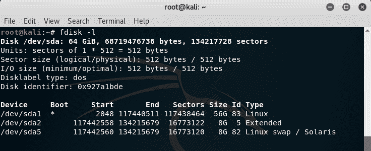
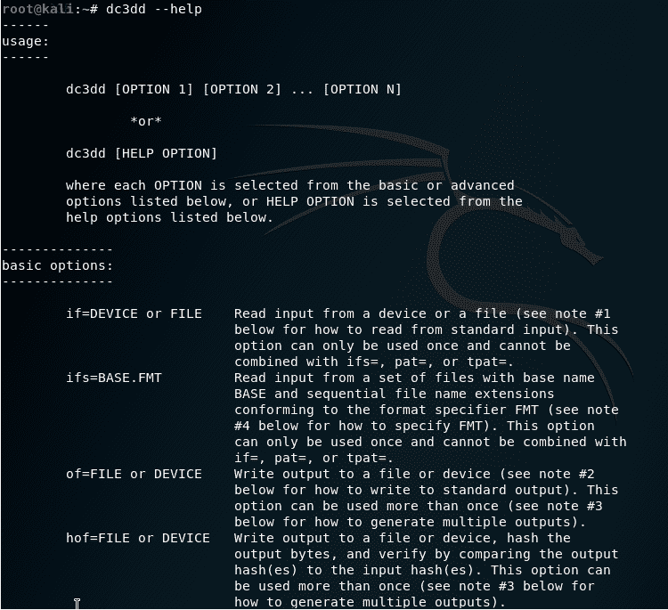
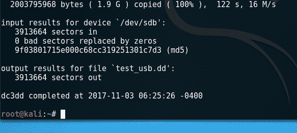
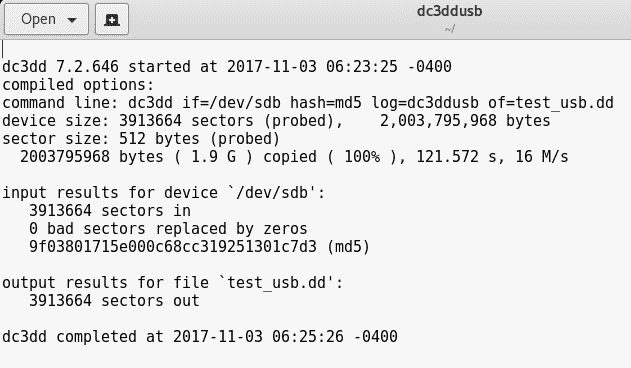
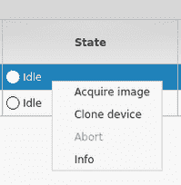
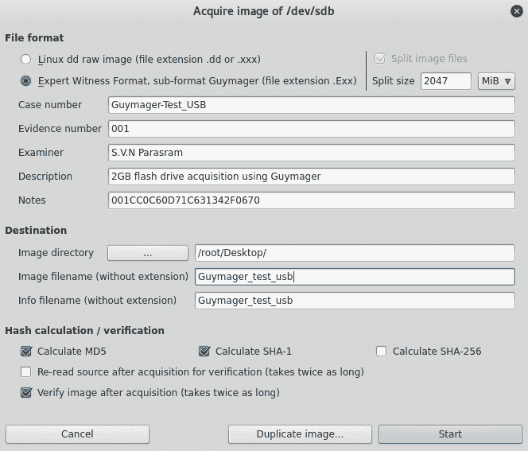
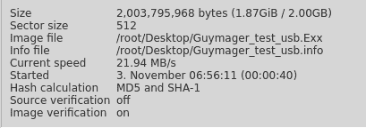

# 第五章：使用 DC3DD 和 Guymager 进行证据获取和保留

在上一章中，我们了解到文档和适当的程序对于任何调查都是关键的。这些确保了调查的完整性，通过提供数据真实性的证据和原始证据和文档的保留，可以在重复使用工具和方法时达到完全相同的结果。

在本章中，我们将演示使用比特流副本进行数据取证的取证技术。

我们将使用的第一个获取工具称为**DC3DD**（**国防部网络犯罪中心**）。DC3DD 是非常流行的数据转储或 DD 工具的一个补丁，用于取证获取和哈希。

这些是**数据转储**（**DD**）的特点：

+   比特流（原始）磁盘获取和克隆

+   复制磁盘分区

+   复制文件夹和文件

+   硬盘驱动器错误检查

+   对硬盘驱动器上的所有数据进行取证擦除

然后我们将探索另一个非常流行的获取工具，名为 Guymager，它在 GUI 中提供了许多相同的功能。

# Linux 中的驱动器和分区识别

对于 Kali 或任何 Linux 变体的新用户来说，他们可能会发现 Kali 中的驱动器和分区识别和命名与 Windows 设备不同。

在 Linux 中，典型的设备可以被称为`/dev/sda`，而在 Windows 中，驱动器通常被识别为`Disk 0`，`Disk 1`等等：

+   `/dev`：指的是 Linux 可以读取或写入的所有设备和驱动器的路径

+   `/sda`：指的是**SCSI**（**小型计算机系统接口**），SATA 和 USB 设备

**sd**代表**SCSI 大容量存储驱动器**，后面的字母代表驱动器号：

+   `sda`：驱动器`0`或第一个被识别的驱动器

+   `sdb`：第二个驱动器

虽然 Windows 将分区识别为主分区、逻辑分区和扩展分区，但 Linux 分区被识别为驱动器字母后的数字：

+   `sda1`：第一个磁盘（`sda`）上的分区 1

+   `sda2`：第一个磁盘上的分区 2

+   `sdb1`：第二个磁盘（`sdb`）上的分区 1

+   `sdb2`：第二个磁盘上的分区 2

# 使用 fdisk 命令进行设备识别

在开始使用 DD 之前，我需要再次提醒您 DD 的一个特点，即能够擦除数据、分区和驱动器。因此，您可能会发现 DD 有时也被亲切地称为**数据销毁者**。在使用 DD 和 DC3DD 时，一定要首先确定您的设备、分区、输入和输出文件以及参数。

在本章的练习中，我将使用一个旧的 2GB 闪存驱动器进行使用 DC3DD 进行获取过程。在执行任何获取操作之前，应该先运行`fdisk -l`命令来列出您的设备并确保您已经了解它们。如果前一个命令不起作用，可能需要使用`sudo fdisk -l`命令。

在以下截图中，已经运行了`fdisk -l`命令，然后连接了 2GB 闪存驱动器以列出已连接的设备。有一个硬盘列为`sda`。主分区列为`sda1`，`扩展`和`Linux swap`分区分别列为`sda2`和`sda5`：



在连接 2GB 闪存驱动器进行获取后，再次运行`fdisk -l`命令，并且可以在以下截图中看到以下细节：

+   **磁盘**：`sdb`

+   **大小**：`1.9GB`

+   **扇区大小**：`512 字节`

+   **文件系统**：`FAT32`


如前面的截图所示（并且在本章的前面也有解释），Kali Linux 识别了两个设备：

+   `sda`：带有三个分区的主硬盘

+   `sdb`：要进行取证获取或成像的闪存驱动器

现在我们已经确定了要成像的驱动器（`sdb`），我们可以开始使用 DC3DD 进行取证成像。

尽管我使用了一个较旧的 2GB 闪存驱动器来演示 DC3DD 的用法，但您可以使用任何驱动器（便携式或其他）来练习本章中的工具。请确保使用`fdisk -l`命令来识别您的驱动器和分区。

# 保持证据的完整性

为了证明证据没有被篡改，应在获取之前和期间或之后提供证据的哈希。

在 Kali Linux 中，我们可以使用`md5sum`命令，后跟设备的路径，来创建证据/输入文件的 MD5 哈希。例如，`md5sum /dev/sdx`。

您还可以尝试使用超级用户权限输入`sudo md5sum /dev/sdx`命令。

在此示例中，我将使用的 2GB 闪存驱动器（名为`test_usb`）被识别为`sdb`，因此我将使用的命令如下截图所示：


在前面的示例中，`md5sum`对 2GB 闪存驱动器的输出显示为“9f038....1c7d3 /dev/sdb”。当使用 DC3DD 执行驱动器的获取或取证成像时，我们还应该在对创建的映像文件输出进行哈希时获得确切的结果，以确保原始证据和副本完全相同，从而保持证据的完整性。

我还使用以下语法创建了一个 SHA-1 哈希（将用于比较目的）：


# 在 Kali Linux 中使用 DC3DD

DC3DD 是由国防部网络犯罪中心开发的，并且在 DD 更新时进行更新。DC3DD 提供了 DD 的最佳功能，包括：

+   使用更多的算法选择（MD5、SHA-1、SHA-256 和 SHA-512）进行即时哈希处理

+   用于监视进度和获取时间的仪表

+   将错误写入文件

+   分割输出文件

+   文件验证

+   擦除输出文件（模式擦除）

尽管我们只关注 DD 和 DC3DD，但还有另一个名为**DCFLDD**的工具，可以安装在基于 Linux 的系统上。DCFLDD 是 DD 的增强版本，并由**Defense Computer Forensics Labs**（**DCFL**）维护和支持，其发布时间表与 DD 不同步更新。

DC3DD 是一个 CLI，可以通过首先打开终端并输入`dc3dd`来轻松在 Kali Linux 中运行。首先建议使用`dc3dd --help`命令，该命令列出了与`dc3dd`一起使用的可用参数：



如前面的屏幕截图所示，使用`dc3dd --help`命令，DC3DD 命令的典型用法如下：

```
dc3dd [option 1] [option 2] ... [option n]
```

在我们之前的示例中，我使用了以下选项：

```
dc3dd if=/dev/sdb hash=md5 log=dc3ddusb of=test_usb.dd
```


+   `if`：指定*输入文件*，即我们将进行成像的设备。

+   哈希：指定用于完整性验证的哈希算法的类型。在这种情况下，我使用了较旧的 MD5 哈希。

+   `log`：指定记录设备和获取详细信息的日志文件的名称，包括错误。

+   `of`：指定由 DC3DD 创建的取证映像的输出文件名。在本示例中指定了`.dd`映像文件类型，DC3DD 也识别其他格式，包括`.img`，如后面的示例中所示。

应注意设备大小（以扇区和字节表示），并稍后与*设备的输出结果*进行比较。

最后一行还显示了获取过程的进度和状态，显示了已复制的数据量、经过的时间（以秒为单位）以及成像过程的速度（以 Mbps 为单位）：


要获取的驱动器或文件越大，所需的时间就越长。我建议您喝杯咖啡或清爽的饮料，或者看看 Packt 提供的其他精彩书籍[`www.packtpub.com/`](https://www.packtpub.com/)。

一旦获取过程完成，输入和输出结果将被显示：



分析结果，我们可以看到已经成像了相同数量的扇区（`3913664`），没有坏扇区被替换为零。我们还可以看到为图像创建了确切的 MD5 哈希，确保我们创建了一个没有修改的精确副本。

在终端中，我们还可以使用`ls`命令列出目录内容，以确保 DC3DD 输出文件（`test_usb.dd`）和日志（`dc3ddusb`）已经创建：


要访问我们的取证图像和日志文件，我们可以通过点击“位置”（左上角）然后`Home`，进入`/home`目录。

在我的`Home`文件夹中，第一个文件`2GBdcedd.dd`是使用`of=test_usb.dd`命令由 DC3DD 创建的输出图像。最后一个文件`dc3ddusb`是日志文件，当我们使用`log=dc3ddusb`命令时创建的。


保留这个日志文件很重要，以记录获取过程及其结果，这些结果在完成时显示在屏幕上：



在未来的章节中，我们将使用各种工具分析获取的取证图像；然而，如果调查人员希望，该图像也可以被复制或直接克隆到另一个设备。

例如，我们可以将之前获取的取证图像（`test_usb.dd`）克隆到一个新的被识别为`sdc`的驱动器上。执行此任务的命令是：

```
dc3dd if=test_usb.dd of=/dev/sdc log=drivecopy.log
```

将图像复制到驱动器时，目标驱动器的大小应与图像文件相等或更大。

# 使用 DC3DD 进行文件分割

根据证据的大小，可管理性和可移植性可能成为一个问题。DC3DD 有能力将取证获取的图像分割成多个部分。

这是通过使用`ofsz`和`ofs`选项完成的：

+   `ofsz`指定了每个输出文件部分的大小

+   `ofs`指定了带有数字文件扩展名的输出文件，通常为`.000`、`.001`、`.002`等

始终确保你已经为文件扩展名指定了足够的零。逻辑上，`.000`允许比`.00`更多的部分。

在这个例子中，我使用了之前的相同的 2GB 闪存驱动器；但是，为了演示目的，你会注意到两个变化。

我已经指定使用 SHA-1 而不是 MD5 哈希，并且输出文件类型将是`.img`而不是以前使用的`.dd`。

在这种情况下，成像的 2GB 闪存大小将被分成多个部分（总共四个），每个部分为 500MB，使用`ofsz=500M`，部分的名称为`2GBdc3dd2.img.ooo`、`2GBdc3dd2.img.oo1`、`2GBdc3dd2.img.oo2`和`2GBdc3dd2.img.oo3`。

用于实现这一点的命令是：

```
dc3dd if=/dev/sdb  hash=sha1  log=dd_split_usb  ofsz=500M ofs=split_test_usb.img.ooo
```


完成后，设备的输入结果显示了 SHA-1 哈希输出，并显示了分割图像文件的第一部分：


再次使用`ls`命令，我们可以看到四个分割输出文件的扩展名都是从`.000`到`.003`的数字格式：


图像文件的所有分割部分都可以在`Home`文件夹中找到，以及日志文件：


# 验证分割图像文件的哈希值

要验证分割文件的哈希值，可以使用以下命令：

```
cat split_test_usb.img.* | sha1sum
```


这也与 2GB 闪存驱动器本身的`sha1sum`输出相匹配，通过使用以下命令显示：

```
sha1sum /dev/sdb
```


# 使用 DC3DD 擦除驱动器

我们已经看到 DC3DD 作为一个非常出色的取证工具，但我还想进一步介绍它作为数据擦除工具的能力。DC3DD 可以通过三种方式覆盖数据来擦除数据和驱动器：

+   使用`dc3dd wipe=/dev/sdb`命令覆盖并填充数据和驱动器为零。


+   使用`dc3dd wipe=/dev/sdb pat=000111`命令覆盖并填充数据和驱动器使用十六进制模式。


+   使用`dc3dd wipe=/dev/sdb tpat=cfsi`命令覆盖并填充数据和驱动器使用文本模式。


# 使用 Guymager 进行图像采集

Guymager 是另一个独立的取证工具，可用于创建取证图像和执行磁盘克隆。Guymager 由 Guy Voncken 开发，完全开源，具有 DC3DD 的许多相同功能，也仅适用于基于 Linux 的主机。虽然一些调查员可能更喜欢 CLI 工具，但 Guymager 是一个 GUI 工具，适合初学者，因此可能更受欢迎。

对于此采集，我还将使用 DC3DD 示例中使用的相同 2GB 闪存驱动器，最后我们可以比较结果。在获取和创建证据和驱动器的取证图像时，继续使用写入阻止器非常重要，以防止向驱动器写入数据或修改原始证据文件。

与 DC3DD 采集中一样，我们应该首先确保熟悉连接到我们机器的设备，使用`fdisk -l`或`sudo fdisk -l`命令。

# 运行 Guymager

可以通过 Kali 菜单启动 Guymager，单击侧边菜单上的应用程序，然后单击取证，向下滚动到 Guymager：


也可以通过终端启动 Guymager，输入`guymager`。也可以尝试`sudo guymager`命令。一旦启动，日志文件和配置（`cfg`）文件的默认位置可以根据需要更改：


Guymager 应用程序运行，然后显示 Kali Linux 中识别的现有驱动器。如下截图所示，显示了正在使用的 2GB 闪存驱动器的详细信息，包括以下内容：

+   Linux 设备：识别为`/dev/sdb`

+   型号：`USB_Flash_Memory`

+   状态：显示为空闲，因为图像采集尚未开始

+   大小：`2.0GB`


如果您的设备在 Guymager 中未列出，或者需要添加其他设备，请单击应用程序左上角的重新扫描按钮。

# 使用 Guymager 获取证据

要开始采集过程，请右键单击证据驱动器（在本例中为`/dev/sdb`）并选择获取图像。请注意，如果您希望将证据驱动器克隆到另一个驱动器，则还可以使用克隆设备选项。再次提醒，当克隆设备时，目标设备的容量必须等于或超过源（原始）证据驱动器的容量：



在实际采集过程开始之前，调查员被提示输入有关自己和证据的详细信息，分为以下三个部分：

+   文件格式：

+   **文件扩展名**：`.dd`，`.xxx`和`.Exx`

+   **分割大小**：允许调查员选择多个图像部分的大小

+   **案例管理信息**：案件编号，证据编号，审查员姓名，描述和备注


+   目的地：

+   图像目录：创建的图像文件和日志（信息文件）的位置

+   图像文件名：图像文件的名称


+   哈希计算/验证：

+   可以选择和计算多种哈希算法，允许调查人员从 MD5、SHA-1 和 SHA256 中进行选择

+   获取后重新读取源以进行验证：这验证了源

+   获取后验证图像：这验证了目的地


Guymager 还添加了一个方便的“复制图像…”按钮，可以创建重复的副本，而无需重复输入数据的过程。

对于新用户，您可能想要指定图像文件将被保存的目录。在目标部分，点击图像目录按钮，选择您的位置。对于这次获取，我选择了`桌面`目录作为图像和日志/信息文件的位置：


下面的截图显示了我用于 Guymager 获取的数据，选择了`桌面`作为图像目录和 MD5 和 SHA-1 哈希算法：



点击开始按钮后，您会注意到状态从空闲变为运行。进度字段现在也显示一个进度条：


仔细看屏幕左下角的细节，我们可以看到大小、图像和信息文件路径、名称和扩展名、当前速度和选择的哈希计算。我们还看到图像验证已打开：



获取过程完成后，状态字段按钮的颜色从蓝色变为绿色，表示获取过程已完成，并且如果在哈希验证/计算区域选择了验证选项，则还会显示“完成-已验证&ok”。进度条也显示 100%：


我们的输出文件和信息文件可以在`桌面`上找到，因为这是在之前的获取图像部分中指定的。如果您选择了不同的目录，请使用新终端中的`cd`命令切换到新目录。在下面的截图中，我使用`cd Desktop`命令切换到`桌面`目录，然后使用`ls`命令列出内容：


我们还可以浏览`桌面`，甚至是`桌面`文件夹，打开信息文件，其中包含有关获取细节的信息：


# 哈希验证

在图像目录位置双击信息文件，可以检查从开始到完成的获取过程的各种细节，包括哈希输出。

这个信息文件包含的数据比 DC3DD 生成的日志文件要多得多，包括案件管理细节：


让我们更仔细地查看`.info`文件中的哈希细节。

我们可以看到 MD5 和 SHA-1 哈希已经被创建和验证，并且如下截图的最后一行所述，“图像验证 OK。图像包含了确切写入的数据”：


如果我们将这些哈希与使用 DC3DD 创建的哈希进行比较，我们将得到完全相同的 MD5 和 SHA-1 输出，证明这些图像是原始证据的精确取证副本。

将由 DC3DD 创建的哈希与之前由 Guymager 创建的哈希进行比较，如下截图所示：

+   **DC3DD MD5 哈希**：


+   **DC3DD SHA-1 哈希**：


# 总结

在本章中，我们已经介绍了 Kali Linux 中两个用于获取数字证据的工具。能够准确区分设备非常重要，这样您就可以使用`fdisk -l`命令准确获取证据文件的取证和精确副本或图像。对于取证分析，需要使用证据的比特流副本，因为这些副本提供了证据的比特位的精确副本，这就是为什么我们使用 DC3DD 和 Guymager。

首先，我们使用了 DC3DD，这是数据转储工具的增强版，并通过终端执行了许多任务，包括设备成像、哈希、文件分割和文件验证。尽管 DC3DD 是一个命令行界面程序，但选项仍然相同，使其相当容易学习和使用。

我们的第二个工具 Guymager 具有内置的案件管理功能，并且与 DC3DD 有许多功能上的相似之处，但它是一个图形界面工具，可能更容易使用。

这两个工具都能提供准确和取证上可靠的结果。对于那些可能不经常使用 Guymager、DD 和 DC3DD 的人来说，Guymager 可能是更容易使用的工具，因为所有获取选项，包括克隆，都可以通过图形界面轻松获得，并且具有易于阅读的日志，提供案件管理细节。然而，对于高级用途，如驱动擦除，您可能希望使用 DC3DD。然而，最终选择仍然取决于您。

在 Kali Linux 中，我们的第一个取证工具还不错。接下来，我们将使用实际的取证图像，使用**NIST**（国家标准与技术研究所）创建的一些分析和文件恢复工具。令人兴奋的事情！
