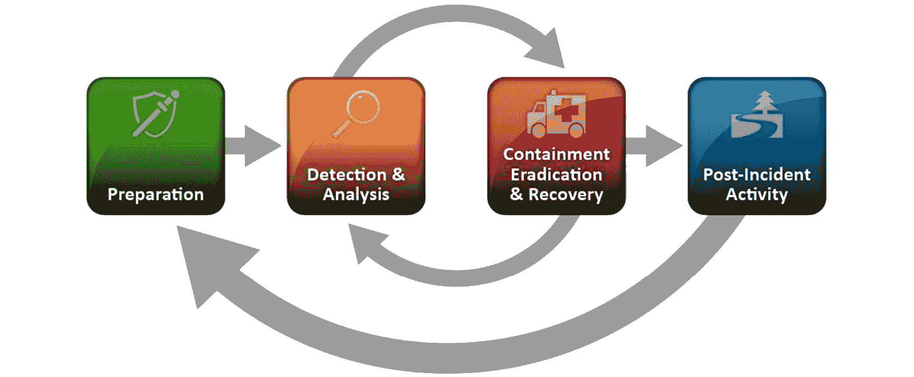
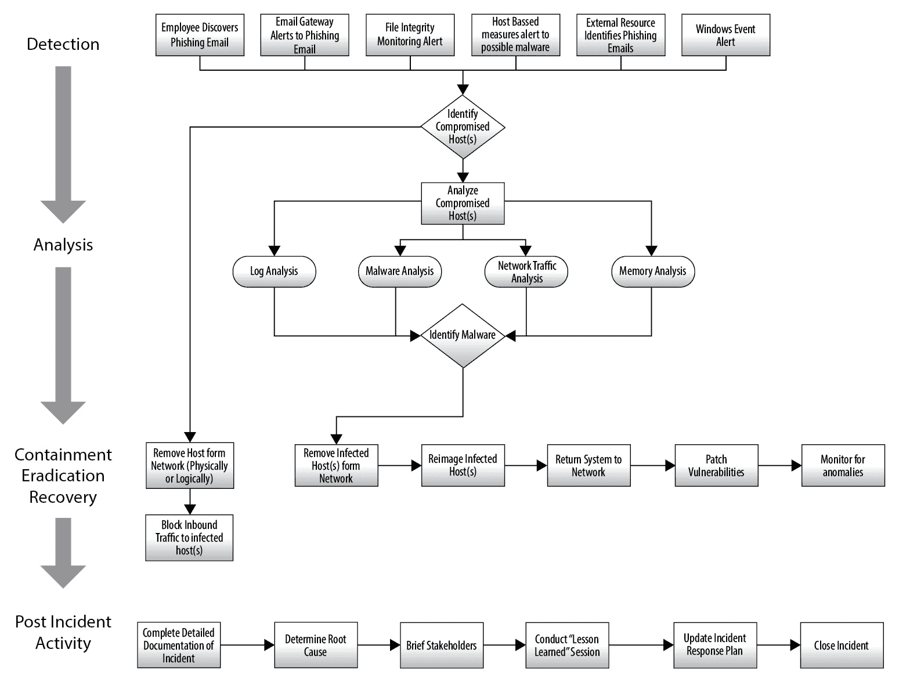

# 第一章：理解事件响应

在审视今天的**信息技术**（**IT**）面临的威胁时，这似乎是一个让人不知所措的问题。从简单的脚本小子使用现成代码到国家级对手工具，准备好应对这些威胁至关重要。例如，一名内部员工可能下载了一份勒索软件，而这可能对组织产生重大影响。更复杂的攻击，如网络利用尝试或定向数据泄露，会增加安全事件所造成的混乱。技术人员将忙于确定哪些系统受到了影响，并且这些系统是如何被操控的。他们还必须处理通过被攻破的系统可能导致的数据丢失。此外，管理层还会催促他们更新情况并回答一个重要问题：*这是怎么发生的？* *是网络服务器的漏洞，还是钓鱼邮件导致了横向传播？* 管理层还想知道：*情况有多严重？* *损害是否仅限于网络服务器，还是整个网络的很大一部分已经遭到破坏？*

具备以有序高效的方式正确应对安全事件的能力，使组织能够在潜在的网络攻击中限制损害，并从相关损害中恢复。为了促进这种有序的响应，所有规模的组织都已考虑将**事件响应**（**IR**）能力纳入其现有的政策、程序和流程中。

为了在组织内部建立这一能力，必须解决几个关键组成部分。首先，组织需要对 IR 过程有一定的了解。该过程概述了事件的一般流程以及在每个阶段采取的一般行动。其次，组织需要能够接触到那些构成任何 IR 能力核心的人员。一旦团队组建完成，就需要制定正式的计划和相关流程。这些书面计划和流程构成了组织在事件发生时可以遵循的有序结构。最后，在建立了这一框架后，必须持续评估、测试并改进该计划，因为新的威胁不断出现。利用这个框架将使组织能够为许多组织已经面临的不幸现实做好准备——一个影响安全的事件。

本章将涵盖以下主题：

+   IR 过程

+   IR 框架

+   IR 计划

+   IR 行动手册/手册

+   测试 IR 框架

# IR 过程

网络安全事件在其生命周期中遵循一个一般路径。如果组织具备成熟的 IR 能力，它将采取措施确保在每个阶段都能应对事件。每个事件从组织第一次意识到一个或一系列表明恶意活动的事件开始。这一检测可能来自安全控制警报或外部方告知组织潜在的安全问题。一旦收到警报，组织将通过分析事件、采取遏制措施，将信息系统恢复到正常操作状态。IR 过程没有固定的标准，一个被广泛使用的标准是**美国国家标准与技术研究院**（**NIST**）的 IR 过程。下图来自 NIST **特别出版物**（**SP**）*800-61*，展示了 NIST 过程如何在一个周期中流动，以**准备**作为起点。仔细观察会发现，每个事件都被用来更好地为组织准备未来的事件，作为**事件后活动**，并为下一个事件的准备工作提供支持：

图 1.1 – NIST IR 过程

IR 过程可以分解为以下六个独立的阶段，每个阶段都有一系列组织可以采取的行动来应对事件：

+   **准备**：没有良好的准备，任何后续的 IR 都会显得杂乱无章，甚至可能使事件变得更糟。准备的一个关键组成部分是制定 IR 计划。一旦计划完成并且人员配置到位，确保负责 IR 工作的人员得到充分的培训。这包括相关的流程、程序以及调查事件所需的任何额外工具。除了计划外，还应当采购并将取证硬件和软件纳入整体流程中。最后，应定期开展演练，确保组织人员已接受培训并熟悉整个过程。

+   **检测**：潜在事件的检测是一项复杂的工作。根据组织的规模，可能每天会有超过一亿个独立的事件。这些事件可以是正常业务过程中采取的合法操作记录，也可以是潜在恶意活动的指示。将大量的事件数据与其他安全控制措施的警报结合在一起，分析师会被数据淹没，必须从大量的网络噪声中筛选出有价值的信号。即便是今天最前沿的**安全信息与事件管理**（**SIEM**）工具，如果没有得到正确的维护，并且未定期更新规则集来识别哪些事件符合潜在事件的标准，它们的效果也会大打折扣。检测阶段是 IR 过程中的一部分，组织在这一阶段首次意识到一组可能表示恶意活动的事件。这些已被检测到并表明恶意行为的事件随后会被归类为事故。例如，安全分析师可能收到警报，指出某个特定的管理员账户在管理员度假时被使用。检测也可能来自外部来源。**互联网服务提供商**（**ISP**）或执法机关可能会检测到来自组织网络的恶意活动，并联系该组织通报情况。在其他情况下，用户可能是第一个发现潜在安全事件的人。这可能仅仅是一个员工联系帮助台，告诉帮助台技术员他们收到了一个来自未知来源的 Excel 电子表格并打开了它。现在他们抱怨本地系统上的文件正在被加密。在每种情况下，组织都必须将这些事件升级为事故（我们将在本章稍后讨论），并开始调查和修复的反应过程。

+   **分析**：一旦检测到事件，组织的人员或可信的第三方将开始分析阶段。在这一阶段，人员开始收集来自系统的证据，如运行中的内存、日志文件、网络连接和正在运行的软件进程。根据事件的类型，这一收集过程可能需要从几小时到几天不等。证据收集完成后，接下来需要对其进行分析。进行此分析的工具有很多，其中许多将在本书中进行探讨。通过这些工具，分析师试图确定发生了什么，影响了什么，是否有其他系统涉及其中，是否有机密数据被移除。分析的最终目标是确定事件的根本原因，并重建威胁行为者的行为，从最初的入侵到最终的检测。

+   **遏制**：一旦充分了解事件的性质和涉及的系统，组织就可以进入遏制阶段。在此阶段，组织采取措施限制威胁行为者继续危害其他网络资源、与**指挥与控制**（**C2**）基础设施通信或窃取机密数据的能力。遏制策略可以从在防火墙上锁定端口和**互联网协议**（**IP**）地址，到简单地拔掉感染机器背后的网络电缆。每种类型的事件都有其独特的遏制策略，但拥有多个选项可以让人员在能够检测到安全事件时，或在威胁行为者窃取数据时，迅速从源头遏制问题。

+   **清除与恢复**：在清除阶段，组织将从受影响的网络中移除威胁行为者。如果是恶意软件感染，组织可能会运行增强版的反恶意软件解决方案。其他情况下，感染的机器必须被擦除并重新映像。其他活动还包括移除或更改被攻破的用户账户。如果组织已识别出被利用的漏洞，则会应用供应商的修补程序或进行软件更新。恢复活动与组织的**业务连续性**（**BC**）或**灾难恢复**（**DR**）计划中的活动非常相似。在该阶段，组织会重新安装全新的操作系统或应用程序，同时从备份中恢复本地系统的数据。作为尽职调查的一部分，组织还会审计现有的用户和管理员账户，以确保没有账户被威胁行为者启用。最后，会进行全面的漏洞扫描，以确保组织确信所有可被利用的漏洞都已被清除。

+   **事件后活动**：在事件过程结束时，所有主要利益相关者会对事件进行全面审查。事件后活动包括对事件过程中采取的所有措施进行彻底回顾。哪些措施有效——更重要的是——哪些措施无效，是讨论的重要内容。这些回顾非常重要，因为它们可能突显出对 IR（事件响应）结果产生积极或消极影响的具体任务和行动。正是在这一阶段，书面报告会被完成。记录在事件过程中采取的行动对于捕捉发生的情况以及是否有可能将事件提交至法庭至关重要。为了确保文档的有效性，应该详细记录并展示清晰的事件链条，重点关注根本原因（如果已确定）。参与报告编写的人员应意识到，IT 之外的利益相关者也可能阅读该报告。因此，技术术语或概念应当加以解释。

最后，组织人员应根据事件后评估和报告中得到的最新信息更新自己的 IR 流程。将所学经验纳入其中非常重要，因为这会使未来的事件响应更加有效。

## 数字取证的作用

很多人对 IR 领域的理解存在误解，认为 IR 仅仅是数字取证的问题。因此，他们经常混淆这两个术语。虽然数字取证是 IR 的关键组成部分（因此我们在本书中包含了多章内容讨论数字取证），但应对事件的处理不仅仅是检查硬盘。最好将取证视为整体 IR 过程的支持性职能。数字取证作为理解事件技术方面的机制，可能帮助识别根本原因，并发现未知的访问或其他恶意活动。例如，一些事件，如**拒绝服务**（**DoS**）攻击，几乎不需要任何取证工作。另一方面，涉及内网服务器和 C2 流量的网络入侵事件，则需要对日志、流量分析和内存进行广泛检查。从这些分析中，可能会得出根本原因。在这两种情况下，受影响的组织都能应对事件，但在后者的情况下，取证发挥了更重要的作用。

IR（事件响应）是信息安全职能，利用数字取证的方法、工具和技术，但它超越了数字取证所提供的内容，涉及额外的元素。这些元素包括遏制潜在的恶意软件或其他漏洞、识别并修复脆弱性，以及管理各种技术和非技术人员。一些事件可能需要分析主机证据或内存，而其他事件可能只需要审查防火墙日志，但在每种情况下，响应者都会遵循 IR 流程。

# IR 框架

响应数据泄露、勒索病毒攻击或其他安全事件绝不应是临时处理的过程。未定义的流程或程序会导致组织无法既识别事件的范围，又能在足够的时间内止住损失，从而限制损害。此外，在事件发生时试图制定应对计划，实际上可能会破坏关键证据，或者更糟糕的是，制造更多问题。

对 IR 流程有深入的了解只是建立该能力的第一步。组织所需的是一个框架，通过利用组织现有资源来执行这些流程。IR 框架描述了组织内功能性 IR 能力的组成部分。该框架包括人员、政策、程序和实施等要素。正是通过这些要素，组织建立了应对事件的能力。

## IR 章程

建立这一能力的第一步是高级领导层决定，组织面临的风险过于重大，不能忽视潜在的安全事件的可能性。一旦达成这一共识，组织的高级成员将担任项目赞助人，并制定 IR 章程。该章程概述了将推动**计算机安全 IR 团队**（**CSIRT**）创建的关键要素。

信息

尽管 IR 团队有多个名称，**CERT**（计算机应急响应小组）一词常常与*US-CERT*（美国计算机应急响应小组）相关联，后者隶属于**美国国土安全部**（**US DHS**）或**CERT 协调中心**（**CERT/CC**），该中心由卡内基梅隆**软件工程研究所**（**SEI**）管理。为了方便起见，我们将使用更通用的 CSIRT。

IR 章程应为一份书面文件，涵盖以下内容：

+   **获得高级领导层支持**：为了成为组织的有效组成部分，CSIRT 需要获得组织高级领导层的支持。在私营部门机构中，获得必要的支持和资金可能较为困难，因为 CSIRT 本身并不像营销或销售那样直接提供价值。应该理解的是，CSIRT 在最糟糕的情况下充当保险政策。通过这种方式，CSIRT 可以通过减少事件的影响来证明其存在，从而降低与安全漏洞或其他恶意活动相关的成本。

+   `local.example.com` 或如*ACME Inc.*这样的组织名称及相关子公司。

+   **创建使命声明**：如果没有明确的 CSIRT 目的定义，使命蔓延或 CSIRT 职责的逐步扩展可能会发生。为防止这种情况，书面信息安全计划中应包括一个清晰定义的使命声明。例如，*ACME Inc.*的 CSIRT 使命是为影响*ACME Inc.*信息系统和人员的安全事件提供及时的分析和行动，确保保密性、完整性和可用性。

+   **确定服务交付**：与使命声明一起，明确列出服务清单也可以防止 CSIRT 的使命范围膨胀。服务通常分为两大类——主动服务和反应服务，如下所述：

    +   **主动服务**：包括为非 CSIRT 员工提供培训，提供有关新兴安全威胁的摘要，测试和部署安全工具，如**端点检测与响应**（**EDR**）工具，以及通过制定**入侵检测系统/入侵防御系统**（**IDS/IPS**）告警规则来协助安全运营。

    +   **反应服务**：这些主要是针对发生的事件进行响应。大多数情况下，反应服务涵盖整个 IR 过程。这包括证据的获取和检查、协助 containment（遏制）、根除和恢复工作，以及最后——记录事件。

明确声明的章程的另一个重要好处是让整个组织了解 CSIRT。这是为了消除关于团队目的的任何谣言或暗示。组织的员工可能会听到诸如*数字调查*或*IR 团队*这样的术语，进而认为组织正在准备专门用来揭发员工不当行为的秘密警察。为了应对这一点，可以向所有员工提供一份简短的声明，包含 CSIRT 的使命声明。CSIRT 还可以定期向高级领导层提供处理过的事件更新，以展示团队的目的。

## CSIRT 团队

一旦完成 IR 章程，下一步就是开始为 CSIRT 配置人员。大型组织如果资源充足，可能会将人员全职分配给 IR 职责。然而，通常情况下，组织不得不利用那些有其他职责的人员来支持 IR。内部 CSIRT 成员可以分为三类：核心团队、技术支持和组织支持。CSIRT 中的每个人都有特定任务。将这一能力建设进组织，需要的不仅仅是分配人员和创建政策与程序文件。与任何大型项目倡议一样，创建一个功能齐全的 CSIRT 需要相当大的努力。

对于 CSIRT 的每个类别，都有特定的角色和责任。这一广泛的人员配置旨在为各种从小到大的事件提供指导和支持。

### CSIRT 核心团队

CSIRT 核心团队由全职承担 IR 职责或在需要时承担 IR 活动的人员组成。在许多情况下，核心团队通常由分配到信息安全团队的人员组成。其他组织可以利用具有 IR 活动专长的人员。以下是可以纳入核心团队的角色：

+   **IR 协调员**：这是任何 CSIRT 中的关键组成部分。如果没有明确的领导，潜在事件的响应可能会混乱，或者在事件发生时，多个个人争夺控制权，导致混乱的局面，反而可能使事件变得更糟。在许多情况下，IR 协调员通常是 **首席安全官**（**CSO**）、**首席信息安全官**（**CISO**）或 **信息安全官**（**ISO**），因为该人员通常负责组织信息安全的总体管理。其他组织可能会指定一个单独的个人担任 IR 协调员。IR 协调员负责在事件发生前、发生中和发生后管理 CSIRT。在准备阶段，IR 协调员将确保任何关于 CSIRT 的计划或政策定期审查并在必要时更新。此外，IR 协调员还负责确保 CSIRT 团队得到适当的培训，并监督 CSIRT 人员的测试和培训。

在事件发生期间，IR 协调员负责确保事件得到适当的响应和修复，并指导团队完成整个 IR 过程。在事件处理中，最重要的任务之一是协调 CSIRT 与高层领导的沟通。由于数据泄露的风险较高，像 **首席执行官**（**CEO**）这样的高层领导希望及时了解有关事件的关键信息。IR 协调员的责任是确保高层领导充分了解与事件相关的活动，并使用简明扼要的语言进行汇报。一个障碍是，组织内的高级领导可能缺乏理解事件技术方面的能力，因此与他们沟通时，需要使用他们能够理解的语言。

最后，在事件结束时，IR 协调员负责确保事件被适当记录，并将 CSIRT 活动的报告交付给相关的内部和外部利益相关者。此外，还会对所有 CSIRT 活动进行全面的总结，并将经验教训纳入到 CSIRT 计划中。

+   **CSIRT 高级分析员**：CSIRT 高级分析员是具有丰富 IR 培训和经验的人员，他们还具备数字取证或网络数据分析等相关技能。他们通常有多年作为顾问或企业 CSIRT 成员进行 IR 活动的经验。

在 IR 过程的准备阶段，他们参与确保自己具备处理在 CSIRT 中担任特定角色所需的技能和培训。他们通常还会协助审查和修改 IR 计划。最后，高级分析员还会参与培训团队中的初级成员。

一旦事件被识别，高级分析员将与其他 CSIRT 成员合作，获取和分析证据，指导遏制活动，并协助其他人员进行补救。

在事件结束时，高级分析员将确保他们自己和其他人员适当记录该事件。这将包括向内部和外部利益相关者准备报告。他们还将确保任何证据都根据 IR 计划被适当归档或销毁。

+   **CSIRT 分析员**：CSIRT 分析员是承担 CSIRT 职责的人员，他们在 IR 活动中经验较少或接触较少。通常，他们只有 1 到 2 年的事件响应经验。因此，他们可以执行各种活动，其中一些活动是在高级分析员的指导下进行的。

在准备阶段的活动中，分析员将通过培训和演练提升技能。他们也可能参与 IR 计划的审查和更新。在事件发生期间，他们将负责从可能受感染的主机、网络设备或各种日志源收集证据。分析员还将参与证据的分析，并协助其他团队成员进行补救活动。

+   **安全运营中心（SOC）分析员**：较大的企业可能拥有内部或外包的 24/7 SOC 监控能力。被分配到 SOC 的分析员通常会成为事件检测和警报的关键人员。因此，拥有 SOC 分析员作为团队的一员，可以让他们接受事件识别和响应技术的培训，并几乎立即响应潜在的安全事件。

+   **IT 安全工程师/分析员**：根据组织的规模，可能会有专门的人员负责部署、维护和监控与安全相关的软件（如防病毒软件）或硬件（如防火墙或 SIEM 系统）。当事件被识别时，直接访问这些设备是至关重要的。被分配这些职责的人员通常会在整个应急响应（IR）过程中扮演直接角色。

IT 安全工程师或分析员将负责 IR 过程的准备工作。他们将是确保安全应用程序和设备正确配置以便于警报潜在事件的主要资源，并确保设备正确记录事件，以便能够重建事件过程。

在事件发生期间，他们的任务是监控安全系统，寻找其他恶意行为的指示。他们还将协助其他 CSIRT 人员从安全设备中获取证据。最后，在事件发生后，这些人员将负责配置安全设备，监控可疑行为，以确保补救活动已经消除了受影响系统中的恶意活动。

### 技术支持人员

**技术支持人员**是指那些在组织内不承担 CSIRT 日常活动的人员，但他们在事件发生时具备可能受到影响的系统和流程的专业知识或访问权限。例如，CSIRT 可能需要让服务器管理员协助核心团队从服务器获取证据，如内存捕获、虚拟系统获取或日志文件卸载。完成后，服务器管理员的角色即告结束，他们可能不再参与该事件。以下是一些在事件发生时可以为 CSIRT 提供帮助的人员：

+   **网络架构师/管理员**：事件通常涉及网络基础设施，包括路由器、交换机以及其他网络硬件和软件的攻击。网络架构师或管理员对这些设备的正常和异常行为有重要的见解，并且能帮助识别异常的网络流量。在涉及网络基础设施的事件中，这些支持人员可以协助获取网络证据，如访问日志或数据包捕获。

+   **服务器管理员**：威胁行为者通常瞄准网络中存储关键或敏感数据的系统。这些高价值目标通常包括域控制器、文件服务器或数据库服务器。服务器管理员可以帮助从这些系统中获取日志文件。如果服务器管理员还负责维护 Active Directory 结构，他们可能能够协助识别新用户账户或现有用户及管理员账户的变化。

+   **应用支持**：Web 应用程序是威胁行为者的主要目标。编码中的缺陷，如允许 SQL 注入或安全配置错误，常常是某些安全漏洞的根源。因此，将应用支持人员纳入 CSIRT 有助于查找与应用攻击直接相关的信息。这些人员通常能够识别代码变更或确认在对应用程序可能攻击的调查过程中发现的漏洞。

+   **桌面支持**：桌面支持人员通常参与维护桌面系统上的控制措施，如数据丢失防护和防病毒软件。在发生事件时，他们可以协助提供 CSIRT 所需的日志文件和其他证据。他们还可能负责在事件的修复阶段清理受感染的系统。

+   **帮助台**：根据不同组织的情况，帮助台人员在识别事故方面就像煤矿中的金丝雀一样。他们通常是用户在第一次出现恶意软件感染或其他恶意活动迹象时联系的第一个人。因此，帮助台人员应参与 CSIRT 响应的培训，并了解他们在事故识别和升级程序中的角色。如果发生广泛的事件，他们还可以协助识别其他受影响的人员。

### 组织支持人员

除了技术领域，其他组织成员也应纳入 CSIRT 中。组织人员可以协助解决一系列非技术性问题，这些问题超出了 CSIRT 核心人员和技术支持人员的职责范围。这些问题包括导航内部和外部法律环境、协助客户沟通或在现场支持 CSIRT 人员。

以下是应纳入 CSIRT 计划的一些组织支持人员：

+   **法律**：数据泄露和其他事故涉及各种法律问题。许多国家现在都有泄露通知法律，要求组织通知客户其信息已被置于风险中。其他合规要求，如**健康保险流动性与责任法案**（**HIPAA**）和**支付卡行业数据安全标准**（**PCI DSS**）要求受影响的组织联系各种外部机构并通知他们可能发生的泄露事件。在 IR 过程的早期引入法律代表，将确保这些通知和其他法律要求及时得到处理。如果泄露是由内部人员（如员工或承包商）造成的，受影响的组织可能希望通过民事诉讼追回损失。在过程的早期包括法律代表，将有助于做出更为知情的决定，确定应遵循哪种法律程序。

+   **人力资源（HR）**：组织中发生的许多事故是由员工或承包商实施的。诸如欺诈行为或大规模数据盗窃等行为的调查可能需要 CSIRT 介入。如果调查的对象是员工或承包商，人力资源部门可以协助确保 CSIRT 的行动符合适用的劳动法和公司政策。如果需要解雇员工或承包商，CSIRT 可以与人力资源人员协调，确保所有有关该事件的适当文档已完成，从而减少不当解雇诉讼的可能性。

+   **市场营销/通讯**：如果外部客户或顾客可能受到像 DoS 攻击或数据泄露等事件的负面影响，市场营销或通讯部门可以帮助制定合适的信息，安抚顾客的恐慌，并确保外部实体获得最准确的信息。回顾过去一些数据泄露事件，其中一些组织试图将细节隐瞒，不告知客户，结果引发了公众的强烈反应。拥有一个完善的沟通计划，并在早期付诸实践，将有助于缓解客户或客户的任何负面反应。

+   **设施**：CSIRT 可能需要在非工作时间或长时间内访问特定区域。设施部门可以协助 CSIRT 及时获得所需的访问权限。设施部门还可能为 CSIRT 提供额外的会议空间，以应对长时间的事件，需要专门的工作空间和基础设施。

+   **公司安全**：CSIRT 可能会被召集处理公司网络资源或其他技术的盗窃事件。笔记本电脑和数字媒体的盗窃非常常见。公司安全部门通常可以访问入口和出口处的监控录像。他们可能还会保存员工和其他人员在设施内活动的门禁卡和访客记录，供 CSIRT 跟踪。这有助于重构导致盗窃或其他事件发生的过程。

### 外部资源

许多行业都有专业的组织，行业从业者无论所属雇主如何，都可以聚集在一起共享信息。CSIRT 人员有时也可能需要与执法部门和政府机构进行对接，特别是在他们成为针对多个类似组织的大规模攻击的一部分时。与外部组织和机构建立关系可以在发生事件时，帮助 CSIRT 获取情报共享和资源支持。这些资源包括以下内容：

+   **高技术犯罪调查协会**（**HTCIA**）：HTCIA 是一个国际性的专业人士和学生组织，专注于高技术犯罪。资源涵盖从数字取证技术到可以帮助 CSIRT 人员掌握新技术和方法的广泛企业级信息。如需更多信息，请访问官网 [`htcia.org/`](https://htcia.org/)。

+   **InfraGard**：对于在美国的 CSIRT 和信息安全从业人员，**联邦调查局**（**FBI**）创建了一个旨在促进网络和信息共享的公私合营伙伴关系。此伙伴关系使 CSIRT 成员可以分享有关趋势的信息或讨论过去的调查。更多信息请访问以下网站：[`www.infragard.org/`](https://www.infragard.org/)。

+   **执法**：与网络相关的犯罪活动在执法领域经历了爆炸性的增长。对此，许多执法机构已提高了调查网络犯罪的能力。CSIRT 领导应与具备网络犯罪调查能力的机构建立关系。执法机构可以提供有关正在发生的特定威胁或犯罪的见解，并向 CSIRT 提供任何相关的信息。

+   **供应商**：在发生事件时，可以利用外部供应商，而他们能提供的服务通常取决于组织与他们合作的**业务领域**（**LOB**）。例如，组织的 IPS/IDS 解决方案提供商可以协助制定自定义警报和阻断规则，以帮助检测和遏制恶意活动。具有**威胁情报**（**TI**）能力的供应商也可以提供有关恶意活动指标的指导。最后，一些组织可能需要聘请专门从事 IR 的供应商，比如当需要逆向工程恶意软件时，这些技能超出了组织的能力范围。

根据组织的规模，CSIRT 涉及多人的情况很容易理解。在组建整个 CSIRT 时，确保每个成员了解其角色和职责至关重要。还应要求每个成员就整个 IR 过程中可以利用的特定专业知识提供指导。在 IR 框架的下一个部分——IR 计划的制定过程中，这一点变得尤为重要。

# IR 计划

编写完 IR 章程并成立 CSIRT 后，下一步是制定 IR 计划。IR 计划是一个概述组织响应能力高层结构的文件。这是一个高层次的文件，作为 CSIRT 的基础。IR 计划的主要组成部分如下：

+   **IR 章程**：IR 计划应包括来自 IR 章程的使命声明和服务对象。这使得该计划在 IR 能力的起始阶段和 IR 计划之间具有连续性。

+   **扩展服务目录**：最初的 IR 章程包含了泛泛的服务类别，并未提供具体细节，因此 IR 计划应当包括 CSIRT 提供的具体服务内容。例如，如果法证服务被列为服务项目的一部分，IR 计划可能会指出，法证服务包括从硬盘中恢复证据、内存取证和反向工程分析可能的恶意代码，以支持事件调查。这可以帮助 CSIRT 清楚地区分正常请求（例如，搜索硬盘以找回与事故无关的误删文档）与与已声明的事件相关的硬盘镜像操作。

+   **CSIRT 人员**：如前所述，CSIRT 由许多成员组成。IR 计划将明确这些角色和职责。组织应当从仅仅列出姓名和职位出发，进一步明确每个成员的具体角色和职责。在事故发生时，避免出现地盘之争是非常重要的，明确 CSIRT 人员的角色和职责有助于大大减少这种可能性。

+   **联系方式列表**：最新的联系方式列表应作为 IR 计划的一部分。根据组织的不同，CSIRT 可能需要全天候响应事件。在这种情况下，IR 计划应包含主要和次要的联系方式。组织还可以安排轮班的 CSIRT 成员，在事件发生时担任首个联系方式。

+   **内部沟通计划**：事故发生时，人员可能会感到混乱，他们需要确认发生了什么、需要哪些资源以及应该联系谁来处理该事件。IR 计划中的内部沟通指南可以帮助应对这种混乱。此部分计划涉及信息在高级领导层和 CSIRT 之间的上下流动。还应考虑 CSIRT 核心成员与支持人员之间的横向沟通。这有助于限制彼此沟通的人员范围，减少可能出现的相互矛盾的指令。

+   **培训**：IR 计划还应指明 CSIRT 人员的培训频率。至少，整个 CSIRT 团队每年应进行一次桌面演练。如果在事故事后分析中发现培训存在空白，应该在事故结束后合理的时间内加以解决。

+   **维护**：各种规模的组织都会不断变化。这可能包括基础设施、威胁和人员的变化。IR 计划应考虑审查和更新计划的频率。例如，如果组织收购了另一家公司，CSIRT 可能需要调整服务提供或整合特定的人员及其角色。至少，IR 计划应每年更新一次。个别团队成员还应通过组织如**系统管理、网络和安全**（**SANS**）提供的培训和认证，或专门的数字取证工具培训，来提升自己的技能。组织还可以将任何演练中的经验教训纳入更新中。

## 事件分类

不是所有事件的严重性和对组织的威胁都是一样的。例如，一种病毒感染了组织支持区域的几台计算机，其响应等级会与关键服务器的主动妥协事件不同。将所有事件视为同等严重将迅速耗尽 CSIRT 的精力，因为他们必须以相同方式响应即使是轻微的事件。

因此，在 IR 计划中定义事件分类架构非常重要。通过对事件进行分类并评估响应，组织可以更好地利用 CSIRT，并确保它们不会将所有资源投入到次要问题中。以下是一个示例分类架构：

+   **高级事件**：高级事件是指预计会对关键和/或战略性公司或客户信息造成重大损害、破坏或丧失的事件。高级事件可能涉及系统或网络资源的广泛或长期丧失。此类事件可能对组织及其公司公众形象造成损害，并使组织承担责任。高级事件的示例包括但不限于以下内容：

    +   网络入侵

    +   勒索软件

    +   C2 流量的识别

    +   信息系统的物理妥协和关键信息的泄露

    +   丧失包含未加密机密信息的计算机系统或可移动媒体

    +   广泛且不断增长的恶意软件感染（超过 25% 的主机）

    +   针对 IT 基础设施的定向攻击

    +   使用组织域名和品牌进行的钓鱼攻击

+   **中级事件**：中级事件是指可能导致可替代信息的损害、破坏或丧失的事件，且未造成信息泄露（没有滥用敏感客户信息）。中级事件可能会对系统或网络资源造成显著干扰，或可能影响公司内**业务单元**（**BU**）的任务。以下是一些中级事件的示例：

    +   预期或正在进行的 DoS 攻击

    +   丧失包含未加密机密信息的计算机系统或可移动媒体

    +   授权访问的滥用或不当使用；自动化入侵

    +   限制性恶意软件感染

    +   异常的系统性能或行为；恶意软件的安装

    +   可疑的计算机活动变化

+   **低级事件**：低级事件是指造成不便和/或无意损害或丢失可恢复信息的事件。该事件对公司几乎没有影响。以下是一些此类事件的例子：

    +   通过合规审查或日志审查发现的政策或程序违规行为

    +   遗失或被盗的笔记本电脑或其他含有加密机密信息的移动设备

    +   未经授权的软件安装；单台 PC 的恶意软件感染

# IR 应急预案/手册

IR 计划的一个关键方面是使用应急预案。IR 应急预案是一套在 IR 流程中的每个步骤中执行的指令和行动。应急预案的创建是为了为组织提供清晰的路径，但在调查的事件无法完美符合预定模式时，仍能保持一定的灵活性。

判断哪些应急预案至关重要的一个重要指标是组织的风险评估。检查任何被评为关键或高风险的威胁的风险评估，将指明需要通过 IR 应急预案来处理的情境。大多数组织会将一些威胁识别为关键，如通过零日漏洞进行的网络入侵、勒索软件或网络钓鱼，这些威胁需要预防和侦测控制。由于风险评估已将这些识别为关键风险，因此最好从这些威胁开始制定应急预案。

在没有风险或威胁评估的情况下，组织应至少有五个应急预案，涵盖它们可能面临的最常见情境，如下所示：

+   网络钓鱼

+   恶意软件

+   勒索软件

+   外部系统中的漏洞

+   **商务电子邮件攻击**（**BEC**）

注意事项

过去几年展示了勒索软件攻击对组织造成的毁灭性影响。本书将分析几种情境，作为整体勒索软件威胁的一部分，以更好地理解对这种类型攻击的准备和响应。

例如，让我们来分析一个常见威胁的应急预案——社会工程学。在这个应急预案中，我们将其划分为之前讨论过的 IR 流程，如下所示：

+   **准备**：在这一部分中，组织将重点介绍所进行的准备工作。在网络钓鱼的情况下，这可以包括提高员工识别潜在钓鱼邮件的意识，或者使用扫描附件中的恶意软件的电子邮件设备。

+   **检测**：对于网络钓鱼攻击，组织通常通过警觉的员工或电子邮件安全控制收到警报。组织还应计划通过恶意软件防护或**主机入侵防护系统**（**HIPS**）控制接收警报。

+   **Analysis**: 如果检测到事件，分析现有的任何证据对于分类和适当响应事件至关重要。在这种情况下，分析可能包括检查被感染主机的内存，检查事件日志中的可疑条目，以及审查主机进出的任何网络流量。

+   **Containment**: 如果已确认主机受到感染，应将其与网络隔离。

+   **Eradication**: 如果确认存在恶意软件，应将其移除。如果没有，手册应该有备选方案，如使用已知的良好镜像重新部署。

+   **Recovery**: 恢复阶段包括扫描主机以查找潜在的漏洞，并监控系统是否存在异常流量。

+   **事后活动**: 手册还应指导在事件发生后应采取哪些行动。这些行动中的许多都将在播放簿的目录中相同，但是包括它们是很重要的，以确保它们完整地完成。

以下图表是针对钓鱼攻击的示例手册。请注意，该手册涵盖了 IR 周期的每个阶段，以及作为响应的一部分应采取的具体行动。此外，组织可以详细说明特定行动，例如通过日志分析特定手册：

图 1.2 – 社会工程学手册

可以通过多种方式配置手册，例如，可以将书面文档添加到特定类型事件的 IR 计划中。其他时候，组织可以使用软件如 iStudio 或 Visio 制作流程图。它们旨在为 CSIRT 和其他人员提供一套遵循事件中的指令，从而避免浪费时间。手册作为指南，应定期更新，特别是在事件中使用时，应识别任何关键部分或步骤。应注意，手册并非铁板一块，也不是一份清单。CSIRT 人员在行动方面不受手册的限制，如果事件需要，可以自由进行额外的行动。

## 升级流程

IR 计划的一个关键组成部分是升级程序。升级程序概述了谁负责将信息系统中的事件或一系列事件从仅仅是异常转移到事故。如果 CSIRT 被派去调查太多误报，他们会变得筋疲力尽。升级程序确保有效利用 CSIRT，并且只有在需要其专业知识时才联系人员。

该程序从最有可能观察到系统中异常或事件的人员开始，这些异常或事件可能预示着更大的安全事件——例如，帮助台可能会接到一系列电话，表明可能存在恶意软件感染。升级程序可能指示，如果检测到恶意软件并且无法通过恶意软件防护措施进行清除，人员应联系值班的 CSIRT 成员。在此步骤中的一个重要考虑因素是确定升级报告中应包含哪些信息。以下指南列出了 CSIRT 开始处理问题所需的详细信息：

+   **检测日期和时间**：这个初始数据点不言自明。但有两个主要考虑因素。第一个是时区。首选时区是**协调世界时**（**UTC**）。如果所有记录活动的系统都配置为 UTC，这特别有用。第二个是格式。虽然有些争议，但一种通用的方法是将日期和时间放在一起，形成以下格式：20220117T1637 UTC。

+   **报告人**：此人作为任何可能被召入升级处理的其他人员的初始联系人。此人应对事件有清晰的了解，能够回答任何问题。通常情况下，这个人是 SOC 经理或其他责任人。

+   **事件类型**：在升级过程中，明确被升级事件的类型非常重要。这可能决定了特定类型的响应。以下是需要考虑的事件类型：

    +   勒索软件

    +   恶意软件感染

    +   外部系统被攻破

    +   持续的妥协

    +   数据外泄

    +   C2

    +   DoS

    +   其他

+   **事件严重性**：这是对事件严重性的首次评估。了解问题的严重性将帮助 IR 团队合理配置资源。

+   **受影响系统的数量**：如果可能，提供事件的规模非常重要。这应包括受影响的系统数量、操作系统类型以及系统的功能——例如，影响的是仅运行 Apache 的 Linux 服务器，还是 Windows 桌面计算机。

+   **零号病人已识别**：这个数据通常不会在初步升级中包含，因为零号病人——即第一个被识别为受损的系统——通常是在事件的分析阶段发现的。

+   **已识别战术**：任何已识别的战术也应被升级。例如，使用**服务器消息块**（**SMB**）或**远程桌面协议**（**RDP**）进行的横向移动战术应该被升级，因为这些战术表明这是一个更广泛的网络安全事件。使用的战术框架可以参考 MITRE 的**对抗战术、技术与常识**（**ATT&CK**）框架，这将在后续章节中讨论。

+   **妥协指示器（IOCs）**：与最初检测相关的数据点，如 IP 地址、域名或文件哈希，应提交并纳入分析的一部分。

+   **所采取的行动**：如果采取了任何行动，报告方或其同事也应被记录。例如，如果报告小组有能力阻止代码执行，并成功阻止了恶意软件的进一步执行，这将直接影响 IR 团队所采取的响应措施。

有多种方法可以将这些信息传递给 CSIRT。工单系统可以配置为自动通知 CSIRT 人员，工单中包含相关的升级细节。另一个选择是使用电子邮件模板，发送给处理升级的特定 CSIRT 人员。在事件发生期间，CSIRT 和其他人员从事件开始时所采取的所有行动应被记录并跟踪。

信息

对于那些资源有限、每年发生的事件较少的组织，大多数 IT 工单系统足以跟踪事件。这种方法的缺点是，这些系统通常缺乏 IR（事件响应）功能，并且没有专门支持 IR 活动的附加功能。对于事件频发的大型组织，实施专门设计的 IR 跟踪系统可能是最合适的选择。这些系统可以集成证据收集和事件处置手册。

然后，CSIRT 成员将接管事件处理。如果他们能够将恶意软件限制在单一系统内并确定感染路径，他们将尝试移除恶意软件，若无法清除，则会重新安装并重新部署系统。此时，事件已成功结束。CSIRT 成员可以记录事件并关闭工单，而无需调动其他资源。

另一个例子是，当升级过程进一步发展为全面的 CSIRT（计算机安全事件响应团队）响应时，最初的情况可能非常简单，只需对 Active Directory 凭据进行审计。在这种情况下，负责访问管理的服务器管理员正在进行半年度的管理员凭据审计。在审计过程中，他们发现三个新的管理员用户账户，这些账户没有与任何已知的访问权限关联。经过进一步调查，他们确定这些用户账户是在几个小时内创建的，而且是在一个周末期间创建的。服务器管理员随即联系 CSIRT 进行调查。

CSIRT 分析员观察情况，判断可能发生了安全事件。CSIRT 成员指示服务器管理员检查事件日志，查看是否有使用管理员账户的登录记录。服务器管理员发现了两个登录：一个是在数据库服务器上，另一个是在 **非军事区** (**DMZ**) 的 Web 服务器上。随后，CSIRT 分析员指示分配给 CSIRT 的网络管理员检查 SQL 数据库和 Web 服务器之间的网络流量。此外，基于当前情况，CSIRT 分析员将此事升级到 CSIRT 协调员，并将情况通报给他们。CSIRT 协调员随即开始启动其他 CSIRT 核心团队和技术支持成员的协作。

在检查网络流量后，确认外部威胁行为者已经入侵了这两个系统，并正试图从内部网络中窃取客户数据库。此时，CSIRT 协调员将此事件视为高危事件，并开始组织支持人员进行简报。由于此次事件涉及客户数据的泄露，CSIRT 支持人员——如市场营销、沟通与法律人员——需要参与其中。如果需要更多资源，CSIRT 协调员将主导决策。

升级程序的制定旨在确保相关人员拥有适当的授权和培训，能够在需要时调动资源。升级程序还应考虑在事件严重性不同的情况下，是否需要其他非核心 CSIRT 成员的参与。升级程序的关键功能之一是明确哪些人员有权宣布事件中的异常活动。升级程序还应根据事件的严重性，明确是否需要其他人员参与。

# 测试 IR 框架

到目前为止，已经在准备应对安全事件的多个领域取得了进展。从最初对 IR 过程的理解开始，我们已经完成了 IR 计划及相关操作手册的制定。

一旦某项能力建立完成，应通过桌面演练来发现任何潜在的漏洞或缺陷。此演练应包含一个涉及整个团队和相关操作手册的高危事件场景。应准备并提交一份报告，详细列出桌面演练的结果以及任何缺陷、修正或调整，并将报告转交给高级领导层。一旦领导层获知并确认 CSIRT 已准备好投入使用，它就正式投入运营。

当 CSIRT 在结构化场景下执行计划时变得得心应手，他们可能会想尝试更复杂的测试措施。另一个可行的选项是红/蓝或紫队演练。在这种情况下，CSIRT 的任务是响应授权的渗透测试。此时，团队能够与真实对手对抗，测试计划和操作手册。这显著提高了渗透测试的价值，因为它不仅提供了对基础设施安全的洞察，还展示了组织对威胁做出适当反应的能力。

无论团队的组成如何，CSIRT 部署的另一个关键组成部分是定期培训的纳入。对于 CSIRT 核心成员，应持续进行关于新兴威胁、取证技术和工具的专项培训。这可以通过第三方培训提供者来进行，或者如果有条件的话，也可以通过内部培训进行。CSIRT 的技术支持成员应定期接受有关可用技术和工具的培训。

如果这些成员在事件发生时可能被召集来协助证据收集或修复活动，这一点尤其重要。最后，其他支持成员应参与 IR 计划的年度测试。就像首次测试一样，组织应选择一个高层次的事件并通过桌面演练进行处理。另一个可供组织选择的方案是将 IR 计划的测试与渗透测试结合起来。如果组织能够检测到渗透测试的存在，他们就具备了应对事件的能力，可以进行事件的初期阶段并为剩余部分制定桌面演练。

IR 计划的持续维护的一个最终组成部分是全面的年度审查。进行年度审查是为了确保任何人员、成员或任务的变化不会影响计划的其他部分。除了审查计划，还会对操作手册进行全面审查。随着威胁的变化，可能需要更改现有的操作手册或增加新的手册。若出现新的威胁，CSIRT 人员也应自由创建新的操作手册。通过这种方式，CSIRT 能够更好地应对可能影响组织的事件。任何重大的更改或增加也应触发另一次桌面演练，以验证附加的计划和操作手册。

# 总结

本杰明·富兰克林曾说过：“*不做准备，你就是在准备失败*。”在许多方面，这句话在组织和网络攻击威胁方面是非常准确的。为网络攻击做好准备是一项至关重要的职能，必须像任何其他网络安全方面一样认真对待。深入了解 IR 过程，并基于此建立 IR 能力，可以为组织提供一种准备措施，以便在发生事件时能够进行响应。请记住，随着我们向前推进，取证技术、威胁情报（TI）和逆向工程旨在帮助组织走到最后——即恢复正常运行。

本章探讨了构建 IR 能力所需的一些准备工作。选择团队、制定计划、创建剧本和升级程序，使 CSIRT 能够有效地应对事件。CSIRT 及其相关计划为数字取证技术提供了结构。

本讨论将在下一章开始，在那里，适当的证据处理和文档记录是调查事件的关键第一步。

# 问题

通过回答以下问题测试你的知识：

1.  在对 IR 计划和/或剧本进行更改后，应该进行桌面演练。

    1.  正确

    1.  错误

1.  以下哪些角色不会是 CSIRT 核心团队的成员？

    1.  事件协调员

    1.  CSIRT 分析员

    1.  法律

1.  在 IR 框架中，不必为事件发生时提供技术资源支持。

    1.  正确

    1.  错误

1.  风险评估是识别高风险事件并为剧本创建提供有效数据源的一个有效途径。

    1.  正确

    1.  错误

# 进一步阅读

你可以参考以下资源，获取有关我们在本章所学内容的更多信息：

+   *计算机安全事件处理指南*，*NIST SP 800-61 修订版 2*：[`csrc.Nist.gov/publications/detail/sp/800-61/rev-2/final`](https://csrc.Nist.gov/publications/detail/sp/800-61/rev-2/final)

+   **欧洲网络与信息安全局**（**ENISA**）——*现场角色扮演中的事件处理手册*：[`www.enisa.europa.eu/topics/trainings-for-cybersecurity-specialists/online-training-material/documents/incident-handling-in-live-role-playing-handbook/view`](https://www.enisa.europa.eu/topics/trainings-for-cybersecurity-specialists/online-training-material/documents/incident-handling-in-live-role-playing-handbook/view)

+   *事件处理手册* 作者：*Patrick Kral*，*SANS 阅读室*：[`www.sans.org/reading-room/whitepapers/incident/incident-handlers-handbook-33901`](https://www.sans.org/reading-room/whitepapers/incident/incident-handlers-handbook-33901)
