# 第三章：数字取证基础

法医学可以定义为将科学原理应用于法律事务。在一个事件中，**CSIRT**（即**计算机安全事件响应小组**）成员可能会被召集，对在事件中获得的数字证据进行分析，利用数字取证工具、技术和知识。为了确保证据得到正确处理并能随后在法庭上被采纳，数字取证鉴定人员需要理解法律问题，并掌握数字取证过程中的细节。

本章将探讨影响 CSIRT 和数字取证鉴定人员的法律法规，以及有关证据如何在法庭上被采纳的规则。为了提供有关采取的行动的背景，我们还将探讨数字取证过程，最后，讨论将数字取证能力融入 CSIRT 所需的基础设施。

本章将涵盖以下主题：

+   法医学概述

+   洛卡尔交换原则

+   数字取证中的法律问题

+   事件响应中的法医程序

# 法医学概述

在过去的 20 年里，法医学的兴趣爆发式增长。简而言之，法医学是科学应用于法律事务的领域。法医学的实际操作是通过分析过程获取物理和数字证据，并在法庭上呈现科学发现。尽管它在大众媒体中有许多表现，法医学实际上是一个细致入微且要求精确的过程，需依赖深思熟虑的流程和程序、技术以及经验。

法医学已经成为多个学科的重要组成部分，甚至超出了刑事司法的范围。例如，航空事故调查员使用法医技术来调查飞机故障。会计在调查涉嫌欺诈和洗钱计划时也使用非常相似的原理和技术。即使是以历史伪造品著称的艺术界，也采用法医技术来验证艺术品的真实性。

法医学首次在公众关注的案件中发挥作用是在 19 世纪末的“开膛手杰克”谋杀案中。伦敦大都会警察局的调查员能够识别、收集并随后检查由未知凶手留下的物理证据。大约在那个时候，指纹比对和犯罪现场摄影这两项经验证的法医实践被纳入到不断增长的知识和实践体系中。

这些实践会在可用技术的基础上缓慢发展，直到第二次世界大战后。这个七十五年的时期见证了 DNA 证据作为识别犯罪者的强大手段的引入。技术被应用于工具痕迹和弹道学领域。二十世纪后半叶，数字取证也开始进入各个法医学科。

# 洛卡尔交换原则

指导法医科学的一个关键原则是**洛卡尔交换原则**。埃德蒙·洛卡尔博士是法医和刑事鉴定领域的先驱。他对这些领域的贡献使得许多人称他为法国的福尔摩斯。简单来说，他的原则是每一次与物理世界的接触都会留下痕迹。例如，一个盗贼打破窗户进入家中。然后他从窗户爬进去，开始抓取周围的物品。根据洛卡尔交换原则，盗贼会把鞋子上的泥土痕迹留在地毯上。皮肤和头发可能会从他们的身体上掉落到家中的各个表面上。没有戴手套的话，盗贼还可能在门把手上留下指纹。

这种交换是双向的。当盗贼在房子里留下他们的痕迹时，房子的痕迹也会留在他们身上。地毯纤维会附着在他们的鞋子上。打破的窗户的碎片也可能嵌入盗贼的鞋子和衣物中。这些微小的痕迹证据能够将盗贼与犯罪现场联系起来。

这个原则自第一次犯罪活动发生以来一直有效。变化的是法医科学家和刑事鉴定从业者在检测和分析这些痕迹证据方面的能力。例如，DNA 证据从该隐杀害亚伯时就已经存在。直到最近，它才在调查中变得有用，因为方法和技术的发展使得法医科学家可以确凿地证明生物材料能够与某个特定个体相关联，排除其他所有人。

关于这一原则，有几个需要注意的方面。首先，痕迹证据存在的时间长度存在较大差异。例如，一些痕迹证据，如撬杠在撬开门时留下的工具痕迹，可能会持续数月甚至数年。另一方面，暴露在外界环境中的指纹很容易在留下几天或几小时后就变得不再适用。其次，需要遵循某些流程来维护痕迹证据的完整性。如果痕迹证据未被正确收集，它可能会被篡改或销毁，导致无法用于调查。第三，必须有相应的技术来帮助分析痕迹证据。DNA 自地球生命诞生以来就存在。将这些痕迹证据用于调查的能力，依赖于能够正确比较和分析 DNA 样本的技术。最后，人为因素也是不可忽视的。痕迹证据需要由经过培训和认证的分析师处理，他们能够审查数据并得出结论。

在数字取证领域讨论洛卡尔交换原则可能看起来有些奇怪。实际上，支撑物理世界取证的同一原则，在数字取证中同样适用。例如，通过 Microsoft Windows 远程桌面功能连接到系统的简单操作就会留下痕迹。在这种情况下，外部威胁行为者获取了有效的用户凭证，并能够通过暴露的系统进行连接。连接本身会在暴露的系统上创建一条日志记录。使用有效凭证登录系统将创建第二条日志记录。该日志记录中包含威胁行为者系统的 IP 地址。这个 IP 地址也可能出现在防火墙日志中。威胁行为者的系统上还可能存在被攻击系统的日志记录和文件。

理解洛卡尔交换原则时，重要的是要理解“痕迹证据”这一概念。威胁行为者会竭尽全力清除他们的踪迹，就像非常优秀的犯罪分子一样，但仍然会留下痕迹。关键在于拥有发现这些痕迹并将其与威胁行为者联系起来的工具和能力。

# 数字取证中的法律问题

正如我们在*第一章*中看到的，恰当的事件响应需要来自不同领域的关键人物。这也揭示了一个常见的误解：事件响应仅仅是一个技术问题。事实上，事件响应的一个重要领域是法律领域。有一系列的法律和规章直接影响组织的事件响应能力，从数据泄露通知到隐私保护等方面。这些法律为政府起诉违法者提供了框架，并对如何处理和呈现证据等问题制定了严格的规定。

## 法律与法规

在 1980 年代中期，随着计算机犯罪逐渐普及，司法管辖区开始制定法律来应对日益增长的网络犯罪案件。例如，在美国，联邦刑法有具体的条款，专门处理涉及计算机的犯罪行为，具体如下：

+   **18 USC § 1029—与访问设备相关的欺诈和相关活动**: 该条款处理使用计算机进行欺诈行为。检察官通常在网络犯罪分子使用计算机或多台计算机进行身份盗窃或其他欺诈相关活动时引用这一法律。

+   **18 USC § 1030—计算机欺诈与滥用法案** (**CFAA**): 在这部法律的众多条款中，最常与事件响应相关的条款是未经授权访问计算机系统的行为。该法律还涉及**拒绝服务**(**DoS**)攻击的非法性。

+   **电子通信隐私法案**(**ECPA**): 这一修正案对*联邦窃听法*进行了修订，并于 1986 年生效。它使得通过电子手段（如电信和互联网）未经授权截取通信成为非法行为。ECPA 在**通信协助执法法案**(**CALEA**)的进一步修订下得到强化。CALEA 要求互联网服务提供商（ISP）确保其网络可以为执法机构提供，支持其依法进行监控。

对 ECPA 的熟悉对在美国有业务存在的组织至关重要。该法案的条款规定，如果用户对隐私有合理的期望，组织在网络上进行监控和捕获流量，即便这些网络由组织控制，也构成犯罪。这可能导致组织因在其自有网络上嗅探流量而承担责任，前提是其用户对隐私有合理的期望。对于 CSIRT 成员来说，如果他们访问网络资源或其他系统，这可能会引发潜在的法律问题。这可以通过让所有系统用户确认他们理解组织可以监控其通信，并且在使用组织提供的计算机和网络资源时，他们对通信不具有合理的隐私期望，从而轻松解决。

+   **1996 年经济间谍法案**（**EEA**）：这部法律包含了 18 USC § 1831-1839 中的若干条款，并将经济间谍行为和商业机密窃取定为犯罪。该法案比以往的间谍立法更为严厉，因为它直接针对商业企业，而不仅仅是国家安全或政府信息。

## 证据规则

《联邦证据规则》是决定证据在刑事或民事诉讼中是否可以采纳或排除的基础。CSIRT 成员了解以下规则非常重要，这样收集的任何证据都能以防止污染的方式进行处理，并避免证据被排除在法庭之外：

+   **第 402 条——相关证据的测试**：此规则包含两部分。首先，待纳入诉讼的证据必须能够使某个事实的发生概率比没有证据时更高或更低。其次，证据（或证据所证明的事实）对诉讼具有重要性。这清楚地表明，证据不仅要与诉讼相关，而且还应该证明或驳斥案件中的某一方面。

+   **第 502 条——律师-客户特权和工作产品**：现代法律中最神圣的原则之一是客户与其律师之间的关系。律师-客户特权的一个条款是，客户与律师之间的谈话内容在法庭上不可作为证据。这不仅适用于口头交流，还适用于书面交流。在数字取证领域，常常会有关于采取的行动和获得的信息的报告。许多情况下，事件响应者会直接为律师工作，代表其客户。因此，这些与事件相关的报告可能会受到律师工作产品规则的约束。在你在律师的指导下工作时，理解这一点非常重要，以便知道这些规则何时适用于你的工作。

+   **规则 702——专家证人证言**：通过在数字法医领域积累经验和知识，分析师可能被允许作为专家证人作证。该证据规则概述了专家证人证言的具体要求。

+   **规则 902——自我认证证据**：该规则最近进行了修订，涉及数字法医。自 2017 年 12 月 1 日起，新增了一项子部分。该子部分允许通过哈希值验证数字证据的完整性（我们将在后续章节讨论哈希的作用）。此外，规则要求有资质的人员出示证据，并且所呈现的证据必须是按照最佳实践收集的。

+   **规则 1002——最佳证据规则**：在民事或刑事诉讼中，原始的书面材料、录音或照片需要作为证据提出，除非可以做出合理的例外。在物理领域中，提供物理证据是很容易的。案件当事人可以轻松地展示用于攻击的刀具。当证据实际上是硬盘上的磁极性或来自路由器的日志文件时，情况就变得更复杂。在这种情况下，法院认为，对硬盘进行法医分析后产生的可靠镜像，可以作为实际硬盘的合理替代品。

+   **规则 1003——副本的可采性**：进行数字媒体法医检查时，最关键的步骤之一是制作该媒体的镜像或法医副本。该证据规则允许在法庭上采纳此类镜像。需要注意的是，如果镜像或法医副本要被采纳，执行该操作的分析师很可能需要作证，证明他们正确地执行了该操作。

接下来，我们将了解数字法医的基本程序，以及这些程序如何应用于事件响应。

# 事件响应中的法医程序

如前一章所述，数字法医是事件响应的重要组成部分。通常，正是数字法医方法的应用，使事件响应人员能够清楚地了解导致恶意行为的事件链，例如被攻击的服务器或其他数据泄露。对于其他事件，如内部欺诈或恶意内部人员活动，数字法医可能提供所谓的“定罪证据”，指向罪犯。在详细探讨事件响应人员可用的工具和技术之前，必须解决数字法医的基础性内容。这些内容不仅为特定行动提供背景，也为确保事件调查中的证据可用性提供方法。

## 数字法医简史

法律执法部门在 1980 年代中期开始关注计算机在犯罪活动中的作用。在此之前，现有的法律和执法技术并不擅长识别和起诉计算机犯罪分子。随着犯罪分子使用计算机的行为日益显著，美国**联邦调查局**（**FBI**）等机构决定建立一个专门的数字与取证调查能力。这促使了 FBI**计算机分析与响应小组**（**CART**）的成立。其他机构，如大都会警察局，也开始建立网络犯罪调查能力。

FBI CART 信息

一份出色的历史文档，涉及 FBI 的 CART，是 1992 年 1 月出版的《美国司法部犯罪实验室文摘》中的一篇简短文章：[`www.ncjrs.gov/pdffiles1/Digitization/137561NCJRS.pdf`](https://www.ncjrs.gov/pdffiles1/Digitization/137561NCJRS.pdf)。

另外两个具有开创性的事件让更多人意识到网络调查和取证的必要性。第一个是黑客马库斯·赫斯闯入劳伦斯伯克利国家实验室。如果不是克利福德·斯托尔的努力，这次入侵可能会未被发现。斯托尔设计了一个计划，成功地将攻击者困住足够长的时间以追踪其连接。这些努力取得了成果，斯托尔和其他当局能够追踪到黑客，并最终以间谍罪起诉他。（下一章将深入探讨斯托尔的努力，因为这些努力不仅是一个表明数字取证需求的关键事件，而且他的调查技巧也为我们提供了有价值的洞见。）

第二个引人注目的事件是莫里斯蠕虫，它在 1988 年被释放到刚刚起步的互联网中。这个由罗伯特·塔潘·莫里斯创建和发布的蠕虫，导致了数千个系统的服务拒绝，随后造成了超过 100,000 美元的损失。由克利福德·斯托尔等人进行的事后调查发现，至少有 6,000 个系统被感染。蠕虫的快速传播及其带来的损害促使了卡内基梅隆大学**CERT 协调中心**（**CERT/CC**）的成立。

在 1990 年代，随着越来越多的执法机构将数字取证纳入其调查能力，取证流程标准化的需求变得愈加明显。1993 年，召开了一次国际会议，专门讨论计算机证据的作用。紧接着，1995 年，成立了**国际计算机证据组织**（**IOCE**）。该组织旨在制定围绕数字取证审查过程各个阶段的指导方针和标准。1998 年，与 IOCE 合作，联邦犯罪实验室主任成立了**数字证据科学工作组**（**SWGDE**）。该小组代表了美国在 IOCE 标准化数字取证实践中的一部分努力。

随着组织继续标准化实践，执法机构不断将数字取证融入到其整体取证能力中。2000 年，联邦调查局（FBI）建立了第一个**地区计算机取证实验室**（**RCFL**）。这些实验室的设立旨在为各级执法机构提供服务，支持各种网络犯罪调查。RCFL 的能力在过去二十年中不断发展，目前在美国各地设有 17 个独立的 RCFL。此外，其他联邦、州和地方警察机构也组建了工作组和独立的数字取证能力。随着计算机相关犯罪事件的不断增加，这些机构将继续执行其关键任务。

## 数字取证过程

与事件响应过程类似，数字取证过程定义了与事件相关的数字证据的流动，从证据首次被识别到最终呈交给高级领导层或裁决者（如民事或刑事法院）。有几个模式定义了这一过程，它们大多遵循类似的路径。在这里，我们将采用**数字取证研究工作坊**（**DFRWS**）数字调查框架。该框架如下图所示：

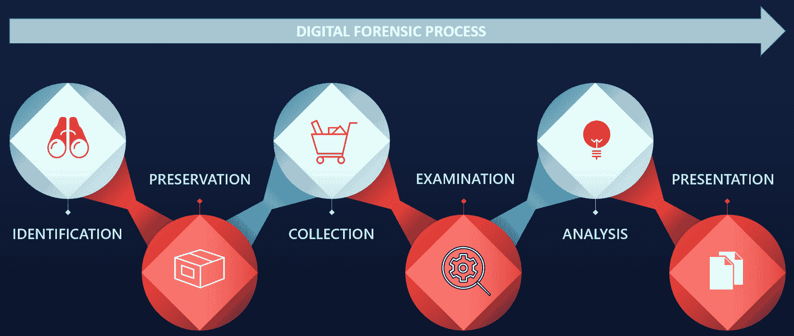

图 3.1 – 数字取证过程

该框架包含六个要素：

+   识别

+   保留

+   收集

+   检查

+   分析

+   呈现

从事件响应的角度来看，除非有充分的理由，否则工作人员通常不会扣押网络组件或关键系统并将其下线。这是数字取证和事件响应中固有的平衡行为之一。纯粹的数字取证方法会提取所有相关证据，确保其安全并加以处理。

这个过程可能需要几个月，具体取决于事件的类型。虽然这种方法详尽且细致，但可能会导致组织在一段时间内缺少关键组件。CSIRT（计算机安全事件响应小组）可能能够在一个月的分析后告诉领导层，哪个事件链导致了数据泄露，但如果一个月的收入已经损失，这样的分析将毫无意义。

分配给 CSIRT 的检查员必须准备好在确保彻底性的同时平衡恢复或继续正常操作的需要。

### 识别

开始数字取证过程的第一步是识别潜在的证据。这时，之前讨论的洛卡德交换原理（Lockard’s exchange principle）就派上了用场。这个原理可以指导在事件处理中识别潜在的证据来源。例如，如果 CSIRT 正在尝试确定系统上恶意软件感染的根本原因，它将从分析被感染的系统开始。由于某些恶意软件需要访问 C2 服务器，分析员可以搜索防火墙连接或代理日志，查看是否有从被感染系统到外部 IP 地址的任何出站流量。对这些连接 IP 地址的审查可能会揭示 C2 服务器，并且可能提供更多关于感染系统的具体恶意软件变种的细节。

然而，值得注意的是，威胁行为者可以很容易地操控数字证据，因此在没有其他佐证证据的情况下，依赖单一数字证据应始终保持谨慎；在信任之前，应该对其进行验证。

### 保存

一旦证据被识别出来，重要的是要保护其免受任何形式的修改或删除。对于诸如日志文件之类的证据，可能需要启用保护日志文件免于删除或修改的控制措施。对于主机系统，如台式机，可能需要通过物理或逻辑控制、网络访问控制或边界控制，将系统与网络其他部分隔离。还必须确保没有用户能够访问嫌疑系统，以防用户故意或无意地污染证据。保护措施的另一方面是越来越依赖虚拟平台。这些系统的保护可以通过系统快照以及将虚拟机保存到非易失性存储中来实现。

### 收集

收集元素是数字取证检查员开始获取数字证据的过程。在检查数字证据时，理解某些证据的易变性非常重要，检查员往往需要查看这些证据。易变证据是指当系统关闭时可能丧失的证据。对于网络设备，这可能包括设备上的活动连接或日志数据。对于笔记本电脑和台式机，易变数据包括运行中的内存或**地址解析协议**（**ARP**）缓存。

**互联网工程任务组**（**IETF**）编制了一份名为*证据收集与存档指南（RFC 3227）*的文档，介绍了数字证据的易失性顺序，如下所示：

+   寄存器和缓存

+   路由表、ARP 缓存、进程表、内核统计、内存（RAM）

+   临时文件系统

+   磁盘镜像

+   远程日志记录和监控物理数据配置，网络拓扑

+   存档介质

数字取证检查员在开始证据收集过程时，必须考虑到这些易失性。应采用方法将易失性证据收集并转移到非易失性介质中，例如外部硬盘。

#### 正确的证据处理

证据的正确处理和保管至关重要。如何获取证据的错误可能导致证据被污染，从而无法作为法医证据使用。此外，如果案件涉及潜在的法律问题，关键证据可能会被排除在刑事或民事诉讼中。处理证据时需要遵循几个关键原则，列举如下：

+   **改变原始证据**：数字取证检查员采取的行动不应改变原始证据。例如，取证分析员如果没有必要，应该避免访问正在运行的系统。需要注意的是，接下来要探讨的一些任务可能会改变一些证据。通过合适的文档记录并有正当理由，数字取证检查员可以减少证据被判定为污染的风险。

+   **文档**：在执法领域，你常会听到这样一句话：*如果你没有写下来，它就没有发生*。这在讨论数字取证时尤其重要。每一个采取的行动都应该以某种方式进行文档记录。这包括详细的笔记和图示。另一种记录方式是通过照片。正确的文档记录可以让检查员在证据的完整性受到质疑时重建事件链。

证据处理指南

各种执法机构提供了关于现场正确处理证据的广泛资源。你应该熟悉这些程序。以下是执法机构使用的指南：

+   [`www.crime-scene-investigator.net/SeizingElectronicEvidence.pdf`](http://www.crime-scene-investigator.net/SeizingElectronicEvidence.pdf)

+   [`www.ncjrs.gov/pdffiles1/nij/219941.pdf`](https://www.ncjrs.gov/pdffiles1/nij/219941.pdf)

+   [`www.iacpcybercenter.org/wp-content/uploads/2015/04/digitalevidence-booklet-051215.pdf`](https://www.iacpcybercenter.org/wp-content/uploads/2015/04/digitalevidence-booklet-051215.pdf)

#### 证据链

证据链管理描述了证据在其生命周期中的文档记录。生命周期从个人首次接管证据开始，到事件最终处理完毕，证据可以归还或销毁为止。保持正确的证据链管理至关重要。如果证据需要进入法庭，任何证据链的中断都可能导致该证据无法被纳入诉讼程序。因此，确保完整记录证据的整个生命周期是至关重要的。

CSIRT 记录和维护证据链管理的方式主要有两种。

第一个是**电子方式**。有些制造商为法医实验室或执法机构等组织提供硬件和软件，自动化证据链管理过程。这些系统为每件证据使用独特的条形码贴纸。扫描仪读取这些条形码时，便创建了电子跟踪记录。

创建和维护证据链管理的第二种方法是**纸笔法**。此方法使用包含必要信息的纸质表单，用于开始和维护证据链管理。尽管纸笔法可能有些繁琐，并且需要更多的细心以确保表单免于毁损或篡改，但对于资源有限的小型 CSIRT 来说，这是一种更加经济有效的解决方案。

在适当的证据链管理表单应该包含什么内容方面，有几个部分，每个部分都有其需要提供的详细信息。以下截图显示了一个证据链管理表单模板（可以从 NIST 获得一个可编辑的证据链管理表单，网址：[`www.nist.gov/document/sample-chain-custody-formdocx`](https://www.nist.gov/document/sample-chain-custody-formdocx)）.

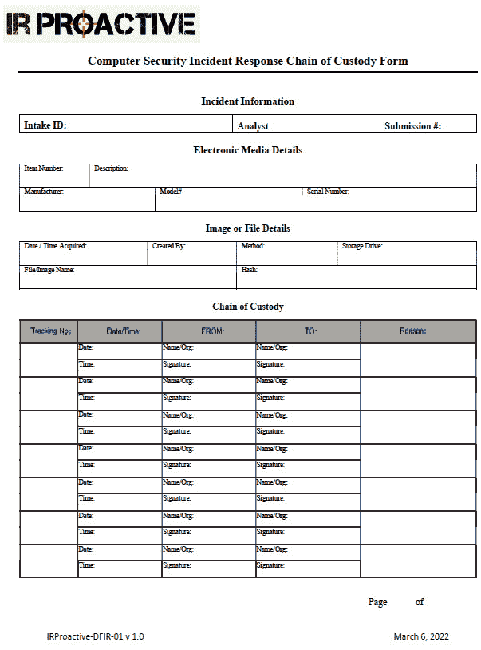

图 3.2 – 证据链管理表单

需要填写的第一个部分是**事件信息**部分，如*图 3.3*所示。**案件编号**字段要求为案件或事件提供唯一标识符。这可以是事件编号或工单系统编号。第二个字段，**分析员**，记录了填写证据链管理表单首部分的分析员。最后，每个独立的证据项需要一个**提交编号**。这确保每个证据项都有其独立的证据链管理表单。

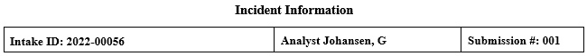

图 3.3 – 证据链管理表单中的事件信息部分

这部分的第二部分是对项目的详细描述。虽然包含多个不同元素可能显得有些冗余，但数字取证关注的正是细节。记录这些信息可以消除任何关于其真实性的疑问。此描述应包含以下内容：

+   **项目编号**：表单中应包含唯一的项目编号。如果有多个证据，将会填写一份单独的证据链表单。

+   **描述**：这应是对项目的简要描述。可以是简单的说明，例如“500 GB SATA 硬盘”。

+   **制造商**：此信息有助于当多个证据可能来自不同制造商时提供帮助。

+   **型号**：由于组件的型号种类繁多，记录型号可以提供有关项目的进一步细节。

+   **序列号**：如果事件涉及多个配置完全相同的系统，序列号尤为重要。试想如果六个硬盘同时被扣押且型号和规格相同，如何重建与每个硬盘对应的证据链。

完整的第一部分证据链表单将是这样的。

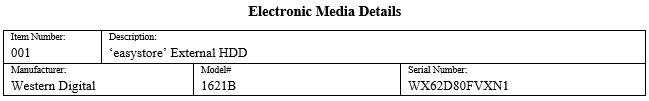

图 3.4 – 证据链表单中的电子媒体详情部分

在证据可能是逻辑文件（例如日志文件或在调查中捕获的图像）等情况下，可以使用备用部分。其包含以下元素：

+   **获取日期/时间**：准确记录获取特定文件的日期和时间非常重要。

+   **描述**：对获取的媒体的简要描述是有用的。如果在获取证据时使用了软件应用程序或取证工具，应注明。在其他情况下，例如日志文件，可能仅仅是外部硬盘的一个副本。

+   **存储驱动器**：在后续部分，我们将讨论外部媒体在文件存储中的重要性。使用的具体驱动器应记录在证据链表单中。

+   **文件/图像名称**：此处填写文件或图像的唯一文件名。

+   **哈希值**：对于每个获取的文件，应计算唯一的哈希值。

完整的**图像或文件详情**部分的证据链表单看起来会是这样的。

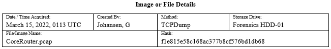

图 3.5 – 证据链表单中的图像或文件详情部分

接下来的部分详细描述了证据在其生命周期中的具体步骤。每个阶段应记录以下细节：

+   **跟踪编号**：此编号表示证据在生命周期中经过的步骤。

+   **日期/时间**：这是任何链条保管中至关重要的信息，并且适用于证据经历的每一步。这使得任何查看链条保管的人都能将每一步按分钟重构，明确证据的每个生命周期步骤。

+   **来源**和**去向**：这些字段可以是个人或存储位置。例如，如果分析员扣押了硬盘并将其移到安全存储柜，他们会将该位置记录为**去向**。在链条保管中，关键是确保在适当情况下，由个人签署表格以确保责任追究。

+   **原因**：移动一件证据时绝不应没有理由。在链条保管表格的这一部分中，原因会被描述。

以下截图是前一张截图中记录的硬盘移动样本。每个单独证据的每次移动都在这里记录。第一次移动是实际从系统中扣押硬盘。在此情况下，没有单独的保管员，因为硬盘已从数据中心取走。关键在于，作者是硬盘的保管员，直到他能将其转交给 IRProactive 的 Carol Davis 进行分析。详细信息如下：

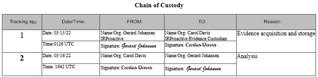

图 3.6 – 链条保管详细信息

链条保管在证据的整个生命周期中保持完整。即使证据被销毁或归还，链条保管表格中也会有相应记录。这些表格应与由事件产生的其他材料一起保存，并作为任何后续报告的一部分。

### 检查

检验阶段详细说明了用于从事件中扣押的证据中发现和提取数据的具体工具和取证技术。例如，在怀疑恶意软件感染桌面系统作为更大攻击一部分的案件中，提取从获取的内存镜像中提取特定信息将在此阶段进行。在其他情况下，数字取证检查员可能需要从网络捕获中提取**安全外壳**（**SSH**）流量。数字证据的检查还延续了适当保存的过程，检查员在检查过程中会以极高的谨慎来保持证据。如果数字取证检查员在此阶段未能妥善保存证据，可能会导致证据污染，进而使证据变得不可靠或无法使用。

### 分析

一旦检查阶段提取了潜在相关的数据，数字取证检查员将开始分析这些数据，并结合获取的其他相关数据进行进一步分析。例如，如果数字取证分析员发现一个被入侵的主机与一个外部 IP 地址有开放连接，那么他们将把这一信息与从网络中捕获的数据包进行关联。以该 IP 地址为起点，分析员将能够隔离出相关流量。接下来，分析员可能会发现该被入侵主机正在向 C2 服务器发送信号。从这里，借助额外的资源，分析员可能能够确定与该 IP 地址相关联的攻击途径。

### 呈现

与数字取证相关的事实报告需要清晰、简明且公正。在几乎所有情况下，取证检查员都需要准备一份详细的书面报告，报告中要涵盖每一个操作步骤并捕捉所需的关键数据。该报告应该是全面的、准确的，并且不带有任何观点或偏见。这个报告通常会成为更大规模事件调查的一部分，并有助于确定事件的根本原因。

另一项呈现要求是取证检查员在刑事或民事诉讼中的角色。如果正在调查的事件涉及嫌疑人或其他责任方，可能需要在法庭上作证。正是在这一过程中，取证检查员需要以与报告相似的冷静态度，陈述取证检查的事实。检查员需要陈述事实和结论而不带偏见，并且可能会受到他们可以作证的意见范围的限制。检查员能否作证通常取决于他们的培训和经验。有些检查员可能仅限于呈现检查结果的事实；而随着技能的提升，并且被认定为专家证人后，他们可能能够提供个人意见。

## 数字取证实验室

数字取证是一个精确的过程，涉及使用适当的工具、技术和知识，从系统中提取潜在证据。取证检查员必须有一个与正常业务运营隔离的工作环境。实现这种隔离的最佳方法是为直接参与数字证据检查的计算机安全事件响应团队（CSIRT）成员提供一个完全与其他部门隔离的地方。数字取证实验室应具备几个关键特征，以确保检查员的必要隐私，同时也确保在检查过程中证据的完整性。

### 物理安全

法医实验室的访问需要严格控制。为了维护证据链，只有那些有正当理由的人才能进入实验室。此限制是为了消除任何证据被篡改或销毁的风险。因此，实验室应该始终保持上锁。理想情况下，访问权限应通过访问卡或钥匙扣授予，并配有中央管理系统进行控制。这样可以完整地重建所有在特定时间段内访问实验室的人员记录。

实验室还应配备证据储物柜，以便在没有被检查时妥善存放证据。储物柜应该是安全的，可以通过内置锁或使用组合锁进行加固。储物柜的钥匙应保存在实验室内，并且只应允许检查员访问。如果组织具备足够资源，每个具体事件应该有一个专门的储物柜，所有相关证据应存放在同一个柜子里。这样可以减少数字证据混合的可能性。

气候和湿度应像任何数据中心一样受到控制，并应设置为适当的水平。

### 工具

根据需要执行的具体检查，可能需要拆卸螺丝或剪断电线。为检查员准备一套小型手动工具将会非常方便。实验室还应该配备用于保护证据的盒子。如果检查员需要处理智能手机或平板电脑，应提供法拉第袋。这些袋子可以将智能手机或平板电脑与蜂窝网络隔离，同时仍保持电源。

#### 硬件

实验室应配备足够的计算机和其他硬件，以执行各种必要的功能。检查员需要对硬盘进行成像，并处理数 GB 的数据。因此，需要一台具有足够 RAM 的法医计算机。虽然每个人的偏好不同，但推荐最少 32GB 的 RAM。除了内存和处理能力，检查员通常还需要查看大量数据。法医工作站应配备一块主要的操作系统硬盘，用于存放法医软件，另配一块二级硬盘用于存储证据。二级硬盘应至少有 2TB 的存储空间。

除了法医工作站外，检查员还应配备一台连接互联网的计算机。法医工作站应该没有互联网连接，以确保安全，同时避免在检查过程中证据可能遭到破坏。应该使用一台辅助计算机进行研究或编写报告。

另一个关键设备是物理写保护器。该设备允许将作为证据扣押的硬盘与取证成像机器连接。这个物理写保护器与 USB 或 Thunderbolt 连接的关键区别在于，数字取证检查员可以确保没有数据写入证据驱动。*图 3.7* 显示了 Tableau eSATA 取证桥物理写保护器：

图 3.7 – 一个物理写保护器

对于进行较多成像任务的数字取证实验室，可以选择包括一个专用的取证成像工作站。这可以更快地成像证据驱动，并且不会占用取证工作站。缺点是其费用：如果 CSIRT 成员没有看到性能下降，可能很难为这种开销辩护。

CSIRT 还应投资购买一批高容量外部 USB 驱动器。这些驱动器在成像过程中比传统的 SATA 或 IDE 驱动器更易于使用。这些驱动器用于存储证据驱动镜像，以便进一步分析。CSIRT 成员应至少有六个高容量的驱动器可用。存储空间为 2TB 至 3TB 的驱动器可能一次存储多个镜像。较小的 USB 驱动器也很有用，可以用来捕获日志文件和内存镜像，供稍后处理。任何这些 USB 驱动器都应配备最新的 3.0 版本，以便加快处理速度。

最后，支持 CSIRT 的数字取证检查员应该拥有一个耐用的箱子，用来运输所有必要的硬件，以防需要进行场外检查。许多这些工具非常脆弱，经不起当地机场行李搬运员的猛烈撞击。CSIRT 应投资购买至少两个硬壳箱，类似用于电子设备或摄影设备的箱子。一个箱子可以用来运输硬件，如外部硬盘，第二个箱子可以用来运输取证笔记本电脑，并最大限度地减少粗暴搬运可能造成的损坏。

#### 软件

当前市场上有许多商业和免费软件工具。数字取证实验室应该能够访问多个工具，以执行类似的功能。至少，实验室应该拥有能够执行证据驱动镜像、检查镜像、分析内存捕获并报告结果的软件。

数字取证分析员可以使用几种不同类型的取证软件。首先是取证应用程序。这些应用程序是专门设计用于执行各种数字取证任务的。它们通常是商业化的，在执法和政府部门以及私人行业中得到广泛使用。以下四种取证应用程序是最常见且广泛部署的：

+   **Autopsy**：由 Brian Carrier 开发的这款开源软件，提供了一个功能丰富的应用程序，自动化了关键的数字取证任务。作为一个开源项目，Autopsy 还拥有提供大量附加功能的开源模块。Autopsy 将在后续章节中进行更深入的讲解。

+   **EnCase**：由 OpenText 开发，EnCase 是一款全功能的数字取证应用程序，执行涉及数字证据检查的各项任务，主要来自硬盘和其他存储介质。除了分析数字证据外，EnCase 还具备报告功能，允许检查员以易于理解的格式输出案件数据。EnCase 广泛应用于政府和执法机构。一个缺点是该应用程序的成本。对于预算有限的某些 CSIRT 和取证检查员来说，可能很难证明这一费用的合理性。

+   **Forensic Toolkit** (**FTK**)：这也是一款广泛应用于政府和执法机构的全功能取证应用程序。它具备许多与 EnCase 相同的功能，可能是数字取证分析员希望探索的替代方案。

+   **X-Ways Forensics**：另一个选择是 X-Ways Forensics 应用程序。它的功能与 FTK 和 EnCase 相似，是一个低成本的优秀选择，适合那些不需要网络访问或远程捕获功能的 CSIRT。

使用已验证的工具

有几个高调的案件曾对数字取证工具提出质疑。在美国，凯西·安东尼因涉嫌谋杀女儿而受审。在审判期间，控方提交了安东尼的互联网浏览历史作为证据。这些历史记录是通过工具 CacheBack 提取的。工具作者对该软件的审查发现它存在一个软件漏洞。虽然没有确凿证据表明该工具对陪审团的裁决产生了影响，但这也给我们一个教训，即确保在数字取证中使用的工具，特别是在可能进入法律程序的案件中，都是经过验证的。

#### Linux 操作系统取证工具

也有许多为数字取证目的创建的 Linux 发行版。这些发行版通常是免费的，提供了可以帮助数字取证调查员的工具。这些工具分为两大类。第一类是作为启动 CD/DVD 或 USB 的发行版。这些发行版对于进行初步筛查或无需对硬盘进行镜像即可访问文件非常有用。这些发行版可以被放置在 CD/DVD 上，或者如今更常见的是 USB 设备上。调查员然后将被调查的系统引导到 Linux 发行版中。有许多这样的发行版可供选择。

以下是两个在数字取证检查员中较为流行的例子：

+   **数字证据与取证工具包** (**DEFT**) **Zero**：这是基于 GNU Linux 平台的。DEFT 可以从 USB 或 CD/DVD 启动。启动后，DEFT 平台包含了广泛的工具，供数字取证检查员执行诸如获取大容量存储设备等操作。例如，他们可以获取启动该平台的系统上的硬盘。DEFT 通过不启动交换分区且不使用自动挂载脚本，最大限度地降低了数据更改的风险，从而确保系统存储的完整性。我们可以在下图中看到 DEFT 操作系统。

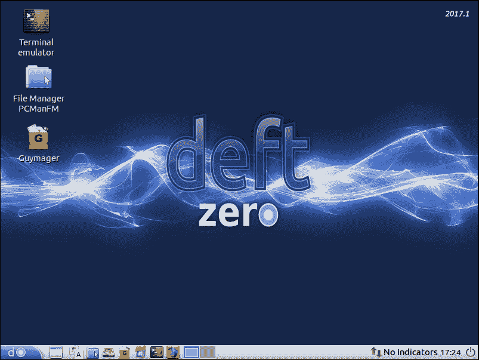

图 3.8 – DEFT 数字取证操作系统

+   **计算机辅助调查环境** (**CAINE**)：这是本书中将进一步使用的另一个取证发行版。CAINE 是一个 GNU/Linux 平台，包含了多种工具，旨在帮助数字取证检查员。CAINE 在下图中展示。

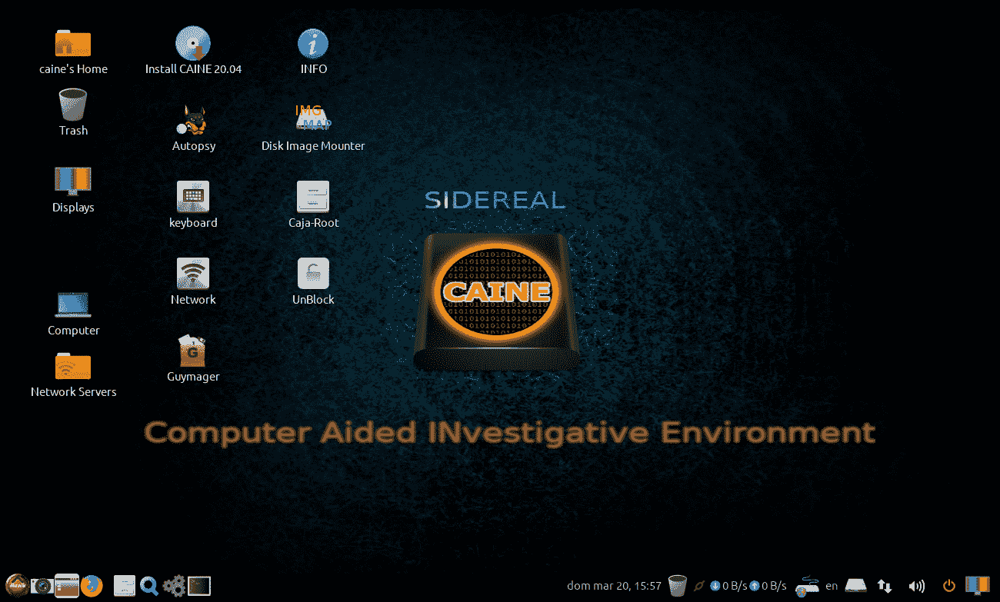

图 3.9 – CAINE 数字取证操作系统

另一类 Linux 发行版是那些为进行证据检查（如 RAM 捕获和网络证据）而设计的平台。当前有多个此类发行版：

+   **SANS 调查取证工具包** (**SIFT**)：这是一个全面的取证工具集，基于 Ubuntu 20.04 基础操作系统。工具包括图像制作、内存分析、时间线创建以及其他多种数字取证任务。SIFT 由 SANS 学院免费提供，作为独立虚拟机、ISO 文件或 Windows 子系统 Linux 的一部分，详细信息请见[`www.sans.org/tools/sift-workstation`](https://www.sans.org/tools/sift-workstation)。安装后，系统桌面基于 Ubuntu 发行版，提供通过命令行或 GUI 运行的附加工具，如下图所示。

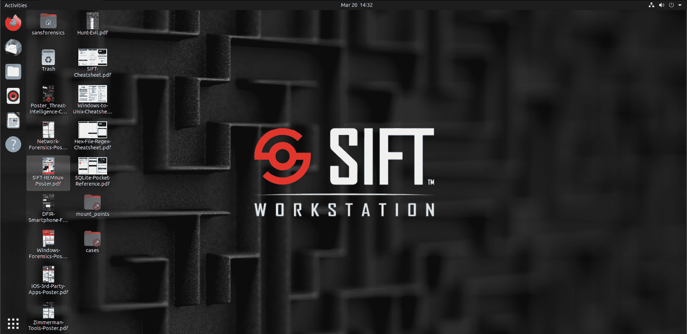

图 3.10 – SANS SIFT 工作站

+   **CSI Linux**：这是 CSI Linux 中的另一个功能丰富的取证平台，如下图所示。这个数字取证操作系统包括 175 个工具，用于执行各种任务。该工具可以作为预配置的虚拟系统提供，也可以作为可启动版本，通过 USB 进行部署。这些内容可以在[`csilinux.com`](https://csilinux.com)找到。

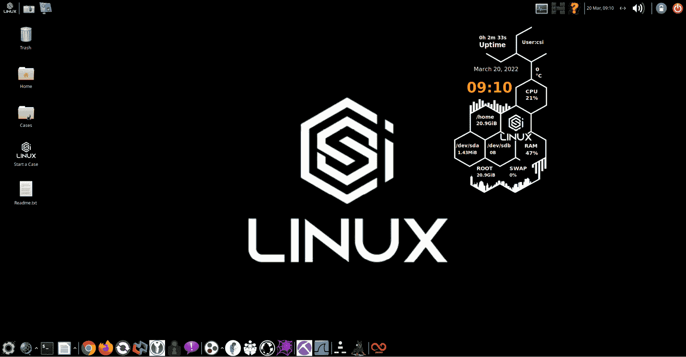

图 3.11 – CSI Linux 数字取证操作系统

+   **REMnux**：REMnux 是一个专门的工具，它将多种恶意软件逆向工程工具整合成一个基于 Ubuntu Linux 的工具包。REMnux 中提供的一些工具是用于分析 Windows 和 Linux 恶意软件，检查可疑文档，还可以在隔离的容器中拦截潜在的恶意网络流量。我们可以在下图中看到 REMnux。

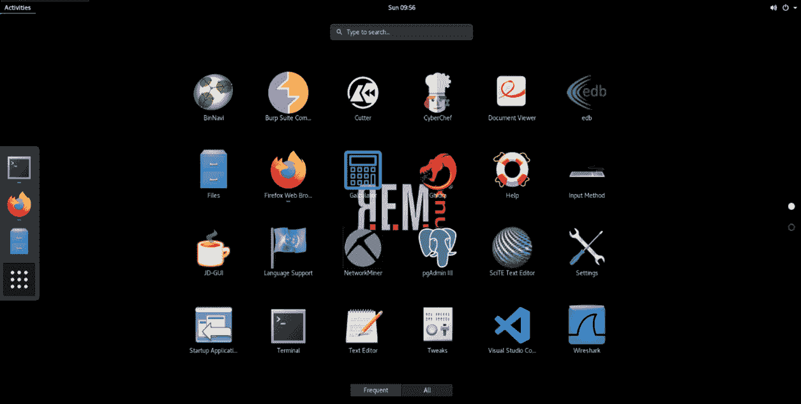

图 3.12 – REMNUX 数字取证操作系统

### 跳跃包

事件响应的一个方面可能对 CSIRT 团队成员构成挑战的是，他们可能不得不在自己所在地之外响应事件的可能性。在大型企业中，离场响应非常普遍，甚至是为其他组织提供咨询的 CSIRT 的常态。因此，CSIRT 经常需要在另一个位置执行整个响应过程，而没有数字取证实验室的支持。考虑到这一挑战，CSIRT 应准备几个跳跃包。这些包预先配置，并包含执行 CSIRT 在事件期间可能被要求执行的任务所需的硬件和软件。这些包应能够在整个过程中支持事件调查，CSIRT 应在事件位置确定安全区域以存储和分析证据。

跳跃包应便携，能够配置以适合安全硬壳箱内，并随时准备部署。CSIRT 应确保在每次事件之后，跳跃包被重新装填上次使用的任何物品，并且硬件和软件被正确配置，以便分析师在事件期间对其可用性有信心。跳跃包的一个示例可见以下照片。

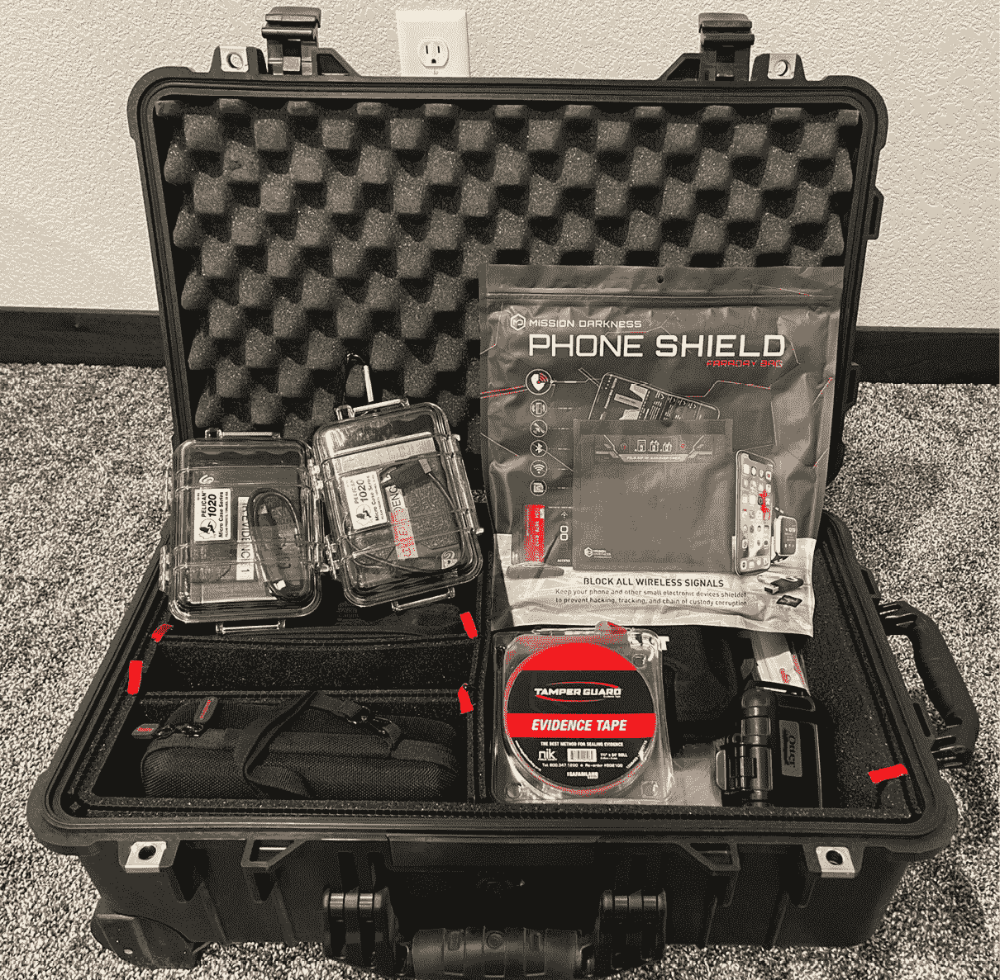

图 3.13 – 数字取证跳跃包

至少，一个跳跃包应包含以下内容：

+   **取证笔记本电脑**：此笔记本应包含足够的 RAM（32 GB），以在合理时间内制作硬盘镜像。笔记本还应包含取证软件平台（如前所述）。如果可能的话，笔记本还应包含至少一个 Linux 取证操作系统，如 CAINE 或 SIFT。

+   **网络电缆**：拥有几根不同长度的 CAT5 电缆对 CSIRT 团队来说非常有用，因为他们可能需要访问网络或连接到任何网络硬件，如路由器或交换机。

+   **物理写入阻断器**：每个包都应配备物理写入阻断器，可用于影像化 CSIRT 人员可能遇到的任何硬盘驱动器。

+   **外部 USB 硬盘驱动器**：跳跃包应包含几个 1TB 或 2TB 的 USB 硬盘驱动器。这些驱动器将用于影像化潜在受损系统上的硬盘。

+   **外部 USB 设备**：从日志来源或 RAM 捕获收集的证据存储在潜在受损系统上是不符合法庭取证原则的。跳跃包应包含几个大容量（64 GB）的 USB，用于卸载日志文件、RAM 捕获或其他从命令行输出获取的信息。

+   **可启动的 USB 或 CD/DVD**：虽然并非每种情况都会使用，但在取证笔记本当前正在执行其他任务时，拥有几个可启动的 Linux 发行版可能会有用。

+   **证据袋或盒子**：在事件发生过程中，可能需要扣押某些证据并将其转移到现场外。应当具备在现场安全存放证据的能力，而无需到处寻找合适的容器。

+   **防静电袋**：如果硬盘被扣押作为证据，应当使用防静电袋进行运输。

+   **链条证明表格**：如前所述，为每一件证据准备一份链条证明表格至关重要。准备好一打空白表格，可以省去寻找系统和打印机打印新副本的麻烦。

+   **工具包**：一个小型工具包，内含螺丝刀、钳子和手电筒，在需要拆卸硬盘、切断连接或分析人员必须进入数据中心黑暗角落时非常有用。

+   **记事本和书写工具**：正确的文档记录至关重要；用钢笔手写的笔记可能显得有些过时，但它们是记录事件发展过程的最佳方式。作为跳跃包的一部分，准备几个速记本和钢笔，确保 CSIRT 人员在关键事件发生时不必到处寻找这些物品。跳跃包应至少每月进行一次清点，确保物资齐全，随时准备部署。它们还应当安全存放，只对 CSIRT 人员可见。若将这些包放置在公共视野中，它们经常被其他人员抢夺，用来寻找螺丝刀、网线或手电筒。对于支持地理分散组织的 CSIRT 来说，若在主要办公室总部、数据中心或其他外部地点有多个跳跃包，预先准备好多个跳跃包供使用是一个好主意。这样可以避免在机场携带跳跃包。以下照片展示了跳跃包中应存放的一些物品。

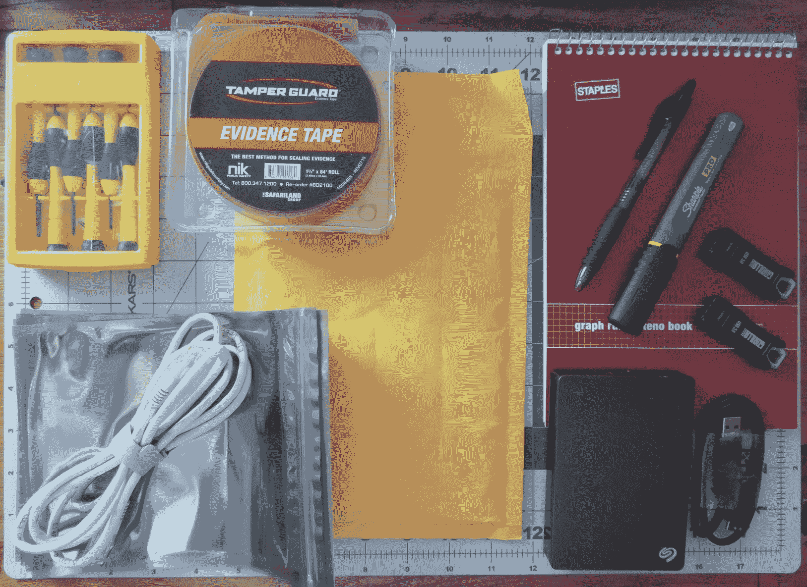

图 3.14 – 跳跃包的内容

恭喜你成功完成这一章！

# 摘要

事故响应涵盖广泛的学科，从法律到科学。负责进行数字取证检查的 CSIRT 成员应非常熟悉数字取证的法律和技术方面。此外，他们还应熟悉各种必需的工具和设备，以获取、检查和展示检查过程中发现的数据。正确应用取证技术对于提供事件链的洞察至关重要，这些事件链导致 CSIRT 被部署以调查事故。在本章中，我们首先探讨了数字取证的各种法律方面，例如证据规则和与网络犯罪相关的法律。接下来，我们讨论了数字取证的科学，了解了如何将技术应用于调查中。为了增强这些知识，我们审视了这些技术如何融入数字调查的框架。然后，我们对数字取证检查员可用的各种工具进行了概述。

在下一章，我们将把数字取证与事故响应的调查方法结合起来。

# 问题

1.  什么不是联邦证据规则？

    1.  相关证据的测试

    1.  洛卡尔法则

    1.  专家证人的证词

    1.  最佳证据规则

1.  应保持适当的证据链以确保数字证据的完整性。

    1.  正确

    1.  错误

1.  哪些项目应包括在数字取证工具包中？

    1.  物理写入阻断器

    1.  记事本和钢笔

    1.  网络电缆

    1.  以上所有

1.  什么不是取证过程的一部分？

    1.  识别

    1.  法庭证词

    1.  收集

    1.  分析

# 进一步阅读

+   数字取证研究工作坊：[`www.dfrws.org`](https://www.dfrws.org)

+   ISACA 的数字取证概述：[`www.isaca.org/Knowledge-Center/Research/ResearchDeliverables/Pages/overview-of-digital-forensics.aspx`](http://www.isaca.org/Knowledge-Center/Research/ResearchDeliverables/Pages/overview-of-digital-forensics.aspx)

+   FBI CART 的历史背景：[`www.ncjrs.gov/App/Publications/abstract.aspx?ID=137561`](https://www.ncjrs.gov/App/Publications/abstract.aspx?ID=137561)
