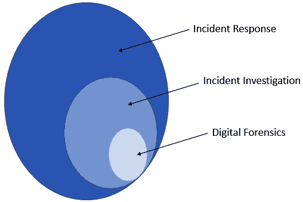
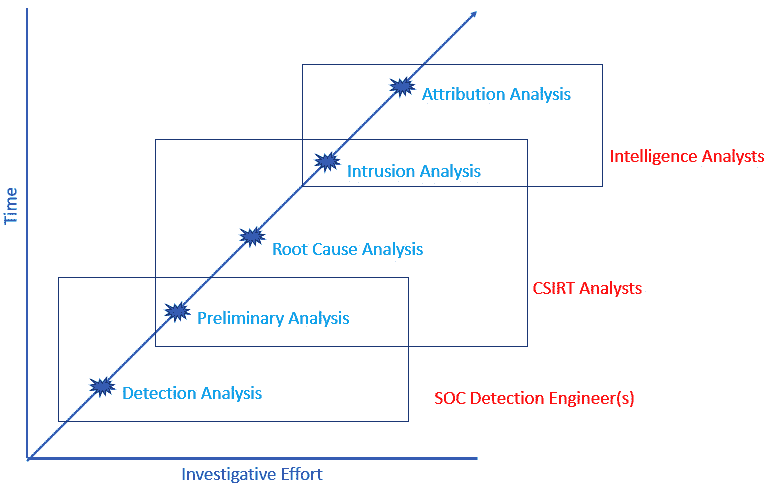
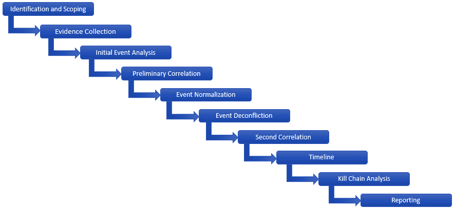
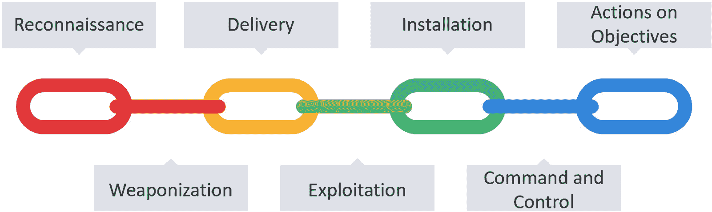
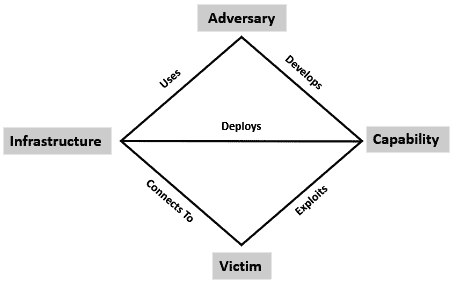
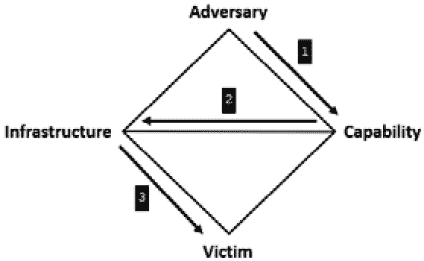
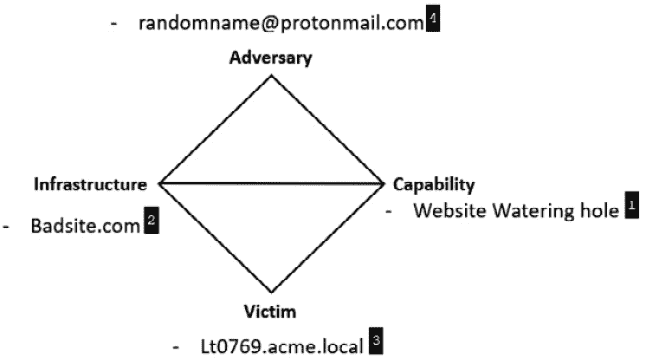
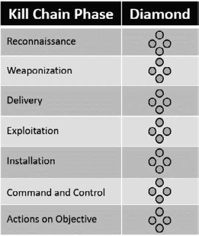

# 第四章：调查方法论

到目前为止，前三章已经介绍了事件响应的基础知识，以及数字取证如何在理解事件性质中发挥关键作用。事件响应的另一个关键组成部分是调查环节。事件调查是一种方法论和过程，分析师通过这一过程提出假设并进行验证，以回答关于数字事件的问题。数字调查过程中的主要数据来自对数字证据的正确处理和分析。*图 4.1*展示了数字取证、事件响应和事件调查之间的关系。

图 4.1 – 数字取证、事件调查与事件响应之间的关系

本章将重点讨论作为整体事件响应过程一部分的事件调查。通过这些方法论，分析师将有一张路线图，指导他们以有组织且系统化的方法处理事件调查。

本章将涵盖以下主题：

+   入侵分析案例研究：**布谷鸟的蛋**

+   事件调查分析的类型

+   功能性数字取证方法论

+   网络杀伤链

+   入侵分析的钻石模型

# 入侵分析案例研究：**布谷鸟的蛋**

在过去的 30 年中，发生了许多引人注目的事件，因此找到一个能够概括良好的事件调查案例并不困难。回溯到最初的事件调查之一，可能会有所帮助，在那时有人需要创造收集证据的方法，并追踪全球范围内的对手。需要记住的一个分析方面是，即使没有构建方法，这些人也能提出假设，进行测试并分析结果，最终得出结论，从而帮助找出犯罪分子。

1986 年 8 月，天文学家和**劳伦斯伯克利实验室**（**LBL**）的系统管理员克里夫·斯托尔（Cliff Stoll）接到了上司交给他的一个谜题。在一次例行审计中，LBL 的工作人员发现了一个 0.75 美元的账目错误。当时，计算机资源非常昂贵。每一项计算都必须按照项目或实验室部门进行计费，这要求维护和审计非常详细的用户账户活动日志。对错误的快速检查发现，存在一个没有任何相应计费信息的用户账户。

当 LBL 收到来自国家计算机安全中心的消息时，谜团加深了。消息称，LBL 的一名用户正在试图访问 MILNET 系统，即国防部的内部网络。Stoll 和他的同事删除了未经授权的账户，但那个仍未被识别的入侵者依然存在。Stoll 最初的假设是，来自附近加利福尼亚大学的一个学生恶作剧者正在对 LBL 和连接的各个 MILNET 实体进行一场精心设计的恶作剧。Stoll 随后开始更详细地检查账单日志，以确定入侵背后的人是谁。接下来是长达十个月的历程，Stoll 追踪了从美国到欧洲的流量。

放弃了“恶作剧者”假设后，Stoll 的第一步是创建一个记录所有他和 LBL 其他工作人员活动的日志。在调查的初期，Stoll 遇到了一个其他响应者必须通过艰难方式学到的教训：入侵者在访问受损系统时，可能能够访问电子邮件和其他通信。因此，Stoll 和他的团队转而使用面对面的交流或电话联系，同时保持持续发送虚假电子邮件，以让入侵者保持自信，认为他们仍未被发现。这些日志在调查的后期阶段将派上用场，当事件的更清晰的图景浮现时，它们会提供帮助。

Stoll 和团队面临的第一个重大挑战是无法查看 LBL 网络和入侵者的活动。在 1986 年，事件记录、数据包捕获和**入侵检测系统**（**IDSs**）等工具并不存在。Stoll 解决这个问题的方法是在线路上串联打印机，这些线路通向最初的入侵点。这些打印机会作为未知入侵者活动的日志记录。通过检查入侵者的连接，Stoll 能够确定入侵者使用的是 X.25 端口。由此，Stoll 能够设置一个被动监听装置，捕捉入侵者的击键，并将数据输出到软盘或物理打印机。

通过监控网络，Stoll 随后遇到了另一个挑战：追踪攻击者的来源。当时，远程连接是通过电话线完成的，追溯连接的能力依赖于多个电话公司。更具挑战性的是，攻击者通常会将 LBL 连接作为跳板，连接到其他网络。这意味着 Stoll 追踪的连接通常只会持续几分钟。Stoll 在系统上设置了多个警报，通过皮带呼叫器提醒他，这时他可以远程连接到 LBL 系统，开始另一轮追踪。尽管采取了这些措施，Stoll 和他的同事们仍然无法保持连接足够长的时间来确定源头。

解决这个挑战的办法出现在攻击者试图访问的内容上。在分析过程中，Stoll 观察到攻击者不仅仅是在访问 LBL 网络，还利用这个连接搜索美国军事及其相关防务承包商的其他网络。Stoll 想出的解决方案来源于当时女友的建议。为了保持入侵者的连接，Stoll 创建了一系列虚假的文档，标题看起来像是与**战略防御倡议**（**SDI**）项目相关的。任何试图获取机密信息的人都会立刻认识到这些文件的战略重要性。此外，Stoll 还植入了一封表格信件，说明可以通过邮寄方式获取硬拷贝文件。文件的访问受到严格控制，并且对文件设置了警报，以便在攻击者试图访问时得到提示。这种方法奏效了。那位尚未确认身份的入侵者不仅花了一个小时阅读这些虚构的文件，还通过邮局提交了请求，要求将自己加入邮件名单。

在这 10 个月的时间里，Stoll 不断遇到的主要难题是追踪攻击者与 LBL 网络的连接。入侵者始终保持着使用广泛网络连接的模式。其次，入侵者会变化连接的时间，每次只保持几分钟。通过最初的工作，Stoll 成功定位到加利福尼亚州奥克兰的一个拨号连接。在与电话公司的合作下，他成功隔离了一个来自维吉尼亚州麦克林的防务承包商的调制解调器连接。通过数据通信公司 Tymnet 的协调，Stoll 和团队最终将连接追踪回德国的 LBL 网络。

正是 Stoll 将虚构的文件放置在 LBL 系统上后，他才得以完成追踪。即便如此，这一追踪工作需要 Stoll、Tymnet、各大学以及德国执法部门的密切协调。最终，Stoll 的努力得到了回报，他成功识别出肇事者是德国 Chaos Computer Club 的成员。这些人还与美国各大学和国防承包商相关的多起入侵事件有关。

审视 1986 年的网络入侵可能看起来有些奇怪，但我们仍然可以从 Stoll 的工作中学到很多东西。首先，这无疑是第一次公开记录的**高级持续性威胁**（**APT**）攻击。随后，由 FBI 和其他政府机构进行的调查确定，Chaos Computer Club 正试图通过将情报出售给**国家安全委员会**（**KGB**）来谋取财务利益。一个有趣的插曲是，最初，KGB 在进行网络入侵以获取情报方面几乎没有经验。Stoll 揭示了一个重要的漏洞，反间谍人员本应意识到：对手的情报机构正在利用新兴的互联网作为情报收集手段。

Cliff Stoll 的故事

Cliff Stoll 曾广泛撰写和演讲，分享他追踪 LBL 黑客的经历。他的文章《追踪狡猾的黑客》副本包含在本章的补充材料中。Stoll 还出版了完整的书籍《布谷鸟的蛋》。尽管这些事件发生在 35 年前，这本书仍然值得一读。

我们可以从中学到的第二个教训是，全面而详细的调查可以追溯到攻击的源头。在这种情况下，Stoll 本可以轻松切断连接并将攻击者从网络中移除。然而，他决定全面详细地记录攻击者的**战术、技术和程序**（**TTPs**）。通过一些欺骗手段，他进一步将某个个人与键盘绑定，这在 1986 年是一个非常困难的任务。总体而言，Stoll 展示了通过对入侵事件的详细调查，他和其他人可以揭示攻击的更广泛范围的细节，这些攻击远远超出了一个 0.75 美分的会计错误，涉及到全球间谍活动和冷战政治。这些教训今天依然和 1986 年一样具有现实意义。在我们分析入侵分析如何成为我们理解当今攻击者的来源时，请牢记这一点。

# 事件调查分析的类型

数字化调查并非完全相同。**计算机安全事件响应团队**（**CSIRT**）会根据允许的时间、事件类型和整体调查目标停止调查。对于小规模的恶意软件爆发，让两三名 CSIRT 分析员花费整整一天进行调查是没有意义的。另一方面，如果是一个网络入侵，且入侵者已经在网络中存在了三个月，那么就需要更为详细的证据检查，以确定入侵者是如何获得访问权限的，他们收集和外泄了哪些信息，以及对组织造成了什么影响。

结果是，不同的人会在组织内进行多种类型的事件调查。*图 4.2* 显示了五个层级以及参与的人员，附带相应的时间和所需的调查资源：

图 4.2 – 事件调查的类型

让我们详细讨论这五个层级：

+   **检测分析**：这是通常在安全事件初步检测到时进行的基本分析。例如，安全设备的遥测数据显示与已知的**命令与控制**（**C2**）服务器之间有网络连接。快速查看仪表板可能会显示一个本地化事件或潜在的更大规模事件。检测分析通常局限于遥测数据和次要来源，如外部威胁情报源。此分析的目标是确定该事件是否属于需要上报给 CSIRT 的安全事件。

+   **初步分析**：安全事件通常是模糊的。CSIRT 和 SOC 人员需要了解最初的感染情况、横向传播以及入侵者如何维持对受损系统的控制。初步分析使用快速获取选定证据并进行分析的工具，旨在确定事件的范围，并向领导层提供信息，以便遏制事件并争取时间决定下一步的调查和响应措施。

+   **根本原因分析**：此类调查通常与遏制措施同时执行。其主要目标是获取和分析证据，以确定入侵者是如何获得网络访问权限的，他们采取了哪些步骤，这些步骤具体是什么，以及对组织可能造成的影响。此类调查的目的是修复漏洞，提升企业整体安全性，从而减少未来入侵的风险。

+   **入侵分析**：通过根本原因分析，组织可以深入了解对手的战术、技术和程序（TTPs）。入侵分析更详细地呈现对手在网络入侵过程中如何操作的全面图景。正如*图 4.2*所示，入侵分析通常比应对、消除并恢复事件所需的时间和调查工作量要长得多。尽管如此，入侵分析确实对组织有帮助，因为它为组织提供了对对手行为的全面洞察。这不仅能解释对手的行为，还能为识别更高级的对手提供有价值的情报。

+   **归因分析**：在时间和调查工作量方面，归因分析位于最上端。简单来说，归因分析将一次入侵事件与某个威胁行为者联系起来。这可以是一个团体，比如 Conti 勒索病毒团体、Fancy Bear，或者在某些情况下，比如 Mandiant APT1 报告中的情况（[`www.fireeye.com/content/dam/fireeye-www/services/pdfs/mandiant-apt1-report.pdf?source=post_page`](https://www.fireeye.com/content/dam/fireeye-www/services/pdfs/mandiant-apt1-report.pdf?source=post_page)），入侵活动可能与中国军方的某个特定单位及具体个体相关。事件归因所需的时间和资源通常超出了 CSIRT 的能力范围。归因分析通常主要用于网络威胁情报目的。尽管如此，仍有一些组织利用 CSIRT 成员的调查经验、工具和技术，因此，团队仍然有可能参与此类分析。

这些分析各自都有其在事件调查中的作用。进行哪种类型的分析取决于几个因素：首先是组织的整体目标。例如，网络入侵可能只会调查到根本原因，因为组织没有足够的时间或资源进一步深入。在其他事件中，组织可能有法律或合规要求，要求事件必须进行全面调查，无论花费多长时间。

其次，可用的证据在很大程度上决定了分析能进行到什么程度。如果没有足够的证据来源来支撑网络中的调查，进行全面的入侵分析将会受到限制，甚至不可能。最后，进行更深入分析的时间也常常是一个决定性因素。组织可能没有足够的时间或人员来进行深入的入侵分析，或者它可能认为只要通过根本原因分析消除对手并防止未来的入侵就足够了。

# 功能性数字取证调查方法论

进行分析的不同方法论有很多种。以下数字取证调查方法论基于 NIST 特别出版物 800-61a 中列出的最佳实践，该文档涵盖了事件响应，并结合了彼得·斯蒂芬森博士的端到端数字调查方法。这两种方法论通过 Brian Carrier 和 Eugene H. Spafford 的研究出版物《Getting Physical with the Digital Investigation Process》进一步得到了补充。

对这种方法论的整体应用是使用数字证据和分析来验证或推翻假设。例如，分析人员可能基于初步识别，假设对手通过钓鱼邮件成功在网络上获得了初步立足点。分析人员需要从受感染的系统、端点遥测和其他来源收集必要的信息，追溯通过邮件引入恶意软件的过程。

以下方法论使用了事件调查的 10 个不同阶段，以确保所获得的数据被正确分析，并且得出的结论能够支持或驳斥所建立的假设。

图 4.3 – 十步调查方法论

## 识别与范围界定

这是事件调查的第一阶段，一旦检测到并声明为事件，调查便开始。最常见的情况是，安全遥测系统如**端点检测与响应**（**EDR**）平台或 IDS（入侵检测系统）显示环境中检测到某种行为、**入侵指标**（**IOC**）或两者的组合。在其他情况下，事件的识别可能来自人工来源。例如，某个个人可能指出他们点击了一个可疑链接，或者他们的系统文件被勒索软件加密了。在某些人为情况中，组织可能会收到执法部门的通知，告知其机密信息已在对手的基础设施中被发现。

在这些情况下，初步识别应当通过对遥测的初步检查来增强，以识别可能成为事件一部分的其他系统。这为调查设置了范围或限制。如果能够确认使用了 Windows 二进制文件来加密 Windows 操作系统主机，组织则无需关注 Linux 系统。

## 收集证据

一旦事件被识别并确定范围，下一阶段是开始收集证据。应优先收集短期存在的证据，按照*第三章*中讲到的波动性列表进行收集。事件响应和数字取证人员应确保尽可能保留证据，即使他们认为在调查初期这些证据可能没有用。例如，如果网络管理员知道防火墙日志每 24 小时会自动滚动，那么应该立即捕获这些日志。如果后来确定防火墙日志没有用处，可以轻松丢弃它们，但如果它们本来会有用而没有及时收集，组织可能会失去一些关键数据点。

证据的波动性和整体可用性应在事件响应计划中加以考虑。例如，应制定相关政策和程序，解决日志文件在定义的时间内的保留问题。例如，**支付卡行业数据安全标准**（**PCI DSS**）要求受此标准约束的组织至少保留一年期的日志，并确保至少 90 天的日志是立即可用的。组织需要在存储成本和某些日志可能具有的证据价值之间找到平衡。

本书的几个章节深入探讨了证据获取的更多细节。关于事件调查的主要观点是尽可能地完成证据获取。俗话说“多多益善”。事件响应或数字取证分析师最不希望发生的事情是因为组织没有准备好或无法及时获取证据，导致缺少事件中的关键部分。

## 初步事件分析

在获取证据后，调查过程的下一阶段是整理并开始检查各个单独事件。由于数据量庞大，这可能会很困难，因此这不一定是详细的检查（这将在后续进行），而是第一次分析，以确定哪些数据点具有证据价值。例如，在勒索软件案件中，攻击者通常使用像**虚拟基础脚本**（**VBS**）或 Base64 编码的 PowerShell 命令这样的脚本语言。对 Windows PowerShell 日志的审查可能会显示出编码命令的存在。在感染的系统中找到的 PDF 或 Word 文档可能会被检查，以显示 VBS 攻击的存在。

这一阶段的目标是寻找明显的 IOC。IOC 可以定义为*表示系统或多个系统处于或曾处于对手控制下的数据点*。IOC 可以分为三大类：

+   **原子指示符**：这些是无法进一步分解成更小部分的数据点，它们本身即是指示符，例如，与攻击者的 C2 基础设施相关联的 IP 地址或域名。

+   **计算指标**：这些是通过某种计算方式处理的数据点，例如疑似恶意软件二进制文件的 SHA256 文件哈希值。

+   `7e1861e4bec1b8be6ae5633f87204a8bdbb8f4709b17b5fa14b63abec6c72132`。对 web shell 的分析表明，一旦执行，它会调用 `baddomain.ru` 域名，该域名已被识别为对方的 C2 基础设施。

在调查的这个阶段，同一数据中可能同时存在真正的 IOC 和误报 IOC，这种情况是预期中的。在这个阶段，调查的关键是确定哪些看起来可疑，并将其包含在调查中。接下来会有很多机会排除误报。一个好的规则是，如果对某个 IOC 有任何怀疑，将其包括在内，直到你能够明确证明它是恶意的还是良性的。

## 初步关联

在调查的这个阶段，分析师应该开始发现一些模式，或者至少能看到 IOC 之间的关系。在初步关联阶段，分析师开始将相关的指标进行配对。正如 Peter Stephenson 博士所说，关联可以定义为：

*来自多种来源的证据性信息比较，目的是发现独立的信息，或与其他信息共同出现，或由其他证据性信息佐证或被佐证*。

简单来说，初步关联阶段将个别事件关联成一个*事件链*。例如，我们可以以一个已经被加载到 web 服务器的 web shell 为例。在这种情况下，会生成几个特定的证据点。Web 应用防火墙可能会在日志中看到 HTTP POST 请求。该 POST 请求还会在 web 服务器上创建一个日期和时间戳。对 web shell 的分析可能表明另一个外部资源已被对方控制。从这些数据点中，分析师可以通过 **Internet Information Service** (**IIS**) 日志确定对方的 IP 地址、web shell 被发布的时间，以及是否包含其他对方的基础设施。

看待初步关联阶段的一种好方法是，这是分析师第一次说“*这是发生了，然后是这个，然后是这个*”。

## 事件规范化

系统上的对手行为可能有多个数据来源。例如，对手使用**远程桌面协议**（**RDP**）并通过破译凭证获得对域控制器的访问权限。Windows 事件日志中会有与 RDP 连接和凭证使用相关的条目。如果对手穿越了防火墙，防火墙连接日志中也会有该连接的记录。再次引用 Stephenson 博士的话，事件标准化阶段被定义为*将来自不同来源且使用不同词汇的同类型证据数据，合并为一个单一的、集成的术语，以便在* *关联过程中有效使用*。

在这一阶段，重复的条目会合并为一个单一的语法。在之前的案例中，相关的多个条目可以合并成一个关于对手通过 Windows RDP 获得系统访问权限的声明。

过去在事件标准化过程中，曾面临的一个挑战是如何制定一个全球性对手行为的语法，例如前面例子中的那种。为了解决这一问题，MITRE 公司创建了**对手战术、技术和常识**（**ATT&CK**）框架。该知识库涉及对手实施网络入侵时使用的战术和技术，并提供一个标准化语法来描述对手的行动并规范化各类证据。ATT&CK 知识库在描述对手时已成为不可或缺的工具，甚至可以在*第十七章*中找到相关内容。

## 事件冲突消解

有时也会出现与对手活动相关的多个事件。例如，暴力破解密码会产生大量的登录失败事件条目。一次记录了 10,000 次失败的暴力破解尝试应该被计为一个单一事件。分析师无需列出所有失败事件，只需记录在定义的时间段内的失败情况，比如 2022 年 4 月 10 日 UTC 时间 1634 到 1654 之间。通过这种方式，无需包括所有原始数据，就能了解整体意图和对手的行为。

## 第二轮关联

现在数据已经经过初步的关联、随后的标准化和冲突消解过程，分析师得到了一组数据，随后将其输入第二轮关联。第二轮关联应该会产生更加精细的数据点，然后可以将这些数据输入到下一个阶段。

## 时间线

事件调查的一个输出就是事件时间线。现在分析师已经将事件标准化、冲突消解并关联完毕，他们应该按照顺序排列这些事件。分析师不需要专门的工具；只需简单的电子表格或图表就可以描绘出导致网络入侵的事件顺序。

## 杀伤链分析

在这一阶段，分析员应当已经从证据中提取了必要的指标，进行了标准化和冲突解决，并按时间顺序排列。下一阶段是将 IOC 和其他证据放入一个结构中，引导分析员理解事件与整体入侵之间的关系，以及敌方与受害组织之间的互动。常用的结构是结合洛克希德·马丁的网络攻击链和钻石模型进行入侵分析。由于这两种方法的重要性，它们将在接下来的两部分中进行详细介绍。

## 报告

在事件调查中，往往有一个关键部分容易被忽视，那就是报告部分。根据分析的类型，报告可能非常详细且篇幅较长。因此，整个过程中，事件分析员应当详细记录其所有行动和观察。事后几天几乎不可能完整重建整个分析过程。

事件报告通常分为三个部分，每个部分都针对特定受众的关注点和问题。第一部分通常是执行摘要。这一至两页的摘要提供了事件和分析的高层次概览，并详细说明了事件的影响。这使得高级管理层能够做出决策，以便进一步改进，并向董事会或监管机构报告调查结果。

报告的第二部分是技术细节。在这一部分中，事件响应分析员将介绍调查结果、事件时间线以及 IOC（指标）。该部分的另一个重点将是对敌方战术、技术和程序（TTPs）的分析。这是领导层和技术人员的关键信息，因为它详细描述了敌方采取的事件顺序以及他们能够利用的漏洞。这些信息对于长期修复非常有用，有助于减少未来发生类似攻击的可能性。

报告的最后一部分是建议。正如技术部分所述，往往存在一些漏洞和其他可以修复的条件，这些修复可以减少未来发生类似攻击的可能性。详细的战略和战术建议帮助组织优先考虑对环境进行改变，从而加强其安全性。

报告将在后续的*第十三章*中详细讲解。

# 网络攻击链

作为事件调查的一部分，创建的时间线提供了对敌方行动顺序的视图。这个视图虽然有用，但缺乏事件背景的优势。以 RDP 为例，分析人员可以指明连接的日期和时间，但无法洞察事件发生在哪个攻击阶段。提供背景的一个构想是将这些事件放入*攻击链*中，描述敌方为了达成目标所采取的事件顺序。

军方在很大程度上使用“攻击链”这一概念，描述部队执行任务以达成目标的过程。该概念的一个版本被描述在美国军方的打击理论中，称为**发现、定位、跟踪、瞄准、攻击、评估**（**F2T2EA**）。这个过程被称为*链条*，因为它允许防御方在任何一个步骤中打破过程。例如，某个对手如果你能*发现*和*定位*，但却能通过伪装成功避开追踪，那它将无法被打击，因为链条被打断了。

在白皮书《基于对对手活动和入侵攻击链分析的情报驱动计算机网络防御》中，Eric Hutchins、Michael Cloppert 和 Rohan Amin 描述了一种专门针对网络入侵的攻击链。在这个案例中，作者对现有的 F2T2EA 模型进行了扩展，创建了一个专门应对网络攻击的模型。在几乎所有的网络入侵中，核心总是一个威胁行为者，该行为者必须制作某种形式的有效载荷，无论是恶意软件还是其他漏洞利用，并让这些载荷或漏洞突破外围防御。一旦进入，攻击者需要建立持久的访问权限并实施有效的指挥与控制。最后，总是有某种目标必须实现，比如数据盗窃或销毁。这一链条在*图 4.4*中有所展示，描述了网络入侵攻击链的七个阶段：*侦察*、*武器化*、*投递*、*利用*、*安装*、*指挥与控制*、以及*目标行动*。

图 4.4 – 网络攻击链

网络杀链的第一阶段是*侦察*阶段。表面上看，这一阶段似乎只是对目标进行识别和初步信息收集。实际上，侦察阶段涉及的内容远不止这些。最好把这一阶段看作是整个入侵或攻击活动的准备阶段。例如，国家级 APT 组织并不是自行选择目标的，而是由指挥机关，如国家的情报服务，来为其选定目标。这就使得他们的侦察工作有了明确的方向。其他一些团体，比如涉及勒索软件攻击的组织，通常会对连接互联网的组织进行初步侦察，以看看是否能找到脆弱的目标。一旦发现脆弱的目标，他们会进行更为集中的侦察。

这一阶段还涉及到进行入侵所需的工具和基础设施的获取。这可能包括漏洞利用代码的编写、域名注册以及命令与控制基础设施的配置。为了针对特定的组织，攻击者可能还会通过入侵第三方来完成整体的攻击。例如，Solar Winds 事件就是一个典型案例，据信与俄罗斯 SVR 相关的 APT 组织通过攻击软件制造商来实施对其客户的攻击。

一旦后端基础设施配置完成，攻击者将进行对目标的侦察。这一侦察可以分为两个主要类别。第一类是技术性侦察，攻击者会利用软件工具来绘制目标的基础设施，包括 IP 地址空间、域名以及互联网上可见的软件。这种技术性侦察还可以更深入，攻击者会研究在侦察过程中发现的软件漏洞。

第二类焦点通常是组织和员工。攻击者获得内部网络访问权限的一种常见方式是通过网络钓鱼攻击。了解目标的主要业务或职能以及关键人物，有助于攻击者制作看似合法的电子邮件或其他钓鱼方案。例如，确定目标组织中应收账款部门的关键人物，可能帮助攻击者制作一封看似合法的电子邮件，欺骗目标员工。这一策略可以通过了解组织提供的具体产品或服务进一步加强，这些信息可以通过公开的商业文档或目标网站上的描述来获取。

在进行入侵调查时，确定侦察活动的具体情况可能非常困难。首先，许多侦察活动不会触及目标的网络或基础设施。例如，域名记录可以被任何人访问。在像 LinkedIn 这样的网站上搜索社交媒体资料对于防御者或分析员来说是不可见的。其次，从过去 24 小时内可能连接到目标网站的成千上万的 IP 地址中识别威胁行为者的 IP 几乎是不可能的。最后，任务指派及其他任何准备工作都发生在网络防御者无法察觉的地方，只有在事件发生后进行入侵分析时才可能看到。

攻击链的下一个阶段是*武器化*阶段。在这一阶段，攻击者配置他们的恶意软件或其他漏洞利用工具。例如，这可能是重新利用一个银行木马如**Dridex**，这种情况通常出现在勒索软件攻击中。在其他情况下，武器化可能是一个漫长的过程，其中为特定目的定制恶意软件，如 Stuxnet 恶意软件的情况。武器化还包括将恶意软件包装到容器中，例如 PDF 或 Microsoft Word 文档。例如，一个作为入侵第一阶段的恶意脚本可能会被打包成 Word 文档。

与第一个阶段类似，武器化发生在防御者无法察觉的地方。分析入侵的武器化阶段的关键是，分析员通常会在攻击者精心设计漏洞或恶意软件时，获得几天、几周甚至几个月前发生的活动的洞察。

攻击链的第三个阶段是将漏洞利用或恶意软件进行*投递*，进入防御者的环境。投递方式从传统的钓鱼邮件，到驱动下载，甚至使用物理设备如 USB 等各不相同。对于分析员来说，了解事件的根本原因是链条中的一个重要部分。有效的负载投递可能意味着某些安全控制未能检测并阻止该行为。

几乎所有成功的入侵都涉及利用漏洞。这可能是使钓鱼攻击成功的人为漏洞。在其他情况下，这也可能是软件漏洞，包括令人担忧的零日漏洞。在这两种情况下，杀伤链的第四阶段是*利用*。在这一阶段，对手利用软件、人的漏洞，或者两者的组合。例如，对手可以发现微软 IIS 应用程序中的漏洞，并通过 Shell 代码进行利用。在某些入侵中，会循环使用多个漏洞进行利用，直到对手完全攻破系统或多个系统。例如，攻击者制作了一封针对应付账款员工的钓鱼邮件，邮件中包含一个包含**Visual Basic for Applications**（**VBA**）脚本的 Excel 工作簿。第一次利用发生在该员工打开邮件并打开 Excel 电子表格时。接下来的利用利用了 Excel 的固有漏洞来执行 VBA 脚本。

到目前为止，在对杀伤链的分析中，对手已经对目标进行了侦察，制作了他们的利用工具或恶意软件，并将其传送到目标。通过利用各种漏洞，他们成功地获得了目标网络的初步立足点。下一阶段是保持某种程度的持久性。此时，杀伤链的下一个阶段，*安装*，发挥了作用。

系统的初始感染并未给予对手进行长期渗透所需的持久性。即使是勒索软件攻击，也要求对手能够长期访问网络，以进行网络发现并横向移动。在*安装*阶段，对手在系统上安装文件，对注册表进行更改以在重启后继续存活，或设置更持久的机制，如后门。在查看*安装*阶段时，需要注意的一点是，并非所有的操作都会在磁盘上留下痕迹。对手使用的某些工具通过完全在内存中运行或通过不与任何外部资源通信来保持隐藏，从而减少了留下的证据。

一旦对手能够建立其持久性，他们需要能够与被攻陷的系统进行交互。这时，第六阶段，*指挥与控制*，发挥了作用。在这个阶段，对手建立并保持与被攻陷系统的网络连接。例如，后期利用框架，如 Metasploit 和 Cobalt Strike，允许对手与受影响的系统进行通信并执行命令。

最后阶段，*目标行动*，是指对手在有效控制系统后执行的操作。这些操作可以从嗅探网络数据以获取信用卡信息到窃取知识产权不等。在某些情况下，可能会发生多个行动。一些复杂的网络犯罪分子可能会在获得网络访问权限后，花上一整天的时间进行数据外泄。然后，当他们完成入侵时，会用勒索软件加密系统。在最后阶段，重要的考虑因素是要包括在指挥和控制建立之后发生的行动。

# 入侵分析的钻石模型

网络攻击链为将对手的行动置于入侵的适当阶段提供了构建框架。更深入的分析需要审视对手和受害组织之间的关系。*入侵分析的钻石模型*提供了一种比网络攻击链的阶段更为详细的分析方法。钻石模型最初由 Sergio Caltagirone、Andrew Pendergast 和 Christopher Betz 在白皮书《入侵分析的钻石模型》中提出。简单来说，理解钻石模型的方式是：*对手通过某些基础设施部署一种能力，针对受害者进行攻击。这些活动* *称为事件，是最基本的特征*。该模型的作用是揭示对手与受害者之间的关系，并尝试确定实现对手目标所使用的工具和技术。

*图 4.5* 直观展示了钻石模型的基本结构，包含以下四个顶点：*对手*、*能力*、*受害者*和*基础设施*。除了四个顶点外，还有五种关系：*使用*、*开发*、*利用*、*连接到*和*部署*。将这些关系结合起来，构成了描述四个顶点之间关系的基础。

图 4.5 - 钻石模型

*对手*顶点描述了任何关于入侵活动实施者的信息或数据。这可以是一个团体或个人，进一步细分的话，可以分为对手是操作员还是客户。如果定义对手为客户，则是指一个将从活动中受益的个人或团体。复杂的网络威胁行为者通常会利用任务分工，其中一个团体执行特定任务。例如，作为勒索软件团伙一员的恶意软件编码员就属于这一类。该活动的输出的客户可以被认为是一个客户。在其他情况下，操作员可能是独立进行自己活动的个人，这些活动不依赖于任何其他直接受益的人。

关于对手的数据可以包括在线身份，例如社交媒体标识符或电子邮件地址。在其他情况下，意图或动机可以被纳入对手顶点。需要注意的是，虽然意图可能非常简单，例如出于财务动机的勒索病毒攻击，但在其他情况下，从单次入侵中确定动机可能是困难的。

下一个顶点，*能力*，描述了对手可以利用的工具和技术。关于能力的挑战在于工具和技术的范围非常广泛。例如，一个新手攻击者可能会使用脚本和一些知名的黑客工具，如 Metasploit 或 Cobalt Strike，进行一项需要较少技能或经验的攻击。另一方面，APT 小组可以制作定制恶意软件，利用零日漏洞，并能够在数月甚至数年内保持未被检测。

在讨论能力时，考虑两个方面非常重要。首先，在讨论工具时，记住什么属于工具范畴。恶意软件很容易被归类为工具，但合法工具呢？例如，单独使用 PowerShell 并不代表一种能力，但如果利用 PowerShell 执行一个编码脚本来下载一个次级有效载荷，那就代表了一种能力。对手的目标或意图直接影响什么可以被视为能力。如果工具的使用推动了这个目标，它就应该被识别为一种能力。

其次，尽管他们很复杂，对手通常会利用一些常见模式。例如，攻击者可能会使用钓鱼邮件和恶意脚本的组合在系统上建立立足点。一旦建立了 C2 连接，您可能会看到像`whoami.exe`这样的命令按照特定顺序执行。即使这些活动看起来平凡，也需要注意。

下一个顶点是*基础设施*。在围绕可怕的黑客或 APT 的耸人听闻和神秘主义中，威胁行为者的一个常见方面往往被忽视：威胁行为者受到与其他人相同的软件、硬件和技术的限制。他们并不存在于技术的四个角落之外，因此必须像我们所有人一样运作。这就是基础设施的作用所在。在这个上下文中，基础设施指的是对手用来部署其工具或技术的物理或逻辑机制。例如，攻击者可能利用公共云计算资源，如**亚马逊网络服务**（**AWS**）或 Digital Ocean。从这里，他们可以配置 Cobalt Strike C2 服务器。从分析来看，该服务器的 IP 地址或域名注册将作为基础设施顶点下的数据点。

在*图 4**.6*中，我们可以看到四个顶点之间关系的可视化。*对手*发展出一些能力，如*1*所示，并将该能力部署到一个基础设施上，如*2*所示，最后与受害者连接，如*3*所示。在讨论*受害者*顶点时，可以将其分解为个人或组织。钓鱼攻击可能针对单个个人，也可能针对整个组织。对手的能力和基础设施也可以指向人类或系统。钻石模型将人类受害者定义为**实体**，系统组件定义为**资产**。

图 4.6 – 钻石模型关系

让我们看一个实际示例，在现实攻击执行的背景下，我们可以在钻石模型中表达*对手/受害者*关系。在这个例子中，我们将继续查看一种*Drive-By Compromise*恶意软件交付技术的示例（MITRE ATT&CK 框架中的 T1189，详情见[`attack.mitre.org/techniques/T1189/`](https://attack.mitre.org/techniques/T1189/)）。在这个示例中，对手建立了一个看似合法的网站。当该网站被访问时，对手会交付恶意 JavaScript，试图利用常见网络浏览器中的漏洞。

*图 4**.7*展示了在分析攻击过程中可以提取的潜在数据点。在这种情况下，我们将查看网络攻击链中的*交付*阶段，这表示对手如何交付其漏洞利用。在这种情况下，对手利用内部能力(*1*)配置了一个网站，具备交付恶意 JavaScript 的功能。一些对手已知使用基于 Java 的探测工具`RICECURRY`来确定网页浏览器的漏洞，并根据这些数据进行利用。在构建了特定的恶意软件交付机制后，基础设施被配置为托管恶意网站。在这种情况下，`badsite.com`域名(*2*)和相应的托管提供商可以被包括在内。一旦受害者通过浏览器访问该网站，就会被感染。在这种情况下，受害者可以表示为系统名称(*3*)，在此示例中为`Lt0769.acme.local`。根据分析团队的能力，他们可能能够追踪到特定域名，这个域名曾作为诱饵攻击的一部分。审查 WHOIS 注册信息可能提供对手用来注册该网站的电子邮件地址(*4*)等详细信息。

图 4.7 – 钻石模型示例

钻石模型作为一个良好的构架，能够展示对手、他们的能力与基础设施、以及受害者之间的关系。所需的是可以绘制这些关系的数据。利用这一构架的能力取决于能够找到这些数据点，并通过外部数据来增强它们，从而描绘这些关系图。无论受害者是否拥有这些数据，以下公理都直接适用于每一次入侵。

钻石模型的实用性来自于它如何定义与每个顶点的关系。这为整体事件提供了一个背景，而不仅仅是在防火墙日志中看到一个 IP 地址。深入挖掘这个数据点有可能揭示对手使用的基础设施、工具及其能力。除了这个结构，钻石模型的作者还定义了几个公理，需要牢记。

## 钻石模型公理

**公理 1**：*每一个入侵事件背后都有一个对手，借助其能力在基础设施上采取行动，针对一个受害者以达成其预定目标，并产生结果*。这是钻石模型的核心。关于如何在模型中将妥协指标彼此关联的前面讨论就是通过这个公理来表示的。关键在于对手有一个目标，无论是访问机密数据，还是将勒索软件部署到环境中。

**公理 2**：*存在一组对手（内部人员、外部人员、个人、团体和组织），他们试图破坏计算机系统或网络，以推动他们的意图并满足他们的需求*。第二个公理基于第一个公理中的关键点，即对手有一个目标。第二个公理还与之前关于数字调查不同层次的讨论有关。根本原因分析试图回答入侵的*方式*，而入侵分析试图回答*为什么*发生入侵的问题。

从内存中删除`LSASS.exe`进程，并访问凭证。当然，还有令人畏惧的零日漏洞，它在被识别之前就已被利用。

**公理 4**：*每一种恶意活动都包含两个或多个阶段，必须成功连续执行这些阶段才能达到预期的结果*。对手可能会尝试向基础设施部署第一阶段的恶意软件，但如果系统的反恶意软件保护阻止了恶意软件的执行，那么该模型就不完整，因此不会发生妥协。

**公理 5**：*每次入侵事件都需要在成功之前满足一个或多个外部资源*。请记住，对抗者与目标组织遵循相同的规则和协议。他们没有使用某种神秘的对抗者技巧和工具。在入侵中，对抗者必须配置 C2 基础设施，聚集他们的工具，注册域名，并托管恶意软件交付平台。这些都是应纳入任何入侵分析的数据点，以便尽可能全面地了解对抗者。

**公理 6**：*即使关系是远距离的、短暂的或间接的，对抗者与其受害者之间总是存在关系*。在犯罪活动调查中，一个常用的概念是受害者学，即对受害者的研究。具体来说，调查人员会关注受害者的各个方面，包括其性格、习惯和生活方式，以确定为何他们成为受害者。这个思维过程同样可以应用于入侵分析。无论对抗者是为了挖掘比特币而入侵了一台 Web 服务器，还是为了获取机密数据进行几个月的入侵，入侵者都有一个目标。这种行为创造了一个关系。

**公理 7**：*存在一个对抗者子集，这些对抗者具备足够的动机、资源和能力，在长时间内持续对一个或多个受害者造成恶意影响，同时抵抗缓解措施*。前面的公理设定了对抗者与受害者的关系。某些情况持续时间较短，例如勒索软件案件，受害者能够恢复。然而，在其他情况下，对抗者即使在受害者尝试将其移除的情况下，仍能保持对网络的访问。这种类型的关系通常被称为**持久性对抗者关系**。这种 APT 攻击通常与国家行为体和资金雄厚的对抗者相关。在这些案例中，对抗者能够在长时间内保持访问，并采取措施维持这种持久性，即使受害者试图将其移除。

**推论**：*对抗者持久性存在不同程度，具体取决于对抗者-受害者关系的基本要素*。同样，受害者-对抗者的关系以及对抗者的目标将决定对抗者与受害者之间的关系。关键在于，对于每次入侵事件，这种关系都是独特的。

## 结合钻石模型与攻击链的入侵分析

杀链提供了一种简单的方法来界定网络入侵过程中发生的特定对抗行动。然而，杀链缺乏一致的攻击者之间关系的结构。例如，对一次入侵的分析可能会揭示出一份附在邮件中的恶意 PDF 文档，邮件是发送给公司总会计师的。虽然理解交付方式对于了解根本原因很有帮助，但要深入了解入侵，仍需要更多的细节。这就是将钻石模型与杀链结合起来的意义所在。

钻石模型代表了一个独立事件，在这个案例中，它描述了攻击者用来交付其负载的方法的相关数据。将钻石模型整合到杀链的每个阶段提供了更为结构化和全面的入侵分析方法。换句话说，正如*图 4.8*所示，在杀链的每个阶段，都有一个相应的钻石模型，分析中获得的证据将被放置于此。

图 4.8 – 结合的杀链和钻石模型

目标是要为网络杀链的每个阶段识别出钻石模型的每个顶点。显然，这在完美的世界中才有可能。与入侵相关的某些证据可能无法提供给分析员。因此，需要一个更为现实的基准。*SANS 网络威胁情报*课程的作者 Robert Lee 提出了一个基准，即至少有一个顶点需要包含证据项，才能认为第二阶段至第六阶段的分析是完整的。这并不意味着发现的证据没有价值，而是说我们对入侵分析的信心是基于揭示尽可能多的细节，同时平衡时间和精力投入。

另一个需要考虑的因素是，当分析员必须调查和分析两次网络入侵时。例如，第一次入侵是一封包含恶意文档的钓鱼邮件，该文档下载了一个旨在利用 Windows 操作系统漏洞的二级负载。此恶意软件在利用阶段被病毒防护软件阻止，入侵未能达到“目标行动”阶段。

第二次入侵类似，但不同于病毒防护软件阻止恶意软件执行，攻击者能够利用一个漏洞并成功执行。攻击者进一步安装了持久性机制，并在被发现并隔离系统之前配置了 C2 通道。在这种情况下，第二次入侵优先于第一次，应优先进行调查。如果有足够的资源，第一次入侵的调查可以与第二次调查并行进行，但如果第二次调查需要额外资源，那么该调查将优先进行。

入侵分析的技术工具和方法本身需要一本书才能详尽介绍。钻石模型 / 网络杀链方法所做的是提供一个结构，既可以指导分析，又能将证据项放置于相互关联的适当位置，以便进行更全面的对敌方的分析。

这个结合了杀链和钻石模型的分析构建对于全面的入侵分析非常有用。成功与否的关键因素在于组织能否汇集必要的证据，将其填充到适用的钻石模型特定顶点中，并放置到相应的杀链阶段。通常，证据的易变性、可见性以及缺乏专业知识等限制因素，会降低成功调查网络入侵的可能性。

## 归属

事件调查的巅峰是归属。在归属过程中，分析师可以将入侵直接与某个人或威胁行为者群体联系起来，无论该群体是个人、组织还是政府机构。考虑到威胁行为者，尤其是高技能的行为者，可以掩盖其踪迹，归属攻击是极其困难的，通常只有政府或专门从事长期分析的私人实体，且拥有大量入侵数据集，才能完成这一任务。

例如，网络威胁情报提供商 Mandiant 在 2013 年发布了 APT1 报告。该报告直接将入侵行为与中国人民解放军总参谋部第二局第三部门的人员关联起来。这个结论花费了多年时间，基于来自 300 个独立指标和 141 个独立组织的入侵数据。这些数字证明了正确归属所需要的数据量，通常超出了组织内部分析师的能力范围。

这些数据点与其他入侵分析相结合，通过识别能力、基础设施和受害者的重叠模式，来进行综合分析。从这里开始，关于每个入侵集的数据将有可能帮助确定谁是入侵背后的操控者。再次强调，这通常超出了调查入侵的分析师的职责范围，但对于那些利用此类事件分析进行威胁情报工作的组织来说，归属问题就会变得至关重要。

# 总结

数字取证并非孤立存在。本书关注的工具和技术是更大努力的一部分。如果没有测试分析员假设的方法论，数字取证仅仅是数据的收集与提取。相反，理解需要什么样的事件调查，并确定适用的方法论是至关重要的。为了回答与入侵相关的关键问题，需要结合事件调查方法论和入侵分析的钻石模型。这两者的结合提供了一个框架，分析员可以在其中适当地检查证据并验证他们的假设。

下一章将通过检查聚焦于网络证据的工具和技术，开始证据采集的过程。

# 问题

1.  关注于判断一个事件是否为事件的调查类型是：

    1.  归因

    1.  根本原因

    1.  检测

    1.  入侵分析

1.  网络攻击链的第一阶段是什么？

    1.  侦察

    1.  武器化

    1.  指挥与控制

    1.  交付

1.  在网络攻击链的侦察阶段获取数据通常很困难，因为缺乏与目标网络的连接。

    1.  真实

    1.  虚假

# 第二部分：证据采集

第二部分将专注于数字证据采集的技术方面。包括对可以用于适当证据采集的工具和技术的详细研究。

本部分包含以下章节：

+   *第五章**，收集网络证据*

+   *第六章**，获取基于主机的证据*

+   *第七章**，远程证据收集*

+   *第八章**，取证影像*
