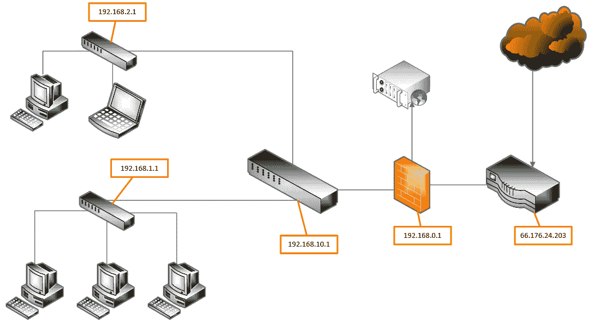
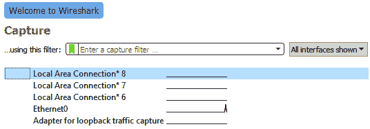

# 第五章：收集网络证据

数字取证的传统重点一直是在可能被攻陷的终端上寻找证据。更具体地说，计算机取证主要关注系统的存储。执法人员如果关注诈骗或儿童剥削等犯罪活动，可以通过单个硬盘找到起诉所需的证据。然而，在事件响应领域，重点必须远远超出怀疑受损的系统。例如，从受损主机到外部**指挥与控制**(**C2**)服务器的流量中，也可以获得大量有价值的信息。

本章重点讨论在网络设备和内部网络中的流量路径中常见证据的准备、识别和收集。在外部威胁源正在指挥内部系统或从网络窃取数据的事件中，这一收集过程至关重要。基于网络的证据在检查主机证据时也非常有用，因为它提供了事件确认的第二个来源，这对确定事件的根本原因极为有用。

本章将涵盖以下主题：

+   网络证据概述

+   防火墙和代理日志

+   NetFlow

+   TCPDump 数据包捕获

+   Wireshark 数据包捕获

# 网络证据概述

有一些网络日志源可以为 CSIRT 人员和事件响应人员提供有价值的信息。每个网络设备根据其制造商和型号提供不同的证据。作为准备工作，CSIRT 人员应熟悉如何访问这些设备以获取所需证据，或建立现有的沟通结构，以便在发生事件时与 IT 人员合作，协助采取正确的响应措施。

网络设备，如交换机、路由器和防火墙，通常也有自己的内部日志，记录谁访问了设备并进行了更改。事件响应人员应熟悉其组织网络中的网络设备类型，并能够在发生事件时访问这些日志：

+   **交换机**：这些交换机通过一系列核心交换机和边缘交换机分布在网络中，核心交换机处理来自多个网络段的流量，边缘交换机处理来自单个段的流量。因此，从主机上发出的流量将穿过多个交换机。交换机有两个关键的证据点，应该被事件响应人员关注。第一个是**内容可寻址存储器**（**CAM**）表。这个 CAM 表将交换机上的物理端口与每个连接到交换机的设备上的**网络接口卡**（**NIC**）进行映射。事件响应人员可以利用此信息追踪到特定网络插座的连接。这有助于识别可能的恶意设备，例如无线接入点或由攻击者连接到内部网络的系统。交换机在协助事件调查方面的第二个方式是便于捕获网络流量。

+   **路由器**：路由器使组织能够将多个局域网（**LAN**）连接到**城域网**（**MAN**）或**广域网**（**WAN**）。因此，它们处理着大量的流量。路由器中最关键的证据是路由表。该表存储了特定物理端口与网络的映射信息。路由器也可以被配置为拒绝网络之间的特定流量，并维护允许的流量和数据流的日志。路由器可以提供的另一个重要证据来源是 NetFlow 数据。NetFlow 提供有关 IP 地址、端口和协议的网络流量数据。这些数据可用于确定来自网络不同分段的流量流向（NetFlow 将在本章后续部分进行更详细的介绍）。

+   **防火墙**：防火墙自从仅仅被认为是另一种路由器的时代以来，已经发生了显著变化。下一代防火墙包含了多种功能，如入侵检测和防御、网页过滤、数据丢失防护以及关于允许和拒绝流量的详细日志。通常，防火墙作为一种检测机制，提醒安全人员潜在的事件。这可能包括来自**入侵检测系统**（**IDS**）/**入侵防御系统**（**IPS**）的警报、已知恶意 URL 或 IP 地址的黑名单，或警报提示防火墙配置变更而 IT 人员未曾知晓。事件响应人员应尽可能了解其组织防火墙的工作原理，以及在事件发生之前可以获取哪些数据。

+   **网络 IDS/IPS**：这些系统专门设计用于向安全人员和事件响应者提供有关网络基础设施上潜在恶意活动的信息。它们结合了网络监控和规则集来判断是否存在恶意活动。IDS 通常配置为在检测到特定恶意活动时发出警报，而 IPS 不仅可以检测到恶意活动，还能够阻止它。无论哪种情况，这两种平台的日志都是事件响应者查找恶意活动具体证据的绝佳场所。

+   **Web 代理服务器**：组织通常使用 Web 代理服务器来控制用户如何与网站及其他基于互联网的资源互动。因此，这些设备可以提供一个关于从内部主机发起的以及发往内部主机的网络流量的全局视图。Web 代理还具有额外的功能，例如在连接到已知恶意软件 C2 服务器或提供恶意软件的网站时，提醒安全人员注意。结合可能已被攻破的主机查看 Web 代理日志，可以帮助识别恶意流量的来源或正在控制主机的 C2 服务器。

+   **域控制器或认证服务器**：作为整个网络域的核心，认证服务器是事件响应者获取有关成功或失败的登录记录、凭证操作或其他凭证使用情况的主要来源。

+   **DHCP 服务器**：在组织内维护分配给工作站或笔记本电脑的 IP 地址列表需要大量的管理工作。**动态主机配置协议**（**DHCP**）的使用允许在局域网（LAN）上动态分配 IP 地址给系统。DHCP 服务器通常包含将 IP 地址分配给主机 NIC 的 MAC 地址的日志。如果事件响应者需要追踪特定日期和时间连接到网络的工作站或笔记本电脑，这些日志非常重要。

+   **应用服务器**：网络服务器上托管着从电子邮件到 Web 应用程序等各种应用程序。每种应用程序都可以提供与其类型相关的特定日志。在事件调查过程中，任何涉及远程连接的日志也很重要。攻击者通常会从被攻破的系统跳转到服务器，以获取机密数据或进行其他后续活动。

## 准备工作

正如前一节所述，网络设备种类繁多，每种设备都有自己汇总和报告相关数据的方法。获取基于网络的证据的能力在很大程度上取决于组织在事件发生之前所做的准备工作。如果没有适当的基础设施安全计划中的关键组成部分，事件响应人员将无法轻松获得关键信息。这将导致证据在 CSIRT 成员寻找关键信息时丢失。为了准备工作，组织可以通过提供适当的网络文档、更新的网络设备配置和中央日志管理解决方案（如 SIEM）来协助 CSIRT。

另一个需要考虑的准备事项是，将执行适当网络证据收集所需的具体任务纳入事件响应手册。例如，没有发送到中央日志管理解决方案（如 SIEM）的防火墙日志，会保存在设备本身。涉及收集网络证据的手册应详细到能够指导整个日志收集过程。

除了为网络证据收集做的技术准备外，CSIRT 人员还需要了解与收集网络证据相关的法律或监管问题。此外，CSIRT 人员还需要意识到，如果没有明确的政策说明可以进行网络监控，捕获网络流量可能被视为侵犯隐私。因此，CSIRT 的法律代表应确保组织内的所有员工都理解其信息系统的使用将被监控。此项应在任何证据收集开始之前在政策中明确说明。

## 网络拓扑图

为了识别潜在的证据来源，事件响应人员需要对内部网络基础设施有深入的了解。组织可以采用的一种方法是创建并维护一份最新的网络拓扑图。该拓扑图应该足够详细，以便事件响应人员能够识别出个别网络组件，例如交换机、路由器或无线接入点。该拓扑图还应包含内部 IP 地址，便于事件响应人员通过远程方式立即访问这些系统。例如，查看以下简单的网络拓扑图：



图 5.1 – 一个示例网络拓扑图

该图示有助于快速识别潜在的证据来源。例如，假设连接到`192.168.2.1`交换机的笔记本电脑被识别为与已知的恶意软件 C2 服务器通信。CSIRT 分析员可以检查网络图，并确定 C2 流量必须穿越多个网络硬件组件才能从内部网络出去。例如，流量会穿越位于`192.168.10.1`的交换机，通过位于`192.168.0.1`的防火墙，最后从路由器到达互联网。

## 配置

如果 CSIRT 能够立即获得标准配置，确定攻击者是否对网络设备（如交换机或路由器）进行了修改将变得更加容易。组织应该已经存储了用于灾难恢复的网络设备配置，但他们还应确保在发生事件时，CSIRT 成员可以访问这些配置。

# 防火墙和代理日志

在调查事件时，有两个主要的证据来源是进出网络的互联网入口/出口点。现代恶意软件和其他漏洞通常需要能够访问基于互联网的资源。这可能是为了下载额外的恶意软件或利用代码。其他涉及数据外泄的攻击将需要访问互联网。最后，攻击者通常需要通过被攻破的系统建立 C2。在这些情况下，各种协议的流量将穿越受害者网络的边界。根据受害者的情况，这些流量可能需要穿越防火墙、互联网代理或两者。因此，这两种技术为事件响应人员提供了重要的证据来源。

## 防火墙

防火墙已经从一种简化的路由和阻塞技术，发展为提供对进出网络流量进行深入分析的平台。下一代防火墙通常将拒绝/允许规则集与入侵检测系统（IDS）或入侵防御系统（IPS）结合起来，并控制网络访问应用程序。这为事件响应过程中提供了一个重要的证据来源。

从防火墙获取证据在很大程度上依赖于制造商和使用的具体型号。事件响应人员应充分了解所使用防火墙的功能集和可以获取的特定数据，这是他们准备工作的一部分。尽管不同厂商和型号之间的功能有所不同，但有一些关键证据点几乎是通用的：

+   **连接日志**：连接日志提供了内部和外部系统之间连接的源 IP 地址、目标 IP 地址和协议信息。这在确定内部系统是否曾与对手控制的系统接触或可能被控制时至关重要。除了被允许的连接外，日志还可能提供被拒绝连接的情况。对手常用的一个技巧是使用工具尝试连接常用的知名端口。如果这些端口对外部连接关闭，日志中会显示拒绝条目。连续的拒绝事件跨越多个端口，通常表明存在侦察活动。

+   **远程访问日志**：防火墙通常作为**虚拟私人网络**（**VPN**）的集中器，用于远程访问。如果远程用户通过恶意软件感染，他们可以通过 VPN 将感染带入内部网络。远程访问日志会显示连接的系统及其连接时间。这可能帮助事件响应者关联活动，确定是否是远程用户成为感染源。

## Web 应用防火墙

一种特殊类型的防火墙是**Web 应用防火墙**（**WAF**）。该设备或软件位于公共互联网和 Web 应用程序之间，帮助组织保护应用程序免受外部攻击。WAF 策略可以非常迅速地进行更改，以应对诸如**拒绝服务攻击**（**DoS**）或对手试图破坏 Web 应用程序基础设施的攻击。从证据角度来看，WAF 提供了来自互联网的连接日志文件，并包含如 HTTP 请求类型和访问资源的系统信息等数据点。这是尝试或成功利用 Web 服务器和 Web 应用程序的一个良好证据来源。

## Web 代理服务器

对手经常利用脚本语言，如 Microsoft Visual Basic 或 PowerShell，下载次级漏洞包或恶意软件。这些脚本通常包含指向漏洞或恶意软件的 URL。对手使用 URL 而非 IP 地址，因为 IP 地址可以通过域名注册轻松更改，这使他们能够在不更改脚本的情况下更改基础设施。

使用 Web 代理服务器进行 HTTP 和 HTTPS 请求的组织将会记录内部网络上任何访问外部网站的系统。从这里，他们可能能够识别出被下载的恶意软件或漏洞包的位置。通过 C2 流量，他们可能会获得更多的洞察，C2 流量也可能采用与恶意软件相似的战术。

由于攻击的检测通常需要数月时间，因此事故响应人员必须能够查看跨越几周甚至几个月的活动历史记录。鉴于代理请求的相对较小，即便只是日期、时间、请求系统和访问的网址，也能提供一项重要的证据，这些证据可能是其他方式无法获得的。

# NetFlow

NetFlow 由思科系统公司（Cisco Systems）于 1996 年首次设计，是一种出现在网络设备（如交换机和路由器）中的功能，允许网络管理员监控网络内的流量。NetFlow 并非严格意义上的安全工具，但在发生安全事件时，它能为事故响应人员提供大量数据。NetFlow 通过 UDP 协议由网络设备发送到一个集中收集点，通常称为**NetFlow 收集器**。

在安全背景下，NetFlow 提供了深入了解系统内部流量的视角，揭示了它们如何相互通信。这通常被称为`10.10.2.0/24`子网。从那里，它们可能会尝试跳转到`10.10.1.0/24`子网上的文件服务器。一旦到达那里，它们就可以获取机密数据并将其传回被攻陷的系统进行外泄。交换机将 NetFlow 数据转发给收集器，其中包括 IP 地址、协议和数据大小。这些数据对于为事件响应分析员提供他们通常无法获取的详细信息至关重要：


图 5.2 – NetFlow 图示

NetFlow 数据是有限的，取决于配置为向 NetFlow 服务器发送数据的设备类型。通常，NetFlow 包含源和目标 IP 地址、源和目标端口、协议以及最终发送的流量大小。即使只有这些有限的信息，分析师也能获得有关对手活动的洞察，如潜在的横向移动或数据外泄。

配置 NetFlow 取决于网络组件的类型和制造商。此外，根据预算和其他资源的不同，可以利用各种收集器和分析工具。将 NetFlow 分析纳入整体网络操作的一个优势在于，它不仅为事件响应团队提供数据，而且在日常网络操作中也非常有用，尤其是在追踪延迟或其他通信问题方面。由于其双重用途，作为整体网络操作的一部分更容易为其辩护。

# 数据包捕获

捕获网络流量对于全面理解事件至关重要。能够识别潜在的 C2 IP 地址流量可能会提供有关感染主机的恶意软件类型的更多信息。在其他类型的事件中，CSIRT 成员可能能够识别外部威胁行为者利用的潜在数据外泄方法。

一种方法是设置名为`192.168.1.0/24`的子网，tap 应放置在主机和交换机之间。这通常涉及在主机和交换机之间放置一个系统。

另一种选择是配置**交换端口分析器**（**SPAN**）端口。在这种配置中，离受损主机最近的交换机会启用端口镜像。这样，交换机所在整个段的流量将被发送到镜像端口上的系统。

最后，一些网络设备有内建的应用程序，如`tcpdump`，可以用来捕获流量以供进一步分析。这可能是最快的选择，因为它不需要物理访问网络或交换机，并且可以远程设置。但这种方法的缺点是交换机上的存储可能无法支持大容量的捕获文件，且额外的负载可能增加未捕获某些数据包的可能性。

## tcpdump

`tcpdump`是一个专门设计用于数据包捕获的命令行工具。`tcpdump`通常包含在 Linux 发行版中，并且在许多网络设备上都能找到。对于这些设备中的许多，`tcpdump`必须以 root 用户或具有 root 权限的身份运行，因为它需要监控网络流量。相关文档可以在[`www.tcpdump.org/`](http://www.tcpdump.org/)找到。要使用`tcpdump`进行数据包捕获，可以按照以下步骤操作：

1.  要访问基本帮助菜单，请在命令提示符中输入以下内容：

    ```
    arkime@arkime: :~$ tcpdump -h
    ```

该命令将产生以下帮助菜单：


图 5.3 – tcpdump 帮助菜单

默认情况下，`tcpdump`会捕获所有可用接口上的流量。运行以下命令可以列出`tcpdump`能够捕获流量的所有接口：

```
arkime@arkime::~$ tcpdump -D
```

以下截图显示，在此情况下，`ens160`（以太网）接口和`lo`（回环）接口可以用于捕获流量：


图 5.4 – tcpdump 捕获接口

1.  要在位于`ens33`的以太网接口上进行基本捕获，并使用普通的详细程度，请输入以下命令：

    ```
    arkime@arkime:~$ sudo tcpdump -i ens160 -v
    ```

`-i`选项告诉`tcpdump`在哪个接口上执行数据包捕获。在这种情况下，它是在以下以太网接口上：`ens160`。`-v`选项设置数据包捕获的详细程度。在这个例子中，详细程度设置得比较低。若要查看更多数据，可以将该选项设置为`-vvv`，以获得更详细的数据包信息。以下截图显示了命令显示的信息：


图 5.5 – tcpdump 命令输出

虽然这种方法可以确定流量是否经过该接口，但由于数据包出现在屏幕上的速度非常快，单个数据包信息对分析师来说是无用的。为了使数据包捕获有用，建议将文件输出，以便稍后使用数据包分析工具（如**Wireshark**）进行检查。本章稍后会详细讨论 Wireshark，并在第 *9 章*中更详细地介绍。

1.  要配置 `tcpdump` 将数据包捕获输出到文件，可以使用以下命令：

    ```
    arkime@arkime:~$ sudo tcpdump -i ens160 -vvv -w ping_capture
    ```

PING 命令

正在执行`8.8.8.8`。

该命令告诉 `tcpdump` 捕获网络流量并将文件写入捕获。与之前的捕获不同，屏幕上不会显示任何流量。

1.  要停止捕获，按 *Ctrl* + *C*，这将生成以下信息：


图 5.6 – tcpdump 输出

1.  导航到根目录后，文件可以通过 Wireshark 等网络分析工具打开，如下所示：


图 5.7 – Wireshark 数据包捕获分析

`tcpdump` 还可以配置为将捕获集中在特定的源或目标 IP 地址和端口上。例如，如果事故响应分析师需要收集来自特定主机（IP 地址为 `192.168.10.54`）的数据包，以下 `tcpdump` 命令将产生所需结果：

```
arkime@arkime:~$ sudo tcpdump -i ens33 src host 192.168.10.54
```

可以使用以下命令将发送到某个目标地址（如已知的 C2 服务器的 IP 地址）的数据包与后台网络流量分开：

```
arkime@arkime:~$ sudo tcpdump -i ens33 dst host 162.4.5.23
```

`tcpdump` 是一个强大的工具，拥有许多选项。建议事故响应分析师检查并将其各种功能整合到他们的工具包中。

## WinPcap 和 RawCap

在发生事故时，可能需要从 Windows 系统中获取数据包捕获。在像被攻破的 web 服务器或应用服务器这样的事件中，Windows 系统本身没有原生的应用程序来进行数据包捕获。Windows 系统上有几种数据包捕获工具。可以使用的第一个工具是**WinPcap**。这个工具通常被认为是 Windows 系统上数据包捕获的标准，并可以在[`www.winpcap.org/`](https://www.winpcap.org/)免费下载。这个工具从取证角度来看，缺点是必须在系统上安装。这可能会使取证分析复杂化，因为系统的任何更改都必须彻底记录。出于这个原因，确保高风险系统（如 web 服务器、文件服务器和应用服务器）已经安装 WinPcap，是一个好的预备步骤。

另一个供事件响应分析员使用的选项是像**RawCap**这样的工具。RawCap 具有与 WinPcap 相同的基本功能，但不需要在本地系统上安装它。RawCap 可以轻松地从连接到系统的 USB 设备上运行。使用 RawCap 执行数据包捕获的过程如下：

1.  以管理员身份启动 Windows 命令提示符。

1.  在命令提示符中，导航到包含 `RawCap.exe` 文件的文件夹。若要查看可用选项，输入以下命令：

    ```
    D:\>RawCap.exe -help
    ```

该命令将生成以下输出：


图 5.8 – Rawcap.exe 菜单

输出会显示一个接口列表。RawCap 的一个优势是，即使从 USB 设备上运行，事件响应分析员也可以在每个接口上执行数据包捕获。在此示例中，捕获将会在标有数字 0 的以太网接口上执行。

1.  要开始数据包捕获，RawCap 需要指定流量应捕获的网络接口，以及输出捕获数据包的输出文件。要捕获无线接口上的流量并将其输出到名为 `RawCap.pcap` 的文件中，使用以下命令：

    ```
    C:\ProgramData\chocolatey\bin\RawCap.exe 0 RawCap.pcap
    ```

该命令会产生以下输出：


图 5.9 – RawCap 数据包捕获的输出

1.  按下 *Ctrl* + *C* 将停止捕获。捕获文件 `RawCap.pcap` 会保存到与 `RawCap.exe` 文件相同的目录中。然后，这个文件可以通过像 Wireshark 这样的工具打开进行进一步分析：


图 5.10 – 在 Wireshark 中分析 RawCap 文件

现在我们已经介绍了 Wireshark，我们将探讨该工具如何用于捕获网络流量。

# Wireshark

`tcpdump` 或像 RawCap、Wireshark 这样的工具是基于图形界面的工具，除了数据包捕获外，还包括分析功能。因此，Wireshark 在事件发生时可能不容易快速部署，因为该程序必须先安装。此外，Wireshark 仅支持 Windows 或 macOS 系统。在 Linux 系统上安装 Wireshark 需要更多的努力。Wireshark 相较于命令行工具的一个明显优势是，事件响应分析员可以在捕获数据包时对流量进行详细检查。Wireshark 可以在系统本身或 USB 驱动器上运行。安装后，必须以管理员身份运行。使用 Wireshark 执行数据包捕获的过程如下：

1.  第一步是选择一个 Wireshark 将捕获流量的接口：



图 5.11 – Wireshark 捕获接口

在截图中，只有一个接口似乎在处理流量。捕获将会在 **Ethernet0** 接口上执行。

1.  双击接口将启动数据包捕获。如前所述，与 **tcpdump** 或 RawCap 不同，实际捕获的内容将输出到屏幕上，便于立即分析：


图 5.12 – Wireshark 捕获视图

1.  要停止捕获，请点击面板左上角的红色框。然后可以保存文件以供进一步分析。

另一个 Wireshark 附带的工具，且在证据收集过程中非常有用的是`tcpdump`，或 RawCap。它在事件响应分析员从多个来源获取数据包捕获时非常有用，特别是当他们需要检查特定主机的流量时。要访问 mergecap 的菜单，请在命令提示符中输入以下内容：

```
arkimie@arkime:~$mergecap -help
```

该命令产生以下帮助信息：


图 5.13 – mergecap 帮助菜单

要合并多个数据包捕获文件，可以使用以下命令：

```
arkime@arkime:~$mergecap -w switches.pcap switch1.pcap switch2.pcap switch3.pcap
```

通过将三次数据包捕获的输出合并成一个文件，事件响应分析员可以检查跨多个网络路径的更广泛活动。例如，如果分析员正在寻找来自未知主机到外部 C2 服务器的流量，他们可以合并整个网络范围内的捕获记录，然后搜索该 IP 地址，而不是单独检查每个数据包捕获。

# 证据收集

为了正确检查日志文件和其他网络数据（如数据包捕获），通常需要将它们从日志源移走并离线检查。与任何证据来源一样，日志文件或数据包捕获在转移过程中必须小心处理，以确保不会被破坏或修改。一个简单的解决方案是立即将证据传输到 USB 驱动器或类似的可移动介质上。然后，可以在检查之前为证据创建哈希值。

网络证据的获取，如数据包捕获或日志文件，应该进行详细记录。事件响应人员可能会从整个网络的多个来源获取日志文件和数据包捕获。因此，他们应确保能够追溯每一项证据的来源，以及收集证据的日期和时间。可以在网络证据日志表上记录这些信息，并为每一项证据填写条目。例如，参见以下条目：


图 5.14 – 网络证据收集条目

日志条目记录了以下必要信息：

+   **文件名**：每个日志文件或数据包捕获文件应具有唯一的名称。在 CSIRT 使用的程序中，应有一个不同类型证据文件的命名约定。

+   **描述**：文件的简要描述。除非文件特别独特且需要详细描述，否则无需提供过多细节。

+   **哈希**：关于哈希的全面概述将在后面的章节中讨论。目前，简而言之，哈希是一种单向算法，用于为文件提供数字指纹。这个哈希将在收集阶段和分析阶段后记录，以证明文件在分析过程中没有被修改。计算哈希有几种方法。在本例中，可以使用在 Ubuntu 上安装的 **md5sum** 哈希程序计算 MD5 哈希。**md5sum** 有几个不同的选项，可以通过命令行访问。要查看帮助菜单，请输入以下命令：

    ```
    arkime@arkime:~$md5sum --help
    ```

这将产生以下帮助菜单：


图 5.15 – md5sum 帮助菜单

通过输入以下命令，可以计算来自交换机的数据包捕获的 MD5 哈希值：

```
arkime@arkime:~$md5sum ping_capture
```

这将产生以下输出：


图 5.16 – md5sum 文件计算

+   `192.168.0.110` IP 地址。

+   **采集日期/时间**：记录文件被捕获的日期和时间。通常，这与停止捕获的日期和时间相同。如果是长时间的数据包捕获，可以记录捕获的开始和结束时间。

设置时间标准

在事件发生前，确定使用的时区非常重要。从证据的角度来看，只要在整个事件调查过程中时区保持一致，时区本身并不重要。

+   **采集者**：确保标明采集文件的人员。

+   **方法**：指明用于捕获文件的工具。

+   **存储驱动器**：一旦证据被捕获，将其转移到证据存储驱动器。这也应该被记录。

一旦收集完成，应填写包含证据文件的外部介质的交接单。接下来，可以对这些文件进行分析。

# 总结

与事件响应者相关的证据不仅仅位于被入侵主机的硬盘上。环境中分布着许多网络设备提供的丰富信息。通过适当的准备，CSIRT 可以利用这些设备提供的证据，使用诸如 SIEM 这样的解决方案。CSIRT 人员还可以通过各种方法和工具捕获网络流量，以供后续分析。然而，所有这些技术都受到法律和政策影响，CSIRT 人员以及整个组织需要应对这些问题。通过为网络证据收集的法律和技术挑战做好准备，CSIRT 成员可以利用这些证据，进一步接近确定事件根本原因并让组织恢复到正常运作的目标。

本章讨论了几个可供事件响应分析员使用的证据来源。网络设备的日志，无论是报告给 SIEM 还是通过其他方法，都能让你了解网络中发生了什么。数据包捕获提供了网络流量确切性质的详细信息。最后，分析员必须准备以法医可靠的方式获取这些证据来源。

下一章的重点将从网络证据获取转向从基于主机的系统中获取易失性数据。

# 问题

1.  以下哪些项目可能是网络证据的来源？

    1.  交换机

    1.  路由器

    1.  防火墙

    1.  上述所有

1.  网络图在识别可以获取网络证据的潜在区域中非常重要。

    1.  正确

    1.  错误

1.  以下哪项不是网络取证证据采集工具？

    1.  RawCap

    1.  Wireshark

    1.  WinPcap

    1.  LogBeat

1.  在进行证据获取时，记录文件的哈希值并不重要。

    1.  正确

    1.  错误

# 进一步阅读

+   Wireshark 培训：[`www.chappell-university.com/`](https://www.chappell-university.com/)

+   *思科 IOS NetFlow 介绍 - 技术概述*：[`www.cisco.com/c/en/us/products/collateral/ios-nx-os-software/ios-netflow/prod_white_paper0900aecd80406232.html`](https://www.cisco.com/c/en/us/products/collateral/ios-nx-os-software/ios-netflow/prod_white_paper0900aecd80406232.html)
