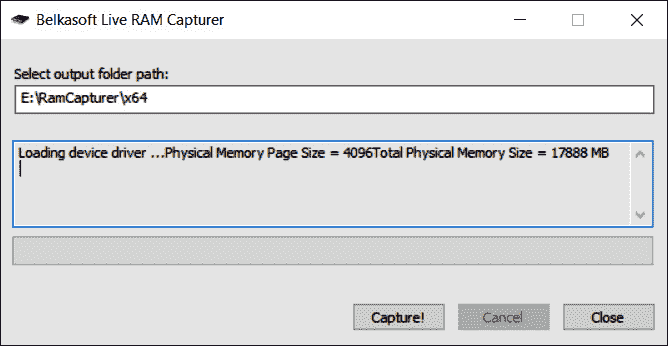
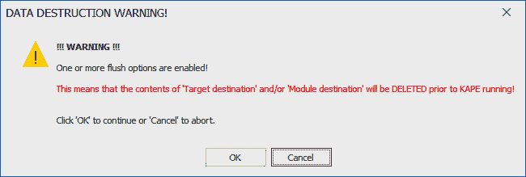

# 第六章：获取基于主机的证据

主机系统往往是恶意行为的主要目标。主机系统可能成为攻击者获得网络立足点、进行进一步攻击的枢纽，或作为威胁行为者的最终目标。因此，事件响应分析师应该做好准备调查这些系统。现代操作系统，如微软 Windows，在应用程序执行时、文件更改时或添加用户账户时，会创建各种证据性产物。这些更改都会留下活动痕迹，供事件响应分析师评估。随着存储和内存的不断扩大，即使是最低成本的消费者系统，事件响应分析师可用的数据量也在不断增加。常见的系统通常制造时配备了大量内存和存储空间，容量达到 TB 级别；这些数据能够帮助事件响应人员确定根本原因。因此，事件响应分析师应该准备从系统中获取不同类型的证据，以便进一步分析。

本章将涵盖以下主题：

+   准备工作

+   易失性顺序

+   证据获取

+   获取易失性内存

+   获取非易失性证据

# 准备工作

在准备方面，事件响应分析师应确保拥有必要的工具来获取基于主机的证据。本章将讨论的技术不依赖于任何高度专业化的技术，而是依赖于可以以很低成本甚至免费获得的工具。选择用于获取证据的工具至关重要，这些工具应该来自信誉良好的来源，已经通过其他 CSIRT 人员验证有效，并且在使用前已验证其有效性。除了软件外，所需的额外硬件仅为外部硬盘驱动器和常见的台式计算机。

在支持企业环境时，事件响应人员应该对常见部署的系统类型有一个清晰的理解。例如，在一个严格使用微软操作系统的企业中，可用的工具应该能够支持多个版本的微软操作系统。在其他情况下，事件响应人员可能会支持一个微软和 Linux 系统比例为 80/20 的企业；因此，事件响应人员应该准备好支持获取证据的工具和技术。

许多在本章讨论的工具和技术需要管理员权限。事件响应人员应提供执行这些任务所需的凭据。值得注意的是，分析人员应仅使用现有帐户，并且在可能被入侵的系统中添加帐户可能会使证据在司法程序中不可接受。其中一项技术是为事件响应分析人员提供仅在事件期间启用的个人凭据。这允许组织将凭证的合法使用与可能的恶意使用分开。这也使事件响应团队能够重现其行动。值得注意的是，高度技术的对手通常会在主动威胁期间监视他们正在攻击的网络，以确定是否被检测到。因此，这些凭据不应表明它们与事件响应分析人员或其他调查可能违反的人员有关联。

# 挥发性的顺序

主机系统上并非所有证据都相同。挥发性用于描述主机系统上的数据在注销或断电后如何维持。如果系统断电将丢失的数据称为**挥发性数据**。挥发性数据可以是 CPU 中的数据、路由表或 ARP 缓存。在调查如恶意软件感染的事件中，运行系统的内存是至关重要的。恶意软件在系统内存中留下许多关键证据，如果丢失，可能会导致事件响应分析人员无法进行有效调查。这可以包括注册表数据、命令历史记录和网络连接等工件。

**非易失性数据**是存储在硬盘上的数据，在关机后通常仍会保留。非易失性数据包括**主文件表**（**MFT**）条目、注册表信息和硬盘上的实际文件。虽然恶意软件在内存中创建证据，但非易失性存储器中仍然存在具有证据价值的项目。以下图表显示了数字证据不同挥发级别，在确定获取顺序时应考虑这些级别：


图 6.1 - 数字证据挥发性

在下一节中，我们将学习如何收集证据。

# 证据获取

有各种方法不仅用于访问潜在的证据源，还用于确定可以进行的获取类型。为了定义这些方法，重要的是要清楚了解可以使用的获取方式和类型。

+   **本地**：对于大多数企业来说，能够直接访问正在调查的系统通常是一种奢侈。不过，很多情况下，事件响应分析师或其他工作人员可以直接物理访问系统。本地采集通常可以通过 USB 或其他设备执行，某些情况下，也可以使用系统本身进行采集。

+   **远程**：远程采集是指事件响应分析师利用工具和网络连接进行证据采集。如果事件响应分析师面临地理上的挑战，远程采集是一个显而易见的选择。如果事件响应分析师无法立即到现场，这种方法也非常有用。（下一章将重点介绍远程证据采集。）

+   **实时采集**：实时采集证据是指事件响应分析师从当前已开机并运行的系统中获取证据。本章将展示的一些技术必须在实时系统上部署（例如，捕获运行中的内存）。在高可用性环境中，完全从实时系统中获取数字证据可能是必要的技术，因为可疑系统不能下线。这些技术使事件响应分析师能够采集并分析证据，判断系统是否被攻击。

+   **离线采集**：离线采集方法通常由执法机构使用，用来保护硬盘上的数字证据。该技术要求系统关闭并移除硬盘。一旦访问硬盘，专门的工具会被用来采集硬盘证据。严格依赖离线采集有一些缺点。首先是易失性内存的丢失。其次，获取可疑系统的硬盘、制作镜像并处理该镜像以进行调查可能非常耗时。这可能会导致事件响应人员在超过 24 小时内无法了解事态进展。

根据事件类型以及时间或地理位置的限制，事件响应分析师应该准备执行这些类型的证据采集。最佳的情况是，计算机安全事件响应团队（CSIRT）能够在任何可疑系统上执行实时和离线采集。这能提供最多的证据，供进一步分析。就准备而言，分析师应该具备必要的工具和经验，通过这些方法进行证据采集。

要执行本地采集，事件响应分析员需要一个外部硬盘或 USB 驱动器，具备足够的空间用于捕获至少被调查系统的运行内存，以及其他必要的文件。为了确保所收集证据的完整性，建议将 USB 驱动器配置为两个分区。第一个分区应包含执行证据采集所需的工具，而第二个分区应作为证据的存储库。这还允许事件响应分析员将证据转移到更持久的存储形式，然后清除证据分区，而无需重新安装所有工具。

## 证据收集程序

数字取证与其他法医学科（如痕迹证据）之间存在许多相似之处。关键的相似之处在于，获取证据的组织需要有一个稳健、可复现且文档化良好的程序。以下是一些收集数字证据的正确指南：

+   **拍摄系统和现场照片**：一项节省时间的重要设备是小型数码相机。尽管拍摄系统现场可能显得有些多余，但如果事件响应人员所采取的行动进入法庭，拥有照片将有助于事件的还原。然而，需要注意的是，务必使用单独的数码相机。使用手机可能会在诉讼或刑事程序中暴露该设备。最佳方法是在方便的时间和地点拍摄所需的所有照片，并将其转移到永久存储中。

+   **确定系统是否已开机**：如果系统已经开机，保持开机状态。如果系统处于关机状态，请勿开机。开关机时会发生一些变化。如果系统已开机，易失性内存将可供捕获。此外，在启用全盘加密的情况下，保持系统开机可以让响应人员仍然能够获取逻辑磁盘分区。如果系统处于关机状态，保持此状态可以确保非易失性内存中的任何证据得到保留。如果事件响应人员认为该系统可能对其他系统构成威胁，可以通过断开网络连接将其隔离。

+   **获取运行中的内存**：这是一个至关重要的证据，可以提供大量关于正在运行的进程、使用中的动态链接库（DLL）和网络连接的数据。因此，获取内存的程序将在本章中详细讨论。

+   **获取注册表和日志文件**：虽然这些文件本质上是非易失性的，但迅速获取它们是有益的，尤其是在调查恶意软件或其他攻击手段时。

+   **从系统背面拔掉电源**：如果系统是笔记本电脑，还要拆下电池。这样可以保留系统的状态。

+   **拍摄系统背面或底部以获取型号和序列号**：此程序允许事件响应分析师获取对保管链必要的任何信息。

+   **拆下系统的盖子并拍摄硬盘以获取型号和序列号**：再次有助于重建保管链。

+   **从系统中取出硬盘并将其放入防静电袋中**：将硬盘安全地放入可密封的信封或盒子中。防静电袋将保护硬盘，而包装应确保任何尝试打开它的行为都会显而易见。这可以通过专门设计的证据袋或可以用胶带密封的简单邮寄信封来实现。扣押分析师应在任何封条上签字。此外，在包装外部的某处标明事件编号、证据编号、日期、时间和扣押分析师。

+   **记录所有操作**：确保记录日期和时间，以及执行操作的事件响应分析师。事故报告通常是任何响应的最后阶段。因此，在分析师能够记录他们的操作之前，可能会过去几个小时甚至几天。因此，在最初扣押期间拍摄的照片和笔记在重建事件序列时至关重要。

在下一节中，我们将看看如何获取易失性内存。

# 获取易失性内存

传统数字取证，或现在通常称为死盒取证，侧重于从关闭系统中取出的硬盘驱动器作为主要证据来源。这种方法在处理诸如欺诈或儿童剥削等犯罪活动时效果很好，其中可以以取证合规的方式发现图像文件、文字处理文档和电子表格。这种方法的问题在于，为了正确获取这些证据，系统必须关闭电源，从而破坏了可能存在于易失性内存中的任何潜在证据。

与传统犯罪活动相反，事件响应人员会发现，安全事件的大量证据包含在潜在受损系统的内存中。当检查已感染恶意软件或通过使用诸如 Metasploit 等常见平台进行利用的系统时，这一点尤为真实。

关键的痕迹证据常常存在于被攻陷系统的运行内存中。因此，在关闭系统并拆卸硬盘之前，必须先获取运行内存进行处理。有多个免费的和商业化的工具可以供事件响应分析员用来获取运行内存。使用哪种工具通常取决于分析阶段使用的技术和工具，分析阶段的内容在 *第十章* 中讨论。

获取运行内存有两种方法。首先，可以通过直接连接到嫌疑系统的 USB 设备或其他可写介质来本地获取内存。另一种获取内存的方法是通过远程连接。这可以通过使用专门的软件，通过网络连接进行获取（远程获取技术将在下一章中讨论）。

如果事件响应分析员可以物理接触到潜在被攻陷的系统，他们可以选择本地获取内存和其他证据。这涉及到使用从 USB 设备或类似的可移动介质中运行的工具，连接到潜在被攻陷的系统。然后，运行这些工具并收集证据。本地获取通常是与没收系统的硬盘和其他证据一起进行的。有多个工具可以用于本地获取。本书将介绍三种此类工具——**Exterro 的 FTK Imager**、**Velocidex 的 WinPmem** 和 **Belkasoft 的 RamCapturer**。

在以这种方式获取内存时，建议使用一个具有足够容量的外部驱动器来存储多个文件。事件响应分析员应使用一个具有两个分区的 USB 设备。第一个分区包含执行内存获取所需的工具，而第二个分区则存储证据文件。这样，事件响应分析员可以确保证据不会与工具混合。

## FTK Imager

Exterro 的 FTK Imager 是一个 Windows 软件平台，执行多种成像任务，包括获取系统的运行内存。该软件可以在 [`www.exterro.com/ftk-imager`](https://www.exterro.com/ftk-imager) 下载。让我们来看一下这个平台：

1.  下载后，将可执行文件安装到 USB 驱动器的 **Tools** 分区中。

1.  打开 `FTK Imager` 文件夹并以管理员身份运行可执行文件。（FTK Imager 需要使用驱动程序，因此需要管理员权限。）以下窗口将会出现：


图 6.2 – FTK Imager 主窗口

1.  点击 **File**，然后选择 **Capture Memory**。这将打开以下窗口：


图 6.3 – FTK Imager 内存捕获

1.  浏览到`Laptop1`或`Evidence Item 1`。另一种有用的选项是使用系统名称，如*图 6**.3*所示。还要勾选**Include pagefile**复选框。页面文件中可能没有具有证据价值的信息，但在调查过程中可能会变得重要（页面文件将在*第十章*中讨论）。

1.  最后，可以选择创建一个 AD1 文件；这是 Exterro 的专有文件格式。这个文件用于使用 FTK 分析程序分析捕获的映像。对于本书的目的，标准输出足以进行后续分析。

1.  设置好配置细节后，点击**Capture Memory**，然后将显示以下屏幕：


图 6.4 – FTK Imager 内存捕获进度

1.  在 FTK Imager 转储 RAM 后，它将提取页面文件，如下图所示：


图 6.5 – FTK Imager 页面文件提取

1.  运行此工具后，FTK Imager 将指示内存捕获是否成功：


图 6.6 – FTK Imager 内存捕获成功

检查证据驱动器的证据分区，能看到两个文件，如下图所示：


图 6.7 – FTK Imager 输出文件

内存文件大小

根据系统的不同，`.mem`文件可能与目标系统的内存不完全匹配。在这种情况下，目标系统有 16 GB 的物理内存，但`.mem`文件大约大 2 GB。这可能发生在使用虚拟内存的操作系统中。在其他情况下，实际的 RAM 文件可能会更小。这是预期中的正常情况。

FTK Imager 的一个缺点是它需要对驱动程序有较多的访问权限，并且有许多功能。这使得将工具从一个系统移动到另一个系统变得困难，也显著降低了在脚本中使用 FTK Imager 的能力。

## WinPmem

FTK Imager 的对立工具是 WinPmem。它是一个单一的命令行可执行文件，可以像 FTK Imager 一样执行。主要的区别在于，这个工具更容易进行脚本编写，因此可以一次性部署到多个系统，或者与其他证据收集工具一起使用。

WinPmem 是一个免费的工具，可以在[`github.com/Velocidex/WinPmem`](https://github.com/Velocidex/WinPmem)上获得。

下载后，可将可执行文件放置在分析师需要的位置。WinPmem 是一个命令行工具，因此我们来看看捕获运行系统内存所需的具体命令：

1.  要获取目标系统的物理内存，请以管理员身份打开 Windows 命令提示符实例。输入`E:\winpmem_mini_x64_rc2.exe -help`，将显示以下帮助菜单：


图 6.8 – WinPmem 帮助菜单

1.  接下来，通过运行以下命令配置 WinPmem 以获取系统的内存：

    ```
    E:\winpmem_mini_x64_rc2.exe Acc_LT09.raw
    ```

1.  上述命令告诉 WinPmem 获取原始内存并将其输出到名为 `Acc_LT09.raw` 的文件，该文件将创建在正在使用的 USB 驱动器的证据分区中。输入命令后，按下 *Enter* 键将生成以下内容：


图 6.9 – WinPmem 输出

1.  然后 WinPmem 会遍历整个内存结构。在此过程中，它将生成以下输出：


图 6.10 – WinPmem 输出

WinPmem 提供了一个可以轻松复制并部署到多个系统的单一可执行文件的灵活性。显而易见的缺点是缺乏图形用户界面（GUI）。FTK Imager 和 WinPmem 之间的一个不错的折中选择是 Belkasoft 的 RAM Capturer。

## RAM Capturer

RAM Capturer 是由软件公司 Belkasoft 提供的免费工具。RAM Capturer 是一个简单易用的工具，像 FTK Imager 和 WinPmem 一样，它可以通过 USB 启动运行。RAM Capturer 将 WinPmem 的简便性与 FTK Imager 的易用 GUI 相结合：

1.  右键点击 **RAM Capturer** 可执行文件并选择 **以管理员身份运行**。这将会显示以下窗口：



图 6.11 – RAM Capturer 启动窗口

1.  获取内存所需的唯一输入是指定存放内存镜像的文件夹路径。一旦设置了输出路径，点击 **Capture!** 按钮并让它运行：


图 6.12 – RAM Capturer 进度

1.  一旦 RAM Capturer 完成，以下消息将出现：


图 6.13 – RAM Capturer 完成

在考虑内存获取工具时，最佳的方法是尽可能高效地捕获尽可能多的数据。像 FTK Imager 这样的工具非常可靠，不仅可以获取内存，还能获取其他关键证据。然而，有时这可能不可行，响应人员将不得不使用一个带有轻量级工具（如 RAM Capturer）的 USB 键。最佳选择是确定将用于检查证据的法医工具类型，然后选择合适的工具来获取内存。

在获取内存时，这些工具的一个关键特点是，它们也可以在响应人员无法物理接触嫌疑系统的情况下被利用。

## 虚拟系统

事件响应分析师应准备应对的其他系统是虚拟机。虚拟系统相对于物理系统的一个明显优势是，它们能够通过执行系统快照或简单地暂停系统来保持当前状态。这使得事件响应分析师只需将整个文件复制到证据驱动器上，供后续分析。建议分析师确保在复制前后对虚拟机的每个组件进行哈希，以确保证据的完整性。

像 VMware 这样的流行虚拟化软件的一个关键特点是，虚拟机使用两个文件来处理运行时内存。第一个文件是**虚拟内存**（**VMEM**）文件。VMEM 文件是虚拟机的 RAM 或物理内存。第二个文件是**VMware 暂停状态**（**VMSS**）文件。VMSS 文件包含虚拟机在暂停状态时保存的文件。我们来看看这个：

1.  要从 VMware 虚拟机中获取运行时内存，暂停系统。

1.  其次，将 VMSS 和 VMEM 文件传输到可移动存储介质（如 USB）。VMware 软件通常会在安装过程中包括`Vmss2Core.exe`应用程序。该应用程序将 VMSS 和 VMEM 文件合并成一个单一的`.dmp`文件，可以使用取证工具进行分析。要创建完整的内存捕获，必须同时拥有这两个文件。

1.  要创建`.dmp`文件，请运行以下命令：

    ```
    C:\Program Files (x86)\VMware\VMware Workstation>vmss2core.exe suspect.vmss suspect.vmem
    ```

从这里，响应人员将拥有必要的`.dmp`文件以进行分析。

# 获取非易失性证据

尽管内存中运行着大量数据，但从潜在被攻破的系统中获取硬盘数据仍然非常重要。这些设备中包含大量证据，即使是在恶意软件或其他攻击的情况下也是如此。在检查潜在事件时，例如内部恶意行为或数据丢失，硬盘证据变得更加重要。为了确保这些证据能够在法庭上使用，事件响应人员应熟练掌握我们在本章中讨论的程序。

在某些情况下，事件响应人员可能希望在关闭正在运行的系统之前从疑似被攻破的系统中获取两个关键数据。虽然这些数据本身不是易失性的，但注册表键值和事件日志文件可以在调查过程中帮助分析师。从镜像硬盘中获取这些文件主要依赖于影像和处理整个硬盘驱动器所需的时间。因此，有一些技术可以用来获取这些关键证据。

如果分析师能够访问系统，他们可以通过运行以下命令，利用命令行访问日志文件：

```
C:\wevtutil epl<Log Type> E:\<FileName>.evtx
```

此命令可以对安全、应用程序和系统日志重复执行。

## FTK 获取受保护的文件

FTK Imager 还允许捕获注册表键设置和其他有助于调查的信息。让我们来看看：

1.  打开 FTK Imager，并导航到 **文件** 标签。

1.  点击 **获取受保护的文件**。将出现以下对话框：


图 6.14 – FTK 受保护文件获取

1.  点击 **浏览...** 并导航到证据文件所在的位置。

1.  接下来，点击 `user`、`system`、`SAM` 和 `NTUSER.DAT` 文件的单选按钮。此时可以在成像过程之前进行分析，这使得对事件的响应更加迅速。

## CyLR 响应工具

一款开源工具帮助响应人员进行此类获取操作，即 `CyLR.exe` 应用程序。这个独立的可执行文件可以从 [`github.com/orlikoski/CyLR/releases`](https://github.com/orlikoski/CyLR/releases) 下载并运行，可以从 USB 或系统中运行。它是一个小型应用程序，但可以获取大量证据，这些证据可以作为初步调查的一部分或可能的分类处理来利用。`CyLR.exe` 的另一个关键特性是，它能够将获取的数据发送到远程系统进行存储或处理，正如我们将在*第十二章*中演示的那样。

若要获取非易失性日志文件和其他受保护文件，请通过命令提示符导航到 `CyLR.exe` 可执行文件，并以管理员身份运行它。包含证据文件的输出目录将与 `CyLR.exe` 应用程序位于同一目录。如果您从 USB 设备运行此工具，这样做非常方便，因为输出将直接保存在 USB 上。

当 `CyLR.exe` 应用程序正在运行时，响应人员将能够看到正在获取的各个文件：


图 6.15 – CyLR 输出

根据处理器和可用 RAM 的不同，`CyLR.exe` 预计运行几分钟。之后，以下消息将出现：


图 6.16 – CyLR 完成消息

最后，检查运行 `CyLR.exe` 的目录，将会发现一个压缩文件，其文件名为系统的名称。解压缩文件后，可以看到收集的广泛证据：


图 6.17 – CyLR 获取的文件

输出包括日志文件、注册表文件和主文件表，这些将在后续章节中非常重要。通过简单工具获取这些数据是使用 `CyLR.exe` 在系统关闭前获取证据的一个主要优势。

## Kroll 工件解析器与提取工具

与 CyLR 类似，**Kroll Artifact Parser and Extractor** (**KAPE**) 是一款专为数字取证设计的工具，能够提取具有法证相关性的工件，并解析这些工件以便使用各种附加工具进行分析。KAPE 利用模块和目标的组合来提取相关证据。该提取过程可以在活跃系统和磁盘映像上执行。KAPE 可以从 Kroll 网站下载：[`www.kroll.com/en/insights/publications/cyber/kroll-artifact-parser-extractor-kape`](https://www.kroll.com/en/insights/publications/cyber/kroll-artifact-parser-extractor-kape)。

整个工具集包含在一个压缩文件中。下载后，解压文件夹内容。KAPE 可以在本地系统或 USB 驱动器上运行；这允许分析员只需将 USB 驱动器连接到嫌疑系统并从那里执行所有命令。文件中有两个可执行文件：`kape.exe` 是命令行版本，`gkape.exe` 是基于图形界面的版本。以管理员身份运行 `gkape.exe`，然后会出现以下窗口：


图 6.18 – KAPE 图形界面

**图 6.18** 中的数字 **1** 是分析员配置目标选择的位置。数字 **2** 显示了目标选择。这些是分析员将选择用于提取的证据收集项。数字 **3** 表示 KAPE 命令行将出现的位置。在以下示例中，KAPE 将对一个活跃系统进行操作。接下来将捕获必要的证据，以便使用预设的证据列表对目标系统进行初步分诊分析：

1.  在这个示例中，KAPE 将在 Windows 系统的根目录中运行，根目录由驱动器字母 `C` 表示。提取后的输出文件将保存到一个可移动 USB 驱动器上的 `Acct_LT009` 文件夹中，如 *图 6.19* 所示：


图 6.19 – 设置目标源和目标位置

1.  接下来，分析员需要选择提取的目标。在此案例中，分析员正在进行初步分诊并选择 `!``SANS_Triage` 目标：


图 6.20 – SANS_Triage 目标

1.  要查看每个目标选择提取的工件，双击该选择。在此案例中，以下窗口显示了提取的工件：


图 6.21 – SANS 目标详情

1.  选择目标后，KAPE 会提供将要使用的命令行。KAPE 也可以通过命令行运行 `kape.exe` 可执行文件。这允许分析员在图形界面中构建命令，并在必要时将输出用于脚本：


图 6.22 – KAPE 命令行命令

选择输出以下命令：

```
.\kape.exe --tsource C: --tdest E:\Acct_LT009 --tflush --target !SANS_Triage –gui
```

1.  设置参数后，分析师点击**执行！**按钮。一个新窗口将会打开，提示目标或模块目标的任何内容将被销毁。分析师应确保工件文件夹的内容没有任何文件。点击**确定**以继续。



图 6.23 – 数据销毁警告

1.  KAPE 打开了一个额外的窗口，显示工件识别和提取的进度：


图 6.24 – KAPE 命令输出

1.  KAPE 处理完成后，`C` 目录以及 KAPE 文件已存储在 USB 驱动器上：


图 6.25 – 获取的 KAPE 目标

1.  检查 `C` 目录显示出一些提取的工件：


图 6.26 – KAPE 获取的工件详情

正确的证据处理开始了整个过程，旨在确定事件的根本原因，并可能识别责任方。为了使证据在事件调查中发挥作用，必须以正确的方式获取证据。事件响应人员应具备坚实的基础，理解各种获取类型，以及可用的工具和技术，并将这些工具和技术应用于可能出现的不同情况。通过应用可靠的技术并正确记录他们的操作，事件响应人员将能够利用证据，不仅确定事件的根本原因，还能在必要时在法庭上支持他们的行动。

# 总结

运行中的系统包含大量信息。像无文件恶意软件这样的威胁要求分析师和事件响应人员在系统仍然运行时迅速采取行动。捕捉这些证据需要充分的准备和数字取证工具的正确执行。在本章中，我们讨论了了解证据的挥发性顺序对于制定获取策略的作用。接着我们研究了在实时系统获取中应使用的程序。最后，我们转向使用命令行和图形用户界面工具来获取所需的工件。这些技术对于事件响应人员来说是无价的，因为它们能确保获取的证据是可信且可靠的。

在下一章中，我们将探讨如何从远程系统获取类似的证据。

# 问题

请回答以下问题，以测试你对本章的理解：

1.  在查看挥发性顺序时，以下哪一类证据应首先获取？

    1.  随机存取存储器

    1.  页面文件或交换文件

    1.  中央处理单元，寄存器

    1.  存储驱动器

1.  如果使用 FTK Imager，最好在获取 RAM 时同时获取页面文件。

    1.  正确

    1.  错误

1.  在从虚拟系统重建内存时，响应人员应同时获取 VMSS 和 VMEM 文件。

    1.  正确

    1.  错误

# 进一步阅读

有关本章涵盖的主题的更多信息，您可以参考以下内容：

+   *易失性顺序*： [`www.forensicswiki.org/wiki/Digital_evidence#Order_of_Volatility`](https://www.forensicswiki.org/wiki/Digital_evidence#Order_of_Volatility)

+   *高级数据采集* *模型*： [`researchrepository.murdoch.edu.au/id/eprint/14422/`](https://researchrepository.murdoch.edu.au/id/eprint/14422/)

+   *数字证据* *收集最佳实践*： [`digital-forensics.sans.org/blog/2009/09/12/best-practices-in-digital-evidence-collection/`](https://digital-forensics.sans.org/blog/2009/09/12/best-practices-in-digital-evidence-collection/)
