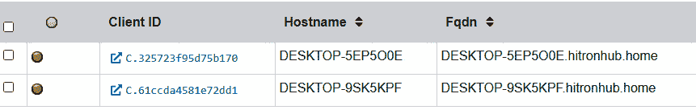

# 第七章：远程证据收集

获取内存的首选方法是通过与嫌疑系统的直接接触。这种方法使事件响应分析师能够根据工具或技术是否有效进行灵活调整。由于不依赖稳定的网络连接，这种方法也能更快速地获取所需文件。尽管这是首选方法，但可能会受到地理限制，尤其是对于大型组织来说，事件响应分析师可能需要乘飞机才能到达存放证据的地点。

在远程获取的情况下，事件响应分析师可以利用与本地获取中相同的工具。唯一的变化是，事件响应分析师需要利用远程技术访问嫌疑系统并执行捕获。和任何使用的方法一样，事件响应分析师应该确保记录任何远程技术的使用情况。这将有助于后续正确区分合法连接与可疑连接。

在本章中，我们将涵盖以下主要内容：

+   企业事件响应挑战

+   端点检测与响应

+   **迅猛龙**概述与部署

+   迅猛龙场景

# 企业事件响应挑战

上一章集中讨论了当分析师或响应人员能够物理接触系统时如何获取证据。现实情况是，这通常并非如此。基础设施迁移到像**亚马逊网络服务**（**AWS**）这样的云服务，或者远程工作队伍的普及，造成了响应人员很可能无法物理接触到设备，也无法插入 USB 设备并运行工具来获取证据。

这个挑战的加剧之处在于，需要比传统数字取证方法提供的更迅速地获取更多可操作的信息。例如，传统的数字取证方法要求分析师对受感染系统进行完整成像，捕获内存和其他证据。然后，这些数据会被传输到分析工作站，经过数小时或数天，分析师才能获取必要的数据。在一些事件可能局部发生，或需要更详细入侵分析的情况下，这种方法是必要的。然而，在其他情况下，这种分析方法在面对可能影响成百上千台系统时并不具备可扩展性。

摒弃这种*传统*的数字取证与调查模型，转而采用*实时筛查*方法。在这种方法中，从怀疑已被攻破的系统中收集数据。这里的重点是将高价值数据收集到一个中心位置，在那里可以对其进行索引和分析。数据集中后，分析人员可以利用工具和技术扩大调查范围。采用这种技术将使分析人员能够集中精力调查具有最大证据价值的系统。正是在这些系统上，分析人员可以应用数字取证的全部焦点，以便更好地理解对手及其行为。

# 端点检测与响应

勒索软件无疑是改变了事件响应方式的主要威胁之一。此类攻击的速度和广泛影响突显了需要为分析人员提供一种跨整个网络基础设施进行搜索的方法的工具。这就是**端点检测与响应**（**EDR**）工具登场的地方。

EDR 工具源于传统的基于签名的防病毒软件，这类防病毒软件在业界存在了近二十年。基于匹配哈希值和其他签名的能力，EDR 工具为安全和事件响应团队带来了亟需的分布式能力。市面上有各种商业化的 EDR 平台，每个平台都有独特的功能，但从整体来看，它们通常能够执行以下功能：

+   `regsvr32.exe`二进制文件绕过 Windows 保护机制并执行恶意代码（[`attack.mitre.org/techniques/T1218/010/`](https://attack.mitre.org/techniques/T1218/010/)）。

+   **自动响应**：EDR 平台的另一个关键功能是自动化响应操作。例如，可以设置当检测到恶意文件时，触发隔离终端的操作，以防止对手利用它进行横向移动。其他自动化操作包括禁止恶意二进制文件执行或切断特定进程的网络连接。EDR 平台的另一个重要自动化特性是通过电子邮件或即时消息通知特定人员，以便快速响应。

+   **数字取证获取和分析**：EDR 平台对事件响应分析人员的主要优势在于能够远程获取和分析数字证据。例如，EDR 平台将能够显示最近执行的二进制文件或系统中添加的其他文件。分析人员可以在整个网络范围内搜索这些指标，而不是试图在单个系统上查找这些文件。另一个优势是还能够获取被怀疑具有恶意活动的个别文件或整个取证包。这种功能显著减少了收集证据所需的时间，同时也允许规模化搜索和收集。

根据 EDR 平台的不同，组织在部署方面也具有灵活性。部署的主要方法是使用一个云管理控制台，各个端点通过代理与之通信。这种部署方式可以监视内部和基于云的系统，并为远程分析人员和事件响应人员提供灵活性。

EDR 平台的一个主要缺点是成本。这种功能并非没有成本。鉴于 EDR 平台的可见性和功能性，它们迅速成为各种规模组织的关键工具，对于事件响应人员快速获得事件意识和调查整个网络上广泛对手活动的能力至关重要。

# Velociraptor 概述和部署

除了商业平台外，还有开源工具可供事件响应团队使用，提供了至少部分 EDR 平台中的功能。其中之一是**Velociraptor**。该工具使用一个中央服务器，端点代理连接到该服务器，如*图 7.1*所示。这些端点代理，称为**客户端**，管理对远程系统上的工件的搜索。这将搜索和证据获取的负载放在端点上，减少了服务器的负载，并允许在多个远程客户端上进行并发搜索。

Velociraptor 文档

本章仅涵盖了 Velociraptor 功能的有限部分。要了解功能的完整细节，包括其他数字取证用例，请查阅 Velociraptor 文档：[`docs.velociraptor.app/`](https://docs.velociraptor.app/)。


图 7.1 – Velociraptor 设置

为了演示 Velociraptor 的一些功能，将配置一个服务器。之后，将创建一个 Windows 客户端并部署到 Windows 端点。然后，我们将看看 Velociraptor 如何用于获取端点行为数据并提取有意义的证据以供进一步调查。

## Velociraptor 服务器

Velociraptor 工具的第一部分是服务器，负责管理稍后将安装在端点的代理。有关部署的详细说明，可以在 Velociraptor GitHub 页面找到，网址是 [`github.com/Velocidex/velociraptor`](https://github.com/Velocidex/velociraptor)。此外，还提供了多种部署服务器的选项，包括使用 Windows 和 Linux 操作系统以及 Docker。在本例中，服务器应用程序将在 Ubuntu 20.04 LTS 服务器上安装。安装服务器后，按照以下步骤安装应用程序：

静态 IP

在开始之前，一个关键的考虑是给 Velociraptor 配置一个静态 IP 地址。稍后配置的代理需要这个 IP 地址，任何更改都会使代理失效。

1.  一旦 Linux 服务器配置完成，可以通过控制台或 SSH 登录服务器并安装 Velociraptor。首先，使用以下命令创建一个目录用于存放 Velociraptor 文件：

    ```
    mkdir velociraptor
    ```

1.  切换到 Velociraptor 目录：

    ```
    cd velociraptor
    ```

1.  使用 Linux `wget` 命令从 GitHub 下载 Velociraptor 包：

    ```
    wget https://github.com/Velocidex/velociraptor/releases/download/v0.6.4-  1/velociraptor-v0.6.4-1-linux-amd64 
    ```

1.  接下来，输入以下命令以允许 Velociraptor 包执行：

    ```
    chmod +x velociraptor-v0.6.4-1-linux-amd64
    ```

1.  现在 Velociraptor 已经设置为运行，下一步是创建包含设置的 YAML 配置文件：

    ```
    ./velociraptor-v0.6.4-1-linux-amd64 config generate > velociraptor.config.yaml
    ```

1.  配置文件需要编辑，以包括 GUI 的 IP 地址，并与将与服务器通信的代理进行通信。使用 VIM 或 Nano 编辑文件。这里以 Nano 为例：

    ```
    nano velociraptor.config.yaml
    ```

1.  在 `velociraptor.config.yaml` 文件中，有两个与 localhost 相关的条目。找到这些条目并将其替换为服务器的 IP 地址。接下来，有三个与 IP 地址 `127.0.0.1` 相关的条目；同样，替换为服务器的 IP 地址。

1.  将配置文件移到 `/etc` 目录中：

    ```
    sudo mv velociraptor.config.yaml /etc
    ```

1.  接下来，设置一个管理员密码以访问 Velociraptor GUI。系统提示时输入密码：

    ```
    ./velociraptor-v0.6.4-1-linux-amd64 --config /etc/velociraptor.config.yaml user add admin --role administrator
    ```

1.  要启动 Velociraptor 前端 GUI，请执行以下命令：

    ```
    ./velociraptor-v0.6.0-1-linux-amd64 --config /etc/velociraptor.config.yaml frontend -v
    ```

1.  如果安装成功，您应该能够登录到 GUI，打开以下仪表板：


图 7.2 – Velociraptor 欢迎界面

如前述步骤所示，设置 Velociraptor 非常简单。此外，服务器可以部署在内部网络或云基础设施中，例如 AWS 或 Azure。这使得事件响应分析员能够从任何与互联网连接的系统中收集数据。这也免去了维护系统的需求，因为 Velociraptor 可以根据需要部署，发生事件时可以启动，或者作为虚拟系统进行维护并根据需要启动。

现在服务器已经配置好，我们可以继续构建一个 Windows 收集器，允许分析员检查远程 Windows 系统。

## Velociraptor Windows 收集器

Velociraptor 收集器是安装在被监控端点上的代理，并与服务器连接。要配置收集器，请按照以下步骤操作：

1.  在配置客户端之前，Velociraptor 应用程序需要能够接受自签名的 SSL 证书。访问已移动到 `/etc` 目录的 `velociraptor.config.yaml` 文件：

    ```
    sudo nano /etc/velociraptor.config.yaml
    ```

1.  在第一个证书的 `nonce` 行后添加以下行：

    ```
    use_self_signed_ssl: true
    ```

参考以下截图以供参考：


图 7.3 – 配置 Velociraptor YAML 文件

1.  从 Velociraptor 服务器的命令行中，切换到 `velociraptor` 目录：

    ```
    cd velociraptor
    ```

1.  创建一个客户端配置文件：

    ```
    ./velociraptor-v0.6.4-1-linux-amd64 --config /etc/velociraptor.config.yaml config client > client.config.yaml
    ```

1.  从 GitHub 下载 Windows 可执行文件：

    ```
    wget https://github.com/Velocidex/velociraptor/releases/download/v0.6.4-1/velociraptor-v0.6.4-windows-amd64.exe
    ```

1.  以下命令将 Windows 可执行文件与配置文件结合，以便 Windows 端点能够与服务器进行通信：

    ```
    ./velociraptor-v0.6.0-1-linux-amd64 config repack --exe velociraptor-v0.6.0-1-windows-amd64.exe client.config.yaml Velociraptor_Agent.exe
    ```

1.  最后，确保在 Velociraptor 服务器上安装了 Secure Shell 服务：

    ```
    sudo apt install openssh-server -y
    ```

收集器现在已经配置完毕。要将收集器从 Velociraptor 服务器上取下，只需使用任何 SFTP 将其从系统中传输出来。然后，将其传输到您想要监控的 Windows 端点。接下来，使用 Windows 命令提示符 `Velociraptor_Agent.exe service install` 命令安装 Velociraptor 服务，如下所示：


图 7.4 – Velociraptor 代理安装

# Velociraptor 场景

Velociraptor 是一个功能丰富的平台，可用于广泛的数字取证和事件响应任务。本讨论的重点是使用 Velociraptor 访问远程系统命令行并返回数据，以及运行证据收集二进制文件。

## Velociraptor 证据收集

Velociraptor 是一个功能丰富的工具，具有广泛的能力。在本章中，重点将放在获取端点的基本信息、通过命令行进行证据采集，以及最终获取证据包以便进一步分析。这应该足以让您至少对 Velociraptor 有一些了解。在后续章节中，我们将探讨使用 Velociraptor 进行分析和威胁狩猎。

### 使用 Windows 命令行

在进行初步分诊分析时，常常被忽视的一个工具是 Windows 命令行。在这里，分析师可以检查正在运行的进程和网络连接并提取文件。Velociraptor 具备让分析师通过命令行在远程系统上运行命令和证据工具的能力：

1.  从主屏幕上，导航到**搜索客户端**框并选择下拉箭头。选择**显示所有**以查看主机：


图 7.5 – 搜索客户端

1.  这将显示 Velociraptor 正在通信的所有系统。带有绿色按钮的系统当前正在与 Velociraptor 通信。如果有红色按钮，则表示端点代理未与服务器通信，需要重新启动：



图 7.6 – 客户端列表

1.  在这个例子中，分析员想要查看主机名**DESKTOP-9SK5KPF**。单击相应的客户端 ID 将显示以下信息：


图 7.7 – 客户端信息

1.  Velociraptor 的一个有用特性是利用 Windows 命令行和 PowerShell 终端在 Velociraptor 服务器上进行初步分类和调查。要访问此功能，请导航到窗口右上角并单击**>****_Shell**按钮：


图 7.8 – 访问 Shell

1.  这将打开一个窗口，分析员可以访问命令行、PowerShell、Bash 或 VQL。在这种情况下，分析员通过输入命令并单击**Launch**来对目标系统运行`netstat`命令。这将产生以下结果：


图 7.9 – Windows netstat 命令输出

这个功能在进行系统的初步分析或分类时非常有用。检查网络连接或运行进程可能会揭示恶意软件或命令和控制的存在。这使分析员能够专注于可能具有这些指标的系统。另一种获取证据的技术是从命令行运行在上一章中讨论的工具。

## CyLR

从远程系统获取证据的一个简单方法是使用在上一章中讨论的 CyLR 工具。在这种情况下，结果可以使用 SFTP 发送到远程服务器或工作站。只需使用以下命令运行 CyLR，并输入目标服务器的用户名和密码：

```
CyLR.exe -u username -p password -s 192.168.0.15
```

一个有用的技术是将所有证据发送到一个中央服务器，多个分析员可以在那里工作。在*第十二章*中，CyLR 将与 Skadi 平台上可用的其他工具结合使用。

## WinPmem

WinPmem 可以通过本机应用程序（如远程桌面或 PsExec）部署到远程系统上。一旦安装在远程系统上，WinPmem 的输出可以通过 NetCat 传输到另一个系统。例如，假设事件响应分析员正在使用位于`192.168.0.56`的系统。如果分析员能够通过 PSExec 或 RDS 访问受损主机，他们可以通过以下命令建立 NetCat 连接回到自己的机器：

```
 C:/winpmem-2.1.exe - | nc 192.168.0.56 4455
```

前面的命令告诉系统执行捕获并通过 NetCat 将输出发送到端口`4455`上的事件响应分析师工作站。这种技术的缺点是需要访问命令提示符，以及安装 NetCat 和 WinPmem。如果事件响应分析师正在处理被怀疑被入侵的系统，这可能不是最佳选择。

### 虚拟文件系统

Velociraptor 的另一个关键功能是**虚拟文件系统**（**VFS**）。这使分析师能够检查远程系统上的文件结构。这对于分析师知道他们想要收集与警报或事件相关的特定文件或文件的情况非常有用。在以下示例中，分析师已被警告远程系统上存在可疑的 DLL 文件，并被要求收集该文件进行分析：

1.  从与前一个示例相同的窗口中，点击**VFS**按钮：


图 7.10 – 访问 VFS

1.  根据连接情况，这可能需要几分钟来加载。加载完成后，点击**ntfs**部分，如图所示：


图 7.11 – VFS

1.  在浏览文件系统时，如果出现**无可用数据**的错误消息，请点击文件夹图标，这将刷新目录：


图 7.12 – 刷新按钮

除了刷新目录外，从左到右的额外图标将递归刷新目录，递归下载目录，或查看收集的工件。

1.  导航到`C:\Program Files\Common Files\System`目录显示了一些 DLL 文件。其中一个引人注目的是`bghe21.dll`文件，其修改日期和时间为**2022-05-04**，时间为**09:44:20 UTC**。这引人注目，因为其他 DLL 文件似乎早在之前就被修改过了：


图 7.13 – 可疑 DLL

1.  点击**从客户端收集**按钮将从系统下载可疑的 DLL 文件进行分析：


图 7.14 – 收集文件

VFS 对于那些分析师有一些数据指向特定文件或目录以搜索证据的事件和事故非常有用。这一功能显著减少了获取特定文件所需的时间。然而，在某些情况下，分析师需要从远程系统获取证据包。在这种情况下，可以利用 Velociraptor 获取与事件调查相关的一系列文件和其他数据。

### Velociraptor 证据收集

本章最后一个要讨论的功能是从远程系统收集证据以进行分析。此功能使分析师能够远程收集数据，而无需使用**穿透网**方法，具有显著的优势。在这种情况下，将使用 Velociraptor 从远程系统收集 KAPE 证据：

1.  从头开始，要从系统收集证据，请点击可疑系统对应的客户端 ID – 在本例中是**DESKTOP-9SK5KPF**：


图 7.15 – 客户端列表

1.  在左侧窗格中，点击底部的倒计时图标：


图 7.16 – 集合图标

1.  在新窗口中，点击导航栏左上角的**新建集合**加号：


图 7.17 – 开始新的集合

1.  这将打开**新建集合：选择要收集的工件**窗口。可以收集的证据项和集合范围广泛。在本例中，分析师希望收集 KAPE 的**目标**工件。导航到**Windows.KapeFiles.Targets**，如下所示：


图 7.18 – 选择工件

1.  点击工件时，右侧窗格将弹出以下对话框。此信息详细说明了可以设置的参数。这与之前关于 KAPE 讨论的集合类型相匹配：


图 7.19 – KAPE 目标详细信息

1.  在屏幕底部，点击**配置参数**：


图 7.20 – 集合参数

1.  在**新建集合：配置参数**窗口中，点击**Windows.KapeFiles.Target**。这将打开*图 7.21*中的窗口。此窗口允许分析师选择上一章讨论的特定 KAPE 目标。在这种情况下，通过点击**_BasicCollection**旁边的复选框来执行基本集合：


图 7.21 – 集合参数详细信息

1.  审核**指定资源**窗口。在这种情况下，可以保留默认设置，但这允许分析师配置代理如何利用资源。点击**审核**按钮以审核集合请求：


图 7.22 – 集合请求审核

1.  点击**启动**按钮。在集合运行时，窗口中会出现一个沙漏图标，并显示唯一的 Flow ID：


图 7.23 – 集合请求进度

1.  集合完成后，可以通过点击结果窗格中的文件柜图标下载文件。这样可以使下载项如图所示：


图 7.24 – KAPE 目标准备好下载

1.  然后，可以使用 KAPE 或其他后续讨论的工具在分析师的工作站上检查文件：


图 7.25 – 获取的证据

到此为止，我们已完成本章内容。

数字取证获取的一个重大挑战是如何将其扩展到远程系统，并能够快速分析数据。即使面对这一挑战，事件响应分析师仍然可以利用像 Velociraptor 这样的工具，既可以作为独立的解决方案，也可以与他们已有的工具集成。通过这种组合，他们能够迅速集中精力分析那些具有最大证据价值的系统。这为决策者提供了对对手行为性质的理解，并能在不必等待全面分析的情况下采取相应措施，而如今的 IT 操作由于其远程性质，往往使得全面分析受到极大限制。

# 总结

在本章中，我们探讨了端点检测与响应工具如何为分析师提供大规模开展调查的能力。在此基础上，我们考察了开源工具 Velociraptor，介绍了其设置与配置、代理部署，以及 Velociraptor 在多个场景中如何协助收集证据并进行事件相关分析。请记住这些场景，特别是在我们讨论《第十七章》中的勒索软件调查时。

在下一章，我们将探讨如何正确地为后续分析制作系统存储的镜像。

# 问题

回答以下问题，以测试你对本章内容的掌握情况：

1.  在一次事件调查中，可能不需要在进行分析之前获得完整的磁盘或内存镜像。

    1.  正确

    1.  错误

1.  以下哪项不是 EDR 平台的优势？

    1.  成本

    1.  调查的可扩展性

    1.  事件警报

    1.  集中管理

1.  Velociraptor 的一个优势是，所有处理都在 Velociraptor 服务器上完成。

    1.  正确

    1.  错误
