# 第八章：法医成像

事件响应分析师通常必须执行的一个关键任务是成像数字证据。正如我们在前几章中讨论的那样，与事件相关的大量证据可以在日志文件、内存和其他区域中找到，并且可以相对迅速地获取。在某些事件中，如内部恶意活动（例如欺诈、工业间谍活动或数据泄漏），可能需要更详细的证据搜索。这些证据包括主文件表条目、文件以及包含在嫌疑系统硬盘上的特定用户数据。如果事件响应分析师遇到这种情况，他们将需要获取嫌疑驱动器的图像。与数字取证的任何方面一样，获得一个可用且可供法庭辩护的图像，依赖于使用适当的工具、技术和文档。

本章将探讨数字成像的基本概念，以及获取物理驱动器或其他逻辑卷的法医影像所需的准备工作和工具。更具体地，我们将涵盖以下主题：

+   理解法医成像

+   成像工具

+   准备暂存驱动器

+   使用写保护器

+   成像技术

虽然本章介绍了一些非常技术性和过程驱动的内容，但响应人员必须理解成像过程。这个过程对于生成能够用于**根本原因分析**（**RCA**）和潜在法庭使用的图像至关重要。

# 理解法医成像

成像存储驱动器是一个注重细节的过程。本节为法医成像提供了坚实的基础，介绍了如何完成成像、各种数字成像过程以及各种专有文件格式。

对法医成像各个方面有透彻理解，对于事件响应分析师来说至关重要。了解涉及的工具、技术和程序可以确保证据得到妥善处理，并且分析师对其所获取的证据充满信心。此外，了解必要的术语使分析师能够准确地准备报告，并在需要时就其发现提供证词。

## 图像与复制

首先应理解的一个概念是法医成像与复制之间的区别。从嫌疑人硬盘或其他介质中复制文件，只能为分析师提供与该文件相关的实际数据。另一方面，成像允许分析师捕捉整个驱动器的数据。这包括如空闲空间、未分配空间以及可能访问已删除文件的区域。成像还会保留卷上的元数据，包括文件时间戳。如果进行时间线分析以确定特定文件何时被访问或删除，这一点至关重要。

经常会将*克隆*和*影像*这两个术语互换使用。这在 IT 领域中是一个常见的术语误用。在克隆一个驱动器时，会制作一个一对一的驱动器副本。这意味着该驱动器可以插入系统并启动。克隆驱动器通常是为了对关键驱动器进行完全备份而进行的。虽然克隆的驱动器包含所有必要的文件，但在使用取证工具时它比较笨重。因此，会制作一个影像文件。驱动器的影像包含所有必要的文件；其配置允许在使用取证工具时进行详细的检查。

## 逻辑卷与物理卷

需要理解的第二个概念是可以被影像化的卷类型。卷可以分为物理卷和逻辑卷。物理卷可以被认为包含整个硬盘。这包括任何分区以及`D:`驱动器。当影像化一个逻辑卷时，分析员只会捕获`D:`驱动器中的数据。

以下图表说明了在影像化物理卷或逻辑卷时所捕获的数据：

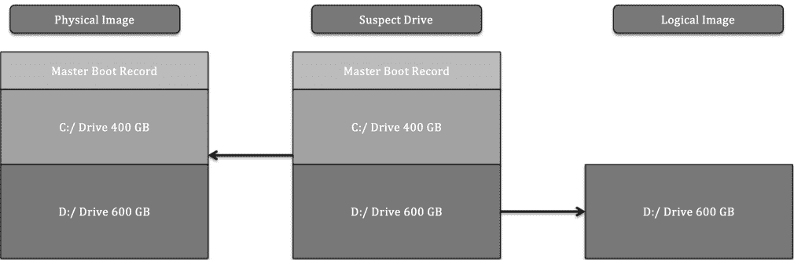

图 8.1 – 物理卷与逻辑卷

正在调查的事件类型在很大程度上决定了所进行的影像类型。例如，如果分析员能够识别出从`D:`驱动器执行的潜在恶意文件，并且仅打算捕获该数据，那么获取该卷的逻辑影像可能会更快。此外，在使用**全盘加密**（**FDE**）的情况下，可能需要进行逻辑获取。没有加密密钥的情况下，在系统运行时进行文件的逻辑获取通常是唯一可用的选项。

逻辑影像的一个关键缺点是，它不会捕获未分配的数据或不是文件系统一部分的数据。已删除的文件和其他痕迹证据不会成为逻辑影像的一部分。在怀疑如员工不当行为等活动的情况下，分析员需要尽可能追踪所有活动，因此将对物理卷进行完整影像。时间不是一个必要因素。

在*第五章*中，我们讨论了从正在运行或开机的系统中获取证据，例如日志文件和内存。以类似的方式，事件响应分析员能够从运行中的系统获取逻辑卷。这个技术被称为实时影像。如果一个潜在被入侵的系统无法下线——比如在**高可用性**（**HA**）的生产服务器中——而潜在证据位于逻辑卷中，那么实时影像可能是最好的选择。

死机影像是对已经断电并移除硬盘的系统进行的影像。在这种影像类型中，分析师可以捕获整个磁盘，包括所有卷和 MBR。这在分析师希望确保捕获源证据的完整性时变得必要，确保没有任何未被检查的区域。

## 图像文件的类型

取证影像的另一个方面是分析师需要了解的图像文件类型，这些文件可以在调查过程中创建并被利用。图像文件有多种类型，其中一些非常专业，但本书的目的在于重点讨论分析师在事件处理中最常创建和使用的三种最常见的证据文件类型：

+   `.raw`、`.img` 和 `.dd` 扩展名。一些软件，如 Linux 中的 `dd` 命令，在速度和与取证工具的兼容性可能成为问题时提供了灵活的选项。

+   **高级取证文件格式**（**AFF4**）：AFF4 是一种开源图像文件格式。该格式首次在 2009 年提出，用于支持多个工具，如 **Google 快速响应**（**GRR**）。

+   **EnCase 证据文件**：EnCase 证据文件，或 E01 或 EX01 文件，是 OpenText 于 1998 年作为其 EnCase 取证工具的一部分开发的专有文件格式。该格式基于 **专家证人格式**（**EWF**），该格式在 ASR Data 的专家证人压缩格式中被发现。E01 文件包含有关影像的元数据。存储在头部和尾部的元数据记录并保存有关驱动类型、操作系统和时间戳的信息。E01 文件的另一个关键特性是包含 **循环冗余校验**（**CRC**）。该 CRC 是在每写入 64 KB 数据到影像文件后进行的文件完整性验证。CRC 确保了整个影像文件中前一个数据块的完整性。最后，E01 文件在文件尾部包含一个 **信息摘要算法 5**（**MD5**）哈希。下图展示了在影像处理过程中，E01 文件的哪些组件会被创建：

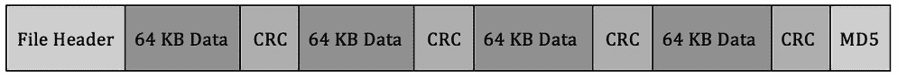

图 8.2 – E01 文件格式

## SSD 与 HDD

事件响应分析师需要理解的另一个关键影像概念是如何对特定存储介质进行影像——特别是理解 **硬盘驱动器**（**HDD**）与 **固态硬盘**（**SSD**）之间的区别。随着 SSD 在笔记本电脑和台式机等终端设备中变得越来越普遍，理解这一差异变得至关重要。

两者之间的主要区别在于信息存储的最细节部分。传统的旋转硬盘（HDD）通过改变实际旋转磁盘上的磁极来存储信息。因此，数字取证和事件响应分析师在处理证据时需要了解磁场，以及为什么掉落 HDD 往往会对磁盘造成致命损害。

硬盘驱动器（HDD）中一个让数字取证检查员感兴趣的方面是数据的处理方式。数据写入磁盘后会停留在分配给该数据的扇区中。当用户删除一个文件时，数据并不会被移除。数据可能会被完全或部分覆盖，使用适当的镜像工具，这些数据可以被定位并重建进行分析。

由于硬盘驱动器（HDD）的工作原理以及数据重建的可能性，创建物理磁盘镜像是一个很好的实践。这包括通过切断电源而非通过操作系统关闭系统来关闭设备。这可以保留分析人员访问硬盘时的状态。在无法做到这一点的情况下，可以从正在运行且已开机的系统中获取逻辑镜像。

另一方面，SSD 通过存储在单元中的电子状态来保存信息。这种数据存储方式使用命令`fsutil behavior query disabledeletenotify`，如果操作系统使用的是 SSD，Windows 命令提示符会返回以下输出：

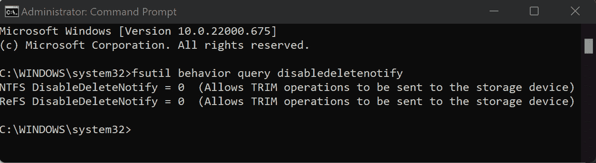

图 8.3 – 启用 TRIM 操作

固态硬盘（SSD）芯片组的另一个让数字取证和事件响应分析师关心的特点是“磨损均衡”。SSD 中的电子有有限的生命周期，不能持续不断地开关。如果操作系统只使用硬盘的前 100GB，它可能会损坏这一部分，导致硬盘无法使用。为了防止这种情况，SSD 采用磨损均衡技术，将数据不断地移动到硬盘的不同位置，从而减少使硬盘无法使用的可能性。

这两个特性意味着传统的写保护器无法确保在镜像过程中不对硬盘做出任何更改，因为 PCB 管理着数据的写入和在 SSD 上的均衡方式。虽然可以进行镜像，但分析人员无法确保在过程中没有对硬盘进行更改。为了限制这些更改，分析人员应在找到硬盘时就开始镜像。如果系统已经关闭，应移除硬盘并进行镜像。如果系统仍在运行，必须进行实时镜像。

# 镜像工具

正如我们之前讨论的内容一样，响应人员有多个工具可用于镜像硬盘。了解这些工具能帮助响应人员知道在事件中应用哪个工具。

虽然没有法院或法律机构认证数字取证成像工具，但有几种方法和相关工具代表了获取磁盘证据时的最佳实践。让我们现在来看看这些方法：

+   **FTK Imager**：FTK Imager 是由 Access Data 提供的免费软件应用程序。这个基于 GUI 的应用程序允许法医学上可靠地获取逻辑和物理卷、内存以及其他受保护的文件，并以各种格式输出这些镜像。此外，FTK Imager Lite 是一个自包含的应用程序，可以在可移动介质上运行，用于从运行中的系统中获取数字证据（稍后将在本章中详细介绍）。

+   **EnCase Imager**：由 Guidance Software 提供，EnCase Imager 是另一个取证应用程序，允许响应者从各种系统中获取数字证据。与 FTK Imager 一样，EnCase Imager 也可以在外部驱动器上运行，以便获取运行中的系统。

+   **AFF4 Imager**：AFF4 Imager 是一个命令行可执行文件，是 WinPmem 等工具的基础。AFF4 Imager 可以用于获取逻辑和物理磁盘，如 EnCase 或 FTK Imager。AFF4 Imager 的一个优点是，它可以根据创建时间提取文件，拆分卷，并通过压缩减少成像时间。

+   使用基于 Linux 的取证平台进行证据获取时的`dd`命令。

+   **虚拟化工具**：随着虚拟化的广泛采用，响应者很可能需要从虚拟系统中获取至少一部分证据。然而，这也有一个优点：整个系统可以转储以供分析。根据虚拟化软件的不同，可以通过暂停系统并转储包含系统的整个目录来实现证据获取。这也可以通过许多虚拟化软件平台的快照功能来完成。

你决定使用的成像工具将取决于组织、你的培训和经验以及使用的其他取证工具。例如，如果一个组织使用**Forensic Toolkit**（**FTK**）进行分析，可能最好将 FTK Imager 作为过程的一部分使用。使用任何成像工具时，确保工具正常工作，并且响应者已经充分培训如何使用该工具是一个好习惯。

一旦选择了成像工具，下一步是确保其他硬件已准备好。这包括确保存储介质的目标位置已正确准备。

# 准备暂存驱动器

与学习如何处理证据驱动器一样，拥有一个法医学上可靠的暂存驱动器，将证据成像到此驱动器上同样至关重要。响应者将学习如何准备这个设备。

除了具备进行取证影像所需的硬件和软件外，至关重要的是提前准备一个存储影像或证据文件的位置。对于事件响应团队来说，最适合作为证据存储库的是外部 USB 或 FireWire 硬盘驱动器。这使得具备一定的便携性，因为事件响应人员可能需要在场外或多个地点进行事件调查，而没有取证实验室的帮助。

在使用证据驱动器之前，需要执行两项任务。第一项任务是确保存储库没有任何数据。事件响应团队应有一个政策和程序，要求在每次使用之前擦除证据驱动器。这包括全新的驱动器，因为一些制造商出厂时会在驱动器上附带备份软件或其他数据，这些数据需要在使用之前移除。

擦除还进一步确保先前使用过的驱动器不包含其他事件的任何痕迹数据。这确保了在经过正确擦除的驱动器上收集到的证据不会与不相关的数据混淆。

这可以通过擦除程序轻松完成。有几个程序，无论是免费还是商业的，都可以用于此。例如，Heidi Computers 的 Eraser 程序是一个免费的擦除工具，可以用于文件和磁盘分区的擦除（Eraser 可以从 [`eraser.heidi.ie/`](https://eraser.heidi.ie/) 下载）。

在以下示例中，将擦除一个 2 TB 的外部硬盘驱动器，并将其准备好作为证据驱动器使用。以下过程应该在每次将驱动器置于可以用于事件调查的状态时重复：

1.  启动 Eraser 应用程序。在图形用户界面中，点击**擦除计划**，然后选择**新任务**。然后您应该会看到如下窗口：

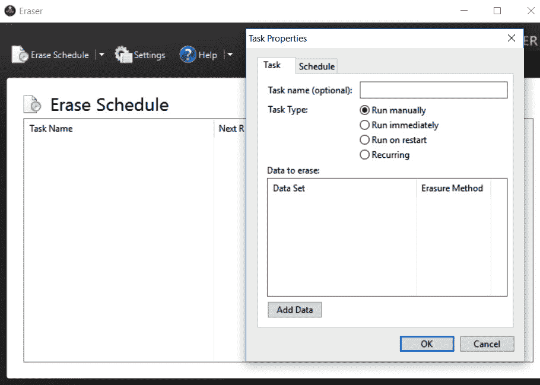

图 8.4 – 设置 Eraser 任务

1.  现在，可以分配任务名称。这在您希望正确记录证据驱动器擦除时非常有帮助。点击**添加数据**按钮。这将打开另一个窗口：

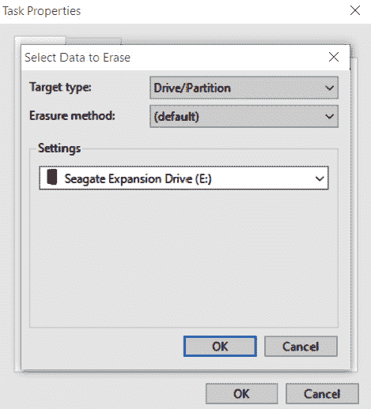

图 8.5 – Eraser 驱动器选择

1.  对于**目标类型**，选择**驱动器/分区**。在**设置**区域，将出现一个包含分区和驱动器字母的下拉列表。请特别注意分配给不同驱动器的驱动器字母，并确保选择需要擦除的外部驱动器。在此案例中，使用的是一款新的 Seagate 外部硬盘驱动器。最后，选择擦除方法。有几种不同的擦除驱动器选项。在这种情况下，选择了**美国国防部 5220.22-M (8-306./E) (3 Pass)**擦除选项：

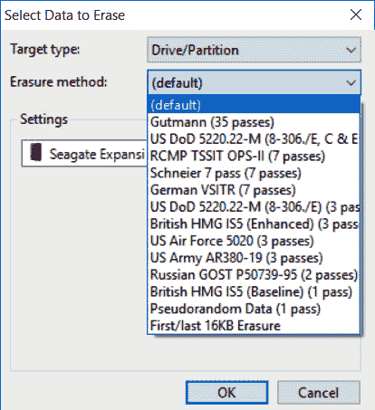

图 8.6 – 擦除方法选择

1.  点击**确定**。现在，擦除任务将在**擦除** **计划**部分列出：

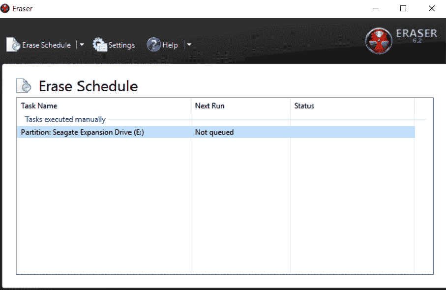

图 8.7 – 擦除计划

1.  右键点击**分区：Seagate 扩展驱动器 (E:)**任务并点击**立即运行**。这将启动擦除过程。如前所述，请确保擦除的是正确的证据驱动器。

根据驱动器的大小和执行擦除操作的系统，整个过程可能需要数小时甚至几天。完成后，事件响应分析师应捕捉任何验证证据驱动器已正确擦除的信息。这些信息在书面法医分析报告中至关重要，因为它证明事件响应分析师采取了适当措施，确保所有证据文件未被破坏或与其他文件混淆。

建议事件响应分析师准备多个驱动器，并在任何事件发生之前将这些驱动器预先擦除。这将使事件响应分析师能够立即使用已擦除的驱动器，而无需现场擦除驱动器，这样可以节省本应用于事件相关活动的时间。

另一项可以采取的准备步骤是加密证据驱动器。可以使用如 VeraCrypt 或其他磁盘加密平台加密包含证据文件的证据驱动器分区。处理敏感信息（如信用卡或医疗记录）的事件响应分析师应加密证据驱动器，无论证据是否需要离开设施。

有两种方法可以加密证据驱动器。第一种方法是使用法医工作站上的加密软件进行加密，这些工作站在成像过程中使用。这种方法仅限于对已从系统中移除并在安装了加密软件的专用系统上成像的驱动器进行成像。第二种方法是将加密软件安装在证据驱动器上。在前一节中，证据驱动器被划分为两个分区，一个分区留作证据文件，另一个分区用于存储工具，例如用于转储内存文件或成像的工具。在这种情况下，加密软件可以加载到工具分区，并且在证据成像过程中对驱动器进行加密。这可以限制对待调查系统进行的更改数量。

一旦驱动器准备就绪，就需要另一层保护，确保在成像过程中不会对嫌疑系统进行任何更改。为确保没有更改发生，响应人员应该熟悉并知道如何使用写保护器。

# 使用写保护器

写保护器是关键组件，确保在成像过程中证据不被篡改。在本节中，响应人员将接触到物理和软件写保护器。

数字取证的一个关键原则是确保在处理和检查数字证据时不对其进行任何更改。任何变化，无论多么微小，都有可能使整个检查过程受到质疑。如果响应人员无法清楚阐明如何确保证据在检查过程中未被污染，则证据很可能会被排除在法律程序之外。因此，理解写保护器如何保持数字证据的完整性至关重要。

写保护器有两种类型。第一种是软件写保护器。这种软件位于操作系统和证据之间。它们通常是任何在检查阶段使用的数字取证工具的一部分。它们确保对证据文件仅具有只读访问权限，并且在检查过程中不会对证据进行任何更改。例如，本章将深入探讨的 FTK Imager 工具，确保数字证据的采集不会对磁盘进行任何写入。

另一种写保护器是物理或硬件写保护器。顾名思义，这是一种物理硬件，位于证据驱动器和执行采集的系统之间。数据可以从证据磁盘传输到分析系统，但不能反向传输。使用该设备可以清楚地表明，在采集阶段没有修改证据。

使用哪种类型的写保护器主要取决于正在进行的采集类型。理想情况下，响应人员应选择能够清晰证明他们采取了一切合理预防措施，确保证据未被篡改的工具和技术。这样做能显著降低证据被排除在任何法律程序之外的风险，同时也使响应人员能够在做出根本原因判定时依赖该证据。

在适当配置好驱动器和写保护器后，响应人员现在可以继续进行证据驱动器的镜像操作。

# 镜像技术

本节是本章的主要部分，我们将重点介绍响应人员在需要对证据驱动器进行镜像时可用的技术。

一旦为镜像文件配置了适当的存储库，事件响应分析师就可以准备获取所需的证据。响应人员可能会遇到已经开机或已关闭的可疑系统。根据他们发现可疑系统的状态，必须使用以下技术之一。在任何事件中，无论使用哪种技术，事件响应人员都应准备好妥善记录他们的操作，以便后续的取证报告。

## 死亡镜像

死机成像是对未通电的媒体进行的，对于硬盘来说，就是将其从可能被破坏的系统中移除。在证据准备方面，这种方法是最全面的，因为它允许完整保留和分析物理卷。有多种方法和工具可以用来进行适当的成像，既有商业软件也有免费软件。除了软件，事件响应分析员通常还会使用硬件写保护器。这些设备确保对嫌疑媒体不会进行任何更改。正如我们在*第一章*中讨论的那样，能够向法庭证明没有对原始证据进行任何更改是至关重要的。

以这种方式成像硬盘或其他数字媒体的一个优点是，该过程可以预定义并可重复。拥有一个已预定义的过程，并将其正式纳入事件响应计划和程序本身，确保证据以法医学上可靠的方式处理。

一个在死机成像中非常有用的工具是 FTK Imager。这个工具由 Access Data 提供，是一个法医学上可靠的磁盘映像获取平台。

### 使用 FTK Imager 进行成像

以下过程使用硬盘和 FTK Imager 生成一个法医学上可靠的映像供分析。匆忙或偏离这些步骤可能会导致响应者无法依赖证据的完整性，从而使潜在的证据变得不可靠：

1.  第一步是对证据进行实物检查。应该检查两个主要焦点。第一个是链条证据表。每次你接管证据时，应该能访问该表，确保所有步骤都已正确记录，并用你的信息完成条目。

1.  然后，你需要检查证据包装，以确保没有封印被破坏。记录这一点的一个快速方法是拍摄证据在原包装中的照片：

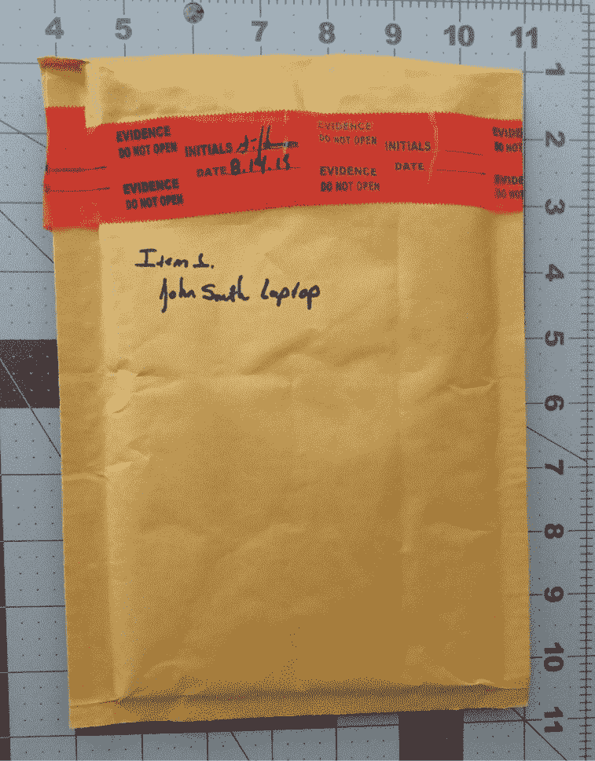

图 8.8 – 包装完整性检查

1.  在前面的照片中，我们捕捉了所有与该证据相关的信息，并表明在成像之前，证据的完整性得到了保持。在封印被破坏后，你需要拍摄包装内容的照片：

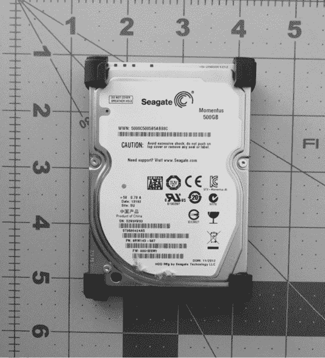

图 8.9 – 示例磁盘照片

1.  一旦拍摄了证据的照片，您应确保它与链条证据表格一致。在事件处理中可能会发生错误，这是确保尽早纠正链条证据错误的一种方式。通过确认链条证据，任何混乱都可以得到纠正。下一步是配置物理写保护器。在这种情况下，使用 Tableau TK35u USB 3.0 Forensic IDE/SATA 桥接套件作为物理写保护器。嫌疑驱动器通过附带的 SATA 驱动器适配器连接，并通过 FireWire 与成像笔记本连接。使用物理写保护器时，确保设备显示正常工作，如下所示：

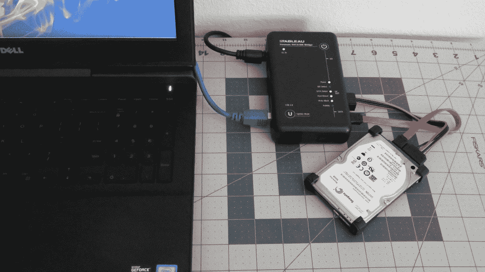

图 8.10 – 物理写保护器设置

在安装物理写保护器后，嫌疑驱动器现在可以进行镜像。在这个示例中，将使用 FTK Imager 免费应用程序。FTK Imager 需要管理员权限才能运行。打开可执行文件后，将显示以下界面：

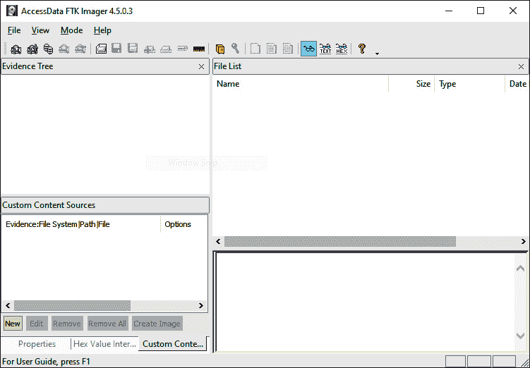

图 8.11 – FTK Imager 主菜单

1.  点击**文件**，然后选择**创建磁盘镜像**。这将打开一个窗口，您可以在其中选择媒体源。在这种情况下，选择**物理驱动器**，以便将整个驱动器（包括 MBR）捕获用于进一步分析。然后，点击**下一步**：

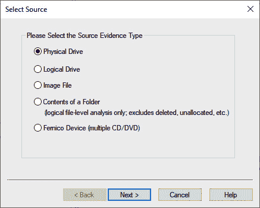

图 8.12 – FTK Imager 源选择

1.  下一窗口允许分析员选择要进行镜像的驱动器。事件响应分析员应密切注意，确保正在镜像正确的设备，因为所有操作系统可见的设备都会列出。在这里，您需要注意驱动器的存储空间，以区分嫌疑驱动器和镜像驱动器。在这种情况下，列出了四个独立的驱动器。两个是成像笔记本内的驱动器。另一个驱动器是目标驱动器。在这种情况下，第三个驱动器，标记为`\\.\PHYSICALDRIVE2`，是正确的嫌疑驱动器。高亮显示该驱动器并点击**完成**：

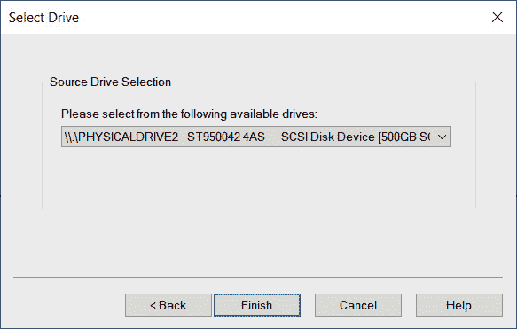

图 8.13 – 嫌疑驱动器选择

1.  一旦选择了嫌疑驱动器，设置目标驱动器。点击**添加…**：

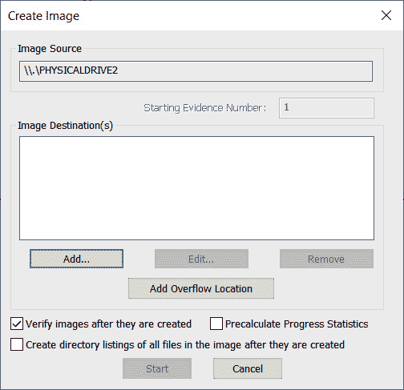

图 8.14 – FTK Imager 创建图像窗口

1.  此时，选择您要创建的图像文件类型。提供四个选项。在这种情况下，需要选择**E01**。点击**下一步 >**：

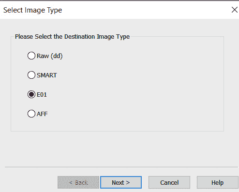

图 8.15 – FTK Imager 选择图像类型窗口

1.  在下一个窗口中，输入与映像相关的具体信息。我们将在*第十三章*讨论报告。目前，分析员应该尽可能详细地填写这些字段，因为这些信息将包含在法医报告中。填写完字段后，点击**下一步 >**：

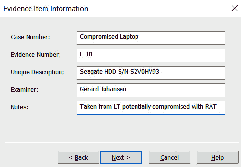

图 8.16 – FTK Imager 证据项信息窗口

1.  在下一个窗口中，验证映像目标和文件名是否正确。除此之外，您还可以设置映像的碎片化大小和压缩。碎片化大小可以设置为`0`，因为整个磁盘映像将包含在一个文件中。现在，默认设置将被使用，因为挂载一个碎片化的磁盘映像不是问题。验证输入的信息无误后，点击**完成**：

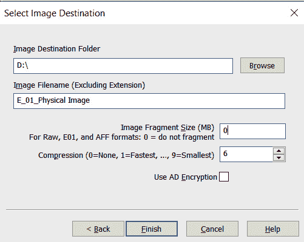

图 8.17 – FTK Imager 选择映像目标窗口

1.  现在，**创建映像**窗口将打开。这是最后阶段，分析员可以在此取消映像文件的创建。此外，根据使用场景，分析员应启用两个选项。第一个是 FTK Imager 在创建映像后验证映像。在此功能下，FTK Imager 将验证映像文件未被修改，并且是完整且无错误的。第二个是 FTK Imager 可以创建映像中所有文件的列表。如果特定文件具有证据价值，这对分析员来说可能非常有用。分析员将能够确定该文件是否存在于该系统中。如果需要检查多个驱动器，这可以节省时间。验证所有设置无误后，点击**开始**：

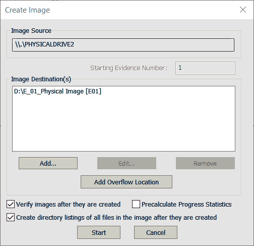

图 8.18 – FTK Imager 创建映像窗口

1.  FTK Imager 接下来将开始映像驱动器的过程。根据被映像驱动器的大小、映像系统的可用处理速度以及与映像系统的连接类型（如 FireWire、USB 等），此过程可能需要数小时甚至数天。在此过程中，将会出现以下窗口：

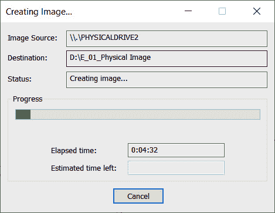

图 8.19 – FTK Imager 创建映像窗口

1.  一旦 FTK Imager 完成成像过程，一个窗口将会弹出。在此窗口中，FTK Imager 会向事件响应分析员提供详细信息。分析员应关注的是，已为硬盘和镜像计算的哈希值。在此案例中，MD5 和 **安全哈希算法 1**（**SHA1**）哈希值匹配，表明成像过程正确地捕获了硬盘，并且从嫌疑硬盘提取的证据没有发生任何更改。将这些信息作为取证报告的一部分记录下来是一个良好的做法：

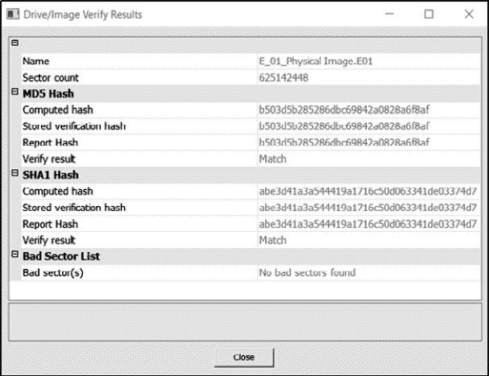

图 8.20 – FTK Imager 结果验证

1.  导航到证据驱动器。在这里，可以找到整个镜像文件。根据 FTK 配置的碎片大小，可能会有多个文件或一个单一的证据文件。除了证据文件外，FTK Imager 还提供了硬盘上所有文件的完整列表。

1.  最后，FTK Imager 会提供一个文本文件，详细说明成像过程中的信息。这些信息应被捕获并随后续的取证报告一起提供。此时，成像过程已经完成，证据驱动器需要返回安全存储。

死机成像提供了最为取证可靠的采集方式；然而，在某些情况下，响应人员可能需要对开机的系统进行成像。这就需要响应人员对嫌疑系统执行实时成像。

## 实时成像

在实时成像中，系统正在运行，分析员使用 USB 存储驱动器来存放成像程序和存储区域。一种简单的技术是将安装在成像工作站上的 FTK Imager 目录复制到 USB 上，并从那里执行目标系统的操作。但在此之前，分析员应对系统进行一些检查。

Exterro FTK Imager 指导

FTK Imager 可以轻松配置为从 USB 设备运行。建议分析员至少准备一两个这样的设备。有关如何配置 USB 设备的详细信息，请参考 Exterro 网站：[`exterro.freshdesk.com/support/solutions/articles/69000765662-run-ftk-imager-from-a-flash-drive-imager-lite`](https://exterro.freshdesk.com/support/solutions/articles/69000765662-run-ftk-imager-from-a-flash-drive-imager-lite)。

### 成像前检查

十多年前，微软 BitLocker 被引入，成为 Windows 操作系统的本地全盘加密（FDE）解决方案。除了 BitLocker，还有许多 FDE 产品。这些解决方案使得事件响应分析员难以对系统进行分析。一个方便的工具，可以帮助判断系统是否启用了 BitLocker，那就是 Magnet Forensics 的加密磁盘检测工具，工具可通过以下网址获取：[`www.magnetforensics.com/resources/encrypted-disk-detector/`](https://www.magnetforensics.com/resources/encrypted-disk-detector/)。

只需下载工具并通过命令行运行。例如，以下截图显示目标系统正在运行 BitLocker：

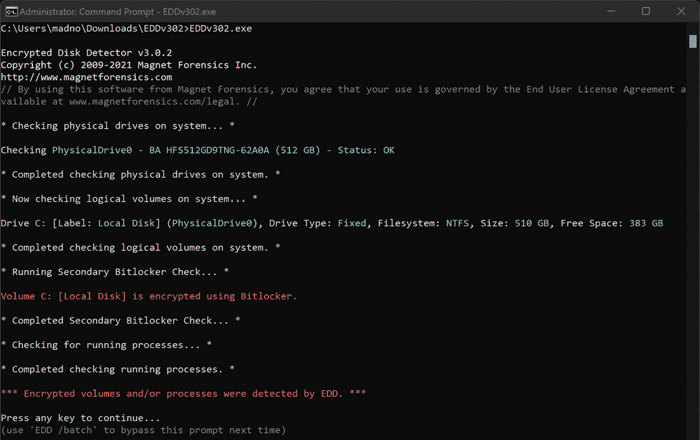

图 8.21 – 加密磁盘检测器

还应进行的一项额外检查是确定系统是使用 HDD 还是 SSD，并检查是否启用了 TRIM。请参阅前一节关于 SSD 的内容，获取可以运行的具体命令。

## 虚拟系统

事件响应者在调查过程中通常会遇到虚拟服务器甚至工作站。通过简单地将暂停的**虚拟机**（**VM**）导出到可移动驱动器，可以获取虚拟化系统。在其他情况下，响应者可以利用虚拟系统的快照功能。这会创建一个独立的文件，可以在拍摄快照的日期和时间进行分析。在这两种情况下，响应者应确保驱动器已正确清理，并且适当的文档已经处理。

要获取虚拟机，只需暂停系统，然后将整个目录移至外部介质。（在某些情况下，甚至可以远程完成此操作。）在 Windows 虚拟平台（如 VMware）中，多个文件构成虚拟映像：

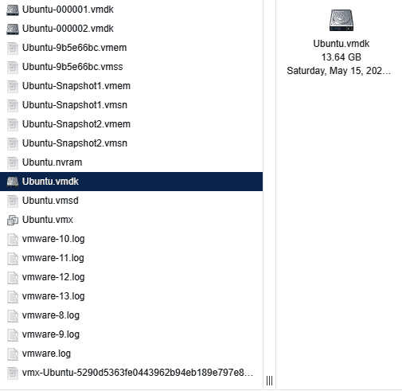

图 8.22 – ESXi 虚拟机文件

让我们来看一下其中的一些文件：

+   `.vmdk`：这是虚拟磁盘映像文件。这是虚拟操作系统和文件所在的逻辑卷。获取这些文件就像是在物理系统上获取`C:`驱动器的镜像一样。

+   `.vmem`：`.vmem`文件是虚拟内存文件。它是虚拟 RAM 或物理内存的存储区域。此文件可以导出，并与其他文件结合进行分析，方法将在*第十章*中讨论。

+   `.vmss`：VMware 暂停状态文件保存暂停虚拟机的运行配置。这包括进程和网络连接数据。该文件与`.vmem`文件结合提供系统内存。

+   `.vmsn`：这是虚拟快照状态文件。此文件包含拍摄快照时系统的状态。

事件响应者可以通过多种方式使用这些文件。首先，`.vmdk`文件可以像图像文件一样挂载在各种数字取证软件平台中。这些将在*第九章*中讨论。其次，`.vmsn`文件可以通过简单地复制文件并处理副本来重建系统。之后，响应者可以查看系统的行为或提取证据，而不影响原始的`.vmsn`文件。

最后，通过 `.vmem` 和 `.vmss` 文件捕获的运行内存可以以类似分析其他内存捕获数据的方式进行分析。为了获取正确的取证数据，必须将这两个文件合并。这可以通过使用 `vmss2core.exe` 工具来完成，该工具作为 VMware 工具套件的一部分。合并这些文件时，需要使用以下命令语法：

```
C:\VirtualTools\vmss2core.exe -W "InfectedServer.vmss" "InfectedServer.vmem"
```

上述命令将生成一个内存转储文件，存放在包含这两个文件的目录中。

尽管虚拟化在大型企业中非常常见，但它不应构成一个重大挑战。从某种意义上来说，能够简单地暂停系统并提取所有必要的文件，使得提取必要证据的速度更快。

到目前为止，重点一直在 Windows 工具上进行影像处理。事件响应人员的另一种选择是使用 Linux 影像工具。有多种工具提供写保护和影像处理功能，且许多工具是开源的。

## Linux 影像

*第三章*概述了可供事件响应分析师使用的各种取证工具。这些工具中有些包括可以在事件处理中使用的 Linux 发行版，执行各种数字取证任务。以下示例将演示如何部署带有取证应用程序的 Linux 发行版，以捕获潜在被攻破计算机的取证影像。

使用 Linux 发行版和可启动 USB 设备的组合是一种可以用来对潜在被攻破系统进行取证影像的选项。事件响应分析师可能会遇到多个系统需要被取证影像的情况，而分析师只有一个写保护器。如果分析师必须按顺序对每个系统进行影像处理，将会浪费大量时间。在这种情况下，分析师可以通过为每个系统创建一个可启动的 USB 驱动器，并同时对每个系统进行影像处理来避免这种浪费。分析师只需要一个证据驱动器和每个证据来源的可启动 USB 驱动器。使用这种技术可以让分析师同时对每个系统进行影像处理，节省出可以用于其他活动的时间。

在这个场景中，将使用 **计算机辅助调查环境** 现场版 (**CAINE**) Linux 发行版来对潜在被攻破系统的硬盘进行影像处理。首先，系统关闭，并安装包含 CAINE 操作系统的可启动 USB 设备。然后启动嫌疑系统。事件响应分析师应当了解如何更改系统的启动顺序，以确保系统从 USB 设备启动。分析师还应准备好在系统试图从原生操作系统启动而非 USB 设备时，立即关闭系统。我们开始吧：

1.  确保怀疑硬盘所在的系统已关闭电源。将取证操作系统硬盘插入一个可用的 USB 端口。现在，打开计算机并进入 BIOS。这通常是通过按功能键（*fn*）和 *F2*、*F8* 或 *F12* 键组合来实现。如果系统启动了主机操作系统，请关闭系统并重试。在开始过程之前，最好了解如何进入系统的 BIOS 设置。

1.  启动进入取证操作系统后，将证据硬盘插入另一个可用的 USB 端口。打开终端并输入以下命令：

    ```
    caine@caine:~$sudo fdisk -l
    ```

`fdisk -l` 命令列出了所有 CAINE 操作系统可见的分区。输出将如下所示：

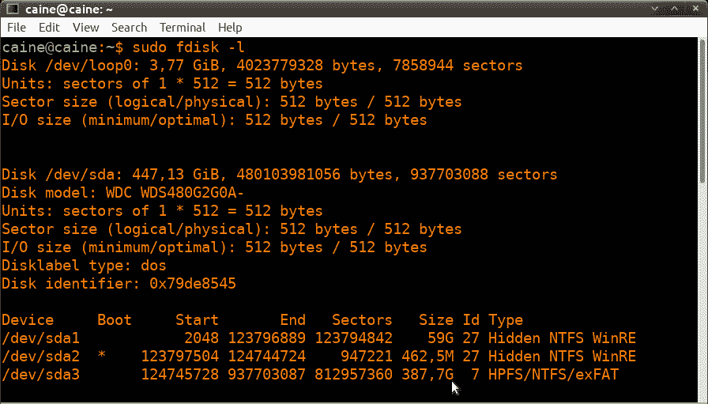

图 8.23 – fdisk 输出数据

在上面的截图中，第一个硬盘是 SDA，存储容量为 447.13 GB。往下看，SDA 硬盘被划分为三个单独的分区。标为 SDA2 的分区是启动分区。SDA3 分区的大小为 387.7 GB，正如光标所示。这是存储大部分数字证据的数据存储区域。将对该 SDA 硬盘进行成像。

向下滚动输出内容，可以看到证据硬盘和 CAINE 操作系统硬盘也可见：

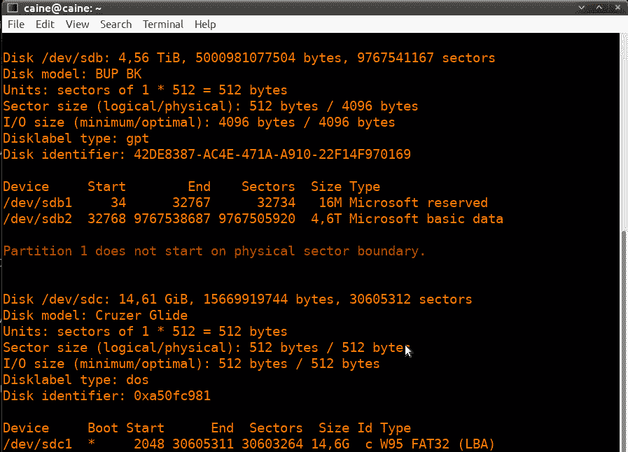

图 8.24 – fdisk 输出数据

在上面的截图中，有三个独立的硬盘，每个硬盘有自己的分区。标为 `/dev/sdc` 的硬盘是包含 CAINE 操作系统的 USB 驱动器，系统从该驱动器启动。`/dev/sdb` 硬盘是系统将要进行成像的证据硬盘。最后，目标系统标记为 `/dev/sda`。

1.  在识别出系统的目标硬盘后，我们需要确认成像过程不会改变数据。CAINE 操作系统内置了一个软件写保护器。在桌面上，你会看到 **Block on/off**，这是指向实际软件写保护器路径的标题。点击后会打开用于此过程的写保护器。在检查设备列表时，你会看到唯一可以写入的硬盘是 **SDB**，这就是我们之前确认的证据硬盘。其他硬盘都设置为只读。这可以确保事件响应分析人员，成像过程不会改变目标硬盘（分析人员最好截取该信息的屏幕截图，以便后续报告）：

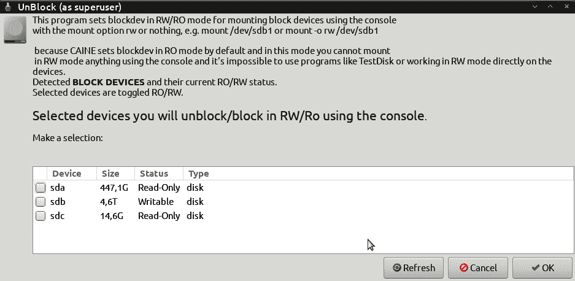

图 8.25 – 解锁设备选择

1.  在确认证据硬盘已就位并且目标系统已设置为只读后，配置证据硬盘以确保其正确挂载。使用以下命令创建一个名为 `Disk_Images` 或类似名称的目录，作为此及任何后续磁盘镜像的存储库：

    ```
    caine@caine:~$ sudo mkdir /mnt/Disk_Images
    ```

1.  接下来，使用以下命令将 SDB 磁盘挂载到上一步中创建的挂载目录。请注意，在这种情况下，它是证据驱动器的较大磁盘分区：

    ```
    caine@caine:~$sudo mount /dev/sdb2 /mnt/Disk_Images
    ```

现在，证据驱动器已经挂载到创建的挂载点上。

1.  接下来，使用以下命令切换到证据驱动器的目录：

    ```
    caine@caine:~$ cd /mnt/Disk_Images
    ```

1.  为系统的特定映像文件创建一个目录。在这种情况下，目录将包含事件编号`Incident2022-034`，作为目录名。最好将此目录与事件间接关联。以下命令将创建正确的目录：

    ```
    caine@caine:~$ mkdir Incident2022-034
    ```

1.  通过执行以下命令，切换到在*步骤 7*中创建的目录：

    ```
    caine@caine :/ mnt /Disk_Images$ cd Incident2022-034
    ```

1.  现在，您已经进入了正确的目录，接下来要做的就是对嫌疑人驱动器进行成像。现在有多个工具可用于此操作。在此示例中，将使用 Dc3dd 工具。该工具是由**国防部网络犯罪中心**（**DC3**）的取证专家 Jesse Kornblum 开发的。此应用程序具有 dd Linux 映像应用程序中没有的附加功能。这些功能包括错误报告和可以即时使用的多种哈希算法。要开始成像过程，输入以下命令：

    ```
    caine@caine:/mnt/Disk_Images/Incident2022-034$ dc3dd if=dev/sda of=ACMELaptop056.img hash=md5 log=ACMELaptop56.txt
    ```

上面的命令包含`dc3dd`。首先，将` sda`磁盘映像到证据驱动器，并输出一个名为`ACMELaptop056`的映像文件：

该命令还使 Dc3dd 使用 MD5 算法对映像文件进行哈希计算。最后，创建一个名为`ACMELaptop56.txt`的日志文件，可以用于报告目的。运行该命令会生成以下输出：

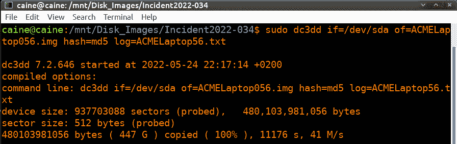

图 8.26 – dc3dd 命令和输出

1.  根据驱动器的大小，这个过程可能需要几个小时。在此期间，分析师可以跟踪所做的进展。完成后，应用程序将产生一些输出，指示输入使用了多少个扇区，输出到映像文件中使用了多少个扇区。理想情况下，这两个数字应该相同。最后，计算并利用映像文件的 MD5 哈希值，作为输出的一部分：

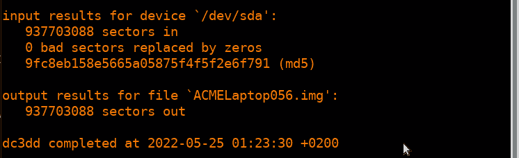

图 8.27 – Dc3dd 成像完成

1.  从 Windows 系统检查证据驱动器，可以看到使用 Dc3dd 创建的映像和日志文件：

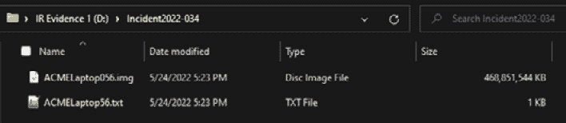

图 8.28 – Dc3dd 输出文件

1.  检查日志文件可以揭示以下信息，所有这些信息都应该纳入后续报告中：

    ```
    dc3dd 7.2.646 started at 2022-05-24 22:17:14 +0200
    ```

    ```
    compiled options:
    ```

    ```
    command line: dc3dd if=/dev/sda of=ACMELaptop056.img hash=md5 log=ACMELaptop56.txt
    ```

    ```
    device size: 937703088 sectors (probed),   480,103,981,056 bytes
    ```

    ```
    sector size: 512 bytes (probed)
    ```

    ```
    480103981056 bytes ( 447 G ) copied ( 100% ), 11176,1 s, 41 M/s
    ```

    ```
    input results for device `/dev/sda':
    ```

    ```
       937703088 sectors in
    ```

    ```
       0 bad sectors replaced by zeros
    ```

    ```
       9fc8eb158e5665a05875f4f5f2e6f791 (md5)
    ```

    ```
    output results for file `ACMELaptop056.img':
    ```

    ```
       937703088 sectors out
    ```

    ```
    dc3dd completed at 2022-05-25 01:23:30 +0200
    ```

Linux 是获取磁盘证据时一个可行的选择。它的一个重要优势是易于扩展。如果必须获取多个系统，响应者可以使用多个 USB 存储驱动器和 Linux USB 设备，并行进行获取，而不是等待软件可用。CAINE 是一个极好的选择，因为它包含的写保护器还为过程中提供了一定的证据完整性。

成像是响应者必须了解的关键过程。事件通常会决定应该使用哪种技术。然而，在任何事件中，响应者应确保该过程以可靠的方式进行，因为后续调查往往依赖于从这些系统中获取的数据。

# 总结

并不是每个事件都会要求从潜在受损的硬盘或其他存储卷中获取镜像。无论如何，事件响应分析员应该熟悉并能够在需要时执行此功能。硬盘上找到的证据可能对确定事件的顺序或获取有助于查明事件根本原因的实际文件至关重要。这也是响应者需要了解成像基础知识、相关工具和流程的核心原因，包括如何创建舞台驱动器、如何使用写保护器，以及如何执行本章中提到的任何成像技术。与任何法证学科中执行的过程一样，成像应该以系统的方式进行，确保所有步骤都得到遵循并得到适当的文档记录。这将确保所获取的任何证据都能在法庭上被接受并具备法律效力。

在下一章中，我们将讨论与事件相关的网络活动相关的网络证据检查。

# 问题

1.  写保护器有哪两种类型？（选择两个）

    1.  硬件

    1.  数字

    1.  软件

    1.  法院批准

1.  响应者应确保每次使用前，任何用于成像的存储驱动器都已正确消毒。

    1.  正确

    1.  错误

1.  哪种成像方法用于获取驱动器的整个物理卷？

    1.  死机成像

    1.  实时成像

    1.  远程成像

    1.  硬件成像

1.  哪种成像应用程序仅在 Linux 系统上找到？

    1.  FTK Imager

    1.  EnCase Imager

    1.  AFF4

    1.  dd

# 进一步阅读

请参考以下资源，了解本章涵盖的主题：

+   *FTK Imager* *指南*：[`d1kpmuwb7gvu1i.cloudfront.net/Imager/4_7_1/FTKImager_UserGuide.pdf`](https://d1kpmuwb7gvu1i.cloudfront.net/Imager/4_7_1/FTKImager_UserGuide.pdf)

+   *NIST 计算机取证工具与技术* *目录*：[`toolcatalog.nist.gov/search/index.php?ff_id=1`](https://toolcatalog.nist.gov/search/index.php?ff_id=1)

+   *计算机取证中磁盘映像工具概述*：[`www.sans.org/reading-room/whitepapers/incident/overview-disk-imaging-tool-computer-forensics-643`](https://www.sans.org/reading-room/whitepapers/incident/overview-disk-imaging-tool-computer-forensics-643)

# 第三部分：证据分析

完成第二部分的数字证据获取后，第三部分将重点讲解数字取证的正确分析技巧。本部分将专注于使用合适的工具和技术来确定事件的根本原因。

本部分包括以下章节：

+   *第九章**，分析网络证据*

+   *第十章**，分析系统内存*

+   *第十一章**，分析系统存储*

+   *第十二章**，分析日志文件*

+   *第十三章**，撰写事件报告*
