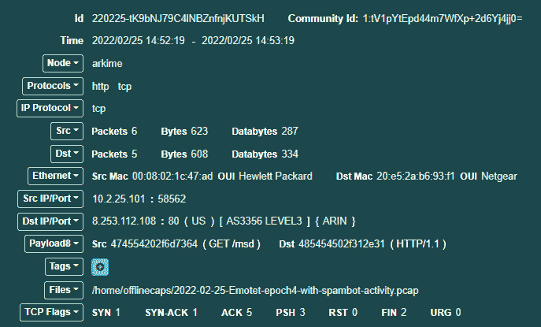
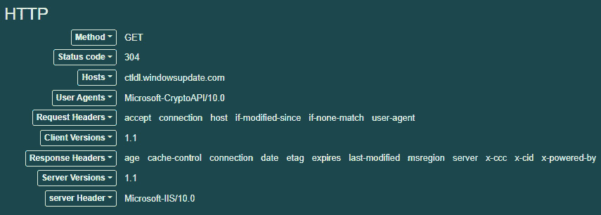

# 第九章：分析网络证据

*第五章*探讨了事件响应人员和安全分析师如何获取基于网络的证据以供后续评估。该章节主要关注了两种证据来源：网络日志文件和网络数据包捕获。本章将展示可用于检查已获取证据的工具和技术。将这些技术融入事件响应调查，可以为事件响应分析师提供对潜在威胁的网络活动的洞察。

本章将重点讨论以下主要内容：

+   网络证据概述

+   分析防火墙和代理日志

+   分析 NetFlow

+   分析数据包捕获

# 网络证据概述

攻击者被同样的网络协议约束，这些协议控制着正常的网络流量。本文将探讨通过正确分析网络数据来识别的对抗技术。

在*第五章*中，我们重点关注了网络设备产生的各种证据。大多数这些证据包含在交换机、路由器和防火墙生成的各种日志文件中。根据响应人员所处的环境类型，这些证据来源可以通过 NetFlow 数据和完整的数据包捕获进行补充。

一旦了解了各种来源，重要的是要关注日志、NetFlow 和数据包捕获能告诉我们关于事件的哪些信息。以下是几个关注点，在这些领域中，适当的日志记录和证据收集可以为事件提供额外的背景信息，以及在分析根本原因时可能的数据点：

+   **侦察与扫描行为**：攻击者可以利用众多工具来自动化扫描外围设备（如防火墙和路由器）的过程。这些扫描工具试图确定开放端口、漏洞或可以被利用的认证协议，如**安全外壳**（**SSH**）。这些扫描会留下痕迹，因为它们通常需要与设备建立连接。根据日志记录的级别和保留期限，响应人员可能能够识别出尝试破坏外围系统的外部基础设施。

+   **初始感染**：攻击者在入侵系统方面变得非常复杂。他们通常会利用多阶段的漏洞利用和恶意软件。第一阶段将通过 URL 调用外部基础设施并下载其他漏洞。Web 代理和防火墙的日志文件中可能包含记录此活动的连接数据。

+   **横向移动**：一旦进入网络，攻击者通常会尝试进行侦察、利用其他系统并移动数据。NetFlow 日志可以提供对这种行为的洞察。

+   **指挥和控制**：一旦在网络中站稳脚跟，攻击者就需要能够维持对受损系统的控制。日志、数据包捕获和 NetFlow 数据可以用来识别这种行为。

+   **数据泄漏**：攻击者的目标之一可能是破坏并窃取数据。代理日志可能会识别这些数据的目的地。NetFlow 可能会显示从内部系统到外部系统的数据流动。最后，数据包捕获可以用来识别泄露的文件、数据源以及目的地。

在*第五章*中，我们讨论了在事件中可以利用的三种主要类型的网络证据。对于不了解网络流量的响应者来说，理解网络流量的各个方面往往是困难的。可以将网络流量看作是从一个人发送到另一个人的信件。日志数据记录了发送者和接收者的地址以及在一个中央位置（如本地邮局）的邮箱号码。这类似于源 IP 地址和目标 IP 地址以及端口。

NetFlow 记录了关于信件的许多相同信息，但还可以告诉个人信件的重量或相对大小，以及发送者和接收者的地址和邮箱号码。最后，数据包捕获提供了通过日志和 NetFlow 获得的所有信息，还会告诉个人信件的内容，包括（只要它没有加密）实际的数据。

通过网络证据识别根本原因在很大程度上取决于证据本身。像数据包捕获和日志文件这样的证据的一个主要缺点是，正常网络操作所产生的数据量巨大。通常，事件发生后几天甚至几周才会被识别。在此期间，这些日志文件和数据包捕获可能变得无法获取。因此，响应者必须充分理解他们组织在网络证据方面的能力。

# 分析防火墙和代理日志

攻击者需要与其基础设施建立初始连接并保持持续连接。网络设备如防火墙和代理可能提供日志文件作为证据来源。

*第五章*包含了有关获取基于网络的证据以及对事件响应者或安全分析师重要的日志文件类型的大量信息。除了之前讨论的数据包捕获外，我们还重点关注了从多种来源获取日志文件。这些日志文件可以为可能的入侵指示提供一些线索，帮助事件调查。然而，分析师面临的主要挑战是从大量无关的日志中筛选出那些具有证据价值的日志。

日志文件分析可以通过多种方式进行。使用的具体方法通常取决于事件的类型、可用的工具和需要分析的日志数据量。以下是一些可以使用的方法：

+   **手动日志审查**：在手动日志审查中，原始日志文件会被导入到像文本编辑器这样的工具中。之后，分析人员将逐行审查日志。这是一种低成本的解决方案，但仅在数据量有限时有用。例如，分析人员无法在大型企业防火墙连接日志上执行此类分析。然而，它可能对确定某个特定日期有哪些用户登录到不常用的 Web 应用程序有帮助。

+   **过滤日志审查**：日志审查工具允许分析人员根据特定参数过滤日志文件。这可以包括显示已知恶意活动的列表。一个缺点是，日志可能不会立即指示已知的恶意活动，而是在最初阶段看起来无害。

+   **日志文件搜索**：大多数日志分析工具的另一个关键功能是能够搜索日志文件中的特定表达式。搜索工具可以利用正则表达式和布尔表达式，并允许分析人员将日志限制在特定的时间段、源 IP 地址或其他特定条件下。这使得分析人员可以迅速定位特定的日志文件。根据搜索词的不同，这可能返回大量的信息，需要手动进一步审查。

+   **日志文件关联**：可以根据预配置的规则或算法将不同的日志活动与其他日志进行关联。日志关联通常是日志管理工具或**安全信息和事件管理**（**SIEM**）平台的一部分，这些工具带有已创建的规则集。这种方法非常强大，因为它自动化了过程，但也需要大量的前期劳动来配置和调整特定环境。

+   **日志文件数据挖掘**：比关联更进一步的是能够从日志文件中提取有意义的信息。这为特定活动提供了更多的上下文和洞察力。在撰写本文时，已有多个工具（如 Elasticsearch 和 Logstash）可以集成到平台中，以提供更有用的信息。

网络中每月产生的日志数量可能是惊人的。随着新来源的增加，这一数量只会进一步增加。手动筛选这些日志几乎是不可能的。在日志审查方面，最好有一个能够提供一定自动化程度的解决方案，即使是在小型网络中。这些工具使分析人员能够在成千上万的日志中找到那根关键的针。

## SIEM 工具

SIEM 工具对于获得网络活动的态势感知至关重要。这些平台不仅充当来自网络设备的日志文件的聚合点，还允许分析员对已聚合的日志进行查询。例如，假设在分析数据包捕获文件时，发现了与潜在恶意活动相关的 IP 地址。这个文件仅限于内部网络上的一台主机。分析员希望回答的一个问题是，其他多少台主机可能已经被感染？如果 SIEM 聚合了来自外部防火墙和 Web 代理等设备的连接日志文件，分析员就能够确定是否有其他内部主机连接到这些可疑的 IP 地址。

有多种 SIEM 平台可供选择，从免费的解决方案到企业级安全管理平台。这些平台大多数允许分析员进行过滤搜索和关联日志审查。许多更强大的商业平台提供了检测特定类型攻击的规则集，并随着新攻击的出现更新这些规则集。分析员还可以查询 SIEM 工具，以获取主机 IP 地址与其他系统的连接日志。这通常是恶意软件感染机器后，攻击者试图攻破其他机器时的行为表现。

在事件响应人员与负责维护 SIEM 工具的人员分开的组织中，最好审查一下通信结构，以确保事件响应分析员可以访问这些平台。可用的大量信息和数据可以帮助确定内部网络上哪些活动与可能的事件相关，以及可以用来确定根本原因的证据。

## Elastic Stack

除了 SIEM 技术外，事件响应分析员还可以利用一系列应用程序进行日志分析。这一系列工具被称为 Elastic Stack，它结合了三种工具，能够分析大量数据。第一个工具是 Elasticsearch。Elasticsearch 是一个日志搜索工具，允许对日志数据进行近实时搜索。这是通过 Lucene 驱动的全文搜索实现的。这使得分析员能够针对日志文件中的元素（如用户 ID、IP 地址或日志条目编号）执行查询。Elasticsearch 的另一个关键特性是平台能够随着企业的增长和数据源的增加，扩展解决方案。这对于那些可能希望先测试此功能，然后逐步添加数据源和日志文件的组织来说非常有用。

Elastic Stack 中的下一个组件是 Logstash。Logstash 是处理来自网络各个来源的日志文件输入、处理日志条目，并最终通过可视化平台输出它们的机制。Logstash 可以轻松配置和部署。Logstash 与 Elasticsearch 的集成使得事件响应分析师能够对大量日志数据进行快速查询。

Elastic Stack 的最终组件是 Kibana。Kibana 作为 Elastic Stack 的可视化界面或仪表板，允许分析师通过仪表板洞察数据。Kibana 还允许分析师深入到特定的关键数据点进行详细分析。事件响应分析师可以自定义这些仪表板，以便最重要的信息，如入侵检测日志或连接日志，能够立即供审阅。

例如，Kibana 仪表板利用多个饼图来展示日志活动。利用这些图表可以概览分析师可用的信息。

增强日志的一个好工具是 NetFlow 分析，我们将在接下来介绍。

# 分析 NetFlow

NetFlow 描述了网络中设备之间连接的数据。NetFlow 主要用于故障排除连接性和带宽问题，事件响应人员可以使用 NetFlow 获得数据流动的洞察，从而引发事件。

NetFlow 是由 Cisco Systems 在 1990 年代首次推出的一个功能。NetFlow 收集关于数据包的特定数据，当它们进入或退出路由器或交换机的接口时。这些数据随后通过 NetFlow 导出器发送到 NetFlow 收集器，NetFlow 导出器通常作为交换机或路由器的一部分。NetFlow 收集器随后汇总并存储流数据以供分析。网络和系统管理员通常利用这些数据来排查带宽问题、识别网络拥堵以及观察数据流动情况。

以下截图中可以看到一个 NetFlow 输出的示例。流数据包含的内容在网络设备制造商之间可能有所不同，因为商业市场上有多个版本。以下截图显示了作为 NetFlow 数据集一部分所捕获的一些基本信息：


图 9.1 – 示例 NetFlow 数据

以下是前面截图中可以看到的 NetFlow 记录的组成部分：

+   **Src Addr**：这是启动连接或发送流量的源地址。

+   **Dst Addr**：连接的目标地址。

+   **Sport**：这是源地址的源端口。

+   **Dport**：这是目标端口。在将 NetFlow 作为事件调查的一部分进行分析时，这是需要关注的关键数据点之一，因为它通常能告诉响应人员源地址正在连接的服务。

+   **Proto**：这是使用的协议。

+   **数据包**：作为流的一部分所生成的数据包数量。

+   **字节**：字节的总数。

+   **流**：这表示已记录的流的数量。流可以视为独立的 TCP 连接。例如，使用像 Wireshark 这样的工具分析数据包捕获时，会显示单独的数据包。流指示已建立的 TCP 会话。在这种情况下，如果 SSH 会话中断并重新建立，则会记录两个流。

在检查前面的 NetFlow 数据时，两个重要的数据点可能值得关注。第一个是设备之间的 SSH 连接数量。安全外壳（SSH）是系统之间常用的通信方式，但如果它超出了正常网络行为的范围，则需要进一步调查。此外，通过 SMB（端口`445`）的连接常常被攻击者滥用，用于访问其他系统、传播勒索软件或访问文件共享。即使在这个简短的示例中，也可以清楚地看到，响应人员通过仅查看内部网络上发生的连接，就能获得大量的洞察信息。

# 分析数据包捕获

事件发生时，最好的证据来源之一是数据包捕获。分析这些数据包可以揭示数据外泄、漏洞利用以及命令和控制。

*第五章*详细介绍了从各种来源和不同位置获取数据包捕获的多种方法。数据包捕获包含大量潜在对事件响应分析员有价值的信息。其中一些信息包括源和目的地 IP 地址、域名和端口，以及主机之间通信的内容。在某些情况下，事件响应分析员可以重建实际文件，例如文本文件和图像。主要的缺点是涉及的数据量非常庞大。

示例数据包捕获

本章提到了一些预先配置好的数据包捕获。这些数据包捕获直接来源于[`malware-traffic-analysis.net/`](http://malware-traffic-analysis.net/)，并得到了作者的许可。该网站包含多个数据包捕获练习，事件响应分析员可以在这些练习中练习定位妥协迹象。不过需要注意的是，这些捕获可能包含恶意软件。你应该仅在正确配置的沙盒环境中（见*第十六章*）或其他不与生产环境连接的系统中检查实时数据包捕获。

## 命令行工具

分析网络数据包捕获时可以使用多个命令行工具。在更深入或较长时间的事件响应工作中，分析员可能会收集多个数据包捕获文件。将这些多个数据包捕获文件合并成一个文件可以使分析变得更加简便。Mergecap 应用程序正是通过将多个数据包捕获文件合并来实现这一点。Mergecap 是 SANS SIFT 工作站的一部分，可以通过以下命令执行：

```
sansforensics@siftworkstation: ~$ mergecap packetcapture1.pcap packetcapture2.pcap
```

另一个在分析数据包捕获时非常有用的命令行工具是 Editcap。Editcap 允许分析员将数据包捕获文件分割成更小的段，便于审查。例如，分析员可能只希望查看被拆分成 50,000 个数据包段的捕获文件。如果分析员有一个很大的数据包捕获文件，分割文件会使得搜索更加高效。为此，分析员可以在命令行中输入以下命令：

```
sansforensics@siftworkstation: ~$ editcap -F pcap -c evidence.pcap split.pcap
```

在上面的命令中，`editcap` 将 `evidence.pcap` 证据文件分割成了 50,000 个数据包段。Editcap 还可以用来将较大的数据包捕获文件按时间段进行分割。例如，如果分析员希望将数据包捕获文件按 10 分钟为一个段来分割，他们可以输入以下命令：

```
sansforensics@siftworkstation: ~$ editcap -F pcap-t+600 evidence.pcap split.pcap
```

分析员还可能会发现，在某些情况下，他们可能希望隔离域名注册流量。这在很大程度上是由于各种对抗性行为，如 C2 流量、数据外泄，以及可能通过利用 DNS 系统中的漏洞重定向到受损网站。`dnstop` 应用程序解析数据包捕获文件并确定来自内部主机的 DNS 查询的来源和数量。要在 Linux 系统上安装它，可以使用以下命令：

```
dfir@ubuntu:~$ sudo apt-get install dnstop
```

此命令将下载并安装 `dnstop`。在以下示例中，数据包捕获是从位于 [`www.malware-traffic-analysis.net/2022/03/21/index2.html`](https://www.malware-traffic-analysis.net/2022/03/21/index2.html) 的恶意软件流量分析网站获取的。如果事件响应分析员想要确定是否有任何 IP 地址正在发送外发的 DNS 查询，他们只需执行以下命令：

```
dfir@ubuntu:~/Documents/Packet Captures$ dnstop 2022-03-21-Hancitor-with-Cobalt-Strike-and-Mars-Stealer.pcap
```

上述命令的输出结果如下：


图 9.2 – DNS 查询计数

## 实时威胁情报分析

使用数据包捕获时的一个挑战是涉及的数据量非常庞大。即使是来自中型网络的 24 小时数据包捕获也会带来问题。一种方法是使用关注关键数据点的工具。例如，与命令和控制（C2）相关的信标流量是需要查找的重要数据，因为它是对手与内部网络之间的连接。

一个可以提供帮助的工具是 Active Countermeasure 的**实时智能威胁分析**(**RITA**)工具。这个命令行工具利用行为分析来识别表明信标行为的模式，以便分析师能够专注于特定的 IP 地址或域名。这个工具的一个关键特性是它能够处理大型数据包捕获文件，例如通过 24 小时内的捕获得到的文件。这使得分析师能够找到即便是非常低速的命令与控制流量。

安装 RITA 非常简单。在这个案例中，RITA 已安装在 Ubuntu 桌面上。首先，创建一个 RITA 目录。其次，从 GitHub 网站下载安装脚本：[`github.com/activecm/rita/releases/tag/v4.5.1`](https://github.com/activecm/rita/releases/tag/v4.5.1)。接下来，运行以下命令使文件可执行：

```
dfir@ubuntu:~/rita$ sudo chmod +x ./install.sh
```

接下来，通过运行以下命令执行安装脚本：

```
dfir@ubuntu:~/rita$ ./install.sh
```

安装脚本会安装必要的依赖项，例如 Mongo 数据库结构和数据包捕获分析工具 Zeek。

Zeek

Zeek 是一个网络监控和分析工具，它与 RITA 一起使用。如需了解有关 Zeek 的更多信息，请访问[`docs.zeek.org/en/lts/`](https://docs.zeek.org/en/lts/)。

下一步是处理数据包捕获。在这种情况下，两个数据包捕获文件来自[`malware-traffic-analysis.net/2022/01/27/index.html`](https://malware-traffic-analysis.net/2022/01/27/index.html)上的恶意软件流量分析帖子，并已合并为一个文件。这个文件被移动到 RITA 目录中。以下命令将 Zeek 指向数据包捕获文件，以便它能够处理成各种日志文件：

```
dfir@ubuntu:~/rita$ zeek -C -r IcedId.pcap 
```

检查目录中的文件，显示已处理的日志文件：


图 9.3 – Zeek 日志文件

在使用 Zeek 处理数据包捕获后，日志文件需要导入到 RITA 可以读取的数据库`IcedID`中，使用以下命令：

```
dfir@ubuntu:~/rita$ rita import *.log IcedID
```

一旦运行该命令，结果应如下所示：


图 9.4 – RITA Zeek 日志导入

要访问 RITA 的帮助菜单，请输入以下命令：

```
dfir@ubuntu:~/rita$ rita
```

这将产生以下命令及相关结果：


图 9.5 – RITA 功能

让我们继续查看是否有任何数据包表明信标行为。运行`show-beacons`命令，针对之前通过运行`IcedID`数据库创建的数据库进行操作：

```
dfir@ubuntu:~/rita$ rita show-beacons IcedID
```

这会产生以下结果：


图 9.6 – RITA 信标分析

在*图 9.6*中，RITA 指示内部 IP 地址`10.1.28.101`已与 IP 地址`149.255.35.174`建立了 234 个连接。值得注意的一个结果是结果行开头的第一个数字`0.838`。这个分数表示 RITA 对这些结果的置信度，范围从 0 到 1。在这种情况下，几乎有 84%的置信度认为该流量是信标行为。

另一个选项是运行`show-beacons-fqdn`命令，它将显示系统的域名：

```
dfir@ubuntu:~/rita$ rita show-beacons-fqdn IcedID
```

这产生了类似的结果，但表明命令与控制服务器的域名为`driverpackcdn.com`，如下所示：


图 9.7 – RITA Beacon 完全限定域名

如我们所见，RITA 允许分析人员专注于特定的 IP 地址和域名，作为潜在的恶意目标，而无需挖掘数以 GB 计的数据包信息。从这里，他们可以直接转到关键的连接，这些连接在基于 GUI 的工具中是至关重要的，我们接下来将重点讨论这一部分。

## NetworkMiner

与命令行工具相比，分离数据包捕获数据的基于 GUI 的工具更容易操作。一个这样的工具是 NetworkMiner，可以在[`www.netresec.com/?page=NetworkMiner`](https://www.netresec.com/?page=NetworkMiner)找到。该工具有商业版和社区版，社区版功能更有限。尽管如此，社区版仍具备一些在分析数据包捕获时非常有用的关键特性。

在本演示中，我们将查看与 Hancitor 感染相关的 PCAP 文件，可以从 [`malware-traffic-analysis.net/2022/03/21/index2.html`](https://malware-traffic-analysis.net/2022/03/21/index2.html) 下载。通过选择 **文件** 并点击 **打开** 来加载 PCAP 数据。导航到数据包捕获文件并点击 **打开**。NetworkMiner 会处理 PCAP 文件并显示数据包捕获中找到的主机：


图 9.8 – NetworkMiner GUI

下一个标签页，**文件**，显示了数据包捕获中包含的文件：


图 9.9 – NetworkMiner 的文件标签页

如果你进一步深入查看从`bor4omkin.ru`下载的`b123.exe`文件，源 IP 地址为`45.8.124.233`：


图 9.10 – 可疑文件

除了可视化数据包捕获中的文件外，NetworkMiner 还会提取它们并将它们放入按 IP 地址分类的`AssembledFiles`目录中。这使得分析人员可以快速识别可疑文件并进行分析。

NetworkMiner 是一个非常有用的工具，用于初步查看数据包捕获。它提供有关文件、DNS 查询、会话和其他关键数据点的详细信息。它的主要优势在于能够快速聚焦于关键数据点，从而使分析人员可以集中精力查看特定领域，而无需挖掘整个数据包捕获来寻找关键证据。

## Arkime

Arkime 是一个开源的数据包捕获与搜索系统，允许分析师和响应者检查大量的网络数据包捕获。默认情况下，Arkime 会将数据包捕获按捕获中包含的各个会话进行组织。Arkime 可以作为网络监控系统使用，通过将数据包导入到 Elasticsearch 基础架构中，响应者可以实时查看网络活动。另一个 Arkime 的使用方式是加载离线数据包捕获进行索引。

Arkime 的安装说明可以在 GitHub 上找到，网址为 [`raw.githubusercontent.com/arkime/arkime/master/release/README.txt`](https://raw.githubusercontent.com/arkime/arkime/master/release/README.txt)。Arkime 可以安装在各种 Linux 桌面或服务器平台上。服务器选项为较大的团队提供了共享数据包捕获数据和评估正在运行的捕获的能力。桌面安装适用于处理离线数据并且不需要共享结果的响应者。

在本节中，我们将使用 Arkime 分析来自与钓鱼攻击相关的系统的一个数据包捕获。该数据包捕获文件可以在[`malware-traffic-analysis.net/2022/02/25/2022-02-25-Emotet-epoch4-with-spambot-activity.pcap.zip`](https://malware-traffic-analysis.net/2022/02/25/2022-02-25-Emotet-epoch4-with-spambot-activity.pcap.zip)找到。

首先，在 Arkime 中为离线数据包捕获创建一个目录。这可以在 `home` 目录中完成。接下来，使用 SFTP 将数据包捕获文件传输到离线数据包捕获目录中。最后，使用位于 `/opt/arkime/bin` 目录中的 Arkime 捕获二进制文件，使用以下命令处理数据包捕获：

```
arkime@arkime:/opt/arkime/bin$ sudo ./capture -r /home/offlinecaps/2022-02-25-Emotet-epoch4-with-spambot-activity.pcap
```

上述命令处理`2022-02-25-Emotet-epoch4-with-spambot-activity.pcap`文件，使其可以通过 GUI 进行查看。需要注意的一点是`-r`参数，它只处理单个数据包捕获。如果有多个捕获，可以使用`-R`参数运行二进制文件，这将递归处理目录中的所有数据包捕获。*图 9.11* 显示了正在处理的数据包捕获：


图 9.11 – Arkime PCAP 导入

完成后，打开浏览器并导航到服务器或工作站的 IP 地址，并指定端口 `8005`。这将打开 Arkime 界面。在左上角，将时间设置为**全部**。设置时间后，将显示以下视图：


图 9.12 – Arkime GUI 仪表板

Arkime 是一个功能丰富的平台。以下步骤概述了在检查离线数据包捕获时可用的一些功能：

1.  仪表板中对数据包捕获的检查识别出几个不同的会话，其中`10.2.25.101`的内部系统正在与外部 IP 地址进行通信。为了将搜索结果缩小为 HTTP 上的互联网流量，应该在搜索栏中输入以下查询：


图 9.13 – HTTP 端口 80 查询

1.  这表明有两个目标端口为`80`的 TCP 会话。这些会话可以通过仪表板中显示的任何字段进行排序。一个有用的关键数据是会话中传输的字节数。如果发送和接收的字节数之间存在较大差异，可能表明存在数据外泄，如果发送的字节数较大，或者在本次捕获中，接收的字节数较大，则可能表示文件传输，如以下条目所示：


图 9.14 – HTTP 会话数据

1.  仪表板的最右侧包含关于会话的 URI 及相关信息。例如，检查 HTTP 上的会话表明本地主机访问了一个看起来像是 Windows 更新站点的页面：


图 9.15 – Arkime URI 数据

1.  Arkime 在与 Windows 更新相关的信息 URI 所在的同一会话行中提供了额外的信息。点击绿色加号框，将打开以下页面：



图 9.16 – 会话数据

1.  更下方，在**HTTP**标题下，是有关连接的有价值数据：



图 9.17 – HTTP 会话数据

1.  Arkime 的另一个有用功能是能够可视化连接。在 Arkime web 应用程序的顶部有**连接**选项。如果点击**连接**，将出现以下内容：


图 9.18 – Arkime 连接图

接下来，让我们看看如何重置 Arkime。

### 我该如何重置 Arkime？

在分析结束时，有两种方法可以清除现有数据，为后续分析做准备。第一种方法是在虚拟化平台（如 VMware）上部署 Arkime。在此，你可以创建一个新的安装，并捕获新安装的快照。一旦分析完成，你可以恢复到新的安装快照。

另一种方法是重新运行`init`或`wipe`命令。步骤如下：

1.  保持 Elasticsearch 运行。

1.  关闭所有正在运行的查看器或捕获进程，以确保不会录制新的数据。

1.  要删除存储在 Elasticsearch 中的所有 SPI 数据，请使用`db.pl`脚本，并使用`init`或`wipe`命令。两个命令之间的唯一区别是，`wipe`保留已添加的用户，以便它们不需要重新添加：

    ```
    /opt/arkime/db/db.pl http://ESHOST:9200 wipe
    ```

1.  删除 PCAP 文件。PCAP 文件以`raw`格式存储在文件系统中。你需要在所有捕获机器上执行此操作：

    ```
    /bin/rm -f /opt/arkime/raw/*
    ```

Arkime 的主要优势是能够以流视图查看网络流量。对于更详细的逐包视图，最好的工具是 Wireshark，接下来我们将介绍它。

## Wireshark

Wireshark 是事件响应分析人员最受欢迎的数据包捕获分析工具之一。除了捕获数据包的功能外，还有许多其他功能可用。由于大量的书籍和培训课程围绕这个平台构建，因此很难列出所有的功能。因此，本章将重点介绍一些在事件调查中最为适用的 Wireshark 关键功能。

Wireshark 资源

可以说，Wireshark 是 IT 和安全专业人员首选的数据包分析工具。由于该应用的普及，市场上有大量资源可用于深入学习 Wireshark 及其功能。Wireshark 官网[`www.wireshark.org/`](https://www.wireshark.org/)提供了丰富的信息。此外，[`www.chappell-university.com/`](https://www.chappell-university.com/)网站提供了练习和培训数据包捕获，以帮助提升分析技能。

此外，《*Learn Wireshark*》一书的作者 Lisa Bock 在她的书中对 Wireshark 进行了深入的讲解，该书可在[`www.packtpub.com/product/learn-wireshark-fundamentals-of-wireshark/9781789134506`](https://www.packtpub.com/product/learn-wireshark-fundamentals-of-wireshark/9781789134506)上找到。

由于 Wireshark 是一款功能丰富的工具，一些设置更适合用于网络流量分析，而不适用于事件响应活动。因此，需要进行一些更改，以更好地帮助事件响应分析人员执行有关事件调查的数据包捕获分析：

+   **时间**：Wireshark 中的时间设置提供了多个选项。包括自 1970 年 1 月 1 日起或自数据包捕获开始起的时间。这些选项中有一个在事件调查中非常有用的功能，即单个数据包捕获的日期和时间。这使得分析人员能够将其他可疑或恶意活动的日期和时间与数据包捕获中特定流量的日期和时间进行关联。要启用此功能，请导航到 **视图**，然后选择 **时间显示格式**。从中选择一个时间选项，如 **日期和时间** 或 **日期或一天中的时间**。另一个可以考虑的选项是使用 UTC 时间选项。如果内部网络使用 UTC 而非本地时间，这将非常有用。时间还可以设置为纳秒级。

+   **名称解析**：名称解析设置允许分析人员在查看源主机和目标主机的 IP 地址与主机名解析之间切换。如果分析人员正在检查数据包捕获并希望确定是否发现了任何可疑的主机名，这将非常有用。例如，如果打开数据包捕获，你将看到各种 IP 地址：


图 9.19 – Wireshark IP 地址视图

要确定主机名，请导航到 **查看** 然后选择 **名称解析**。点击 **解析网络地址**。Wireshark 将解析 IP 地址为主机名：


图 9.20 – Wireshark 域名视图

+   **数据包列表着色**：此功能允许分析人员在数据包列表的空白背景和让 Wireshark 为数据包上色之间切换：


图 9.21 – Wireshark – 经典着色规则

在本章中，将使用位于 [`malware-traffic-analysis.net/2022/04/14/index.html`](https://malware-traffic-analysis.net/2022/04/14/index.html) 的恶意软件流量分析中的数据包捕获进行 Wireshark 探索。该数据包捕获包括下载 Qakbot 恶意软件副本以及 Cobalt Strike。对于本章，将识别数据包捕获中的几个关键元素。在检查数据包捕获之前，Wireshark 已配置为显示日期和时间，并识别主机名。

以下是 Wireshark 中的一些功能，它们提供了从数据包捕获中获得的关键信息：

+   `ip.src==10.4.14.101` 语法，显示以下内容：


图 9.22 – 源地址过滤器

+   **主机识别**：分析数据包捕获的另一个关键方面是识别本地主机（如果适用）。考虑到这个数据包捕获来自单一主机，识别主机名、IP 地址和 MAC 地址是直接的。通过双击单个数据包，可以找到大量信息：


图 9.23 – 数据包数据

+   `80`。

+   `http`。在输入此过滤器时请注意，因为将有多个不同的过滤器可用。一旦输入了过滤器，点击对话框右侧的右箭头。Wireshark 将限制显示仅使用 HTTP 协议的数据包：


图 9.24 – HTTP 数据包视图

+   `geobram.com` 可能是一个可疑的 URL。Wireshark 的另一个功能是能够跟踪源主机与目标主机之间的 TCP 或 HTTP 通信流。如果你右键点击 `rozhan-hse.com` 主机名，将会出现以下内容：


图 9.25 – 跟踪 HTTP 流

将会出现第二个窗口；点击**HTTP 流**，第三个窗口将会出现。此窗口以可以读取的格式显示 HTTP 数据包。事件响应分析员可以查看此输出，确定可能已发送或接收的文件类型：


图 9.26 – HTTP 数据包信息

+   `GET`命令正在访问`NO_2950435796.zip`文件。分析员可能需要提取该文件进行分析。点击**文件**，然后点击**导出对象**，再点击**HTTP**；会出现一个窗口，列出所有与 HTTP 连接相关的文件。此列表可以根据窗口顶部的任意字段进行排序。在这种情况下，选择主机名并向下滚动，直到找到可疑的 URL：


图 9.27 – Wireshark – 导出 – HTTP 对象列表

从这里，分析员可以点击文件并将其保存到本地系统以供后续分析。*第十二章*将选择文件并评估其中的恶意代码。

Wireshark 是一个强大的工具，用于对数据包捕获进行详细分析。能够深入查看每个数据包并对其进行剖析，帮助分析员非常详细地了解流向外部主机和内部主机之间的流量内容。这种可见性可以为分析员提供潜在的洞察，了解受感染的主机如何与外部主机通信，甚至识别其他可能已被攻陷的主机。

# 总结

安全事件不仅会在主机系统上产生痕迹，还会在网络中的设备和流量流经的路径上留下痕迹。分析这些痕迹证据将帮助事件响应分析员更好地理解他们正在调查的事件类型，以及可以采取的潜在措施。本章讲解了如何通过快速的黑名单对比、DNS 分析以及使用 Elastic Stack 或其他 SIEM 系统进行日志分析来评估日志文件。为了增强这一主要的网络证据评估方法，我们还介绍了 NetFlow 分析，并使用 Arkime 和 Wireshark 进行了数据包捕获分析。网络证据是事件调查中的关键组成部分。结合从可能被攻陷的网站获取的证据，这些痕迹证据有助于分析员重建事件的发生过程。

下一章将把焦点从网络流量转向主机，接着会探讨内存分析。

# 问题

回答以下问题，测试你对本章内容的掌握：

1.  过滤日志审查是指响应者或分析员根据设定的参数过滤特定日志。

    1.  正确

    1.  错误

1.  Elastic Stack 的组成部分不包括什么？

    1.  Elasticsearch

    1.  日志转发器

    1.  Logstash

    1.  Kibana

1.  哪个数据包分析工具默认将数据包捕获按会话进行分类？

    1.  Wireshark

    1.  NetFlow

    1.  Elastic Stack

    1.  Arkime

1.  Wireshark 不支持 DNS 名称解析。

    1.  正确

    1.  错误

# 进一步阅读

请参考以下链接，获取本章所涉及主题的更多信息：

+   *Elasticsearch 7.0 Cookbook - 第四* *版*: [`www.packtpub.com/big-data-and-business-intelligence/elasticsearch-70-cookbook-fourth-edition`](https://www.packtpub.com/big-data-and-business-intelligence/elasticsearch-70-cookbook-fourth-edition)。

+   *恶意软件流量* *分析*: [`www.malware-traffic-analysis.net`](https://www.malware-traffic-analysis.net)。

+   *Arkime*: [`arkime.com/`](https://arkime.com/)。

+   *查普尔大学*: [`www.chappell-university.com/`](https://www.chappell-university.com/)。

+   *思科 IOS* *NetFlow*: [`www.cisco.com/c/en/us/products/ios-nx-os-software/ios-netflow/index.html`](https://www.cisco.com/c/en/us/products/ios-nx-os-software/ios-netflow/index.html)。
