# 第十章：分析系统内存

长时间以来，执法部门和其他执行与事件调查相关的数字取证任务的组织常常依赖于专注于计算机硬盘中证据的方法论。程序要求关闭系统并拆卸硬盘以进行成像。虽然这种方法论及其相关程序有效地确保了证据的完整性，但它忽略了目标系统中**随机存取内存**（**RAM**，即内存）中包含的大量信息。因此，事件响应分析师开始将大量注意力集中在确保采用适当的方法来保持这些证据的完整性，同时为他们提供一个平台，从中获取具有证据价值的信息。

本章将重点介绍可以在系统内存中定位的证据类型，事件响应分析师可用的工具和技术，最后，如何分析这些信息以清楚地了解系统是如何被入侵的。此外，这些技术还可以与其他证据的分析结合使用，例如网络日志文件和存储在目标系统上的文件。

本章将涉及以下主要内容：

+   **内存分析概述**：本节讨论通过适当的内存分析可以发现的关键数据点。

+   **内存分析方法论**：结构化的方法非常重要，确保响应人员能够提取必要的数据。

+   **Volatility 内存分析**：通常被认为是内存分析的黄金标准，这个命令行工具具有广泛的数据采集和分析功能。

+   **字符串内存分析**：一个简单但有效的工具，使响应人员能够从其他工具可能遗漏的内存区域中提取数据。

在本章结束时，您将掌握必要的方法论和工具，能够找到数据点，分析它们，并提取其他证据以供后续分析。

# 内存分析概述

在讨论如何分析系统内存时，两个术语通常互换使用。术语 RAM 和内存用于描述计算机内部系统中的一部分，在该部分中，操作系统放置被应用程序和系统硬件在使用时所需的数据。RAM 或内存与存储的区别在于数据的易失性。通常，如果系统关闭，数据会丢失。

操作系统的一个变化，直接影响了内存分析，那就是 64 位操作系统的出现。使用 64 位寄存器使操作系统可以引用总共 17,179,869,184 GB 的内存。与 32 位操作系统相比，这个数据量是以前可用数据的几百万倍。因此，系统运行时，RAM 中包含了大量有价值的数据，这些数据在事件调查中具有重要作用。包括以下内容：

+   正在运行的进程

+   加载的 **动态链接库** (**DLL**)

+   加载的设备驱动程序

+   打开注册表键

+   网络连接

+   命令历史记录

随着分析系统内存的必要性增加，分析师有几种工具可供使用。本章将重点介绍三种工具；它们都是开源或免费软件，且可以轻松部署。这些工具使分析师能够深入了解利用漏洞和恶意软件对系统造成的影响。

在本章中，将使用两个内存捕获文件。第一个内存捕获文件来自一台被 Cridex 病毒感染的 Windows 系统。内存镜像可以从 [`files.sempersecurus.org/dumps/cridex_memdump.zip`](http://files.sempersecurus.org/dumps/cridex_memdump.zip) 下载。

第二部分是另一个 Windows 系统，属于一个可供训练使用的练习，文件可以通过 [`dfirmadness.com/case001/DC01-memory.zip`](https://dfirmadness.com/case001/DC01-memory.zip) 下载。

尽管这两种恶意软件感染相对较旧，但它们有助于突出我们将要分析的工具集的特定功能。

# 内存分析方法论

在检查系统内存时，分析师应遵循一定的方法论。这可以确保所有潜在证据被发现，并且可以在事件调查中加以利用。我们将探讨两种方法论。其中一种是 SANS 六部分方法论，旨在识别与恶意软件执行相关的妥协指标。另一种方法论则侧重于利用 IP 地址或其他网络物品来识别与该 IP 地址相关的恶意代码。

内存分析的主要目标之一是识别潜在的恶意进程或可执行文件，这些文件可以提取出来进行检查。本章中的大部分内容将在 *第十六章* 中继续探讨，其中提取的数据将进一步分析。

## SANS 六部分方法论

SANS 机构采用六部分方法论来分析内存镜像。该过程旨在从全面了解正在运行的程序开始，直到识别和访问恶意软件。SANS 方法论包括以下步骤：

1.  **识别恶意进程**：恶意软件常常将其行为隐藏在表面上看似合法的进程后面。揭示这些进程需要识别当前运行的进程，找到它们在操作系统中的位置，并验证只使用了合法的进程。有时，进程会明目张胆地隐藏起来，攻击者通过修改进程名称中的一个字母来掩盖其踪迹。其他时候，他们会尝试从不合法的来源执行一个进程。

1.  **分析进程的 DLL 和句柄**：一旦识别出某个进程或多个进程为恶意进程，下一步是检查与该进程相关的 DLL 文件，以及其他因素，如账户信息。恶意软件编程人员常常利用 DLL 文件隐藏其活动。利用 DLL 文件来攻破系统的技术包括恶意软件编程人员将自己的恶意 DLL 文件作为恶意软件的一部分插入系统。其他技术则包括 DLL 注入，即将恶意 DLL 文件的路径写入进程中。

1.  **审查网络痕迹**：恶意软件，尤其是多阶段恶意软件，需要与互联网建立连接。即使完全被攻破的系统，通常也会向 C2 服务器发送信号。活动和监听中的网络连接存在于这些系统的内存中。识别外部主机的 IP 地址可能有助于洞察已发生的入侵类型。

1.  **寻找代码注入的证据**：进程空洞化和内存中未映射的区域等技术通常被高级恶意软件编程人员使用。内存分析工具帮助分析人员找到这些技术的证据。

1.  **检查根套件的迹象**：持久性是许多外部威胁行为者的目标。如果他们最初能够攻破系统，他们必须保持这种控制。因此，攻击者可能会使用根套件或嵌入到操作系统深处的恶意软件。这种恶意软件使攻击者能够持续、常常是以更高权限的方式访问系统，同时保持未被发现。

1.  **转储可疑的进程和驱动程序**：在定位到任何可疑的进程或可执行文件后，分析人员需要能够获取它们，以便使用额外的工具进行后续分析。

接下来，我们将了解网络连接的方法。

## 网络连接方法

在许多事件中，系统被攻破的第一个迹象是尝试或完成与外部主机的连接。防火墙或 Web 代理等检测机制可能表明系统正在尝试与可疑的外部主机通信。基于此起点，可能能够识别出系统上潜在的恶意软件：

+   **可疑的网络连接**：对与外部连接相关的主机上的网络连接进行审查，通常能提供尝试进行通信的进程。

+   **进程名称**：通过网络连接检查进程可以让分析员执行 SANS 方法中类似的操作。建议分析员还应该判断所识别的进程是否是一个通常需要网络连接的进程。

+   **父进程 ID**：深入了解父进程有助于判断该进程是否是合法的，并且是否有合法的需求通过网络连接进行通信。

+   **关联实体**：最后，检查关联的 DLL 和其他遗留物将引导我们到达一个阶段，届时可以获取并分析它们。

现在，让我们来看一些内存分析工具。

# 内存分析工具

分析员可以使用多个工具来查看内存映像。一些工具提供图形用户界面（GUI）以便使用，而其他工具则通过命令行操作，这使得它们对于脚本编写非常有用。本章将检查三种工具。第一种是 Mandiant Redline，它是一个基于 GUI 的内存分析工具，能够检查内存映像中的恶意进程迹象，并根据几个因素对其进行评分。第二种工具是 Volatility，它是一个命令行工具，允许分析员深入分析内存映像的细节，并识别潜在的恶意代码。最后将检查的是 Linux 中可用的 Strings 工具。Strings 允许通过 GREP 进行关键字搜索，帮助响应人员识别出可能不容易通过其他工具看到的 IOC。

## 使用 Volatility 进行内存分析

Volatility 是一个高级的开源内存取证框架。该框架中的主要工具是 Volatility Python 脚本，它利用多种插件来分析内存映像。因此，Volatility 可以在任何支持 Python 的操作系统上运行。此外，Volatility 还可以用于分析来自大多数常见操作系统的内存映像文件，包括从 Windows XP 到 Windows Server 2016 的 Windows 系统、macOS 以及常见的 Linux 发行版。

Volatility 提供了一系列插件，且正在开发更多插件。为了检查系统内存，我们将检查几个插件，确保你拥有足够的信息进行正确的分析。不过，在使用 Volatility 之前，建议确保你的软件是最新的，并且已探索任何新插件，以判断它们是否适用于当前的事件调查。

Volatility 版本

Volatility 当前是版本 3，但版本 2 仍然在使用，尤其是对于那些可能仍需分析来自 Windows XP 或 Server 2003 系统的内存镜像的分析人员。两者之间的主要区别在于，版本 3 不再要求分析人员为 Volatility 设置系统配置文件，以便正确解析内存镜像。此外，插件的语法也发生了变化。Ashley Pearson 的 Volatility 备忘单博客，地址为 [`blog.onfvp.com/post/volatility-cheatsheet/`](https://blog.onfvp.com/post/volatility-cheatsheet/)，展示了这两者的差异。

### 安装 Volatility

Volatility 可用于 Linux、Windows 和 macOS。在 [`www.volatilityfoundation.org/releases`](https://www.volatilityfoundation.org/releases) 网站上可以找到关于如何在不同操作系统上安装它的信息。本章中，Volatility 被安装在 Windows 10 操作系统下的 Linux Ubuntu 子系统上。以下命令将在 Ubuntu 子系统及其他 Linux 操作系统上安装 Volatility：

```
forensics@ubuntu:~$ git clone https://github.com/volatilityfoundation/volatility3.git
```

这将生成以下输出：

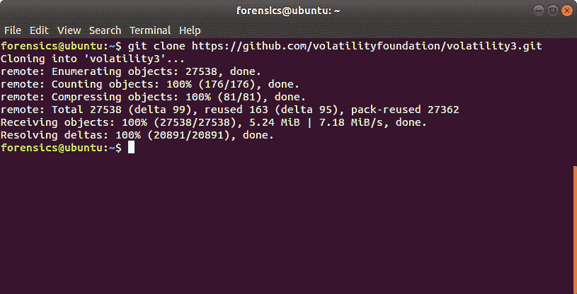

图 10.1 – 安装 Volatility

运行 `ls` 命令显示了 Volatility 框架中各种脚本和文件：

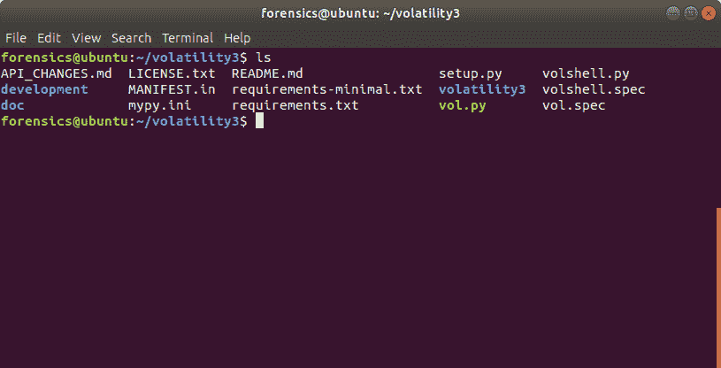

图 10.2 – 验证 Volatility 安装

你可以通过运行以下命令来访问 Volatility 的帮助菜单：

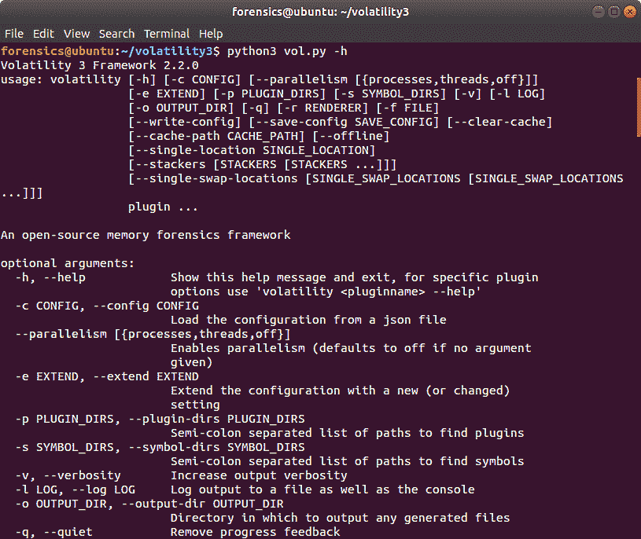

图 10.3 – Volatility 帮助菜单

### Volatility 命令

Volatility 使用简单的命令结构。当使用 Python 文件时，像我们这里一样，使用 Python 3 然后是 Volatility Python 文件。接下来，指明文件路径，最后是插件。附加参数取决于插件；你将在我们接下来讨论的几个插件中看到这一点。命令行应该如下所示：

```
forensics@ubuntu:~/volatility3$ python3 vol.py -f <Memory Image File> <operatingsystem.plugin>
```

让我们继续介绍一些可以在 Volatility 中使用的插件。

### Volatility 图像信息

首先，我们将通过获取一些关于内存镜像及其来源系统的初步信息开始。即使分析人员确定了操作系统，运行内存镜像并使用 Volatility 的 `windows.info` 插件仍然是一种良好的实践。该插件的输出会识别出内存镜像的潜在配置文件，这对于使用其他插件至关重要。一般来说，Volatility 的语法由内存镜像的路径和特定插件组成。在这种情况下，使用以下命令：

```
forensics@ubuntu:~/volatility3$ python3 vol.py -f /home/forensics/EvidenceFiles/MemoryImages/cridex.vmem windows.info
```

这将生成以下结果：

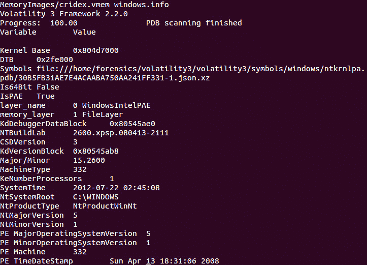

图 10.4 – windows.info 插件

在这种情况下，`NTBuildLab` 字段表明该内存镜像来自 Windows XP 计算机。接下来，让我们开始分析 Windows 进程信息。

### Volatility 进程分析

根据 SANS 六步法，首先讨论的是那些提供有关系统在内存捕获时运行进程数据的插件。目标是识别那些看起来可疑的进程，并识别与其相关的任何数据。

#### 进程列表

第一个插件是`windows.pslist`插件。这个插件列出了当前在内存中运行的进程。它输出偏移量、进程名称、PID、线程和句柄的数量，以及进程启动和退出的日期和时间。由于`pslist`插件遍历的是由**PsActiveProcessHead**指示的双向链表，因此无法检测到隐藏或未链接的进程。要执行此插件，可以在命令提示符中输入以下内容：

```
forensics@ubuntu:~/volatility3$ python3 vol.py -f /home/forensics/EvidenceFiles/MemoryImages/cridex.vmem windows.pslist
```

这将产生以下输出：

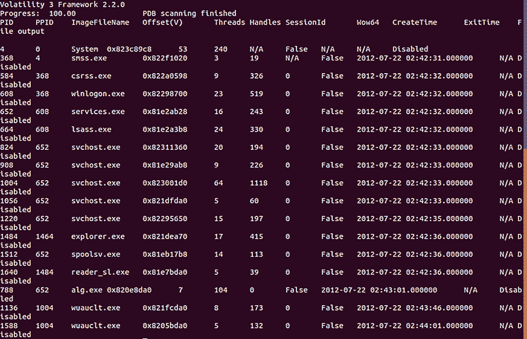

图 10.5 – 进程列表

对输出的初步分析确实显示了一个可疑的条目。根据粗略检查，执行了一个名为`reader_sl.exe`的文件。这个怀疑主要基于非标准的文件名，但随着我们进一步深入分析，我们将获得更多关于这个文件的上下文和洞察。

#### 进程扫描

`windows.psscan`插件允许分析员检查已终止的进程。正如我们之前所讨论的，`pslist`仅显示活动进程。`psscan`可以提供关于是否存在根套件的可能性，特别是在检查那些已经被取消链接或隐藏的进程时。执行以下命令可以启动插件：

```
forensics@ubuntu:~/volatility3$ python3 vol.py -f /home/forensics/EvidenceFiles/MemoryImages/cridex.vmem windows.psscan
```

这个命令将产生以下输出：

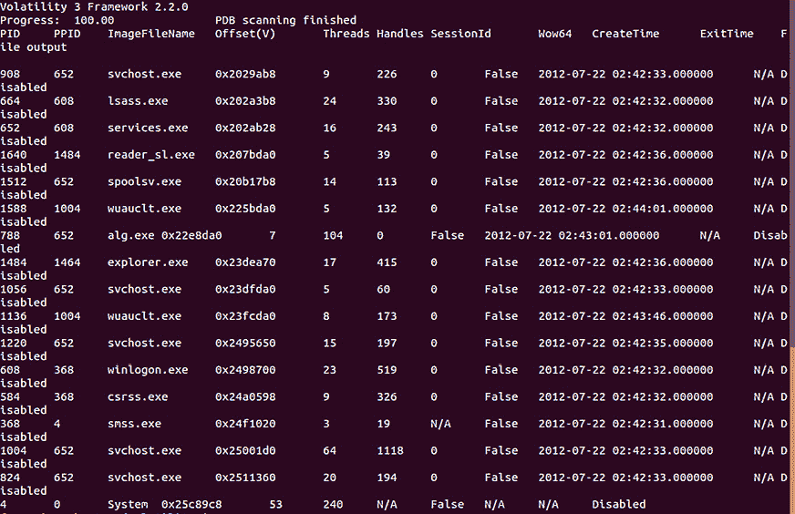

图 10.6 – 进程扫描

从这个插件的输出来看，似乎没有额外的进程已退出。响应人员可以开始查看现有进程，找出可能看起来是恶意的进程。

#### 进程树

通常，响应人员需要查看子进程是在哪些父进程下执行的。系统被入侵的一个标志是识别出一个在正常父进程之外执行的进程。`windows.pstree`插件为检查人员提供了一个树状结构，能够识别执行潜在可疑进程的父进程。使用以下命令，可以在运行 Cridex 映像时启用这个插件：

```
forensics@ubuntu:~/volatility3$ python3 vol.py -f /home/forensics/EvidenceFiles/MemoryImages/cridex.vmem windows.pstree
```

这个命令将产生以下输出：

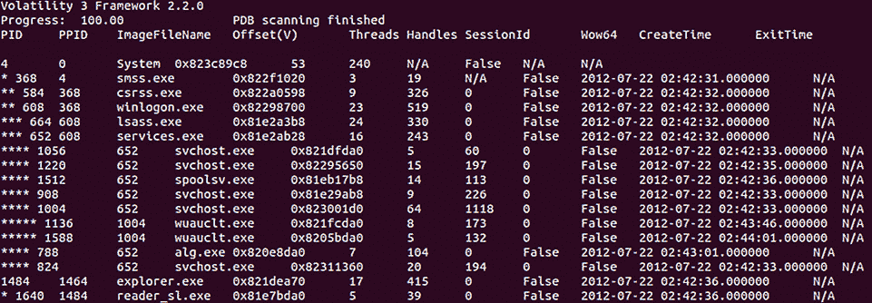

图 10.7 – 进程树

对这三个插件结果的分析显示了一个有趣的条目。PID 1640 与`reader_sl.exe`可执行文件相关联。响应人员可以集中关注这个进程，因为它可能看起来不像是应该运行的应用程序。此外，父 PID 显示它是通过 Windows 资源管理器运行的：

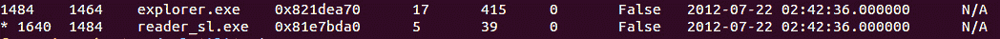

图 10.8 – 可疑进程

在此，响应者可以用额外的数据补充现有的进程数据，例如加载了哪些 DLL 和其他辅助数据。

#### DLL 列表

响应者还可以检查与进程相关的加载 DLL 文件。这允许分析员确定可疑进程在执行时是否访问了这些文件。例如，如果响应者想检查作为可疑进程一部分加载的 DLL 文件（PID 1640），可以运行以下命令：

```
forensics@ubuntu:~/volatility3$ python3 vol.py -f /home/forensics/EvidenceFiles/MemoryImages/cridex.vmem windows.dlllist --pid 1640
```

该命令生成以下输出：

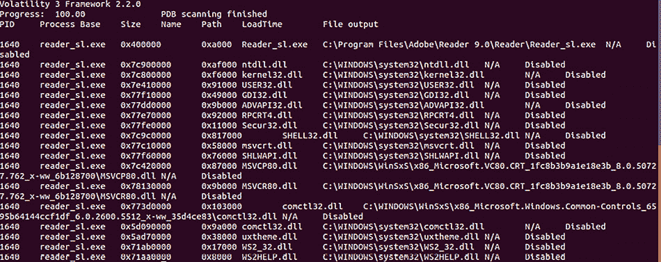

图 10.9 – 关联的 DLL 文件

从这里开始，分析员可能通过分析加载的各种 DLL 文件来确定进程的一些功能。稍后在本章中，将获取这些 DLL 文件以供进一步检查。

#### `windows.handles` 插件

`windows.handles`插件允许分析员查看现有进程中打开的句柄类型。这些句柄是操作系统管理的资源的引用。该数据为响应者提供了应用程序或进程使用的特定内存块的理解。此数据包括广泛的信息，例如与该进程相关的注册表键和文件。要识别先前确定的 PID 1640 的打开句柄，可以使用以下命令：

```
forensics@ubuntu:~/volatility3$ python3 vol.py -f /home/forensics/EvidenceFiles/MemoryImages/cridex.vmem windows.handles --pid 1640
```

该命令生成以下输出：

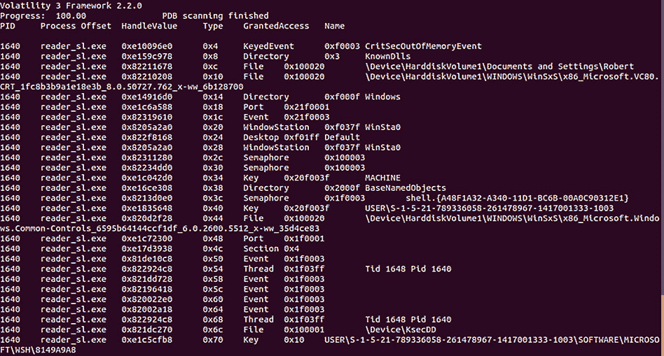

图 10.10 – 句柄输出

如输出所示，嫌疑进程有多个打开的句柄进程、线程和注册表键。这些可能成为未来重要的数据点，并提供一些关于`reader_sl.exe`可执行文件行为的线索。

#### LDR 模块

恶意软件编写者常用的一种做法是尝试隐藏恶意软件的活动。一种技术是试图隐藏与恶意代码相关的 DLL 文件。这可以通过将可疑的 DLL 从 `windows.ldrmodules` 插件中取消链接来实现，该插件会比较进程列表并确定它们是否存在于 PEB 中。以下命令在 Cridex 镜像文件上运行 `windows.ldrmodules`：

```
forensics@ubuntu:~/volatility3$ python3 vol.py -f /home/forensics/EvidenceFiles/MemoryImages/cridex.vmem windows.ldrmodules –pid 1640
```

这将生成以下输出：

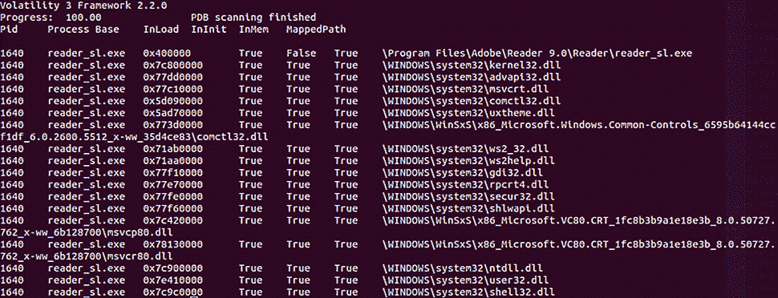

图 10.11 – LDR 模块输出

审查输出时，顶部行显示了一个有趣的条目。从该输出中，`reader_sl.exe`文件需要进一步调查。

#### Malfind

对手使用各种代码注入技术来运行恶意软件。Volatility 的`windows.malfind`插件显示可能包含注入代码的内存范围。运行以下命令：

```
forensics@ubuntu:~/volatility3$ python3 vol.py -f /home/forensics/EvidenceFiles/MemoryImages/cridex.vmem windows.malfind
```

这将生成以下简化的输出：

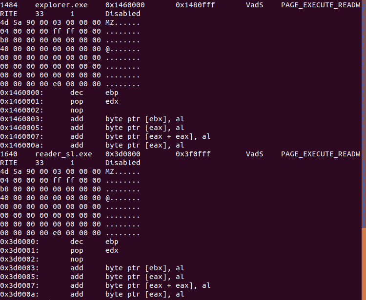

图 10.12 – Malfind 输出

在此屏幕截图中，两个进程 `explorer.exe` 和 `reader_sl.exe` 被标识为可执行文件，因为两个文件都有 MZ 头。`malfind` 插件不会自动标识这些进程是恶意软件，但表示应该进行进一步的分析。在这种情况下，我们将查看如何从内存中提取与 `reader_sl.exe` 相关的代码，并提取相关的 DLL 文件。

#### Dumpfiles

现在我们已经识别出疑似文件 `reader_sl.exe`，接下来使用 `windows.dumpfiles` 插件。在这种情况下，插件需要一个输出文件。在这里，我们将输出 `/home/forensics/EvidenceFiles/PID1640Dump` 目录。最后，使用进程 ID 1640 而不是文件名。整体命令如下所示：

```
forensics@ubuntu:~/volatility3$ python3 vol.py -f /home/forensics/EvidenceFiles/MemoryImages/cridex.vmem -o /home/forensics/EvidenceFiles/PID1640Dump/ windows.dumpfiles --pid 1640
```

该命令输出以下内容：

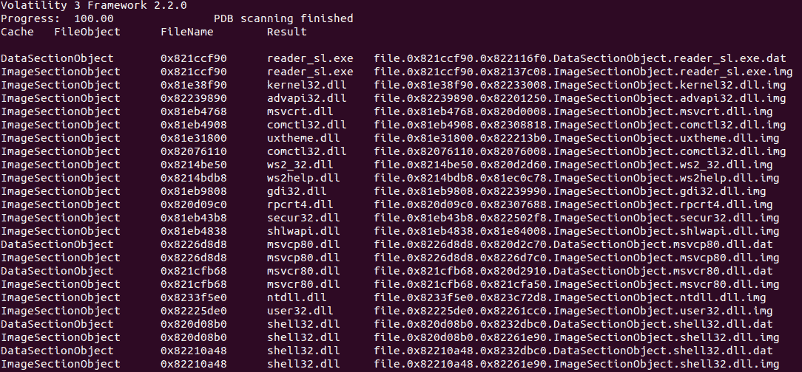

图 10.13 – Dumpfiles 输出

在这种情况下，`reader_sl.exe` 可执行文件有 `.dat` 和 `.img` 文件，以及相应的 DLL 文件。通过使用十六进制编辑器查看 `reader_sl.exe` 图像文件，我们可以看到头信息：

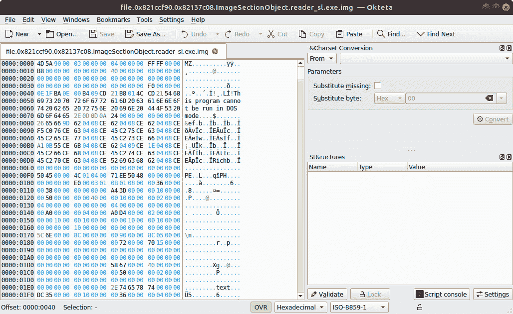

图 10.14 – reader_sl.exe 的十六进制视图

接下来，获取文件的 MD5 哈希值可以让我们在 VirusTotal 上搜索文件的任何信息。可以通过运行以下命令来获取哈希值：

```
forensics@ubuntu:~/EvidenceFiles/PID1640Dump$ md5sum file.0x821ccf90.0x82137c08.ImageSectionObject.reader_sl.exe.img
```

这将输出 `2a63509ad62eeeed0564dcb0981d90e1` 哈希值。通过 VirusTotal 检查，得到以下输出：

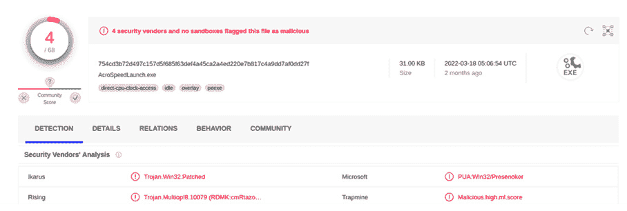

图 10.15 – VirusTotal 结果

尽管仅有反病毒公司指出文件哈希值是恶意的可能看起来有些奇怪，但这确实提出了一个要点：Volatility 只会输出内存中包含的代码，而不是整个文件。在提取代码时，必须牢记这一点。即使反病毒提供商指出它不是恶意的，与该代码关联的文件可能仍然是恶意的。根据调查情况，提取的数据必须经过更详细的恶意软件分析。

## Volatility 工作台

使用 Volatility 的一个方面是使用命令行。使用命令行运行 Volatility 的主要优势是能够创建自动化命令的脚本并将输出保存为文本文件。对于不习惯使用 Volatility 和命令行的分析人员来说，缺点是他们可能需要不断参考命令或与正确的语法作斗争。

对于希望使用图形界面版本的 Volatility 的分析师，可以选择 PassMark Software 的 Volatility Workbench。该工具可以从 [`www.osforensics.com/tools/volatility-workbench.html`](https://www.osforensics.com/tools/volatility-workbench.html) 下载并安装在 Windows 平台上。安装后，图形界面允许分析师导航到映像文件并设置`windows.pslist`插件，以便对 Windows 内存捕获进行分析：

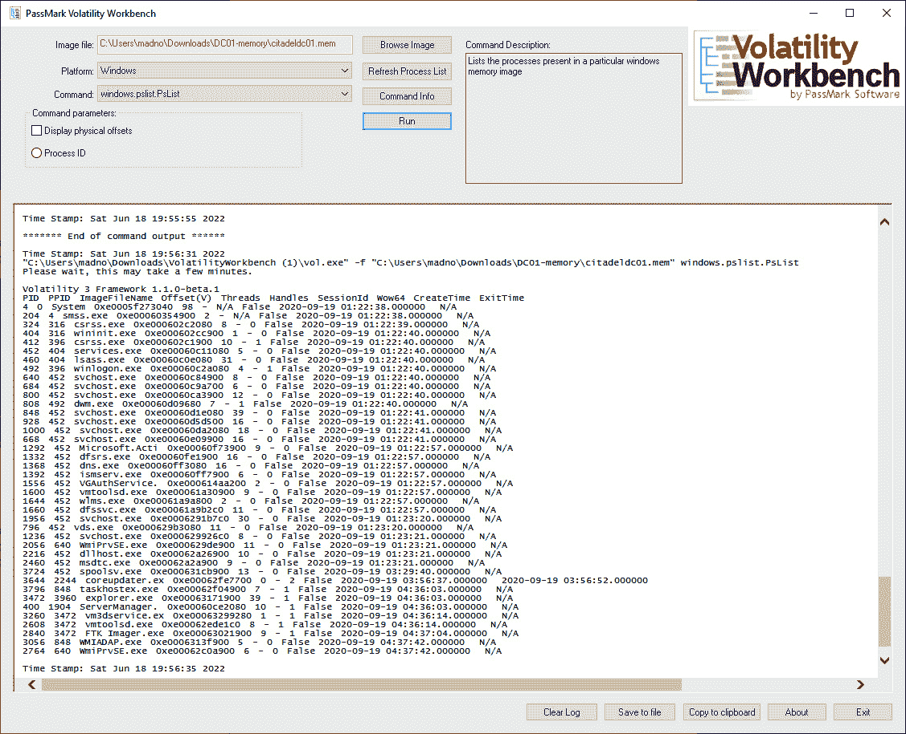

图 10.16 – Volatility Workbench

该工具还具有其他功能，例如记录所有命令和输出，并能够将它们复制到剪贴板，以便将输出包括在事件报告中。如前所述，这是一个非常适合那些不需要命令行额外功能和灵活性的分析师的可靠选项。

接下来，我们将介绍如何使用简单的 Strings 工具和 GREP 来增强内存分析。

# 使用 Strings 进行内存分析

在上一节中，我们查看的 Volatility 工具集中于内存映像中已映射的区域。如果数据未正确映射，这些工具将无法提取数据并正确显示。这是这些内存分析工具的一个缺点。很多数据会变得无结构，并且对这些工具不可见。这可能发生在网络连接被关闭或进程退出时。即使这些数据在通过 Volatility 检查 RAM 时无法显示，痕迹证据仍然可能存在。其他证据，例如页面文件，也包含未映射且可以搜索的证据。

一个有用的工具，用于提取这些痕迹的是字符串（Strings）命令，它在许多 Linux 和 Windows 操作系统中都可用。Strings 允许响应者搜索可读的字符字符串。给定一组关键字或**全局正则表达式打印**（**GREP**）命令，响应者可能能够提取更多的相关数据，即使是来自可能由于恶意软件或不当采集而损坏的 RAM 捕获。

## 安装 Strings

Strings 经常会在许多 Linux 发行版中预装。Windows 提供了一个独立的可执行文件，用于字符串搜索，地址为 [`docs.microsoft.com/en-us/sysinternals/downloads/strings`](https://docs.microsoft.com/en-us/sysinternals/downloads/strings)。如果 Strings 在响应者选择的 Linux 平台上未安装，可以使用以下命令进行安装：

```
forensics@ubuntu:~$ sudo apt install binutils
```

对于一个相当简单的工具，Strings 是一种强大的方法，可以在大量数据中搜索特定的基于关键字的字符串。在本书中，重点将放在使用以下 Strings 语法提取特定数据点：

```
forensics@ubuntu:~$  strings <file name> | grep <Regular Expression> 
```

## 常见的 Strings 搜索

网络痕迹，如 IP 地址和域名，通常可以在页面文件或内存中找到。要查找 IP 地址，请使用 `strings` 命令，并添加以下参数：

```
forensics@ubuntu:~$  strings pagefile.sys | grep -oE "\b([0-9]{1,3}\.){3}[0-9]{1,3}\b"
```

要查找 URI 和 URL，请分别使用`http`或`https`：

```
forensics@ubuntu:~$  strings pagefile.sys  | grep "^https?://" | sort | uniq | less 
```

也可能会发现电子邮件地址的残留痕迹。这在调查可能的网络钓鱼攻击时非常有用。要查找电子邮件地址，请使用以下命令：

```
forensics@ubuntu:~$ strings pagefile.sys | egrep '([[:alnum:]_.-]{1,64}+@[[:alnum:]_.-]{2,255}+?\.[[:alpha:].]{2,4})'
```

搜索词和参数的种类繁多，本章无法覆盖所有内容。主要的收获是，分析师可以通过内存镜像和交换文件进行字符串搜索，作为整体内存分析的一部分。

# 小结

本章讨论了内存分析的两个主要主题。首先，我们介绍了可用的数据点和可以遵循的方法论。此外，还探讨了多个工具，如 Volatility、Volatility Workbench 和 Strings。除了对这些工具的概述外，还探讨了它们的一些功能。这仅仅是每个工具为事件响应分析师提供的功能的冰山一角。这些工具结合系统 RAM 分析方法论，可以为分析师提供强大的工具，以确定系统是否已被攻破。随着恶意软件变得更加先进，包括完全在 RAM 中执行的恶意软件，分析师必须将内存分析纳入其能力范围。将这些技术与网络证据收集相结合，可以为分析师及其组织提供强大的工具，帮助识别和修复安全事件。

在下一章中，我们将深入探讨系统的永久存储检查。

# 问题

请回答以下问题以测试您对本章内容的掌握情况：

1.  通过内存分析可以找到哪些数据点？

    1.  正在运行的进程

    1.  网络连接

    1.  命令历史

    1.  上述所有内容

1.  什么不属于网络连接方法的一部分？

    1.  进程名称

    1.  父进程 ID

    1.  检查是否有 Rootkit 迹象

    1.  相关实体

1.  转储与进程相关的文件永远不会将恶意软件引入响应者的系统。

    1.  正确

    1.  错误

1.  内存分析的主要目标之一是获取恶意进程或可执行文件以便进一步分析。

    1.  正确

    1.  错误

# 进一步阅读

要了解本章涉及的主题，参见以下内容：

+   *SANS 内存取证备忘单*： [`digital-forensics.sans.org/blog/2017/12/11/updated-memory-forensics-cheat-sheet`](https://digital-forensics.sans.org/blog/2017/12/11/updated-memory-forensics-cheat-sheet)

+   *内存取证的艺术*： [`www.memoryanalysis.net/amf`](https://www.memoryanalysis.net/amf)
