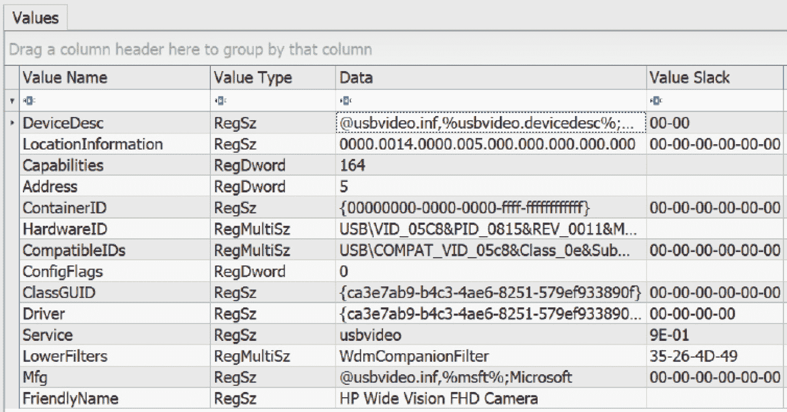

# 第十一章：分析系统存储

迄今为止，已分析的证据主要集中在网络流量或系统内存中获得的元素。尽管通过这些证据来源可能会揭示事件的根本原因，但理解如何从系统存储中获取证据材料仍然很重要，无论是从可移动存储设备如 USB 设备，还是从更大的连接磁盘驱动器。这些存储容器携带着大量的数据，事件响应分析师可以利用这些数据来确定根本原因。需要注意的是，本章只能粗略介绍这一主题，因为已有整本书籍专门探讨存储中可用的法医证据的深度。

为了更好地理解系统存储分析，本章将重点介绍以下主题：

+   **法医平台**：我们可以使用各种商业和开源平台进行系统存储分析。本节将介绍我们可以使用的关键特性和潜在选项。

+   **Autopsy**：为了提供一个可以在系统存储分析中利用的开源平台，本章的大部分内容将使用 Autopsy 工具。通过利用测试镜像，我们将突出其一些功能。

+   **主文件表（MFT）分析**：主文件表包含系统中所有文件的完整列表，是响应人员的关键数据来源。本节将介绍如何提取和分析 MFT。

+   **预取分析**：确定一个潜在恶意文件是否被执行是事件调查中的关键环节。本节将介绍如何提取 Windows 预取文件、处理并进行分析。

+   **注册表分析**：注册表是恶意软件编写者和其他攻击者的常见目标，响应人员应熟悉注册表分析。本节将概述如何提取和分析注册表。

系统存储分析是一个复杂的过程。其深度和广度无法在一个章节中全面探讨；因此，我们希望本章能提供一些具体的关注领域，帮助响应人员更好地理解一些可以使用的工具，以及了解一些关键数据的作用。

# 法医平台

在过去 15 年中，磁盘法医平台的能力得到了增强。对于事件响应分析师来说，可以选择不同类型的平台来检查磁盘驱动器。通常，使用这些平台的限制因素是更强大系统的成本，而低成本的替代方案对于事件响应团队来说也能同样有效。

在进行磁盘分析时，应该考虑几个因素。首先，平台是否经过测试？一些组织会测试平台的有效性，比如国家标准与技术研究院计算机法医工具测试项目（[`www.cftt.nist.gov/`](https://www.cftt.nist.gov/)）。其次，必须审查该工具在刑事和民事诉讼中的使用情况。虽然没有统一的法院公认标准，但工具应遵循证据规则。使用未经测试或不符合证据规则的平台，可能导致证据在法律程序中被排除。在其他更严重的后果中，可能导致分析人员得出错误结论。

法医工具的可靠性

一个未经测试且法医上不可靠的工具集的例子出现在康涅狄格州诉 Amero 一案中。在这个案件中，一家执法机构使用了不可靠的法医方法和工具，将一名女性定罪，指控她允许儿童看到色情的弹出广告。对此案件方法和事实的后续审查表明，法医检查存在严重缺陷。对此案件的详细审查也可以通过《数字法医、安全与法律期刊》访问，链接为：[`commons.erau.edu/jdfsl/vol7/iss2/5/`](https://commons.erau.edu/jdfsl/vol7/iss2/5/)。

最后一个考虑因素是工具如何融入整体的事件响应规划。例如，商业磁盘法医工具在定位图像和网页证据方面非常出色。它们也非常擅长从嫌疑人的硬盘中提取数据。这通常是因为法医软件被执法机构用作调查儿童剥削犯罪的工具。因此，这一能力对对付此类嫌疑人的刑事案件至关重要。虽然这些功能非常优秀，但事件响应人员可能更关注能够用于关键词搜索和时间线分析的工具，以便重建事件发生前、发生中和发生后的系列事件。

虽然大多数商业和免费法医平台都具有多种功能，但有几个常见功能对事件响应人员非常有用：

+   **文件结构视图**：通常，能够查看正在检查的磁盘的文件结构非常重要。法医平台应该具备查看文件结构的能力，并允许响应人员快速查看嫌疑系统中已知位置的文件。

+   **十六进制查看器**：能够以十六进制查看文件使得响应人员能够更细致地审视正在检查的文件。在涉及恶意软件或其他定制化攻击的案件中，这可能会非常有帮助。

+   **网页痕迹**：由于大多数数据都存储在与网页搜索相关的磁盘上，法医平台应具备检查这些数据片段的能力。这在检查社会工程攻击时非常有用，尤其是在用户访问恶意网站时。

+   **电子邮件提取**：事件响应人员可能会被召集到涉及恶意员工参与非法活动或违反政策的案件中。通常，这类行为的证据存在于嫌疑系统的电子邮件中。拥有一个能够提取这些数据并立即查看的平台，有助于分析人员查看嫌疑系统与其他系统之间的通信。

+   **图像查看器**：通常，需要查看系统中保存的图像。如我们之前提到的，执法部门可能会利用此功能判断系统中是否存在儿童性虐待的证据。事件响应人员可以利用这些功能判断是否存在政策违规行为。

+   **元数据**：关于文件的关键数据，如创建日期和时间、文件哈希值以及嫌疑文件在磁盘上的位置，对于检查与事件相关的系统非常有用。例如，结合恶意软件分析，某个应用程序运行的时间与网络活动相结合，可以帮助分析人员确定实际执行的可执行文件。

在商业选择方面，以下三个平台被普遍认为是可靠的，并被世界各地的商业和政府机构使用。每个平台都采用了我们之前描述的功能，以及其他一些更专业的工具：

+   **OpenText EnCase**：EnCase 无疑是最著名的法医平台，具有长期历史，常用于重大刑事调查中，例如 BTK 杀手案件。EnCase 是一个功能丰富的平台，在训练有素的分析人员手中，它是一个强大的工具。除了磁盘取证，EnCase 还集成了针对移动设备的功能。这对于可能需要分析不仅是磁盘，而且是与事件相关的移动设备的组织来说，是一个强大的能力。

+   **AccessData 法医工具包**：在*第六章*中，FTK Imager 工具被用来获取磁盘和内存证据。这个工具是 AccessData 提供的一系列专门为磁盘取证设计的工具的一部分。除了 Imager 工具，AccessData 还提供一个功能齐全的法医平台，允许响应人员执行与事件相关的一系列任务。FTK 被联邦调查局（**FBI**）等执法机构使用，并且在协助响应人员进行事件调查方面已证明非常有效。

+   **X-Ways Forensics**：FTK 和 EnCase 的一个缺点是价格昂贵。这些平台每年可能需要数千美元。对于大型组织，如政府机构和大企业，成本与功能的权衡可能不是问题。但对于小型组织来说，这些平台可能会因成本过高而无法使用。一个功能丰富的法医平台替代方案是 X-Ways。这个平台可以执行各种任务，但成本仅为商业平台的一小部分。X-Ways 的另一个好处是它对资源的需求较低，可以通过 USB 设备运行，这使它成为一个理想的替代平台，尤其适用于事件响应。

这些平台中的每一个都具有丰富的功能集，并为响应者提供了强大的工具，用于执行各种法医任务。这些平台中的具体工具超出了本书的范围。因此，建议响应者接受这些平台的使用培训，以确保他们充分了解这些工具的功能。

# Autopsy

另一个商业法医程序的替代方案是 Autopsy。Autopsy 是一个基于图形用户界面（GUI）的法医平台，基于开源工具集 The Sleuth Kit。这个开源平台提供了商业平台中常见的功能，包括时间线分析、关键字搜索、网页和电子邮件文物，以及根据已知不良文件哈希值过滤结果的能力。其主要特点之一是易于使用。这使得事件响应者能够拥有一个轻量级平台，专注于关键任务并获取所需的关键证据。

## 安装 Autopsy

我们之前讨论过的几种 Linux 发行版已经预装了 Autopsy。响应者应确保他们使用的平台是最新的，这是一项良好的实践。对于 Windows 操作系统，可以下载位于[`www.sleuthkit.org/autopsy/download.php`](https://www.sleuthkit.org/autopsy/download.php)的 Microsoft 自安装程序文件。下载后，执行 MSI 文件并选择安装位置。完成后，应用程序就可以开始使用了。

## 开始一个案件

一旦安装了 Autopsy，分析员可以在几乎不需要预先配置的情况下打开案件。以下步骤将介绍如何打开一个新案件的过程：

1.  在开始分析之前，确保整个磁盘映像文件位于一个单独的目录中。这将使整个映像在分析过程中都能被使用：


图 11.1 – E01 文件

在上面的截图中，已经从一个嫌疑系统中获取了一个映像文件。该映像已被分割成两个独立的文件。回顾*第八章*，像 FTK Imager 这样的成像应用程序会将映像分割成多个文件。只要这些分割后的文件位于同一目录中，Autopsy 就能够将这两个文件合并并重建整个成像的卷。

示例映像文件

对于我们的 Autopsy 检查，可以在 [`cfreds.nist.gov/all/MagnetForensics/2022WindowsMagnetCTF`](https://cfreds.nist.gov/all/MagnetForensics/2022WindowsMagnetCTF) 找到一个来自 Windows 10 系统的示例镜像文件。为了更多的练习，可以从位于 [`www.cfreds.nist.gov/`](https://www.cfreds.nist.gov/) 的计算机取证参考数据集下载额外的测试镜像。

1.  打开 Autopsy，以下窗口将出现；选择 **New Case**：


图 11.2 – Autopsy – 创建新案件

1.  将会出现第二个窗口，分析师将在其中输入案件标题。此外，还可以设置存储与案件相关文件的 Autopsy 路径。这在某些情况下非常有用，例如当分析师必须将文件放置在特定容器中时，包括外部硬盘。完成后，点击 **Next**：


图 11.3 – Autopsy – 新案件信息

1.  在下一个窗口中，响应者应输入案件编号、姓名、联系方式以及案件的简要描述，填写在 **Notes** 中。点击 **Finish**：


图 11.4 – 新案件信息 – 可选信息

## 添加证据

可以将案件视为一个容器，包含与事件相关的所有案件数据和证据。Autopsy 还允许分析师添加多个数据源，例如磁盘镜像和虚拟机磁盘。在此阶段，我们将加载 `E01` 文件作为数据源：

1.  输入案件详细信息后，分析师需要加载之前创建的镜像文件。点击 Autopsy 窗口左上角的 **Add Data Source** 按钮：


图 11.5 – 添加数据源 – 选择主机

Autopsy 可以自动检测主机名。如果分析师知道主机名，可以在 **Specific new host name** 字段中添加。根据最佳实践，如果已知，应始终输入主机名。完成后，点击 **Next**。

1.  选择适当的数据源类型。在这种情况下，检查将针对一个法医获取的图像文件进行。Autopsy 也可以检查 `.vmdk` 文件。这在虚拟化环境中非常方便，因为可以对虚拟机文件进行检查，而无需通过 FTK Imager 等工具获取它：


图 11.6 – 添加数据源 – 选择数据源类型

1.  选择数据源类型后，浏览到图像所在位置。该文件夹包含多个图像文件；选择以`E01`结尾的文件。加载此文件后，将包括该文件夹中所有随后的图像文件。接下来，选择适当的时区。作为最佳实践，分析师应选择在整个调查过程中统一的时区。在这种情况下，最佳选择是选择 UTC。完成后，点击**下一步**：


图 11.7 – 选择 E01 文件

1.  下一屏幕允许分析师定制正在使用的模块。根据调查的类型，其中一些选项可以取消勾选。然而，刚开始时，分析师应选择所有选项，以确保所有必要的信息都能进行检查。

另一个选项是处理未分配空间（这非常重要！）。这将捕捉硬盘上当前未分配给数据的所有信息。有些方法可以利用未分配空间来隐藏信息。完成后，点击**下一步**：


图 11.8 – 添加数据源 – 配置数据导入

这将开始处理过程：


图 11.9 – 数据源处理

1.  在下一屏幕上，确认数据源已加载，然后点击**完成**。这将开始将 E01 文件作为数据源添加的过程：


图 11.10 – 数据源完成

Autopsy 现在将开始分析来自图像的文件。根据图像的大小，这个过程可能需要几分钟到几个小时不等。屏幕右下角的进度条会显示处理进度。这个过程的时间通常取决于计算机的处理速度以及图像文件的大小。此时，即使额外的处理仍在进行，Autopsy 也会开始填充左侧面板中的特定字段。GUI 的右下角将显示处理的进度：


图 11.11 – 证据源处理

如前所述，处理可能需要一些时间，具体取决于取证系统的规格和文件的大小。分析师可以在了解可能并非所有数据都可用的情况下进行一些分析。

## 浏览 Autopsy

Autopsy GUI 分为三个主要部分。这些部分显示与系统和特定文件相关的详细信息。当 Autopsy 完成处理新案件或打开现有案件时，分析师将看到以下窗口：


图 11.12 – Autopsy GUI

如前所示，Autopsy 分为三个主要窗格。其中第一个是左侧窗格，它包含数据源、文件结构以及搜索结果。点击加号（`Program Files`目录，位于系统上）：


图 11.13 – Autopsy 的中央窗格

最后，底部窗格包含有关中央窗格中单个文件的元数据和其他信息。在这个例子中，选择了`desktop.ini`文件。点击**文件元数据**标签，显示该文件的特定信息：


图 11.14 – 文件元数据

最后，通过点击**十六进制**标签，可以查看文件的十六进制内容：


图 11.15 – 十六进制视图

如果分析员希望检查一个应用程序或其他疑似恶意软件的文件，这个视图非常适合。

Autopsy 提供了一些可以在其他商业平台上找到的操作和分析功能。然而，需要注意的是，在更复杂的调查中，可能需要使用更先进的平台。Autopsy 还为新手提供了一个更易于使用的平台，使他们可以在使用更先进的商业解决方案之前，先积累一些磁盘取证的经验。

## 审查案件

一旦案件处理完成，左侧窗格将显示系统中找到的工件数量：


图 11.16 – Autopsy 的工件窗格

在前面的截图中，**数据工件**部分列出了几个项目。这些项目包括查看已安装的程序、操作系统信息以及最近的文档。Autopsy 的另一个关键功能是能够检查镜像文件的整个文件夹结构。点击**数据源**旁边的加号（**+**）可以展开整个文件夹结构。如果分析员通过其他来源确定了嫌疑文件的位置，这一点非常有用：


图 11.17 – 数据源

通过使用 Autopsy，可以检查不同的数据点。具体搜索什么内容以及如何搜索，通常由调查中的事件类型或检查内容来决定。例如，源自被攻陷网站的恶意软件感染可能涉及检查系统中用户可能输入或通过浏览器访问的 URL。此外，还可以通过检查系统内存来获取信息，进而找到实际的文件，我们在上一章中有提到这一点。例如，如果分析员能够定位到一个可疑进程，并且随后能够找到可执行文件，他们可以使用 Autopsy 查找该可执行文件最后一次被启动的时间。这样可以为响应人员提供一个时间点，以便他们检查其他系统是否存在被攻陷的证据。

在另一种情况下，响应人员可能需要确定员工是否访问了机密文件，以便将其传递给竞争对手。这可能涉及检查系统中访问文件的时间和日期、可能使用的电子邮件地址、访问过的外部云存储站点或连接到系统的 USB 存储设备。最后，所有这些文件的完整列表可能为移出的机密文件提供一些线索。

### Web 工件

在某些情况下，可能需要检查系统是否存在用户进行的恶意活动证据。之前，我们提到过访问基于云的存储，在那里一个恶意内部人员上传了机密文件。在其他情况下，社交工程攻击可能使一个毫无防备的员工访问一个被攻陷的网站，随后下载恶意软件。在这两种情况下，Autopsy 为我们提供了检查多个网页工件区域的能力。

这些网页工件中的第一个是**Web 历史**。如果发生涉及用户访问恶意软件交付网站的社交工程攻击，这些数据可能为访问的特定 URL 提供一些线索。然后，可以提取该 URL 并与来自内部或外部来源的已知恶意网站列表进行比较。在其他情况下，如果内部人员访问了外部云存储网站，Web 历史记录可能提供这一活动的证据。让我们详细看一下这个案例：

1.  点击左侧窗格中的**Web 历史**部分将打开中间窗格，并显示系统访问过的 URL 的详细信息：


图 11.18 – Web 历史

1.  在前面的截图中，Autopsy 显示该系统访问了网站 [hacker-simulator.com](http://hacker-simulator.com)。Autopsy 提供的进一步信息使分析人员能够评估其他信息，如工件的位置和使用的浏览器类型。通过**数据工件**选项卡，可以在下方的**结果**面板中访问这些信息：


图 11.19 – 网络历史元数据

1.  调查中另一个有用的数据来源是**数据工件**部分中的**网络下载**。威胁行为者常用的一种技术是引导用户或脚本下载二次利用或恶意软件。这可能包括黑客工具和其他脚本，通常利用系统从网站下载的功能。在这种情况下，如果点击**网络下载**，我们可以看到下载文件的路径，以及文件来源的网址：


图 11.20 – 网络下载

1.  此外，Autopsy 还提供了正在检查的特定下载文件的元数据。点击**文件元数据**选项卡后，会显示以下数据：


图 11.21 – 网络下载元数据

如前面的截图所示，有一些关于已下载文件的更多细节。例如，分析人员可以收集时间信息、文件位置和 MD5 哈希值，这些信息可用于比较进一步检查的任何提取文件。在某些情况下，嫌疑人可能决定从系统中删除浏览历史以隐藏任何恶意活动。另一个可能提供恶意内部人员访问网站证据的位置是网络 Cookie。这些可以通过左侧面板中的**网络 Cookie**访问。点击该选项后，会显示仍然保留在系统中的 Cookie 列表：


图 11.22 – 网络 Cookie

根据事件的类型，网络工件可能会发挥重要作用。Autopsy 对此提供了一些功能，但应急响应人员可能会发现其他商业解决方案提供了更为强大的平台。Magnet Forensics 提供的 Evidence Finder ([www.magnetforensics.com](http://www.magnetforensics.com)) 会扫描整个系统的网络工件，并以易于分析人员查看的方式展示这些数据。此类商业解决方案的另一个主要优势是其功能不断更新。根据互联网和网络工件搜索的频率，使用此类工具可能会带来益处。

### 电子邮件

定位可疑电子邮件继续是事件响应者经常进行的任务。这可能包括外部引起的事件，如社会工程，响应者可能被要求定位带有恶意软件的可疑电子邮件。在其他情况下，恶意内部人员可能已发送或接收到违反公司政策或不当通信。在这些情况下，响应者可能被要求恢复这些电子邮件，以便包括在解雇程序或法律行动中。

Autopsy 可以定位系统中包含的电子邮件。通过这些电子邮件，他们可能能够识别一个或多个可疑的电子邮件和域，进一步研究是否与社会工程或其他恶意活动相关。只需单击**关键字命中**，然后单击左侧窗格中的**电子邮件地址**选项卡。从那里，分析师可以看到系统中的电子邮件地址：


图 11.23 – 电子邮件地址

接下来，让我们看一下已连接的设备。

### 已连接的设备

对分析师有用的另一个关键证据是关于特定设备何时连接到系统的数据。在恶意内部人员试图窃取机密文件的情况下，了解他们是否使用了 USB 设备将会很有帮助。Autopsy 利用系统上的注册表设置来识别连接的设备类型及其最后使用时间。在这种情况下，单击左侧窗格中的**连接的设备**将产生以下结果：


图 11.24 – USB 设备

进入**数据工件**选项卡后，分析师可以识别设备类型以及 USB 设备连接的日期和时间：


图 11.25 – USB 设备工件

最后，对**源文件元数据**区域进行更详细的检查将显示可用于重建系统上访问 USB 设备的时间的其他数据：


图 11.26 – 设备条目元数据

接下来，让我们看一下已删除的文件。

### 已删除的文件

已删除的文件也可以部分或完全重建。当用户选择删除时，Windows 操作系统不会删除文件。操作系统将标记删除文件在**主文件表**（**MTF**）中占用的空间为可用于写入新文件。因此，响应者可能能够查看未被覆盖的已删除文件。

固态驱动器

如在*第八章*中讨论的，记住法医分析员在检查**固态硬盘**（**SSD**）时面临的挑战。传统的硬盘驱动器即使在系统关闭后，仍然可以恢复已删除的文件。而在 SSD 上，操作系统通常会删除已删除的文件，以提高文件存储效率。如果您想了解更多信息，可以访问以下网站，它提供了关于这一点的详细分析：[`www.datanarro.com/the-impact-of-ssds-on-digital-`](https://www.datanarro.com/the-impact-of-ssds-on-digital-) forensics/。

要查看系统中的已删除文件，点击左侧面板中的**已删除文件**。在这里，分析员可以看到所有已标记为删除的文件：


图 11.27 – 已删除文件

从这里，分析员可以搜索已删除的文件。这些文件可能具有证据价值。例如，在恶意内部人员活动的案例中，如果在已删除的文件中发现多个敏感文件，并且这些文件都在相同的时间内被删除，这可能表明内部人员试图通过删除可疑文件来掩盖其痕迹。

### 关键字搜索

法医应用程序的一大优势是能够执行关键字搜索。随着磁盘驱动器容量的增大，响应者需要处理大量数据，这使得关键字搜索尤为重要。关键字通常来源于调查的其他元素或外部来源。例如，如果分析员正在调查恶意软件事件，他们可能会使用通过内存镜像分析得到的可疑 DLL 或可执行文件名称。在其他情况下，例如怀疑恶意内部人员访问了机密信息时，可以使用那些文档中的关键字（无论是秘密的还是机密的）来检查嫌疑人是否使用系统访问了这些文件。

Autopsy 可以执行关键字搜索，同时使用精确匹配或子字符串匹配。例如，假设分析员的任务是确定与 ZeroTier One 可执行文件有关的证据，该文件已在**Web Downloads**条目中找到。分析员的任务是定位任何可以表明该文件已被执行的痕迹证据，并尽可能识别用户。

分析员需要导航到右上角，在字段中输入`ZeroTier One`。在这种情况下，将使用精确匹配。一旦选择后，他们点击**搜索**按钮。左侧面板将指示该文本是否有命中结果。在这种情况下，定价决策有 82 次命中：


图 11.28 – 关键字搜索命中

如前面的截图所示，中央窗格将包含一个文件列表，这些文件包含了命中项。一个突出的文件是 **主文件表** 条目。该条目显示了文件首次放置在系统上的日期和时间，以及任何修改和更改：


图 11.29 – 主文件表条目

进一步审查显示了一个 Windows PowerShell 事件日志条目，表明该应用程序是由用户账户 Patrick 执行的，依据文件路径：


图 11.30 – 关键词搜索结果

深入查看命中项，Windows PowerShell 操作事件日志中有一个条目，表明该可执行文件与通过 PowerShell 脚本建立的网络连接相关联：


图 11.31 – 关键词 PowerShell 脚本

条目中进一步的内容是一个 Base64 编码的 PowerShell 脚本条目：


图 11.32 – Base64 PowerShell 脚本

综合来看，这可能指向一些可疑活动。例如，ZeroTier One 是一个商业 VPN 解决方案，因此它建立连接并不罕见。可疑的是 Base64 编码的 PowerShell 脚本，攻击者常用它下载额外的恶意软件或执行恶意操作。我们将在 *第十六章* 中详细了解一些这些脚本。

接下来，我们将看看 Autopsy 如何构建系统活动的时间线。

### 时间线分析

在调查事件时，了解应用程序或文件何时执行至关重要。时间戳有时可以在调查的其他方面找到，例如检查内存镜像时。此外，识别内存镜像中的特定 DLL 文件或可执行文件，可以与它们的访问日期和时间进行比较，以关联系统上观察到的其他活动。

时间归一化

数字取证中的一个方面需要重复强调的是，确保所有系统使用相同的时区。对于网络系统，这通常通过 **网络时间协议** (**NTP**) 来实现。有时系统无法通过 NTP 实现时间归一化。响应人员应特别注意理解应该使用的时区和同步方式。关于时间的最佳实践是将所有系统设置为 UTC，特别是当一个组织具有地理多样性时，这一点至关重要。

Autopsy 提供了专门用于时间线分析的功能。只需点击窗口顶部的 **时间线** 按钮，Autopsy 就会开始解析时间线数据的过程。根据被分析镜像文件的大小，这可能需要几分钟。完成后，以下窗口将打开：


图 11.33 – 时间轴查看器

从这里，分析人员可以使用几个功能。首先是屏幕左侧的文本筛选器。使用此功能，分析人员可以搜索文件中的特定文本。例如，分析人员已经确定名为 **ZeroTier One** 的可执行文件已在正在调查的系统上执行。如果分析人员想知道该文件是否在其他时间被访问过，他们可以将“定价”输入到 **文本筛选器** 框中，然后点击 **应用**，这将产生以下结果：


图 11.34 – 关键字时间轴

从这个图表中，分析人员可以通过点击彩色条形图，进一步深入查看文件被访问的具体时间。响应人员现在可以看到，这个可执行文件仅在某个特定日期和时间从该系统中被访问过。

接下来，我们将了解如何从磁盘镜像中提取特定的证据项，并使用附加工具进行处理。

# 主文件表分析

另一种可以用于时间轴分析的技术是利用外部工具分析 MFT。Autopsy 允许分析人员导出 MFT 并使用第三方工具进行分析。在此案例中，我们将使用 MFT Explorer，这是 Eric Zimmerman 开发的多个工具之一。

Eric Zimmerman 的工具

Eric Zimmerman 是一位前 FBI 特工、SANS 课程开发者以及数字取证专家。他开发了一套用于数据提取和分析的工具，工具可在 [`ericzimmerman.github.io/#!index.md`](https://ericzimmerman.github.io/#!index.md) 获取。此外，SANS 机构还创建了一个关于这些工具的备忘单，链接地址为 [`www.sans.org/posters/eric-zimmerman-tools-cheat-sheet/`](https://www.sans.org/posters/eric-zimmerman-tools-cheat-sheet/)。

在此情况下，我们将处理通过 Autopsy 检查的镜像中的 MFT。MFT 文件可以在文件系统的根目录中找到。找到 `$MFT` 文件，右键点击它，选择 **提取文件**，然后将文件保存到证据驱动器中。作为良好的实践，请将文件名更改为与案件相关的名称。

接下来，找到 `MFTECmd.exe` 可执行文件。以下命令处理 MFT，并将结果输出到 **逗号分隔值** (**CSV**) 文件：

```
C:\Users\forensics\Documents\ZimmmermanTools>MFTECmd.exe -f "D:\Suspect_$MFT" --csv "D:" --csvf SuspectMFT.csv
```

现在可以打开并检查 CSV 文件。在这种情况下，CSV 文件已通过 Microsoft Excel 打开。这样可以进行关键字搜索，并检查文件的时间和日期，以识别文件或文件在系统上的放置时间。回到之前的关键字搜索，我们可以使用 Excel 中的筛选选项。`ZeroTier` 关键字已被输入：


图 11.35 – ZeroTier 筛选 MFT 结果

MFT 的工作处理可能会因为数据量的原因变得复杂。在这种情况下，MFT 有超过 410,000 个单独的条目，可能需要逐一排序。最好有一个起点，比如日期和时间，或者文件名进行搜索。这样可以让分析人员只处理相关的结果。其他工具，如 Eric Zimmerman 的 Timeline Explorer，也可以用于处理和提取对调查有重要意义的数据点。

现在我们已经查看了系统中文件的存在情况，接下来可以查看执行的证据。

# Prefetch 分析

分析人员常常需要回答的一个问题是如何确定一个可执行文件是否运行过。回答这个问题的最佳数据来源之一是 Prefetch 文件。当一个应用程序或其他可执行文件被运行时，会创建一个文件并将其存储在`C:\Windows\Prefetch`目录中。如果程序在多个位置运行，则会为每个位置创建一个条目。Prefetch 文件的另一个关键特点是，当应用程序或程序被删除时，Prefetch 文件不会被删除。因此，如果攻击者试图清理系统中的恶意可执行文件或 DLL 文件，仍然可以在`Prefetch`目录中找到它们执行的证据。

Prefetch 文件确实存在一些需要理解的特性。首先，即使程序执行不成功，也可能产生 Prefetch 文件。需要注意的是，`Prefetch`目录专门限制为最多 1,024 个单独的文件。较旧的文件会被新文件覆盖。在大多数终端用户系统上，如果分析人员能够及时捕获证据，这通常不会造成问题。第三，之前执行过的程序仍然可以创建新的 Prefetch 文件。最后，Prefetch 文件存在时间延迟。一般来说，文件的创建时间可能比分析人员发现的其他时间戳晚 10 秒。

获取`Prefetch`目录非常简单。像在*第六章*中讨论的那样，分类工具可以收集该目录。也可以通过 Autopsy 直接提取该目录。只需导航到`Prefetch`目录，右键点击并选择**提取文件**。选择要输出文件的目录。最好将输出放在证据驱动器中，或使用 Autopsy 的默认导出目录。一旦提取，Prefetch 条目将如下所示：


图 11.36 – Prefetch 文件条目

然后可以使用以下命令通过 Prefetch 解析器处理该输出目录：

```
C:\Users\forensics\Documents\ZimmmermanTools>PECmd.exe -d D:\Suspect_Prefetch -q --csv D:\ --csvf suspect_prefetch.csv
```

上一个命令输出了两个文件。第一个是包含预取条目的 CSV 文件，第二个包含时间线分解。我们来看看时间线版本。CSV 文件的输出允许使用与上一节中相同类型的搜索和筛选，*主文件表分析*。在这种情况下，我们将使用`ZeroTier`进行筛选。此时，搜索显示了几个条目，显示了`ZEROTIER_DESKTOP_UI.EXE`可执行文件的执行：


图 11.37 – ZeroTier 预取条目

# 注册表分析

Windows 操作系统下有大量活动在后台进行。这些活动的一部分会在 Windows 注册表中进行记录。Windows 注册表是一个存储 Windows 操作系统低级系统设置的数据库。它包括设备、安全性、服务以及用户帐户安全设置存储在**安全帐户管理器**（**SAM**）中的信息。

注册表由两个元素组成。第一个是键。键是一个容器，存储第二个元素——值。这些值包含特定的设置信息。最高级别的键称为根键，Windows 操作系统有五个根键，这些根键都存储在磁盘上的注册表 Hive 中。这些注册表 Hive 位于 Windows 文件结构中的`%SystemRoot%\system32\config`文件夹下：

+   `HKEY_CURRENT_USER`

+   `HKEY_USERS`

+   `HKEY_CLASSES_ROOT`

+   `HKEY_LOCAL_MACHINE`

+   `HKEY_CURRENT_CONFIG`

在五个根键中，事件调查中最有价值的是`HKEY_LOCAL_MACHINE`或`HKLM`键。该键包含以下子键（这些子键在调查中最为关键）：

+   **SAM**：这是 Windows 操作系统存储用户密码（以 LM 或 NTLM 哈希形式）的地方。SAM 子键的主要功能是维护 Windows 帐户密码。

+   **Security**：这个子键包含系统连接的域的安全信息。

+   **Software**：软件子键是软件和 Windows 设置的存储库。这个子键通常会被软件或系统安装程序修改。这是一个检查恶意软件可能添加或修改软件的好位置。

+   **System**：这个子键存储有关 Windows 系统配置的信息。系统子键中包含的一个重要证据是当前挂载的文件系统设备。

另一个可能对事件调查至关重要的数据源是`HKEY_CURRENT_USER`键。攻击者可能会在特权升级攻击中修改用户帐户或配置文件。对用户数据所做的更改会记录在该用户的`NTUSER.dat`文件中。每个系统用户帐户都会创建一个`NTUSER.dat`文件，该文件位于`C:\Users\*UserName*`。此文件包含用户的个人设置，并可能提供有关连接的系统、网络连接或其他设置的附加数据。`HKEY_CURRENT_USER`键中的数据可能在一些怀疑用户活动或用户帐户修改系统的事件中起到帮助作用。

响应人员可以使用 Autopsy 访问各种注册表数据。只需从左侧窗格中的文件结构中导航到`Windows/System32/config`文件夹：


图 11.38 – 注册表位置

SAM 注册表文件位于中间窗格：


图 11.39 – SAM 位置

注册表项设置的实际检查和证据价值，像数字取证的许多方面一样，非常详细。虽然在本章中，甚至在本书中，不可能涵盖所有的注册表取证方面，但响应人员需要能够获取注册表项进行评估，同时还需要对一些工具有所了解，这些工具可以帮助响应人员获得评估注册表设置的实践经验。

在这种情况下，系统、SAM、安全性和软件注册表项将被获取以进行分析。为此，分析人员可以使用 Autopsy 获取适当的注册表项，然后使用第三方工具对其进行检查。我们来看看如何操作：

1.  首先，导航到系统映像的适当卷中的`/System32/config`文件夹。

1.  接下来，使用右键和*Ctrl*键选择四个注册表项。右键单击其中一个文件并选择**导出文件**。

1.  选择一个文件夹以输出注册表项。在这种情况下，创建了一个单独的文件夹来容纳这些项。选择**保存**。

1.  验证注册表项是否已保存：


图 11.40 – 可疑注册表

Windows 操作系统记录并维护有关何时连接 USB 设备（如大容量存储设备、iOS 设备、数码相机和其他 USB 设备）的信息。这是由于 Windows 操作系统中的**即插即用**（**PnP**）管理器。PnP 接收到 USB 连接的通知并查询设备以获取信息，以便加载正确的设备驱动程序。完成后，Windows 操作系统将在注册表设置中为该设备创建一条条目。

要确定连接了哪些 USB 设备，请执行以下步骤：

1.  打开**注册表浏览器**。

1.  点击**文件**，然后选择**加载 Hive**。

1.  导航到系统注册表的 hive。（根据文件的不同，可能会出现与“脏 hive”相关的错误。看到这种情况是正常的，可以使用注册表浏览器进行处理。）

加载后，将显示以下窗口：


图 11.41 – 注册表浏览器视图

1.  从这里，导航到正确的 USB 注册表位置：`ROOT\ControlSet001\Enum\USB\`：


图 11.42 – USB 注册表键位置

1.  点击第一个注册表值`VID_05C8&PID_0815&MI_00`，然后点击`6&a631fef&0&000`。以下信息将显示在右上角窗格中：



图 11.43 – 注册表值

从这里，分析人员需要审查大量信息。特别重要的是硬件 ID。点击输出中的这一部分将会在右下角窗格中显示以下内容：


图 11.44 – HardwareID 数据

如前所述，注册表分析本身就是数字取证的一个深层子集。已经有大量的著作讨论注册表项和设置中的证据价值。至少，响应人员应该准备好为他人获取这些证据以供进一步检查。也就是说，随着响应人员经验和技能的不断提升，注册表应该成为在检查磁盘镜像时可以利用的证据来源。

# 总结

在许多方面，本章只是触及了通过利用磁盘取证工具可以发现的信息的表面。使用 Autopsy 工具探索磁盘镜像展示了响应人员可以使用的一些功能。从这里，提取其他数据存储，如 Windows 注册表和 MFT，旨在为响应人员提供在事件分析过程中可以获得的数据的概念。

特定工具和技术在很大程度上取决于所使用的工具。重要的是要理解，现代操作系统会在磁盘上留下活动痕迹，从 MFT 中的文件更改证据到新用户账户添加时的注册表键设置。事件响应人员应具备理解现代操作系统如何存储数据的专业知识，并且能够利用商业或免费工具查找这些数据。结合来自网络源和内存中的其他证据，磁盘证据可能为事件提供更多的清晰度，并帮助确定其根本原因。在系统存储分析时，提取和检查日志文件是一个重点。日志文件是重要的数据点，能为响应人员提供大量信息。

下一章将接着本章的工作，讨论如何在事件调查中利用日志文件。

# 问题

请回答以下问题以测试你对本章内容的理解：

1.  商业和开源取证平台提供的一些功能是什么？

    1.  十六进制查看器

    1.  邮件提取

    1.  元数据查看器

    1.  上述所有

1.  事件响应员可以在什么注册表项中找到已连接到系统的 USB 设备？

    1.  SAM

    1.  安全

    1.  系统

    1.  用户配置文件

1.  网络历史记录可能提供系统访问的钓鱼网址的数据。

    1.  正确

    1.  错误

1.  以下哪项不是 Windows 注册表项？

    1.  系统

    1.  SAM

    1.  存储

    1.  软件

# 进一步阅读

有关本章所涵盖主题的更多信息，请参考以下资源：

+   Autopsy GitHub：[`github.com/sleuthkit/autopsy`](https://github.com/sleuthkit/autopsy)

+   Eric Zimmerman 工具：[`ericzimmerman.github.io/#!index.md`](https://ericzimmerman.github.io/#!index.md)

+   Eric Zimmerman 工具备忘单：[`www.sans.org/posters/eric-zimmerman-tools-cheat-sheet/`](https://www.sans.org/posters/eric-zimmerman-tools-cheat-sheet/)

+   使用 FTK 注册表查看器进行注册表分析：[`subscription.packtpub.com/book/networking_and_servers/9781784390495/6/ch06lvl1sec37/registry-analysis-with-ftkregistry-viewer`](https://subscription.packtpub.com/book/networking_and_servers/9781784390495/6/ch06lvl1sec37/registry-analysis-with-ftkregistry-viewer)

+   Windows 注册表分析 101：[`www.forensicfocus.com/articles/windows-registry-analysis-101/`](https://www.forensicfocus.com/articles/windows-registry-analysis-101/)
