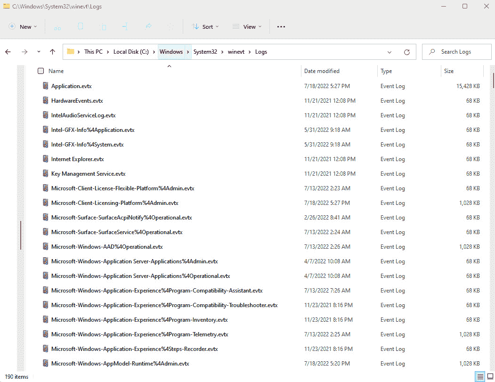
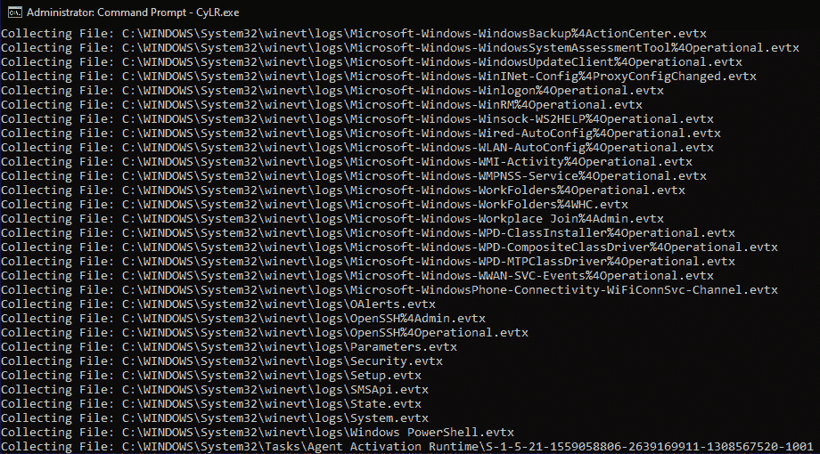

# 第十二章：分析日志文件

*第三章*详细讨论了埃德蒙·洛卡尔博士及其交换原理。为了复习，洛卡尔交换原理的核心前提是，当两个物体接触时，它们会留下痕迹。在数字取证的世界中，我们讨论了响应者如何利用各种位置和技术，从内存、硬盘和网络流量中发现这些痕迹。一个可以提供大量数据并可供利用的位置是日志文件。广泛的硬件和软件都会记录操作。所需的是响应者理解如何获取这些日志，如何检查它们，以及它们详细记录了什么。在这样做时，他们可能能够找出事件的根本原因。

本章将重点讨论日志和日志管理，使用日志聚合工具，如**安全信息与事件管理**（**SIEM**）系统、Windows 事件日志，最后——分析 Windows 事件日志。希望通过讨论这些技术，响应者能够清晰地阐明日志在事件调查中的重要性，并能够将其作为更大范围事件调查的一部分进行分析。

本章将涵盖以下主题：

+   日志和日志管理

+   与 SIEM 配合工作

+   Windows 事件日志

+   分析 Windows 事件日志

# 日志和日志管理

一次良好的事件调查的核心是来自多种来源的证据。即使是主机系统上的恶意软件感染，也需要从多个来源获得证据。一项常见的挑战，尤其是在较小的网络中，是组织如何处理日志管理。为了进行全面的调查，事件响应分析师需要访问尽可能多的网络数据。然而，许多组织没有投入足够的资源，以便从网络设备和其他系统收集全面的日志。

在任何事件发生之前，明确组织将如何记录以及如何维护这些日志是至关重要的。这应该在日志管理政策及相关程序中进行定义。**计算机安全事件响应团队**（**CSIRT**）的人员应参与讨论哪些日志是必要的，因为他们通常能够深入了解某个日志来源相较于其他日志来源的价值。

NIST 日志管理指南

**国家标准与技术研究院**（**NIST**）已发布一份简短的日志管理指南，可通过以下链接访问：[`nvlpubs.nist.gov/nistpubs/Legacy/SP/nistspecialpublication800-92.pdf`](http://nvlpubs.nist.gov/nistpubs/Legacy/SP/nistspecialpublication800-92.pdf)。

除了日志管理的技术问题外，还有法律问题必须解决。以下是 CSIRT 及其法律支持团队在任何事件发生前应当解决的若干问题：

+   **将日志记录作为常规商业实践**：根据业务类型和管辖区域，用户可能有合理的隐私期待，除非有明确声明的监控政策。此外，如果日志仅用于确定用户是否存在恶意活动，可能会涉及法律问题。因此，日志政策应当明确，日志记录网络活动是正常商业活动的一部分，且用户不应期望有隐私保护。

+   **事件发生时近距离记录日志**：这在自动化日志记录中不是问题，因为日志通常会在事件发生时几乎同时创建。从证据角度来看，未在事件发生时近距离创建的日志，在法庭上的证据价值会大打折扣。

+   **有经验的人员**：日志的价值通常取决于谁创建了日志条目，以及他们是否了解事件。在网络设备的日志情况下，日志软件会解决这个问题。只要能够证明软件正常运行，就不应该存在问题。

+   **全面日志记录**：企业日志记录应当尽可能覆盖整个企业。此外，日志记录应该保持一致。随机的日志记录模式在法庭上的价值不如在整个企业中保持一致的日志记录模式。

+   **合格的保管人**：日志政策应当指定一名数据保管人。该人员将代表日志处理程序和用于创建日志的软件类型。他们还将负责证明日志的准确性以及所用日志软件的正确性。

+   **记录故障**：持续的故障或在记录事件时的历史性故障，可能会降低它们在法庭上的价值。记录故障必须被文档化，并且需要附上故障的原因。

+   **日志文件发现**：组织应当意识到，在法庭程序中使用的日志将会提供给对方的法律顾问。

+   **来自被攻破系统的日志**：来自已知被攻破系统的日志存在可疑性。如果这些日志要作为证据提交，日志的保管人或事件响应者通常需要对日志中包含数据的真实性进行详细的证词陈述。

+   **优先使用原始副本**：日志文件可以从日志源复制到存储介质。作为进一步的步骤，任何日志应该从系统中归档。事件响应者应为每个日志文件建立证据链，并在案件处理过程中保持这些日志，直到获得法院指令允许销毁这些日志。

日志管理过程解决了识别组织认为必要的事件所需的基础元素。从这里开始，适当的日志管理策略的下一个关键组成部分是用于汇总和审查的技术。这涉及将 SIEM 系统集成到日志管理过程的整体结构中。

# 使用 SIEM

许多组织面临的一个重大挑战是网络设备日志的管理。由于空间有限，日志文件通常会被覆盖，新日志会覆盖旧的日志文件。结果是，在某些情况下，组织可能只保留几天，甚至几小时的重要日志。如果潜在的事件发生在几周前，事件响应人员将无法获得关键证据。

一种被广泛接受的工具是 SIEM 系统。这个设备可以汇总来自网络来源的日志和事件数据，并将其合并到一个位置。这使得 CSIRT 和其他安全人员能够观察整个网络的活动，而无需检查单个系统。

下图展示了 SIEM 系统如何集成到整体网络中：


图 12.1 – SIEM 与日志架构

各种来源，从安全控制到 SQL 数据库，都被配置为将日志发送到 SIEM。在这种情况下，位于`10.100.20.18`的 SQL 数据库显示`USSalesSyncAcct`用户帐户被用来将数据库复制到远程主机，位于`10.88.6.12`。SIEM 可以快速检查此类活动。例如，如果确定`USSalesSyncAcct`帐户已被入侵，CSIRT 分析人员可以迅速查询 SIEM 中该帐户的任何使用记录。然后，他们可以查看日志条目，显示数据库被复制到远程主机的情况。

如果没有 SIEM，CSIRT 分析人员必须检查可能已被访问的每个系统，这一过程可能非常耗时。

从 SIEM 平台，安全和网络分析人员可以执行与事件响应相关的几项任务，如下所示：

+   **日志汇总**：典型的企业内部网络中有几千台设备，每台设备都有日志；SIEM 可以部署来将这些日志汇总到一个中心位置。

+   **日志保留**：SIEM 平台提供的另一个关键功能是日志保留平台。合规性框架，如**支付卡行业数据安全标准**（**PCI-DSS**），规定系统日志应保持 1 年，且 90 天的日志应立即可用。SIEM 平台可以通过提供一个系统来有序存档日志并允许立即检索来帮助进行日志管理。

+   **常规分析**：在使用 SIEM 平台时，建议定期审查信息。SIEM 平台通常提供一个仪表盘，突出显示关键要素，如连接数、数据流量和任何重要的警报。SIEM 平台还允许生成报告，以便利益相关者了解活动情况。

+   **警报**：SIEM 平台可以在特定条件下发出警报，这些条件可能表示恶意活动的存在。这可以包括来自安全控制的警报，例如防病毒软件和入侵防御或检测系统。SIEM 平台的另一个关键特性是事件关联。该技术检查日志文件，并确定事件之间是否存在关联或共同点。SIEM 随后可以对这些类型的事件发出警报。例如，如果一个用户账户在多个系统中尝试多次登录，SIEM 可以识别这一活动并向相关方发出警报。

+   **威胁狩猎**：现代对手可以潜伏在目标网络中或利用之前未被发现的漏洞。威胁狩猎是利用数字取证技术揭露这些长期攻击的做法。SIEM 平台允许威胁狩猎者搜索**妥协指示器**（**IOCs**）。

+   **事件响应**：随着 SIEM 成为日志聚合和分析的单一平台，CSIRT 分析师通常会在事件发生时使用 SIEM。CSIRT 分析师常常会在平台上进行查询，并下载日志进行离线分析。由于日志文件的集中管理，进行搜索和事件收集的时间显著减少。例如，假设 CSIRT 分析表明一个用户账户已经被妥协。没有 SIEM 的情况下，CSIRT 分析师需要检查各个系统，查看与该用户账户相关的活动。而有了 SIEM，分析师只需在 SIEM 平台上搜索该用户账户，SIEM 已经汇总了来自企业各系统的用户账户活动日志。结果是，分析师能够在极短的时间内清楚地了解该用户账户的活动，而无需查看企业各系统中的日志。

SIEM 平台的购买和实施确实需要投入大量的时间和金钱。除此之外，还有持续的维护、保养以及必须修改的规则。从事件响应的角度来看，配置和维护得当的 SIEM 对于及时收集基于网络的证据至关重要。此外，SIEM 平台的功能和能力能够显著减少在检测到事件后，确定事件根本原因所需的时间。

SIEM 用例

以下文章提供了 SIEM 平台在企业环境中的应用案例的详细解析：[`www.sumologic.com/blog/why-modern-siem/`](https://www.sumologic.com/blog/why-modern-siem/)。

## Splunk

Splunk 是一个商业工具，广泛应用于各种类型的企业和组织。该平台利用日志转发应用程序来聚合日志，并将其发送到中央服务器，可以是本地服务器也可以是云实例。从这里，分析人员可以审查日志并创建警报，以识别和升级潜在的恶意活动。Splunk 的一个缺点是需要商业许可。这些许可基于发送到平台的数据和日志量。大多数组织无法将网络中每个系统的每一条日志都发送到平台。因此，组织需要在发送日志时谨慎选择：


图 12.2 – Splunk 平台

## Elastic Stack

另一个开源的 SIEM 选项是 Elastic Stack（或常称为 ELK Stack）。Elastic Stack 是三个工具的组合。开源工具 Elasticsearch、Logstash 和 Kibana 合并在一起，为威胁猎人提供一个开源平台，用于摄取数据并将其转化为可以通过 Kibana 图形界面查看和分析的格式。这使得威胁猎人可以同时可视化来自多个系统的日志数据。Elastic Stack 被集成到多个不同的开源安全工具中，包括我们接下来将讨论的 Security Onion 平台。Elastic Stack 也可以配置为独立的 SIEM 解决方案，并结合如 Winlogbeat 等工具，后者将 Windows 事件日志转发到 Elastic Stack。

以下是 Elastic Stack 中最直观的部分——即 Kibana 界面。这个界面允许数据可视化和搜索，正如在这里所见：


图 12.3 – Kibana 平台

SIEM 平台是响应人员检查来自多个系统的各种日志的绝佳方式。一个至关重要的方面是检查 Windows 事件日志。下一节将探讨各种 Windows 事件日志及其为响应人员提供的关于账户和应用程序使用的洞察。

## Security Onion

Security Onion 是一个开源的多工具平台，可以作为网络 **入侵检测系统**（**IDS**）和 SIEM。Security Onion 将多种安全工具（如 OSSEC、Suricata 和 Zeek）集成到一个平台中。

Security Onion 还具有仪表板和用于深入分析日志文件的工具。以下屏幕截图显示了可用的详细程度：


图 12.4 – Security Onion 平台

虽然安装和部署 Security Onion 平台可能需要一些时间和资源，但它是一个强大的、低成本的替代方案，适用于那些无法部署全功能 SIEM 解决方案的组织（Security Onion 平台及其相关文档可在 [`securityonion.net/`](https://securityonion.net/) 获取）。

# Windows 日志

响应人员最常需检查的端点操作系统是 Windows 操作系统。由于微软在市场上的巨大份额，大多数企业端点将是微软的桌面/笔记本电脑、服务器或虚拟系统。因此，响应人员必须充分了解如何利用 Windows 事件和系统监视器日志进行事件分析。

## Windows 事件日志

Windows 事件日志提供了操作系统的活动、来自其他系统的连接、凭证使用情况以及 PowerShell 使用的广泛数据。

从初始入侵使用恶意软件或其他漏洞、凭证访问，以及使用 Windows 操作系统内部工具进行权限提升和横向移动的对抗性战术，通常通过 Windows 事件日志进行捕获。

操作系统活动中捕获的具体日志在很大程度上取决于组织如何配置它们。大多数企业利用组策略设置来配置系统记录哪些操作，以及为日志文件分配的存储空间。根据组织的日志管理实践，Windows 操作系统可以配置为记录 PowerShell 使用、**服务器消息块**（**SMB**）使用、应用程序活动、DHCP 客户端管理以及任务调度程序维护。

日志管理配置通常通过 Windows 组策略来管理。在这里，管理员可以通过一项策略管理多个系统。

Windows 操作系统包括了事件查看器，用户或系统管理员可以通过它查看系统上可用的日志，并进行初步审查。

要访问 Windows 事件查看器，可以使用 Windows 搜索功能查找“事件查看器”，然后点击图标。这将打开**事件** **查看器**窗口：


图 12.5 – 微软 Windows 事件查看器

通过这个查看器，响应人员可以清楚了解哪些内容正在被记录，甚至可以搜索特定的日志条目。要直接访问日志以进行离线分析，可以导航到日志存储的默认文件路径`C:\Windows\System32\winevt\logs`。这将显示可记录的各种事件，具体如下：



图 12.6 – Windows 事件日志目录

如前所述，Windows 事件日志记录了操作系统执行的广泛活动。在本章中，将重点介绍三种更相关的 Windows 事件日志类型。这些类型涵盖了广泛的活动，并在确定潜在被入侵系统上发生了哪些操作时非常有用。详细说明如下：

+   **安全日志**：这些日志包含与系统安全相关的数据条目，包括登录、注销、安全组成员身份以及程序执行。

+   **应用程序日志**：应用程序开发者决定应用程序会记录哪些类型的活动。这些活动被汇总到应用程序日志文件中。

+   **系统日志**：系统日志通常用于排除非恶意活动的故障，记录的是 Windows 操作系统创建的数据。

Windows 事件日志 ID 总共有 100 多种。根据操作系统的使用方式，某些事件在系统上很少甚至从未出现过。另一些则非常常见，即使在正常情况下也会频繁出现。以下是响应者可能需要用到的一些更有用的 Windows 事件日志类型：

+   **4624 和 4634 – 登录与注销**：这些事件日志条目显示了在潜在被入侵的系统上使用凭证的情况。此外，4624 事件 ID 可以显示登录是本地系统执行的还是通过远程连接进行的，这对于通过 Windows SMB 协议寻找横向移动非常重要。

+   **4625 – 账户登录失败**：一两条此类日志条目可能没有太大意义。几条此类条目可能表示偶尔的登录错误，但大量此类日志条目则表明攻击者正在尝试暴力破解凭证。

+   **4672 – 特权分配给新登录**：这是 Windows 操作系统中用户账户尝试提升到根权限或管理员权限的等价物。可以用来判断攻击者是否通过被入侵的账户提升了权限。

+   `PsExec`、`CMD.EXE` 或 `Whami.exe`，用以深入分析潜在的恶意行为。

+   **4768-4773 – Kerberos 服务**：攻击者使用一些著名的漏洞，利用 Kerberos 票证授予票证（TGT）来提升权限。这种攻击，通常被称为 Kerberoasting，尤其具有破坏性，因为它允许攻击者在网络中通过有效凭证横行。

+   **5140 – 网络共享对象已访问**：当用户账户首次登录到网络共享时，会记录此活动。时间或用户活动的异常可能表明攻击者试图获取机密数据，或者勒索软件试图感染网络共享。

+   **7045 – 安装了新服务**：当用户在日志条目中指明的用户安装了新服务时，会记录此日志条目。某些恶意软件会将自己作为服务安装。检查这些日志条目可能会揭示恶意代码的存在。

Windows 事件日志参考

每个事件日志 ID 的具体细节超出了本章的范围。有关具体 ID 的良好参考资料可以访问 [`www.ultimatewindowssecurity.com/securitylog/encyclopedia/default.aspx`](https://www.ultimatewindowssecurity.com/securitylog/encyclopedia/default.aspx)。

如前所述，Windows 事件类型超过 100 种。使用的特定类型通常由组织决定，并且需要在可用存储空间和事件调查期间特定日志条目的实用性之间进行权衡。

可以利用多个资源来更好地理解 Windows 事件日志。第一个是 `ultimatewindowssecurity.com` 网站。该网站提供了一个可搜索的数据库，按事件 ID 列出了各种 Windows 事件日志类型。当响应者可能遇到较为晦涩的事件 ID 时，这一点非常有用。MITRE 公司还提供了 ATT&CK 知识库。可以在该知识库中搜索与调查相关的 Windows 事件日志 ID——例如，响应者正在检查某个系统，寻找是否有系统感染 Carbanak 恶意软件的迹象。在 ATT&CK 知识库中，响应者可以确定 Carbanak 已经创建了一个账户，而相关的 Windows 事件 ID 是 4720。然后，响应者可以在系统中搜索该特定事件 ID，查看是否有其他账户显得可疑。

如上所示，Windows 操作系统有大量的日志事件类型和 ID。以下部分将为响应者提供收集和分析这些日志文件的方法。

# 分析 Windows 事件日志

分析 Windows 事件日志是一个详细的过程。响应者经常遇到的一个挑战是，事件发生时可能需要分析的日志数量。对于多个系统，响应者可能需要处理数百万条独立的事件日志条目。减少这些日志的数量需要使用专门的工具和流程，从获取开始，进入分诊阶段，最后聚焦于分析与事件调查相关的关键事件日志。

## 获取

响应者在获取 Windows 事件日志时可以使用几种方法。理想情况下，日志文件应发送到 SIEM，以便响应者能够在整个企业范围内搜索日志条目。不幸的是，许多组织面临着存储成本的重大障碍，无论是使用商业平台，还是开源平台。结果是，它们往往不得不通过让本地系统处理存储来权衡聚合这些日志的成本。

由于大多数日志位于本地系统中，响应者需要使用技术手段来收集它们。第一种技术是直接将事件日志从本地系统复制到某种可移动媒体。只需导航到默认目录 `C:\Windows\System32\winevt\Logs`，并复制相关日志。此方法确实需要本地访问，并且与本地系统的互动较多。响应者有责任记录他们在系统上采取的每个操作，以便进行适当的报告。

响应者还可以选择通过简单的批处理脚本编写日志文件采集脚本。此采集可以与其他本地系统证据采集操作一起进行。例如，以下屏幕截图展示了从本地系统获取四种 Windows 事件日志类型的操作：


图 12.7 – 事件日志 CMD 采集

这些类型的脚本可以通过 USB 设备或远程会话运行，从而减少与系统的互动。

*第六章*介绍了用于本地采集证据的 `CyLR.exe` 工具。`CyLR.exe` 获取的关键证据之一是 Windows 事件日志。如前所述，这些日志文件可以从本地系统中获取并导出到 USB。此部分将探索的另一个选项是使用 `CyLR.exe` 获取 Windows 事件日志并将其转发到 Skadi 日志审查平台。稍后会讨论 Skadi，但首先，`CyLR.exe` 将针对一个系统运行，并将输出发送到 Skadi 服务器。

要从本地系统获取日志文件并将其发送到 Skadi 实例，请按以下步骤操作：

1.  以管理员身份打开 Windows 命令提示符。

1.  导航到存放 `CyLR.exe` 文件的目录。

1.  在命令提示符中输入以下命令：

    ```
    C:\Users\JSmith\Desktop>CyLR.exe -s 192.168.207.130:22 -u admin -p password
    ```

在之前的命令中，`-s` 是远程系统的 IP 地址或域名，`CyLR.exe` 的输出会发送到该系统。在此情况下，该压缩的证据文件将通过 SFTP 发送到系统 `192.168.207.130`。`-u` 是用于访问远程系统的帐户的用户名，最后，`-p` 是与远程系统相关的帐户的密码。与本地采集一样，`CyLR.exe` 将运行，命令提示符中将显示以下内容：



图 12.8 – CyLR.exe 执行输出

这种远程捕获技术可以通过任何可用的远程访问工具来实现。此方法的一个显著优点是能够获取日志数据和`CyLR.exe`捕获的其他证据，并自动将其转发到中央存储库。该中央存储库可以是 Skadi 实例，也可以是一个已配置为接受此数据的 SFTP 服务器。

根据事件的类型和涉及的系统数量，可能会有大量数据。有时，对于响应人员来说，手动检查这些数据可能过于繁琐。在这种情况下，需要对数据进行初步筛选，以确定哪些日志条目最为重要。

## 初步筛选

如前所述，响应人员可能需要检查多个 Windows 系统。每个系统可能包含数千条，甚至数十万条事件日志条目。响应人员或响应小组不可能检查那么多单独的条目。这就像人们常说的*大海捞针*。为了处理 Windows 事件日志分析中常遇到的大数据集，响应人员可以使用 DeepBlueCLI 工具。由 Eric Conrad 开发的这个 PowerShell 脚本能够检测可疑的 Windows 事件日志条目，例如服务创建、账户创建、大量登录失败和恶意 PowerShell 使用。通过关注这些更为关键的事件类型，响应人员将能够分析更多的日志文件，并有可能识别出可疑的活动。

要运行 DeepBlueCLI，请按以下步骤操作：

1.  从其 GitHub 网站下载 PowerShell 脚本：[`github.com/sans-blue-team/DeepBlueCLI`](https://github.com/sans-blue-team/DeepBlueCLI)。下载后，解压该文件。

1.  打开 PowerShell 并导航到包含 `DeepBlue.ps1` 的目录。

1.  通过将 `DeepBlue.ps1` PowerShell 脚本指向特定的 Windows 事件日志文件（在此案例中为 Windows 安全事件日志）来执行该脚本，如下所示：

    ```
    PS C:\Users\madno\Desktop\DeepBlueCLI-master\DeepBlueCLI-master> .\DeepBlue.ps1 -log security C:\Users\madno\Desktop\Logs\Security.evtx
    ```

参考截图如下：


图 12.9 – DeepBlueCLI 可疑的安全事件日志

1.  Windows 事件日志还可能包含表示恶意活动的条目。使用以下命令运行 DeepBlueCLI PowerShell 脚本，检查系统日志：

    ```
    PS C:\Users\madno\Desktop\DeepBlueCLI-master\DeepBlueCLI-master> .\DeepBlue.ps1 -log system C:\Users\madno\Desktop\Logs\System.evtx
    ```

这将生成以下输出：


图 12.10 – DeepBlueCLI 可疑的系统事件日志条目

1.  正如我们之前讨论过的，Windows 事件日志的数量是庞大的。其中一个经常提供关键数据点的日志来源，特别是在勒索软件攻击中，是 Windows PowerShell 操作日志。该日志通常会捕捉到作为多阶段勒索软件攻击一部分使用的恶意 PowerShell 脚本。使用以下命令对 PowerShell 日志进行初步筛选：

    ```
    PS C:\Users\madno\Desktop\DeepBlueCLI-master\DeepBlueCLI-master> .\DeepBlue.ps1 C:\Users\madno\Desktop\Logs\Microsoft-Windows-PowerShell%4Operational.evtx
    ```

此命令生成以下输出：


图 12.11 – DeepBlueCLI PowerShell 事件日志条目

在前面的截图中，我们可以看到一个超过 1,000 字节的 PowerShell 脚本，这可能表明它是恶意的。对该脚本的审查表明，它打开了一个网络套接字，连接到一个 IP 地址，并且端口设置为 `4443`：


图 12.12 – PowerShell 网络套接字

这种行为可能是合法的，但应当进一步跟进，因为诸如**PowerSploit**和**Cobalt Strike**等各种后渗透工具广泛使用 PowerShell。我们将在后续章节中讨论勒索软件攻击。

DeepBlueCLI 是进行事件日志初步分析的一个优秀工具。它的两个缺点是分析人员仍然需要使用其他工具检查初始日志条目，并且 DeepBlueCLI 可能会漏掉实际的恶意活动。建议从这个工具开始，然后过渡到更详细的检查方法和工具。在这些情况下，像 Event Log Explorer 和 Skadi 这样的工具非常有助于进行更详细的分析。

## 详细事件日志分析

如前所述，使用初步筛查工具是一个有用的第一步，但任何可以访问事件日志的事件调查都需要使用专业工具深入挖掘它们提供的数据。Windows 操作系统有一个本地的事件日志查看器。根据许多响应者的经验，这个查看器更适合于有限的故障排除，而不适合深入分析事件日志。有几个工具，无论是开源的还是商业的，都可以用于事件日志分析。SIEM 工具提供了最好的工具类型之一，特别是当它们能够分析离线事件日志或通过脚本或其他工具获取的日志时。本章将讨论两个工具：Event Log Explorer 和 Skadi。这些工具都适用于事件日志分析，但具有独特的功能，使其适合不同方面的事件日志分析。

例如，Event Log Explorer 提供了更好的结果筛选功能，并具有字符串搜索能力。Event Log Explorer 还可以合并多个来源。其他工具，如 Skadi，允许远程获取日志文件，并可以将日志条目与其他数据（如 MFT 条目和注册表键设置）结合起来。Skadi 的一个缺点是需要一定的时间来获取和处理数据以供审查。因此，具体使用哪个工具取决于调查人员选择最适合当前事件的工具。

### 事件日志浏览器

事件日志浏览器是一款功能更强大、易于操作的事件日志分析工具。作为一款商业工具，Event Log Explorer 的开发者 FSPro Labs 提供了一个 30 天的试用期供用户测试。该工具可以从[`eventlogxp.com/`](https://eventlogxp.com/)官网下载安装，并可安装在 Windows 操作系统上。

在本节中，我们将继续分析在上一章节中分析的存储中获取的日志文件：

1.  打开**事件日志浏览器**，以下窗口将会出现：


图 12.13 – 事件日志浏览器图形用户界面

图形用户界面有三个主要区域。中间窗格包含 Windows 事件日志类型中的单个日志条目。下方窗格包含每个日志条目中的详细信息。最后，左侧窗格包含正在分析的 Windows 事件日志类型。

1.  事件日志浏览器将自动导入本地主机的 Windows 事件日志。要移除这些日志，右键点击计算机名称并点击**移除计算机**。点击**是**。这将移除现有的 Windows 事件日志。

1.  要导入事件日志文件或多个文件，请点击**文件** | **打开日志文件** | **标准**。导航到已提取事件日志的相应文件夹。从这里加载日志文件。此处，我们将查看 Windows 安全事件日志。选择并点击**打开**，如下所示：


图 12.14 – 打开 Windows 事件日志

1.  这将加载该日志文件的所有日志条目。在此示例中，我们将查看 DeepBlueCLI 筛查中识别出的 **新用户添加** 条目。该输出不仅识别了事件 ID，还识别了账户，这是我们可以用来筛选的两项数据。要打开筛选器，请查找任务栏上的漏斗图标：


图 12.15 – 事件日志浏览器 – 创建筛选器

1.  然后会显示筛选器屏幕。在这里，我们可以根据多种特定属性过滤事件日志，包括事件类型、事件 ID，甚至在日志文件条目的文本中进行关键字搜索。在本例中，我们将查看 `minecraftsteve` 的日志条目。这是通过 DeepBlueCLI 筛查脚本识别出来的。输入事件 ID 为 `4720`，并在 `minecraftsteve` 中如下所示：


图 12.16 – 事件日志浏览器筛选器参数

1.  点击**确定**后，输出将显示与输入筛选条件匹配的事件日志条目。事件日志条目的详细信息包括有关账户创建的附加细节：


图 12.17 – 事件日志详情

1.  再次回到 DeepBlueCLI 脚本的结果，发现有一个附加条目，事件 ID 为 4732，表示 `minecraftsteve` 账户具有提升的权限。通过返回筛选器，将事件 ID 从 4720 更改为 4732，并移除 `minecraftsteve` 账户，我们可以看到该账户的 SID 不仅被移动到管理员组中，还被移动到 **远程管理** **用户**组中：


图 12.18 – 事件日志条目描述

在这个简短的示例中，我们能够将新用户账户的创建与其权限提升到管理员组和远程管理用户相关联。虽然这可能不是恶意的，但如果无法将这个新账户与合法用户联系起来，它可能表明有攻击者创建了一个账户并将其加入管理员组。

一个可能对分析员可用的 Windows 事件日志是 Windows Defender 操作事件日志。这些条目包含有关 Windows Defender 恶意软件防护的信息，并且可以提供有关更新和检测的额外信息。打开文件后可以看到几个警告：


图 12.19 – Windows Defender 条目

对其中一个警告的回顾表明，Defender 已检测到 Meterpreter 的使用，这是一个著名的后期利用工具：


图 12.20 – Windows Defender Meterpreter 检测

Event Log Explorer 拥有很多功能，无法在本书中详细讲解。它的其他一些功能包括构建自定义视图、对特定数据点进行筛选，以及在多个事件日志文件中查找日志条目中的文本。即使有这些功能，Event Log Explorer 仍然存在一些小的局限性。首先，响应人员必须将日志收集到系统中进行分析，并手动加载它们。其次，视文件大小而定，Event Log Explorer 可能会出现性能问题，包括卡顿。响应人员应确保不会过度加载该应用程序。尽管如此，Event Log Explorer 仍然是响应人员工具包中非常优秀的工具。

### Skadi 和 Kabana

事件通常涉及企业网络中的多个系统。没有分析多个系统的事件日志，相关联这些活动往往非常困难。这时，之前讨论的 SIEM 设备就非常有用。如果 SIEM 没有预配置以获取和分析事件日志，另一种选择是 Skadi 平台。这个开源平台可以从 GitHub 获取，网址是 [`github.com/orlikoski/Skadi`](https://github.com/orlikoski/Skadi)，它是一组安装在 Ubuntu 16.04 LTS 服务器基础镜像上的应用程序和取证工具。

本章将重点介绍的主要工具是 Elastic Stack，它是 Skadi 平台的一部分。Skadi 还提供的另一个主要功能是能够接收通过`CyLR.exe`获取的日志和其他取证数据。如前所述，`CyLR.exe`可以配置为通过 SFTP 将输出发送到远程系统。Skadi 将一个附加工具与`CyLR.exe`结合，生成一个可由 Skadi 上的 Elastic Stack 接收的数据集。此功能允许响应者在多个不同系统上运行`CyLR.exe`，并直接将其发送到 Skadi，之后可以对其进行处理、索引、搜索和关联。

在`CyLR.exe`完成后，响应者将登录到 Skadi 控制台。从这里，**Cold Disk Quick Response**（**CDQR**）工具将运行，将已获取的数据转换为 Elasticsearch 工具可以接收的格式。以下命令启动 CDQR 处理：

```
skadi@skadi:~$ cdqr in:DESKTOP-SKPTDIO.zip out:Results -p win --max_cpu -z --es_kb DESKTOP-SKPTDIO
```

CDQR 从`CyLR.exe`接收输入文件`jsmith-pc.zip`，并将其输出到`Results`文件夹。`-p`参数选择解析器。在此情况下，由于`DESKTOP-SKPTDIO`是一个 Microsoft Windows 系统，因此选择`win`解析器。接下来的参数是`--max_cpu`。此参数允许分析人员限制 Skadi 机器的 CPU 使用率。如果正在处理多个`CyLR.exe`输出，分析人员应省略此参数。接下来的`-z`参数表示文件是一个 ZIP 文件。最后，`--ex_kb`参数告诉 CDQR 将结果输出到 Kibana，索引名称为`DESKTOP-SKPTDIO`。这个索引允许分析人员在 Kibana 应用程序中区分不同的系统：


图 12.21 – CDQR 执行

处理完成后，结果可以在 Kibana GUI 中查看，如下所示：

1.  导航到 Skadi 服务器的 IP 地址，并输入用户名和密码。默认是`skadi:skadi`。这将打开如下截图所示的门户：


图 12.22 – Skadi 门户

1.  点击**Kibana**，以下屏幕将会出现：


图 12.23 – Kibana GUI

1.  从这里，点击**Discover**。在右上角，设置日期为合适的时间范围。Kibana 默认显示过去 15 分钟的数据。对于离线数据，设置适用的时间范围，或者直接点击**过去 2 年**，如下所示：


图 12.24 – Kibana 的 Discover 仪表板

1.  Kibana 功能丰富，提供了广泛的数据分析选项。这包括使用自定义查询、事件 ID、关键字和 XML 字符串。在这种情况下，响应者将专注于事件 ID 4104，该事件 ID 指示远程运行 PowerShell 命令。然后，查看在与 DeepBlueCLI 输出关联的 IP 地址上添加 XML 筛选器。在这种情况下，选择 `4104` 并单击 **保存**。这将运行命令：


图 12.25 – 根据事件 ID 筛选

1.  这将产生 176 个总共的带有该事件标识的条目。为了进一步减少这个数量，让我们继续添加第二个用于 XML 数据的筛选器，`192.168.191.253`：


图 12.26 – 根据 IP 地址筛选

这样就产生了两个结果。对结果的分析确认了在 DeepBlueCLI 中显示的结果。

1.  看到是否有与该 IP 地址相关的额外结果可能会有所帮助。通过深入研究具有事件 ID 600 的条目，可以看到额外的 PowerShell 条目显示，这是 PowerCat 的一个版本，PowerCat 是一款具有类似于流行黑客工具 Netcat 功能的 PowerShell 脚本：


图 12.27 – Meterpreter 事件条目

Skadi 结合 `CyLR.exe`，为响应者提供了从涉及事件的几个系统中获取和分析日志文件的能力。通过特定的事件 ID 或关键字进行透视，使 Skadi 成为在识别事件调查中重要的特定日志条目的强大工具。通过分析这些事件，我们可以看到攻击者能够远程执行 PowerShell 并安装远程网络服务。

# 摘要

在日志分析的核心是一种假设，即攻击者的行动会留下痕迹。正如在物理世界中一样，响应者能够看到这些痕迹的能力基于所使用的工具和技术。本章探讨了日志和日志管理的基础元素，以及诸如 SIEM 之类的工具来聚合和审查这些日志，最后还审视了用于检查源自 Windows 操作系统的最常见日志的工具和技术。本章仅仅是浅尝辄止，介绍了日志在事件调查中起着重要作用的一部分。

符合理解对手攻击痕迹主题的要求，下一章将探讨恶意软件分析在事件响应中的作用。

# 问题

回答以下问题来测试你对本章的了解：

1.  为了有效的日志管理，组织应将日志记录作为正常的业务实践。

    1.  True

    1.  False

1.  下列哪项不是 SIEM 的功能之一？

    1.  日志保留

    1.  自动响应

    1.  Alerting

    1.  日志聚合

1.  下列哪个不是 Elastic Stack 的一部分？

    1.  Kibana

    1.  Elasticsearch

    1.  日志响应

    1.  Logstash

1.  洛卡尔交换原理指出，当两个物体相互接触时，它们会留下痕迹。

    1.  真

    1.  假

# 进一步阅读

有关本章所涵盖主题的更多信息，请参考以下资源：

+   Windows 安全日志事件: [`www.ultimatewindowssecurity.com/securitylog/encyclopedia/`](https://www.ultimatewindowssecurity.com/securitylog/encyclopedia/)

+   Graylog: [`github.com/Graylog2`](https://github.com/Graylog2)

+   Skadi: [`github.com/orlikoski/Skadi`](https://github.com/orlikoski/Skadi)

+   应用事件响应 Windows 事件日志分析: [`forwarddefense.com/media/attachments/2021/05/15/windows-event-log-analyst-reference.pdf`](https://forwarddefense.com/media/attachments/2021/05/15/windows-event-log-analyst-reference.pdf)
