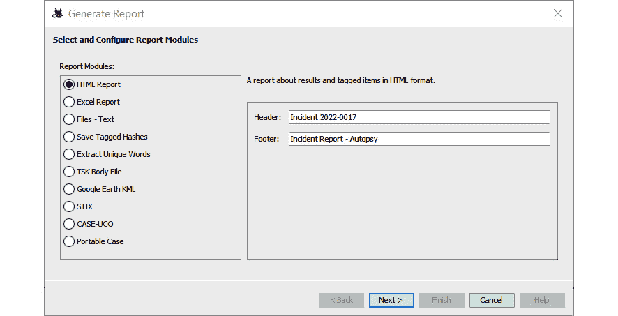
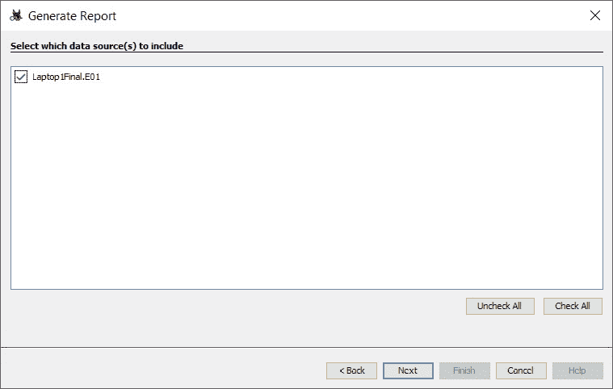
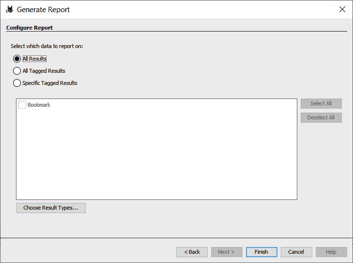
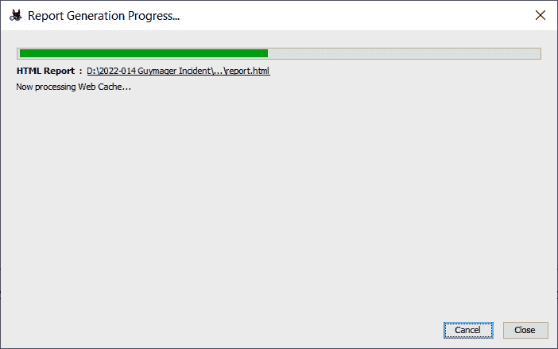
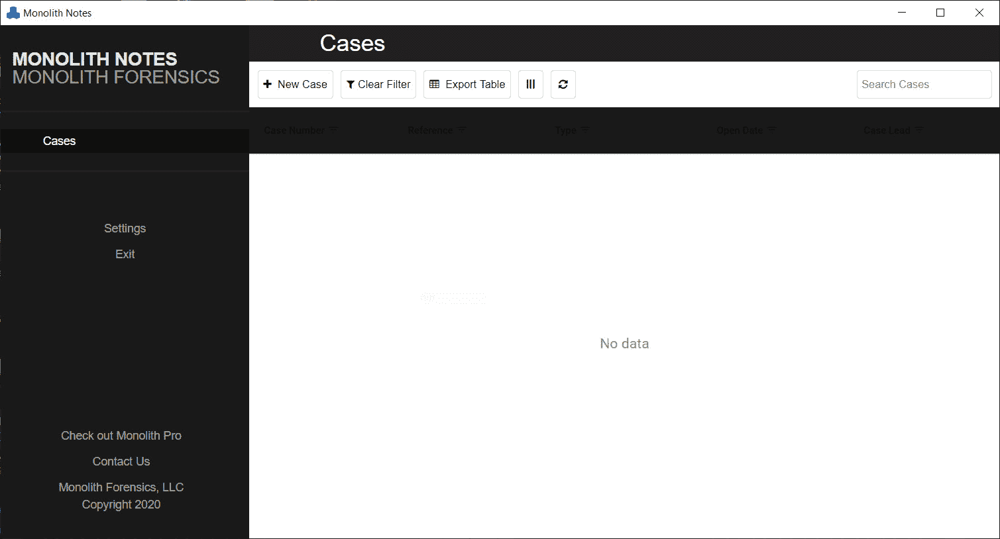
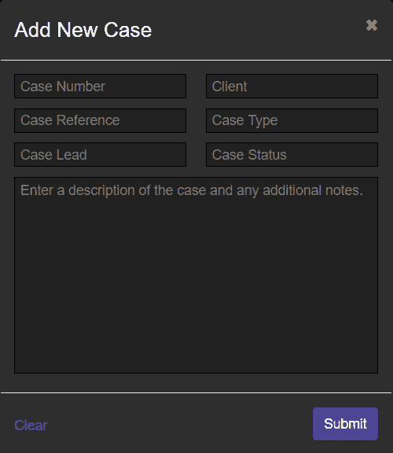
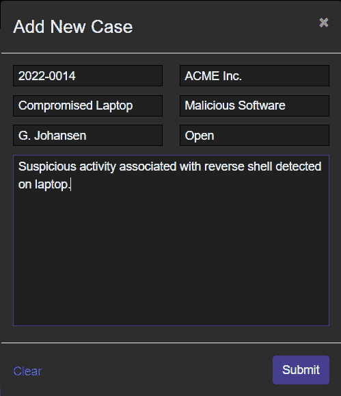
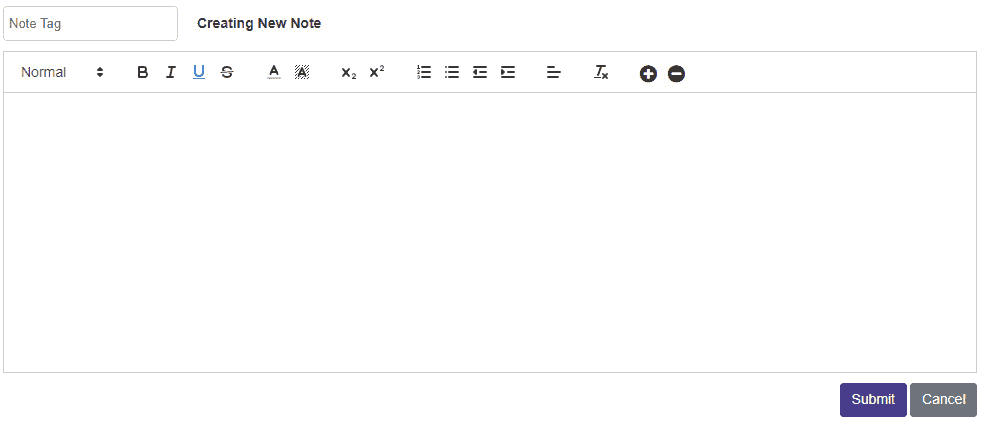
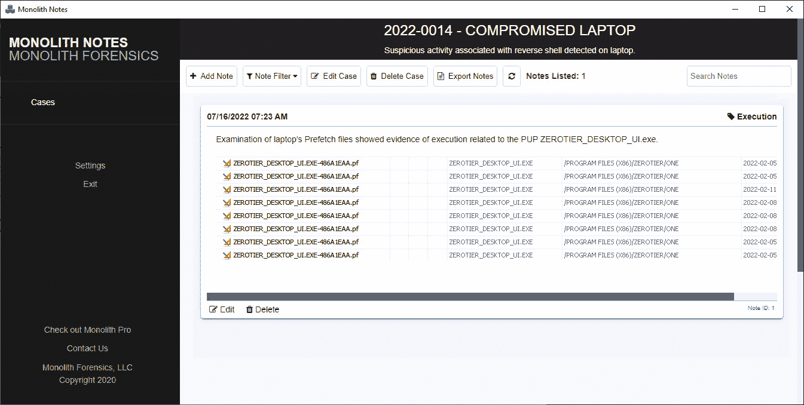
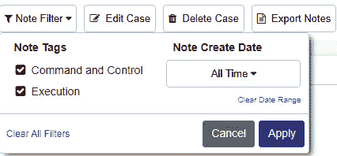

# 第十三章：撰写事故报告

事件响应团队的功能与消防部门相同。两个团队都需要通过培训掌握各自的技术、工具和实践，并能在火灾或事件发生时随时做出反应。在对火灾进行响应时，消防员会记录笔记并记录他们的行动，确保关键决策被记录，个人贡献被注意到。一旦火势得到控制，他们会从残骸中查找火灾的原因和起源。一旦准备好适当的文档，消防部门会进行事后行动审查，评估他们的表现并寻找改进途径。其他报告允许消防部门和安全专家更新建筑法规，并提高建筑物在火灾发生时的生存能力。

事件响应团队利用了类似的工作流程。在事件期间，记录笔记并记录行动。从系统中获取证据，并以法医学的方式保留。利用事件期间获得的笔记、观察和证据进行根本原因分析。信息技术人员利用这种根本原因分析来修补漏洞并进一步加固系统。最后，团队进行自己的事后行动审查，详细列出事件序列，并对团队的流程、工具和技术进行评价，并对事件响应计划进行任何更正。

为了最大化根本原因分析和事后行动简报的好处，事件响应者需要确保所有操作都以适当的方式记录下来。在考虑 IT 基础设施未来状态时，高级领导和决策者需要使用准备好的多个文档。

为了更好地准备响应者起草必要的文档，将讨论以下主题：

+   文档概述

+   执行摘要

+   事件调查报告

+   司法报告

+   准备事件和司法报告

# 文档概述

这将是事故文档的概述。在本节中，我们将看看要捕捉哪些数据，不同的受众，以及如何正确地来源报告内容。

与事故相关的文档有多种形式。任何文档的长度通常取决于事故类型。简单的事故可能在现有的票务系统中非正式记录，调查时间很短，影响有限。然而，对于更复杂的事故调查，例如导致机密信息（如医疗记录或信用卡信息）泄露的数据漏洞，可能需要详细的书面报告和支持证据。

## 要记录的内容

在记录事件时，判断应该记录什么并不是非常困难。遵循五个**W**（**谁**、**什么**、**哪里**、**何时**和**为什么**），有时还包括*如何*，是考虑在事件发生过程中记录内容时的一个很好的基础。当讨论文档时，特别是讨论安全事件的法律影响时，另一个好的智慧就是，如果你没有写下来，它就没有发生。这句话用来强调正确的文档记录通常包含尽可能详细的信息，以便事件响应分析员提供。这些分析员可能会参与到最终涉及民事诉讼的事件中。司法程序通常进展缓慢，分析员可能在 18 个月后被召唤到证人席上，而这期间可能已经发生了 10 起其他事件。拥有尽可能详细的事件报告将帮助分析员能够以正确的方式重建事件。

使用这五个 W（和一个 H）结构记录文档的一个极好的例子是查看数字取证任务，例如硬盘镜像。在*第八章*中，当我们讨论对嫌疑硬盘进行镜像的实践时，部分涉及了适当的文档记录。以下是该事件的更详细记录：

+   **谁**：这是最容易记录的细节。简单地说，谁参与了这个过程？例如，参与的人是分析员简·史密斯。

+   **何时**：记录镜像开始的日期和时间，以及结束的日期和时间。例如，镜像过程在 2022 年 6 月 16 日 21:08 UTC 开始，在 2022 年 6 月 16 日 22:15 UTC 结束。时间至关重要，您应该确保在整个调查过程中使用标准化的时区，并在报告中加以说明。

+   **哪里**：应该提供详细的地点信息，例如某个办公室。

+   **什么**：所执行的动作；例如，获取内存或防火墙日志，或对硬盘进行镜像。

+   **为什么**：为所执行的动作提供合理的解释有助于理解该动作为何被执行。

+   **如何**：应包括对动作执行方式的描述。此外，如果事件响应团队在其计划中使用了操作手册或标准操作程序，也应包括此内容。任何偏离标准操作程序的行为也应以类似方式记录。

将所有这些信息结合起来，可以在报告中填写以下示例语言：

*2022 年 6 月 16 日，分析员 Jane Smith 作为调查的一部分，抵达位于美国 Anytown Maple 街 123 号企业办公园区的 217 号办公室。到达后，Smith 接管了戴尔笔记本电脑，资产标签号为#AccLT009，序列号为#7895693-862。来自防火墙 IDS/OPS 的警报显示该笔记本电脑与一个已知的指挥与控制服务器进行了通信。为了确定该电脑是否感染了恶意软件，决定对其进行镜像处理。2022 年 6 月 16 日 21:08 UTC，Smith 按照标准操作程序 IR-002 使用实时镜像技术对硬盘进行镜像。该过程于 22:15 UTC 完成。*

本条目提供了足够的细节以重建发生的事件。结合其他文档，如照片和链条管理，分析员能够清楚地了解整个过程及其结果。

## 文档类型

没有统一的标准规定如何记录事件，但有几个明显的分类。如前所述，文档的深度通常取决于事件的类型、规模和范围；然而，一般来说，以下几类适用：

+   **故障单系统**：大多数企业组织都有现成的故障单系统，用于跟踪系统故障和当前网络基础设施中常见的其他问题。这些系统会捕获与事件相关的大量数据。通常，一个条目会记录开始和结束的日期与时间、最初报告的人员、执行的操作，并提供一个备注区域。故障单系统的一个主要缺点是它们最初是为支持企业基础设施的一般操作而设计的。因此，更复杂的事件将需要比这些系统所能提供的更多的文档。因此，这些系统通常仅用于处理小规模事件，如孤立的恶意软件感染或其他能迅速解决的小事件。

+   **安全编排与自动化（SOAR）平台**：一些组织认识到需要专门的事件响应平台，并开发了支持事件响应团队的应用程序和其他基础设施。这些事件响应编排平台允许分析员输入数据、附加证据文件、与其他团队成员协作，并调用外部资源，如恶意软件逆向工程和威胁情报馈送。

市面上有几种这类平台可供选择，既有商业平台，也有免费软件。这些平台的主要优势是可以自动捕获信息，例如日期、时间和分析员的操作。

另一个明显的优势是，它们可以限制特定群体查看信息。在票务系统中，有可能出现未经授权的人员查看到组织可能希望保密的细节。而拥有协调系统可以提供一定程度的保密性。另一个关键优势是团队成员可以看到采取了哪些行动以及获得了哪些信息。这减少了通话数量和误解的可能性。

+   **书面报告**：即使在使用自动化平台的情况下，某些事件仍然需要进行详细的书面报告。通常，这些书面报告可以分为三种主要类型。以下每种类型将在本章后续内容中展开说明：

    +   **执行摘要**：执行摘要是一个一到两页的报告，旨在概述事件的高层次要点，供高级管理人员参考。通常，简短的事件概述、根本原因（如果能够确定）以及修复建议就足够了。

    +   **事件调查报告**：这是组织内多方人员都会查看的详细报告。该报告包括调查的详细情况、根本原因分析，以及防止事件再次发生的详细建议。

    +   **取证报告**：最详细的报告是技术报告。当对日志文件、捕获的内存或磁盘镜像进行取证检查时，会生成这类报告。这些报告通常非常技术性，因为它们常常会被其他取证人员审查。报告内容可能很长，因为工具输出和证据部分（如日志文件）通常会被包括在内。

了解构成事故报告的各类内容，可以帮助响应人员妥善组织资料。即使是较小的事件，也会生成文档，这意味着响应人员可能会感到不堪重负。再加上数据来源繁多，报告过程可能变得十分繁琐。为了让流程更加顺畅，响应人员应该准备好在事件发生之初就处理各类内容，并相应地组织文档。

## 来源

在准备报告时，无论事件规模大小，都有多个数据来源需要包含在文档中，从仅需在票务系统中输入一个条目的小型事件，到需要广泛事故和取证报告的复杂数据泄露。以下是一些常见的数据来源：

+   **个人观察**：用户可能拥有与案件相关的信息。例如，他们可能点击了一个来自合法地址的邮件中的文件。其他时候，分析人员可能会观察到系统中的某些行为，并记录下来。

+   **应用程序**：某些应用程序会生成日志文件或其他可能需要包含在报告中的数据。

+   **网络/主机设备**：本书的大部分内容都涉及从企业环境中的多个系统获取和分析证据。这些系统中的许多还允许输出报告，可以与整体事件或取证报告一起包含。

+   **取证工具**：取证工具通常具有自动化报告功能。这可以是对一些操作的概述，正如前几章所讨论的那样，或者是可以包含在取证报告中的实际输出，如文件哈希值。

无论材料来源何处，一个好的规则是尽可能多地在报告中捕捉和包含信息。拥有更多信息总比信息不足要好。

## 受众

准备文档时，最后一个需要考虑的问题是，谁会阅读事件报告而不是详细的取证报告。通常，以下是可能阅读与事件相关报告的部分人员，这些人员既包括组织内部，也包括外部人员：

+   **高层管理人员**：高调的事件可能会引起首席执行官（CEO）或首席财务官（CFO）的关注，尤其是当事件涉及媒体时。执行摘要可能就足够了，但如果高级领导要求更详细的报告和在事件期间及结束时的简报，请不要感到惊讶。

+   **信息技术人员**：这些人可能是最关注事件响应分析人员发现的内容的人。他们很可能会非常认真地审查根本原因分析和补救建议。

+   **法律**：如果预计会有诉讼或其他法律行动，法律部门将审查事件报告，以确定是否存在安全漏洞或需要澄清的相关程序。如果需要进行修订，请不要感到惊讶。

+   **市场营销**：市场营销部门可能需要审查执行摘要或事件报告，以便在发生外部数据泄露时向客户传达信息。

+   **监管机构**：在受监管的行业，如医疗保健和金融机构，监管机构通常会审查事件报告，以确定组织是否存在潜在的责任。如果泄露的机密记录数量较多，或者看起来组织存在疏忽，可能会对其进行罚款。

+   **网络保险公司**：网络保险是一项近年来应对勒索软件爆发而发展的新兴业务。网络保险公司可能会要求检查分析师或响应人员的任何书面报告，以配合客户提交的索赔。

+   **执法**：某些事件需要执法部门介入。在其他情况下，执法部门可能希望捕捉与调查相关的任何 IOC（指标）或其他数据点，因为这些信息可能有助于未来潜在事件的处理。在这些情况下，执法机构可能需要事件和取证报告的副本进行审查。

+   **外部支持**：有时需要外部取证或事件响应支持公司。在这种情况下，现有的报告将大大帮助这些人员迅速了解情况。

了解受众能够帮助事件响应分析员了解谁会阅读他们的报告。需要明白的是，报告需要清晰简洁。此外，技术细节可能需要为没有相关知识或经验的受众进行一些澄清。

# 执行摘要

高层管理人员需要了解事件的关键细节，而不需要查看所有的技术或调查材料。本节将探讨如何准备一份有效的执行摘要，捕捉高层管理人员及其他关键利益相关者所需的细节和建议。

如前所述，执行摘要捕捉的是事件的宏观视角。这包括事件的总结、根本原因的描述以及为修复问题和防止类似事件再次发生所提出的建议。在金融机构或医院等有强制报告要求的受监管行业中，最好说明是否需要通知，如果需要，暴露了多少机密记录。这可以帮助高层管理人员理解事件的深度，并确保适当的法律和客户沟通措施得到处理。

这个报告的名称可能会有些误导。人们通常认为该报告仅面向 C 级高管。虽然这是报告的主要受众之一，但还有其他群体通常也需要阅读执行摘要。法律和营销部门可能需要至少对相关事实有一个粗略的了解，以便能够准确地制定向客户或第三方的沟通方案。其他外部监管机构也可能需要在完成完整的事件和技术分析报告之前获得事件的摘要。

让我们扩展一下之前关于执行摘要应包含哪些内容的讨论。虽然没有硬性规定，但以下内容是编写摘要的良好基础：

+   **事件概述**：这是一个简短的，可能只有半页的事件摘要，概述事件发生期间的关键事件。它不是逐小时的完整记录，而是涵盖了关键事件，例如最初的检测、事件被控制的时间、威胁完全从环境中清除的时间，以及最终操作恢复正常的时间。

+   **图形时间轴**：图形时间轴有助于将关键事件放置在适当的日期和时间。保持图形在 8 到 12 个具体条目之间，这些条目应能捕捉到高层次的事件。

+   **根本原因概述**：事件的根本原因将在事件调查报告中详细记录，但简短的概述对高层了解事件性质很有帮助。这可以是简短的陈述、几句话或一段话。例如，以下内容足以作为根本原因陈述：

*事件调查确定，一名仍然未知的对手利用一个脆弱的 Web 服务器，使用特别制作的漏洞利用程序。由此，对手能够通过网络配置错误进入企业网络，并在系统上执行勒索软件* *。*

+   **高层建议**：应包括一张表格，其中列出战略和战术建议，并与事件调查报告相关联。

+   **额外报告**：简要说明将要准备的任何其他文档。例如，作者可能想包含一段说明，指出事件和相关的取证报告正在准备中，预计将在两周内完成。这让读者知道，如果他们需要额外的背景或细节，相关资料即将提供。

从工作流程的角度来看，执行摘要通常是关于事件的第一份书面文档。例如，一个需要两周时间来分析和修复的重大事件，将产生大量文档。执行摘要可以作为临时措施，用来弥补编写完整报告所需的时间。这使得领导层和其他利益相关者能够制定信息发布、立即对环境进行调整并做出其他决策，而不必等待完整报告。

准备执行摘要时有一些指导原则。首先，保持语言的高度简洁。特定的技术术语可能会让某些读者感到困惑，因此语言应尽可能非技术性。第二，保持简短，并为后续文档提供引导。第三，讨论应保持高层次，关注对组织的宏观影响。通常，两页是最大限制。在某些情况下，使用 PowerPoint 演示文稿代替书面摘要可能更有益。

# 事件调查报告

一次全面的事件调查涉及由各类人员执行的各种行动。这些行动会被记录在叙事报告中，报告详细描述了调查的顺序，并提供了事件的时间线。

事故报告可能是组织内外范围最广的文档。尽管会有一些技术技能有限的人会审查这份报告，但使用正确的术语和相关数据仍然很重要。对于那些可能感到困惑的人，总会有时间解释技术细节。

以下是一些应当捕捉并纳入报告的关键数据：

+   **背景**：背景部分概述了从发现到最终处理的整个事件过程。事件的背景应包括 CSIRT 首次得知事件的方式以及最初可用的信息。接下来，应该得出关于事件类型和严重程度的结论。报告还应包括对系统的影响，以及可能已泄露的机密信息。最后，它应概述采取了何种遏制策略，并且系统是如何恢复到正常运行状态的。

+   **事件时间线**：当报告从背景部分转向事件时间线时，重点将更加关注细节。事件时间线最好采用表格格式。每个执行的动作都应该在时间线中记录一项条目。下表展示了应包括的详细程度：

| 日期 | 时间（UTC） | 描述 | 执行者 |
| --- | --- | --- | --- |
| 6/17/22 | 19:08 | 防火墙 IPS 传感器警告可能的 C2 活动。SOC 将其上报给 CSIRT 进行分析和响应。 | Bryan Davis |
| 6/17/22 | 19:10 | 检查了防火墙日志，并确定主机 10.25.4.5 已连接到已知的恶意软件 C2 服务器。 | John Q. Examiner |
| 6/17/22 | 19:14 | 使用 Carbon Black EDR 隔离了 10.25.4.5 端点，防止其继续进行网络通信。 | John Q. Examiner |
| 6/17/22 | 19:16 | 通过 Velociraptor 从 10.25.4.5 检索预取文件以进行分析。 | John Q. Examiner |

表 13.1 – 事件时间线日志

时间线中的一个关键方面需要牢记的是，条目将按顺序排列在 CSIRT 行动之前。在之前的表格中，预取文件将被分析，目的是展示恶意软件的执行。这些条目显然会出现在 CSIRT 活动之前。

该日志可能包含多页条目，但理解事件的顺序和某些操作所需的时间至关重要。这些信息可以用于重建事件的顺序，同时也可以通过审查响应和处理时间来改进事件响应流程。

+   **网络基础设施概览**：如果发生的事故涉及跨网络的多个系统，良好的做法是包括受影响系统的网络拓扑图，以及系统如何连接和相互通信的概述。其他信息，如与事故直接相关的防火墙规则，也应包括在内。

+   **取证分析概览**：对于包括日志、内存或磁盘驱动器取证分析的事故，应在事故报告中包括该过程的概述及结果。这使得利益相关者能够理解执行了哪些类型的分析，以及这些分析的结果，而无需深入了解数字取证的技术细节。分析人员应确保通过取证分析得出的结论被纳入此部分。如果事故响应团队广泛使用了取证技术，这些内容可以在本章稍后的独立报告中记录。

+   **遏制措施**：事故响应团队的关键任务之一是在检测到事故后，限制对其他系统的损害。本报告的这一部分将说明采取了哪些类型的遏制措施，例如关闭系统、断开与网络的连接或限制其访问互联网。分析人员还应确保这些措施的有效性被纳入报告中。例如，如果通过访问交换机管理网络访问变得困难，且必须采取手动处理方式，了解这一事实将帮助 CSIRT 创建新的流程，简化此操作并限制受损主机访问网络的其他部分。

+   **发现/根本原因分析**：报告的核心部分对于高级领导层和信息技术人员最为重要的是发现内容，以及如果已发现的话，根本原因。报告的这一部分应全面并包含事件时间线的相关内容。应指出在主机、软件、硬件和用户中，哪些因素导致了事故的负面或正面结果。如果已确定攻击者使用的具体漏洞或被利用的漏洞，也应包括在内。本部分报告的总体目标是描述威胁是如何破坏基础设施的，并为后续的修复和建议提供可信依据。

+   **补救措施**：如果在事件发生期间采取了补救漏洞或其他不足的措施，应将其纳入报告。这使得 CSIRT 能够全面向其他 IT 人员简报所做的更改，以限制对网络其他部分的损害，从而将这些更改纳入正常的变更控制程序，并进行验证。这确保这些更改在未来不会对其他系统造成不良影响。

+   **最终建议**：报告中应包括对基础设施改进、漏洞修补或其他控制措施的任何建议。然而，这些建议应基于观察结果和对根本原因的深入分析。

+   **定义**：报告中应包括任何能帮助技术人员理解事件的特定定义。技术术语，例如**服务器消息块**（**SMB**），如果某个系统存在对 SMB 协议漏洞的利用，也应包含在报告中。

需要特别注意的是，这份报告最有可能传递到组织内部和外部的各个部门。报告还应经过至少一次质量控制审查，以确保其没有错误或遗漏，并且能够被目标受众阅读。

# 法医报告

数字证据的审查会产生大量的技术细节。调查过程中得出的观察结果和结论需要通过数据来支撑。技术报告捕捉了关于数字证据分析的相关细节，这些细节构成了整体事件报告的核心。

法医报告是三类主要报告中技术性最强的一种。分析师应该尽量保持技术的准确性，而不是为了非技术人员而简化报告。分析师还应意识到，如果法医报告能够确定特定个体（如恶意内鬼），它对整体事件报告至关重要。

在已经识别出犯罪嫌疑人或事件可能引发法律后果的情况下，法医报告将会受到严格审查。因此，分析师必须非常仔细地完成报告，确保其准确和全面，具体要求如下：

+   **审查员的背景/经历**：对于法律人员或外部审计员等受众，了解法医分析师的背景和资格非常重要。背景应包括正式教育、培训、经验以及分析师在法庭上的经历概述，特别是是否被认定为专家证人。如果预计该报告将作为法庭案件的一部分使用，可以将完整的简历附加到法医报告中。

+   **使用的工具**：报告应包括一个完整的硬件和软件工具列表，这些工具在分析证据时被使用。此信息应包括硬件的品牌、型号和序列号，例如物理写保护器，或任何软件的名称和版本号。报告中还可以进一步补充所有工具在使用前都已更新的信息。

+   **证据项**：全面的证据项列表应包括分析师在事件中收集的任何磁盘镜像、内存捕获或日志文件。应包括收集证据的日期、时间、地点和分析师的姓名。如果是物理证据，可能还需要附上证据链表格。如果证据项很多，报告的这一部分可以作为附录提供，以便更好地引导读者阅读。

+   **取证分析**：在这一部分，分析师将非常具体地说明在调查过程中采取的行动。诸如日期和时间等细节至关重要，以及所采取行动的详细描述。

+   **工具输出**：在前面的章节中，已经介绍了许多用于调查事件的工具。其中一些工具，如 Volatility 或 Rekall，无法生成报告。因此，分析师有责任捕捉这些工具的输出。分析师可以包含这些命令行工具的屏幕截图或文本输出，并应将其纳入报告中。如果这些工具产生了与事件相关的输出，这一点尤其关键。

事件报告模板

关于如何撰写事件报告，没有明确和简洁的指导。尽管主要信息是统一的，但对于如何编写报告以及报告应是什么样子，缺乏具体的说明。对于刚入门的人来说，一个不错的模板是 Lenny Zelster 提供的模板，下载地址为[`zeltser.com/media/docs/cyber-threat-intel-and-ir-report-template.pdf`](https://zeltser.com/media/docs/cyber-threat-intel-and-ir-report-template.pdf)。这个模板可以作为一个很好的起点。

其他工具，如 Autopsy，可以输出报告以供纳入取证分析报告。例如，要运行前一章节中进行的分析的报告，请执行以下步骤：

1.  在 Autopsy 中打开案件。

1.  在顶部栏，点击**生成报告**。这将打开以下窗口：

图 13.1 – Autopsy 报告生成

根据报告类型，某些信息需要输入。在此案例中，选择了**HTML 报告**，并需要设置**头部**和**尾部**的值。

1.  输入信息后，点击在*第十一章*中使用的`Laptop1Final.E01`文件：

图 13.2 – 死因报告生成数据源选择

1.  在下一屏幕上，分析员可以选择报告中要包含的结果类型。例如，如果分析员只想报告标记的结果，可以选择该数据集。在这种情况下，所有数据都将被包含，然后点击**完成**：

图 13.3 – 死因报告生成结果选择

这将开始输出分析的过程：

图 13.4 – 死因报告生成进度

一旦输出完成，它将被保存在与相关案件文件关联的`Reports`目录中。分析员可以在这里审查信息。其他技术，如打印为 PDF 文件，允许分析员将输出直接附加到报告中。分析员应该熟悉他们的工具集，因为能够直接从工具中导出报告将减少错误，并且在审查时表现得更好。以下是报告的三个重要方面：

+   **结论**：根据证据得出的结论可以包含在报告中。例如，如果分析员通过将哈希值与已知的恶意软件匹配，判断某个特定的可执行文件是恶意软件，且该恶意软件窃取凭证，那么他们完全有权得出这个结论。然而，分析员应谨慎推测，并且不要在没有充分证据支持的情况下得出结论。响应人员应小心，绝不做出假设或在报告中加入个人观点。

+   **定义**：由于法医报告非常技术性，包含必要的定义至关重要。内部利益相关者，如法律代表，通常会审查报告，如果预期将采取法律行动，他们可能需要进一步澄清一些技术细节。

+   **附件**：那些输出内容太长，无法包含在报告正文中的工具输出可以作为附录包含。例如，如果 Volatility 命令的输出有几页长，但最相关的数据只是其中的一行；分析员可以将这一行提取出来并包含在法医分析部分，同时明确说明完整的输出位于附录中。重要的是要将工具的完整输出包含在报告中，以确保其经得起审查。

取证报告的一个关键因素是，在报告作为事件文档的一部分发布之前，必须进行同行评审。这是为了确保所执行的操作、分析和结论与证据相符。这也是分析师应尽可能包括工具输出数据或通过审查所得到的数据的原因之一。如果取证报告进入法庭，分析师需要明白，一个同样或更具资格的取证专家可能会审查报告并对工作提出批评。另一个响应人员或分析师应能够审查报告，查看响应人员的工作描述，并得出相同的结论。知道这一点可能会使分析师更专注于准备他们的报告。

无论一个组织是否选择将文档分开处理或准备一份主报告，报告中都应该包含一些特定的数据。了解这些数据的构成，可以帮助事件响应人员确保在事件调查过程中，正确地做笔记并记录他们的观察结果。如果未能做到这一点，可能意味着所采取的任何行动或观察到的内容未被记录在报告中。此外，如果案件最终进入法庭，证据可能会被排除。与其少做记录，不如多做记录。

# 准备事件和取证报告

报告的内容可以来自各种来源和形式。将这些信息整合在一起，同时准备实时的笔记记录，有助于确保所有相关事实都被捕捉并报告。

为了全面讨论报告过程，还有两个额外的主题影响整体报告流程。这两个话题分别是做笔记和确保报告中使用正确语言的方式。分析师应特别关注这两个主题，因为它们直接影响报告的质量以及报告的使用方式。

## 做笔记

经常被忽视，做笔记是分析和报告过程中至关重要的一部分。未能在分析过程中实时做笔记，将使得重新构建事件的详细信息变得不可能，或者在某些情况下，分析师将需要重复过程以捕获必要的数据和证据。

正确的笔记应包括*什么内容需要记录*部分中提到的具体事项。例如，分析师正在对嫌疑系统的 Prefetch 文件进行检查。以下是一个样本笔记条目：

*在 20220617T19:13 UTC 时，通过预取解析器发现系统* `DS_453.local` *的预取条目，表明在 20220617T02:31 UTC，执行文件* `7dbvghty.exe` *从* `C:\` *目录运行。*

前面的条目包含了制作报告详细部分所需的所有必要数据。事实上，任何阅读该笔记条目的人都能重建分析师所做的工作。以下的事件或法医报告条目可以根据该笔记编写：

*在 20220617T19:13 UTC，G. Johansen 对系统* `DS_453.local` *Prefetch 文件进行了分析，利用 Prefetch 解析器确定是否执行了任何潜在恶意程序。分析表明，在 20220617T02:31 UTC，文件名为* `7dbvghty.exe` *的可执行文件从系统* `C:\` *目录执行。*

在调查过程中，记笔记的重要性不可低估。分析师可能在多个系统上进行分析，并从各种来源获取证据。想象一下，在 12 小时内对 20-30 个系统进行日志审查。在这种情况下，跟踪所有关键数据点和发生的操作几乎是不可能的。

在事件发生时，记笔记有多种选择。有简单的云解决方案，比如 Google Docs，可以利用，但需要注意保持适当的安全性。也可以使用简单的 Word 文档或文本编辑器。此外，还有专门设计用于记笔记的平台。在本例中，我们将看看 Monolith Forensics 的 Monolith Notes。这个应用程序可以在分析机上本地运行，如果团队需要一个协作环境，还有一个专业版，可以部署在云环境中或本地。在这种情况下，我们将查看该工具的开源版本，网址为 [`monolithforensics.com/case-notes/`](https://monolithforensics.com/case-notes/)。

该下载适用于 Windows 或 macOS 操作系统，设置简单。下载文件并执行。一旦安装完成，打开应用程序，下面的屏幕将出现：

图 13.5 – Monolith Notes 主屏幕

作为示例，我们将继续使用该应用程序来汇总笔记，并展示如何导出这些笔记：

1.  点击 **新建案件**，将打开以下窗口：

图 13.6 – 新案件信息

1.  输入与案件相关的详细信息。Monolith Notes 可以同时处理多个案件。在此实例中，输入以下信息，完成后点击 **提交** 按钮：

图 13.7 – 新案件信息

1.  要从主屏幕添加笔记，点击 **添加笔记** 按钮，打开以下自由文本字段：

图 13.8 – 自由文本笔记字段

1.  在前面的屏幕中，分析师可以添加自由文本笔记以及屏幕截图。在这个例子中，输入了一个可疑笔记本电脑的 Prefetch 条目的屏幕截图，并附上一条简短的说明。完成后，点击 **提交**，笔记即被记录：

图 13.9 – 完整的笔记

Monolith Notes 的一个便捷功能是能够对每个笔记条目应用特定标签。例如，在前一截图中，应用的标签是 **Execution**，它与 MITRE ATT&CK 框架中的一个技术相关（MITRE ATT&CK 框架将在 *第十五章* 中详细讨论）。这些标签可以在添加新笔记时应用。标签的优势在于，当分析师需要回过头查看与应用程序执行相关的所有证据项目时：

图 13.10 – Monolith Notes 筛选器

最后，Monolith Notes 可以将笔记导出为 Microsoft Word 文档。这使得移动屏幕截图以及剪切和粘贴特定数据（如时间戳、代码块或其他工具输出）变得更加容易。

## 报告语言

为了完善报告部分的讨论，重要的是要特别说明如何构建报告的语言，尤其是法医报告。执行摘要和事件报告通常会采用叙述性的语气，具体来说，描述事件发生的步骤和顺序。真正的根本原因分析才会根据证据给出结论。

技术报告中的陈述可以分为三类，这三类陈述描述了数据以及最终结论是如何呈现的：

+   `C:\Windows\Prefetch` *目录。*

+   `C:\Windows\Prefetch` *目录。Prefetch 目录中的条目表明某个可执行文件* *已被执行。*

+   `C:\Windows\Prefetch` *目录。Prefetch 目录中的条目表明某个可执行文件已被执行。这表示在 20220617T1913 UTC 时，*`sample.exe`* 文件被执行的可能性非常高。*

除了所使用的语言外，分析师在准备报告时还应确保遵循一些额外的指南：

+   **基于数据的结论**：正如我们在制定评估性陈述时看到的那样，分析师得出结论是可以的，但必须有数据支持。任何在分析及随后的报告过程中得出的结论，都需要有坚实的数据来支持。

+   `PSEXEC.exe` 或远程桌面协议与被攻破的凭据一起使用，但由于缺乏日志记录，他们无法确定精确的横向移动方法。

+   **可重复性**：一份全面且写得好的技术报告应该是那种，在给定相同证据的情况下，分析员在没有事先了解该事件的前提下，也能重建你的发现。这对于执法部门或需要作证的分析员尤其重要，因为报告及相关证据将提供给另一方。

报告中使用的语言与其中所有分析工作同样重要。写得不好的报告，结论错误且语言不当，可能给读者留下负面印象。如果证据将作为民事或刑事诉讼的一部分被提交，可能所有的工作都不能被接受。分析员应该在掌握技术技能的同时，培养良好的记笔记和写作能力。

# 摘要

事件响应团队在准备和执行处理事件所需任务方面投入了大量精力。同样重要的是要适当记录事件，以便决策者和事件响应团队自身能够清楚了解所采取的行动以及事件发生的原因。正是通过使用这些文档并分析根本原因，组织可以提高其安全性，并降低未来发生类似事件的风险。事件响应者和取证分析员关注的一个重要领域是恶意软件在事件中的作用。

# 问题

请回答以下问题，以测试你对本章的理解：

1.  什么不属于取证报告的内容？

    1.  使用的工具

    1.  检查员简历 / CV

    1.  注意事项

    1.  展品清单

1.  在准备事件报告时，需要考虑到阅读该报告的受众。

    1.  正确

    1.  错误

1.  以下哪项是可以在准备事件报告时利用的数据源？

    1.  应用程序

    1.  网络/主机设备

    1.  取证工具

    1.  上述所有

1.  事件响应者绝不应将根本原因分析包含在事件报告中。

    1.  正确

    1.  错误

# 深入阅读

请参考以下内容，了解本章所涵盖的更多信息：

+   数字取证报告写作简介：[`digital-forensics.sans.org/blog/2010/08/25/intro-report-writing-digital-forensics/`](https://digital-forensics.sans.org/blog/2010/08/25/intro-report-writing-digital-forensics/)

+   理解数字取证报告：[`www.legalexecutiveinstitute.com/understanding-digital-forensics-report/`](http://www.legalexecutiveinstitute.com/understanding-digital-forensics-report/)

+   数字取证报告，Ryan Nye: [`rnyte-cyber.com/uploads/9/8/5/9/98595764/exampledigiforensicsrprt_by_ryan_nye.pdf`](http://rnyte-cyber.com/uploads/9/8/5/9/98595764/exampledigiforensicsrprt_by_ryan_nye.pdf)

+   磁力取证技术层面发现指南：[`www.magnetforensics.com/resources/reporting-findings-at-a-technical-level-in-digital-forensics-a-guide-to-reporting/`](https://www.magnetforensics.com/resources/reporting-findings-at-a-technical-level-in-digital-forensics-a-guide-to-reporting/)

# 第四部分：勒索软件事件响应

勒索软件是一种持续的威胁，需要结合前三个部分的内容。接下来的两个章节将重点讲解如何使用之前章节中提到的工具和技术来应对勒索软件事件。同时，还会补充一些额外的工具和技术，帮助调查勒索软件事件。

本部分包括以下章节：

+   *第十四章**，勒索软件准备与响应*

+   *第十五章**，勒索软件调查*
