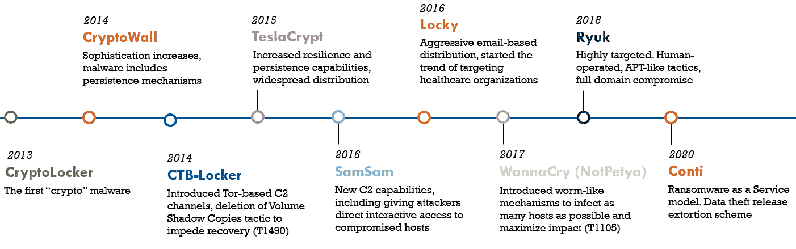
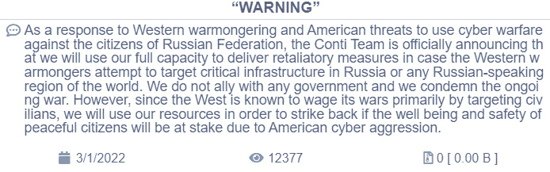
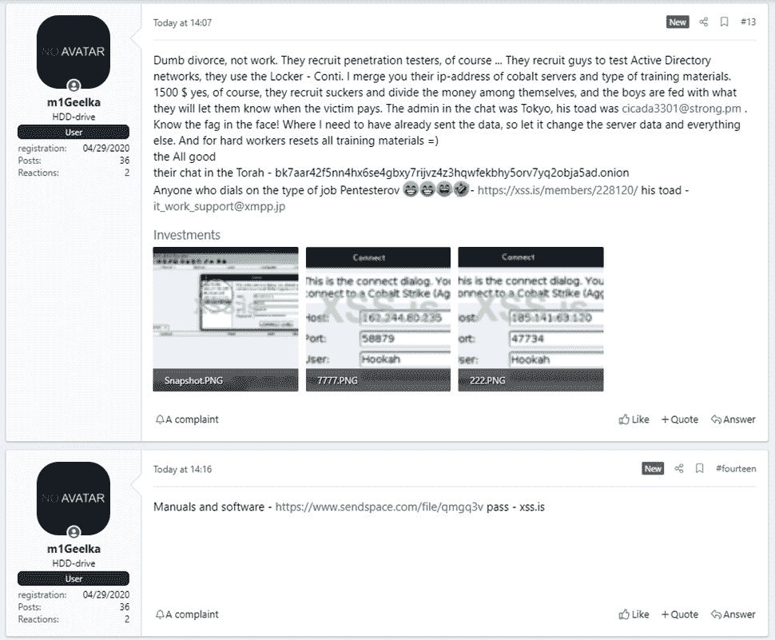
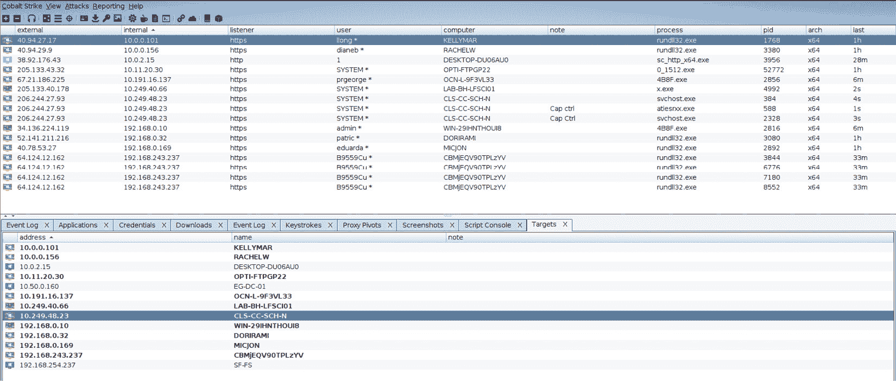
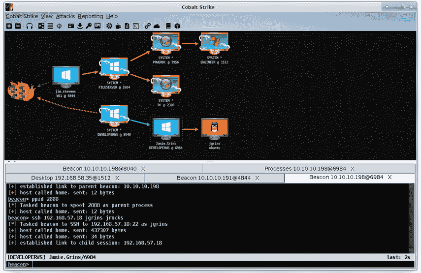
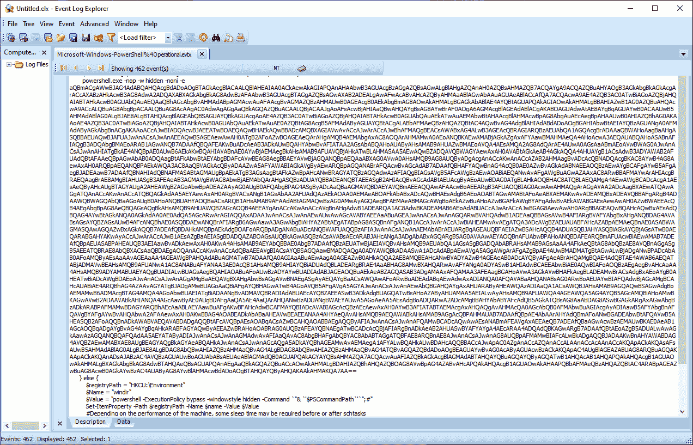
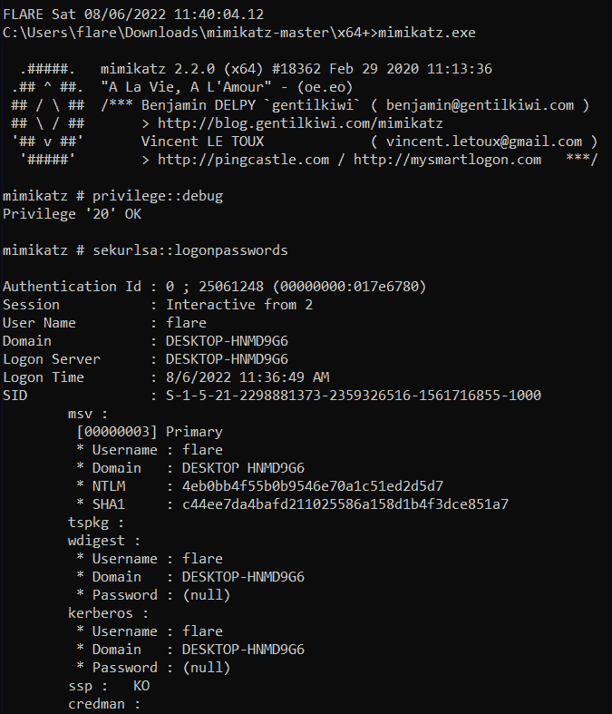

# 第十四章：勒索病毒准备与响应

随着加密货币的普及，威胁者拥有了从受害者那里提取赎金的必要工具，而无需担心被捕。这直接促成了勒索病毒的兴起，这是一种攻击方式，威胁者通过部署加密受害者文件的恶意软件并勒索赎金，让受害者支付以解锁文件。过去 10 年来，更加复杂的工具和技术的发展使得勒索病毒攻击影响到政府、大型医疗机构和大企业，所有这一切都是为了从受害者身上榨取最大赎金，丰富各种威胁者。

鉴于勒索病毒的广泛传播，事件响应人员很可能需要应对这些类型的攻击。为了更有效地应对涉及勒索病毒的事件，分析人员应该熟悉相关的战术和技术，以及相应的响应行动，以便在发生攻击时能够迅速恢复运行。

在本章中，我们将重点讨论以下背景要素：

+   勒索病毒的历史

+   Conti 勒索病毒案例研究

+   正确的勒索病毒准备

+   根除与恢复

在打下坚实的基础之后，我们将在下一章中探讨具体的调查与分析技术。

# 勒索病毒的历史

尽管自 1980 年代末以来就存在加密数据的恶意软件版本，但目前勒索病毒的爆发与加密货币的发展密切相关。加密货币的出现使得勒索病毒威胁者能够匿名发送和接收数字货币，这让他们能够在保持匿名的同时执行攻击并从受害者那里提取赎金。在过去的十年中，这种攻击形式在复杂性上经历了进化，但在一些核心战术、技术和程序（TTPs）方面基本保持一致，比如初始感染、传播勒索病毒以及加密用户文件，目的是为了获取解密密钥的赎金。我们将在下图中简要讨论这一演变中的一些关键变种：



图 14.1 – 勒索病毒简史

## CryptoLocker

第一波勒索病毒攻击发生在 2013 年 9 月到 2014 年 5 月之间，使用了**CryptoLocker**勒索病毒变种。该变种通过恶意电子邮件附件和**Gameover ZeuS**僵尸网络传播。此勒索病毒变种使用 2048 位 RSA 密钥加密本地文件和映射的网络驱动器。攻击者还会告知受害者他们的文件已被加密，并提供支付赎金的说明。通过执法部门的干预，攻击者被阻止，最终在 2014 年 5 月摧毁了 Gameover ZeuS 僵尸网络。此干预甚至包括对俄罗斯国籍的 Evgeniy Bogachev 的起诉，因其涉嫌参与维护与这些攻击相关的僵尸网络。

## CryptoWall

下一个重大变种是**CryptoWall**，它在 CryptoLocker 变种消失后崭露头角。与 CryptoLocker 类似，这种结合了特洛伊木马和勒索病毒的变种使用 2048 位 RSA 加密算法来加密受害者的文件。该恶意软件的主要传播方式是通过包含 PDF 文档的压缩文件。

## CTB-Locker

与 CryptoWall 和 CryptoLocker 变种同时流行的，还有**CTB-Locker**变种，它也在感染受害者的系统。这个变种主要通过恶意电子邮件附件或伪造下载进行传播，且增加了一些附加功能，如使用**洋葱路由**（**TOR**）网络进行命令与控制，并删除感染系统的卷影复制，以阻止恢复。

CTB-Locker 利用的一个附加功能是加盟模式或**勒索病毒即服务**（**RaaS**）。在这种模式下，独立的攻击者可以访问勒索病毒和相关工具，以进行攻击，并从他们的赎金中提取一部分支付给运营勒索病毒的攻击者。

## TeslaCrypt

虽然大多数勒索病毒会加密各种文件，但**TeslaCrypt**变种则专门针对与在线游戏相关的文件。TeslaCrypt 的初始版本会加密保存的游戏、玩家档案和游戏修改文件。直到后来的版本，才会加密更多的 Microsoft 文件及其他常见文件。TeslaCrypt 利用了 Angler Adobe Flash 漏洞，通过不对称加密密钥感染系统。最初的版本存在加密方案的缺陷，Cisco Talos 发布了解密工具。2016 年 5 月，TeslaCrypt 的攻击者停止了其操作并释放了解密密钥。

## SamSam

**SamSam**勒索病毒变种起源于伊朗，根据对两名伊朗国民 Faramarz Shahi Savandi 和 Mohammed Mehdi Shah Mansouri 的起诉可以看出。在他们的攻击活动中，SamSam 勒索病毒感染了超过 200 个美国组织，从受害者那里收集了约 600 万美元。攻击利用了**远程桌面协议**（**RDP**）或基于 Java 的 Web 服务器的漏洞，成功在受害者的网络中获取初步控制权。之后，攻击者会横向移动，尽可能加密更多系统，使用的是 2048 位 RSA 加密算法。

## Locky

勒索病毒攻击者常用的一种策略是利用启用了宏的 Microsoft Word 文档。通过网络钓鱼技术，受害者被诱导打开启用了宏的文档。一旦执行，宏会下载一个特洛伊病毒并加密系统。**Locky**背后的攻击者利用这种技术对多个受害者造成了巨大影响。使用 RSA 或 AES 加密算法，该恶意病毒可以加密驱动器、可移动驱动器和网络连接的驱动器上的文件。

## WannaCry

一个短暂但破坏性极大的攻击，**WannaCry**是一起影响全球超过 20 万台计算机的高调攻击。此次攻击利用了近期披露的 Eternal Blue 漏洞，利用 Microsoft SMB 服务中的一个漏洞，并通过后门工具**DoublePulsar**使勒索病毒得以安装并复制到其他系统中。WannaCry 攻击仅持续了几个小时，直到 2017 年 5 月 12 日，安全研究员 Marcus Hutchins 发现了一个杀死开关，防止了进一步的感染。经过进一步研究，美国和英国都将此次攻击归咎于朝鲜政府。

## Ryuk

被认为是俄罗斯网络犯罪集团 Wizard Spider 的作品，Ryuk 具有要求 2020 年三大最高支付的独特地位。这表明**Ryuk**背后的集团将目标瞄准了大型组织，以获取大额赎金。勒索病毒可以关闭 180 个服务和 40 个进程，以确保最大限度地影响受害者的系统。数据使用 AES-256 对称密钥加密，并进一步使用 4,096 位 RSA 密钥加密，使得没有密钥几乎不可能恢复加密的文件。利用 RaaS，Ryuk 使用**Download-as-a-Service**（**DaaS**），即恶意软件编码人员通过第三方将勒索病毒传送给目标。

Ryuk 同样使用了更为复杂的多阶段攻击。在这种情况下，会向受害者发送一封钓鱼邮件。一旦附件（如启用宏的 Word 文档）被打开，就会使用一个额外的工具，称为投放器。这些投放器，如 BazarBackdoor 或 Trickbot，通常用于添加额外的命令和控制工具。一旦控制权建立，勒索病毒就会被加载并执行。

Ryuk 与另一个高产的变种 Conti 密切相关。这个变种代表了一种高度复杂的工具，它将过去版本中的勒索病毒变种元素结合成一次极具影响力的攻击。

# Conti 勒索病毒案例研究

最具生产力的勒索病毒变种之一是 Conti。Conti 的两个特点使其在威胁行为者中脱颖而出。第一个特点是 Conti 是一个 RaaS（勒索软件即服务）威胁行为者。这种类型的威胁行为者使用一种加盟模式，在黑客论坛上寻找高度熟练的招募人员。从那里，他们会获得执行初始阶段所需的工具和技术：攻击并部署勒索病毒。Conti 变种的原始编码人员随后会获得 10%到 30%不等的赎金作为报酬。

第二个特点是，Conti 的加盟者通常会在加密文件的同时窃取数据。然后，这些数据会被“劫持”，用于勒索。如果受害组织未能及时支付赎金，数据将被公开。Conti 的加盟者甚至能够在互联网和暗网上使用一个网站发布这些数据。

在被关闭之前，Conti 变种及其加盟团体使用了多种多样的工具和技术，成为研究勒索软件威胁行为者操作模式的一个优秀案例。在这个案例中，我们将首先研究该加盟团体的背景、披露内容以及该团体及其加盟者在攻击中使用的 TTP（战术、技术和程序）。

## 背景

RaaS 模型首次出现在 2019 年 12 月。Conti 这个名字指的是所使用的特定恶意软件变种，通常与威胁行为者 Wizard Spider 开发的 Trickbot 木马一起部署。这个团体首次出现在 2016 年 9 月，据信其总部位于俄罗斯，是一个技术先进、以财务为驱动的威胁行为者。

在运作期间，与 Conti 相关的 RaaS 威胁行为者攻击了包括政府和大型企业在内的多种组织。即便在 COVID-19 大流行期间，加盟团体仍然对 16 个不同的医疗或急救网络发动攻击。这些攻击中的一些勒索金额高达 2500 万美元。

Conti 所使用的加盟模型的一个关键特点是组织内部的精细任务分工。有专门的团队负责初步访问的技术环节，然后将剩余的工作交给其他团队处理。还有专门的团队负责与受害者组织进行勒索软件谈判。

Conti 还通过向攻击中加入额外的勒索元素，进一步提升了原本就非常盈利的勒索软件威胁。Conti 在公开互联网和暗网中设置了多个网站，威胁称如果受害者不满足其要求，他们将公开泄露被窃取的数据。这样做是为了迫使受害者支付赎金，不仅是为了恢复数据解密，还为了避免公共披露带来的尴尬：


图 14.2 – Conti 披露网站

在同一个网站上，Conti 行为者还威胁对 2022 年俄乌战争危机进行报复。此声明之后，该团体对乌克兰的目标进行了更多攻击。主要的不同点是，这些攻击针对的是政府网络和关键基础设施，而不再是单纯的勒索目的。



图 14.3 – Conti 乌克兰响应

在短短 2 年的运营中，Conti 及其附属机构已经成为政府、医疗、关键基础设施以及大公司等组织的重大威胁。它们的精密任务分工和技术能力使其成为潜在未来威胁行为者的模仿对象。鉴于此，当该组织在 2022 年 5 月停止运营并关闭其基础设施，包括其披露网站时，许多人感到意外。附属成员随后加入了其他团体。一项事件可能加速了该组织的解散，那就是一个附属成员披露了内部文件和工具。

## 操作披露

2021 年 8 月 5 日，一位用户名为`m1Geelka`的用户在俄罗斯语言的网络安全论坛`xss.is`上发布了 Conti 勒索软件组及其附属机构使用的技术和操作手册。该用户提供了一个链接，供有权限访问论坛的任何人下载手册和软件，该链接指向一个文件共享网站。此帖很快被删除，但对于安全研究人员来说，这是一次关于该组操作的重磅数据和情报收获：



图 14.4 – Conti 披露

这些披露内容目前仍然可以在[`share.vx-underground.org/Conti/`](https://share.vx-underground.org/Conti/)访问，包含了 2022 年 2 月和 3 月 Conti 组 TTPs（战术、技术和程序）更新的附加披露。例如，披露的文件中包含了使用 Cobalt Strike 等工具的屏幕截图，如下所示：



图 14.5 – Conti 使用 Cobalt Strike

这些披露内容包括了该组织运营和方法的其他关键细节。包括了聊天记录、源代码以及与工具使用相关的手册。此次披露的独特之处在于几乎完整呈现了威胁行为者及其附属机构的操作方法和工具。通过这些数据，我们可以清楚地看到一个复杂的勒索软件组织可能采用的具体战术和技术，从而更好地准备防御和检测它们。

## 战术和技术

Conti 的附属人员采用多种策略和技术。在本节中，我们将探讨其中一些更常见的策略和技术，因为这些策略与附属人员及其他勒索病毒威胁行为者使用的策略有很大的重叠。要完整了解与 Conti 勒索病毒变种相关的 TTPs，请参考 MITRE ATT&CK 配置文件：[`attack.mitre.org/software/S0575/`](https://attack.mitre.org/software/S0575/)。有关实际 Conti 勒索病毒攻击活动的背景，**网络安全和基础设施局**（**CISA**）发布了关于 Conti 威胁行为者的咨询报告，并详细列出了在超过千次攻击中观察到的 MITRE ATT&CK 战术：[`www.cisa.gov/uscert/sites/default/files/publications/AA21-265A-Conti_Ransomware_TLP_WHITE.pdf`](https://www.cisa.gov/uscert/sites/default/files/publications/AA21-265A-Conti_Ransomware_TLP_WHITE.pdf)。

### 初始访问

Conti 主要采用的方式是**鱼叉式钓鱼攻击 [T1566.001]**或邮件中包含的**恶意链接 [1566.002]**。这些邮件通常会包含一个启用了宏的 Microsoft Word 文档，文件名故意设置为吸引用户打开附件。在其他案例中，Conti 附属人员已知使用被泄露的凭据通过启用 RDP 的互联网暴露系统进行连接。这样，他们可以在不发送钓鱼邮件的情况下，在网络内建立立足点。

其他附属人员使用伪装电话，他们假装是帮助台人员，诱使用户下载远程访问软件，如 GoToAssist。然后，攻击者可以植入恶意软件或其他工具，开始后续的操作。

### 执行

一旦启用了宏的 Word 文档被打开，宏通常会执行一个 Windows PowerShell 脚本，以执行**命令和脚本解释器：PowerShell [T1059.001]**技术。这个脚本常用于下载二级有效载荷，通常是像 Trickbot、Qbot 或 Bazar 这样的 RAT。这样就建立了对受害者网络的初步控制。

执行恶意软件需要使用几种方法。Conti 附属人员常用的一种技术是将 RAT 嵌入 DLL 文件中。该文件将被放置在一个目录中。然后，使用 Windows `rundll32.exe` 可执行文件来执行 RAT，这种方法称为**系统二进制代理执行：Rundll32 [T1218.011]**。即便许多 EDR 工具可以检测到此类行为，这种技术在实际环境中仍然存在。

在这里，我们将开始查看工具 Cobalt Strike。这个工具常出现在勒索软件事件中，并且通常与 Conti 有关。Cobalt Strike 是一款商业化的后期利用工具，具有广泛的功能，能够在一个集成系统中执行各种操作。Cobalt Strike 还包括其他常见的后期利用框架，如 Metasploit 和后期利用工具如 Mimikatz，可用于各种凭证威胁和滥用攻击。该工具的整体外观和操作感受类似于 Armitage，如下图所示：



图 14.6 – Cobalt Strike 图形用户界面

Cobalt Strike 通常会在此攻击阶段与 RAT 一起执行，或者代替 RAT 执行。

### 权限提升

Wizard Spider 被观察到在一次被称为 **进程注入：动态链接库注入 [T1055.001]** 的攻击中，将恶意 DLL 文件注入现有或正在运行的进程。在此技术中，攻击者可以将任意代码注入到正在运行的进程中。这使得攻击者能够执行恶意代码并绕过检测。根据写入的进程，恶意代码可能还会以提升的权限运行。

### 防御规避

现代的杀毒软件和 EDR 解决方案在检测恶意软件、漏洞利用和其他恶意活动方面变得更加高效。勒索软件威胁演员，如 Conti，采用各种方法确保不被检测和阻止。除了进程注入外，Cobalt Strike 平台还具有额外的功能，允许威胁演员保持隐蔽。例如，该工具通过哈希化 Windows API 调用，使用 **混淆文件或信息 [T1027]** 技术，使得杀毒软件或 EDR 工具无法识别与 Cobalt Strike 使用相关的任何可疑 API 调用。

另外一个常见的防御规避策略，不仅在 Conti 中观察到，在许多勒索软件威胁演员中也有广泛使用，就是利用 Base64 编码 PowerShell 脚本。此策略通过不将具体命令写入存储来提供一种混淆手段。相反，它依赖 PowerShell 解码并执行命令。例如，以下 Windows 事件日志条目展示了 Base64 编码的脚本：



图 14.7 – Base64 编码的 PowerShell 脚本

### 凭证访问

获取或创建具有提升权限的有效凭证，对于勒索软件攻击的横向移动组件至关重要。Conti 利用几种不同的工具和技术来获取凭证。第一种是使用 Sysinternals 工具 `procdump.exe`。该工具在 **操作系统凭证转储：LSASS 内存 [T1003.001]** 技术中被使用，用于转储 **本地安全认证子系统服务**（**LSASS**），该服务包含 Windows 操作系统的凭证。

Conti 还使用了后渗透工具 Mimikatz，执行类似 Windows Sysinternals 工具`procdump.exe`的操作。该二进制文件和相关文件可在 GitHub 上找到：[`github.com/ParrotSec/mimikatz`](https://github.com/ParrotSec/mimikatz)。Mimikatz 还可以获取系统上用户和管理员账户的明文密码，如下图所示：



图 14.8 – Mimikatz

Mimikatz 还可以获取 Kerberos 票证，以及其他功能，以获得有效的凭证。像 Metasploit 和 Cobalt Strike 这样的后渗透框架包括 Mimikatz。

### 发现

一旦建立了立足点，像 Conti 这样的勒索软件攻击者需要绘制内部网络图，以确定影响尽可能多系统的最佳方式。在某些情况下，这包括运行命令行工具如`net localgroup`。已知 Conti 使用 Cobalt Strike 中的网络发现功能。最后，对于更复杂的网络，可以使用 Active Directory 映射工具 Bloodhound，下载地址：[`github.com/BloodHoundAD/BloodHound`](https://github.com/BloodHoundAD/BloodHound)。该工具不仅能绘制网络图，还能提供可视化图表，进而可能为最佳攻击路径提供见解。

### 横向移动

在执行这一战术之前，恶意活动通常只限于少数已被初步执行 RAT 或通过其他工具被攻陷的系统。发现后的下一阶段是横向移动。这时，Conti 的攻击者试图攻陷尽可能多的系统，以便勒索软件的影响足以迫使受害者支付赎金。

勒索软件的横向移动在很大程度上依赖于拥有凭证的访问权限，通常是具有提升权限的凭证，这使得可以通过**服务器消息块**（**SMB**）或 RDP 进行远程访问。对于 SMB，特定的技术被称为**远程服务：SMB/Windows 管理员共享 [T1021.002]**。在这一技术中，攻击者通常使用 Windows Sysinternals 工具 PsExec 连接到并写入 ADMIN$网络共享。然后，他们能够执行额外的命令或传输恶意工具和可执行文件。

另一种常用的技术是**远程服务：远程桌面协议 [1021.001]**。在这种情况下，Conti 可以利用 Cobalt Strike 的**虚拟网络计算**（**VNC**）功能连接到运行 RDP 的其他系统。从这里，他们可以执行额外的命令或在新被攻陷的系统上放置其他工具。

这些技术的一个方面是，它们依赖于拥有合法管理员级别凭证的访问权限。

### 命令与控制

Cobalt Strike 后期利用工具的一个关键组成部分是其定制指挥与控制基础设施的能力。该工具使用由威胁行为者配置的监听器。威胁行为者可以配置监听器，使用多种 TCP 和 UDP 协议，如 DNS、HTTP 和 HTTPS。

除了监听器，威胁行为者还可以配置一组可修改的 C2 配置文件。这些配置文件使威胁行为者能够模糊化 C2 流量，以绕过入侵检测或入侵防御系统等检测机制。例如，下面这一段可修改的配置文件来自 [`github.com/rsmudge/Malleable-C2-Profiles/blob/master/normal/amazon.profile`](https://github.com/rsmudge/Malleable-C2-Profiles/blob/master/normal/amazon.profile)。在该配置文件中，C2 流量被设计成模拟正常的 HTTP 流量。值得检查的一个特定部分如下：

```
set sleeptime "5000";
set jitter    "0";
set maxdns    "255";
set useragent "Mozilla/5.0 (Windows NT 6.1; WOW64; Trident/7.0; rv:11.0) like Gecko";
```

在配置文件的这一部分，已经配置了各种设置。第一个是睡眠时间，这是 C2 信标向外部 C2 系统发送指令时的间隔（以秒为单位）。为了绕过 IDS 系统对这种信标行为的检测，设置了一个抖动时间。这是一个随机时间，可以通过增加或减少睡眠时间来随机化信标活动。另一个关键数据是用户代理，配置文件使用它来使连接看起来像是一个 web 浏览器发起的。随意检查任何网络流量都会显示该用户代理字符串。

这些可修改的配置文件是公开可用的，并使 Cobalt Strike 能够伪装成合法的流量。在一个小型网络中，Cobalt Strike 系统与受害系统之间的流量会与所有其他在网络进出口点传输的流量混合在一起。

## 数据泄露

Conti 与其他早期组织或攻击活动的主要区别之一就是数据盗窃和加密。在这种情况下，Conti 使用了 WinSCP 或 PuTTY 等常见工具，通过 **安全文件传输协议**（**SFTP**）或简单的 HTTPS 技术 **Web 服务数据泄露 [T1567]** 来发送聚合数据。

## 影响

Conti 组与 Conti 勒索病毒相关，该勒索病毒会根据 MITRE ATT&CK 技术 `CreateIoCompletionPort()`、`PostQueuedCompletionStatus()` 和 `GetQueuedCompletionPort()` 加密感染系统上的数据，使用一个与 RSA-4096 公钥配对的 AES-256 加密密钥来加密文件。Conti 变种的一个独特特征是它会跳过 `.exe`、`.dll` 和 `.lnk` 文件，并且不会加密它们。

Conti 还可以通过停止 146 个独立的 Windows 操作系统服务或进程，执行**Service Stop [1489]**技术。这些服务与备份和安全工具相关联。这样，勒索软件就能正常执行，并且消除了受害者利用备份进行数据库或其他恢复的能力。

最后，Conti 勒索软件可以使用`vssadmin`命令。再次强调，这会删除受害者在加密过程后恢复系统的能力。本质上，如果 Conti 成功执行，它几乎肯定会加密所有文件，只有少数文件除外，导致系统无法使用。

# 适当的勒索软件准备

勒索软件攻击对企业造成的破坏是毁灭性的。除了自然灾害，没有多少事件能像勒索软件攻击那样产生如此大的影响。虽然旨在获取机密数据的 APT 类型网络入侵也非常严重，但它们通常不会加密整个网络，尤其是当入侵者试图保持一定的隐蔽性，以便入侵不被察觉时。

在为勒索软件攻击做准备时，组织应关注两个具体领域。首先，确保网络和端点对勒索软件攻击的影响具有韧性。此方法的前提是假设威胁行为者可能会访问系统，但适当的准备将使他们在从初始立足点进一步攻击时，几乎没有工具或方法。第二个准备步骤是确保 CSIRT 团队熟悉勒索软件威胁行为者的 TTP（战术、技术和程序），并准备应对隔离和清除网络中的威胁行为者的挑战。

## 勒索软件韧性

对抗勒索软件的韧性意味着我们承认这一威胁的存在，并且至少有机会在端点阻止攻击。如果这样做无效，组织可以限制勒索软件的蔓延及其相关影响，确保只有少数选定的系统受到影响，从而使正常操作得以继续。勒索软件韧性策略应包括以下内容：

+   使用`rundll32.exe`执行恶意代码。尽管 PowerShell 或`rundll32.exe`的使用本身并不具恶意，但通过命令行运行 DLL 文件或 Base64 编码的 PowerShell 通常表明存在恶意行为。

+   **系统卫生**：正如我们在 Conti 勒索软件概述中看到的，该团伙通常会利用 Windows Sysinternals 工具作为整体攻击的一部分。再加上使用本地管理员账户，单一系统的妥协可能会带来重大风险。系统管理员应确保部署的端点仅限于必要的工具。移除 RDP 访问、本地管理员账户以及像 ProcDump 或 PsExec 这样的工具，可以使横向移动和感染其他系统变得更加困难。

有几个行业公认的系统加固标准，例如**安全技术实施指南**（**STIGs**），提供了如何配置和加固各种系统的详细信息。还有其他指南可以参考。每个组织必须根据其风险来决定并应用适当的加固措施。无论系统如何加固，整体目标都是使威胁行为者在网络中进行操作变得更加困难。

+   **网络拓扑**：关于影响整个网络的勒索软件攻击，一个突出的方面是“扁平”网络拓扑。在这种拓扑中，所有系统都可以与其他系统通信。例如，支付账款的局域网段就能与研发部门的系统进行通信，尽管这些系统之间并没有必要相互通信。简而言之，扁平网络允许勒索软件威胁行为者使用被攻破的凭证和他们选择的工具，在整个企业范围内传播。

解决方案是像造船工设计集装箱船那样构建网络拓扑。在水线以下，船体有防水舱，以便如果船体受损，水只能进入那个舱室，从而保持船只浮在水面上。网络拓扑应当以类似的方式工作，其中不同的局域网段通信仅限于必要的交流。**网络分段**的做法创造了特定的“防水”舱室，限制了威胁行为者横向移动的能力。

+   **多因素认证**：远程访问是管理即使是小型企业网络时的关键组成部分。然而，问题在于，威胁行为者通常会利用这些方式来传播勒索软件。建议实施**多因素认证**（**MFA**）机制，以限制威胁行为者在能够突破管理员账户的情况下横向移动的能力。

+   **安全备份**：作为勒索软件威胁不断发展的一个方面，我们已经看到像 Conti 这样的团体干扰组织从勒索软件攻击中恢复的能力。在 Conti 的案例中，这包括从已感染的系统中移除卷影复制。其他团体甚至更进一步，进行网络发现，寻找连接网络的**存储区域网络**（**SAN**），并加密其中的备份，实际上使组织无法恢复备份。因此，组织应该评估其备份策略，并可能使用离线备份或符合恢复点和恢复时间目标的云解决方案。

## 准备 CSIRT

有一些额外的步骤与勒索软件相关，应该包含在任何事件响应计划或行动手册中。以下是应对勒索软件时的一些关键考虑因素：

+   **快速隔离或封锁**：勒索软件带来的最大风险是它传播的速度。攻击者可能仅需几小时就能完成他们的目标。为应对这一点，事件响应人员应确保能够快速在关键技术如路由器、交换机和防火墙上执行隔离操作。快速隔离的障碍在于需要在行动之前与领导层确认决策。这会增加隔离攻击所需的时间。最佳的做法是，在事件发生之前讨论在何种情况下网络或安全团队将切断网络段或互联网之间的通信，这样他们便有权限采取措施遏制攻击。

+   **保持对 TTP 的更新**：勒索软件攻击者会不断改变他们的 TTP（战术、技术和程序），以保持领先于现代企业中的预防和侦测技术。这些变化有时可能是微妙的，有时则会表现为显著的变化。在任何情况下，威胁情报来源对于理解威胁、攻击者如何操作以及如何最好地调整预防和侦测控制措施至关重要。

+   **桌面演练**：最后，事件响应人员可以采取的具体行动之一是为技术团队和领导层设计并组织一个**桌面演练**（**TTX**），该演练将涵盖整个事件生命周期，以确保各个单位协调一致，并在事件发生前做出关键决策。这确保了在实际事件中执行的行动是预先计划好的，从而可以减少做出关键决策所需的时间，进而降低事件的影响。

# 根除与恢复

如果勒索软件攻击在组织中成功，重要的是要有一个预案，尽快将组织恢复正常运行。此外，正如我们所看到的，这些攻击非常复杂，涉及到深层嵌入操作系统的复杂恶意软件。这使得确保网络中彻底清除威胁变得困难。因此，有一些特定的方法可以隔离、根除并从勒索软件事件中恢复，从而确保最好的结果。

## 隔离

隔离勒索软件事件涉及两个主要行动。第一个是切断对被攻击系统的 C2（指挥与控制）能力。攻击者通常使用商业和开源工具的组合，如 Cobalt Strike 或 Metasploit，这些工具采用各种连接类型。初步调查的目标是检查系统，以确定 C2 基础设施和通信的性质，从而加以封锁。

第二个主要措施是切断对手横向移动或感染其他系统的能力。勒索软件攻击的关键特征是对手的目标是尽可能感染更多的系统，从而增加受害者支付赎金的可能性。

### 防火墙规则

对于未被局域网段包含且有可能导致整个企业受损的事件，考虑使用一个防火墙规则来切断所有互联网连接，直到识别出指挥与控制机制及其相关指标，并能够配置更具针对性的防火墙规则集。这种类型的遏制策略的明显挑战是关键系统将受到不利影响。每个情况都不同，应该在采取这一步骤之前评估具体情况。

### 禁用 SMB 通信

对手通常会在 Windows 企业环境中利用 SMB 功能。遏制勒索软件事件需要移除此功能。例如，如果启用了 SMBv1，你应当在整个企业中永久禁用它。如果警报或初步调查显示该协议正在被用于横向移动，你应该暂时禁用 SMBv2/v3。微软建议不永久禁用 SMB v2/3。有关更多微软的指导，请访问 [`support.microsoft.com/en-us/help/2696547/detect-enable-disable-smbv1-smbv2-smbv3-in-windows-and-windows-server`](https://support.microsoft.com/en-us/help/2696547/detect-enable-disable-smbv1-smbv2-smbv3-in-windows-and-windows-server)。

### 禁用管理员共享

网络利用和勒索软件攻击的另一个目标是查找和访问网络管理共享。Fortalice Solutions 建议阻止管理员共享，因为对手经常利用这些共享来传播文件，或用作脚本或命令的来源：

+   **选项 1**：要阻止管理员共享，推荐的解决方案是推出一个 GPO 偏好设置，应用到计算机上以编辑注册表：

    ```
    HKEY_LOCAL_MACHINE\SYSTEM\CurrentControlSet\Services\LanmanServer\Parameters
    ```

在此创建一个新的 `DWORD` 值，命名为 `AutoShareWks`，并将值数据设置为零。这可能需要你重新启动主机。欲了解更多信息，以下博客提供了关于注册表值更改的额外指导和示例：[`winaero.com/blog/disable-administrative-shares-in-windows-10-windows-8-and-windows-7/`](https://winaero.com/blog/disable-administrative-shares-in-windows-10-windows-8-and-windows-7/)。

+   **选项 2**：从 Windows 命令行输入以下内容：

    ```
    for %i in (C$ IPC$ ADMIN$) do net share %i /delete OR net stop LanmanServer
    ```

禁用管理员共享可能会带来一些不利影响。以下博客文章提供了缺少管理员共享时可能出现的问题的指导：[`support.microsoft.com/en-us/help/842715/overview-of-problems-that-may-occur-when-administrative-shares-are-missing`](https://support.microsoft.com/en-us/help/842715/overview-of-problems-that-may-occur-when-administrative-shares-are-missing)。

### 限制 PowerShell 使用

对手通常会利用 PowerShell 作为交付勒索软件的一部分。像 PowerSploit 这样的工具被配置为利用 PowerShell 进行企业范围内的各种操作。如果由于依赖的第三方应用程序，必须在环境中启用 PowerShell，请确保禁用旧版 PowerShell v2，因为它允许绕过受限语言模式并绕过**反恶意软件扫描** **接口**（**AMSI**）。

### 限制远程访问

远程访问应用程序，如 RDP，应在事件得到控制或 MFA 解决方案到位之前禁用。RDP 可以通过 GPO 进行禁用。在这一点上，事件响应人员常常会提出一个问题，即在事件期间禁用 RDP 可能会影响他们获取证据的能力。虽然这种担忧是有一定道理的，但保持 RDP 启用的真正影响可能是相当严重的。这时，远程证据捕获工具和技术就显得尤为关键——它可以让响应人员在阻止攻击者访问其他系统的同时，也能够收集必要的证据。

## 根除

根除是指将威胁行为者从网络中移除。这包括移除威胁行为者植入的任何恶意软件、使用的任何附加工具以及任何可能已被泄露的凭证。虽然这一概念看似简单，但现代勒索软件攻击的现实是，它们使用多种持久化机制确保威胁行为者能够继续访问。此外，系统上的许多数据已经被加密。

响应人员面临的挑战是，在没有完全和深入的调查情况下，很难确定威胁行为者能够侵入系统的深度。例如，与勒索软件攻击相关的 RATs（远程访问木马）可能会在计划任务中设置持久化机制，或者在注册表中植入脚本以便在每次启动时执行。完全反向工程恶意软件可以提供这些数据，但最佳选项是从头开始。

从感染的系统中移除威胁行为者通常需要从受信任的**金镜像**或已知的良好镜像中进行完全重建。开始这一过程的最佳地方是**业务连续性计划**（**BCP**）或**业务恢复计划**（**BRP**）。该计划概述了如何从备份中重建系统或重新制作镜像并重新部署。

## 恢复

应仔细执行恢复操作，以确保感染系统不会重新引入网络。如果有足够的证据，应在进入恢复阶段之前进行全面的**根本原因分析**（**RCA**）。这确保发现并能够根据过程修正威胁行动者利用的所有漏洞或系统配置。此外，只有在经过更新并包含在事件中定位的 IOC 的适当安全控制的清洁安全工具扫描后，才应重新引入系统。

恢复操作可以分为两大类。其中之一是根除和重新部署系统到企业架构。在*第二章*中，我们讨论了从事故中恢复所需的架构。

### 恢复网络架构

在*第二章*中，我们审查了一个从事故中恢复的示例恢复架构。以下是对此恢复方法的更详细和技术上的审查，专门针对勒索软件：

+   配置三个单独的**虚拟本地区域网络**（**VLANs**）：

    +   **感染 VLAN**：这是所有感染系统托管的网络。在大量系统感染的情况下，这可以是生产网络。理想情况下，这应配置为一个单独的网络。

    +   **分期 VLAN**：这个 VLAN 用于事故分类、重新映像、打补丁、安装安全工具和准备重新部署：

        +   互联网应仅用于事故分类、重新映像、软件更新和安全技术更新

        +   可能启用 PXE 引导以进行重新映像

        +   启用所有安全工具，如主机入侵检测、防病毒软件或终端检测和响应，以检测和隔离任何潜在的恶意软件或攻击

        +   在清洁它们之前监视系统以防止重新感染

    +   **清洁 VLAN**：

        +   一个完全新的网络，与“脏”或“分期”VLAN 没有连接

        +   这可能涉及到一个新的本地域

        +   只有在证明清洁后才将系统移至此处

如果域控制器已被攻击，应从头开始构建新的域控制器，并部署一个已知的好备份。

### 企业密码重置

许多勒索软件攻击将影响域控制器以及其他系统。如果威胁行动者能够识别域控制器并能够破坏包含整个企业凭据的`NTDS.DIT`文件，则将必须使用以下过程进行全局密码重置：

1.  更改所有高度特权组中账户的密码。

1.  两次滚动 KRBGT（https://docs.microsoft.com/en-us/windows-server/identity/ad-ds/manage/ad-forest-recovery-resetting-the-krbtgt-password）。

1.  更改内置本地管理员密码并可能拒绝远程登录：

    +   使用微软的**本地管理员密码解决方案**（**LAPS**）随机化每个终端的本地管理员密码，防止横向移动，并在需要时将其存储在 Active Directory 中。

1.  强制所有普通用户账户在下次登录时更改密码。

1.  禁用 Windows 操作系统在任何不需要凭证的设备上缓存凭证的功能（[`docs.microsoft.com/en-us/windows/security/threat-protection/security-policy-settings/network-access-do-not-allow-storage-of-passwords-and-credentials-for-network-authentication`](https://docs.microsoft.com/en-us/windows/security/threat-protection/security-policy-settings/network-access-do-not-allow-storage-of-passwords-and-credentials-for-network-authentication)）。

### 远程访问 MFA

强烈建议任何访问连接到内部网络的系统的远程访问启用多因素认证（MFA）。攻击者继续利用合法凭证并访问仅依赖单一身份验证因素的远程系统。

### 增强的日志记录

当系统重新部署时，应增加监控。这将提高识别任何可能已被攻击并未正确恢复的系统的可能性，从而在造成重大影响之前发现它们。以下是一些需要转发到 SIEM 或其他日志管理解决方案的重要 Windows 事件和系统日志的附加监控步骤：

1.  在可能的情况下部署 Sysmon（特别是在域控制器或关键系统上）。

1.  启用安全事件日志 – 允许连接和绑定到端口（5156, 5158 事件 ID）。

1.  启用安全事件日志 – IPC$ 连接（5140, 5145 事件 ID）。

1.  确保所有系统已部署 PowerShell 版本 5。PowerShell 版本 5 支持增强日志记录，有助于识别 PowerShell 滥用。日志记录需要通过组策略配置以下设置：

    +   开启模块日志记录：已启用。

    +   开启 PowerShell 脚本块日志记录：已启用。

    +   开启脚本执行：未配置。

    +   开启 PowerShell 转录：已启用。

    +   设置 Update-Help 的默认源路径：未配置。

    +   本地日志保留需要配置，以确保每台服务器至少保留 90 天的日志。日志应立即转发到集中式日志存储系统，以便进行长期保留和分析。

显然，恢复是一个关键组成部分，组织可能希望尽快完成这一过程。话虽如此，恢复过程必须是系统化的，并考虑到威胁。如果在 TTX 中没有按流程走恢复步骤，或者急于完成过程，会增加将仍然感染的系统重新引入网络的风险，从而导致勒索病毒攻击再次发生。

# 摘要

勒索软件是一种我们在可预见的未来都会面临的威胁。本章中，我们回顾了勒索软件的历史、威胁行为者如 Conti 常用的 TTP（战术、技术和程序）、如何将我们的事件响应与这一威胁对接，以及如何遏制、消除并从中恢复。了解这些 TTP 可以帮助我们更好地检测和预防此类攻击。理解响应要素使我们能够做出适当的反应，并限制其影响。

在下一章中，我们将探讨具体的调查和分析技术。

# 问题

回答以下问题，以测试你对本章内容的掌握：

1.  哪个威胁行为者与 Ryuk 和 Conti 相关？

    1.  AtomicSquirrel

    1.  BadWitch

    1.  Wizard Spider

    1.  BlackEnergy

1.  在域控制器遭到破坏的情况下，执行全局密码重置非常重要。

    1.  正确

    1.  错误

1.  推动勒索软件的关键组件是什么？

    1.  常见的远程访问木马（RAT）

    1.  加密货币

    1.  商业渗透测试工具

    1.  不良的安全卫生

1.  以下哪项可以抑制威胁行为者的横向移动？

    1.  MFA

    1.  限制 RDP

    1.  限制 SMB

    1.  上述所有内容

# 深入阅读

请参考以下资源，了解本章涵盖的更多内容：

+   *防止* *勒索软件*：[`www.packtpub.com/product/preventing-ransomware/9781788620604`](https://www.packtpub.com/product/preventing-ransomware/9781788620604)

+   *勒索软件事件响应技巧* *攻击*：[`www.packtpub.com/product/incident-response-techniques-for-ransomware-attacks/9781803240442`](https://www.packtpub.com/product/incident-response-techniques-for-ransomware-attacks/9781803240442)
