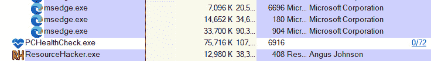

# 第十六章：事件响应中的恶意软件分析

恶意软件继续成为企业和消费者系统不断演变的灾难。每当防御措施被创建，恶意软件编程人员就会创造出新的变种，能够腐蚀或摧毁系统。恶意软件甚至被用作针对国家和全球组织的武器。大多数数据泄露事件都涉及使用恶意软件来实现某种目标。各行各业的组织都面临着恶意软件的威胁。随着勒索软件攻击（如 Conti 和 Ryuk）的出现，组织不得不迅速行动，解决这些攻击。

由于恶意软件始终存在风险，事件响应分析人员必须了解一些用于恶意代码分析的方法和工具。在一章内容中无法全面解决恶意软件分析的复杂性。因此，本章将重点介绍恶意软件分析的基础要素，并探讨一些常用的工具。这将为任何分析人员提供扎实的理解，使他们能够在事件的背景下理解分析结果。

在本章关于恶意软件分析的讨论中，将涉及以下主题：

+   恶意软件分析概述

+   设置恶意软件沙箱

+   静态分析

+   动态分析

+   ClamAV

+   YARA

# 恶意软件分析概述

恶意软件分析，或称恶意软件逆向工程，是数字取证领域中的一个高度技术化和专业化的领域。病毒防护和威胁情报依赖于一支训练有素的程序员和取证人员团队，他们从外部获取恶意软件，并对其进行解剖，以确定其功能、运行方式以及可能的责任方。这是通过两种类型的分析方法进行的：静态分析和动态分析。与大多数数字取证工作一样，每种分析方法都有其优势，事件响应分析人员应该熟悉这两种方法。

恶意软件分析

本章仅仅触及了网络安全领域中一个高度专业化的方面。目的是给出一些例子，说明分析人员如何从与事件相关的恶意软件中提取可操作的 IOC（指标）。如果需要更详细的内容，请查阅*Monnappa K A 的《学习恶意软件分析》*，可在[`www.packtpub.com/product/learning-malware-analysis/9781788392501`](https://www.packtpub.com/product/learning-malware-analysis/9781788392501)找到。

一位名叫 Lenny Zeltser 的恶意软件分析专家创建了一种优秀的恶意软件分析方法学，他的网站上有丰富的资源，地址是[`Zeltser.com`](https://Zeltser.com)。该方法学包括以下七个步骤，帮助分析人员进行分析：

1.  创建一个受控的实验室环境，以便进行分析。

1.  检查可疑恶意软件与**操作系统**（**OS**）环境的交互行为。

1.  检查可疑应用程序的代码，以了解其内部工作原理。

1.  执行动态分析，确定在静态分析中无法识别的操作。

1.  确定恶意软件是否被打包，并在必要时解包。

1.  继续进行分析，直到分析目标完成。

1.  准备一份补充报告，归还实验室到分析前的状态。

通常，恶意软件分析可以分为四个独立的类别，如*图 16.1*所示，这是基于 SANS 讲师 Allissa Torres 创建的类似图表。这四个类别在工具、技术和难度上有所不同。执行的第一个且最简单的技术是*完全自动化分析*。在这种情况下，恶意软件的副本在恶意软件沙箱中执行，沙箱是为执行恶意软件而创建的环境，可以在相对较短的时间内了解其行为。这可以很好地展示恶意软件的行为和 IOC（指示器）。然而，这种方法没有提供详细的代码分析，代码分析可能会揭示其他细节，例如潜在的被利用的漏洞或它可能瞄准的特定软件：


图 16.1 – 恶意软件分析类别

下一个技术是*静态属性分析*。在这种技术中，使用工具来确定文件哈希、头部、字符串、文件属性和与恶意代码相关的其他元数据。这种技术也非常快速，但需要一定的恶意软件知识来分析和解释结果。通常，如果文件通过自动化沙箱运行并同时分析静态属性，就足以深入了解恶意软件的行为并提取与事件相关的 IOC。

接下来的两个分析阶段需要更多的专业知识、工具和时间。第三阶段是*互动行为分析*，它涉及使用自动化工具和静态属性分析相结合的方式，检查恶意软件的特定元素。例如，样本可能在沙箱中执行，并控制特定的网络行为，以确定恶意软件是否尝试与外部主机连接以下载二级有效负载。这个阶段给予分析人员更多的沙箱环境控制，他们可以根据观察情况更改参数。在这种情况下，分析人员可以控制沙箱的网络连接，并确定特定流量的样子。

最终阶段是*手动代码逆向*。正如你所预料的，这一阶段因其时间和难度，要求具备高度专业的技能。在这一阶段，恶意软件样本将经过逆向工程处理。尽管这需要时间和技能，但这一见解对于全面理解代码至关重要。例如，Stuxnet 恶意软件经过了广泛的逆向工程，分析师能够确定了被攻击的**可编程逻辑控制器**（**PLC**）。没有这一洞察，恶意软件的真正意图可能就无法被发现。

Stuxnet 恶意软件分析

即使 Stuxnet 病毒被发现已有十年，它仍然在网络安全和网络战争领域广泛讨论。值得深入研究金·泽特尔（Kim Zetter）在其著作《倒计时至零日：Stuxnet 与全球首个数字武器的发布》中的研究，以及 2016 年纪录片《零日》。这两者都深入探讨了恶意软件逆向工程在揭示 Stuxnet 中的重要作用。赛门铁克对 Stuxnet 病毒的分析副本已作为补充材料随书提供。值得查看，因为它真实地展示了进行全面分析所需的专业知识和时间。

从恶意代码样本中提取最大数据量的最佳方法是使用静态和动态分析技术对文件进行全面检查。利用这些技术的全方位方法提供了获得恶意软件如何运行、其功能和潜在目标的最佳方式。一个很好的例子是对 Stuxnet 病毒的分析，该病毒曾被用来攻击伊朗的纳坦兹铀浓缩设施。卡巴斯基和赛门铁克的研究人员进行了彻底的分析，为网络安全和国家安全界提供了广泛的分析，揭示了这一复杂恶意软件的能力和目标。

在分析提取指示器的过程中，恶意软件逆向工程面临一些挑战。首先，逆向工程的工具和技术需要大量时间来掌握。逆向工程是一个专业领域，考虑到恶意软件的数量，可能很难立即找到人来进行完整的逆向工程。其次，整个过程本身非常耗时。使用二进制分析工具进行代码的详细静态分析可能需要较长时间。如果其他团队如事件响应团队或安全运营中心需要指示器来进行阻止或调查，等待完整的逆向工程结果并不可取。

在面对这些挑战时，威胁情报和事件响应分析人员可以利用一些工具和技术来提取相关的指标和 TTP（技术、战术和程序），同时等待进行完整反向工程检查的更详细结果。我们将在本章后面讨论这些工具和技术。

## 恶意软件分类

恶意软件或 malware 是一个总称，指任何旨在损坏、禁用或在计算机系统内产生不良条件的软件。这个定义虽然功能上可行，但在对恶意软件分类时也非常宽泛。有些恶意软件专门编写用于从支付系统中窃取信用卡号码，而其他恶意软件用于接管系统，允许攻击者远程控制该系统。观察这些具体行为的分析人员——例如感染后受损系统如何向互联网发送通信，或者在受感染系统上采取了什么行动——可能能够确定恶意软件的类型以及攻击者的最终目标。

一般而言，在讨论恶意软件时，以下是一些更具体的类别：

+   **病毒**：在某个时期，病毒一词用于指对计算机系统有害的任何恶意代码。随着恶意软件类型的增加，病毒一词被归类为对系统有故意恶意影响的任何代码。

+   **蠕虫**：通常是病毒的一部分，蠕虫不仅能对系统产生影响，还能自我复制并影响连接到它的其他系统。最著名的蠕虫之一是 Morris 蠕虫，于 1988 年在全球范围内传播，导致互联网上的拒绝服务（**DoS**）攻击。

+   **特洛伊木马**：源自神话中的特洛伊木马，这类恶意软件通常隐藏在合法应用程序或文件中。当不知情的用户打开文件时，恶意软件会感染系统。此类恶意软件通常利用社会工程学攻击感染系统。

+   **键盘记录器**：此特定恶意软件隐藏在运行系统的背景中，捕获用户的按键输入。然后，将此信息发送给控制器进行审查。编写键盘记录器的程序员通常有兴趣获取凭据。

+   **Rootkit**：Rootkit 用于隐藏其他恶意代码，如**远程访问特洛伊木马**（**RAT**），允许攻击者远程控制被感染的系统。

+   **信息窃取恶意软件**：通常为单一目的编写，此类恶意软件用于捕获诸如信用卡号码或银行凭据等信息，例如 Shylock 恶意软件，专门用于捕获银行登录信息。

+   **后门**：作为远程访问的另一种变体，这类恶意软件感染系统后，允许攻击者接管被感染的系统。

+   **下载器**：随着防御变得越来越复杂，恶意软件编写者也变得越来越高级。下载器是一个多阶段恶意软件程序的一部分。下载器通常会感染一个系统，然后连接到远程服务器获取其余的代码。这种方法常用于绕过安全控制，并且对于恶意软件编写者来说，可以利用更大、更复杂的恶意软件。

+   **僵尸网络**：僵尸网络是一系列计算机，所有计算机都通过一个名为僵尸网络控制器的中央系统在互联网上进行控制。首先，僵尸网络恶意软件感染一个系统。当感染的系统数量增加时，恶意软件编写者可以利用这个僵尸网络对单一目标发起**分布式拒绝服务**（**DDoS**）攻击。

+   **勒索软件**：勒索软件是一种相对较新的恶意软件，它会加密受害者的文件。然后，恶意软件会向受害者索要支付，通常是以比特币等加密货币的形式，以换取解密密钥。

+   **文件清除工具**：文件清除工具会销毁文件，或者可能会感染**主引导记录**（**MBR**），并修改记录，使文件无法再被系统访问。

这些变种中的许多会一起使用，形成一个链。例如，恶意软件编写者可能会首先感染一个系统，利用伪装成合法应用程序的远程访问木马（RAT）。当一个毫无防备的用户打开应用程序时，代码会自动执行。然后，它会下载第二个有效载荷并进一步感染系统，允许编写者进行远程访问。最后，凭借远程访问，攻击会继续进行，攻击者会寻找支付系统。在那里，他们将第二个恶意软件加载到支付系统中并捕获明文信用卡号码。

恶意软件的另一个关键方面是它的演变。恶意软件的变种数量激增，当前在野外存在的恶意代码数量也非常庞大。恶意软件每天都在进化，新的编码、交付和执行技术快速变化。分析人员应当始终关注这些变化，以便随时为最新的、更具破坏性的代码做好准备。

在进行静态和动态分析之前，我们将先了解如何配置恶意软件沙箱。

# 设置恶意软件沙箱

分析恶意软件时，一个重要的考虑因素是如何在一个安全的环境中处理恶意软件，而不会不小心感染你的系统。恶意软件沙箱是一个受控环境，分析人员可以在其中进行恶意软件的静态和动态分析，而不会有感染生产系统的风险。在这种情况下，我们将讨论两种类型的沙箱；本地沙箱允许分析人员配置一个完全由他们控制的系统，而基于云的选项则允许分析人员利用动态分析。

## 本地沙箱

本地沙盒是一个已经配置了设置和工具的系统，在这个系统中分析员可以在受控环境中检查恶意软件。配置本地沙盒的一种技术是使用虚拟化超级监视器，例如 Virtual Box 或 VMWare，并在其上配置操作系统。使用虚拟化进行沙盒有关键优势。我们已经解决了第一个问题：如果分析员感染了系统，它不会影响生产系统。第二个优势是快照功能。分析员可以根据自己的喜好配置沙盒，然后进行快照。分析完成后，他们可以回滚到快照状态，获得一个全新的安装。

过程的第一步是选择超级监视器。从这里开始，微软制作了包括服务器在内的最流行的 Windows 操作系统的副本。例如，已经配置好的 Windows 10 虚拟机可以从[`developer.microsoft.com/en-us/windows/downloads/virtual-machines`](https://developer.microsoft.com/en-us/windows/downloads/virtual-machines)下载，或者可以从[`www.microsoft.com/en-us/evalcenter/evaluate-windows-10-enterprise`](https://www.microsoft.com/en-us/evalcenter/evaluate-windows-10-enterprise)下载 Windows 10 ISO。

安装完成后，分析员可以将任何工具或脚本下载到虚拟机中。这可能会耗费时间，这取决于分析员希望包含的工具数量。另一个选择是利用预配置的工具包，如 REToolKit，可以从[`github.com/mentebinaria/retoolkit`](https://github.com/mentebinaria/retoolkit)获取。此安装程序下载各种用于静态和动态恶意软件分析的工具。另一个选择是使用**Mandiant FLARE v 2.0**。FLARE 利用 PowerShell 脚本在各种 Windows 平台上下载和配置本地沙盒。FLARE 的安装和使用说明可在[`github.com/mandiant/flare-vm.`](https://github.com/mandiant/flare-vm. )找到。

在完成沙盒设置后，分析员应立即对全新安装进行快照。这样可以确保每次分析都使用全新安装，避免交叉污染。这还意味着，如果分析员意外执行了恶意软件，他们可以简单地回滚到全新安装状态，重新尝试。

配置本地恶意软件沙箱时有几个注意事项。首先，确保移除任何网络连接。根据虚拟机管理程序和网络配置的不同，如果虚拟机与其他系统共享网络连接，恶意软件有可能通过网络传播。此外，有些恶意软件可以逃脱虚拟机。你应将沙箱限制为那些必要时可以清除的主机。第三个考虑因素是，一些恶意软件变种可以识别它们是否在虚拟机中执行。如果分析人员试图在沙箱中执行这些恶意软件，并且它们是这些“沙箱感知型”变种之一，那么它们可能无法正常执行，这常常让分析人员感到沮丧。

## 云沙箱

分析人员可以使用的一个选项是基于云的沙箱版本，它们通常是商业或社区资源，托管在云端。分析人员通常可以上传文件或文件哈希，并选择操作系统类型，沙箱会自动完成其余的工作。

使用该解决方案的主要优势是节省时间和资源。分析人员无需维护沙箱或经历让恶意软件运行的压力。此外，这个解决方案通常能在几分钟内提供结果，包括关于 IOC 和恶意软件行为的详细报告。

这类解决方案的一个主要缺点是，分析人员有时无法控制解决方案收集的数据。例如，像 VirusTotal 这样的开源解决方案会将结果公开给任何人。威胁行为者监控这些网站，以便发现目标是否上传了样本，这种情况并不罕见。如果你使用的是云沙箱，建议使用不会将结果发布给更大安全社区的沙箱。

有了沙箱环境，接下来我们来看看静态恶意软件分析。

# 静态分析

静态分析涉及检查实际的恶意软件代码，而无需在系统上执行它。对于恶意软件研究人员来说，代码可能来自故意感染的系统，或者来自受到恶意软件影响的生产系统。

在这种情况下，事件响应分析人员可以通过内存分析和获取硬盘分析时的实际可执行文件，结合两者来获得代码或可执行文件。静态分析通常包括几种不同的技术，具体如下：

+   **指纹识别**：最基本的技术之一是获取代码的加密哈希值。这些哈希值可以与其他已知哈希值进行比较，以判断代码是否曾经出现过。

+   **杀毒扫描**：杀毒软件供应商通常无法捕捉到所有病毒。例如，有些供应商可能已经分析了代码并为其产品部署了签名，其他供应商可能没有接触到这些代码或没有部署签名。一个好的步骤是使用多个不同的杀毒软件供应商来扫描一个文件。

+   **字符串提取**：恶意软件编程者通常会在恶意软件中以明文形式包含 IP 地址、错误信息或其他数据。找到这些字符串可能帮助分析员识别**指挥与控制**（**C2**）服务器或其他可能表明恶意软件目的的数据。

+   **文件格式**：无论是合法的还是非法的可执行文件，都会有相关的元数据。恶意软件分析员可以查看便携式可执行文件格式应用程序的编译时间、函数、字符串、菜单和图标。

+   **打包器分析**：为了绕过杀毒程序，恶意软件编程者利用打包器。这些打包器通过压缩或加密，使得它们不会留下明显的文件哈希。有一些工具可用，但通常，针对打包的恶意软件进行静态分析是困难的。

+   **反汇编**：通过使用专门的软件反向工程代码，可以让恶意软件分析员查看汇编代码。从这里，分析员可能能够确定恶意软件试图执行的操作。

与动态分析相比，静态分析可能显得有些繁琐。尽管很多搜索和分析是手动完成的，但也有一些优势。首先，在不执行代码的情况下进行检查更加安全。尤其是在没有全面沙盒解决方案的组织中，这一点尤为重要。此外，静态分析提供了更全面的分析，并能更好地理解恶意软件编程者的意图。

静态分析也有一些缺点。这种技术要求恶意软件代码的完整性，以达到最佳效果。另一个关键缺点是进行分析所需的时间。随着恶意软件越来越复杂，进行静态分析所需的时间可能超过了组织能够承受的范围。

在发生事件时，这个问题尤为突出，事件响应团队可能更希望得到一种可以解决大部分问题的分析，而不是等最全面的分析结果。

## 静态属性分析

我们将从检查可疑文件的静态属性开始。在这个案例中，我们将使用一个工具来概览文件属性，并提供潜在的指示信息。这是一种直接使用开源工具进行分析的方法。在这个例子中，我们将分析一个来自 Abuse.ch 的恶意软件样本，这个样本可以在 [`bazaar.abuse.ch/sample/6b69de892df50de9a94577fed5a2cbb099820f7ca618771a93cca4de6196d242/`](https://bazaar.abuse.ch/sample/6b69de892df50de9a94577fed5a2cbb099820f7ca618771a93cca4de6196d242/) 找到。一旦你下载了样本，就需要使用 `infected` 密码解压文件。

安全处理恶意软件

处理恶意软件样本的标准做法是使用类似 7-Zip 的工具压缩文件，并使用被感染的密码。这达到了两个目的。首先，它减少了分析员在移动或复制恶意软件时，意外在生产环境中引爆恶意软件的机会。其次，如果分析员没有在沙盒中禁用他们的恶意软件保护，这种方法可以防止恶意软件被隔离或删除。

现在我们有了一个活跃的恶意软件样本，接下来让我们看看可以通过 PEStudio 查找到的具体属性。

### PEStudio

在这个例子中，我们将使用免费的 PEStudio 工具（可从 [`www.winitor.com/download`](https://www.winitor.com/download) 下载）。这个工具可以快速提取文件中的遗物进行分析。下载后，工具将打开以下窗口。可疑的恶意软件文件可以直接拖放到窗口中，如 *图 16.2* 所示，或者你也可以通过窗口左上角的文件夹图标添加它们：


图 16.2 – PEStudio 的恶意软件加载窗口

请解压可疑文件并将其拖入窗口中。分析结果将立即开始填充，如 *图 16.3* 所示。在这种情况下，我们可以看到文件哈希，以及其他指示文件是可执行文件的元数据，正如在 **first-byte-text** 条目中看到的那样——即 **MZ**：


图 16.3 – PEStudio 元数据视图

点击 **indicators**（指示器）部分，可以看到 46 个独立的文件指示器。其中有几个非常可疑。**文件引用了 URL 模式** 条目，如 *图 16.4* 所示，尤其有用，因为它表明恶意软件编码者插入了一个恶意 URL，[`nsis.sf.net/NSIS_Error`](http://nsis.sf.net/NSIS_Error)，该 URL 可能建立命令与控制（C&C）或下载第二阶段恶意软件：


图 16.4 – PEStudio 指示器视图

PEStudio 还可以从恶意软件中提取字符串。这对于重建恶意软件的一些行为非常有用。例如，在 *图 16.5* 中，我们可以看到文件偏移 **0x00007066** 处的字符串值为 **RegCloseKey**，这表明恶意软件很可能会修改系统注册表设置。此外，字符串是查找特定 IOCs 的最佳位置之一。在本例中，我们可以看到 C2 域名，即 [`nsis.sf.net/`](http://nsis.sf.net/)：


图 16.5 – PEStudio 字符串

PEStudio 允许事件响应人员对可疑恶意软件进行 10,000 英尺的概览。此外，他们可能能够确定是否可以提取特定的 IOCs（指标）。正如我们所看到的，我们至少能够识别出这个恶意软件使用的域名，以及像注册表修改等特定行为。依赖这种方法的主要缺点是，我们仍然对这个恶意软件知之甚少。像混淆和持久性等技术细节，以及其他行为，仍然未知。为了了解这些，我们需要进行更加全面的分析。

# 动态分析

在静态分析中，重点是检查潜在的恶意软件在受控环境中的表现，通常是检查实际的代码或寻找可以与其他来源进行比较的特定文件属性。而在动态分析中，重点是让潜在的恶意软件在受控环境中执行，并观察程序表现出的行为。

动态分析为恶意软件研究人员和事件响应人员提供了几个优势。首先，允许代码完全执行将去除诸如加密或恶意软件编写者使用的其他混淆技术等障碍。其次，可以利用多个自动化工具进行动态分析。这消除了手动过程，因为随着恶意软件复杂度的增加，手动分析会变得非常繁琐。最后，动态分析通常更快，因为研究人员可以实时监控潜在恶意软件在系统上的工作方式。

动态恶意软件分析可以利用以下两种广泛的分类：

+   **已定义点分析**：在此方法中，将一个测试操作系统（如 Windows 7）配置为实时生产状态。分析师记录下各类注册表键设置、进程和网络连接。一旦这些记录完成，疑似恶意软件将在该系统上执行。当分析师确信恶意软件已完全执行后，他们将比较系统的两个点，如比较运行中的进程或识别系统变化。此类分析可以利用前几章中介绍的一些取证技术。例如，分析师可以获取一个刚安装的操作系统并进行内存捕获。然后，将其与来自受感染机器的内存捕获进行比较，从而为分析师提供一个参考点，帮助识别恶意软件的特定行为。

+   **运行时行为分析**：在此方法中，分析师利用 Process Explorer 等工具以及其他实用程序来观察可疑恶意软件在执行过程中的行为。一些工具可以自动化大部分过程，从而帮助分析师深入理解恶意软件的执行方式。

## Process Explorer

允许对正在执行的恶意软件进行详细检查的关键工具之一是 Process Explorer。该工具是 Windows Sysinternals 工具套件的一部分，提供一个免费的平台，帮助分析师了解每个进程正在运行的内容及其父进程，并检查 CPU 使用情况。只需从以下网站下载应用程序：[`technet.microsoft.com/en-us/sysinternals/process-explorer`](https://technet.microsoft.com/en-us/sysinternals/process-explorer)。

提取内容，然后双击适用的 Process Explorer 版本（32 位或 64 位版本）。将会出现以下窗口：


图 16.6 – Process Explorer

如图所示，分析师可以获取到若干关键的信息。此工具的主要优势在于其可视化表现。与尝试使用原生 Windows 工具或其他内存分析工具捕获后进行分析相比，分析师可以快速查看是否有进程看起来可疑。

分析师可以将一个进程及其相关数据发送到[`www.virustotal.com/gui/home/upload`](https://www.virustotal.com/gui/home/upload)。如果发现可疑进程，Process Explorer 会将信息发送到该站点进行分析和比对。如果识别出一个进程，点击窗口中的该进程，导航到 **进程**，然后检查 VirusTotal。结果将以 72 分制的数字形式显示，如下截图所示：



图 16.7 – PCHealthCheck.exe VirusTotal 检查

Process Explorer 提供的另一个关键功能是能够像 Volatility 一样转储进程内容。主要区别在于，分析人员可以在无需获取内存镜像的情况下进行转储。要转储内存，请点击进程，导航到 **进程**，然后点击 **创建转储**。分析人员可以选择生成最小转储或完整转储。作为标准做法，建议捕获完整转储。然后可以将此转储保存到所选目录。

## 进程生成控制

在检查恶意软件时，可以利用的一种技术是创建一个具有适当 Windows 操作系统的虚拟机。最好从一个基础操作系统开始，并安装 Microsoft Office 套件。如果恶意代码利用了这些应用程序中的漏洞，则可以稍后安装其他第三方程序。在这种类型的检查中，一个有用的工具是进程生成控制。这个 PowerShell 脚本可通过 [`github.com/felixweyne/ProcessSpawnControl`](https://github.com/felixweyne/ProcessSpawnControl) 获取，它允许响应者控制恶意软件的执行并观察在 Process Explorer 中采取的操作。要进行此类分析，请按照以下步骤操作：

1.  启动 Process Explorer 并运行几秒钟。

1.  在 PowerShell 终端中，执行 `ProcessSpawnControl.ps1` 脚本。如果出现提示，选择 **仅运行一次**。

1.  进程生成控制将暂停所有可执行文件，而不仅仅是潜在的恶意软件。启动后，打开 Windows `notepad.exe` 可执行文件，以下窗口应显示：


图 16.8 – 进程生成控制 notepad.exe 挂起

1.  在 Process Explorer 窗口中，`notepad.exe` 进程将显示为挂起状态，如下图所示：


图 16.9 – Process Explorer 中的 notepad.exe 挂起

1.  点击 `notepad.exe` 进程将执行，如下所示：


图 16.10 – Process Explorer 中的 notepad.exe 正在运行

将这些工具结合使用可以让响应者了解潜在恶意软件可执行文件的功能以及它可能采取的执行路径。这些数据结合通过内存或日志文件分析获得的其他证据，可以提供有关恶意软件如何破坏系统的额外背景信息。

虽然动态分析有明显的优势，但事件响应者应该理解在系统中引爆可疑恶意软件之前需要解决的一些问题。首先，必须配置一个受控环境。

可疑的恶意软件绝不能在生产环境中执行。研究人员和事件响应者应确保任何测试或分析环境与生产环境完全隔离。

另一个问题是创建适当的动态分析环境所需的资源数量。恶意软件研究人员和事件响应人员利用沙箱环境来分析恶意软件。沙箱就是一个受控环境，在其中可执行可疑的恶意软件，并进行相关分析。对于从事恶意软件研究的组织来说，这个沙箱可能非常庞大，因为应当维护各种操作系统及其补丁级别的副本。例如，一个组织要测试影响 Windows 操作系统的恶意软件样本时，通常需要拥有 Windows XP、Windows 7、Windows 8 以及最终的 Windows 10 实例，并且需要包含各种补丁级别。这使得他们可以精准地定位受恶意软件影响的特定操作系统。除了操作系统，分析人员还需要拥有内存镜像。

## 自动化分析

市面上有各种各样的自动化沙箱提供商。使用这些服务时，特别是那些属于**社区**访问权限的服务时，需要记住的一个警告是，上传进行分析的样本可能会被公开。已知攻击者会监视各种自动化沙箱平台，查看他们的代码何时被分析。如果恶意软件是在事件响应过程中从系统中提取并上传的，你可能已经暴露了你的行动。对于**操作安全**（**OPSEC**）至关重要的情况，市面上也有不共享样本的商业解决方案。

### Intezer 沙箱

为了展示在线沙箱的一些关键功能，我们将查看位于[`analyze.intezer.com/`](https://analyze.intezer.com/)的 Intezer Analyze 沙箱，如*图 16.11*所示。该服务的社区版允许你搜索文件哈希值，类似于我们在查看 VirusTotal 和 Hybrid Analysis 等站点时所做的那样。在进行完整分析之前，应该进行的一个步骤是，通过像 PEStudio 这样的工具提取文件哈希值，并搜索该哈希值，以确定样本是否已在沙箱中运行过。这一步骤可以节省时间。在这种情况下，我们将通过运行一个样本来突出展示通过完整沙箱分析获得的功能：


图 16.11 – Intezer Analyze 文件上传

在此案例中，我们将使用与 PEStudio 一起检查的相同样本。该样本可以通过网页浏览器上传到沙箱，方法是将文件拖放或浏览主机文件系统。如*图 16.12*所示，一旦样本被拖入网页浏览器，元数据将会自动填充：


图 16.12 – Intezer 元数据

上面的截图显示了文件的元数据，包括文件的哈希值。我们几乎立即看到的另一个关键信息是，文件在沙箱中执行后，与 NSIS 安装程序共享了字符串和其他属性，NSIS 使用 Nullsoft 可脚本化安装系统。NSIS 是一种用于构建 Windows 可执行文件的开源工具。NSIS 恶意软件变种使用一种混淆技术，试图通过使用非恶意插件（如作为背景图像的位图图像和非恶意的 `uninst.exe` 卸载程序）伪装成合法的安装程序。这类木马恶意软件在勒索软件攻击中使用得越来越多。这是使用此类服务的一个主要优势，因为我们获得了关于该文件的额外上下文，如果我们仅停留在静态分析中，我们是无法获得这些信息的：


图 16.13 – Intezer – 通用摘要

执行恶意软件后，我们将看到如下面截图所示，Intezer 分析返回了总体结果，表明该文件与 Loki 木马恶意软件家族有关：


图 16.14 – Intezer 恶意软件定罪

*图 16.15*中的分析输出显示了 Intezer 分析的其他样本，这些样本使用了 NSIS 安装程序。重用的基因展示了我们分析的样本与其他过去分析的样本之间的关系。这在多种恶意软件家族中是常见的现象：


图 16.15 – 重用的基因

像 Loki 这样的恶意软件通常作为“商品恶意软件”进行出售。这使得威胁行为者可以购买代码并根据需要进行修改。这意味着，仅仅将某段特定的代码归因于某个威胁行为者，并不意味着只有该威胁行为者有权限访问该代码。全球各地的威胁行为者，且具有不同技能水平的，将使用并重复使用这些代码，这使得将恶意软件归因于特定团体变得复杂。

如*图 16.16*所示的代码部分展示了恶意软件中的各种代码指令。这些指令在威胁情报方面可能没有立即的价值，但通常为更详细的静态分析提供了一个起点，正如我们之前所指出的，这是一个耗时的过程：


图 16.16 – 代码分析

接下来的标签显示了在分析过程中提取的字符串。*图 16.17*展示了我们在使用 PEStudio 分析代码时首次观察到的相同 URL ([`nsis.sf.net/NSIS_Error`](http://nsis.sf.net/NSIS_Error))：


图 16.17 – 字符串

在**功能**标签下，分析提供了恶意软件所利用的 MITRE ATT&CK 战术和技术的详细分类。如我们在**防御规避**战术列中所见，恶意软件会混淆文件或信息。这与我们在元数据中识别出的 NSIS 安装包一致：


图 16.18 – MITRE ATT&CK 技术

最终，分析提供了我们可以在*图 16.19*中看到的网络和文件 IOC：


图 16.19 – 恶意软件 IOC

在自动沙箱方面，有许多提供商可供选择。其他潜在的选择包括**Joe Sandbox**、**Hybrid Analysis**和**App.any**。杀毒软件提供商通常会包含一个沙箱功能，提供类似我们在此探索的功能。再次提醒，确保你完全了解沙箱解决方案是否会将你上传的样本提供给公众使用。一种在 OPSEC 至关重要的情况下可行的技术是获取文件的哈希值，并在沙箱解决方案中搜索是否有上传相同哈希值的文件。这将产生相同的结果而不会暴露你的意图。如果没有其他组织或个人上传相同的文件，最好使用不共享分析结果的解决方案。通常，这类解决方案是通过商业产品实现的，规定你的信息不会被共享。

# ClamAV

进行静态分析的第一步是确定待分析的潜在恶意软件是否已被之前识别。单个样本的哈希值可以上传到像 VirusTotal 这样的站点，但如果响应者通过分析获得了多个文件，他们需要能够判断是否有文件值得进一步检查。

一种技术是使用商业杀毒扫描器扫描目录。在这种情况下，可以利用一个免费的开源工具 ClamAV。ClamAV 是一个命令行工具，允许响应者扫描包含各种可疑文件格式的目录。在此，识别出的可疑文件可以进一步由响应者分析。

要设置 ClamAV，请访问[`www.clamav.net/downloads`](https://www.clamav.net/downloads)下载软件包。在此示例中，我们将使用 Windows MSI 文件来安装 ClamAV。

ClamAV 的有效性在很大程度上依赖于扫描包中包含的签名。一些恶意软件变种可能没有对应的签名，因此会未被检测到。了解这一点后，ClamAV 是检查大量潜在恶意软件文件并识别已知文件的有用工具。以下是适用于 Windows 操作系统的安装说明：

1.  访问 ClamAV 下载页面 [`www.clamav.net/downloads#otherversions`](https://www.clamav.net/downloads#otherversions)，并下载 Windows MSI 文件。

1.  运行安装程序。默认设置将把 ClamAV 文件放置在`C:\Program` `Files\ClamAV`目录中。

1.  导航到`ClamAV`目录并运行以下两条命令。这些命令将把配置文件移动到适当的 ClamAV 目录：

    ```
    copy .\conf_examples\freshclam.conf.sample .\freshclam.conf
    ```

    ```
    copy .\conf_examples\clamd.conf.sample .\clamd.conf
    ```

1.  移动配置文件后，使用 WordPad 打开每个文件，并删除两个配置文件中显示`Example`的那一行：


图 16.20 – 配置文件条目

1.  移除两个配置文件中的行后，恶意软件签名库需要更新。请导航到`ClamAV`文件夹并在命令行中运行以下命令：

    ```
    C:\Program Files\ClamAV>freshclam.exe
    ```

这将生成以下输出：


图 16.21 – FreshClam 签名更新

ClamAV 可以作为传统的防病毒程序使用，但在本例中，我们将探讨如何使用它来扫描一个包含可疑文件的目录。在这个例子中，使用了来自[Malware-traffic-Analysis.net](http://Malware-traffic-Analysis.net)的文件。你可以从[`www.malware-traffic-analysis.net/2021/10/13/2021-10-13-Dridex-malware-and-artifacts.zip`](https://www.malware-traffic-analysis.net/2021/10/13/2021-10-13-Dridex-malware-and-artifacts.zip)下载样本文件。下载并解压文件。只需将`clamscan.exe`指向包含可疑恶意软件的目录，然后运行`clamscan.exe`。例如，以下命令会将 Clamscan 应用于名为`Suspected Malware`的目录：

```
C:\Program Files\ClamAV>clamscan.exe "C:\Users\flare\Documents\Suspected Malware"
```

此命令将加载签名文件，然后比较文件并生成以下结果：


图 16.22 – Clamscan 输出

在此案例中，有一个文件与签名匹配，`Xls.Downloader.SquirrelWaffle1021-9903731-0`。

ClamAV 的效能在很大程度上取决于扫描包中包含的签名。一些恶意软件变种可能没有相应的签名，因此无法被检测到。了解这一点后，ClamAV 是检查许多潜在恶意软件文件并识别已知文件的有用工具。应对缺失签名问题的一个好方法是使用多个恶意软件防护厂商对同一文件样本进行扫描。这将增加识别任何可疑文件的可能性。

# YARA

一款从恶意软件分析社区进入威胁情报领域的工具是 YARA。这个开源工具因其能够解析大量数据并指示是否有匹配的字符串或数据模式，常被拿来与 Linux 的 `GREP` 命令作比较。YARA 的缩写代表什么意思一直是友好讨论的话题，有人认为是 **YARA: 另一个递归缩写**，也有作者偏好称其为 **Yet Another Ridiculous Acronym**（又一个荒谬的缩写）。抛开命名不谈，YARA 工具作为事件响应人员和恶意软件研究人员的瑞士军刀，具备的功能也能被分析师充分利用。

YARA 工具由 VirusTotal 维护，分为两个组件。其中第一个是扫描工具。这个用 Python 编写的工具是扫描文件（如内存转储、磁盘映像或疑似恶意可执行文件）以匹配指标的引擎。由于该工具是开源的，且具备强大的功能，第三方工具也利用 YARA 规则结构。Florian Roth 的 Nextron Systems 提供的 Loki 扫描工具就将 YARA 集成到了其扫描软件中。数字取证内存分析工具 Volatility 在分析内存捕获时也能使用 YARA 规则。

YARA 文档

YARA 的完整文档可以在 [`yara.readthedocs.io/en/stable/index.html`](https://yara.readthedocs.io/en/stable/index.html) 上找到。这个资源包含了如何在 Linux、Windows 和 macOS 上安装 YARA 扫描引擎的指引，以及关于整个工具集的详细说明。

YARA 的第二个组件是规则。这些规则类似于其他模式匹配模式，例如 SNORT 入侵检测系统规则。扫描引擎将文件分析结果与包含 IOCs（入侵指标）的规则集合进行比较。考虑到 YARA 的实用性，恶意软件分析服务商通常会在其发布的分析中包含 YARA 规则，例如以下 YARA 规则，该规则摘自网络安全和基础设施安全局，详细内容可见 [`www.cisa.gov/uscert/ncas/analysis-reports/ar22-115b`](https://www.cisa.gov/uscert/ncas/analysis-reports/ar22-115b)。此规则与 `ISAACWIPER` 恶意软件变种相关：

```
rule CISA_10376640_01 : trojan wiper ISAACWIPER
{
   meta:
       Author = "CISA Code & Media Analysis"
       Incident = "10376640"
       Date = "2022-03-14"
       Last_Modified = "20220418_1900"
       Actor = "n/a"
       Category = "Trojan Wiper"
       Family = "ISAACWIPER"
       Description = "Detects ISACC Wiper samples"
       MD5_1 = "aa98b92e3320af7a1639de1bac6c17cc"
       SHA256_1 = "abf9adf2c2c21c1e8bd69975dfccb5ca53060d8e1e7271a5e9ef3b56a7e54d9f"
       MD5_2 = "8061889aaebd955ba6fb493abe7a4de1"
       SHA256_2 = "afe1f2768e57573757039a40ac40f3c7471bb084599613b3402b1e9958e0d27a"
       MD5_3 = "ecce8845921a91854ab34bff2623151e"
       SHA256_3 = "13037b749aa4b1eda538fda26d6ac41c8f7b1d02d83f47b0d187dd645154e033"
   strings:
       $s0 = { 73 00 74 00 61 00 72 00 74 00 20 00 65 00 72 00 61 00 73 00 69 00 6E 00 67 }
       $s1 = { 6C 00 6F 00 67 00 69 00 63 00 61 00 6C }
       $s2 = { 46 00 41 00 49 00 4C 00 45 00 44 }
       $s3 = { 5C 00 6C 00 6F 00 67 00 2E 00 74 00 78 00 74 }
       $s4 = { 69 73 20 70 72 6F 67 72 61 6D 20 63 61 6E 6E 6F }
       $s5 = {53 74 61 72 74 40 34}
       $s6 = {3B 57 34 74 2D 6A}
       $s7 = {43 6C 65 61 6E 65 72 2E}
   condition:
       all of ($s0,$s1,$s2,$s3,$s4) or all of ($s5,$s6,$s7)
}
```

前述 YARA 规则包含四个部分。让我们详细看看每一部分。第一部分是 `rule CISA_10376640_01 : trojan` `wiper ISAACWIPER`。

这标识了 YARA 规则，并且应该对作者有意义。一个好的规则是使用恶意软件变种的名称，正如前述规则所示。

第二个组成部分是规则的元数据。在前面的规则中，这通过 `meta:` 行来标识。元数据可以包括描述规则的字段。与前面的规则一样，这包括作者、事件编号、日期以及与恶意软件相关的各种哈希值。YARA 规则在元数据部分提供了很大的灵活性。任何可能有帮助的信息都可以包含在内。

接下来是 YARA 规则的核心部分，那就是它的**字符串**。字符串通常通过分析获得，例如我们在前一个示例中看到的使用 PEStudio。这些字符串可以是十六进制字符串、文本字符串或正则表达式。文本字符串可以与以下修饰符一起使用：

+   `nocase`：表示字符串不区分大小写。这为规则作者提供了更多的灵活性，以便在恶意软件中找到文本字符串。例如，如果作者想要包括“malware”一词的所有变体，YARA 规则中的行将类似于 `$string1 = "malware" nocase`。

+   `wide`：恶意软件二进制文件通常使用每个字符两字节编码的字符串。wide 修饰符用于查找以这种方式编码的字符串。以前面的示例为例，可以将修饰符添加到字符串中：`$string1 = "malware"` `nocase wide`。

+   `fullword`：如果规则作者仅希望匹配由非字母数字字符分隔的字符串，则应使用 `fullword` 修饰符。例如，在前面的示例中，如果规则作者只想匹配类似 *malware* 的字符串，而不是 *antimalware* 或 *malwared*，可以使用此修饰符。

+   `xor`：此修饰符查找使用 XOR 函数加密的字符串。在查看与已知命令和控制框架（如 Cobalt Strike）相关的代码时，记住这一点非常有用。在 *第十六章*中，我们将讨论使用 XOR 函数绕过检测控制的常见勒索软件攻击。

+   **Base64**：威胁行为者的另一个常见策略是使用 Base64 编码的脚本。此修饰符用于识别恶意软件文件中的编码字符串。

在示例 YARA 规则中，字符串由几个十六进制字符串组成，例如：`$s1 = { 6C 00 6F 00 67 00 69 00 63 00 61 00 6C }`。

YARA 规则的最后一部分是其**条件**。这些条件设置了识别样本是否与 YARA 规则匹配的参数。这些是程序员已经熟悉的布尔表达式。YARA 能够理解典型的布尔操作符、关系操作符、算术操作符以及位操作符。

YARA 是一个灵活的工具，可以用来识别多种文件位置中是否存在恶意软件或漏洞利用程序。此外，YARA 是一个开源项目，拥有广泛的贡献者，从商业杀毒软件开发者到独立研究人员，他们为社区提供规则。在下一章中，我们将了解这些规则如何应用于事件调查。但在我们结束之前，我们将先看一个简单的工具，帮助分析员编写自己的规则。

## YarGen

事件响应和恶意软件分析员通常需要为大量恶意软件样本创建规则。根据恶意软件的复杂性和数量，这往往是一个耗时的过程。为了帮助创建 YARA 规则，Florian Roth 开发了一个基于 Python 的工具，名为 **YarGen**，它自动化了 YARA 规则的创建。

YarGen 可以从 GitHub 下载，地址为 [`github.com/Neo23x0/yarGen`](https://github.com/Neo23x0/yarGen)，并可以安装在任何能够执行 Python 脚本的系统上。安装完成后，可以针对恶意软件样本目录运行脚本。在此案例中，我们将针对之前检查过的恶意软件样本运行脚本。此时，以下命令将运行脚本并对该样本进行检查：

```
remnux@remnux:~/yarGen-master$ python3 yarGen.py -m /home/remnux/Downloads/malware_samples/
```

*图 16.23* 表示脚本正在运行：


图 16.23 – YarGen YARA 规则生成器

该命令生成以下 YARA 规则。值得注意的是，规则应经过审查并根据需要修改，因为该工具并不能完美匹配字符串和其他数据。因此，分析员应对输出的规则进行清理和后处理，以确保规则不包含任何不必要的字符串或条件，这些字符串或条件可能会增加误报率：

```
 /*
   YARA Rule Set
   Author: yarGen Rule Generator
   Date: 2022-07-27
   Identifier: malware_samples
   Reference: https://github.com/Neo23x0/yarGen
*/
/* Rule Set ----------------------------------------------------------------- */
rule sig_6b69de892df50de9a94577fed5a2cbb099820f7ca618771a93cca4de6196d242
{
   meta:
      description = "malware_samples - file 6b69de892df50de9a94577fed5a2cbb099820f7ca618771a93cca4de6196d242.exe"
      author = "yarGen Rule Generator"
      reference = "https://github.com/Neo23x0/yarGen"
      date = "2021-07-27"
      hash1 = "6b69de892df50de9a94577fed5a2cbb099820f7ca618771a93cca4de6196d242"
   strings:
      $x1 = "<?xml version=\"1.0\" encoding=\"UTF-8\" standalone=\"yes\"?><assembly xmlns=\"urn:schemas-microsoft-com:asm.v1\" manifestVersio" ascii
      $x2 = "<assemblyIdentity version=\"1.0.0.0\" processorArchitecture=\"X86\" name=\"Nullsoft.NSIS.exehead\" type=\"win32\"/><description>" ascii
      $s3 = "ExecutionLevel level=\"asInvoker\" uiAccess=\"false\"/></requestedPrivileges></security></trustInfo><compatibility xmlns=\"urn:s" ascii
      $s4 = " Install System v2.46</description><trustInfo xmlns=\"urn:schemas-microsoft-com:asm.v3\"><security><requestedPrivileges><request" ascii
      $s5 = "s-microsoft-com:compatibility.v1\"><application><supportedOS Id=\"{35138b9a-5d96-4fbd-8e2d-a2440225f93a}\"/><supportedOS Id=\"{e" ascii
      $s6 = "<?xml version=\"1.0\" encoding=\"UTF-8\" standalone=\"yes\"?><assembly xmlns=\"urn:schemas-microsoft-com:asm.v1\" manifestVersio" ascii
      $s7 = "SHFOLDER" fullword ascii /* Goodware String - occured 37 times */
      $s8 = "NullsoftInst" fullword ascii /* Goodware String - occured 89 times */
      $s9 = "SeShutdownPrivilege" fullword ascii /* Goodware String - occured 153 times */
      $s10 = "mXDZG^H}" fullword ascii
      $s11 = "WyUG\"_" fullword ascii
      $s12 = "_`.XJn" fullword ascii
      $s13 = "nTwZvD#" fullword ascii
      $s14 = "gTFeK?" fullword ascii
      $s15 = "snBZR_j" fullword ascii
      $s16 = "vRPe~VSR" fullword ascii
      $s17 = "008deee3d3f0" ascii
      $s18 = "]WJgX>kMix" fullword ascii
      $s19 = ",ywSvQMQ" fullword ascii
      $s20 = "fjUu.$U" fullword ascii
   condition:
      uint16(0) == 0x5a4d and filesize < 500KB and
      1 of ($x*) and 4 of ($s*)
}
```

在查看规则时，我们可以看到几个突出的关键字符串。首先是 NSIS 加载器在 `$x2 = "<assemblyIdentity version=\"1.0.0.0\" processorArchitecture=\"X86\" name=\"Nullsoft.NSIS.exehead\" type=\"win32\"/><description>" ascii` 中被识别出来。我们还可以看到在 `$s10-$s20` 中提取的各种 ASCII 字符串。该规则还使用了文件大小条件。这个条件确保文件大小匹配，从而减少误报。唯一缺少的关键字符串是我们之前在 PEStudio 中检查文件时识别出的 URL。这个 URL 可以很容易地作为额外的字符串添加，如下所示：

```
$x3 = "http://nsis.sf.net/NSIS_Error" ascii
```

经过少量后处理后，该规则可以应用于其他系统、磁盘或内存映像，或其他文件，以确定是否存在恶意软件。YARA 已成为一个常用工具，用于识别系统中是否存在恶意软件或漏洞利用程序，因此，分析员在处理恶意软件时应将其包含在工具集中。

# 总结

本章讨论了事件响应者在进行恶意软件分析时需要关注的各个要素。首先，理解恶意软件的一般概念是必要的，因为它是对手最为常见的威胁。其次，恶意软件分析的技术——静态分析和动态分析——为响应者提供了提取关键数据点的工具和技术。最后，沙箱系统的使用使得响应者可以迅速且受控地深入了解恶意软件的行为和属性。

从多个方面来看，本章仅仅是对恶意软件分析进行了初步探讨。即便拥有静态和动态分析工具，事件响应分析师仍然需要大量技能训练，才能掌握这一高度专业化的数字取证子领域。尽管这可能会很困难，但至少掌握此类分析的基本知识是非常重要的，因为网络犯罪分子和国家级黑客不断利用更复杂的恶意软件。本章通过考察当前常见的恶意软件类型，深入探讨了恶意软件分析。对两种主要分析方法——静态分析和动态分析——的概述，提供了一些关于可用工具的背景信息。我们讨论的工具可以帮助分析师识别恶意软件的行为，从而加以辨识。最后，执行恶意软件可以提供更多细节。

下一章将结合威胁情报与恶意软件分析，以帮助分析师将他们的观察与其他组织的情况联系起来。

# 问题

回答以下问题来测试你对本章的理解：

1.  下列哪一项不是恶意软件类型？

    1.  木马

    1.  键盘记录器

    1.  Rootkit

    1.  Webshell

1.  响应者应当创建一个受控环境来进行恶意软件分析。

    1.  真实

    1.  错误

1.  下列哪一项是静态分析的一种类型？

    1.  运行时行为

    1.  字符串提取

    1.  内存寻址

    1.  恶意软件编码

1.  下列哪一项是动态分析的一种类型？

    1.  反汇编

    1.  已定义的要点

    1.  Packer 分析

    1.  工件提取

# 进一步阅读

请参阅以下内容以获取有关本章所涵盖主题的更多信息：

+   一个提供`.pcap`文件和恶意软件样本的资源：[`www.malware-traffic-analysis.net/index.html`](https://www.malware-traffic-analysis.net/index.html)

+   恶意软件独角兽：[`malwareunicorn.org/#/`](https://malwareunicorn.org/#/)

+   MalwareJake：[`malwarejake.blogspot.com/`](http://malwarejake.blogspot.com/)

+   Florian Roth 的 GitHub 账户：[`github.com/Neo23x0/`](https://github.com/Neo23x0/)
