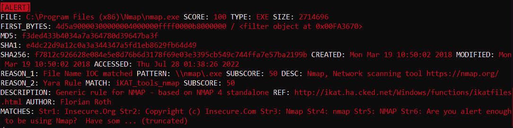

# 第十七章：利用威胁情报

事件响应的一个重要领域，对组织应对网络攻击能力产生了显著影响的是使用网络威胁情报，或简而言之，威胁情报。**网络威胁情报**这一术语涵盖了广泛的信息、数据点和技术，使分析师能够识别网络中的攻击类型，作出适当响应，并为未来的攻击做好准备。为了能够有效利用这一能力，信息安全分析师应对各种术语、方法论和工具有扎实的基础，这些工具可以与威胁情报结合使用。如果分析师能够利用这些数据，他们将在采取主动安全措施时处于更有利的位置，并且在发生安全事件时，能够更高效地做出响应。

本章关于网络威胁情报的讨论将涵盖以下关键主题：

+   威胁情报概述

+   威胁情报来源

+   MITRE ATT&CK 框架

+   与 IOC 合作

+   威胁情报与事件响应

# 威胁情报概述

就像信息安全和事件响应中的一些术语一样，威胁情报有些模糊。政府和学术界等不同组织生产的信息和数据，通常被吹捧为威胁情报。各种商业提供商也有可用的信息，无论是通过免费的还是付费订阅，声称是威胁情报。这常常导致确定什么是威胁情报，什么只是简单的数据或信息时的困难。

确定威胁情报组成部分的一个良好起点是使用定义。以下是 Gartner 研究公司对威胁情报的定义：

“威胁情报是基于证据的知识，包含背景、机制、指标、影响以及可操作的建议，关于现有或新兴的威胁或危险，能够用于指导决策，以应对该威胁或危险。”

在检查此定义时，有几个关键要素需要具备，数据或信息才能被视为威胁情报：

+   **基于证据**：本章将探讨通过其他过程（如恶意软件分析）获得的证据如何产生威胁情报。任何情报产品要有用，必须首先通过适当的证据收集方法获得。通过这种方式，依赖这些情报的分析师可以确保其有效性。

+   **实用性**：为了使威胁情报对安全事件的结果或组织的安全态势产生积极影响，它必须具有某种实用性。情报必须在背景和数据方面提供清晰的信息，帮助分析师判断是否正在根据类似性质的其他事件来评估某个事件。

+   **可操作性**：将数据或信息与威胁情报区分开来的关键要素是行动。情报应该推动行动，无论是特定事件的顺序，还是特定事件聚焦领域，或是针对组织最可能面临的网络威胁实施特定的安全控制。

为了更好地理解这一点，假设一个场景，医疗机构的事故响应团队试图确定哪些类型的攻击最可能发生在其基础设施上。关于网络犯罪分子试图窃取数据的模糊数据并无帮助。这些数据集没有具体的上下文或信息，最终的结果是组织无法将这些信息付诸实践。

另一方面，假设事故响应团队利用第三方威胁情报提供商，并且该第三方详细说明了一个特定的犯罪团伙名称。该提供商还指出，这些团伙目前正通过电子邮件将 PDF 文件发送给医院员工。这些 PDF 文件包含了由 C2 服务器控制的远程访问木马，C2 服务器分布在欧洲。第三方还提供了恶意软件的 MD5 文件哈希值、C2 服务器的 IP 和域名地址，以及与 PDF 文件最相关的文件名。

拥有这些信息后，事故响应团队可以调整他们的安全控制措施，防止电子邮件中的 PDF 附件被打开。他们还可以利用工具搜索他们的基础设施，确定是否已经发生感染。最后，他们还可以配置事件管理解决方案，以便在网络中的任何主机试图与 C2 服务器通信时发出警报。

这两种情况之间的主要区别在于，后一种情况推动了组织内部的行动。在第一种情况下，信息模糊且无用，导致组织没有得到任何改善。在第二种情况下，团队可以执行特定的行动来预防不利情况，或为应对某种情况做好准备。

威胁情报是对网络威胁行为者复杂性和技术水平增加的回应。威胁情报的重点是以下威胁行为者群体：

+   **网络犯罪分子**：有组织且技术娴熟，网络犯罪分子对银行、零售和其他组织造成了多种金融犯罪。这些团伙的动机纯粹是雇佣性质，他们的目标是获取可以变现的数据。例如，针对零售商如好市多和塔吉特的攻击，涉及盗窃信用卡数据，目的是在暗网或其他黑市上出售这些数据。

+   **黑客行为主义**：像**匿名者**和**伊德利布烈士旅**这样的组织是黑客团体，他们攻击大型企业、政府，甚至宗教机构，以推动政治事业。渗透网络以获取机密数据进行公开或发动拒绝服务攻击，都是为了实现政治目标，而非金钱目的。

+   **网络间谍活动**：像美国、俄罗斯、中国、伊朗和朝鲜这样的国家，持续从事渗透网络和获取情报的间谍活动。Stuxnet 病毒是最著名的网络攻击之一，据称是由美国和以色列发起的。

理解威胁情报的另一个关键要素是**高级持续性威胁**（**APT**）的概念。APT 这一术语大约已有十年历史，用来描述那些能力和动机远超网络犯罪分子或网络破坏者的网络威胁行为者。APT 组织通常会有明确的目标，针对某些组织进行长期的攻击。正如 APT 一词所描述的，这些组织具有以下特征：

+   **高级**：APT 威胁行为者拥有高级技能。这些技能通常涉及超出开放资源方法所能获取的情报收集能力。包括**影像情报**（**IMINT**），它包括通过像 Google Earth 这样的站点获取的图片；**信号情报**（**SIGINT**），即通过窃取使用电话基础设施、移动数据或无线电信号的语音和数据通信来收集的情报；最后，APT 组织可以利用**人类情报**（**HUMINT**），即通过与人类信息源互动来获取情报。此外，这些组织不仅能使用先进的网络渗透工具，还擅长发现零日漏洞，并开发专门针对这些漏洞的定制恶意软件和漏洞利用工具。

+   **持续性**：APT 威胁行为者专注于一个明确的目标，并且通常会放弃其他机会以便更接近实现目标。APT 威胁行为者往往会花费数月甚至数年时间，通过智能化利用漏洞，持续进行攻击，避免被检测机制发现。APT 威胁行为者与其他威胁行为者的一个关键区别在于他们的意图是长时间保持在目标网络内。虽然网络犯罪团伙可能会停留足够长的时间以下载一整个包含信用卡信息的数据库，但 APT 团伙会尽可能长时间地保持对网络的访问权限。

+   **威胁**：对于面临 APT（高级持续性威胁）组织的企业来说，它们无疑是一种威胁。APT 威胁行为者进行攻击时通常有明确的目标，并具备所需的基础设施和技能，能够攻击像大型企业、军队和政府组织这样的目标。

威胁情报是一个广泛的研究领域，涵盖了许多互相关联的元素。最终，威胁情报应该推动组织采取行动。这种行动通常是在对威胁情报进行仔细评估后决定的。评估过程中包括理解正在审查的威胁情报类型，以及这些类型为组织提供的每种优势。

## 威胁情报类型

在讨论构成威胁情报的各种信息类型和数据集时，它们通常会归入以下三大类之一：

+   **战术威胁情报**：这是三种威胁情报类别中最细粒度的一种。此类别中的信息涉及**妥协指示符**（**IOCs**）、**攻击指示符**（**IOAs**）或**战术、技术和程序**（**TTPs**）：

    +   **IOCs**：IOC 是系统上观察到的工件，表明系统遭受了某种形式的妥协。例如，C2（命令与控制）IP 地址或恶意文件的 MD5 哈希值都是 IOCs。

    +   **IOAs**：IOA 是系统上观察到的一种工件，表明存在攻击或攻击尝试。它与 IOC 有所不同，因为 IOA 并不表示系统已被攻破，而是表明系统受到了攻击，这是由于攻击者在攻击系统时留下的指示。例如，防火墙日志中可能留下的连接尝试，表明使用 Nmap 或其他网络扫描工具进行了自动端口扫描。

    +   **TTPs**：人类是习惯的动物，因此，网络攻击者通常会开发出独特的攻击网络方法。例如，一个网络犯罪团伙可能偏好发送一封带有 Excel 电子表格的社交工程邮件，该电子表格会执行远程访问木马。从那里，他们可能会尝试访问信用卡**销售点**（**POS**）设备，并将另一种恶意软件感染到其中。该团伙执行这种攻击的方式就是他们的 TTPs。

+   **操作性威胁情报**：过去十年，越来越多的协调性攻击不仅仅针对单个组织，而是可能针对整个行业、地区或国家。操作性威胁情报是关于网络攻击和网络威胁行为者的更广泛目标的数据和信息。这通常不仅仅涉及分析事件响应团队所在组织，还需要分析网络威胁行为者是如何攻击更大的行业。例如，在之前的例子中，医疗机构的事件响应人员准备应对一场攻击，了解类似规模和人员配置的医疗机构遭遇的攻击类型将有助于他们调整自己的安全控制措施以应对普遍存在的威胁。

+   **战略威胁情报**：高级领导层如 CIO 或 CISO 通常必须关注组织的战略目标，并采取必要的控制措施，以确保组织能够应对网络威胁形势。战略威胁情报分析网络攻击趋势、当前流行的网络威胁行为者以及主要目标行业。其他关键数据点包括威胁行为者或团体在攻击中可能利用的技术变化。

威胁情报的最佳利用方式是理解这些类型的情报如何整合到整体战略中。利用所有三种类型的内部和外部威胁情报，能帮助决策者了解威胁形势，帮助管理者实施适当的安全控制和程序，帮助分析员识别正在发生的安全问题或准备应对网络攻击。

## 痛苦金字塔

用于描述对手可能利用的各种类型的 IOC（入侵指示器）和 IOA（入侵行动指示器）以及他们在攻击过程中修改这些指示器的能力的有用模型是痛苦金字塔。这个模型由 David Bianco 开发，描述了防御者通过观察攻击者的行为以及攻击者修改这些指示器的能力之间的关系。下图展示了各种指示器与修改它们以绕过安全控制所需工作量之间的关系：


图 17.1 – 痛苦金字塔

例如，攻击者可能设计了一种恶意软件，通过 Windows SMB 协议进行横向传播。为了绕过传统的基于签名的恶意软件防护工具，攻击者使用了一种变种病毒，每次安装时其哈希值都会发生变化。这种变化使得恶意软件能够绕过该防护措施。其他指示器，如网络或主机遗留物，对于攻击者来说更难以更改，因此响应人员通过在金字塔的顶部层次对齐安全控制，可以更大程度上成功阻止攻击。

从威胁情报的角度来看，“痛苦金字塔”允许响应人员将威胁情报需求与长期战略中有用的信息对齐。了解威胁行为者使用的 TTP（战术、技术和程序）的详细信息和情报，将提供更多关于威胁行为者操作方式的见解。较低级别的指示器，如 C2 服务器的 IP 地址，虽然有用，但响应人员需要明白，这些可以被对手轻易更改。

## 威胁情报方法论

威胁情报经历一个反馈周期，以跟上不断变化的环境。虽然有多种方法可以为这个挑战提供上下文，但美国国防部使用的情报周期是一个常用的模型。这个周期为组织提供了一个框架和起点，使其能够将威胁情报融入到运营中：


图 17.2 – 情报周期

各个阶段的解释如下：

+   **方向**：决策者，如 CISO（首席信息安全官）、信息安全人员或事件响应分析师，设定所需的威胁情报。在确定情报需求时，最好识别每种威胁情报类型的使用者。例如，CISO 可能想要了解预计明年对医院的网络攻击趋势。事件响应分析师可能需要知道其他医疗机构中正在看到哪些恶意软件的 IOC（指标）。组织也可以从查看正在使用的关键系统和应用程序入手，以及它们试图保护的关键数据。另一个好的起点是，如果组织已经掌握了一些关于可能面临的网络威胁的信息。

+   **收集**：在收集阶段，组织从其来源获取数据和信息。在网络威胁情报方面，这可以来自政府组织，如政府支持的 CERT，或通过出售经过筛选和分析的威胁情报的商业组织。最后，组织还可以利用大量的**开源情报**（**OSINT**）源。例如，像 VirusTotal 和 Malware Bazaar 这样的恶意软件网站会向更大的网络安全和响应社区提供 IOCs 和完整示例。还有像 AlienVault 这样的供应商提供可以搜索 IOC 的完整平台。商业实体也会向社区提供一些威胁情报。OSINT 对于刚起步且需要展示威胁情报价值的组织来说，非常有价值，而不会让其破产。此外，OSINT 还可以作为组织整体情报收集的重要组成部分。

+   **处理**：组织可能获得的情报量庞大。在处理阶段，组织将原始数据进行评估，确定数据的相关性和可靠性，然后将其整理好，进入下一步。

+   **分析**：在分析阶段，组织评估已处理的数据，并将其与其他来源的数据结合。从这里开始，数据被解读，最终的产品可以被视为精心整理或正确评估的威胁情报。

+   **传播**：新整理的威胁情报随后会发送给组织内的各个用户使用。

这一方法论的循环特性确保反馈成为过程的一部分。参与收集和处理的分析师应确保他们能够获得有关传播情报的相关性和真实性的反馈。从这里开始，他们可以随着时间的推移调整情报产品。这确保了最终用户消耗的情报在相关性和准确性上的最高水平。

现在我们已经涵盖了威胁情报的基础元素，让我们来看看如何获取这些数据。

# 获取威胁情报

一个组织可以利用三种主要的威胁情报来源。威胁情报可以通过组织内部流程生成，通过开源方法获取，或者最终通过第三方威胁情报供应商获得。每个组织可以利用自己的内部流程来确定其需求和需要利用的来源。

## 内部开发的来源

最复杂的威胁情报来源是组织内部开发的情报。这是由于获取恶意软件活动中的各个 IOC（指标）和威胁行为者的 TTP 所需的基础设施。为了获得 IOC，组织可以利用蜜罐或其他故意存在漏洞的系统来获取独特的恶意软件样本。他们还需要具备评估可疑恶意软件并进行逆向工程的专业知识和系统。之后，他们就能够提取个别的 IOC，进而加以利用。

其他系统，如 SIEM 平台，可以用来跟踪攻击者在尝试渗透网络时的 TTP（战术、技术和程序）。从这里，**安全运营中心**（**SOC**）分析员可以记录不同攻击者如何进行渗透尝试。通过这些信息，组织可以建立特定团体的画像。这有助于将安全控制措施与网络入侵的预防或检测更好地对齐。

在内部开发威胁情报需要具备恶意软件分析、网络和主机取证等领域的专业知识。此外，所需的基础设施通常是昂贵的。因此，组织通常被迫依赖第三方供应商或其他组织公开分享的信息。

## 商业采购

内部获取的替代方案是与威胁情报供应商签订合同。这些组织利用他们的人员和基础设施来获取恶意软件、分析攻击并对各种威胁团体进行研究。商业威胁情报提供商通常会处理威胁情报，以便针对单个客户组织量身定制。

通常，商业供应商会为多种客户提供 SIEM 和 SOC 服务，利用一个通用的 SIEM 平台。在这里，他们可以汇总来自全球各个企业的恶意软件样本和攻击数据。这使他们能够为客户提供全面的产品。这是使用商业服务的一个显著优势，除此之外，还能通过将费用转移给第三方来节省成本。

## 开源情报

已经成为各种规模组织非常流行的一个信息来源区域是 OSINT 提供者。社区团体甚至商业企业向更广大的网络社区免费提供威胁情报。像 SANS 和 US-CERT 这样的团体提供有关威胁和漏洞的具体信息。商业提供者如 AlienVault 提供了一个**开放威胁交换**（**OTX**），允许用户社区分享威胁情报，如 IOC 和 TTP。其他商业组织提供 APT 组或信息安全行业新兴趋势的白皮书和报告。根据组织的不同，OSINT 通常非常有用，并提供了一个低成本的替代商业服务的选择。

开源情报（OSINT）的广泛应用导致各种组织创建了方法来跨组织共享威胁情报。根据信息源，组织获取威胁情报的实际方式取决于其配置方式。

虽然并非完全详尽的列表，但以下是一些可用的网络威胁 OSINT 格式：

+   **OpenIOC**：OpenIOC 最初是为了 Mandiant 产品可以摄取威胁情报并利用它在分析系统上搜索妥协证据而开发的。它已经发展成为描述技术 IOC 的 XML 架构，供事件响应人员在确定系统是否受到侵害时使用。

+   **STIX**：**结构化威胁信息表达**（**STIX**）是 OASIS 联盟的产品。这种机器可读格式允许组织在各种商业和免费软件威胁情报聚合平台之间共享威胁情报。

+   **TAXII**：**可信自动化情报信息交换**（**TAXII**）是一种应用层协议，通过 HTTPS 共享威胁情报。TAXII 定义了一个 API，可用于以 STIX 格式分享威胁情报。

+   **VERIS**：**事件记录和事件分享词汇**（**VERIS**）是一种用于标准化网络安全事件语言的综合架构。VERIS 试图解决的一个主要问题是缺乏标准的安全事件文档化方式。VERIS 提供了一种结构，使组织能够定义分类可能发生的各种攻击方式。VERIS 架构还作为组织提供的数据收集点，这些数据被纳入到 Verizon 数据泄露研究中。

随着各种情报来源的出现，一个面临的挑战是组织聚合、组织和利用威胁情报的能力。在下一节中，威胁情报平台的讨论将提供解决这些问题的见解。

# MITRE ATT&CK 框架

回顾上一节的“痛苦金字塔”讨论，我们可以看到在最顶部的是对手使用的 TTP（战术、技术和程序）。修改这些内容需要对手额外的资源和时间。从威胁情报和缓解的角度聚焦于 TTP 也能为防御者提供更好的保护，因为检测不依赖于可以轻易修改的指示符（如域名或 IP 地址）。

MITRE 公司创建了**对抗战术、技术与常识**（**ATT&CK**）知识库，网址为[`attack.mitre.org/`](https://attack.mitre.org/)。该知识库整合了对手的手艺、战术、技术和行为，涵盖了网络攻击的各个阶段。该项目于 2013 年 9 月启动，到写作时，已经更新到了第九个版本。

ATT&CK 知识库最初专注于 Windows 操作系统，但在其发展过程中，也加入了针对 macOS 和 Linux 的恶意活动。MITRE 还将一些前期攻击技术（如资源开发和侦察）纳入了知识库。最后，MITRE 最近也将对手用于攻陷移动设备的战术和技术纳入了知识库。

该行为模型有三个核心组成部分。第一个组成部分是**战术**。这十四个单独的战术代表了对手在攻击序列中的目标。例如，我们来看 MITRE 定义的**持久性**战术，见以下截图：


图 17.3 – MITRE ATT&CK 持久性

MITRE 将“持久性”定义为对手试图保持其立足点。这一定义进一步扩展为下一个组成部分：技术。技术是对手为了实现整体战术目标而使用的手段和方法。例如，对手可以利用**启动或登录脚本**来维持持久性，正如 MITRE ATT&CK 技术**T1037**在以下截图中所示：


图 17.4 – MITRE ATT&CK 技术 T1037

技术描述不仅提供了定义，还包括其他关键资源。例如，**数据源**字段展示了事件响应者和数字取证分析员可能的证据来源，用以确认该技术的使用情况。**常见攻击模式枚举与分类标识**（**CAPEC**）ID 将 MITRE ATT&CK 框架与**MITRE CAPEC**进行了交叉引用。CAPEC，网址为[`capec.mitre.org/`](https://capec.mitre.org/)，提供了对手攻击模式的详细信息。

MITRE ATT&CK 框架中的许多技术也包含子技术。这些子技术提供了对对手在执行技术时使用的各种方法和工具的更细致的观察。例如，如果我们进一步深入，我们会看到条目**ID T1037.001**，如下图所示：


图 17.5 – MITRE ATT&CK T1307.001 程序示例

这为威胁行为者使用的战术和技术提供了现实世界的背景。例如，在这种情况下，我们看到威胁群体`HKCU\Environment\UserInitMprLogonScript`注册表键用于在系统中保持持久性。

除了战术和技术，MITRE ATT&CK 框架还充当了恶意工具和威胁行为者群体的汇总。例如，我们确定了 APT28 使用特定的工具来保持持久性，但我们可能甚至不知道 APT28 是谁或是什么。通过技术部分中的链接，我们看到 MITRE ATT&CK 框架包含了对威胁行为者的概述、其起源、别名，以及它执行的高调攻击回顾。


图 17.6 – APT28 概况

在讨论别名时，将战术和技术与群体联系起来有几个挑战。首先，群体可能会在一次行动后出现然后消失。个人可能会变化。最后，像 FireEye 和 RecordedFuture 这样的威胁情报研究人员有他们自己的命名法来描述群体。如我们在前面的例子中所见，APT28 也可能与其他群体有关联。MITRE 提供了更详细的群体及其相关命名的细分。


图 17.7 – APT28 相关群体描述

深入档案，我们可以看到该群体在执行攻击时使用的战术和技术列表。


图 17.8 – APT28 使用的技术

除了 APT28 被证明使用的战术和技术，MITRE 还包括了特定的工具，如利用框架、恶意软件和漏洞利用工具，例如使用凭证收集工具，如下图所示：


图 17.9 – Mimikatz 工具使用

你可能已经推测到，我们可以通过 Mimikatz 条目来更好地理解该工具本身。如果你有这个想法，你是正确的。点击**Mimikatz**会展示该工具的概述。


图 17.10 – Mimikatz 工具概况

除了提供一个易于搜索的界面，使威胁情报专业人员能够交叉引用工具、技术和战术外，该框架还被仔细注释。包含的信息源材料可以通过超链接轻松搜索和访问，这样在分析需要回顾源材料时，可以节省时间和资源。

ATT&CK 框架还包括一个**导航器**，可以轻松查看其中包含的各种战术、技术和工具。可以通过网址 [`mitre-attack.github.io/attack-navigator/v2/enterprise/`](https://mitre-attack.github.io/attack-navigator/v2/enterprise/) 访问该导航器。该网站在顶部行列出战术，在列中列出相应的技术，如以下截图所示：


图 17.11 – ATT&CK Navigator

导航器还具有多个控制项，允许用户与该工具进行互动。在这种情况下，*图 17.12*展示了可用的各种控制项：


图 17.12 – ATT&CK Navigator 控制

例如，我们将使用多选功能突出显示 APT28 组使用的技术。首先，点击选择控制下的带有加号的汉堡图标，如*图 17.13*所示。这将显示以下菜单：


图 17.13 – ATT&CK Navigator 多选功能

下拉菜单包含 ATT&CK 框架中包含的威胁组和软件的情报。向下滚动威胁组至**APT**，然后点击**选择**。这将为与该组相关的技术添加边框。接下来，点击层控制下的颜色调色板：


图 17.14 – ATT&CK Navigator 调色板控制

调色板允许您更改各种技术的背景颜色。在这种情况下，我们只检查一个层，因此在`0`到`1`之间突出显示 APT28 技术为红色。

下一步是设置评分，以显示 APT28 的技术。通过点击**技术控制**下的条形图图标访问评分菜单：


图 17.15 – ATT&CK Navigator 技术控制评分

在**评分**下输入数字 `1`，然后点击*Enter*。这将高亮显示红色技术。此时，您可以通过右键点击特定技术并点击**查看技术**来探索导航器。这将带您到特定技术的页面，如我们之前所见。

我们现在要查看的最后一个功能是能够下载与 APT28 相关的技术。在图层控制下，你可以通过向下箭头图标下载 JSON 文件，通过图表图标下载 **逗号分隔值**（**CSV**）文档，最后，通过相机图标下载图片。


图 17.16 – ATT&CK Navigator 捕获选项

点击相机图标会在 Navigator 中打开第二个标签页。在最右侧，可以下载该图像的副本。


图 17.17 – ATT&CK Navigator APT28 战术与技术

ATT&CK 框架是一个极好的资源，可以深入了解威胁行为者使用的战术、技术和工具。自其诞生以来，这一框架已经与组织的威胁情报和事件响应报告紧密结合，迅速成为组织定义其观察结果的标准。

# 处理 IOCs 和 IOAs

许多组织在开始利用威胁情报的过程中常犯的一个常见错误是，仅仅订阅一些商业或开源数据源并启用它们。这种做法会导致企业迅速被大量数据淹没。大多数数据对组织来说是无法使用的。现实情况是，分析师和其他相关人员应当通过制定哪些数据对其组织相关来筛选数据，并使用能够提供最佳相关数据的来源。

在这种情况下，我们将重点关注 OSINT 来源。有几家商业公司，如 CrowdStrike 和 AlienVault，提供 IOC 和 IOA 给社区。其他网站则专注于为网络安全社区提供服务，而没有商业组件。以下是分析师可以利用的一些资源：

+   **AlienVault 开放威胁交换平台**（**OTX**）：该网站可通过 [`otx.alienvault.com/`](https://otx.alienvault.com/) 访问，聚合了来自商业企业（如 Cisco Talos 和 Palo Alto Unit 42）以及全球独立研究人员的指标和威胁情报报告。这些情报被汇总后，用户可以根据关键词、IOC，甚至特定威胁行为者进行搜索。

+   **VirusTotal**：IOC 的关键来源之一是 VirusTotal。该网站，[`www.virustotal.com/`](https://www.virustotal.com/)，以及相关数据由 Google 拥有和运营，毫无疑问，当涉及到恶意软件情报时，它是分析师和响应者首选的地方。

+   **Hybrid Analysis**：Hybrid Analysis，网址为[`www.hybrid-analysis.com/`](https://www.hybrid-analysis.com/)，由 CrowdStrike 运营。防病毒和 EDR 提供商的一个独特特点是，由于它们在各类组织中的广泛存在，它们通常拥有大量的恶意软件 IOC。Hybrid Analysis 结合了恶意软件沙箱和 IOC 数据库，允许用户同时分析样本并搜索现有样本。

+   `abuse.ch` 提供与僵尸网络和恶意软件相关的 IOC 的子域集合。

这四个站点只是提供 IOC 资源的冰山一角，但它们为制定有针对性的收集计划提供了坚实的基础。这四个站点都提供社区账户，具有最基本的功能，但这些功能仍然非常有用。它们还包括对关键词、IP 地址和文件哈希值的搜索。另一个分析人员关注的功能是 API，它允许通过脚本或其他编程方式查询数据库。我们将在本章后面看看如何利用这一功能。

要访问这些站点，分析人员只需要提供一个电子邮件地址和密码。一种减轻压力的技巧是创建一个仅用于威胁情报站点的专用电子邮件地址。许多这些站点会发送通知，有时每天会有数十条警报。使用一个专门用于访问这些站点并汇总警报的电子邮件帐户，可以避免不断清理主电子邮件帐户。

超棒的威胁情报来源

有一些网站专门聚合了专门提供 IOC 和 IOA（指示器和攻击行为）的站点，供更广泛的社区使用。也有像[`github.com/hslatman/awesome-threat-intelligence`](https://github.com/hslatman/awesome-threat-intelligence)这样的 GitHub 仓库，可以用来制作收集源。同样，使用时需要小心，不要尝试收集过多的数据。

现在我们已经概述了一些来源，让我们看一个示例工作流，在该工作流中，IOC 从威胁情报站点获取并投入实际使用。在这个例子中，一位分析人员希望获取与 HAFNIUM 相关的威胁情报，并通过日志或其他证据搜索其系统是否已被攻击。

在这个例子中，我们将利用 AlienVault OTX。搜索关键字`HAFNIUM`会显示多个结果。在这种情况下，我们将查看以下链接：[`otx.alienvault.com/pulse/6127557db7ec02a119d8c23d`](https://otx.alienvault.com/pulse/6127557db7ec02a119d8c23d)。

导航到该 URL 将显示以下截图中的参考资料：


图 17.18 – HAFNIUM 情报来源

下面是列出的 IOC 参考：


图 17.19 – HAFNIUM IOCs

要使用这些 IOCs，我们需要先下载它们。在页面的右上角有一个 **下载** 按钮。此按钮允许用户以多种格式下载文件，例如 STIX、OpenCTI 和 CSV 文件。在此，下载一个 CSV 文件。


图 17.20 – IOC 下载

下载完成后，访问网站 [`cti.uncoder.io/`](https://cti.uncoder.io/)。该网站由 SOC Prime 提供给社区，能够将下载中的 IOCs 转换为 SPLUNK 查询。在此，点击 **上传 IOCs** 并导航到已下载的 AlienVault CSV 文件：


图 17.21 – CTI Uncoder 上传

现在 IOCs 已经下载完成，我们可以使用 Uncoder CTI 构建一个 SPLUNK 查询来搜索与 HAFNIUM 相关的任何匹配域名。在此，点击 **根据 IOC 类型生成查询**，选择 **域名**。在 **查询平台** 中，选择 **SPLUNK**。其余设置可以保持默认。点击 **生成**，将生成以下 SPLUNK 查询：

```
(dest_host="api.onedvirer.xyz" OR dest_host="rawfuns.com" OR dest_host="yolkish.com" OR dest_host="back.rooter.tk" OR dest_host="lab.symantecsafe.org" OR dest_host="mm.portomnail.com" OR dest_host="ns.rtechs.org" OR dest_host="p.estonine.com" OR dest_host="soft.mssysinfo.xyz" OR dest_host="www.averyspace.net" OR dest_host="www.komdsecko.net")
```

然后可以针对分析员的数据集运行此查询，以查找任何匹配的结果。

这是一个简单的工作流程，但展示了社区或 OSINT 来源提供的原始 IOCs 或 IOAs 如何用于查询和其他调查任务。在此基础上，我们将探讨如何具体利用 IOCs 进行事件响应和数字取证工作，作为调查的一部分。

# 威胁情报与事件响应

在调查过程中，CSIRT 或分析员可能会遇到事故调查似乎陷入停滞的情况。这可能是因为分析员知道某些地方出问题了，或者有妥协的指示符，但没有具体的证据指向某个特定方向。分析员可以利用威胁情报来增强发现之前未被发现的证据的能力。

## Autopsy

许多现有的取证工具可以吸收威胁情报来帮助事件响应分析员。例如，磁盘取证平台（在 *第十一章*中讨论）可以从威胁情报源中吸收哈希值来搜索 IOCs。除了商业磁盘取证工具外，Autopsy 平台还可以针对哈希集进行搜索。例如，我们可以导入在上一节中分析的 HAFNIUM Pulse 的 MD5 哈希值。在这种情况下，我们将从下载的 CSV 文件中提取 MD5 哈希值，如下图所示，并将其输入到 Autopsy 中。


图 17.22 – IOC CSV 文件

从这里，哈希值可以加载到 Autopsy 中：

1.  首先，打开 Autopsy，然后从首页点击 **工具**，再点击 **选项**。找到 **哈希集** 图标并点击它：


图 17.23 – Autopsy 哈希集上传

1.  点击**新建哈希集**，将出现以下窗口：


图 17.24 – 创建哈希集

1.  为哈希集数据库输入一个名称。在这种情况下，`HAFNIUM`是一个很好的选择，因为这些哈希文件与利用该漏洞的攻击相关。点击**另存为**，将打开资源管理器窗口。这是为将要创建的数据库提供位置。可以保留默认位置。点击**确定**。

1.  在下一个窗口中，点击**将哈希添加到数据库**。将出现一个窗口，允许输入哈希值。从 HAFNIUM 情报报告中复制 MD5 哈希值并粘贴到该窗口中：


图 17.25 – 哈希值

1.  点击**确定**，在哈希值成功添加后，应该会出现以下窗口。点击**确定**：


图 17.26 – 哈希集上传

1.  在最后一个屏幕上，点击**应用**，然后点击**确定**。此时，哈希值已加载到数据库中。

这个功能允许分析师在磁盘镜像中搜索匹配的哈希值。这比通过其他方法寻找文件更为高效。Autopsy 还允许根据事件使用不同的数据库。不断更新的信息输入功能使分析师能够找到那些一两周前发生的事件中新型攻击的证据，而如果使用传统的搜索方法，这些证据可能会被忽视。

## Maltego

一个有用的工具，用于搜索与 IOC（指标对象）相关的各种情报来源，是 Maltego。该工具利用转换将平台连接到第三方来源，如 VirusTotal。这使得分析师能够搜索各种来源，以获取关于指示器（如文件哈希、IP 地址或域名）的额外上下文。Maltego 有多个定价层级，但开发 Maltego 的公司 Paterva 提供了一个社区版，您可以在[`www.maltego.com/downloads/`](https://www.maltego.com/downloads/)下载。

下载后，您需要提供电子邮件地址和密码以配置帐户。安装并登录后，以下屏幕将出现：


图 17.27 – Maltego 图形用户界面

图形用户界面的右侧是转换中心（Transform Hub）。在这里，用户可以下载并配置用于从各种来源提取数据的具体工具。在本例中，我们选择**VirusTotal (公共 API)**转换。值得注意的是，社区版具有有限的转换功能。这对于测试和一些有限的研究是足够的，但如果你需要更多信息，考虑购买许可证版本。将光标悬停在 VirusTotal 转换上会弹出以下窗口：


图 17.28 – VirusTotal 变换

会弹出一个对话框，点击**是**来安装变换。接下来会出现以下窗口：


图 17.29 – VirusTotal 变换 API

VirusTotal 变换需要一个来自 VirusTotal 的 API 密钥。可以通过在 VirusTotal 创建帐户来获得该 API 密钥。该 API 密钥是免费的，允许 Maltego 运行来自 VirusTotal 的查询。一旦输入 API 密钥，点击**确定**。你可以为任何其他变换重复这个过程。例如，AlienVault OTX 也有一个在进行事件调查时很有用的变换。

现在我们已经安装了一些变换，可以开始使用 Maltego 了。点击左上角的圆形图标，点击**新建**。这将打开一个新的图，如下图所示：


图 17.30 – Maltego 新图

在图形用户界面的左侧是**实体调色板**。这些是 Maltego 可以为用户搜索和绘制的特定类型的 IOC。在这种情况下，我们将查看一个简单的 IP 地址 138.68.79.195，以确定它与其他任何指标之间的关系。点击**Ipv4 地址**在**实体调色板**中，然后将其拖动到中间屏幕，再剪切并粘贴 IP 地址。右键单击该实体，**运行变换**窗口将会打开：


图 17.31 – 运行变换

对于这个例子，我们将运行 AlienVault OTX 变换。点击右箭头。该变换将查询 AlienVault OTX，获取与 IP 地址相关的任何实体或 IOC：


图 17.32 – IP 地址图

在这种情况下，变换找到了几个与恶意软件相关的域名注册、IP 地址、URL 和文件哈希。对于哈希，也可以重复相同的过程。在这里，VirusTotal 变换在恶意软件实体上运行，显示该 IP 地址与后利用工具 Cobalt Strike 相关：


图 17.33 – VirusTotal 哈希返回

Maltego 是一个有用的工具，用于揭示 IOC 和更大规模对手基础设施之间的关系。正如我们所看到的，简单的 IP 地址（可能在防火墙日志审查中发现）可以通过利用 OSINT 来源，转化为对手的个人资料、基础设施和工具。除了在揭示 IOC 之间的联系时有用，OSINT 还可以用来检测隐藏的恶意软件或其他漏洞，使用上一章讨论过的 YARA 规则。

## YARA 和 Loki

在上一章关于恶意软件的内容中，我们探讨了模式匹配工具 YARA，并介绍了如何创建规则。在本示例中，我们将通过一个扫描器应用一系列广泛的 YARA 规则，扫描器将尝试识别与这些规则匹配的文件或可执行文件。

一款用于扫描系统并利用 YARA 规则的好工具是 Loki，它是一个简单的 IOC 扫描器，位于 [`github.com/Neo23x0/Loki`](https://github.com/Neo23x0/Loki)。这个轻量级的平台允许事件响应分析师扫描文件夹、文件，甚至整个卷，查找 IOCs，比如 YARA 规则、已知的恶意文件哈希、文件名 IOCs 以及已知的 C2 服务器。Loki 开箱即用，拥有一个定期更新的广泛 IOC 库。要开始使用 Loki，按照以下步骤进行：

1.  要检查系统卷中的特定 IOCs，请将 Loki 下载并解压到 USB 设备或本地系统中。打开 `loki` 文件夹后，您会找到以下文件：


图 17.34 – Loki 文件

1.  Loki 必须更新为最新的 IOCs，因此，右键单击 **loki-upgrader** 并以管理员身份运行。升级程序将运行，更新可执行文件和签名文件。完成后，更新器将关闭。

1.  返回到 Loki 文件，您会看到一个名为 `signature-base` 的新文件已被添加：


图 17.35 – 签名基础文件

该文件夹包含所有 Loki 可用于在卷上进行搜索的 IOCs。这也允许创建自己 YARA 规则的分析师将其加载到文件中，从而使他们能够定制解决方案。

1.  要扫描系统，右键单击 `loki.exe` 应用程序并以管理员身份运行。这将启动可执行文件并打开以下窗口：


图 17.36 – Loki 扫描

1.  在规则集更新后，Loki 将开始在卷中搜索任何匹配的模式或 IOC：


图 17.37 – Loki 扫描输出

1.  任何匹配的规则将以红色显示。在这种情况下，Loki 命中了工具 Nmap，它通常用于扫描内部网络，既用于合法用途，也用于恶意目的：



图 17.38 – Loki 扫描命中

在此，分析师可以注意到任何命中，并在后续进行检查。另一个关键特性是 Loki 可以部署在多个系统上，作为对可能被新型恶意软件感染的系统进行初步筛查的一部分。例如，事件响应分析师可能能够使用来自威胁情报提供商（如 ReversingLabs）的 YARA 规则，搜索 Petya 勒索病毒攻击的 IOC，其中包括从 GitHub 下载的 YARA 规则：[`github.com/reversinglabs/reversinglabs-yara-rules`](https://github.com/reversinglabs/reversinglabs-yara-rules)。

从这里，YARA 规则可以输入 Loki 或其他平台，并用于筛查可疑系统。

事件响应分析师可以使用的工具数量每天都在增加。这些工具包括商业工具和集成各种威胁情报流和功能的免费工具。通过这些工具，可以主动检测、警报并调查正在进行中的事件。CSIRT（计算机安全事件响应小组）应当努力审查这些工具，并将它们整合到他们的流程中。这样做将帮助他们更高效地检测和调查事件。

# 总结

孙子兵法中的战略概念包括“知己知彼，百战不殆”。通过这一点，你可以对自己在竞争中获胜的能力充满信心。威胁情报迅速成为组织主动安全控制的关键组成部分，同时也是组织应对事件的一个重要因素。本章探讨了网络威胁情报的最新技术和方法论，以及将这些数据付诸实践的来源、技术和方法。

为了前进，寻求利用威胁情报优势的组织，首先必须了解威胁。然后，他们可以定义自己的需求，并开始情报处理过程。最后，通过整合工具集来利用威胁情报，他们可以为自己提供更有效的主动控制能力以及高效响应的能力。虽然威胁情报可能无法完全消除对对手的恐惧，但它确实让组织拥有更多的“弹药”来应对今天的威胁。威胁情报在通过威胁狩猎主动识别环境中的威胁时也起到了重要作用，威胁狩猎是后面章节的主题。在深入讨论狩猎之前，我们将首先审视一种特定类型的威胁：勒索软件。

# 问题

1.  哪项不是情报的关键元素？

    1.  受感染指示（IOC）

    1.  工具

    1.  基于证据

    1.  可操作的

1.  以下哪项是网络击杀链的一部分？

    1.  网络钓鱼

    1.  武器化

    1.  恶意软件

    1.  IOC

1.  TTPs 描述了对手在网络攻击中的行动。

    1.  正确

    1.  错误

1.  以下哪项不是威胁情报类型？

    1.  操作

    1.  战略

    1.  防御

    1.  战术

# 进一步阅读

请参考以下内容，了解本章涵盖的更多详细信息：

+   *操作化威胁* *情报*：[`www.packtpub.com/product/operationalizing-threat-intelligence/9781801814683`](https://www.packtpub.com/product/operationalizing-threat-intelligence/9781801814683)

+   什么是威胁情报？定义和示例： [`www.recordedfuture.com/threat-intelligence-definition/Threats/Vulnerabilities`](https://www.recordedfuture.com/threat-intelligence-definition/Threats/Vulnerabilities)： [`www.sans.org/reading-room/whitepapers/threats/paper/38790`](https://www.sans.org/reading-room/whitepapers/threats/paper/38790)

+   Yara GitHub 仓库： [`github.com/VirusTotal/yara`](https://github.com/VirusTotal/yara)

+   Suricata： [`suricata-ids.org/`](https://suricata-ids.org/)

+   Zeek 网络安全监控器： [`www.zeek.org/`](https://www.zeek.org/)

+   Snort： [`www.snort.org/`](https://www.snort.org/)
