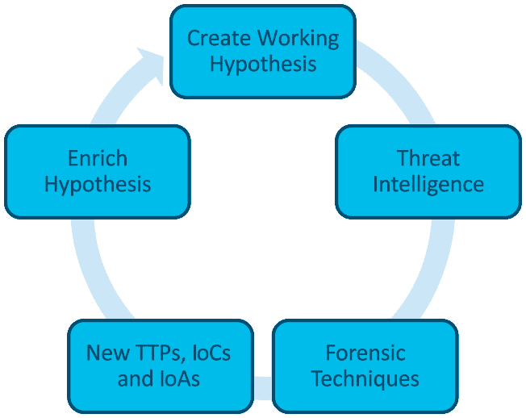
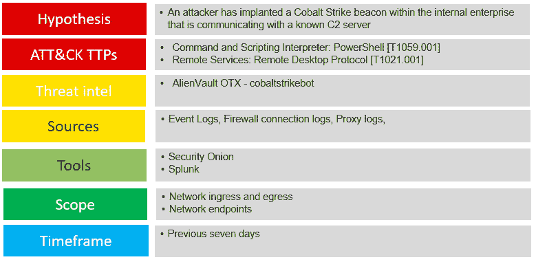
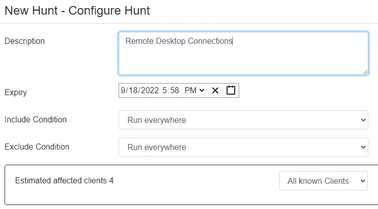
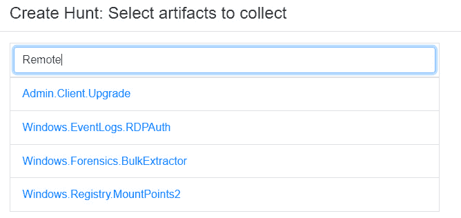
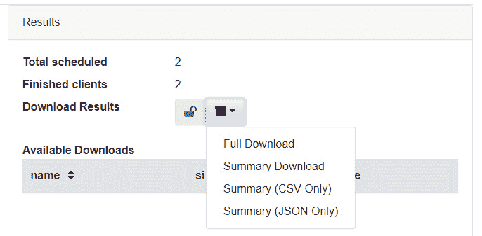
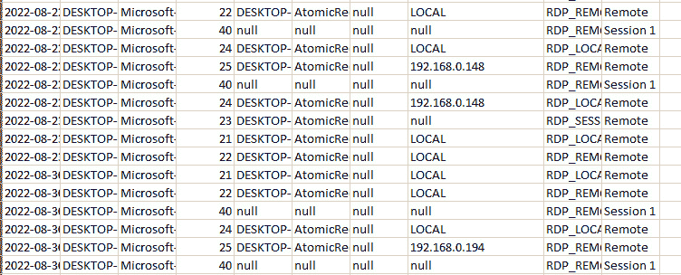

# 第十八章：威胁狩猎

Mandiant 发布的 APT1 报告为信息安全专业人员提供了对最为经验丰富和活跃的威胁团体之一的深入了解。对中国人民解放军 61398 部队的洞察也为这些复杂的威胁行为者提供了背景。**高级持续性威胁**（**APT**）一词也成为了信息安全领域的术语。信息安全和事件响应人员现在可以洞察到那些在很长一段时间内未被发现的威胁活动。

由于 APT（高级持续性威胁）带来的威胁，再加上即便是相对复杂的攻击团体在目标网络中潜伏的时间，组织已开始从被动检测与响应转向更为主动的方法，以识别网络中的潜在威胁。这一实践被称为威胁狩猎，是一种主动的过程，运用数字取证技术对系统和网络组件进行分析，以识别并隔离那些之前未被发现的威胁。与事件响应类似，威胁狩猎是由过程、技术和人员组成的，且不依赖于预先配置的警报或自动化工具，而是结合了事件响应、威胁情报和数字取证的各个元素。

本章将通过考察几个关键元素，概述威胁狩猎的实践：

+   威胁狩猎概述

+   构建假设

+   规划狩猎

+   用于威胁狩猎的数字取证技术

+   用于威胁狩猎的 EDR

# 威胁狩猎概述

威胁狩猎是一项发展中的学科，主要受到威胁情报的可用性以及可以用来在当今现代企业架构中进行大规模威胁狩猎的工具（如**端点检测与响应**（**EDR**）和 SIEM 平台）的推动。由此发展出的是具体的工作周期和成熟度模型，可以指导组织开始和执行威胁狩猎计划。

## 威胁狩猎周期

威胁狩猎，像事件响应一样，是一个以过程为驱动的实践。目前并没有明确的、被广泛接受的标准流程，但威胁狩猎有一个大致的顺序，这一顺序为执行提供了可遵循的流程。以下图示将威胁狩猎的各个阶段结合成一个流程，指导威胁猎手完成各项活动，从而促进准确和全面的狩猎：

图 18.1 – 威胁狩猎周期

### 启动事件

威胁狩猎始于一个启动事件。将威胁狩猎纳入操作流程的组织可能有一个过程或政策，要求在特定的节奏或时间进行威胁狩猎。例如，某组织可能有一个流程，要求安全运营团队每月进行四到五次威胁狩猎，每周的周一开始。这些单独的狩猎事件中的每一个都会被视为启动事件。

第二种类型的启动事件通常由来自内部或外部来源的某种威胁情报警报驱动。例如，组织可能会收到类似于以下截图所示的警报。这个警报来自美国联邦调查局，地址为[`www.aha.org/system/files/media/file/2021/05/fbi-tlp-white-report-conti-ransomware-attacks-impact-healthcare-and-first-responder-networks-5-20-21.pdf`](https://www.aha.org/system/files/media/file/2021/05/fbi-tlp-white-report-conti-ransomware-attacks-impact-healthcare-and-first-responder-networks-5-20-21.pdf)，指示与 Conti 变种勒索软件相关的新的**妥协指示器**（**IOCs**）。组织可能会决定根据这一情报采取行动，并开始在网络中寻找与警报中提供的 IOCs 相关的任何指示器：

图 18.2 – FBI 警报

在启动事件完全理解后，下一阶段是开始制定在威胁狩猎过程中要寻找的内容。

### 创建工作假设

从启动事件开始，威胁狩猎团队接着创建工作假设。威胁狩猎是一项集中的工作，这意味着狩猎团队不会只是随便查看事件日志或内存映像，寻找任何他们能找到的东西。一个工作假设——例如*一个 APT 组织已控制网络上的多个系统*——是一个通用的假设，并未提供具体的威胁狩猎目标。威胁狩猎者需要将注意力集中在关键指标上，无论这些指标是来自持续威胁组织，还是来自现有的威胁情报。

工作假设提供了关注的重点。一个更好的假设可能是：*一个 APT 风格的对手已控制了 DMZ 的 Web 服务器，并将其用作 C2 基础设施*。这为狩猎团队提供了一个具体的目标，团队可以应用数字取证技术来判断这个假设是否成立。

通过警报启动的威胁狩猎通常能够发现可以用来构建假设的关键关注领域。例如，前一节包含了来自 FBI 的警报。除了与 Conti 相关的 IOCs 外，警报中还包含了以下内容：

*具体的感染途径仍然未知，因为 Ryuk 会删除与用于部署恶意软件的下载器相关的所有文件。在某些情况下，Ryuk 是作为 TrickBot 和/或 Emotet 银行木马的后续部署，这些木马会使用 SMB 协议在网络中传播，并可被用来* *窃取凭证*。

从这些数据中，猎杀小组可以制定一个直接针对这些**战术、技术和程序**（**TTP**）的假设。这个假设可能是：*敌方已经感染了多个内部系统，并且正在使用微软 SMB 协议在内部网络中横向传播，目的是感染其他系统*。再次强调，这个假设具体且明确，能为威胁猎杀者提供一个具体的关注点，以便验证假设的正确性或错误性。

### 利用威胁情报

在前一章中，我们详细介绍了如何在事件处理中利用网络威胁情报。由于在威胁猎杀中我们正在应用各种事件响应和数字取证技术，网络威胁情报也在其中发挥着重要作用。与工作假设一样，威胁情报使猎杀小组能够进一步聚焦于通过回顾相关威胁情报所识别出的特定指示或 TTP。

一个关于假设与威胁情报结合的例子可以通过检查银行木马 Emotet 与支持其运行的基础设施之间的关系来提供。

首先，猎杀小组制定的假设是：*内部网络中的系统与 Emotet 投放或指挥控制基础设施之间有过通信*。有了这个假设，猎杀小组可以利用 OSINT 或商业数据源来增强他们的关注点。例如，以下网站已被确认为投放 Emotet 二进制文件的来源：

+   [`www.cityvisualization.com/wp-includes/88586`](https://www.cityvisualization.com/wp-includes/88586)

+   https://87creationsmedia.com/wp-includes/zz90f27

+   [`karencupp.com/vur1qw/s0li7q9`](http://karencupp.com/vur1qw/s0li7q9)

+   [`www.magnumbd.com/wp-includes/w2vn93`](http://www.magnumbd.com/wp-includes/w2vn93)

+   [`minmi96.xyz/wp-includes/l5vaemt6`](http://minmi96.xyz/wp-includes/l5vaemt6)

从这里开始，猎杀小组可以关注那些可能存在访问这些 URL 的流量迹象的系统。

### 应用取证技术

威胁猎杀周期中的下一个阶段是应用取证技术来测试假设。本书的大部分内容都致力于使用取证技术在各种位置寻找指示。在威胁猎杀中，猎杀小组将应用相同的技术来处理各种证据来源，以确定是否存在任何迹象。

例如，在前一节中，已确认五个与恶意软件 Emotet 相关的 URL 作为指标。威胁猎手可以利用多个证据源来确定这些指标是否存在。例如，代理日志的检查将显示内部系统是否连接到这些 URL 中的任何一个。DNS 日志也很有用，因为它们将显示内部网络上的系统是否尝试解析一个或多个 URL 来建立连接。最后，防火墙日志可能有助于确定是否已经向这些 URL 或相关 IP 地址发起了连接。

### 发现新的指标

在威胁狩猎过程中，可能会发现新的指标。搜索特定恶意软件系列的内存镜像会显示一个先前未知和未检测到的 IP 地址。以下是威胁狩猎中可能识别的前十个指标：

+   不寻常的出站网络流量

+   特权用户账户异常

+   地理异常

+   登录失败过多

+   数据库读取量过多

+   HTML 响应大小

+   文件请求过多

+   端口申请不匹配

+   可疑注册表或系统文件更改

+   DNS 请求异常

### 丰富现有假设

在威胁狩猎过程中，可能会发现新的指标，这可能会迫使修改现有的威胁狩猎假设。例如，在搜索 Emotet 感染指标时，威胁猎手发现 Windows 系统内部工具 PsExec 用于在内部网络中进行横向移动。因此，原始假设应相应更改以反映这一新技术，并将任何指标纳入持续的威胁狩猎中。

威胁猎手在发现新的指标时的另一种选择是开始新的威胁狩猎，利用新的指标作为启动事件。当识别到的指标或 TTP 明显超出原始威胁狩猎假设时，通常会采取这种行动。这也是在可能有多个团队可以利用的情况下的一种选择。最后，在发生数据丢失、凭证泄露或多系统感染的情况下，指标可能需要从威胁狩猎转向事件响应。在哪一点上修改现有假设、创建新假设或者在最糟糕的情况下宣布事件，是由狩猎团队来决定的。

## 威胁狩猎报告

*第十三章* 提供了需要的详细信息，使事件响应人员能够正确报告他们的活动和发现。威胁狩猎的报告同样至关重要，因为它为管理者和政策制定者提供了对狩猎团队所使用的工具、技术和流程的洞察，同时为额外工具的使用或修改现有流程提供了潜在的理由。以下是威胁狩猎报告的一些关键要素：

+   **执行摘要**：这一高层次的概述总结了采取的行动、发现的指标，以及猎杀是否证明或推翻了假设，为决策者提供了一个可以付诸行动的简短叙述。

+   **威胁猎杀计划**：该计划应包括威胁猎杀假设，并作为威胁猎杀报告的一部分。它为读者提供了猎杀团队在工作中所使用的各项详细信息。

+   **法医报告**：正如*第十三章*所探讨的，法医工具以及事件响应人员本身生成了大量的数据。威胁猎杀报告的这一部分是最为详尽的，因为每个系统或证据来源的详细检查应当被记录下来。此外，应提供一个全面的列表，列出所有在猎杀过程中被检查的证据项目。

+   **发现**：本节将指示猎杀团队是否能够证明或推翻在猎杀开始时设定的假设。如果假设得到了验证，应有文档记录后续的行动，如假设的修改、新假设的提出，或是否启动了事件响应能力。最后，所有在威胁猎杀过程中发现的 IOC、**攻击指标**（**IOA**）或 TTP 也应记录在案。

发现部分的另一个关键领域应指明现有的流程和技术如何支持进行详细的威胁猎杀。例如，如果威胁猎杀表明 Windows 事件日志在时间或数量上不足，应在报告中指出。此类洞察提供了为创建一个足够的网络和系统可见性环境以便进行详细威胁猎杀所投入的额外时间和资源的合理性依据。

威胁猎杀报告的另一个部分是专门用于非安全或与事件无关的发现。威胁猎杀常常发现易受攻击的系统、现有的配置错误或与事件无关的数据点。这些应作为威胁猎杀的一部分进行报告，以便进行修复。

+   **建议**：由于威胁狩猎过程往往会有发现，即便是那些否定假设且不包含任何安全发现的狩猎活动，仍然应该包括一些改进未来威胁狩猎、提高组织安全态势或改善系统配置的建议。还建议将这些建议分类。例如，战略性建议可能包括需要更多资源和时间来实施的长期配置或安全态势改善；战术性建议则可能包括短期内可以实现的简单改进，提升警报准确性，或优化威胁狩猎过程或系统设置。为了进一步分类建议，可以根据建议的紧迫性来进行优先级划分，那些旨在提升安全态势或防止高风险攻击的建议，应比单纯关注流程改进或配置变更的建议具有更高的优先级。

威胁狩猎报告包含大量数据，可以用来持续改进整体威胁狩猎过程。另一个需要考虑的方面是，可以向高级管理人员报告哪些关于威胁狩猎的指标。他们可能感兴趣的一些关键数据点包括：所用时长、已识别的未知指示器、已感染的系统、已识别的威胁，以及已包含的系统数量。拥有能够提供威胁狩猎能力指标的数据，表明该过程能够识别以前未发现的威胁，这将有助于确保这一过程成为组织日常安全操作的一部分，并得以持续进行。

## 威胁狩猎成熟度模型

网络安全专家 David Bianco（前一章节中提到的“痛苦金字塔”模型的开发者）在为网络安全公司 Sqrrl 工作时开发了威胁狩猎成熟度模型。理解这个成熟度模型与威胁狩猎的关系非常重要，因为它为威胁狩猎者及其组织提供了一个框架，帮助他们确定如何将威胁狩猎过程逐步成熟化。该成熟度模型由五个级别组成，从**HM0 – 初始级别**（或**HM0**）开始，到 HM4 为止。

接下来是对该模型五个级别的回顾：

+   **HM0 – 初始级别**：在初始阶段，组织完全依赖自动化工具，如网络或主机入侵预防/检测系统、杀毒软件或 SIEM 来向威胁狩猎团队提供警报。这些警报随后会被手动调查并进行修复。除了对警报的高度依赖外，此阶段没有使用威胁情报指示器。最后，这一成熟度级别的特点是收集系统遥测数据的能力有限。处于此阶段的组织无法进行威胁狩猎。

+   **HM1 – 最低级**：在最低级阶段，组织正在收集更多的数据，实际上可能已经可以访问大量系统遥测数据。此外，这些组织表现出将威胁情报融入其运营的意图，但在威胁行为者的最新数据和情报方面仍然落后。尽管这一阶段的组织通常仍依赖自动化警报，但增加的系统遥测水平使得这些组织能够从报告中提取威胁情报指标，并搜索可用数据以查找任何匹配的指标。这是威胁狩猎能够开始的第一个级别。

+   **HM2 – 程序化**：在这一阶段，组织正在使用由其他组织开发的威胁狩猎程序，并将其应用于特定的使用案例。例如，某个组织可能会找到一份关于通过 Windows 系统内部工具进行横向移动的演示或用例说明。接下来，他们会提取该程序的相关特征，并将其应用于自己的数据集。在此阶段，组织无法创建自己的威胁狩猎流程。HM2 阶段也代表了拥有威胁狩猎程序的组织中最常见的威胁狩猎成熟度级别。

+   **HM3 – 创新**：在这一成熟度级别，威胁狩猎者正在开发自己的流程。除此之外，还增加了多种方法的使用，包括机器学习、统计分析和链路分析等，这些方法不依赖于手动流程。此阶段也有大量可用的数据。

+   **HM4 – 领先**：作为威胁狩猎的前沿阶段，领先的成熟度级别结合了 HM3 的许多特点，但有一个显著的区别，那就是使用自动化。过去产生有效结果的流程被自动化，为威胁狩猎者提供了一个机会，创建新的威胁狩猎系统，更加有效地跟上新兴威胁的步伐。

威胁狩猎成熟度模型

威胁狩猎成熟度模型是一个有用的框架，帮助组织识别其当前的成熟度水平，并规划未来技术和流程的纳入，以跟上不断变化的威胁格局。

# 制定假设

在前面的章节中，我们探讨了制定具体且可操作的威胁狩猎假设的重要性。此外，我们还讨论了威胁情报如何帮助我们制定假设。另一个在制定假设时可以利用的关键数据集是 MITRE ATT&CK 框架。就制定具体假设而言，这一框架在深入挖掘到制定扎实假设所需的具体数据点时非常有用。

## MITRE ATT&CK

在 *第十七章* 中探讨了 MITRE ATT&CK 框架，特别是它如何在事件响应中融入威胁情报。MITRE ATT&CK 框架在威胁狩猎的初步规划和执行中也非常有用。MITRE ATT&CK 框架在威胁狩猎的多个领域中都非常有价值，但本章的重点将放在两个具体的用例上。第一个是使用框架来制定一个具体的假设。第二，框架可以用来确定可能的证据来源，从而产生最佳的指标。

第一个用例，制定假设，可以通过检查 MITRE ATT&CK 框架中各种策略和技术来实现。虽然这些策略具有描述性，但它们并不具体到足以在威胁狩猎假设创建中发挥作用。威胁狩猎者应关注的是构成策略的各种技术——例如，检查初始访问策略，该策略描述了对手用来获得初步立足点的各种技术。MITRE ATT&CK 框架详细描述了这些策略。

MITRE ATT&CK 框架可以通过将一个或多个这些技术结合到不同的策略中来为假设提供支持。例如，如果威胁狩猎团队关注 C2 流量，他们可以查看 MITRE ATT&CK 企业策略下的 TA0011。该策略下有 22 个具体的技术。从这里，威胁狩猎团队可以选择一种技术，如 T1132—数据编码。然后，他们可以制定一个假设，表述为：*对手已经入侵了内部网络上的系统，并使用编码或压缩技术来混淆* *C2 流量*。

在这个例子中，MITRE ATT&CK 框架为制定假设提供了坚实的基础。MITRE ATT&CK 框架还提供了对已识别为使用这种技术的各种威胁行为者组和工具的深入了解。例如，检查技术 T1132—数据编码，位于 [`attack.mitre.org/techniques/T1132/`](https://attack.mitre.org/techniques/T1132/)，揭示了像 APT19 和 APT33 这样的威胁行为者组都使用这种技术来混淆它们的 C2 流量。在工具方面，MITRE 指出各种恶意软件家族，如 Linux Rabbit 和 njRAT，使用混淆技术，如 Base64 编码或编码的 URL 参数。如果威胁狩猎团队愿意，这可以进一步将威胁狩猎集中在特定的威胁组或恶意软件家族上。

MITRE ATT&CK 框架在威胁狩猎中的第二种应用方式是提供关于证据来源的指导。回到 T1132—数据编码技术，MITRE 指出，与该技术相关的最佳数据源是数据包捕获、网络协议分析、进程监控和识别使用网络连接的进程。从这里，威胁猎手可以利用 Moloch 或 Wireshark 进行数据包捕获分析，识别任何恶意指示器。这些可以通过检查关键系统的内存中的网络连接及其相关进程来进一步增强。

MITRE 通常会细化更多有助于威胁狩猎团队在寻找指示器时的细节。技术 1132 包含了关于该特定技术的更多细节，如下所示：

*分析网络数据，以识别不常见的数据流（例如，客户端发送的数据量显著超过从服务器接收的数据）。通常没有网络通信或以前从未见过的进程利用网络时是可疑的。分析数据包内容以检测不符合预期协议行为的通信，尤其是针对所使用端口的协议。*

有关该技术、数据源和潜在行动方案的详细信息对威胁猎手帮助巨大，因为它使他们能够将注意力集中在威胁狩猎、假设以及最终的行动方案上。这些元素有助于制定威胁狩猎计划。

# 计划一次狩猎

开始进行威胁狩猎并不需要大量的规划，但应该有一些结构化的安排，关于如何进行威胁狩猎、数据源以及威胁狩猎将聚焦的时间段。一个简短的书面计划将涵盖所有必要的关键点，并确保猎手团队集中在同一焦点区域，从而减少与威胁狩猎无关的外部数据。以下是任何计划中应涉及的七个关键要素：

+   **假设**：一个简短的一到两句话的假设，之前已经讨论过。所有猎手团队成员都应该清楚理解这个假设。

+   **MITRE ATT&CK 战术**：在上一章中，讨论了 MITRE ATT&CK 框架及其在威胁情报和事件响应中的应用。在这种情况下，威胁狩猎应该包括威胁行为者使用的特定战术。选择最适用于假设的战术。

+   **威胁情报**：狩猎团队应尽可能利用内部开发和外部来源的威胁情报。外部来源可以是商业提供商或 OSINT。威胁情报应包括与假设和先前识别的 MITRE ATT&CK 战术直接相关的 IOC、IOA 和 TTP。这些数据点将是狩猎团队在狩猎过程中所利用的。

+   **证据来源**：这应列出在威胁狩猎过程中应利用的各种证据来源。例如，如果狩猎团队正在寻找通过 SMB 进行的横向移动指标，他们可能希望利用 NetFlow 或选择的网络数据包捕获。使用远程桌面进行的横向移动的其他指标可以在 Windows 事件日志中找到。

+   **工具**：该计划的这一部分概述了审查证据所需的具体工具。例如，*第十二章*讨论了使用开源工具 Skadi 进行日志文件分析。如果威胁狩猎计划使用此工具，则应在计划中包含该工具。

+   **范围**：指将包含在威胁狩猎中的系统。计划应指示关注单个系统或多个系统、子网或网络段。刚开始时，威胁狩猎者应集中于有限数量的系统，并在熟悉工具集及可以在给定时间内检查的证据量后逐步增加系统。

+   **时间框架**：由于威胁狩猎通常涉及对证据的回顾性检查，因此有必要设定一个时间框架，威胁狩猎团队应集中于此。例如，如果一个来源事件相对较新（例如 48 小时内），计划中所指示的时间框架可能仅限于过去 72 小时，以处理任何先前未被发现的对手行动。其他时间框架可能会将威胁狩猎的范围扩展到 14 天，甚至 30 天，具体取决于假设和可用的威胁情报。

这是一个示例威胁狩猎计划，将这些元素融入到一个易于查看的框架中，用于识别 Cobalt Strike 的存在：

图 18.3 – 威胁狩猎计划

该计划概述了对 Cobalt Strike 存在的威胁狩猎。假设和 MITRE ATT&CK 技术被清晰定义，设定了整体工作的范围。从威胁情报的角度来看，用户`cobaltstrikebot`是一个非常好的最新 IOC 来源。证据来源和所需的工具被清楚地定义，并与可以利用的具体遥测范围一起提供。最后，分析师设定了为期 7 天的威胁狩猎时间框架。由于 Cobalt Strike 等工具的普及及其相关风险，这种类型的威胁狩猎可能每周进行一次，这一点反映在时间框架中。

现在我们有了一个计划，让我们简要地看看数字取证技术如何适应威胁狩猎，以及如何在大规模上进行狩猎。

# 威胁狩猎的数字取证技术

我们已经专门为网络和端点系统的数字取证技术安排了几章内容。将这些技术应用于威胁狩猎的挑战在于，有些技术与整体威胁狩猎方法并不兼容。例如，以识别恶意脚本执行为目标的狩猎行动不能依赖于随机选择的单个系统，而应该具备检查整个网络中所有系统以寻找匹配行为的能力。

在将数字取证技术整合到威胁狩猎程序时，有一些需要考虑的事项：

+   **识别数据源**：如果你没有能力利用防火墙连接日志进行超过 24 小时的分析，那么可能很难追溯到足够远的时间点来进行有效的网络威胁狩猎。不要轻易放弃，可以进行一些威胁研究，以识别与你所选工具匹配的其他行为。如果你能够提取过去 10 天的 PowerShell 日志，你就更有可能发现集中于搜索 Windows 事件日志的后渗透框架，而不是防火墙日志。

+   **专注于规模**：我们在前几章中探讨的许多取证技术，都是在某些其他数据表明证据可能存在于特定系统中后执行的。例如，看看 ProcDump 的执行情况。SIEM 发出的警报或其他指示通常会指向需要调查的特定系统。所需的是在整个网络中扫描这种行为的能力。这需要使用像 IDS/IPS、SIEM 这样的工具，或者正如我们接下来将讨论的，支持这种规模的 EDR 工具。

+   **开始狩猎吧**：正如我们在成熟度模型中看到的，你不会在一开始就处于威胁狩猎的前沿。相反，最好从小做起。例如，识别威胁情报源中正在利用的五大威胁。然后，专注于证据收集和分析。随着这个过程的推进，你会发现更多的数据源和证据收集工具或技术，之后可以将它们纳入到这个过程中。

+   **三种可能的结果之一**：最后的考虑是，威胁狩猎有三种可能的结果。第一，你证明了假设正确，现在必须转向事件响应。第二，你没有证明假设正确，但验证了你的工具和技术足以得出准确的结论。第三，也是最终的结果，你无法证明或反驳你的假设，因为缺乏工具、技术不成熟或两者的结合。在任何情况下，你的狩猎计划都会不断改进。

接下来，我们将简要了解 EDR 平台如何帮助大规模提供数字取证。

# EDR 在威胁狩猎中的作用

在威胁狩猎中大有帮助的一类工具是 EDR 工具。这些工具建立在现有的杀毒平台方法论之上。许多这些平台还具备在整个企业中搜索特定 IOC 和其他数据点的能力，允许威胁狩猎团队在大量系统中搜索任何匹配的 IOC。这些工具在威胁狩猎中应得到广泛使用。

这种功能可能超出某些组织的预算。在这种情况下，我们也可以使用前面讨论过的工具 Velociraptor 进行威胁狩猎。在这种情况下，让我们来看一下假设为以前未被识别的威胁行为者正在通过 RDP 连接到内部系统作为其初步立足点的威胁狩猎：

1.  首先，登录 Velociraptor 并点击最左侧栏的目标符号。这将打开威胁狩猎页面。

图 18.4 – 配置威胁狩猎

1.  接下来，点击加号以开始一个新的威胁狩猎。

图 18.5 – 威胁狩猎描述

1.  输入描述信息，然后点击**选择工件**。可以滚动查找或使用关键字搜索，找到标记为**Windows.EventLogs.RDPAuth**的远程桌面工件。

图 18.6 – 设置要收集的工件

1.  保留其余参数为默认值，然后点击**启动**。

1.  在中间窗格中选择该狩猎，然后点击左上角的**播放**符号。

1.  下载结果。

图 18.7 – 下载结果

在这种情况下，我们将简要回顾结果，该结果位于 CSV 文档中。我们可以在文档中看到实际的 RDP 连接以及相关的 IP 地址。

图 18.8 – 威胁狩猎结果

从这里，分析师可以解析数据，并确定哪些连接需要进一步的升级和调查。

EDR 工具允许分析师对即使是最大的网络进行大规模的威胁狩猎。这项能力在追踪可能影响网络中各种系统的威胁时至关重要。即使没有 EDR，像 Velociraptor 这样的工具也能提供类似的功能，帮助分析师快速获取进行有效威胁狩猎所需的数据。

# 总结

Eric O’Neill，前 FBI 情报专家和网络安全专家曾说：*当你不主动狩猎威胁时，威胁就会主动狩猎你*。这正是威胁狩猎背后的情感。正如之前所讨论的，从妥协到检测的平均时间足够对手造成重大损害。威胁检测可以通过理解组织在主动威胁狩猎方面的成熟度，应用威胁狩猎周期，进行充分规划，并最终记录发现来完成。采取主动防御可能会减少对手造成损害的时间，并有助于保持领先，跟上不断变化的威胁格局。

# 问题

请回答以下问题以测试您对本章节的知识掌握情况：

1.  在威胁狩猎成熟度模型的哪个层级中可以找到机器学习等技术？

    1.  HM0

    1.  HM1

    1.  HM2

    1.  HM3

1.  以下哪项是前 10 大 IOC？

    1.  IP 地址

    1.  恶意软件签名

    1.  过多的文件请求

    1.  URL

1.  启动威胁狩猎的事件可以是一个威胁情报报告。

    1.  正确

    1.  错误

1.  工作假设是关于威胁狩猎意图的概括性陈述。

    1.  正确

    1.  错误

# 进一步阅读

请参考以下内容，了解本章节所涵盖的更多细节：

+   *您的实用威胁* *狩猎指南*： [`www.threathunting.net/files/hunt-evil-practical-guide-threat-hunting.pdf`](https://www.threathunting.net/files/hunt-evil-practical-guide-threat-hunting.pdf)

+   *使用* *Velociraptor 进行威胁狩猎*： [`docs.velociraptor.app/presentations/2022_sans_summit/`](https://docs.velociraptor.app/presentations/2022_sans_summit/)

# 附录

IT 和安全专业人员可以使用大量的 Windows 事件日志类型。本*附录*包含了与安全和事件调查相关的最关键事件，并已作为参考提供。

| 事件 ID | 事件类型 | 主要用途 | 事件日志 |
| --- | --- | --- | --- |
| 21 | 远程桌面服务：会话登录成功。 | 事件关联，横向移动，范围界定 | TerminalServices-LocalSession Manager/Operational |
| 25 | 远程桌面服务：会话重新连接成功。 | 事件关联，横向移动，范围界定 | TerminalServices-LocalSession Manager/Operational |
| 102 | 当终端服务网关服务需要有效的安全套接字层（SSL）证书以接受连接时，记录此事件。 | 事件关联，横向移动，范围界定 | Microsoft-Windows-Terminal Services-Gateway |
| 106 | 用户注册了一个计划任务。 | 执行，持久性 | Windows 任务调度器 |
| 107 | 任务调度器由于时间触发启动了一个任务。 | 执行，持久性 | Windows 任务调度器 |
| 131 | RDP 服务器接受了新的 TCP 连接。 | 事件关联，横向移动，范围界定 | 远程桌面服务 RdpCoreTs |
| 140 | 用户更新了一个计划任务。 | 执行，持久性 | Windows 任务调度器 |
| 141 | 用户删除了一个计划任务。 | 执行、持久性 | Windows 任务调度器 |
| 200 | 任务调度器在任务实例中启动了操作。 | 执行、持久性 | Windows 任务调度器 |
| 201 | 任务调度器成功完成任务。 | 执行、持久性 | Windows 任务调度器 |
| 800 | 管道执行详情。 | 事件关联、横向移动、执行 | PowerShell |
| 4103 | 执行管道。 | 事件关联、横向移动、执行 | PowerShell |
| 1024 | RDPClientActiveX 尝试连接到服务器。 | 事件关联、横向移动、范围定义 | Microsoft-Windows-Terminal Services-RDPClient/Operational |
| 4624 | 账户成功登录。 | 事件关联（事件与用户）、范围定义、用户位置识别 | 安全 |
| 4625 | 账户登录失败。 | 事件关联（事件与用户）、范围定义、用户位置识别 | 安全 |
| 4634 | 账户已注销。 | 事件关联（事件与用户）、范围定义、用户位置识别 | 安全 |
| 4647 | 用户发起注销。 | 事件关联（事件与用户）、范围定义、用户位置识别 | 安全 |
| 4648 | 使用显式凭据尝试登录。 | 事件关联、横向移动、范围定义 | 安全 |
| 4672 | 新登录分配了特殊权限。 | 特权提升 | 安全 |
| 4698 | 创建了一个计划任务。 | 持久性 | 安全 |
| 4727 | 安全启用的全局组已创建。 | 特权提升、横向移动、持久性 | 安全 |
| 4728 | 安全启用的全局组中添加了成员。 | 特权提升、横向移动 | 安全 |
| 4737 | 安全启用的全局组已更改。 | 特权提升、横向移动、持久性 | 安全 |
| 4706 | 新的域信任已创建。 | 控制验证 | 安全 |
| 4720 | 用户账户已创建。 | 特权提升、横向移动、持久性 | 安全 |
| 4729 | 从安全启用的全局组中移除成员。 | 控制验证 | 安全 |
| 4754 | 安全启用的通用组已创建。 | 特权提升、横向移动、持久性 | 安全 |
| 4755 | 安全启用的通用组已更改。 | 特权提升、横向移动、持久性 | 安全 |
| 4776 | 用户账户已解锁。 | 特权提升、持久性 | 安全 |
| 5140 | 访问了网络共享对象。 | 横向移动 | 安全 |
| 5145 | 检查网络共享对象是否可以授予客户端所需的访问权限。 | 横向移动 | 安全 |
| 7045 | 用户安装了一个新服务。 | 执行、横向移动 | 安全 |

# 评估

# *第一章*

1.  A

1.  C

1.  B

1.  A

# *第二章*

1.  A

1.  D

1.  B

# *第三章*

1.  B

1.  A

1.  D

1.  B

# *第四章*

1.  D

1.  A

1.  D

1.  B

# *第五章*

1.  C

1.  A

1.  C

1.  A

# *第六章*

1.  A, C

1.  A

1.  A

1.  D

# *第七章*

1.  A

1.  B

1.  D

1.  B

# *第八章*

1.  D

1.  C

1.  B

1.  A

# *第九章*

1.  D

1.  C

1.  A

1.  C

# *第十章*

1.  A

1.  B

1.  C

1.  A

# *第十一章*

1.  A

1.  D

1.  B

1.  C

# *第十二章*

1.  D

1.  A

1.  B

1.  B

# *第十三章*

1.  A

1.  B

1.  A

1.  C

# *第十四章*

1.  D

1.  C

1.  A

1.  B

# *第十五章*

1.  C

1.  A

1.  A

1.  D

# *第十六章*

1.  D

1.  A

1.  A

1.  B

# *第十七章*

1.  A

1.  B

1.  A

1.  C

# *第十八章*

1.  D

1.  C

1.  A

1.  A
