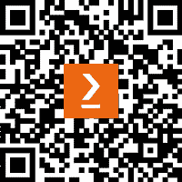

# 前言

在本书的第三版中，你会发现理论和方法论大致保持不变，但更新了关于一般技术信息、最佳实践和框架的内容，因为这些程序和文档在整个领域中都是标准的；然而，你会发现技术章节包含了使用新示例的新实验。我还增加了几章全新的内容，深入探讨了伪造物分析、自动化数据恢复、恶意软件和网络分析，展示了多个工具并提供实际操作，即使是初学者也能轻松跟随。我们甚至使用了 Wine，它使我们能够在 Kali Linux 中安装非常流行的（**数字取证与事件响应**）（**DFIR**）工具，这些工具是为 Windows 平台设计的（如 Autopsy 4）。本书对希望学习或增强 DFIR 和蓝队技能、并通过结合渗透测试技能与数字取证和事件响应技能成为紫队员的红队成员和渗透测试人员非常有帮助。

# 本书适用对象

本书的第三版经过精心结构设计，旨在帮助各个层次的读者理解，从初学者和数字取证新手到事件响应专业人员，本书的前六章帮助你了解所使用的技术，并指导你设置 Kali Linux，之后将深入探讨取证分析、数据恢复、恶意软件分析、自动化 DFIR 分析和网络取证调查。希望学习蓝队技能以成为紫队员的红队成员和渗透测试人员也会发现本书内容非常有用。

# 本书涵盖的内容

*第一章*，*红队、蓝队与紫队基础*，向你介绍渗透测试人员和取证调查人员所属的不同类型的网络安全团队及所需的技能。

*第二章*，*数字取证简介*，为你介绍数字取证和取证方法学的世界，并且介绍各种取证操作系统。

*第三章*，*安装 Kali Linux*，涵盖了可以用来安装 Kali Linux 的各种方法，可以将其作为虚拟机或独立操作系统安装，也可以从闪存驱动器或 SD 卡运行。

*第四章*，*附加 Kali 安装和安装后任务*，在 Kali 安装的基础上，指导你执行附加安装和安装后任务，如启用 root 用户和更新 Kali Linux。

*第五章*，*在 Kali Linux 中安装 Wine*，展示了 Linux 系统的多功能性，你将在本章中学习如何在 Kali Linux 系统中使用 Wine 安装和使用为 Windows 平台设计的取证工具。

*第六章*，*理解文件系统和存储介质*，深入探讨操作系统和各种文件存储格式的领域，包括终端用户甚至操作系统无法看到的秘密隐藏位置。我们还将检查与数据相关的数据，称为元数据，并了解其易变性。

*第七章*，*事件响应、数据获取和 DFIR 框架*，探讨当事件被报告或检测到时会发生什么。谁是首位响应者，如何保持证据的完整性？在本章中，我们将研究数据获取和证据收集的最佳实践、程序和框架。

*第八章*，*证据获取工具*，建立在数据获取和最佳实践的理论基础上，并教授如何使用行业认可的工具，如 DC3DD、DD、Guymager、FTK Imager 和 RAM Capturer，进行数据和图像的获取，同时保持证据的完整性。

*第九章*，*文件恢复和数据雕刻工具*，通过使用 Magic Rescue、Scalpel、**Bulk_Extractor**、**scrounge_ntfs** 和 **recoverjpeg** 等各种工具来刻画和恢复从取证获取的镜像和媒体中的数据和工件，介绍了数字取证的调查面。

*第十章*，*使用 Volatility 3 进行内存取证和分析*，带我们进入内存工件的分析，并展示了如何保存易失性证据（如 RAM 内容和交换文件）的重要性。

*第十一章*，*工件、恶意软件和勒索软件分析*，带我们深入了解如何使用 p0f、swap_digger 和 mimipenguin 进行工件分析，随后演示如何使用 pdf-parser、**hybrid-analysis.com** 和 Volatility 执行恶意软件和勒索软件分析。

*第十二章*，*尸检取证浏览器*，展示了在 Kali Linux 中使用单一工具进行自动化文件恢复和分析。

*第十三章*，*使用 Autopsy 4 GUI 执行完整的 DFIR 分析*，更深入地探讨了使用最强大且免费的取证工具之一进行自动化文件雕刻、数据恢复和分析，这一工具将取证能力和调查推向专业级别，涵盖数字取证调查的各个方面，从哈希计算到报告。

*第十四章*，*网络发现工具*，展示了网络扫描和侦察工具，如 netdiscover、nmap 和 Shodan，虽然这些工具并非专门设计用于取证工具，但在执行事件响应时，它们提供的额外信息非常有用。

*第十五章*，*使用 Xplico 进行数据包捕获分析*，深入介绍了如何利用一个工具进行自动化数据包分析，调查网络和互联网流量。

*第十六章*，*网络取证分析工具*，本书的最后一章，演示了如何使用各种工具和网站（包括 Wireshark、NetworkMiner、[packettotal.com](http://packettotal.com)和[apackets.com](http://apackets.com)）捕获和分析数据包。

# 充分利用本书

尽管我们已尽最大努力解释本书中的所有概念和技术，但如果你有下载和安装软件的经验，并且至少熟悉基本的计算机和网络概念，如 RAM、CPU、虚拟化和网络端口，那会更加有帮助。

| **本书涵盖的软件/硬件** | **操作系统要求** |
| --- | --- |
| Kali 2022.x 及更高版本 | 最低配置：配备 8 GB RAM、250 GB 可用硬盘空间的 PC 或笔记本电脑，和 Ryzen 7 或 i5 CPU；推荐配置：16 GB RAM、250 GB 可用硬盘空间，Ryzen 7 或 i7 CPU |

**如果你使用的是本书的数字版，我们建议你自己输入代码，或者从本书的 GitHub 仓库访问代码（下一个章节中提供了链接）。这样做有助于避免与复制粘贴代码相关的潜在错误。**

# 下载示例代码文件

你可以从 GitHub 下载本书的示例代码文件，地址为[`github.com/PacktPublishing/Digital-Forensics-with-Kali-Linux-Third-Edition`](https://github.com/PacktPublishing/Digital-Forensics-with-Kali-Linux-Third-Edition)。如果代码有更新，它将会在 GitHub 仓库中更新。

我们还提供了其他来自丰富图书和视频目录的代码包，访问地址：[`github.com/PacktPublishing/`](https://github.com/PacktPublishing/)。快来看看吧！

# 下载彩色图片

我们还提供了一个 PDF 文件，包含了本书中使用的截图和图表的彩色版本。你可以在这里下载：[`packt.link/vLuYi`](https://packt.link/vLuYi)。

# 使用的约定

本书中使用了许多文本约定。

**文本中的代码**：表示文本中的代码词汇、数据库表名、文件夹名称、文件名、文件扩展名、路径名、虚拟网址、用户输入和 Twitter 用户名。示例如下：“开启你的 Pi，Kali 将会启动。再次提醒，默认的用户名和密码都是**kali**（小写）。"

任何命令行输入或输出都会如下所示：

```
sudo apt update
```

**粗体**：表示一个新术语、一个重要的单词，或屏幕上显示的单词。例如，菜单或对话框中的词汇显示为 **粗体**。例如：“您可以通过点击主 Kali 菜单中的 **应用程序** | **11-取证** 来查看一些取证工具。”

提示或重要说明

如下所示。

# 联系我们

我们始终欢迎读者的反馈。

**一般反馈**：如果您对本书的任何方面有疑问，请通过电子邮件联系我们 customercare@packtpub.com，并在邮件主题中注明书名。

**勘误**：尽管我们已尽全力确保内容的准确性，但错误仍然可能发生。如果您在本书中发现错误，我们将非常感激您向我们报告。请访问 [www.packtpub.com/support/errata](http://www.packtpub.com/support/errata) 并填写表格。

**盗版**：如果您在互联网上发现任何非法复制的我们的作品，我们将非常感激您提供该作品的所在网址或网站名称。请通过 copyright@packt.com 联系我们，并附上材料的链接。

**如果您有意成为作者**：如果您在某个领域拥有专业知识，并且有意撰写或参与书籍创作，请访问 [authors.packtpub.com](http://authors.packtpub.com)。

# 分享您的想法

在阅读完《数字取证与 Kali Linux》后，我们希望听听您的想法！请 [点击这里直接进入亚马逊评论页面](https://packt.link/r/1-837-63515-3)，分享您的反馈。

您的评论对我们和技术社区至关重要，帮助我们确保提供优质的内容。

# 下载本书的免费 PDF 版本

感谢您购买本书！

你喜欢随时随地阅读，但又无法携带纸质书籍吗？你的电子书购买与您选择的设备不兼容吗？

不用担心，现在每本 Packt 书籍都会附赠一份免费的无 DRM PDF 版本。

随时随地，任何设备上阅读。直接从您最喜欢的技术书籍中搜索、复制并粘贴代码到您的应用程序中。

福利还不止这些，您还可以独享折扣、新闻通讯以及每日送达的精彩免费内容。

按照这些简单步骤，您就可以获得这些福利：

1.  扫描二维码或访问下面的链接



[`packt.link/free-ebook/9781837635153`](https://packt.link/free-ebook/9781837635153)

1.  提交您的购买证明

1.  就是这样！我们会直接将您的免费 PDF 和其他福利发送到您的邮箱。
