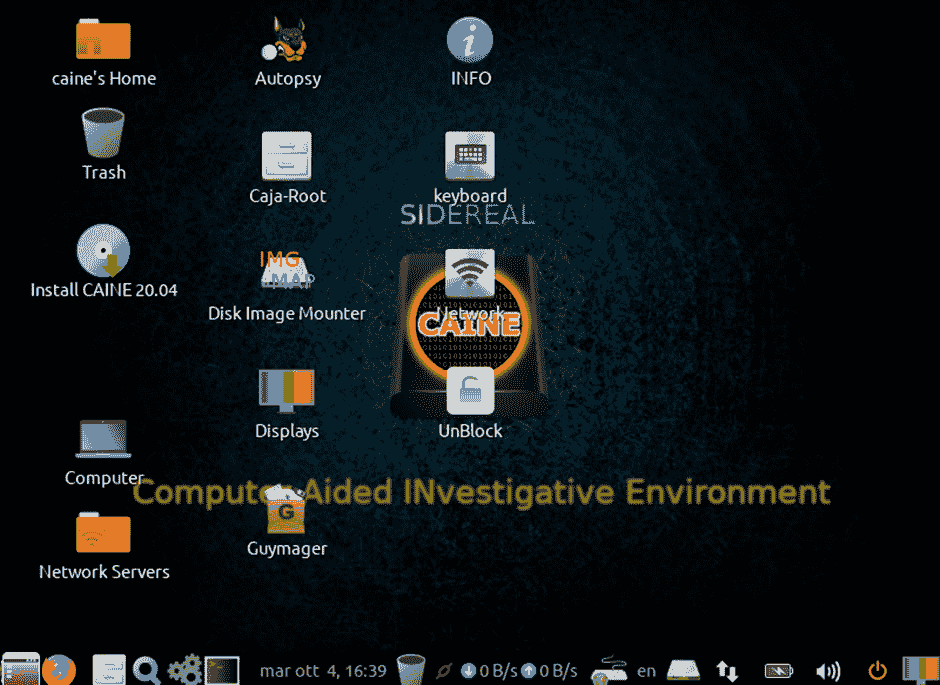
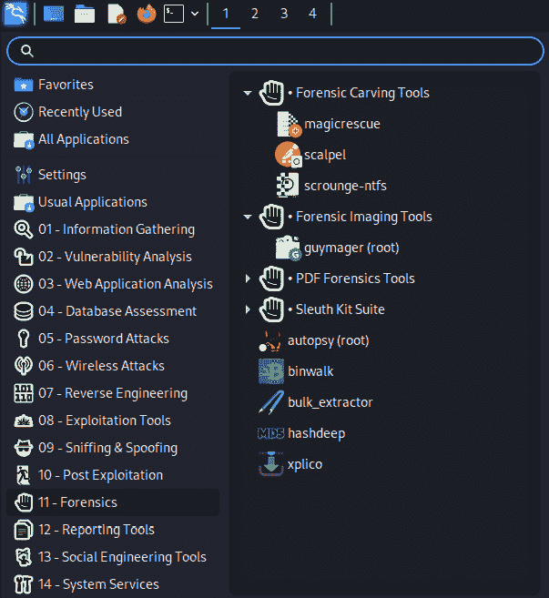

# 第二章：数字取证简介

本章介绍了数字取证科学的各个方面。它将特别为那些可能是**数字取证与事件响应**（**DFIR**）新手的读者介绍基础知识，随着本书的进展，我们将在这些基础上进一步深入。

本章将涵盖的主题有：

+   什么是数字取证？

+   蓝队和紫队的需求

+   数字取证的方法论与框架

+   数字取证**操作系统**（**OSs**）的比较

+   数字调查中使用多种取证工具的需求

+   商用取证工具与开源取证工具的比较

# 什么是数字取证？

我在本章中首先要介绍的内容是理解数字取证及其正确的实践和程序。你可能已经接触过几本书、博客，甚至视频，展示了数字取证的各个方面以及使用的不同工具。理解取证本身是一门科学，涉及非常明确的最佳实践和方法，以揭示某些事物是否存在，至关重要。

数字取证涉及从各种存储介质中保存、获取、记录、分析和解释证据。它不仅限于笔记本电脑、台式机、平板电脑和移动设备，还包括跨公共或私人网络传输的数据。

在大多数情况下，数字取证涉及使用各种方法和工具来发现和/或恢复数据。数字取证调查包括但不限于以下内容：

+   **数据恢复**：调查和恢复可能已被删除、更改文件扩展名，甚至隐藏的数据。

+   **身份盗窃**：许多欺诈活动，从盗用信用卡到伪造社交媒体账户，通常涉及某种形式的身份盗窃。

+   **恶意软件与勒索软件调查**：至今，通过特洛伊木马和蠕虫传播的勒索软件，已成为对公司、军事组织和个人的最大威胁之一。恶意软件也可以通过移动设备和智能设备传播。

+   **网络和互联网调查**：调查**拒绝服务攻击**（**DoS**）和**分布式拒绝服务攻击**（**DDoS**），并追踪被访问的设备，包括打印机和文件。

+   **电子邮件调查**：可以调查源头和 IP（**互联网协议**）来源、附件内容以及地理定位信息。

+   **企业间谍活动**：许多公司正在逐步远离打印副本，转向云端和传统磁盘存储。因此，数字足迹总是会留下；如果敏感信息被访问或传输，会发生什么？

+   **儿童色情调查**：令人痛心的是，现实情况是，儿童在互联网上以及深网中广泛遭受剥削。通过技术手段和高技能的法医分析师，调查人员可以分析互联网流量、浏览历史、支付交易、电子邮件记录和图片等，开展调查工作，摧毁这些剥削网络。

接下来，我们将探讨蓝队和紫队的必要性以及每个团队所需的技能。

# 蓝队和紫队的必要性

如在*第一章*《红队、蓝队和紫队基础》一文中所讨论，蓝队更关注**数字取证与事件响应**（DFIR），而紫队成员则是那些能够理解并操作网络安全攻防两端的人员。

最近，尤其是在 Covid-19 大流行封锁期间，您可能已经注意到或看到网络攻击有了显著增加。这些攻击的一个主要因素是员工在各个层级上缺乏安全意识培训，导致他们成为钓鱼攻击的受害者。在封锁期间，发生了大量钓鱼攻击，这些攻击通过社交工程手段诱使用户打开恶意邮件或泄露个人或公司信息。攻击者使用与 Covid-19 疫情爆发、健康更新相关的邮件主题，甚至通过受害者亲友的电子邮件账户请求帮助，伪装成这些受害者被困在封锁中的国家，需要财务援助才能回家。

在过去一两年里，来自臭名昭著的勒索软件和**高级持续性威胁**（**APT**）团体的勒索软件攻击显著增加，且勒索软件在暗网中已经可以轻易购买。ALPHV、Darkside、Revil 和 BlackCat 只是一些最臭名昭著的勒索软件和 APT 团体，它们的名字通常会让任何网络安全专业人士感到恐惧。这些团体以破坏个人和公司为主，随后要求支付数千到数百万美元不等的赎金。除了数据被高度加密并丢失外，这些团体现在还会通过 DDoS 攻击进一步攻击受害者，并将被窃取的受害者数据发布在暗网博客上。我们将在本书后续内容中深入探讨勒索软件问题。

应对事件是一回事，因为我们（希望）可能有计划或正式程序可遵循，但如果我们没有适当的机制来检测到事件，那么情况可能比预想的更糟糕。这就是蓝队和紫队成员需求的地方。黑客、恶意软件开发者、APT（高级持续性威胁）等并不会休息，当然也不关心公司和经济的财务状况。勒索软件在过去某些案例中已经证明是非常有利可图的，我们必须考虑到，在任何时间，恶意软件开发者都在研究新的攻破方法。

每个组织必须拥有蓝队，若没有紫队，至少应该外包团队的技术和职能，若决定不设立内部团队。有许多**托管安全服务**（**MSS**）公司可以执行所有必要的监控和告警系统。然而，拥有一到两名训练有素的蓝队和/或紫队成员的公司，始终会在准备和响应方面占有优势，因为内部团队不仅了解公司技术细节，还能理解组织文化和员工以及人力资源的意识水平（有时还缺乏意识），而这往往是网络安全中最薄弱的环节。

让蓝队成员定期进行网络安全意识培训与修补关键基础设施设备（如防火墙、路由器、交换机和服务器）同样重要。如今，网络安全意识必须与身体安全意识一样被重视，因为一个小小的失误可能会让一个庞大的企业瘫痪，且可能造成数百万美元的损失。如果员工能够意识到组织和个人面临的一般网络安全威胁，将大有裨益；尤其是在他们意识到组织和行业的特定威胁，且了解在组织中可能发生的特定威胁事件时，帮助会更大。通过这种方式，蓝队成员可以营造一个网络安全意识文化，让人们保持警觉，理解个人行为对组织安全、数据及资产保护所带来的风险和影响。

总结上述内容，蓝队和紫队负责组织内多个关键职能，包括：

+   威胁情报

+   威胁猎捕

+   事件响应

+   监控与事件管理

+   日志审查

+   漏洞评估（红队/紫队）

+   渗透测试（红队/紫队）

+   威胁模拟

在接下来的章节中，我们将探讨数字取证方法和框架，作为执行证据获取和取证调查时的最佳实践指南。

# 数字取证方法论和框架

记住，法医学是一门科学，数字取证要求你遵循适当的最佳实践和程序，以确保每次都能产生相同的结果，提供证据的证明、保存和完整性，如果需要的话，可以复制这些结果。

虽然许多人可能并不是在进行数字取证以便作为法庭证据使用，但最好以一种可以在法庭上被接受并呈现的方式进行数字取证与事件响应（DFIR）实践。遵循由专门从事数字取证和事件响应的组织制定的最佳实践，主要目的是确保在调查过程中保持证据的完整性。如果调查人员的工作需要被他人或对方当事人审查和批评，那么调查人员发现的结果必须能够被重新创建，从而证明调查的完整性。这样做的目的是确保你的方法可以重复使用，并且如果被剖析或审查，能够一次又一次地产生相同的结果。所使用的方法论，包括调查的程序和结果，应始终确保数据的完整性，不论使用何种工具。

本书中展示的最佳实践确保原始证据未被篡改，或者在调查设备和数据时，如果是在实时或生产环境中，能提供充分记录的证据，证明在调查过程中采取了必要的步骤，以避免不必要地篡改证据，从而保护证据的完整性。对于完全不熟悉调查的新手，我建议先熟悉一些专业社区广泛应用和实践的各种方法和技术。

因此，存在若干指导方针和方法论，你应当采纳或至少遵循，以确保检查和调查具有法医学的严谨性。

本章提到的最佳实践文件包括：

+   **首席警察官协会** (**ACPO**) *数字证据最佳实践指南*

+   **数字证据科学工作组** (**SWGDE**) 法医学出版物

尽管是在 2012 年编写的，ACPO 现在作为**全国警察局长委员会** (**NPCO**)，提出了一份名为*数字证据良好实践指南*的 PDF 文件，该文件包括在进行数字取证调查时的最佳实践，特别侧重于证据获取。ACPO 的*数字证据良好实践指南*随后被英格兰、威尔士和北爱尔兰的执法机构采纳和遵守，完整下载链接为[`www.npcc.police.uk/documents/crime/2014/Revised%20Good%20Practice%20Guide%20for%20Digital%20Evidence_Vers%205_Oct%202011_Website.pdf`](https://www.npcc.police.uk/documents/crime/2014/Revised%20Good%20Practice%20Guide%20for%20Digital%20Evidence_Vers%205_Oct%202011_Website.pdf)。

本指南提供的一些有用主题包括：

+   数字证据位置

+   与扣押相关的问题

+   捕获在线证据

+   数据分析与解释

在 SWGDE 网站上可以找到其他有用且更近期的关于数字取证最佳实践的文档集。SWGDE 成立于 1998 年，由联邦犯罪实验室主任组成的团体创立，主要成员和贡献者包括 FBI、DEA、NASA 和国防部计算机取证实验室。尽管本文详细描述了正式计算机取证实验室环境中的程序和实践，但这些实践仍然适用于当前未参与或无法访问此类环境的人员在非实验室调查中的应用。

本书的早期版本提到了 2006 年至 2016 年间 SWGDE 发布的文件。2006 年的旧版*SWGDE 最佳实践*已不再在 SWGDE 网站上，但它揭示了许多主题，包括：

+   证据收集与获取

+   调查已开启和关闭电源设备

+   证据处理

+   分析与报告

此文档可以在[`www.oas.org/juridico/spanish/cyb_best_pract.pdf`](https://www.oas.org/juridico/spanish/cyb_best_pract.pdf)上公开获取。

自那时起已经进行了多次更新，现在所有更新的最新文件都可以在更新的 SWGDE 网站上找到，网址为[`www.swgde.org/documents/published-by-committee/forensics`](https://www.swgde.org/documents/published-by-committee/forensics)。有超过 35 个免费下载的出版物，其中 17 个在 2017 年至 2022 年间发布。我强烈建议下载这些文件，因为对于 DFIR 从业者来说，它们非常出色，每个文件大约只有 10 页或更少。

所谓的更新的*SWGDE 最佳实践*文件包含关于以下内容的优秀、深入研究和现代化的 DFIR 最佳实践：

+   *车载信息娱乐和远程通信系统* (2022)

+   *无人机* *取证* (2022)

+   *在线内容获取* (2022)

+   *云服务提供商的数字证据获取* *（2020）

+   *移动证据收集与* *保存*（2020）

+   *数字证据* *收集*（2018）

+   *计算机取证* *检查*（2018）

+   *计算机取证* *采集*（2018）

还有许多其他有用的最佳实践出版物。

现在我们已经熟悉了 DFIR 方法论和最佳实践，让我们来看看 DFIR 框架。

## DFIR 框架

尽管前述的最佳实践指南已经有些过时，但仍可与一个或多个框架结合使用。无论任务是什么，目标应始终保持不变，即在整个 DFIR 过程中，证据的完整性始终得到保持，从证据收集、检查、分析到报告。

有多个 DFIR 框架可供选择，若组织无论大小都能应用并实施这些框架，将有助于业务连续性和灾难恢复过程，这也是任何值得信赖的 DFIR 计划应具备的功能。以下是一些将在*第七章*中详细讨论的 DFIR 框架，*事件响应、数据采集与 DFIR 框架*。下载这些文档并将其保留为参考材料可能是个好主意，作为 DFIR 从业人员，你应当熟悉这些内容（可以先继续阅读下一节，稍后再回来查阅这些文档）：

+   *ISO/IEC 27037:2021 信息技术——安全技术——数字证据的识别、收集、采集和保存指南*：[`www.iso.org/obp/ui/#iso:std:iso-iec:27037:ed-1:v1:en`](https://www.iso.org/obp/ui/#iso:std:iso-iec:27037:ed-1:v1:en)

+   *NIST 特别出版物（SP）800-86 将取证技术融入事件* *响应指南*：[`nvlpubs.nist.gov/nistpubs/legacy/sp/nistspecialpublication800-86.pdf`](https://nvlpubs.nist.gov/nistpubs/legacy/sp/nistspecialpublication800-86.pdf)

+   *NIST 特别出版物（SP）800-61 修订版 2 计算机安全事件处理指南*：[`nvlpubs.nist.gov/nistpubs/specialpublications/nist.sp.800-61r2.pdf`](https://nvlpubs.nist.gov/nistpubs/specialpublications/nist.sp.800-61r2.pdf)

+   *D4I - 数字取证框架，用于审查和调查* *网络*：[`tsapps.nist.gov/publication/get_pdf.cfm?pub_id=929147`](https://tsapps.nist.gov/publication/get_pdf.cfm?pub_id=929147)

+   *NISTIR 8428 操作技术（OT）数字取证与事件响应（DFIR）框架*（2022 年 6 月）：[`nvlpubs.nist.gov/nistpubs/ir/2022/NIST.IR.8428.pdf`](https://nvlpubs.nist.gov/nistpubs/ir/2022/NIST.IR.8428.pdf)

现在，让我们来看看一些取证操作系统及其之间的差异。

# 数字取证操作系统的比较

就像有许多商业工具可供使用一样，还有许多开源工具供调查人员、业余爱好者和专业人员使用。这些工具大多数基于 Linux，并可以在多个免费提供的取证发行版中找到，我们将在本节中讨论这些内容。

在选择工具时，通常会出现的一个主要问题是商业工具与开源工具的选择。无论你使用商业工具还是开源工具，最终的结果应该是相同的，重点是保护和保持原始证据的完整性。

重要提示

预算总是一个问题，某些商业工具（无论它们多么强大、准确和用户友好）可能需要花费数千美元。

这些开源工具在各种开源许可证下免费使用，不应因为它们没有得到企业开发者和研究人员的支持而被忽视。

许多开源工具被取证社区广泛审查，并可能接受更多的审查，因为它们是公开可用的，并且是用非专有代码构建的。

尽管本书的重点是 Kali Linux 中的取证工具，我们将在本节末尾及之后开始查看，以下是一些更受欢迎的开源取证发行版或称为“发行版”。

以下节中提到的每个发行版都可以在许多地方免费获得，但出于安全考虑，我们将提供它们主页上的直接链接。本节中的操作系统没有特定的排列顺序，也不反映任何评级、评论或作者个人偏好。

我们将在本节中讨论的取证平台有：

+   DEFT Linux 8

+   **计算机辅助调查环境**（**CAINE**）12.4 Sidereal 和 CAINE 11 Wormhole

+   CSI Linux 2022.1

+   Kali Linux 2022.3

如果你在想，我使用前面提到的所有平台作为实时系统和虚拟机，我也为 CSI Linux 和 Kali 配置了专用机器。下面是我的**VirtualBox** **Manager**列表的一个片段：

图 2.1：VirtualBox Manager 中的虚拟机列表

## 数字证据与取证工具包 Linux

**数字证据与取证工具包**（**DEFT**）Linux 提供完整版和名为**DEFT Zero**的轻量版。出于取证目的，你可能希望下载完整版，因为 Zero 版不支持移动取证和密码破解功能：

+   DEFT Linux 8 下载页面：[`archive.org/download/deft-8.2/deft-8.2.iso`](https://archive.org/download/deft-8.2/deft-8.2.iso)

+   DEFT Linux Z（2018-2）下载页面：[`sourceforge.net/projects/archiveos/files/d/deft/deftZ-2018-2.iso/download`](https://sourceforge.net/projects/archiveos/files/d/deft/deftZ-2018-2.iso/download)

    +   基于：Ubuntu 桌面版

    +   发行类型：取证与事件响应

与此列表中提到的其他发行版类似，DEFT，如以下截图所示，也是一个完全功能的 **实时响应** 法医工具，可用于在无法关闭计算机的情况下进行实时响应，并允许对 RAM 和交换文件进行即时分析。虽然稍显过时，但我个人仍然使用 DEFT 8.2，特别是用于使用 Xplico 进行数据包分析：

图 2.2：DEFT Linux 8 启动菜单

在从 DEFT Linux DVD、可启动闪存盘或其他媒体启动时，您将看到各种选项，包括将 DEFT Linux 安装到硬盘、作为实时响应工具使用，或者通过选择 **DEFT** Linux 8 实时选项，作为操作系统使用，如下所示：

图 2.3：DEFT Linux 菜单

在前面的截图中，可以看到 DEFT Linux 8 中有几个法医类别，如 **Antimalware**、**Data Recovery**、**Hashing**、**Imaging**、**Mobile Forensics**、**Network Forensics**、**Password recovery** 和 **Reporting tools**。每个类别中都有多个由不同开发者创建的工具，提供了多样的选择供调查人员选择。

DEFT 包含许多有用的工具，为了做一个比较，我们来看一下 DEFT 中 **Analysis** 菜单下的工具：

图 2.4：DEFT Linux 中的法医分析工具

## 计算机辅助调查环境（CAINE）

CAINE 是一款可启动的实时响应 CD/DVD，提供以安全模式、文本模式、作为实时系统或以 RAM 启动的选项，如下所示。需要注意的是，最新版本 CAINE 12.4（Sidereal）不可安装，仅为实时系统操作系统。如果您希望安装 CAINE，可以使用 CAINE 11（Wormhole），尽管它们都可以作为实时系统用于实时采集和法医分析，如下图所示。

*图 2**.5* 显示了 CAINE 12.4 (Sidereal) 启动屏幕菜单的截图，您可以在其中选择 CAINE 12.4 的不同启动选项：

图 2.5：Caine 12.4 启动菜单

*图 2**.6* 显示了 CAINE 11 启动屏幕，与 CAINE 12 几乎相同，如 *图 2**.5* 所示：

图 2.6：Caine 11 启动菜单

以下是 CAINE 详细信息的总结：

+   CAINE 11 和 12 都可以在 [`www.caine-live.net/`](http://www.caine-live.net/) 下载

+   基于：GNU Linux

+   发行版类型：法医与事件响应

在选择启动选项后，CAINE 最显著的特点之一就是可以轻松找到写保护器功能，如下图所示，标记为 **UnBlock** 图标：

图 2.7：CAINE 12 桌面界面

激活此功能可以防止 CAINE 操作系统向证据计算机或驱动器写入数据。如果你没有硬件写保护器，启用此功能非常有用，关于这一点我们将在*第七章**，事件响应、数据采集和* **DFIR 框架**中进一步讨论。

图 2.8：CAINE 写保护器界面

**取证工具**是 CAINE 中列出的第一个菜单。像 DEFT Linux 一样，菜单中有几个类别，如以下截图所示，其中包括一些在开源取证中最常用的工具。除了这些类别，还有一些更知名工具的直接链接，如**Guymager**和**Autopsy**，它们将在后续章节中详细介绍：

图 2.9：CAINE 12 中可用的取证工具

让我们来看看 CAINE 中**分析**菜单中的工具。如前所述，CAINE 中有更多的**图形用户界面**（**GUI**）DFIR 工具，而不是 DEFT 中：

图 2.10：CAINE 12 中可用的分析工具

我们在 CAINE 的**内存** **取证**菜单中也提供了各种工具：

图 2.11 – CAINE 12 中可用的内存取证工具

有关发布时 CAINE 包含的所有功能和软件包的完整列表，请访问[`www.caine-live.net/page11/page11.xhtml`](http://www.caine-live.net/page11/page11.xhtml)。

最新版本的 CAINE 12.4 Sidereal 可以在[`deb.parrot.sh/direct/parrot/iso/caine/caine12.4.iso`](https://deb.parrot.sh/direct/parrot/iso/caine/caine12.4.iso)以 ISO 格式下载，大小约为 3.9 GB。

如前所述，如果你希望使用可安装的 CAINE 11 Wormhole，可以在[`deb.parrot.sh/direct/parrot/iso/caine/caine12.4.iso`](https://deb.parrot.sh/direct/parrot/iso/caine/caine12.4.iso)下载。

若要安装到 USB 闪存驱动器，请确保驱动器容量不少于 8 GB；但建议使用 16 GB 的驱动器。可以使用 Rufus 工具自动创建可启动的 CAINE 驱动器，如*第三章*所示，*安装* *Kali Linux*。

## CSI Linux

CSI Linux 是一个相对较新的平台，由具有远见的*Jeremy Martin*及其优秀团队开发，他们打造了一个功能强大的取证/蓝队平台，我与 Kali Linux 一样经常使用。CSI Linux 2022.1 提供了适用于 VirtualBox 和 Kali Linux 的虚拟设备安装，也可以下载作为可启动镜像进行实时 DFIR 操作。未来还计划发布 CSI Linux **安全信息与事件管理**（**SIEM**）系统。

CSI Linux 2022.1 可以直接从 [`csilinux.com/download`](https://csilinux.com/download) 下载。

提示

如果使用 CSI Linux，用户名和密码都是**csi**。

图 2.12：CSI Linux 登录界面

与 DEFT、CAINE 和 Kali 类似，CSI Linux 也具有非常用户友好的桌面界面：

图 2.13：CSI Linux 桌面界面

点击 CSI Linux 菜单按钮会显示出一长串类别，包括**OSINT 和在线调查**、**黑暗网络**和**威胁情报**类别，正是在这些方面，我认为 CSI Linux 真正表现出色，因为其他平台没有这些预装工具：

图 2.14：CSI Linux 取证工具

再次为了对比，我们来看看**OSINT 和在线调查**、**黑暗网络**和**计算机取证**菜单。

**OSINT 和在线调查**菜单下有多个子菜单，提供了非常有用的工具，用于社交媒体、电子邮件、电话和社交工程工具，所有这些我都经常使用：

图 2.15：CSI Linux OSINT 和在线调查工具

**黑暗网络**调查工具在紫队合作中也非常受欢迎，因为它们被渗透测试员和 DFIR 从业人员共同使用：

图 2.16：CSI Linux 黑暗网络调查工具

**计算机取证**和**事件响应**菜单中列出了许多更新和现代的图形界面（GUI）和**命令行界面**（**CLI**）工具，用于进行全面调查：

图 2.17：CSI Linux 计算机取证工具菜单

CSI Linux 还拥有一个令人印象深刻的**事件响应**工具类别，正如在*图 2.18*中所见：

图 2.18：CSI Linux 事件响应菜单

我强烈建议下载并熟悉 CSI Linux。我们将在本书中学习使用的许多工具也已经预装在 CSI Linux 中，这将减少学习曲线。

## Kali Linux

最后，我们来到了这颗宝石，Kali Linux，在下一章以及本书的全篇中将详细讨论其从安装到高级取证应用的方方面面：

+   主页：[`www.kali.org/`](https://www.kali.org/)

+   基于：Debian

+   发行版类型：渗透测试、取证和反取证

Kali Linux 最初是作为渗透测试或渗透测试发行版 BackTrack 创建的，后来在 2015 年演变为 Kali Linux，如在*第一章*《红队、蓝队和紫队基础》一书中所提到的。这款强大的工具是全球渗透测试人员和安全爱好者的首选工具。作为**认证 EC-Council 教师**（**CEI**）以及**认证道德黑客**（**CEH**）课程的讲师，该操作系统通常是课堂的明星，因为它包含了许多令人印象深刻的安全工具，从扫描和侦察工具到高级漏洞利用和报告工具应有尽有。

与前面提到的工具一样，Kali Linux 可以作为一个实时响应取证工具使用，因为它包含了进行完整调查所需的许多工具。然而，Kali 也可以作为一个完整的操作系统使用，因为它可以完全安装在硬盘或闪存驱动器上，并包含多种生产力和娱乐工具。它自带许多硬件、图形和网络设备所需的驱动程序，并且在 32 位和 64 位系统上运行流畅，且占用资源极少；它也可以安装在某些移动设备上，如**Nexus**和**OnePlus**手机，以及其他手机和平板电脑上。

除了其多功能性外，从 Live CD/DVD 或闪存驱动器启动时，调查员有多个选项可供选择，包括**Live（取证模式）**，该模式保持证据驱动器的完整性，不会干扰或篡改证据，还会禁用闪存驱动器和其他存储介质的自动挂载，确保在整个调查过程中保持原始证据的完整性。

再次强调，Kali Linux 是首选的紫队平台，它将渗透测试和取证工具完美地集成在一个出色的包中。

当从 DVD 或闪存驱动器启动 Kali Linux 时，用户首先会看到用于启动 Live 环境和安装的选项。从列表中选择第三个选项会进入**Live（取证模式）**，如以下截图所示：

图 2.19：Kali Linux 启动菜单

一旦 Kali **Live（取证模式）**选项启动，调查员将看到与使用 Kali 中任何图形用户界面时相同的主屏幕，如下图所示：

图 2.20：Kali Linux 桌面界面

当然，Kali 也可以作为一个完整的操作系统安装在虚拟机或直接安装到硬盘上，相关内容将在*第三章*《安装 Kali Linux》中介绍。这是我桌面的截图，安装了如 FTK Imager 和 Autopsy GUI 等 Windows 取证工具，使用 Wine 运行：

图 2.21：Kali Linux 定制桌面

Kali 菜单可以通过点击**应用程序**在左上角找到。点击后，用户会进入菜单列表，菜单下方显示取证类别，标注为**11 - Forensics**。以下截图展示了 Kali 中一些我们在本书后面将要使用的**取证**工具：

图 2.22 – Kali Linux 取证工具菜单

需要注意的是，所列的工具并不是 Kali 中唯一可用的工具。还有一些其他工具可以通过终端调用，稍后章节中我们会看到。

值得注意的是，当处于取证模式时，Kali 不仅不会篡改原始证据驱动器，还不会向交换文件写入数据，因为交换文件可能存储了最近访问并保存在内存中的重要数据。

如需查看发布时 Kali Linux 操作系统所包含的完整功能和软件包列表，请访问[`www.kali.org/tools/`](https://www.kali.org/tools/)。

Kali 不仅可以作为一个实时响应取证工具使用，还可以像 Windows、macOS 和 Android 一样，作为完整操作系统使用，因为它内置了多个工具用于提高生产力和日常使用。Kali 能够安装到硬盘的事实意味着，您可以定期下载并更新其他工具，持续访问所有 IT 安全和取证工具。这样，您在使用工具时能够保存进度，并且不必过多担心如果您决定将其作为完整操作系统使用时需要重启机器。

使用这些开源操作系统，如 Kali，给我们提供了一系列可供选择和使用的工具。在每个类别中，很多工具都能执行相同的任务。这是一个好现象，因为我们的调查结果应当能够通过不同的工具进行重复验证。尤其是在调查员的工作可能受到批评时，这一点尤为重要，案件的完整性和证据的可信度也可能受到质疑；正确使用多个工具将得出一致的结果。接下来，我们将探讨在调查中为何需要使用多个工具。

# 数字调查中对多个取证工具的需求

证据的保存至关重要。正确使用商业和开源工具将产生有效结果；然而，为了获得取证上无懈可击的结果，有时最好使用多个工具来产生相同的结果。

使用多个工具的另一个原因可能仅仅是成本效益。一些人可能有充足的预算，而另一些人可能预算有限，甚至没有预算。商业工具可能很昂贵，特别是考虑到研发、测试、广告和其他因素。虽然开源工具经社区测试，但可能没有商业工具那样的资源和资金。

*那么，我们如何知道选择哪些工具呢？*

数字取证通常非常耗时，这也是你可能希望使用多个取证副本的原因之一。通过这种方式，你可以同时使用不同的工具来加速调查。尽管快速的工具可能是好事，但我们也应该质疑这些工具的可靠性和准确性。

**美国国家标准与技术研究院**（**NIST**）开发了**计算机取证工具测试**（**CFTT**）程序，用于测试数字取证工具，并将所有结果公开。根据工具的特定能力，选出多个工具并分入不同的测试类别，如磁盘映像、文件修复和数据恢复等。每个类别都有正式的测试计划和策略，并附有验证报告，报告也公开发布。

关于 CFTT 程序的更多信息，请访问[`www.cftt.nist.gov/disk_imaging.htm`](https://www.cftt.nist.gov/disk_imaging.htm)。本书中涵盖的许多工具的测试和验证报告可以在[`www.dhs.gov/science-and-technology/nist-cftt-reports`](https://www.dhs.gov/science-and-technology/nist-cftt-reports)找到。

为了加强使用多个工具维护调查和结果完整性的重要性，从本书的*第七章*《事件响应、数据获取和 DFIR 框架》开始，将演示多个工具的使用。

到目前为止，我们已经讨论了开源工具。在接下来的章节中，我将讨论一些你可能会遇到的流行商业取证工具，特别是如果你是或打算成为数字取证和事件响应（DFIR）专业人员的话。

## 商业取证工具

尽管我们将使用开源工具，但我想提到一些你可能有兴趣使用或加入到你作为取证专业人员工具库中的流行商业工具。

### Belkasoft Evidence Centre X

Belkasoft **Evidence Center** (**EC**) X 是一个自动化的事件响应和取证工具，能够分析获取的内存转储、虚拟机、云、移动备份以及物理和逻辑驱动器的映像。

Belkasoft EC X 还能够搜索、恢复和分析以下类型的证据：

+   办公文档

+   浏览器活动和信息

+   电子邮件

+   社交媒体活动

+   移动应用程序

+   消息应用程序（WhatsApp 和 Facebook Messenger）

+   云数据获取

更多 Belkasoft 产品的信息可以在 [`belkasoft.com/`](https://belkasoft.com/) 找到。

Belkasoft 还提供一个免费的获取工具和 RAM 捕获工具，以及其 EC 的试用版，下载链接为 [`belkasoft.com/get`](https://belkasoft.com/get)。

### Exterro 取证工具包（FTK）

Exterro **取证工具包** (**FTK**) 已经存在一段时间，并被全球的取证调查员和执法机构广泛使用。FTK 还与 Belkasoft 集成，提供更好的用户体验。FTK 的一些功能包括：

+   使用四个引擎的多核支持进行快速处理

+   处理大量数据的能力

+   数据索引以便于更快和更轻松的搜索与分析

+   密码破解与文件解密

+   自动化分析

+   能够执行定制的数据雕刻

+   高级数据恢复

更多关于 FTK 的信息可以在 [`accessdata.com/products-services/forensic-toolkit-ftk`](https://accessdata.com/products-services/forensic-toolkit-ftk) 找到。

FTK 的试用版可以在 [`go.exterro.com/exterro-software-demo`](https://go.exterro.com/exterro-software-demo) 下载。Exterro 还提供一个免费的镜像获取工具，供下载和使用，链接地址是 [`go.exterro.com/l/43312/2022-08-23/f7rylq`](https://go.exterro.com/l/43312/2022-08-23/f7rylq)。

### OpenText EnCase Forensic

曾被称为 Guidance EnCase Forensic，现在被称为 OpenText EnCase Forensic，这款工具多年来一直处于行业前沿，并且近二十年来已被全球的专业人员和执法人员广泛使用。与 FTK 类似，EnCase 提供了多个解决方案，涵盖事件响应、电子发现以及端点和移动取证。

除了作为一整套数字取证解决方案和工具套件外，EnCase 的其他一些功能包括：

+   从超过 25 种不同类型的移动设备获取镜像，包括手机、平板电脑，甚至是 GPS 设备。

+   支持 Microsoft Office 365。

+   使用 Check Point 的全盘加密进行证据解密。

+   深度取证与筛查分析。更多关于 EnCase 的信息可以在 [`www.guidancesoftware.com/encase-forensic`](https://www.guidancesoftware.com/encase-forensic) 找到。

现在我们已经介绍了一些更流行的商业取证工具，接下来我想简要谈一下反取证，您可以在自己的时间里进一步研究这一话题。

## 反取证——对数字取证的威胁

尽管我们希望数字取证任务尽可能简单，但我们仍然会遇到使调查过程、以及作为取证调查员的生活变得复杂甚至有压力的情况。那些试图隐藏信息、掩盖痕迹的人，以及有恶意意图或参与网络犯罪的人，常常采用各种方法来阻挠取证调查员的工作，企图妨碍或中止调查。

近年来，我们见证了几次重大的网络攻击事件，尤其是自 2011 年起。这些攻击中的许多据称是臭名昭著的黑客组织的作品，例如 LulzSec、Anonymous、Lizard Squad 等，甚至包括一些个人和黑客活动家（那些为特定目的或原因进行黑客攻击的人，通常不太担心因此入狱）。这些攻击不仅导致多个主要网络和机构瘫痪，还直接和间接造成了数百万美元的损失；因此，公众对这些公司的信任丧失进一步加剧了损失。

这些大胆、富有创意的公开攻击促使了许多新的团体的出现，这些团体从过去匿名者和其他组织的攻击失误中汲取了教训。社交媒体和地下通信渠道很快成为了志同道合的黑客和黑客活动家之间最便捷的沟通方式。随着互联网和万维网的普及，这不仅带来了 IP 之间的竞争，还导致了私人公司和企业之间的竞争，进而促使了几乎每个街道上都有免费无线热点的出现，无论是大企业还是小商店。

在几乎每个咖啡店都能上网的情况下，任何拥有智能手机、平板电脑、笔记本电脑或其他设备的人几乎都能获得未经认证的互联网访问权限。这使他们能够访问黑客网站和门户网站，下载工具，上传恶意软件，发送感染邮件，甚至发动攻击。

我们还应该考虑加密技术对我们调查的影响，接下来我们将详细探讨这一点。

### 加密

另一个需要注意的情况是，越来越多的用户友好型工具被用来帮助掩盖**公开身份信息**（**PII**），或者任何可能在法医调查过程中帮助揭示网络犯罪嫌疑人的信息。用于数据加密和匿名化的工具，例如 IP 地址掩码，已经可以轻松获取，而且大多数工具都变得越来越易于使用。

还需要注意的是，许多 Wi-Fi 热点本身可能相当危险，因为它们很容易被设置成截获个人数据，如登录和密码信息，以及个人身份信息（PII，例如社会保障号码、出生日期和电话号码），从而窃取任何可能连接 Wi-Fi 并输入此类信息的用户的资料。

加密过程为通信双方提供了机密性，使用的技术与我们使用锁和钥匙来保护个人私人物品的方式非常相似。为了打开一个锁，必须有一个匹配的钥匙。同样，在数字世界中，数据是通过加密算法加密或锁定的，并且必须使用相同的钥匙来解密或解锁数据。还有另一种情况，即使用一个密钥来加密或锁定数据，另一个密钥则用来解密数据。两种非常流行的加密工具是 **TrueCrypt** 和 **VeraCrypt**。

这两种加密工具使用非常高的加密方法，能确保数据的高度机密性。对于取证工作来说，主要的障碍可能是获取解密密钥，以解密或解锁数据访问。

重要提示

TrueCrypt 和 VeraCrypt 不仅能加密文件，还能加密文件夹、分区甚至整个硬盘！

除了使用加密工具，如此处提到的那些，我们还应考虑使用匿名性工具，如下一节中提到的那些工具。

### 在线与离线匿名性

加密，尤其是，加密技术会使调查变得相当困难，但也存在匿名性的概念，这增加了在调查中保持真实来源准确性的复杂性。像加密一样，针对所有操作系统平台（如 Windows、MacOS、Linux 和 Android）有几个免费的开源工具，这些工具通常能够（且大多数情况下成功地）掩盖某人数字足迹的隐藏。这个数字足迹通常通过其 IP 地址和 **媒体访问控制**（**MAC**）地址来识别设备。如果不深入探讨网络方面的内容，这两个数字地址可以分别比作一个人的全名和家庭地址。

即使一个人的 IP 地址根据其私有网络（家庭和工作）和公共网络（互联网）访问而发生变化，MAC 地址仍然保持不变。

然而，出于隐私和匿名性的目的，也有多种工具可以自由获取，用来伪装或伪造你的 IP 和 MAC 地址。更进一步，用户可以通过将数据路由通过在线服务器和设备，使得追踪发送数据的源头变得相当困难。这个系统被称为 **代理链路**，它能在一定程度上隐藏用户的身份。

一个很好的例子是 **Tor 浏览器**；它使用洋葱路由和全球多个代理来传递数据，使追踪源头变得非常困难，但并非不可能。你可以把代理链想象成接力赛，但不同的是，不是四个人一个接力棒传给下一个，而是数据在全球数百个代理设备之间传递。

现在你应该对反取证有了基本的了解，并且理解了加密和匿名工具的使用，这些工具可以隐藏或模糊可能会使 DFIR 调查变得复杂的信息和数据。让我们总结一下刚刚讨论的内容，然后继续进入下一章。

# 摘要

我们看到，数字取证仍然是一个相对较新的领域，尽管法医科学自 20 世纪初就已存在。虽然数字取证可能自 2000 年代初才开始出现，但作为一门科学，我们已经有了某些最佳实践、程序、标准和框架，例如由 ACPO、SWGDE 和 NIST 创建的框架，以遵循。这些框架在进行调查时，无论是作为业余爱好者还是专业的数字取证调查员，都能够确保调查结果和实际证据的准确性与完整性。

一些提到的商业工具包括 Belkasoft EC X、FTK 和 EnCase Forensics。许多可用的开源工具是为基于 Linux 的发行版设计的，可以单独下载，但许多工具在某些法医和安全操作系统或发行版中已预先包含。其中一些发行版包括 DEFT Linux、CAINE、CSI Linux，当然还有 Kali Linux；所有这些都可以通过提供的链接免费下载。

我希望这次数字取证的介绍对你既有信息性也有趣味性。现在我们已经建立了法医基础，接下来让我们深入了解 Kali Linux，在下一章中，我们将学习如何下载、安装和更新 Kali。下一页见！
