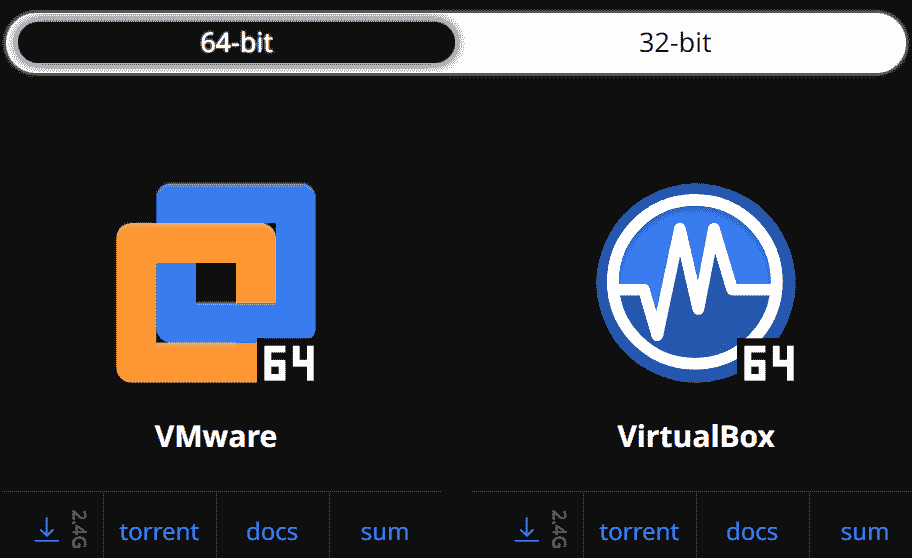
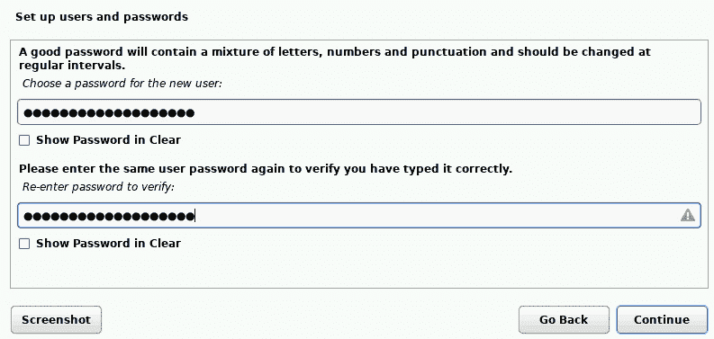
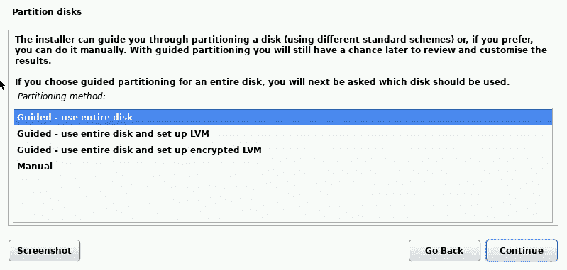

# 第三章：安装 Kali Linux

跟我一起开始学习 Kali Linux 的实践部分吧。你们中的一些人可能已经熟悉安装过程，甚至一些高级功能，如分区和网络设置。对于初学者和那些刚接触 Kali Linux 的人，我们建议你们特别注意这一章，因为我们将从下载 Kali Linux 的基础开始，一步步进行，直到成功安装。

本章将要覆盖的主题如下：

+   将 Kali Linux 安装到便携存储介质上以进行实时 DFIR

+   将 Kali Linux 下载并安装为独立操作系统

+   在 VirtualBox 中安装 Kali Linux

# 技术要求

如前所述，Kali Linux 已经问世很长时间。此前被称为 BackTrack，从 1 到 5 版本发布，Kali Linux 于 2015 年首次发布，版本号为 Kali 1.0。自 2016 年起，Kali Linux 的版本名称采用了年份命名方式。所以，例如，在本书撰写时，使用的版本是 Kali 2022.3，发布于 2022 年 8 月。

对于运行旧版本 Kali Linux 或者在购买本书时，可能会有新版本的 Kali Linux（如 2023 及之后版本）发布的读者，您可以通过使用 **sudo apt-get update** 命令轻松更新您的 Kali Linux 实例，该命令将在 *更新* *Kali* 部分后续演示。

# 下载 Kali Linux

出于安全原因，最好直接从其创建者 **Offensive Security** 的网站下载 Kali Linux。主要原因是，其他网站上的 Kali 下载可能是假的，或者更糟，可能包含恶意软件，如木马、rootkit，甚至勒索软件。Offensive Security 还在其网站上提供了所有版本的 Kali 下载的哈希值，用户可以将其下载版本的哈希与 Offensive Security 网站上发布的哈希进行比较 ([`www.kali.org`](https://www.kali.org))。在那里，您可以点击 **下载** 链接，或直接访问 Kali Linux **下载** 页面 [`www.kali.org/get-kali/`](https://www.kali.org/get-kali/)。

在 **下载** 页面，提供了四个主要选项，您需要选择适合您平台的 Kali Linux 版本：

+   **安装镜像**：这些 ISO 镜像可以下载并直接安装到硬盘上，作为主要操作系统使用，方式与安装 Windows 或其他操作系统相同。ISO 文件（或称为 ISO 镜像）是数据的精确副本，专门用于数据复制。

+   **虚拟机**：这些镜像用于虚拟平台，如 VirtualBox 和 VMware，并已预配置，可以开箱即用。

+   **ARM**：这些镜像专门为低功耗设备和**单板计算机**（**SBC**）设计，例如 Raspberry Pi、Pinebook 和 Gateworks 设备。

+   **移动设备**：这种便携版本的 Kali Linux 称为 Kali NetHunter，自推出以来，现在可以安装在更多设备上，包括 OnePlus、ZTE、Nexus、三星、索尼、诺基亚，甚至 TicWatch Pro 智能手表。Kali NetHunter Lite 还可以安装在 ARM64 和 ARMhf 设备上。

下图显示了具有各种平台选项的主下载菜单。

图 3.1：可用的 Kali Linux 版本

一旦你点击某个菜单项，它将带你进入该特定平台的下载部分。例如，如果你点击菜单中的 **虚拟机** 选项，你将被带到用于 **VMware** 和 **VirtualBox** 的 64 位和 32 位版本的 Kali Linux 下载部分。

重要说明

32 位操作系统的内存限制为仅能使用 4 GB RAM。如果你的系统内存超过 4 GB，建议下载 Kali Linux 的 64 位版本。

在下图中，选择了**64 位**版本。

图 3.2：适用于 VirtualBox 和 VMware 的可用 32 位和 64 位 Kali Linux 版本

你可以选择**VMware**或**VirtualBox**平台。你可以通过点击图标下方的下载箭头直接在浏览器中下载 Kali，箭头表示该文件的大小为 **2.4G**。你还可以使用你选择的 Torrent 软件下载，例如 Tixati 或 BitTorrent，通过点击**torrent**选项来进行下载。Torrent 软件必须单独下载。**docs**选项将引导我们进入每个平台的文档页面，而**sum**选项则提供了上传者上传的原始文件的 **SHA256sum** 输出。

重要说明

**sha256sum** 命令用于在 Linux 中生成一个校验和或数字输出，表示现有数据，然后可以与下载副本的校验和进行比较，以确保没有数据或比特被更改或篡改。

现在我们已经熟悉了可用的 Kali Linux 版本，让我们来看看安装不同 Kali Linux 实例所需的软件。

## 下载所需工具和镜像

为了能够跟随本章在不同平台上安装 Kali Linux，你需要下载以下版本的 Kali Linux 以及一些附加工具，我已经在这里列出：

+   **Kali Linux 64-bit 安装镜像**（可以作为独立操作系统或**虚拟机**（**VM**）进行安装）：[`cdimage.kali.org/kali-2022.3/kali-linux-2022.3-installer-amd64.iso`](https://cdimage.kali.org/kali-2022.3/kali-linux-2022.3-installer-amd64.iso)

+   **Kali Linux 64-bit 用于** **VirtualBox**：[`kali.download/virtual-images/kali-2022.3/kali-linux-2022.3-virtualbox-amd64.7z`](https://kali.download/virtual-images/kali-2022.3/kali-linux-2022.3-virtualbox-amd64.7z)

+   **Kali Everything** **种子**：[`cdimage.kali.org/kali-2022.3/kali-linux-2022.3-installer-everything-amd64.iso.torrent`](https://cdimage.kali.org/kali-2022.3/kali-linux-2022.3-installer-everything-amd64.iso.torrent)

+   **Tixati 种子客户端软件**：（用于下载 Kali Everything ISO 镜像）：[`www.tixati.com/download/windows64.xhtml`](https://www.tixati.com/download/windows64.xhtml)

+   **7-Zip 工具**（用于解压和解压 **.7z** 文件）：[`www.7-zip.org/download.xhtml`](https://www.7-zip.org/download.xhtml)

+   **Rufus 3.2**（用于创建可启动驱动器的工具）：[`github.com/pbatard/rufus/releases/download/v3.20/rufus-3.20.exe`](https://github.com/pbatard/rufus/releases/download/v3.20/rufus-3.20.exe)

+   **VirtualBox 和 VirtualBox Oracle VM 扩展包**：[`www.virtualbox.org/wiki/Downloads`](https://www.virtualbox.org/wiki/Downloads)

+   **Raspberry Pi Imager**（用于在 Raspberry Pi 上下载和安装 Kali）：[`www.raspberrypi.com/software/`](https://www.raspberrypi.com/software/)。访问 Imager 下载页面时，请确保选择正确的平台。我将在 Windows 机器上使用 Imager，可以从 [`downloads.raspberrypi.org/imager/imager_latest.exe`](https://downloads.raspberrypi.org/imager/imager_latest.exe) 下载。

## 下载 Kali Linux Everything 种子

Kali Linux 安装器有一个变种，叫做 Kali Everything。Kali Everything 镜像比其他安装版本要大得多，因为它包含了 Kali Linux 所有可用的工具。虽然这些工具可以通过仓库（通常称为 repos）手动下载和安装，但如果你不熟悉安装 Kali 工具和仓库，下载 Everything 版本并探索这些工具会更简单。你可以通过以下步骤下载 Kali Everything ISO 镜像：

1.  Kali Everything 可以直接安装到硬盘作为独立的**操作系统**（**OS**），如果你更喜欢此选项，也可以在 VirtualBox 中作为虚拟机安装。我们将在接下来的章节中覆盖这两种情况。你可以通过访问 [`kali.download/base-images/kali-2022.3/kali-linux-2022.3-installer-everything-amd64.iso.torrent`](https://kali.download/base-images/kali-2022.3/kali-linux-2022.3-installer-everything-amd64.iso.torrent) 下载 Kali Everything 种子。

图 3.3：Kali Everything 下载按钮的图片

1.  然后，您可以使用您选择的 torrent 应用程序打开该链接。我使用了 **Tixati** 软件，它是为 Windows 系统设计的，我从[`www.tixati.com/download/`](https://www.tixati.com/download/) 下载并安装在我的 Windows 10 笔记本上。点击链接后，Kali Everything torrent 文件会在 Tixati 客户端中打开。我选择将 Kali Everything 文件保存到我的 **Downloads** 文件夹中，下面的截图展示了这一过程。在选择了下载位置后，点击 **Start** 按钮。

图 3.4：Tixati torrent 界面

1.  Kali Everything 文件下载将在 Tixati 中开始，并将保存到所选文件夹，文件名为 **kali-linux-2022.3-installer-everything-amd64.iso**。我们将在接下来的章节中使用这个 ISO 文件。

现在，您应该已经在您的系统中下载了至少两个版本的 Kali Linux，就像我在 **Downloads** 文件夹中的情况一样。

图 3.5：下载的 Kali 镜像文件在 Downloads 文件夹中

现在让我们看看如何使用 Rufus 3.2 在闪存驱动器或任何其他存储介质上创建这两个 Kali Linux 实例的可启动版本。

# 在便携式存储介质上安装 Kali Linux 进行实时 DFIR

如前所述，Kali Linux 可以安装在多种平台上，并且可以作为独立操作系统或虚拟机安装。我们将首先看看如何使用我们下载的 Kali Installer ISO 文件创建一个可启动的 Kali Linux 闪存驱动器。如果您没有下载 ISO 文件，您可以点击链接并按照前一节的说明进行下载。

这个 **.iso** 文件，或者有时被称为镜像文件，可以与 Rufus 3.20 一起使用，制作可启动的驱动器，以便将 Kali Linux 安装到 PC 或笔记本电脑上。它也可以在 VirtualBox 中安装并作为虚拟机使用，我们将在本章后面介绍如何使用 Kali Everything ISO 文件。让我们首先看看如何使用 Kali Linux 安装器 ISO 文件创建一个可启动的闪存驱动器，然后学习如何将 Kali 安装为独立操作系统。

创建一个可启动的闪存驱动器或 SD 卡来安装 Kali Linux 是非常有用的，因为它消除了携带个人笔记本电脑或台式电脑的需要，一旦插入并从桌面或笔记本电脑启动，Kali 就可以直接从便携式存储媒体设备本身运行。

对于本实验（*我们会不时将实践称为实验*），我将使用 Windows 10 笔记本电脑上的 Rufus 3.20 工具，利用我们下载的**Kali Installer ISO**创建可启动的闪存驱动器。如果你还没有下载 Rufus 3.20，请通过点击[`github.com/pbatard/rufus/releases/download/v3.20/rufus-3.20.exe`](https://github.com/pbatard/rufus/releases/download/v3.20/rufus-3.20.exe)进行下载。

Rufus 非常易于使用，界面简洁，这也是我选择它来创建可启动驱动器的原因之一。一旦下载了 Rufus，找到下载的文件并双击运行 Rufus。此时，你应该已经将希望用作 Kali Linux 可启动驱动器的闪存驱动器插入到电脑或笔记本电脑中。在这个例子中，我使用的是一个 32 GB 的闪存驱动器，并为其命名为 CFSI，以便轻松识别。

看一下以下截图，观察以下项目：

+   **设备**：这是你的目标设备。我选择了我的 32 GB 驱动器。

+   **启动选择**：我们将使用下载的 Kali 安装程序和 Kali Everything **.iso** 文件来创建我们的可启动驱动器。

+   **分区方案**：**MBR**（旧设备）或**GPT**（新设备）。我选择了**MBR**，因为我将创建一个可启动的 Kali 驱动器用于旧系统。如果你只打算在新型笔记本电脑或台式机上使用这个可启动驱动器，可能需要选择**GPT**。如果你有可用的驱动器，还可以创建两个可启动驱动器，一个使用 MBR 分区方案，另一个使用 GPT。

+   **文件系统**：许多闪存驱动器和 SD 卡默认格式化为 FAT32，且可以正常工作，因此我们将其保持为**FAT32（默认）**。

图 3.6：Rufus 界面

现在按照以下步骤在便携式存储设备上安装 Kali Linux 以进行实时 DFIR：

1.  在前面的截图中，你会注意到右侧有一个提示框，内容为**点击选择或下载图片**。点击**SELECT**下拉菜单，浏览到你下载并保存 Kali 安装程序（**kali-linux-2022.3-installer-amd64.iso**）文件的路径。

图 3.7：在 Rufus 中选择 Kali ISO 镜像

1.  我将**kali-linux-2022.3-installer-amd64.iso**文件保存在**Downloads**文件夹中的**isos**文件夹内。点击**kali-linux-2022.3-installer-amd64.iso**文件进行选择，然后点击**打开**按钮。

图 3.8：在 Rufus 中选择分区方案

如前面的截图所示，你现在应该可以在 **启动选择** 部分看到 **kali-linux-2022.3-installer-amd64.iso**。我还将 **持久化分区大小** 设置为 **2 GB**，这为需要下载文件或在 Kali 的可启动安装中安装工具时提供了存储空间。

1.  此时，你可以在 **分区方案** 字段中再次选择 **MBR** 或 **GPT** 选项。我还将 **卷标签** 选项更改为 **Kali Linux amd 64 1**。之所以在卷标签末尾使用数字 **1**，是因为我使用了 **MBR** 分区方案的驱动器，另外还使用 **GPT** 分区方案创建了另一个可启动驱动器，标签为 **Kali Linux amd 64 2**。

1.  一旦你配置好所有选项，并确认所有设置正确无误，点击 **开始** 按钮。

1.  可能会提示你下载两个额外的文件，分别是 **ldlinux.sys** 和 **ldlinux.bss**。点击 **是** 按钮允许 Rufus 自动下载这些文件。你的计算机必须连接到互联网，Rufus 才能下载这些文件。

图 3.9：Syslinux 下载要求确认屏幕

1.  然后，Rufus 会要求确认，并警告说可移动存储设备上的所有数据将被销毁。如果你确定已选择正确的驱动器，请点击 **确定** 按钮以继续。

图 3.10：操作确认屏幕

然后，Rufus 将开始格式化驱动器，以下截图显示了这一过程。

图 3.11：Rufus 格式化操作状态

格式化完成后，Rufus 将把 ISO 文件复制到驱动器中。

图 3.12：Rufus 文件复制状态

1.  当过程完成时，**状态**栏将显示绿色，中间写着 **准备就绪**。此时，你可以点击 **关闭** 按钮，如下图所示。

图 3.13：可启动驱动器创建完成

1.  现在，你可以取下可启动的 Kali Linux 驱动器，并将其插入到希望以 live OS 方式运行 Kali 或将其安装到硬盘上的计算机或笔记本电脑中。

以 live OS 方式运行 Kali 意味着它不会安装在硬盘上，而是使用设备的 **随机存取内存**（**RAM**）运行。通过这种方式，我们可以保留原始操作系统，同时使用 Kali 及其中的所有工具进行 **数字取证与事件响应**（**DFIR**），而不影响当前安装的操作系统。

1.  为此，你需要将可启动的 Kali Linux 驱动器插入台式机或笔记本电脑，然后重启系统。你可能需要在重启时按 *F12* 键选择闪存驱动器作为启动操作系统。这告诉 **基本输入输出系统**（**BIOS**）从可移动存储介质启动，而不是从硬盘启动，从而使我们能够在内存中运行 Kali Linux 作为实时操作系统。

现在，我们已经学会了如何将 Kali Linux 安装到可启动的闪存驱动器上，接下来我们将学习如何通过可启动闪存驱动器将 Kali 安装为台式机或笔记本电脑上的独立操作系统。

# 作为独立操作系统安装 Kali

在本节中，我们将把 Kali Linux 安装到台式机或笔记本电脑上，作为独立的操作系统。为了完成这项操作，我们将使用刚刚通过 Rufus 3.2 创建的可启动 Kali 安装器闪存驱动器。如果你曾经通过闪存驱动器或任何可移动存储介质启动过台式机或笔记本电脑，你可能已经熟悉这个过程。对于那些不熟悉这个过程的用户，让我们一步一步地了解如何启动进入 Kali Linux。无论是安装 Kali 到物理机器还是虚拟机上，Kali Linux 的安装和配置是相同的（如果使用的是 Kali Linux 安装器版本，即我们所使用的版本）。因此，为了保持一致，我们将在接下来的章节中详细介绍安装过程：

1.  一旦你的可启动 Kali Linux 安装器闪存驱动器创建完成，将驱动器插入你的台式机或笔记本电脑并启动设备。如果设备已经开机，请在插入闪存驱动器后重启设备。

1.  当设备启动时，按下键盘上的 *F12* 键进入**高级启动选项**。这个键和设置在不同的设备上可能有所不同，如果 *F12* 无法带你进入启动菜单，你可能需要参考设备手册。

1.  选择 USB 或可移动驱动器作为主要启动设备，然后按 *Enter* 键。

现在，你应该看到 Kali 启动菜单，就像我拍摄的这张显示器照片一样。

图 3.14：台式机上的 Kali 启动屏幕图片

到了这个阶段，你可以参考接下来的 *在 VirtualBox 中安装 Kali Linux* 部分，继续安装和配置过程。让我们在独立安装部分暂停一下，学习如何在 VirtualBox 中作为虚拟机安装 Kali Linux。一旦我们在 VirtualBox 中安装了 Kali，接下来的安装和配置过程就可以同时适用于独立系统和虚拟系统。

# 在 VirtualBox 中安装 Kali

Kali Linux 的创建者（Offensive Security）非常友好地简化了我们的生活，通过创建了一个预配置版本的 Kali，适用于 VirtualBox 和 VMware，需要最少的配置。这些预配置的映像甚至包括安装程序映像，包括 Kali Everything，都可以安装在虚拟平台上，并且在运行时与物理机器无异。将 Kali Linux 用作 VM 的优势在于，您无需购买任何新的或额外的硬件。您还可以非常轻松地删除和重新安装 VM，并且甚至可以在您配置完全符合期望的操作系统之后创建操作系统的快照，随时可以引导进入，如果您损坏了 Kali 机器并且需要恢复到保存的状态。

对于那些将 Kali 作为独立操作系统安装的人，您可以在*在*安装 Kali 作为独立操作系统*部分中从可启动的 Kali 闪存驱动器启动后继续安装，因为安装 Kali Linux 安装程序的步骤在物理机和 VM 上完全相同。

在我们开始之前，请确保您已经下载了最新的稳定版本的 VirtualBox 和 VirtualBox 增强功能。如果没有，请访问[`www.virtualbox.org/wiki/Downloads`](https://www.virtualbox.org/wiki/Downloads)。请下载并安装适当的 VirtualBox 平台包和 VirtualBox Oracle Extension Pack。我正在使用 Windows 10 主机，因此我将通过单击**Windows hosts**下载和安装适用于 Windows 的 VirtualBox 平台。

图 3.15：VirtualBox 网站下载页面

## 准备 Kali Linux VM

一旦下载了 VirtualBox，就可以安装它，然后配置以运行 Kali Linux 和许多其他操作系统，具体取决于可用的 RAM 量：

1.  在设置新的客户操作系统或客户 VM 时，我们首先单击**New**，然后填写以下详细信息：

    +   **名称**：**Kali Linux 2022.3 Everything**（或您选择的名称）

注意

对于此安装，我正在使用大型的 Kali Linux Everything ISO 版本，因为它安装了每个工具。您还可以使用 Kali Installer ISO，因为这两个版本的安装方法完全相同。

+   **机器文件夹**：VM 的默认位置

+   **类型**：**Linux**

+   **版本**：**Debian（64 位）**

图 3.16：VirtualBox 名称和操作系统详细信息

1.  然后点击**下一步**，进入**内存大小**滑块提示分配内存。在我的屏幕上，你会注意到我为虚拟机选择了 10 GB 的内存。我选择这个值是因为我总共有 32 GB 的内存。需要注意的是，在为虚拟机选择内存大小时，不能超过总内存的一半，也不能选择滑块窗口中显示为粉红色的值，因为这样可能导致宿主机和虚拟机不稳定或崩溃。我建议至少选择 4 GB 的内存，以确保在使用取证工具时流畅运行。

图 3.17：VirtualBox 内存分配

1.  接下来，我们通过添加虚拟硬盘来创建虚拟机。我建议选择创建新的虚拟硬盘，这是选项中的第二个。点击**创建**继续：

图 3.18：VirtualBox 硬盘创建

1.  然后选择**VDI（VirtualBox 磁盘镜像）**作为**硬盘文件类型**，并点击**下一步**：

图 3.19：VirtualBox 硬盘文件类型选择

1.  一旦选择了 VDI，选择**动态分配**选项，以便在需要时扩展虚拟硬盘：

图 3.20：VirtualBox 存储分配

1.  在下一步中，我们选择虚拟硬盘的文件位置和大小。建议的 Kali Linux VDI 大小为 8 GB，但我为其分配了足够的**32.00** GB。我还选择了 VDI 的位置为**C:\Users\Administrator\VirtualBox VMs\Kali 2022.3 Everything\Kali** **2022.3 Everything**。

1.  选择位置后，点击**创建**完成虚拟硬盘的创建。

图 3.21：VirtualBox 存储分配大小

现在，我们已经在 VirtualBox 中设置好了 Kali Linux ISO 镜像，可以开始安装过程，具体步骤将在下一节中进行。

# 在虚拟机上安装 Kali Linux

一旦按照前一节的步骤准备好并完成虚拟硬盘的创建，我们就可以开始 Kali Linux 的安装过程。在**Oracle VM VirtualBox 管理器**窗口中，这是 VirtualBox 的主要操作系统管理窗口，我们可以看到虚拟机已准备就绪，现在可以安装 Kali Linux：

1.  在屏幕右侧，你可以看到分配的资源，如**名称**和**操作系统**类型，在**常规**部分，以及在**系统**部分分配的内存量。其他设置，如**视频内存**（**VRAM**）、**网络**和**显示**设置，也可以在这一部分中进行访问。

图 3.22：VirtualBox 管理器

1.  要开始 Kali Linux 的安装，点击左侧的**Kali 2022.3 Everything**条目，然后点击右上角**选择启动磁盘**部分中的绿色**开始**箭头，如下图所示。

图 3.23：启动磁盘选择

1.  在下一步中，找到我们从 Offensive Security 网站下载的 Kali Linux Everything ISO 镜像。点击浏览文件夹图标，进入**光盘选择器**，然后点击框左上角的**添加**图标。

图 3.24：光盘选择字段

1.  找到你之前下载的**Kali-linux-2022.3-installer-everything-amd64.iso**文件，点击它，然后点击**打开**按钮，以便在**光盘选择器**中看到该 ISO 作为条目列出。

图 3.25：选择 Kali ISO

1.  点击**选择**按钮继续，然后在**选择启动磁盘**框中点击**启动**按钮，选择**Kali-linux-2022.3-installer-everything-amd64.iso**文件，如下图所示。

图 3.26：选择 Kali ISO 作为启动镜像

现在你应该看到 Kali Linux 安装程序界面和菜单选项，这些选项在上一节中也有出现：*将 Kali Linux 安装为* *独立操作系统*。

图 3.27：VirtualBox 中的 Kali 启动菜单

重要提示

对于那些将 Kali Linux 安装为独立操作系统的用户，你也可以按照*安装和配置 Kali Linux*部分的步骤进行操作，因为这些步骤对于物理安装和虚拟安装完全相同。

我们已经完成了 Kali Linux 的配置，并准备好在独立和虚拟安装环境中进行安装。在下一节中，我们将学习如何安装和配置 Kali。

## 安装和配置 Kali Linux 作为虚拟机或独立操作系统

现在我们已经进入 Kali Linux 安装界面，可以按照以下步骤进行操作，无论是安装和配置 Kali 为虚拟机还是独立操作系统，步骤都是相同的：

1.  要开始安装，选择**图形安装**选项并按下*Enter*键。无论是将 Kali Linux 安装为独立系统还是虚拟机，你都会看到与下图相同的选项。

图 3.28：Kali 启动菜单中的图形安装选项

1.  接下来，选择你的语言并点击**继续**。

图 3.29：Kali 语言选择菜单

1.  选择您的国家或地区，点击**继续**。

图 3.30: 国家选择菜单

1.  选择您的键盘配置，然后点击**继续**。

图 3.31: 语言选择菜单

1.  为您的系统设置主机名，或者保留默认名称**kali**。

图 3.32: 为 Kali 系统分配主机名

1.  如果机器将加入一个域，您可以在此输入域名，若不加入域，则可以留空，点击**继续**。

图 3.33: 配置网络

1.  接下来，我们将创建一个非 root 用户账户，该账户没有 root 或管理员权限。请确保使用小写字母作为用户名。

图 3.34: 创建用户名

1.  接下来，创建一个安全且复杂的密码，然后点击**继续**。

图 3.35: 创建密码

1.  选择您的时区，然后点击**继续**。

图 3.36: 时区配置

1.  现在我们的个性化设置已经配置好，接下来让我们为安装准备硬盘。为了简化安装，我建议将整个硬盘用于 Kali，无论是虚拟硬盘还是物理硬盘。为此，选择**引导 – 使用整个磁盘**选项，点击**继续**。

图 3.37: 磁盘分区选项

1.  选择安装的磁盘，在我的例子中是一个 34.4 GB 的虚拟硬盘，点击**继续**。

图 3.38: 磁盘分区选择

1.  为了简化操作，我建议将所有文件保存在一个分区中。选择**所有文件都在一个分区（推荐给新用户）**选项，并点击**继续**。

图 3.39: 文件分区

1.  审核您的磁盘分区设置，并选择**完成分区并将更改写入磁盘**选项，点击**继续**。

图 3.40: 将更改写入磁盘

1.  若要确认分区和格式化设置并开始将更改写入磁盘，选择**是**按钮，点击**继续**。

图 3.41: 完成分区过程

分区和格式化将开始，安装过程将继续，接下来将提取所需的安装包。

图 3.42：基础系统安装过程

1.  现在我们可以选择各种软件包和软件库自动添加到 Kali 中。我选择了在我的安装中包含所有工具和支持软件包，除了**GNOME**和**KDE Plasma**选项，因为我更喜欢带有所有可能工具的典型 Kali Linux 界面。

图 3.43：附加软件选择

1.  一旦选择了所需的软件，点击**继续**继续安装。此过程将花费一些时间。与此同时，您可以浏览其他精彩的数字取证书籍，访问 [`subscription.packtpub.com/search?category=Security&concept=Forensics&_ga=2.265355399.920003428.1665758595-170131085.1665758595`](https://subscription.packtpub.com/search?category=Security&concept=Forensics&_ga=2.265355399.920003428.1665758595-170131085.1665758595)。

图 3.44：软件安装状态

1.  接下来，您可以选择显示管理器，或者如果不熟悉设置，可以保留默认的**gdm3**选项。

图 3.45：图形显示管理器选择

安装将按照状态栏显示的方式继续进行。

图 3.46：软件安装进度条

1.  只剩下几步，我们就完成了。接下来我们将安装 GRUB 启动加载器，它将允许 Kali 作为主操作系统从主硬盘启动。选择**是**并点击**继续**。

图 3.47：GRUB 启动加载器选择

1.  对于我们的最终配置，我们需要通过在磁盘上安装启动加载器来使系统能够启动。选择安装了 Kali 的磁盘（如果默认未选择，请手动选择），然后点击**继续**。

图 3.48：GRUB 启动加载器安装

1.  我们的安装即将完成。

图 3.49：Kali 安装过程状态

1.  当系统提示时，点击**继续**以完成安装并重启系统。

图 3.50：Kali 安装完成屏幕

1.  输入您的用户名和密码。

图 3.51：Kali Linux 登录屏幕

现在，我们已经完成了在独立设备和虚拟机上安装和配置 Kali Linux 的过程。还有其他安装 Kali Linux 的方法，我们将在下一章中学习。我还想展示一种更简单的方法，在 VirtualBox 中安装预配置版本的 Kali Linux。

# 总结

本章我们确实学到了不少内容。如果需要，随时可以擦除或删除你的安装，并重新尝试，以便更熟悉不同版本的安装过程。

在本章中，我们了解了 Kali Linux 的不同版本以及它们可以安装的各种平台，并探讨了下载不同版本 Kali Linux 的不同方法。然后，我们进入了技术层面，首先学习了如何使用 Rufus 和 Kali Linux 的 ISO 镜像创建可启动的 Kali Linux 闪存驱动器，而该 ISO 镜像是我们在本章开始时下载的。接着，我们学习了如何在物理设备上安装 Kali Linux 作为独立操作系统，并学习了如何在 VirtualBox 中作为虚拟机安装 Kali。

在我们的下一章中，我们将探索另一种安装 Kali 作为虚拟机的方法，并学习如何在 Raspberry Pi 4 上安装 Kali，接着进行一些安装后的任务。下章见。
