# 第四章：其他 Kali 安装和后安装任务

在上一章中，我们学习了如何将 Kali Linux 安装为独立操作系统，并且如何在 VirtualBox 中安装 Kali。 本章将继续介绍另外两种 Kali Linux 安装方法，这些方法可以被认为是更简单和更快速的安装，但我会让你来判断。 然后我们将执行一些常见的后安装任务，以确保我们拥有一个完全更新且功能正常的 Kali Linux 版本，用于我们的**数字取证与事件响应**（**DFIR**）调查，无论选择哪种平台进行安装。

本章我们将涵盖的主题如下：

+   在 VirtualBox 中安装预配置版本的 Kali Linux

+   在 Raspberry Pi 4 上安装 Kali Linux

+   更新 Kali Linux

+   启用 root 用户账户

+   将 Kali Linux 取证库添加到安装中

# 在 VirtualBox 中安装预配置版本的 Kali Linux

通过使用专为 VirtualBox 构建的预配置 Kali 版本，Kali 也可以通过更简单的方法安装在 VirtualBox 中：

1.  如果你还没有在*第三章*《安装 Kali Linux》中下载 Kali VirtualBox 镜像，你可以在 [`kali.download/virtual-images/kali-2022.3/kali-linux-2022.3-vmware-amd64.7z`](https://kali.download/virtual-images/kali-2022.3/kali-linux-2022.3-vmware-amd64.7z) 下载。

1.  你必须使用 7Zip 解压镜像，7Zip 可从 Windows 下载，网址为 [`www.7-zip.org/a/7z2201-x64.exe`](https://www.7-zip.org/a/7z2201-x64.exe)。

一旦解压，你应该能看到以下截图所示的相同文件。

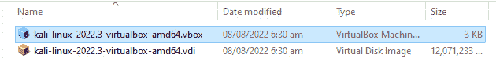

图 4.1 – 显示预配置的 Kali 镜像的下载文件夹

1.  双击 **.vbox** 文件（大小为 3 KB），它应该会立即在 VirtualBox 中打开。

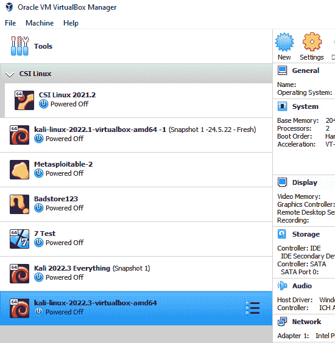

图 4.2 – VirtualBox 管理器

1.  点击 **VirtualBox** **Manager** 窗口顶部的 **设置** 图标。

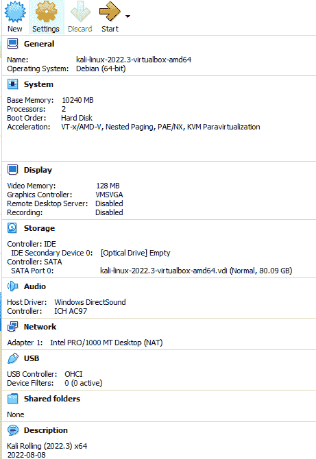

图 4.3 – Kali 虚拟机的预配置设置

1.  点击 **系统**，使用滑块来分配 **基础内存** 大小。 完成后，点击 **确定**。

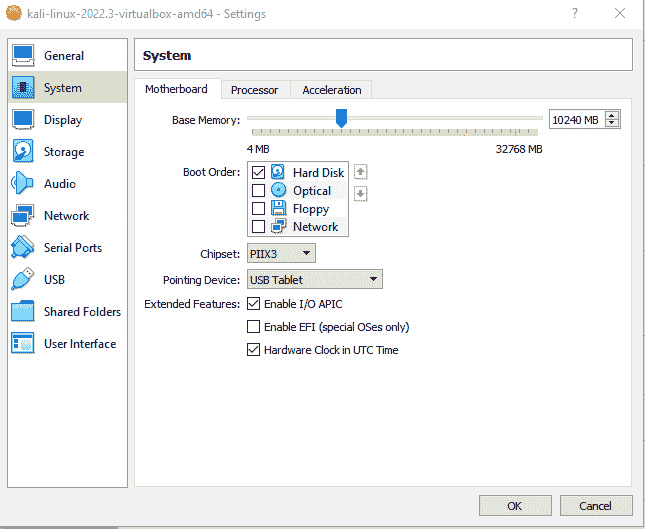

图 4.4 – 在 VirtualBox 中分配内存

1.  要启动虚拟机，请点击 Virtual Manager 窗口顶部的绿色**启动**按钮。


图 4.5 – VirtualBox 启动按钮

1.  使用以下凭证登录（所有字母均为小写）：

    +   用户名：**kali**

    +   密码：**kali**

我们已经介绍了三种安装 Kali Linux 的方法。我相信你会发现这一种比其他的要简单得多。接下来，我们将讨论在便携式 Raspberry Pi 4 上的另一种安装方式。

# 在 Raspberry Pi4 上安装 Kali Linux

Raspberry Pi 4，也称为 Pi 4，是一款低功耗、小巧、便携且强大的设备，可用于个人、企业甚至**操作技术**（**OT**）用途，正如本章前面提到的那样。在 Pi 4 上运行 Kali 非常有用，因为它非常强大，配备了 USB 3.0 端口、RJ-45 网络端口、双 mini-HDMI 端口、Wi-Fi、蓝牙以及最多 8 GB 的内存，并且可以通过可启动的 microSD 卡在几步之内启动 Kali。你可以在 [`www.raspberrypi.com/products/raspberry-pi-4-model-b/`](https://www.raspberrypi.com/products/raspberry-pi-4-model-b/) 上了解更多关于 Pi 4 的信息。

按照以下步骤将 Kali 安装到 Pi 4（甚至是较旧的 Pi 2、3 和 400）上：

1.  要在 Pi 4（甚至是较旧的 Pi 2、3 和 400）上安装 Kali，我们需要 Pi Imager 软件。可以从[`www.raspberrypi.com/software/`](https://www.raspberrypi.com/software/) 下载该软件，支持 Windows、Mac 和 Ubuntu（x86）设备。Pi Imager 将允许我们在 microSD 卡上安装 Kali Linux ARM 版本，从而在我们的 Pi 4 上运行。我还建议使用 32 GB 或更大容量的 microSD 卡，以确保你有足够的空间进行升级和下载 Kali 中的附加工具。

1.  下载完成 Pi Imager 后，将 microSD 卡插入你的笔记本电脑或台式机，无论是直接插入还是通过读卡器插入，然后启动 Pi Imager。

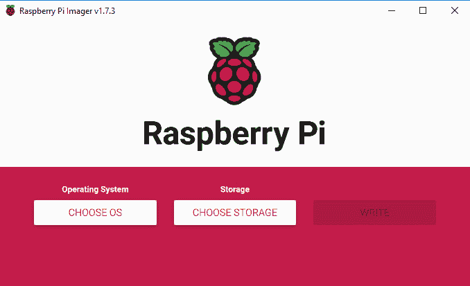

图 4.6 – Raspberry Pi Imager 界面

1.  点击**选择存储设备**，然后选择你的 microSD 卡。

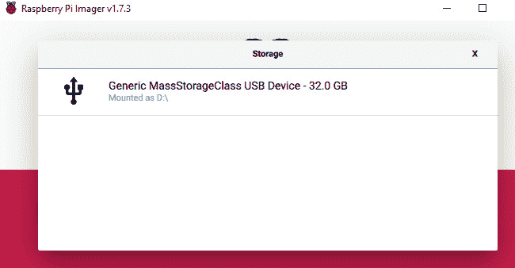

图 4.7 – Pi Imager 存储选择

1.  接下来，点击**选择操作系统**按钮，然后选择**其他特定用途** **操作系统**选项。

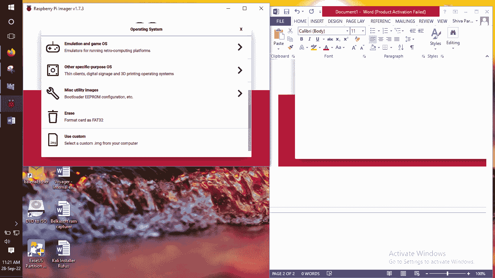

图 4.7 – 操作系统选择

1.  现在你应该能看到**Kali Linux**选项，如下图所示。

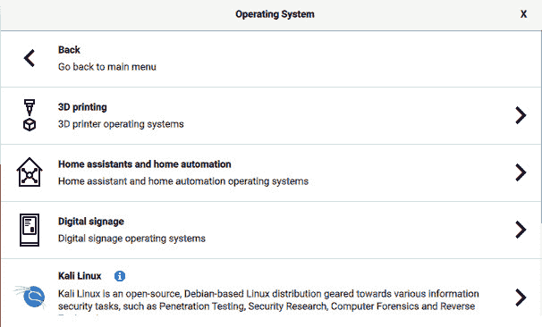

图 4.8 – 选择 Kali Linux 选项

1.  现在，你将看到不同 Raspberry Pi 设备上可用的 Kali 版本。你可以根据你手头的设备选择对应的版本。

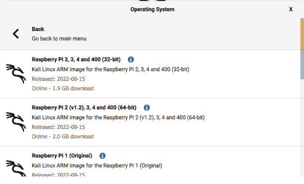

图 4.9 – 可用的 Kali Linux 版本

1.  选择完成后，你将返回主界面。点击**写入**选项将 Kali 安装到 microSD 卡上。

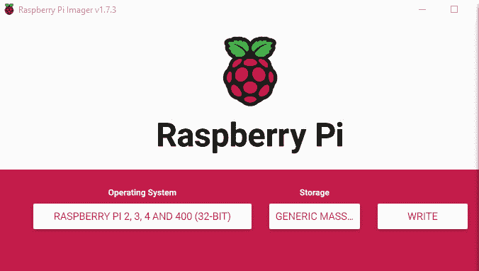

图 4.10 – 最终的 Pi Imager 配置

1.  然后会提示你继续。点击**是**以继续。

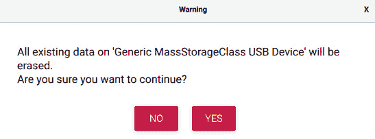

图 4.11 – 数据擦除确认

写入过程现在开始。

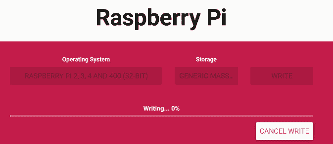

图 4.12 – 将 Kali 写入 SD 卡

1.  一旦过程完成，将 microSD 卡从计算机或读卡器中取出，并小心地插入到您的 Raspberry Pi 设备中，设备应处于关闭状态，以避免卡片损坏。然后开启 Pi，Kali 将启动。再次提醒，默认的用户名和密码均为 **kali**（小写）。

这部分结束了在各种平台上安装 Kali Linux 的不同方式。在我们使用 Kali 之前，我们应该始终更新我们的工具，接下来的章节中我将演示如何操作。

# 更新 Kali

现在我们已经了解了在各种平台上安装 Kali Linux 的多种方式，接下来让我们来看看 Kali Linux 系统启动后的一些重要后安装任务：

1.  要查看我们 Kali 系统的版本安装详情，让我们运行以下命令：

    ```
    cat /etc/os-release
    ```

在以下截图中，我们可以看到命令的输出展示了名称、版本、代号以及更多的详细信息，供验证使用。


图 4.13 – `cat` 命令输出

1.  我们还应该在安装后始终更新我们的 Kali 系统，以确保拥有当前版本的工具和支持软件。

要更新 Kali Linux，请输入并运行以下命令：

```
sudo apt update
```

在以下截图中，已经安装了一些更新，最后一行显示有 674 个软件包可以升级：

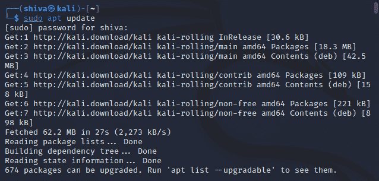

图 4.14 – 更新 Kali Linux

1.  输入并运行以下命令查看可升级的软件包列表：

    ```
    apt list –upgradable
    ```

在以下截图中，我们可以看到命令正在执行。升级所有组件可能需要一些时间。


图 4.15 – `apt list --upgradable` 命令输出

1.  输入并运行以下命令，允许 Kali 升级所有之前的软件和包，而不需要确认：

    ```
    sudo apt upgrade –y
    ```

以下截图展示了命令的执行与输出。

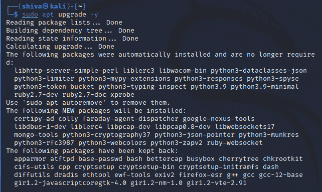

图 4.16 – 升级 Kali Linux

请注意，这个升级过程可能需要一些时间才能完成。

1.  现在，我们可以通过输入以下命令重启 Kali，完成整个过程：

    ```
    sudo reboot
    ```

以下截图展示了命令的执行与输出。


图 4.17 – 重启 Kali Linux

在更新和升级了 Kali Linux 安装后，我们现在可以继续进行其他任务。接下来，我们将学习如何启用 root 用户账户。

# 启用 Kali 中的 root 用户账户

现在，所有的更新和升级都已完成，让我们来看一下如何在 Kali Linux 中启用 root 用户账户。你可能已经注意到，某些版本的 Kali 在安装时允许使用 Kali 默认的用户名和密码进行访问。这是作为一种安全功能，以防止意外更改配置或工具。如果我们希望使用 root 或管理员权限来执行命令或进行其他任务，必须在相应命令前输入 **sudo**。

Sudo 是 **superuser do** 的缩写，它允许我们以超级用户的身份运行命令和工具，超级用户拥有最高权限，通常被称为 root 权限。有时候，在命令前输入它可能有些麻烦，但过一段时间之后这会变成习惯。

然而，如果你是 Kali 或基于 Linux 的操作系统新手，我建议你使用默认配置并在必要时输入 **sudo**，但最终选择权在于你。

启用 root 账户非常简单，几步就能完成：

1.  首先，如果 Kali 系统没有启动，请启动你的 Kali 机器，并使用你创建的用户名和密码登录，或者使用提供的默认凭证——用户名：**kali**，密码：**kali**。


图 4.18 – Kali Linux 登录界面

1.  点击顶部的终端图标以打开一个新的终端。

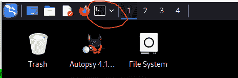

图 4.19 – Kali Linux 桌面，终端快捷方式被圈出

1.  在新的终端中，注意提示符显示为**(kali@kali)**。输入以下命令以访问超级用户账户并按 *Enter*。随后，你还需要输入密码——**sudo su**。

以下截图展示了命令的执行和输出。

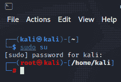

图 4.20 – sudo su 输出

注意

在 Kali Linux 中，输入密码时不会在屏幕上显示。

在前面的截图中，注意到提示符已经更改为 **(root@Kali)**。现在我们通过输入以下命令来更改 root 账户的密码。

1.  然后系统会提示你输入并重新输入新密码——**passwd root**。

以下截图展示了命令的执行和输出。

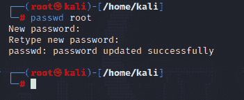

图 4.21 – 为 root 账户创建密码

1.  成功！我们现在可以注销当前用户并重新登录，或者通过点击屏幕右上角的电源按钮图标，然后选择 **注销** 或 **切换用户** 来直接切换到 root 用户，如下图所示。


图 4.22 – Kali Linux 的电源和用户选项

使用用户名**root**和你刚刚为账户创建的密码进行登录。


图 4.23 – Kali Linux 登录屏幕

1.  再次点击终端账户，你会注意到提示符现在是**(root@kali)**，如图所示。

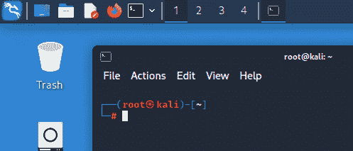

图 4.24 – 显示 root 用户账户的终端

现在我们已经在 Kali 上启用了 root 用户账户，本章的最后一项任务是通过使用取证元包添加额外的取证工具。

# 添加 Kali Linux 取证元包

Kali 元包是可以作为完整包下载的工具集合。根据你安装的 Kali 版本，可能没有包含你预期的或在工具列表页面上看到的所有工具，页面地址为[`www.kali.org/tools/all-tools/`](https://www.kali.org/tools/all-tools/)，该页面列出了 Kali Linux 中所有可用的工具。例如，对于我们的 DFIR 目的，你可以在[`www.kali.org/tools/kali-meta/#kali-tools-forensics`](https://www.kali.org/tools/kali-meta/#kali-tools-forensics)查看所有取证工具的列表，你可以点击**Dependencies**部分中的下拉箭头来查看所有工具的列表。

所有前面提到的工具都包含在**kali-tools-forensics**元包中，可以通过输入以下命令进行安装：

```
sudo apt install kali-tools-forensics
```

以下截图展示了该命令的执行过程和输出结果。


图 4.25 – 安装取证元包

注意

在安装任何元包之前，你应该像之前一样，使用**sudo apt** **update**命令更新你的 Kali Linux。

这将安装 Kali Linux 中所有列出的取证工具，如前面的截图所示。你可以通过在 Kali 主菜单中点击**Applications** | **11-Forensics**来查看一些取证工具。

# 总结

在本章中，我们学到了通过使用为 VirtualBox 专门设计的预配置 Kali 版本，可以以更简单和更快捷的方式安装 Kali Linux。只需几个点击和调整，我们就完成了安装。我们还学会了如何在 Raspberry Pi 设备上安装 Kali，这在需要便携性时非常有用，只需使用 Pi Imager 工具将 Kali 安装到 microSD 卡上即可。

接着，我们查看了一些非常重要的安装后任务，这些任务应该在任何安装后执行。我们学会了如何查找 Kali Linux 的版本，然后更新甚至升级 Kali 中的所有软件和包。最后，在本章中，我们学习了如何启用 root 账户，以避免在执行需要超级用户权限的操作时使用**sudo**命令。我们还学会了如何通过添加**kali-tools-forensics**元包来安装所有取证工具。

现在我们已经安装了不同版本的 Kali 并更新了系统，接下来我们将介绍一个非常有用的工具，叫做 Wine，它允许我们在 Kali Linux 系统上运行 Windows 工具。如果你问我，这可真是很酷的东西。下章见！
