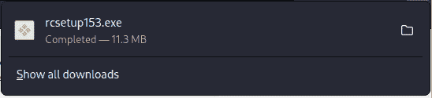
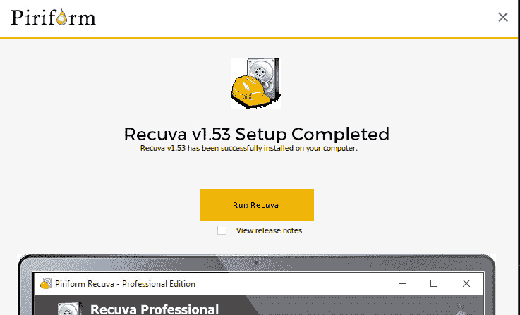

# 第五章：在 Kali Linux 中安装 Wine

在本章中，我们将学习如何通过在 Kali 中使用 Wine 安装 Windows 工具来扩展 Kali Linux 环境的功能。

本章我们将讨论以下主题：

+   Wine 是什么以及在 Kali Linux 中使用它的优势

+   安装 Wine

+   测试我们的 Wine 安装

让我们开始了解 Wine 及其优势。

# Wine 是什么以及在 Kali Linux 中使用它的优势

**Wine**通常被误称为**Windows 模拟器**，但正如官方网站所述，Wine 最初被称为**Wine Is Not an Emulator**，因此得名缩写 Wine。Wine 允许非 Windows 用户在符合**便携式操作系统接口**（**POSIX**）的系统上运行某些 Windows 应用程序，包括 macOS 以及 Linux 和 BSD 的各个版本，包括 Kali Linux。

对于我们的**数字取证与事件响应**（**DFIR**）工作，这非常有用，因为我们现在可以在 Kali Linux 系统上使用许多专为 Windows 制作的行业标准工具，无论是将其作为独立操作系统使用还是作为虚拟机使用。这也解决了需要购买 Windows 许可证的问题，因为我们不必使用运行 Windows 的设备。当考虑到在 Kali Linux 上运行所有 DFIR 工具时，您现在可以使用更少的硬件，这些节省的成本也得到了延伸。

通过在 Kali Linux 安装 Wine，我们不仅可以从 DFIR 的角度获得优势，还可以从紫队（Purple Teaming）的角度获得优势，因为我们还可以在 Kali 机器上安装许多用于 Windows 的红队工具。从个人经验来看，我总是为 DFIR 练习和调查使用两台笔记本电脑，一台运行基于 Linux 的操作系统，如 Kali Linux、CSI Linux 和 Ubuntu，另一台运行 Windows 10。我几乎每次进行 DFIR 练习和调查时使用的一些非常重要的 Windows 应用程序是 Belkasoft RAM Capturer、FTK Imager 和 Autopsy 4 **GUI**（**图形用户界面**）。这些工具在社区中得到了广泛应用，因为它们功能强大且相对易于使用。通过在我的 Kali Linux 及其他基于 Linux 的系统上安装 Wine，我现在可以使用一台机器完成所有任务，这节省了时间、精力和成本。

在本章接下来的部分中，我们将通过终端手动安装 Wine，然后安装 Google Chrome 浏览器进行测试，以确保我们的 Wine 安装成功。在后续章节中，我们还将在 Kali Linux 中使用 Wine 安装 Belkasoft RAM Capturer、FTK Imager 和 Autopsy 4，用于 DFIR 工作。更多关于 Wine 的信息可以在官方网站找到：[`www.winehq.org/`](https://www.winehq.org/)。

# 安装 Wine

安装 Wine 需要我们按精确的顺序运行几个命令。虽然我确信许多使用的命令对你们中的许多人来说是新的，但我已经在以下步骤中列出了确切的操作：

1.  在继续操作之前，请确保你已连接到互联网。

首先，我们通过打开一个新的终端并输入以下命令，然后按下 *Enter* 键来下载 Wine：

```
sudo dpkg --add-architecture i386
```

在以下截图中，我们添加了 32 位架构：


图 5.1: 运行 sudo dpkg –add-architecture i386 命令

1.  接下来，我们需要通过输入以下命令来下载 **wine** 密钥：

    ```
    wget nc https://dl.winehq.org/wine-builds/winehq.key
    ```

以下截图展示了前述命令的输出：


图 5.2: 在终端中安装 Wine

1.  一旦密钥下载完成，我们可以通过输入以下命令将其添加到 **/usr/share/keyrings/winehq-archive.key**：

    ```
    sudo mv winehq.key /usr/share/keyrings/winehq-archive.key
    ```

以下截图展示了前述命令的输出：


图 5.3: 添加密钥环

1.  接下来，我们通过输入以下命令下载 Wine **源文件**：

    ```
    wget –nc https://dl.winehq.org/wine-builds/debian/dists/bullseye/winehq-bullseye.sources
    ```

以下截图展示了前述命令的输出：


图 5.4: 下载所需的 Wine 源文件

1.  一旦我们的 **源文件** 成功下载并保存，我们可以通过输入以下命令将其添加到源列表中：

    ```
    sudo mv winehq-bullseye.sources /etc/apt/sources.list.d/
    ```

以下截图展示了前述命令的输出：


图 5.5: 将源文件添加到源列表

1.  我们现在通过输入以下命令来添加 Debian 仓库，以确保安装顺利进行：

    ```
    echo "deb http://ftp.us.debian.org/debian bullseye main " | sudo tee -a /etc/apt/sources.list
    ```

以下截图展示了前述命令的输出：


图 5.6: 添加 Debian 仓库

1.  一旦你的终端显示如下截图，你可以通过输入 **sudo apt update** 命令来检查是否有任何新的更新。正如以下截图所示，我的安装有许多更新：


图 5.7: 更新 Kali

1.  一旦所有更新完成，我们可以使用以下命令下载最新的稳定版本的 Wine：

    ```
    sudo apt install --install-recommends winehq-stable
    ```

以下截图展示了前述命令的输出：


图 5.8: 安装最新的稳定版本 Wine

注意

当提示时，你将被要求输入密码并按 *Y* 键确认继续安装。由于文件较大，安装可能需要几分钟时间。

1.  一切顺利，所有必要的文件和软件包下载并安装完成后，我们可以通过运行以下命令来验证已安装的 Wine 版本：

    ```
    wine --version
    ```

以下截图显示了前述命令的输出：


图 5.9：验证已安装 Wine 的版本

## 配置我们的 Wine 安装

在继续进行 Wine 图形化安装和配置之前，我们在终端中的最后一步是运行 **winecfg** 命令：


图 5.10：运行 winecfg 命令启动 Wine

一切设置完毕后，**Wine Mono 安装程序** 窗口会弹出，询问我们是否安装 Microsoft .NET Framework，这是 Windows 应用程序正常运行所需的，然后按照以下步骤进行配置并完成安装：

1.  点击 **安装** 按钮。


图 5.11：安装 Wine Mono

1.  然后，Wine Mono 将开始下载并安装。


图 5.12：Wine Mono 安装状态条

1.  在 **Wine 配置** 框中，你还可以选择希望在 Kali Linux 系统上模拟的 Microsoft Windows 版本。


图 5.13：配置 Wine

1.  在此实例中，我们可以看到默认选择了 **Windows 7**。要将此设置更改为其他 Windows 版本，请点击 Windows 版本右侧的下拉箭头，并选择你想要的操作系统，如下所示：


图 5.14：选择 Windows 操作系统

我选择了 **Windows 10** 作为我的操作系统，因为我们将要安装的所有 Windows DFIR 应用程序都运行在 Windows 10 上。


图 5.15：选择 Windows 10

1.  点击 **应用** 以继续，然后在 **关于** 标签中输入 **所有者** 和 **组织** 的详细信息，如下所示，然后点击 **应用** 和 **确定** 完成 Wine 配置。


图 5.16：Wine 配置完成

现在我们已经完成了安装 Wine 的所有步骤，接下来我们需要安装一个 Windows 程序作为测试，我们将在下一节中进行此操作。

# 测试我们的 Wine 安装

做得好，成功到达这里。为了测试我们的安装，让我们尝试在 Kali Linux 系统中使用 Wine 安装一个文件恢复工具，名为 Recuva。Recuva 是一款非常受欢迎的工具，提供免费和付费版本。让我们开始下载和安装：

1.  你可以在 [`www.ccleaner.com/recuva/download`](https://www.ccleaner.com/recuva/download) 下载免费版本，它仅允许用户执行高级文件恢复。在本文写作时，该文件也可以直接从 [`www.ccleaner.com/recuva/download/standard`](https://www.ccleaner.com/recuva/download/standard) 下载。

1.  无论你选择哪种下载方式，请确保点击 **FREE** **RECUVA** 选项。

文件名将显示为 **rcsetup153.exe**，这表明它是一个 Windows 可执行文件，具体如以下截图所示：



图 5.17: Recuva 安装文件下载

1.  点击文件下载右侧的文件夹图标，或导航至 **Downloads** 文件夹，我们应该能找到下载的 Recuva 文件（**rcsetup153.3xe**）。


图 5.18: Recuva 安装文件在下载文件夹中的位置

1.  从这里安装 Recuva 非常简单。双击 **rcsetup153.exe** 文件，它会打开安装程序，就像在 Windows 机器上一样，具体如下图所示。

1.  或者，你也可以右键点击该文件并选择 **Open With Wine Windows** **Program Loader**。


图 5.19: Recuva 安装界面

1.  点击 **Install** 按钮继续并在 Kali Linux 中安装 Recuva。



图 5.20: Recuva 安装完成界面

1.  安装完成后，你可以取消选中 **View release notes** 框，然后点击 **Run Recuva** 按钮启动 Recuva。

安装完成后，你应该会在 Kali Linux 桌面上看到 Recuva 图标，类似于以下截图所示。


图 5.21: Recuva 桌面快捷方式

1.  点击 **Next** 按钮关闭安装屏幕。请注意，以下截图中屏幕的左上角有一个酒杯图标，表示 Recuva 正在通过 Wine 安装。

1.  虽然我们将在后续章节中查看如何使用 Recuva，但你可以先运行 Recuva 作为最终测试，以确保程序和 Wine 都已成功安装。

1.  当你看到以下截图时，意味着 Wine 和 Recuva 都已成功安装：


图 5.22: Recuva 扫描配置界面

此时，你可以点击 **Cancel** 按钮取消运行 Recuva，因为我们将在 *第九章* 中配置并运行 Recuva，*文件恢复与数据雕刻工具*，届时我们将讨论 **文件恢复** 和 **数据雕刻** 工具。

现在我们可以将我们的 Wine 安装和配置视为成功，因为我们能够在 Kali Linux 中安装并运行为 Windows 构建的 Recuva 工具。

# 总结

在这一章中，我们了解了 Wine 以及使用该软件进行 DFIR 目的的一些巨大优势。我们还学习了如何通过 Kali Linux 中的终端安装最新的稳定版 Wine，这使我们能够在 Kali Linux 系统中运行 Windows 应用程序，以及 Windows 运行程序和应用所需的 Microsoft .NET Framework。我们还探讨了如何在 Wine 模拟的 Windows 操作系统之间进行选择，因为某些程序可能只在新版 Windows 上运行。最后，我们通过下载专为 Windows 构建的 Recuva 文件恢复工具并在 Kali 系统上安装 Recuva，测试了我们的 Wine 安装。

在我们继续探索 Recuva 的激动人心之旅之前，我们将首先了解一些有关文件系统的基本知识，这将涵盖文件恢复所需的基础和背景知识。下章见！
